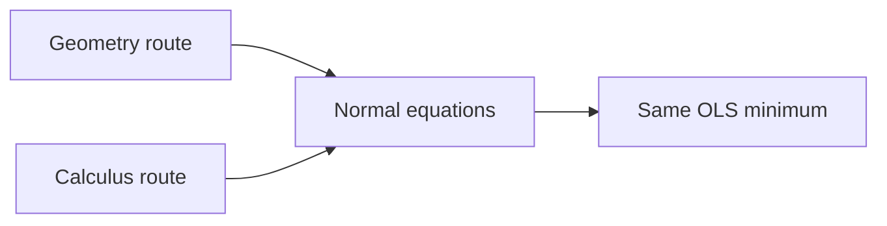
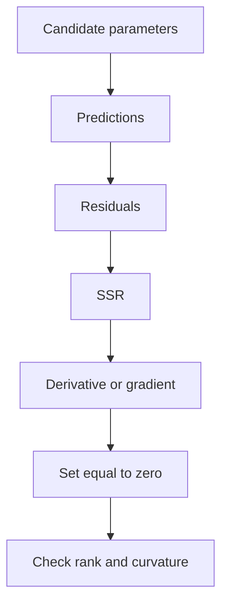
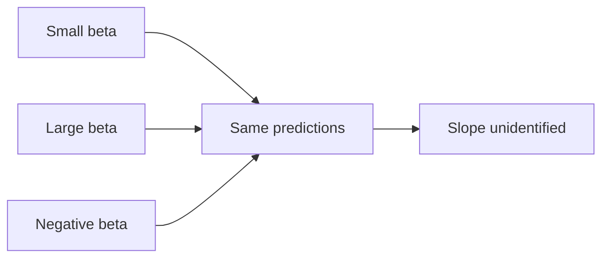
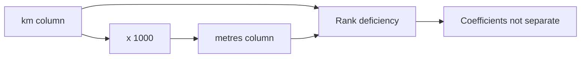

# Day 5 Part 1 Guide: Deriving OLS With Calculus

## Conceptual heavy-lifting before building `fit()`

This guide accompanies `SRC/chapter1.md`, especially Day 1 and Day 5. It is designed for one purpose: make the calculus derivation of ordinary least squares feel connected, checkable, and interpretable before any implementation work begins.

The central message is:

> OLS chooses the parameter values that minimise squared residuals. Geometry says the fitted vector is the projection of `y` onto the column space of `X`. Calculus says the minimum is where the derivative or gradient of the squared-error objective is zero. Both routes lead to the same normal equations.

Those normal equations are:

$$
X^TX\hat{\beta}=X^Ty.
$$

If a calculus derivation gives a different equation, the likely problem is algebra, shape handling, or a mistaken derivative rule.

---

## 1. The Day 1 Thread: What Are We Trying To Estimate?

Before deriving anything, keep the Day 1 distinction visible.

| Layer | Question | What OLS can settle by itself | What OLS cannot settle by itself |
|---|---|---|---|
| Algebra | Did we minimise squared residuals correctly? | Yes, if the numerical problem is well posed and solved correctly | Whether the coefficient is stable, generalisable, or causal |
| Statistical generalisation | Does this sample support claims about other projects? | Not by algebra alone | Sampling bias, future drift, uncertainty, heteroskedasticity, clustered errors |
| Causal interpretation | What would happen under an intervention? | Not by algebra alone | Counterfactual identification, confounding, design validity |

An **estimand** is the exact quantity the analysis is trying to estimate. Without an estimand, a regression coefficient is just a number produced by a calculation.

Examples from the MHP cost setting:

- Prediction estimand: expected final project cost, in million PKR, for a newly approved project using design-stage information.
- Explanation estimand: adjusted cost difference associated with one extra kilometre from an all-weather road, conditional on planned capacity and measured terrain.
- Causal estimand: average change in final cost caused by completing access-road improvement before civil works among approved remote projects.

OLS can help with all three only after the job is defined. The same formula does not make the same claim in all three settings.

---

## 2. The Object Being Minimized

For each project:

$$
\text{residual}_i = y_i-\hat{y}_i.
$$

OLS minimises the sum of squared residuals:

$$
S=\sum_i(y_i-\hat{y}_i)^2.
$$

Why square the residuals?

- Positive and negative errors do not cancel.
- Large errors are penalised more strongly.
- The resulting objective is smooth and differentiable.
- The matrix version leads to a clean projection and optimisation problem.

The calculus plan is always the same:

1. Write the objective as a function of the unknown parameter or parameter vector.
2. Differentiate.
3. Set the derivative or gradient to zero.
4. Check that the stationary point is a minimum.
5. State the conditions under which the solution is unique and meaningful.

---

## 3. Warm-Up: One Parameter, No Intercept

Start with the simplest linear model:

$$
\hat{y}_i=\beta x_i.
$$

The objective is:

$$
S(\beta)=\sum_i(y_i-\beta x_i)^2.
$$

Expand one squared term:

$$
(y_i-\beta x_i)^2
=y_i^2-2\beta x_iy_i+\beta^2x_i^2.
$$

Sum over all observations:

$$
S(\beta)
=\sum_i y_i^2
-2\beta\sum_i x_iy_i
+\beta^2\sum_i x_i^2.
$$

This is a one-variable quadratic in `\beta`:

$$
S(\beta)=a-2b\beta+c\beta^2,
$$

where:

$$
a=\sum_i y_i^2,\qquad
b=\sum_i x_iy_i,\qquad
c=\sum_i x_i^2.
$$

Differentiate:

$$
\frac{dS}{d\beta}
=-2\sum_i x_iy_i
+2\beta\sum_i x_i^2.
$$

Set the derivative to zero:

$$
-2\sum_i x_iy_i
+2\hat{\beta}\sum_i x_i^2=0.
$$

Solve:

$$
\hat{\beta}
=
\frac{\sum_i x_iy_i}{\sum_i x_i^2}.
$$

The second derivative is:

$$
\frac{d^2S}{d\beta^2}=2\sum_i x_i^2.
$$

If at least one `x_i` is not zero, then `\sum_i x_i^2>0`, so the stationary point is a true minimum.

### Plain-Language Meaning

The numerator, `\sum_i x_iy_i`, measures how much `x` and `y` point in the same direction when the fitted line is forced through the origin. The denominator, `\sum_i x_i^2`, measures how much `x` is available to scale.

If every `x_i=0`, then all predictions are:

$$
\hat{y}_i=\beta\cdot0=0.
$$

Changing `\beta` changes nothing. The data contain no information about the slope through the origin.

---

## 4. One Feature With an Intercept

Now use the usual one-feature regression line:

$$
\hat{y}_i=\beta_0+\beta_1x_i.
$$

The objective is:

$$
S(\beta_0,\beta_1)
=\sum_i(y_i-\beta_0-\beta_1x_i)^2.
$$

There are two unknowns, so there are two partial derivatives.

### 4.1 Intercept Partial

Differentiate with respect to `\beta_0`:

$$
\frac{\partial S}{\partial\beta_0}
=-2\sum_i(y_i-\beta_0-\beta_1x_i).
$$

Set it to zero:

$$
\sum_i(y_i-\hat{\beta}_0-\hat{\beta}_1x_i)=0.
$$

Expand:

$$
\sum_i y_i-n\hat{\beta}_0-\hat{\beta}_1\sum_i x_i=0.
$$

Divide by `n`:

$$
\bar{y}-\hat{\beta}_0-\hat{\beta}_1\bar{x}=0.
$$

Rearrange:

$$
\hat{\beta}_0=\bar{y}-\hat{\beta}_1\bar{x}.
$$

This proves:

$$
\hat{\beta}_0+\hat{\beta}_1\bar{x}=\bar{y}.
$$

So the fitted line with an intercept passes exactly through:

$$
(\bar{x},\bar{y}).
$$

This is not an approximation. It follows directly from the intercept first-order condition.

### 4.2 Slope Partial

The slope partial is:

$$
\frac{\partial S}{\partial\beta_1}
=-2\sum_i x_i(y_i-\beta_0-\beta_1x_i).
$$

After substituting:

$$
\hat{\beta}_0=\bar{y}-\hat{\beta}_1\bar{x},
$$

and simplifying, the slope becomes:

$$
\hat{\beta}_1
=
\frac{\sum_i(x_i-\bar{x})(y_i-\bar{y})}
{\sum_i(x_i-\bar{x})^2}.
$$

### 4.3 What the Slope Formula Is Saying

The numerator is centered co-movement:

$$
\sum_i(x_i-\bar{x})(y_i-\bar{y}).
$$

It is large and positive when projects with above-average `x` tend to have above-average `y`, and projects with below-average `x` tend to have below-average `y`.

The denominator is centered variation in `x`:

$$
\sum_i(x_i-\bar{x})^2.
$$

It tells us whether `x` actually changes across observations.

If every `x_i` is identical, then:

$$
x_i-\bar{x}=0
$$

for every observation, so:

$$
\sum_i(x_i-\bar{x})^2=0.
$$

The slope is not merely numerically unstable. It is unidentified. The question "how does `y` change as `x` changes?" has no empirical content when `x` never changes.

---

## 5. Matrix OLS: The Real Generalization

For many features at once, collect all fitted parameters into a vector:

$$
\beta=
\begin{bmatrix}
\beta_0\\
\beta_1\\
\vdots\\
\beta_p
\end{bmatrix}.
$$

The design matrix `X` contains one row per project and one column per parameter. If the model includes an intercept, the first column is usually all ones.

Predictions are:

$$
\hat{y}=X\beta.
$$

Residuals are:

$$
r=y-X\beta.
$$

The squared-error objective is:

$$
S(\beta)=(y-X\beta)^T(y-X\beta).
$$

This is the vector version of squaring and summing residuals:

$$
r^Tr=\sum_i r_i^2.
$$

### 5.1 Expand the Matrix Objective

Use:

$$
(y-X\beta)^T=y^T-\beta^TX^T.
$$

Then:

$$
\begin{aligned}
S(\beta)
&=(y^T-\beta^TX^T)(y-X\beta)\\
&=y^Ty-y^TX\beta-\beta^TX^Ty+\beta^TX^TX\beta.
\end{aligned}
$$

The middle two terms are equal because both are scalars and transposes of one another:

$$
y^TX\beta=(y^TX\beta)^T.
$$

Using the transpose rule:

$$
(ABC)^T=C^TB^TA^T,
$$

we get:

$$
(y^TX\beta)^T=\beta^TX^Ty.
$$

Since a scalar equals its own transpose:

$$
y^TX\beta=\beta^TX^Ty.
$$

Therefore:

$$
S(\beta)=y^Ty-2\beta^TX^Ty+\beta^TX^TX\beta.
$$

### Shape Check

If `X` has shape `(n, p)`:

| Object | Shape |
|---|---:|
| `y` | `(n,)` or `(n, 1)` |
| `X` | `(n, p)` |
| `\beta` | `(p,)` or `(p, 1)` |
| `X\beta` | `(n,)` or `(n, 1)` |
| `X^Ty` | `(p,)` or `(p, 1)` |
| `X^TX` | `(p, p)` |
| `\beta^TX^TX\beta` | scalar |

The objective must be a scalar. If a derivation leaves a vector where `S(\beta)` should be, the shapes are wrong.

---

## 6. Differentiating With Respect to a Vector

The matrix objective is:

$$
S(\beta)=y^Ty-2\beta^TX^Ty+\beta^TX^TX\beta.
$$

Now apply three derivative facts.

### Fact 1: Constants Vanish

The term `y^Ty` does not contain `\beta`, so:

$$
\nabla_\beta(y^Ty)=0.
$$

### Fact 2: Linear Terms

For a constant vector `c`:

$$
\nabla_\beta(\beta^Tc)=c.
$$

Here:

$$
c=X^Ty.
$$

So:

$$
\nabla_\beta(-2\beta^TX^Ty)=-2X^Ty.
$$

### Fact 3: Quadratic Terms

For a constant matrix `A`:

$$
\nabla_\beta(\beta^TA\beta)=(A+A^T)\beta.
$$

In OLS:

$$
A=X^TX.
$$

This matrix is symmetric:

$$
(X^TX)^T=X^T(X^T)^T=X^TX.
$$

So:

$$
\nabla_\beta(\beta^TX^TX\beta)=2X^TX\beta.
$$

### Combine the Pieces

Therefore:

$$
\nabla_\beta S(\beta)
=-2X^Ty+2X^TX\beta.
$$

Set the gradient to zero:

$$
-2X^Ty+2X^TX\hat{\beta}=0.
$$

Divide by 2 and rearrange:

$$
X^TX\hat{\beta}=X^Ty.
$$

These are the normal equations.

---

## 7. Why the Quadratic Rule Has `A+A^T`

The rule:

$$
\nabla_\beta(\beta^TA\beta)=(A+A^T)\beta
$$

can look mysterious until you expand it.

For two parameters:

$$
A=
\begin{bmatrix}
a_{11} & a_{12}\\
a_{21} & a_{22}
\end{bmatrix},
\qquad
\beta=
\begin{bmatrix}
\beta_1\\
\beta_2
\end{bmatrix}.
$$

Then:

$$
\beta^TA\beta
=a_{11}\beta_1^2
+a_{12}\beta_1\beta_2
+a_{21}\beta_2\beta_1
+a_{22}\beta_2^2.
$$

Differentiate with respect to `\beta_1`:

$$
\frac{\partial}{\partial\beta_1}
=2a_{11}\beta_1+a_{12}\beta_2+a_{21}\beta_2.
$$

The cross-product appears twice: once from the upper-right term and once from the lower-left term. That is why both `A` and `A^T` appear.

If `A` is symmetric, then `a_{12}=a_{21}`, and the rule simplifies to:

$$
2A\beta.
$$

Because `X^TX` is always symmetric, OLS gets the simpler form.

---

## 8. Minimum, Convexity, and Positive Semidefiniteness

Setting the gradient to zero finds a stationary point. We still need to know whether it is a minimum.

The Hessian of the squared-error objective is:

$$
\nabla_\beta^2S(\beta)=2X^TX.
$$

A matrix `M` is **positive semidefinite** if, for every vector `z`:

$$
z^TMz\ge0.
$$

For `X^TX`:

$$
z^TX^TXz=(Xz)^T(Xz)=\lVert Xz\rVert_2^2\ge0.
$$

This is always nonnegative because it is a squared length.

So `X^TX` is positive semidefinite, and the SSR surface is convex. Convex means the surface has no fake local minima. Any local minimum is a global minimum.

If `X` has full column rank, then for every nonzero `z`:

$$
Xz\ne0.
$$

So:

$$
\lVert Xz\rVert_2^2>0.
$$

Then the Hessian is positive definite on parameter directions, the objective is strictly convex, and the coefficient vector is unique.

### Important Distinction

Rank deficiency can make coefficients non-unique even when fitted predictions are still uniquely determined as a projection. The model may know the fitted vector but not how to assign credit among redundant columns.

---

## 9. When Can We Solve for `\hat{\beta}`?

The normal equations are:

$$
X^TX\hat{\beta}=X^Ty.
$$

If `X^TX` is invertible:

$$
\hat{\beta}=(X^TX)^{-1}X^Ty.
$$

This requires `X` to have full column rank.

Plain language:

- no feature column is an exact copy of another;
- no feature column is an exact multiple of another;
- no feature column can be built by adding or scaling other columns;
- there are enough independent rows to estimate every parameter;
- the intercept column must not be made redundant by other columns.

If these conditions fail, the algebraic question "which coefficient vector is the unique minimiser?" may not have a unique answer.

---

## 10. Why Real Code Avoids the Explicit Inverse

The closed form:

$$
\hat{\beta}=(X^TX)^{-1}X^Ty
$$

is mathematically useful, but application code should usually not compute the inverse directly.

Preferred hierarchy:

1. Best for least squares: use a least-squares solver such as `np.linalg.lstsq(X, y, rcond=None)`.
2. Acceptable for well-conditioned full-rank normal equations: solve the system with `np.linalg.solve(X.T @ X, X.T @ y)`.
3. Avoid in application code: explicitly compute `np.linalg.inv(X.T @ X) @ X.T @ y`.

Reasons:

- Forming `X^TX` squares the condition number.
- Squaring the condition number can amplify floating-point error.
- Explicit inversion does unnecessary work.
- A least-squares solver can report rank and singular values.
- Rank and singular values help diagnose whether coefficients are separately meaningful.

This is a numerical issue, not a change in the estimand. The objective is still the same SSR minimisation problem.

---

## 11. Perfect Multicollinearity: The Rank-Failure Trap

Suppose the design matrix includes both:

$$
x_{\text{km}}
$$

and:

$$
x_{\text{m}}=1000x_{\text{km}}.
$$

The two columns contain the same information in different units. The model cannot separately identify both coefficients.

The combined contribution is:

$$
\beta_{\text{km}}x_{\text{km}}
+\beta_{\text{m}}x_{\text{m}}.
$$

Substitute `x_m=1000x_km`:

$$
\beta_{\text{km}}x_{\text{km}}
+\beta_{\text{m}}(1000x_{\text{km}})
=
(\beta_{\text{km}}+1000\beta_{\text{m}})x_{\text{km}}.
$$

Only the combined quantity:

$$
\beta_{\text{km}}+1000\beta_{\text{m}}
$$

is identified by the predictions. Infinitely many coefficient pairs can produce the same fitted values.

Example:

| `\beta_{\text{km}}` | `\beta_{\text{m}}` | Combined contribution per km |
|---:|---:|---:|
| 5 | 0.000 | 5 |
| 4 | 0.001 | 5 |
| 3 | 0.002 | 5 |
| 0 | 0.005 | 5 |

All four rows imply the same combined effect per kilometre, but the individual coefficients differ. Reading either individual coefficient as a meaningful separate estimate would be wrong.

`np.linalg.solve` may fail because `X^TX` is singular. `np.linalg.lstsq` may return one solution, often a minimum-norm solution, but "a number was returned" does not mean "the coefficient has a defensible interpretation."

The fix is conceptual and design-based:

- remove one redundant column;
- choose one unit system;
- redesign the features;
- state the estimand in terms of the identifiable quantity.

---

## 12. Connecting Back to Day 1: Algebra Is Not Explanation

Imagine OLS estimates that road distance has a positive coefficient in a cost model.

Layer 1, algebra:

> Given the specified `X` and `y`, the program found coefficients minimising SSR.

That says nothing yet about whether road distance explains cost in a defensible way.

Layer 2, statistical generalisation:

> Are these projects representative of the future or target population? Are uncertainty intervals wide? Are some districts missing? Is the relationship stable across terrain and procurement regimes?

Layer 3, causal interpretation:

> Would reducing road distance by building an access road cause cost to fall? Or is road distance partly standing in for terrain, remoteness, weather exposure, political selection, contractor availability, and transport method?

This is why the Day 1 estimand matters. If the estimand is predictive, a non-causal signal may still be useful. If the estimand is explanatory, omitted variables and correlated features threaten interpretation. If the estimand is causal, regression must be embedded in a credible causal design.

The fitted line is an algebraic object. The claim attached to it is a research-design object.

---

## 13. Common Mistakes and Corrections

| Mistake | Correction |
|---|---|
| "The normal equations are just a formula to memorise." | They come from setting the SSR gradient to zero, and also from residual orthogonality. |
| "If `lstsq` returns coefficients, the model worked." | It found a least-squares solution; rank failure may still make individual coefficients unidentified. |
| "OLS needs normally distributed residuals to fit." | Normality is not needed to minimise SSR. It enters some inference procedures, not the algebraic fit. |
| "A positive coefficient proves causation." | A coefficient is conditional association unless the design identifies a causal effect. |
| "More columns always mean more information." | Redundant columns can add no information and destroy coefficient uniqueness. |
| "The intercept is just a nuisance." | With an intercept, the residuals sum to zero and the fitted line passes through the data means. |
| "Positive semidefinite means all entries are positive." | It means `z^TMz >= 0` for every vector `z`. Entries themselves may be negative. |
| "A denominator of zero is a computer problem." | It is an identification problem: the data contain no variation in the required direction. |

---

## 14. Study Exercises

These exercises are no-code. Write answers in complete sentences before checking the answer key.

### Exercise 1: The No-Variation Slope

Suppose all projects have exactly 3 km of cable. Explain why the one-feature-with-intercept slope:

$$
\hat{\beta}_1
=
\frac{\sum_i(x_i-\bar{x})(y_i-\bar{y})}
{\sum_i(x_i-\bar{x})^2}
$$

cannot be computed. Do not say only "division by zero." Explain what the zero denominator means about the data and the estimand.

### Exercise 2: The Mean Point

Starting from:

$$
\hat{\beta}_0=\bar{y}-\hat{\beta}_1\bar{x},
$$

show in one line why the fitted line passes through `(\bar{x},\bar{y})`.

### Exercise 3: Scalar Transpose Rule

In the expansion:

$$
S(\beta)=y^Ty-y^TX\beta-\beta^TX^Ty+\beta^TX^TX\beta,
$$

explain why:

$$
y^TX\beta=\beta^TX^Ty.
$$

State the actual transpose rule being used.

### Exercise 4: Shape Audit

Assume `X` is `(8, 3)`, `y` is `(8, 1)`, and `\beta` is `(3, 1)`. Write the shapes of:

- `X\beta`
- `y-X\beta`
- `X^Ty`
- `X^TX`
- `X^TX\beta`
- `\beta^TX^Ty`

Which of these must be a scalar?

### Exercise 5: The Gradient

Starting from:

$$
S(\beta)=y^Ty-2\beta^TX^Ty+\beta^TX^TX\beta,
$$

write the gradient:

$$
\nabla_\beta S(\beta)=?
$$

Then set it to zero and recover the normal equations.

### Exercise 6: Positive Semidefinite

Define positive semidefinite precisely. Then explain why:

$$
z^TX^TXz=\lVert Xz\rVert_2^2
$$

proves that `X^TX` is positive semidefinite.

### Exercise 7: Convexity

Why does positive semidefiniteness of the Hessian imply that SSR has no local minimum that is not also global?

### Exercise 8: Full Rank and Uniqueness

What extra condition changes positive semidefinite curvature into strict curvature for OLS? Explain the condition in matrix language and plain language.

### Exercise 9: Kilometres and Metres

A model includes cable length in km and cable length in metres. Explain why individual coefficients on those two columns are not separately meaningful, even if `lstsq` returns numbers.

### Exercise 10: Estimand Check

A project director says:

> "The road-distance coefficient is positive, so bad roads cause higher MHP costs."

Rewrite this claim as:

1. a prediction claim;
2. an explanation claim;
3. a causal claim.

For each version, state what extra evidence or assumption would be needed beyond the algebraic OLS fit.

### Exercise 11: Algebra vs Statistical Generalisation

Explain why a model can minimise SSR perfectly on the eight training projects and still be a poor guide for future projects.

### Exercise 12: Algebra vs Causation

Explain why solving OLS correctly does not tell us whether reducing road distance by building an access road would reduce cost.

---

## 15. Answer Key

### Answer 1

If all `x_i` values are identical, then every `x_i-\bar{x}` equals zero. The denominator is the total variation in `x`, and that variation is zero. The data never show projects at different cable lengths, so they cannot answer how expected cost changes when cable length changes. The slope is unidentified, not merely hard for the computer to estimate.

### Answer 2

Evaluate the fitted line at `\bar{x}`:

$$
\hat{\beta}_0+\hat{\beta}_1\bar{x}
=
(\bar{y}-\hat{\beta}_1\bar{x})+\hat{\beta}_1\bar{x}
=\bar{y}.
$$

So the line passes through `(\bar{x},\bar{y})`.

### Answer 3

The term `y^TX\beta` is a scalar. A scalar equals its own transpose. Using:

$$
(ABC)^T=C^TB^TA^T,
$$

we have:

$$
(y^TX\beta)^T=\beta^TX^Ty.
$$

Therefore:

$$
y^TX\beta=\beta^TX^Ty.
$$

### Answer 4

Shapes:

| Object | Shape |
|---|---:|
| `X\beta` | `(8, 1)` |
| `y-X\beta` | `(8, 1)` |
| `X^Ty` | `(3, 1)` |
| `X^TX` | `(3, 3)` |
| `X^TX\beta` | `(3, 1)` |
| `\beta^TX^Ty` | `(1, 1)`, a scalar |

The objective terms such as `\beta^TX^Ty`, `y^Ty`, and `\beta^TX^TX\beta` must be scalars.

### Answer 5

The gradient is:

$$
\nabla_\beta S(\beta)
=-2X^Ty+2X^TX\beta.
$$

Set it to zero:

$$
-2X^Ty+2X^TX\hat{\beta}=0.
$$

Divide by 2 and rearrange:

$$
X^TX\hat{\beta}=X^Ty.
$$

### Answer 6

A matrix `M` is positive semidefinite if:

$$
z^TMz\ge0
$$

for every vector `z`. For `M=X^TX`:

$$
z^TX^TXz=(Xz)^T(Xz)=\lVert Xz\rVert_2^2.
$$

A squared length cannot be negative, so `X^TX` is positive semidefinite.

### Answer 7

The Hessian describes curvature. If the Hessian is positive semidefinite everywhere, the objective is convex. A convex bowl may have a flat bottom, but it cannot have a separate false valley. Therefore any local minimum is also a global minimum.

### Answer 8

The extra condition is full column rank of `X`. In matrix language, `Xz=0` only when `z=0`. In plain language, no column of `X` can be built exactly from the other columns. Then:

$$
\lVert Xz\rVert_2^2>0
$$

for every nonzero `z`, giving strict curvature and a unique coefficient vector.

### Answer 9

Since:

$$
x_{\text{m}}=1000x_{\text{km}},
$$

the two columns carry the same information. Predictions depend only on:

$$
\beta_{\text{km}}+1000\beta_{\text{m}}.
$$

Many coefficient pairs produce the same fitted values. `lstsq` can return one solution, but the separate km and metre coefficients are not identifiable as distinct quantities.

### Answer 10

Prediction claim:

> Road distance helps predict final MHP cost for new projects similar to the training data.

Needed beyond algebra: validation on genuinely new or held-out projects, stable measurement, and evidence that the target cases resemble the training cases.

Explanation claim:

> Among projects with the same included features, greater road distance is associated with higher final cost.

Needed beyond algebra: a clearly stated conditioning set, uncertainty estimates, sensitivity to omitted variables, and checks for multicollinearity or instability.

Causal claim:

> Reducing road distance through access-road improvement would reduce final MHP cost.

Needed beyond algebra: a credible causal design, counterfactual comparison, confounding control, timing discipline, and assumptions connecting the observed comparison to the intervention effect.

### Answer 11

Training SSR measures fit to the projects used to estimate the coefficients. A model can fit those projects well because of chance patterns, unusual district composition, repeated design templates, or overfitting. Generalisation asks whether the relationship holds for future or target-population projects, which requires validation and sampling assumptions beyond the algebraic fit.

### Answer 12

OLS estimates conditional associations in the observed data. Building an access road is an intervention. To know its effect, we need to compare what would happen under road improvement with what would happen without it for the same target projects. That counterfactual is not supplied by the normal equations. Terrain, remoteness, contractor availability, and project selection may affect both road distance and cost, so a correct OLS calculation alone cannot identify the causal effect.

---

## 16. Final Mental Checklist

Before moving to the `fit()` implementation, you should be able to say:

1. The scalar OLS solution comes from differentiating a quadratic in one parameter.
2. With an intercept, the fitted line passes exactly through `(\bar{x},\bar{y})`.
3. The matrix objective expands to a scalar quadratic in `\beta`.
4. The gradient is `-2X^Ty+2X^TX\beta`.
5. Setting that gradient to zero gives `X^TX\hat{\beta}=X^Ty`.
6. `X^TX` is positive semidefinite because `z^TX^TXz` is a squared length.
7. Full column rank gives a unique coefficient vector.
8. `lstsq` returning numbers does not make rank-deficient coefficients meaningful.
9. Algebraic correctness is not statistical generalisation.
10. Algebraic correctness is not causal identification.
