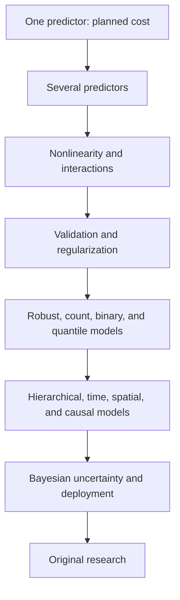
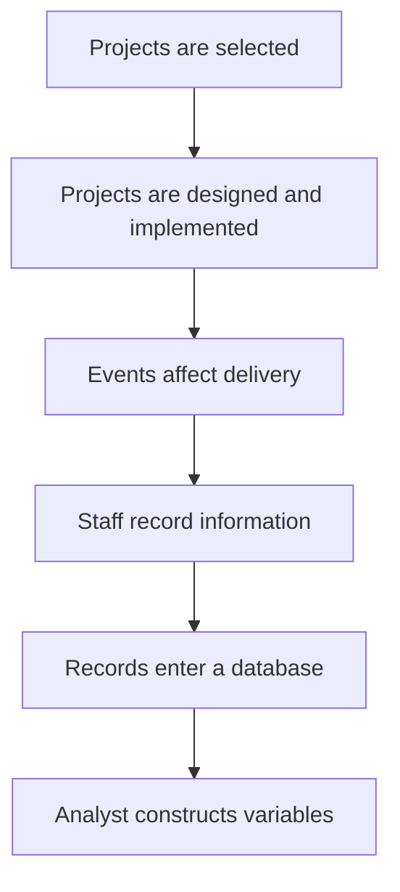
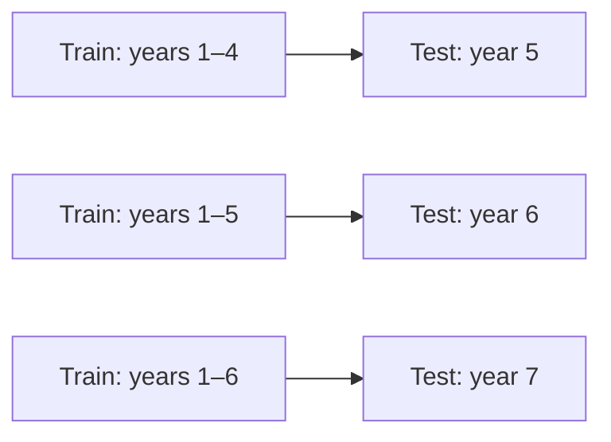
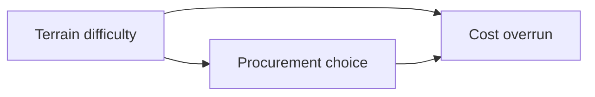
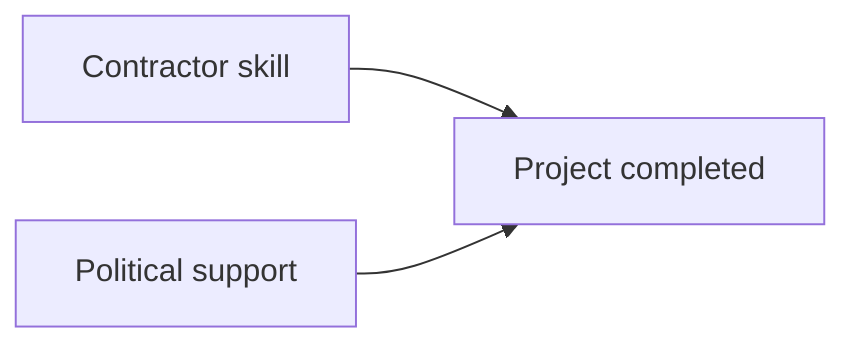
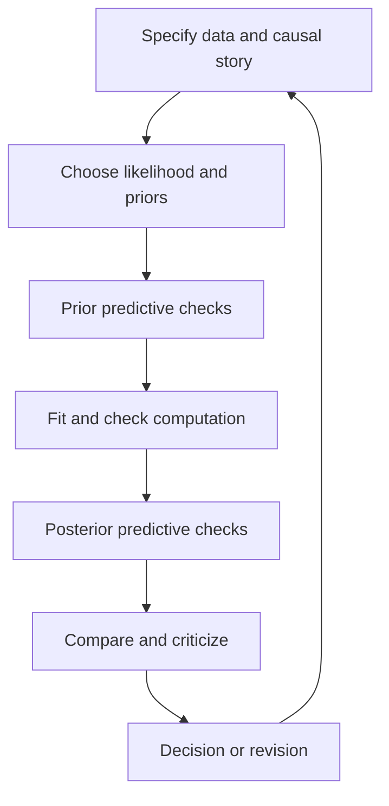

# Regression: From First Principles to Research Practice

## A project-based guide to mathematics, statistics, Python, machine learning, causal reasoning, and original research

---

## Preface

Regression is not one formula and it is not merely a command in a software package. It is a family of ways to describe relationships, estimate unknown quantities, predict outcomes, quantify uncertainty, test explanations, and make decisions under imperfect information.

This guide begins with no assumed knowledge of Python, linear algebra, calculus, probability, or statistics. It aims much higher than introductory familiarity. By the end, you should be able to:

- formulate a regression problem from a real decision;
- derive ordinary least squares algebraically, geometrically, and through calculus;
- implement core estimators in raw Python and NumPy;
- explain exactly what common software is calculating;
- distinguish description, prediction, explanation, and causal inference;
- diagnose when a model is misleading;
- choose among linear, generalized linear, robust, regularized, hierarchical, Bayesian, time-series, survival, spatial, and nonlinear models;
- evaluate models without data leakage;
- communicate uncertainty honestly;
- reproduce and review research;
- identify a defensible original research question and carry it through to a paper.

No finite book can literally contain every result ever published about regression. “No topic spared” is therefore interpreted here in a rigorous way: no foundational idea is skipped, all major branches are mapped, advanced specializations are introduced deeply enough for you to enter their research literature, and the limits of each method are made explicit.

### Navigation map

| Part | Chapters | Destination |
|---|---:|---|
| I. Asking a Regression Question | 1–2 | Purpose, measurement, data generation |
| II. Python as a Language for Evidence | 3–4 | Programming, validation, description |
| III. Algebra and Functions | 5–6 | Lines and simple OLS |
| IV. Linear Algebra | 7–8 | Vectors, matrices, projections, SVD |
| V. Calculus and Optimization | 9–10 | Derivatives and gradient descent |
| VI. Probability and Inference | 11–13 | Sampling, uncertainty, linear-model theory |
| VII. Linear Regression in Practice | 14–16 | Interpretation, diagnostics, features |
| VIII. Prediction and Validation | 17–18 | Metrics, splitting, generalization |
| IX. Regularization | 19–21 | Ridge, lasso, elastic net, dimension reduction |
| X. Extended Outcome Families | 22–29 | Robust, quantile, GLM, count, nonlinear, GAM |
| XI. Structured Data | 30–36 | Weights, hierarchy, panels, time, space, survival, surveys |
| XII. Causal Inference | 37–44 | DAGs, experiments, adjustment, DiD, RD, IV |
| XIII. Bayesian Regression | 45–48 | Priors, MCMC, workflow, advanced models |
| XIV. Machine Learning | 49–54 | Local models, ensembles, kernels, neural nets, uncertainty, ethics |
| XV. Professional Practice | 55–59 | Python engineering, reproducibility, deployment, reporting, design |
| XVI. Complete Capstone | 60–61 | Full build and synthetic dataset |
| XVII. Research | 62–65 | Questions, topic bank, frontiers, literature |
| XVIII. Mastery Assessment | 66 | Proof, code, failure lab, defense |
| Appendices | A–E | Solutions, formulas, glossary, review, specialized branches |

---

## The central project

Throughout the guide, you will build one system:

> **The Mountain Infrastructure Cost and Delivery Model**

Its initial purpose is to estimate the final cost of a rural infrastructure project before construction begins. It later expands to predict cost overruns and delays, quantify risks, explain systematic differences, evaluate policy changes, model variation among districts and contractors, produce prediction intervals, and support decisions without pretending that a model can replace local judgment.

The imagined dataset contains rural roads, drinking-water schemes, irrigation channels, schools, bridges, and micro-hydels from mountainous districts. Each row is one project. Variables include:

| Variable | Meaning | Type |
|---|---|---|
| `project_id` | Unique identifier | Identifier |
| `district` | District where implemented | Categorical |
| `project_type` | Road, bridge, water, school, irrigation, hydel | Categorical |
| `planned_cost_m` | Approved cost, millions of rupees | Continuous |
| `final_cost_m` | Final cost, millions of rupees | Continuous outcome |
| `planned_days` | Contracted duration | Count |
| `actual_days` | Actual duration | Count outcome |
| `length_km` | Relevant physical length | Continuous |
| `capacity` | Design capacity in suitable units | Continuous |
| `altitude_m` | Site altitude | Continuous |
| `road_access_km` | Distance from all-weather road | Continuous |
| `slope_deg` | Mean terrain slope | Continuous |
| `security_incidents` | Incidents during implementation | Count |
| `community_score` | Pre-project organization score | Ordinal/continuous |
| `contractor_experience` | Completed comparable projects | Count |
| `procurement_method` | Competitive, community, single-source | Categorical |
| `start_date` | Construction start | Date/time |
| `flood_exposure` | Estimated hazard exposure | Continuous |
| `completed` | Completion indicator | Binary outcome |

This is an educational dataset, not evidence about any real programme. When you later work with administrative data, you must investigate how each field was produced, whose interests shaped it, what is missing, and whether apparently precise numbers are comparable.

### The model grows in stages



At every stage you will ask:

1. What decision is this model meant to improve?
2. What exactly is the outcome?
3. What information would genuinely be available at prediction time?
4. What process generated the data?
5. What mathematical objective is being optimized?
6. What assumptions turn the calculation into a meaningful claim?
7. How could the conclusion be wrong?
8. Who benefits or is harmed if the model is used?

---

## The learning contract

Each important idea is approached in five ways:

1. **Plain language:** what problem the idea solves.
2. **Mathematics:** the precise statement and derivation.
3. **Geometry or mechanism:** what the mathematics is doing.
4. **Raw implementation:** enough Python to expose the computation.
5. **Professional implementation:** appropriate scientific libraries, tests, and diagnostics.

Do not rush to `fit()`. If you cannot explain the objective function, the assumptions, and the origin of the data, a successful software command proves very little.

### Four levels of exercise

- **Foundation:** confirm that you understand the definitions and mechanics.
- **Builder:** write or modify code and derive results.
- **Analyst:** interpret a realistic, ambiguous situation.
- **Research:** challenge assumptions, compare methods, or design an original study.

### A suggested 36-week path

| Phase | Weeks | Main outcome |
|---|---:|---|
| Orientation and Python | 1–4 | Load, inspect, clean, and summarize project data |
| Algebra, functions, and geometry | 5–7 | Understand lines, vectors, matrices, and projections |
| Calculus and optimization | 8–9 | Derive loss minimization and gradient descent |
| Probability and statistical inference | 10–13 | Quantify sampling uncertainty |
| Linear regression mastery | 14–18 | Fit, diagnose, and interpret OLS responsibly |
| Prediction and regularization | 19–22 | Validate models and control overfitting |
| Extended regression families | 23–27 | Model binary, count, skewed, and conditional outcomes |
| Structured data | 28–31 | Handle groups, panels, time, space, and survival |
| Causal and Bayesian reasoning | 32–34 | Separate association from intervention and model uncertainty |
| Capstone research | 35–36+ | Produce a reproducible study |

Some learners will need more than a week for a phase. Mastery is determined by what you can explain and build, not by the calendar.

---

# Part I — Asking a Regression Question

## Chapter 1 — What regression is

### 1.1 A relationship, an expectation, and a distribution

Suppose \(Y\) is final project cost and \(X\) is planned cost. A first model is

\[
Y_i = \beta_0 + \beta_1 X_i + \varepsilon_i.
\]

Here:

- \(i\) identifies a project;
- \(\beta_0\) is the intercept;
- \(\beta_1\) is the slope;
- \(\varepsilon_i\) contains whatever makes project \(i\) differ from the line.

The expression is often better understood as a statement about a conditional mean:

\[
\mathbb{E}[Y_i\mid X_i=x] = \beta_0+\beta_1x.
\]

It says that among projects with the same planned cost \(x\), their average final cost is represented by a line. It does **not** say every project lies on that line. It does not by itself say that increasing the planned allocation would cause final cost to rise by \(\beta_1\). It also does not say the line is the full conditional distribution.

Three increasingly rich regression questions are:

1. **Mean regression:** How does the conditional average of \(Y\) vary with \(X\)?
2. **Quantile regression:** How does, for example, the conditional 90th percentile vary with \(X\)?
3. **Distributional regression:** How do the location, scale, and perhaps shape of the whole conditional distribution vary?

### 1.2 Four purposes that must not be confused

| Purpose | Typical question | Main criterion |
|---|---|---|
| Description | How are cost and remoteness associated in these records? | Faithful summary |
| Prediction | What will a new project's final cost probably be? | Out-of-sample performance and calibration |
| Explanation | What mechanism could produce the observed pattern? | Theory, rival explanations, evidence |
| Causal inference | What would happen if procurement method changed? | Identification of a counterfactual |

A variable can be an excellent predictor without being causal. A causal effect can be important while adding little predictive accuracy. A descriptive association can be completely valid for the dataset but not generalize to another time or district.

### 1.3 Population, sample, and data-generating process

The **population** is the set of cases about which you want to make a statement. The **sample** is what you observed. The **data-generating process** includes both the real-world process and the recording process:



Bias can enter at every arrow. Projects may be selected politically; difficult projects may be abandoned and disappear from completion records; definitions may change; staff may under-report delays; inflation may make costs across years incomparable; the analyst may delete inconvenient observations.

### 1.4 Units of observation and units of analysis

One row might be:

- a project;
- a project-month;
- a contract;
- a village;
- a household affected by a project;
- an inspection.

The choice changes the regression and its uncertainty. If multiple rows belong to one project, treating them as independent projects will usually understate uncertainty.

### 1.5 The first project specification

Write a one-page **model charter** before coding:

```text
Decision:
At preliminary approval, identify projects whose final cost is unusually uncertain.

Outcome:
Final inflation-adjusted cost in millions of rupees.

Prediction time:
The day of preliminary approval.

Available predictors:
Project type, planned scope, location, terrain, access, hazard exposure,
and information known about the proposed delivery arrangement.

Excluded predictors:
Variables created after approval, including actual duration and final variations.

Users:
Engineering, programme, finance, and community-engagement teams.

Costs of error:
Underprediction may cause financing gaps; overprediction may block worthwhile projects.

Scope:
Decision support, not automatic approval or rejection.
```

This charter prevents a common failure: developing an accurate model using information that would not exist when the real decision is made.

### Exercises

1. **Foundation:** For each question below, classify the primary purpose as description, prediction, explanation, or causality.
   - Are road projects more expensive than water projects in the database?
   - What final cost should be provisioned for a proposed bridge?
   - Why do projects in steep terrain experience overruns?
   - Would changing procurement rules reduce overruns?
2. **Foundation:** Define a population and sample for a study of micro-hydel construction costs.
3. **Builder:** Draft a model charter for predicting `actual_days`.
4. **Analyst:** Explain why `final_number_of_variation_orders` may be data leakage when predicting cost at approval.
5. **Analyst:** A database excludes cancelled projects. Identify two selection biases this may introduce.
6. **Research:** Draw a data-generating-process diagram for a development programme you know. Mark where political, administrative, and measurement processes enter.
7. **Research:** Formulate the same substantive concern as one descriptive, one predictive, and one causal question.

---

## Chapter 2 — Variables, measurement, and data quality

### 2.1 Variable roles

- **Outcome/response/target \(Y\):** what is modeled.
- **Predictor/feature/covariate \(X\):** information used to model \(Y\).
- **Exposure:** opportunity for an event to occur, such as project-months at risk.
- **Confounder:** a cause of both an exposure and outcome in a causal question.
- **Mediator:** lies on a causal pathway.
- **Collider:** a common effect of two variables; conditioning on it can create bias.
- **Identifier:** labels a case but usually should not be treated as a meaningful numeric predictor.
- **Weight:** states how much an observation contributes, for a design-based or precision-based reason.

These roles are determined by the question and causal structure, not by the column's data type.

### 2.2 Measurement scales

| Scale | Example | Meaningful operations |
|---|---|---|
| Nominal | District, project type | Equality, counts |
| Ordinal | Low/medium/high cohesion | Order, not necessarily equal spacing |
| Interval | Calendar year in some uses | Differences |
| Ratio | Cost, distance, duration | Differences and ratios |

Do not automatically encode `road=1`, `water=2`, `school=3`; this invents an order and equal spacing.

### 2.3 Reliability and validity

- **Reliability:** repeated measurement gives similar values.
- **Construct validity:** the variable represents the concept it claims to represent.
- **Criterion validity:** it agrees with a credible external criterion.
- **Content validity:** it covers the relevant dimensions of a concept.

A perfectly reliable `community_score` may consistently measure the preferences of the assessor rather than community organization. Precision is not validity.

### 2.4 Measurement error

If a continuous outcome has random measurement noise, standard errors increase. Classical random measurement error in a predictor often attenuates the estimated slope toward zero. Systematic error can bias estimates in any direction.

Suppose the true predictor is \(X^\ast\), but you observe

\[
X = X^\ast + u,
\]

where \(u\) is independent noise. In a simple classical setting, the observed slope is approximately

\[
\hat\beta_1 \approx \beta_1
\frac{\operatorname{Var}(X^\ast)}
{\operatorname{Var}(X^\ast)+\operatorname{Var}(u)}.
\]

The multiplier is the **reliability ratio**. This is one reason why “insignificant” does not necessarily mean “unimportant.”

### 2.5 Missing data

Let \(R=1\) if a value is observed.

- **MCAR:** missingness is unrelated to observed or unobserved relevant data.
- **MAR:** conditional on observed variables, missingness is unrelated to the missing value.
- **MNAR:** missingness still depends on unobserved values after conditioning.

Complete-case deletion is not a neutral cleaning step. It changes the analyzed population and can bias results. Later you will use missingness indicators cautiously, multiple imputation, inverse-probability weighting, and sensitivity analysis.

### 2.6 Data provenance

For every variable create a data dictionary containing:

- operational definition;
- unit and allowed range;
- source system or form;
- who records it and when;
- changes in definition;
- missing-value codes;
- known incentives for misreporting;
- transformations applied;
- whether it is known at the intended prediction time.

### Exercises

1. **Foundation:** Classify every variable in the central project by scale.
2. **Builder:** Write operational definitions for “community organization” and “contractor experience.”
3. **Analyst:** Explain why administrative “completion” may differ from physical, financial, and functional completion.
4. **Analyst:** Give one MCAR, one plausible MAR, and one MNAR story for missing `community_score`.
5. **Builder:** Create a data-dictionary template with at least ten fields.
6. **Research:** Design a validation study for `slope_deg` measured by field staff.
7. **Research:** Explain how pressure to report successful projects could affect both outcomes and predictors.

---

# Part II — Python as a Language for Evidence

## Chapter 3 — Programming from zero

### 3.1 What a program is

A program is a precise sequence of operations on representations of information. Python code is not mathematical truth; it is an executable argument that can contain mistakes. Good analytical programming makes assumptions visible, catches invalid states, and permits another person to reproduce the result.

Use a modern Python 3 release, a project-specific virtual environment, and a notebook or editor. Exact installation commands vary by operating system, so learn the ideas:

- the Python interpreter executes code;
- a package manager installs libraries;
- a virtual environment isolates project dependencies;
- a notebook mixes code, results, and prose;
- a `.py` module stores reusable code;
- a version-control system records changes.

### 3.2 Values, names, and types

```python
project_name = "Ayun Water Supply"   # str
planned_cost_m = 18.5                # float
planned_days = 180                   # int
is_completed = False                 # bool
```

The equals sign is assignment here, not a mathematical equality. It binds a name to an object.

```python
cost_overrun_m = final_cost_m - planned_cost_m
cost_overrun_rate = cost_overrun_m / planned_cost_m
```

Important numeric issues:

- floating-point numbers are finite approximations;
- division by zero must be handled;
- rupee amounts may require decimal arithmetic in financial systems;
- missingness must not silently become zero.

### 3.3 Collections

```python
costs = [18.5, 22.1, 7.8]  # list: ordered and mutable

project_types = {"road", "water", "school"}  # set: unique values

project = {
    "project_id": "KP-001",
    "project_type": "water",
    "planned_cost_m": 18.5,
    "final_cost_m": 21.2,
}  # dict: key-value mapping

location = (35.8, 71.8)  # tuple: ordered and conventionally immutable
```

### 3.4 Conditions and loops

```python
if project["final_cost_m"] > project["planned_cost_m"]:
    status = "over budget"
else:
    status = "within budget"

total = 0.0
for value in costs:
    total = total + value

mean_cost = total / len(costs)
```

Trace the loop by hand. After each iteration, state the values of `value` and `total`. This habit is more valuable than memorizing syntax.

### 3.5 Functions

```python
def overrun_rate(planned_cost, final_cost):
    """Return proportional cost overrun."""
    if planned_cost <= 0:
        raise ValueError("planned_cost must be positive")
    return (final_cost - planned_cost) / planned_cost
```

A good function:

- does one coherent job;
- has explicit inputs and output;
- checks important preconditions;
- has a meaningful name;
- can be tested independently;
- does not depend unnecessarily on hidden global state.

### 3.6 Errors are information

```python
try:
    rate = overrun_rate(0, 12)
except ValueError as error:
    print(f"Cannot compute rate: {error}")
```

Do not use `except: pass`. It converts evidence of failure into silent corruption.

### 3.7 Reading tabular data

With the standard library:

```python
import csv

projects = []
with open("kp_projects.csv", encoding="utf-8", newline="") as file:
    reader = csv.DictReader(file)
    for row in reader:
        projects.append(row)
```

CSV values initially arrive as strings. Conversion must be explicit:

```python
def parse_float(text):
    text = text.strip()
    if text == "":
        return None
    return float(text)
```

With pandas:

```python
import pandas as pd

df = pd.read_csv("kp_projects.csv")
print(df.head())
print(df.info())
print(df.describe(include="all"))
```

Pandas is convenient, but convenience can hide assumptions. Inspect inferred types and missing values.

### 3.8 Assertions and tests

```python
def test_overrun_rate():
    actual = overrun_rate(100, 125)
    expected = 0.25
    assert abs(actual - expected) < 1e-12
```

Test:

- an ordinary case;
- boundaries;
- invalid input;
- missing data;
- invariants, such as a total equalling the sum of its parts.

### Project increment 1 — an auditable data intake

Write a program that:

1. reads the project table;
2. converts numeric columns;
3. rejects duplicate `project_id` values;
4. checks that planned costs and durations are positive;
5. checks category values against a declared set;
6. reports missingness without deleting anything;
7. creates `overrun_m`, `overrun_rate`, and `delay_days`;
8. writes a validation report.

### Exercises

1. **Foundation:** Predict the type and value of `7 / 2`, `7 // 2`, and `7 % 2`.
2. **Foundation:** Trace a loop that computes the maximum of a list.
3. **Builder:** Write `mean(values)` without using `sum`.
4. **Builder:** Write `variance(values, sample=True)` using a loop.
5. **Builder:** Write a parser that accepts `"1,250.5"` and returns `1250.5`.
6. **Builder:** Write tests for negative costs, empty lists, and missing strings.
7. **Analyst:** Explain why replacing all missing values with zero is dangerous.
8. **Builder:** Read a CSV and count projects by type without pandas.
9. **Builder:** Repeat the count with pandas and compare results.
10. **Research:** Write a reproducibility note recording software version, raw-data checksum, run date, and transformations.

---

## Chapter 4 — Describing data before modeling it

### 4.1 Centre

For observations \(x_1,\ldots,x_n\), the arithmetic mean is

\[
\bar{x}=\frac{1}{n}\sum_{i=1}^{n}x_i.
\]

The median is the middle ordered value. The mean answers a balancing-point question and uses every magnitude; the median answers a rank question and resists extreme values.

### 4.2 Spread

Population variance:

\[
\sigma^2=\frac{1}{N}\sum_{i=1}^{N}(x_i-\mu)^2.
\]

Sample variance:

\[
s^2=\frac{1}{n-1}\sum_{i=1}^{n}(x_i-\bar{x})^2.
\]

The denominator \(n-1\) corrects the average downward bias that occurs because the sample mean has already been fitted. Standard deviation is \(s\). The interquartile range is \(Q_{0.75}-Q_{0.25}\).

### 4.3 Covariance and correlation

Sample covariance:

\[
s_{xy}=\frac{1}{n-1}\sum_{i=1}^{n}(x_i-\bar{x})(y_i-\bar{y}).
\]

Pearson correlation:

\[
r_{xy}=\frac{s_{xy}}{s_xs_y}.
\]

Correlation is unitless and lies between \(-1\) and \(1\). It measures linear association, not causation. A correlation near zero can coexist with a strong nonlinear relationship. Aggregated data can reverse the pattern within groups: Simpson's paradox.

### 4.4 Distributions and visual checks

Always inspect:

- histograms or density plots;
- empirical cumulative distributions;
- boxplots by meaningful groups;
- scatterplots of outcomes against predictors;
- missingness patterns;
- values over time and by data source.

```python
import matplotlib.pyplot as plt

fig, axes = plt.subplots(1, 2, figsize=(11, 4))
axes[0].hist(df["final_cost_m"].dropna(), bins=30)
axes[0].set(title="Final cost", xlabel="Millions of rupees")

axes[1].scatter(df["planned_cost_m"], df["final_cost_m"], alpha=0.5)
axes[1].set(
    title="Planned and final cost",
    xlabel="Planned cost (millions)",
    ylabel="Final cost (millions)",
)
plt.tight_layout()
```

Axes, units, missing values, and transformations must be stated. A beautiful chart with an undisclosed truncated axis can be a sophisticated lie.

### 4.5 Anscombe's warning

Datasets can have almost identical means, variances, correlations, and regression lines yet radically different shapes. Summary statistics never replace plots.

### Project increment 2 — the data audit

Produce an audit with:

- row and column counts;
- duplicate identifiers;
- distributions and impossible values;
- missingness by variable, district, year, and project type;
- group summaries;
- scatterplots and time plots;
- a log of every correction;
- a “do not model yet” list of unresolved concerns.

### Exercises

1. **Foundation:** Calculate the mean, median, sample variance, and IQR of \(2,3,3,4,13\).
2. **Builder:** Implement covariance and Pearson correlation without NumPy.
3. **Builder:** Prove computationally that correlation is unchanged if cost in rupees is converted to millions.
4. **Analyst:** Construct a five-point dataset with a strong pattern but near-zero Pearson correlation.
5. **Analyst:** Compare mean and median overrun. What decision would each support?
6. **Builder:** Make a missingness table by district.
7. **Analyst:** Investigate whether a sudden change in recorded costs aligns with a change in forms or staff.
8. **Research:** Create a small example of Simpson's paradox using project type and district.

---

# Part III — Algebra, Functions, and the Shape of Models

## Chapter 5 — Algebra for regression

### 5.1 Expressions and equations

An expression such as \(3x+2\) represents a quantity. An equation such as

\[
3x+2=17
\]

asserts equality. Solving preserves equality by performing the same valid operation on both sides:

\[
3x=15,\qquad x=5.
\]

Regression repeatedly uses rearrangement, summation, powers, logarithms, and exponentials. Fluency matters because notation should reveal reasoning, not block it.

### 5.2 Functions

A function maps each allowed input to one output:

\[
f(x)=\beta_0+\beta_1x.
\]

The **domain** is the set of allowed inputs; the **range** is the set of possible outputs. A fitted line may mathematically accept negative planned costs even though they are outside the meaningful domain.

### 5.3 Slope and intercept

For two distinct points \((x_1,y_1)\) and \((x_2,y_2)\),

\[
\text{slope}=\frac{y_2-y_1}{x_2-x_1}.
\]

In \(y=\beta_0+\beta_1x\):

- \(\beta_1\) is the change in modeled \(y\) for a one-unit change in \(x\);
- \(\beta_0\) is modeled \(y\) at \(x=0\).

The intercept can be needed mathematically without having a useful substantive interpretation. Centering \(x\) can make it meaningful:

\[
x_i^c=x_i-\bar{x}.
\]

Then the intercept represents the modeled outcome at average \(x\).

### 5.4 Powers, roots, exponentials, and logarithms

\[
x^a x^b=x^{a+b},\qquad (x^a)^b=x^{ab},\qquad x^{-a}=\frac{1}{x^a}.
\]

For \(x>0\),

\[
\log(ab)=\log a+\log b,\qquad
\log(a^b)=b\log a,\qquad
\exp(\log x)=x.
\]

Common regression forms:

| Model | Interpretation of \(\beta_1\) |
|---|---|
| \(Y=\beta_0+\beta_1X\) | One-unit \(X\) increase corresponds to \(\beta_1\)-unit \(Y\) increase |
| \(\log Y=\beta_0+\beta_1X\) | One-unit \(X\) increase corresponds approximately to \(100\beta_1\)% change in \(Y\); exact change \(100(e^{\beta_1}-1)\)% |
| \(Y=\beta_0+\beta_1\log X\) | A 1% increase in \(X\) corresponds approximately to \(0.01\beta_1\) units of \(Y\) |
| \(\log Y=\beta_0+\beta_1\log X\) | \(\beta_1\) is an elasticity: 1% higher \(X\) corresponds to about \(\beta_1\)% higher \(Y\) |

Back-transforming a predicted \(\log Y\) by exponentiation generally estimates a conditional median under common log-normal assumptions, not automatically the conditional mean. The mean requires a correction based on the error distribution, such as a smearing estimator.

### 5.5 Summation notation

\[
\sum_{i=1}^{n}x_i=x_1+x_2+\cdots+x_n.
\]

Useful rules:

\[
\sum_i (ax_i+by_i)=a\sum_i x_i+b\sum_i y_i,
\]

\[
\sum_i (x_i-\bar{x})=0.
\]

The second identity is central to least squares with an intercept.

### Exercises

1. **Foundation:** Solve \(4x-7=21\).
2. **Foundation:** Evaluate \(\sum_{i=1}^4 (2x_i+1)\) for \(x=(1,3,4,7)\).
3. **Builder:** Prove algebraically that deviations from the mean sum to zero.
4. **Builder:** Verify the proof in Python for random samples.
5. **Analyst:** Interpret \(\log(\text{cost})=2.1+0.035(\text{slope})\).
6. **Analyst:** Explain why the intercept in a cost-on-altitude regression may be extrapolative.
7. **Builder:** Center altitude and verify that fitted predictions do not change when both models contain an intercept.
8. **Research:** Compare raw-cost, log-cost, and cost-per-unit outcomes. Explain the different questions they answer.

---

## Chapter 6 — From a cloud of points to a fitted line

### 6.1 Residuals and squared error

For a proposed line,

\[
\hat{y}_i=b_0+b_1x_i.
\]

The residual is

\[
e_i=y_i-\hat{y}_i.
\]

Ordinary least squares (OLS) chooses \(b_0,b_1\) to minimize the residual sum of squares:

\[
\operatorname{RSS}(b_0,b_1)
=\sum_{i=1}^n[y_i-(b_0+b_1x_i)]^2.
\]

Squaring:

- prevents positive and negative residuals from cancelling;
- penalizes large errors strongly;
- gives a smooth objective;
- leads to tractable geometry and probability theory.

It also makes OLS sensitive to extreme outcomes.

### 6.2 Closed-form solution

The least-squares slope is

\[
\hat\beta_1=
\frac{\sum_i(x_i-\bar{x})(y_i-\bar{y})}
{\sum_i(x_i-\bar{x})^2}
=\frac{s_{xy}}{s_x^2}.
\]

The intercept is

\[
\hat\beta_0=\bar{y}-\hat\beta_1\bar{x}.
\]

The fitted line therefore passes through \((\bar{x},\bar{y})\).

### 6.3 Raw Python implementation

```python
def simple_ols(x, y):
    if len(x) != len(y):
        raise ValueError("x and y must have equal length")
    if len(x) < 2:
        raise ValueError("at least two observations are required")

    x_bar = sum(x) / len(x)
    y_bar = sum(y) / len(y)

    numerator = 0.0
    denominator = 0.0
    for x_i, y_i in zip(x, y):
        numerator += (x_i - x_bar) * (y_i - y_bar)
        denominator += (x_i - x_bar) ** 2

    if denominator == 0:
        raise ValueError("x has no variation")

    slope = numerator / denominator
    intercept = y_bar - slope * x_bar
    return intercept, slope


def predict_line(x, intercept, slope):
    return [intercept + slope * value for value in x]


def residuals(y, predictions):
    return [actual - predicted for actual, predicted in zip(y, predictions)]
```

### 6.4 A numerical example

Let

\[
x=(1,2,3), \qquad y=(2,3,5).
\]

Then \(\bar{x}=2\), \(\bar{y}=10/3\),

\[
\sum (x_i-\bar{x})(y_i-\bar{y})=3,
\quad
\sum(x_i-\bar{x})^2=2.
\]

Thus

\[
\hat\beta_1=1.5,\qquad
\hat\beta_0=\frac{1}{3}.
\]

Predictions are \(11/6,10/3,29/6\), and residuals are \(1/6,-1/3,1/6\). The residuals sum to zero.

### 6.5 Decomposing variation

With an intercept,

\[
\underbrace{\sum_i(y_i-\bar{y})^2}_{\text{TSS}}
=
\underbrace{\sum_i(\hat y_i-\bar{y})^2}_{\text{ESS}}
+
\underbrace{\sum_i(y_i-\hat y_i)^2}_{\text{RSS}}.
\]

The coefficient of determination is

\[
R^2=1-\frac{\text{RSS}}{\text{TSS}}.
\]

It is the proportion of sample outcome variation accounted for by the fitted values in this decomposition. A high \(R^2\) does not establish causality, correct specification, accurate extrapolation, or good calibration. A low \(R^2\) need not make a causal estimate unimportant.

### 6.6 Scale and invariance

- Changing the unit of \(Y\) changes coefficients and errors in that unit.
- Changing the unit of \(X\) changes the slope inversely.
- Shifting \(X\) changes the intercept but not the slope.
- Standardizing both variables in simple OLS makes the slope equal their correlation.

### Project increment 3 — the first cost model

Fit:

\[
\text{final cost}_i
=\beta_0+\beta_1\text{planned cost}_i+\varepsilon_i.
\]

Report:

- a scatterplot with fitted line;
- the equation with units;
- residuals and \(R^2\);
- the largest absolute and proportional residuals;
- whether the range used for prediction matches the training range;
- why this model is not yet suitable for approval decisions.

### Exercises

1. **Foundation:** Fit a line by hand to \(x=(0,1,2)\), \(y=(1,2,2)\).
2. **Builder:** Implement RSS and search a grid of slopes and intercepts. Confirm the closed-form solution is at the minimum.
3. **Builder:** Prove that the OLS line with an intercept passes through \((\bar{x},\bar{y})\).
4. **Builder:** Prove that OLS residuals sum to zero when an intercept is included.
5. **Builder:** Verify TSS = ESS + RSS numerically.
6. **Analyst:** Add one extreme high-cost project. Track changes in the mean, median, slope, and \(R^2\).
7. **Analyst:** Create a nonlinear dataset with high \(R^2\) but systematic residuals.
8. **Analyst:** Explain why regressing final cost on planned cost does not by itself measure planning quality.
9. **Research:** Derive the through-origin least-squares slope and explain when forcing an intercept of zero is defensible.

---

# Part IV — Linear Algebra: Many Predictors as Geometry

## Chapter 7 — Vectors

### 7.1 Why vectors appear

One project has several measurements; one variable has several observations; one model has several coefficients. A vector represents an ordered collection of numbers:

\[
\mathbf{x}=
\begin{bmatrix}
x_1\\x_2\\\vdots\\x_n
\end{bmatrix}.
\]

Whether a vector represents observations, predictors, coefficients, or residuals depends on context. Its order matters.

### 7.2 Vector operations

For equal-length vectors:

\[
\mathbf{x}+\mathbf{y}
=
\begin{bmatrix}
x_1+y_1\\ \vdots \\ x_n+y_n
\end{bmatrix},
\qquad
c\mathbf{x}
=
\begin{bmatrix}
cx_1\\ \vdots \\ cx_n
\end{bmatrix}.
\]

The dot product is

\[
\mathbf{x}^\top\mathbf{y}
=\sum_{i=1}^n x_i y_i.
\]

The Euclidean norm is

\[
\|\mathbf{x}\|_2=\sqrt{\mathbf{x}^\top\mathbf{x}}
=\sqrt{\sum_i x_i^2}.
\]

Distance between two vectors is \(\|\mathbf{x}-\mathbf{y}\|_2\).

### 7.3 Angles, orthogonality, and correlation

\[
\cos\theta=
\frac{\mathbf{x}^\top\mathbf{y}}
{\|\mathbf{x}\|_2\|\mathbf{y}\|_2}.
\]

If the dot product is zero, vectors are orthogonal. If centered data vectors are standardized, correlation is their cosine. This connects statistics to geometry: strongly correlated predictors point in similar directions in observation space.

### 7.4 Linear combinations, span, and basis

A linear combination of \(\mathbf{x}_1,\ldots,\mathbf{x}_p\) is

\[
c_1\mathbf{x}_1+\cdots+c_p\mathbf{x}_p.
\]

All possible linear combinations form their **span**. A **basis** is a linearly independent set spanning the space. If one predictor is an exact linear combination of others, the columns are linearly dependent and its distinct coefficient cannot be identified.

### 7.5 Raw Python and NumPy

```python
def dot(a, b):
    if len(a) != len(b):
        raise ValueError("vectors must have equal length")
    total = 0.0
    for a_i, b_i in zip(a, b):
        total += a_i * b_i
    return total
```

```python
import numpy as np

x = np.array([1.0, 2.0, 3.0])
y = np.array([2.0, 1.0, 5.0])

dot_product = x @ y
norm_x = np.linalg.norm(x)
```

NumPy arrays have shapes. Check them:

```python
print(x.shape)        # (3,)
print(x[:, None].shape)  # (3, 1)
```

Shape errors are often conceptual errors expressed by software.

### Exercises

1. **Foundation:** Calculate the dot product and distance for \((1,2)\) and \((3,-1)\).
2. **Builder:** Implement Euclidean norm and cosine similarity.
3. **Builder:** Center two variables and show their cosine equals Pearson correlation.
4. **Analyst:** Explain geometrically why two almost identical predictors make separate effects difficult to estimate.
5. **Research:** Find three linearly dependent predictor columns in a deliberately constructed design.

---

## Chapter 8 — Matrices and systems of equations

### 8.1 The design matrix

With \(n\) observations and \(p\) non-intercept predictors:

\[
\mathbf{X}=
\begin{bmatrix}
1 & x_{11} & \cdots & x_{1p}\\
1 & x_{21} & \cdots & x_{2p}\\
\vdots & \vdots & \ddots & \vdots\\
1 & x_{n1} & \cdots & x_{np}
\end{bmatrix},
\qquad
\boldsymbol\beta=
\begin{bmatrix}
\beta_0\\\beta_1\\\vdots\\\beta_p
\end{bmatrix}.
\]

Then multiple regression is

\[
\mathbf{y}=\mathbf{X}\boldsymbol\beta+\boldsymbol\varepsilon.
\]

Dimensions:

\[
(n\times1)=(n\times(p+1))((p+1)\times1)+(n\times1).
\]

Dimension checking is a proof-reading method for algebra.

### 8.2 Matrix multiplication

For compatible matrices:

\[
(\mathbf{A}\mathbf{B})_{ij}
=\sum_k A_{ik}B_{kj}.
\]

Matrix multiplication is not generally commutative:

\[
\mathbf{A}\mathbf{B}\ne\mathbf{B}\mathbf{A}.
\]

The transpose exchanges rows and columns:

\[
(\mathbf{A}\mathbf{B})^\top=\mathbf{B}^\top\mathbf{A}^\top.
\]

### 8.3 Rank and identifiability

The rank is the number of linearly independent columns or rows. Full column rank means the predictors contain \(p+1\) independent directions. Exact multicollinearity occurs when rank is deficient.

The dummy-variable trap is an example. With an intercept and indicators for every one of \(K\) categories, the category columns sum to the intercept column. Omit a reference indicator, omit the intercept, or use a constrained coding scheme.

### 8.4 Inverse, determinant, and better computation

For a square full-rank matrix \(\mathbf{A}\), its inverse satisfies

\[
\mathbf{A}^{-1}\mathbf{A}=\mathbf{I}.
\]

But professional software should not normally calculate an explicit inverse to solve regression. Solving a linear system with QR decomposition or singular value decomposition (SVD) is typically more stable.

The determinant indicates volume scaling and singularity, but it is rarely the best numerical diagnostic for regression.

### 8.5 Eigenvalues and SVD

An eigenvector \(\mathbf{v}\ne0\) satisfies

\[
\mathbf{A}\mathbf{v}=\lambda\mathbf{v}.
\]

SVD factors a matrix as

\[
\mathbf{X}=\mathbf{U}\boldsymbol\Sigma\mathbf{V}^\top.
\]

The singular values in \(\boldsymbol\Sigma\) show how strongly the design spans different directions. Very small singular values signal near-collinearity. The condition number

\[
\kappa(\mathbf{X})=
\frac{\sigma_{\max}}{\sigma_{\min}}
\]

summarizes numerical sensitivity, though its interpretation depends on scaling.

### 8.6 Least squares in matrix form

OLS minimizes

\[
L(\boldsymbol\beta)
=(\mathbf{y}-\mathbf{X}\boldsymbol\beta)^\top
(\mathbf{y}-\mathbf{X}\boldsymbol\beta).
\]

The normal equations are

\[
\mathbf{X}^\top\mathbf{X}\hat{\boldsymbol\beta}
=\mathbf{X}^\top\mathbf{y}.
\]

If \(\mathbf{X}\) has full column rank,

\[
\hat{\boldsymbol\beta}
=(\mathbf{X}^\top\mathbf{X})^{-1}\mathbf{X}^\top\mathbf{y}.
\]

In code, solve rather than invert:

```python
beta_hat, residual_sum, rank, singular_values = np.linalg.lstsq(
    X, y, rcond=None
)
```

### 8.7 Projection geometry

All fitted vectors \(\mathbf{X}\boldsymbol\beta\) lie in the column space of \(\mathbf{X}\). OLS chooses the fitted vector closest to \(\mathbf{y}\). The residual vector is orthogonal to every column:

\[
\mathbf{X}^\top\mathbf{e}=0.
\]

The projection matrix is

\[
\mathbf{H}=\mathbf{X}(\mathbf{X}^\top\mathbf{X})^{-1}\mathbf{X}^\top,
\]

so

\[
\hat{\mathbf{y}}=\mathbf{H}\mathbf{y},\qquad
\mathbf{e}=(\mathbf{I}-\mathbf{H})\mathbf{y}.
\]

Properties:

\[
\mathbf{H}^\top=\mathbf{H},\qquad
\mathbf{H}^2=\mathbf{H},\qquad
\operatorname{tr}(\mathbf{H})=p+1.
\]

The diagonal \(h_{ii}\) is leverage: how unusual observation \(i\)'s predictor pattern is.

### Project increment 4 — multiple predictors

Fit:

\[
\begin{aligned}
\text{final cost}_i
=&\ \beta_0+\beta_1\text{planned cost}_i
+\beta_2\text{road access}_i\\
&+\beta_3\text{slope}_i+\beta_4\text{contractor experience}_i
+\varepsilon_i.
\end{aligned}
\]

Implement it first with NumPy. Then compare coefficients and fitted values with a trusted statistical package.

### Exercises

1. **Foundation:** Multiply a \(2\times3\) matrix by a \(3\times1\) vector by hand.
2. **Builder:** Construct a design matrix with an intercept from four Python lists.
3. **Builder:** Solve a small regression using the normal equations and `np.linalg.solve`.
4. **Builder:** Compare normal-equation, QR/`lstsq`, and SVD solutions on a nearly collinear dataset.
5. **Builder:** Verify numerically that \(\mathbf{X}^\top\mathbf{e}\approx0\).
6. **Builder:** Verify that \(\mathbf{H}\) is symmetric and idempotent.
7. **Analyst:** Add cost in both rupees and millions as predictors. Explain the rank problem.
8. **Analyst:** Standardize columns and examine the condition number before and after.
9. **Research:** Derive the Moore–Penrose pseudoinverse solution for rank-deficient least squares and explain why coefficients may not be unique while fitted values can be.

---

# Part V — Calculus and Optimization

## Chapter 9 — Derivatives as local change

### 9.1 Limits

The derivative is defined by a limit:

\[
f'(x)=\lim_{h\to0}\frac{f(x+h)-f(x)}{h}.
\]

It is the instantaneous rate of change and the slope of the tangent line.

For \(f(x)=x^2\):

\[
\frac{(x+h)^2-x^2}{h}=2x+h,
\]

so as \(h\to0\),

\[
f'(x)=2x.
\]

### 9.2 Rules

\[
\frac{d}{dx}c=0,\qquad
\frac{d}{dx}x^a=ax^{a-1},
\]

\[
\frac{d}{dx}[f+g]=f'+g',
\]

\[
\frac{d}{dx}[fg]=f'g+fg',
\]

\[
\frac{d}{dx}f(g(x))=f'(g(x))g'(x).
\]

Also:

\[
\frac{d}{dx}e^x=e^x,\qquad
\frac{d}{dx}\log x=\frac1x.
\]

### 9.3 Partial derivatives and gradients

For \(L(\beta_0,\beta_1)\), a partial derivative changes one argument while holding the other fixed. The gradient collects them:

\[
\nabla L=
\begin{bmatrix}
\partial L/\partial\beta_0\\
\partial L/\partial\beta_1
\end{bmatrix}.
\]

The gradient points in the direction of steepest local increase; its negative points downhill.

### 9.4 Hessian and curvature

The Hessian is the matrix of second partial derivatives:

\[
\mathbf{H}_L=
\begin{bmatrix}
\frac{\partial^2L}{\partial\beta_0^2} &
\frac{\partial^2L}{\partial\beta_0\partial\beta_1}\\
\frac{\partial^2L}{\partial\beta_1\partial\beta_0} &
\frac{\partial^2L}{\partial\beta_1^2}
\end{bmatrix}.
\]

Positive-definite curvature identifies a strict local minimum. For full-rank least squares, the loss is convex and has one global minimizer.

### 9.5 Deriving simple OLS

\[
L(b_0,b_1)=\sum_i[y_i-(b_0+b_1x_i)]^2.
\]

Differentiate:

\[
\frac{\partial L}{\partial b_0}
=-2\sum_i[y_i-b_0-b_1x_i]=0,
\]

\[
\frac{\partial L}{\partial b_1}
=-2\sum_i x_i[y_i-b_0-b_1x_i]=0.
\]

The first equation yields

\[
b_0=\bar y-b_1\bar x.
\]

Substituting into the second yields

\[
b_1=
\frac{\sum_i(x_i-\bar x)(y_i-\bar y)}
{\sum_i(x_i-\bar x)^2}.
\]

### 9.6 Deriving multiple OLS

For

\[
L(\boldsymbol\beta)
=(\mathbf y-\mathbf X\boldsymbol\beta)^\top
(\mathbf y-\mathbf X\boldsymbol\beta),
\]

expand:

\[
L=\mathbf y^\top\mathbf y
-2\boldsymbol\beta^\top\mathbf X^\top\mathbf y
+\boldsymbol\beta^\top\mathbf X^\top\mathbf X\boldsymbol\beta.
\]

Then

\[
\nabla L=-2\mathbf X^\top\mathbf y
+2\mathbf X^\top\mathbf X\boldsymbol\beta.
\]

Setting the gradient to zero gives the normal equations.

### Exercises

1. **Foundation:** Differentiate \(3x^4-2x+7\).
2. **Foundation:** Differentiate \(\log(1+e^x)\) using the chain rule.
3. **Builder:** Approximate derivatives with finite differences and compare to exact values.
4. **Builder:** Derive OLS for a model forced through the origin.
5. **Builder:** Calculate the gradient of a two-observation RSS by hand.
6. **Analyst:** Explain why a zero derivative is not always a minimum.
7. **Research:** Prove that the least-squares Hessian is \(2\mathbf X^\top\mathbf X\) and state when it is positive definite.

---

## Chapter 10 — Gradient descent

### 10.1 The update

Starting from \(\boldsymbol\beta^{(0)}\):

\[
\boldsymbol\beta^{(t+1)}
=\boldsymbol\beta^{(t)}
-\eta\nabla L(\boldsymbol\beta^{(t)}),
\]

where \(\eta>0\) is the learning rate.

For mean squared error

\[
L(\boldsymbol\beta)
=\frac1n\|\mathbf y-\mathbf X\boldsymbol\beta\|_2^2,
\]

\[
\nabla L
=-\frac{2}{n}\mathbf X^\top(\mathbf y-\mathbf X\boldsymbol\beta).
\]

### 10.2 Raw implementation

```python
def gradient_descent(X, y, learning_rate=0.01, iterations=10_000):
    n, p = X.shape
    beta = np.zeros(p)
    history = []

    for step in range(iterations):
        predictions = X @ beta
        errors = predictions - y
        loss = (errors @ errors) / n
        gradient = (2.0 / n) * (X.T @ errors)
        beta = beta - learning_rate * gradient

        if step % 100 == 0:
            history.append(loss)

    return beta, history
```

### 10.3 Scaling and convergence

If one feature ranges from 0 to 1 and another from 0 to 1,000,000, the loss surface is elongated. Gradient descent may zigzag. Standardization,

\[
z_{ij}=\frac{x_{ij}-\bar x_j}{s_j},
\]

usually improves optimization and makes penalties comparable.

Too large a learning rate diverges; too small converges slowly. Stopping rules can use:

- small gradient norm;
- small change in loss;
- small parameter change;
- validation performance;
- a maximum iteration limit.

### 10.4 Batch, stochastic, and mini-batch methods

- **Batch:** gradient uses all observations.
- **Stochastic:** one observation at a time.
- **Mini-batch:** a subset per update.

Adaptive optimizers are useful in complex models but do not remove the need to inspect scaling, convergence, and generalization.

### 10.5 Taylor approximation

Near \(a\),

\[
f(x)\approx f(a)+f'(a)(x-a).
\]

Second order:

\[
f(x)\approx f(a)+f'(a)(x-a)
+\frac12f''(a)(x-a)^2.
\]

Taylor expansions explain local linearization, the delta method, Newton's method, and standard-error approximations.

### Exercises

1. **Builder:** Run gradient descent on a one-predictor dataset and compare with closed-form OLS.
2. **Builder:** Deliberately choose learning rates that are too small and too large. Plot loss.
3. **Builder:** Standardize features and compare convergence.
4. **Builder:** Add an early-stopping rule based on gradient norm.
5. **Analyst:** Explain why convergence of training loss does not prove a useful model.
6. **Research:** Implement Newton's method for least squares and connect one update to the closed-form solution.

---

# Part VI — Probability and Statistical Inference

## Chapter 11 — Probability foundations

### 11.1 Events and conditional probability

For events \(A\) and \(B\),

\[
P(A\mid B)=\frac{P(A\cap B)}{P(B)}.
\]

Independence means

\[
P(A\cap B)=P(A)P(B).
\]

Mutual exclusivity is different: mutually exclusive events cannot both occur. Nontrivial mutually exclusive events are not independent.

Bayes' rule:

\[
P(A\mid B)=
\frac{P(B\mid A)P(A)}{P(B)}.
\]

### 11.2 Random variables

A random variable maps uncertain outcomes to numbers. It may be discrete or continuous. Its distribution states possible values and probabilities or densities.

Expectation:

\[
\mathbb E[X]=\sum_x xP(X=x)
\]

or

\[
\mathbb E[X]=\int x f(x)\,dx.
\]

Variance:

\[
\operatorname{Var}(X)
=\mathbb E[(X-\mathbb E[X])^2]
=\mathbb E[X^2]-\mathbb E[X]^2.
\]

Covariance:

\[
\operatorname{Cov}(X,Y)
=\mathbb E[(X-\mathbb E[X])(Y-\mathbb E[Y])].
\]

### 11.3 Important distributions

| Distribution | Use |
|---|---|
| Bernoulli | One binary event |
| Binomial | Number of successes in fixed trials under assumptions |
| Poisson | Counts over exposure under equidispersion |
| Negative binomial | Overdispersed counts |
| Uniform | Equal density over an interval |
| Normal/Gaussian | Symmetric continuous variation; sampling approximations |
| Student \(t\) | Standardized mean/coefficient with estimated variance |
| Chi-square | Sums of squared normal variables; variance and tests |
| \(F\) | Ratios of scaled variances; nested-model tests |
| Gamma | Positive continuous skewed outcomes |
| Beta | Quantities bounded in \((0,1)\) |
| Log-normal | Positive values whose logarithm is normal |

### 11.4 Conditional expectation and regression

The function

\[
m(x)=\mathbb E[Y\mid X=x]
\]

is itself a regression function. Linear regression assumes or approximates it with a linear combination of constructed features. “Linear” refers to linearity in coefficients, so

\[
Y=\beta_0+\beta_1X+\beta_2X^2+\varepsilon
\]

is still a linear model in \(\boldsymbol\beta\).

### 11.5 Simulation

```python
rng = np.random.default_rng(20260723)
n = 1_000
x = rng.uniform(0, 10, size=n)
epsilon = rng.normal(0, 2, size=n)
y = 5 + 1.7 * x + epsilon
```

Always use a local random generator and record the seed. A seed makes a pseudorandom computation reproducible; it does not make a sample representative.

### Exercises

1. **Foundation:** Distinguish \(P(A\mid B)\) from \(P(B\mid A)\) with a project-risk example.
2. **Foundation:** Calculate expectation and variance of a Bernoulli variable.
3. **Builder:** Simulate repeated dice rolls and demonstrate the law of large numbers.
4. **Builder:** Simulate correlated predictors.
5. **Analyst:** Give a cost variable for which normality is implausible but log-normality might be plausible.
6. **Research:** Simulate a zero-correlation nonlinear relationship and estimate \(\mathbb E[Y\mid X]\) nonparametrically.

---

## Chapter 12 — Sampling, estimators, and uncertainty

### 12.1 Statistic, estimator, estimate

- An **estimator** is a rule, such as the sample mean.
- An **estimate** is its value for one sample.
- A **sampling distribution** is the distribution of the estimator over repeated samples.

Desirable properties include:

- unbiasedness;
- consistency;
- efficiency;
- robustness;
- useful finite-sample behavior.

No estimator is best under every loss function and data-generating process.

### 12.2 Law of large numbers and central limit theorem

The law of large numbers explains why sample averages converge under conditions. A central limit theorem explains why suitably standardized sums or estimators often approach a normal distribution:

\[
\frac{\bar X-\mu}{\sigma/\sqrt n}
\overset{d}{\longrightarrow}N(0,1).
\]

The theorem has conditions. Dependence, heavy tails, selection, and changing processes can defeat naive large-sample reasoning.

### 12.3 Standard error and confidence interval

A standard error estimates the sampling standard deviation of an estimator. A 95% confidence interval generated by a valid procedure covers the fixed target in 95% of repeated compatible samples. It is not, under frequentist interpretation, a 95% probability that the already fixed parameter lies inside this particular realized interval.

Approximate interval:

\[
\hat\theta\pm1.96\operatorname{SE}(\hat\theta).
\]

Small samples often require a \(t\) reference distribution and careful degrees of freedom.

### 12.4 Hypothesis tests

A \(p\)-value is the probability, under a specified null model, of observing a statistic at least as incompatible with that model as the one observed. It is not:

- the probability the null is true;
- the probability the result occurred by chance;
- the size or importance of an effect;
- proof that a model's assumptions hold.

Pre-specification, effect sizes, intervals, multiplicity, design quality, and practical consequences matter more than a threshold ritual.

### 12.5 Bootstrap

The nonparametric bootstrap repeatedly samples \(n\) rows with replacement from the observed sample and recomputes the statistic.

```python
def bootstrap_slope(x, y, repetitions=2_000, seed=42):
    rng = np.random.default_rng(seed)
    n = len(x)
    estimates = np.empty(repetitions)

    for b in range(repetitions):
        idx = rng.integers(0, n, size=n)
        X_b = np.column_stack([np.ones(n), x[idx]])
        estimates[b] = np.linalg.lstsq(X_b, y[idx], rcond=None)[0][1]

    return estimates
```

Rows must represent exchangeable sampling units. Clustered, time-series, and spatial data need block, cluster, or other structure-respecting resampling.

### 12.6 Design beats sample size

A million systematically selected observations do not eliminate systematic bias. Standard errors quantify uncertainty under a model and sampling structure; they do not account automatically for measurement invalidity, omitted mechanisms, coding errors, or target-population mismatch.

### Exercises

1. **Foundation:** Explain estimator versus estimate using a sample mean.
2. **Builder:** Simulate 10,000 samples and display the sampling distribution of \(\bar X\).
3. **Builder:** Show empirically that the standard error falls approximately as \(1/\sqrt n\).
4. **Builder:** Construct a percentile bootstrap interval for a median overrun.
5. **Analyst:** Interpret a 95% confidence interval in repeated-sampling language.
6. **Analyst:** Give an example of a tiny \(p\)-value with negligible practical importance.
7. **Research:** Compare ordinary, cluster, and block bootstrap intervals in simulated grouped data.

---

## Chapter 13 — The statistical linear model

### 13.1 Assumption layers

For

\[
\mathbf y=\mathbf X\boldsymbol\beta+\boldsymbol\varepsilon,
\]

separate assumptions by the claim they support.

1. **Linearity in parameters / correct conditional mean**

\[
\mathbb E[\mathbf y\mid\mathbf X]=\mathbf X\boldsymbol\beta.
\]

2. **No perfect multicollinearity**

\[
\operatorname{rank}(\mathbf X)=p+1.
\]

3. **Conditional mean zero / exogeneity**

\[
\mathbb E[\boldsymbol\varepsilon\mid\mathbf X]=0.
\]

4. **Homoskedasticity**

\[
\operatorname{Var}(\boldsymbol\varepsilon\mid\mathbf X)=\sigma^2\mathbf I.
\]

5. **No conditional correlation**

\[
\operatorname{Cov}(\varepsilon_i,\varepsilon_j\mid\mathbf X)=0,\quad i\ne j.
\]

6. **Normal errors**, when exact small-sample \(t\) and \(F\) results are desired:

\[
\boldsymbol\varepsilon\mid\mathbf X
\sim N(\mathbf0,\sigma^2\mathbf I).
\]

Normality is not required for OLS coefficients to exist or for the Gauss–Markov theorem.

### 13.2 Gauss–Markov theorem

Under a linear conditional mean, full column rank, conditional mean zero, homoskedasticity, and uncorrelated errors, OLS is the **best linear unbiased estimator**: among estimators linear in \(\mathbf y\) and unbiased, it has the smallest variance matrix.

“Best” does not mean:

- best predictor among all algorithms;
- robust to outliers;
- causal;
- correctly specified;
- minimum mean-squared error among biased estimators.

### 13.3 Variance of OLS

\[
\operatorname{Var}(\hat{\boldsymbol\beta}\mid\mathbf X)
=\sigma^2(\mathbf X^\top\mathbf X)^{-1}.
\]

Estimate error variance:

\[
\hat\sigma^2=\frac{\text{RSS}}{n-p-1}.
\]

The standard error of coefficient \(j\) is the square root of the \(j\)-th diagonal element of

\[
\hat\sigma^2(\mathbf X^\top\mathbf X)^{-1}.
\]

### 13.4 Partial regression interpretation

The Frisch–Waugh–Lovell theorem says the coefficient of \(X_1\) in a multiple regression can be obtained by:

1. regress \(X_1\) on the other predictors and retain residuals;
2. regress \(Y\) on the other predictors and retain residuals;
3. regress the \(Y\) residuals on the \(X_1\) residuals.

Thus a multiple-regression slope relates the portions of \(X_1\) and \(Y\) not linearly accounted for by the other included predictors. “Holding constant” is a mathematical comparison, not necessarily a feasible intervention.

### 13.5 Coefficient tests and joint tests

\[
t_j=\frac{\hat\beta_j-\beta_{j,0}}
{\operatorname{SE}(\hat\beta_j)}.
\]

An \(F\)-test can compare nested models or test several linear restrictions jointly. Likelihood-ratio, score, and Wald tests generalize these ideas; they can disagree in finite samples.

### 13.6 Robust and clustered standard errors

Heteroskedasticity-consistent covariance estimators replace \(\sigma^2\mathbf I\) with an estimate based on squared residuals. HC0–HC3 differ in finite-sample and leverage corrections; HC3 is often a cautious default in smaller cross-sectional samples.

If observations share shocks within districts, contractors, villages, or projects, cluster-robust standard errors may be appropriate. The number of independent clusters, not merely rows, drives reliability. Few clusters require special corrections or randomization-based methods.

Robust standard errors do not repair:

- biased coefficients from omitted variables or simultaneity;
- nonlinear mean misspecification;
- measurement error;
- bad sampling;
- influential outliers.

### Project increment 5 — coefficient uncertainty

Estimate the multiple cost model with:

- conventional standard errors;
- HC3 robust standard errors;
- district-clustered standard errors.

Explain why they differ and which dependence structure each assumes.

### Exercises

1. **Foundation:** State which assumptions are needed for unbiasedness, efficiency, and exact normal-theory inference.
2. **Builder:** Calculate \(\hat\sigma^2\) and one coefficient's standard error from a small matrix.
3. **Builder:** Verify the Frisch–Waugh–Lovell theorem numerically.
4. **Analyst:** Explain why repeated inspections within one project are not independent.
5. **Analyst:** Explain why HC3 changes uncertainty but not OLS point estimates.
6. **Research:** Simulate heteroskedastic data and compare coverage of conventional and robust confidence intervals.
7. **Research:** Investigate performance of cluster-robust inference with 10, 30, and 100 clusters.

---

# Part VII — Mastering Linear Regression in Practice

## Chapter 14 — Interpreting multiple regression

### 14.1 Conditional coefficients

In

\[
Y=\beta_0+\beta_1X_1+\beta_2X_2+\varepsilon,
\]

\(\beta_1\) is the difference in conditional mean \(Y\) associated with a one-unit difference in \(X_1\) at fixed \(X_2\), under the model. This is not automatically a within-person change, a temporal change, or a causal intervention.

### 14.2 Standardized coefficients

If continuous variables are standardized,

\[
Z_X=\frac{X-\bar X}{s_X},
\]

a coefficient measures outcome standard deviations per predictor standard deviation. This can aid comparison but does not reveal importance:

- variables have different reliability;
- ranges may differ substantively;
- causal structure matters;
- nonlinearities and interactions make one number incomplete.

### 14.3 Categorical predictors

For project type with `water` as reference:

\[
Y=\beta_0+\beta_1I(\text{road})
+\beta_2I(\text{bridge})+\cdots+\varepsilon.
\]

Each coefficient compares that category's conditional mean with water projects at the same values of other modeled predictors.

Common coding:

- treatment/reference coding;
- sum/effect coding;
- Helmert coding;
- ordered contrasts.

The fitted values can be identical under different full-rank codings, while coefficient meanings change.

### 14.4 Interactions

\[
Y=\beta_0+\beta_1X+\beta_2Z+\beta_3XZ+\varepsilon.
\]

The marginal slope of \(X\) is

\[
\frac{\partial\mathbb E[Y\mid X,Z]}{\partial X}
=\beta_1+\beta_3Z.
\]

Therefore \(\beta_1\) is the slope of \(X\) when \(Z=0\). Centering may make zero meaningful. If \(Z\) is binary, \(\beta_3\) is the difference in \(X\)-slopes between the two groups.

Follow the hierarchy principle: if an interaction is included, normally retain its constituent lower-order terms even if their individual \(p\)-values are large.

### 14.5 Nonlinearity

Polynomial:

\[
Y=\beta_0+\beta_1X+\beta_2X^2+\varepsilon.
\]

Marginal slope:

\[
\frac{\partial\mathbb E[Y\mid X]}{\partial X}
=\beta_1+2\beta_2X.
\]

High-degree global polynomials can oscillate, extrapolate wildly, and be collinear. Better options often include:

- piecewise linear terms;
- restricted cubic splines;
- B-splines;
- generalized additive models;
- monotonic constraints where justified.

### 14.6 Splines in one paragraph

A spline joins low-degree polynomial pieces at knots under smoothness constraints. A regression spline remains linear in its basis coefficients:

\[
\mathbb E[Y\mid X]
=\beta_0+\sum_{k=1}^{K}\beta_kB_k(X).
\]

Choose flexibility through pre-specification, cross-validation, penalization, or domain knowledge—not by repeatedly searching until a desired \(p\)-value appears.

### Project increment 6 — realistic functional form

Add:

- project-type indicators;
- a spline or well-justified transformation for planned cost;
- `slope × road_access` interaction;
- inflation-adjusted start year;
- a project-type-specific scale term.

Plot conditional predictions rather than reporting coefficients alone.

### Exercises

1. **Foundation:** Interpret a road indicator coefficient of 4.2 when water is the reference.
2. **Builder:** Manually create dummy variables and verify the dummy-variable trap.
3. **Builder:** Simulate an interaction and recover it.
4. **Analyst:** Interpret all terms in \(Y=5+2X-3Z+0.8XZ\).
5. **Builder:** Fit linear, quadratic, and spline relationships. Compare extrapolation.
6. **Analyst:** Explain why deleting a “nonsignificant” main effect while retaining its interaction damages interpretation.
7. **Research:** Compare treatment and sum coding; demonstrate identical fitted values.

---

## Chapter 15 — Residual diagnostics

Diagnostics do not certify truth. They expose ways the model and data disagree.

### 15.1 Residual-versus-fitted plot

Look for:

- curvature: conditional mean misspecification;
- funnel shape: nonconstant variance;
- bands: omitted categories or rounding;
- clusters: grouping;
- isolated points: possible influence or error.

### 15.2 Scale-location and normal Q–Q plots

A scale-location plot uses a transformation such as \(\sqrt{|r_i^\ast|}\) against fitted values to reveal variance trends. A Q–Q plot compares ordered standardized residuals with normal quantiles. Departures affect exact normal-theory inference more than point estimation, but heavy tails also create instability.

Do not make a normality test the sole diagnostic. In large samples it flags trivial deviations; in small samples it has little power.

### 15.3 Leverage, outliers, and influence

- **Outlier:** unusual outcome given predictors.
- **High leverage:** unusual predictor combination.
- **Influential:** materially changes an estimate or fitted model.

Studentized residual:

\[
r_i^\ast=
\frac{e_i}{\hat\sigma\sqrt{1-h_{ii}}}.
\]

Cook's distance:

\[
D_i=
\frac{e_i^2}{(p+1)\hat\sigma^2}
\frac{h_{ii}}{(1-h_{ii})^2}.
\]

Other measures include DFFITS and DFBETAS. Thresholds are screening heuristics, not deletion rules.

An influential observation may be:

- a data error to correct;
- a valid rare case that matters;
- evidence of omitted structure;
- outside the target population;
- proof the result is fragile.

Report sensitivity with and without defensible alternatives. Never remove points merely because they weaken the preferred conclusion.

### 15.4 Multicollinearity

For predictor \(X_j\), regress it on the other predictors and calculate

\[
\operatorname{VIF}_j=\frac{1}{1-R_j^2}.
\]

High VIF means the design contains little independent variation for estimating that coefficient. It inflates variance but does not automatically bias fitted values. Solutions depend on purpose:

- collect more informative data;
- combine redundant measures;
- redefine the estimand;
- use regularization for prediction;
- use dimension reduction;
- accept uncertainty rather than manufacture certainty.

### 15.5 Specification checks

Useful checks include:

- component-plus-residual plots;
- partial residual plots;
- observed versus predicted plots;
- binned residual plots;
- residual autocorrelation;
- group-specific residual summaries;
- tests such as Ramsey RESET, Breusch–Pagan, or White tests.

Formal tests are complements, not replacements, for graphical and substantive reasoning.

### 15.6 Model criticism workflow

1. Verify raw records and units.
2. Revisit the data-generating process.
3. Plot outcome and predictors.
4. Inspect functional form.
5. Check grouping, time, and exposure.
6. Inspect leverage and influence.
7. Compare robust alternatives.
8. Test out-of-sample behavior.
9. Document changes and avoid post-hoc storytelling.

### Exercises

1. **Builder:** Create residual-versus-fitted, Q–Q, and leverage plots.
2. **Builder:** Calculate hat values from the projection matrix.
3. **Builder:** Implement Cook's distance and compare with a package.
4. **Analyst:** Investigate the five most influential projects without automatically removing them.
5. **Analyst:** Diagnose a funnel-shaped residual plot and propose three responses.
6. **Builder:** Simulate near-collinearity and track coefficient standard errors and prediction error.
7. **Research:** Compare diagnostic behavior when residuals are heavy-tailed, skewed, or heteroskedastic.

---

## Chapter 16 — Transformations and feature engineering

### 16.1 Transform with a reason

Transformations may:

- represent a plausible mechanism;
- stabilize variance;
- make effects additive;
- reduce skew;
- improve optimization;
- satisfy support constraints.

They should not be used to hide inconvenient observations.

### 16.2 Scaling

- **Centering:** \(X-\bar X\)
- **Standardization:** \((X-\bar X)/s_X\)
- **Min–max scaling:** maps training range to an interval
- **Robust scaling:** uses median and IQR

All parameters must be learned only on training data and then applied unchanged to validation and test data.

### 16.3 Log and power transformations

Log requires positive values. `log1p(x)` models \(\log(1+x)\), not a magic substitute for arbitrary zeros. Box–Cox is for positive values; Yeo–Johnson can accept nonpositive values. Transformation choice affects the estimand and back-transformation.

### 16.4 Ratios and denominators

Cost per beneficiary, per kilometre, or per kilowatt can be useful, but ratios can:

- create spurious association through a shared denominator;
- become unstable near zero;
- impose a coefficient constraint;
- conceal economies of scale.

Often model total cost with scale as a predictor or exposure, then derive decision-relevant quantities.

### 16.5 Dates, time, and inflation

Never compare nominal costs across years without considering price changes. Possible strategies:

- deflate all costs to a base-period price level;
- include appropriate price indexes;
- model nominal values with time effects for a defined purpose.

Dates can generate:

- year and season;
- elapsed durations;
- policy eras;
- pre/post indicators;
- rolling external measures known at the time.

### 16.6 Encoding categories

One-hot encoding handles unordered categories but can explode dimensionality. For high-cardinality predictors:

- combine substantively rare levels;
- partial pooling;
- hashing for prediction;
- target encoding fitted within training folds only;
- embeddings in larger systems.

Naive target encoding leaks the outcome.

### 16.7 Missing-data strategies

- complete cases, with explicit justification;
- simple imputation learned on training data;
- missingness indicators where substantively justified;
- multiple imputation that reflects imputation uncertainty;
- models with native missing handling;
- inverse-probability weighting;
- MNAR sensitivity analysis.

For inference, single imputation usually understates uncertainty. Multiple imputation creates several plausible completed datasets, fits the analysis to each, and combines estimates using Rubin's rules.

### Exercises

1. **Builder:** Write a standardizer class with `fit` and `transform`.
2. **Builder:** Demonstrate data leakage by scaling before the train/test split.
3. **Analyst:** Compare modeling total cost, cost per kilometre, and log total cost.
4. **Builder:** Fit a log-outcome model and compare naive and smearing back-transformation.
5. **Analyst:** Identify variables whose value would not exist at approval time.
6. **Research:** Simulate missingness under MCAR, MAR, and MNAR; compare deletion and imputation.
7. **Research:** Examine whether inflation adjustment changes apparent time trends in overruns.

---

# Part VIII — Prediction, Validation, and Generalization

## Chapter 17 — What prediction error means

For test observations:

\[
\operatorname{MAE}=\frac1n\sum_i|y_i-\hat y_i|,
\]

\[
\operatorname{MSE}=\frac1n\sum_i(y_i-\hat y_i)^2,
\qquad
\operatorname{RMSE}=\sqrt{\operatorname{MSE}},
\]

\[
R^2_{\text{test}}
=1-\frac{\sum_i(y_i-\hat y_i)^2}
{\sum_i(y_i-\bar y_{\text{test}})^2}.
\]

Test \(R^2\) can be negative. This means the predictions are worse under squared loss than the test-set mean benchmark.

Other metrics:

- median absolute error for robustness;
- mean absolute percentage error, problematic near zero and asymmetric;
- RMSLE for relative errors under support constraints;
- pinball loss for quantiles;
- deviance/log loss for probabilistic models;
- domain-specific asymmetric loss.

Metric choice encodes consequences. If underbudgeting is more harmful than overbudgeting, symmetric RMSE may not represent the decision.

### 17.1 Prediction interval versus confidence interval

For a new predictor vector \(\mathbf x_0\), uncertainty in the mean response is narrower:

\[
\hat y_0\pm t^\ast\hat\sigma
\sqrt{\mathbf x_0^\top
(\mathbf X^\top\mathbf X)^{-1}\mathbf x_0}.
\]

A new individual outcome also contains irreducible noise:

\[
\hat y_0\pm t^\ast\hat\sigma
\sqrt{1+\mathbf x_0^\top
(\mathbf X^\top\mathbf X)^{-1}\mathbf x_0}.
\]

These formulas rely on model assumptions. Conformal methods later provide distribution-light marginal coverage under exchangeability.

### 17.2 Baselines

Compare against:

- global mean or median;
- planned cost itself;
- project-type mean;
- simple inflation/scale formula;
- existing engineering estimate.

A complex model that barely beats a strong operational baseline may not justify its maintenance cost.

### Exercises

1. **Foundation:** Calculate MAE, RMSE, and test \(R^2\) for three predictions.
2. **Analyst:** Choose a metric for provisional budgeting and defend the implied loss.
3. **Builder:** Implement MAE and RMSE from scratch.
4. **Analyst:** Explain why MAPE is unstable for very small projects.
5. **Builder:** Calculate confidence and prediction intervals for a simple case.
6. **Research:** Elicit an asymmetric loss function from finance and programme staff.

---

## Chapter 18 — Train, validation, test, and cross-validation

### 18.1 Honest separation

- **Training set:** fit parameters.
- **Validation set:** choose models and hyperparameters.
- **Test set:** one final estimate of generalization after choices are fixed.

Repeatedly consulting the test set turns it into a validation set.

### 18.2 \(K\)-fold cross-validation

Split training data into \(K\) folds. For each fold:

1. fit on the other \(K-1\);
2. evaluate on the held-out fold;
3. aggregate errors.

All preprocessing, feature selection, imputation, target encoding, and tuning must occur inside each training fold.

### 18.3 Structured splits

Random rows are wrong when deployment differs structurally:

- **Grouped split:** keeps all rows from a project, village, contractor, or district together.
- **Time split:** trains on the past and tests on later periods.
- **Spatial split:** holds out geographic regions.
- **Policy split:** assesses transport across regimes.

Choose a split that resembles the intended use. If the model will be applied to a new district, random within-district splitting gives an optimistic answer.

### 18.4 Nested cross-validation

An outer loop estimates performance. An inner loop tunes hyperparameters. Nested CV reduces the optimism from choosing and evaluating a model on the same resamples.

### 18.5 Bias–variance tradeoff

Expected prediction error can be decomposed conceptually:

\[
\mathbb E[(Y-\hat f(X))^2]
=\text{irreducible noise}
+\operatorname{Bias}[\hat f(X)]^2
+\operatorname{Var}[\hat f(X)].
\]

More flexible models can reduce approximation bias but increase sensitivity to the sample.

### Project increment 7 — an honest evaluation system

Build a pipeline with:

- a time-based final test period;
- grouped cross-validation by district or contractor inside training;
- fold-specific imputation and encoding;
- comparison with planned cost and project-type baselines;
- MAE, RMSE, calibration, and interval coverage;
- uncertainty across folds, not only the mean score.

### Exercises

1. **Builder:** Implement five-fold CV manually.
2. **Builder:** Compare random, grouped, and temporal CV on the project data.
3. **Analyst:** Find every leakage route in a deliberately flawed pipeline.
4. **Builder:** Wrap preprocessing and regression in a scikit-learn pipeline.
5. **Research:** Use nested CV to compare spline complexity and regularization strength.
6. **Research:** Design a transportability test from accessible districts to remote districts.

---

# Part IX — Regularization and High-Dimensional Regression

## Chapter 19 — Ridge regression

Ridge minimizes:

\[
\sum_i(y_i-\beta_0-\mathbf x_i^\top\boldsymbol\beta)^2
+\lambda\sum_{j=1}^p\beta_j^2.
\]

The intercept is normally unpenalized. For centered data:

\[
\hat{\boldsymbol\beta}_{\text{ridge}}
=(\mathbf X^\top\mathbf X+\lambda\mathbf I)^{-1}
\mathbf X^\top\mathbf y.
\]

As \(\lambda\) grows, coefficients shrink toward zero. Ridge:

- introduces bias;
- can reduce variance and prediction error;
- stabilizes correlated predictors;
- normally retains all predictors;
- requires comparable feature scaling.

Geometrically, least-squares contours meet an \(L_2\) ball.

### Effective degrees of freedom

For a ridge smoother,

\[
\operatorname{df}_{\text{eff}}
=\operatorname{tr}\left[
\mathbf X(\mathbf X^\top\mathbf X+\lambda\mathbf I)^{-1}\mathbf X^\top
\right].
\]

Complexity becomes continuous rather than simply a count of nonzero coefficients.

### Exercises

1. **Builder:** Implement ridge using NumPy.
2. **Builder:** Plot coefficient paths over \(\lambda\).
3. **Analyst:** Compare OLS and ridge under severe collinearity.
4. **Research:** Use SVD to show how ridge shrinks weakly identified directions most.

---

## Chapter 20 — Lasso and elastic net

Lasso minimizes:

\[
\operatorname{RSS}+\lambda\sum_j|\beta_j|.
\]

Its \(L_1\) constraint has corners, so solutions can set coefficients exactly to zero. This is useful but unstable when predictors are highly correlated; which variable is selected may change across samples.

Elastic net combines penalties:

\[
\operatorname{RSS}
+\lambda\left[
\alpha\sum_j|\beta_j|
+\frac{1-\alpha}{2}\sum_j\beta_j^2
\right].
\]

It can retain groups of correlated predictors more effectively.

### Coordinate descent

Coordinate descent optimizes one coefficient at a time while holding others fixed. For standardized predictors, lasso updates involve soft-thresholding:

\[
S(z,\gamma)=
\begin{cases}
z-\gamma,&z>\gamma\\
0,&|z|\le\gamma\\
z+\gamma,&z<-\gamma.
\end{cases}
\]

### Selection is not ordinary inference

Confidence intervals and \(p\)-values calculated as if a data-driven selection had never happened are generally invalid. Options include:

- separate confirmatory data;
- pre-specification;
- selective-inference methods;
- stability selection;
- bootstrap inclusion frequencies;
- debiased lasso under demanding assumptions.

### Exercises

1. **Builder:** Implement soft-thresholding.
2. **Builder:** Use coordinate descent for a two-predictor lasso.
3. **Builder:** Tune ridge, lasso, and elastic net using nested CV.
4. **Analyst:** Examine how selected features change across folds.
5. **Research:** Compare prediction, sparsity, and stability when predictors form correlated groups.

---

## Chapter 21 — Principal components and partial least squares

Principal component regression (PCR):

1. standardizes predictors;
2. finds orthogonal directions of greatest predictor variance;
3. regresses \(Y\) on selected components.

High predictor variance need not imply high relevance to \(Y\). Partial least squares constructs components using predictor–outcome covariance.

Use dimension reduction when:

- many predictors measure overlapping constructs;
- prediction matters more than original coefficient interpretation;
- latent structure is substantively meaningful.

Factor analysis differs: it models latent variables and measurement error under a probabilistic measurement model.

### Exercises

1. **Builder:** Perform SVD-based PCA from scratch on standardized predictors.
2. **Builder:** Fit PCR with components chosen inside cross-validation.
3. **Analyst:** Explain why PCA on the full dataset leaks information into validation folds.
4. **Research:** Compare ridge, PCR, and partial least squares under different signal alignments.

---

# Part X — Robust, Quantile, and Generalized Linear Models

## Chapter 22 — Robust regression

### 22.1 Why OLS can be fragile

Because squared loss grows quadratically, one residual of 100 contributes as much RSS as 100 residuals of 10. Robust regression reduces sensitivity without pretending unusual observations do not exist.

### 22.2 Least absolute deviations

\[
\hat{\boldsymbol\beta}
=\arg\min_{\boldsymbol\beta}
\sum_i|y_i-\mathbf x_i^\top\boldsymbol\beta|.
\]

With only an intercept, this estimates a median. Absolute loss is convex but nondifferentiable at zero.

### 22.3 Huber loss

\[
\rho_\delta(r)=
\begin{cases}
\frac12r^2,&|r|\le\delta\\
\delta(|r|-\frac12\delta),&|r|>\delta.
\end{cases}
\]

It behaves quadratically for small residuals and linearly for large ones. Iteratively reweighted least squares (IRLS) repeatedly assigns lower effective weights to large residuals and refits weighted least squares.

### 22.4 Breakdown and influence

- **Influence function:** local sensitivity to infinitesimal contamination.
- **Breakdown point:** fraction of contamination that can cause arbitrarily bad estimates.
- **Efficiency:** precision under a reference distribution.

M-estimators can resist vertical outliers but remain vulnerable to high-leverage points. High-breakdown estimators such as least trimmed squares address stronger contamination at computational and efficiency costs.

### 22.5 Robust regression is not robust inference

Distinguish:

- OLS with heteroskedasticity-robust standard errors;
- a robust loss estimator;
- robust treatment of leverage;
- robust conclusions under alternative specifications.

These solve different problems.

### Exercises

1. **Builder:** Compare squared, absolute, and Huber loss as residual magnitude grows.
2. **Builder:** Implement one IRLS step for Huber regression.
3. **Analyst:** Compare OLS, LAD, and Huber estimates after adding vertical and leverage outliers.
4. **Research:** Study the efficiency–robustness tradeoff under normal, \(t\), and contaminated errors.

---

## Chapter 23 — Quantile regression

Mean regression can hide whether a predictor affects ordinary and high-risk projects differently. Quantile regression estimates

\[
Q_Y(\tau\mid X)=\mathbf X^\top\boldsymbol\beta_\tau
\]

by minimizing pinball loss:

\[
\rho_\tau(u)=u[\tau-I(u<0)].
\]

For \(\tau=0.5\), this is median regression. For \(\tau=0.9\), underprediction is penalized more heavily and the model estimates the conditional 90th quantile.

### Interpretation

\(\beta_{j,\tau}\) is the modeled change in the conditional \(\tau\)-quantile for a one-unit predictor difference, conditional on other predictors. It is not generally an effect on a fixed individual's rank.

### Issues

- quantile curves may cross;
- standard errors require asymptotic, bootstrap, or sandwich methods;
- sparse data in tails makes extreme quantiles unstable;
- clustered data needs structure-aware inference;
- conditional and marginal quantiles differ.

### Project increment 8 — risk, not only average

Fit the 0.5, 0.75, and 0.9 quantiles of final cost. Compare whether remoteness has a stronger association in the upper tail. Use the 0.9 prediction as a risk-budget input, not as a guaranteed ceiling.

### Exercises

1. **Foundation:** Draw pinball loss for \(\tau=0.25,0.5,0.9\).
2. **Builder:** Show that minimizing absolute deviations around a constant gives a median.
3. **Builder:** Fit several conditional quantiles and plot their slopes.
4. **Analyst:** Explain what crossing quantile lines mean and how to respond.
5. **Research:** Compare conditional quantile regression with models of the entire conditional distribution.

---

## Chapter 24 — Generalized linear models

### 24.1 The three components

A generalized linear model (GLM) has:

1. a random component from the exponential family;
2. a linear predictor

\[
\eta_i=\mathbf x_i^\top\boldsymbol\beta;
\]

3. a link function

\[
g(\mu_i)=\eta_i,\qquad \mu_i=\mathbb E[Y_i\mid\mathbf x_i].
\]

GLMs are estimated by maximum likelihood, often using IRLS.

### 24.2 Likelihood

For independent observations with density or mass \(f(y_i\mid\theta)\),

\[
L(\theta)=\prod_i f(y_i\mid\theta).
\]

Log-likelihood:

\[
\ell(\theta)=\sum_i\log f(y_i\mid\theta).
\]

The maximum likelihood estimator maximizes \(\ell\). It chooses parameter values under which the observed data are most supported relative to alternatives within the model. Likelihood is not the probability that a fixed parameter is true.

Deviance compares fitted likelihood with a saturated model. AIC,

\[
\operatorname{AIC}=2k-2\ell(\hat\theta),
\]

balances fit and parameter count for a defined likelihood and dataset. It is not an absolute truth score and should not compare unrelated outcomes or incompatible likelihood constructions.

### 24.3 Score and Fisher information

The score is

\[
\mathbf U(\theta)=\frac{\partial\ell}{\partial\theta}.
\]

Fisher information is the expected negative Hessian:

\[
\mathbf I(\theta)
=-\mathbb E\left[
\frac{\partial^2\ell}{\partial\theta\partial\theta^\top}
\right].
\]

Under regularity conditions, inverse information approximates estimator covariance.

### Exercises

1. **Foundation:** Identify random, systematic, and link components in a Gaussian identity-link GLM.
2. **Builder:** Derive the Bernoulli log-likelihood.
3. **Builder:** Plot a simple log-likelihood and locate its maximum.
4. **Analyst:** Explain the difference between loss minimization and likelihood maximization.
5. **Research:** Derive the relationship between Gaussian maximum likelihood and least squares.

---

## Chapter 25 — Logistic regression

For binary \(Y_i\in\{0,1\}\),

\[
p_i=P(Y_i=1\mid\mathbf x_i).
\]

The logit link is

\[
\log\frac{p_i}{1-p_i}
=\mathbf x_i^\top\boldsymbol\beta.
\]

Therefore

\[
p_i=
\frac{1}{1+\exp(-\mathbf x_i^\top\boldsymbol\beta)}.
\]

### Interpretation

A one-unit increase in \(X_j\) multiplies conditional odds by

\[
\exp(\beta_j),
\]

holding modeled covariates constant. Odds are \(p/(1-p)\), not probability. A constant odds ratio does not imply a constant probability difference. Report predicted probabilities and average marginal effects.

For a continuous predictor:

\[
\frac{\partial p}{\partial x_j}
=\beta_jp(1-p).
\]

The probability effect depends on the starting probability.

### Estimation and loss

Negative Bernoulli log-likelihood is binary cross-entropy:

\[
-\sum_i[y_i\log p_i+(1-y_i)\log(1-p_i)].
\]

Never compute logs of rounded zero; use numerically stable functions.

### Separation and rare outcomes

Complete separation occurs when predictors perfectly divide outcomes; maximum-likelihood coefficients diverge. Responses include:

- collect overlapping data;
- penalized logistic regression;
- Firth bias reduction;
- Bayesian priors;
- reconsider overly granular predictors.

Rare outcomes create calibration and small-sample problems. Accuracy is a poor metric when nearly all outcomes are zero.

### Evaluation

- discrimination: ROC AUC, precision–recall;
- calibration: calibration plot, calibration intercept/slope, Brier score;
- utility: decision curves or explicit costs;
- threshold performance: sensitivity, specificity, precision, negative predictive value.

Choose thresholds from consequences and prevalence, not 0.5 by habit.

### Project increment 9 — completion risk

Model \(P(\text{completed}=1)\) using variables available at approval. Use a later time period for testing. Report calibration, discrimination, uncertainty, and expected consequences at candidate thresholds.

### Exercises

1. **Foundation:** Convert probabilities 0.2 and 0.8 to odds and log-odds.
2. **Foundation:** Interpret an odds ratio of 1.5 without calling it a 50% probability increase.
3. **Builder:** Implement sigmoid and binary cross-entropy stably.
4. **Builder:** Fit logistic regression with gradient descent.
5. **Analyst:** Compare two models with equal AUC but different calibration.
6. **Analyst:** Choose a threshold under explicit false-negative and false-positive costs.
7. **Research:** Simulate separation and compare ordinary, penalized, and Firth/Bayesian estimates.

---

## Chapter 26 — Multinomial and ordinal regression

### 26.1 Multinomial logistic regression

For unordered outcomes with \(K\) categories, choose a reference category:

\[
\log\frac{P(Y=k)}{P(Y=K)}
=\mathbf x^\top\boldsymbol\beta_k,
\quad k=1,\ldots,K-1.
\]

Softmax converts linear predictors into probabilities summing to one.

The independence of irrelevant alternatives assumption in standard multinomial logit may be implausible when alternatives are close substitutes.

### 26.2 Ordinal regression

For ordered categories, a proportional-odds cumulative logit is

\[
\log\frac{P(Y\le k)}{P(Y>k)}
=\alpha_k-\mathbf x^\top\boldsymbol\beta.
\]

The same \(\boldsymbol\beta\) across thresholds is the proportional-odds assumption. Test and diagnose it; partial proportional-odds models relax it.

Do not use ordinary least squares merely because categories were encoded 1, 2, and 3 unless equal spacing has a defensible quantitative meaning.

### Exercises

1. **Builder:** Convert three softmax logits to probabilities.
2. **Analyst:** Choose multinomial versus ordinal modeling for project status.
3. **Analyst:** Explain the proportional-odds assumption in plain language.
4. **Research:** Compare ordered logit, ordered probit, and a flexible threshold model.

---

## Chapter 27 — Count regression

### 27.1 Poisson regression

For count \(Y_i\):

\[
Y_i\mid\mathbf x_i\sim\operatorname{Poisson}(\mu_i),
\qquad
\log\mu_i=\mathbf x_i^\top\boldsymbol\beta.
\]

A one-unit increase in \(X_j\) multiplies the expected count by

\[
\exp(\beta_j).
\]

The Poisson distribution has

\[
\operatorname{Var}(Y\mid X)=\mathbb E[Y\mid X]=\mu.
\]

### 27.2 Exposure and offsets

If counts arise over different exposure \(t_i\):

\[
\log\mu_i=
\log t_i+\mathbf x_i^\top\boldsymbol\beta.
\]

\(\log t_i\) is an offset with coefficient fixed at one. This models a rate while retaining count likelihood.

### 27.3 Overdispersion

If conditional variance exceeds the mean:

- omitted heterogeneity;
- dependence;
- excess zeros;
- event contagion;
- measurement issues.

Quasi-Poisson changes variance-based inference without specifying a full likelihood. Negative binomial introduces extra-Poisson heterogeneity. Robust standard errors can protect inference under some misspecification but do not model the distributional structure.

### 27.4 Zero inflation and hurdle models

A hurdle model separates:

1. zero versus positive;
2. the positive count distribution.

A zero-inflated model mixes a structural-zero state with a count process that can itself produce zeros. Choose through a plausible mechanism, not merely because there are many zeros.

### Exercises

1. **Foundation:** Interpret a Poisson coefficient of 0.2.
2. **Builder:** Fit counts of security incidents with project-month exposure.
3. **Analyst:** Diagnose overdispersion.
4. **Analyst:** Give distinct mechanisms supporting hurdle and zero-inflated models.
5. **Research:** Compare Poisson, quasi-Poisson, negative binomial, hurdle, and zero-inflated models by calibration and mechanism.

---

## Chapter 28 — Positive, bounded, and fractional outcomes

### 28.1 Gamma and inverse Gaussian regression

For positive continuous, right-skewed outcomes whose variance grows with the mean, Gamma GLMs with a log link are often useful:

\[
\log\mathbb E[Y\mid X]=\mathbf X\boldsymbol\beta.
\]

Interpret \(\exp(\beta_j)\) as a multiplicative conditional-mean ratio.

### 28.2 Tweedie models

Tweedie distributions include a compound Poisson–Gamma region useful for nonnegative continuous outcomes with an exact mass at zero and positive skewed values, such as some expenditure outcomes.

### 28.3 Beta regression

For a continuous proportion strictly inside \((0,1)\), beta regression can model a transformed mean and a precision parameter. Exact zeros and ones require special handling or zero/one-inflated models.

### 28.4 Fractional response

Quasi-likelihood logistic models can estimate conditional means for proportions in \([0,1]\) without assuming a beta density and can include zeros and ones.

### Exercises

1. **Analyst:** Choose a model for positive cost-per-unit data with increasing variance.
2. **Builder:** Compare Gaussian-on-log-outcome and Gamma-log-link predictions.
3. **Analyst:** Choose beta or fractional regression for an implementation-completion proportion.
4. **Research:** Model both mean and dispersion as functions of predictors.

---

## Chapter 29 — Nonlinear least squares and generalized additive models

### 29.1 Nonlinear regression

A model is nonlinear in parameters when, for example,

\[
Y=\frac{\alpha}{1+\exp[-k(X-x_0)]}+\varepsilon.
\]

Estimation requires iterative optimization. Starting values, local minima, parameter identifiability, and numerical scaling matter.

### 29.2 Generalized additive models

\[
g(\mathbb E[Y\mid X])
=\beta_0+f_1(X_1)+f_2(X_2)+\cdots.
\]

Each \(f_j\) is a smooth function represented by a basis and controlled by a smoothness penalty. GAMs offer flexible nonlinear effects while remaining more interpretable than many black-box models.

Issues:

- selecting smoothness;
- concurvity, a nonlinear analogue of collinearity;
- interactions through tensor-product smooths;
- extrapolation;
- uncertainty after smoothness selection.

### Exercises

1. **Builder:** Fit a saturating cost–capacity curve with nonlinear least squares.
2. **Analyst:** Explore sensitivity to starting values.
3. **Builder:** Compare polynomial, spline, and GAM effects for altitude.
4. **Research:** Test a shape-constrained monotonic GAM against an unconstrained smooth.

---

# Part XI — Dependence, Hierarchy, Time, Space, and Events

## Chapter 30 — Weighted and generalized least squares

### 30.1 Weighted least squares

Minimize:

\[
\sum_i w_i(y_i-\mathbf x_i^\top\boldsymbol\beta)^2.
\]

If \(w_i\propto1/\operatorname{Var}(\varepsilon_i\mid X)\), weighting can improve efficiency. But weights have several incompatible meanings:

- inverse error variance;
- survey inclusion weights;
- frequency weights;
- exposure or analytic importance.

Software handles these differently. State the meaning and estimand.

### 30.2 Generalized least squares

If

\[
\operatorname{Var}(\boldsymbol\varepsilon\mid X)
=\boldsymbol\Omega,
\]

then

\[
\hat{\boldsymbol\beta}_{GLS}
=(\mathbf X^\top\boldsymbol\Omega^{-1}\mathbf X)^{-1}
\mathbf X^\top\boldsymbol\Omega^{-1}\mathbf y.
\]

Feasible GLS estimates \(\boldsymbol\Omega\). Misspecifying the covariance model can undermine efficiency and inference. Sandwich estimators offer another route when the mean model is the main interest.

### Exercises

1. **Builder:** Fit WLS when measurement precision differs by project size.
2. **Analyst:** Distinguish precision, sampling, frequency, and policy weights.
3. **Builder:** Simulate correlated errors and compare OLS, GLS, and robust inference.
4. **Research:** Study sensitivity to a misspecified covariance structure.

---

## Chapter 31 — Multilevel and mixed-effects regression

Projects are nested in villages, contractors, districts, years, or programmes. A random-intercept model is

\[
Y_{ij}
=\beta_0+\beta_1X_{ij}+u_j+\varepsilon_{ij},
\]

where

\[
u_j\sim N(0,\tau^2),\qquad
\varepsilon_{ij}\sim N(0,\sigma^2).
\]

The intraclass correlation is

\[
\operatorname{ICC}
=\frac{\tau^2}{\tau^2+\sigma^2}.
\]

It is the model-implied correlation between two observations in the same group.

### 31.1 Partial pooling

- **No pooling:** separate estimate for every group.
- **Complete pooling:** ignore group differences.
- **Partial pooling:** group estimates shrink toward a shared distribution, with more shrinkage for less-informed groups.

Partial pooling stabilizes estimates and represents multilevel uncertainty. It is not a license to treat a convenience sample of groups as representative of every possible group.

### 31.2 Random slopes

\[
Y_{ij}
=\beta_0+u_{0j}
+(\beta_1+u_{1j})X_{ij}
+\varepsilon_{ij}.
\]

The \(X\)-slope varies among groups. The intercept and slope random effects may be correlated.

### 31.3 Centering

Separate within- and between-group effects:

\[
X_{ij}
=(X_{ij}-\bar X_j)+\bar X_j.
\]

Include both:

\[
Y_{ij}
=\beta_0
+\beta_W(X_{ij}-\bar X_j)
+\beta_B\bar X_j
+u_j+\varepsilon_{ij}.
\]

Without this decomposition, a single slope can mix within-group and between-group relationships.

### 31.4 Estimation

- ML supports likelihood comparisons under conditions.
- REML can reduce variance-component bias but should not compare models with different fixed-effects structures via ordinary likelihood-ratio logic.
- Boundary variance estimates and few groups require care.

### Project increment 10 — district and contractor variation

Fit a cross-classified model with projects associated with both district and contractor. Compare:

- district fixed effects;
- district random intercepts;
- district and contractor random intercepts;
- a random slope for remoteness by district.

### Exercises

1. **Foundation:** Interpret an ICC of 0.30.
2. **Builder:** Simulate nested data and compare naive OLS standard errors with a mixed model.
3. **Analyst:** Explain partial pooling to a district manager.
4. **Builder:** Separate within- and between-contractor experience effects.
5. **Research:** Study how random-effect estimates behave with few groups and unbalanced group sizes.

---

## Chapter 32 — Panel data

Panel data observe units repeatedly over time:

\[
Y_{it}=\alpha_i+\beta X_{it}+\gamma_t+\varepsilon_{it}.
\]

### 32.1 Fixed effects

Unit fixed effects control for all time-invariant unit attributes, observed or not, through unit-specific intercepts. The coefficient is identified by within-unit changes. Time fixed effects absorb shocks common to all units.

The within transformation subtracts unit means:

\[
Y_{it}-\bar Y_i
=\beta(X_{it}-\bar X_i)
+(\varepsilon_{it}-\bar\varepsilon_i).
\]

Time-invariant predictors cannot be separately estimated with unit fixed effects.

### 32.2 Random effects

Random-effects models require the unit effect to be uncorrelated with included predictors under the conventional specification. This is often substantively demanding. Correlated random-effects/Mundlak models add group means of time-varying predictors to relax the assumption and connect within and between effects.

### 32.3 Dynamic panels

Including lagged outcome:

\[
Y_{it}=\rho Y_{i,t-1}+\beta X_{it}+\alpha_i+\varepsilon_{it}
\]

creates bias in short panels under ordinary fixed-effects estimation. Difference and system GMM are options under strong moment conditions; instrument proliferation can make results appear more precise than they are.

### Exercises

1. **Builder:** Fit pooled OLS and two-way fixed effects to project-month data.
2. **Analyst:** State which variation identifies the fixed-effects slope.
3. **Builder:** Implement the within transformation.
4. **Research:** Compare fixed effects, random effects, and Mundlak models under correlated unit heterogeneity.

---

## Chapter 33 — Time-series regression

Time ordering violates random-row assumptions. A dynamic regression may be:

\[
Y_t=\beta_0+\beta_1X_t+\phi Y_{t-1}+\varepsilon_t.
\]

### 33.1 Concepts

- trend;
- seasonality;
- autocorrelation;
- stationarity;
- structural breaks;
- lagged effects;
- exogenous versus predetermined variables;
- forecast horizon.

Regressing one trending series on another can produce spurious results. Unit roots, differencing, cointegration, and error-correction models address different forms of long-run and short-run structure.

### 33.2 Autocorrelated errors

For AR(1):

\[
\varepsilon_t=\rho\varepsilon_{t-1}+u_t,
\quad |\rho|<1.
\]

Options include:

- explicitly model correlation;
- use HAC/Newey–West standard errors for appropriate inference;
- add justified dynamics;
- use state-space models.

HAC standard errors do not fix a misspecified conditional mean or make an endogenous regressor exogenous.

### 33.3 Forecast validation

Use rolling or expanding windows:



Assess error by forecast horizon and regime, with prediction-interval coverage.

### Exercises

1. **Builder:** Plot and calculate the autocorrelation of monthly cost indexes.
2. **Builder:** Produce a spurious regression between independent random walks.
3. **Analyst:** Distinguish a lagged outcome from autocorrelated errors.
4. **Builder:** Implement rolling-origin validation.
5. **Research:** Test whether cost-overrun relationships changed after a procurement reform.

---

## Chapter 34 — Spatial regression

Nearby projects may share terrain, markets, administrative systems, weather, or unmeasured shocks.

### 34.1 Spatial weights

A spatial weights matrix \(\mathbf W\) defines neighborhoods through adjacency, distance, travel time, or a network. Results can be sensitive to this choice.

Moran's \(I\) screens spatial autocorrelation. A spatial lag model includes neighboring outcomes:

\[
\mathbf y=\rho\mathbf W\mathbf y+\mathbf X\boldsymbol\beta+\boldsymbol\varepsilon.
\]

A spatial error model places dependence in errors:

\[
\boldsymbol\varepsilon
=\lambda\mathbf W\boldsymbol\varepsilon+\mathbf u.
\]

These represent different mechanisms. In a spatial lag model, coefficients have direct and spillover effects due to feedback.

### 34.2 Geographically weighted regression

GWR estimates locally weighted coefficients. It is exploratory and can overfit, suffer local collinearity, and produce unstable maps. Apparent spatially varying coefficients may reflect misspecification.

### 34.3 Spatial validation

Random cross-validation is optimistic when neighboring train and test observations share signals. Use buffered or blocked spatial validation to evaluate genuine geographic transport.

### Exercises

1. **Builder:** Construct distance-based and adjacency-based \(\mathbf W\) matrices.
2. **Analyst:** Propose mechanisms for spatial lag versus spatial error dependence.
3. **Builder:** Compare random and spatial-block validation.
4. **Research:** Examine how conclusions change across defensible neighborhood definitions.

---

## Chapter 35 — Survival and event-time regression

The outcome is time until an event: completion, failure, cancellation, or equipment breakdown.

### 35.1 Censoring

- **Right censoring:** event has not occurred by observation end.
- **Left censoring:** event occurred before exact observation began.
- **Interval censoring:** event known only within an interval.
- **Truncation:** some units cannot enter the observed sample.

Treating censored duration as the event time biases analysis.

### 35.2 Hazard and survival

\[
S(t)=P(T>t),
\]

\[
h(t)=\lim_{\Delta t\to0}
\frac{P(t\le T<t+\Delta t\mid T\ge t)}{\Delta t}.
\]

The Cox proportional-hazards model:

\[
h(t\mid X)=h_0(t)\exp(\mathbf X^\top\boldsymbol\beta).
\]

\(\exp(\beta_j)\) is a hazard ratio, not a ratio of completion probabilities or median times.

### 35.3 Proportional hazards and alternatives

Check whether hazard ratios are reasonably constant over time. Options when they are not:

- time-varying coefficients;
- stratified Cox models;
- accelerated failure-time models;
- flexible parametric survival models;
- restricted mean survival time.

### 35.4 Competing risks

If a project can be completed, cancelled, or transferred, one event prevents another. Cause-specific hazards and cumulative-incidence/subdistribution approaches answer different questions.

### Exercises

1. **Foundation:** Explain why an ongoing project is censored, not missing.
2. **Builder:** Estimate a Kaplan–Meier curve by project type.
3. **Analyst:** Interpret a completion hazard ratio carefully.
4. **Research:** Compare Cox, accelerated failure-time, and restricted-mean approaches.
5. **Research:** Model completion and cancellation as competing events.

---

## Chapter 36 — Survey and complex-sample regression

Administrative or household surveys may use unequal inclusion probabilities, stratification, and clusters.

Design-based regression uses:

- sampling weights;
- strata;
- primary sampling units;
- finite population corrections when relevant.

Ignoring the design can bias population estimates and understate standard errors. Conversely, applying weights with no connection to the target estimand can reduce precision or change the question unintentionally.

Distinguish:

- finite-population descriptive inference;
- model-based superpopulation inference;
- causal inference under a sample design;
- prediction for the sampled versus target population.

### Exercises

1. **Analyst:** Explain why a household survey weight is not the same as an inverse residual-variance weight.
2. **Builder:** Compare weighted and unweighted outcome means under unequal sampling.
3. **Research:** Fit a survey-weighted regression with stratified, clustered variance estimation.
4. **Research:** Study transport from a sample to district populations using calibration weights.

---

# Part XII — Regression and Causal Inference

## Chapter 37 — Why association is not intervention

### 37.1 Potential outcomes

For treatment \(A\in\{0,1\}\), each unit has potential outcomes:

\[
Y_i(1),\qquad Y_i(0).
\]

The individual causal effect is

\[
Y_i(1)-Y_i(0),
\]

but only one can be observed. The average treatment effect is

\[
\operatorname{ATE}
=\mathbb E[Y(1)-Y(0)].
\]

Other estimands:

- ATT: effect among treated units;
- ATC: effect among controls;
- conditional average treatment effect;
- local average treatment effect under instrumental variables;
- policy-relevant effects in a target population.

The estimand must be stated before choosing an estimator.

### 37.2 Identification versus estimation

- **Identification:** assumptions and design connect observed data to the causal estimand.
- **Estimation:** a procedure calculates it from finite data.

Sophisticated estimation cannot rescue an unidentified causal effect.

### 37.3 Directed acyclic graphs

Suppose:



Terrain \(C\) confounds the procurement–overrun relationship. Conditioning on \(C\) may block the backdoor path.

A mediator:


Conditioning on \(M\) removes part of the total effect.

A collider:



Restricting analysis to completed projects conditions on the common effect \(C\) and can create an association between skill and political support.

DAGs make assumptions visible; they do not test whether the assumptions are true.

### 37.4 Omitted-variable bias

Suppose the true model is

\[
Y=\beta_0+\beta_1X+\beta_2Z+\varepsilon,
\]

but \(Z\) is omitted. In simple settings:

\[
\mathbb E[\tilde\beta_1]
=\beta_1+\beta_2
\frac{\operatorname{Cov}(X,Z)}
{\operatorname{Var}(X)}.
\]

Bias requires both:

1. \(Z\) is associated with \(Y\) conditional on the model;
2. \(Z\) is correlated with \(X\).

The sign can be reasoned from these two directions.

### 37.5 Other sources of endogeneity

- reverse causality;
- simultaneous determination;
- measurement error;
- selection;
- omitted common causes;
- anticipation;
- interference between units.

### Exercises

1. **Foundation:** Define ATE, ATT, and individual effect.
2. **Builder:** Use the omitted-variable-bias formula to predict a bias direction.
3. **Analyst:** Draw a DAG for procurement method and cost overrun.
4. **Analyst:** Identify one confounder, mediator, and collider in a community-development study.
5. **Research:** Write a causal identification section before running any regression.

---

## Chapter 38 — Experiments and regression adjustment

Random assignment makes treatment independent of potential outcomes in expectation. A basic estimator is the difference in group means. Regression can:

- increase precision using pre-treatment covariates;
- estimate heterogeneous effects;
- adjust for chance imbalance;
- account for blocked or clustered assignment.

It must respect the assignment:

- cluster-randomized designs need cluster-aware inference;
- pair-matched designs should include pair structure;
- noncompliance changes the estimand;
- attrition can break comparability;
- interference violates a simple no-spillover assumption.

For heterogeneous effects, include treatment–covariate interactions rather than assuming common slopes without reflection.

Randomization inference calculates a reference distribution by reassigning treatment according to the actual assignment mechanism.

### Exercises

1. **Builder:** Simulate a randomized trial and recover the treatment effect by difference in means and regression.
2. **Analyst:** Explain why controlling for a post-treatment variable can bias an experimental estimate.
3. **Builder:** implement a permutation/randomization test.
4. **Research:** Design a cluster-randomized evaluation of a procurement support intervention, including power-relevant units.

---

## Chapter 39 — Adjustment under conditional exchangeability

An observational treatment effect may be identified under:

1. **Consistency:** observed outcome equals the potential outcome under received treatment.
2. **Conditional exchangeability:**

\[
(Y(1),Y(0))\perp A\mid X.
\]

3. **Positivity:**

\[
0<P(A=1\mid X=x)<1
\]

where inference is desired.

### 39.1 Outcome regression / g-computation

Estimate

\[
m(a,x)=\mathbb E[Y\mid A=a,X=x].
\]

Then predict both treatment states for each unit:

\[
\widehat{\operatorname{ATE}}
=\frac1n\sum_i[\hat m(1,X_i)-\hat m(0,X_i)].
\]

This standardization avoids interpreting a nonlinear-model coefficient as the marginal effect.

### 39.2 Propensity scores

\[
e(X)=P(A=1\mid X).
\]

Propensity scores support:

- matching;
- subclassification;
- inverse-probability weighting;
- overlap weighting;
- covariate balancing.

They do not balance unmeasured confounders. Evaluate covariate balance and overlap, not only propensity-model prediction.

ATE inverse-probability weights:

\[
w_i=\frac{A_i}{e(X_i)}
+\frac{1-A_i}{1-e(X_i)}.
\]

Extreme weights reveal positivity problems and create variance.

### 39.3 Doubly robust estimation

Augmented inverse-probability weighting combines outcome and treatment models. Under appropriate conditions, it is consistent if either nuisance model is correctly specified, not if both are arbitrarily poor. Cross-fitting can reduce overfitting bias when flexible learners estimate nuisance functions.

### 39.4 Sensitivity

No measured-data technique proves no unmeasured confounding. Use:

- negative controls;
- quantitative bias analysis;
- E-values with careful interpretation;
- Rosenbaum sensitivity for matched studies;
- alternative adjustment sets;
- bounds.

### Exercises

1. **Builder:** Implement g-computation for a binary treatment.
2. **Builder:** Estimate propensity scores and plot overlap.
3. **Analyst:** Diagnose extreme inverse-probability weights.
4. **Builder:** Compare regression, matching, weighting, and AIPW in simulation.
5. **Research:** Conduct a quantitative sensitivity analysis for one unmeasured confounder.

---

## Chapter 40 — Difference-in-differences

With treated and comparison groups before and after a policy:

\[
Y_{it}
=\alpha_i+\lambda_t+\beta D_{it}+\varepsilon_{it}.
\]

\(\beta\) estimates a difference-in-differences effect under a parallel-trends assumption: absent treatment, average outcomes would have evolved comparably.

### 40.1 Event studies

Replace one treatment indicator with leads and lags around adoption:

\[
Y_{it}
=\alpha_i+\lambda_t+
\sum_{k\ne-1}\beta_k I(t-T_i=k)+\varepsilon_{it}.
\]

Pre-treatment coefficients help examine—not prove—parallel trends. Post-treatment coefficients show dynamics.

### 40.2 Staggered adoption

Traditional two-way fixed-effects estimates can use already-treated units as controls and create unintuitive weights when treatment timing and effects vary. Use modern group-time estimators or imputation approaches suited to staggered adoption.

### 40.3 Threats

- anticipation;
- compositional change;
- differential shocks;
- spillovers;
- policy timing chosen in response to outcomes;
- too few clusters;
- functional-form dependence.

### Exercises

1. **Foundation:** Calculate a two-by-two DiD by hand.
2. **Builder:** Fit a unit and time fixed-effects model.
3. **Analyst:** Draw potential outcome trends that violate parallel trends.
4. **Builder:** Construct an event-study plot with an omitted reference period.
5. **Research:** Evaluate a procurement reform with staggered district adoption using a modern estimator.

---

## Chapter 41 — Regression discontinuity

Treatment is assigned by a cutoff:

\[
A_i=I(R_i\ge c),
\]

where \(R\) is a running variable. The local effect is the discontinuity in conditional expected outcome at \(c\).

### Requirements

- potential outcomes vary smoothly at the cutoff;
- units cannot precisely manipulate the running variable;
- no other intervention changes at the same threshold;
- functional form is estimated locally and transparently.

Use local linear regressions on each side, data-driven bandwidths with sensitivity checks, robust bias-corrected intervals, and plots of binned raw outcomes plus local fits. Avoid high-order global polynomials.

Fuzzy RD uses cutoff crossing as an instrument when treatment probability jumps but not from zero to one.

### Exercises

1. **Builder:** Simulate sharp RD data and estimate local linear effects.
2. **Analyst:** Examine the running-variable density around the cutoff.
3. **Builder:** Repeat estimates across bandwidths.
4. **Research:** Identify a real administrative threshold and audit whether its assignment mechanism supports RD.

---

## Chapter 42 — Instrumental variables

An instrument \(Z\) for treatment \(X\) requires:

1. relevance: \(Z\) changes \(X\);
2. independence: \(Z\) is as-if unrelated to unmeasured outcome causes;
3. exclusion: \(Z\) affects \(Y\) only through \(X\);
4. monotonicity for a LATE interpretation in common binary settings.

Two-stage least squares:

First stage:

\[
X=\pi_0+\pi_1Z+\boldsymbol\pi^\top C+v.
\]

Second stage:

\[
Y=\beta_0+\beta_1\hat X+\boldsymbol\beta^\top C+\varepsilon.
\]

Use an IV/2SLS estimator, not manually fitted \(X\) with naive second-stage standard errors.

Weak instruments cause bias and unreliable conventional inference. A strong first-stage statistic does not prove exclusion or independence. Overidentification tests cannot validate every instrument and rely on some instruments already being valid.

### Exercises

1. **Analyst:** Evaluate a proposed instrument against every assumption.
2. **Builder:** Simulate endogeneity and compare OLS with 2SLS.
3. **Builder:** Weaken the instrument and examine estimates.
4. **Research:** Explain the population of “compliers” for a proposed policy instrument.

---

## Chapter 43 — Synthetic control and interrupted time series

### 43.1 Interrupted time series

A segmented regression might be

\[
Y_t
=\beta_0+\beta_1t+\beta_2I(t\ge T_0)
+\beta_3(t-T_0)I(t\ge T_0)+\varepsilon_t.
\]

\(\beta_2\) is an immediate level change and \(\beta_3\) a slope change, subject to assumptions about the counterfactual trend and concurrent events.

### 43.2 Synthetic control

A weighted combination of untreated units is chosen to reproduce the treated unit's pre-intervention trajectory and predictors. Post-treatment divergence estimates an effect under assumptions.

Inference often uses placebo reassignments and pre-fit quality. Donor-pool choice, spillovers, anticipation, and poor pre-treatment fit matter.

### Exercises

1. **Builder:** Fit a segmented time-series regression with autocorrelation-aware inference.
2. **Analyst:** Identify rival events occurring at the intervention date.
3. **Builder:** Construct a simple synthetic control.
4. **Research:** Compare DiD, interrupted time series, and synthetic control for the same reform.

---

## Chapter 44 — Mediation, moderation, and heterogeneous effects

### 44.1 Moderation

An interaction asks whether an effect or association varies:

\[
Y=\beta_0+\beta_1A+\beta_2Z+\beta_3AZ+\varepsilon.
\]

Pre-specify plausible moderators and report uncertainty. Searching many subgroups produces false discoveries.

### 44.2 Mediation

The total effect can be decomposed into direct and indirect components only under additional causal assumptions, often including no unmeasured mediator–outcome confounding and careful treatment of exposure-induced confounders.

The old “coefficient shrinks after adding the mediator” procedure is not a generally valid causal mediation analysis.

### 44.3 Heterogeneous treatment effects

Methods include:

- interaction models;
- stratified standardization;
- causal forests;
- Bayesian hierarchical models;
- meta-learners;
- policy learning.

Heterogeneity estimates are noisy and easily overfit. Validate where possible, shrink aggressively, and distinguish exploratory from confirmatory findings.

### Exercises

1. **Analyst:** Distinguish mediation from moderation.
2. **Builder:** Calculate conditional treatment effects from an interaction model.
3. **Research:** Draw a mediation DAG and list required assumptions.
4. **Research:** Compare pre-specified interaction regression with causal-forest heterogeneity using honest sample splitting.

---

# Part XIII — Bayesian Regression

## Chapter 45 — Bayesian foundations

Bayesian inference updates a probability distribution over unknown quantities:

\[
p(\theta\mid y)
=\frac{p(y\mid\theta)p(\theta)}{p(y)}
\propto p(y\mid\theta)p(\theta).
\]

- \(p(\theta)\): prior;
- \(p(y\mid\theta)\): likelihood;
- \(p(\theta\mid y)\): posterior;
- \(p(y)\): marginal likelihood.

The posterior predictive distribution for new data is

\[
p(\tilde y\mid y)
=\int p(\tilde y\mid\theta)p(\theta\mid y)\,d\theta.
\]

Bayesian probability permits direct statements about parameter uncertainty conditional on the model and prior. It does not make assumptions disappear.

### 45.1 Conjugate normal regression

For

\[
\mathbf y\mid\boldsymbol\beta,\sigma^2
\sim N(\mathbf X\boldsymbol\beta,\sigma^2\mathbf I),
\]

with a normal prior on \(\boldsymbol\beta\), the conditional posterior is normal. A prior

\[
\boldsymbol\beta\sim N(\mathbf0,\tau^2\mathbf I)
\]

produces shrinkage related to ridge regression. Penalized estimates can often be viewed as posterior modes under particular priors.

### 45.2 Priors

- **Weakly informative:** rules out implausible scales without dominating realistic data.
- **Regularizing:** stabilizes estimation and controls complexity.
- **Informative:** encodes credible previous evidence.
- **Hierarchical:** learns a distribution of related parameters.

Scale predictors so coefficient priors have interpretable meaning. Conduct prior predictive simulation:

1. draw parameters from the prior;
2. draw outcomes from the model;
3. ask whether the implied data are remotely plausible.

### 45.3 Credible intervals

A 95% credible interval contains 95% posterior probability, conditional on model and prior. This differs from frequentist confidence-interval coverage.

### Exercises

1. **Foundation:** State Bayes' rule in words.
2. **Builder:** Update a normal mean with a normal prior analytically.
3. **Analyst:** Translate a coefficient prior into implied cost changes.
4. **Builder:** Run prior predictive simulation.
5. **Research:** Compare posterior mean, mode, and median under skewed posteriors.

---

## Chapter 46 — Computation: MCMC and approximation

When posteriors are not analytically tractable:

- grid approximation for very small problems;
- Laplace approximation;
- Markov chain Monte Carlo;
- Hamiltonian Monte Carlo and NUTS;
- variational inference;
- sequential Monte Carlo.

### 46.1 Monte Carlo

If \(\theta^{(1)},\ldots,\theta^{(S)}\) are posterior draws:

\[
\mathbb E[g(\theta)\mid y]
\approx\frac1S\sum_{s=1}^Sg(\theta^{(s)}).
\]

MCMC draws are autocorrelated, so effective sample size is lower than raw draws.

### 46.2 Diagnostics

Inspect:

- multiple chains;
- rank-normalized \(\hat R\) near 1;
- effective sample size;
- trace and rank plots;
- divergent transitions;
- tree depth and energy diagnostics;
- posterior geometry and reparameterization.

Convergence diagnostics indicate computational reliability, not substantive model correctness.

### 46.3 Centered and noncentered hierarchy

For group effect

\[
u_j\sim N(0,\tau^2),
\]

a noncentered form

\[
z_j\sim N(0,1),\qquad u_j=\tau z_j
\]

often improves sampling when group data are weak. Centered parameterization may work better when groups are well informed.

### Exercises

1. **Builder:** Use grid approximation for a one-parameter regression.
2. **Builder:** Demonstrate Monte Carlo error as draws increase.
3. **Analyst:** Diagnose a deliberately poor MCMC trace.
4. **Research:** Compare centered and noncentered hierarchical regression.

---

## Chapter 47 — Bayesian workflow

The workflow is iterative:



### 47.1 Posterior predictive checks

Compare replicated data \(y^{rep}\) with observed \(y\) using:

- distributions;
- group means and variances;
- tail probabilities;
- zeros;
- extreme values;
- residual structure;
- time and spatial patterns.

A model can fit the mean while failing on the tails that drive risk decisions.

### 47.2 Model comparison

- leave-one-out cross-validation;
- expected log predictive density;
- WAIC;
- stacking predictive distributions;
- Bayes factors under carefully justified priors.

Bayes factors can be highly prior-sensitive. Predictive comparison does not decide causal identification.

### 47.3 Decision theory

Choose action \(a\) to minimize posterior expected loss:

\[
a^\ast=\arg\min_a
\mathbb E[L(a,\theta)\mid y].
\]

The action depends on consequences, not just the posterior mean.

### Project increment 11 — a Bayesian risk model

Build a hierarchical model with:

- log final cost;
- project-type and terrain effects;
- district and contractor partial pooling;
- a heavy-tailed likelihood or explicit outlier model;
- prior predictive checks;
- posterior predictive checks;
- out-of-time validation;
- decision loss for contingency budgeting.

### Exercises

1. **Builder:** Create posterior predictive plots for mean, tails, and groups.
2. **Analyst:** Find a model that predicts the mean well but fails the upper tail.
3. **Builder:** Compare models with approximate leave-one-out CV.
4. **Research:** Define a budget decision under asymmetric loss and calculate the Bayes action.

---

## Chapter 48 — Bayesian extensions

Advanced Bayesian regression includes:

- hierarchical GLMs;
- Gaussian-process regression;
- measurement-error models;
- missing-data models;
- mixture and latent-class regression;
- zero-inflated and hurdle models;
- Bayesian additive regression trees;
- state-space and dynamic regression;
- spatial conditional autoregressive models;
- joint models of longitudinal and survival outcomes;
- distributional regression;
- nonparametric priors.

### Gaussian processes

A Gaussian process places a distribution over functions:

\[
f\sim GP(m(\cdot),k(\cdot,\cdot)).
\]

The kernel \(k\) encodes similarity, smoothness, periodicity, or spatial structure. GPs give flexible functions and uncertainty but scale poorly with very large \(n\) without approximations.

### Measurement-error hierarchy

If true site difficulty \(X^\ast\) is latent:

\[
X_{\text{observed}}\sim N(X^\ast,\sigma_u^2),
\]

\[
Y\sim N(\beta_0+\beta_1X^\ast,\sigma^2).
\]

Validation data or informative priors are often needed for identification.

### Exercises

1. **Analyst:** Choose a kernel for altitude-distance similarity and defend it.
2. **Builder:** Fit a Gaussian-process regression to a small nonlinear dataset.
3. **Research:** Develop a measurement-error model for community organization scores.
4. **Research:** Fit a joint model for monthly construction progress and completion time.

---

# Part XIV — Regression as Machine Learning

## Chapter 49 — Nearest neighbours and local regression

### 49.1 \(k\)-nearest-neighbour regression

For a new point \(x_0\):

1. calculate distances to training points;
2. find the \(k\) nearest;
3. average their outcomes, possibly with distance weights.

Small \(k\) gives flexible, high-variance fits; large \(k\) smooths more. Scaling is essential because distance depends on units. Performance deteriorates in high dimensions: the curse of dimensionality.

### 49.2 Kernel and local polynomial regression

Kernel regression weights observations by distance:

\[
\hat m(x_0)=
\frac{\sum_iK((x_i-x_0)/h)y_i}
{\sum_iK((x_i-x_0)/h)}.
\]

Bandwidth \(h\) controls smoothness. Local linear regression fits a weighted line near \(x_0\) and reduces boundary bias.

These methods reveal functional form but extrapolate poorly and require enough local data.

### Exercises

1. **Builder:** Implement one-dimensional \(k\)-NN regression.
2. **Builder:** Show why unscaled distance lets planned cost overwhelm other predictors.
3. **Builder:** Implement kernel regression with several bandwidths.
4. **Research:** Compare local regression, splines, and Gaussian processes for nonlinear cost scaling.

---

## Chapter 50 — Regression trees and ensembles

### 50.1 Regression trees

A tree recursively splits predictor space to reduce within-node squared error. A leaf predicts its training mean. Trees:

- capture nonlinearities and interactions;
- accept mixed predictors;
- are scale-invariant;
- are unstable and piecewise constant;
- extrapolate poorly.

Control complexity with depth, minimum leaf size, pruning, and honest validation.

### 50.2 Random forests

Random forests average trees fitted to bootstrap-like samples and random subsets of features. Averaging reduces variance. Extra Trees adds more split randomness.

Permutation importance measures score reduction when a feature is shuffled, but correlated predictors can share or mask importance. Impurity-based importance is biased toward continuous and high-cardinality variables.

### 50.3 Gradient boosting

Boosting builds trees sequentially to correct current errors. Key hyperparameters:

- learning rate;
- number of trees;
- tree depth or leaf count;
- subsampling;
- regularization;
- loss function.

Libraries such as XGBoost, LightGBM, and CatBoost add efficient regularization and category/missing-value strategies. Their names do not replace validation.

### 50.4 Quantile and distributional forests

Ensembles can estimate conditional quantiles or distributions, not just means. Calibration and honest interval evaluation remain necessary.

### Exercises

1. **Builder:** Hand-calculate the best split for a tiny regression tree.
2. **Builder:** Tune leaf size using grouped CV.
3. **Analyst:** Compare tree and spline extrapolation beyond training range.
4. **Builder:** Compare impurity and permutation importance under correlated features.
5. **Research:** Compare mean boosting, quantile boosting, and distributional forests for upper-tail cost risk.

---

## Chapter 51 — Kernel machines and support vector regression

Support vector regression uses an \(\varepsilon\)-insensitive loss:

\[
L_\varepsilon(r)=\max(0,|r|-\varepsilon).
\]

Errors within a tube are ignored; regularization controls function complexity. Kernel methods replace inner products with

\[
K(x_i,x_j)=\phi(x_i)^\top\phi(x_j),
\]

allowing nonlinear fits without explicit high-dimensional features.

Common kernels:

- linear;
- polynomial;
- radial-basis function;
- specialized domain kernels.

Feature scaling and tuning \(C\), \(\varepsilon\), and kernel parameters are essential. Kernel matrices scale poorly with very large samples.

### Exercises

1. **Foundation:** Sketch \(\varepsilon\)-insensitive loss.
2. **Builder:** Compare linear and RBF SVR under nested CV.
3. **Analyst:** Examine sensitivity to feature scaling.
4. **Research:** Construct a kernel combining spatial and project-type similarity.

---

## Chapter 52 — Neural-network regression

A one-hidden-layer network is

\[
\hat y=
b_0+\sum_{k=1}^m v_k
\phi\left(a_k+\sum_jw_{kj}x_j\right).
\]

Training uses backpropagation, which efficiently applies the chain rule, and gradient-based optimization.

Important ideas:

- activation functions;
- depth and width;
- initialization;
- mini-batches;
- normalization;
- weight decay;
- dropout;
- early stopping;
- learning-rate schedules;
- overparameterization;
- calibration and uncertainty.

Neural networks usually need more data and tuning than tabular regression alternatives. For moderate structured datasets, well-tuned linear/additive models and boosted trees are powerful baselines.

Probabilistic outputs include:

- predicting mean and variance;
- quantiles;
- mixture-density networks;
- deep ensembles;
- Bayesian neural networks.

### Exercises

1. **Builder:** Compute a forward pass by hand for a two-neuron network.
2. **Builder:** Derive one output-weight gradient.
3. **Builder:** fit a small network and compare with ridge and boosting.
4. **Analyst:** Diagnose overfitting from training and validation curves.
5. **Research:** Compare deep ensembles and conformalized networks for uncertainty.

---

## Chapter 53 — Explainability, calibration, and uncertainty

### 53.1 Global versus local explanation

- coefficients;
- partial dependence plots (PDP);
- accumulated local effects (ALE);
- permutation importance;
- SHAP values;
- individual conditional expectation (ICE);
- surrogate models.

PDP can average over unrealistic predictor combinations when predictors are correlated. ALE reduces some extrapolation. SHAP allocates a prediction relative to a baseline under a specified feature-dependence convention; it does not identify causal contribution.

### 53.2 Calibration for continuous predictions

Assess:

- observed versus predicted means in bins;
- calibration intercept and slope;
- residual means by risk level and subgroup;
- prediction-interval coverage and width;
- conditional coverage patterns.

### 53.3 Conformal prediction

Split conformal regression:

1. fit model on training data;
2. calculate absolute residual scores on calibration data;
3. take an appropriate high quantile \(q\);
4. output \([\hat y(x)-q,\hat y(x)+q]\).

Under exchangeability, this provides finite-sample marginal coverage. It does not guarantee coverage within every subgroup or at every \(x\). Variants include:

- normalized/adaptive conformal;
- conformalized quantile regression;
- group-conditional methods;
- time-series and covariate-shift adaptations.

### 53.4 Uncertainty sources

Distinguish:

- aleatoric/outcome variability;
- parameter uncertainty;
- model-form uncertainty;
- measurement uncertainty;
- distribution shift;
- decision uncertainty.

One narrow interval rarely covers all of them.

### Project increment 12 — model comparison

Compare:

- engineering baseline;
- OLS/splines;
- elastic net;
- GAM;
- random forest;
- gradient boosting;
- Bayesian hierarchical regression.

Use the same honest resampling and metrics. Produce calibrated prediction intervals. Choose the simplest model whose performance and uncertainty meet the decision.

### Exercises

1. **Builder:** Calculate permutation importance on a held-out set.
2. **Analyst:** Identify unrealistic combinations in a PDP.
3. **Builder:** Implement split conformal intervals.
4. **Builder:** Evaluate overall and subgroup interval coverage.
5. **Research:** Compare SHAP, ALE, and known simulation truth under correlated predictors.

---

## Chapter 54 — Fairness, ethics, and responsible use

A model used to allocate inspections, funds, or approval attention participates in governance.

Questions:

- What is the target, and is it morally appropriate?
- Does the recorded outcome reflect need, performance, or past access?
- Which groups are underrepresented?
- Are error costs unequal?
- Does using location reproduce historical disadvantage?
- Can affected users contest data and decisions?
- Is a human reviewer genuinely empowered?
- How will feedback loops be detected?

### 54.1 Fairness criteria

For binary decisions, criteria include demographic parity, equalized odds, equal opportunity, predictive parity, and calibration. They may be mathematically incompatible when group prevalences differ.

For regression, examine:

- mean error by group;
- MAE/RMSE by group;
- underprediction frequency;
- interval coverage and width;
- ranking and resource-allocation consequences.

A technical parity metric does not decide what fairness means. That is a normative and institutional question.

### 54.2 Feedback loops

If high predicted risk causes more inspection, those projects may accumulate more recorded problems. Future training data then confound underlying risk with monitoring intensity.

Record interventions triggered by the model and design evaluation around them.

### Exercises

1. **Analyst:** Write a model card for the cost-risk system.
2. **Builder:** Audit errors by district, project type, remoteness, and project size.
3. **Analyst:** Identify one proxy variable and assess whether excluding it helps or harms.
4. **Research:** Design a participatory process to define acceptable error tradeoffs.

---

# Part XV — Professional Python, Reproducibility, and Deployment

## Chapter 55 — From notebook to reliable analytical software

### 55.1 Python concepts to master

By this stage, learn:

- list, dictionary, and set comprehensions;
- iterators and generators;
- unpacking;
- context managers;
- classes and `dataclass`;
- type hints;
- modules and packages;
- exceptions;
- logging;
- command-line interfaces;
- unit, integration, and property-based tests;
- profiling and vectorization;
- environments and dependency locking.

Example data record:

```python
from dataclasses import dataclass
from datetime import date


@dataclass(frozen=True)
class Project:
    project_id: str
    project_type: str
    planned_cost_m: float
    final_cost_m: float | None
    start_date: date

    def __post_init__(self):
        if self.planned_cost_m <= 0:
            raise ValueError("planned_cost_m must be positive")
```

Immutability can protect source records from accidental change.

### 55.2 Separate responsibilities

```text
regression_project/
├── README.md
├── pyproject.toml
├── data/
│   ├── raw/          # never edited by analysis code
│   ├── interim/
│   └── processed/
├── notebooks/        # exploration and communication
├── src/
│   └── mountain_cost/
│       ├── validate.py
│       ├── features.py
│       ├── train.py
│       ├── evaluate.py
│       └── predict.py
├── tests/
├── reports/
└── models/
```

Notebooks are excellent for exploration but poor as the only record of a production pipeline. Move stable logic into tested functions.

### 55.3 Vectorization

Python loop:

```python
centered = []
for value in values:
    centered.append(value - mean_value)
```

NumPy:

```python
centered = values - values.mean()
```

Vectorization is usually faster and clearer for numeric arrays, but it can allocate large temporary objects. Profile before optimizing.

### 55.4 pandas discipline

Prefer explicit transformations:

```python
df = (
    raw_df
    .rename(columns=str.lower)
    .assign(
        overrun_m=lambda d: d["final_cost_m"] - d["planned_cost_m"],
        delay_days=lambda d: d["actual_days"] - d["planned_days"],
    )
)
```

Watch for:

- chained assignment;
- accidental index alignment;
- mixed types;
- silent date parsing;
- duplicate joins;
- many-to-many merges;
- category loss;
- aggregation that changes the unit of analysis.

Every merge should declare and validate its intended cardinality.

### 55.5 Statistical and machine-learning libraries

| Need | Typical tool |
|---|---|
| Arrays and linear algebra | NumPy, SciPy |
| Tables | pandas or Polars |
| Classical statistical inference | statsmodels |
| Prediction pipelines and CV | scikit-learn |
| Gradient boosting | XGBoost, LightGBM, CatBoost |
| GAMs | pyGAM or statistical alternatives |
| Bayesian modeling | PyMC, Stan interfaces, Bambi |
| Survival | lifelines, scikit-survival |
| Spatial analysis | GeoPandas, PySAL |
| Causal inference | DoWhy, EconML, DoubleML, purpose-specific packages |
| Visualization | Matplotlib, Seaborn, Plotly |

Package availability and APIs change. Read current official documentation, pin tested versions, and never substitute a library default for a methodological decision.

### 55.6 A safe scikit-learn pipeline

```python
from sklearn.compose import ColumnTransformer
from sklearn.impute import SimpleImputer
from sklearn.linear_model import Ridge
from sklearn.pipeline import Pipeline
from sklearn.preprocessing import OneHotEncoder, StandardScaler

numeric_pipe = Pipeline([
    ("impute", SimpleImputer(strategy="median")),
    ("scale", StandardScaler()),
])

categorical_pipe = Pipeline([
    ("impute", SimpleImputer(strategy="most_frequent")),
    ("encode", OneHotEncoder(handle_unknown="ignore")),
])

preprocess = ColumnTransformer([
    ("numeric", numeric_pipe, numeric_columns),
    ("categorical", categorical_pipe, categorical_columns),
])

model = Pipeline([
    ("preprocess", preprocess),
    ("regression", Ridge()),
])
```

Fit this pipeline inside resampling; never prefit transformations on all data.

### Exercises

1. **Builder:** Refactor the raw data audit into functions and modules.
2. **Builder:** Add type hints and validation to project records.
3. **Builder:** Write property-based tests for scaling and inverse scaling.
4. **Builder:** Validate join cardinality when adding district data.
5. **Analyst:** Profile a slow feature pipeline and optimize only the bottleneck.
6. **Research:** Package the final model as an installable, tested Python project.

---

## Chapter 56 — Reproducible analysis

A reproducible analysis records:

- immutable raw inputs and checksums;
- provenance and permissions;
- code version;
- environment and dependencies;
- random seeds;
- parameters and configuration;
- model formula and feature definitions;
- split membership;
- generated outputs;
- warnings and failures;
- author and run timestamp.

### 56.1 Reproducibility levels

- **Computational reproducibility:** same data and code yield the result.
- **Replicability:** an independent study using new data reaches a compatible conclusion.
- **Robustness:** conclusions survive defensible analytic alternatives.
- **Generalizability/transportability:** conclusions apply to a target setting.

They are not synonyms.

### 56.2 Researcher degrees of freedom

Choices about exclusions, transformations, covariates, subgroups, outcomes, and stopping can create many possible results. Responses:

- pre-analysis plans;
- registered reports;
- holdout confirmation;
- multiverse/specification-curve analysis;
- full reporting of deviations;
- code and metadata publication where ethical;
- blinded analysis for sensitive choices.

### 56.3 Data ethics

Administrative data can expose communities and contractors. Apply:

- purpose limitation;
- data minimization;
- access control;
- de-identification with awareness of re-identification;
- aggregation;
- secure retention and deletion;
- consent or lawful authority;
- community governance where appropriate.

Reproducibility does not require publishing identifiable data.

### Exercises

1. **Builder:** Generate a machine-readable run manifest.
2. **Builder:** Reproduce a result in a clean environment.
3. **Analyst:** List every analytic decision that could change the headline estimate.
4. **Research:** Write a pre-analysis plan and a disclosure-controlled replication package.

---

## Chapter 57 — Deployment and monitoring

### 57.1 A model is a sociotechnical system

Deployment includes:

- data collection;
- feature computation;
- model versioning;
- interfaces;
- user training;
- decision rules;
- override and appeal;
- monitoring;
- retraining or retirement;
- governance.

### 57.2 Batch versus online prediction

Batch scoring may be safer for preliminary budget review than a live API: it is easier to validate, review, and audit. Use online prediction only when latency adds real value.

### 57.3 Model contract

Specify:

- expected fields, types, units, categories, and ranges;
- missing-data behavior;
- prediction timestamp;
- output meaning;
- interval interpretation;
- target population;
- prohibited uses;
- model version;
- fallback on failure.

### 57.4 Monitor four layers

1. **Data quality:** missingness, range, schema, duplicates.
2. **Drift:** predictor, outcome, and relationship changes.
3. **Performance:** error, calibration, interval coverage, subgroup behavior.
4. **Use:** overrides, decision changes, complaints, and feedback effects.

Population Stability Index and distribution tests are screening devices; practical magnitude and consequences matter more than automated thresholds.

### 57.5 Retraining

Do not retrain solely because a calendar date arrived. Ask:

- Is there enough new representative outcome data?
- Has the operating process changed?
- Is drift harmful?
- Can the new model be validated on later untouched data?
- Will version changes be communicated?
- Can the old model be restored?

### 57.6 Silent and prospective evaluation

Before operational use:

1. run silently without changing decisions;
2. compare predictions with outcomes and existing estimates;
3. study subgroup and workflow effects;
4. pilot with human review;
5. conduct a prospective impact evaluation when decisions are affected.

### Exercises

1. **Builder:** Write input-schema checks and fail safely.
2. **Builder:** Create a monitoring report with calibration and coverage by quarter.
3. **Analyst:** Define an override policy and audit trail.
4. **Research:** Design a prospective trial of model-assisted budgeting.

---

## Chapter 58 — Communication and reporting

An expert report should state:

1. decision and estimand;
2. target population and sample construction;
3. data provenance and missingness;
4. outcome and predictor definitions;
5. model, assumptions, and validation design;
6. effect or prediction with units and uncertainty;
7. diagnostics and sensitivity analyses;
8. subgroup performance;
9. limitations and prohibited interpretations;
10. code/data availability;
11. decision consequences and monitoring plan.

### 58.1 Prefer quantities people can reason about

Instead of only:

> The log-cost coefficient was 0.173.

Write:

> At otherwise identical modeled values, the estimated conditional mean cost was \(e^{0.173}-1\approx18.9\%\) higher, with a 95% interval of ..., under the stated Gamma log-link model.

For nonlinear and interaction models, report contrasts and predicted outcomes for plausible cases.

### 58.2 Tables

A compact model table should not substitute for:

- data plots;
- effect plots;
- validation results;
- calibration;
- interval coverage;
- diagnostics;
- sensitivity analyses.

Avoid stars as the main language of evidence.

### 58.3 Uncertainty and limitations

Separate:

- sampling uncertainty quantified by intervals;
- model uncertainty explored through alternatives;
- data limitations;
- causal identification limitations;
- transport limitations;
- decision risks.

### Exercises

1. **Analyst:** Rewrite five coefficient statements for nontechnical readers.
2. **Builder:** Produce a one-page model report and a technical appendix.
3. **Analyst:** Explain a negative test \(R^2\) to a Board without jargon.
4. **Research:** Conduct a blinded peer review using the checklist above.

---

## Chapter 59 — Study design, power, precision, and multiplicity

Regression cannot manufacture variation that the design did not collect.

### Precision of a simple slope

Under homoskedastic simple regression:

\[
\operatorname{Var}(\hat\beta_1\mid X)
=\frac{\sigma^2}
{\sum_i(x_i-\bar x)^2}.
\]

Precision improves through:

- lower irreducible or measurement noise;
- larger sample size;
- a wider informative range of \(X\);
- balanced and efficient design;
- reliable covariates;
- independent groups rather than many redundant rows.

### Power and minimum detectable effects

Power is the probability a specified procedure rejects a null under a particular alternative and data-generating process. It depends on:

- effect size;
- sample and cluster counts;
- predictor variation and correlation;
- residual variance;
- missingness and attrition;
- test and significance level;
- model and design.

Do not treat 80% as a law. For many studies, designing for interval width or decision regret is more meaningful than designing for rejection.

Simulation-based design:

1. specify plausible data-generating mechanisms;
2. simulate the actual grouping, missingness, and assignment;
3. run the intended full analysis;
4. measure power, bias, coverage, and failures;
5. vary uncertain assumptions;
6. choose a feasible design with adequate precision.

Rules such as “ten observations per predictor” or “ten events per variable” are not universal. Effective complexity, outcome frequency, collinearity, separation, shrinkage, and validation needs matter.

### Multiplicity

Testing many outcomes, predictors, transformations, subgroups, and time points increases false discoveries. Responses include:

- one pre-specified primary analysis;
- family-wise error control;
- false-discovery-rate control;
- hierarchical testing;
- multilevel shrinkage;
- simultaneous confidence bands;
- independent confirmation;
- transparent reporting of every analysis tried.

### Model-search procedures

Automated forward, backward, and stepwise selection can produce unstable models, biased coefficients, anticonservative \(p\)-values, and exaggerated fit. If used for exploratory prediction, the entire search must occur inside resampling. For explanation or causality, covariates should arise from theory and design, with regularization or pre-specification used deliberately.

Best-subset selection, AIC, BIC, adjusted \(R^2\), cross-validation, and Bayesian comparison encode different goals. No criterion removes the need for validation and substantive judgment.

### Exercises

1. **Builder:** Simulate slope standard errors while varying \(n\), noise, and predictor range.
2. **Analyst:** Compare designing for 80% power with designing for a maximum acceptable interval width.
3. **Builder:** Simulate clustered trials while varying clusters and observations per cluster.
4. **Builder:** Demonstrate false-discovery inflation across 100 null tests.
5. **Research:** Build a simulation-based sample-size study for the capstone's main question.

---

# Part XVI — The Complete Capstone

## Chapter 60 — Build the Mountain Infrastructure Cost and Delivery Model

### Milestone 1 — Governance and question

Deliver:

- model charter;
- decision map;
- stakeholder and harm analysis;
- data-access and privacy plan;
- target population and prediction timestamp.

**Gate:** You can explain why prediction is needed and what the model must never be used to claim.

### Milestone 2 — Data audit

Deliver:

- source inventory;
- data dictionary;
- unit-of-analysis statement;
- validation tests;
- missingness and selection analysis;
- raw descriptive plots;
- immutable cleaning log.

**Gate:** Another analyst can reproduce the analytic table from raw data.

### Milestone 3 — Baseline and raw OLS

Deliver:

- raw-Python simple OLS;
- NumPy multiple OLS;
- algebraic and geometric derivations;
- comparisons with engineering and mean baselines.

**Gate:** You can derive and implement OLS without relying on `fit()`.

### Milestone 4 — Statistical model

Deliver:

- functional-form justification;
- categorical and interaction effects;
- robust and clustered inference;
- residual and influence diagnostics;
- sensitivity to transformations and exclusions.

**Gate:** You know what assumptions support each statement.

### Milestone 5 — Predictive validation

Deliver:

- temporal test set;
- grouped/nested cross-validation;
- leakage-safe pipelines;
- baselines and multiple metrics;
- calibration and interval coverage;
- subgroup analysis.

**Gate:** You can defend the estimate of generalization to the intended use.

### Milestone 6 — Alternative outcome families

Deliver:

- quantile model for upper-tail cost;
- logistic or survival model for completion;
- count model for incidents or variations;
- hierarchical variation across districts/contractors.

**Gate:** The likelihood, link, and estimand match each outcome.

### Milestone 7 — Comparative modeling

Deliver:

- regularized linear model;
- GAM;
- tree ensemble;
- Bayesian hierarchical model;
- same resampling and loss across candidates;
- interpretation and complexity comparison.

**Gate:** Model selection is evidence-based and decision-specific.

### Milestone 8 — Causal extension

Choose one policy question, such as a procurement reform. Deliver:

- potential-outcome estimand;
- DAG;
- identification assumptions;
- design-based estimator;
- falsification and sensitivity checks;
- language that does not overstate causality.

**Gate:** You can distinguish a predictive feature from an intervention effect.

### Milestone 9 — Operational pilot

Deliver:

- model contract;
- reproducible package and tests;
- batch prediction workflow;
- user guidance;
- silent pilot;
- monitoring and retirement plan.

**Gate:** The system can fail safely, be challenged, and be audited.

### Milestone 10 — Research paper

Write:

1. title and structured abstract;
2. substantive problem;
3. literature and theoretical mechanism;
4. question and estimand;
5. setting, population, and data generation;
6. variables and measurement;
7. identification or prediction design;
8. methods;
9. results with uncertainty;
10. diagnostics, validation, and robustness;
11. limitations;
12. implications;
13. reproducibility statement;
14. appendices and code.

---

## Chapter 61 — A synthetic dataset you can generate

Use simulated data to learn mechanics and test whether methods recover a known truth. Do not present simulation as evidence about real projects.

```python
import numpy as np
import pandas as pd


def make_project_data(n=2_500, seed=20260723):
    rng = np.random.default_rng(seed)

    districts = np.array(
        ["Chitral", "Dir", "Swat", "Kohistan", "Bajaur", "Mohmand"]
    )
    project_types = np.array(
        ["road", "bridge", "water", "school", "irrigation", "hydel"]
    )

    district = rng.choice(
        districts, size=n, p=[0.18, 0.17, 0.20, 0.14, 0.16, 0.15]
    )
    project_type = rng.choice(
        project_types, size=n, p=[0.20, 0.08, 0.24, 0.17, 0.19, 0.12]
    )

    start_date = (
        pd.Timestamp("2012-01-01")
        + pd.to_timedelta(rng.integers(0, 14 * 365, n), unit="D")
    )
    procurement_method = rng.choice(
        ["competitive", "community", "single_source"],
        size=n,
        p=[0.62, 0.27, 0.11],
    )
    linear_asset = np.isin(project_type, ["road", "water", "irrigation"])
    length_km = np.where(
        linear_asset, rng.gamma(shape=2.0, scale=1.6, size=n), np.nan
    )
    capacity = np.where(
        project_type == "hydel",
        rng.lognormal(mean=np.log(350), sigma=0.7, size=n),
        np.where(
            project_type == "school",
            rng.integers(80, 900, size=n),
            np.nan,
        ),
    )

    altitude_m = np.clip(rng.normal(1_900, 650, n), 400, 4_300)
    slope_deg = np.clip(
        8 + 0.006 * altitude_m + rng.normal(0, 6, n), 1, 48
    )
    road_access_km = np.clip(
        rng.gamma(shape=1.8, scale=5.0, size=n)
        + 0.002 * (altitude_m - 1_500),
        0,
        None,
    )
    flood_exposure = rng.beta(2, 6, n)
    community_score = np.clip(rng.normal(55, 18, n), 0, 100)
    contractor_experience = rng.poisson(5, n)

    type_scale = {
        "road": 35,
        "bridge": 70,
        "water": 15,
        "school": 28,
        "irrigation": 18,
        "hydel": 60,
    }
    base = np.array([type_scale[t] for t in project_type])
    planned_cost_m = np.exp(
        np.log(base)
        + 0.012 * slope_deg
        + 0.009 * road_access_km
        + rng.normal(0, 0.45, n)
    )

    district_effect_map = {
        "Chitral": 0.08,
        "Dir": 0.02,
        "Swat": -0.02,
        "Kohistan": 0.13,
        "Bajaur": 0.05,
        "Mohmand": 0.03,
    }
    district_effect = np.array([district_effect_map[d] for d in district])

    log_final_cost = (
        np.log(planned_cost_m)
        + district_effect
        + 0.007 * road_access_km
        + 0.00018 * np.maximum(altitude_m - 2_200, 0) ** 1.25
        + 0.018 * slope_deg * (road_access_km / 10)
        - 0.012 * contractor_experience
        - 0.0015 * community_score
        + 0.30 * flood_exposure
        + rng.standard_t(df=5, size=n) * 0.18
    )
    final_cost_m = np.exp(log_final_cost)

    planned_days = np.maximum(
        60,
        np.round(
            90
            + 1.1 * planned_cost_m
            + 1.4 * road_access_km
            + rng.normal(0, 30, n)
        ),
    ).astype(int)

    delay_days = np.maximum(
        0,
        rng.negative_binomial(
            n=3,
            p=3
            / (
                3
                + np.exp(
                    1.2
                    + 0.025 * road_access_km
                    + 0.45 * flood_exposure
                    - 0.025 * contractor_experience
                )
            ),
        ),
    )
    actual_days = planned_days + delay_days

    completion_logit = (
        2.4
        - 0.035 * road_access_km
        - 0.55 * flood_exposure
        + 0.04 * contractor_experience
        + 0.006 * community_score
    )
    completion_probability = 1 / (1 + np.exp(-completion_logit))
    completed = rng.binomial(1, completion_probability, n)

    security_rate = np.exp(
        -1.6
        + 0.025 * road_access_km
        + 0.7 * np.isin(district, ["Bajaur", "Mohmand"])
    )
    security_incidents = rng.poisson(security_rate)

    df = pd.DataFrame({
        "project_id": [f"KP-{i:05d}" for i in range(1, n + 1)],
        "district": district,
        "project_type": project_type,
        "procurement_method": procurement_method,
        "start_date": start_date,
        "planned_cost_m": planned_cost_m.round(3),
        "final_cost_m": final_cost_m.round(3),
        "planned_days": planned_days,
        "actual_days": actual_days,
        "length_km": np.round(length_km, 3),
        "capacity": np.round(capacity, 1),
        "altitude_m": altitude_m.round(1),
        "road_access_km": road_access_km.round(2),
        "slope_deg": slope_deg.round(2),
        "flood_exposure": flood_exposure.round(4),
        "security_incidents": security_incidents,
        "community_score": community_score.round(1),
        "contractor_experience": contractor_experience,
        "completed": completed,
    })

    # Missingness depends on observed remoteness and project type: MAR by design.
    missing_logit = -3 + 0.08 * df["road_access_km"].to_numpy()
    missing_probability = 1 / (1 + np.exp(-missing_logit))
    missing = rng.binomial(1, missing_probability, n).astype(bool)
    df.loc[missing, "community_score"] = np.nan

    # A few valid but influential mega-projects.
    mega_idx = rng.choice(n, size=max(3, n // 250), replace=False)
    df.loc[mega_idx, "planned_cost_m"] *= 6
    df.loc[mega_idx, "final_cost_m"] *= 7

    return df


if __name__ == "__main__":
    projects = make_project_data()
    projects.to_csv("kp_projects_synthetic.csv", index=False)
    print(projects.head())
    print(projects.shape)
```

### Simulation study protocol

One simulated dataset shows possibility; repeated simulation estimates method behavior.

For each of at least 1,000 repetitions:

1. generate data under known parameters;
2. fit each method;
3. store estimates, standard errors, intervals, and predictions;
4. calculate bias, variance, RMSE, interval coverage, and convergence failures;
5. vary sample size, noise, collinearity, contamination, missingness, and misspecification.

Report Monte Carlo error so simulation results themselves have uncertainty.

### Exercises

1. **Builder:** Recover the known contractor-experience effect under the correctly specified log model.
2. **Analyst:** Explain why the generated `altitude_m` effect is nonlinear.
3. **Builder:** Compare complete cases with imputation under the generated MAR mechanism.
4. **Builder:** Detect influential mega-projects without deleting them automatically.
5. **Research:** Modify one mechanism at a time to create MNAR missingness, spatial correlation, heterogeneous effects, and policy selection.

---

# Part XVII — Research

## Chapter 62 — How to find a researchable question

A topic is not yet a question. “Cost overruns in mountainous areas” is a topic. A researchable question specifies:

- the population;
- outcome;
- exposure, intervention, or prediction task;
- comparison;
- time;
- estimand;
- contribution;
- feasible evidence.

### The contribution test

Ask:

1. Is the substantive problem important?
2. What does existing evidence fail to explain or predict?
3. Is the gap empirical, methodological, theoretical, measurement-related, or institutional?
4. Can available data identify or estimate the desired quantity?
5. What result would change understanding or action?
6. Is the proposed complexity necessary?

### Three kinds of novelty

- **Substantive:** new setting, population, mechanism, or decision.
- **Data:** new linkage, measurement, time period, or level of detail.
- **Methodological:** new estimator, diagnostic, validation design, or robustness result.

A strong paper need not invent a new algorithm. Credible measurement of an important neglected process can be a major contribution.

### Prediction research checklist

- Is the prediction time explicit?
- Is the benchmark strong?
- Does the validation mimic deployment?
- Are intervals calibrated?
- Are errors analyzed by place and group?
- Is prospective value demonstrated?

### Causal research checklist

- Is the intervention well defined?
- Is the estimand explicit?
- Is the assignment process understood?
- Is the identification claim credible?
- Are falsification and sensitivity analyses relevant?
- Are spillovers and implementation variation addressed?

---

## Chapter 63 — Suggested substantive research topics

The following are starting points, not ready-made claims. For every topic, begin with field knowledge and data provenance.

### A. Infrastructure cost and delivery

| Research question | Suitable methods | Central threat |
|---|---|---|
| How well do approval-stage estimates predict final cost in mountain districts? | Temporal validation; calibration; quantile/conformal regression | Outcome and scope definitions change |
| Does remoteness affect only average cost, or mainly upper-tail risk? | Splines; quantile/distributional regression | Remoteness proxies omitted difficulty |
| Are cost overruns persistent within contractors? | Cross-classified hierarchical model | Selective contractor–project matching |
| How much uncertainty is district-, contractor-, and project-level? | Variance decomposition; multilevel model | Too few groups; incomplete identifiers |
| Do community-managed and contractor-managed projects differ in delivery? | Target-trial emulation; weighting/g-computation | Selection into delivery mode |
| Do larger projects exhibit economies of scale? | Log–log models; splines; project-type interactions | Scope and quality not comparable |
| Can early implementation signals update completion risk? | Landmarking; dynamic survival; Bayesian updating | Post-treatment leakage into policy use |
| How do floods affect delay distributions, not just mean delay? | Event-study; survival; quantile models | Concurrent shocks and exposure error |

### B. Community institutions and programme performance

| Research question | Suitable methods | Central threat |
|---|---|---|
| Does measured community organization improve maintenance? | Longitudinal/survival; causal adjustment | Score validity and endogenous support |
| Are external linkages an outcome of organization or prior advantage? | Panel models; DAG-guided causal analysis | Reverse causality |
| Which dimensions of cohesion predict collective maintenance? | Measurement model plus regression | Construct validity |
| Do highly organized communities receive more projects? | Selection model; multilevel logistic regression | Administrative and political targeting |
| When does community management cease to be technically viable? | Heterogeneous effects; threshold/spline models; qualitative integration | Endogenous project scale |
| Does social-enterprise management improve large hydel sustainability? | Comparative case data; synthetic control/DiD if feasible | Few units and nonparallel selection |
| Does programme participation crowd in or crowd out state engagement? | Panel network measures; event studies | Changing government priorities |

### C. Institutions, administration, and rule-based systems

| Research question | Suitable methods | Central threat |
|---|---|---|
| Do performance dashboards alter district officers' behavior or only reporting? | Staggered DiD; audit indicators | Gaming and simultaneous reforms |
| Which indicators are most vulnerable to gaming? | Benford/record-pattern diagnostics; anomaly models; field validation | False positives and recording conventions |
| Does staff rotation affect project completion? | Event history; fixed effects; IV only if defensible | Rotation responds to performance |
| Do procurement thresholds create bunching or strategic contract splitting? | Density tests; RD; distribution diagnostics | Multiple rules at the cutoff |
| Does digitization reduce discretion or relocate it? | Interrupted time series; process outcomes | Concurrent organizational change |
| Does complaint handling improve service response? | Survival/time-to-resolution models | Selective complaint filing |

### D. Fragility, access, and geographical inequality

| Research question | Suitable methods | Central threat |
|---|---|---|
| Does insecurity increase costs through delay, contractor scarcity, or design change? | Mediation sensitivity; panel/event models | Time-varying confounding |
| Do remote communities receive fewer, smaller, or slower projects? | Hurdle plus conditional models; spatial hierarchy | Need and population denominators |
| Is model performance worse in the most remote areas? | Spatially blocked validation; subgroup calibration | Sparse outcome data |
| Do infrastructure benefits spill across nearby communities? | Spatial/network models; interference-aware causal designs | Defining exposure and neighborhood |
| How durable are post-disaster assets compared with ordinary programme assets? | Matched cohort survival; multilevel model | Different standards and monitoring |

### E. Donors and organizational adaptation

| Research question | Suitable methods | Central threat |
|---|---|---|
| Do flexible contracts improve delivery under shocks? | Comparative panels; interaction/event study | Flexibility granted to stronger organizations |
| Does donor reporting intensity improve implementation or reporting alone? | Mixed methods; latent measurement; panel regression | Reporting intensity is endogenous |
| Are successful pilots more likely to be evaluated rigorously? | Selection models; meta-regression | Publication and availability bias |
| Does funding continuity follow measured performance or institutional relationships? | Duration/hazard models for grants; network covariates | Unobserved reputation and political ties |
| How does organizational maturity change the value of local discretion? | Random-slope hierarchical model; longitudinal cases | Maturity measurement and survivorship |
| Which adaptive decisions are visible in formal records? | Text-as-data linked to outcomes; qualitative validation | Private practice absent from documents |

### F. Energy and social enterprise

| Research question | Suitable methods | Central threat |
|---|---|---|
| What predicts technical and financial sustainability of community hydels? | Competing-risk survival; hierarchy | Only surviving schemes are observed well |
| How do tariff changes affect consumption, collection, and maintenance? | Panel/event study; demand regression | Tariffs respond to financial stress |
| What reserve level minimizes service interruption without overcharging users? | Probabilistic cost model; decision analysis | Rare major failures |
| Does professional management improve reliability in larger schemes? | Matched comparison; synthetic control; interrupted series | Scale determines management choice |
| How should surplus be allocated under uncertain maintenance costs? | Bayesian decision model | Governance preferences are not statistical parameters |

### G. Methodological studies using the same domain

1. Compare random, grouped, temporal, and spatial validation for infrastructure cost prediction.
2. Compare normal, Student-\(t\), Gamma, log-normal, and quantile models for heavy-tailed project costs.
3. Develop conformal intervals under district shift.
4. Study coefficient instability under correlated measures of remoteness.
5. Compare multiple imputation with Bayesian joint missing-data models.
6. Quantify measurement-error bias in community scores.
7. Develop hierarchical shrinkage for districts with few projects.
8. Compare post-selection inference with confirmatory sample splitting.
9. Study how administrative outcome definitions affect model rankings.
10. Create a transportability framework from accessible to conflict-affected areas.

---

## Chapter 64 — Further research after this guide

Once the foundations are secure, enter one or more of these frontiers.

### 63.1 Distributional regression

Move beyond one mean or quantile. Model parameters of an entire conditional distribution—location, scale, skewness, and shape—as functions of predictors. Explore GAMLSS, conditional transformation models, normalizing flows, and distributional forests.

**Research question:** Does remoteness increase expected cost, cost volatility, or both?

### 63.2 Causal machine learning

Study:

- double/debiased machine learning;
- causal forests;
- orthogonal scores;
- targeted maximum likelihood;
- heterogeneous policy learning;
- sensitivity to unmeasured confounding.

The central challenge is valid identification and honest heterogeneity, not algorithm novelty.

### 63.3 Transportability and domain adaptation

Models trained in accessible districts may fail in remote districts. Study:

- covariate shift;
- concept shift;
- selection diagrams;
- inverse-odds-of-sampling weights;
- hierarchical transport;
- invariant prediction;
- external validation design.

### 63.4 Interference and networks

One community's project can affect neighbors through roads, markets, water flows, learning, or political response. Study:

- partial interference;
- exposure mappings;
- network randomized experiments;
- spatial spillover estimands;
- diffusion and peer effects.

### 63.5 Measurement and latent constructs

Community organization, institutional capacity, trust, and state responsiveness are not directly observed. Study:

- classical test theory;
- item response theory;
- confirmatory factor analysis;
- structural equation models;
- measurement invariance across language and place;
- Bayesian measurement models.

Regression on an unreliable single score can produce false confidence.

### 63.6 Semiparametric and nonparametric theory

Study:

- influence functions;
- estimating equations;
- M-estimation;
- empirical processes;
- efficiency bounds;
- sieve estimation;
- kernel and series methods;
- orthogonality and cross-fitting.

This is the mathematical bridge to modern causal estimation.

### 63.7 High-dimensional inference

Move from regularized prediction to valid statements when \(p\) is large:

- debiased lasso;
- knockoffs and false-discovery control;
- stability selection;
- post-selection inference;
- sparse Bayesian priors;
- high-dimensional instrumental variables.

### 63.8 Robustness under distribution shift

Study:

- distributionally robust optimization;
- worst-case risk;
- conformal prediction under shift;
- out-of-distribution detection;
- stress testing;
- robust Bayesian analysis;
- partial identification.

### 63.9 Small-area estimation

Combine survey and administrative data to estimate district or subdistrict quantities with partial pooling:

- Fay–Herriot models;
- unit-level hierarchical models;
- benchmarking constraints;
- spatial small-area models;
- uncertainty from population denominators.

### 63.10 Missing-not-at-random and selection models

Develop:

- selection models;
- pattern-mixture models;
- shared-parameter models;
- sensitivity parameters;
- bounds;
- refreshment samples;
- validation subsamples.

Do not claim MNAR has been “solved” without external information or sensitivity assumptions.

### 63.11 Dynamic decision making

Predictions can guide sequential action:

- dynamic treatment regimes;
- reinforcement learning;
- contextual bandits;
- Bayesian decision processes;
- adaptive experimentation.

In public systems, exploration has ethical and governance costs. Begin with explicit constraints and safe policies.

### 63.12 Mechanistic–statistical hybrids

Combine engineering knowledge with data:

- physical constraints;
- monotonicity;
- conservation laws;
- simulation-based inference;
- digital twins;
- Bayesian calibration;
- residual learning around engineering baselines.

This can outperform purely statistical pattern matching when data are scarce and mechanisms are partly known.

### 63.13 Meta-research

Study the practice of regression itself:

- how analytic flexibility changes reported results;
- reproducibility of development evaluations;
- prevalence of data leakage in project prediction;
- reporting of clustered structures;
- calibration of published risk models;
- publication bias and specification searching;
- whether evaluations influence decisions.

---

## Chapter 65 — How to enter the research literature

### 64.1 Read in layers

For a new method:

1. a conceptual overview;
2. a rigorous textbook chapter;
3. the seminal paper;
4. a modern review;
5. simulation studies;
6. applied papers;
7. software documentation and source;
8. critical papers describing failure.

### 64.2 Reproduce before extending

Select a published regression paper and:

1. reconstruct its estimand;
2. reproduce its analytic sample;
3. reproduce one table and figure;
4. check coding and standard errors;
5. run diagnostic and sensitivity analyses;
6. replace validation with a deployment-realistic design if predictive;
7. document discrepancies;
8. only then propose an extension.

### 64.3 Foundational reading map

The following are useful starting points; editions change, so use a current edition where available.

| Area | Starting works |
|---|---|
| Regression foundations | Kutner et al., *Applied Linear Statistical Models*; Weisberg, *Applied Linear Regression* |
| Statistical learning | James et al., *An Introduction to Statistical Learning*; Hastie, Tibshirani & Friedman, *The Elements of Statistical Learning* |
| Regression modeling | Harrell, *Regression Modeling Strategies*; Gelman, Hill & Vehtari, *Regression and Other Stories* |
| Econometrics | Wooldridge, *Introductory Econometrics* and *Econometric Analysis of Cross Section and Panel Data* |
| Causal inference | Hernán & Robins, *Causal Inference: What If*; Cunningham, *Causal Inference: The Mixtape*; Angrist & Pischke |
| Bayesian modeling | McElreath, *Statistical Rethinking*; Gelman et al., *Bayesian Data Analysis* |
| Multilevel models | Gelman & Hill; Snijders & Bosker |
| GLMs | McCullagh & Nelder, *Generalized Linear Models* |
| Survival | Kleinbaum & Klein; Therneau & Grambsch |
| Robust statistics | Huber & Ronchetti; Hampel et al. |
| Missing data | Little & Rubin; van Buuren, *Flexible Imputation of Missing Data* |
| Time series | Hyndman & Athanasopoulos; Hamilton |
| Spatial statistics | Cressie; Banerjee, Carlin & Gelfand |
| Reproducible research | Wilson et al. on scientific computing practices; current software-specific guidance |

Reading is not mastery. Re-derive results, simulate failure, reproduce papers, and apply methods to a question whose data-generating process you understand.

---

# Part XVIII — Mastery Assessment

## Chapter 66 — The expert-level examination

Complete this without copying a library workflow blindly. You may consult references, but every result must be explained.

### Section A — Mathematical proof

1. Derive simple OLS from calculus.
2. Derive the matrix normal equations.
3. Prove fitted values are the orthogonal projection of \(\mathbf y\) onto the column space of \(\mathbf X\).
4. Prove residuals are orthogonal to every design column.
5. Derive \(\operatorname{Var}(\hat{\boldsymbol\beta}\mid X)\).
6. Derive omitted-variable bias in a two-predictor setting.
7. Show the connection between ridge regression and a normal prior.
8. Derive the logistic marginal effect.
9. Derive the Poisson incidence-rate ratio interpretation.
10. Explain why quantile regression uses pinball loss.

### Section B — Raw computation

Implement without a modeling library:

1. simple OLS;
2. multiple OLS using stable linear algebra;
3. gradient descent with convergence checks;
4. bootstrap intervals;
5. \(K\)-fold CV;
6. ridge regression;
7. one coordinate-descent lasso;
8. logistic regression;
9. split conformal prediction;
10. a two-level data simulator.

Test each against a trusted implementation and explain numerical differences.

### Section C — Failure laboratory

Simulate and diagnose:

1. nonlinear conditional mean;
2. heteroskedasticity;
3. autocorrelation;
4. clustered errors;
5. exact and near multicollinearity;
6. vertical outliers;
7. high-leverage influence;
8. outcome and predictor measurement error;
9. MCAR, MAR, and MNAR;
10. data leakage;
11. covariate shift;
12. separation in logistic regression;
13. overdispersion and zero inflation;
14. nonproportional hazards;
15. treatment selection and unmeasured confounding.

For each, show what fails: point estimate, conventional standard error, interval coverage, prediction, or interpretation.

### Section D — Model selection

Using one locked dataset:

1. pre-register the test design and metrics;
2. compare a baseline, OLS, elastic net, GAM, boosted trees, and hierarchy;
3. include uncertainty in performance comparison;
4. calibrate intervals;
5. test temporal, grouped, and spatial transport;
6. conduct subgroup error analysis;
7. choose a model under explicit operational loss;
8. explain why the runner-up was rejected.

### Section E — Causal design

For a policy change:

1. define treatment versions;
2. define potential outcomes and estimand;
3. draw a DAG;
4. identify a design;
5. justify identification assumptions;
6. specify the regression estimator;
7. conduct falsification and sensitivity analyses;
8. state the population to which the estimate applies;
9. explain why prediction accuracy does or does not support the causal claim.

### Section F — Oral defense questions

You should be able to answer each in two minutes:

1. Why can \(R^2\) rise when a useless predictor is added?
2. Why can test \(R^2\) be negative?
3. When do robust standard errors help, and when do they not?
4. Why is a high VIF not automatically a reason to delete a variable?
5. Why can controlling for more variables increase causal bias?
6. What is the difference between a confidence interval, prediction interval, and credible interval?
7. Why does random cross-validation fail for future or new-district prediction?
8. Why are odds ratios often misinterpreted?
9. What does partial pooling achieve?
10. What does a prior predictive check reveal?
11. What guarantee does split conformal prediction give?
12. Why is SHAP not a causal decomposition?
13. What is the difference between statistical and practical significance?
14. How can a model change the data it later learns from?
15. When should a complex model not be deployed?

### Passing standard

Expert-level understanding does not mean perfect memory. It means you can:

- reconstruct important results from principles;
- recognize which assumptions support which claim;
- choose an estimand before an estimator;
- detect leakage and dependence;
- simulate a suspected failure;
- seek and use field knowledge;
- communicate uncertainty;
- say “the data cannot answer this” when necessary.

---

# Appendix A — Selected solution sketches

These are checks, not substitutes for working through the exercises.

### A.1 Deviations from the mean

\[
\sum_i(x_i-\bar x)
=\sum_i x_i-n\bar x
=\sum_i x_i-n\left(\frac1n\sum_i x_i\right)=0.
\]

### A.2 OLS passes through the means

The intercept normal equation gives

\[
\sum_i(y_i-\hat\beta_0-\hat\beta_1x_i)=0.
\]

Divide by \(n\):

\[
\bar y-\hat\beta_0-\hat\beta_1\bar x=0.
\]

Thus

\[
\hat\beta_0=\bar y-\hat\beta_1\bar x,
\]

so \(\hat y(\bar x)=\bar y\).

### A.3 Why training \(R^2\) cannot fall after adding a predictor

The larger model includes every coefficient choice available to the smaller model. It can set the new coefficient to zero, reproducing the old RSS, or find a lower RSS. Therefore training RSS cannot increase and training \(R^2\) cannot decrease. This says nothing about test performance.

### A.4 Standardized simple-regression slope

\[
\hat\beta_1=\frac{s_{xy}}{s_x^2}
=r_{xy}\frac{s_y}{s_x}.
\]

If \(s_x=s_y=1\), then \(\hat\beta_1=r_{xy}\).

### A.5 Orthogonality of residuals

The normal equations are

\[
\mathbf X^\top\mathbf X\hat{\boldsymbol\beta}
=\mathbf X^\top\mathbf y.
\]

Rearrange:

\[
\mathbf X^\top(\mathbf y-\mathbf X\hat{\boldsymbol\beta})
=\mathbf X^\top\mathbf e=0.
\]

### A.6 Exact log-coefficient interpretation

If

\[
\log Y=\beta_0+\beta_1X+\varepsilon,
\]

a one-unit increase in \(X\) multiplies the modeled conditional geometric centre by \(e^{\beta_1}\). The exact percentage difference is

\[
100(e^{\beta_1}-1)\%.
\]

### A.7 Odds versus probability

At \(p=0.20\), odds are \(0.20/0.80=0.25\). An odds ratio of 1.5 gives odds \(0.375\), hence

\[
p=\frac{0.375}{1+0.375}\approx0.273.
\]

Probability rose by 7.3 percentage points, not by 50 percentage points.

### A.8 Why clustered data reduce effective information

Rows sharing a cluster shock contain less independent information than the same number of independent rows. Adding repeated observations within one cluster cannot substitute fully for observing more independent clusters.

### A.9 Why leakage inflates validation

If imputation, scaling, selection, or encoding uses held-out observations, the trained pipeline has indirectly learned properties of the validation set. The evaluation no longer represents unseen data.

### A.10 Why more controls may bias causality

Conditioning on a collider opens a noncausal path. Conditioning on a mediator changes a total-effect question to a direct-effect question and can introduce mediator–outcome confounding. Covariate choice must follow the causal graph, not a rule to maximize \(R^2\).

---

# Appendix B — Formula reference

### Descriptive statistics

\[
\bar x=\frac1n\sum_i x_i,
\qquad
s^2=\frac1{n-1}\sum_i(x_i-\bar x)^2,
\]

\[
s_{xy}=\frac1{n-1}\sum_i(x_i-\bar x)(y_i-\bar y),
\qquad
r=\frac{s_{xy}}{s_xs_y}.
\]

### Simple OLS

\[
\hat\beta_1=
\frac{\sum_i(x_i-\bar x)(y_i-\bar y)}
{\sum_i(x_i-\bar x)^2},
\qquad
\hat\beta_0=\bar y-\hat\beta_1\bar x.
\]

### Matrix OLS

\[
\hat{\boldsymbol\beta}
=(\mathbf X^\top\mathbf X)^{-1}\mathbf X^\top\mathbf y,
\]

\[
\hat{\mathbf y}=\mathbf H\mathbf y,\qquad
\mathbf H=\mathbf X(\mathbf X^\top\mathbf X)^{-1}\mathbf X^\top.
\]

### Sums of squares

\[
\text{TSS}=\sum_i(y_i-\bar y)^2,
\quad
\text{RSS}=\sum_i(y_i-\hat y_i)^2,
\]

\[
R^2=1-\frac{\text{RSS}}{\text{TSS}},
\qquad
\bar R^2=1-(1-R^2)\frac{n-1}{n-p-1}.
\]

### OLS variance

\[
\operatorname{Var}(\hat{\boldsymbol\beta}\mid X)
=\sigma^2(\mathbf X^\top\mathbf X)^{-1},
\qquad
\hat\sigma^2=\frac{\text{RSS}}{n-p-1}.
\]

### Prediction metrics

\[
\operatorname{MAE}=\frac1n\sum_i|e_i|,
\quad
\operatorname{RMSE}=\sqrt{\frac1n\sum_ie_i^2}.
\]

### Regularization

\[
\text{Ridge: }\operatorname{RSS}+\lambda\sum_j\beta_j^2,
\]

\[
\text{Lasso: }\operatorname{RSS}+\lambda\sum_j|\beta_j|.
\]

### GLMs

\[
g(\mu_i)=\mathbf x_i^\top\boldsymbol\beta.
\]

Logistic:

\[
\log\frac{p_i}{1-p_i}
=\mathbf x_i^\top\boldsymbol\beta.
\]

Poisson:

\[
\log\mu_i=\mathbf x_i^\top\boldsymbol\beta+\log t_i.
\]

### Multilevel

\[
Y_{ij}=\beta_0+\beta_1X_{ij}+u_j+\varepsilon_{ij},
\]

\[
\operatorname{ICC}=\frac{\tau^2}{\tau^2+\sigma^2}.
\]

### Survival

\[
S(t)=P(T>t),
\qquad
h(t\mid X)=h_0(t)e^{\mathbf X^\top\boldsymbol\beta}.
\]

### Bayes

\[
p(\theta\mid y)\propto p(y\mid\theta)p(\theta).
\]

---

# Appendix C — Glossary of easily confused terms

| Terms | Distinction |
|---|---|
| Parameter / statistic | Population/model quantity versus sample function |
| Estimator / estimate | Rule versus realized value |
| Residual / error | Observed fitted discrepancy versus unobserved population disturbance |
| Standard deviation / standard error | Spread of observations versus sampling uncertainty of an estimator |
| Confidence / prediction interval | Mean/parameter uncertainty versus new-outcome uncertainty |
| Confidence / credible interval | Frequentist procedure coverage versus posterior probability |
| Association / causation | Observed conditional pattern versus intervention contrast |
| Confounder / mediator / collider | Common cause versus pathway variable versus common effect |
| Adjustment / identification | Statistical conditioning versus assumptions linking data to estimand |
| Prediction / explanation | Future accuracy versus mechanism understanding |
| Calibration / discrimination | Accuracy of probability or scale versus ranking/separation |
| Outlier / leverage / influence | Unusual outcome versus unusual predictors versus effect on fit |
| Heteroskedasticity / dependence | Unequal conditional variance versus correlated errors |
| Fixed / random effect | Estimated level-specific parameters versus distribution-modeled group variation |
| Missing / censored / truncated | Unrecorded value versus partially known event time versus sample-entry mechanism |
| Interpolation / extrapolation | Prediction within versus beyond supported predictor region |
| Accuracy / precision | Closeness to target versus repeatability/narrow uncertainty |
| Internal / external validity | Credibility for studied setting versus target transport |
| Reproducibility / replicability | Same-data computation versus new-data confirmation |

---

# Appendix D — Final model-review checklist

Before accepting any regression result, ask:

### Question and data

- Is the purpose descriptive, predictive, explanatory, or causal?
- Is the unit of analysis correct?
- Are outcome, predictors, time zero, and population defined?
- How were cases selected and variables recorded?
- Is any predictor unavailable at the intended prediction time?
- Are missingness, censoring, truncation, and measurement error addressed?

### Mathematics and estimation

- What objective or likelihood is used?
- Is the model identifiable?
- Does the functional form respect support and mechanism?
- Are dependence, variance, and grouping represented?
- Is optimization converged and numerically stable?

### Evaluation

- Is validation honest for the deployment setting?
- Are preprocessing and tuning inside folds?
- Is there a strong baseline?
- Are uncertainty and calibration evaluated?
- Are subgroup, time, and geographic failures visible?

### Interpretation

- Are coefficients translated with units and conditioning statements?
- Are interactions and nonlinearities shown as contrasts or plots?
- Are causal claims supported by identification, not regression adjustment alone?
- Are practical importance and uncertainty separated from \(p\)-values?

### Use

- Are decision losses explicit?
- Can users challenge a prediction?
- Are prohibited uses documented?
- Will feedback loops and drift be monitored?
- Is there a safe fallback and retirement plan?

---

# Appendix E — Specialized branches you should recognize

These topics deserve books of their own. An expert should at least recognize the problem each solves and know when ordinary regression is inadequate.

## E.1 ANOVA and ANCOVA

Analysis of variance is linear regression with categorical predictors. ANCOVA adds continuous covariates. The familiar decomposition and \(F\)-tests are regression results. Factorial ANOVA is an interaction model. Balanced designs simplify interpretation, but modern regression handles imbalance more explicitly.

## E.2 Generalized estimating equations

GEE estimates population-average GLM effects for correlated clusters:

\[
g(\mu_{ij})=\mathbf x_{ij}^\top\boldsymbol\beta.
\]

A working correlation improves efficiency; sandwich variance can remain consistent when that correlation is misspecified under suitable conditions and enough independent clusters. GEE targets a marginal effect, while a generalized mixed model typically targets a cluster-conditional effect. In nonlinear links these are not the same.

## E.3 Tobit, censoring, and truncation

If a latent continuous outcome is

\[
Y_i^\ast=\mathbf x_i^\top\boldsymbol\beta+\varepsilon_i
\]

but values below a known threshold are recorded at the threshold, a Tobit model may apply under strong distribution and mechanism assumptions. A pile of genuine zeros is not automatically censoring.

Truncation means observations outside a range never enter the sample; it requires a different likelihood. Two-part and hurdle models are often preferable when zero and positive outcomes arise from distinct decisions.

## E.4 Sample-selection models

The Heckman model jointly represents selection and outcome errors, using distributional assumptions and preferably an exclusion variable that affects observation but not the outcome directly. Identification based only on nonlinearity is fragile. Always begin with the selection mechanism and sensitivity, not the correction term.

## E.5 Errors-in-variables methods

When both axes are measured with error, OLS's asymmetric treatment may be unsuitable. Methods include:

- Deming regression when an error-variance ratio is known;
- regression calibration;
- SIMEX;
- instrumental variables;
- validation-subsample methods;
- Bayesian latent-variable models.

Without external information, true slopes and measurement-error variances may not be separately identified.

## E.6 Seemingly unrelated and multivariate regression

Several outcomes may have correlated disturbances:

\[
\mathbf Y=\mathbf X\mathbf B+\mathbf E.
\]

Multivariate regression models outcomes jointly. Seemingly unrelated regressions allow outcome-specific predictors and exploit cross-equation error correlation. If every equation has the same predictors, equation-by-equation OLS coefficients coincide with GLS, though joint inference may still matter.

## E.7 Simultaneous equations

Outcomes can determine one another:

\[
Q_d=\alpha_0+\alpha_1P+\alpha_2Z_d+u,
\]

\[
Q_s=\gamma_0+\gamma_1P+\gamma_2Z_s+v.
\]

Observed price and quantity are equilibrium results. OLS generally does not identify demand or supply. Identification requires exclusion restrictions or other structural information; estimation may use 2SLS, 3SLS, GMM, or full-information likelihood.

## E.8 Structural equation models

SEM combines:

- measurement models for latent constructs;
- path models among variables;
- covariance structure.

Fit indices do not prove the causal direction or uniqueness of a model. Equivalent models can fit the same covariance matrix. Longitudinal design, measurement invariance, theory, and interventions strengthen interpretation.

## E.9 Compositional regression

Shares that sum to one live on a simplex. Increasing one component necessarily decreases another. Raw-component regression can be misleading. Log-ratio approaches include:

\[
\log\frac{x_j}{x_D},
\]

as well as centered and isometric log-ratio coordinates. Zeros need a scientifically justified treatment.

## E.10 Meta-regression

Meta-regression models study-level effect estimates against study characteristics using inverse-variance and between-study heterogeneity. It is vulnerable to ecological interpretation, few studies, confounded moderators, publication bias, and dependence among estimates. A moderator association across studies is not an individual causal effect.

## E.11 Ecological and contextual regression

Relationships among district averages need not equal relationships among individuals. Multilevel models can distinguish individual, contextual, and compositional effects when both levels are observed. Ecological inference from aggregates alone requires strong assumptions.

## E.12 Shape-constrained regression

When knowledge supports monotonicity, convexity, or nonnegativity, methods include:

- isotonic regression;
- monotone splines;
- convex regression;
- nonnegative least squares;
- constrained additive models.

Constraints can improve sample efficiency and credibility, but an incorrect constraint creates systematic bias.

## E.13 Functional regression

Predictors or outcomes may be curves, such as monthly construction progress:

\[
Y_i=\alpha+\int X_i(t)\beta(t)\,dt+\varepsilon_i.
\]

Functional principal components, smoothing, registration, and sparse observation require special treatment.

## E.14 Multi-task and multi-output learning

Related outcomes or regions can share statistical strength through joint penalties, hierarchical priors, or shared neural representations. Negative transfer occurs when forced sharing combines genuinely different tasks.

## E.15 Online and streaming regression

Recursive least squares, stochastic-gradient updates, and state-space models update as data arrive. Monitor delayed labels, drift, feedback, and catastrophic adaptation. Online learning is not merely repeatedly refitting on all accumulated rows.

## E.16 Federated and privacy-preserving regression

Federated learning keeps raw data at participating sites while sharing updates. Differential privacy bounds information leakage by injecting calibrated randomness. Secure aggregation and multiparty computation address other threats. Privacy, bias, accuracy, and governance tradeoffs must be measured.

## E.17 Symbolic regression

Symbolic regression searches mathematical expressions, potentially revealing compact relationships. Its enormous search space creates severe overfitting and selection bias. Use complexity penalties, nested validation, dimensional consistency, stability analysis, and external replication.

## E.18 Partial identification

When data and credible assumptions cannot point-identify a parameter, estimate bounds:

\[
\theta\in[\theta_L,\theta_U].
\]

Manski bounds, monotonicity assumptions, instrumental inequalities, and sensitivity regions replace unjustified precision with honest uncertainty. Sometimes the most expert regression conclusion is a set of plausible effects rather than one coefficient.

### Exercises

1. Match each branch above to a plausible infrastructure question.
2. Explain the difference between GEE marginal effects and mixed-model conditional effects under logistic links.
3. Create a genuine-zero mechanism and a censoring mechanism that produce similar observed histograms.
4. Simulate a compositional predictor and demonstrate a spurious raw-share interpretation.
5. Design external information that would identify an errors-in-variables model.
6. Find two causally different SEM path diagrams with similar observational implications.
7. Formulate bounds for an outcome when all missing cases could be either successes or failures.

---

## Closing principle

Regression expertise is not the ability to produce the most elaborate model. It is the disciplined ability to connect a real question to a defensible estimand, understand the data-generating process, express assumptions mathematically, calculate and test the estimator, expose failure, measure uncertainty, validate against the intended future, and communicate what the evidence can—and cannot—support.

The final sign of expertise is not confidence. It is calibrated judgment.
