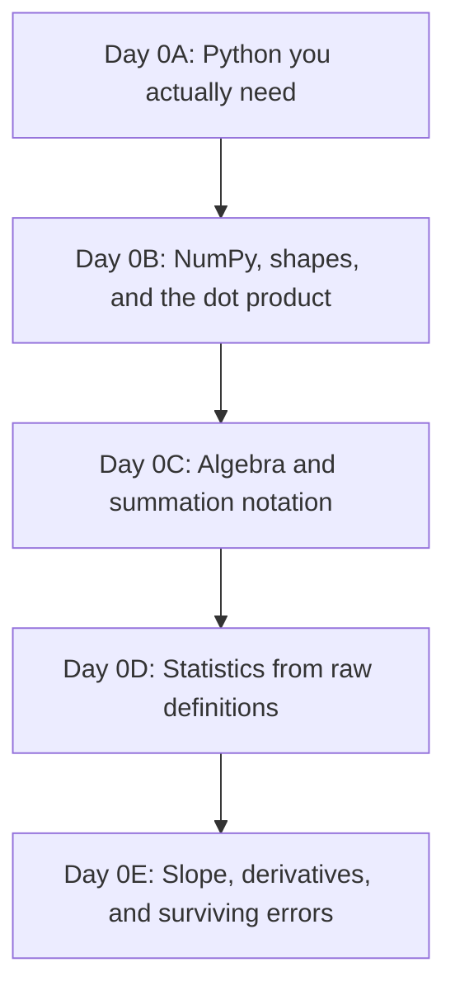

# Chapter 0 — From Nothing to Ready

## Level 0 Base Camp: five short days before the MHP Cost Estimator begins

> **Central promise.** By the end of this chapter, a summation sign will not make you flinch, a NumPy shape error will feel like a solvable puzzle instead of a personal insult, and the sentence "take the derivative of the squared error with respect to the slope" will sound like an instruction you could actually follow. You will not yet know any machine learning. You will know enough Python, algebra, statistics, and calculus that Chapter 1 reads like a hard but fair climb, not a cliff.

This chapter exists because Chapter 1 does not slow down for you. By its second day it is talking about vectors, matrices, and tensors. By its fifth day it is deriving a matrix gradient and proving a matrix is positive semidefinite. That is exactly as it should be — this book is aiming you at research-level regression, causal inference, and survival analysis by Chapter 6, and there is no version of that destination that skips the math.

So we are going to spend five days building the floor you'll stand on. Same rules as every other chapter in this book: no black boxes, code proves every claim, you build something small each day, you break it on purpose, and you don't move on until the exit check passes.

If you already know some of this — if `for` loops and `numpy` arrays are old friends — skim fast, but still run every code block. Muscle memory matters more than novelty here.

---

## The pedagogical contract (same one Chapter 1 uses)

1. **One central concept per day.**
2. **No mathematical hand-waving.** Every symbol gets unpacked and connected to a number you can see.
3. **Code as proof.** If a rule is true, you will watch Python confirm it.
4. **Build, break, rebuild.** Each day adds one working piece to a tiny toolkit; each day you also break something on purpose.
5. **No copy-pasting.** Type it. Your fingers need to learn this as much as your eyes do.

## Level 0 learning outcomes

At the end of five days, you should be able to:

- write and reason about Python functions, loops, comprehensions, dictionaries, and a basic class, without looking up syntax for the basics;
- create, index, slice, reshape, and broadcast NumPy arrays, and explain *why* broadcasting did what it did instead of guessing;
- compute a dot product by hand, by loop, and with `@`, and know they are the same operation at three levels of abstraction;
- read and write summation notation ($\sum$), and translate between a formula and a line of code in either direction;
- compute a mean, variance, standard deviation, covariance, and correlation coefficient from raw definitions — not from a library you don't understand yet;
- compute a derivative and a partial derivative of a simple function, both by the limit definition and by rule, and explain what "gradient" means in one sentence;
- read a Python traceback methodically instead of panicking at it; and
- set up an isolated Python environment and generate the KP datasets this book runs on.

## The five-day route



### Minimal software setup

Same environment the rest of the book uses. If you already did this while reading the orientation chapter, skip ahead.

```bash
python3 -m venv .venv
source .venv/bin/activate        # Windows PowerShell: .venv\Scripts\Activate.ps1
python -m pip install --upgrade pip
python -m pip install numpy matplotlib
```

Keep a scratch file — `level0_notes.py` or a notebook — and never delete a failed experiment. A wrong answer with a note explaining why it was wrong is worth more than a clean run you don't understand.

---

# Day 0A — Python You Actually Need

> **Today's central idea:** You don't need to be a "real programmer." You need six tools — variables, functions, loops, comprehensions, dictionaries, and one small class — used correctly and often.

## 0A.1 Variables and functions: naming a thought

Suppose your manager in Peshawar hands you the planned capacity of one microhydro power (MHP) site: 250 kilowatts. You want to convert that to megawatts.

```python
capacity_kw = 250.0
capacity_mw = capacity_kw / 1000.0
print(capacity_mw)
# 0.25
```

That's a variable: a name you gave to a number so you don't have to keep re-typing `250.0` and hoping you remembered it correctly. Now suppose you need to do this conversion for every project that lands on your desk, forever. You don't write the same two lines a hundred times. You wrap the *behaviour* in a function, and give the *specific number* a name only when you call it.

```python
def kw_to_mw(capacity_kw):
    """Convert kilowatts to megawatts."""
    return capacity_kw / 1000.0

print(kw_to_mw(250.0))   # 0.25
print(kw_to_mw(1800.0))  # 1.8
```

A function has a contract: it takes something in, and it promises something specific out. Every regression model you build in this book — starting with `MHPCostEstimator` in Chapter 1 — is, underneath, a pile of functions with contracts like this one, just with more numbers going in.

## 0A.2 Loops: doing the same thing many times, honestly

You have planned capacities for five projects and want each one in megawatts.

```python
capacities_kw = [100.0, 250.0, 500.0, 1800.0, 60.0]

capacities_mw = []
for c in capacities_kw:
    capacities_mw.append(kw_to_mw(c))

print(capacities_mw)
# [0.1, 0.25, 0.5, 1.8, 0.06]
```

Walk through this out loud (yes, actually say it): "For each value `c` in the list, convert it, and stick the result onto the end of a new list." That is the entire idea of a `for` loop. Nothing hides inside it.

## 0A.3 List comprehensions: the same loop, said more tersely

Python lets you write the loop above in one line. This is not a different idea — it is the *identical* operation, just written compactly enough that you'll see it constantly in other people's code (and in later chapters of this book).

```python
capacities_mw = [kw_to_mw(c) for c in capacities_kw]
print(capacities_mw)
# [0.1, 0.25, 0.5, 1.8, 0.06]
```

Read it right to left inside the brackets: "for `c` in `capacities_kw`, compute `kw_to_mw(c)`, collect all of those." If a comprehension ever confuses you, the fix is always the same: mentally unroll it back into the `for` loop from §0A.2. They compute the same thing.

## 0A.4 Dictionaries: a record, not just a list

A list of numbers loses the *meaning* of each number. A single MHP project is not just `[15.0, 100.0, 3]` — it's cable length, capacity, and terrain difficulty, and you'll forget which number is which within a week. A dictionary keeps the label attached to the value.

```python
project = {
    "site_id": "MHP-0042",
    "cable_length_km": 15.0,
    "planned_capacity_kw": 100.0,
    "terrain_index": 3,
}

print(project["planned_capacity_kw"])
# 100.0
```

This matters more than it looks like it should. Chapter 1, Day 2 introduces a "data dictionary" as part of the model itself — the discipline of never letting a raw number float around without its meaning attached starts here.

## 0A.5 A minimal class: bundling data and behaviour together

A function does one thing to whatever you hand it. A class is a way of saying: "here is a *thing* — it has some data that belongs to it, and some behaviour that belongs to it." You will build classes named `MHPCostEstimator` and `GaussianOLS` later in this book. Here is the smallest possible ancestor of those, so the syntax is not a surprise when it matters.

```python
class UnitConverter:
    def __init__(self, factor):
        # This runs once, when the object is created.
        # It stores 'factor' so every method below can use it.
        self.factor = factor

    def convert(self, value):
        return value * self.factor

kw_to_mw_converter = UnitConverter(factor=0.001)
print(kw_to_mw_converter.convert(250.0))
# 0.25
```

`self` is just "this specific object." When you call `kw_to_mw_converter.convert(250.0)`, Python quietly hands the object itself in as `self`, so `self.factor` means "*this* converter's factor," not some factor floating in space. That's the whole trick. Everything else about classes in this book builds on exactly this.

## 0A.6 Build: a tiny project-cost sketch

Combine everything above into one small tool — not a real model yet, just proof you can chain these pieces together.

```python
projects = [
    {"site_id": "MHP-0001", "cable_length_km": 12.0, "cost_per_km_million_pkr": 0.9},
    {"site_id": "MHP-0002", "cable_length_km": 30.0, "cost_per_km_million_pkr": 0.9},
    {"site_id": "MHP-0003", "cable_length_km": 5.0,  "cost_per_km_million_pkr": 1.4},
]

def rough_cable_cost(project):
    return project["cable_length_km"] * project["cost_per_km_million_pkr"]

for p in projects:
    cost = rough_cable_cost(p)
    print(f"{p['site_id']}: approx {cost:.2f} million PKR of cable cost")
```

This is not a regression. It's a fixed formula, not a fitted one — the whole rest of the book is about the difference between "a formula I made up" and "a formula the data told me to use." Keep that distinction in your head; it will matter by Day 5.

## 0A.7 Break it deliberately

Run each of these, read the *last line* of the error only, and write one sentence translating it into English before you fix it.

```python
# Break 1
def kw_to_mw(capacity_kw)   # missing colon
    return capacity_kw / 1000.0
```

```python
# Break 2
project = {"cable_length_km": 15.0}
print(project["cost_per_km_million_pkr"])  # key that doesn't exist
```

```python
# Break 3
capacities_kw = [100.0, 250.0, 500.0]
print(capacities_kw * 1000)   # not what you think it does
```

The third one is the important one. `capacities_kw * 1000` does not multiply every number by 1000 — it repeats the *list* a thousand times, because `*` on a Python list means "repeat," not "scale." This single misunderstanding is the entire reason NumPy exists, and it's where Day 0B starts.

### Day 0A exit check

You should be able to, without looking anything up:
- write a function with a docstring and a return value;
- write the same loop two ways (`for` and a comprehension);
- explain what `self` refers to inside a class method;
- explain, out loud, why `[1, 2, 3] * 2` is not `[2, 4, 6]`.

---

# Day 0B — NumPy, Shapes, and the Dot Product

> **Today's central idea:** A NumPy array is not "a faster list." It's a different kind of object with its own arithmetic rules, and almost every bug you'll hit in this book for the next six chapters is a shape mismatch.

## 0B.1 Why lists fail us

You saw it already: `capacities_kw * 1000` repeats a list instead of scaling it. NumPy arrays fix this by defining `*`, `+`, `-`, `/` to mean *elementwise* arithmetic.

```python
import numpy as np

capacities_kw = np.array([100.0, 250.0, 500.0])
capacities_watts = capacities_kw * 1000.0
print(capacities_watts)
# [100000. 250000. 500000.]
```

## 0B.2 Shape is the first thing you check, always

Every array has a `.shape`. Get comfortable reading it before you do anything else with an array.

```python
a = np.array([1.0, 2.0, 3.0])
print(a.shape)          # (3,)   — a 1-D array of 3 numbers, a "vector"

b = np.array([[1.0, 2.0, 3.0]])
print(b.shape)          # (1, 3) — a 2-D array: 1 row, 3 columns

c = np.array([[1.0], [2.0], [3.0]])
print(c.shape)          # (3, 1) — a 2-D array: 3 rows, 1 column
```

`(3,)`, `(1, 3)`, and `(3, 1)` hold the same numbers and are **not interchangeable**. This looks pedantic until it silently ruins a calculation two chapters from now. Chapter 1's design matrices depend on you already having this reflex.

## 0B.3 Indexing and slicing

```python
X = np.array([
    [15.0, 100.0, 3],   # cable_km, capacity_kw, terrain_index
    [30.0, 250.0, 4],
    [5.0,  500.0, 1],
])

print(X.shape)        # (3, 3) — 3 projects, 3 features
print(X[0])            # first row: array([ 15., 100.,   3.])
print(X[:, 0])          # first column (all rows): array([15., 30.,  5.])
print(X[0, 1])          # row 0, column 1: 100.0
print(X[:2, :2])        # first two rows, first two columns
```

The comma inside `[ ]` separates "which rows" from "which columns." `:` alone means "all of them." This exact slicing vocabulary is what Chapter 1 uses to pull a single feature column out of a design matrix — get it into your hands now, not while also learning what a design matrix is.

## 0B.4 Broadcasting: NumPy's rule for mismatched shapes

Broadcasting is *not* magic. It's one precise rule: NumPy compares shapes from the right, and a dimension of size 1 (or a missing dimension) is allowed to stretch to match. Watch it work, then watch it correctly refuse.

```python
X = np.array([
    [15.0, 100.0],
    [30.0, 250.0],
    [5.0,  500.0],
])   # shape (3, 2): cable_km, capacity_kw

means = np.array([16.7, 283.3])   # shape (2,) — one mean per column

centred = X - means
print(centred)
# Each row of X has 'means' subtracted from it, column by column.
```

`(3, 2)` and `(2,)` are compatible because the trailing dimension `2` matches `2`. Now break it on purpose:

```python
weights = np.array([1.5, 0.8, 2.1])   # shape (3,) — wrong length on purpose

result = X @ weights
```

```text
ValueError: matmul: Input operand 1 has a mismatch in its core dimension 0,
with gufunc signature (n?,k),(k?,m?)->(n?,m?) (size 3 is different from 2)
```

Translate the last line, not the jargon: *X has 2 columns; `weights` has 3 entries; matrix multiplication needs those to match.* Fix it by giving `weights` exactly 2 entries, one per column of `X`. This is the single most common error you will produce for the next six chapters, so get used to reading it calmly.

## 0B.5 The dot product, at three levels of honesty

A "weighted sum" is the single most important operation in this entire book — every regression coefficient you will ever fit multiplies a feature by a weight and adds the results up. Here it is proven three ways, so you know they're the same thing.

```python
features = np.array([15.0, 100.0])       # cable_km, capacity_kw
weights  = np.array([0.05, 0.002])       # million PKR per unit

# Level 1: by hand, term by term
manual = features[0] * weights[0] + features[1] * weights[1]

# Level 2: by an explicit loop (works for any length)
loop_total = 0.0
for f, w in zip(features, weights):
    loop_total += f * w

# Level 3: NumPy's dot product
dot_total = features @ weights   # equivalently: np.dot(features, weights)

print(manual, loop_total, dot_total)
# 0.95 0.95 0.95
```

All three give `0.95` — 0.75 (cable contribution) + 0.2 (capacity contribution) million PKR. When Chapter 1 writes `X @ beta`, this is exactly what it means: do this weighted sum, once per row of `X`, all at once.

## 0B.6 Build: a manual prediction, matrix style

```python
X = np.array([
    [15.0, 100.0],
    [30.0, 250.0],
    [5.0,  500.0],
])   # 3 projects, 2 features each

beta = np.array([0.05, 0.002])   # made-up weights, not fitted — just practising the mechanics

predictions = X @ beta
print(predictions)
# one predicted cost per project, in the same units as beta implies
```

## 0B.7 Break it deliberately

```python
row_vector = np.array([[1.0, 2.0, 3.0]])   # shape (1, 3)
col_vector = np.array([[1.0], [2.0], [3.0]])  # shape (3, 1)

print(row_vector + col_vector)
```

This does **not** error — it broadcasts to a `(3, 3)` result, which surprises almost everyone the first time. Before running it, predict the shape of the output. Then run it and see if you were right. If you were wrong, walk through §0B.4's rule again until the result stops being a surprise.

### Day 0B exit check

You should be able to, without looking anything up:
- state the shape of any array you just created, without running `.shape`, and then confirm it;
- explain broadcasting as one sentence about matching dimensions from the right;
- compute a dot product three ways and get the same number each time;
- read a `matmul` shape-mismatch error and say, in plain English, which two numbers disagree.

---

# Day 0C — Algebra and Summation Notation

> **Today's central idea:** $\sum$ is not a foreign symbol. It's a `for` loop that adds things up, written in a more compressed alphabet.

## 0C.1 A function is a recipe with a name

You already know this from Python — `def kw_to_mw(capacity_kw): return capacity_kw / 1000.0` is a recipe. Algebra just writes recipes with single letters instead of English words:

$$f(x) = \frac{x}{1000}$$

says exactly what the Python function said: give me a number $x$, I'll divide it by 1000 and call the result $f(x)$. Every formula in this book is a recipe like this one — the discipline is learning to read the recipe before panicking about the symbols.

## 0C.2 The equation of a line, and why it matters here

$$y = mx + c$$

$m$ is the slope: how much $y$ changes when $x$ increases by exactly 1. $c$ is the intercept: the value of $y$ when $x$ is 0. This is the entire idea behind linear regression with one feature — Chapter 1 spends its first three days building up to exactly this equation, generalised to many features. If you can already sketch $y = 2x + 5$ on paper and say what happens as $x$ grows, you have the geometric intuition; the rest is notation.

## 0C.3 Summation notation, built from a loop you already wrote

Recall Day 0A's loop:

```python
loop_total = 0.0
for f, w in zip(features, weights):
    loop_total += f * w
```

In algebra, if there are $p$ features indexed $i = 1, 2, \dots, p$, this exact loop is written:

$$\sum_{i=1}^{p} f_i w_i$$

Read it left to right, the same way you'd read the `for` loop: "start a running total at 0; for each $i$ from 1 to $p$, add $f_i$ times $w_i$; stop." The little number under $\sum$ is where the loop starts, the number on top is where it ends, and everything to the right of $\sum$ is what gets added at each step.

**Code proof — the formula and the loop must agree:**

```python
import numpy as np

f = np.array([15.0, 100.0, 3.0])
w = np.array([0.05, 0.002, -1.5])

# The formula, as a loop
total_loop = 0.0
for i in range(len(f)):
    total_loop += f[i] * w[i]

# The formula, as NumPy
total_numpy = f @ w

print(total_loop, total_numpy)
# 0.55 0.55
```

$\sum_{i=1}^{p} f_i w_i$, the `for` loop, and `f @ w` are three spellings of one idea. When Chapter 1, Day 4 writes the sum of squared residuals as

$$\text{SSR} = \sum_{i=1}^{n} (y_i - \hat{y}_i)^2$$

you should now be able to read it as: "loop over every project $i$; take the actual cost minus the predicted cost; square it; add it to a running total." Try writing that as Python *before* Chapter 1 does it for you.

## 0C.4 Exponents and why we square errors (a preview)

$x^2$ means $x$ multiplied by itself. Two properties matter for everything downstream:

- squaring always produces a non-negative number, so a positive error and an equally-sized negative error contribute the same amount once squared;
- squaring punishes large errors much more than small ones — an error of 10 contributes 100, an error of 2 contributes only 4.

Chapter 1, Day 4 spends real time justifying *why* regression squares errors instead of just adding them up. You don't need the full argument yet — just the two facts above, so the argument doesn't start from zero.

## 0C.5 Build: SSR from the formula, three ways

```python
y_actual    = np.array([12.0, 30.0, 8.0])
y_predicted = np.array([11.2, 31.5, 9.0])

# Level 1: by hand
errors = y_actual - y_predicted
squared_errors = errors ** 2
ssr_manual = squared_errors.sum()

# Level 2: as a literal loop mirroring the sigma
ssr_loop = 0.0
for a, p in zip(y_actual, y_predicted):
    ssr_loop += (a - p) ** 2

# Level 3: one line
ssr_oneline = np.sum((y_actual - y_predicted) ** 2)

print(ssr_manual, ssr_loop, ssr_oneline)
```

All three must match. If they don't, you have a bug — and finding it is exactly the kind of debugging Chapter 1 will ask of you constantly.

## 0C.6 Break it deliberately

Predict the output on paper before running:

```python
values = np.array([2.0, -3.0, 5.0])
print(np.sum(values ** 2))     # sum of squares
print(np.sum(values) ** 2)     # square of the sum
```

These are **not equal**, and the difference between "sum of squares" and "square of a sum" is a mistake that will cost you real debugging time in later chapters (variance, in particular, depends on getting this order right). Say out loud why they differ before moving on.

### Day 0C exit check

You should be able to:
- translate a $\sum$ formula into a `for` loop and into one line of NumPy, and get matching numbers all three ways;
- explain why $y = mx + c$ is the same shape of idea as Chapter 1's regression equation;
- explain the difference between $\sum x_i^2$ and $(\sum x_i)^2$ using a concrete 3-number example.

---

# Day 0D — Statistics From Raw Definitions

> **Today's central idea:** Mean, variance, and correlation are not library functions you call. They are formulas you can build from Day 0C's summation notation in about four lines each — and Chapter 2's probability content assumes you already know what they mean.

## 0D.1 The mean: the balancing point

Suppose five MHP projects had these actual costs, in million PKR: `[12.0, 30.0, 8.0, 45.0, 15.0]`.

$$\bar{x} = \frac{1}{n}\sum_{i=1}^{n} x_i$$

"Add everything up, divide by how many there are."

```python
costs = np.array([12.0, 30.0, 8.0, 45.0, 15.0])

n = len(costs)
mean_manual = np.sum(costs) / n
mean_numpy = costs.mean()

print(mean_manual, mean_numpy)
# 22.0 22.0
```

## 0D.2 Variance: how far, on average, things sit from the mean

You can't just average the raw deviations from the mean — they always sum to zero (that's *what* "mean" means). So we square them first, borrowing exactly the trick from Day 0C.

$$\sigma^2 = \frac{1}{n}\sum_{i=1}^{n} (x_i - \bar{x})^2$$

```python
deviations = costs - costs.mean()
print(deviations)               # [-10. 8. -14. 23. -7.]
print(deviations.sum())          # 0.0 — always, by construction

variance_manual = np.sum(deviations ** 2) / n
variance_numpy = costs.var()     # NumPy's default matches this population formula

print(variance_manual, variance_numpy)
```

> **A warning that will save you real confusion later:** you'll sometimes see variance computed by dividing by $n - 1$ instead of $n$ (the "sample" variance, `ddof=1` in NumPy). Chapter 2, Day 6 explains exactly why that correction exists. For now, just notice that `costs.var()` and `costs.var(ddof=1)` disagree, and don't assume it's a bug when you see it — it's a deliberate choice depending on what you're trying to estimate.

## 0D.3 Standard deviation: getting the units back

Variance is in squared units (million PKR², which means nothing to anyone). Standard deviation undoes the squaring:

$$\sigma = \sqrt{\sigma^2}$$

```python
std_manual = np.sqrt(variance_manual)
std_numpy = costs.std()
print(std_manual, std_numpy)
```

## 0D.4 Covariance: do two things move together?

Now bring in a second variable — cable length per project, in km: `[12.0, 30.0, 5.0, 40.0, 15.0]`. Covariance asks: when one variable is above its mean, is the other one usually above its mean too?

$$\text{cov}(x, y) = \frac{1}{n}\sum_{i=1}^{n} (x_i - \bar{x})(y_i - \bar{y})$$

```python
cable_km = np.array([12.0, 30.0, 5.0, 40.0, 15.0])

x_dev = costs - costs.mean()
y_dev = cable_km - cable_km.mean()

cov_manual = np.sum(x_dev * y_dev) / n
cov_numpy = np.cov(costs, cable_km, ddof=0)[0, 1]

print(cov_manual, cov_numpy)
```

If both deviations tend to have the same sign (both above their means, or both below), each product is positive and covariance comes out positive: as cable length rises, cost tends to rise too. That's not a coincidence for this dataset — it's the whole reason regression will later find cable length a useful feature.

## 0D.5 Correlation: covariance with the units washed out

Covariance's *size* depends on the units you happened to measure in, which makes two covariances hard to compare. Correlation fixes that by dividing out each variable's own spread:

$$r = \frac{\text{cov}(x, y)}{\sigma_x \sigma_y}$$

```python
r_manual = cov_manual / (costs.std() * cable_km.std())
r_numpy = np.corrcoef(costs, cable_km)[0, 1]

print(r_manual, r_numpy)
```

$r$ always sits between $-1$ and $1$. Close to $1$: strong positive relationship. Close to $-1$: strong negative. Close to $0$: little linear relationship. This single number is going to matter enormously in Chapter 1, Day 2, where you'll learn that two *nearly identical* correlated features (like literacy rate and school enrollment in the orientation chapter's development dataset) can quietly break a regression — that's called multicollinearity, and it's just "correlation close to 1" between features, wearing a bigger hat.

## 0D.6 Build: a tiny stats report

```python
def describe(values, label):
    print(f"{label}: mean={values.mean():.2f}, std={values.std():.2f}, "
          f"min={values.min():.2f}, max={values.max():.2f}")

describe(costs, "cost (million PKR)")
describe(cable_km, "cable length (km)")
print(f"correlation(cost, cable_km) = {np.corrcoef(costs, cable_km)[0,1]:.3f}")
```

This four-line report is, in essence, what Exercise 0.1 in the orientation chapter asked you to build for the full KP datasets. Now you know what every number in it actually means, instead of trusting `.describe()` blindly.

## 0D.7 Break it deliberately

```python
constant = np.array([5.0, 5.0, 5.0, 5.0, 5.0])
print(np.corrcoef(constant, costs))
```

This produces `nan`, not an error — correlation divides by `constant.std()`, which is `0.0`, and dividing by zero silently poisons the whole calculation with `nan` instead of crashing loudly. This is a real trap: a feature with zero variance (every project has the same terrain grade, say) will not throw an exception, it will quietly corrupt anything downstream that touches it. Get used to checking `.std()` for zero *before* you trust a correlation number.

### Day 0D exit check

You should be able to:
- compute mean, variance, standard deviation, covariance, and correlation from the raw summation formulas, and match NumPy's built-ins;
- explain in one sentence why variance squares the deviations instead of just averaging them;
- explain what a correlation near $1$ between two features will eventually mean for a regression model;
- explain why a zero-variance feature produces `nan` instead of an error, and why that's more dangerous.

---

# Day 0E — Slope, Derivatives, and Surviving Errors

> **Today's central idea:** A derivative is just the slope of a curve at one exact point, and every model you train in this book is, underneath, a search for the point where that slope hits zero.

## 0E.1 From a straight slope to a curved one

You already know $y = mx + c$ has one constant slope, $m$, everywhere. Now consider a curve: $y = x^2$. Its steepness is different at every point — flat near $x=0$, steep far from it. The **derivative** is a formula that tells you the exact slope at any single point you pick.

For $y = x^2$, the derivative is:

$$\frac{dy}{dx} = 2x$$

- At $x = 0$: slope is $2(0) = 0$ — flat, the bottom of the bowl.
- At $x = 3$: slope is $2(3) = 6$ — climbing steeply.
- At $x = -3$: slope is $2(-3) = -6$ — descending steeply, mirror image.

## 0E.2 Where that formula actually comes from (the limit definition)

You don't have to memorise derivative rules as magic — they fall out of one idea: *look at the average slope between two points that are getting closer and closer together.*

$$\frac{dy}{dx} = \lim_{h \to 0} \frac{f(x+h) - f(x)}{h}$$

**Code proof — approximate this numerically and watch it converge to $2x$:**

```python
def f(x):
    return x ** 2

def numerical_slope(f, x, h):
    return (f(x + h) - f(x)) / h

x = 3.0
for h in [1.0, 0.1, 0.01, 0.0001, 0.000001]:
    print(f"h={h:<10} slope estimate={numerical_slope(f, x, h):.6f}")
# As h shrinks, the estimate creeps toward exactly 6.0 = 2 * 3
```

This is not a party trick. Chapter 1, Day 5 checks its hand-derived matrix gradient against exactly this kind of numerical approximation ("finite differences"), and Chapter 2, Day 9 builds gradient descent directly on top of it. You just ran a miniature version of both.

## 0E.3 Two derivative rules you'll actually use

You don't need a full calculus course — this book only leans on a handful of rules, repeatedly:

- **Power rule:** the derivative of $x^n$ is $n x^{n-1}$. (This is where $x^2 \to 2x$ came from.)
- **Constant multiple:** the derivative of $a \cdot f(x)$ is $a$ times the derivative of $f(x)$.
- **Sum rule:** the derivative of $f(x) + g(x)$ is just the derivative of $f(x)$ plus the derivative of $g(x)$ — you can differentiate term by term.

```python
# Example: derivative of  y = 3x^2 + 5x
# Power rule on 3x^2  -> 6x
# Power rule on 5x    -> 5   (since x^1's derivative is 1*x^0 = 1)
# Sum rule combines them -> 6x + 5

def y(x):
    return 3 * x**2 + 5 * x

def dy_dx_by_rule(x):
    return 6 * x + 5

x = 2.0
print(dy_dx_by_rule(x))                                  # 17.0
print(numerical_slope(y, x, h=0.000001))                  # ~17.0, confirms the rule
```

## 0E.4 Partial derivatives: slope when there's more than one dial to turn

Regression rarely has one adjustable number — it has one per feature. A **partial derivative** asks: "if I nudge *just this one* number and freeze everything else, how does the output change?" Notation-wise, $\partial$ replaces $d$ to signal "there are other variables here, and I'm holding them still."

Take a toy error surface: $E(m, c) = (10 - (m \cdot 2 + c))^2$ — the squared error of predicting $y=10$ at $x=2$ using slope $m$ and intercept $c$.

```python
def error(m, c):
    prediction = m * 2 + c
    return (10 - prediction) ** 2

def partial_wrt_m(error_fn, m, c, h=1e-6):
    return (error_fn(m + h, c) - error_fn(m, c)) / h

def partial_wrt_c(error_fn, m, c, h=1e-6):
    return (error_fn(m, c + h) - error_fn(m, c)) / h

m, c = 1.0, 1.0
print("slope if we nudge m:", partial_wrt_m(error, m, c))
print("slope if we nudge c:", partial_wrt_c(error, m, c))
```

Both numbers together form the **gradient** — a small arrow made of "how much does the error change per dial, holding the others still." Chapter 1, Day 5 derives this gradient by hand for the full OLS objective, with one partial derivative per feature instead of two. You just did the two-dial version.

## 0E.5 Why any of this matters: descending toward zero error

The core trick behind fitting almost every model in this book: start somewhere, compute the gradient, take a small step in the direction that *decreases* error, and repeat until the gradient is (close to) zero.

```python
m, c = 0.0, 0.0        # start with a bad guess
learning_rate = 0.01

for step in range(50):
    grad_m = partial_wrt_m(error, m, c)
    grad_c = partial_wrt_c(error, m, c)
    m -= learning_rate * grad_m
    c -= learning_rate * grad_c

print(f"m={m:.3f}, c={c:.3f}, error={error(m, c):.6f}")
```

Run it and watch the error shrink toward zero as `m` and `c` settle into values that make `m * 2 + c` land near `10`. This is a hand-built, miniature version of gradient descent — the real one arrives in Chapter 2, Day 9, with real data instead of one toy point.

## 0E.6 Surviving the traceback

You will see red error text constantly for the rest of this book. A practitioner reads an error the way an investigator reads a scene: bottom line first, ignore the jargon, translate to English.

**Shape mismatch (you already met this on Day 0B):**

```text
ValueError: matmul: Input operand 1 has a mismatch in its core dimension 0...
(size 4 is different from 2)
```
→ "Two things that need matching lengths don't have matching lengths."

**Missing key:**

```python
project = {"cable_length_km": 15.0}
project["terrain_index"]
```
```text
KeyError: 'terrain_index'
```
→ "You asked the dictionary for a label it doesn't have. Check spelling, check whether the data actually contains that field."

**Wrong type:**

```python
"cost: " + 15.0
```
```text
TypeError: can only concatenate str (not "float") to str
```
→ "Python won't silently guess how to combine a string and a number. Convert one of them explicitly: `"cost: " + str(15.0)`."

The instinct to panic and immediately paste the whole traceback into a search bar is understandable but skips the useful step: read the last line first, translate it into a plain sentence, *then* decide if you need help.

## 0E.7 The rule of the rubber duck

Put a mug, a duck, or an unimpressed cat on your desk. When something breaks, explain your code to it out loud, line by line, as if it has never seen Python. "Okay, here I create an array with three rows. Then I multiply it by a vector with... wait, how many entries does that vector have?" In a large fraction of cases you will catch the bug mid-sentence, before the duck says a word.

## 0E.8 Break it deliberately

```python
def error(m, c):
    prediction = m * 2 + c
    return (10 - prediction) ** 2

# Break: learning rate far too large
m, c = 0.0, 0.0
learning_rate = 5.0   # was 0.01

for step in range(10):
    grad_m = partial_wrt_m(error, m, c)
    grad_c = partial_wrt_c(error, m, c)
    m -= learning_rate * grad_m
    c -= learning_rate * grad_c
    print(step, m, c, error(m, c))
```

Watch the error *grow* instead of shrink, possibly exploding toward infinity. You just reproduced, in miniature, the single most common failure in Chapter 2, Day 9 — a learning rate that's too large overshoots the bottom of the valley on every step instead of settling into it. File that feeling away; you'll need to recognise it fast later.

### Day 0E exit check

You should be able to:
- compute a derivative numerically (finite differences) and confirm it against a rule-based derivative;
- explain a partial derivative in one sentence to someone who's never seen the word;
- explain, without notes, what gradient descent is doing and why a too-large learning rate breaks it;
- read a `KeyError`, `TypeError`, and shape-mismatch `ValueError` and translate each into plain English before trying to fix it.

---

# Level 0 Capstone — Prove You're Ready

Do this without peeking at earlier sections. This mirrors the format every later chapter uses for its own capstone, so it's worth taking seriously now.

**Given:**

```python
projects = np.array([
    [12.0, 15.0],   # cable_km, terrain_index
    [30.0, 25.0],
    [5.0,  8.0],
    [40.0, 45.0],
    [15.0, 12.0],
])
costs = np.array([12.0, 30.0, 8.0, 45.0, 15.0])   # million PKR
```

1. Report the shape of `projects` and explain what each dimension means, in a sentence.
2. Compute the mean and standard deviation of each column of `projects`, without using `.mean(axis=...)` — write the loop or comprehension yourself first, then confirm with NumPy.
3. Compute the correlation between `costs` and column 0 of `projects` from the raw covariance/std formulas, then check it with `np.corrcoef`.
4. Pick any made-up weight vector `beta` of length 2 and compute `predictions = projects @ beta` by hand-loop and with `@`, and confirm they match.
5. Write a function `sse(y_actual, y_predicted)` that returns $\sum (y_i - \hat{y}_i)^2$, and test it against your `predictions` from step 4.
6. Using finite differences, numerically estimate how `sse` changes if you nudge just the first entry of `beta` by a small amount. (You now have one entry of the gradient Chapter 1, Day 5 will derive properly.)
7. Deliberately break something — pass `beta` with the wrong length into step 4 — and write, in one sentence, what the resulting error is telling you.

If you can do all seven without reopening this chapter, you are ready for Chapter 1.

---

## Glossary (symbols you'll now recognise on sight)

| Symbol | Name | Meaning |
|---|---|---|
| $x_i$ | indexed variable | the $i$-th value in a collection |
| $\sum_{i=1}^{n}$ | summation | add up a formula for every $i$ from 1 to $n$ |
| $\bar{x}$ | mean | average value |
| $\sigma^2$ | variance | average squared distance from the mean |
| $\sigma$ | standard deviation | square root of variance; same units as the data |
| $r$ | correlation | covariance rescaled to sit between $-1$ and $1$ |
| $\frac{dy}{dx}$, $f'(x)$ | derivative | exact slope of $y=f(x)$ at a point |
| $\frac{\partial E}{\partial m}$ | partial derivative | slope of $E$ with respect to $m$ alone, holding other variables fixed |
| gradient | — | the collection of all partial derivatives, one per adjustable number |

## Instructor and self-study notes

- **Suggested timebox:** one focused day per section (0A–0E), or two half-days if math is genuinely new to you. Do not compress this into a single afternoon — the exit checks exist because rushing here is exactly what makes Chapter 1 feel impossible later.
- **Most common failure point:** learners skim Day 0B's broadcasting section because arrays "look like lists." Don't. Every day from Chapter 1 onward assumes shape-checking is reflexive, not effortful.
- **If the capstone is a struggle:** repeat Day 0C and 0D before moving on. Chapter 1 will not re-teach summation notation or variance; it will simply use them.

## Where Chapter 1 begins

Chapter 1 opens with a question you're now equipped to actually think about: *what is a regression for — prediction, explanation, or causation?* Everything you built this week — functions, shapes, sums, means, slopes — is about to get one name each: features, design matrix, objective function, gradient. Turn the page.
