# Chapter 2 — From a Fitted Line to a Trustworthy Model

## Level 2 Model Builder: the next seven days of the MHP Cost Estimator

> **Central promise.** Chapter 1 taught you to derive and fit ordinary least squares (OLS). By the end of this chapter, you will be able to explain when that calculation is numerically stable, connect least squares to probability, fit it by gradient descent, measure performance on genuinely unseen projects, compare it with honest baselines and a shallow decision tree, quantify several kinds of uncertainty, diagnose failure patterns, and defend an evaluation design before a technical reviewer.

The learner is still assumed to be a beginner. Nothing important is hidden behind the phrase “the library does it.” We first construct each idea with small arrays and equations. Only after the mechanism is visible do we use `scikit-learn` to assemble a reliable workflow.

The long-term destination is research-level practice. That does **not** mean introducing every advanced term immediately. It means building habits that remain valid when the datasets, models, and papers become difficult:

- define the intended use before choosing an evaluation;
- separate mathematical computation from statistical evidence;
- distinguish information available at prediction time from information created later;
- treat model selection as part of the learning procedure;
- report uncertainty and subgroup failures, not only an average score; and
- connect claims to reproducible evidence.

---

## Why the original three-day draft needed a larger bridge

The earlier draft moved directly from OLS to three ready-made models, a data split, and three metrics. Those topics belong here, but an absolute beginner would have been asked to use several ideas before understanding them.

Chapter 1 explicitly identified the unresolved problems. The fitted line could be unstable when features have different scales; the normal-equation formula did not explain QR or singular values; OLS had not yet been connected to a probability model; the learner had derived a gradient but had not used it to learn; training error was not evidence about new projects; and uncertainty and diagnostic revision were still missing.

This chapter therefore follows the order promised at the end of Chapter 1.

## Learning outcomes

At the end of Chapter 2, you should be able to:

- explain floating-point approximation and numerical conditioning in plain language;
- standardise a feature using statistics calculated from the training data only;
- show why scaling changes coefficient units but need not change OLS predictions;
- calculate a condition number from singular values;
- solve least squares with QR decomposition and with the singular value decomposition (SVD);
- distinguish an error term from an observed residual;
- derive OLS as maximum likelihood under a Gaussian noise model;
- estimate residual variance, coefficient standard errors, confidence intervals, and prediction intervals under stated assumptions;
- derive and implement batch gradient descent for squared error;
- explain parameters, hyperparameters, fitting, selection, and evaluation as different operations;
- derive why the mean is the squared-error constant baseline and the median is the absolute-error constant baseline;
- recognise underfitting, overfitting, and distribution shift;
- choose among random, group, and temporal validation designs by matching the split to deployment;
- identify target, temporal, group, preprocessing, duplicate, and test-set leakage;
- explain ordinary, grouped, temporal, and nested cross-validation;
- calculate and interpret MAE, RMSE, median absolute error, and test-set $R^2$;
- explain why MAPE can be misleading for small or zero targets;
- inspect residuals by fitted value, time, district, and project scale;
- place uncertainty around a held-out performance estimate using a transparent bootstrap;
- state why fold-to-fold variation is not automatically a confidence interval; and
- read a research paper by separating its question, design, result, limitation, and implication.

## The seven-day route

| Day | Central idea | Problem it resolves |
|---|---|---|
| [Day 6](#day-6--scaling-and-numerical-conditioning) | Scaling and conditioning | Correct algebra can still produce fragile computation |
| [Day 7](#day-7--qr-svd-rank-and-the-pseudoinverse) | QR, SVD, rank, pseudoinverse | The inverse formula is not the safest or most general solver |
| [Day 8](#day-8--probability-likelihood-and-uncertainty) | Probability, likelihood, uncertainty | A fitted line alone does not quantify uncertainty |
| [Day 9](#day-9--gradient-descent-from-the-ols-gradient) | Gradient descent | A gradient becomes a learning algorithm |
| [Day 10](#day-10--generalisation-baselines-and-model-complexity) | Generalisation and baselines | Low training error can be meaningless |
| [Day 11](#day-11--honest-splitting-leakage-and-cross-validation) | Splits, leakage, cross-validation | Model selection can contaminate evaluation |
| [Day 12](#day-12--metrics-diagnostics-and-responsible-revision) | Metrics, diagnostics, revision | One average score can conceal operational failure |

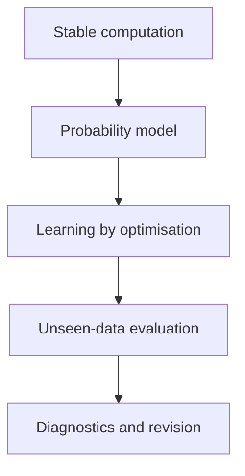

Each day uses Chapter 1’s rhythm: orient, construct, prove, see, build, break, and reflect.

---

## Running case: when is an MHP cost estimate made?

We continue with fictional microhydro power (MHP) projects in Khyber Pakhtunkhwa. The target is final project cost expressed in **constant 2025 million PKR**. Using constant prices removes general inflation from the target so that the model can focus on project differences. A later forecasting chapter can model nominal prices and inflation explicitly.

The prediction is made at technical appraisal, before procurement and construction. This timing rule decides which features are legitimate.

| Field | Available at appraisal? | Use as a feature? | Reason |
|---|---:|---:|---|
| Planned capacity | Yes | Yes | Known from design |
| Estimated cable length | Yes | Yes | Known approximately from survey |
| Road distance | Yes | Yes | Known from access assessment |
| Terrain index | Yes | Yes, cautiously | Known, but measurement consistency must be checked |
| District | Yes | Depends on deployment | Useful for known districts; problematic for unseen-district deployment |
| Start year | Yes | Yes, if the deployment design permits | May represent technical or institutional change |
| Final material bill | No | No | It is created during construction and leaks the outcome |
| Actual completion time | No | No | It is a later outcome, not an appraisal input |

> **Prediction-time test:** Imagine the appraisal officer sitting at a desk on the day the estimate must be issued. If the value is not legitimately available then, it cannot enter the feature matrix—even if it is present in the completed-project database.

## Chapter data generator

The following function creates a reproducible learning dataset. It deliberately contains nonlinearity, district structure, changing conditions over time, larger noise for remote projects, and one tempting post-construction field. These are not defects in the exercise; they create the problems an honest workflow must discover.

Save this as `chapter2_data.py`.

```python
import numpy as np
import pandas as pd


def make_mhp_projects(n=360, seed=2026):
    """Create fictional MHP projects for Chapter 2.

    The relationships are educational, not estimates of real KP projects.
    The target is final cost in constant 2025 million PKR.
    """
    rng = np.random.default_rng(seed)

    districts = np.array(["Chitral", "Dir", "Swat", "Shangla", "Kohistan"])
    district = rng.choice(districts, size=n, p=[0.22, 0.20, 0.24, 0.17, 0.17])
    start_year = rng.integers(2016, 2026, size=n)

    planned_capacity_kw = rng.uniform(80.0, 850.0, size=n)
    road_distance_km = np.clip(rng.gamma(shape=2.0, scale=6.0, size=n), 0.2, 42.0)
    terrain_index = rng.integers(1, 6, size=n)
    estimated_cable_km = np.clip(
        0.8 + 0.006 * planned_capacity_kw + rng.normal(0.0, 0.9, size=n),
        0.5,
        None,
    )

    district_effect = {
        "Chitral": 4.0,
        "Dir": 1.0,
        "Swat": 0.0,
        "Shangla": 2.5,
        "Kohistan": 5.0,
    }
    district_cost = np.array([district_effect[d] for d in district])

    remote_surcharge = 7.0 * (road_distance_km > 18.0)
    capacity_curve = 0.000025 * planned_capacity_kw**2
    time_change = 0.7 * (start_year - 2016)
    noise_sd = 2.5 + 0.12 * road_distance_km
    noise = rng.normal(0.0, noise_sd)

    actual_cost = (
        9.0
        + 0.030 * planned_capacity_kw
        + capacity_curve
        + 1.15 * estimated_cable_km
        + 0.85 * road_distance_km
        + 2.4 * terrain_index
        + remote_surcharge
        + district_cost
        + time_change
        + noise
    )

    # This is known only after procurement/construction. It is deliberately leaky.
    final_material_bill = 0.62 * actual_cost + rng.normal(0.0, 1.2, size=n)

    return pd.DataFrame(
        {
            "project_id": [f"MHP-{i:04d}" for i in range(n)],
            "district": district,
            "start_year": start_year,
            "planned_capacity_kw": planned_capacity_kw,
            "estimated_cable_km": estimated_cable_km,
            "road_distance_km": road_distance_km,
            "terrain_index": terrain_index,
            "final_material_bill_million_pkr": final_material_bill,
            "actual_cost_2025_million_pkr": actual_cost,
        }
    ).sort_values(["start_year", "project_id"]).reset_index(drop=True)


if __name__ == "__main__":
    projects = make_mhp_projects()
    projects.to_csv("mhp_projects_chapter2.csv", index=False)
    print(projects.head())
    print(projects.shape)
```

## Minimal software setup

Chapter 1 used NumPy and Matplotlib. This chapter adds pandas, SciPy, and scikit-learn:

```bash
python -m pip install numpy pandas matplotlib scipy scikit-learn
```

Record the environment used for an experiment:

```python
import numpy as np
import pandas as pd
import scipy
import sklearn

print("NumPy:", np.__version__)
print("pandas:", pd.__version__)
print("SciPy:", scipy.__version__)
print("scikit-learn:", sklearn.__version__)
```

A paper or report is not computationally reproducible if the data, code, random seeds, and software environment cannot be identified.

---

# Day 6 — Scaling and Numerical Conditioning

> **Today’s central idea:** Algebra asks whether a solution exists. Numerical analysis asks whether a computer can calculate that solution reliably with finite precision.

## 6.1 Computers approximate most real numbers
<button class="read-details-btn" data-section="2a-1">✦ Read Details</button>

A computer stores floating-point numbers with a limited number of binary digits. Many ordinary decimal values cannot be represented exactly. This is why:

```python
print(0.1 + 0.2)
print((0.1 + 0.2) == 0.3)
```

prints a value close to 0.3 but the equality test is false.

This does not mean numerical computing is unreliable. It means calculations must be designed so that tiny representation errors are not unnecessarily magnified.

## 6.2 A well-posed problem can still be ill-conditioned
<button class="read-details-btn" data-section="2a-2">✦ Read Details</button>

Suppose two datasets differ by a tiny amount. If their fitted coefficients also differ only slightly, the problem is well-conditioned. If a tiny data change causes a large coefficient change, it is ill-conditioned.

Conditioning belongs to the **problem and its representation**. Numerical stability belongs to the **algorithm** used to solve it. A stable algorithm cannot create information that nearly redundant features do not contain, but it can avoid making the situation worse.

For a full-column-rank matrix, the two-norm condition number is:

$$
\kappa_2(X)=\frac{\sigma_{\max}(X)}{\sigma_{\min}(X)},
$$

where:

- $\sigma_{\max}$ is the largest singular value;
- $\sigma_{\min}$ is the smallest singular value; and
- a larger ratio means that some directions in parameter space are much less informed than others.

A condition number near 1 is favourable. There is no universal number at which a model suddenly becomes invalid. Interpretation depends on floating-point precision, units, noise, and the decision. The condition number is a warning instrument, not a courtroom verdict.

## 6.3 Different units can create a numerical imbalance
<button class="read-details-btn" data-section="2a-3">✦ Read Details</button>

In the same design matrix we might store:

- planned capacity around hundreds of kW;
- road distance around tens of km; and
- terrain on a 1–5 scale.

The columns then occupy very different numerical ranges. OLS predictions are not automatically wrong, but optimisation can become harder and coefficient comparison can become misleading.

Standardisation transforms feature $j$ using:

$$
z_{ij}=\frac{x_{ij}-\mu_j}{s_j},
$$

where $\mu_j$ and $s_j$ must be calculated from the **training data**.

After transformation:

- a value of $z=0$ is at the training mean;
- $z=1$ is one training standard deviation above the mean; and
- $z=-2$ is two training standard deviations below it.

## 6.4 Construct a scaler from scratch

```python
import numpy as np


class StandardScalerFromScratch:
    def fit(self, X):
        X = np.asarray(X, dtype=float)
        if X.ndim != 2:
            raise ValueError("X must be a two-dimensional matrix")

        self.mean_ = X.mean(axis=0)
        # ddof=0 matches the population-style convention used by StandardScaler.
        self.scale_ = X.std(axis=0, ddof=0)

        if np.any(self.scale_ == 0.0):
            bad = np.where(self.scale_ == 0.0)[0].tolist()
            raise ValueError(f"Constant feature columns cannot be scaled: {bad}")
        return self

    def transform(self, X):
        if not hasattr(self, "mean_"):
            raise RuntimeError("Call fit before transform")
        X = np.asarray(X, dtype=float)
        return (X - self.mean_) / self.scale_

    def inverse_transform(self, Z):
        Z = np.asarray(Z, dtype=float)
        return Z * self.scale_ + self.mean_

    def fit_transform(self, X):
        return self.fit(X).transform(X)


X_train = np.array(
    [
        [100.0, 2.0, 1.0],
        [250.0, 8.0, 2.0],
        [500.0, 14.0, 4.0],
        [800.0, 25.0, 5.0],
    ]
)

scaler = StandardScalerFromScratch()
Z_train = scaler.fit_transform(X_train)

print("Training means:", scaler.mean_)
print("Training scales:", scaler.scale_)
print("Scaled means:", Z_train.mean(axis=0))
print("Scaled standard deviations:", Z_train.std(axis=0, ddof=0))

assert np.allclose(Z_train.mean(axis=0), 0.0)
assert np.allclose(Z_train.std(axis=0, ddof=0), 1.0)
assert np.allclose(scaler.inverse_transform(Z_train), X_train)
```

### Population standard deviation versus sample standard deviation

Two common formulas differ in the denominator:

$$
s_{\text{population}}=\sqrt{\frac{1}{n}\sum_i(x_i-\bar{x})^2},
$$

$$
s_{\text{sample}}=\sqrt{\frac{1}{n-1}\sum_i(x_i-\bar{x})^2}.
$$

The second is used in classical estimation of a population variance. A feature scaler is performing a deterministic transformation of the observed training column, so many software libraries use the first convention. The important point is not to memorise one denominator for every purpose; it is to know which quantity is being calculated and why.

## 6.5 Why the test set must not teach the scaler

Assume older projects have a mean capacity of 300 kW and future projects have a mean of 600 kW. If the future test projects help calculate the mean and standard deviation, the transformation has already learned something about the future distribution.

The correct sequence is:

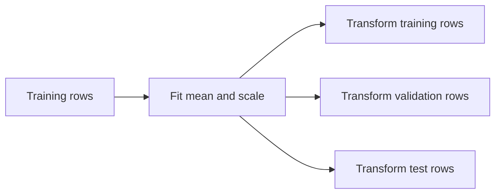

The validation and test sets receive the training transformation. They do not modify it.

```python
X_train = np.array([[100.0], [200.0], [300.0]])
X_test = np.array([[900.0], [1000.0]])

scaler = StandardScalerFromScratch().fit(X_train)
print("Correct test values:", scaler.transform(X_test).ravel())

# Wrong: this lets the test distribution influence preprocessing.
leaky_scaler = StandardScalerFromScratch().fit(np.vstack([X_train, X_test]))
print("Leaky test values:  ", leaky_scaler.transform(X_test).ravel())
```

The second result may look numerically more moderate. That is precisely the problem: it uses information the deployed model would not have had when it was trained.

## 6.6 Scaling changes coefficient units
<button class="read-details-btn" data-section="2a-6">✦ Read Details</button>

Suppose the scaled model is:

$$
\hat y=\gamma_0+\sum_{j=1}^{p}\gamma_j z_j,
$$

and $z_j=(x_j-\mu_j)/s_j$. Substitute:

$$
\hat y
=\gamma_0+\sum_j\gamma_j\frac{x_j-\mu_j}{s_j}.
$$

Rearrange:

$$
\hat y
=\left(\gamma_0-\sum_j\frac{\gamma_j\mu_j}{s_j}\right)
+\sum_j\frac{\gamma_j}{s_j}x_j.
$$

Therefore the original-unit coefficients are:

$$
\beta_j=\frac{\gamma_j}{s_j},
$$

$$
\beta_0=\gamma_0-\sum_j\frac{\gamma_j\mu_j}{s_j}.
$$

The fitted predictions can remain the same while the coefficient numbers and their units change.

### Code proof: raw and scaled OLS give the same predictions

```python
import numpy as np

rng = np.random.default_rng(7)
X = rng.normal(size=(80, 3)) * np.array([500.0, 10.0, 2.0])
y = 12.0 + X @ np.array([0.03, 0.8, 2.2]) + rng.normal(0.0, 1.0, size=80)

X_raw_design = np.column_stack([np.ones(X.shape[0]), X])
beta_raw = np.linalg.lstsq(X_raw_design, y, rcond=None)[0]
pred_raw = X_raw_design @ beta_raw

scaler = StandardScalerFromScratch()
Z = scaler.fit_transform(X)
Z_design = np.column_stack([np.ones(Z.shape[0]), Z])
gamma = np.linalg.lstsq(Z_design, y, rcond=None)[0]
pred_scaled = Z_design @ gamma

beta_recovered = np.empty_like(gamma)
beta_recovered[1:] = gamma[1:] / scaler.scale_
beta_recovered[0] = gamma[0] - np.sum(gamma[1:] * scaler.mean_ / scaler.scale_)

print("Raw coefficients:      ", beta_raw)
print("Recovered coefficients:", beta_recovered)
print("Maximum prediction gap:", np.max(np.abs(pred_raw - pred_scaled)))

assert np.allclose(pred_raw, pred_scaled)
assert np.allclose(beta_raw, beta_recovered)
```

## 6.7 See the condition number improve

```python
import numpy as np

rng = np.random.default_rng(11)
capacity = rng.uniform(80.0, 850.0, size=200)
road = rng.uniform(0.5, 35.0, size=200)
terrain = rng.integers(1, 6, size=200)
X = np.column_stack([capacity, road, terrain])

raw_design = np.column_stack([np.ones(X.shape[0]), X])

scaler = StandardScalerFromScratch()
Z = scaler.fit_transform(X)
scaled_design = np.column_stack([np.ones(Z.shape[0]), Z])

print("Condition number before scaling:", np.linalg.cond(raw_design))
print("Condition number after scaling: ", np.linalg.cond(scaled_design))
```

Scaling often reduces the imbalance caused by units. It cannot repair true redundancy. If one column is almost a copy of another, their smallest singular value can remain tiny after scaling.

## 6.8 Break it: near-duplicate information

```python
rng = np.random.default_rng(12)
road_km = rng.uniform(1.0, 30.0, size=100)

# Almost the same information, with a tiny measurement perturbation.
road_minutes_proxy = 4.0 * road_km + rng.normal(0.0, 0.001, size=100)
X_near_duplicate = np.column_stack([road_km, road_minutes_proxy])

print("Rank:", np.linalg.matrix_rank(X_near_duplicate))
print("Condition number:", np.linalg.cond(X_near_duplicate))
```

The matrix may technically have full rank, yet its coefficients can be unstable because the two columns provide almost the same direction. Prediction may remain acceptable while individual coefficient interpretations become fragile. This distinction will matter throughout the book.

## 6.9 When should features be scaled?

| Method | Usually benefits from scaling? | Main reason |
|---|---:|---|
| OLS solved by a stable decomposition | Often | Conditioning and coefficient comparability |
| Gradient descent | Yes | Features otherwise create very different curvature |
| Ridge or lasso regression | Yes | Penalties act on coefficient magnitudes |
| k-nearest neighbours | Yes | Distance is sensitive to units |
| Support vector machines | Usually | Margins and kernels depend on scale |
| Decision trees | Usually not required | Threshold splits depend on order, not Euclidean scale |

This is not a licence to scale before splitting. Any learned transformation belongs inside the training procedure.

## 6.10 Day 6 build, break, and reflect
<button class="read-details-btn" data-section="2a-1">✦ Read Details</button>

**Build**

1. Load the synthetic project data.
2. Select the four numeric appraisal features.
3. Fit the from-scratch scaler on projects through 2021.
4. transform later projects without refitting.
5. Compare condition numbers before and after scaling.

**Break**

1. Add capacity in watts as well as capacity in kilowatts.
2. Add a constant feature.
3. Fit the scaler on all years.
4. Write the specific failure caused by each action.

**Reflect**

Explain why “all my columns are now between roughly -3 and 3” is not evidence that the model will generalise.

### Day 6 exit check

You are ready for Day 7 when you can explain all four statements:

1. Full rank and good conditioning are not the same condition.
2. Scaling can improve computation without adding information.
3. A scaler has learned parameters: its training means and scales.
4. Test data must never influence those parameters.

---

# Day 7 — QR, SVD, Rank, and the Pseudoinverse

> **Today’s central idea:** Least squares is one mathematical problem with several computational routes. QR and SVD expose the geometry and rank more safely than explicitly forming $(X^TX)^{-1}$.

## 7.1 Return to the least-squares problem

Chapter 1 minimised:

$$
\lVert y-X\beta\rVert_2^2.
$$

The normal equations are:

$$
X^TX\hat\beta=X^Ty.
$$

They are mathematically correct. But forming $X^TX$ roughly squares the condition number:

$$
\kappa_2(X^TX)=\kappa_2(X)^2
$$

when $X$ has full column rank. A problem with condition number $10^6$ can therefore produce a normal-equation matrix with condition number about $10^{12}$.

This motivates decompositions that operate on $X$ directly.

## 7.2 QR decomposition: rotate, then solve a triangular system
<button class="read-details-btn" data-section="2b-2">✦ Read Details</button>

For an $n\times p$ full-column-rank design matrix with $n\ge p$, the reduced QR decomposition is:

$$
X=QR,
$$

where:

- $Q$ is $n\times p$;
- the columns of $Q$ are orthonormal, so $Q^TQ=I_p$; and
- $R$ is a $p\times p$ upper-triangular matrix.

Insert $X=QR$ into the objective:

$$
\lVert y-QR\beta\rVert_2^2.
$$

The fitted component of $y$ in the column space is $QQ^Ty$. Therefore:

$$
R\hat\beta=Q^Ty.
$$

Because $R$ is triangular, solve it by back substitution rather than inversion.


## 7.3 Code proof: QR and `lstsq` agree

```python
import numpy as np

rng = np.random.default_rng(21)
X_features = rng.normal(size=(60, 3))
X = np.column_stack([np.ones(X_features.shape[0]), X_features])
beta_true = np.array([10.0, 2.0, -1.5, 0.7])
y = X @ beta_true + rng.normal(0.0, 0.5, size=X.shape[0])

Q, R = np.linalg.qr(X, mode="reduced")
beta_qr = np.linalg.solve(R, Q.T @ y)
beta_lstsq = np.linalg.lstsq(X, y, rcond=None)[0]

print("Q shape:", Q.shape)
print("R shape:", R.shape)
print("Orthonormality error:", np.linalg.norm(Q.T @ Q - np.eye(Q.shape[1])))
print("Coefficient gap:", np.max(np.abs(beta_qr - beta_lstsq)))

assert np.allclose(Q.T @ Q, np.eye(Q.shape[1]))
assert np.allclose(beta_qr, beta_lstsq)
```

## 7.4 What “orthonormal” means

For two different columns $q_j$ and $q_k$ of $Q$:

$$
q_j^Tq_k=0.
$$

Each column also has length 1:

$$
q_j^Tq_j=1.
$$

Thus $Q$ describes perpendicular unit directions spanning the same column space as $X$. Multiplying by $Q^T$ measures how much of $y$ lies along each direction.

## 7.5 SVD: reveal every informed direction
<button class="read-details-btn" data-section="2b-5">✦ Read Details</button>

The singular value decomposition writes:

$$
X=U\Sigma V^T.
$$

For the reduced SVD of an $n\times p$ matrix:

- $U$ contains orthonormal directions in observation space;
- $V$ contains orthonormal directions in parameter space; and
- $\Sigma$ is diagonal, with nonnegative singular values $\sigma_1\ge\sigma_2\ge\cdots$.

The transformation can be read in three stages:

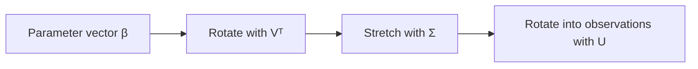

A very small singular value identifies a parameter direction that changes predictions only slightly. The data contain little information for distinguishing coefficients along that direction.

## 7.6 The pseudoinverse
<button class="read-details-btn" data-section="2b-6">✦ Read Details</button>

If every singular value is positive, invert the diagonal entries:

$$
X^+=V\Sigma^{-1}U^T.
$$

For a rank-deficient matrix, use the Moore–Penrose pseudoinverse. Singular values treated as zero are not inverted:

$$
\hat\beta=X^+y=V\Sigma^+U^Ty.
$$

When multiple coefficient vectors achieve the same minimum residual norm, the pseudoinverse returns the minimum-Euclidean-norm solution. That is a precise selection rule, not proof that the individual coefficients have become identifiable.

## 7.7 Construct an SVD least-squares solver

```python
import numpy as np


def svd_least_squares(X, y, rcond=None):
    X = np.asarray(X, dtype=float)
    y = np.asarray(y, dtype=float)

    U, singular_values, Vt = np.linalg.svd(X, full_matrices=False)

    if rcond is None:
        rcond = np.finfo(float).eps * max(X.shape)

    tolerance = rcond * singular_values[0]
    keep = singular_values > tolerance

    inverse_singular_values = np.zeros_like(singular_values)
    inverse_singular_values[keep] = 1.0 / singular_values[keep]

    beta = Vt.T @ (inverse_singular_values * (U.T @ y))
    rank = int(np.sum(keep))

    return beta, rank, singular_values, tolerance


X = np.array(
    [
        [1.0, 1.0, 1000.0],
        [1.0, 2.0, 2000.0],
        [1.0, 3.0, 3000.0],
        [1.0, 4.0, 4000.0],
    ]
)
y = np.array([12.0, 19.0, 29.0, 38.0])

beta, rank, singular_values, tolerance = svd_least_squares(X, y)
beta_numpy = np.linalg.lstsq(X, y, rcond=None)[0]

print("Rank:", rank)
print("Singular values:", singular_values)
print("Tolerance:", tolerance)
print("SVD coefficients:", beta)
print("NumPy coefficients:", beta_numpy)

assert rank == 2
assert np.allclose(X @ beta, X @ beta_numpy)
```

The kilometre and metre columns are redundant. The coefficient vector returned by SVD is computable, but it should not be interpreted as two separately learned physical effects.

## 7.8 Rank is tolerance-dependent in numerical work

In exact mathematics, a singular value is either zero or nonzero. In floating-point computation, a value such as $10^{-15}$ may be numerical residue rather than meaningful information.

Numerical rank therefore asks:

> Which singular values are large enough to treat as genuine directions at the working precision and scale?

Changing the tolerance can change the reported rank. A research report should record the software, scaling, tolerance rule, and singular values when rank is substantively important.

## 7.9 Compare the three computational routes

| Route | Core operation | Strength | Main caution |
|---|---|---|---|
| Normal equations | Solve $X^TX\beta=X^Ty$ | Connects directly to derivation | Squares the condition number |
| QR | Solve $R\beta=Q^Ty$ | Stable and efficient for full-rank least squares | Rank deficiency needs pivoting or another strategy |
| SVD | Apply $V\Sigma^+U^Ty$ | Reveals rank and weak directions | More computational work |
| `np.linalg.lstsq` | Library-selected least-squares routine | Appropriate default in application code | Still requires interpretation of rank and conditioning |

“Use `lstsq`” is now earned advice: the learner understands the objective, normal equations, QR route, SVD route, and rank issue beneath the function call.

## 7.10 Figure lab: singular values on a log scale

```python
import numpy as np
import matplotlib.pyplot as plt

rng = np.random.default_rng(24)
x1 = rng.normal(size=120)
x2 = 2.0 * x1 + rng.normal(0.0, 1e-4, size=120)
x3 = rng.normal(size=120)
X = np.column_stack([np.ones(120), x1, x2, x3])

singular_values = np.linalg.svd(X, compute_uv=False)

fig, ax = plt.subplots(figsize=(7, 4))
ax.plot(range(1, len(singular_values) + 1), singular_values, marker="o")
ax.set_yscale("log")
ax.set_xlabel("Singular-value index")
ax.set_ylabel("Singular value (log scale)")
ax.set_title("A near-duplicate feature creates a weak direction")
ax.grid(alpha=0.3)
plt.tight_layout()
plt.show()
```

The plot is a spectrum: it shows how strongly the design matrix represents different directions. A sharp fall to a tiny final singular value is a warning about coefficient stability.

## 7.11 Build: a stable deterministic estimator

```python
import numpy as np


class StableOLS:
    def __init__(self, fit_intercept=True):
        self.fit_intercept = fit_intercept

    def _design(self, X):
        X = np.asarray(X, dtype=float)
        if X.ndim != 2:
            raise ValueError("X must be two-dimensional")
        if self.fit_intercept:
            return np.column_stack([np.ones(X.shape[0]), X])
        return X

    def fit(self, X, y):
        design = self._design(X)
        y = np.asarray(y, dtype=float)

        if y.ndim != 1 or y.shape[0] != design.shape[0]:
            raise ValueError("y must be one-dimensional and aligned with X")
        if not np.isfinite(design).all() or not np.isfinite(y).all():
            raise ValueError("X and y must contain only finite values")

        result = np.linalg.lstsq(design, y, rcond=None)
        self.parameters_, self.ssr_array_, self.rank_, self.singular_values_ = result
        self.n_parameters_ = design.shape[1]
        self.condition_number_ = np.linalg.cond(design)
        self.is_full_rank_ = self.rank_ == self.n_parameters_
        return self

    def predict(self, X):
        if not hasattr(self, "parameters_"):
            raise RuntimeError("Fit the model before prediction")
        return self._design(X) @ self.parameters_
```

This class makes two diagnostics first-class outputs: rank and condition number. It does not silently turn a computational answer into an interpretive claim.

## 7.12 Day 7 build, break, and reflect

**Build**

1. Fit the same training data using normal equations, QR, SVD, and `lstsq`.
2. Compare predictions, coefficients, rank, singular values, and condition number.
3. Explain why predictions can agree even when rank-deficient coefficients are not unique.

**Break**

1. Add capacity in both kW and watts.
2. Add a near-copy of road distance.
3. Perturb one road-distance value by $10^{-6}$.
4. Compare coefficient changes with prediction changes.

**Reflect**

Write two separate conclusions:

- one about predictive stability; and
- one about coefficient interpretability.

### Day 7 exit check

Without looking back, complete the chain:

$$
X=QR\quad\Rightarrow\quad \underline{\hspace{3cm}}
$$

and:

$$
X=U\Sigma V^T\quad\Rightarrow\quad \hat\beta=\underline{\hspace{3cm}}.
$$

Then explain what a tiny singular value means in one sentence a nontechnical manager could understand.

---

# Day 8 — Probability, Likelihood, and Uncertainty

> **Today’s central idea:** OLS can be fitted without a probability model. To make classical probability statements about coefficients and future outcomes, we must add assumptions and state them openly.

## 8.1 Deterministic fit versus stochastic model

So far, $y$ and $X$ have been arrays and OLS has been a geometric optimisation:

$$
\hat\beta=\arg\min_\beta \lVert y-X\beta\rVert_2^2.
$$

No probability distribution was required to calculate that projection.

A statistical model adds a claim about how outcomes vary:

$$
y=X\beta+\varepsilon.
$$

Here:

- $\beta$ is an unknown population parameter vector;
- $X\beta$ is the systematic component specified by the model; and
- $\varepsilon$ is a random error vector representing influences not captured by $X\beta$.

The word *error* does not mean a data-entry mistake. It means the difference between the outcome and the model’s conditional mean in the assumed data-generating process.

## 8.2 Error terms are not residuals

The unobserved error for project $i$ is:

$$
\varepsilon_i=y_i-x_i^T\beta.
$$

The observed residual after fitting is:

$$
e_i=y_i-x_i^T\hat\beta.
$$

We never observe the true $\beta$, so we do not observe the true errors. Residuals are estimates shaped by the fitted model. For OLS with an intercept, they also obey constraints such as summing to zero. Treating residuals as independent raw observations is therefore unsafe.

## 8.3 A probability distribution describes possible values

For a continuous random variable $Y$, a probability density $f(y)$ describes relative density around possible values. Probability over an interval is area:

$$
P(a\le Y\le b)=\int_a^b f(y)\,dy.
$$

For a Gaussian—or normal—random variable with mean $\mu$ and variance $\sigma^2$:

$$
f(y\mid\mu,\sigma^2)
=\frac{1}{\sqrt{2\pi\sigma^2}}
\exp\left[-\frac{(y-\mu)^2}{2\sigma^2}\right].
$$

Read the equation in parts:

- the density is centred at $\mu$;
- $\sigma$ controls the horizontal spread;
- deviations are squared, so equal positive and negative deviations have equal density; and
- the exponential makes large deviations progressively less likely under the model.

## 8.4 The classical Gaussian linear model
<button class="read-details-btn" data-section="2c-4">✦ Read Details</button>

One common model assumes:

$$
Y_i\mid X_i=x_i \sim \mathcal N(x_i^T\beta,\sigma^2).
$$

Equivalently:

$$
\varepsilon\sim\mathcal N(0,\sigma^2I).
$$

This compact statement contains several assumptions:

1. the conditional mean is linear in the chosen design columns;
2. errors have conditional mean zero;
3. errors have a common conditional variance $\sigma^2$;
4. errors are independent under the sampling model; and
5. errors are Gaussian for the exact finite-sample distributional results developed below.

These assumptions are not automatically true because `LinearRegression()` ran successfully.

## 8.5 Likelihood reverses the question
<button class="read-details-btn" data-section="2c-5">✦ Read Details</button>

A probability model asks:

> If $\beta$ and $\sigma^2$ were known, how plausible would different datasets be?

Likelihood asks:

> Given the dataset we observed, which parameter values make it most plausible under the model?

For independent observations, multiply their Gaussian densities:

$$
L(\beta,\sigma^2\mid X,y)
=\prod_{i=1}^{n}
\frac{1}{\sqrt{2\pi\sigma^2}}
\exp\left[-\frac{(y_i-x_i^T\beta)^2}{2\sigma^2}\right].
$$

The likelihood is a function of the parameters with the observed data held fixed. It is not the probability that a fixed parameter is true.

## 8.6 Why we use the log-likelihood

Products of many small densities can underflow numerically. The logarithm turns products into sums and preserves the location of the maximum because the logarithm is strictly increasing.

Take logs:

$$
\ell(\beta,\sigma^2)
=-\frac{n}{2}\log(2\pi)
-\frac{n}{2}\log(\sigma^2)
-\frac{1}{2\sigma^2}
\sum_{i=1}^{n}(y_i-x_i^T\beta)^2.
$$

For a fixed $\sigma^2$, the first two terms do not depend on $\beta$. Maximising the log-likelihood therefore means minimising:

$$
\sum_i(y_i-x_i^T\beta)^2.
$$

Thus, under the Gaussian equal-variance model:

$$
\boxed{\text{maximum likelihood for }\beta=\text{ordinary least squares}.}
$$

This is a bridge between optimisation and probability—not a claim that every least-squares dataset is Gaussian.

## 8.7 Code proof: the likelihood and SSR choose the same slope

```python
import numpy as np

x = np.array([1.0, 2.0, 3.0, 4.0])
y = np.array([11.0, 18.0, 31.0, 39.0])
sigma = 2.0


def ssr(beta_0, beta_1):
    residuals = y - (beta_0 + beta_1 * x)
    return np.sum(residuals**2)


def gaussian_log_likelihood(beta_0, beta_1, sigma):
    residuals = y - (beta_0 + beta_1 * x)
    n = y.size
    return (
        -0.5 * n * np.log(2.0 * np.pi)
        - n * np.log(sigma)
        - np.sum(residuals**2) / (2.0 * sigma**2)
    )


beta_0_grid = np.linspace(-5.0, 15.0, 401)
beta_1_grid = np.linspace(5.0, 15.0, 401)

best_ssr = (np.inf, None)
best_likelihood = (-np.inf, None)

for beta_0 in beta_0_grid:
    for beta_1 in beta_1_grid:
        current_ssr = ssr(beta_0, beta_1)
        current_log_likelihood = gaussian_log_likelihood(beta_0, beta_1, sigma)

        if current_ssr < best_ssr[0]:
            best_ssr = (current_ssr, (beta_0, beta_1))
        if current_log_likelihood > best_likelihood[0]:
            best_likelihood = (current_log_likelihood, (beta_0, beta_1))

print("SSR minimum:          ", best_ssr[1])
print("Likelihood maximum:   ", best_likelihood[1])
assert best_ssr[1] == best_likelihood[1]
```

The grid is intentionally inefficient. Its purpose is to verify the equivalence by two independently calculated criteria.

## 8.8 Estimating the unexplained variance

After fitting $k$ parameters, including the intercept, calculate:

$$
SSR=e^Te.
$$

Under the classical linear model, an unbiased estimator of $\sigma^2$ is:

$$
s^2=\frac{SSR}{n-k}.
$$

Why $n-k$ rather than $n$? Fitting $k$ independent parameters imposes $k$ constraints and uses $k$ degrees of freedom. Only $n-k$ residual degrees of freedom remain for estimating noise.

The maximum-likelihood estimator of $\sigma^2$ under the Gaussian model uses $SSR/n$. The two formulas answer slightly different estimation criteria. This is another example of why denominators must be connected to purpose.

## 8.9 Sampling variability of the OLS coefficients

Under the classical assumptions and treating $X$ as fixed:

$$
\hat\beta\sim\mathcal N\left(\beta,\sigma^2(X^TX)^{-1}\right).
$$

Replace unknown $\sigma^2$ with $s^2$:

$$
\widehat{\operatorname{Var}}(\hat\beta)
=s^2(X^TX)^{-1}.
$$

The standard error of coefficient $j$ is the square root of diagonal element $j$:

$$
SE(\hat\beta_j)
=\sqrt{\left[s^2(X^TX)^{-1}\right]_{jj}}.
$$

A large standard error can arise from substantial outcome noise, limited sample size, narrow feature variation, or multicollinearity. It is not simply a sign that the fitting code failed.

## 8.10 Confidence interval for a coefficient
<button class="read-details-btn" data-section="2c-10">✦ Read Details</button>

A two-sided $100(1-\alpha)\%$ interval is:

$$
\hat\beta_j
\pm
t_{1-\alpha/2,\,n-k}\,SE(\hat\beta_j).
$$

In a frequentist interpretation, the parameter is fixed and the interval is random before sampling. If the entire sampling-and-interval procedure were repeated under its assumptions, a proportion $1-\alpha$ of those intervals would contain the true parameter. It is not strictly correct to say there is a 95% probability that this one fixed-parameter interval contains $\beta_j$.

## 8.11 Confidence interval versus prediction interval
<button class="read-details-btn" data-section="2c-11">✦ Read Details</button>

For a new feature row $x_0$, the estimated conditional mean is:

$$
\hat y_0=x_0^T\hat\beta.
$$

The standard error for the **mean response** is:

$$
SE_{\text{mean}}(x_0)
=s\sqrt{x_0^T(X^TX)^{-1}x_0}.
$$

The standard error for one **new project outcome** is:

$$
SE_{\text{prediction}}(x_0)
=s\sqrt{1+x_0^T(X^TX)^{-1}x_0}.
$$

The extra 1 represents irreducible project-to-project noise. Therefore a prediction interval for an individual new project is wider than a confidence interval for the mean cost of many comparable projects.

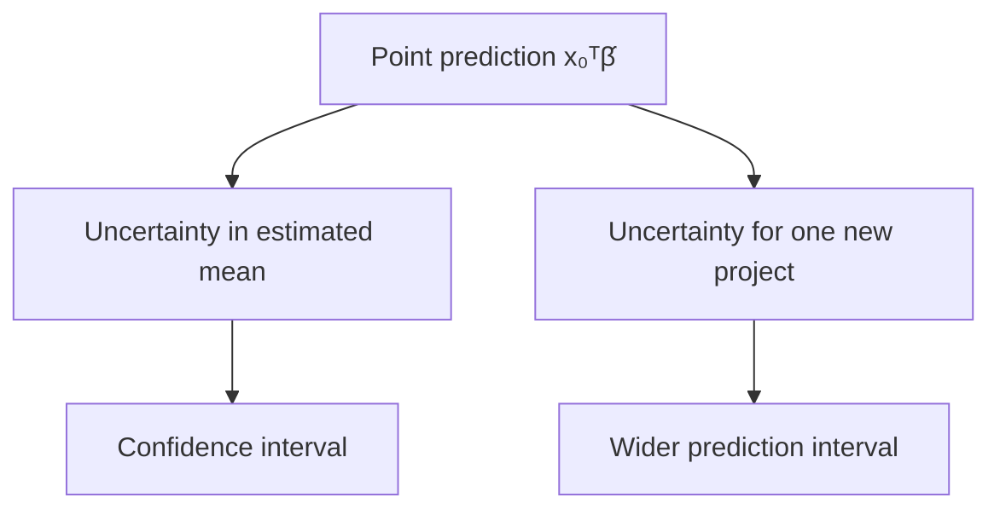

## 8.12 Build: `GaussianOLS`

```python
import numpy as np
from scipy.stats import t


class GaussianOLS(StableOLS):
    def fit(self, X, y):
        super().fit(X, y)
        design = self._design(X)
        y = np.asarray(y, dtype=float)

        if not self.is_full_rank_:
            raise ValueError(
                "Classical coefficient intervals require an identified full-rank design"
            )

        self.residuals_ = y - design @ self.parameters_
        self.ssr_ = self.residuals_ @ self.residuals_
        self.degrees_of_freedom_ = design.shape[0] - design.shape[1]

        if self.degrees_of_freedom_ <= 0:
            raise ValueError("Not enough residual degrees of freedom")

        self.residual_variance_ = self.ssr_ / self.degrees_of_freedom_
        xtx_inverse = np.linalg.inv(design.T @ design)
        self.covariance_ = self.residual_variance_ * xtx_inverse
        self.standard_errors_ = np.sqrt(np.diag(self.covariance_))
        self.xtx_inverse_ = xtx_inverse
        return self

    def coefficient_intervals(self, confidence=0.95):
        alpha = 1.0 - confidence
        critical = t.ppf(1.0 - alpha / 2.0, self.degrees_of_freedom_)
        margin = critical * self.standard_errors_
        return np.column_stack(
            [self.parameters_ - margin, self.parameters_ + margin]
        )

    def intervals_for(self, X_new, confidence=0.95):
        design_new = self._design(X_new)
        predictions = design_new @ self.parameters_

        leverage_new = np.einsum(
            "ij,jk,ik->i", design_new, self.xtx_inverse_, design_new
        )

        alpha = 1.0 - confidence
        critical = t.ppf(1.0 - alpha / 2.0, self.degrees_of_freedom_)

        mean_margin = critical * np.sqrt(
            self.residual_variance_ * leverage_new
        )
        prediction_margin = critical * np.sqrt(
            self.residual_variance_ * (1.0 + leverage_new)
        )

        return {
            "prediction": predictions,
            "mean_lower": predictions - mean_margin,
            "mean_upper": predictions + mean_margin,
            "prediction_lower": predictions - prediction_margin,
            "prediction_upper": predictions + prediction_margin,
        }
```

This class uses $(X^TX)^{-1}$ for the covariance formula after checking full rank. In more advanced work, use numerically stable decomposition-based routines and consider heteroskedasticity-robust or cluster-robust covariance estimators when their assumptions match the data structure.

## 8.13 Code laboratory: intervals widen away from the data centre

```python
import numpy as np

rng = np.random.default_rng(81)
x = rng.uniform(2.0, 20.0, size=80)
y = 10.0 + 1.8 * x + rng.normal(0.0, 3.0, size=80)

model = GaussianOLS().fit(x.reshape(-1, 1), y)
new_x = np.array([[2.0], [11.0], [20.0], [35.0]])
intervals = model.intervals_for(new_x)

for i, value in enumerate(new_x.ravel()):
    width = intervals["prediction_upper"][i] - intervals["prediction_lower"][i]
    print(f"x={value:5.1f}, prediction-interval width={width:6.2f}")
```

The interval is usually narrower near the centre of well-observed feature values and wider for extrapolation. The model is less certain about a mean where the design provides less information.

## 8.14 Assumption map: which claim needs which support?

| Claim | Key requirements |
|---|---|
| `lstsq` found a least-squares solution | Valid finite arrays and a correct computation |
| The coefficient vector is unique | Full column rank |
| The fitted relationship predicts similar new projects | Representative evaluation under the deployment distribution |
| Classical standard errors are valid | Correct mean structure plus the variance and dependence assumptions used by the formula |
| A coefficient is causal | A defensible causal design, not merely Gaussian residuals |

Normal-looking residuals do not solve confounding. Conversely, non-normal residuals do not prove that the fitted least-squares projection was calculated incorrectly.

## 8.15 Break it: heteroskedastic project costs

The synthetic generator intentionally makes noise increase with road distance. This is heteroskedasticity: conditional variance changes across observations.

```python
import numpy as np
import matplotlib.pyplot as plt

rng = np.random.default_rng(82)
road = rng.uniform(0.0, 35.0, size=250)
noise_sd = 1.0 + 0.25 * road
cost = 12.0 + 1.4 * road + rng.normal(0.0, noise_sd)

model = StableOLS().fit(road.reshape(-1, 1), cost)
pred = model.predict(road.reshape(-1, 1))
residual = cost - pred

fig, ax = plt.subplots(figsize=(7, 4))
ax.scatter(pred, residual, alpha=0.65)
ax.axhline(0.0, color="black", linewidth=1)
ax.set_xlabel("Fitted cost")
ax.set_ylabel("Residual")
ax.set_title("Fan-shaped residuals signal changing variance")
plt.tight_layout()
plt.show()
```

The OLS line may still estimate a useful conditional mean under suitable conditions, but the equal-variance standard-error formula and a constant-width uncertainty story are questionable.

## 8.16 Day 8 build, break, and reflect

**Build**

1. Fit `GaussianOLS` to a small full-rank subset of the MHP features.
2. Report coefficient estimates, standard errors, and intervals with units.
3. Construct a confidence interval for mean cost and a prediction interval for an individual project.

**Break**

1. Add a redundant column and observe why the classical interval method refuses to proceed.
2. Create variance that grows with road distance.
3. Fit a straight line to a curved relationship.
4. State which assumptions each break threatens.

**Reflect**

Complete this sentence precisely:

> “Assuming the linear mean, independence, equal variance, Gaussian finite-sample model, and the stated sampling process are adequate, the interval means …”

### Day 8 exit check

You are ready for Day 9 when you can distinguish:

- parameter, estimate, error, and residual;
- probability and likelihood;
- residual standard deviation and coefficient standard error; and
- confidence interval for a mean from prediction interval for one new project.

---

# Day 9 — Gradient Descent from the OLS Gradient

> **Today’s central idea:** Gradient descent repeatedly moves parameters downhill. The OLS gradient derived in Chapter 1 tells us both the direction and the size of the local slope.

## 9.1 Why learn an iterative method when OLS has direct solvers?

For a moderate linear regression, QR or SVD is usually preferable. Gradient descent is introduced because the same optimisation logic extends to models that have no convenient closed-form solution and to datasets too large for some direct operations.

The learner should not conclude that iterative means better. The method must match the problem.

## 9.2 Choose the objective carefully
<button class="read-details-btn" data-section="2d-2">✦ Read Details</button>

Use mean squared error as the training objective:

$$
J(\beta)=\frac{1}{n}\lVert y-X\beta\rVert_2^2.
$$

Chapter 1 derived the gradient of SSR. Dividing by $n$ gives:

$$
\nabla_\beta J(\beta)
=\frac{2}{n}X^T(X\beta-y).
$$

Shapes:

| Quantity | Shape |
|---|---:|
| $X$ | $n\times k$ |
| $\beta$ | $k$ |
| $X\beta-y$ | $n$ |
| $X^T(X\beta-y)$ | $k$ |

The gradient has one component per parameter.

## 9.3 The update rule
<button class="read-details-btn" data-section="2d-3">✦ Read Details</button>

Starting from $\beta^{(0)}$, repeat:

$$
\beta^{(t+1)}
=\beta^{(t)}-\eta\nabla J\left(\beta^{(t)}\right),
$$

where $\eta>0$ is the learning rate.

- The minus sign moves downhill.
- A very small $\eta$ makes slow progress.
- A very large $\eta$ can overshoot, oscillate, or diverge.
- Stopping after a fixed number of steps is simple but may stop too early or waste work.

## 9.4 A one-parameter numerical walk

For a through-origin model $\hat y=\beta x$:

```python
import numpy as np

x = np.array([1.0, 2.0, 3.0])
y = np.array([2.0, 4.0, 7.0])
beta = 0.0
learning_rate = 0.05

for step in range(20):
    predictions = beta * x
    gradient = (2.0 / x.size) * np.sum(x * (predictions - y))
    loss = np.mean((y - predictions) ** 2)
    print(f"step={step:02d} beta={beta:8.4f} loss={loss:8.4f}")
    beta = beta - learning_rate * gradient
```

Do not merely run it. Change the learning rate to `0.0001`, `0.2`, and `1.0`. Record the behaviour.

## 9.5 Why scaling changes the optimisation landscape

With two features, MSE forms a bowl in parameter space. If one feature is numerically much larger than another, the bowl can be long and narrow. A single learning rate then causes the algorithm to zigzag across the steep direction while crawling along the shallow direction.

Standardisation makes the curvature more balanced. It does not guarantee perfect convergence, but it often makes a useful learning rate easier to find.

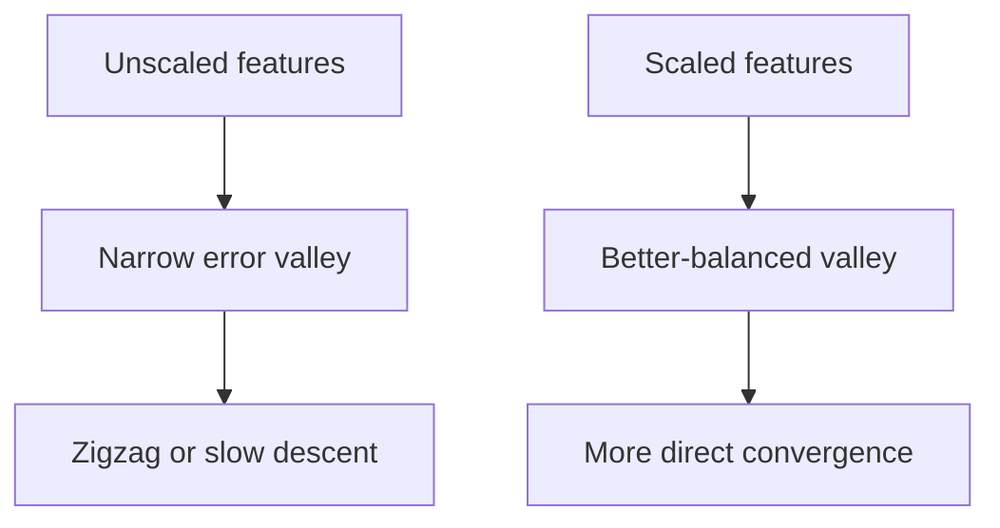

## 9.6 Build batch gradient descent from scratch

```python
import numpy as np


class GradientDescentOLS:
    def __init__(
        self,
        learning_rate=0.05,
        max_iter=20_000,
        tolerance=1e-10,
        fit_intercept=True,
    ):
        self.learning_rate = learning_rate
        self.max_iter = max_iter
        self.tolerance = tolerance
        self.fit_intercept = fit_intercept

    def _design(self, X):
        X = np.asarray(X, dtype=float)
        if X.ndim != 2:
            raise ValueError("X must be two-dimensional")
        if self.fit_intercept:
            return np.column_stack([np.ones(X.shape[0]), X])
        return X

    def fit(self, X, y):
        design = self._design(X)
        y = np.asarray(y, dtype=float)

        if y.ndim != 1 or y.size != design.shape[0]:
            raise ValueError("y must be one-dimensional and aligned with X")
        if not np.isfinite(design).all() or not np.isfinite(y).all():
            raise ValueError("X and y must contain finite values")

        n, k = design.shape
        beta = np.zeros(k)
        self.loss_history_ = []

        for iteration in range(self.max_iter):
            residual_direction = design @ beta - y
            loss = np.mean(residual_direction**2)
            gradient = (2.0 / n) * design.T @ residual_direction

            if not np.isfinite(loss) or not np.isfinite(gradient).all():
                raise FloatingPointError(
                    "Optimisation diverged; inspect scaling and learning rate"
                )

            self.loss_history_.append(loss)
            new_beta = beta - self.learning_rate * gradient

            if np.linalg.norm(new_beta - beta) < self.tolerance:
                beta = new_beta
                self.n_iter_ = iteration + 1
                break

            beta = new_beta
        else:
            self.n_iter_ = self.max_iter

        self.parameters_ = beta
        return self

    def predict(self, X):
        if not hasattr(self, "parameters_"):
            raise RuntimeError("Fit the model before prediction")
        return self._design(X) @ self.parameters_
```

## 9.7 Code proof: gradient descent approaches the SVD solution

```python
import numpy as np

rng = np.random.default_rng(91)
X_raw = rng.normal(size=(200, 3)) * np.array([500.0, 12.0, 2.0])
y = 15.0 + X_raw @ np.array([0.025, 0.9, 2.5]) + rng.normal(0.0, 1.0, size=200)

scaler = StandardScalerFromScratch()
X_scaled = scaler.fit_transform(X_raw)

gd = GradientDescentOLS(learning_rate=0.08, max_iter=50_000).fit(X_scaled, y)
svd = StableOLS().fit(X_scaled, y)

print("Iterations:", gd.n_iter_)
print("Gradient-descent parameters:", gd.parameters_)
print("SVD/lstsq parameters:       ", svd.parameters_)
print("Final loss:", gd.loss_history_[-1])

assert np.allclose(gd.parameters_, svd.parameters_, atol=1e-5)
```

The two methods minimise the same convex objective. Their agreement is an important implementation test.

## 9.8 A finite-difference gradient check

A bug in the gradient can produce smooth-looking but wrong learning. Check the analytic gradient against small numerical perturbations:

```python
import numpy as np

rng = np.random.default_rng(92)
X = np.column_stack([np.ones(30), rng.normal(size=(30, 2))])
y = rng.normal(size=30)
beta = np.array([0.4, -0.7, 1.1])


def mse(beta_vector):
    return np.mean((y - X @ beta_vector) ** 2)


analytic = (2.0 / X.shape[0]) * X.T @ (X @ beta - y)
numeric = np.zeros_like(beta)
h = 1e-6

for j in range(beta.size):
    unit = np.zeros_like(beta)
    unit[j] = 1.0
    numeric[j] = (mse(beta + h * unit) - mse(beta - h * unit)) / (2.0 * h)

print("Analytic gradient:", analytic)
print("Numerical gradient:", numeric)
assert np.allclose(analytic, numeric, rtol=1e-6, atol=1e-8)
```

## 9.9 Convergence diagnostics

Do not print only the final coefficients. Inspect the learning process:

```python
import matplotlib.pyplot as plt

fig, ax = plt.subplots(figsize=(7, 4))
ax.plot(gd.loss_history_)
ax.set_xlabel("Iteration")
ax.set_ylabel("Training MSE")
ax.set_title("Gradient-descent learning curve")
ax.set_yscale("log")
ax.grid(alpha=0.3)
plt.tight_layout()
plt.show()
```

Typical patterns:

| Pattern | Possible meaning | Response |
|---|---|---|
| Smooth decrease to a plateau | Convergence | Check gradient norm and agreement with `lstsq` |
| Very slow decrease | Learning rate too small or poor scaling | Scale features; adjust learning rate |
| Oscillation | Learning rate too large | Reduce learning rate |
| Exploding or non-finite loss | Divergence | Stop; inspect scale, sign, and gradient formula |
| Training loss falls but validation loss rises | Overfitting or distribution mismatch | Evaluation issue, not an optimiser victory |

## 9.10 Batch, stochastic, and mini-batch gradient descent

The implementation above uses every training row for each gradient. This is **batch gradient descent**.

- **Stochastic gradient descent (SGD):** update using one randomly selected observation at a time.
- **Mini-batch gradient descent:** update using a small subset of rows.

Stochastic updates are noisy but cheap and can scale to large datasets. Their behaviour depends on data order, learning-rate schedules, batching, and randomness. Later chapters will study these topics in depth. For this chapter, the full-batch method keeps the equation and code directly aligned.

## 9.11 Parameters versus hyperparameters

This distinction becomes concrete here.

| Type | Example | How obtained |
|---|---|---|
| Parameter | Intercept and feature coefficients | Learned by minimising training loss |
| Hyperparameter | Learning rate | Chosen outside the gradient update |
| Hyperparameter | Maximum iterations | Chosen outside fitting |
| Hyperparameter | Decision-tree depth | Chosen during model selection |

If the validation set guides the learning rate, it has influenced model selection. That is legitimate—provided the final test set remains separate.

## 9.12 Break it deliberately

Run the same problem under four conditions:

1. raw features with learning rate 0.08;
2. scaled features with learning rate 0.08;
3. scaled features with learning rate 2.0; and
4. scaled features with the gradient sign accidentally reversed.

For each case, record:

- first loss;
- final loss;
- number of iterations;
- whether values remained finite; and
- maximum coefficient difference from `np.linalg.lstsq`.

The aim is to make failure recognisable before it occurs in a more complicated model.

## 9.13 Day 9 build, break, and reflect

**Build**

1. Fit scaled MHP numeric features with `GradientDescentOLS`.
2. Verify the gradient by finite differences.
3. Verify final coefficients and predictions against `StableOLS`.
4. Plot loss by iteration.

**Break**

1. Remove scaling.
2. Increase the learning rate until loss diverges.
3. Stop after five iterations.
4. Explain why each final coefficient vector is or is not trustworthy.

**Reflect**

Answer: if two algorithms reach the same minimum training MSE, have they demonstrated the same performance on new projects? Explain why the answer prepares the next day.

### Day 9 exit check

Write the MSE gradient and update rule from memory. Then identify which quantities are learned parameters and which are chosen hyperparameters.

---

# Day 10 — Generalisation, Baselines, and Model Complexity

> **Today’s central idea:** Machine learning is not the production of a small training error. It is the construction of a rule that performs usefully on new cases drawn from the conditions for which it is intended.

## 10.1 Training is an information boundary

Let a learning procedure receive training data $D_{\text{train}}$ and return a fitted prediction function:

$$
\hat f=\mathcal A(D_{\text{train}}).
$$

Here $\mathcal A$ includes more than the named algorithm. It may include:

- feature definitions;
- missing-value handling;
- scaling and encoding;
- model family;
- hyperparameter search;
- random seeds; and
- model-selection rules.

The whole procedure learns from data. An honest evaluation must reproduce that procedure using only the permitted training information.

## 10.2 Empirical risk and generalisation risk

For a loss function $L$, training—or empirical—risk is:

$$
\widehat R_{\text{train}}(f)
=\frac{1}{n_{\text{train}}}
\sum_{i\in\text{train}}L(y_i,f(x_i)).
$$

The population generalisation risk is:

$$
R(f)=\mathbb E_{(X,Y)\sim P_{\text{deployment}}}
\left[L(Y,f(X))\right].
$$

The expectation is over the deployment distribution—the projects the model will actually face. That distribution is not visible in full. A held-out sample is useful only insofar as its construction represents the deployment question.

## 10.3 The constant baseline is a real model
<button class="read-details-btn" data-section="2e-3">✦ Read Details</button>

A baseline is not an insult to the data. It defines the minimum comparison a feature-using model must beat.

For a constant squared-error predictor $c$, minimise:

$$
S(c)=\sum_{i=1}^{n}(y_i-c)^2.
$$

Differentiate:

$$
\frac{dS}{dc}=-2\sum_i(y_i-c).
$$

Set the derivative to zero:

$$
\sum_i y_i-nc=0
\quad\Rightarrow\quad
\hat c=\bar y.
$$

Therefore the training mean is the best constant prediction under squared error.

For absolute error:

$$
A(c)=\sum_i|y_i-c|,
$$

any sample median minimises the objective. Intuitively, moving $c$ right reduces the error for points to its right but increases the error for points to its left; a median balances those counts.

## 10.4 Code proof: search for the best constant

```python
import numpy as np

y = np.array([10.0, 12.0, 13.0, 14.0, 60.0])
candidates = np.linspace(0.0, 70.0, 70_001)

squared_losses = np.array([np.mean((y - c) ** 2) for c in candidates])
absolute_losses = np.array([np.mean(np.abs(y - c)) for c in candidates])

best_squared = candidates[np.argmin(squared_losses)]
best_absolute = candidates[np.argmin(absolute_losses)]

print("Mean:", y.mean(), "grid squared-error optimum:", best_squared)
print("Median:", np.median(y), "grid absolute-error optimum:", best_absolute)

assert np.isclose(best_squared, y.mean(), atol=0.001)
assert np.isclose(best_absolute, np.median(y), atol=0.001)
```

The outlying value 60 pulls the mean much more than the median. Baseline choice and evaluation loss should match the decision problem.

## 10.5 What “better than baseline” means

Fit the baseline on the training target only:

$$
\hat y_i^{\text{baseline}}=\bar y_{\text{train}}.
$$

Then evaluate both baseline and candidate model on the same held-out rows with the same metric.

A candidate that fails to beat the baseline may have:

- weak or irrelevant features;
- incorrect data alignment;
- distribution shift;
- excessive complexity;
- insufficient training data; or
- leakage in an earlier, misleading experiment.

Failure to beat a baseline is a diagnostic result, not permission to hide the baseline.

## 10.6 Underfitting and overfitting
<button class="read-details-btn" data-section="2e-6">✦ Read Details</button>

**Underfitting** occurs when the learned rule is too restricted to capture useful structure. Both training and validation errors may be high.

**Overfitting** occurs when a flexible procedure adapts to idiosyncrasies of the training sample that do not repeat. Training error can be low while validation error is high.

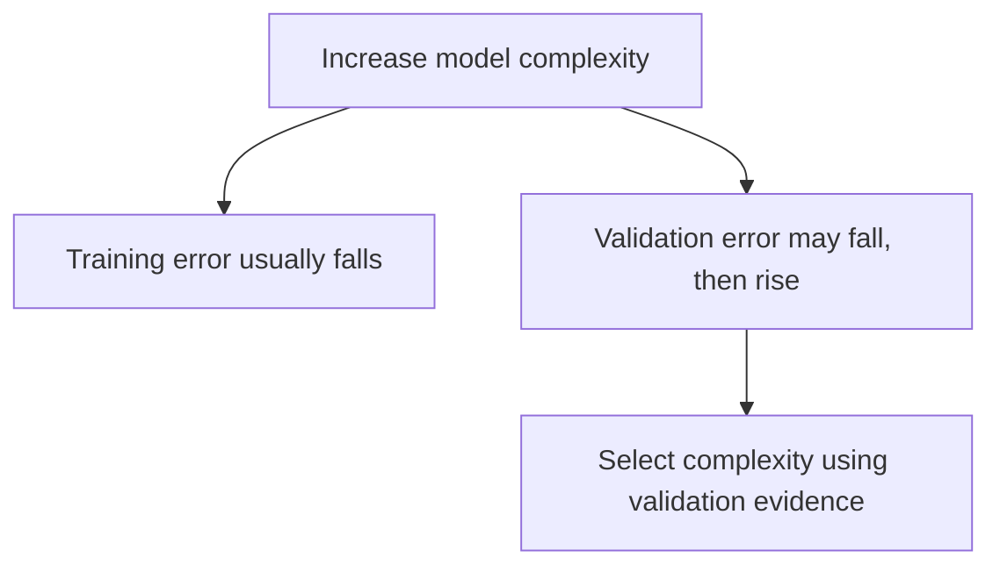

The model with the smallest training error is almost never a defensible automatic choice.

## 10.7 Bias–variance decomposition: a first research-level view
<button class="read-details-btn" data-section="2e-7">✦ Read Details</button>

Assume squared-error prediction at a fixed input $x_0$ and a data-generating relationship:

$$
Y=f(x_0)+\varepsilon,
\qquad
\mathbb E[\varepsilon]=0,
\qquad
\operatorname{Var}(\varepsilon)=\sigma^2.
$$

Imagine repeatedly drawing new training datasets and fitting $\hat f$. The expected test error at $x_0$ decomposes as:

$$
\mathbb E\left[(Y-\hat f(x_0))^2\right]
=\underbrace{\left(\mathbb E[\hat f(x_0)]-f(x_0)\right)^2}_{\text{squared bias}}
+\underbrace{\operatorname{Var}(\hat f(x_0))}_{\text{variance}}
+\underbrace{\sigma^2}_{\text{irreducible noise}}.
$$

Step-by-step:

1. Add and subtract $\mathbb E[\hat f(x_0)]$ inside the error.
2. Expand the square.
3. Cross-terms vanish under the stated expectations.
4. The remaining terms describe systematic miss, training-sample sensitivity, and outcome noise.

This is an expectation over repeated datasets, not something fully observed from one train/test split. “High bias” and “high variance” should not be assigned casually from a single plot.

## 10.8 A shallow decision tree as a nonlinear comparator

A regression tree divides feature space into regions. At a node, it considers a feature $j$ and threshold $s$:

$$
R_{\text{left}}(j,s)=\{x:x_j\le s\},
$$

$$
R_{\text{right}}(j,s)=\{x:x_j>s\}.
$$

For squared error, each leaf predicts the mean target among its training observations. A candidate split is chosen to minimise the combined within-child squared error:

$$
\sum_{i:x_i\in R_{\text{left}}}(y_i-\bar y_{\text{left}})^2
+
\sum_{i:x_i\in R_{\text{right}}}(y_i-\bar y_{\text{right}})^2.
$$

A tree is a piecewise-constant model. It can represent thresholds and interactions without manually adding polynomial or interaction columns.

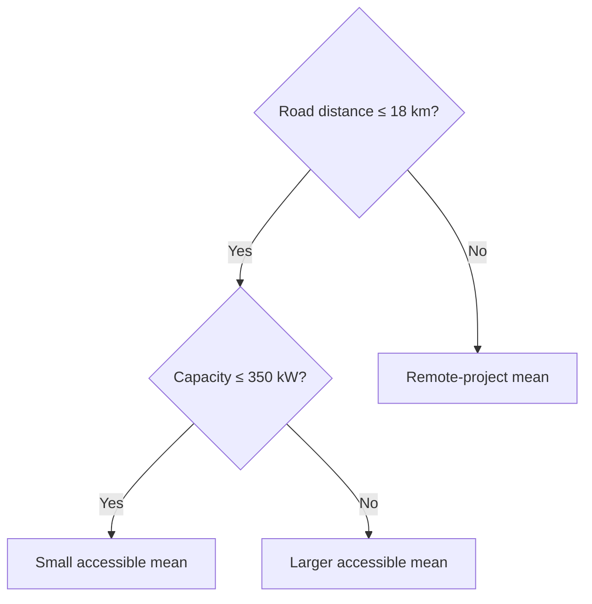

The displayed thresholds are illustrative. A fitted tree learns thresholds from its training data.

## 10.9 Why a shallow tree is a useful baseline

`max_depth` limits the number of successive splits along a path.

- Depth 0 is effectively one constant leaf.
- Small depth captures broad nonlinear structure.
- Large depth can create tiny leaves and memorise training observations.

Unlike linear regression, ordinary trees do not extrapolate a slope beyond the observed range. A leaf predicts a constant learned from its training region. This can be safer in some settings and badly limiting in others.

## 10.10 First library comparison

The following demonstration uses a single split only to make the API visible. Day 11 will decide which split is defensible.

```python
import numpy as np
import pandas as pd
from sklearn.dummy import DummyRegressor
from sklearn.linear_model import LinearRegression
from sklearn.metrics import mean_absolute_error
from sklearn.model_selection import train_test_split
from sklearn.tree import DecisionTreeRegressor

from chapter2_data import make_mhp_projects

df = make_mhp_projects()
features = [
    "planned_capacity_kw",
    "estimated_cable_km",
    "road_distance_km",
    "terrain_index",
]
target = "actual_cost_2025_million_pkr"

X_train, X_holdout, y_train, y_holdout = train_test_split(
    df[features],
    df[target],
    test_size=0.25,
    random_state=42,
)

models = {
    "training mean": DummyRegressor(strategy="mean"),
    "linear regression": LinearRegression(),
    "tree depth 3": DecisionTreeRegressor(max_depth=3, random_state=42),
    "unrestricted tree": DecisionTreeRegressor(random_state=42),
}

for name, model in models.items():
    model.fit(X_train, y_train)
    train_mae = mean_absolute_error(y_train, model.predict(X_train))
    holdout_mae = mean_absolute_error(y_holdout, model.predict(X_holdout))
    print(f"{name:20s} train MAE={train_mae:6.2f} holdout MAE={holdout_mae:6.2f}")
```

Expect the unrestricted tree to have extremely low training error. Whether it has the lowest holdout error is a separate empirical question.

## 10.11 Learning curves: is more data likely to help?

A learning curve plots performance as training size grows. It can reveal:

- a persistent high training and validation error: model/features may underfit;
- a large gap that narrows with more data: variance may be important;
- a gap that remains wide: the procedure may be too flexible or groups may be leaking; and
- unstable curves: sample size or split structure may be inadequate.

```python
import numpy as np
import matplotlib.pyplot as plt
from sklearn.linear_model import LinearRegression
from sklearn.metrics import mean_absolute_error

# Use a fixed chronological holdout for this illustration.
ordered = df.sort_values("start_year")
train_pool = ordered[ordered["start_year"] <= 2022]
future_holdout = ordered[ordered["start_year"] >= 2023]

fractions = np.linspace(0.2, 1.0, 8)
train_scores = []
future_scores = []

for fraction in fractions:
    subset = train_pool.sample(frac=fraction, random_state=42)
    model = LinearRegression().fit(subset[features], subset[target])
    train_scores.append(
        mean_absolute_error(subset[target], model.predict(subset[features]))
    )
    future_scores.append(
        mean_absolute_error(
            future_holdout[target], model.predict(future_holdout[features])
        )
    )

fig, ax = plt.subplots(figsize=(7, 4))
ax.plot(fractions * len(train_pool), train_scores, marker="o", label="training")
ax.plot(fractions * len(train_pool), future_scores, marker="o", label="future holdout")
ax.set_xlabel("Training projects")
ax.set_ylabel("MAE (million PKR)")
ax.set_title("Learning curve under a future-project holdout")
ax.legend()
ax.grid(alpha=0.3)
plt.tight_layout()
plt.show()
```

Because each point uses only one sampled subset, the curve itself is noisy. A fuller analysis repeats the sampling or uses cross-validation appropriate to the deployment structure.

## 10.12 Research paper discussion 1: Breiman’s “Two Cultures”

**Paper:** Leo Breiman (2001), [“Statistical Modeling: The Two Cultures”](https://projecteuclid.org/journals/statistical-science/volume-16/issue-3/Statistical-Modeling--The-Two-Cultures-with-comments-and-a/10.1214/ss/1009213726.full), *Statistical Science* 16(3), 199–231.

### The question

Breiman argued that data analysis contained two broad traditions:

- a **data-modeling culture**, which specifies a stochastic model and studies its parameters; and
- an **algorithmic modeling culture**, which treats the data-generating mechanism as largely unknown and prioritises predictive performance.

### The argument

He criticised excessive reliance on convenient stochastic models when their adequacy was weakly checked, and pressed for stronger use of predictive evaluation and algorithmic methods.

### What a beginner should learn

1. A transparent equation is not automatically true because it is interpretable.
2. High predictive accuracy does not automatically explain a mechanism or identify a cause.
3. Model checking must include out-of-sample evidence when the purpose is prediction.
4. The unit of comparison is a full modeling procedure, not mathematical elegance alone.

### Application to the MHP case

A planning unit may need both cultures:

- a linear or probabilistic model to communicate cost relationships and uncertainty; and
- an algorithmic comparator, such as a shallow tree, to test whether important nonlinear structure is being missed.

Neither purpose authorises a causal claim that improving a particular feature will reduce cost. That still requires a causal design.

### Limitation and debate

The two-cultures framing is intentionally provocative. Modern practice often combines prediction, structured probability models, domain knowledge, and causal reasoning. Read the paper and its published discussion as an argument that reshaped a debate, not as a command to choose one permanent camp.

### Reproduction prompt

Compare OLS and trees over increasing depth using a fixed, defensible validation design. Plot training and validation MAE. Identify where flexibility improves generalisation and where it begins fitting sample-specific noise.

## 10.13 Day 10 build, break, and reflect

**Build**

1. Fit the mean and median baselines.
2. Fit OLS, gradient-descent OLS, a depth-3 tree, and an unrestricted tree.
3. Report training and held-out errors separately.
4. Draw a learning curve.

**Break**

1. Select the model with the smallest training MAE.
2. Add the final material bill as a feature.
3. Increase tree depth until training error is nearly zero.
4. Explain why each action can create false confidence.

**Reflect**

Write one paragraph answering:

> Is the purpose of this MHP model to explain cost formation, predict new costs, or both? What evidence would each purpose require?

### Day 10 exit check

You should now be able to derive the mean baseline, explain why the median baseline differs, and identify a situation in which the best training model is the worst responsible choice.

---

# Day 11 — Honest Splitting, Leakage, and Cross-Validation

> **Today’s central idea:** A split is a simulation of deployment. Choose it by asking what will be new when the model is used: a new project, a new district, a future period, or some combination.

## 11.1 Three roles for data
<button class="read-details-btn" data-section="2f-1">✦ Read Details</button>

| Partition | Permitted use | Not permitted |
|---|---|---|
| Training | Fit preprocessing and model parameters | Final performance claim |
| Validation | Choose features, model family, and hyperparameters | Repeated use followed by calling it an untouched test |
| Test | One final estimate after the procedure is fixed | Model tuning, threshold choice, feature revision |

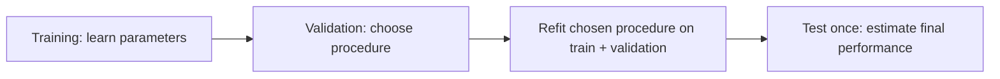

The exact percentages are not universal. A 60/20/20 split is a teaching example, not a law. Sample size, group structure, time, and the cost of uncertainty determine a defensible design.

## 11.2 Random split: new exchangeable projects
<button class="read-details-btn" data-section="2f-2">✦ Read Details</button>

A random split asks whether the fitted procedure generalises to new observations assumed to arise from roughly the same distribution as the training observations.

It may be reasonable when:

- observations are independent enough for the purpose;
- there are no repeated entities spanning both partitions;
- time ordering is irrelevant; and
- deployment covers the same mixture of districts and conditions.

It is not the default answer to every dataset.

## 11.3 Group split: new independent groups

Projects within one district may share roads, contractors, administrative practices, survey teams, and shocks. A random split can place highly related projects on both sides. Performance then partly measures recognition of shared group structure.

If deployment is to a district absent from training, hold out entire districts:

$$
G_{\text{train}}\cap G_{\text{test}}=\varnothing.
$$

The group used for splitting need not be an input feature. It identifies dependence or the unit of intended transfer.

## 11.4 Temporal split: future conditions

When predicting future projects, preserve time order:

$$
\max(t_{\text{train}})<\min(t_{\text{test}}).
$$

An expanding-window evaluation is often useful:

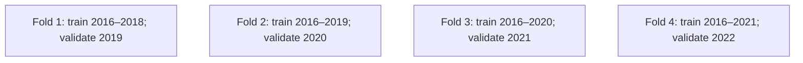

Future prediction can fail because relationships, measurement, procurement, technology, or the mixture of projects changes. This is distribution shift, not merely random sampling noise.

## 11.5 A deployment-question table

| Intended deployment | Evaluation design |
|---|---|
| New projects in already represented districts under stable conditions | Random split may be adequate |
| New projects in a district not represented in training | Group holdout by district |
| Projects initiated in later years | Temporal split or forward-chaining validation |
| Future projects in unseen districts | Combined time-and-group design; expect high uncertainty |
| Repeated measurements of the same project | Keep all rows from a project in one partition |

When the desired deployment has little or no analogue in the data, no clever splitter can manufacture evidence. The correct conclusion may be that external validation data are needed.

## 11.6 Leakage: information crosses the boundary
<button class="read-details-btn" data-section="2f-6">✦ Read Details</button>

Leakage occurs when the training or selection process receives information it would not legitimately possess at deployment or final evaluation.

### Target leakage

A feature contains the target or a post-outcome proxy. The final material bill is an obvious MHP example.

### Preprocessing leakage

Means, standard deviations, imputation values, categories, feature selection, or transformations are fitted using validation/test rows.

### Temporal leakage

Future information helps predict the past, or a feature is recorded after the prediction date.

### Group leakage

Related observations from the same district, household, patient, contractor, or project appear in both train and evaluation sets when the intended deployment requires new groups.

### Duplicate leakage

Exact or near-duplicate records cross partitions.

### Test-set leakage

The analyst repeatedly examines test performance and changes the procedure. The test set becomes an informal validation set.

### Label leakage through data cleaning

Even “cleaning” can leak. For example, deleting unusual feature rows only after observing that their targets are hard to predict uses outcome information to define the sample.

## 11.7 Break it: a leaky feature creates a spectacular score

```python
from sklearn.linear_model import LinearRegression
from sklearn.metrics import mean_absolute_error
from sklearn.model_selection import train_test_split

from chapter2_data import make_mhp_projects

df = make_mhp_projects()
target = "actual_cost_2025_million_pkr"
legitimate = [
    "planned_capacity_kw",
    "estimated_cable_km",
    "road_distance_km",
    "terrain_index",
]
leaky = legitimate + ["final_material_bill_million_pkr"]

train_idx, test_idx = train_test_split(
    df.index, test_size=0.25, random_state=42
)

for label, columns in [("legitimate", legitimate), ("leaky", leaky)]:
    model = LinearRegression().fit(df.loc[train_idx, columns], df.loc[train_idx, target])
    predictions = model.predict(df.loc[test_idx, columns])
    mae = mean_absolute_error(df.loc[test_idx, target], predictions)
    print(label, "MAE:", round(mae, 3))
```

The leaky score is not a better appraisal model. It answers a different and largely useless question: how well can final cost be reconstructed after much of the cost is already known?

## 11.8 Pipelines protect the fitting boundary

A pipeline joins learned preprocessing and the model so that each cross-validation training fold fits its own transformations.

```python
import numpy as np
from sklearn.compose import ColumnTransformer
from sklearn.impute import SimpleImputer
from sklearn.linear_model import LinearRegression
from sklearn.pipeline import Pipeline
from sklearn.preprocessing import OneHotEncoder, StandardScaler

numeric_features = [
    "planned_capacity_kw",
    "estimated_cable_km",
    "road_distance_km",
    "terrain_index",
]
categorical_features = ["district"]

numeric_pipeline = Pipeline(
    steps=[
        ("impute", SimpleImputer(strategy="median")),
        ("scale", StandardScaler()),
    ]
)

categorical_pipeline = Pipeline(
    steps=[
        ("impute", SimpleImputer(strategy="most_frequent")),
        (
            "one_hot",
            OneHotEncoder(handle_unknown="ignore", drop="first"),
        ),
    ]
)

preprocessor = ColumnTransformer(
    transformers=[
        ("numeric", numeric_pipeline, numeric_features),
        ("categorical", categorical_pipeline, categorical_features),
    ]
)

linear_pipeline = Pipeline(
    steps=[
        ("preprocess", preprocessor),
        ("model", LinearRegression()),
    ]
)
```

The order is `fit` preprocessing on the current training fold, `transform` that fold, fit the model, and transform the corresponding validation fold using the learned training-fold values.

## 11.9 K-fold cross-validation

In $K$-fold cross-validation:

1. divide the development data into $K$ folds;
2. hold out fold 1 and train on the other $K-1$ folds;
3. evaluate on fold 1;
4. repeat so every fold is held out once; and
5. aggregate the held-out losses.

For fold losses $L_1,\ldots,L_K$:

$$
\widehat L_{CV}=\frac{1}{K}\sum_{k=1}^{K}L_k.
$$

Cross-validation reuses observations for efficient development, but each prediction is generated by a model that did not train on that observation.

## 11.10 Cross-validation is a family, not one method
<button class="read-details-btn" data-section="2f-1">✦ Read Details</button>

| Splitter | Preserves | Appropriate question |
|---|---|---|
| `KFold` | Fold separation | New approximately independent observations |
| `GroupKFold` | Group separation | New groups |
| `TimeSeriesSplit` | Time order | Future observations under expanding history |
| Nested CV | Separation between tuning and outer evaluation | Performance of a selected procedure |

Stratification is mainly discussed in classification. For regression, analysts sometimes bin the target for approximate balance, but target-informed splitting must be designed cautiously and documented. It does not replace group or temporal structure.

## 11.11 Grouped cross-validation in code
<button class="read-details-btn" data-section="2f-1">✦ Read Details</button>

```python
import numpy as np
from sklearn.model_selection import GroupKFold, cross_validate

df = make_mhp_projects()
X = df[numeric_features + categorical_features]
y = df["actual_cost_2025_million_pkr"]
groups = df["district"]

group_cv = GroupKFold(n_splits=df["district"].nunique())

scores = cross_validate(
    linear_pipeline,
    X,
    y,
    groups=groups,
    cv=group_cv,
    scoring={
        "mae": "neg_mean_absolute_error",
        "mse": "neg_mean_squared_error",
        "r2": "r2",
    },
    return_train_score=True,
)

mae = -scores["test_mae"]
rmse = np.sqrt(-scores["test_mse"])

print("Held-out district MAE values:", mae)
print("Mean MAE:", mae.mean())
print("Held-out district RMSE values:", rmse)
print("Held-out district R² values:", scores["test_r2"])
```

Do not report only the mean. Each fold corresponds to a district and may reveal an operationally important failure.

## 11.12 Temporal validation in code
<button class="read-details-btn" data-section="2f-1">✦ Read Details</button>

```python
import numpy as np
from sklearn.base import clone
from sklearn.metrics import mean_absolute_error

df = make_mhp_projects().sort_values("start_year")
feature_columns = numeric_features + categorical_features
validation_years = [2019, 2020, 2021, 2022]
forward_mae = []

for year in validation_years:
    train = df[df["start_year"] < year]
    validation = df[df["start_year"] == year]

    model = clone(linear_pipeline)
    model.fit(train[feature_columns], train["actual_cost_2025_million_pkr"])
    predictions = model.predict(validation[feature_columns])
    score = mean_absolute_error(
        validation["actual_cost_2025_million_pkr"], predictions
    )
    forward_mae.append(score)
    print(year, "MAE:", round(score, 3), "validation n:", len(validation))

print("Mean forward-validation MAE:", np.mean(forward_mae))
```

The folds have different training sizes and time periods. Their losses are not identically distributed replications. Inspecting the sequence can be more informative than compressing it to one average.

## 11.13 Hyperparameter selection and the validation set
<button class="read-details-btn" data-section="2f-1">✦ Read Details</button>

For a decision tree, consider depths $1,2,3,4,6,8$. Selecting the depth with the best validation score is a data-dependent operation:

$$
\hat d
=\arg\min_{d\in\mathcal D}
\widehat L_{\text{validation}}(d).
$$

If the same validation data are used to report final performance, the estimate is optimistically biased because the best-looking setting partly benefited from validation noise.

## 11.14 Nested cross-validation
<button class="read-details-btn" data-section="2f-1">✦ Read Details</button>

Nested CV separates two loops:

- the **inner loop** selects hyperparameters;
- the **outer loop** estimates the performance of the entire selection procedure.

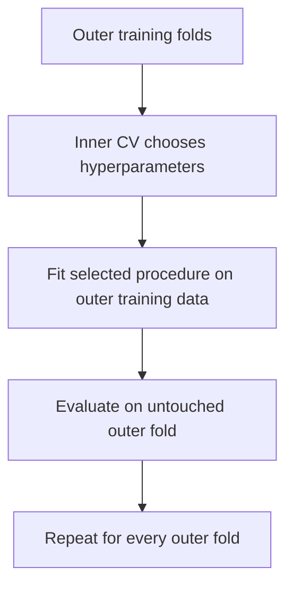

The object being evaluated is not “a depth-3 tree” chosen in advance. It is “the procedure that searches specified depths using specified inner folds and then refits the winner.”

## 11.15 Manual nested group cross-validation
<button class="read-details-btn" data-section="2f-1">✦ Read Details</button>

This explicit version keeps the mechanics visible.

```python
import numpy as np
from sklearn.base import clone
from sklearn.compose import ColumnTransformer
from sklearn.impute import SimpleImputer
from sklearn.metrics import mean_absolute_error
from sklearn.model_selection import GroupKFold, GridSearchCV
from sklearn.pipeline import Pipeline
from sklearn.preprocessing import OneHotEncoder, StandardScaler
from sklearn.tree import DecisionTreeRegressor

df = make_mhp_projects()
feature_columns = numeric_features + categorical_features
X = df[feature_columns]
y = df["actual_cost_2025_million_pkr"]
groups = df["district"]

tree_pipeline = Pipeline(
    steps=[
        ("preprocess", clone(preprocessor)),
        ("model", DecisionTreeRegressor(random_state=42)),
    ]
)

outer_cv = GroupKFold(n_splits=5)
outer_results = []

for outer_fold, (outer_train_idx, outer_test_idx) in enumerate(
    outer_cv.split(X, y, groups), start=1
):
    X_outer_train = X.iloc[outer_train_idx]
    y_outer_train = y.iloc[outer_train_idx]
    groups_outer_train = groups.iloc[outer_train_idx]
    X_outer_test = X.iloc[outer_test_idx]
    y_outer_test = y.iloc[outer_test_idx]

    # With four districts in the outer training portion, use four inner folds.
    inner_cv = GroupKFold(n_splits=groups_outer_train.nunique())
    search = GridSearchCV(
        estimator=clone(tree_pipeline),
        param_grid={
            "model__max_depth": [1, 2, 3, 4, 6],
            "model__min_samples_leaf": [5, 10, 20],
        },
        scoring="neg_mean_absolute_error",
        cv=inner_cv,
        refit=True,
    )
    search.fit(
        X_outer_train,
        y_outer_train,
        groups=groups_outer_train,
    )

    outer_predictions = search.predict(X_outer_test)
    outer_mae = mean_absolute_error(y_outer_test, outer_predictions)
    held_out_district = groups.iloc[outer_test_idx].unique().tolist()

    outer_results.append(outer_mae)
    print(
        f"outer fold={outer_fold}",
        f"held out={held_out_district}",
        f"best={search.best_params_}",
        f"MAE={outer_mae:.3f}",
    )

print("Nested group-CV mean MAE:", np.mean(outer_results))
```

This is computationally more expensive because selection is repeated inside each outer training set. That repetition is the protection, not wasted work.

## 11.16 Research paper discussion 2: Cawley and Talbot on selection bias
<button class="read-details-btn" data-section="2f-1">✦ Read Details</button>

**Paper:** Gavin C. Cawley and Nicola L. C. Talbot (2010), [“On Over-fitting in Model Selection and Subsequent Selection Bias in Performance Evaluation”](https://www.jmlr.org/papers/v11/cawley10a.html), *Journal of Machine Learning Research* 11, 2079–2107.

### The question

Can the model-selection criterion itself be overfit, and can this produce biased performance comparisons?

### The key argument

When many candidate settings are compared, random variation in the selection criterion becomes an opportunity. The selected candidate can look best partly because it benefited from noise. The paper shows that this selection overfitting can be comparable in magnitude to reported differences between algorithms.

### The important change in the unit of comparison

The paper argues that empirical comparisons should evaluate the combination:

$$
\text{learning algorithm} + \text{model-selection procedure},
$$

not the named algorithm in isolation.

For the MHP example, “decision tree” is incomplete. A reproducible procedure includes:

- candidate depths and leaf sizes;
- split type;
- inner scoring metric;
- preprocessing;
- refitting rule; and
- random-state policy.

### Practical implication

Use an untouched test set after tuning or use nested cross-validation when data are too limited for a single validation holdout. Keep the entire preprocessing and selection process inside the appropriate loop.

### Limitation

Nested CV addresses selection bias under the sampled evaluation design. It does not fix a wrong deployment simulation, unmeasured shift, leakage in feature definitions, or a sample that excludes the hardest projects.

### Reproduction prompt

On repeated synthetic datasets, search increasingly large collections of irrelevant hyperparameters. Compare the best inner-CV score with outer held-out performance. Plot the optimism as the search space grows.

## 11.17 A locked-test protocol
<button class="read-details-btn" data-section="2f-1">✦ Read Details</button>

Before opening the final test result, write and timestamp an evaluation contract containing:

1. target and units;
2. prediction time;
3. eligible features;
4. exclusion rules;
5. split design;
6. candidate procedures;
7. selection metric;
8. subgroup reports;
9. uncertainty method; and
10. conditions that would block deployment.

If the test result triggers model revision, that is allowed—but the old test set has become development information. A new independent test is then needed for a fresh final claim.

## 11.18 Day 11 build, break, and reflect
<button class="read-details-btn" data-section="2f-1">✦ Read Details</button>

**Build**

1. Write the deployment question before splitting.
2. Compare random, district-grouped, and temporal validation.
3. Put all learned preprocessing inside a pipeline.
4. Tune a shallow tree with an inner loop.
5. Preserve projects from 2023 onward as a locked final test.

**Break**

1. Scale before cross-validation.
2. include the final material bill.
3. let the same district appear in both sides of an unseen-district evaluation.
4. choose tree depth using the test set.
5. explain exactly how information crosses the boundary in each case.

**Reflect**

For each proposed deployment below, name the split and one remaining limitation:

- a new project in Swat next month;
- a new district never represented in the database; and
- MHP projects five years after a procurement-policy change.

### Day 11 exit check

You are ready for Day 12 when you can draw the inner and outer loops of nested CV, state what each loop is allowed to influence, and explain why a pipeline is part of statistical validity rather than code tidiness.

---

# Day 12 — Metrics, Diagnostics, and Responsible Revision

> **Today’s central idea:** A metric compresses errors according to a value judgement. Responsible evaluation keeps the individual errors available, measures uncertainty, looks for structured failure, and revises the model without contaminating the final test.

## 12.1 Begin with signed errors

For a held-out observation:

$$
e_i=y_i-\hat y_i.
$$

With this convention:

- $e_i>0$: the actual cost exceeded the prediction, so the model **underpredicted**;
- $e_i<0$: the prediction exceeded the actual cost, so the model **overpredicted**.

The mean signed error is:

$$
ME=\frac{1}{n}\sum_i e_i.
$$

Positive and negative misses cancel, so ME is useful for directional bias but not as a total accuracy measure.

## 12.2 Mean absolute error

$$
MAE=\frac{1}{n}\sum_{i=1}^{n}|y_i-\hat y_i|.
$$

If MAE is 4.2 million PKR, the average magnitude of the held-out miss is 4.2 million PKR. MAE weights an error of 10 twice as much as an error of 5.

MAE is not immune to extreme values; every extreme error still enters. It is simply less dominated by them than a squared-error metric.

## 12.3 Mean squared error and root mean squared error

$$
MSE=\frac{1}{n}\sum_{i=1}^{n}(y_i-\hat y_i)^2,
$$

$$
RMSE=\sqrt{MSE}.
$$

RMSE returns to the target’s units. Because errors are squared before averaging, large misses receive disproportionate weight.

Do not describe RMSE as “the average error” without qualification. It is the square root of the mean squared error, not the arithmetic mean of absolute misses.

## 12.4 Median absolute error
<button class="read-details-btn" data-section="2g-4">✦ Read Details</button>

$$
MedAE=\operatorname{median}\left(|y_i-\hat y_i|\right).
$$

MedAE describes a typical central miss and can remain small even when a minority of projects fail badly. Reporting it beside MAE and a high error quantile makes that contrast visible.

For example:

$$
Q_{0.90}(|e|)
$$

is the 90th percentile of absolute error: 90% of held-out projects have an absolute miss at or below that value.

## 12.5 $R^2$ on held-out data

For evaluation outcomes $y_1,\ldots,y_n$:

$$
R^2
=1-
\frac{\sum_i(y_i-\hat y_i)^2}
{\sum_i(y_i-\bar y_{\text{evaluation}})^2}.
$$

Interpretation on that evaluation set:

- $R^2=1$: perfect predictions;
- $R^2=0$: the candidate’s squared error equals that of predicting the **evaluation-set mean** for every evaluation row;
- $R^2<0$: the candidate is worse, in squared-error terms, than that evaluation-set-mean reference.

This contains an important correction to a common simplification. The standard held-out $R^2$ denominator uses the mean of the evaluation targets, whereas a deployable dummy model predicts a value learned from the training targets. Under distribution shift, those are not the same. Always score an explicit training-fitted baseline rather than assuming $R^2=0$ represents its exact held-out performance.

$R^2$ is dimensionless and sensitive to the range of outcomes. The same absolute errors can yield different $R^2$ values in two districts with different target variation.

## 12.6 Calculate every metric from raw definitions

```python
import numpy as np

y_true = np.array([20.0, 24.0, 31.0, 45.0, 80.0])
y_pred = np.array([22.0, 20.0, 34.0, 37.0, 95.0])

errors = y_true - y_pred
absolute_errors = np.abs(errors)
squared_errors = errors**2

me = np.mean(errors)
mae = np.mean(absolute_errors)
mse = np.mean(squared_errors)
rmse = np.sqrt(mse)
medae = np.median(absolute_errors)
r2 = 1.0 - np.sum(squared_errors) / np.sum((y_true - y_true.mean()) ** 2)

print("Errors:", errors)
print("ME:", me)
print("MAE:", mae)
print("RMSE:", rmse)
print("Median AE:", medae)
print("R²:", r2)
```

Verify the same values with library functions, but keep the definition code. It makes sign, units, and denominators auditable.

## 12.7 Why MAPE is dangerous for infrastructure costs

Mean absolute percentage error is:

$$
MAPE=\frac{100}{n}\sum_i\left|\frac{y_i-\hat y_i}{y_i}\right|.
$$

Problems:

1. it is undefined when $y_i=0$;
2. it becomes extremely large when $y_i$ is near zero;
3. it weights the same absolute miss more heavily for small projects; and
4. it can encourage asymmetric behaviour because over- and underprediction interact differently with the denominator.

Percentage error may be relevant if proportional miss is truly the decision cost, but it should not be used automatically because stakeholders like percentages.

## 12.8 Scale-aware alternatives

No single alternative is universally best.

- Report MAE separately by project scale.
- Divide aggregate absolute error by aggregate actual cost when that portfolio interpretation is intended:

$$
WAPE=\frac{\sum_i|y_i-\hat y_i|}{\sum_i|y_i|}.
$$

- Model log cost when multiplicative structure is substantively plausible, while handling retransformation carefully.
- Use a scaled error relative to an explicit baseline when comparing series.

The metric must reflect the decision, not merely avoid a mathematical inconvenience.

## 12.9 Asymmetric decision loss

Suppose underbudgeting is more damaging than overbudgeting. MAE and RMSE are symmetric: errors $+a$ and $-a$ receive the same penalty.

One simple asymmetric absolute loss is:

$$
L(e)=
\begin{cases}
c_{\text{under}}|e|, & e>0,\\
c_{\text{over}}|e|, & e\le0,
\end{cases}
$$

with $c_{\text{under}}>c_{\text{over}}$.

Quantile—or pinball—loss for quantile level $\tau$ is:

$$
L_\tau(y,\hat q)
=
\begin{cases}
\tau(y-\hat q), & y\ge\hat q,\\
(1-\tau)(\hat q-y), & y<\hat q.
\end{cases}
$$

Predicting a high conditional quantile, such as $\tau=0.8$, can support contingency planning. It should be labelled as an 80th-quantile estimate, not confused with a mean forecast plus an arbitrary percentage.

## 12.10 Metric choice is separate from training loss

The model may minimise squared training loss but be selected by validation MAE and reported with several test metrics. These are different roles:

- **training loss** determines fitted parameters;
- **selection metric** chooses among procedures;
- **reporting metrics** describe consequences to readers.

Changing a reporting metric after seeing which one favours a preferred model is another form of researcher flexibility. Choose primary and secondary metrics before final evaluation.

## 12.11 Always retain a prediction table

Create one row per held-out prediction:

| Field | Purpose |
|---|---|
| Project ID | Trace the source record |
| Actual target | Verify outcome and unit |
| Prediction | Inspect the estimate |
| Signed error | Detect under- or overprediction |
| Absolute error | Rank large misses |
| Squared error | Understand RMSE contribution |
| District | Examine spatial performance |
| Start year | Examine temporal drift |
| Project scale / remoteness | Examine operational subgroups |

Aggregate metrics can always be recomputed from this table. They cannot reconstruct the table after detail has been discarded.

## 12.12 Residual diagnostics on held-out predictions

Training residuals diagnose fit to the training sample. Held-out errors diagnose prediction under the evaluation design. Both matter, but they answer different questions.

### Error versus prediction

Look for curvature, a fan shape, and systematic offset.

### Error over time

Look for drift after procurement, technology, policy, or price-basis changes.

### Error by district

Look for groups with poor representation or different relationships.

### Error by project scale

A low overall MAE may be dominated by numerous small projects while a few large projects carry most budget risk.

### Distribution of signed errors

Look for asymmetry and extreme tails. A normal-looking histogram is neither necessary nor sufficient for generalisation.

## 12.13 A four-panel diagnostic figure

```python
import matplotlib.pyplot as plt
import numpy as np
import pandas as pd


def plot_prediction_diagnostics(results):
    """Plot held-out diagnostics from a prediction-results DataFrame."""
    required = {
        "prediction",
        "error",
        "absolute_error",
        "district",
        "start_year",
    }
    missing = required.difference(results.columns)
    if missing:
        raise ValueError(f"Missing diagnostic columns: {sorted(missing)}")

    fig, axes = plt.subplots(2, 2, figsize=(12, 8))

    axes[0, 0].scatter(results["prediction"], results["error"], alpha=0.7)
    axes[0, 0].axhline(0.0, color="black", linewidth=1)
    axes[0, 0].set_xlabel("Predicted cost")
    axes[0, 0].set_ylabel("Actual − predicted")
    axes[0, 0].set_title("Signed error versus prediction")

    by_year = results.groupby("start_year")["error"].mean()
    axes[0, 1].plot(by_year.index, by_year.values, marker="o")
    axes[0, 1].axhline(0.0, color="black", linewidth=1)
    axes[0, 1].set_xlabel("Start year")
    axes[0, 1].set_ylabel("Mean signed error")
    axes[0, 1].set_title("Directional error over time")

    district_order = (
        results.groupby("district")["absolute_error"].median().sort_values().index
    )
    district_data = [
        results.loc[results["district"] == district, "absolute_error"]
        for district in district_order
    ]
    axes[1, 0].boxplot(district_data, tick_labels=district_order, vert=True)
    axes[1, 0].tick_params(axis="x", rotation=30)
    axes[1, 0].set_ylabel("Absolute error")
    axes[1, 0].set_title("Error distribution by district")

    axes[1, 1].hist(results["error"], bins=15, edgecolor="black")
    axes[1, 1].axvline(0.0, color="black", linewidth=1)
    axes[1, 1].set_xlabel("Signed error")
    axes[1, 1].set_ylabel("Projects")
    axes[1, 1].set_title("Held-out error distribution")

    fig.tight_layout()
    return fig
```

Plots are question generators. A visible pattern suggests investigation; it does not identify the cause by itself.

## 12.14 Subgroup evaluation without false certainty

For each operationally relevant group, report:

- sample count;
- MAE;
- mean signed error;
- median absolute error; and
- a high absolute-error quantile.

Small subgroups have noisy estimates. Do not rank districts as if a difference based on five projects were a stable performance league table. Use intervals, domain knowledge, and replication.

```python
def subgroup_report(results, group_column):
    return (
        results.groupby(group_column)
        .agg(
            n=("error", "size"),
            mean_error=("error", "mean"),
            mae=("absolute_error", "mean"),
            median_ae=("absolute_error", "median"),
            q90_ae=("absolute_error", lambda x: x.quantile(0.90)),
        )
        .sort_values("mae", ascending=False)
    )
```

## 12.15 Bootstrap uncertainty for held-out MAE
<button class="read-details-btn" data-section="2g-15">✦ Read Details</button>

One fixed test set gives one observed MAE. A nonparametric bootstrap approximates its sampling variability by resampling the held-out prediction rows with replacement.

```python
import numpy as np


def bootstrap_mae_interval(y_true, y_pred, confidence=0.95, repeats=5000, seed=42):
    y_true = np.asarray(y_true, dtype=float)
    y_pred = np.asarray(y_pred, dtype=float)

    if y_true.ndim != 1 or y_true.shape != y_pred.shape:
        raise ValueError("y_true and y_pred must be aligned one-dimensional arrays")
    if y_true.size < 2:
        raise ValueError("At least two held-out observations are required")

    rng = np.random.default_rng(seed)
    n = y_true.size
    bootstrap_scores = np.empty(repeats)

    for b in range(repeats):
        indices = rng.integers(0, n, size=n)
        bootstrap_scores[b] = np.mean(
            np.abs(y_true[indices] - y_pred[indices])
        )

    alpha = 1.0 - confidence
    lower, upper = np.quantile(
        bootstrap_scores,
        [alpha / 2.0, 1.0 - alpha / 2.0],
    )

    return {
        "estimate": np.mean(np.abs(y_true - y_pred)),
        "lower": lower,
        "upper": upper,
        "bootstrap_scores": bootstrap_scores,
    }
```

This percentile interval treats held-out rows as the resampling units. If projects are clustered within districts or repeated within contractors, row-wise resampling can understate dependence. A cluster bootstrap resamples independent groups instead. The resampling unit must match the data-generating and deployment structure.

## 12.16 Why “mean ± fold standard deviation” is not a confidence interval

Cross-validation training sets overlap, so fold scores are dependent. They may also correspond to different districts or time periods. Their standard deviation is a descriptive measure of variation across those folds; it is not automatically the standard error of the mean and not automatically a 95% interval.

Even dividing fold standard deviation by $\sqrt K$ does not repair the dependence by assumption.

## 12.17 Research paper discussion 3: Bengio and Grandvalet on CV variance

**Paper:** Yoshua Bengio and Yves Grandvalet (2004), [“No Unbiased Estimator of the Variance of K-Fold Cross-Validation”](https://www.jmlr.org/papers/v5/grandvalet04a.html), *Journal of Machine Learning Research* 5, 1089–1105.

### The question

Can one construct a universally unbiased estimator of the variance of the $K$-fold cross-validation error using the usual cross-validation results?

### Main result

The paper proves that no universal unbiased estimator exists under the broad conditions it studies. Overlap among training sets creates covariance terms that cannot generally be recovered from the observed fold results alone.

### What the result does not say

It does **not** say that cross-validation is useless or that uncertainty can never be studied. It says a very convenient, universally unbiased variance formula is unavailable.

### Practical implication

- Do not label fold standard deviation as a confidence interval.
- Preserve fold-level results and describe the split structure.
- Use repeated or nested designs, independent test data, bootstrap methods, or model-based uncertainty only with their assumptions stated.
- Treat small reported differences between procedures cautiously.

### Application to the MHP case

Five group folds may be the five districts. Variation across those folds is partly real geographic heterogeneity, not five interchangeable measurements of one constant error. Report each district’s result and ask whether the deployment population weights districts equally, by project count, or by budget exposure.

### Reproduction prompt

Repeat $K$-fold CV on many independently generated synthetic datasets. Compare variation across folds within one dataset with variation of the mean CV estimate across datasets. They are not the same quantity.

## 12.18 Diagnostics do not authorise test-set tuning

There is a tension:

- final test diagnostics are valuable for learning where a procedure fails;
- changing the procedure in response means the test has influenced development.

The correct workflow is:

1. report the pre-specified final result;
2. use diagnostics to generate a revised hypothesis;
3. label the revision as post-test development; and
4. obtain new independent evaluation data or wait for prospective deployment evidence.

Do not quietly overwrite the original result and reuse the same test set as if it remained untouched.

## 12.19 A responsible model-revision protocol

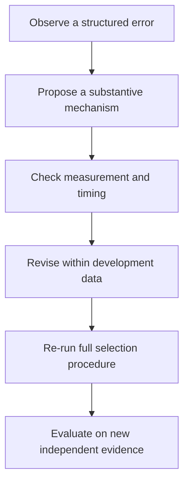

Examples:

- Curvature with capacity may justify a pre-specified squared-capacity feature or nonlinear model.
- Larger variance for remote sites may justify conditional quantile modeling or variance modeling.
- Persistent error after a policy change may justify a time indicator, but only if that indicator will be known and meaningful at deployment.
- One district’s poor performance may reveal measurement inconsistency rather than a need to add district identity.

## 12.20 Day 12 build, break, and reflect

**Build**

1. Generate a held-out prediction table.
2. Calculate ME, MAE, RMSE, MedAE, $R^2$, and the 90th percentile absolute error from definitions.
3. Score the explicit training-fitted dummy baseline.
4. Produce the four diagnostic panels.
5. report metrics by district, remoteness, and project scale.
6. bootstrap an MAE interval using the appropriate resampling unit.

**Break**

1. Report MAPE after adding a near-zero target.
2. Evaluate only the numerous small projects and claim portfolio-wide success.
3. call fold standard deviation a 95% confidence interval.
4. change the model after viewing test diagnostics and reuse the same score as final.

**Reflect**

Write a one-page evaluation note that begins with the decision and ends with a deployment recommendation. A table of metrics without that reasoning is not sufficient.

### Day 12 exit check

You are ready for the capstone when you can answer:

1. Which direction of signed error represents underprediction?
2. What reference does held-out $R^2$ use?
3. Why can low overall MAE coexist with unacceptable remote-project performance?
4. Why is fold standard deviation not automatically a confidence interval?
5. What must happen after test-driven model revision?

---

# Chapter 2 Capstone — An Auditable MHP Evaluation Pipeline
<button class="read-details-btn" data-section="capstone">✦ Read Details</button>

## Capstone brief

The planning unit wants an appraisal-stage estimate of final cost in constant 2025 million PKR for projects initiated from 2023 onward. The initial dataset includes projects from 2016 through 2025.

Your job is not merely to return the smallest error. You must design and document the entire learning procedure.

## Pass 1: write the evaluation contract

Before running models, state:

- unit of observation;
- target and price basis;
- prediction time;
- eligible and prohibited features;
- deployment population;
- primary metric and why it matches the decision;
- validation design;
- locked test period;
- subgroup reports; and
- deployment-blocking conditions.

## Pass 2: audit the data boundary

Confirm:

- project IDs are not features;
- final material bills are excluded;
- preprocessing is learned only inside training partitions;
- years are ordered correctly;
- duplicates do not cross partitions; and
- every categorical value is handled without inspecting test outcomes.

## Pass 3: compare complete procedures

Compare:

1. training-mean baseline;
2. linear regression with imputation, scaling, and one-hot encoding;
3. a shallow decision tree with depth selected on 2022 validation data.

Use MAE as the primary selection metric. Retain RMSE, median absolute error, $R^2$, and mean signed error as secondary reports.

## Pass 4: lock, select, refit, test once

- Training: 2016–2021.
- Validation: 2022.
- Final test: 2023–2025.
- Select the procedure using validation MAE only.
- Refit the selected procedure on training plus validation data.
- Evaluate once on the final test.

## Pass 5: diagnose without rewriting history

Report:

- overall metrics and bootstrap MAE interval;
- performance by district;
- performance for road distance above and below 18 km;
- the ten largest absolute errors; and
- any evidence of temporal drift.

If diagnostics motivate revision, label it as the start of the next development cycle.

## Complete runnable capstone

Save as `mhp_chapter2_capstone.py`. It generates its own fictional data, so the chapter remains reproducible without a private dataset.

```python
import numpy as np
import pandas as pd
from sklearn.base import clone
from sklearn.compose import ColumnTransformer
from sklearn.dummy import DummyRegressor
from sklearn.impute import SimpleImputer
from sklearn.linear_model import LinearRegression
from sklearn.metrics import (
    mean_absolute_error,
    mean_squared_error,
    median_absolute_error,
    r2_score,
)
from sklearn.pipeline import Pipeline
from sklearn.preprocessing import OneHotEncoder, StandardScaler
from sklearn.tree import DecisionTreeRegressor

from chapter2_data import make_mhp_projects


TARGET = "actual_cost_2025_million_pkr"
NUMERIC_FEATURES = [
    "start_year",
    "planned_capacity_kw",
    "estimated_cable_km",
    "road_distance_km",
    "terrain_index",
]
CATEGORICAL_FEATURES = ["district"]
FEATURES = NUMERIC_FEATURES + CATEGORICAL_FEATURES


def make_preprocessor():
    numeric_pipeline = Pipeline(
        steps=[
            ("impute", SimpleImputer(strategy="median")),
            ("scale", StandardScaler()),
        ]
    )
    categorical_pipeline = Pipeline(
        steps=[
            ("impute", SimpleImputer(strategy="most_frequent")),
            (
                "one_hot",
                OneHotEncoder(handle_unknown="ignore", drop="first"),
            ),
        ]
    )
    return ColumnTransformer(
        transformers=[
            ("numeric", numeric_pipeline, NUMERIC_FEATURES),
            ("categorical", categorical_pipeline, CATEGORICAL_FEATURES),
        ]
    )


def make_pipeline(regressor):
    return Pipeline(
        steps=[
            ("preprocess", make_preprocessor()),
            ("model", regressor),
        ]
    )


def regression_metrics(y_true, y_pred):
    y_true = np.asarray(y_true, dtype=float)
    y_pred = np.asarray(y_pred, dtype=float)
    error = y_true - y_pred
    return {
        "ME": np.mean(error),
        "MAE": mean_absolute_error(y_true, y_pred),
        "RMSE": np.sqrt(mean_squared_error(y_true, y_pred)),
        "MedAE": median_absolute_error(y_true, y_pred),
        "R2": r2_score(y_true, y_pred),
        "Q90_AE": np.quantile(np.abs(error), 0.90),
    }


def bootstrap_mae_interval(
    y_true,
    y_pred,
    confidence=0.95,
    repeats=5000,
    seed=42,
):
    y_true = np.asarray(y_true, dtype=float)
    y_pred = np.asarray(y_pred, dtype=float)
    rng = np.random.default_rng(seed)
    scores = np.empty(repeats)

    for b in range(repeats):
        indices = rng.integers(0, y_true.size, size=y_true.size)
        scores[b] = np.mean(np.abs(y_true[indices] - y_pred[indices]))

    alpha = 1.0 - confidence
    return np.quantile(scores, [alpha / 2.0, 1.0 - alpha / 2.0])


def prediction_table(frame, predictions):
    result = frame[
        [
            "project_id",
            "district",
            "start_year",
            "road_distance_km",
            TARGET,
        ]
    ].copy()
    result["prediction"] = predictions
    result["error"] = result[TARGET] - result["prediction"]
    result["absolute_error"] = result["error"].abs()
    result["squared_error"] = result["error"] ** 2
    result["remote"] = np.where(
        result["road_distance_km"] > 18.0,
        "above 18 km",
        "18 km or less",
    )
    return result


def subgroup_report(results, group_column):
    return (
        results.groupby(group_column)
        .agg(
            n=("error", "size"),
            mean_error=("error", "mean"),
            mae=("absolute_error", "mean"),
            median_ae=("absolute_error", "median"),
            q90_ae=("absolute_error", lambda values: values.quantile(0.90)),
        )
        .sort_values("mae", ascending=False)
    )


def main():
    df = make_mhp_projects()

    # Prediction-time audit.
    prohibited = {
        "project_id",
        "final_material_bill_million_pkr",
        TARGET,
    }
    assert prohibited.isdisjoint(FEATURES)
    assert not df["project_id"].duplicated().any()

    train = df[df["start_year"] <= 2021].copy()
    validation = df[df["start_year"] == 2022].copy()
    test = df[df["start_year"] >= 2023].copy()

    assert train["start_year"].max() < validation["start_year"].min()
    assert validation["start_year"].max() < test["start_year"].min()

    print(
        "Split sizes:",
        {"train": len(train), "validation": len(validation), "test": len(test)},
    )

    candidates = {
        "training mean": make_pipeline(DummyRegressor(strategy="mean")),
        "linear regression": make_pipeline(LinearRegression()),
    }

    for depth in [1, 2, 3, 4, 6]:
        candidates[f"tree depth {depth}"] = make_pipeline(
            DecisionTreeRegressor(
                max_depth=depth,
                min_samples_leaf=10,
                random_state=42,
            )
        )

    validation_rows = []
    fitted_candidates = {}

    for name, procedure in candidates.items():
        fitted = clone(procedure).fit(train[FEATURES], train[TARGET])
        predictions = fitted.predict(validation[FEATURES])
        metrics = regression_metrics(validation[TARGET], predictions)
        validation_rows.append({"procedure": name, **metrics})
        fitted_candidates[name] = fitted

    validation_report = pd.DataFrame(validation_rows).sort_values("MAE")
    print("\nValidation results")
    print(validation_report.to_string(index=False, float_format=lambda x: f"{x:.3f}"))

    selected_name = validation_report.iloc[0]["procedure"]
    print("\nSelected by validation MAE:", selected_name)

    # The procedure is now fixed. Combine development data and refit it.
    development = pd.concat([train, validation], ignore_index=True)
    selected_procedure = clone(candidates[selected_name])
    selected_procedure.fit(development[FEATURES], development[TARGET])

    # Open the final test once.
    test_predictions = selected_procedure.predict(test[FEATURES])
    test_metrics = regression_metrics(test[TARGET], test_predictions)
    print("\nFinal test metrics")
    for metric, value in test_metrics.items():
        print(f"{metric:7s}: {value:8.3f}")

    lower, upper = bootstrap_mae_interval(test[TARGET], test_predictions)
    print(f"95% row-bootstrap interval for test MAE: [{lower:.3f}, {upper:.3f}]")

    results = prediction_table(test, test_predictions)

    print("\nBy district")
    print(subgroup_report(results, "district").to_string(float_format=lambda x: f"{x:.3f}"))

    print("\nBy remoteness")
    print(subgroup_report(results, "remote").to_string(float_format=lambda x: f"{x:.3f}"))

    print("\nTen largest absolute errors")
    columns = [
        "project_id",
        "district",
        "start_year",
        TARGET,
        "prediction",
        "error",
        "absolute_error",
    ]
    print(
        results.nlargest(10, "absolute_error")[columns].to_string(
            index=False,
            float_format=lambda x: f"{x:.3f}",
        )
    )

    results.to_csv("mhp_chapter2_test_predictions.csv", index=False)


if __name__ == "__main__":
    main()
```

## Capstone interpretation questions

1. Did the selected procedure beat the training-mean baseline on validation and test data?
2. Was the validation ranking preserved on the test period? Why might it change?
3. Is the test MAE small relative to actual planning tolerances, not merely smaller than another model?
4. Which district and remoteness group had the largest errors? Are sample sizes sufficient for a strong conclusion?
5. Is mean signed error positive, suggesting underprediction, or negative, suggesting overprediction?
6. Are later test years systematically underpredicted?
7. Would adding the final material bill improve the numerical score? Why is it prohibited?
8. If the tree wins, does that make its feature thresholds causal or stable outside the observed period?
9. If linear regression wins, does that prove the true cost mechanism is linear?
10. What new independent evidence would be required after revising the model in response to test diagnostics?

## Capstone assessment rubric

| Dimension | Emerging | Competent | Research-ready habit |
|---|---|---|---|
| Prediction contract | Target named | Timing, units, and use stated | Feature availability and deployment population audited |
| Numerical work | Model runs | Scaling, rank, and conditioning checked | Solver and tolerance choices justified |
| Probability | Interval printed | Assumptions and interval type stated | Dependence, heteroskedasticity, and extrapolation limitations examined |
| Optimisation | Loss falls | Gradient verified against finite differences | Convergence compared with decomposition solution |
| Validation | One random split | Split matches deployment | Selection procedure evaluated without leakage |
| Metrics | One score | Baseline and multiple pre-specified metrics | Decision loss, uncertainty, and subgroup risk integrated |
| Diagnostics | Plot produced | Patterns interpreted cautiously | Revision hypotheses separated from confirmatory evidence |
| Reproducibility | Code shown | Seed, versions, and data recipe recorded | Full procedure can be rerun and claims traced to outputs |
| Communication | Winner named | Magnitude and limitations explained | Deployment recommendation includes blocking conditions |

---

# Formula Sheet

| Concept | Equation | Meaning |
|---|---|---|
| Standardisation | $z_{ij}=(x_{ij}-\mu_j)/s_j$ | Centre and scale using training statistics |
| Condition number | $\kappa_2(X)=\sigma_{\max}/\sigma_{\min}$ | Sensitivity associated with unequal singular directions |
| QR least squares | $R\hat\beta=Q^Ty$ | Solve after $X=QR$ |
| SVD | $X=U\Sigma V^T$ | Rotations plus singular-value stretching |
| Pseudoinverse solution | $\hat\beta=V\Sigma^+U^Ty$ | Minimum-norm least-squares solution under rank deficiency |
| Linear probability model | $y=X\beta+\varepsilon$ | Systematic mean plus unobserved error |
| Gaussian errors | $\varepsilon\sim\mathcal N(0,\sigma^2I)$ | Classical equal-variance independent normal model |
| Gaussian log-likelihood | $C-\frac n2\log\sigma^2-\frac{SSR}{2\sigma^2}$ | Maximising over $\beta$ equals minimising SSR |
| Residual variance | $s^2=SSR/(n-k)$ | Unbiased classical estimator under assumptions |
| Coefficient covariance | $s^2(X^TX)^{-1}$ | Classical estimated sampling covariance |
| Coefficient interval | $\hat\beta_j\pm t^*SE(\hat\beta_j)$ | Repeated-sampling confidence procedure |
| Mean-response SE | $s\sqrt{x_0^T(X^TX)^{-1}x_0}$ | Uncertainty in estimated conditional mean |
| Prediction SE | $s\sqrt{1+x_0^T(X^TX)^{-1}x_0}$ | Adds new-project outcome noise |
| MSE objective | $J(\beta)=\lVert y-X\beta\rVert^2/n$ | Average squared training loss |
| MSE gradient | $\nabla J=2X^T(X\beta-y)/n$ | Direction of steepest increase |
| Gradient update | $\beta^{(t+1)}=\beta^{(t)}-\eta\nabla J$ | Iterative downhill step |
| Squared-error baseline | $\hat c=\bar y_{train}$ | Optimal training constant under squared loss |
| Absolute-error baseline | $\hat c=\operatorname{median}(y_{train})$ | Optimal training constant under absolute loss |
| CV loss | $\widehat L_{CV}=K^{-1}\sum_kL_k$ | Mean held-out fold loss |
| Mean error | $n^{-1}\sum_i(y_i-\hat y_i)$ | Directional error |
| MAE | $n^{-1}\sum_i\lvert y_i-\hat y_i\rvert$ | Linear penalty in target units |
| RMSE | $\sqrt{n^{-1}\sum_i(y_i-\hat y_i)^2}$ | Quadratically weighted error in target units |
| $R^2$ | $1-SSR/TSS$ | Squared-error comparison with evaluation-set mean |
| Pinball loss | Piecewise loss weighted by $\tau$ | Trains or scores a conditional quantile |

---

# Glossary

**Algorithm:** A computational procedure. A full learning procedure also includes preprocessing, tuning, and selection.

**Baseline:** A simple reference predictor that a candidate procedure should be compared against.

**Bias–variance decomposition:** Under squared loss, a repeated-sampling decomposition of expected prediction error into squared bias, estimator variance, and irreducible noise.

**Bootstrap:** A resampling method that approximates sampling variability by repeatedly sampling observed units with replacement.

**Condition number:** A measure of how strongly perturbations can be amplified in a numerical problem.

**Confidence interval:** An interval produced by a repeated-sampling procedure designed to cover a fixed parameter at a stated long-run rate under assumptions.

**Cross-validation:** A resampling design in which observations or groups take turns serving as held-out development data.

**Data leakage:** Illegitimate movement of information across prediction-time, training, selection, or evaluation boundaries.

**Degrees of freedom:** The number of independent pieces of information remaining after fitted constraints are accounted for in a stated model.

**Distribution shift:** A difference between training and deployment distributions.

**Empirical risk:** Average loss on an observed dataset.

**Error term:** Unobserved deviation from the model’s population conditional mean.

**Extrapolation:** Prediction beyond feature regions well represented in the training data.

**Generalisation:** Performance of a learned procedure on genuinely new cases from its intended deployment conditions.

**Heteroskedasticity:** Conditional error variance that changes across observations or feature values.

**Hyperparameter:** A setting chosen outside the parameter-fitting calculation.

**Ill-conditioning:** Sensitivity in which small changes in data or arithmetic can cause large changes in a solution.

**Likelihood:** A function of parameter values with observed data held fixed, derived from a probability model.

**Maximum likelihood:** Parameter selection that maximises the likelihood under a specified model.

**Nested cross-validation:** An outer evaluation loop surrounding an inner model-selection loop.

**Numerical rank:** The number of singular directions treated as nonzero at a stated scale and tolerance.

**Overfitting:** Adaptation to sample-specific patterns that do not generalise.

**Parameter:** A value learned inside a fitted model, such as a regression coefficient.

**Pipeline:** A single procedure that fits transformations and a model within the correct data boundary.

**Prediction interval:** An interval intended to cover an individual future outcome under a stated model; it includes outcome noise as well as mean-estimation uncertainty.

**Pseudoinverse:** A generalised inverse used to express least-squares solutions, including rank-deficient cases.

**QR decomposition:** A factorisation of a matrix into an orthonormal-column matrix $Q$ and upper-triangular matrix $R$.

**Residual:** Observed target minus fitted prediction.

**Selection bias in evaluation:** Optimism created when data used to select a procedure also influence its reported performance.

**Singular value:** A nonnegative scale factor in the SVD that measures the strength of a matrix direction.

**Test set:** Data reserved for final evaluation after the learning and selection procedure has been fixed.

**Training set:** Data permitted to fit learned transformations and model parameters.

**Underfitting:** Failure of a procedure to represent useful structure.

**Validation set:** Development data used to compare procedures and choose hyperparameters.

---

# Research Reading Guide

The three paper discussions in this chapter are not decorative citations. Use this six-question template whenever reading them.

1. **Question:** What exact problem is the paper trying to resolve?
2. **Object:** Is it studying a parameter, predictor, algorithm, selection procedure, or evaluation estimate?
3. **Design:** Is the evidence a theorem, simulation, benchmark, observational dataset, or case study?
4. **Result:** What did the authors actually establish?
5. **Boundary:** Under what assumptions or settings might the result not transfer?
6. **Consequence:** What should change in our MHP workflow if we accept the result?

## Paper comparison table

| Paper | Main object | Central warning | Chapter action |
|---|---|---|---|
| Breiman (2001) | Modeling culture and predictive practice | Interpretable stochastic models can be weakly checked; prediction deserves direct evaluation | Compare transparent and algorithmic models while preserving purpose |
| Cawley & Talbot (2010) | Model-selection procedure | Selection itself can overfit and bias performance reports | Use untouched tests or nested CV; compare complete procedures |
| Bengio & Grandvalet (2004) | Variance of $K$-fold CV | No universal unbiased variance estimator follows from usual folds | Do not turn fold SD into an automatic confidence interval |

## A small replication portfolio

To move from textbook reader toward researcher, complete three reproducible notebooks:

1. **Complexity notebook:** regenerate 100 datasets, fit trees of increasing depth, and estimate training/validation optimism.
2. **Selection notebook:** increase the number of tried hyperparameter combinations and measure inner-to-outer performance gaps.
3. **CV uncertainty notebook:** compare within-dataset fold variation with across-dataset variation in average CV performance.

Each notebook must contain:

- a pre-written question;
- a data-generating process;
- seeds and software versions;
- an expected result stated before execution;
- figures with labelled axes and units;
- a result that distinguishes observation from interpretation; and
- one limitation that could change the conclusion.

---

# Instructor and Self-Study Notes

## Suggested daily timebox

| Activity | Minutes |
|---|---:|
| Retrieve Chapter 1 knowledge | 15 |
| Work through the central derivation | 40 |
| Run raw proof code | 35 |
| Create or inspect the figure | 25 |
| Extend the estimator or evaluation | 40 |
| Break and diagnose | 30 |
| Exit check and written reflection | 15 |
| **Total** | **200** |

Day 11 may require two sessions because nested validation is conceptually dense. Splitting it across sessions is better than treating the inner and outer loops as incantations.

## Retrieval prompts for the next morning

- After Day 6: “What does a condition number measure, and why must a scaler be fit on training data?”
- After Day 7: “How do QR and SVD solve least squares without explicitly inverting $X^TX$?”
- After Day 8: “Why does Gaussian maximum likelihood produce OLS, and which interval is wider?”
- After Day 9: “Write the MSE gradient and explain the learning rate.”
- After Day 10: “Derive the mean baseline and define generalisation risk.”
- After Day 11: “Which loop selects and which loop evaluates in nested CV?”
- After Day 12: “Why is one average metric insufficient for deployment?”

## Common beginner confusions to diagnose

| Statement | Correction |
|---|---|
| “Scaling adds information.” | It changes representation, not information content. |
| “Full rank means stable coefficients.” | A full-rank matrix can be severely ill-conditioned. |
| “SVD fixes multicollinearity.” | It diagnoses weak directions and selects a solution; it does not create identification. |
| “OLS assumes normal data.” | OLS fitting does not; particular inferential results add distributional assumptions. |
| “A residual is the true error.” | A residual uses estimated parameters and is constrained by fitting. |
| “Gradient descent is more advanced, so it is more accurate.” | It is another optimiser; for OLS it should converge to the same minimum. |
| “The lowest training error wins.” | Training error rewards flexibility and cannot establish generalisation. |
| “Random splitting is always objective.” | It can violate group and time deployment structure. |
| “A pipeline is software convenience.” | It protects the statistical fitting boundary. |
| “Cross-validation eliminates the need for a test.” | It supports development; repeated selection can still create optimism. |
| “$R^2=0$ equals the training dummy on test data.” | Standard test $R^2$ uses the evaluation-set mean reference. |
| “Fold SD is a 95% interval.” | Fold scores are dependent and may represent heterogeneous conditions. |

## Guidance on the KP infrastructure context

Keep asking:

- Is a field known at appraisal or only after procurement?
- Are costs in the same base year and do they include community contribution consistently?
- Does “road distance” measure distance to any road or an all-weather road?
- Does the terrain index mean the same thing across survey teams?
- Are multiple projects packaged under one contract or budget line?
- Did policy or procurement rules change during the dataset period?
- Are remote projects missing from the database because they were delayed or never completed?
- Will model errors shift funds away from precisely the places with the greatest structural disadvantage?

Technical validity and institutional responsibility meet at these questions.

---

# Where Chapter 3 Begins

Chapter 2 has created an honest evaluation framework around OLS and one nonlinear comparator. The next chapter can deepen statistical learning without abandoning this framework:

1. polynomial and interaction features;
2. regularisation through ridge and lasso;
3. the geometry and Bayesian interpretation of penalties;
4. robust and quantile regression;
5. heteroskedasticity-robust and cluster-aware inference;
6. influence, leverage, and Cook’s distance;
7. repeated and nested model comparison; and
8. a pre-registered benchmark study.

Every new model must pass through the same chain:

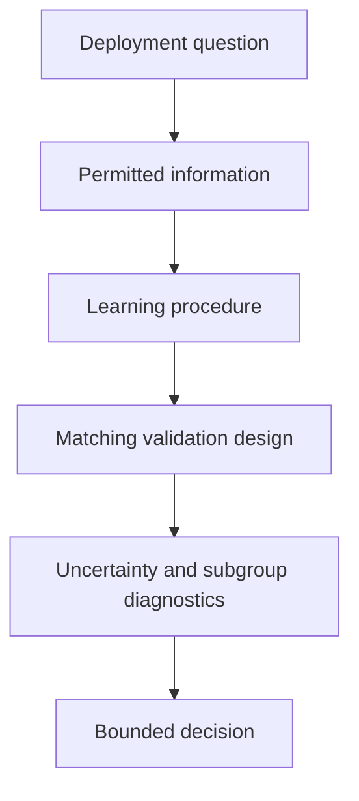

## Final reflection

A model becomes trustworthy neither because its derivation is elegant nor because its test score is impressive. Trust is built by an auditable chain: stable computation, explicit assumptions, legitimate information, a deployment-matched evaluation, uncertainty about the result, investigation of failures, and restraint in the conclusion.

That chain is the real subject of Chapter 2.

---

# References and Further Reading

## Research papers discussed

1. Bengio, Y., & Grandvalet, Y. (2004). [No Unbiased Estimator of the Variance of K-Fold Cross-Validation](https://www.jmlr.org/papers/v5/grandvalet04a.html). *Journal of Machine Learning Research, 5*, 1089–1105.
2. Breiman, L. (2001). [Statistical Modeling: The Two Cultures](https://projecteuclid.org/journals/statistical-science/volume-16/issue-3/Statistical-Modeling--The-Two-Cultures-with-comments-and-a/10.1214/ss/1009213726.full). *Statistical Science, 16*(3), 199–231.
3. Cawley, G. C., & Talbot, N. L. C. (2010). [On Over-fitting in Model Selection and Subsequent Selection Bias in Performance Evaluation](https://www.jmlr.org/papers/v11/cawley10a.html). *Journal of Machine Learning Research, 11*, 2079–2107.

## Additional conceptual reading

4. Shmueli, G. (2010). [To Explain or to Predict?](https://projecteuclid.org/journals/statistical-science/volume-25/issue-3/To-Explain-or-to-Predict/10.1214/10-STS330.full). *Statistical Science, 25*(3), 289–310.
5. Hastie, T., Tibshirani, R., & Friedman, J. (2009). *The Elements of Statistical Learning* (2nd ed.). Springer. Chapters 3 and 7.
6. James, G., Witten, D., Hastie, T., Tibshirani, R., & Taylor, J. (2023). *An Introduction to Statistical Learning: with Applications in Python*. Springer.

## Official software documentation

7. scikit-learn. [Getting Started](https://scikit-learn.org/stable/getting_started.html).
8. scikit-learn. [Preprocessing Data](https://scikit-learn.org/stable/modules/preprocessing.html).
9. scikit-learn. [Pipelines and Composite Estimators](https://scikit-learn.org/stable/modules/compose.html).
10. scikit-learn. [Cross-Validation: Evaluating Estimator Performance](https://scikit-learn.org/stable/modules/cross_validation.html).
11. scikit-learn. [Decision Trees](https://scikit-learn.org/stable/modules/tree.html).
12. scikit-learn. [Regression Metrics](https://scikit-learn.org/stable/modules/model_evaluation.html#regression-metrics).
<style>
.read-details-btn {
    display: inline-flex;
    align-items: center;
    gap: 0.5rem;
    background: rgba(34, 211, 238, 0.08);
    border: 1px solid rgba(34, 211, 238, 0.3);
    color: #22d3ee;
    padding: 0.4rem 0.8rem;
    font-size: 0.75rem;
    font-weight: 600;
    border-radius: 0.375rem;
    cursor: pointer;
    transition: all 0.2s ease;
    margin: 0.5rem 0 1rem 0;
    font-family: inherit;
}
.read-details-btn:hover {
    background: rgba(34, 211, 238, 0.2);
    border-color: #22d3ee;
    box-shadow: 0 0 10px rgba(34, 211, 238, 0.2);
}
.comp-modal {
    display: none;
    position: fixed;
    z-index: 10000;
    left: 0;
    top: 0;
    width: 100%;
    height: 100%;
    overflow: hidden;
    background-color: rgba(11, 15, 25, 0.85);
    backdrop-filter: blur(8px);
    opacity: 0;
    transition: opacity 0.3s ease;
    align-items: center;
    justify-content: center;
}
.comp-modal.open {
    display: flex;
    opacity: 1;
}
.comp-modal-content {
    background-color: #151d30;
    border: 1px solid #223150;
    border-radius: 0.75rem;
    width: 90%;
    max-width: 48rem;
    max-height: 85vh;
    overflow-y: auto;
    box-shadow: 0 20px 25px -5px rgba(0, 0, 0, 0.6), 0 10px 10px -5px rgba(0, 0, 0, 0.6);
    position: relative;
    padding: 2.5rem 2rem 2rem 2rem;
    transform: scale(0.95);
    transition: transform 0.3s cubic-bezier(0.16, 1, 0.3, 1);
}
.comp-modal.open .comp-modal-content {
    transform: scale(1);
}
.comp-modal-close {
    position: absolute;
    top: 0.75rem;
    right: 1.25rem;
    color: #cbd5e1;
    font-size: 2rem;
    font-weight: 300;
    cursor: pointer;
    transition: color 0.2s ease;
    line-height: 1;
}
.comp-modal-close:hover {
    color: #fff;
}
#comp-modal-body {
    color: #cbd5e1;
    font-size: 0.95rem;
}
#comp-modal-body h1, #comp-modal-body h2 {
    color: #fff;
    border-bottom: 1px solid #223150;
    padding-bottom: 0.5rem;
    margin-top: 0;
    margin-bottom: 1.5rem;
}
#comp-modal-body h3, #comp-modal-body h4 {
    color: #fff;
    margin-top: 1.75rem;
    margin-bottom: 0.75rem;
}
#comp-modal-body p {
    margin-bottom: 1rem;
}
#comp-modal-body code {
    color: #67e8f9;
    background: #0b0f19;
    padding: 0.125rem 0.375rem;
    border-radius: 0.25rem;
    font-size: 0.875rem;
}
#comp-modal-body pre {
    background: #0b0f19;
    border: 1px solid #223150;
    border-radius: 0.5rem;
    padding: 1rem;
    margin: 1rem 0;
    overflow-x: auto;
}
#comp-modal-body pre code {
    background: transparent;
    padding: 0;
    color: #e2e8f0;
}
#comp-modal-body table {
    width: 100%;
    font-size: 0.875rem;
    border-collapse: collapse;
    margin: 1.5rem 0;
}
#comp-modal-body th, #comp-modal-body td {
    border: 1px solid #223150;
    padding: 0.5rem 0.75rem;
    text-align: left;
}
#comp-modal-body th {
    background: #151d30;
    color: #fff;
    font-weight: 600;
}
.companion-details-area, .companion-details-area ~ * {
    display: none;
}
</style>

<div id="companion-modal" class="comp-modal">
    <div class="comp-modal-content">
        <span class="comp-modal-close">&times;</span>
        <div id="comp-modal-body"></div>
    </div>
</div>

<script>
document.addEventListener("DOMContentLoaded", function() {
    var store = {};
    var area = document.querySelector('.companion-details-area');
    if (!area) return;
    
    var currentSection = null;
    var currentElements = [];
    var sibling = area.nextElementSibling;
    
    while (sibling) {
        if (sibling.classList.contains('companion-detail-heading')) {
            if (currentSection) {
                store[currentSection] = currentElements;
            }
            currentSection = sibling.getAttribute('data-section');
            currentElements = [];
        } else {
            if (currentSection) {
                currentElements.push(sibling.cloneNode(true));
            }
        }
        sibling = sibling.nextElementSibling;
    }
    if (currentSection) {
        store[currentSection] = currentElements;
    }
    
    // Wire up buttons
    document.querySelectorAll('.read-details-btn').forEach(function(btn) {
        btn.addEventListener('click', function() {
            var section = this.getAttribute('data-section');
            var elements = store[section];
            var modalBody = document.getElementById('comp-modal-body');
            modalBody.innerHTML = '';
            
            if (elements && elements.length > 0) {
                elements.forEach(function(el) {
                    el.style.display = '';
                    modalBody.appendChild(el);
                });
                
                // Trigger MathJax typesetting if loaded
                if (window.MathJax && window.MathJax.typesetPromise) {
                    window.MathJax.typesetPromise([modalBody]);
                }
            } else {
                modalBody.innerHTML = '<p>No details found for this section.</p>';
            }
            
            var modal = document.getElementById('companion-modal');
            modal.style.display = 'flex';
            // Reflow
            modal.offsetHeight;
            modal.classList.add('open');
            document.body.style.overflow = 'hidden';
        });
    });
    
    // Close modal function
    function closeModal() {
        var modal = document.getElementById('companion-modal');
        modal.classList.remove('open');
        setTimeout(function() {
            modal.style.display = 'none';
            document.body.style.overflow = '';
        }, 300);
    }
    
    document.querySelector('.comp-modal-close').addEventListener('click', closeModal);
    window.addEventListener('click', function(event) {
        var modal = document.getElementById('companion-modal');
        if (event.target === modal) {
            closeModal();
        }
    });
    document.addEventListener('keydown', function(event) {
        if (event.key === 'Escape') {
            closeModal();
        }
    });
});
</script>


---

# Companion Details Area {: .companion-details-area}
## Detail 2A 1 {: .companion-detail-heading data-section="2a-1"}
### Condition Number and Numerical Stability
* An **ill-conditioned** problem is one where a tiny change in data causes a massive change in the fitted coefficients [cite: 15].
* The 2-norm condition number of a matrix $X$ is the ratio of its largest to smallest singular value [cite: 15]:
  $$\kappa_2(X) = \frac{\sigma_{\max}(X)}{\sigma_{\min}(X)}$$
* Features with wildly different units (e.g., kW vs. km) create numerical imbalance, increasing the condition number and making optimization algorithms (like gradient descent) unstable [cite: 15].


## Detail 2A 2 {: .companion-detail-heading data-section="2a-2"}
### Condition Number and Numerical Stability
* An **ill-conditioned** problem is one where a tiny change in data causes a massive change in the fitted coefficients [cite: 15].
* The 2-norm condition number of a matrix $X$ is the ratio of its largest to smallest singular value [cite: 15]:
  $$\kappa_2(X) = \frac{\sigma_{\max}(X)}{\sigma_{\min}(X)}$$
* Features with wildly different units (e.g., kW vs. km) create numerical imbalance, increasing the condition number and making optimization algorithms (like gradient descent) unstable [cite: 15].


## Detail 2A 3 {: .companion-detail-heading data-section="2a-3"}
### Standardizing Features
To fix numerical imbalance, we standardize features using **training data statistics** [cite: 15]:
$$z_{ij} = \frac{x_{ij} - \mu_j}{s_j}$$
* $\mu_j$: Mean of feature $j$ in the training set [cite: 15].
* $s_j$: Standard deviation of feature $j$ in the training set [cite: 15].

**CRITICAL RULE (Preprocessing Leakage):** You must *never* use the test set to calculate $\mu_j$ or $s_j$ [cite: 15]. The test set must be transformed using the parameters learned exclusively from the training set [cite: 15].


## Detail 2A 6 {: .companion-detail-heading data-section="2a-6"}
### How Scaling Affects Coefficients
Scaling changes the numerical value of coefficients but does not change the final predictions [cite: 15]. If $\gamma_j$ are the coefficients of the scaled model, the original-unit coefficients are recovered via [cite: 15]:
$$\beta_j = \frac{\gamma_j}{s_j}$$
$$\beta_0 = \gamma_0 - \sum_j \frac{\gamma_j \mu_j}{s_j}$$

---


## Detail 2B 2 {: .companion-detail-heading data-section="2b-2"}
### QR Decomposition
Factor the design matrix into $X = QR$ [cite: 15]:
* $Q$: Orthonormal columns ($Q^TQ = I$) [cite: 15].
* $R$: Upper-triangular matrix [cite: 15].
* Substitute into the OLS objective to get: $R\hat{\beta} = Q^Ty$ [cite: 15]. Because $R$ is triangular, we solve for $\hat{\beta}$ using fast back-substitution instead of matrix inversion [cite: 15].


## Detail 2B 5 {: .companion-detail-heading data-section="2b-5"}
### Singular Value Decomposition (SVD)
Factor the matrix into $X = U\Sigma V^T$ [cite: 15]:
* $U, V$: Orthonormal rotation matrices [cite: 15].
* $\Sigma$: Diagonal matrix of singular values $\sigma$ (stretching factors) [cite: 15].
* A tiny singular value warns us that the data contains very little independent information in that specific parameter direction [cite: 15].


## Detail 2B 6 {: .companion-detail-heading data-section="2b-6"}
## 2. Day 7: QR, SVD, Rank, and the Pseudoinverse

Explicitly calculating the normal equations $(X^TX)^{-1}X^Ty$ squares the condition number ($\kappa_2(X^TX) = \kappa_2(X)^2$), which magnifies floating-point errors [cite: 15]. We bypass this using direct matrix decompositions [cite: 15].


## Detail 2C 4 {: .companion-detail-heading data-section="2c-4"}
### The Classical Gaussian Model
Assume the target is generated by a systematic component plus random Gaussian noise [cite: 15]:
$$Y_i \mid X_i = x_i \sim \mathcal{N}(x_i^T\beta, \sigma^2)$$
**Assumptions included here [cite: 15]:** Linearity, mean-zero independent errors, constant variance (homoskedasticity), and normal distribution [cite: 15].


## Detail 2C 5 {: .companion-detail-heading data-section="2c-5"}
### Maximum Likelihood Estimation (MLE)
The Log-Likelihood of the Gaussian model is [cite: 15]:
$$\ell(\beta, \sigma^2) = -\frac{n}{2}\log(2\pi) - \frac{n}{2}\log(\sigma^2) - \frac{1}{2\sigma^2}\sum_{i=1}^{n}(y_i - x_i^T\beta)^2$$
Because we want to *maximize* this function with respect to $\beta$, and the last term is negative, we must *minimize* the sum of squared residuals [cite: 15]. 
**Conclusion:** Under Gaussian noise, Maximum Likelihood exactly equals Ordinary Least Squares [cite: 15].


## Detail 2C 10 {: .companion-detail-heading data-section="2c-10"}
### Uncertainty and Intervals
* **Residual Variance ($s^2$):** $s^2 = \frac{SSR}{n-k}$ (where $k$ is the number of parameters). We divide by $n-k$ because fitting $k$ parameters consumes $k$ degrees of freedom [cite: 15].
* **Confidence Interval:** Bounds the uncertainty of the *estimated mean cost* of projects [cite: 15].
* **Prediction Interval:** Bounds the uncertainty for *one specific new project* [cite: 15]. It is always wider than the confidence interval because it must account for irreducible individual project noise ($\sigma^2$) [cite: 15].

---


## Detail 2C 11 {: .companion-detail-heading data-section="2c-11"}
### Uncertainty and Intervals
* **Residual Variance ($s^2$):** $s^2 = \frac{SSR}{n-k}$ (where $k$ is the number of parameters). We divide by $n-k$ because fitting $k$ parameters consumes $k$ degrees of freedom [cite: 15].
* **Confidence Interval:** Bounds the uncertainty of the *estimated mean cost* of projects [cite: 15].
* **Prediction Interval:** Bounds the uncertainty for *one specific new project* [cite: 15]. It is always wider than the confidence interval because it must account for irreducible individual project noise ($\sigma^2$) [cite: 15].

---


## Detail 2D 2 {: .companion-detail-heading data-section="2d-2"}
### The MSE Gradient
The Mean Squared Error objective is $J(\beta) = \frac{1}{n} \lVert y - X\beta 
Vert_2^2$ [cite: 15]. Its gradient is [cite: 15]:
$$
abla_\beta J(\beta) = \frac{2}{n} X^T(X\beta - y)$$


## Detail 2D 3 {: .companion-detail-heading data-section="2d-3"}
### The Update Rule
We iteratively step in the direction opposite to the gradient [cite: 15]:
$$\beta^{(t+1)} = \beta^{(t)} - \eta 
abla J(\beta^{(t)})$$
* $\eta$ (eta) is the **learning rate** (a hyperparameter) [cite: 15].
* If $\eta$ is too small, learning is agonizingly slow [cite: 15]. If $\eta$ is too large, the algorithm will oscillate wildly and the loss will explode toward infinity [cite: 15].

**Why Standardize Features Here?** Unscaled features create a long, narrow "valley" in the error surface [cite: 15]. Gradient descent will zigzag inefficiently across this valley [cite: 15]. Standardization makes the error bowl more circular, allowing the algorithm to march directly toward the minimum [cite: 15].

---


## Detail 2E 3 {: .companion-detail-heading data-section="2e-3"}
### Constant Baselines
Before evaluating a complex model, you must prove it beats a naive baseline [cite: 15]:
* **Squared-Error Baseline:** Predicting the training **Mean** ($\bar{y}_{train}$) minimizes MSE [cite: 15].
* **Absolute-Error Baseline:** Predicting the training **Median** minimizes MAE [cite: 15].


## Detail 2E 6 {: .companion-detail-heading data-section="2e-6"}
### Overfitting vs. Underfitting
* **Underfitting:** The model is too simple to capture the underlying pattern (high training error, high validation error) [cite: 15].
* **Overfitting:** The model memorizes training noise instead of the signal (low training error, high validation error) [cite: 15].


## Detail 2E 7 {: .companion-detail-heading data-section="2e-7"}
### Bias-Variance Decomposition (Conceptual)
Expected test error consists of [cite: 15]:
$$	ext{Error} = 	ext{Squared Bias} + 	ext{Variance} + 	ext{Irreducible Noise}$$
* *Bias:* Systematic miss caused by the model being too rigid [cite: 15].
* *Variance:* Sensitivity of the model to random fluctuations in the training sample [cite: 15].

---


## Detail 2F 1 {: .companion-detail-heading data-section="2f-1"}
### The Three Roles of Data
1. **Training:** Learn model parameters and preprocessing scales [cite: 15].
2. **Validation:** Tune hyperparameters (e.g., tree depth) and compare algorithms [cite: 15].
3. **Test:** Touched only once to estimate final, unbiased deployment performance [cite: 15].


## Detail 2F 2 {: .companion-detail-heading data-section="2f-2"}
### Types of Data Splits
* **Random Split:** Assumes observations are completely independent exchangeable units [cite: 15].
* **Group Split (`GroupKFold`):** Keeps related records (e.g., projects from the same district) together to test if the model generalizes to completely *new* districts [cite: 15].
* **Temporal Split:** Trains on the past (2016-2021) and predicts the future (2022) to simulate real-world time deployment [cite: 15].


## Detail 2F 6 {: .companion-detail-heading data-section="2f-6"}
### Data Leakage
Leakage destroys the validity of your evaluation. Forms include [cite: 15]:
* **Target Leakage:** Using features created *after* the target occurs (e.g., final material bills) [cite: 15].
* **Preprocessing Leakage:** Scaling data using statistics ($\mu, \sigma$) calculated from the test set [cite: 15].
* **Test-Set Leakage:** Tuning the model repeatedly based on test-set scores until it looks good [cite: 15].

**The Solution:** Use **Pipelines** (`sklearn.pipeline.Pipeline`). Pipelines ensure that imputation and scaling are fit *strictly* on the training folds inside the cross-validation loop [cite: 15].


## Detail 2F 14 {: .companion-detail-heading data-section="2f-14"}
### Nested Cross-Validation
To prevent model-selection bias (overfitting the validation set) [cite: 15]:
* **Inner Loop:** Searches for the best hyperparameters (e.g., tree depth) [cite: 15].
* **Outer Loop:** Evaluates the generalized performance of the *entire selection procedure* on untouched folds [cite: 15].

---


## Detail 2G 4 {: .companion-detail-heading data-section="2g-4"}
### Robust Metrics
* **MAE (Mean Absolute Error):** $\frac{1}{n}\sum |y_i - \hat{y}_i|$. A linear penalty, robust to extreme outliers [cite: 15].
* **RMSE (Root Mean Squared Error):** $\sqrt{\frac{1}{n}\sum (y_i - \hat{y}_i)^2}$. Highly sensitive to large outliers [cite: 15].
* **MedAE (Median Absolute Error):** The typical central miss. Highly robust [cite: 15].
* **Test-Set $R^2$:** Standard $R^2$ compares model performance to the *evaluation-set mean*. Under distribution shift, always score against an explicitly trained dummy baseline instead [cite: 15].
* **Why MAPE is dangerous:** Mean Absolute Percentage Error explodes toward infinity when the target value is close to zero, and it arbitrarily penalizes over-predictions more than under-predictions [cite: 15].


## Detail 2G 15 {: .companion-detail-heading data-section="2g-15"}
### Uncertainty and the Bootstrap
* A standard $K$-fold cross-validation standard deviation is **not** a valid confidence interval because the training folds overlap and are highly dependent [cite: 15].
* Instead, generate uncertainty intervals around MAE using the **Nonparametric Bootstrap**: resampling the held-out test predictions with replacement thousands of times to estimate the 95% interval [cite: 15].

---


## Detail CAPSTONE {: .companion-detail-heading data-section="capstone"}
## 8. Master Rosetta Stone & Formula Sheet

