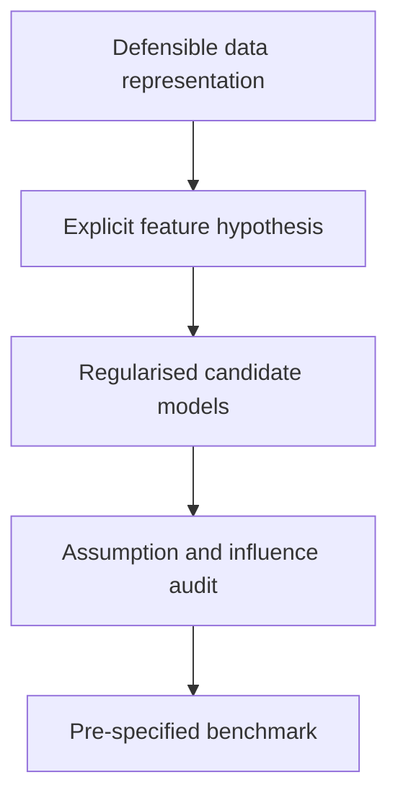
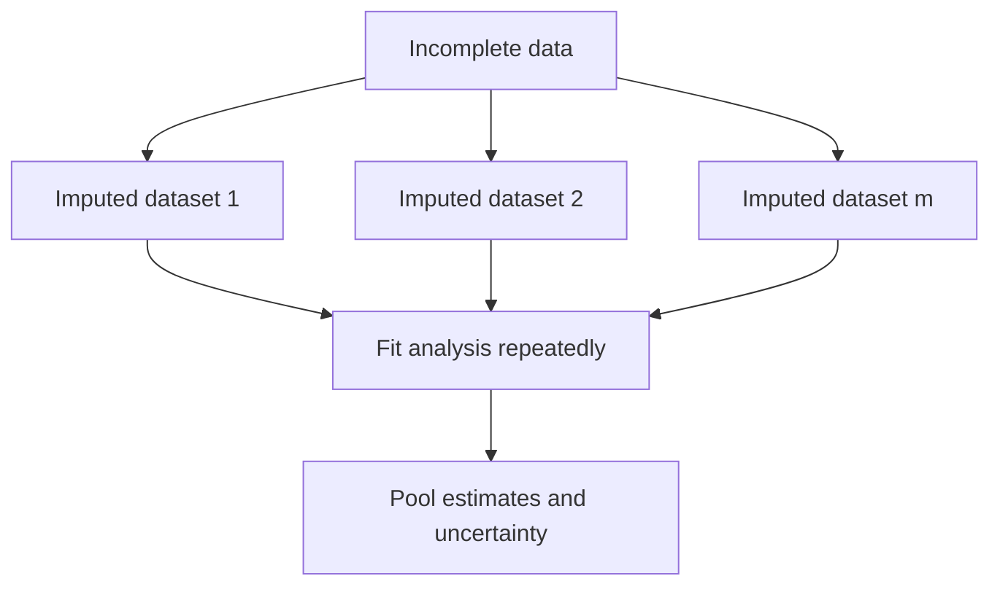
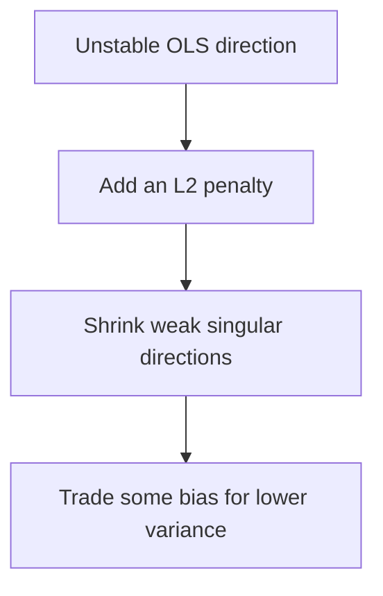
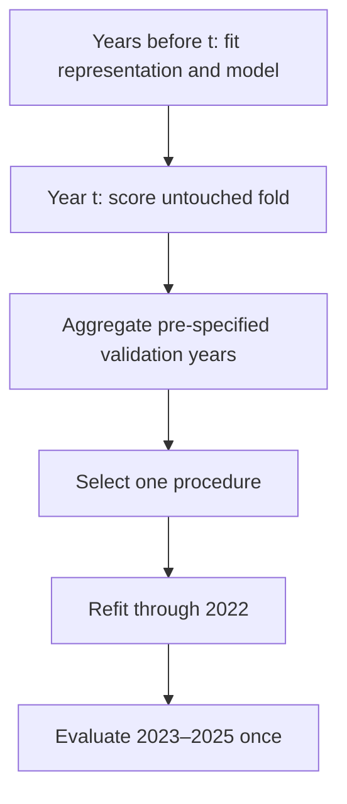
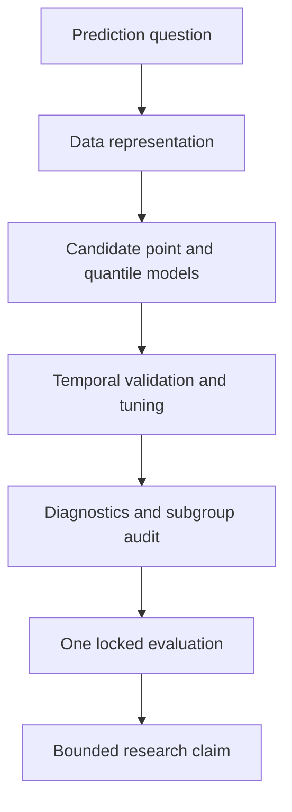

# Chapter 3 — From a Trustworthy Baseline to a Research-Grade Regression Study

## Level 3 Practitioner: eight days of model design, diagnosis, and disciplined comparison

> **Central promise.** Chapter 2 taught you to build a stable model and evaluate it honestly. By the end of Chapter 3, you will be able to design missing-data and categorical-data preprocessing without leakage, express nonlinear and conditional relationships through engineered features, derive ridge and lasso regression, diagnose multicollinearity and influential projects, distinguish robust estimation from robust inference, estimate conditional cost quantiles, and run a pre-specified benchmark study whose conclusions another researcher can audit.

The learner is still protected from unnecessary cognitive overload. Every new technique begins with a question, a small numerical example, and an equation developed from familiar ideas. Library calls come only after the mechanism is visible.

The chapter also marks an important change of attitude. A practitioner does not ask only:

> “Which model produced the smallest number?”

A practitioner asks:

- What exact relationship did the feature representation permit?
- Which observations determined the answer?
- Which assumptions support the uncertainty statement?
- Did model selection occur inside the evaluation boundary?
- Is an apparent improvement large enough and stable enough to matter?
- Which communities or project types bear the cost of failure?

---

## Why the original draft required reconstruction

The earlier Chapter 3 contained valuable headings but compressed preprocessing, feature engineering, multicollinearity, diagnostics, ridge, lasso, elastic net, robust covariance, and subgroup debugging into fewer than 2,000 words. It also jumped from section 15 to section 25 and repeated several shortcuts that would mislead a beginner.

This reconstruction corrects those problems.

1. **Scaling is stated accurately.** An unpenalised linear model does not automatically treat a numerically large feature as more important. Scaling matters for conditioning, optimisation, distance-based models, and penalties whose meaning depends on coefficient units.
2. **Feature engineering becomes model specification.** A negative quadratic coefficient does not, by itself, prove a meaningful optimum. Interactions and transformations must be interpreted through derivatives, ranges, and deployment timing.
3. **VIF becomes a diagnostic, not a ritual cutoff.** Values such as 5 or 10 are conventions, not universal laws. The consequence depends on prediction, explanation, design, sample size, and the variables’ roles.
4. **Diagnostics are separated by purpose.** A residual plot can reveal a pattern but cannot diagnose causation. A robust covariance estimator changes uncertainty calculations; it does not repair an incorrect mean function or endogeneity.
5. **Regularisation is derived.** Ridge, lasso, and elastic net are not presented as three buttons. Their objectives, geometry, scaling requirements, algorithms, and inferential limits are developed explicitly.
6. **Research papers become working material.** Each paper study identifies its question, design, result, limitation, and a replication task.

## Prerequisite checkpoint

Before beginning, retrieve these ideas from Chapters 1 and 2 without notes:

- $\hat y=X\hat\beta$ and $e=y-\hat y$;
- the OLS objective and gradient;
- rank, singular values, and condition number;
- why learned preprocessing belongs inside a pipeline;
- train, validation, test, grouped CV, temporal CV, and nested CV;
- confidence interval versus prediction interval; and
- MAE, RMSE, held-out $R^2$, signed error, and subgroup evaluation.

If these are not yet explainable, revisit the relevant exit checks. Practitioner-level work rests on them.

## Learning outcomes

At the end of Chapter 3, you should be able to:

- represent missingness with an indicator and explain MCAR, MAR, and MNAR without claiming they can always be diagnosed from observed data;
- explain why simple imputation changes a distribution and why multiple imputation serves a different inferential purpose;
- compare one-hot, ordinal, frequency, and target encoding by the information and assumptions they introduce;
- implement cross-fitted target encoding and explain why ordinary target means leak;
- distinguish a transformation selected from prior knowledge from one selected after examining outcomes;
- construct centred polynomial, interaction, log, ratio, piecewise, and spline features;
- interpret a quadratic model using its derivative and observed range;
- interpret a continuous-by-binary and continuous-by-continuous interaction;
- apply the hierarchy principle to polynomial and interaction models;
- derive the ridge solution and its singular-value shrinkage factors;
- explain the constrained geometry and Gaussian-prior MAP interpretation of ridge;
- derive the lasso soft-thresholding solution for an orthonormal design;
- explain why lasso can set coefficients to zero and why zero does not establish scientific irrelevance;
- describe elastic net’s treatment of correlated predictors;
- calculate leverage, studentised residuals, Cook’s distance, and VIF from definitions;
- distinguish an outlying target, a high-leverage design point, and an influential observation;
- construct HC0 and explain HC1–HC3 heteroskedasticity-consistent covariance estimators;
- construct the cluster “sandwich” and state why five districts are too few for casual asymptotic confidence;
- distinguish robust standard errors, robust regression, and quantile regression;
- derive Huber loss and pinball loss;
- fit and evaluate conditional median and upper-quantile models;
- verify empirical quantile coverage on held-out data;
- design a locked-test benchmark containing all preprocessing, feature generation, and tuning; and
- report a result whose uncertainty, subgroup limitations, and post-selection status are explicit.

## The eight-day route

| Day | Central idea | Problem resolved |
|---|---|---|
| [Day 13](#day-13--preprocessing-is-part-of-the-model) | Missingness and categorical representation | “Cleaning” can alter the question and leak the answer |
| [Day 14](#day-14--feature-engineering-as-model-specification) | Nonlinearity and interactions | A straight additive surface may omit known mechanisms |
| [Day 15](#day-15--ridge-regression-shrinkage-and-stability) | $L_2$ shrinkage | Correlated, numerous features create unstable estimates |
| [Day 16](#day-16--lasso-elastic-net-and-sparse-models) | $L_1$ sparsity and mixed penalties | Prediction may need shrinkage and a smaller active set |
| [Day 17](#day-17--multicollinearity-leverage-and-influence) | Diagnostic geometry | A few design points or weak directions can dominate coefficients |
| [Day 18](#day-18--heteroskedasticity-and-dependent-data) | Robust and clustered covariance | Classical standard errors can use the wrong variance structure |
| [Day 19](#day-19--robust-and-quantile-regression) | Alternative conditional targets and losses | The conditional mean and squared loss are not every decision |
| [Day 20](#day-20--a-pre-specified-regression-benchmark) | Research workflow | Flexible analysis can turn noise into a publishable-looking result |



---

## Running case and prediction contract

We continue the fictional microhydro power (MHP) appraisal case. One row is one project. The target is final cost in constant 2025 million PKR. Prediction occurs at technical appraisal, before procurement and construction.

The Chapter 2 generator produced:

- project ID;
- district;
- start year;
- planned capacity;
- estimated cable length;
- road distance;
- terrain index;
- a prohibited final material bill; and
- actual project cost.

Chapter 3 adds realistic data-quality problems and candidate features:

- some road-distance surveys are missing;
- contractor experience is recorded as an ordered count;
- access mode is categorical;
- capacity and cable length interact;
- the cost–capacity relationship is curved;
- remote projects have larger conditional variance; and
- a few extreme but legitimate projects test robustness.

### Practitioner data extension

Save the Chapter 2 generator as `chapter2_data.py`, then save the following as `chapter3_data.py`.

```python
import numpy as np
import pandas as pd

from chapter2_data import make_mhp_projects


def make_mhp_practitioner_data(n=520, seed=3030):
    """Extend Chapter 2's fictional projects for Chapter 3 laboratories."""
    df = make_mhp_projects(n=n, seed=seed)
    rng = np.random.default_rng(seed + 1)

    # Appraisal-time variables.
    df["contractor_experience_projects"] = rng.poisson(lam=5.0, size=n)
    df["access_mode"] = np.select(
        [
            df["road_distance_km"] <= 5.0,
            df["road_distance_km"] <= 18.0,
        ],
        ["road", "mixed"],
        default="porter_or_air",
    )

    # A noisy duplicate creates interpretable multicollinearity.
    df["surveyed_route_km"] = (
        df["road_distance_km"]
        + 0.35 * df["estimated_cable_km"]
        + rng.normal(0.0, 0.35, size=n)
    )

    # Missingness is more likely in difficult access modes and early years.
    missing_probability = (
        0.03
        + 0.15 * (df["access_mode"] == "porter_or_air").astype(float)
        + 0.07 * (df["start_year"] <= 2018).astype(float)
    )
    missing_road = rng.random(n) < missing_probability
    df["road_distance_observed_km"] = df["road_distance_km"].mask(missing_road)

    # A handful of extreme but genuine projects.
    candidate_extremes = df.index[df["road_distance_km"] > 20.0].to_numpy()
    extreme_count = min(8, candidate_extremes.size)
    extreme_index = rng.choice(candidate_extremes, size=extreme_count, replace=False)
    df["extreme_logistics_event"] = 0
    df.loc[extreme_index, "extreme_logistics_event"] = 1
    df.loc[extreme_index, "actual_cost_2025_million_pkr"] += rng.uniform(
        18.0, 35.0, size=extreme_count
    )

    return df


if __name__ == "__main__":
    projects = make_mhp_practitioner_data()
    projects.to_csv("mhp_projects_chapter3.csv", index=False)
    print(projects.head())
    print(projects.isna().mean().sort_values(ascending=False).head())
```

The generator deliberately retains the complete `road_distance_km` so that the learner can verify how missingness was created. In an actual incomplete dataset that hidden truth would be unavailable. It must never be used as a feature when evaluating the imputation workflow.

## Software setup

```bash
python -m pip install numpy pandas scipy matplotlib scikit-learn statsmodels
```

The main predictive capstone uses NumPy, pandas, Matplotlib, SciPy, and scikit-learn. Statsmodels is used for inferential and influence demonstrations. Record exact versions in every benchmark report.

---

# Day 13 — Preprocessing Is Part of the Model

> **Today’s central idea:** Missing-value handling and categorical encoding are learned representations. They change what information the model receives and therefore belong inside the fitted and evaluated procedure.

## 13.1 Begin with a missingness indicator

For a variable $X_j$, define:

$$
R_{ij}=
\begin{cases}
1, & X_{ij}\text{ is observed},\\
0, & X_{ij}\text{ is missing}.
\end{cases}
$$

The missingness mechanism describes how $R$ relates to observed and unobserved data. The terms below concern conditional relationships, not moral judgements about data quality.

## 13.2 MCAR, MAR, and MNAR
<button class="read-details-btn" data-section="3a-2">✦ Read Details</button>

Let $X_{obs}$ denote observed values and $X_{mis}$ missing values.

### Missing completely at random (MCAR)

$$
P(R\mid X_{obs},X_{mis})=P(R).
$$

Missingness is unrelated to observed or missing data. A random scanner failure affecting forms independently of project characteristics might approximate MCAR.

### Missing at random (MAR)

$$
P(R\mid X_{obs},X_{mis})=P(R\mid X_{obs}).
$$

After conditioning on observed variables, missingness no longer depends on the unseen value. If road distance is more often missing in early years and particular access modes, and those variables are observed and adequately modeled, MAR may be defensible.

### Missing not at random (MNAR)

Even after conditioning on observed information, missingness depends on the missing value or another unobserved quantity. For example, extremely remote surveys may be selectively omitted precisely because the true access distance was difficult to establish.

These mechanisms cannot generally be proven from the observed dataset alone. MNAR sensitivity analysis requires explicit alternative assumptions.

## 13.3 What complete-case analysis changes

Complete-case analysis deletes any row with a missing required field. It is simple but can:

- reduce sample size;
- change the mixture of districts and project types;
- exclude precisely the remote projects of interest; and
- produce biased estimates unless the missingness and analysis conditions justify deletion.

Always compare the retained and excluded rows on observed variables. This cannot prove that deletion is safe, but it can reveal obvious selection.

```python
from chapter3_data import make_mhp_practitioner_data

df = make_mhp_practitioner_data()
observed = df[df["road_distance_observed_km"].notna()]
missing = df[df["road_distance_observed_km"].isna()]

comparison_columns = [
    "terrain_index",
    "planned_capacity_kw",
    "actual_cost_2025_million_pkr",
]

print("Observed road distance, n =", len(observed))
print(observed[comparison_columns].mean())
print("\nMissing road distance, n =", len(missing))
print(missing[comparison_columns].mean())
print("\nMissingness by access mode")
print(df.groupby("access_mode")["road_distance_observed_km"].apply(lambda x: x.isna().mean()))
```

The target is shown here for a retrospective missingness audit. It must not be used by an appraisal-time imputer.

## 13.4 Simple imputation is a learned rule
<button class="read-details-btn" data-section="3a-4">✦ Read Details</button>

Median imputation replaces missing training values with the training median:

$$
x_{ij}^{imp}=
\begin{cases}
x_{ij}, & R_{ij}=1,\\
\operatorname{median}(X_{j,train}), & R_{ij}=0.
\end{cases}
$$

This preserves sample size and is often a useful predictive baseline. It does not recreate the missing values or preserve the original distribution:

- many observations pile up at one value;
- variance is reduced;
- relationships with other variables are weakened; and
- ordinary inferential formulas that pretend imputed values were observed can understate uncertainty.

## 13.5 Missing indicators

Add a binary feature:

$$
M_{ij}=1-R_{ij}.
$$

The model can then learn a separate offset for observations whose value was imputed. This can improve prediction if missingness carries stable signal. It does not make an MNAR mechanism ignorable or turn “missing” into a causal explanation.

```python
import numpy as np
from sklearn.impute import SimpleImputer

x_train = np.array([[2.0], [4.0], [np.nan], [10.0], [np.nan]])
x_future = np.array([[np.nan], [30.0]])

imputer = SimpleImputer(strategy="median", add_indicator=True)
train_transformed = imputer.fit_transform(x_train)
future_transformed = imputer.transform(x_future)

print("Learned median:", imputer.statistics_)
print("Training output:\n", train_transformed)
print("Future output:\n", future_transformed)
```

The future missing value receives the training median and an indicator of 1. The value 30 remains 30 and has indicator 0.

## 13.6 Single imputation versus multiple imputation

Single imputation creates one completed dataset. Multiple imputation creates $m$ plausible completed datasets under an imputation model, fits the analysis to each, and combines estimates and uncertainties.

Conceptually:



Multiple imputation is particularly important for parameter inference because it carries missing-value uncertainty into the result. It is not automatically superior for every prediction pipeline, and its imputation model must respect training boundaries and deployment availability.

### Rubin's pooling rules

Suppose completed dataset $l$ produces estimate $\hat Q_l$ and estimated within-imputation variance $U_l$, for $l=1,\ldots,m$. Pool the point estimates:

$$
\bar Q=\frac1m\sum_{l=1}^{m}\hat Q_l.
$$

Average their within-imputation variances:

$$
\bar U=\frac1m\sum_{l=1}^{m}U_l.
$$

Measure between-imputation variation:

$$
B=\frac{1}{m-1}\sum_{l=1}^{m}(\hat Q_l-\bar Q)^2.
$$

The pooled variance is

$$
T=\bar U+\left(1+\frac1m\right)B.
$$

$\bar U$ reflects ordinary estimation uncertainty if the completed values were known. $B$ reflects sensitivity to which plausible missing values were supplied. The finite-$m$ multiplier accounts for using only a limited number of imputations.

These rules are not valid merely because several datasets were generated. The imputation and analysis models must be compatible enough for the intended estimand, all variables governing missingness and the analysis should be considered, and pooling degrees of freedom require appropriate finite-sample formulas. For predictive assessment, imputation must occur separately inside each training fold, and performance is evaluated on the observed held-out outcomes—not by pooling a leaky completion of the entire dataset.

## 13.7 Categorical variables are hypotheses about similarity
<button class="read-details-btn" data-section="3a-7">✦ Read Details</button>

Encoding does more than convert strings to numbers. It tells the model which category differences can share information.

### One-hot encoding

For categories A, B, and C, create indicator columns. With an intercept, use a reference coding or an equivalent constrained parameterisation for unique coefficients.

If A is the reference:

$$
\hat y=\beta_0+\beta_B I(B)+\beta_C I(C).
$$

- $\beta_0$ is the fitted value for A at the other features’ reference values;
- $\beta_B$ is the conditional difference B minus A; and
- $\beta_C$ is the conditional difference C minus A.

Changing the reference changes the coefficient labels, not fitted values.

### Ordinal encoding

Mapping categories to 0, 1, 2 imposes order. A linear model further treats adjacent gaps as equal unless transformed. Use it only when that structure is intended.

### Frequency encoding

Replacing a category by its training frequency says commonness is predictive. Two categories with the same frequency become indistinguishable.

### Target encoding

Replacing category $c$ with its target mean uses outcome information:

$$
TE(c)=\frac{1}{n_c}\sum_{i:C_i=c}y_i.
$$

Naively applying this to the same rows used to calculate the mean leaks each row’s outcome into its own feature, especially for rare categories.

## 13.8 Smoothed target encoding

A smoothed estimate blends the category mean with the global training mean:

$$
\widetilde{TE}(c)
=\frac{n_c\bar y_c+m\bar y}{n_c+m},
$$

where $m>0$ controls shrinkage. Rare categories are pulled more strongly toward the global mean.

Smoothing reduces variance but does not solve same-row leakage. Training encodings still require cross-fitting.

## 13.9 Cross-fitted target encoding from scratch

For each training fold:

1. calculate category statistics on the other folds;
2. encode the held-out fold with those statistics;
3. combine the out-of-fold encodings; and
4. after training the downstream model, fit one encoder on all development rows for future transformation.

```python
import numpy as np
import pandas as pd
from sklearn.model_selection import KFold


def smoothed_mapping(category, target, smoothing=10.0):
    frame = pd.DataFrame({"category": category, "target": target})
    global_mean = frame["target"].mean()
    stats = frame.groupby("category")["target"].agg(["count", "mean"])
    encoded = (
        stats["count"] * stats["mean"] + smoothing * global_mean
    ) / (stats["count"] + smoothing)
    return encoded.to_dict(), global_mean


def cross_fitted_target_encode(category, target, folds=5, smoothing=10.0, seed=42):
    category = pd.Series(category).reset_index(drop=True)
    target = pd.Series(target, dtype=float).reset_index(drop=True)
    encoded = np.empty(len(category), dtype=float)

    splitter = KFold(n_splits=folds, shuffle=True, random_state=seed)
    for fit_index, held_index in splitter.split(category):
        mapping, fallback = smoothed_mapping(
            category.iloc[fit_index],
            target.iloc[fit_index],
            smoothing=smoothing,
        )
        encoded[held_index] = (
            category.iloc[held_index].map(mapping).fillna(fallback).to_numpy()
        )

    final_mapping, final_fallback = smoothed_mapping(
        category, target, smoothing=smoothing
    )
    return encoded, final_mapping, final_fallback


category = pd.Series(["A", "A", "B", "B", "C", "rare"])
target = pd.Series([10.0, 12.0, 20.0, 23.0, 31.0, 100.0])

encoded, mapping, fallback = cross_fitted_target_encode(
    category, target, folds=3, smoothing=5.0
)
print("Cross-fitted training values:", encoded)
print("Final deployment mapping:", mapping)
print("Unseen-category fallback:", fallback)
```

For grouped or temporal data, the inner cross-fitting splitter must also respect groups or time. Random K-fold target encoding can leak future or district information even though it avoids same-row leakage.

## 13.10 A leakproof mixed-type pipeline

```python
from sklearn.compose import ColumnTransformer
from sklearn.impute import SimpleImputer
from sklearn.linear_model import Ridge
from sklearn.pipeline import Pipeline
from sklearn.preprocessing import OneHotEncoder, StandardScaler

numeric_features = [
    "start_year",
    "planned_capacity_kw",
    "estimated_cable_km",
    "road_distance_observed_km",
    "terrain_index",
    "contractor_experience_projects",
]
categorical_features = ["district", "access_mode"]

numeric_pipeline = Pipeline(
    steps=[
        ("impute", SimpleImputer(strategy="median", add_indicator=True)),
        ("scale", StandardScaler()),
    ]
)

categorical_pipeline = Pipeline(
    steps=[
        ("impute", SimpleImputer(strategy="most_frequent")),
        ("one_hot", OneHotEncoder(handle_unknown="ignore", drop="first")),
    ]
)

preprocessor = ColumnTransformer(
    transformers=[
        ("numeric", numeric_pipeline, numeric_features),
        ("categorical", categorical_pipeline, categorical_features),
    ]
)

ridge_pipeline = Pipeline(
    steps=[
        ("preprocess", preprocessor),
        ("model", Ridge(alpha=1.0)),
    ]
)
```

The chapter has not yet justified `alpha=1.0`; Day 15 will derive and tune it. Today’s point is the information boundary.

## 13.11 Research paper discussion 1: Rubin on missing data

**Paper:** Donald B. Rubin (1976), [“Inference and Missing Data”](https://doi.org/10.1093/biomet/63.3.581), *Biometrika* 63(3), 581–592.

### The question

Under what conditions can an analysis ignore the process that caused data to be missing?

### The contribution

Rubin formalised relationships among the data model, missingness process, observed values, and missing values. The paper established conditions under which likelihood or sampling-based analyses may ignore the missingness mechanism, with important distinctions among inferential frameworks.

### What the beginner should retain

1. “Missing at random” is conditional on observed information; it does not mean values disappeared for no reason.
2. Whether missingness can be ignored depends on both the mechanism and the analysis.
3. Observed data alone generally cannot rule out MNAR.
4. Filling blanks is not the same as accounting for missing-data uncertainty.

### MHP application

If road distance is missing more often for remote sites, median imputation may support a predictive baseline but can hide a systematic access problem. A defensible report should compare missingness by observed terrain, year, district, and access mode, then conduct sensitivity analysis for plausible unobserved distances.

### Limitation

The paper provides a general inferential framework, not an automatic recipe for a particular MHP database. The analyst must still argue which variables govern recording, whether they were observed, and whether the imputation model is adequate.

### Replication prompt

Simulate the same complete data under MCAR, MAR, and MNAR deletion. Compare complete-case estimates, median-imputed predictions, and a model that includes a missing indicator. Separate predictive error from coefficient bias.

## 13.12 Day 13 build, break, and reflect

**Build**

1. Produce a missingness table by year, district, access mode, and terrain.
2. Compare complete-case and median-plus-indicator pipelines under forward validation.
3. One-hot encode district and explain the reference category.
4. Cross-fit a target encoding for a high-cardinality fictional contractor ID.

**Break**

1. Fit the imputer on the whole dataset.
2. Calculate target means on the same rows they encode.
3. assign arbitrary ordinal numbers to districts and fit a linear slope.
4. Delete incomplete projects and call the remaining sample representative without checking.

**Reflect**

Write an “information receipt” for every generated column: what raw fields it used, whether it used $y$, which rows fitted it, and when it would be available at deployment.

### Day 13 exit check

You are ready for Day 14 when you can explain why MAR is not “missing for no reason,” why a missing indicator does not solve MNAR, and why target encoding needs two levels of protection: cross-fitting inside development data and separation from the final test.

---

# Day 14 — Feature Engineering as Model Specification

> **Today’s central idea:** Creating a feature changes the family of relationships a model can express. A feature is a mathematical hypothesis about the world, not a free source of accuracy.

## 14.1 Linear regression is linear in parameters
<button class="read-details-btn" data-section="3b-1">✦ Read Details</button>

Consider:

$$
\hat y=\beta_0+\beta_1x+\beta_2x^2.
$$

The prediction is curved in $x$ but linear in the parameters $\beta_0,\beta_1,\beta_2$. OLS can fit it because the design matrix contains columns $1,x,x^2$:

$$
X_{poly}=
\begin{bmatrix}
1&x_1&x_1^2\\
1&x_2&x_2^2\\
\vdots&\vdots&\vdots\\
1&x_n&x_n^2
\end{bmatrix}.
$$

Feature engineering alters the columns. The fitting machinery remains linear least squares or its regularised variant.

## 14.2 Centre before forming powers

Let:

$$
x_c=x-c,
$$

where $c$ is a meaningful reference, often the training mean or a policy-relevant value. Fit:

$$
\hat y=\gamma_0+\gamma_1x_c+\gamma_2x_c^2.
$$

Benefits:

- $\gamma_0$ is the fitted value at $x=c$;
- $\gamma_1$ is the slope at $x=c$;
- correlation between $x_c$ and $x_c^2$ is often reduced; and
- coefficient magnitudes can be easier to compute and explain.

The centre must be learned from training data when it is data-derived.

## 14.3 Interpret a quadratic through its derivative

For:

$$
f(x)=\beta_0+\beta_1x+\beta_2x^2,
$$

the instantaneous slope is:

$$
\frac{df(x)}{dx}=\beta_1+2\beta_2x.
$$

A stationary point occurs at:

$$
x^*=-\frac{\beta_1}{2\beta_2},
$$

provided $\beta_2\ne0$.

- If $\beta_2<0$, the curve is concave and the stationary point is a maximum.
- If $\beta_2>0$, it is convex and the stationary point is a minimum.

But a negative $\beta_2$ does not “confirm an optimum.” The stationary point must lie in a credible feature range, the specification must be adequate, uncertainty must be considered, and the relationship remains associational unless causally identified.

## 14.4 Code proof: recover a turning point

```python
import numpy as np

rng = np.random.default_rng(141)
capacity = rng.uniform(80.0, 850.0, size=300)
capacity_center = capacity.mean()
x = capacity - capacity_center

cost = 50.0 + 0.08 * x + 0.00008 * x**2 + rng.normal(0.0, 4.0, size=x.size)
X = np.column_stack([np.ones(x.size), x, x**2])
beta = np.linalg.lstsq(X, cost, rcond=None)[0]

turning_centered = -beta[1] / (2.0 * beta[2])
turning_original = turning_centered + capacity_center

print("Coefficients:", beta)
print("Stationary point in original capacity units:", turning_original)
print("Observed capacity range:", capacity.min(), capacity.max())
```

The true simulated curve is convex, so the stationary point is a minimum. Whether it lies in the observed range must be checked before interpretation.

## 14.5 Continuous-by-continuous interactions

Fit:

$$
\hat y
=\beta_0+\beta_1x_1+\beta_2x_2+\beta_3x_1x_2.
$$

The effect of $x_1$ depends on $x_2$:

$$
\frac{\partial\hat y}{\partial x_1}
=\beta_1+\beta_3x_2.
$$

Similarly:

$$
\frac{\partial\hat y}{\partial x_2}
=\beta_2+\beta_3x_1.
$$

Once an interaction is present, $\beta_1$ is not “the effect of $x_1$ everywhere.” It is the slope of $x_1$ when $x_2=0$. Centring can make that reference meaningful.

For MHP projects, cable-length cost may rise more steeply when road access is poor:

$$
\widehat{cost}=\cdots+\beta_1 cable+\beta_2 road+\beta_3(cable\times road).
$$

## 14.6 Continuous-by-binary interactions

Let $D=1$ for `porter_or_air` access and 0 for the reference access category:

$$
\hat y=\beta_0+\beta_1x+\beta_2D+\beta_3xD.
$$

For $D=0$:

$$
\hat y=\beta_0+\beta_1x.
$$

For $D=1$:

$$
\hat y=(\beta_0+\beta_2)+(\beta_1+\beta_3)x.
$$

$\beta_2$ changes the intercept and $\beta_3$ changes the slope.

## 14.7 The hierarchy principle

If a model includes $x_1x_2$, usually retain $x_1$ and $x_2$. If it includes $x^2$, retain $x$. This is the hierarchy—or marginality—principle.

Reasons:

- the interaction’s meaning depends on the lower-order terms;
- excluding them imposes special constraints that are rarely intended; and
- predictions can change under harmless shifts of the feature origin.

Hierarchy is a default modeling discipline, not an inviolable theorem. Departures require a substantive constraint that can be defended.

## 14.8 Ratios are strong assumptions

The ratio:

$$
r=\frac{x_1}{x_2}
$$

assumes that proportional comparison is meaningful. Risks include:

- instability when $x_2$ is near zero;
- measurement error in both numerator and denominator;
- loss of separate size information; and
- accidental leakage if the denominator is measured after prediction time.

If “cost per kW” is used as a target while planned capacity is also a feature, converting predictions back to total cost requires careful weighting and error interpretation. A low error in ratios need not mean a low portfolio budget error.

## 14.9 Log transformations

For positive $x$:

$$
z=\log x.
$$

For nonnegative $x$, analysts often use:

$$
z=\log(1+x).
$$

These transformations compress large values and can express multiplicative relationships. They do not “make data normal” by guarantee, and normal feature distributions are not an OLS requirement.

Interpretation examples:

- **Level–log:** $y=\beta_0+\beta_1\log x$. A 1% change in $x$ is associated approximately with $0.01\beta_1$ units of $y$ for small changes.
- **Log–level:** $\log y=\beta_0+\beta_1x$. A one-unit change in $x$ is associated approximately with a $100\beta_1$ percent change in $y$ when $\beta_1$ is small.
- **Log–log:** $\log y=\beta_0+\beta_1\log x$. $\beta_1$ is an elasticity under the model.

When predicting on a log target, $\exp(\widehat{\log y})$ is generally a conditional median under a log-error model, not automatically the conditional mean. Retransformation bias needs explicit treatment.

## 14.10 Piecewise linear features
<button class="read-details-btn" data-section="3b-1">✦ Read Details</button>

For a knot $k$, define the hinge:

$$
(x-k)_+=\max(0,x-k).
$$

Fit:

$$
\hat y=\beta_0+\beta_1x+\beta_2(x-k)_+.
$$

- Below $k$, the slope is $\beta_1$.
- Above $k$, the slope is $\beta_1+\beta_2$.

This expresses a slope change without forcing a global parabola. The knot must be pre-specified or selected inside validation.

## 14.11 Splines: flexible curves built from controlled pieces
<button class="read-details-btn" data-section="3b-1">✦ Read Details</button>

A spline represents a curve as a weighted combination of basis functions:

$$
f(x)=\sum_{m=1}^{M}\theta_mB_m(x).
$$

The basis functions are fixed once degree and knots are defined; the coefficients $\theta_m$ are learned. Splines can fit local curvature more gently than high-degree global polynomials.

The number and location of knots control flexibility. They are hyperparameters and belong inside the selection procedure.

```python
from sklearn.linear_model import Ridge
from sklearn.pipeline import Pipeline
from sklearn.preprocessing import SplineTransformer, StandardScaler

spline_model = Pipeline(
    steps=[
        (
            "spline",
            SplineTransformer(
                n_knots=5,
                degree=3,
                include_bias=False,
            ),
        ),
        ("scale", StandardScaler()),
        ("model", Ridge(alpha=1.0)),
    ]
)
```

The spline shown is for one numeric feature. A full mixed-type model uses a `ColumnTransformer` so only selected columns receive spline expansion.

## 14.12 Feature explosion
<button class="read-details-btn" data-section="3b-1">✦ Read Details</button>

With $p$ original features, degree-2 expansion can create:

- $p$ first-order terms;
- $p$ squares; and
- $p(p-1)/2$ pairwise interactions.

The number grows quadratically. High-degree expansion grows faster. This increases computation, multicollinearity, model-selection opportunity, and the risk of fitting noise. Domain knowledge and regularisation are therefore partners, not rivals.

## 14.13 Build an explicit engineering transformer
<button class="read-details-btn" data-section="3b-1">✦ Read Details</button>

```python
import numpy as np
import pandas as pd
from sklearn.base import BaseEstimator, TransformerMixin


class MHPFeatureEngineer(BaseEstimator, TransformerMixin):
    """Create appraisal-time features with training-learned centres."""

    def fit(self, X, y=None):
        X = pd.DataFrame(X).copy()
        required = {
            "planned_capacity_kw",
            "estimated_cable_km",
            "road_distance_observed_km",
        }
        missing = required.difference(X.columns)
        if missing:
            raise ValueError(f"Missing required columns: {sorted(missing)}")

        self.capacity_center_ = X["planned_capacity_kw"].median()
        self.cable_center_ = X["estimated_cable_km"].median()
        self.road_center_ = X["road_distance_observed_km"].median()
        return self

    def transform(self, X):
        X = pd.DataFrame(X).copy()
        capacity_c = X["planned_capacity_kw"] - self.capacity_center_
        cable_c = X["estimated_cable_km"] - self.cable_center_
        road_c = X["road_distance_observed_km"] - self.road_center_

        X["capacity_centered"] = capacity_c
        X["capacity_centered_sq"] = capacity_c**2
        X["cable_road_interaction"] = cable_c * road_c
        X["road_above_18_km"] = np.maximum(
            X["road_distance_observed_km"] - 18.0,
            0.0,
        )
        X["log1p_contractor_experience"] = np.log1p(
            X["contractor_experience_projects"]
        )
        return X
```

Because missing road distance has not yet been imputed, this transformer must be placed after an appropriate imputation step or written to handle missing values deliberately. Pipeline order is part of the model.

## 14.14 Visualise before and after extrapolation
<button class="read-details-btn" data-section="3b-1">✦ Read Details</button>

```python
import numpy as np
import matplotlib.pyplot as plt

observed_x = np.linspace(80.0, 850.0, 150)
future_x = np.linspace(20.0, 1300.0, 300)

# Illustrative fitted functions, not fitted project results.
quadratic = 20.0 + 0.03 * future_x + 0.00004 * future_x**2
hinge = 20.0 + 0.05 * future_x + 0.06 * np.maximum(future_x - 700.0, 0.0)

fig, ax = plt.subplots(figsize=(8, 4.5))
ax.plot(future_x, quadratic, label="quadratic")
ax.plot(future_x, hinge, label="piecewise linear")
ax.axvspan(observed_x.min(), observed_x.max(), alpha=0.15, label="observed range")
ax.set_xlabel("Planned capacity (kW)")
ax.set_ylabel("Illustrative fitted cost")
ax.set_title("Feature choice controls extrapolation")
ax.legend()
ax.grid(alpha=0.3)
plt.tight_layout()
plt.show()
```

Two models can fit the observed range similarly and diverge dramatically outside it. Validation cannot certify extrapolation where no comparable cases exist.

## 14.15 Day 14 build, break, and reflect
<button class="read-details-btn" data-section="3b-1">✦ Read Details</button>

**Build**

1. Centre capacity using the training median.
2. Add capacity squared, cable-by-road interaction, an 18 km hinge, and log contractor experience.
3. Compare additive, quadratic, and spline models with forward validation.
4. Plot partial fitted curves across the observed capacity range.

**Break**

1. Choose a polynomial degree after examining final test error.
2. include an interaction but remove its main effects.
3. create a ratio with a near-zero denominator.
4. claim that a negative square coefficient proves a causal optimum.
5. extrapolate a fifth-degree polynomial far beyond observed capacity.

**Reflect**

For every engineered feature, write the mechanism it represents, its units, its valid range, and the evidence that it will be available at appraisal.

### Day 14 exit check

You are ready for regularisation when you can interpret a quadratic through its derivative, explain an interaction using a conditional slope, and state why feature generation must be repeated inside each validation training fold.

---

# Day 15 — Ridge Regression: Shrinkage and Stability

## 15.1 The question for today

Suppose two predictors contain almost the same information. OLS can fit their combined contribution well while assigning a large positive coefficient to one and a large negative coefficient to the other. A small change in the sample may reverse those assignments.

Can we accept a little bias in order to obtain a more stable model with better predictions?

Ridge regression answers yes. It prefers coefficients that fit the observations while remaining collectively small.

## 15.2 From OLS to a penalised objective
<button class="read-details-btn" data-section="3c-2">✦ Read Details</button>

Assume for the moment that:

- every numeric column has been centred and standardised using training data;
- the target has been centred; and
- the intercept has therefore been separated from the penalised coefficients.

OLS minimises residual sum of squares:

$$
J_{\text{OLS}}(\beta)=\lVert y-X\beta\rVert_2^2.
$$

Ridge adds the squared Euclidean length of the coefficient vector:

$$
J_{\text{ridge}}(\beta)
=\lVert y-X\beta\rVert_2^2+\lambda\lVert\beta\rVert_2^2,
\qquad \lambda\ge 0.
$$

The first term asks for fit. The second asks for restraint. The tuning parameter $\lambda$ determines their trade-off.

- $\lambda=0$ recovers OLS when the OLS solution is unique.
- A small positive $\lambda$ introduces mild shrinkage.
- A very large $\lambda$ pushes the penalised coefficients toward zero.
- The intercept is normally not penalised.

This chapter uses the objective above for derivations. Software packages sometimes divide the loss by $n$, $2$, or $2n$. Their parameter called `alpha` or `lambda` is therefore not always numerically interchangeable. Always read the implementation's stated objective before copying a tuned value between packages.

## 15.3 Deriving the ridge solution

Expand the objective:

$$
J(\beta)
=(y-X\beta)^\top(y-X\beta)+\lambda\beta^\top\beta.
$$

Its gradient is

$$
\nabla_\beta J
=-2X^\top y+2X^\top X\beta+2\lambda\beta.
$$

Set the gradient to zero:

$$
(X^\top X+\lambda I)\hat\beta_{\text{ridge}}=X^\top y.
$$

For $\lambda>0$,

$$
\boxed{
\hat\beta_{\text{ridge}}
=(X^\top X+\lambda I)^{-1}X^\top y
}
$$

when every displayed coefficient is to be penalised. If a column of ones is retained in $X$, replace $I$ with a penalty matrix whose intercept entry is zero.

### Why the inverse now exists

For any nonzero vector $v$,

$$
v^\top(X^\top X+\lambda I)v
=\lVert Xv\rVert_2^2+\lambda\lVert v\rVert_2^2>0
$$

when $\lambda>0$. The matrix is positive definite even if $X^\top X$ is singular. Ridge therefore produces a unique coefficient vector in settings where OLS coefficients are not uniquely identified.

That algebraic fact does **not** create information that the design never contained. If two columns are identical, ridge can stabilise their combined predictive effect, but it cannot tell a scientist which identical measurement is the true cause.

## 15.4 Why standardisation is part of the model

Consider two equivalent measurements:

- distance in kilometres; and
- the same distance in metres.

A one-unit coefficient measured per metre is 1,000 times smaller than the corresponding coefficient measured per kilometre. The ridge penalty acts on coefficient magnitude, so the unit choice changes the penalty unless features are placed on comparable scales.

For training mean $\bar x_j$ and training standard deviation $s_j$,

$$
z_{ij}=\frac{x_{ij}-\bar x_j}{s_j}.
$$

Standardisation makes a one-unit movement correspond to one training standard deviation. It does not make the features equally important, normally distributed, causal, or free of outliers.

The scaler must be fitted inside each training fold. Fitting it once on all observations lets validation values affect the representation used during training.

## 15.5 Ridge through singular-value decomposition
<button class="read-details-btn" data-section="3c-5">✦ Read Details</button>

Let the centred design have singular-value decomposition

$$
X=U\Sigma V^\top,
$$

where the nonzero singular values are $\sigma_1,\ldots,\sigma_r$. Substitute this factorisation into the ridge solution:

$$
\hat\beta_{\text{ridge}}
=V\,\operatorname{diag}\left(
\frac{\sigma_j}{\sigma_j^2+\lambda}
\right)U^\top y.
$$

For comparison, the minimum-norm OLS solution uses $1/\sigma_j$ in directions with nonzero singular values. A small $\sigma_j$ can therefore amplify noise. Ridge replaces it with

$$
\frac{\sigma_j}{\sigma_j^2+\lambda}.
$$

The fitted values can be written as

$$
\hat y_{\text{ridge}}
=U\,\operatorname{diag}\left(
\frac{\sigma_j^2}{\sigma_j^2+\lambda}
\right)U^\top y.
$$

Each data direction has a shrinkage factor

$$
s_j(\lambda)=\frac{\sigma_j^2}{\sigma_j^2+\lambda}.
$$

Well-supported directions with large $\sigma_j$ retain more of their signal. Weak directions with small $\sigma_j$ are suppressed more strongly. This is the central stability mechanism.

## 15.6 Effective degrees of freedom

Ridge fitted values are linear in $y$:

$$
\hat y=H_\lambda y,
\qquad
H_\lambda=X(X^\top X+\lambda I)^{-1}X^\top.
$$

A useful measure of flexibility is

$$
\operatorname{df}_{\text{eff}}(\lambda)
=\operatorname{tr}(H_\lambda)
=\sum_{j=1}^{r}\frac{\sigma_j^2}{\sigma_j^2+\lambda}.
$$

This is not generally an integer.

- At $\lambda=0$, it equals the rank of the centred design.
- As $\lambda$ grows, it approaches zero for the penalised component.

Ridge can therefore use every feature while behaving like a less flexible fit.

## 15.7 Geometry: a circle meets an ellipse

The penalised form is equivalent, for a corresponding value of $t$, to the constrained problem

$$
\min_\beta \lVert y-X\beta\rVert_2^2
\quad\text{subject to}\quad
\lVert\beta\rVert_2^2\le t.
$$

For two coefficients, the constraint is a circle. Residual-sum-of-squares contours are ellipses around the OLS solution. The ridge solution is the first point at which the smallest attainable ellipse touches the circle.



Unlike the lasso constraint introduced tomorrow, the ridge circle has no corners. A smooth ellipse usually touches it away from an axis. Ridge shrinks coefficients but ordinarily does not make them exactly zero.

## 15.8 A ridge implementation from first principles

The following class deliberately exposes centring, scaling, and the linear solve. It is educational, not a replacement for a production estimator.

```python
import numpy as np


class RidgeFromScratch:
    def __init__(self, alpha=1.0):
        if alpha < 0:
            raise ValueError("alpha must be non-negative")
        self.alpha = float(alpha)

    def fit(self, X, y):
        X = np.asarray(X, dtype=float)
        y = np.asarray(y, dtype=float)

        self.x_mean_ = X.mean(axis=0)
        self.x_scale_ = X.std(axis=0, ddof=0)
        self.x_scale_[self.x_scale_ == 0] = 1.0
        self.y_mean_ = y.mean()

        Z = (X - self.x_mean_) / self.x_scale_
        y_centered = y - self.y_mean_

        system = Z.T @ Z + self.alpha * np.eye(Z.shape[1])
        self.coef_standardized_ = np.linalg.solve(system, Z.T @ y_centered)
        self.coef_ = self.coef_standardized_ / self.x_scale_
        self.intercept_ = self.y_mean_ - self.x_mean_ @ self.coef_
        return self

    def predict(self, X):
        X = np.asarray(X, dtype=float)
        return self.intercept_ + X @ self.coef_
```

Verify it against `scikit-learn`. Both use the objective
$\lVert y-X\beta\rVert_2^2+\alpha\lVert\beta\rVert_2^2$ for the penalised part.

```python
import numpy as np
from sklearn.linear_model import Ridge
from sklearn.pipeline import make_pipeline
from sklearn.preprocessing import StandardScaler

rng = np.random.default_rng(15)
x1 = rng.normal(size=120)
x2 = x1 + rng.normal(0.0, 0.03, size=120)
X = np.column_stack([x1, x2])
y = 4.0 * x1 + rng.normal(0.0, 0.8, size=120)

manual = RidgeFromScratch(alpha=5.0).fit(X, y)
library = make_pipeline(StandardScaler(), Ridge(alpha=5.0)).fit(X, y)

assert np.allclose(manual.predict(X), library.predict(X), atol=1e-10)
print(manual.coef_, manual.intercept_)
```

Use `np.linalg.solve`, not an explicitly computed matrix inverse. Solving the system is more accurate and efficient.

## 15.9 Seeing the coefficient path

A coefficient path shows estimates across candidate penalty strengths.

```python
import matplotlib.pyplot as plt
import numpy as np
from sklearn.linear_model import Ridge
from sklearn.preprocessing import StandardScaler

Z = StandardScaler().fit_transform(X)
alphas = np.logspace(-4, 4, 120)
path = np.vstack([
    Ridge(alpha=alpha).fit(Z, y).coef_
    for alpha in alphas
])

fig, ax = plt.subplots(figsize=(8, 5))
ax.semilogx(alphas, path[:, 0], label="x1")
ax.semilogx(alphas, path[:, 1], label="x2")
ax.set(xlabel="alpha", ylabel="standardised coefficient",
       title="Ridge coefficient path")
ax.legend()
plt.tight_layout()
plt.show()
```

The path is a diagnostic, not a licence to select an attractive coefficient after viewing final-test results. Candidate values must be tuned within the training and validation process.

## 15.10 The bias–variance trade-off

For an estimator $\hat f(x)$ trained on varying samples, expected squared prediction error at $x$ decomposes conceptually as

$$
\mathbb E[(Y-\hat f(x))^2]
=\underbrace{\sigma^2}_{\text{irreducible noise}}
+\underbrace{\operatorname{Bias}[\hat f(x)]^2}_{\text{systematic error}}
+\underbrace{\operatorname{Var}[\hat f(x)]}_{\text{sample sensitivity}}.
$$

Ridge intentionally increases bias relative to OLS. If it reduces variance by more, expected test error falls. It is not universally better: when the sample is large, predictors are few and well-conditioned, and the linear model is appropriate, OLS may already be excellent.

## 15.11 A Bayesian MAP interpretation

Suppose

$$
y\mid X,\beta\sim\mathcal N(X\beta,\sigma^2I)
$$

and place independent Gaussian priors on the standardised slopes:

$$
\beta\sim\mathcal N(0,\tau^2I).
$$

Ignoring constants, the negative log posterior is

$$
\frac{1}{2\sigma^2}\lVert y-X\beta\rVert_2^2
+\frac{1}{2\tau^2}\lVert\beta\rVert_2^2.
$$

Multiplying by $2\sigma^2$ gives the ridge objective with

$$
\lambda=\frac{\sigma^2}{\tau^2}.
$$

Thus the ridge solution is a maximum a posteriori estimate under this model. A tighter prior—smaller $\tau^2$—creates stronger shrinkage. This is an interpretation, not proof that the independent zero-centred Gaussian prior is scientifically correct.

## 15.12 What ridge does not provide automatically

Ridge does not by itself provide:

- a causally interpretable coefficient;
- a valid classical OLS $p$-value after tuning;
- immunity to leakage or distribution shift;
- robustness to extreme target values;
- a principled missing-data analysis; or
- selection of a small set of variables.

If the penalty is selected after comparing validation performance, the final estimator includes a model-selection step. Conventional fixed-model uncertainty formulas do not automatically account for that selection.

## 15.13 Research paper study: Hoerl and Kennard (1970)

Arthur Hoerl and Robert Kennard's paper, *Ridge Regression: Biased Estimation for Nonorthogonal Problems*, made a provocative proposal: when predictors are nonorthogonal, a biased estimator can have lower mean squared error than least squares.

Read it with five questions.

1. **Problem.** What instability arises when the information matrix is ill-conditioned?
2. **Intervention.** How is a positive constant added to the diagonal of the normal equations?
3. **Evidence.** Which results concern coefficient mean squared error rather than test prediction error as used today?
4. **Judgment.** How was the ridge constant to be chosen, and how does this differ from nested or temporal validation?
5. **Limitation.** Which claims depend on the linear model and on the scale of predictors?

### Replication task

Simulate $x_2=x_1+\epsilon$ for decreasing noise levels. Across 1,000 training samples, compare OLS and ridge on:

- coefficient variance;
- coefficient bias;
- coefficient mean squared error; and
- test prediction error.

Do not search for one sample that supports the claim. Average across repeated samples and plot the distributions.

## 15.14 Day 15 build, break, and reflect

**Build**

1. Standardise the MHP numeric features inside a pipeline.
2. Plot a ridge path for `road_distance_observed_km` and `surveyed_route_km`.
3. Tune `alpha` using only forward validation years.
4. Report both validation MAE and coefficient stability across folds.

**Break**

1. Penalise unscaled kilometres and metres as if their coefficient magnitudes were comparable.
2. tune `alpha` on the locked test set.
3. copy an `alpha` from software with a differently normalised objective.
4. describe a shrunken coefficient as unbiased.
5. treat a stable predictive coefficient as a causal estimate.

**Reflect**

If ridge improves validation MAE by 0.05 million PKR but greatly stabilises coefficients, is it operationally preferable? State the decision criterion before looking at the answer.

### Day 15 exit check

You are ready for lasso when you can derive $(X^\top X+\lambda I)^{-1}X^\top y$, explain the singular-direction shrinkage factor, and say why standardisation changes the meaning of the penalty.

---

# Day 16 — Lasso, Elastic Net, and Sparse Models

## 16.1 The question for today

Ridge retains every feature. What if the practitioner also wants a model whose fitted coefficient vector contains exact zeros?

The lasso replaces the squared $L_2$ penalty with an $L_1$ penalty. Elastic net combines both.

Sparsity can simplify a deployed model, but it must not be confused with scientific discovery. A variable can receive a zero coefficient because its information is redundant, its scale was mishandled, the penalty is strong, or the sample happened to favour a correlated alternative.

## 16.2 The lasso objective
<button class="read-details-btn" data-section="3d-2">✦ Read Details</button>

For centred $y$ and standardised $X$, define

$$
J_{\text{lasso}}(\beta)
=\frac{1}{2n}\lVert y-X\beta\rVert_2^2
+\alpha\lVert\beta\rVert_1,
$$

where

$$
\lVert\beta\rVert_1=\sum_{j=1}^{p}|\beta_j|.
$$

This is the convention used by `sklearn.linear_model.Lasso`. The intercept is fitted separately and not penalised.

Lasso has no ordinary closed-form matrix solution because $|\beta_j|$ is not differentiable at zero. That kink is precisely what permits exact zeros.

## 16.3 Subgradients at the kink

For a nonzero scalar $b$,

$$
\frac{d|b|}{db}=\operatorname{sign}(b).
$$

At zero, the subgradient is the interval

$$
\partial |b|\big|_{b=0}=[-1,1].
$$

The lasso optimum satisfies

$$
-\frac{1}{n}X^\top(y-X\hat\beta)
+\alpha z=0,
$$

where

$$
z_j=
\begin{cases}
+1, & \hat\beta_j>0,\\
-1, & \hat\beta_j<0,\\
[-1,1], & \hat\beta_j=0.
\end{cases}
$$

A coefficient can remain zero whenever the feature's residual correlation lies inside the interval $[-\alpha,\alpha]$.

## 16.4 Deriving soft thresholding
<button class="read-details-btn" data-section="3d-4">✦ Read Details</button>

The mechanism is easiest to see when the standardised columns are orthonormal in the convention

$$
\frac{1}{n}X^\top X=I.
$$

Let

$$
z_j=\frac{1}{n}x_j^\top y.
$$

Ignoring terms that do not depend on $\beta_j$, the objective for one coordinate becomes

$$
\frac{1}{2}(\beta_j-z_j)^2+\alpha|\beta_j|.
$$

Consider three cases.

1. If $z_j>\alpha$, the positive solution is $\hat\beta_j=z_j-\alpha$.
2. If $z_j<-\alpha$, the negative solution is $\hat\beta_j=z_j+\alpha$.
3. If $|z_j|\le\alpha$, the optimum is exactly zero.

Together,

$$
\boxed{
\hat\beta_j=S(z_j,\alpha)
=\operatorname{sign}(z_j)\max(|z_j|-\alpha,0)
}
$$

This is the soft-thresholding operator. It both shrinks and selects.

```python
import numpy as np


def soft_threshold(value, threshold):
    return np.sign(value) * max(abs(value) - threshold, 0.0)


for value in [-2.0, -0.4, 0.2, 1.6]:
    print(value, soft_threshold(value, threshold=0.5))
```

## 16.5 Geometry: why lasso reaches axes

The constrained form is

$$
\min_\beta \lVert y-X\beta\rVert_2^2
\quad\text{subject to}\quad
\lVert\beta\rVert_1\le t.
$$

With two coefficients, the feasible region is a diamond. Its corners lie on the axes. An expanding elliptical loss contour often first touches a corner, making one coordinate zero.

Ridge uses a circular $L_2$ boundary and typically shrinks both correlated features. Lasso uses a cornered $L_1$ boundary and may retain one while dropping another.

## 16.6 Coordinate descent from scratch

For a general correlated design, one practical algorithm repeatedly updates one coefficient while holding the others fixed.

Let the partial residual excluding feature $j$ be

$$
r^{(j)}=y-\sum_{k\ne j}x_k\beta_k.
$$

The coordinate update under the `scikit-learn` objective is

$$
\beta_j\leftarrow
\frac{S\left(\frac{1}{n}x_j^\top r^{(j)},\alpha\right)}
{\frac{1}{n}x_j^\top x_j}.
$$

```python
import numpy as np


class LassoCoordinateDescent:
    def __init__(self, alpha=0.1, max_iter=10_000, tol=1e-8):
        if alpha < 0:
            raise ValueError("alpha must be non-negative")
        self.alpha = float(alpha)
        self.max_iter = int(max_iter)
        self.tol = float(tol)

    @staticmethod
    def _soft_threshold(value, threshold):
        return np.sign(value) * max(abs(value) - threshold, 0.0)

    def fit(self, X, y):
        X = np.asarray(X, dtype=float)
        y = np.asarray(y, dtype=float)
        n, p = X.shape

        self.x_mean_ = X.mean(axis=0)
        self.x_scale_ = X.std(axis=0, ddof=0)
        self.x_scale_[self.x_scale_ == 0] = 1.0
        self.y_mean_ = y.mean()

        Z = (X - self.x_mean_) / self.x_scale_
        yc = y - self.y_mean_
        beta = np.zeros(p)
        column_energy = np.sum(Z * Z, axis=0) / n

        for iteration in range(self.max_iter):
            old = beta.copy()
            for j in range(p):
                partial_residual = yc - Z @ beta + Z[:, j] * beta[j]
                correlation = Z[:, j] @ partial_residual / n
                beta[j] = self._soft_threshold(
                    correlation, self.alpha
                ) / column_energy[j]

            if np.max(np.abs(beta - old)) < self.tol:
                break

        self.n_iter_ = iteration + 1
        self.coef_standardized_ = beta
        self.coef_ = beta / self.x_scale_
        self.intercept_ = self.y_mean_ - self.x_mean_ @ self.coef_
        return self

    def predict(self, X):
        X = np.asarray(X, dtype=float)
        return self.intercept_ + X @ self.coef_
```

Verify the implementation on a small problem:

```python
from sklearn.linear_model import Lasso
from sklearn.pipeline import make_pipeline
from sklearn.preprocessing import StandardScaler

manual = LassoCoordinateDescent(alpha=0.08).fit(X, y)
library = make_pipeline(
    StandardScaler(),
    Lasso(alpha=0.08, max_iter=100_000, tol=1e-10),
).fit(X, y)

assert np.allclose(manual.predict(X), library.predict(X), atol=1e-5)
print("iterations:", manual.n_iter_)
print("coefficients:", manual.coef_)
```

Production solvers also monitor an optimality condition such as the duality gap. A small change in coefficients is a useful teaching criterion but not the only possible convergence check.

## 16.7 Correlated predictors and unstable selection

Suppose `road_distance_observed_km` and `surveyed_route_km` are strongly correlated. Both explain access difficulty. Lasso may:

- select the first in one resample;
- select the second in another;
- select both under a weaker penalty; or
- select neither after another correlated access feature enters.

The prediction may remain stable while the selected set changes. Therefore:

> A zero lasso coefficient means “not used by this penalised fit at this tuning value and representation.” It does not mean “has no relationship” or “is scientifically irrelevant.”

A simple selection-stability study repeats the entire fit on resampled training data and reports each feature's selection frequency. Those frequencies are descriptive unless a formal stability-selection procedure and its assumptions are specified.

```python
from sklearn.base import clone
from sklearn.utils import resample
import numpy as np


def selection_frequency(pipeline, X, y, feature_names, repeats=200, seed=16):
    rng = np.random.default_rng(seed)
    selected = np.zeros(len(feature_names), dtype=float)

    for _ in range(repeats):
        index = rng.integers(0, len(X), size=len(X))
        fitted = clone(pipeline).fit(X.iloc[index], y.iloc[index])
        coefficients = fitted.named_steps["model"].coef_
        selected += np.abs(coefficients) > 1e-10

    return dict(zip(feature_names, selected / repeats))
```

The helper assumes the transformed feature names already match `feature_names`. In a real pipeline, obtain them from the fitted `ColumnTransformer` rather than guessing their order.

## 16.8 Elastic net
<button class="read-details-btn" data-section="3d-8">✦ Read Details</button>

Elastic net combines $L_1$ and squared $L_2$ penalties:

$$
J_{\text{EN}}(\beta)
=\frac{1}{2n}\lVert y-X\beta\rVert_2^2
+\alpha\rho\lVert\beta\rVert_1
+\frac{\alpha(1-\rho)}{2}\lVert\beta\rVert_2^2,
$$

where `scikit-learn` calls $\rho$ `l1_ratio`.

- $\rho=1$ gives lasso.
- $\rho=0$ gives a ridge-like objective, although `Ridge` is a more suitable solver for pure $L_2$.
- $0<\rho<1$ combines sparsity with ridge stabilisation.

The $L_2$ component can encourage correlated features to enter or leave more smoothly as a group, while the $L_1$ component can still produce zeros.

Two hyperparameters now require tuning. Every tried pair $(\alpha,\rho)$ belongs to the model-selection process and must remain inside the validation boundary.

## 16.9 A Bayesian view of lasso

Under Gaussian outcome errors, place independent Laplace priors on standardised slopes:

$$
p(\beta_j\mid b)=\frac{1}{2b}\exp\left(-\frac{|\beta_j|}{b}\right).
$$

The negative log prior is proportional to $\sum_j|\beta_j|$, so the posterior mode has a lasso form after matching the likelihood and penalty normalisations. This parallels ridge's Gaussian-prior interpretation.

The posterior mode being exactly zero does not imply that the posterior probability of $\beta_j=0$ is positive under a continuous Laplace prior. Nor does the MAP alone convey posterior uncertainty. A sparse point estimate and a probabilistic claim about exact absence are different things.

## 16.10 Penalty paths and the one-standard-error rule

A validation curve often has a broad flat minimum. Choosing the exact lowest estimated error can favour a needlessly complex or weakly penalised model because validation scores are noisy.

The **one-standard-error rule** chooses the most regularised candidate whose estimated validation error is within one estimated standard error of the minimum. It is a preference for simplicity or stability under near-ties, not a theorem that the chosen model is optimal.

For temporal validation folds with different years, ordinary independent-fold standard-error calculations are only approximate. Report the fold scores and the rule you used; do not conceal the variability behind one average.

## 16.11 Post-selection inference warning

Suppose lasso chooses three variables from forty, and OLS is then refitted on those three using the same data. Ordinary OLS intervals act as if the three-variable model had been fixed before the data were seen. They ignore the search.

This can make intervals too narrow and $p$-values too optimistic. Safer choices include:

- treat the analysis as predictive and report held-out performance;
- separate exploratory selection from a new confirmatory sample;
- use a method designed for selective or debiased inference and state its assumptions; or
- pre-specify a low-dimensional explanatory model based on subject knowledge.

Regularisation solves a prediction and stability problem. It does not automatically solve inference after selection.

## 16.12 Research paper study: Tibshirani (1996)

Robert Tibshirani's *Regression Shrinkage and Selection via the Lasso* proposed minimising residual sum of squares under a bound on the sum of absolute coefficients. The paper connects the stability benefits of ridge with subset-like sparsity.

Read it using the same research template.

1. **Question.** What disadvantages of subset selection and ridge motivated a new estimator?
2. **Method.** How does the $L_1$ constraint differ geometrically from an $L_2$ constraint?
3. **Evidence.** Which simulation settings and real datasets were used?
4. **Computation.** How was the constrained problem solved in 1996, before the modern software ecosystem?
5. **Boundary.** Does good prediction or a sparse fit validate causal or inferential claims about selected variables?

### Companion paper: least-angle regression

Efron, Hastie, Johnstone, and Tibshirani (2004) later introduced least-angle regression (LARS), an efficient algorithm that can produce the entire lasso path under suitable conditions. Read its geometric description after you can explain coordinate descent. The two algorithms illuminate different aspects of the same path.

### Replication task

Create ten features arranged as five highly correlated pairs. Give one member of each of two pairs a nonzero data-generating coefficient. Across repeated samples, compare lasso and elastic net on:

- validation MAE;
- number of nonzero coefficients;
- selection frequency for each feature; and
- prediction correlation between repeated fits.

The purpose is to observe that prediction stability and variable-selection stability are different quantities.

## 16.13 Day 16 build, break, and reflect

**Build**

1. Fit a lasso path to standardised MHP features.
2. record the order in which features become active as the penalty weakens.
3. compare lasso and elastic net across forward validation years.
4. bootstrap the development set and report descriptive selection frequencies.

**Break**

1. interpret every zero as evidence of no relationship.
2. report the best pair of hyperparameters after evaluating them on the final test period.
3. standardise once before splitting.
4. refit OLS on selected features and call ordinary intervals confirmatory.
5. compare `alpha` values across differently normalised objectives without conversion.

**Reflect**

If two access variables alternate across lasso resamples while predictions remain almost unchanged, which conclusion is supported: stable prediction, stable mechanism, both, or neither?

### Day 16 exit check

You are ready for influence diagnostics when you can derive soft thresholding, explain why the $L_1$ geometry produces zeros, and state why lasso selection is unstable among correlated predictors.

---

# Day 17 — Multicollinearity, Leverage, and Influence

## 17.1 Four different questions

Diagnostics are useful only when the practitioner knows what each one asks.

| Diagnostic idea | Question |
|---|---|
| Multicollinearity | Are some predictor directions weakly distinguished by this design? |
| Target outlier | Is an observed outcome surprising under the fitted model? |
| Leverage | Is a row's predictor combination unusual relative to the design? |
| Influence | Would the fitted result change substantially if this row were absent? |

A row can have high leverage and a small residual, or a large residual and ordinary leverage. Influence usually requires some combination of discrepancy and leverage.

These are sample- and model-dependent descriptions. A project does not possess “high leverage” in isolation; it has leverage relative to a particular design matrix.

## 17.2 Multicollinearity revisited

Exact collinearity means one design column is an exact linear combination of others. Then $X$ is rank deficient and OLS coefficients are not unique.

Near collinearity means a combination is almost redundant. OLS may still exist, but coefficient estimates can vary greatly under small sample changes.

Consequences differ by goal:

- **Prediction inside a well-covered region:** fitted values may remain stable even when individual coefficients are not.
- **Interpretation:** conditional slopes can be very uncertain because the data contain little independent movement in one predictor while others are held fixed.
- **Extrapolation:** cancellation between large coefficients can fail dramatically outside the observed joint support.
- **Computation:** ill-conditioning magnifies numerical error.

Collinearity does not bias OLS under the classical model. It inflates variance and weakens the separation of effects.

## 17.3 Variance inflation factor
<button class="read-details-btn" data-section="3e-3">✦ Read Details</button>

To diagnose predictor $x_j$, regress it on all the other predictors and calculate the auxiliary $R_j^2$. Define

$$
\operatorname{VIF}_j=\frac{1}{1-R_j^2}.
$$

Why this form? In a model with an intercept, the variance of the OLS slope can be expressed as

$$
\operatorname{Var}(\hat\beta_j\mid X)
=\frac{\sigma^2}
{\sum_i(x_{ij}-\bar x_j)^2(1-R_j^2)}.
$$

Compared with an otherwise equivalent orthogonal design, the variance is inflated by VIF and the standard error by

$$
\sqrt{\operatorname{VIF}_j}.
$$

For example, VIF 9 corresponds to a threefold standard-error inflation relative to that reference design. It does not mean the coefficient is “90% wrong.”

### No universal cutoff

Rules such as “VIF above 5 is bad” or “above 10 must be removed” are conventions, not laws. A high VIF may be expected when:

- a polynomial is represented by $x$ and $x^2$;
- an interaction is accompanied by its main effects;
- two measurements intentionally capture related mechanisms; or
- a control variable must remain for design reasons.

Respond to the consequence, not the number. Centre structural polynomial and interaction terms, collect more informative data, combine redundant measurements when scientifically justified, or use shrinkage for prediction. Never remove a necessary confounder merely to lower VIF.

```python
import pandas as pd
import statsmodels.api as sm
from statsmodels.stats.outliers_influence import variance_inflation_factor

columns = [
    "planned_capacity_kw",
    "estimated_cable_km",
    "road_distance_observed_km",
    "surveyed_route_km",
    "terrain_index",
]
complete = df[columns].dropna()
design = sm.add_constant(complete, has_constant="add")

vif = pd.Series(
    [variance_inflation_factor(design.to_numpy(), j)
     for j in range(1, design.shape[1])],
    index=columns,
    name="VIF",
)
print(vif.sort_values(ascending=False))
```

VIF diagnoses one feature at a time. A condition index or singular-value analysis diagnoses weak directions involving several features. Both should be calculated on the actual transformed design, not only on the raw columns.

## 17.4 The hat matrix

For a full-rank OLS design that includes an intercept,

$$
\hat y=X\hat\beta
=X(X^\top X)^{-1}X^\top y
=Hy,
$$

where

$$
H=X(X^\top X)^{-1}X^\top
$$

is the **hat matrix** because it puts the “hat” on $y$.

The diagonal element

$$
h_{ii}=x_i^\top(X^\top X)^{-1}x_i
$$

is the leverage of row $i$. It measures how far that row's predictor vector lies in the geometry of the design.

For an ordinary full-rank design with $k$ columns including the intercept:

$$
0\le h_{ii}\le1,
\qquad
\sum_i h_{ii}=\operatorname{tr}(H)=k,
$$

so average leverage is $k/n$.

Values such as $2k/n$ or $3k/n$ are screening conventions. A balanced designed experiment may have nearly equal leverage. A rare but important project type may legitimately have high leverage. Context determines the response.

## 17.5 Residual variance and studentisation

Under the homoskedastic linear model,

$$
e=(I-H)y=(I-H)\varepsilon.
$$

Because $H$ is symmetric and idempotent,

$$
\operatorname{Var}(e\mid X)=\sigma^2(I-H).
$$

Therefore

$$
\operatorname{Var}(e_i\mid X)=\sigma^2(1-h_{ii}).
$$

Raw residuals do not all have the same variance, even when the original errors do. An internally studentised residual is

$$
r_i=\frac{e_i}{s\sqrt{1-h_{ii}}},
\qquad
s^2=\frac{\sum_i e_i^2}{n-k}.
$$

An externally studentised residual uses an error-variance estimate calculated with row $i$ deleted. It is especially useful for formal outlier procedures, which must account for multiple testing if many rows are screened.

## 17.6 Cook's distance
<button class="read-details-btn" data-section="3e-6">✦ Read Details</button>

Influence concerns change in the fitted model, not merely a large residual. Cook's distance combines residual size and leverage:

$$
D_i
=\frac{e_i^2}{k s^2}
\frac{h_{ii}}{(1-h_{ii})^2}.
$$

It is proportional to the aggregate change in fitted values when row $i$ is deleted:

$$
D_i
=\frac{\sum_{m=1}^{n}
(\hat y_m-\hat y_{m(i)})^2}
{k s^2},
$$

where $\hat y_{m(i)}$ denotes the fit obtained without row $i$.

Rules such as $D_i>4/n$ are flags for investigation, not automatic deletion rules.

## 17.7 Calculate influence from definitions

```python
import numpy as np
import pandas as pd


def ols_influence_table(X, y):
    """Educational OLS diagnostics for a full-rank design with intercept."""
    X = np.asarray(X, dtype=float)
    y = np.asarray(y, dtype=float)
    n, k = X.shape

    xtx_inverse = np.linalg.inv(X.T @ X)
    beta = xtx_inverse @ X.T @ y
    fitted = X @ beta
    residual = y - fitted
    leverage = np.einsum("ij,jk,ik->i", X, xtx_inverse, X)

    mse = residual @ residual / (n - k)
    studentised = residual / np.sqrt(mse * (1.0 - leverage))
    cooks_d = (
        residual**2 / (k * mse)
        * leverage / (1.0 - leverage) ** 2
    )

    return beta, pd.DataFrame({
        "fitted": fitted,
        "residual": residual,
        "leverage": leverage,
        "studentised_residual": studentised,
        "cooks_distance": cooks_d,
    })
```

This function uses an inverse to mirror the formula. A production implementation should use stable factorisations and a tested diagnostics library.

```python
import statsmodels.api as sm

X_design = sm.add_constant(complete, has_constant="add")
y_complete = df.loc[complete.index, "actual_cost_2025_million_pkr"]
result = sm.OLS(y_complete, X_design).fit()
influence = result.get_influence()
summary = influence.summary_frame()

review = pd.concat(
    [df.loc[complete.index, ["project_id", "district", "start_year"]],
     summary[["hat_diag", "student_resid", "cooks_d"]]],
    axis=1,
).sort_values("cooks_d", ascending=False)
print(review.head(10))
```

## 17.8 The diagnostic quartet

At minimum, inspect these views on development data.

1. **Residuals versus fitted values:** look for curvature, changing spread, and clusters.
2. **Normal Q–Q plot:** assess whether residual tails strongly depart from the normal reference when normal-theory inference matters.
3. **Scale–location plot:** plot $\sqrt{|r_i|}$ against fitted values to reveal changing variance.
4. **Residuals versus leverage with Cook contours:** locate potentially influential combinations.

```python
import matplotlib.pyplot as plt
import statsmodels.api as sm

fig, axes = plt.subplots(2, 2, figsize=(11, 8))

axes[0, 0].scatter(result.fittedvalues, result.resid, alpha=0.65)
axes[0, 0].axhline(0, color="black", linewidth=1)
axes[0, 0].set(title="Residuals versus fitted",
               xlabel="fitted", ylabel="residual")

sm.qqplot(result.get_influence().resid_studentized_internal,
          line="45", ax=axes[0, 1])
axes[0, 1].set_title("Normal Q–Q")

studentised = result.get_influence().resid_studentized_internal
axes[1, 0].scatter(result.fittedvalues,
                   np.sqrt(np.abs(studentised)), alpha=0.65)
axes[1, 0].set(title="Scale–location", xlabel="fitted",
               ylabel="sqrt(|studentised residual|)")

sm.graphics.influence_plot(result, criterion="cooks", ax=axes[1, 1])
plt.tight_layout()
plt.show()
```

A plot suggests a failure mode; it does not identify a remedy by itself. A funnel could arise from multiplicative noise, omitted groups, an incorrect mean transformation, or data errors.

## 17.9 An influence investigation protocol

When a row is flagged:

1. **Verify provenance.** Check source records, units, duplicates, and transcription.
2. **Check eligibility.** Confirm that the row belongs to the target population and prediction time.
3. **Understand the mechanism.** Ask why this combination is rare or its residual large.
4. **Compare specifications.** Examine whether a pre-justified transformation or group effect resolves a systematic omission.
5. **Run a sensitivity analysis.** Report how coefficients, validation scores, and substantive conclusions change with and without the row.
6. **Preserve the primary analysis.** If the observation is valid and in scope, do not silently remove it because it is inconvenient.

If deletion is justified by a documented data error, record the rule so that it can be applied without inspecting the desired result.

## 17.10 A crucial regularisation distinction

The ordinary hat matrix above applies directly to unpenalised OLS. Ridge has the smoother matrix $H_\lambda$ from Day 15, whose diagonal values can be interpreted as regularised leverages and whose trace gives effective degrees of freedom. Lasso is nonlinear in $y$ across changes of active set, so copying OLS influence formulas without qualification is unsafe.

Run classical influence diagnostics on the intended OLS model, and use resampling or case-deletion refits when assessing the stability of a complex selected pipeline.

## 17.11 Day 17 build, break, and reflect

**Build**

1. Calculate VIF on the transformed MHP design.
2. identify high-leverage and large-residual projects separately.
3. inspect the ten largest Cook distances and verify their records.
4. compare OLS conclusions with and without the most influential valid project, while retaining it in the primary analysis.

**Break**

1. remove every feature whose VIF exceeds 5.
2. call a large residual high leverage.
3. delete every row above $4/n$ without checking provenance.
4. calculate diagnostics using a different feature representation from the fitted model.
5. apply OLS Cook formulas mechanically to a tuned lasso pipeline.

**Reflect**

Which is more concerning for deployment: a valid rare project with high leverage and a small residual, or a common project with a large residual? The answer depends on whether the rare region will occur in the deployment population.

### Day 17 exit check

You are ready for robust covariance when you can distinguish residual size, leverage, and influence; derive average leverage; and explain VIF as variance inflation rather than as a deletion command.

---

# Day 18 — Heteroskedasticity and Dependent Data

## 18.1 The question for today

OLS coefficients can remain useful when error variance changes across projects, but the usual standard errors can become wrong. Projects within the same district may also share unobserved conditions, making errors dependent.

How can the covariance calculation acknowledge those patterns without pretending that it repairs every model defect?

## 18.2 Point estimates and uncertainty are different layers

The OLS coefficient estimate is

$$
\hat\beta=(X^\top X)^{-1}X^\top y.
$$

If the conditional mean is correctly linear and

$$
\mathbb E[\varepsilon\mid X]=0,
$$

OLS is unbiased conditional on $X$ even when conditional error variance varies.

Under homoskedastic, uncorrelated errors,

$$
\operatorname{Var}(\varepsilon\mid X)=\sigma^2I,
$$

and

$$
\operatorname{Var}(\hat\beta\mid X)
=\sigma^2(X^\top X)^{-1}.
$$

If error variances differ, this covariance formula is generally incorrect. The OLS coefficients do not change when a heteroskedasticity-consistent covariance estimator is requested; their estimated covariance, standard errors, tests, and intervals do.

## 18.3 The sandwich form

For a general error covariance matrix $\Omega$,

$$
\operatorname{Var}(\hat\beta\mid X)
=(X^\top X)^{-1}X^\top\Omega X(X^\top X)^{-1}.
$$

The two outer matrices are the “bread.” The middle matrix is the “meat.” Together they form a sandwich estimator.

When observations are independent but have variances $\sigma_i^2$, $\Omega$ is diagonal. Because the true errors are unobserved, residuals estimate their scale.

## 18.4 HC0 through HC3
<button class="read-details-btn" data-section="3f-4">✦ Read Details</button>

Let $x_i^\top$ denote row $i$ of $X$ and $e_i$ its OLS residual. HC0 uses

$$
\widehat{\operatorname{Var}}_{\text{HC0}}(\hat\beta)
=(X^\top X)^{-1}
\left(\sum_{i=1}^{n}e_i^2x_ix_i^\top\right)
(X^\top X)^{-1}.
$$

The common variants modify the residual-square contribution:

| Estimator | Replace $e_i^2$ by | Motivation |
|---|---:|---|
| HC0 | $e_i^2$ | basic large-sample sandwich |
| HC1 | $\frac{n}{n-k}e_i^2$ | degrees-of-freedom scaling |
| HC2 | $\frac{e_i^2}{1-h_{ii}}$ | compensate for leverage-related residual shrinkage |
| HC3 | $\frac{e_i^2}{(1-h_{ii})^2}$ | stronger leverage correction, related to leave-one-out ideas |

HC3 is often a defensible default in modest samples, but no label guarantees accurate inference in every design. Very small samples, extreme leverage, weak identification, or misspecified dependence still require care.

## 18.5 Build HC0 and HC3 from scratch

```python
import numpy as np


def ols_with_hc_covariance(X, y, kind="HC3"):
    """Return OLS coefficients and HC0/HC1/HC2/HC3 covariance."""
    X = np.asarray(X, dtype=float)
    y = np.asarray(y, dtype=float)
    n, k = X.shape

    bread = np.linalg.inv(X.T @ X)
    beta = bread @ X.T @ y
    residual = y - X @ beta
    leverage = np.einsum("ij,jk,ik->i", X, bread, X)

    if kind == "HC0":
        omega = residual**2
    elif kind == "HC1":
        omega = residual**2 * n / (n - k)
    elif kind == "HC2":
        omega = residual**2 / (1.0 - leverage)
    elif kind == "HC3":
        omega = residual**2 / (1.0 - leverage) ** 2
    else:
        raise ValueError("kind must be HC0, HC1, HC2, or HC3")

    meat = X.T @ (omega[:, None] * X)
    covariance = bread @ meat @ bread
    return beta, covariance
```

Validate the result against a tested package before relying on educational code.

```python
import numpy as np
import statsmodels.api as sm

X_demo = sm.add_constant(complete, has_constant="add").to_numpy()
y_demo = y_complete.to_numpy()

beta, covariance = ols_with_hc_covariance(X_demo, y_demo, kind="HC3")
reference = sm.OLS(y_demo, X_demo).fit(cov_type="HC3")

assert np.allclose(beta, reference.params)
assert np.allclose(covariance, reference.cov_params())
print(reference.summary())
```

## 18.6 What robust standard errors do not fix

Heteroskedasticity-consistent standard errors do **not** repair:

- an incorrect conditional mean, such as missing curvature;
- omitted-variable bias or endogeneity;
- target or feature leakage;
- errors-in-variables bias;
- lack of support for a causal contrast;
- dependence across rows if an independent-row sandwich is used; or
- poor out-of-sample prediction.

The phrase “robust standard error” means robust to a stated variance misspecification under other assumptions. It does not mean the research conclusion is universally robust.

## 18.7 Heteroskedasticity tests

The Breusch–Pagan test relates squared residuals to predictors. White's test permits a richer auxiliary variance model. Both can flag evidence against constant variance, but:

- a small sample may have low power;
- a large sample may detect operationally minor deviations;
- rejection does not reveal whether the mean is misspecified; and
- non-rejection does not prove homoskedasticity.

Use tests together with residual plots and design knowledge. If heteroskedasticity is plausible by construction—as when large remote projects naturally have wider cost variation—pre-specifying HC3 can be more coherent than using a preliminary test to decide whether robust inference is “allowed.”

## 18.8 Dependence within clusters
<button class="read-details-btn" data-section="3f-8">✦ Read Details</button>

MHP projects in the same district may share geology, administrative practice, contractor markets, or measurement processes. If district-level shocks induce correlated errors, treating every project as independent overstates the effective information.

Let cluster $g$ have design matrix $X_g$ and residual vector $e_g$. A cluster-robust sandwich has meat

$$
\sum_{g=1}^{G}
(X_g^\top e_g)(X_g^\top e_g)^\top.
$$

Thus

$$
\widehat{\operatorname{Var}}_{\text{cluster}}(\hat\beta)
=(X^\top X)^{-1}
\left[
\sum_{g=1}^{G}(X_g^\top e_g)(X_g^\top e_g)^\top
\right]
(X^\top X)^{-1},
$$

usually with a finite-cluster correction.

Clustering permits arbitrary error covariance within a cluster while relying on approximate independence across clusters. The number of clusters, not merely the number of rows, drives the asymptotic justification.

## 18.9 Five districts are not a comfortable asymptotic regime

The fictional dataset has only five districts. Ordinary cluster-robust standard errors with five clusters can be severely unreliable. A software command can produce a number even when the reference distribution behind that number is weak.

Possible responses include:

- redesigning the study to include many more independent districts;
- modelling district effects under explicit hierarchical assumptions;
- using small-cluster methods such as an appropriate wild cluster bootstrap;
- conducting randomisation-based inference when the design permits it; or
- limiting the claim and reporting district-level sensitivity descriptively.

No method manufactures five independent district shocks into fifty. This is a design limitation, not a syntax problem.

```python
import statsmodels.api as sm

clustered = sm.OLS(y_complete, X_design).fit(
    cov_type="cluster",
    cov_kwds={"groups": df.loc[complete.index, "district"]},
)
print(clustered.summary())
```

For this five-district teaching dataset, treat that output as a demonstration of the estimator, not as automatically reliable confirmatory inference.

## 18.10 How to choose a dependence unit

Cluster at a level that makes errors plausibly independent across clusters after conditioning on the model—not at whichever level produces desirable significance.

- If projects share district-level shocks, cluster by district.
- If the same project is observed repeatedly, cluster by project.
- If assignment occurred at village level, the assignment unit constrains the inferential design.
- If dependence runs across district and year, one-way district clustering may be insufficient.

Time series may require heteroskedasticity-and-autocorrelation-consistent covariance estimators. Spatial data may require spatial covariance models. These methods have their own bandwidth, distance, and asymptotic assumptions.

## 18.11 Prediction intervals under changing variance

HC covariance improves uncertainty for estimated mean coefficients. It does not automatically create a project-level prediction interval whose width changes correctly with remoteness.

A prediction distribution needs a model for conditional outcome variability. Options include:

- modelling residual scale as a function of appraisal features;
- fitting conditional quantiles, as in Day 19;
- conformal procedures under an explicit exchangeability or covariate-shift framework; or
- a probabilistic hierarchical model.

Do not add a single global residual standard deviation to every project if the conditional spread plainly changes and operational decisions depend on that spread.

## 18.12 Research paper study: White (1980)

Halbert White's *A Heteroskedasticity-Consistent Covariance Matrix Estimator and a Direct Test for Heteroskedasticity* developed an estimator of the OLS covariance that remains consistent under unknown heteroskedasticity, subject to regularity conditions.

Read with five questions.

1. **Target.** Which parameter and asymptotic distribution are being estimated?
2. **Failure.** Why is the familiar homoskedastic covariance estimator inconsistent under heteroskedasticity?
3. **Construction.** How do squared residuals estimate the unknown diagonal variance contributions?
4. **Scale.** Which results are asymptotic, and what does that imply for small or high-leverage samples?
5. **Boundary.** Which assumptions beyond homoskedasticity remain necessary?

### Replication task

Simulate

$$
y=1+2x+\varepsilon,
\qquad
\varepsilon\mid x\sim\mathcal N(0,(0.5+|x|)^2).
$$

Across many samples, compare 95% interval coverage for the slope using classical and HC3 standard errors. Repeat under an omitted quadratic mean term. Observe that HC3 addresses the variance form but does not repair the omitted mean structure.

## 18.13 Day 18 build, break, and reflect

**Build**

1. Derive HC0 from the general sandwich covariance.
2. compare classical and HC3 standard errors for the MHP OLS model.
3. plot residual scale across fitted cost and access mode.
4. state the plausible dependence unit before computing any clustered result.

**Break**

1. claim that HC3 fixes omitted-variable bias.
2. select the covariance estimator that makes a coefficient significant.
3. cluster five districts and invoke large-$G$ confidence without qualification.
4. use project-level HC3 when errors share district shocks.
5. turn robust coefficient intervals into heteroskedastic prediction intervals without modelling outcome spread.

**Reflect**

Write one sentence beginning “The coefficient estimate relies on…” and another beginning “The HC3 uncertainty statement additionally relies on…”. Separating these layers prevents the word *robust* from doing too much rhetorical work.

### Day 18 exit check

You are ready for robust and quantile regression when you can construct the sandwich estimator, explain HC3's leverage adjustment, and state why a small number of clusters remains a design problem.

---

# Day 19 — Robust and Quantile Regression

## 19.1 Three uses of the word “robust”

These methods answer different questions.

| Method | Coefficient fit | Uncertainty calculation | Main purpose |
|---|---|---|---|
| OLS with HC3 covariance | ordinary squared loss | heteroskedasticity-consistent | protect large-sample coefficient inference against unknown independent-row variance |
| Huber regression | quadratic near zero, linear in the tails | estimator-specific | reduce the effect of large residuals on the fitted conditional location |
| Quantile regression | asymmetric pinball loss | quantile-specific | estimate a chosen conditional quantile rather than the conditional mean |

One cannot substitute for another merely because all are sometimes called robust.

## 19.2 Why squared loss reacts strongly to large residuals

OLS minimises

$$
\sum_i r_i^2,
\qquad
r_i=y_i-x_i^\top\beta.
$$

The derivative of $\tfrac12r^2$ with respect to $r$ is $r$. A residual of magnitude 20 therefore has twenty times the local influence on the loss gradient of a residual of magnitude 1.

Large residuals can arise from:

- data errors;
- omitted mechanisms;
- a heavy-tailed outcome distribution;
- a mixture of project regimes;
- a legitimate rare logistics shock; or
- an observation outside the intended population.

Changing the loss can reduce sensitivity, but it does not identify which explanation is correct.

## 19.3 Huber loss
<button class="read-details-btn" data-section="3g-3">✦ Read Details</button>

Huber loss is quadratic for small residuals and linear for large residuals:

$$
L_\delta(r)=
\begin{cases}
\frac12r^2, & |r|\le\delta,\\
\delta\left(|r|-\frac12\delta\right), & |r|>\delta.
\end{cases}
$$

It is continuous and differentiable at $\pm\delta$. Its derivative, often called the score or $\psi$ function, is

$$
\psi_\delta(r)=
\begin{cases}
r, & |r|\le\delta,\\
\delta\operatorname{sign}(r), & |r|>\delta.
\end{cases}
$$

Large-residual gradients are clipped at magnitude $\delta$. Huber regression is therefore less sensitive to vertical outliers than OLS.

```python
import numpy as np


def huber_loss(residual, delta=1.35):
    residual = np.asarray(residual, dtype=float)
    absolute = np.abs(residual)
    return np.where(
        absolute <= delta,
        0.5 * residual**2,
        delta * (absolute - 0.5 * delta),
    )


grid = np.array([-4.0, -1.0, 0.0, 1.0, 4.0])
print(huber_loss(grid, delta=1.5))
```

## 19.4 Iteratively reweighted least squares intuition

For $r\ne0$, define a weight

$$
w(r)=\frac{\psi_\delta(r)}{r}
=\begin{cases}
1, & |r|\le\delta,\\
\delta/|r|, & |r|>\delta.
\end{cases}
$$

At a current coefficient estimate:

1. calculate residuals;
2. assign smaller weights to residuals beyond the threshold;
3. solve a weighted least-squares problem; and
4. repeat until the objective and coefficients stabilise.

This is the intuition behind iteratively reweighted least squares for Huber-type M-estimation. Production implementations also estimate or account for residual scale, because a threshold of 1.35 has no unit-free meaning if one outcome is measured in rupees and another in millions of rupees.

## 19.5 Robust to vertical residuals is not robust to every leverage point

A high-leverage observation can pull the fitted surface toward itself and thereby acquire a modest residual. Residual clipping alone may not protect against unusual predictor configurations.

Always combine robust regression with:

- predictor-space inspection;
- leverage or case-deletion analysis;
- provenance checks; and
- explicit definition of the deployment population.

Robust fitting is not permission to ignore influential design points.

## 19.6 Huber regression in a pipeline

`scikit-learn`'s `HuberRegressor` jointly handles a scale parameter, uses `epsilon` to define which scaled residuals enter the linear-loss region, and can apply an $L_2$ penalty controlled by `alpha`.

```python
from sklearn.compose import ColumnTransformer
from sklearn.impute import SimpleImputer
from sklearn.linear_model import HuberRegressor
from sklearn.pipeline import Pipeline
from sklearn.preprocessing import OneHotEncoder, StandardScaler

numeric_columns = [
    "planned_capacity_kw",
    "estimated_cable_km",
    "road_distance_observed_km",
    "surveyed_route_km",
    "terrain_index",
    "contractor_experience_projects",
]
categorical_columns = ["district", "access_mode"]

numeric_pipe = Pipeline([
    ("impute", SimpleImputer(strategy="median", add_indicator=True)),
    ("scale", StandardScaler()),
])
categorical_pipe = Pipeline([
    ("impute", SimpleImputer(strategy="most_frequent")),
    ("one_hot", OneHotEncoder(handle_unknown="ignore", drop="first")),
])

preprocess = ColumnTransformer([
    ("numeric", numeric_pipe, numeric_columns),
    ("categorical", categorical_pipe, categorical_columns),
])

huber_pipeline = Pipeline([
    ("preprocess", preprocess),
    ("model", HuberRegressor(epsilon=1.35, alpha=0.01, max_iter=1_000)),
])
```

Tune `epsilon` and `alpha` inside validation. A smaller `epsilon` treats more observations as outlying; it is not automatically more robust in a useful decision sense. Excessive clipping can discard important structure.

## 19.7 From the mean to conditional quantiles
<button class="read-details-btn" data-section="3g-7">✦ Read Details</button>

OLS targets the conditional mean under squared loss:

$$
m(x)=\mathbb E[Y\mid X=x].
$$

The conditional $\tau$-quantile is

$$
Q_Y(\tau\mid x)
=\inf\{q:\Pr(Y\le q\mid X=x)\ge\tau\},
\qquad 0<\tau<1.
$$

Examples:

- $\tau=0.50$ targets the conditional median;
- $\tau=0.80$ targets a value at or above roughly 80% of outcomes with comparable features, under a calibrated model; and
- $\tau=0.95$ targets a more conservative upper conditional quantile.

The quantile is a property of a conditional distribution, not a confidence bound for a mean coefficient.

## 19.8 Deriving pinball loss

Define residual $u=y-q$ for a proposed quantile prediction $q$. Pinball loss is

$$
\rho_\tau(u)
=u\left(\tau-\mathbb 1\{u<0\}\right)
=\begin{cases}
\tau u, & u\ge0,\\
(\tau-1)u, & u<0.
\end{cases}
$$

For $\tau=0.5$, over- and underprediction receive equal absolute penalties up to a factor of one half. Minimising expected pinball loss gives a median.

For $\tau=0.8$:

- underprediction has slope $0.8$;
- overprediction has slope $0.2$.

Underprediction is therefore penalised four times as strongly per unit. The asymmetric loss moves the optimum upward.

### Why its minimiser is a quantile

Let $R(q)=\mathbb E[\rho_\tau(Y-q)]$. Away from point masses, differentiating with respect to $q$ gives

$$
R'(q)=F_Y(q)-\tau.
$$

At an optimum, $F_Y(q)=\tau$. With discontinuities, the subgradient condition gives the usual set-valued definition of a quantile.

```python
import numpy as np


def pinball_loss(y_true, y_pred, quantile):
    error = np.asarray(y_true) - np.asarray(y_pred)
    return np.maximum(quantile * error, (quantile - 1.0) * error)


y_small = np.array([2.0, 3.0, 10.0])
for proposal in [3.0, 6.0, 9.0]:
    print(proposal, pinball_loss(y_small, proposal, 0.8).mean())
```

## 19.9 Linear quantile regression

Linear quantile regression assumes that a chosen conditional quantile has the form

$$
Q_Y(\tau\mid X=x)=x^\top\beta_\tau.
$$

It solves

$$
\hat\beta_\tau
=\arg\min_\beta
\sum_{i=1}^{n}\rho_\tau(y_i-x_i^\top\beta),
$$

possibly with a regularisation term.

The coefficient $\beta_{\tau,j}$ describes a conditional change in the $\tau$-quantile under the specified linear model. It need not equal the corresponding mean-regression coefficient, and coefficients can vary across quantiles when the conditional distribution changes shape or scale.

```python
from sklearn.linear_model import QuantileRegressor

median_pipeline = Pipeline([
    ("preprocess", preprocess),
    ("model", QuantileRegressor(quantile=0.50, alpha=0.01,
                                solver="highs")),
])

upper_pipeline = Pipeline([
    ("preprocess", preprocess),
    ("model", QuantileRegressor(quantile=0.80, alpha=0.01,
                                solver="highs")),
])
```

In this implementation, `alpha` controls $L_1$ regularisation. Standardisation and validation remain necessary.

## 19.10 Evaluating a quantile model

Use the loss that corresponds to the stated target.

```python
from sklearn.metrics import mean_pinball_loss

upper_pipeline.fit(X_train, y_train)
q80 = upper_pipeline.predict(X_valid)

loss = mean_pinball_loss(y_valid, q80, alpha=0.80)
coverage = (y_valid <= q80).mean()
print({"pinball_loss": loss, "empirical_coverage": coverage})
```

On held-out observations, the overall coverage

$$
\frac1m\sum_{i=1}^{m}\mathbb 1\{y_i\le\hat q_\tau(x_i)\}
$$

should be near $\tau$ for a well-calibrated conditional-quantile model in a stable population. But global coverage can hide subgroup failures. A model could over-cover road-access projects and under-cover remote projects while averaging to 80%.

Report:

- mean pinball loss at the target $\tau$;
- overall empirical coverage;
- coverage by important pre-specified subgroup;
- coverage across predicted-quantile bins; and
- sample sizes and uncertainty around these estimates.

Coverage is not the only objective. A trivially enormous upper prediction could cover almost everything while being operationally useless. Pinball loss rewards both calibration and sharpness in a target-aligned way.

## 19.11 Quantile crossing

If separate models are fitted for $\tau=0.5$ and $\tau=0.8$, they can produce

$$
\hat Q(0.5\mid x)>\hat Q(0.8\mid x)
$$

for some $x$. This violates quantile ordering and is called **quantile crossing**.

Check crossing on validation and deployment-like ranges. Remedies include:

- jointly fitting quantiles with non-crossing constraints;
- using a model for the full conditional distribution;
- rearrangement or other principled post-processing; and
- simplifying an unstable feature representation.

Replacing the two predictions by their sorted values after seeing them may be a useful descriptive patch, but it changes the model and must be validated as part of the procedure.

## 19.12 A decision example: cost planning

Suppose a planner must reserve a contingency budget. The consequences of underbudgeting and overbudgeting differ.

If the per-unit cost of underprediction is $c_u$ and of overprediction is $c_o$, minimising expected asymmetric absolute cost leads to the quantile

$$
\tau=\frac{c_u}{c_u+c_o}.
$$

If underbudgeting costs four times as much as overbudgeting, then $\tau=4/(4+1)=0.8$.

This provides a decision-based reason for an 80th percentile. Choosing 0.8 because it looked favourable after examining outcomes is not the same justification.

## 19.13 Research paper study: Huber (1964)

Peter Huber's *Robust Estimation of a Location Parameter* formalised an estimator that balances performance near a reference distribution with protection against contamination.

Ask:

1. What contamination neighbourhood motivates the minimax problem?
2. Why does the optimal score behave linearly near zero and clip in the tails?
3. What is the trade-off between normal-model efficiency and contamination resistance?
4. How does a one-dimensional location problem differ from regression with leverage points?
5. Which tuning choice is theoretical, and which choices must a practitioner validate?

### Replication task

Estimate the centre of samples from a standard normal distribution, then replace 5% of observations with values from a much wider distribution. Across repeats, compare the sample mean, median, and Huber estimate on bias, variance, and mean squared error.

## 19.14 Research paper study: Koenker and Bassett (1978)

Roger Koenker and Gilbert Bassett's *Regression Quantiles* extended the sample-quantile idea to linear regression, allowing conditional effects to be studied at different points of the outcome distribution.

Ask:

1. How does minimising an asymmetric sum of absolute residuals generalise the sample quantile?
2. Why can regression-quantile coefficients reveal changes in spread or shape hidden by a mean model?
3. Which computational representation connects the estimator to linear programming?
4. What sampling assumptions support the paper's asymptotic results?
5. Why is a fitted 80th conditional quantile not automatically an 80% finite-sample prediction guarantee?

### Replication task

Simulate

$$
Y=2+3X+(0.5+X)\varepsilon,
\qquad X\sim\operatorname{Uniform}(0,2),
$$

with standard normal $\varepsilon$. Fit quantile regressions at $\tau=0.1,0.5,0.9$. Compare estimated slopes with the theoretical slopes implied by the data-generating process, then check held-out coverage.

## 19.15 Day 19 build, break, and reflect

**Build**

1. Fit OLS, Huber, median, and 80th-quantile pipelines on the same development period.
2. evaluate each with the loss corresponding to its target.
3. inspect which projects Huber downweights or flags as outlying.
4. calculate held-out 80% coverage overall and by access mode.

**Break**

1. call HC3, Huber, and quantile regression interchangeable.
2. choose the upper quantile after seeing which one covers the test data.
3. interpret a quantile curve as a confidence interval for the mean.
4. declare 80% calibration from global coverage while one access group has 55%.
5. remove genuine rare projects merely because Huber labels their residuals large.

**Reflect**

Which target matches each question: expected cost, typical cost, or a contingency budget exceeded only about 20% of the time? Model choice begins with that distinction.

### Day 19 exit check

You are ready for the benchmark when you can derive Huber and pinball loss, explain the target of a conditional quantile, and evaluate upper-quantile calibration on held-out subgroups.

---

# Day 20 — A Pre-Specified Regression Benchmark

## 20.1 The question for today

The chapter has introduced many reasonable choices. That flexibility creates a research risk: if the analyst keeps trying representations, penalties, subgroups, years, metrics, and exclusions until an attractive result appears, ordinary validation language can hide extensive adaptation.

How can a flexible modelling study remain auditable?

The answer is to define the prediction contract, candidate procedures, tuning boundary, primary metric, test period, and reporting rules before opening the locked result.

## 20.2 Exploratory and confirmatory work

Exploration is valuable. It generates hypotheses, reveals data problems, and helps design later studies. The problem is not exploration; the problem is presenting an exploration-dependent result as if it had been specified in advance.

Use explicit labels.

- **Exploratory:** choices may adapt to observed results; findings generate hypotheses.
- **Confirmatory:** the primary question and analysis are fixed in advance; deviations are recorded.
- **Predictive benchmark:** candidate procedures and selection rule are fixed; a locked test estimates performance of the selected procedure.

A benchmark can contain model selection and remain honest because the selection occurs entirely inside the development period. The final test evaluates the whole selection procedure's result.

## 20.3 The registered prediction contract
<button class="read-details-btn" data-section="3h-3">✦ Read Details</button>

For the MHP capstone, freeze the following statement before fitting candidates.

| Component | Pre-specified choice |
|---|---|
| Unit | one eligible MHP project |
| Prediction time | technical appraisal, before procurement |
| Target | final cost in constant 2025 million PKR |
| Development period | projects starting through 2022 |
| Locked test | projects starting in 2023–2025 |
| Validation | expanding windows with validation years 2019–2022 |
| Primary point decision | one appraisal-stage cost estimate |
| Primary point metric | MAE, averaged equally across validation years |
| Secondary point metrics | RMSE, signed error, fold-to-fold spread |
| Planning target | conditional 80th percentile |
| Planning metric | 0.80 pinball loss; empirical coverage is diagnostic |
| Subgroups | access mode and district, reported with sample size |
| Exclusions | only documented eligibility failures or source errors |
| Test use | one evaluation after model and hyperparameter selection |

Equal weighting across years asks for typical year-level performance. Weighting every project equally would answer a different question and let high-volume years dominate. Either can be reasonable; pre-specify it.

## 20.4 Candidate procedures, not isolated estimators

A candidate includes every operation learned from data:

1. missing-data imputation;
2. missingness indicators;
3. categorical encoding;
4. centring and feature construction;
5. standardisation;
6. estimator and penalty; and
7. hyperparameter values.

The benchmark below pre-specifies:

- historical training mean;
- raw-feature OLS;
- engineered OLS;
- engineered ridge at five penalty values;
- engineered elastic net at six $(\alpha,\rho)$ pairs;
- engineered Huber regression at four settings; and
- regularised median and 80th-quantile models at three penalty values each.

This is a modest, theory-guided search space. A larger search is not forbidden, but its computational budget and selection rule should also be fixed.

MAE makes this an operational **point-prediction** comparison. Its population-optimal unrestricted prediction is a conditional median, whereas squared loss targets a conditional mean and Huber loss targets a robust conditional location. The candidates therefore need not estimate identical scientific parameters even though their point forecasts can be compared under one decision loss. If the estimand itself is expected cost—for example, for unbiased portfolio totals—pre-specify squared loss or another expectation-aligned criterion and do not silently reinterpret an MAE-selected robust location as a conditional mean.

## 20.5 The temporal boundary

For validation year $t$, fit every learned step using only years earlier than $t$.



The locked test remains unavailable during feature choice, tuning, influence decisions, and metric selection.

## 20.6 End-to-end capstone code

The code is deliberately complete. It assumes the earlier generators were saved as `chapter2_data.py` and `chapter3_data.py`.

```python
from pathlib import Path
import json
import platform

import numpy as np
import pandas as pd
import scipy
import sklearn
from sklearn.base import BaseEstimator, TransformerMixin, clone
from sklearn.compose import ColumnTransformer
from sklearn.dummy import DummyRegressor
from sklearn.impute import SimpleImputer
from sklearn.linear_model import (
    ElasticNet,
    HuberRegressor,
    LinearRegression,
    QuantileRegressor,
    Ridge,
)
from sklearn.metrics import (
    mean_absolute_error,
    mean_pinball_loss,
    mean_squared_error,
)
from sklearn.pipeline import Pipeline
from sklearn.preprocessing import OneHotEncoder, StandardScaler

from chapter3_data import make_mhp_practitioner_data


TARGET = "actual_cost_2025_million_pkr"
VALIDATION_YEARS = [2019, 2020, 2021, 2022]
TEST_START_YEAR = 2023
RANDOM_SEED = 2020


class MHPFeatureEngineer(BaseEstimator, TransformerMixin):
    """Create appraisal-time features using training-fold centres."""

    def fit(self, X, y=None):
        X = X.copy()
        self.capacity_center_ = float(X["planned_capacity_kw"].median())
        self.year_center_ = float(X["start_year"].median())
        return self

    def transform(self, X):
        X = X.copy()
        capacity_c = X["planned_capacity_kw"] - self.capacity_center_
        year_c = X["start_year"] - self.year_center_

        X["capacity_centered"] = capacity_c
        X["capacity_centered_squared"] = capacity_c**2
        X["year_centered"] = year_c
        X["road_hinge_above_18_km"] = (
            X["road_distance_observed_km"] - 18.0
        ).clip(lower=0.0)
        X["cable_by_road"] = (
            X["estimated_cable_km"]
            * X["road_distance_observed_km"]
        )
        X["log_contractor_experience"] = np.log1p(
            X["contractor_experience_projects"]
        )
        return X


RAW_NUMERIC = [
    "planned_capacity_kw",
    "estimated_cable_km",
    "road_distance_observed_km",
    "surveyed_route_km",
    "terrain_index",
    "contractor_experience_projects",
    "start_year",
]
ENGINEERED_NUMERIC = [
    "planned_capacity_kw",
    "capacity_centered",
    "capacity_centered_squared",
    "estimated_cable_km",
    "road_distance_observed_km",
    "road_hinge_above_18_km",
    "cable_by_road",
    "surveyed_route_km",
    "terrain_index",
    "log_contractor_experience",
    "year_centered",
]
CATEGORICAL = ["district", "access_mode"]


def make_preprocessor(numeric_columns):
    numeric = Pipeline([
        ("impute", SimpleImputer(strategy="median", add_indicator=True)),
        ("scale", StandardScaler()),
    ])
    categorical = Pipeline([
        ("impute", SimpleImputer(strategy="most_frequent")),
        ("one_hot", OneHotEncoder(
            handle_unknown="ignore",
            drop="first",
            sparse_output=False,
        )),
    ])
    return ColumnTransformer([
        ("numeric", numeric, numeric_columns),
        ("categorical", categorical, CATEGORICAL),
    ])


def raw_pipeline(model):
    return Pipeline([
        ("preprocess", make_preprocessor(RAW_NUMERIC)),
        ("model", model),
    ])


def engineered_pipeline(model):
    return Pipeline([
        ("features", MHPFeatureEngineer()),
        ("preprocess", make_preprocessor(ENGINEERED_NUMERIC)),
        ("model", model),
    ])


def make_point_candidates():
    candidates = {
        "historical_mean": Pipeline([
            ("model", DummyRegressor(strategy="mean")),
        ]),
        "ols_raw": raw_pipeline(LinearRegression()),
        "ols_engineered": engineered_pipeline(LinearRegression()),
    }

    for alpha in [0.1, 1.0, 10.0, 100.0, 1_000.0]:
        candidates[f"ridge_alpha_{alpha:g}"] = engineered_pipeline(
            Ridge(alpha=alpha)
        )

    for alpha in [0.01, 0.05, 0.20]:
        for l1_ratio in [0.25, 0.75]:
            name = f"elastic_alpha_{alpha:g}_l1_{l1_ratio:g}"
            candidates[name] = engineered_pipeline(
                ElasticNet(
                    alpha=alpha,
                    l1_ratio=l1_ratio,
                    max_iter=50_000,
                    tol=1e-7,
                    random_state=RANDOM_SEED,
                )
            )

    for epsilon, alpha in [
        (1.20, 0.0001),
        (1.35, 0.0001),
        (1.35, 0.01),
        (1.70, 0.0001),
    ]:
        name = f"huber_eps_{epsilon:g}_alpha_{alpha:g}"
        candidates[name] = engineered_pipeline(
            HuberRegressor(
                epsilon=epsilon,
                alpha=alpha,
                max_iter=2_000,
            )
        )
    return candidates


def make_quantile_candidates(quantile):
    return {
        f"q{quantile:g}_alpha_{alpha:g}": engineered_pipeline(
            QuantileRegressor(
                quantile=quantile,
                alpha=alpha,
                solver="highs",
            )
        )
        for alpha in [0.0, 0.01, 0.05]
    }


def expanding_window_scores(data, candidates, years, score_function):
    """Fit every operation afresh inside each temporal training fold."""
    rows = []
    feature_frame = data.drop(columns=[TARGET])
    target = data[TARGET]

    for year in years:
        train_mask = data["start_year"] < year
        validation_mask = data["start_year"] == year
        if not validation_mask.any():
            raise ValueError(f"No validation rows for {year}")

        X_train = feature_frame.loc[train_mask]
        y_train = target.loc[train_mask]
        X_validation = feature_frame.loc[validation_mask]
        y_validation = target.loc[validation_mask]

        for name, procedure in candidates.items():
            fitted = clone(procedure).fit(X_train, y_train)
            prediction = fitted.predict(X_validation)
            rows.append({
                "candidate": name,
                "validation_year": year,
                "n_validation": int(validation_mask.sum()),
                "score": float(score_function(y_validation, prediction)),
            })

    return pd.DataFrame(rows)


def select_by_equal_year_average(scores):
    summary = (
        scores.groupby("candidate")["score"]
        .agg(mean="mean", sd="std", worst="max")
        .sort_values(["mean", "worst"])
    )
    return summary.index[0], summary


def regression_metrics(y_true, prediction):
    error = np.asarray(prediction) - np.asarray(y_true)
    return {
        "mae": float(mean_absolute_error(y_true, prediction)),
        "rmse": float(mean_squared_error(y_true, prediction) ** 0.5),
        "signed_error": float(error.mean()),
    }


def paired_mae_bootstrap(y_true, prediction_a, prediction_b,
                         repeats=5_000, seed=RANDOM_SEED):
    """Descriptive row bootstrap for MAE(A)-MAE(B)."""
    y_true = np.asarray(y_true)
    prediction_a = np.asarray(prediction_a)
    prediction_b = np.asarray(prediction_b)
    rng = np.random.default_rng(seed)
    n = y_true.size
    differences = np.empty(repeats)

    for repeat in range(repeats):
        index = rng.integers(0, n, size=n)
        mae_a = np.abs(y_true[index] - prediction_a[index]).mean()
        mae_b = np.abs(y_true[index] - prediction_b[index]).mean()
        differences[repeat] = mae_a - mae_b

    return {
        "estimate": float(
            np.abs(y_true - prediction_a).mean()
            - np.abs(y_true - prediction_b).mean()
        ),
        "interval_95": np.quantile(differences, [0.025, 0.975]).tolist(),
    }


def main():
    data = make_mhp_practitioner_data(n=520, seed=3030)
    development = data[data["start_year"] < TEST_START_YEAR].copy()
    locked_test = data[data["start_year"] >= TEST_START_YEAR].copy()

    assert development["start_year"].max() < locked_test["start_year"].min()
    assert "final_material_bill_million_pkr" not in RAW_NUMERIC
    assert "road_distance_km" not in RAW_NUMERIC

    # Track 1: select one operational point-prediction procedure by MAE.
    point_candidates = make_point_candidates()
    point_scores = expanding_window_scores(
        development,
        point_candidates,
        VALIDATION_YEARS,
        mean_absolute_error,
    )
    best_point_name, point_summary = select_by_equal_year_average(point_scores)

    X_development = development.drop(columns=[TARGET])
    y_development = development[TARGET]
    X_test = locked_test.drop(columns=[TARGET])
    y_test = locked_test[TARGET]

    best_point = clone(point_candidates[best_point_name]).fit(
        X_development, y_development
    )
    test_point_prediction = best_point.predict(X_test)
    test_point_metrics = regression_metrics(y_test, test_point_prediction)

    # A pre-specified reference supports a paired, descriptive comparison.
    reference = clone(point_candidates["ols_raw"]).fit(
        X_development, y_development
    )
    reference_prediction = reference.predict(X_test)
    paired_difference = paired_mae_bootstrap(
        y_test, test_point_prediction, reference_prediction
    )

    # Track 2: select median and upper-quantile procedures separately.
    quantile_results = {}
    quantile_predictions = {}
    for quantile in [0.50, 0.80]:
        candidates = make_quantile_candidates(quantile)
        scores = expanding_window_scores(
            development,
            candidates,
            VALIDATION_YEARS,
            lambda observed, predicted, q=quantile: mean_pinball_loss(
                observed, predicted, alpha=q
            ),
        )
        best_name, summary = select_by_equal_year_average(scores)
        fitted = clone(candidates[best_name]).fit(X_development, y_development)
        prediction = fitted.predict(X_test)
        quantile_predictions[quantile] = prediction
        quantile_results[str(quantile)] = {
            "selected": best_name,
            "test_pinball_loss": float(mean_pinball_loss(
                y_test, prediction, alpha=quantile
            )),
            "test_coverage": float((y_test <= prediction).mean()),
            "validation_table": summary.reset_index().to_dict("records"),
        }

    test_rows = locked_test[[
        "project_id", "district", "access_mode", "start_year", TARGET
    ]].copy()
    test_rows["point_prediction"] = test_point_prediction
    test_rows["q50_prediction"] = quantile_predictions[0.50]
    test_rows["q80_prediction"] = quantile_predictions[0.80]
    test_rows["error"] = test_rows["point_prediction"] - test_rows[TARGET]
    test_rows["absolute_error"] = test_rows["error"].abs()
    test_rows["q80_covered"] = (
        test_rows[TARGET] <= test_rows["q80_prediction"]
    )
    test_rows["quantile_crossed"] = (
        test_rows["q50_prediction"] > test_rows["q80_prediction"]
    )

    subgroup = (
        test_rows.groupby("access_mode", observed=True)
        .agg(
            n=(TARGET, "size"),
            mae=("absolute_error", "mean"),
            signed_error=("error", "mean"),
            q80_coverage=("q80_covered", "mean"),
            crossing_rate=("quantile_crossed", "mean"),
        )
        .reset_index()
    )

    metadata = {
        "seed": RANDOM_SEED,
        "python": platform.python_version(),
        "numpy": np.__version__,
        "pandas": pd.__version__,
        "scipy": scipy.__version__,
        "scikit_learn": sklearn.__version__,
        "development_rows": len(development),
        "test_rows": len(locked_test),
        "selected_point_model": best_point_name,
        "test_point_metrics": test_point_metrics,
        "selected_minus_raw_ols_mae": paired_difference,
        "quantiles": quantile_results,
    }

    output = Path("chapter3_results")
    output.mkdir(exist_ok=True)
    point_scores.to_csv(output / "point_validation_folds.csv", index=False)
    point_summary.to_csv(output / "point_validation_summary.csv")
    test_rows.to_csv(output / "locked_test_predictions.csv", index=False)
    subgroup.to_csv(output / "locked_test_subgroups.csv", index=False)
    (output / "run_metadata.json").write_text(
        json.dumps(metadata, indent=2), encoding="utf-8"
    )

    print("Selected point procedure:", best_point_name)
    print("Locked-test point metrics:", test_point_metrics)
    print("Selected minus raw-OLS MAE:", paired_difference)
    print("\nLocked-test subgroup audit:\n", subgroup.to_string(index=False))
    print("\nQuantile results:", {
        q: {k: v for k, v in result.items() if k != "validation_table"}
        for q, result in quantile_results.items()
    })


if __name__ == "__main__":
    main()
```

### Why the `assert` statements matter

`road_distance_km` is the complete latent measurement used to generate the teaching data. It is not available when its observed version is missing. `final_material_bill_million_pkr` is known after the prediction time. Both would leak forbidden information. The assertions make that contract executable.

Assertions do not replace a data audit. They protect only the conditions they state.

## 20.7 Read the validation table before the winner's name

The mean validation summary contains:

- average MAE across years;
- standard deviation across four year scores; and
- worst-year MAE.

Ask:

1. Is the apparent winner consistently better or driven by one year?
2. Is the difference operationally meaningful?
3. Did a simple raw OLS model nearly tie a complex candidate?
4. Do any candidates fail to converge?
5. Would the pre-specified tie rule choose a more stable model?

If two candidates are practically tied, report the tie. Ranking estimates more precisely than the validation evidence permits creates false certainty.

## 20.8 Interpreting the locked test

The test result estimates performance of one selected procedure in a later time period. It does not prove permanent superiority.

Report at least:

- development and test date ranges;
- test sample size;
- the selected procedure and all candidate families;
- test MAE, RMSE, and signed error;
- the raw OLS reference difference;
- median and 80th-quantile pinball loss;
- 80th-quantile overall and subgroup coverage;
- quantile crossing rate;
- notable distribution shift; and
- every deviation from the registered plan.

Do not reopen tuning after seeing test errors. If a new idea is inspired by the test, label the old test as development data and acquire a genuinely new future test period.

## 20.9 Uncertainty for performance differences

The paired bootstrap resamples rows and recalculates the difference

$$
\Delta=\operatorname{MAE}_{\text{selected}}
-\operatorname{MAE}_{\text{raw OLS}}.
$$

A negative value favours the selected procedure. Pairing matters because both models predict the same projects.

The supplied interval is explicitly descriptive. A row bootstrap assumes exchangeable independent rows. It does not honour district dependence or temporal blocks. With only three test years and five districts, a research report should:

- display year- and district-level results;
- avoid claiming precise asymptotic confidence;
- collect more independent periods or clusters when possible; and
- use a resampling design aligned to the actual sampling process.

## 20.10 Subgroup audit without leaderboard fishing

Subgroup evaluation asks whether failure is concentrated where the system matters. It becomes misleading when analysts scan dozens of tiny groups and publish only the worst one.

For every pre-specified subgroup, report:

- sample size;
- MAE and signed error;
- target prevalence or distribution, where relevant;
- quantile coverage;
- uncertainty or at least raw cases for small groups; and
- whether the analysis was pre-specified or exploratory.

A group with three projects cannot support a precise performance ranking. It can still expose a safety-relevant failure that warrants more data.

## 20.11 A model card for this study

Complete these fields before deployment.

| Field | Required content |
|---|---|
| Intended use | appraisal-stage cost planning for eligible MHP projects |
| Out-of-scope use | causal effect estimation, other infrastructure types, unrepresented regions |
| Training period | exact dates and inclusion rules |
| Features | source, units, availability time, missingness handling |
| Target | accounting definition and inflation adjustment |
| Evaluation | temporal folds, locked period, primary and subgroup metrics |
| Limitations | rare access modes, five districts, simulated teaching data, extrapolation |
| Monitoring | feature drift, missingness, error, quantile coverage, override rate |
| Human role | who reviews estimates and can override them |
| Retraining trigger | stated time, drift, or performance condition |

## 20.12 Reproducibility checklist

A second person should be able to reconstruct the result from:

- immutable raw data or a versioned generator;
- data dictionary and eligibility rules;
- source code and configuration;
- random seeds;
- exact package and Python versions;
- saved fold assignments;
- validation tables for every candidate;
- selected hyperparameters;
- locked-test predictions, not only aggregate scores;
- environment and hardware notes when relevant; and
- a record of exclusions and deviations.

Reproducibility means recovering the same computation. Replicability asks whether the conclusion persists with new data or a new implementation. A study can be reproducible and still wrong.

## 20.13 Research paper study: Varma and Simon (2006)

Sudhir Varma and Richard Simon's *Bias in Error Estimation When Using Cross-Validation for Model Selection* shows that using the same cross-validation results both to choose a model and to report its error can produce optimistic estimates. They evaluate nested cross-validation as a correction.

Read with five questions.

1. **Procedure.** What exactly is selected—features, hyperparameters, or classifier?
2. **Estimand.** Is the desired error for a fixed model or for a model-selection procedure?
3. **Leak.** Why does taking the minimum among noisy cross-validation estimates create optimism?
4. **Remedy.** What occurs in the inner and outer loops of nested cross-validation?
5. **Transfer.** How should the idea change when observations are temporal or grouped rather than exchangeable?

### Replication task

Generate pure-noise predictors and an unrelated target. Compare many hyperparameter values. Record:

- the minimum inner validation error;
- an outer-fold estimate of the selected procedure; and
- performance on a large independent test set.

Increase the number of tried candidates. Observe how the most flattering inner estimate becomes more optimistic even though no candidate contains signal.

## 20.14 The capstone research report

Write a report with this structure.

1. **Abstract:** question, population, temporal design, selected procedure, test result, and main limitation.
2. **Prediction contract:** row, target, time, eligible population, and decision.
3. **Data:** provenance, units, missingness, chronology, and exclusions.
4. **Methods:** candidate procedures, temporal folds, metrics, and selection rule.
5. **Results:** all validation candidates, one locked-test result, subgroup audit, and quantile calibration.
6. **Diagnostics:** multicollinearity, influential projects, residual structure, and convergence.
7. **Sensitivity:** pre-specified alternatives and clearly labelled post-hoc analyses.
8. **Limitations:** sampling, dependence, shift, causal non-identification, and simulated-data status.
9. **Reproducibility:** code, seed, environment, and result files.
10. **Conclusion:** a bounded claim tied to the evidence.

### A defensible conclusion template

> Under an expanding-window comparison on projects through 2022, procedure A had the lowest pre-specified average validation MAE. After refitting on all development projects, its MAE on projects beginning in 2023–2025 was X million PKR, compared with Y for the raw OLS reference. Performance was weakest for subgroup Z, based on n projects. The 80th-quantile model covered C% overall and C_Z% in subgroup Z. These results support appraisal-stage prediction within the represented districts and feature ranges; they do not identify causal effects or establish performance in new regions.

Fill every placeholder. Preserve unfavourable results.

## 20.15 Day 20 build, break, and reflect

**Build**

1. Write the analysis plan before running `main()`.
2. save every validation-fold score.
3. select one point and two quantile procedures without test access.
4. run the test once and complete the report template.
5. ask another learner to reproduce the result from a clean environment.

**Break**

1. add a feature after viewing locked-test residuals and keep calling the test locked.
2. report the minimum validation error as unbiased final performance.
3. hide candidates that performed poorly.
4. omit group sizes from subgroup claims.
5. describe a temporal test in five fictional districts as universal external validation.

**Reflect**

Which result would change your intended decision? If no possible result would change it, the benchmark is ceremonial rather than informative.

### Day 20 exit check

You have completed Chapter 3 when you can hand another researcher a frozen prediction contract, executable pipeline, complete candidate table, locked-test predictions, subgroup audit, and limitations section—and they can explain exactly where every reported number came from.

---

# Chapter 3 Synthesis
<button class="read-details-btn" data-section="capstone">✦ Read Details</button>

## From technique collection to research procedure

The chapter's methods form one system.



Preprocessing changes the information the estimator receives. Feature engineering changes the relationships it can express. Regularisation changes the fitting criterion. Diagnostics reveal where a fitted specification is weak or sample-dependent. Robust covariance changes a layer of uncertainty. Robust and quantile regression change the loss or target. Validation estimates performance of the entire procedure. A research claim is defensible only when these layers are kept distinct.

## Cumulative concept check

Answer without code.

1. Why can fitting an imputer before splitting be leakage even when the target is never used?
2. Why is target encoding especially vulnerable to leakage?
3. Can MCAR, MAR, and MNAR always be distinguished using observed data alone?
4. Why should a quadratic feature usually be accompanied by its linear term?
5. What does the derivative of a quadratic regression reveal that the sign of $\beta_2$ alone does not?
6. Why is scaling essential to the interpretation of ridge and lasso penalties?
7. Which singular directions does ridge shrink most?
8. Why can lasso select one of two correlated features arbitrarily?
9. Does a lasso zero prove absence of a relationship?
10. What difference separates a target outlier from a high-leverage observation?
11. Why is Cook's distance not an automatic deletion rule?
12. What does VIF inflate, and relative to what reference?
13. Which part of an OLS result changes when HC3 is requested?
14. Why can five-cluster standard errors be unreliable despite hundreds of rows?
15. How does Huber loss differ from squared loss in the tails?
16. Which functional of $Y\mid X$ does an 80th-quantile regression estimate?
17. Why can correct global quantile coverage hide a deployment problem?
18. What makes the minimum validation score optimistic after a large search?
19. What exactly does a locked test evaluate after tuning?
20. Why is reproducibility insufficient for scientific correctness?

## Derivation workshop

Complete each proof on paper, then verify numerically.

1. Differentiate the ridge objective and derive its normal equations.
2. Use an SVD to derive the ridge coefficient and fitted-value shrinkage factors.
3. Show that $X^\top X+\lambda I$ is positive definite for $\lambda>0$.
4. Derive lasso soft thresholding under $X^\top X/n=I$.
5. Show that $\sum_i h_{ii}=k$ for a full-rank OLS design.
6. Derive $\operatorname{Var}(e_i\mid X)=\sigma^2(1-h_{ii})$.
7. Expand the general sandwich covariance from the OLS coefficient expression.
8. Differentiate expected pinball loss and recover the quantile condition.
9. Show why the cost ratio $c_u:c_o$ leads to $\tau=c_u/(c_u+c_o)$.
10. Derive the slope of a continuous predictor when it participates in both a square term and an interaction.

## Practical laboratories

### Laboratory A — missingness as information

Create two data-generating processes:

- road survey missing completely at random; and
- road survey missing more often for highly remote projects after controlling for observed access mode.

Compare complete cases, median imputation, median-plus-indicator, and a correctly specified multiple-imputation analysis. Separate predictive error from inferential coverage.

### Laboratory B — regularisation under correlation

Vary the correlation between two predictors from 0 to 0.999. Across repeated samples, plot:

- OLS coefficient variance;
- ridge coefficient variance and bias;
- lasso selection frequency; and
- elastic-net prediction error.

### Laboratory C — influence map

Create four synthetic rows:

- ordinary predictors and ordinary target;
- ordinary predictors and extreme target;
- extreme predictors lying on the fitted surface; and
- extreme predictors with an extreme residual.

Compare residual, leverage, and Cook's distance. Explain every ranking.

### Laboratory D — covariance failure

Simulate constant and increasing error variance. Estimate empirical coverage of classical, HC0, and HC3 slope intervals for several sample sizes and leverage patterns.

### Laboratory E — dependence

Generate projects nested within districts with a shared district shock. Increase projects per district while holding the number of districts fixed. Observe why nominal row count does not substitute for independent clusters.

### Laboratory F — robust target choice

Contaminate a regression outcome with increasingly large vertical shocks. Compare OLS, Huber, median regression, and ridge on mean-target and median-target losses. State why no single ranking is meaningful without a target.

### Laboratory G — quantile calibration

Fit 0.5 and 0.8 quantiles under homoskedastic and heteroskedastic data. Check pinball loss, overall coverage, subgroup coverage, and crossing.

### Laboratory H — selection optimism

Repeat the Varma–Simon replication with 5, 50, and 500 candidate settings. Compare the best inner score with an outer or independent score.

## Formula sheet

| Concept | Formula | Use |
|---|---|---|
| Standardisation | $z_{ij}=(x_{ij}-\bar x_j)/s_j$ | comparable penalty scale using training statistics |
| Ridge objective | $\lVert y-X\beta\rVert_2^2+\lambda\lVert\beta\rVert_2^2$ | stable $L_2$ shrinkage |
| Ridge estimate | $(X^\top X+\lambda I)^{-1}X^\top y$ | closed form for centred penalised slopes |
| Ridge shrinkage | $\sigma_j^2/(\sigma_j^2+\lambda)$ | fitted-value retention in singular direction $j$ |
| Ridge effective df | $\operatorname{tr}(H_\lambda)$ | smooth measure of flexibility |
| Lasso objective | $\lVert y-X\beta\rVert_2^2/(2n)+\alpha\lVert\beta\rVert_1$ | sparse shrinkage |
| Soft threshold | $S(z,\alpha)=\operatorname{sign}(z)(\lvert z\rvert-\alpha)_+$ | one-coordinate lasso solution |
| Elastic net | loss $+\alpha\rho\lVert\beta\rVert_1+\alpha(1-\rho)\lVert\beta\rVert_2^2/2$ | sparsity plus correlated-feature stabilisation |
| VIF | $1/(1-R_j^2)$ | conditional variance inflation for slope $j$ |
| Hat matrix | $H=X(X^\top X)^{-1}X^\top$ | maps outcomes to OLS fitted values |
| Average leverage | $k/n$ | reference leverage for $k$ design columns |
| Studentised residual | $e_i/[s\sqrt{1-h_{ii}}]$ | residual adjusted for its model variance |
| Cook's distance | $e_i^2h_{ii}/[ks^2(1-h_{ii})^2]$ | aggregate case influence |
| General sandwich | $(X^\top X)^{-1}X^\top\Omega X(X^\top X)^{-1}$ | coefficient covariance under general error covariance |
| HC0 meat | $\sum_i e_i^2x_ix_i^\top$ | independent heteroskedastic errors |
| HC3 residual square | $e_i^2/(1-h_{ii})^2$ | stronger leverage correction |
| Cluster meat | $\sum_g(X_g^\top e_g)(X_g^\top e_g)^\top$ | arbitrary within-cluster covariance |
| Huber loss | quadratic inside $\delta$, linear outside | reduce large-residual gradient |
| Conditional quantile | $\inf\{q:\Pr(Y\le q\mid X=x)\ge\tau\}$ | distributional target at level $\tau$ |
| Pinball loss | $u(\tau-\mathbb1\{u<0\})$ | proper loss for a conditional quantile |
| Quantile coverage | $m^{-1}\sum_i\mathbb1\{y_i\le\hat q_\tau(x_i)\}$ | held-out calibration diagnostic |

All penalty formulas depend on the stated loss normalisation. Never treat the symbol $\lambda$ or `alpha` as portable without checking that convention.

## Glossary

**Active set**  
Features whose lasso or elastic-net coefficients are nonzero at a given fit and tuning value.

**Bias–variance trade-off**  
The possibility that adding deliberate estimator bias can reduce sampling variance enough to improve expected prediction error.

**Complete-case analysis**  
An analysis restricted to rows with every required value observed.

**Conditional quantile**  
A quantile of the outcome distribution among observations with a specified feature vector.

**Condition number**  
A measure of sensitivity associated with the ratio of largest to smallest relevant singular values.

**Cook's distance**  
A measure of how much all fitted values change when one observation is deleted, scaled by estimated noise and model dimension.

**Cross-fitting**  
Constructing a learned representation for each training row using a model fitted without that row's fold.

**Elastic net**  
A penalised regression combining $L_1$ and squared $L_2$ penalties.

**Effective degrees of freedom**  
A smooth measure of fitted flexibility, such as $\operatorname{tr}(H_\lambda)$ for ridge.

**Heteroskedasticity**  
Conditional error variance that changes across observations or predictor values.

**Hierarchy principle**  
The practice of retaining lower-order terms that define higher-order polynomial or interaction effects.

**Huber loss**  
A loss that is quadratic near zero and linear for sufficiently large absolute residuals.

**Influence**  
Sensitivity of a fitted result to the presence of an observation.

**Leverage**  
Unusualness of a row's predictor configuration in the geometry of a fitted design.

**Lasso**  
Least-squares regression with an $L_1$ penalty, capable of exact zero coefficients.

**MAR**  
Missing at random: after conditioning on observed information in the missingness model, missingness does not depend on the missing value itself.

**MCAR**  
Missing completely at random: missingness is independent of observed and missing data under the specified model.

**MNAR**  
Missing not at random: missingness still depends on unobserved values after conditioning on observed information.

**Multiple imputation**  
Creating several completed datasets to propagate missing-data uncertainty through an analysis and combine results under stated assumptions.

**Pinball loss**  
An asymmetric absolute loss whose population minimiser is a chosen quantile.

**Post-selection inference**  
Inference that accounts for the fact that a model or hypothesis was selected using observed data.

**Quantile crossing**  
Predicted lower conditional quantiles exceeding predicted higher conditional quantiles for the same feature vector.

**Regularisation**  
Constraining or penalising model parameters to control flexibility, improve stability, or encode prior preference.

**Ridge regression**  
Least-squares regression with a squared $L_2$ coefficient penalty.

**Sandwich covariance**  
A covariance estimator with model-sensitivity matrices around an estimate of score variability.

**Shrinkage**  
Pulling estimated coefficients toward a reference, usually zero.

**Soft thresholding**  
Subtracting a threshold from coefficient magnitude and setting values inside the threshold to zero.

**Target encoding**  
Representing a category using outcome summaries, with smoothing and cross-fitting needed to control overfit and leakage.

**VIF**  
The factor by which collinearity inflates a slope's conditional variance relative to a corresponding orthogonal reference.

## Research-paper reading ladder

The papers are arranged by the conceptual problem they solve, not by publication date.

| Paper | Read after | Central contribution | Replication focus |
|---|---|---|---|
| Rubin (1976) | Day 13 | formal missing-data mechanisms and ignorability conditions | predictive and inferential consequences of missingness |
| Hoerl & Kennard (1970) | Day 15 | biased shrinkage for nonorthogonal regression | coefficient stability under collinearity |
| Tibshirani (1996) | Day 16 | $L_1$ shrinkage and selection | sparse prediction and correlated-feature instability |
| Efron et al. (2004) | Day 16 extension | efficient geometric path algorithm | compare LARS and coordinate paths |
| White (1980) | Day 18 | heteroskedasticity-consistent covariance | interval coverage under changing variance |
| Huber (1964) | Day 19 | minimax robust location estimation | efficiency–contamination trade-off |
| Koenker & Bassett (1978) | Day 19 | linear conditional quantiles | varying conditional spread |
| Varma & Simon (2006) | Day 20 | model-selection bias in CV error | nested versus non-nested estimates |

### A six-pass research reading method

1. **Citation pass:** record the question, year, venue, and terminology.
2. **Structure pass:** read the abstract, introduction, figures, and conclusion.
3. **Notation pass:** build a symbol table and restate every target in words.
4. **Derivation pass:** reproduce one central equation without copying.
5. **Evidence pass:** reconstruct one simulation or empirical table.
6. **Boundary pass:** list assumptions, failure modes, and what later work would need to test.

Reading a paper is not memorising its conclusion. It is reconstructing the argument well enough to find where it could fail.

## Capstone assessment rubric

| Dimension | Emerging | Competent | Research-ready for this level |
|---|---|---|---|
| Prediction contract | target and row are vague | target, row, and time are stated | population, decision, availability, units, and exclusions are executable |
| Preprocessing | performed globally | pipelines fit within splits | missingness assumptions, category policy, and unknown-level behaviour are justified |
| Feature design | transformations are decorative | mechanisms and hierarchy are stated | derivatives, support, timing, and extrapolation limits are examined |
| Regularisation | defaults used | penalties and scaling are tuned honestly | objectives, paths, stability, and selection limits are explained |
| Diagnostics | ritual plots | collinearity and influence are interpreted | provenance and sensitivity lead to bounded decisions |
| Uncertainty | one default standard error | HC or clustered choice is justified | remaining mean, dependence, and small-sample assumptions are explicit |
| Quantiles | fitted without target rationale | pinball loss and coverage reported | decision ratio, subgroup calibration, and crossing are assessed |
| Validation | one convenient split | temporal selection and locked test | full procedure, search budget, tie rule, and adaptation log are preserved |
| Reporting | best metric only | reference and subgroup metrics included | predictions, uncertainty limits, failures, and deviations are reproducible |

## Instructor and self-study notes

### Suggested daily rhythm

Each day can be taught in roughly three hours.

| Segment | Approximate time | Activity |
|---|---:|---|
| Retrieval | 15 minutes | answer the previous exit check without notes |
| Concept construction | 35 minutes | small example and visual intuition |
| Mathematical proof | 40 minutes | derive the day's central result |
| Code laboratory | 55 minutes | implement, verify, and compare with a library |
| Failure laboratory | 25 minutes | deliberately break an assumption or boundary |
| Research reading | 20 minutes | one figure, theorem, or simulation from the assigned paper |
| Reflection | 10 minutes | write a bounded claim and remaining uncertainty |

### Frequent misconceptions to surface

- Scaling does not make an unpenalised feature intrinsically important.
- Imputation is a model, not neutral replacement.
- A polynomial can be linear in coefficients while nonlinear in a feature.
- Ridge stability does not identify a causal variable.
- Lasso sparsity is sample- and tuning-dependent.
- High VIF need not damage in-range prediction.
- A large residual is not the definition of leverage.
- HC3 is not robust regression.
- A quantile is not a confidence interval.
- A locked test is spent once analysis adapts to it.

### Ethical and contextual discussion

The fictional Khyber Pakhtunkhwa setting is not a claim that simulated values represent actual districts. A real study must involve local technical, financial, and community knowledge.

Discuss:

- who bears harm when a remote project's cost is underestimated;
- whether historical underinvestment becomes encoded as a feature effect;
- which appraisal fields can be measured reliably across districts;
- whether a “rare” access mode is rare only because data collection excluded it;
- how procurement incentives can alter target quality; and
- who is authorised to override a model and how that decision is recorded.

Technical competence without contextual accountability is not research readiness.

## Where Chapter 4 begins

Chapter 3 remains within regression for continuous outcomes. Chapter 4 should introduce generalised linear models and classification while preserving the same research discipline:

- probability, odds, and log odds;
- Bernoulli likelihood and logistic regression;
- maximum likelihood, gradients, and convex optimisation;
- regularised classification;
- calibration and proper scoring rules;
- threshold choice as a decision problem;
- class imbalance and precision–recall analysis;
- subgroup error and fairness definitions;
- tree-based models as nonlinear benchmarks;
- external and prospective validation; and
- a locked classification study.

The learner should not leave linear models behind. Logistic regression will reuse design matrices, interactions, penalties, influence, temporal validation, and post-selection caution.

## Final reflection

Research level is not reached by accumulating model names. It is approached by making every link in an argument inspectable:

> question $\rightarrow$ data $\rightarrow$ representation $\rightarrow$ estimator $\rightarrow$ validation $\rightarrow$ uncertainty $\rightarrow$ claim.

At each arrow, ask what could leak, what could shift, what assumption entered, and what evidence would change your mind.

---

# References and Further Reading

## Research papers discussed in the chapter

- Efron, B., Hastie, T., Johnstone, I., & Tibshirani, R. (2004). [Least Angle Regression](https://projecteuclid.org/journals/annals-of-statistics/volume-32/issue-2/Least-angle-regression/10.1214/009053604000000067.full). *The Annals of Statistics, 32*(2), 407–499.
- Hoerl, A. E., & Kennard, R. W. (1970). [Ridge Regression: Biased Estimation for Nonorthogonal Problems](https://www.tandfonline.com/doi/abs/10.1080/00401706.1970.10488634). *Technometrics, 12*(1), 55–67.
- Huber, P. J. (1964). [Robust Estimation of a Location Parameter](https://projecteuclid.org/journals/annals-of-mathematical-statistics/volume-35/issue-1/Robust-Estimation-of-a-Location-Parameter/10.1214/aoms/1177703732.full). *The Annals of Mathematical Statistics, 35*(1), 73–101.
- Koenker, R., & Bassett, G. (1978). [Regression Quantiles](https://www.jstor.org/stable/1913643). *Econometrica, 46*(1), 33–50.
- Rubin, D. B. (1976). [Inference and Missing Data](https://doi.org/10.1093/biomet/63.3.581). *Biometrika, 63*(3), 581–592.
- Tibshirani, R. (1996). [Regression Shrinkage and Selection via the Lasso](https://academic.oup.com/jrsssb/article/58/1/267/7027929). *Journal of the Royal Statistical Society: Series B, 58*(1), 267–288.
- Varma, S., & Simon, R. (2006). [Bias in Error Estimation When Using Cross-Validation for Model Selection](https://link.springer.com/article/10.1186/1471-2105-7-91). *BMC Bioinformatics, 7*, 91.
- White, H. (1980). [A Heteroskedasticity-Consistent Covariance Matrix Estimator and a Direct Test for Heteroskedasticity](https://www.jstor.org/stable/1912934). *Econometrica, 48*(4), 817–838.

## Software documentation

- scikit-learn. [Linear Models User Guide](https://scikit-learn.org/stable/modules/linear_model.html).
- scikit-learn. [Ridge API](https://scikit-learn.org/stable/modules/generated/sklearn.linear_model.Ridge.html), [Lasso API](https://scikit-learn.org/stable/modules/generated/sklearn.linear_model.Lasso.html), and [ElasticNet API](https://scikit-learn.org/stable/modules/generated/sklearn.linear_model.ElasticNet.html).
- scikit-learn. [HuberRegressor API](https://scikit-learn.org/stable/modules/generated/sklearn.linear_model.HuberRegressor.html) and [QuantileRegressor API](https://scikit-learn.org/stable/modules/generated/sklearn.linear_model.QuantileRegressor.html).
- scikit-learn. [Target Encoder's Internal Cross-Fitting](https://scikit-learn.org/stable/auto_examples/preprocessing/plot_target_encoder_cross_val.html).
- statsmodels. [Regression and Linear Models](https://www.statsmodels.org/stable/regression.html), [OLS Results](https://www.statsmodels.org/stable/generated/statsmodels.regression.linear_model.OLSResults.html), and [Variance Inflation Factor](https://www.statsmodels.org/stable/generated/statsmodels.stats.outliers_influence.variance_inflation_factor.html).

## Recommended textbooks for the next pass

- Fox, J. *Applied Regression Analysis and Generalized Linear Models*.
- Harrell, F. E. *Regression Modeling Strategies*.
- Hastie, T., Tibshirani, R., & Friedman, J. *The Elements of Statistical Learning*.
- James, G., Witten, D., Hastie, T., Tibshirani, R., & Taylor, J. *An Introduction to Statistical Learning*.
- Kuhn, M., & Johnson, K. *Applied Predictive Modeling*.
- van Buuren, S. *Flexible Imputation of Missing Data*.

Use textbooks to consolidate notation and breadth. Return to primary papers to understand what was actually established and under which assumptions.
<style>
.read-details-btn {
    display: inline-flex;
    align-items: center;
    gap: 0.5rem;
    background: rgba(34, 211, 238, 0.08);
    border: 1px solid rgba(34, 211, 238, 0.3);
    color: #22d3ee;
    padding: 0.4rem 0.8rem;
    font-size: 0.75rem;
    font-weight: 600;
    border-radius: 0.375rem;
    cursor: pointer;
    transition: all 0.2s ease;
    margin: 0.5rem 0 1rem 0;
    font-family: inherit;
}
.read-details-btn:hover {
    background: rgba(34, 211, 238, 0.2);
    border-color: #22d3ee;
    box-shadow: 0 0 10px rgba(34, 211, 238, 0.2);
}
.comp-modal {
    display: none;
    position: fixed;
    z-index: 10000;
    left: 0;
    top: 0;
    width: 100%;
    height: 100%;
    overflow: hidden;
    background-color: rgba(11, 15, 25, 0.85);
    backdrop-filter: blur(8px);
    opacity: 0;
    transition: opacity 0.3s ease;
    align-items: center;
    justify-content: center;
}
.comp-modal.open {
    display: flex;
    opacity: 1;
}
.comp-modal-content {
    background-color: #151d30;
    border: 1px solid #223150;
    border-radius: 0.75rem;
    width: 90%;
    max-width: 48rem;
    max-height: 85vh;
    overflow-y: auto;
    box-shadow: 0 20px 25px -5px rgba(0, 0, 0, 0.6), 0 10px 10px -5px rgba(0, 0, 0, 0.6);
    position: relative;
    padding: 2.5rem 2rem 2rem 2rem;
    transform: scale(0.95);
    transition: transform 0.3s cubic-bezier(0.16, 1, 0.3, 1);
}
.comp-modal.open .comp-modal-content {
    transform: scale(1);
}
.comp-modal-close {
    position: absolute;
    top: 0.75rem;
    right: 1.25rem;
    color: #cbd5e1;
    font-size: 2rem;
    font-weight: 300;
    cursor: pointer;
    transition: color 0.2s ease;
    line-height: 1;
}
.comp-modal-close:hover {
    color: #fff;
}
#comp-modal-body {
    color: #cbd5e1;
    font-size: 0.95rem;
}
#comp-modal-body h1, #comp-modal-body h2 {
    color: #fff;
    border-bottom: 1px solid #223150;
    padding-bottom: 0.5rem;
    margin-top: 0;
    margin-bottom: 1.5rem;
}
#comp-modal-body h3, #comp-modal-body h4 {
    color: #fff;
    margin-top: 1.75rem;
    margin-bottom: 0.75rem;
}
#comp-modal-body p {
    margin-bottom: 1rem;
}
#comp-modal-body code {
    color: #67e8f9;
    background: #0b0f19;
    padding: 0.125rem 0.375rem;
    border-radius: 0.25rem;
    font-size: 0.875rem;
}
#comp-modal-body pre {
    background: #0b0f19;
    border: 1px solid #223150;
    border-radius: 0.5rem;
    padding: 1rem;
    margin: 1rem 0;
    overflow-x: auto;
}
#comp-modal-body pre code {
    background: transparent;
    padding: 0;
    color: #e2e8f0;
}
#comp-modal-body table {
    width: 100%;
    font-size: 0.875rem;
    border-collapse: collapse;
    margin: 1.5rem 0;
}
#comp-modal-body th, #comp-modal-body td {
    border: 1px solid #223150;
    padding: 0.5rem 0.75rem;
    text-align: left;
}
#comp-modal-body th {
    background: #151d30;
    color: #fff;
    font-weight: 600;
}
.companion-details-area, .companion-details-area ~ * {
    display: none;
}
</style>

<div id="companion-modal" class="comp-modal">
    <div class="comp-modal-content">
        <span class="comp-modal-close">&times;</span>
        <div id="comp-modal-body"></div>
    </div>
</div>

<script>
document.addEventListener("DOMContentLoaded", function() {
    var store = {};
    var area = document.querySelector('.companion-details-area');
    if (!area) return;
    
    var currentSection = null;
    var currentElements = [];
    var sibling = area.nextElementSibling;
    
    while (sibling) {
        if (sibling.classList.contains('companion-detail-heading')) {
            if (currentSection) {
                store[currentSection] = currentElements;
            }
            currentSection = sibling.getAttribute('data-section');
            currentElements = [];
        } else {
            if (currentSection) {
                currentElements.push(sibling.cloneNode(true));
            }
        }
        sibling = sibling.nextElementSibling;
    }
    if (currentSection) {
        store[currentSection] = currentElements;
    }
    
    // Wire up buttons
    document.querySelectorAll('.read-details-btn').forEach(function(btn) {
        btn.addEventListener('click', function() {
            var section = this.getAttribute('data-section');
            var elements = store[section];
            var modalBody = document.getElementById('comp-modal-body');
            modalBody.innerHTML = '';
            
            if (elements && elements.length > 0) {
                elements.forEach(function(el) {
                    el.style.display = '';
                    modalBody.appendChild(el);
                });
                
                // Trigger MathJax typesetting if loaded
                if (window.MathJax && window.MathJax.typesetPromise) {
                    window.MathJax.typesetPromise([modalBody]);
                }
            } else {
                modalBody.innerHTML = '<p>No details found for this section.</p>';
            }
            
            var modal = document.getElementById('companion-modal');
            modal.style.display = 'flex';
            // Reflow
            modal.offsetHeight;
            modal.classList.add('open');
            document.body.style.overflow = 'hidden';
        });
    });
    
    // Close modal function
    function closeModal() {
        var modal = document.getElementById('companion-modal');
        modal.classList.remove('open');
        setTimeout(function() {
            modal.style.display = 'none';
            document.body.style.overflow = '';
        }, 300);
    }
    
    document.querySelector('.comp-modal-close').addEventListener('click', closeModal);
    window.addEventListener('click', function(event) {
        var modal = document.getElementById('companion-modal');
        if (event.target === modal) {
            closeModal();
        }
    });
    document.addEventListener('keydown', function(event) {
        if (event.key === 'Escape') {
            closeModal();
        }
    });
});
</script>


---

# Companion Details Area {: .companion-details-area}
## Detail 3A 2 {: .companion-detail-heading data-section="3a-2"}
### Missing Data Mechanisms
* **MCAR (Missing Completely at Random):** Missingness is unrelated to the observed or missing data [cite: 18].
* **MAR (Missing at Random):** Missingness depends only on *observed* information (e.g., surveys from early years are missing more often) [cite: 18].
* **MNAR (Missing Not at Random):** Missingness depends on the unobserved value itself (e.g., remote projects omit survey distances because the distance was too difficult to establish) [cite: 18].


## Detail 3A 4 {: .companion-detail-heading data-section="3a-4"}
### Handling Missing Data
* **Complete-Case Analysis (Deletion):** Deleting rows with missing values can severely bias the model by excluding specific sub-populations (e.g., deleting all remote projects) [cite: 18].
* **Median Imputation + Missing Indicator:** Imputing missing values with the training median ($x_{ij}^{imp} = 	ext{median}(X_{j,train})$) changes the distribution (reduces variance) [cite: 18]. We add a binary missingness indicator ($M_{ij} = 1 - R_{ij}$) so the model can learn an offset for imputed rows [cite: 18].


## Detail 3A 7 {: .companion-detail-heading data-section="3a-7"}
### Categorical Encoding
* **One-Hot Encoding:** Creates binary indicators. One category must be dropped as the reference to prevent exact collinearity [cite: 18].
* **Target Encoding:** Replaces a category with the mean of the target variable for that category ($TE(c) = \frac{1}{n_c}\sum_{i:C_i=c}y_i$) [cite: 18]. 
  * *Critical Rule:* Target encoding must use **cross-fitting** inside the training data to prevent same-row target leakage [cite: 18].

---


## Detail 3B 1 {: .companion-detail-heading data-section="3b-1"}
### Feature Transformations
* **Polynomials (Quadratic):** $\hat{y} = \beta_0 + \beta_1x + \beta_2x^2$ [cite: 18].
  * *Derivative Interpretation:* The slope is $\frac{df(x)}{dx} = \beta_1 + 2\beta_2x$. The curve has a stationary point at $x^* = -\frac{\beta_1}{2\beta_2}$ [cite: 18]. You must check if this turning point actually exists within the credible, observed data range [cite: 18].
* **Interactions:** $\hat{y} = \beta_0 + \beta_1x_1 + \beta_2x_2 + \beta_3x_1x_2$ [cite: 18].
  * The effect of $x_1$ now depends on the value of $x_2$: $\frac{\partial\hat{y}}{\partial x_1} = \beta_1 + \beta_3x_2$ [cite: 18].
* **The Hierarchy Principle:** If a model includes a higher-order term (like $x^2$ or $x_1x_2$), it must generally retain the lower-order "main effects" ($x$, $x_1$, $x_2$) so the interaction's meaning is properly anchored [cite: 18].

---


## Detail 3C 2 {: .companion-detail-heading data-section="3c-2"}
### The Ridge Objective and Solution
The objective function adds an $L_2$ penalty controlled by hyperparameter $\lambda$ [cite: 18]:
$$J_{	ext{ridge}}(\beta) = \lVert y - X\beta 
Vert_2^2 + \lambda\lVert\beta
Vert_2^2$$
Taking the derivative and setting it to zero yields the closed-form Ridge solution [cite: 18]:
$$\hat{\beta}_{	ext{ridge}} = (X^	op X + \lambda I)^{-1}X^	op y$$


## Detail 3C 5 {: .companion-detail-heading data-section="3c-5"}
### Why It Works: SVD Shrinkage
Using Singular Value Decomposition ($X=U\Sigma V^	op$), the Ridge fitted values become [cite: 18]:
$$\hat{y}_{	ext{ridge}} = U\,\operatorname{diag}\left(\frac{\sigma_j^2}{\sigma_j^2+\lambda}
ight)U^	op y$$
* In standard OLS, a tiny singular value ($\sigma_j$) massively amplifies noise [cite: 18].
* Ridge applies a shrinkage factor $s_j(\lambda) = \frac{\sigma_j^2}{\sigma_j^2+\lambda}$. Weak directions (small $\sigma$) are suppressed toward zero, stabilizing the predictions [cite: 18].

**Crucial Scaling Requirement:** Because the penalty applies to coefficient magnitude, all features must be standardized ($z = \frac{x-\mu}{s}$) before fitting Ridge. Otherwise, features with small arbitrary units (like millimeters) will be unfairly penalized [cite: 18].

---


## Detail 3D 2 {: .companion-detail-heading data-section="3d-2"}
### The Lasso Objective
Lasso replaces the $L_2$ penalty with an $L_1$ penalty (sum of absolute values) [cite: 18]:
$$J_{	ext{lasso}}(\beta) = \frac{1}{2n}\lVert y - X\beta 
Vert_2^2 + \alpha\lVert\beta
Vert_1$$


## Detail 3D 4 {: .companion-detail-heading data-section="3d-4"}
### Soft Thresholding and Exact Zeros
The $L_1$ penalty has sharp "corners" in its geometric constraint [cite: 18]. When optimized, coefficients can be pushed to **exactly zero** [cite: 18]. For orthonormal features, the coordinate solution is the soft-thresholding operator [cite: 18]:
$$\hat{\beta}_j = \operatorname{sign}(z_j)\max(|z_j| - \alpha, 0)$$
* **WARNING:** A zero lasso coefficient does *not* prove a feature has no scientific relationship with the target. It merely means the feature was dropped under this specific penalty and correlation structure [cite: 18].


## Detail 3D 8 {: .companion-detail-heading data-section="3d-8"}
## 4. Day 16: Lasso, Elastic Net, and Sparse Models


## Detail 3E 3 {: .companion-detail-heading data-section="3e-3"}
### Variance Inflation Factor (VIF)
VIF measures how much a feature's coefficient variance is inflated due to correlation with other features [cite: 18]:
$$\operatorname{VIF}_j = \frac{1}{1 - R_j^2}$$
* A VIF of 9 means the standard error is inflated by a factor of $\sqrt{9} = 3$ [cite: 18]. 
* There is no universal "cutoff" for VIF. High VIF does not inherently bias predictions, it simply increases parameter uncertainty [cite: 18].


## Detail 3E 6 {: .companion-detail-heading data-section="3e-6"}
### Leverage vs. Influence
* **Leverage ($h_{ii}$):** Measures how unusual a row's predictor configuration is. Extracted from the diagonal of the Hat Matrix $H = X(X^	op X)^{-1}X^	op$ [cite: 18].
* **Influence (Cook's Distance $D_i$):** Measures how much the fitted model would change if observation $i$ were deleted [cite: 18]. It combines both the residual size and the leverage [cite: 18]:
  $$D_i = \frac{e_i^2}{k s^2} \frac{h_{ii}}{(1 - h_{ii})^2}$$

---


## Detail 3F 4 {: .companion-detail-heading data-section="3f-4"}
### Robust Covariance (HC0 - HC3)
If error variance changes across observations (Heteroskedasticity), standard OLS standard errors are incorrect [cite: 18]. The **Sandwich Estimator** corrects this [cite: 18]:
$$\operatorname{Var}(\hat{\beta}) = (X^	op X)^{-1} X^	op \Omega X (X^	op X)^{-1}$$
* **HC3** adjusts the "meat" of the sandwich by heavily weighting squared residuals by their leverage [cite: 18]: $\frac{e_i^2}{(1 - h_{ii})^2}$.
* *Limitation:* HC3 fixes variance estimation; it *does not* fix a misspecified mean model (e.g., missing a curved relationship) [cite: 18].


## Detail 3F 8 {: .companion-detail-heading data-section="3f-8"}
### Cluster-Robust Standard Errors
If projects in the same district share unobserved shocks, we must group errors by cluster $g$ [cite: 18]:
$$	ext{Meat} = \sum_{g=1}^G (X_g^	op e_g)(X_g^	op e_g)^	op$$
* *Limitation:* Asymptotic cluster confidence requires many independent clusters [cite: 18]. Five districts are too few for reliable large-$G$ asymptotic confidence [cite: 18].

---


## Detail 3G 3 {: .companion-detail-heading data-section="3g-3"}
### Huber Regression (Robust to Outliers)
Squared loss highly penalizes outliers. **Huber Loss** transitions from quadratic (near zero) to linear (in the tails) beyond a threshold $\delta$ [cite: 18]:
$$L_\delta(r) = \begin{cases} \frac{1}{2}r^2 & |r| \le \delta \ \delta(|r| - \frac{1}{2}\delta) & |r| > \delta \end{cases}$$
Huber downweights vertical outliers, preventing extreme cost values from pulling the entire regression line [cite: 18].


## Detail 3G 7 {: .companion-detail-heading data-section="3g-7"}
## 7. Day 19: Robust and Quantile Regression


## Detail 3H 3 {: .companion-detail-heading data-section="3h-3"}
## 8. Day 20: A Pre-Specified Regression Benchmark

Exploratory modeling can easily turn noise into a publishable result [cite: 18]. To build a research-grade study, use a **Pre-Specified Prediction Contract** [cite: 18]:

1. **Temporal Boundary:** Validate only on data chronologically *before* the validation year [cite: 18].
2. **Locked Test Set:** The final test set (e.g., 2023-2025 projects) must not be touched until all feature engineering, imputation, and hyperparameter tuning is complete [cite: 18].
3. **Pipeline Encapsulation:** All missing-data handling, target encoding, standardizing, and modeling must occur inside a `Pipeline` to prevent train-test leakage [cite: 18].
4. **Subgroup Audits:** Overall MAE can hide failures. Always audit performance by operational subgroups (e.g., remote vs. accessible sites) [cite: 18].

---


## Detail CAPSTONE {: .companion-detail-heading data-section="capstone"}
## 9. Master Rosetta Stone & Formula Sheet

| Concept | Formula | Use |
|---|---|---|
| Standardisation | $z_{ij}=(x_{ij}-\bar x_j)/s_j$ | Comparable penalty scale using training statistics [cite: 18] |
| Ridge objective | $\lVert y-X\beta
Vert_2^2+\lambda\lVert\beta
Vert_2^2$ | Stable $L_2$ shrinkage [cite: 18] |
| Ridge estimate | $(X^	op X+\lambda I)^{-1}X^	op y$ | Closed form for centred penalised slopes [cite: 18] |
| Ridge shrinkage | $\sigma_j^2/(\sigma_j^2+\lambda)$ | Fitted-value retention in singular direction $j$ [cite: 18] |
| Lasso objective | $\frac{\lVert y-X\beta
Vert_2^2}{2n}+\alpha\lVert\beta
Vert_1$ | Sparse shrinkage [cite: 18] |
| Soft threshold | $S(z,\alpha)=\operatorname{sign}(z)(\lvert z
vert-\alpha)_+$ | One-coordinate lasso solution [cite: 18] |
| Elastic net | Loss $+\alpha
ho\lVert\beta
Vert_1+\frac{\alpha(1-
ho)}{2}\lVert\beta
Vert_2^2$ | Sparsity plus correlated-feature stabilisation [cite: 18] |
| VIF | $1/(1-R_j^2)$ | Conditional variance inflation for slope $j$ [cite: 18] |
| Hat matrix | $H=X(X^	op X)^{-1}X^	op$ | Maps outcomes to OLS fitted values [cite: 18] |
| Average leverage | $k/n$ | Reference leverage for $k$ design columns [cite: 18] |
| Studentised residual | $e_i/[s\sqrt{1-h_{ii}}]$ | Residual adjusted for its model variance [cite: 18] |
| Cook's distance | $e_i^2h_{ii}/[ks^2(1-h_{ii})^2]$ | Aggregate case influence [cite: 18] |
| General sandwich | $(X^	op X)^{-1}X^	op\Omega X(X^	op X)^{-1}$ | Coefficient covariance under general error covariance [cite: 18] |
| HC3 residual square | $e_i^2/(1-h_{ii})^2$ | Stronger leverage correction for heteroskedasticity [cite: 18] |
| Huber loss | quadratic inside $\delta$, linear outside | Reduce large-residual gradient [cite: 18] |
| Pinball loss | $u(	au-\mathbb1\{u<0\})$ | Proper loss for a conditional quantile $	au$ [cite: 18] |

