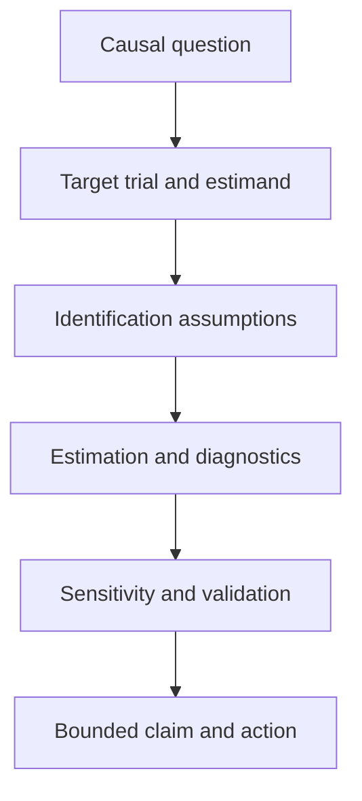
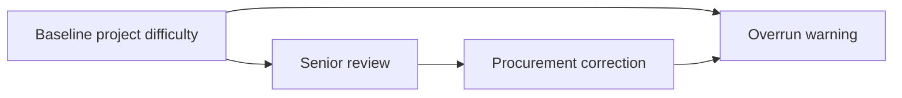
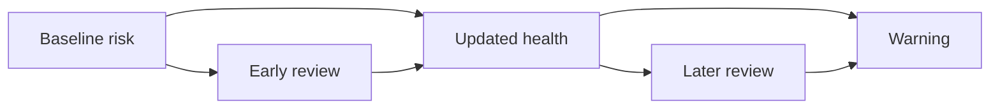
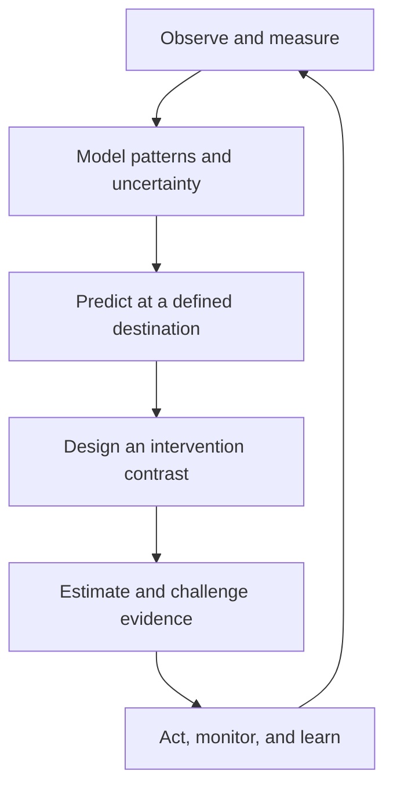

# Chapter 6 — From Prediction to Intervention

## Level 6 Research Practitioner: ten days of causal inference, reproducible evidence, and responsible deployment

> **Central promise.** Earlier chapters taught you to describe data, predict outcomes, quantify uncertainty, and model event histories. This final chapter asks the harder question: **what would change if we intervened?** By the end, you will be able to define causal effects with counterfactuals, defend an identification strategy, estimate effects with experiments or observational data, diagnose failure of overlap and balance, study longitudinal and quasi-experimental designs, investigate heterogeneity without data dredging, compare models honestly, package a reproducible study, and complete a registered capstone whose claim does not outrun its design.

This is the final chapter of the book. It does not make you an all-knowing researcher; no chapter could. It gives you something more useful: a disciplined route from a vague policy question to a claim whose assumptions, evidence, uncertainty, and limits can be inspected by another person.

The supplied draft correctly identified several summit skills: paired model comparison, ablation, model cards, experiment tracking, production consistency, drift monitoring, and capstone work. Those topics remain in [Day 47](#day-47--comparison-reproducibility-and-responsible-production) and [Day 48](#day-48--the-registered-final-study). But Chapter 5 ended with a more urgent unresolved question:

> Does senior review prevent major project overruns?

A predictive model cannot answer it. Projects sent for review may be precisely the projects that were already in trouble. If reviewed projects fail more often, review may be ineffective—or it may have helped a very high-risk group. This chapter therefore places causal design before research operations. Reproducibility preserves an analysis; it cannot rescue the wrong estimand or an unidentified effect.

---

## Prerequisite checkpoint

Before beginning, you should be able to explain, without relying on software output:

- a population, sample, random variable, expectation, variance, and conditional probability;
- a confidence interval and why it is not a probability that a fixed parameter lies in one realised interval;
- correlation versus causation;
- train, validation, test, temporal split, leakage, calibration, and decision threshold;
- linear and logistic regression, regularisation, interactions, splines, and a fitted propensity-like probability;
- bootstrap resampling and why the resampling unit matters;
- survival, hazard, censoring, competing risks, and a target prediction horizon;
- the difference between association, prediction, decision utility, and intervention effect; and
- why a registered analysis protects against changing the question after seeing the answer.

If several items feel uncertain, revisit the earlier exit checks. Research-level work is mostly the careful composition of fundamentals.

## Learning outcomes

At the end of Chapter 6, you should be able to:

- translate a policy question into a treatment, outcome, population, time zero, follow-up, contrast, and causal estimand;
- define potential outcomes and explain the fundamental problem of causal inference;
- distinguish ATE, ATT, conditional effects, risk difference, risk ratio, odds ratio, and policy value;
- state consistency, exchangeability, positivity, and non-interference assumptions in plain language and notation;
- draw and criticise a directed acyclic graph containing confounders, mediators, colliders, selection variables, instruments, and proxies;
- explain why adjusting for every available variable can increase bias;
- analyse randomised experiments using intention-to-treat reasoning, including blocked and cluster designs;
- distinguish assignment, receipt, adherence, per-protocol effects, and local effects under noncompliance;
- identify effects by regression standardisation, matching, stratification, inverse weighting, and augmented inverse weighting;
- inspect covariate balance, overlap, influential weights, and effective sample size;
- use cross-fitting to separate nuisance-model training from effect-score evaluation;
- explain what “doubly robust” does and does not guarantee;
- emulate the protocol of a target trial and recognise immortal-time and time-zero bias;
- describe the parametric g-formula and marginal structural models for time-varying treatment;
- distinguish the identifying assumptions and target populations of difference-in-differences, regression discontinuity, and instrumental variables;
- investigate treatment-effect heterogeneity with pre-specified modifiers, causal trees, forests, and policy evaluation;
- perform sensitivity analyses that expose the dependence of a conclusion on unmeasured confounding and modelling choices;
- compare predictive procedures with paired evidence while respecting dependence induced by resampling;
- produce a data sheet, model card, environment record, analysis manifest, and deviation log;
- plan monitoring for drift, delayed outcomes, feedback loops, safety, rollback, and retirement; and
- execute and report a registered causal study whose conclusion is bounded by its design.

## The ten-day route

| Day | Central idea | Question resolved |
|---|---|---|
| [39](#day-39--counterfactuals-estimands-and-identification) | Counterfactuals and estimands | What effect are we trying to learn? |
| [40](#day-40--causal-diagrams-and-adjustment) | Causal structure | Which variables should—and should not—be adjusted for? |
| [41](#day-41--randomised-experiments-and-noncompliance) | Designed assignment | What does randomisation identify? |
| [42](#day-42--standardisation-matching-and-weighting) | Observational adjustment | How can measured confounding be addressed? |
| [43](#day-43--doubly-robust-estimation-and-sensitivity) | Orthogonal estimation | How do flexible nuisance models and uncertainty fit together? |
| [44](#day-44--target-trials-and-time-varying-treatment) | Longitudinal causality | How do we align eligibility, assignment, follow-up, and analysis? |
| [45](#day-45--quasi-experimental-designs) | Natural assignment mechanisms | What can be learned when treatment is not randomised? |
| [46](#day-46--heterogeneous-effects-and-policy-learning) | Effect variation | For whom might an intervention help, and how should that be tested? |
| [47](#day-47--comparison-reproducibility-and-responsible-production) | Research operations | Can others reproduce, challenge, and safely use the result? |
| [48](#day-48--the-registered-final-study) | Integrated capstone | Can the entire design-to-claim chain survive a locked analysis? |



The ordering matters. Selecting an estimator before defining the causal question is like choosing a measuring instrument before deciding what quantity exists.

---

## Running case: should a project receive senior review at month 6?

We continue the fictional microhydro power programme. At month 6 after approval, programme managers can assign a project to a structured senior review. The review may revise procurement, add engineering support, or change milestones. The outcome is a formally documented major-overrun warning between month 6 and month 36.

Our first causal question is:

> Among projects active and warning-free at month 6, what would be the difference in 36-month warning risk if every eligible project received senior review at month 6 versus if none did?

That sentence fixes important design elements:

| Element | Definition in the running study |
|---|---|
| Unit | An eligible project |
| Eligibility | Active, observable, and warning-free through month 6 |
| Time zero | Month 6 after approval |
| Treatment | Assignment to the defined senior-review package at time zero |
| Comparator | No senior-review package at time zero |
| Outcome | Major-overrun warning from just after month 6 through month 36 |
| Follow-up | 30 months |
| Causal contrast | Assign everyone versus assign no one |
| Primary scale | Risk difference |
| Target population | Projects meeting the month-6 eligibility rule |

### A causal laboratory

The next generator is fictional. It gives review more often to projects with difficult terrain, long cable routes, and inexperienced contractors. Those same factors increase warning risk, so the raw reviewed-versus-unreviewed comparison is confounded. The generator internally creates two potential outcomes but hides them unless explicitly asked to reveal the simulation truth.

Save this block as `chapter6_data.py` if you want to reuse it outside the notebook.

```python
import numpy as np
import pandas as pd
from scipy.special import expit, logit


def make_mhp_causal_data(n=4000, seed=6060, reveal_counterfactuals=False):
    """Create a fictional month-6 senior-review target-trial cohort.

    The relationships are educational, not evidence about real projects,
    places, contractors, or review programmes.
    """
    rng = np.random.default_rng(seed)

    district = rng.choice(
        ["North", "Central", "South", "Frontier", "Valley"],
        size=n,
        p=[0.18, 0.25, 0.20, 0.15, 0.22],
    )
    district_risk = pd.Series(district).map(
        {"North": 0.15, "Central": -0.10, "South": 0.05,
         "Frontier": 0.28, "Valley": -0.08}
    ).to_numpy()

    terrain = np.clip(rng.normal(0.0, 1.0, n) + district_risk, -2.5, 2.8)
    cable_km = np.clip(rng.gamma(2.4, 1.7, n) + 0.8 * terrain, 0.2, None)
    experience = rng.poisson(np.clip(7.5 - 1.0 * terrain, 1.5, None)) + 1
    budget = np.exp(rng.normal(4.0 + 0.12 * terrain, 0.45, n))
    remote_probability = expit(-0.7 + 0.8 * terrain)
    remote_access = rng.binomial(1, remote_probability, n)
    approval_year = rng.integers(2016, 2026, n)

    z_budget = (np.log(budget) - np.log(budget).mean()) / np.log(budget).std()
    z_cable = (cable_km - cable_km.mean()) / cable_km.std()
    z_experience = (np.log1p(experience) - np.log1p(experience).mean()) / np.log1p(experience).std()

    # Review assignment: difficult projects are preferentially reviewed.
    propensity = expit(
        -0.35 + 0.78 * terrain + 0.42 * z_cable
        + 0.30 * z_budget - 0.45 * z_experience
        + 0.35 * remote_access + 0.08 * district_risk
    )
    senior_review = rng.binomial(1, propensity, n)

    # Untreated warning probability. Review lowers log odds, with a somewhat
    # larger benefit in difficult terrain. This heterogeneity is hidden during
    # ordinary analysis and revealed only for simulation validation.
    untreated_logit = (
        -1.45 + 0.58 * terrain + 0.40 * z_cable
        + 0.28 * z_budget - 0.38 * z_experience
        + 0.34 * remote_access + district_risk
    )
    p_y0 = expit(untreated_logit)
    treatment_log_odds_effect = -0.62 - 0.16 * (terrain > 0.75)
    p_y1 = expit(untreated_logit + treatment_log_odds_effect)

    # A common latent draw makes Y(1) <= Y(0) in this teaching simulation.
    # Monotonic benefit is NOT required by the adjustment estimators below.
    latent_u = rng.uniform(size=n)
    y0 = (latent_u < p_y0).astype(int)
    y1 = (latent_u < p_y1).astype(int)
    observed_y = np.where(senior_review == 1, y1, y0)

    data = pd.DataFrame({
        "district": district,
        "approval_year": approval_year,
        "terrain_index": terrain,
        "estimated_cable_km": cable_km,
        "contractor_experience_projects": experience,
        "appraisal_budget_million_pkr": budget,
        "remote_access": remote_access,
        "senior_review_month6": senior_review,
        "warning_by_month36": observed_y,
    })

    if reveal_counterfactuals:
        data["y0"] = y0
        data["y1"] = y1
        data["true_propensity"] = propensity
        data["true_p_y0"] = p_y0
        data["true_p_y1"] = p_y1
    return data


df = make_mhp_causal_data()
print(df.shape)
print(df[["senior_review_month6", "warning_by_month36"]].mean())
```

In real data, the `y0`, `y1`, and true probabilities do not exist as observable columns. Revealing them later is a simulation check, not a workflow that empirical researchers can copy.

---

# Day 39 — Counterfactuals, Estimands, and Identification

## 39.1 Prediction and causation answer different questions

Let $A$ be senior review, $Y$ the later warning, and $X$ information available before review.

A predictive question is:

$$
P(Y=1\mid A,X).
$$

It asks what outcomes tend to occur among projects with particular observed attributes and actions. A causal question is:

$$
P\{Y(a)=1\},
$$

where $Y(a)$ is the outcome the project would have under an intervention setting review to $a$. The conditioning bar and intervention are not interchangeable. If managers send risky projects to review, then $P(Y=1\mid A=1)$ can exceed $P(Y=1\mid A=0)$ even when review prevents warnings.

Prediction can be excellent without identifying an intervention effect. Causal estimation can be unbiased while predicting individual outcomes poorly. Neither task is superior; they serve different decisions.

## 39.2 Potential outcomes

For each project $i$, define:

- $Y_i(1)$: the warning outcome if project $i$ were assigned senior review;
- $Y_i(0)$: the warning outcome if project $i$ were not assigned senior review.

The individual causal effect on the risk-difference scale is

$$
Y_i(1)-Y_i(0).
$$

Only one potential outcome is observed:

$$
Y_i=A_iY_i(1)+(1-A_i)Y_i(0).
$$

The other is counterfactual. This is the fundamental problem: the same unit cannot be observed at the same time under both assignments. Causal inference therefore targets averages and uses design or assumptions to make groups comparable.

## 39.3 Choose an estimand before an estimator

For binary outcomes, common estimands include:

| Estimand | Definition | Question |
|---|---:|---|
| Average treatment effect | $E\{Y(1)-Y(0)\}$ | What if everyone versus no one were reviewed? |
| Average effect among treated | $E\{Y(1)-Y(0)\mid A=1\}$ | What was the average effect for reviewed projects? |
| Average effect among untreated | $E\{Y(1)-Y(0)\mid A=0\}$ | What might review do for currently unreviewed projects? |
| Conditional average effect | $E\{Y(1)-Y(0)\mid X=x\}$ | How does the average effect vary with baseline profile? |
| Policy value | $E[Y\{d(X)\}]$ | What outcome would follow a rule $d(X)$ assigning review? |

An ATE, ATT, and policy value can differ because they average over different people and assignments. “The treatment effect” is incomplete.

The effect scale also matters. Let $p_1=E\{Y(1)\}$ and $p_0=E\{Y(0)\}$.

$$
\text{Risk difference}=p_1-p_0,
\qquad
\text{risk ratio}=\frac{p_1}{p_0},
$$

$$
\text{odds ratio}=\frac{p_1/(1-p_1)}{p_0/(1-p_0)}.
$$

Risk differences are often easiest for capacity planning: a difference of $-0.06$ means about six fewer warnings per 100 projects under the stated intervention and population. Ratios transport differently and may be scientifically useful. Odds ratios are non-collapsible: a conditional odds ratio can differ from a marginal odds ratio even without confounding. Report the scale you registered; do not switch because another looks more dramatic.

For time-to-event outcomes, replace the binary risk by $P\{T(a)\le t\}$, survival $P\{T(a)>t\}$, or restricted mean event-free time. Always name the horizon and competing-event strategy.

## 39.4 Four core identification assumptions

An estimand is a property of an imagined intervention. Identification connects it to the observed-data distribution.

### Consistency

If a project actually receives treatment $A=a$, its observed outcome equals $Y(a)$:

$$
A_i=a \implies Y_i=Y_i(a).
$$

This demands a well-defined treatment. “Senior review” cannot silently range from a five-minute signature to a six-week engineering intervention. Versions can be allowed, but the estimand must say how they are assigned or averaged.

### Conditional exchangeability

After conditioning on adequate pre-treatment covariates $X$,

$$
\{Y(1),Y(0)\}\perp A\mid X.
$$

Informally, within covariate strata, treatment behaves as if assigned independently of the potential outcomes. In an ideal randomised trial it follows from assignment by design. In observational data it is an untestable no-unmeasured-confounding assumption supported—or undermined—by domain knowledge, measurement, timing, and design.

### Positivity

For covariate profiles in the target population,

$$
0<P(A=1\mid X=x)<1.
$$

If every frontier project is reviewed, the data contain no untreated frontier comparison. A flexible algorithm cannot invent it. Near violations create extreme weights and make results depend on extrapolation. Remedies change the question: restrict the target population, alter the estimand, collect data, or compare realistic treatment rules.

### No interference

One project's treatment should not alter another project's outcome under the simple potential-outcome notation. Shared engineers violate this if reviewing one project diverts capacity from another. Network, cluster, and spillover estimands can replace the assumption; ignoring interference cannot.

These assumptions are sometimes grouped with treatment-variation requirements as SUTVA, but naming them separately makes criticism easier.

## 39.5 Identification by the g-formula

Under consistency, conditional exchangeability, and positivity,

$$
E\{Y(a)\}=E_X[E(Y\mid A=a,X)].
$$

Derivation:

$$
\begin{aligned}
E\{Y(a)\}
&=E_X[E\{Y(a)\mid X\}]\\
&=E_X[E\{Y(a)\mid A=a,X\}] && \text{exchangeability}\\
&=E_X[E(Y\mid A=a,X)] && \text{consistency}.
\end{aligned}
$$

Positivity ensures the final conditional mean can be learned where it is needed. This derivation—not a preference for a regression package—is the justification for standardisation.

## 39.6 Identification, estimation, and inference are different

Keep three questions separate:

1. **Identification:** If the observed-data distribution were known exactly, would it determine the causal estimand under stated assumptions?
2. **Estimation:** With a finite sample, how will the required probabilities or expectations be approximated?
3. **Inference:** How will sampling and procedure uncertainty be quantified?

More data can reduce estimation error. It cannot fix a collider-conditioned design, undefined intervention, or unmeasured confounder. A confidence interval quantifies uncertainty under the model and identification assumptions; it does not place those assumptions on trial.

## 39.7 The naive answer in the running case

```python
naive = (
    df.loc[df["senior_review_month6"] == 1, "warning_by_month36"].mean()
    - df.loc[df["senior_review_month6"] == 0, "warning_by_month36"].mean()
)
print(f"Naive reviewed-minus-unreviewed risk difference: {naive:.3f}")
```

This is a valid description of observed groups. It is not automatically an ATE. Before adjusting, explain the assignment mechanism and draw the causal structure.

## 39.8 Research-paper study: Holland and Rubin

Read Peter Holland's 1986 essay, *Statistics and Causal Inference*, alongside Donald Rubin's 1974 paper on causal effects in randomised and nonrandomised studies. Do not read only for formulas. Ask:

- What object is defined before data are observed?
- Why is causation attached to effects of causes rather than causes of effects?
- Which role does assignment play?
- Which problems are scientific, and which are statistical?

The durable lesson is that causal language requires a comparison of interventions, not merely a coefficient attached to a variable.

## 39.9 Build, break, and reflect

**Build.** Write a one-page estimand table for a familiar intervention. Include eligibility, treatment versions, comparator, time zero, follow-up, outcome, competing events, population, contrast, and scale.

**Break.** Change the comparator from “no review” to “usual review practice.” Which potential outcomes change? Change the target from all eligible projects to reviewed projects. Is the estimand still the ATE?

**Reflect.** Name one version-of-treatment problem, one possible spillover, and one population with no treatment overlap.

### Day 39 exit check

You are ready for Day 40 when you can:

- express the primary question using $Y(1)$ and $Y(0)$;
- distinguish an observed association from a causal contrast;
- state all four assumptions in words and notation;
- explain why positivity depends on the target population; and
- separate identification failure from estimator error.

---

# Day 40 — Causal Diagrams and Adjustment

## 40.1 A DAG is a compact causal argument

A directed acyclic graph, or DAG, contains nodes and one-way arrows with no directed cycles. An arrow $X\rightarrow Y$ asserts that $X$ may causally influence $Y$ under the system being represented. Missing arrows are also claims.

For the running study, a first graph might be:



The path $A\leftarrow X\rightarrow Y$ is a backdoor path. It produces association between $A$ and $Y$ that is not caused by the review. Conditioning on a sufficient set of pre-treatment common causes blocks such paths.

A DAG does not discover causality from the dataset. It records the team's scientific assumptions so that missing variables, questionable timing, and competing explanations can be challenged before modelling.

## 40.2 Five roles a variable can play

| Role | Basic pattern | Typical action for a total effect |
|---|---|---|
| Confounder | $A\leftarrow C\rightarrow Y$ | Adjust if measured adequately |
| Mediator | $A\rightarrow M\rightarrow Y$ | Do not adjust when targeting total effect |
| Collider | $A\rightarrow K\leftarrow Y$ | Do not condition without a design-specific reason |
| Instrument | $Z\rightarrow A\rightarrow Y$, no other $Z\rightarrow Y$ path | Useful for an IV design; usually not a confounder |
| Proxy | $C\rightarrow P$, with $C$ partly unmeasured | May reduce but need not eliminate confounding |

Variable roles belong to a causal question and time order. The same measurement can be a confounder for one treatment and a mediator for another.

## 40.3 Confounders are not selected by p-values

A pre-treatment cause of both assignment and outcome can confound even if its sample association is not “significant.” Conversely, a strongly predictive variable may not be a confounder. Adjustment-set selection should use causal knowledge, then diagnostics—not stepwise outcome regression.

It can be useful to include strong pre-treatment outcome predictors for precision even when they are not confounders. But that statistical choice follows identification and must respect sample size and model stability.

## 40.4 Mediators change the estimand

Suppose review changes procurement, which changes warning risk:

$$
A\rightarrow M\rightarrow Y.
$$

Adjusting for post-review procurement blocks part of the total effect. The coefficient for $A$ in a model containing $M$ is not automatically a direct effect: mediator-outcome confounding, treatment-induced confounding, and scale issues complicate mediation. Begin with a total effect unless the scientific question genuinely concerns pathways, then define natural, controlled, or interventional direct and indirect effects precisely.

## 40.5 Colliders create association

Suppose both senior review and latent political pressure increase the probability that a project appears in a special audit dataset:

$$
A\rightarrow S\leftarrow U\rightarrow Y.
$$

In the full population, $A$ and $U$ need not be associated. Restricting to $S=1$ makes them associated because either can explain selection. This opens the path from review to outcome through $U$. Common collider traps include:

- analysing only admitted patients when exposure and illness affect admission;
- analysing only loan approvals when credit score and unmeasured judgement affect approval;
- controlling for a post-treatment variable caused by treatment and prognosis;
- complete-case analysis when missingness is affected by exposure and outcome causes; and
- selecting only projects that reached a milestone influenced by review.

“Control for everything” is therefore unsafe.

## 40.6 Descendants, instruments, and bias amplification

Conditioning on a collider's descendant can also open a path. Conditioning on a strong instrument—something that shifts treatment but has no direct outcome path—can worsen finite-sample overlap and amplify bias from an unmeasured confounder in some settings. Neither result means instruments are bad. It means an adjustment model and an instrumental-variable design use variables for different purposes.

## 40.7 Backdoor adjustment

An adjustment set $X$ identifies the total effect through the backdoor criterion when it:

1. contains no descendant of treatment; and
2. blocks every path from $A$ to $Y$ that enters $A$ through an arrow pointing into $A$.

There can be several valid sets. More variables are not necessarily better. Prefer variables measured before assignment, justify their causal roles, and consider whether measurement error leaves residual confounding.

For the simulated review study, a defensible baseline set includes district, approval year, terrain, cable length, contractor experience, appraisal budget, and remoteness. We do not adjust for procurement corrections measured after review.

## 40.8 Selection diagrams and transport

Even if an effect is identified inside the study, applying it elsewhere is a separate problem. Let $S$ indicate participation or site. If terrain changes treatment effect and the terrain distribution differs between study and target populations, transport requires measuring and standardising over terrain. Ask:

- How did units enter the study?
- Which causes of treatment effect differ at the destination?
- Are treatment versions and outcome measurement comparable?
- Is there overlap between study and target populations?

External validity is not granted by a large sample.

## 40.9 DAG workflow

Use this order:

1. State one treatment, outcome, population, and time zero.
2. Add causes of treatment and causes of outcome, including unmeasured variables.
3. Add variables created after treatment only when scientifically relevant.
4. Mark selection and measurement mechanisms.
5. Identify open backdoor paths and candidate adjustment sets.
6. Compare the graph with actual timestamps and data provenance.
7. Record contested arrows and run analyses under plausible alternatives.

Do not erase an unmeasured node because the dataset lacks its column. That absence is a limitation, not a graph-editing instruction.

## 40.10 Research-paper study: diagrams as epidemiologic reasoning

Read Greenland, Pearl, and Robins' 1999 article on causal diagrams. Reconstruct one example with three variables, then explain why conditioning blocks a chain or fork but opens a collider. The important research skill is not drawing attractive graphs; it is tracing which statistical associations an analysis creates or removes under a scientific model.

## 40.11 Build, break, and reflect

**Build.** Draw a DAG for review, warning, terrain, budget, contractor experience, procurement correction, and inclusion in an audit sample. Label each variable's timing.

**Break.** Add a post-review “project health score” affected by review and latent engineering quality. What happens if eligibility requires a high score?

**Reflect.** List the smallest plausible sufficient adjustment set. Then list one unmeasured common cause and how its omission might move the effect estimate.

### Day 40 exit check

You are ready for Day 41 when you can:

- distinguish a confounder, mediator, collider, instrument, and proxy by causal role;
- explain collider bias without using the phrase “because the software says so”;
- defend an adjustment set using paths and timing; and
- state why a DAG cannot prove its own missing arrows.

# Day 41 — Randomised Experiments and Noncompliance

## 41.1 Randomisation is an assignment mechanism

In a randomised experiment, investigators control a known probability of assignment. For a simple two-arm trial,

$$
A_i\sim \operatorname{Bernoulli}(p),
$$

independently of potential outcomes. This creates exchangeability **in expectation**. A realised finite sample can still have imbalances, so report important baseline summaries and improve precision with pre-specified adjustment. Do not use significance tests of baseline differences to decide whether randomisation “worked”; the randomisation mechanism is known by design.

Randomisation does not automatically solve:

- an ambiguous treatment or outcome;
- nonadherence after assignment;
- differential loss to follow-up;
- interference between units;
- measurement altered by treatment;
- a mismatch between study and policy populations; or
- selective reporting after many outcomes and subgroups are examined.

It addresses confounding of **assignment**. The rest of the protocol still matters.

## 41.2 Intention-to-treat effect

Let $Z$ be assignment to offer senior review, whether or not the review is completed. The intention-to-treat, or ITT, estimand is

$$
E\{Y(Z=1)-Y(Z=0)\}.
$$

The difference in observed group means is unbiased under simple randomisation:

$$
\widehat{\tau}_{\text{ITT}}=\bar Y_{Z=1}-\bar Y_{Z=0}.
$$

A familiar large-sample standard error is

$$
\widehat{SE}(\widehat\tau)=
\sqrt{\frac{s_1^2}{n_1}+\frac{s_0^2}{n_0}}.
$$

Randomisation-based inference treats the potential outcomes as fixed and assignment as random. Model-based regression can improve precision, but the analysis should respect the design. With binary outcomes, report arm risks and an absolute contrast, not only an odds ratio.

## 41.3 Blocking, stratification, and covariate adjustment

If terrain and district strongly predict outcomes, randomise within pre-specified blocks. The estimator combines within-block contrasts using target-population weights. Blocking prevents severe imbalance on chosen factors and often improves precision.

Pre-specified regression adjustment can further improve precision. Include the block variables used in randomisation. When treatment effects may vary, interactions between assignment and centred baseline covariates protect the marginal contrast from restrictive constant-effect modelling. Standardise fitted potential outcomes over the trial population rather than interpreting a nonlinear-model treatment coefficient as the marginal effect.

## 41.4 Cluster randomisation

If a review team changes how an entire district operates, randomise teams or districts rather than projects. Outcomes within clusters are correlated. The effective information is closer to the number of independent clusters than the number of projects.

For roughly equal cluster size $m$ and intracluster correlation $\rho$, a planning approximation is the design effect

$$
1+(m-1)\rho.
$$

Analyse at the level supported by the assignment: cluster-level summaries, randomisation inference over clusters, or cluster-robust methods with enough clusters. Five districts do not become a large trial because each contains hundreds of rows.

## 41.5 Interference and spillovers

If reviewed projects consume scarce engineers, one project's assignment can affect another's outcome. Define assignment at cluster level, or define exposure mappings such as own review plus the fraction of neighbouring projects reviewed. Relevant estimands might include:

- a direct effect holding cluster coverage fixed;
- a spillover effect among unreviewed projects;
- a total effect of changing district-level coverage; or
- an allocation-policy effect under a fixed capacity.

The ordinary two-potential-outcome notation is too small for this problem.

## 41.6 Noncompliance: assignment is not receipt

Let $Z$ be random assignment and $A$ actual receipt. Four latent compliance types are defined by $A(1)$ and $A(0)$:

| Type | $A(1)$ | $A(0)$ |
|---|---:|---:|
| Always-taker | 1 | 1 |
| Complier | 1 | 0 |
| Never-taker | 0 | 0 |
| Defier | 0 | 1 |

Comparing recipients with nonrecipients discards randomisation because receipt may depend on prognosis. ITT preserves the assignment comparison and answers the effect of offering or assigning the programme.

Under four strong instrumental-variable assumptions—random assignment, relevance, exclusion, and monotonicity—the Wald ratio identifies a local average treatment effect among compliers:

$$
\widehat\tau_{\text{LATE}}=
\frac{E(Y\mid Z=1)-E(Y\mid Z=0)}
{E(A\mid Z=1)-E(A\mid Z=0)}.
$$

Exclusion says assignment affects the outcome only through receipt; monotonicity rules out defiers. LATE is not automatically the ATE. If assignment itself changes behaviour before receipt, exclusion can fail.

## 41.7 Per-protocol effects require more assumptions

A per-protocol question asks about sustained adherence to a defined strategy. Randomisation alone no longer identifies this effect when post-assignment prognostic factors influence adherence. Longitudinal standardisation or inverse-probability methods may be needed, with sequential exchangeability and positivity assumptions. “As treated” is an analysis label, not an identification strategy.

## 41.8 Attrition and missing outcomes

Compare follow-up by arm, document reasons, and distinguish administrative closure from outcome-related loss. Complete-case analysis can break exchangeability. Depending on the estimand and missingness structure, use:

- active outcome ascertainment;
- inverse-probability-of-observation weights;
- multiple imputation compatible with treatment and outcome models;
- bounds under extreme missing outcomes; and
- tipping-point analyses.

A precise estimate among the easily observed is not necessarily the trial effect.

## 41.9 A minimal randomised laboratory

The following experiment uses the hidden untreated and treated risks only to generate a fresh randomised outcome. It does not reveal both potential outcomes to the estimator.

```python
trial_source = make_mhp_causal_data(n=1400, seed=6141, reveal_counterfactuals=True)
rng_trial = np.random.default_rng(41)
trial_source["assignment"] = rng_trial.binomial(1, 0.5, len(trial_source))
trial_source["trial_outcome"] = np.where(
    trial_source["assignment"] == 1,
    trial_source["y1"],
    trial_source["y0"],
)

arm = trial_source.groupby("assignment")["trial_outcome"].agg(["mean", "var", "count"])
trial_rd = arm.loc[1, "mean"] - arm.loc[0, "mean"]
trial_se = np.sqrt(arm.loc[1, "var"] / arm.loc[1, "count"] + arm.loc[0, "var"] / arm.loc[0, "count"])
print(f"Randomised risk difference: {trial_rd:.3f}")
print(f"Approximate 95% CI: [{trial_rd - 1.96*trial_se:.3f}, {trial_rd + 1.96*trial_se:.3f}]")
```

## 41.10 Build, break, and reflect

**Build.** Design a blocked trial of senior review. Specify assignment probability, blocks, unit, primary estimand, sample-size inputs, follow-up, missing-data strategy, analysis, and stopping rule.

**Break.** Allow reviewed projects to share one engineering team. Then allow 30% of assigned projects to decline. Which estimands remain identified by the simple difference in assignment means?

**Reflect.** Explain in two sentences why ITT can be small when treatment receipt has a large effect. Then explain why dividing by compliance changes the target population.

### Day 41 exit check

You are ready for Day 42 when you can:

- distinguish assignment, receipt, adherence, ITT, per-protocol effect, and LATE;
- choose project- versus cluster-level randomisation from the interference mechanism;
- explain why recipient comparisons abandon randomisation; and
- name assumptions needed beyond randomisation when outcomes are missing.

---

# Day 42 — Standardisation, Matching, and Weighting

When randomisation is unavailable, measured baseline covariates can support an adjusted comparison. The methods in this day are not alternative ways to make assumptions disappear. They are different computational expressions of identification under consistency, exchangeability, and positivity.

## 42.1 Three views of the same target

For the ATE, identification can be written as:

### Outcome standardisation

$$
\psi=E_X\{m_1(X)-m_0(X)\},
\qquad m_a(X)=E(Y\mid A=a,X).
$$

### Inverse-probability weighting

With $e(X)=P(A=1\mid X)$,

$$
\psi=E\left\{\frac{AY}{e(X)}-\frac{(1-A)Y}{1-e(X)}\right\}.
$$

### Covariate balancing or matching

Construct treated and untreated comparisons with similar distributions of the confounders, then average an outcome contrast over the intended target population.

Standardisation models outcomes. Weighting models assignment. Matching designs a comparable subset or weighted comparison. Their agreement can be reassuring, but agreement does not test unmeasured exchangeability.

## 42.2 Regression standardisation, step by step

1. Fit $m(A,X)=E(Y\mid A,X)$.
2. Copy every row and set $A=1$; predict $\hat m(1,X_i)$.
3. Copy again and set $A=0$; predict $\hat m(0,X_i)$.
4. Average predictions in each intervention world.
5. Subtract the averages.

This produces a marginal risk difference even when the working model is logistic. The treatment coefficient alone is a conditional log odds ratio, not the ATE.

## 42.3 Propensity scores

Rosenbaum and Rubin defined the propensity score as

$$
e(X)=P(A=1\mid X).
$$

Under conditional exchangeability, treatment is exchangeable within levels of the true propensity score. Its purpose is **design and balance**, not maximum treatment-prediction accuracy. A propensity model that separates treatment perfectly creates unusable comparisons.

Common uses include:

- matching treated and untreated units on the score or a distance metric;
- stratifying by score quantiles;
- inverse-probability weighting;
- overlap weighting; and
- covariate-balancing estimation.

Never select the propensity model by treatment AUC alone. Inspect balance and overlap for the variables required by the causal design.

## 42.4 Matching changes the analysed population

Nearest-neighbour matching pairs similar units, often within a caliper on the logit propensity score. Matching with replacement can improve similarity but reuse controls. Without replacement, results can depend on match order. Discarding unmatched units commonly moves the estimand away from the original ATE.

A matching report should state:

- target estimand and eligible population;
- distance, caliper, ratio, replacement, and exact-match constraints;
- counts discarded and why;
- pre- and post-match balance;
- overlap and unmatched profiles;
- outcome analysis that respects pairs or weights; and
- sensitivity to reasonable design choices.

Do not inspect outcomes while repeatedly tuning a match to obtain the desired effect.

## 42.5 Weighting creates a pseudo-population

ATE weights are

$$
w_i=\frac{A_i}{e(X_i)}+\frac{1-A_i}{1-e(X_i)}.
$$

ATT weights keep treated units at weight 1 and weight controls by $e(X)/(1-e(X))$. Stabilised weights multiply numerators by marginal treatment probabilities to reduce variance without changing the large-sample target under correct specification.

Extreme weights signal weak overlap, model misspecification, or both. Truncation may reduce variance but introduces bias and changes the procedure. Register thresholds or show a sensitivity curve rather than selecting a cutoff after seeing the effect.

Overlap weights, proportional to $1-e(X)$ for treated and $e(X)$ for controls, emphasise profiles with assignment equipoise. They can be stable, but estimate an overlap-population effect rather than the full ATE.

## 42.6 Balance, not propensity-model fit

For a continuous covariate $X_j$, a standardised mean difference is

$$
\operatorname{SMD}_j=
\frac{\bar X_{1j}-\bar X_{0j}}
{\sqrt{(s_{1j}^2+s_{0j}^2)/2}}.
$$

Compute weighted analogues after weighting. Inspect categorical levels, nonlinear terms, and important interactions too. A conventional absolute threshold such as 0.1 is a diagnostic convention, not proof of no confounding.

The effective sample size of nonnegative weights is

$$
ESS=\frac{(\sum_i w_i)^2}{\sum_i w_i^2}.
$$

Two thousand rows with a few dominating weights may contain far less information than two thousand balanced observations.

## 42.7 Executable adjustment analysis

```python
from sklearn.compose import ColumnTransformer
from sklearn.linear_model import LogisticRegression
from sklearn.pipeline import Pipeline
from sklearn.preprocessing import OneHotEncoder, StandardScaler

treatment = "senior_review_month6"
outcome = "warning_by_month36"
numeric = [
    "approval_year",
    "terrain_index",
    "estimated_cable_km",
    "contractor_experience_projects",
    "appraisal_budget_million_pkr",
    "remote_access",
]
categorical = ["district"]
covariates = numeric + categorical


def make_logistic_pipeline(numeric_columns, categorical_columns):
    transform = ColumnTransformer([
        ("num", StandardScaler(), numeric_columns),
        ("cat", OneHotEncoder(handle_unknown="ignore"), categorical_columns),
    ])
    return Pipeline([
        ("transform", transform),
        ("model", LogisticRegression(max_iter=2000, C=1.0)),
    ])


# Outcome regression and standardisation.
g_model = make_logistic_pipeline(numeric + [treatment], categorical)
g_model.fit(df[covariates + [treatment]], df[outcome])
x1 = df[covariates + [treatment]].copy()
x0 = x1.copy()
x1[treatment] = 1
x0[treatment] = 0
m1 = g_model.predict_proba(x1)[:, 1]
m0 = g_model.predict_proba(x0)[:, 1]
gcomp_ate = np.mean(m1 - m0)

# Propensity model and Horvitz-Thompson IPW estimate.
e_model = make_logistic_pipeline(numeric, categorical)
e_model.fit(df[covariates], df[treatment])
e_hat = np.clip(e_model.predict_proba(df[covariates])[:, 1], 0.02, 0.98)
a = df[treatment].to_numpy()
y = df[outcome].to_numpy()
ipw_ate = np.mean(a * y / e_hat - (1 - a) * y / (1 - e_hat))

print(f"Naive risk difference:           {naive:.3f}")
print(f"Standardised risk difference:    {gcomp_ate:.3f}")
print(f"IPW risk difference:             {ipw_ate:.3f}")
print(f"Estimated propensity range:      [{e_hat.min():.3f}, {e_hat.max():.3f}]")
```

The logistic outcome model imposes linearity on the log-odds scale for continuous covariates. The propensity model likewise imposes structure. Add transformations and interactions based on the causal and measurement model, then evaluate diagnostics. Avoid choosing specification solely by which estimate is preferred.

## 42.8 Balance and weight diagnostics in code

```python
def weighted_mean_variance(x, w):
    w = np.asarray(w, dtype=float)
    x = np.asarray(x, dtype=float)
    mean = np.sum(w * x) / np.sum(w)
    variance = np.sum(w * (x - mean) ** 2) / np.sum(w)
    return mean, variance


def smd_table(frame, treatment_values, weights=None):
    design = pd.get_dummies(frame, drop_first=False, dtype=float)
    weights = np.ones(len(design)) if weights is None else np.asarray(weights)
    rows = []
    for column in design.columns:
        x = design[column].to_numpy()
        m1_, v1_ = weighted_mean_variance(x[treatment_values == 1], weights[treatment_values == 1])
        m0_, v0_ = weighted_mean_variance(x[treatment_values == 0], weights[treatment_values == 0])
        denominator = np.sqrt((v1_ + v0_) / 2)
        smd = 0.0 if denominator < 1e-12 else (m1_ - m0_) / denominator
        rows.append((column, smd))
    return pd.DataFrame(rows, columns=["covariate", "smd"])


ate_weights = a / e_hat + (1 - a) / (1 - e_hat)
raw_balance = smd_table(df[covariates], a)
weighted_balance = smd_table(df[covariates], a, ate_weights)
balance = raw_balance.merge(weighted_balance, on="covariate", suffixes=("_raw", "_weighted"))
ess = ate_weights.sum() ** 2 / np.sum(ate_weights ** 2)

print(balance.assign(abs_weighted=lambda z: z.smd_weighted.abs())
      .sort_values("abs_weighted", ascending=False).head(8).to_string(index=False))
print(f"Weight range: [{ate_weights.min():.2f}, {ate_weights.max():.2f}]")
print(f"Effective sample size: {ess:.0f} of {len(df)}")
```

Also plot propensity distributions by treatment, inspect the profiles receiving the largest weights, and compare the weighted target population with the policy population. A single balance number cannot reveal every failure.

## 42.9 Research-paper study: Rosenbaum and Rubin (1983)

Read the original propensity-score paper with three questions:

1. What balancing result follows when treatment assignment is strongly ignorable given $X$?
2. Which assumptions enter before the propensity score is estimated?
3. Why does dimension reduction not make unmeasured confounding vanish?

Then reproduce a small simulation in which treatment depends on five covariates. Compare raw, matched, stratified, and weighted balance before examining outcomes.

## 42.10 Build, break, and reflect

**Build.** Estimate the review ATE by standardisation, stratification, matching, and weighting. Keep one registered covariate set.

**Break.** Remove terrain from every adjustment method. Force positivity failure by assigning review to every remote project. Add an unnecessary post-treatment mediator. Diagnose how each failure appears—or fails to appear—in balance and estimates.

**Reflect.** If matching discards 35% of reviewed projects, precisely describe the population to which the result applies.

### Day 42 exit check

You are ready for Day 43 when you can:

- derive standardisation and IPW from the same identification assumptions;
- distinguish ATE, ATT, and overlap weights;
- calculate an SMD and effective sample size;
- explain why propensity AUC is not the design objective; and
- treat extreme weights as a scientific warning, not only a numerical inconvenience.

---

# Day 43 — Doubly Robust Estimation and Sensitivity

## 43.1 Augmented inverse-probability weighting

Outcome regression can fail if $m_a(X)$ is misspecified. Weighting can fail if $e(X)$ is misspecified and becomes unstable near 0 or 1. Augmented inverse-probability weighting, or AIPW, combines them:

$$
\widehat\psi_{\text{AIPW}}=\frac{1}{n}\sum_{i=1}^n\left[
\hat m_1(X_i)-\hat m_0(X_i)
+\frac{A_i\{Y_i-\hat m_1(X_i)\}}{\hat e(X_i)}
-\frac{(1-A_i)\{Y_i-\hat m_0(X_i)\}}{1-\hat e(X_i)}
\right].
$$

The first term standardises outcome predictions. The residual terms correct those predictions using observed outcomes, scaled by assignment probability.

## 43.2 What “doubly robust” means

Under the causal assumptions and regularity conditions, AIPW is consistent if either:

- the propensity model is correct; or
- the outcome models are correct.

It does **not** mean:

- two wrong models cancel each other;
- unmeasured confounding is repaired;
- positivity no longer matters;
- treatment and outcome can be measured badly;
- standard errors are automatically valid; or
- trying many nuisance learners is free from researcher degrees of freedom.

The robustness is about two statistical nuisance functions inside an already identified problem.

## 43.3 Influence-function view

Define the estimated score

$$
\hat\phi_i=hat m_1(X_i)-\hat m_0(X_i)
+\frac{A_i\{Y_i-\hat m_1(X_i)\}}{\hat e(X_i)}
-\frac{(1-A_i)\{Y_i-\hat m_0(X_i)\}}{1-\hat e(X_i)}.
$$

Then $\widehat\psi=n^{-1}\sum_i\hat\phi_i$. With suitable nuisance estimation, an approximate standard error is

$$
\widehat{SE}(\widehat\psi)=
\frac{\operatorname{SD}(\hat\phi_i)}{\sqrt n}.
$$

This expression reveals influential observations: residuals receive large multipliers where estimated treatment probabilities are small.

## 43.4 Why cross-fitting helps

Flexible models can overfit the same outcomes later used inside the effect score. In $K$-fold cross-fitting:

1. split observations into $K$ folds;
2. fit nuisance models outside fold $k$;
3. predict propensity and potential-outcome means for fold $k$;
4. repeat until every observation has out-of-fold nuisance predictions;
5. compute the effect score once from those predictions.

Cross-fitting weakens empirical-process restrictions and reduces own-observation overfitting. It does not prevent leakage from preprocessing before the split, tune itself, or repair causal assumptions. All learned transformations belong inside each training fold.

## 43.5 Cross-fitted AIPW in code

```python
from sklearn.model_selection import KFold


def cross_fitted_aipw(data, folds=5, seed=43):
    n = len(data)
    a_ = data[treatment].to_numpy()
    y_ = data[outcome].to_numpy()
    e_ = np.empty(n)
    m1_ = np.empty(n)
    m0_ = np.empty(n)

    splitter = KFold(n_splits=folds, shuffle=True, random_state=seed)
    for train_idx, test_idx in splitter.split(data):
        train = data.iloc[train_idx]
        test = data.iloc[test_idx]

        propensity_model = make_logistic_pipeline(numeric, categorical)
        propensity_model.fit(train[covariates], train[treatment])
        e_[test_idx] = propensity_model.predict_proba(test[covariates])[:, 1]

        treated_model = make_logistic_pipeline(numeric, categorical)
        control_model = make_logistic_pipeline(numeric, categorical)
        treated_train = train[train[treatment] == 1]
        control_train = train[train[treatment] == 0]
        treated_model.fit(treated_train[covariates], treated_train[outcome])
        control_model.fit(control_train[covariates], control_train[outcome])
        m1_[test_idx] = treated_model.predict_proba(test[covariates])[:, 1]
        m0_[test_idx] = control_model.predict_proba(test[covariates])[:, 1]

    e_ = np.clip(e_, 0.02, 0.98)
    score = (
        m1_ - m0_
        + a_ * (y_ - m1_) / e_
        - (1 - a_) * (y_ - m0_) / (1 - e_)
    )
    estimate = score.mean()
    standard_error = score.std(ddof=1) / np.sqrt(n)
    return {
        "estimate": estimate,
        "standard_error": standard_error,
        "ci_low": estimate - 1.96 * standard_error,
        "ci_high": estimate + 1.96 * standard_error,
        "score": score,
        "propensity": e_,
        "m1": m1_,
        "m0": m0_,
    }


aipw = cross_fitted_aipw(df)
print(
    f"Cross-fitted AIPW risk difference: {aipw['estimate']:.3f} "
    f"(95% CI {aipw['ci_low']:.3f} to {aipw['ci_high']:.3f})"
)
```

For clustered data, replace the individual-level variance or bootstrap with a method respecting independent clusters. With few clusters, asymptotic cluster-robust intervals can be unreliable. If nuisance learners are tuned, tuning belongs inside the training portion of each cross-fit split or inside a clearly separated design phase.

## 43.6 Targeted maximum likelihood and double machine learning

Targeted maximum likelihood estimation begins with outcome and treatment-mechanism estimates, then updates the outcome estimate along a fluctuation submodel targeted to the causal parameter. It can respect outcome bounds and yields an influence-curve-based estimator.

Double/debiased machine learning uses orthogonal scores and sample splitting so that small nuisance-model errors have reduced first-order impact on the target parameter. AIPW for an ATE is a canonical example of this logic.

These are frameworks, not magic brands. State the score, nuisance functions, folds, tuning, truncation, variance method, and target parameter.

## 43.7 Bootstrap the whole procedure

A bootstrap for procedure uncertainty should resample the independent unit, refit every nuisance model, redo cross-fitting and tuning according to the registered algorithm, and recompute the estimate. Bootstrapping only the final vector of predictions understates uncertainty from model fitting. Use a cluster or block bootstrap when independence lies at a higher level.

The influence-function interval above is fast and useful for this simulation. Compare it with a full-procedure bootstrap in the exercise. Large disagreement is a diagnostic, not an invitation to report whichever interval excludes zero.

## 43.8 Sensitivity to unmeasured confounding

No observed-data diagnostic proves exchangeability. A serious report asks how strong an omitted common cause would need to be to change the conclusion.

Useful approaches include:

- **bias parameters:** posit associations between an unmeasured confounder, treatment, and outcome; subtract the implied bias over a credible grid;
- **tipping points:** vary the prevalence and outcome risk of a missing factor until the estimate crosses a decision threshold;
- **E-values for ratio measures:** summarise the minimum confounder associations, on a risk-ratio scale under specific conditions, needed to explain an observed association;
- **Rosenbaum bounds:** assess how hidden assignment bias could alter randomisation-based conclusions in matched studies;
- **negative controls:** use an outcome not plausibly caused by treatment or an exposure not plausibly causing the outcome to detect some residual biases;
- **quantitative bias analysis:** propagate distributions over misclassification, selection, and confounding parameters; and
- **partial identification:** report bounds when point identification is indefensible.

An E-value is not a universal certificate. Negative controls can fail silently if they do not share the relevant bias mechanism. Sensitivity parameters should be calibrated against measured covariates and domain evidence, not selected for convenience.

## 43.9 Specification and overlap sensitivity

Run analyses that change one decision at a time:

| Sensitivity | Question |
|---|---|
| Alternative nonlinear terms | Does functional-form choice drive the estimate? |
| Pre-specified covariate sets | Does a disputed confounder materially change it? |
| Weight truncation grid | Is the conclusion carried by extreme weights? |
| Overlap-population effect | What is learned where treatment choice is realistic? |
| Outcome definition | Does a stricter warning definition reverse the result? |
| Missing-data scenarios | How dependent is the result on unobserved outcomes? |
| Negative-control analysis | Is a shared residual bias detectable? |

Do not call a conclusion “robust” because every model using the same flawed identification strategy agrees.

## 43.10 Research papers: Bang–Robins and double machine learning

Bang and Robins (2005) explain doubly robust estimation across missing-data and causal settings. Chernozhukov and colleagues (2018) develop orthogonal scores and cross-fitting for high-dimensional nuisance estimation. For each paper, answer:

- What is the target parameter?
- Which nuisance functions are estimated?
- What product of estimation errors must shrink?
- What sampling structure supports the variance?
- Which causal assumptions are taken as given?

Then implement one deliberate failure: omit a nonlinear confounder from the outcome model but include it in the propensity model; reverse the misspecification; then misspecify both.

## 43.11 Build, break, and reflect

**Build.** Implement AIPW twice: once with logistic nuisance models and once with tree-based nuisance models. Preserve out-of-fold predictions and effect scores.

**Break.** Compute in-sample nuisance predictions, remove weight clipping, and omit terrain from both models. Which diagnostics react? Which causal failure remains invisible?

**Reflect.** Write a results paragraph containing the estimate, interval, estimand, identification assumptions, overlap population, and one quantitative sensitivity statement.

### Day 43 exit check

You are ready for Day 44 when you can:

- derive and code the AIPW score;
- define double robustness without overclaiming;
- explain the purpose and limits of cross-fitting;
- distinguish influence-function and full-procedure uncertainty; and
- design a sensitivity analysis whose parameters have substantive meaning.

# Day 44 — Target Trials and Time-Varying Treatment

## 44.1 Why observational studies need an imaginary protocol

A target trial is the randomised experiment we would conduct if it were ethical, feasible, and timely. Target-trial emulation makes an observational analysis imitate that protocol as closely as the data permit. It prevents a common error: comparing vaguely defined groups whose eligibility, treatment assignment, and follow-up begin at different times.

The protocol should specify:

| Component | Question |
|---|---|
| Eligibility | Who could enter, and when are all criteria assessed? |
| Treatment strategies | What actions, timing, grace periods, and versions are compared? |
| Assignment | What randomisation would be emulated; what covariates support exchangeability? |
| Time zero | When do eligibility, strategy assignment, and outcome follow-up align? |
| Outcome | What event, measurement, horizon, and competing-event rule apply? |
| Causal contrast | ITT-like assignment effect or per-protocol strategy effect? |
| Analysis | How are confounding, adherence, censoring, clustering, and uncertainty handled? |

The month-6 review study aligns these pieces: eligibility is assessed at month 6, review is assigned at month 6, and warning follow-up begins immediately afterward. Calling review “baseline” while selecting projects using month-12 survival would not align them.

## 44.2 Time-zero bias

Suppose reviewed projects are classified as treated if they receive review anytime in the first year, but follow-up starts at approval. To enter the treated group, a project must remain active and warning-free until its eventual review. The pre-review time is immortal with respect to the classification: an early warning would prevent the project from being labelled treated. Assigning that guaranteed event-free time to treatment can make review look protective.

Solutions depend on the question:

- set time zero when eligibility and treatment are both defined;
- treat review as time-varying;
- use sequential trials at repeated eligibility times;
- clone units into compatible strategies and censor when they deviate; or
- specify a grace period and analyse it with methods that avoid immortal-time assignment.

Simply adding “time to review” as a baseline covariate does not repair the design.

## 44.3 Longitudinal notation

At visits $k=0,1,\ldots,K$, let:

- $L_k$ be covariates observed before the treatment decision at visit $k$;
- $A_k$ be treatment during interval $k$;
- $Y$ be the final outcome;
- $\bar L_k=(L_0,\ldots,L_k)$ and $\bar A_k=(A_0,\ldots,A_k)$ be histories.

A dynamic strategy $d$ maps history to treatment, for example:

> assign senior review when the current forecast ratio exceeds 1.10 and engineering capacity is available.

The potential outcome $Y^d$ is the outcome under sustained adherence to rule $d$. A causal contrast might be $E(Y^{d_1}-Y^{d_0})$.

## 44.4 Treatment-confounder feedback

Consider monthly project health $L_1$. Earlier review $A_0$ affects health, and health affects later review $A_1$ and the outcome:



If we adjust conventionally for $L_1$, we block part of $A_0$'s effect. If we do not adjust, $L_1$ confounds $A_1$. This treatment-confounder feedback motivates the longitudinal g-formula and marginal structural models.

## 44.5 Sequential identification assumptions

For every visit and treatment history, longitudinal identification requires versions of:

### Sequential exchangeability

$$
Y^{\bar a}\perp A_k\mid \bar L_k,\bar A_{k-1}.
$$

Given measured history, the current decision is independent of future potential outcomes.

### Sequential positivity

Every treatment required by the strategies has positive probability within histories occurring in the target population.

### Longitudinal consistency

Observed outcomes under the observed treatment history equal the corresponding potential outcomes, and strategies are well defined.

Interference and informative censoring also need attention. These assumptions grow harder—not easier—as history becomes richer.

## 44.6 Parametric g-formula

The g-formula simulates the outcome distribution under an intervention strategy:

1. Fit models for each time-varying covariate $L_{k+1}$ given past history.
2. Fit an outcome or event model given treatment and covariate history.
3. Sample baseline units from the target population.
4. Set treatment according to strategy $d$ at visit 0.
5. Simulate the next covariates from their fitted conditional distributions.
6. Set the next treatment according to $d$.
7. Continue through follow-up and simulate outcomes.
8. Average outcomes; repeat for each strategy and contrast them.

This is standardisation across entire longitudinal histories. It requires correct models for relevant covariate and outcome processes. Simulation Monte Carlo error should be made negligible relative to sampling uncertainty.

## 44.7 Marginal structural models

Inverse-probability treatment weights create a pseudo-population in which observed treatment history is independent of measured time-varying confounder history. A stabilised weight through visit $K$ is conceptually

$$
SW_i=\prod_{k=0}^{K}
\frac{P(A_{ik}\mid \bar A_{i,k-1},L_{i0})}
{P(A_{ik}\mid \bar A_{i,k-1},\bar L_{ik})}.
$$

Additional inverse-probability-of-censoring factors address measured informative loss. Fit a marginal structural model in the weighted data, such as a pooled logistic model for discrete-time risk under treatment history.

Diagnostics include:

- numerator and denominator probabilities by visit;
- weight distribution, truncation sensitivity, and effective sample size;
- balance of histories after weighting;
- strategy support over time;
- model calibration for treatment and censoring; and
- whether a few rare histories dominate late follow-up.

Weights can multiply into instability. A large raw cohort may support only a short-horizon or restricted strategy contrast.

## 44.8 Clone–censor–weight for sustained strategies

When a unit initially remains compatible with several strategies, create one clone per strategy. Artificially censor a clone when its observed treatment history deviates from that strategy. Weight uncensored clones by the inverse probability of remaining compatible, conditional on measured history. Then compare weighted strategy-specific outcomes.

This approach makes protocol deviations explicit but does not make artificial censoring ignorable without the censoring model. Standard errors must account for clones originating from the same unit.

## 44.9 Repeated target trials

If monthly records are available, emulate a sequence of trials:

1. At each month, find projects meeting eligibility.
2. Classify assignment at that month's time zero.
3. Start a new follow-up record.
4. Pool trials with trial indicators or time trends.
5. Use project-clustered inference because one project may enter multiple trials.

This increases information and makes eligibility transparent. It can also mix changing policy periods and treatment versions, so calendar-time adjustment and transport questions remain.

## 44.10 Censoring and competing events

For a causal risk by month 36, decide what cancellation means:

- **Total effect on real-world warning incidence:** cancellation remains a competing event; the outcome is warning before cancellation by the horizon.
- **Hypothetical effect eliminating cancellation:** requires identification of a world in which cancellation is prevented and stronger assumptions.
- **Composite effect:** combine warning and cancellation when both represent policy failure.
- **Separable effects:** decompose treatment components under specialised assumptions.

Calling cancellation “censoring” quietly changes the causal question and may introduce informative censoring. Chapter 5's event-process discipline still applies.

## 44.11 Research papers: target trials and marginal structural models

Hernán and Robins (2016) show how explicitly emulating a target trial can prevent avoidable design errors in observational work. Robins, Hernán, and Brumback (2000) develop marginal structural models for time-dependent treatment and confounding. Read them together and ask:

- Where is time zero?
- Which variables are measured before each decision?
- What would make a strategy impossible for some histories?
- Is the estimand assignment-like or adherence-like?
- Which data expansion and weighting choices are part of the procedure?

## 44.12 Build, break, and reflect

**Build.** Write a target-trial table comparing “review by month 7” with “no review through month 12” among projects eligible at month 6. Specify the grace-period analysis.

**Break.** Define treated projects using any review through month 18 while starting outcomes at approval. Explain every guaranteed-survival interval and selection event.

**Reflect.** Decide whether cancellation is competing, composite, censoring, or hypothetical for your policy question. Defend the choice.

### Day 44 exit check

You are ready for Day 45 when you can:

- align eligibility, assignment, and follow-up at time zero;
- identify immortal-time bias from group definitions;
- explain treatment-confounder feedback;
- compare the longitudinal g-formula with marginal structural models; and
- state a longitudinal estimand with a realistic strategy and competing-event rule.

---

# Day 45 — Quasi-Experimental Designs

Quasi-experimental designs exploit assignment mechanisms or discontinuities that can be more credible than adjustment for all measured confounders. Each identifies a particular effect for a particular population. The design, not the estimator's sophistication, carries the causal argument.

## 45.1 Difference-in-differences

Suppose some districts introduce mandatory senior review in 2023 and others do not. With one pre and one post period, the difference-in-differences contrast is

$$
\widehat\tau_{\text{DiD}}=
(\bar Y_{T,post}-\bar Y_{T,pre})
-(\bar Y_{C,post}-\bar Y_{C,pre}).
$$

It subtracts the control group's time change from the treated group's time change. Identification requires a parallel-trends assumption: absent the policy, the treated group's average untreated outcome trend would have matched the comparison group's trend on the chosen scale.

Parallel trends concerns counterfactual post-policy outcomes and cannot be proven by pre-trends. Multiple stable pre-periods can reveal obvious violations and help model seasonality, but a nonsignificant pre-trend test is weak reassurance.

Threats include:

- anticipation before formal implementation;
- composition changes in eligible projects;
- district-specific shocks concurrent with policy;
- outcome measurement changing with review;
- spillovers into comparison districts;
- functional-form dependence; and
- serial correlation with incorrectly small standard errors.

## 45.2 Event studies and staggered adoption

An event study estimates effects relative to treatment timing, with a pre-policy reference period. It can display dynamics and pre-period differences. In staggered adoption, ordinary two-way fixed-effects regression may combine comparisons with inappropriate or negative weights when effects vary across cohorts and time.

Use estimators designed for group-time average treatment effects, define never-treated or not-yet-treated comparisons, aggregate transparently, and report support by cohort and event time. Callaway and Sant'Anna's framework is one principled approach.

## 45.3 Regression discontinuity

Suppose projects with a pre-review risk score $R\ge c$ must receive senior review. A sharp regression-discontinuity design compares projects just above and below cutoff $c$:

$$
\tau_{RD}=
\lim_{r\downarrow c}E(Y\mid R=r)-
\lim_{r\uparrow c}E(Y\mid R=r).
$$

The effect is local to the cutoff. Identification requires potential outcomes to vary continuously through the threshold in the absence of treatment and no precise manipulation of the running variable around the cutoff.

Good practice includes:

- plot raw outcome means and treatment probability against the running variable;
- verify the score and cutoff were determined before outcomes;
- inspect density for suspicious sorting near the threshold;
- inspect continuity of pre-treatment covariates as falsification evidence;
- fit local polynomials, usually low order, on each side;
- use data-driven but defensible bandwidths with robust bias-corrected inference;
- report sensitivity across reasonable bandwidths and kernels; and
- avoid high-order global polynomials.

In a fuzzy RD, crossing the cutoff changes treatment probability rather than determining treatment. The discontinuity in outcome divided by the discontinuity in treatment identifies a local complier effect under IV-like assumptions.

## 45.4 Instrumental variables

An instrument $Z$ shifts treatment $A$ but is otherwise excluded from the outcome process. For a binary instrument, the Wald estimand is

$$
\frac{E(Y\mid Z=1)-E(Y\mid Z=0)}
{E(A\mid Z=1)-E(A\mid Z=0)}.
$$

Core assumptions are:

1. **Relevance:** $Z$ changes treatment probability.
2. **Independence:** $Z$ is as-if randomly assigned relative to potential outcomes.
3. **Exclusion:** $Z$ affects the outcome only through treatment.
4. **Monotonicity:** the instrument does not make some units move systematically opposite its encouragement.

Under heterogeneous effects these support LATE among instrument-induced compliers, not a population ATE. A weak first stage creates unstable estimates and nonstandard finite-sample behaviour. A strong statistical association between instrument and treatment does not defend exclusion.

Potential instruments such as distance to a review office are often questionable: distance can affect procurement and outcomes directly. Write and attack the DAG before calculating a two-stage regression.

## 45.5 Synthetic controls and interrupted time series

When one region adopts a policy, a synthetic control combines untreated regions to reproduce its pre-policy trajectory and predictors. Credibility depends on a long, stable pre-period, unaffected donors, good pre-treatment fit, and transparent placebo analyses.

An interrupted time series estimates a level or slope change at intervention time. It needs enough pre and post observations, control of seasonality and autocorrelation, a stable measurement process, and no concurrent intervention that explains the break. Adding a comparison series strengthens the design.

## 45.6 Design comparison

| Design | Assignment leverage | Typical estimand | Central vulnerability |
|---|---|---|---|
| Covariate adjustment | Measured baseline causes | ATE/ATT/overlap effect | Unmeasured confounding |
| DiD | Change over time plus comparison group | Effect for treated groups/periods | Nonparallel counterfactual trends |
| RD | Threshold rule | Local effect at cutoff | Manipulation or discontinuous potential outcomes |
| IV | Exogenous encouragement | Local complier effect | Exclusion, independence, weak first stage |
| Synthetic control | Weighted untreated trajectory | Effect for treated unit after adoption | Poor donor fit, concurrent shocks |
| Randomised trial | Known assignment | Assignment effect in trial population | Nonadherence, attrition, interference, transport |

Never describe DiD, RD, or IV as “natural randomisation” without defending exactly what is as-if random and for whom.

## 45.7 Placebos and falsification

Useful design-specific checks include:

- fake policy dates in DiD or interrupted time series;
- outcomes that the intervention should not affect;
- pre-treatment “effects” in an event study;
- fake RD cutoffs away from the assignment threshold;
- continuity of baseline covariates at the RD cutoff;
- instrument associations with pre-treatment outcomes; and
- leave-one-donor-out synthetic controls.

Passing falsification tests raises credibility but does not prove the identifying assumption. Failing a well-chosen test demands investigation.

## 45.8 Research papers: IV, RD, and modern DiD

Study three papers as a design trilogy:

- Angrist, Imbens, and Rubin (1996) connect instruments to potential outcomes and local effects.
- Hahn, Todd, and van der Klaauw (2001) formalise identification in regression-discontinuity designs.
- Callaway and Sant'Anna (2021) identify and aggregate group-time effects with multiple treatment periods.

For each, write one paragraph containing the estimand, comparison population, assignment leverage, identifying assumption, diagnostic evidence, and failure mode. If the paragraph cannot name the population, the design has not been understood.

## 45.9 Build, break, and reflect

**Build.** Design three hypothetical senior-review studies: threshold assignment, staggered district mandate, and lottery encouragement. For each, define the estimand and analysis before discussing software.

**Break.** Allow managers to manipulate the threshold score, introduce a district funding reform in the same year as review, and let lottery notification motivate projects even without review. Match each contamination to the assumption it threatens.

**Reflect.** Which design estimates the most policy-relevant effect? Which makes the most defensible assumptions? These need not be the same.

### Day 45 exit check

You are ready for Day 46 when you can:

- derive the two-period DiD and binary-instrument Wald contrasts;
- state why pre-trends do not prove parallel trends;
- interpret RD as local to a cutoff;
- distinguish LATE from ATE; and
- choose diagnostics that follow from a design's actual failure modes.

---

# Day 46 — Heterogeneous Effects and Policy Learning

Average effects can hide meaningful variation. Yet subgroup exploration is one of the easiest places to manufacture findings. Research-level heterogeneity analysis begins with an estimand and validation plan, not a colourful tree.

## 46.1 Conditional effects are still averages

The conditional average treatment effect is

$$
\tau(x)=E\{Y(1)-Y(0)\mid X=x\}.
$$

It is an average among units with profile $x$, not an observed individual causal effect. Even in a randomised trial, both potential outcomes for a person remain unobserved. Avoid statements such as “the model knows this project will benefit.”

## 46.2 Confirmatory versus exploratory heterogeneity

A confirmatory analysis should pre-specify:

- a small set of scientifically credible effect modifiers;
- their coding and functional form;
- the effect scale;
- the interaction contrast;
- multiplicity control or hierarchical testing;
- subgroup sample-size and overlap requirements; and
- how missing modifiers are handled.

Exploratory discovery is valuable when labelled as hypothesis generation and validated in independent data. A significant effect in one subgroup and nonsignificant effect in another does not establish interaction; test their difference directly.

## 46.3 Interaction on one scale need not exist on another

Suppose baseline risk is higher in remote projects. A constant risk ratio can yield a larger absolute risk reduction in that subgroup. A constant risk difference can yield different ratios. Policy capacity often depends on absolute benefit, while mechanisms may be studied on another scale. Register the scale and report baseline risks alongside effects.

## 46.4 Pre-specified subgroup estimation with AIPW scores

The AIPW score has conditional expectation related to the conditional effect when nuisance functions are valid. For the pre-specified terrain modifier in this simulation, compare mean scores by baseline group and test the interaction contrast.

```python
high_terrain = (df["terrain_index"] > 0.75).to_numpy()


def mean_and_se(values):
    values = np.asarray(values)
    return values.mean(), values.std(ddof=1) / np.sqrt(len(values))


low_effect, low_se = mean_and_se(aipw["score"][~high_terrain])
high_effect, high_se = mean_and_se(aipw["score"][high_terrain])
interaction = high_effect - low_effect
interaction_se = np.sqrt(low_se ** 2 + high_se ** 2)

print(f"Lower-terrain ATE: {low_effect:.3f} (SE {low_se:.3f})")
print(f"High-terrain ATE:  {high_effect:.3f} (SE {high_se:.3f})")
print(
    f"Interaction contrast: {interaction:.3f} "
    f"(95% CI {interaction - 1.96*interaction_se:.3f} to "
    f"{interaction + 1.96*interaction_se:.3f})"
)
```

This variance calculation treats the two groups as independent and the cross-fitted score approximation as adequate. A clustered or multi-stage study needs a variance procedure matching its design. One simulated finding is not confirmation.

## 46.5 Meta-learners

Common machine-learning constructions include:

- **S-learner:** one outcome model $m(A,X)$, with treatment as a feature;
- **T-learner:** separate outcome models $m_1(X)$ and $m_0(X)$;
- **X-learner:** impute treatment effects and combine treatment-specific effect models, often helpful with imbalanced assignment;
- **R-learner:** residualise outcome and treatment using nuisance models, then learn heterogeneity from an orthogonal loss; and
- **DR-learner:** regress a doubly robust pseudo-outcome on effect modifiers.

Their performance depends on smoothness, sample size by arm, overlap, tuning, and the true effect structure. Predictive cross-validation loss does not automatically select the best CATE estimator because individual effects have no observed label.

## 46.6 Causal trees and forests

Athey and Imbens introduced honest causal trees that use separate observations to choose partitions and estimate leaf effects. Honesty reduces adaptive bias at the cost of some sample efficiency. Causal forests aggregate many such trees and can provide asymptotically grounded conditional-effect estimates under conditions.

Inspect:

- treatment and control counts within leaves;
- overlap across predicted-benefit regions;
- calibration of CATE predictions in held-out data using group summaries;
- stability across seeds and sample splits;
- variable importance under correlated features;
- uncertainty and multiplicity; and
- whether discovered groups correspond to actionable pre-treatment information.

A complex forest cannot identify effects in regions where only one treatment occurs.

## 46.7 Evaluating heterogeneity without individual-effect labels

Possible held-out diagnostics include:

- rank units by predicted effect, then estimate observed causal contrasts in pre-specified quantile groups using a valid score;
- test whether predicted CATEs calibrate against doubly robust scores;
- estimate the value of a learned policy using out-of-fold or external data;
- compare against simple constant-effect and pre-specified interaction baselines; and
- repeat the full discovery procedure across sites or calendar periods.

Using the same outcomes to discover a subgroup and claim its effect exaggerates evidence. Honest sample splitting, nested resampling, or external confirmation is part of the estimand-to-procedure contract.

## 46.8 From CATE to a treatment policy

If treatment has cost $c(X)$ and outcome benefit is valued at $b$, a simple rule might treat when

$$
-b\hat\tau(X)>c(X),

$$

for an adverse binary outcome where negative $\tau$ is beneficial. With limited capacity, assign the highest expected net-benefit projects subject to fairness, geography, and operational constraints.

The value of policy $d$ is

$$
V(d)=E\left[Y\{d(X)\}\right]

$$

or a utility-transformed version. Estimate value on data not used to optimise the rule, using randomisation probabilities or doubly robust off-policy estimators. Compare against realistic policies—usual practice, treat all, treat none, or a transparent score—not a straw man.

## 46.9 Fairness, capacity, and treatment effects

Predictive parity metrics do not directly answer whether an intervention is distributed fairly. Ask:

- Is the treatment beneficial, burdensome, or both?
- Which groups were represented with treatment overlap?
- Does the policy allocate scarce benefit or intrusive scrutiny?
- Are protected attributes effect modifiers, proxies for structural conditions, or constraints on allocation?
- Will action change future labels and access to treatment?
- Who bears errors, delays, and monitoring burdens?

Do not remove a protected attribute automatically: omission can hide disparities or worsen confounding. Its use requires legal, ethical, causal, and governance analysis appropriate to the setting.

## 46.10 Transporting heterogeneous effects

To move an effect across populations, measure variables that both modify treatment effect and differ between source and target. Standardise source conditional effects over the target covariate distribution when support exists. If rural terrain values in the target never occurred in the study, this is extrapolation, not transport evidence.

Report the target population's covariate support, treatment versions, outcome measurement, implementation fidelity, and baseline risk. A model that transports predictions need not transport causal effects, and vice versa.

## 46.11 Research papers: honest trees and causal forests

Read Athey and Imbens (2016) on recursive partitioning for heterogeneous causal effects, then Wager and Athey (2018) on causal forests. Trace exactly where honesty, subsampling, nuisance adjustment, and asymptotic arguments enter. Reproduce a constant-effect simulation: a useful heterogeneity method should not invent stable subgroups when none exist.

## 46.12 Build, break, and reflect

**Build.** Register terrain and contractor experience as two effect modifiers. Fit a simple interaction model, a DR-learner, and a causal forest. Evaluate them on held-out folds using policy value and calibration groups.

**Break.** Search 100 random subgroups and report the smallest p-value. Then repeat on a new sample. Quantify the discovery's instability.

**Reflect.** Write a policy rule with a capacity constraint and a no-treatment option. State who is outside its evidence base.

### Day 46 exit check

You are ready for Day 47 when you can:

- distinguish an individual effect from a CATE;
- test an interaction rather than compare two significance labels;
- explain honesty in causal trees;
- evaluate a learned policy out of sample; and
- separate effect transport from prediction transport.

# Day 47 — Comparison, Reproducibility, and Responsible Production

A causal estimate can be well identified yet irreproducible. A predictive model can be reproducible yet useless or harmful. Research operations preserve the full chain from question to action so that another person can audit both.

## 47.1 What exactly is being compared?

Before a statistical test, define the comparison unit and loss:

- Are the candidates fixed algorithms, or the complete tuning procedures?
- Do they receive the same training observations and feature information?
- Is preprocessing learned inside each training split?
- Is the metric calculated per observation, district, time block, or dataset?
- Is the scientific target average performance, worst-group performance, calibration, policy value, compute cost, or a noninferiority margin?
- Is the destination internal, temporal, geographic, or prospective?

Comparing one tuned model's best run with another model's default run is not an algorithm comparison. It is a comparison of unequal procedures.

## 47.2 Paired evaluation

If two procedures are evaluated on the same held-out observations or resampling splits, compare paired losses. For split $r$,

$$
d_r=L_{A,r}-L_{B,r}.
$$

The sign and uncertainty of $\bar d$ matter more than two separate metric intervals. Pairing removes variation shared by the same difficult test cases.

Whenever possible, retain observation-level loss differences on a final untouched test set. Bootstrap the independent sampling unit—project, patient, district, or time block—and refit models if the target is procedure performance rather than conditional performance of already fitted artifacts.

## 47.3 Why ordinary tests on cross-validation folds fail

Training sets in cross-validation overlap. Fold differences are therefore dependent. A one-sample t-test treating $K$ fold differences as independent is too optimistic. A Wilcoxon signed-rank test changes the distributional target but does **not** remove this dependence merely because it is nonparametric.

Nadeau and Bengio proposed corrected variance approximations for resampled comparisons. For $r$ repeated train/test evaluations with test-to-train size ratio $q$, a commonly used form is

$$
\widehat{SE}_{corr}(\bar d)=
\sqrt{\left(\frac{1}{r}+q\right)s_d^2}.
$$

The approximation depends on the resampling design and does not create many independent datasets. With one benchmark dataset, conclusions about broad algorithm superiority should remain modest. Prefer multiple independent datasets for general algorithm claims and a locked destination set for a specific deployment claim.

```python
from scipy.stats import t as student_t


def corrected_resampled_interval(differences, test_train_ratio, confidence=0.95):
    differences = np.asarray(differences, dtype=float)
    r = len(differences)
    mean_difference = differences.mean()
    corrected_se = np.sqrt((1 / r + test_train_ratio) * differences.var(ddof=1))
    critical = student_t.ppf((1 + confidence) / 2, df=r - 1)
    return mean_difference, corrected_se, (
        mean_difference - critical * corrected_se,
        mean_difference + critical * corrected_se,
    )


example_differences = np.array([0.21, 0.08, -0.03, 0.17, 0.11,
                                0.05, 0.19, -0.02, 0.07, 0.13])
mean_d, se_d, ci_d = corrected_resampled_interval(
    example_differences, test_train_ratio=0.25
)
print(f"Mean paired loss difference: {mean_d:.3f}")
print(f"Corrected SE: {se_d:.3f}; 95% CI: [{ci_d[0]:.3f}, {ci_d[1]:.3f}]")
```

This calculation is a teaching approximation, not a universal test. Report the split generator, repetition count, correction, metric, seeds, and all paired differences.

## 47.4 Practical equivalence and multiplicity

Statistical significance is not practical importance. Register a smallest relevant difference $\Delta$. A noninferiority question may ask whether a simpler model is no worse than a complex one by more than $\Delta$, while offering lower latency or better interpretability.

If many models, outcomes, subgroups, horizons, and metrics are compared, the chance of a favourable result rises. Pre-specify one primary comparison, control multiplicity for confirmatory secondary claims, and label the rest exploratory. A leaderboard is a multiple-testing machine when repeatedly consulted during development.

## 47.5 Ablations answer a procedural question

An ablation removes or changes one component of a pipeline:

| Run | Change | What can be learned |
|---|---|---|
| Full procedure | None | Reference performance |
| No engineered features | Remove registered feature block | Incremental predictive value of that block in this procedure |
| No log transformation | Use original target scale | Dependence on target transformation |
| No calibration | Retain raw probabilities | Effect of the calibration stage |
| No cross-fitting | Use in-sample nuisance predictions | Sensitivity to own-observation fitting |

Hold every other element—including data split, tuning budget, and seed schedule—constant. Repeat enough splits to quantify interaction with sampling.

An ablation is not automatically a causal effect of a component. Removing engineered features may change optimisation, regularisation, and downstream hyperparameters. Write “the registered procedure performed worse without the feature block,” not “the feature block caused a 2.6-point improvement in every context.”

## 47.6 Reproducibility has levels

Terminology varies across fields, but distinguish at least:

- **computational repeatability:** the same team, code, data, and environment regenerate the result;
- **computational reproducibility:** another team regenerates it from shared artifacts;
- **robustness:** reasonable analytic choices do not overturn the bounded conclusion;
- **replication:** new data and an independent implementation address the same claim; and
- **generalisation or transport:** the conclusion applies at a new destination.

A fixed random seed helps repeatability. It does not prove robustness or replication.

## 47.7 The research bundle

Every final study should preserve:

1. **Protocol or registration** with version and timestamp.
2. **Data provenance**: sources, inclusion flow, extraction query, units, timestamps, schema, licence, and known measurement changes.
3. **Immutable data manifest** with row counts, date range, schema version, and cryptographic hashes where permitted.
4. **Executable code** from raw inputs to tables and figures.
5. **Environment lock**: interpreter, operating system, package versions, and hardware-relevant settings.
6. **Configuration** containing seeds, folds, outcomes, estimands, thresholds, and hyperparameter spaces.
7. **Results manifest** mapping every reported number to an output artifact.
8. **Tests** for cohort construction, time alignment, leakage, estimator invariants, and expected dimensions.
9. **Deviation log** recording every departure from the protocol before its result is interpreted.
10. **Data sheet, model card, and causal-study card** describing intended use and identification limits.

Do not rely on notebook execution order or an analyst's memory.

## 47.8 Seeds and determinism

Record seeds for data splitting, model initialisation, simulation, and bootstrap. Some parallel numerical libraries remain nondeterministic because reduction order or hardware kernels vary. Report whether exact bitwise equality is expected or only tolerance-level numerical agreement.

Seed sensitivity is a diagnostic. If the headline conclusion appears only for seed 42, the procedure is unstable.

## 47.9 Hashes, environments, and manifests

```python
import hashlib
import json
import platform
import sklearn
import scipy


def sha256_bytes(payload):
    return hashlib.sha256(payload).hexdigest()


analysis_config = {
    "chapter": 6,
    "n": len(df),
    "seed": 6060,
    "estimand": "ATE risk difference by month 36",
    "treatment": treatment,
    "outcome": outcome,
    "cross_fit_folds": 5,
    "propensity_clip": [0.02, 0.98],
}
config_bytes = json.dumps(analysis_config, sort_keys=True).encode("utf-8")
manifest = {
    "config_sha256": sha256_bytes(config_bytes),
    "python": platform.python_version(),
    "numpy": np.__version__,
    "pandas": pd.__version__,
    "scipy": scipy.__version__,
    "scikit_learn": sklearn.__version__,
}
print(json.dumps(manifest, indent=2, sort_keys=True))
```

For sensitive data, publish hashes and synthetic fixtures without publishing protected records. A hash confirms byte identity, not data quality.

## 47.10 Data sheets, model cards, and causal-study cards

Gebru and colleagues proposed datasheets for documenting datasets; Mitchell and colleagues proposed model cards for model reporting. Use both, then add a causal-study card.

### Data sheet

- motivation, creators, funding, and collection process;
- population, sampling, inclusion, exclusion, and consent or authority;
- variables, units, timing, missingness, labels, and measurement error;
- transformations, linkage, deduplication, and update schedule;
- sensitive attributes and foreseeable harms;
- licences, access controls, retention, and deletion; and
- known shifts, gaps, and prohibited uses.

### Model card

- model version, owners, dependencies, and training date;
- intended users, decisions, population, and out-of-scope uses;
- training and evaluation destinations;
- discrimination, calibration, uncertainty, subgroup, and decision metrics;
- thresholds, latency, resource use, and fallback;
- ethical considerations, limitations, and monitoring; and
- change history and retirement conditions.

### Causal-study card

- target trial, estimand, treatment versions, and outcome scale;
- DAG and adjustment set;
- identification assumptions and their evidence;
- positivity, balance, missingness, and interference diagnostics;
- estimator, nuisance models, cross-fitting, and variance;
- sensitivity analyses and negative controls;
- target population and transport limits; and
- claims the design does **not** support.

## 47.11 Training–serving consistency

Production must execute the same transformations learned during training. Persist the complete pipeline, not only final coefficients. Validate:

- schema names, types, units, ranges, and category handling;
- missing-value conventions and timestamps;
- feature availability at decision time;
- transformation parameters learned only from training data;
- probability calibration and threshold version;
- dependency and model artifact hashes; and
- parity between batch, online, and shadow predictions on identical fixtures.

Serialising an untrusted artifact can execute code in some ecosystems. Use approved formats, signatures, access controls, and isolated loading appropriate to the threat model.

## 47.12 Monitor a decision system, not only a score

Monitoring should cover:

| Layer | Examples |
|---|---|
| Service | latency, errors, missing features, schema failures |
| Input | ranges, categories, missingness, joint support, data freshness |
| Prediction | score distribution, uncertainty, calibration when labels arrive |
| Decision | action rate, overrides, queue length, capacity, subgroup allocation |
| Outcome | delayed performance, censoring, competing events, utility, harms |
| Causal feedback | treatment changes labels, selective labels, strategic behaviour |
| Governance | incidents, access, appeals, rollback readiness, audit completion |

A Kolmogorov–Smirnov test or population stability index can flag marginal feature shifts. Neither proves model failure. Large samples make tiny shifts statistically significant; small samples miss important changes; univariate checks miss joint drift. Connect alerts to plausible failure modes and actions.

## 47.13 Feedback loops

Once a risk score triggers senior review, later warnings are outcomes under the policy influenced by the score. Retraining on those labels without treatment information can teach that high-risk projects do well and suppress future intervention. This is performative prediction and selective-label feedback.

Log score, action, treatment version, eligibility, override, outcome-observation process, and timestamps. Use randomised exploration where ethical, phased rollouts, or causal adjustment to evaluate policy changes. A production model may need an impact trial, not just another retrospective AUC.

## 47.14 Retraining, rollback, and retirement

Do not retrain automatically because one drift statistic crosses a threshold. A retraining gate should ask:

1. Is the alert a data incident, population change, policy change, or ordinary variation?
2. Are outcomes sufficiently mature to evaluate the current model?
3. Does a challenger improve registered metrics on a locked recent destination?
4. Are calibration, subgroups, capacity, safety, latency, and interpretability acceptable?
5. Can the new version be shadowed, canaried, rolled back, and audited?

Retire a system when the decision no longer exists, input provenance degrades, treatment versions change beyond evidence, monitoring cannot observe harm, a simpler rule dominates, or continued use is no longer justified.

## 47.15 Research papers: dependence, model cards, and datasheets

Read Nadeau and Bengio (2003) to understand why resampled performance estimates are correlated. Read Mitchell and colleagues (2019) and Gebru and colleagues (2021) as governance interventions: both make hidden context inspectable. For each reporting field, ask who needs it to reproduce, contest, operate, or retire the system.

## 47.16 Build, break, and reflect

**Build.** Package the Chapter 4 or 5 model with a deterministic fixture, schema validator, environment lock, model card, and drift dashboard specification.

**Break.** Change a unit from million PKR to PKR, introduce an unseen category, delay labels selectively, and change the review policy. Which monitor catches each failure? Which remains invisible?

**Reflect.** Define one automatic alert, one human investigation, one rollback trigger, and one retirement criterion.

### Day 47 exit check

You are ready for the final study when you can:

- define the independent unit and procedure in a model comparison;
- explain why paired folds are not independent replicates;
- distinguish an ablation from a causal component effect;
- produce a reproducibility bundle from a clean environment; and
- monitor inputs, actions, outcomes, feedback, and governance together.

---

# Day 48 — The Registered Final Study

The final day combines causal design, estimation, diagnostics, sensitivity, reproducibility, and bounded communication. The goal is not a favourable p-value. It is a study another researcher can rerun and criticise.

## 48.1 Registration before analysis

For the running simulation, freeze this protocol before revealing counterfactual truth:

| Field | Registered choice |
|---|---|
| Question | Does month-6 senior review reduce warning risk by month 36? |
| Population | Active, observable, warning-free projects eligible at month 6 |
| Treatment | Defined senior-review package assigned at month 6 |
| Comparator | No package at month 6 |
| Outcome | First major-overrun warning from month 6 through 36 |
| Estimand | ATE, marginal risk difference, assign all versus assign none |
| Confounders | District, approval year, terrain, cable length, contractor experience, appraisal budget, remote access |
| Primary estimator | Five-fold cross-fitted AIPW with logistic nuisance models |
| Positivity rule | Report score range, weight distribution, ESS; clip probabilities at 0.02/0.98 as part of procedure |
| Uncertainty | Influence-function interval; full row bootstrap as sensitivity |
| Heterogeneity | One pre-specified interaction: terrain index above 0.75 |
| Sensitivity | Outcome standardisation, IPW, overlap restriction, omitted-confounder tipping analysis |
| Claim rule | Causal language only conditional on consistency, exchangeability, positivity, and no relevant interference |

In a real study, add cohort extraction version, missing-data handling, competing-event estimand, cluster structure, sample-size justification, negative controls, correction for multiple secondary analyses, and a dated public or access-controlled registration.

## 48.2 Lockbox discipline

Separate the work into zones:

- **Design data:** schema, timestamps, treatment prevalence, missingness, and covariate distributions; outcomes hidden where feasible.
- **Development data or simulation:** code tests, nuisance-model tuning, estimator recovery, and failure injections.
- **Locked analysis data:** opened once the protocol, code, tables, and stopping rules pass review.
- **External or prospective replication:** a new destination used to test transport and implementation.

If an error appears after unlocking, preserve the original result, describe the error, correct it, and label the rerun. Quietly replacing the protocol is not reproducibility.

## 48.3 Executable primary analysis

The earlier code already generated the cohort, estimated the naive contrast, standardised outcome regression, IPW, balance diagnostics, and cross-fitted AIPW. The following block assembles a one-row primary report, then reveals the simulation truth **only after** estimation.

```python
analysis_truth = make_mhp_causal_data(
    n=4000, seed=6060, reveal_counterfactuals=True
)
true_ate = np.mean(analysis_truth["y1"] - analysis_truth["y0"])

primary_report = pd.DataFrame([{
    "n": len(df),
    "treated_fraction": a.mean(),
    "outcome_fraction": y.mean(),
    "naive_risk_difference": naive,
    "gcomp_ate": gcomp_ate,
    "ipw_ate": ipw_ate,
    "aipw_ate": aipw["estimate"],
    "aipw_ci_low": aipw["ci_low"],
    "aipw_ci_high": aipw["ci_high"],
    "effective_sample_size": ess,
    "max_abs_weighted_smd": balance["smd_weighted"].abs().max(),
    "simulation_true_ate": true_ate,
    "absolute_estimation_error": abs(aipw["estimate"] - true_ate),
}])

with pd.option_context("display.max_columns", None, "display.width", 180):
    print(primary_report.round(3).to_string(index=False))
```

The truth is the finite simulated cohort's average $Y(1)-Y(0)$, not the difference in average latent probabilities. Either can be a valid simulation target if registered; do not mix them.

## 48.4 Integrity tests before interpreting the number

```python
assert len(df) == 4000
assert df[treatment].isin([0, 1]).all()
assert df[outcome].isin([0, 1]).all()
assert set(covariates).issubset(df.columns)
assert np.isfinite(aipw["score"]).all()
assert np.all((aipw["propensity"] >= 0.02) & (aipw["propensity"] <= 0.98))
assert 0 < ess <= len(df) + 1e-9
assert np.isclose(df[treatment].mean(), analysis_truth[treatment].mean())
assert np.isclose(df[outcome].mean(), analysis_truth[outcome].mean())
print("All registered integrity checks passed.")
```

Add tests for no post-treatment columns in the design matrix, timestamps preceding treatment, one row per eligible unit, missingness rules, fold separation, and identical output from a clean environment.

## 48.5 How to write the result

A defensible paragraph has five layers:

1. **Description:** number eligible, treatment prevalence, outcome frequency, missingness, overlap, and balance.
2. **Estimate:** population, treatment versions, horizon, scale, point estimate, and interval.
3. **Identification:** assumptions connecting the adjusted contrast to the causal estimand.
4. **Sensitivity:** how estimates changed under registered alternative models, overlap targets, missingness, and unmeasured-confounding scenarios.
5. **Decision:** absolute consequences per 100 or 1,000 projects, capacity, uncertainty, burden, and evidence gaps.

Example structure:

> Among projects meeting the month-6 eligibility rule, the registered cross-fitted AIPW analysis estimated the change in 36-month warning risk under assignment of the defined senior-review package to all rather than none. The estimate and interval are reported on the risk-difference scale. Interpreting this as causal requires adequate measurement of the registered common causes, treatment-version consistency, treatment overlap, and absence of materially relevant spillovers. Results were compared with standardisation and weighting, accompanied by balance, weight, and sensitivity diagnostics. Because the data are simulated, the analysis demonstrates estimator behaviour rather than evidence about a real programme.

Insert numbers only from generated results. Do not write “proved,” “no effect,” or “works for every project.” If an interval includes both useful benefit and harm, say the study remains decision-uncertain.

## 48.6 Three graduation capstones

Choose one capstone and complete every required artifact. A null, harmful, unstable, or nonidentified result can pass if the reasoning is rigorous.

### Capstone A — Senior Review Target-Trial Emulation

**Question.** What is the effect of assigning senior review at a clearly aligned eligibility time on a pre-specified project outcome?

**Required work.** Define treatment versions and time zero; draw a DAG; audit timestamps; estimate by standardisation, weighting, and cross-fitted AIPW; diagnose overlap and balance; address censoring and competing events; quantify unmeasured-confounding sensitivity; examine one pre-specified modifier; and propose a prospective randomised or phased replication.

### Capstone B — Threshold or Policy-Rollout Evaluation

**Question.** Did a real threshold rule or staggered policy change an operational outcome?

**Required work.** Justify RD or modern staggered DiD from the assignment process; register the local or group-time estimand; inspect manipulation, pre-period dynamics, anticipation, spillovers, and concurrent shocks; run falsification and robustness analyses; and state the narrow population and time period supported.

### Capstone C — Prospective Model-Impact Trial

**Question.** Does using a prediction system improve decisions and outcomes compared with current practice?

**Required work.** Freeze the model and card; choose individual, cluster, stepped-wedge, or encouragement randomisation; define ITT and adherence estimands; pre-specify utility, safety, subgroup, capacity, and process outcomes; monitor feedback and missing outcomes; compare decision policies rather than AUC alone; and publish a reproducible impact report with rollback criteria.

Each report should contain an abstract, protocol, causal diagram, estimand table, data flow, methods, diagnostics, primary and sensitivity results, limitations, ethical and operational discussion, reproducibility statement, and a plain-language summary.

## 48.7 Research-practitioner certification rubric

| Dimension | Beginning | Competent | Research-ready |
|---|---|---|---|
| Question | asks whether variables are “related” | names treatment and outcome | specifies target trial, population, contrast, horizon, and scale |
| Causal structure | controls for all columns | distinguishes baseline and post-treatment variables | defends DAG, adjustment set, selection, measurement, and interference |
| Identification | estimator treated as proof | states core assumptions | connects every assumption to design evidence and sensitivity |
| Positivity | ignored | plots propensity distributions | revises population/estimand when support is inadequate |
| Estimation | one regression coefficient | standardisation or weighting | cross-fitted robust estimator with registered nuisance procedure |
| Diagnostics | reports model fit only | balance and weights checked | overlap, influence, missingness, negative controls, and failure injections |
| Longitudinal design | future treatment called baseline | aligns time zero | emulates strategies with feedback, adherence, censoring, and competing events |
| Quasi-experiment | method chosen from menu | names design assumption | establishes assignment mechanism and design-specific falsification |
| Heterogeneity | mines subgroups | tests pre-specified interaction | honest discovery, external confirmation, policy value, multiplicity control |
| Uncertainty | p-value only | interval for primary estimate | procedure-, cluster-, and identification-sensitivity uncertainty separated |
| Reproducibility | working notebook | seeded script and environment | immutable manifests, tests, registration, deviation log, clean rerun |
| Deployment | tracks accuracy | monitors drift and outcomes | monitors decisions, feedback, harms, rollback, and retirement |
| Communication | causal overclaim | cautious association language | claim precisely bounded by estimand, assumptions, population, and time |

Research-ready does not mean every assumption is satisfied. It means weaknesses are visible enough to change the claim or stop the study.

## 48.8 The final oral defence

Before certification, answer these questions without slides:

1. What exact counterfactual contrast did you estimate?
2. Why is the treatment sufficiently well defined?
3. How did units become treated, untreated, observed, and missing?
4. Which open backdoor paths does your adjustment set block?
5. Which important paths could remain open?
6. Where is positivity weak, and which population is unsupported?
7. What does your interval include and omit?
8. Which result changed most across sensitivity analyses?
9. Why is the conclusion not merely a model coefficient?
10. What new evidence would most change the decision?

If the honest answer to Question 5 is “an unmeasured cause likely remains,” revise the conclusion. If Question 6 identifies a region with no comparison, restrict the target. Intellectual honesty is part of the method.

### Day 48 exit check

You have completed the chapter when you can:

- defend the design before describing the estimator;
- regenerate every table from raw inputs in a clean environment;
- show that the primary result was specified before the lockbox opened;
- explain every causal noun in the conclusion using an assumption or design feature;
- distinguish uncertainty about sampling, modelling, measurement, identification, and transport; and
- propose the next study that addresses the largest remaining uncertainty.

---

# Chapter 6 Synthesis

## One question, six layers

The question “does senior review prevent overruns?” becomes answerable only after six layers are separated:

1. **Intervention:** What review package, compared with what alternative?
2. **Estimand:** For whom, over what horizon, and on what effect scale?
3. **Identification:** Which design and assumptions connect observed data to counterfactual outcomes?
4. **Estimation:** Which outcome, assignment, censoring, and effect models approximate the identified functional?
5. **Validation:** Do balance, overlap, falsification, sensitivity, replication, and transport evidence support the claim?
6. **Decision:** What action follows under capacity, costs, benefits, uncertainty, fairness, and governance?

Collapsing these layers creates familiar errors: a coefficient becomes an effect, a narrow local effect becomes a universal claim, a predictive score becomes a treatment rule, and a reproducible pipeline preserves a biased design.

## The complete book in one research loop



The chapters built this loop progressively:

- **Chapter 1** established mathematical and programming literacy.
- **Chapter 2** turned data into estimable regression problems with honest validation.
- **Chapter 3** developed practical modelling, preprocessing, tuning, and diagnostics.
- **Chapter 4** treated classification as probability estimation and decision design.
- **Chapter 5** preserved clocks, censoring, competing events, and dynamic risk.
- **Chapter 6** separated prognosis from intervention and connected research to accountable use.

Research is not the last box. Monitoring creates new data, interventions change the system, and every deployment changes the next question.

## A compact causal-study checklist

Before data analysis:

- [ ] Write the target trial and estimand.
- [ ] Define treatment versions, comparator, time zero, outcome, horizon, and population.
- [ ] Draw a DAG with unmeasured and selection variables.
- [ ] Choose adjustment or quasi-experimental design from the assignment mechanism.
- [ ] Register primary analysis, diagnostics, sensitivity, and claim rule.

Before estimation:

- [ ] Audit timestamps, duplicates, units, missingness, eligibility, and treatment provenance.
- [ ] Exclude post-treatment leakage from baseline adjustment.
- [ ] Inspect treatment support without fishing through outcomes.
- [ ] Validate code on synthetic data with known failure cases.

Before interpretation:

- [ ] Report balance, overlap, weights, ESS, and influence.
- [ ] Separate primary, secondary, sensitivity, and exploratory analyses.
- [ ] Quantify sampling and procedural uncertainty.
- [ ] Challenge unmeasured confounding, selection, measurement, and transport.
- [ ] Translate effects to absolute consequences and capacity.

Before deployment:

- [ ] Freeze artifacts, environment, cards, and manifests.
- [ ] Validate training-serving parity and decision-time feature availability.
- [ ] Monitor service, inputs, actions, outcomes, feedback, and subgroup burden.
- [ ] Establish human review, appeals, incident response, rollback, and retirement.
- [ ] Plan prospective impact evaluation.

---

# Chapter 6 Exercises

## Counterfactual foundations

### Exercise 6.1 — Estimand translation

Translate “Does tutoring help students?” into two distinct target trials: offer of tutoring and sustained attendance. For each, state eligibility, time zero, treatment versions, comparator, outcome, horizon, population, and scale.

### Exercise 6.2 — Potential-outcome arithmetic

For a six-person fictional population whose $(Y(1),Y(0))$ pairs are known only for simulation, calculate individual effects, ATE, ATT under a supplied assignment vector, treated and untreated observed risks, and confounding bias. Then hide one potential outcome per person and explain what was lost.

### Exercise 6.3 — Assumption audit

For senior review, propose one violation each of consistency, exchangeability, positivity, and no interference. For each, state whether more sample size would solve it.

## Diagrams and experiments

### Exercise 6.4 — Adjustment-set challenge

Draw a DAG containing treatment, outcome, two confounders, a mediator, a collider, a selection variable, and an instrument. Find two valid total-effect adjustment sets and three invalid sets. Trace every opened or blocked path.

### Exercise 6.5 — Trial analysis

Simulate a blocked randomised trial with a binary outcome. Estimate the ITT by block-weighted differences and regression standardisation. Repeat 1,000 times to check bias and confidence-interval coverage.

### Exercise 6.6 — Noncompliance

Simulate compliers, always-takers, and never-takers with no defiers. Calculate ITT, first stage, and Wald LATE. Violate exclusion by giving assignment a direct motivational effect and show what the ratio estimates no longer means.

## Observational estimation

### Exercise 6.7 — Propensity design without outcomes

Hide the outcome column. Build matching and weighting designs using only treatment and baseline covariates. Compare balance, overlap, discards, weight range, and ESS. Freeze the design before revealing outcomes.

### Exercise 6.8 — Standardisation by hand

Fit a small logistic outcome model with treatment, one continuous confounder, and an interaction. Calculate fitted $m_1(X_i)$ and $m_0(X_i)$ for five rows by hand, then standardise.

### Exercise 6.9 — Doubly robust failure matrix

Use a nonlinear simulation to create four cases: both nuisance models correct, only outcome correct, only propensity correct, neither correct. Compare g-computation, IPW, and cross-fitted AIPW over repeated samples.

### Exercise 6.10 — Whole-procedure bootstrap

Bootstrap the running AIPW study at least 500 times. Redo folds and nuisance fitting inside every resample. Compare percentile, normal, and influence-function intervals; report computation time and failures.

### Exercise 6.11 — Hidden-confounding tipping point

Create an unmeasured binary factor affecting review and warning. Analyse without it. Vary its prevalence and associations, graph bias, and identify the smallest substantively credible scenario that changes the decision.

## Longitudinal and quasi-experimental work

### Exercise 6.12 — Immortal-time demonstration

Simulate treatment initiated during follow-up. Compare an incorrect ever-treated baseline analysis, a time-varying analysis, and a properly aligned landmark target trial. Explain the direction of bias.

### Exercise 6.13 — Marginal structural model

Generate three visits with a covariate affected by prior treatment that predicts later treatment and outcome. Fit naive adjustment and a weighted marginal structural model. Inspect weights at every visit and compare estimates with simulation truth.

### Exercise 6.14 — DiD under staggered adoption

Simulate three adoption cohorts with dynamic heterogeneous effects. Compare a two-way fixed-effects coefficient with group-time effects. Add anticipation and a concurrent shock; use event-study and placebo diagnostics to reveal each.

### Exercise 6.15 — RD manipulation

Generate a sharp threshold design, estimate a local linear effect, and vary bandwidths. Then allow units to sort just above the threshold based on prognosis. Inspect density, covariate continuity, and effect bias.

### Exercise 6.16 — Instrument validity

Propose an instrument in your domain. Draw at least two plausible exclusion violations. Simulate weak and strong first stages and compare Wald uncertainty. State the complier population.

## Research practice and impact

### Exercise 6.17 — Honest heterogeneity

Use one sample to discover effect modifiers and a separate sample to confirm them. Compare subgroup calibration, interaction intervals, and policy value with a constant-effect rule. Repeat under a truly constant effect.

### Exercise 6.18 — Reproducibility stress test

Give a peer only your clean research bundle. They must regenerate the cohort count, primary estimate, interval, and one figure without verbal help. Record every hidden dependency they discover and repair the bundle.

### Exercise 6.19 — Production incident

Write a runbook for a unit change, delayed outcome feed, subgroup action-rate spike, and policy-induced feedback loop. Include detection, severity, owner, containment, rollback, communication, root-cause analysis, and prevention.

### Exercise 6.20 — Final registered study

Complete one graduation capstone. Submit the registration before the primary outcome is opened. Include the full code, synthetic test fixture, data and model cards, causal-study card, deviation log, and plain-language summary.

---

# Glossary

**Average treatment effect (ATE)** — Average contrast $E\{Y(1)-Y(0)\}$ in a stated population.

**Average treatment effect among the treated (ATT)** — Average contrast among units actually treated.

**Backdoor path** — Path from treatment to outcome beginning with an arrow into treatment; an open one can create confounding.

**Balance** — Similarity of covariate distributions between treatment groups in the weighted, matched, or stratified comparison.

**Causal estimand** — Precisely defined counterfactual contrast, including population, interventions, outcome, horizon, and scale.

**Collider** — Variable with two arrows pointing into it; conditioning can create association between its causes.

**Conditional average treatment effect (CATE)** — Average potential-outcome contrast within a baseline covariate profile or subgroup.

**Consistency** — Observed outcome under the received treatment equals the potential outcome for that well-defined treatment version.

**Confounder** — Pre-treatment common cause of treatment and outcome in the causal structure for a specific question.

**Cross-fitting** — Estimating nuisance functions outside the observations on which their effect scores are evaluated.

**Difference-in-differences** — Change in a treated group minus contemporaneous change in a comparison group, identified under a counterfactual parallel-trends assumption.

**Directed acyclic graph (DAG)** — Causal graph with directed arrows and no directed cycle.

**Double robustness** — Consistency of certain estimators when either one of two nuisance models is correctly specified, under the identification assumptions.

**Effective sample size** — Weight-concentration summary $(\sum w)^2/\sum w^2$.

**Exchangeability** — Independence of treatment and potential outcomes, marginally through design or conditionally given adequate covariates.

**Exclusion restriction** — Instrument affects outcome only through treatment under the specified intervention system.

**Fundamental problem of causal inference** — Both treatment-specific potential outcomes cannot be observed for the same unit in the same circumstance.

**G-formula** — Standardisation formula identifying intervention outcomes by averaging conditional outcome distributions over covariates or histories.

**Honesty** — Separating data used to discover model structure from data used to estimate effects within that structure.

**Instrumental variable** — Variable that shifts treatment and, under relevance, independence, exclusion, and often monotonicity, identifies a local causal contrast.

**Intention-to-treat effect** — Effect of random assignment or offer, analysed according to assigned group.

**Interference** — One unit's treatment affects another unit's outcome.

**Local average treatment effect (LATE)** — Average treatment effect among compliers whose treatment is changed by an instrument under stated assumptions.

**Marginal structural model** — Model for counterfactual outcomes under treatment histories, commonly fit using inverse-probability weights.

**Mediator** — Post-treatment variable on a causal pathway from treatment to outcome.

**Negative control** — Exposure or outcome chosen to share a bias mechanism while lacking the causal relation of interest.

**Nuisance function** — Auxiliary function, such as propensity or outcome regression, required to estimate the target parameter.

**Overlap** — Empirical presence of credible treatment comparisons across covariate profiles in the target population.

**Policy value** — Expected outcome or utility under a treatment rule.

**Positivity** — Nonzero probability of each required treatment strategy for histories in the target population.

**Potential outcome** — Outcome that would occur under a specified intervention.

**Propensity score** — Conditional probability of treatment given baseline covariates.

**Regression discontinuity** — Local design using a treatment-rule discontinuity at a running-variable cutoff.

**Sensitivity analysis** — Structured assessment of how conclusions change under plausible violations, parameters, or analytic choices.

**Standardisation** — Averaging conditional outcome predictions under each intervention over a target covariate distribution.

**Target trial** — Protocol of the ideal randomised experiment an observational study seeks to emulate.

**Time-zero bias** — Bias from misaligning eligibility, treatment classification, and the start of follow-up.

---

# Where to Go After the Book

Do not respond to completion by collecting more methods at random. Choose a domain and deepen four strands together:

1. **Substance:** learn how interventions are delivered, outcomes are measured, and institutions create the data.
2. **Theory:** study probability, linear algebra, optimisation, asymptotics, causal identification, and measurement more formally.
3. **Computation:** build tested packages, simulations, reproducible pipelines, and scalable estimators.
4. **Research practice:** preregister, replicate, seek criticism, communicate uncertainty, and participate in prospective studies.

A productive paper-reading routine is:

- write the estimand before reading the methods;
- redraw the study design and DAG;
- derive the simplest estimator on paper;
- reproduce one table or simulation;
- identify the strongest untestable assumption;
- create a failure case where the method misleads; and
- propose a design or measurement improvement, not merely another algorithm.

## Final reflection

The book began with numbers and ended with interventions. Between them lies a chain:

> measurement $\rightarrow$ probability $\rightarrow$ prediction $\rightarrow$ counterfactual $\rightarrow$ decision $\rightarrow$ consequence.

Every arrow contains assumptions. Research-level practice is not the absence of assumptions; it is the ability to expose them, connect them to evidence, test what can be tested, vary what cannot, and stop when the data do not support the claim.

You are ready to begin research when you can be surprised by your result without changing your question, disappointed by uncertainty without hiding it, and willing to conclude that the best next step is better measurement or a better design.

**The book ends here. The research begins here.**

---

# References and Further Reading

## Research papers discussed

- Angrist, J. D., Imbens, G. W., & Rubin, D. B. (1996). [Identification of Causal Effects Using Instrumental Variables](https://www.jstor.org/stable/2291629). *Journal of the American Statistical Association, 91*(434), 444–455. https://doi.org/10.1080/01621459.1996.10476902
- Athey, S., & Imbens, G. (2016). [Recursive Partitioning for Heterogeneous Causal Effects](https://www.pnas.org/doi/10.1073/pnas.1510489113). *Proceedings of the National Academy of Sciences, 113*(27), 7353–7360.
- Bang, H., & Robins, J. M. (2005). [Doubly Robust Estimation in Missing Data and Causal Inference Models](https://pubmed.ncbi.nlm.nih.gov/16401269/). *Biometrics, 61*(4), 962–973. https://doi.org/10.1111/j.1541-0420.2005.00377.x
- Callaway, B., & Sant'Anna, P. H. C. (2021). [Difference-in-Differences with Multiple Time Periods](https://www.sciencedirect.com/science/article/pii/S0304407620303948). *Journal of Econometrics, 225*(2), 200–230.
- Chernozhukov, V., Chetverikov, D., Demirer, M., Duflo, E., Hansen, C., Newey, W., & Robins, J. (2018). [Double/Debiased Machine Learning for Treatment and Structural Parameters](https://academic.oup.com/ectj/article/21/1/C1/5056401). *The Econometrics Journal, 21*(1), C1–C68.
- Gebru, T., Morgenstern, J., Vecchione, B., Vaughan, J. W., Wallach, H., Daumé III, H., & Crawford, K. (2021). [Datasheets for Datasets](https://dl.acm.org/doi/10.1145/3458723). *Communications of the ACM, 64*(12), 86–92.
- Greenland, S., Pearl, J., & Robins, J. M. (1999). [Causal Diagrams for Epidemiologic Research](https://pubmed.ncbi.nlm.nih.gov/9888278/). *Epidemiology, 10*(1), 37–48.
- Hahn, J., Todd, P., & van der Klaauw, W. (2001). [Identification and Estimation of Treatment Effects with a Regression-Discontinuity Design](https://www.jstor.org/stable/2692190). *Econometrica, 69*(1), 201–209.
- Hernán, M. A., & Robins, J. M. (2016). [Using Big Data to Emulate a Target Trial When a Randomized Trial Is Not Available](https://academic.oup.com/aje/article/183/8/758/1739860). *American Journal of Epidemiology, 183*(8), 758–764.
- Holland, P. W. (1986). [Statistics and Causal Inference](https://www.tandfonline.com/doi/abs/10.1080/01621459.1986.10478354). *Journal of the American Statistical Association, 81*(396), 945–960.
- Mitchell, M., Wu, S., Zaldivar, A., Barnes, P., Vasserman, L., Hutchinson, B., Spitzer, E., Raji, I. D., & Gebru, T. (2019). [Model Cards for Model Reporting](https://dl.acm.org/doi/10.1145/3287560.3287596). In *Proceedings of FAT\** (pp. 220–229).
- Nadeau, C., & Bengio, Y. (2003). [Inference for the Generalization Error](https://dl.acm.org/doi/10.1023/A%3A1024068626366). *Machine Learning, 52*, 239–281.
- Robins, J. M., Hernán, M. A., & Brumback, B. (2000). [Marginal Structural Models and Causal Inference in Epidemiology](https://pubmed.ncbi.nlm.nih.gov/10955408/). *Epidemiology, 11*(5), 550–560.
- Rosenbaum, P. R., & Rubin, D. B. (1983). [The Central Role of the Propensity Score in Observational Studies for Causal Effects](https://academic.oup.com/biomet/article-abstract/70/1/41/240879). *Biometrika, 70*(1), 41–55.
- Rubin, D. B. (1974). Estimating Causal Effects of Treatments in Randomized and Nonrandomized Studies. *Journal of Educational Psychology, 66*(5), 688–701. https://doi.org/10.1037/h0037350
- van der Laan, M. J., & Rubin, D. (2006). [Targeted Maximum Likelihood Learning](https://biostats.bepress.com/ucbbiostat/paper213/). *The International Journal of Biostatistics, 2*(1).
- Wager, S., & Athey, S. (2018). [Estimation and Inference of Heterogeneous Treatment Effects Using Random Forests](https://www.tandfonline.com/doi/full/10.1080/01621459.2017.1319839). *Journal of the American Statistical Association, 113*(523), 1228–1242.

## Books and long-form resources

- Hernán, M. A., & Robins, J. M. [*Causal Inference: What If*](https://www.hsph.harvard.edu/miguel-hernan/causal-inference-book/).
- Imbens, G. W., & Rubin, D. B. *Causal Inference for Statistics, Social, and Biomedical Sciences*.
- Pearl, J., Glymour, M., & Jewell, N. P. *Causal Inference in Statistics: A Primer*.
- Cunningham, S. [*Causal Inference: The Mixtape*](https://mixtape.scunning.com/).
- Matheus Facure. [*Causal Inference for the Brave and True*](https://matheusfacure.github.io/python-causality-handbook/landing-page.html).
- National Academies of Sciences, Engineering, and Medicine. *Reproducibility and Replicability in Science*.

## Software documentation to consult during implementation

Interfaces change. Consult current official documentation for the exact versions in your environment:

- scikit-learn: preprocessing, pipelines, model selection, inspection, and calibration;
- statsmodels: treatment effects, regression, robust covariance, and time-series tools;
- DoWhy: explicit causal graphs, identification, estimation, and refutation workflows;
- EconML: orthogonal learners and heterogeneous treatment effects;
- DoubleML: double/debiased machine learning with cross-fitting;
- CausalML: meta-learners and uplift evaluation;
- R `MatchIt`, `WeightIt`, `cobalt`, `did`, `rdrobust`, `grf`, `tmle`, and `ltmle`; and
- Trial registration and reporting standards appropriate to the domain.

Software can implement an estimator. It cannot choose the causal question, verify an unmeasured assumption, or take responsibility for the decision.
