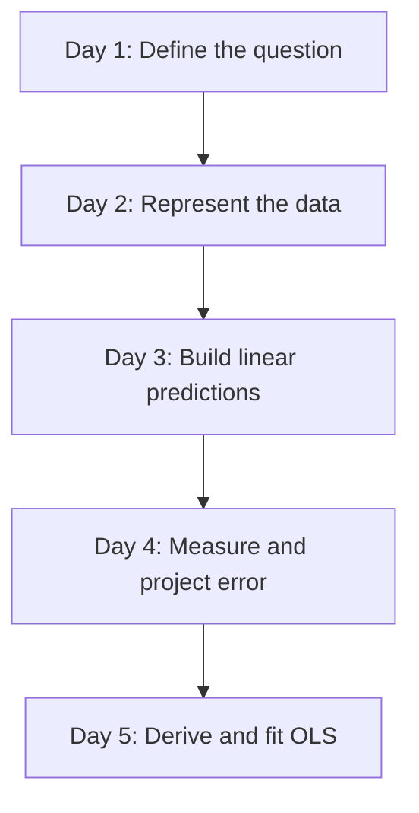
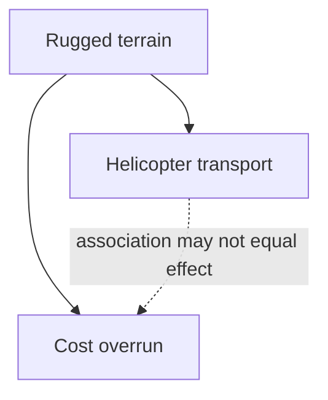
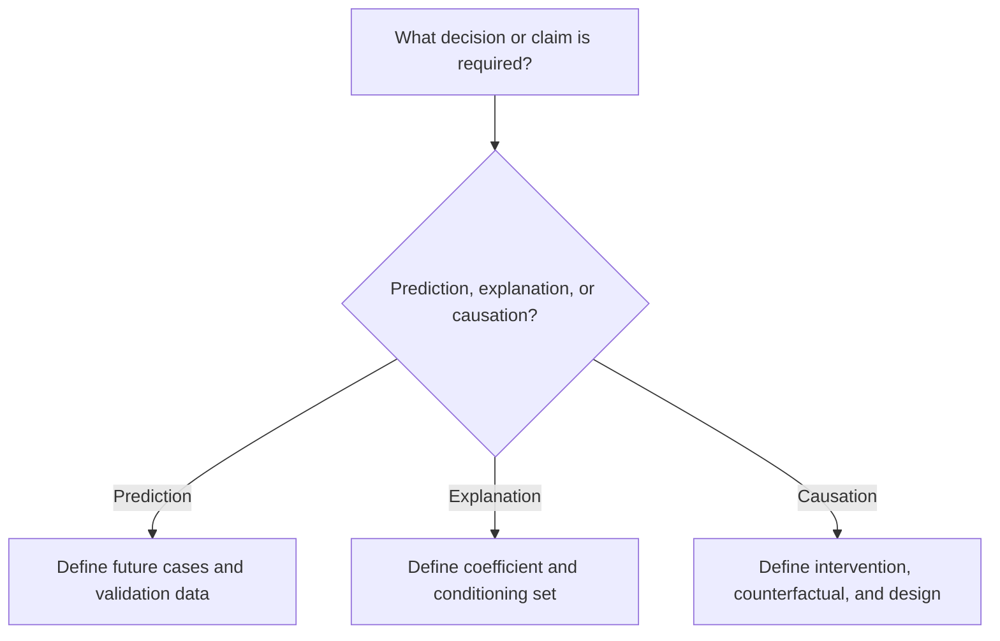
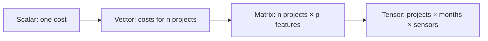
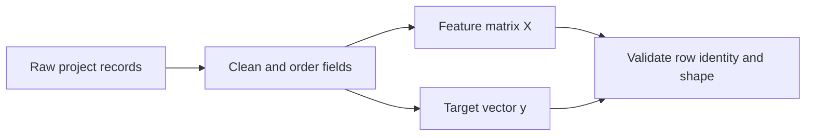
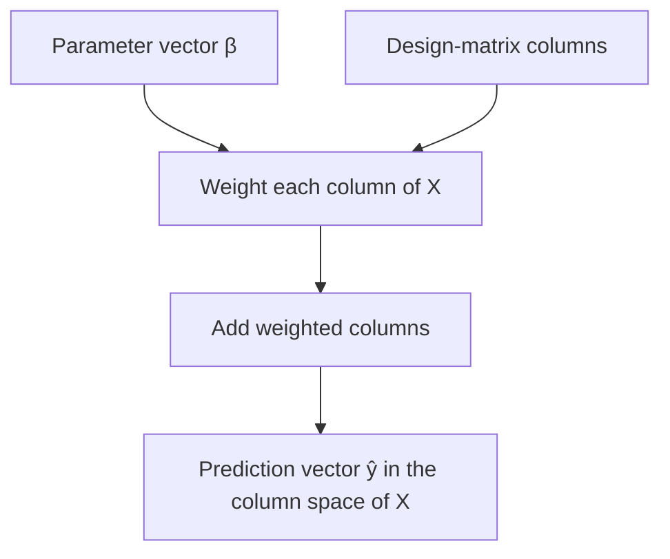
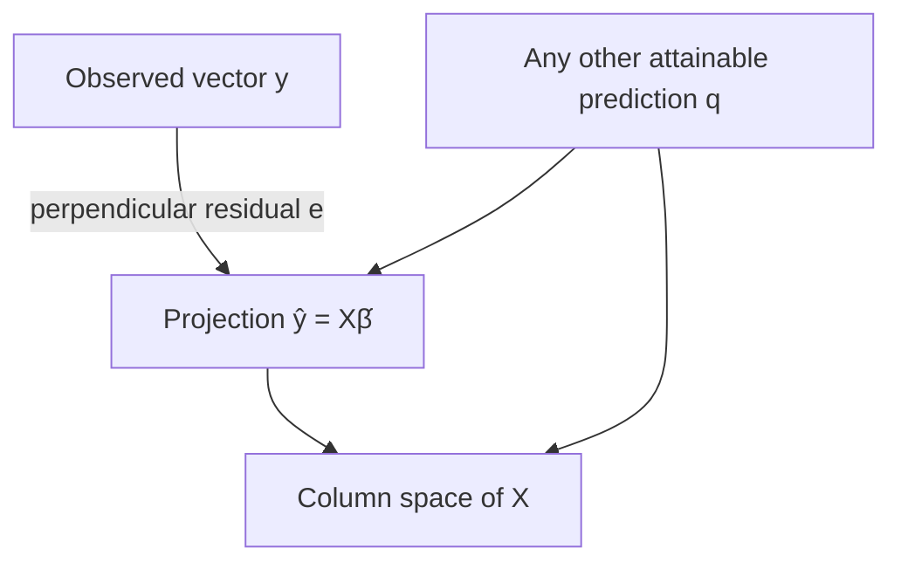
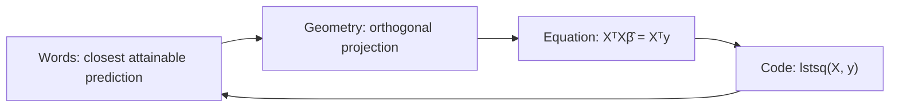
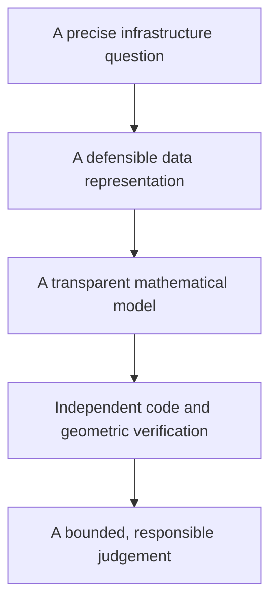

# Chapter 1 — From a Question to Ordinary Least Squares

## Level 1 Data Explorer: Week 1 of the MHP Cost Estimator

> **Central promise.** By the end of this chapter, you will not merely be able to call a regression function. You will be able to state the question a regression can answer, represent the data correctly, derive ordinary least squares (OLS) in scalar and matrix form, implement it without a machine-learning library, diagnose when it fails, and explain the result to a decision-maker responsible for public infrastructure.

This chapter uses a running case: estimating the cost of microhydro power (MHP) projects in Khyber Pakhtunkhwa (KP). The projects are fictional but realistic. Their geography, procurement problems, transport constraints, and management decisions are grounded in the kinds of conditions infrastructure teams encounter in Chitral, Dir, Swat, and other mountainous districts.

> **A note if you just finished Chapter 0.** This is a new dataset, not a continuation of the development, agricultural, or infrastructure CSVs you generated there. Those built the reflex; this is where it gets used. The MHP case starts small — eight projects below — and grows with each chapter.

The case is deliberately high-stakes. A regression coefficient is not just a number on a screen. If misunderstood, it can lead to an unrealistic budget, an unfair judgement about a field team, or a decision to withdraw a service from a remote community.

---

## The pedagogical contract

This book asks the learner and the author to keep the same contract.

1. **One central concept per day.** Each lesson has a single intellectual centre. Supporting ideas are introduced only when that centre requires them.
2. **No mathematical hand-waving.** A displayed equation is unpacked symbol by symbol and connected to numbers.
3. **Code as proof.** Important equations are verified with NumPy and, where useful, with plain loops. We do not use `scikit-learn` in Week 1.
4. **Geometry before memorisation.** Vectors, projections, residuals, and error surfaces are drawn or plotted.
5. **Build, break, rebuild.** Every day adds to the `MHPCostEstimator`, then deliberately creates a failure that the learner must diagnose.
6. **Interpretation in context.** Every mathematical result is translated back into a budget, engineering, or management statement.
7. **Cognitive load is managed, not intelligence underestimated.** New notation is introduced gradually, but no essential reasoning is hidden.

### What “from scratch” means here

We will use Python, NumPy, and Matplotlib as basic tools. We will not ask a library to fit a regression model for us. NumPy stores arrays and performs arithmetic; the learner still constructs the design matrix, objective function, normal equations, parameter estimates, predictions, residuals, and diagnostics.

Later chapters can remove even more scaffolding—for example, by implementing matrix decomposition manually—but doing that now would bury the statistical idea under numerical bookkeeping.

---

## Week 1 learning outcomes

At the end of five days, you should be able to:

- distinguish prediction, explanation, and causal inference;
- identify a target, features, observations, parameters, and hyperparameters;
- read and verify the shapes of vectors and matrices;
- explain why a column of ones creates an intercept;
- calculate residuals, SSR, MSE, RMSE, and MAE by hand and in code;
- describe OLS as both error minimisation and orthogonal projection;
- derive the scalar and matrix OLS solutions;
- explain when the OLS solution is unique;
- detect perfect multicollinearity and other common failures;
- fit and evaluate a small regression model without a machine-learning library; and
- separate a mathematically correct calculation from a defensible policy conclusion.

## The five-day route



Each day follows the same rhythm:

1. **Orient:** connect the concept to a decision;
2. **Construct:** develop the mathematics carefully;
3. **Prove:** test the mathematics with raw code;
4. **See:** create a diagram or figure;
5. **Build:** add one working part to the application;
6. **Break:** produce a predictable failure;
7. **Reflect:** decide what the result does and does not justify.

---

## Running case and units

The MHP Cost Estimator will eventually use multiple project features. During the first four days, we also use very small datasets so that every number can be inspected.

| Field | Symbol | Unit | Meaning |
|---|---:|---:|---|
| Project count | $n$ | projects | Number of observations |
| Feature count | $p$ | features | Number of explanatory columns before the intercept |
| Cable length | $x_1$ | km | Length of distribution cable |
| Hydraulic head | $x_2$ | m | Vertical fall available to drive the turbine |
| Road distance | $x_3$ | km | Distance from an all-weather road to the site |
| Terrain difficulty | $x_4$ | index 1–5 | Ordered field assessment of access difficulty |
| Planned capacity | $x_5$ | kW | Intended generating capacity |
| Actual project cost | $y$ | million PKR | Target to be estimated |

> **Unit discipline:** A coefficient is meaningless without its units. If cost is recorded in million PKR and cable length in kilometres, the cable coefficient has units of “million PKR per kilometre,” holding the other included features constant.

The data in this chapter are **synthetic**. They are for learning, not for judging a real district, contractor, community, or organisation.

### Minimal software setup

The code assumes Python 3.11 or later. In a terminal, create an isolated environment and install the two numerical packages used in this chapter:

```bash
python -m venv .venv
source .venv/bin/activate        # Windows PowerShell: .venv\Scripts\Activate.ps1
python -m pip install numpy matplotlib
```

Use a plain `.py` file, a Jupyter notebook, or an editor with an interactive Python terminal. Keep every day’s experiments. A failed calculation with a short note about why it failed is part of the learning record, not clutter to erase.

---

# Day 1 — What Question Are We Asking?

> **Today’s central idea:** Prediction, explanation, and causation are different jobs. A regression calculation does not decide which job you meant.

## 1.1 Regression in one sentence

Regression constructs a numerical relationship between a target variable $y$ and one or more observed features $X$.

That sentence describes the mechanism but not the purpose. The same regression equation can be used for three very different purposes.

| Job | Question | What success looks like | Main danger |
|---|---|---|---|
| Prediction | “How accurately can we estimate the cost of a new project?” | Low error on genuinely new projects | A model may fail when conditions change |
| Explanation | “How is road distance associated with cost after accounting for included features?” | Stable, interpretable coefficients with uncertainty | Omitted variables and correlated features distort interpretation |
| Causal inference | “How much would cost change if we improved road access?” | Credible estimate of an intervention | Association is mistaken for the effect of an action |

The distinction is not philosophical decoration. It changes the data you need, the assumptions you must defend, and the way the result may be used.

## 1.2 Prediction: estimating an unknown outcome

For prediction, we want a function $f$ that converts the observed features of project $i$ into an estimate:

$$
\hat{y}_i = f(x_{i1},x_{i2},\ldots,x_{ip}).
$$

Read the symbols slowly:

- $i$ identifies one project;
- $x_{ij}$ is feature $j$ for project $i$;
- $f$ is the fitted prediction rule;
- $y_i$ is the actual cost; and
- $\hat{y}_i$, pronounced “y-hat,” is the estimated cost.

A predictor may be useful even when a feature is not causal. For instance, the number of difficult river crossings may predict transport cost because it summarises remoteness. A planning unit can use that signal to improve a contingency estimate without claiming that a river crossing, by itself, causes every extra rupee.

Prediction must be evaluated on data not used to fit the model. A rule that memorises completed projects can appear perfect and still fail on the next valley.

## 1.3 Explanation: describing conditional association

For explanation, attention shifts from the prediction alone to the model’s parameters. Consider:

$$
\hat{y}_i = \beta_0 + \beta_1\,\text{road\_distance}_i + \beta_2\,\text{capacity}_i.
$$

Here $\beta_1$ describes the estimated difference in cost associated with one additional kilometre of road distance **among projects with the same included capacity**.

The phrase in bold is essential. In multiple regression, a coefficient is conditional on the other included features. It does not automatically control for variables that are absent, poorly measured, or structurally different across districts.

An explanatory analysis also needs uncertainty. A coefficient of 0.8 million PKR per kilometre is not equally persuasive if it comes from 6 projects or 600 projects. Standard errors and confidence intervals arrive later; Week 1 first establishes what is being estimated.

## 1.4 Causation: estimating an intervention

A causal question asks about a change we could make:

> If an all-weather access road were constructed before the MHP works began, how would the final project cost differ from what it would otherwise have been?

This question compares two potential outcomes for the same project:

$$
\text{causal effect}_i = Y_i(\text{road improved}) - Y_i(\text{road not improved}).
$$

We can observe only one of those outcomes for a given project. The unobserved alternative is the **counterfactual**. Causal inference is therefore a problem of constructing a credible comparison, not merely fitting a line.

Ordinary regression can be part of a causal design, but the regression output is causal only when the research design and assumptions make it so. Random assignment, natural experiments, careful matching, panel designs, and defensible causal graphs can help. A high $R^2$ cannot turn an associational design into a causal one.

## 1.5 Confounding: the hidden common cause

Suppose projects in rugged terrain are more likely to require helicopter transport, and rugged terrain independently increases excavation delays and labour costs.



**Figure 1.1 — A confounding structure.** Terrain is a common cause of the selected transport method and the cost overrun. The dotted arrow is the relationship we might estimate naively.

If terrain is ignored, projects using helicopters will look more expensive even if helicopter transport reduced cost relative to the feasible alternative—weeks of manual carriage or an unfinished project.

A variable is a confounder when it is causally related to both the exposure or decision and the outcome, and is not itself a consequence of that exposure. The precise definition depends on the full causal structure; “control for everything available” is not a safe rule because controlling for mediators or colliders can introduce new bias.

## 1.6 Simpson’s paradox: when aggregation reverses a pattern

Imagine eight projects, four in relatively accessible terrain and four in remote mountain terrain. Within each terrain group, longer cable raises cost. Yet remote projects happen to use shorter cable and start from a much higher cost base.

| Terrain group | Cable length (km) | Cost (million PKR) |
|---|---:|---:|
| Accessible | 4 | 18 |
| Accessible | 5 | 20 |
| Accessible | 6 | 22 |
| Accessible | 7 | 24 |
| Remote | 1 | 30 |
| Remote | 2 | 33 |
| Remote | 3 | 36 |
| Remote | 4 | 39 |

Within accessible projects, one more kilometre is associated with about 2 million PKR more cost. Within remote projects, it is associated with about 3 million PKR more cost. But in the combined data, low cable lengths are concentrated among costly remote projects, so the overall line slopes downward.

For one feature, the OLS slope can be written as:

$$
\hat{\beta}_1 =
\frac{\sum_{i=1}^{n}(x_i-\bar{x})(y_i-\bar{y})}
{\sum_{i=1}^{n}(x_i-\bar{x})^2}.
$$

The numerator measures how $x$ and $y$ move together. The denominator measures how much $x$ varies. Day 5 derives this formula; today we use it as a diagnostic.

### Code proof: calculate all three slopes

```python
import numpy as np

def slope_from_sums(x, y):
    """One-feature OLS slope, written directly from the equation."""
    x = np.asarray(x, dtype=float)
    y = np.asarray(y, dtype=float)
    x_centered = x - x.mean()
    y_centered = y - y.mean()
    numerator = np.sum(x_centered * y_centered)
    denominator = np.sum(x_centered ** 2)
    return numerator / denominator

x_accessible = np.array([4, 5, 6, 7], dtype=float)
y_accessible = np.array([18, 20, 22, 24], dtype=float)

x_remote = np.array([1, 2, 3, 4], dtype=float)
y_remote = np.array([30, 33, 36, 39], dtype=float)

x_all = np.concatenate([x_accessible, x_remote])
y_all = np.concatenate([y_accessible, y_remote])

print("Accessible slope:", slope_from_sums(x_accessible, y_accessible))
print("Remote slope:    ", slope_from_sums(x_remote, y_remote))
print("Combined slope:  ", slope_from_sums(x_all, y_all))

# Expected, approximately:
# Accessible slope:  2.0
# Remote slope:      3.0
# Combined slope:   -2.0
```

The code does not “prove” which relationship is causal. It proves the numerical reversal and forces us to explain it using geography and the data-generating process.

### Figure lab: make the reversal visible

```python
import matplotlib.pyplot as plt

def line_for(x, y, grid):
    b1 = slope_from_sums(x, y)
    b0 = y.mean() - b1 * x.mean()
    return b0 + b1 * grid

grid = np.linspace(0.5, 7.5, 100)

plt.figure(figsize=(8, 5))
plt.scatter(x_accessible, y_accessible, label="Accessible terrain", s=70)
plt.scatter(x_remote, y_remote, label="Remote terrain", s=70)
plt.plot(grid, line_for(x_accessible, y_accessible, grid), linewidth=2)
plt.plot(grid, line_for(x_remote, y_remote, grid), linewidth=2)
plt.plot(
    grid,
    line_for(x_all, y_all, grid),
    color="black",
    linestyle="--",
    label="Misleading combined line",
)
plt.xlabel("Cable length (km)")
plt.ylabel("Actual cost (million PKR)")
plt.title("Simpson's paradox in synthetic MHP projects")
plt.legend()
plt.tight_layout()
plt.show()
```

**Figure 1.2 — Group-specific and aggregated regression lines.** The dashed combined line answers a different—and substantively misleading—question.

## 1.7 A decision protocol before touching code

Use this sequence whenever someone asks for “a regression.”



Before analysis, write a one-sentence **estimand**—the exact quantity to be estimated. Examples:

- Prediction: “The expected final cost, in million PKR, of an approved project at the design stage.”
- Explanation: “The adjusted difference in final cost associated with one additional kilometre from an all-weather road, conditional on planned capacity and measured terrain difficulty.”
- Causation: “The average change in final MHP cost caused by completing an access road before civil works, among currently approved remote projects.”

If the sentence is vague, the model will not rescue it.

## 1.8 Build: start the application with a question contract

Create `mhp_estimator.py`:

```python
from dataclasses import dataclass
from typing import Literal

import numpy as np


AnalysisPurpose = Literal["prediction", "explanation", "causation"]


@dataclass(frozen=True)
class AnalysisContract:
    purpose: AnalysisPurpose
    target_name: str
    target_unit: str
    unit_of_observation: str
    intended_use: str

    def __post_init__(self):
        if self.purpose not in {"prediction", "explanation", "causation"}:
            raise ValueError("purpose must be prediction, explanation, or causation")
        for name, value in vars(self).items():
            if not str(value).strip():
                raise ValueError(f"{name} cannot be empty")


class MHPCostEstimator:
    """OLS estimator built progressively during Week 1."""

    def __init__(self, contract: AnalysisContract):
        self.contract = contract
        self.parameters_ = None
        self.feature_names_ = None
        self.rank_ = None
        self.is_fitted_ = False

    def __repr__(self):
        status = "fitted" if self.is_fitted_ else "unfitted"
        return f"MHPCostEstimator(purpose={self.contract.purpose!r}, {status})"


if __name__ == "__main__":
    contract = AnalysisContract(
        purpose="prediction",
        target_name="actual_project_cost",
        target_unit="million PKR",
        unit_of_observation="one completed MHP project",
        intended_use="early budget review for approved projects",
    )
    print(MHPCostEstimator(contract))
```

The class begins with a contract because a technically correct model can still be unfit for its intended use.

## 1.9 Break it deliberately

Change `purpose="prediction"` to `purpose="forecasting"`. The program should reject the unrecognised purpose. Then leave the purpose valid but make `intended_use=""`. It should reject the empty field.

The lesson is small but important: silent ambiguity is a data-quality problem.

## 1.10 Day 1 practice

1. A finance unit wants next year’s total contingency allocation. Is its first task prediction, explanation, or causation?
2. A director asks whether contractor type “causes” delay because its regression coefficient is positive. What additional question must you ask?
3. Draw a DAG in which flood damage affects both the decision to redesign a headrace channel and final cost.
4. In the Simpson dataset, add 10 million PKR to every accessible project. Recalculate the three slopes. Which slopes change, and why?
5. Write an estimand for a real infrastructure decision you know.

### Day 1 exit check

You are ready to continue if you can complete this sentence without hesitation:

> “A regression coefficient is a causal effect only when __________.”

A defensible completion is: “the design and assumptions make the comparison equivalent to the relevant intervention and counterfactual.”

---

# Day 2 — Regression Vocabulary and the Shape of Data

> **Today’s central idea:** Data have roles, shapes, units, and provenance. Most early modeling errors are representation errors before they are statistical errors.

## 2.1 The vocabulary of one project table

Suppose the rows of a table are completed MHP projects.

| Term | Meaning | MHP example |
|---|---|---|
| Observation | One unit represented by one row | One completed MHP project |
| Feature | An input measured before the target is known | Planned capacity in kW |
| Target | The outcome to estimate | Actual project cost |
| Parameter | A value learned from data | Cost coefficient for road distance |
| Hyperparameter | A setting chosen outside the fitting calculation | Whether to include an intercept |
| Prediction | Model output for an observation | Estimated cost of 42 million PKR |
| Residual | Actual minus predicted target | $45-42=3$ million PKR |
| Loss | A rule for penalising errors during fitting | Squared residual |
| Metric | A summary used to evaluate performance | RMSE in million PKR |
| Estimator | The procedure that learns parameters | OLS |
| Fitted model | Estimator plus learned parameter values | Intercept and slopes after fitting |

**Parameter** and **hyperparameter** should not be explained through a loose physical analogy. The reliable distinction is procedural: the fitting algorithm learns parameters from the training data; the analyst sets hyperparameters or design choices.

## 2.2 Scalars, vectors, matrices, and tensors

A **scalar** is one number. A **vector** is an ordered one-dimensional array. A **matrix** is a two-dimensional rectangular array. A **tensor** is the general term for an array with any number of axes.

The number of tensor axes is sometimes called its order or tensor rank. Do not confuse that usage with **matrix rank**, introduced on Day 5, which counts independent directions in a matrix.



**Figure 2.1 — The dimensional ladder.** Regression in this chapter mainly uses vectors and matrices; “tensor” is useful as the general family name.

The mathematical objects are:

$$
X \in \mathbb{R}^{n\times p},
\qquad
y \in \mathbb{R}^{n},
\qquad
\beta \in \mathbb{R}^{p}.
$$

Read them as:

- $X$ is a real-valued matrix with $n$ rows and $p$ feature columns;
- $y$ is a real-valued target vector with $n$ entries; and
- $\beta$ is a parameter vector with one entry per feature.

Once an intercept column is added, $X$ has $p+1$ columns and $\beta$ has $p+1$ entries.

### A concrete shape example

Three projects with two features—road distance and capacity—can be represented as:

$$
X =
\begin{bmatrix}
12 & 100\\
25 & 150\\
8 & 80
\end{bmatrix},
\qquad
y =
\begin{bmatrix}
28\\
44\\
22
\end{bmatrix}.
$$

Then $X$ has shape $3\times2$ and $y$ has length 3. Row 2 means that the second project is 25 km from an all-weather road, has planned capacity 150 kW, and actually cost 44 million PKR.

## 2.3 Shape is part of meaning

These arrays contain the same three numbers but do not have the same shape:

```python
import numpy as np

a = np.array([28.0, 44.0, 22.0])          # shape (3,)
b = np.array([[28.0], [44.0], [22.0]])    # shape (3, 1)
c = np.array([[28.0, 44.0, 22.0]])        # shape (1, 3)

print(a.shape, b.shape, c.shape)
# (3,) (3, 1) (1, 3)
```

In NumPy, `(3,)` is a one-dimensional vector. `(3, 1)` is a two-dimensional column matrix. `(1, 3)` is a two-dimensional row matrix. They can behave differently under multiplication and broadcasting.

Our application will accept a one-dimensional target vector `y.shape == (n,)`. It will convert a single feature from `(n,)` to a two-dimensional matrix `(n, 1)`.

## 2.4 The design matrix and row alignment

The feature matrix used in a regression is called the **design matrix**. “Design” here refers to the arrangement of predictor columns; it does not mean the projects were experimentally assigned.

The $i$th row of $X$ and the $i$th entry of $y$ must refer to the same project.



**Figure 2.2 — Data assembly.** Matching row counts are necessary but not sufficient: row identities must also match.

If `X` is accidentally sorted by district while `y` remains sorted by project ID, the shapes still match. The code may run and the model may be nonsense. Preserve a project identifier during preparation, even if it is not used as a numerical feature.

## 2.5 A data dictionary is part of the model

A usable dataset needs more than column names.

| Field | Data type | Unit / categories | Timing | Missing-value rule |
|---|---|---|---|---|
| `project_id` | string | unique ID | approval | never missing |
| `road_distance_km` | float | km | design survey | verify from GIS if missing |
| `planned_capacity_kw` | float | kW | approved design | never impute casually |
| `terrain_index` | integer | 1, 2, 3, 4, 5 | pre-construction | document assessor |
| `actual_cost_m_pkr` | float | million PKR, stated price basis | completion | target; exclude incomplete projects |

Timing prevents **target leakage**. A feature recorded after cost escalation—for example, “number of contract amendments”—might predict final cost extremely well. It is unavailable when the original budget is prepared and may partly be a consequence of the overrun. It should not be used in an early-stage prediction model without redefining the intended use.

## 2.6 Parsing one nested project record

```python
import json
import numpy as np

raw_json = """
{
  "project_id": "MHP-CH-003",
  "design": {
    "road_distance_km": 18.5,
    "planned_capacity_kw": 120.0,
    "terrain_index": 4
  },
  "completion": {
    "actual_cost_m_pkr": 39.2
  }
}
"""

record = json.loads(raw_json)

X_one = np.array([[  # two brackets: one row, three columns
    record["design"]["road_distance_km"],
    record["design"]["planned_capacity_kw"],
    record["design"]["terrain_index"],
]], dtype=float)

y_one = np.array([
    record["completion"]["actual_cost_m_pkr"]
], dtype=float)

print("X:", X_one, "shape:", X_one.shape)
print("y:", y_one, "shape:", y_one.shape)

assert X_one.shape == (1, 3)
assert y_one.shape == (1,)
```

The `assert` statements are executable claims. If the parser stops satisfying the intended mathematical shape, the program fails at the boundary instead of producing a later mystery.

## 2.7 Code proof: matrix–vector multiplication by loops

The linear prediction without an intercept is:

$$
\hat{y}_i = \sum_{j=1}^{p}x_{ij}\beta_j.
$$

For every project $i$, multiply each feature $x_{ij}$ by its corresponding parameter $\beta_j$, then add the products.

```python
X = np.array([
    [12.0, 100.0],
    [25.0, 150.0],
    [8.0, 80.0],
])
beta = np.array([0.6, 0.20])

# Proof using explicit loops
y_hat_loop = np.zeros(X.shape[0])
for i in range(X.shape[0]):
    total = 0.0
    for j in range(X.shape[1]):
        total += X[i, j] * beta[j]
    y_hat_loop[i] = total

# The same operation in matrix notation
y_hat_matrix = X @ beta

print(y_hat_loop)
print(y_hat_matrix)
assert np.allclose(y_hat_loop, y_hat_matrix)
```

The `@` operator is compact, but it is not magic. The loops show exactly what it does.

## 2.8 Build: robust input validation

Add these methods inside `MHPCostEstimator`:

```python
    @staticmethod
    def _validate_inputs(X, y=None):
        """Return finite float arrays with predictable regression shapes."""
        X = np.asarray(X, dtype=float)

        if X.ndim == 1:
            X = X.reshape(-1, 1)
        if X.ndim != 2:
            raise ValueError(f"X must be 2D after conversion; got shape {X.shape}")
        if X.shape[0] == 0 or X.shape[1] == 0:
            raise ValueError("X must contain at least one row and one feature")
        if not np.isfinite(X).all():
            raise ValueError("X contains NaN or infinite values")

        if y is None:
            return X

        y = np.asarray(y, dtype=float)
        if y.ndim == 2 and y.shape[1] == 1:
            y = y.reshape(-1)
        if y.ndim != 1:
            raise ValueError(f"y must be 1D; got shape {y.shape}")
        if X.shape[0] != y.shape[0]:
            raise ValueError(
                f"row mismatch: X has {X.shape[0]} rows but y has {y.shape[0]}"
            )
        if not np.isfinite(y).all():
            raise ValueError("y contains NaN or infinite values")

        return X, y
```

### Why each check exists

- `dtype=float` prevents accidental string arithmetic.
- A 1D `X` is interpreted as one feature observed for many projects.
- Regression requires a 2D design matrix even when $p=1$.
- Empty arrays have mathematically valid-looking shapes but no estimable relationship.
- `NaN` and infinity propagate through calculations and can silently destroy results.
- A one-column target matrix is flattened to the application’s chosen convention.
- Matching row counts are enforced, though project-ID alignment must be checked earlier.

## 2.9 Break it deliberately

Run each case and predict the error message before reading it.

```python
contract = AnalysisContract(
    purpose="prediction",
    target_name="actual_cost_m_pkr",
    target_unit="million PKR",
    unit_of_observation="completed MHP project",
    intended_use="design-stage budget review",
)
model = MHPCostEstimator(contract)

bad_cases = [
    (np.ones((10, 3)), np.ones(8)),       # row mismatch
    (np.array([[1.0, np.nan]]), [2.0]),   # missing feature
    (np.empty((0, 2)), np.empty(0)),      # no observations
    (np.ones((2, 2, 2)), np.ones(2)),     # three-dimensional X
]

for X_bad, y_bad in bad_cases:
    try:
        model._validate_inputs(X_bad, y_bad)
    except ValueError as error:
        print(type(error).__name__, "->", error)
```

Then construct the more dangerous failure: create `X` and `y` with the same number of rows but place `y` in reverse project order. Validation cannot detect the mistake unless project identifiers are checked during data assembly.

## 2.10 Day 2 practice

1. State the shape of a dataset containing 70 projects and 5 features.
2. After adding an intercept, what are the shapes of $X$ and $\beta$?
3. Why is `project_id` important even when it is not a numerical feature?
4. Give one example of target leakage in an MHP cost model.
5. Extend `_validate_inputs` to reject a constant target vector, but explain why a constant target is not mathematically invalid in every context.

### Day 2 exit check

Given `X.shape == (40, 6)` and `beta.shape == (5,)`, you should immediately say: “Multiplication is impossible because the inner dimensions, 6 and 5, do not match.”

---

# Day 3 — Linear Algebra as a System of Predictions

> **Today’s central idea:** A linear model forms each prediction by adding weighted features. Matrix notation performs that same operation for every project at once.

## 3.1 From a verbal rule to a linear equation

Suppose a deliberately simple budget rule uses only cable length:

> Begin with a fixed base cost of 8 million PKR, then add 4 million PKR for each kilometre of cable.

For project $i$:

$$
\hat{y}_i = 8 + 4x_i.
$$

The general one-feature linear model is:

$$
\hat{y}_i = \beta_0 + \beta_1x_i.
$$

- $\beta_0$ is the **intercept**: the model’s predicted target when $x_i=0$.
- $\beta_1$ is the **slope**: the predicted change in $y$ associated with a one-unit increase in $x$.

If $y$ is million PKR and $x$ is km, the slope’s units are million PKR per km.

The intercept may be necessary for good predictions without having a useful physical interpretation. “A project with zero cable” may lie outside the scope of the data. An intercept is an algebraic baseline, not automatically the price of a literal zero-feature project.

## 3.2 Multiple features are still a weighted sum

With road distance, capacity, and terrain difficulty:

$$
\hat{y}_i
= \beta_0
+ \beta_1\,\text{road\_distance}_i
+ \beta_2\,\text{capacity}_i
+ \beta_3\,\text{terrain}_i.
$$

For one project, this is a dot product between a row of feature values and a vector of parameters. For every project, it becomes matrix–vector multiplication:

$$
\hat{y} = X\beta.
$$

The apparent simplicity of the matrix equation is earned by carefully constructing $X$.

## 3.3 Why a column of ones creates an intercept

For three projects and one measured feature, start with:

$$
X_{\text{raw}} =
\begin{bmatrix}
x_1\\x_2\\x_3
\end{bmatrix}.
$$

Prepend a column of ones:

$$
X =
\begin{bmatrix}
1 & x_1\\
1 & x_2\\
1 & x_3
\end{bmatrix},
\qquad
\beta =
\begin{bmatrix}
\beta_0\\
\beta_1
\end{bmatrix}.
$$

Now multiply row by column:

$$
X\beta =
\begin{bmatrix}
1\beta_0+x_1\beta_1\\
1\beta_0+x_2\beta_1\\
1\beta_0+x_3\beta_1
\end{bmatrix}.
$$

The same $\beta_0$ is added to every project because every first-column entry is 1.

Without the column of ones, the one-feature model is $\hat{y}=\beta_1x$. At $x=0$, it must pass through the origin. With the ones column, the model is **affine**: a linear transformation plus a translation. In everyday statistics it is still called a linear regression because it is linear in the parameters.

## 3.4 Code proof: expand `X @ beta` by hand

```python
import numpy as np

x = np.array([1.0, 2.0, 3.0])
X = np.column_stack([np.ones(x.size), x])
beta = np.array([8.0, 4.0])

y_hat_matrix = X @ beta
y_hat_manual = np.array([
    1.0 * 8.0 + 1.0 * 4.0,
    1.0 * 8.0 + 2.0 * 4.0,
    1.0 * 8.0 + 3.0 * 4.0,
])

print(X)
print(y_hat_matrix)
assert np.array_equal(y_hat_matrix, y_hat_manual)
assert np.array_equal(y_hat_matrix, np.array([12.0, 16.0, 20.0]))
```

Every multiplication in the displayed equation appears explicitly in the code.

## 3.5 Shape algebra before numerical algebra

If:

$$
X \in \mathbb{R}^{n\times(p+1)}
\quad\text{and}\quad
\beta \in \mathbb{R}^{p+1},
$$

then:

$$
X\beta \in \mathbb{R}^{n}.
$$

The inner dimensions must agree:

$$
(n\times(p+1))\,(p+1\times1) = n\times1.
$$

This is not a software convention. It follows from the dot product: each row of $X$ needs exactly one parameter for each column.

### Symbol-to-Python map

| Mathematics | Meaning | NumPy |
|---|---|---|
| $X\beta$ | Matrix–vector product | `X @ beta` |
| $X^T$ | Transpose | `X.T` |
| $x^Ty$ | Dot product | `x @ y` or `np.dot(x, y)` |
| $I$ | Identity matrix | `np.eye(p)` |
| $\mathbf{1}$ | Vector of ones | `np.ones(n)` |
| $\lVert v\rVert_2$ | Euclidean length | `np.linalg.norm(v)` |

## 3.6 Matrices as transformations—and the limit of the analogy

A matrix can transform geometric coordinates by stretching, shrinking, rotating, reflecting, or shearing vectors. That view is useful for understanding linear algebra. In regression, however, the most immediate interpretation of $X\beta$ is slightly different: the columns of $X$ are building blocks, and $\beta$ chooses how much of each column to combine.

If $X$ has columns $x_0,x_1,\ldots,x_p$, then:

$$
X\beta = \beta_0x_0+\beta_1x_1+\cdots+\beta_px_p.
$$

Because $x_0$ is the column of ones, $\beta_0x_0$ adds the same amount to every prediction.



**Figure 3.1 — Column-combination view of regression.** The prediction vector is not an arbitrary vector; it must be built from the columns available in $X$.

## 3.7 Figure lab: with and without an intercept

Use four synthetic projects:

```python
import matplotlib.pyplot as plt
import numpy as np

x_cable_km = np.array([1.0, 2.0, 3.0, 4.0])
y_cost_m_pkr = np.array([12.0, 19.0, 29.0, 38.0])

# OLS through the origin: minimise ||y - xb||²
b_origin = (x_cable_km @ y_cost_m_pkr) / (x_cable_km @ x_cable_km)

# OLS with an intercept: solve the normal equations
X = np.column_stack([np.ones(x_cable_km.size), x_cable_km])
beta = np.linalg.solve(X.T @ X, X.T @ y_cost_m_pkr)

grid = np.linspace(0, 5, 100)

plt.figure(figsize=(8, 5))
plt.scatter(x_cable_km, y_cost_m_pkr, color="navy", s=70, label="Projects")
plt.plot(grid, b_origin * grid, "--", color="firebrick", label="Forced through origin")
plt.plot(grid, beta[0] + beta[1] * grid, color="darkgreen", label="With intercept")
plt.axhline(0, color="grey", linewidth=0.6)
plt.axvline(0, color="grey", linewidth=0.6)
plt.xlabel("Cable length (km)")
plt.ylabel("Actual cost (million PKR)")
plt.title("The intercept translates the fitted line")
plt.legend()
plt.tight_layout()
plt.show()

print("Through-origin slope:", b_origin)
print("Intercept and slope:", beta)
```

**Figure 3.2 — The effect of the intercept.** The through-origin model is required to predict zero cost at zero cable length. The intercept model is allowed to fit the observed baseline.

Notice that the code uses `np.linalg.solve(A, b)` for $A\beta=b$, not `np.linalg.inv(A) @ b`. The inverse formula is useful for derivation, but directly solving the linear system is clearer and usually more numerically stable.

## 3.8 Scaling and units

Suppose cable is changed from kilometres to metres:

$$
x_{\text{metres}}=1000x_{\text{km}}.
$$

To preserve the same prediction:

$$
\beta_{\text{metres}}=\frac{\beta_{\text{km}}}{1000}.
$$

Then:

$$
\beta_{\text{metres}}x_{\text{metres}}
=\frac{\beta_{\text{km}}}{1000}(1000x_{\text{km}})
=\beta_{\text{km}}x_{\text{km}}.
$$

### Code proof: changing units changes the coefficient, not the prediction

```python
x_km = np.array([1.0, 2.0, 3.0])
x_m = 1000.0 * x_km

beta_km = 4.0       # million PKR per km
beta_m = beta_km / 1000.0

assert np.allclose(beta_km * x_km, beta_m * x_m)
```

This is why comparing coefficient magnitudes across differently scaled features is misleading. A smaller numerical coefficient need not represent a less important variable.

## 3.9 Build: intercept construction and prediction

Add these methods inside `MHPCostEstimator`:

```python
    @staticmethod
    def _add_intercept_column(X):
        """Prepend one constant column; X must already be validated and 2D."""
        ones = np.ones((X.shape[0], 1), dtype=float)
        return np.hstack([ones, X])

    def predict(self, X):
        """Return predictions for new feature rows."""
        if not self.is_fitted_:
            raise RuntimeError("fit the estimator before calling predict")

        X = np.asarray(X, dtype=float)
        if X.ndim == 1:
            X = X.reshape(1, -1)  # one new project with p features
        X = self._validate_inputs(X)
        if X.shape[1] != len(self.feature_names_):
            raise ValueError(
                f"expected {len(self.feature_names_)} features, got {X.shape[1]}"
            )

        X_design = self._add_intercept_column(X)
        return X_design @ self.parameters_
```

`predict` cannot yet succeed because `fit` has not been built. This is intentional. We have defined the behaviour of a fitted application before learning how to estimate the parameters.

The context resolves a genuine shape ambiguity: during fitting, a one-dimensional `X` means one feature observed across many projects; during prediction, a one-dimensional `X` means one new project containing several features. Passing an explicit two-dimensional array remains safest.

## 3.10 Break it deliberately: broadcasting is not matrix multiplication

```python
X = np.array([
    [1.0, 12.0, 100.0],
    [1.0, 25.0, 150.0],
])
beta = np.array([5.0, 0.6, 0.2])

correct = X @ beta
print("correct shape:", correct.shape, "values:", correct)

elementwise = X * beta
print("elementwise shape:", elementwise.shape)
print(elementwise)
```

`X * beta` broadcasts the parameter vector across rows and multiplies element by element. It returns a matrix of products, not a prediction vector. The expression runs without an error, which makes it more dangerous than a crash.

Also try multiplying the same `X` by `np.array([5.0, 0.6])`. Matrix multiplication should fail because the number of parameters does not equal the number of columns.

## 3.11 Day 3 practice

1. Expand one row of $X\beta$ for an intercept plus three features.
2. Explain why a column of twos would not estimate the conventional intercept. What would its coefficient represent?
3. If cost changes from million PKR to PKR, how do the coefficients change?
4. Write a `matvec_with_loops(X, beta)` function that rejects incompatible dimensions.
5. Plot a dataset for which the intercept has a strong effect on fit and another for which it has little effect.

### Day 3 exit check

You should be able to explain both statements:

- “$X\beta$ is one dot product per project.”
- “$X\beta$ is a weighted combination of the columns of $X$.”

They are two views of the same operation.

---

# Day 4 — Residuals, Loss, and the Geometry of OLS

> **Today’s central idea:** OLS chooses the attainable prediction vector closest to the observed target vector in squared Euclidean distance.

## 4.1 A prediction becomes testable through its residual

For project $i$:

$$
e_i = y_i-\hat{y}_i.
$$

- $e_i>0$: actual cost exceeded predicted cost; the model underpredicted.
- $e_i<0$: actual cost was below predicted cost; the model overpredicted.
- $e_i=0$: prediction matched the observed target.

The sign convention matters. This chapter uses **actual minus predicted**.

For all projects:

$$
e = y-\hat{y}=y-X\beta.
$$

### Code proof: the vector equation and the elementwise equation agree

```python
import numpy as np

y = np.array([12.0, 19.0, 29.0])
y_hat = np.array([10.5, 20.0, 27.5])

e_vector = y - y_hat
e_manual = np.array([
    12.0 - 10.5,
    19.0 - 20.0,
    29.0 - 27.5,
])

assert np.allclose(e_vector, e_manual)
print(e_vector)  # [ 1.5 -1.   1.5]
```

Residuals are observed after fitting. They are not the same as the unobservable population errors in a statistical model, though introductory discussions often use the words loosely.

## 4.2 Why OLS squares residuals

The **sum of squared residuals** (SSR), also called the residual sum of squares (RSS) or sum of squared errors (SSE), is:

$$
SSR(\beta)=\sum_{i=1}^{n}e_i^2
=\sum_{i=1}^{n}(y_i-x_i^T\beta)^2.
$$

In vector notation:

$$
SSR(\beta)=e^Te=(y-X\beta)^T(y-X\beta).
$$

Squaring has four important consequences:

1. Positive and negative residuals cannot cancel.
2. Large residuals receive disproportionate weight.
3. The objective is smooth and differentiable everywhere.
4. The objective has a geometric interpretation as squared Euclidean distance.

The second consequence is not automatically desirable. A data-entry error of 390 million instead of 39 million can dominate an OLS fit. High stakes do not, by themselves, prove that squared loss is the right institutional loss function. The analyst must inspect outliers and ask whether the objective reflects the decision.

### Code proof: $e^Te$ equals the sum of elementwise squares

```python
e = np.array([1.5, -1.0, 1.5])

ssr_loop = 0.0
for value in e:
    ssr_loop += value ** 2

ssr_sum = np.sum(e ** 2)
ssr_dot = e.T @ e

print(ssr_loop, ssr_sum, ssr_dot)
assert np.isclose(ssr_loop, ssr_sum)
assert np.isclose(ssr_sum, ssr_dot)
```

## 4.3 SSR, MSE, RMSE, and MAE answer different reporting needs

$$
MSE = \frac{1}{n}\sum_{i=1}^{n}e_i^2,
$$

$$
RMSE = \sqrt{MSE},
$$

$$
MAE = \frac{1}{n}\sum_{i=1}^{n}|e_i|.
$$

| Metric | Units | Sensitivity to large residuals | Typical use |
|---|---|---|---|
| SSR | squared target units | high | Fitting and comparing models on the same observations |
| MSE | squared target units | high | Average squared loss |
| RMSE | target units | high | Error summary interpretable in cost units |
| MAE | target units | lower | Typical absolute miss, more robust than RMSE |

With targets in million PKR, RMSE and MAE are also in million PKR. MSE is in squared million PKR, which is harder to communicate.

### Code proof: compute every metric from definitions

```python
def regression_metrics(y, y_hat):
    y = np.asarray(y, dtype=float)
    y_hat = np.asarray(y_hat, dtype=float)
    if y.shape != y_hat.shape:
        raise ValueError("y and y_hat must have the same shape")

    residuals = y - y_hat
    ssr = np.sum(residuals ** 2)
    mse = ssr / residuals.size
    rmse = np.sqrt(mse)
    mae = np.sum(np.abs(residuals)) / residuals.size
    return {"ssr": ssr, "mse": mse, "rmse": rmse, "mae": mae}


metrics = regression_metrics(
    y=np.array([12.0, 19.0, 29.0]),
    y_hat=np.array([10.5, 20.0, 27.5]),
)
print(metrics)
```

For training data, some texts divide SSR by $n-p-1$ to estimate error variance. That is a different quantity from predictive MSE. Always name the denominator.

## 4.4 OLS as a constrained search in observation space

The target vector $y$ contains one coordinate for each project, so it lives in $\mathbb{R}^n$. Every possible $X\beta$ is a weighted combination of the columns of $X$. The set of all such combinations is the **column space** of $X$.

OLS cannot choose any point in $\mathbb{R}^n$. It must choose a point inside that column space. It selects the point closest to $y$.



**Figure 4.1 — Projection view of OLS.** The diagram is conceptual: $\hat{y}$ and $q$ lie in the column space, while the residual from $\hat{y}$ to $y$ is perpendicular to it.

## 4.5 The Pythagorean proof of minimum distance

Let:

- $\hat{y}$ be the perpendicular projection of $y$ onto the column space of $X$;
- $q$ be any other prediction in the column space;
- $e=y-\hat{y}$ be the OLS residual; and
- $d=\hat{y}-q$ be the displacement within the column space.

Then:

$$
y-q=(y-\hat{y})+(\hat{y}-q)=e+d.
$$

Because $e$ is perpendicular to the entire column space and $d$ lies inside it:

$$
e^Td=0.
$$

Now expand the squared distance:

$$
\begin{aligned}
\lVert y-q\rVert_2^2
&=(e+d)^T(e+d)\\
&=e^Te+e^Td+d^Te+d^Td\\
&=\lVert e\rVert_2^2+\lVert d\rVert_2^2\\
&\ge \lVert e\rVert_2^2.
\end{aligned}
$$

The last step holds because a squared length cannot be negative. Therefore no other attainable prediction $q$ can be closer to $y$ than $\hat{y}$.

## 4.6 Why orthogonality produces the normal equations

Every column of $X$ lies in the column space. If the residual is perpendicular to the whole column space, it is perpendicular to every column:

$$
X^Te=0.
$$

Substitute $e=y-X\hat{\beta}$:

$$
X^T(y-X\hat{\beta})=0.
$$

Distribute $X^T$:

$$
X^Ty-X^TX\hat{\beta}=0.
$$

Rearrange:

$$
X^TX\hat{\beta}=X^Ty.
$$

These are the **normal equations**. “Normal” refers to perpendicularity, not to the normal probability distribution.

If an intercept column is present, one of the orthogonality conditions is:

$$
\mathbf{1}^Te=\sum_{i=1}^{n}e_i=0.
$$

Therefore OLS residuals from the training data sum to zero when the model includes an intercept, up to floating-point error.

## 4.7 Code proof: orthogonality and Pythagoras

```python
import numpy as np

x = np.array([1.0, 2.0, 3.0, 4.0])
y = np.array([12.0, 19.0, 29.0, 38.0])
X = np.column_stack([np.ones(x.size), x])

beta_hat = np.linalg.solve(X.T @ X, X.T @ y)
y_hat = X @ beta_hat
e = y - y_hat

# Orthogonality: one near-zero dot product per design column
print("X.T @ e =", X.T @ e)
assert np.allclose(X.T @ e, np.zeros(X.shape[1]), atol=1e-10)

# Intercept implication: residuals sum to zero
assert np.isclose(e.sum(), 0.0, atol=1e-10)

# Choose another attainable prediction q = X @ beta_other
beta_other = beta_hat + np.array([2.0, -1.0])
q = X @ beta_other
d = y_hat - q

left = np.linalg.norm(y - q) ** 2
right = np.linalg.norm(e) ** 2 + np.linalg.norm(d) ** 2

print("Pythagorean sides:", left, right)
assert np.isclose(e @ d, 0.0, atol=1e-10)
assert np.isclose(left, right, atol=1e-10)
assert left >= np.linalg.norm(e) ** 2
```

This block verifies three equations: the normal-equation orthogonality condition, the zero-sum residual property, and the Pythagorean decomposition.

## 4.8 Figure lab: draw the projection in three dimensions

Three observations allow the target and prediction vectors to be drawn in $\mathbb{R}^3$.

```python
import matplotlib.pyplot as plt
import numpy as np

x = np.array([-1.0, 0.0, 1.0])
X = np.column_stack([np.ones(3), x])
y = np.array([1.0, 3.0, 2.0])

beta_hat = np.linalg.solve(X.T @ X, X.T @ y)
y_hat = X @ beta_hat
e = y - y_hat

fig = plt.figure(figsize=(8, 7))
ax = fig.add_subplot(111, projection="3d")
origin = np.zeros(3)

ax.quiver(*origin, *y, color="navy", label="Observed y", arrow_length_ratio=0.08)
ax.quiver(*origin, *y_hat, color="darkgreen", label="Projection ŷ", arrow_length_ratio=0.08)
ax.quiver(*y_hat, *e, color="firebrick", label="Residual e", arrow_length_ratio=0.15)

# Draw a patch of the column space span{ones, x}
a = np.linspace(-0.5, 2.5, 10)
b = np.linspace(-1.0, 1.0, 10)
A, B = np.meshgrid(a, b)
plane = A[..., None] * X[:, 0] + B[..., None] * X[:, 1]
ax.plot_surface(plane[..., 0], plane[..., 1], plane[..., 2], alpha=0.2)

ax.set_xlabel("Project 1 coordinate")
ax.set_ylabel("Project 2 coordinate")
ax.set_zlabel("Project 3 coordinate")
ax.set_title("OLS projects y onto the column space of X")
ax.legend()
plt.tight_layout()
plt.show()
```

**Figure 4.2 — OLS geometry in observation space.** The residual begins at $\hat{y}$ and ends at $y$; it is perpendicular to the surface of attainable predictions.

## 4.9 Build: metrics as methods

Add these methods to `MHPCostEstimator`:

```python
    @staticmethod
    def _metrics_from_predictions(y, y_hat):
        y = np.asarray(y, dtype=float).reshape(-1)
        y_hat = np.asarray(y_hat, dtype=float).reshape(-1)
        if y.shape != y_hat.shape:
            raise ValueError("y and y_hat must have identical shapes")

        residuals = y - y_hat
        ssr = float(residuals @ residuals)
        mse = ssr / residuals.size
        return {
            "ssr": ssr,
            "mse": mse,
            "rmse": float(np.sqrt(mse)),
            "mae": float(np.mean(np.abs(residuals))),
        }

    def evaluate(self, X, y):
        """Evaluate a fitted model on supplied observations."""
        X, y = self._validate_inputs(X, y)
        y_hat = self.predict(X)
        return self._metrics_from_predictions(y, y_hat)
```

The method does not call these “test metrics” because the caller may supply training, validation, or test data. The application should not pretend to know the provenance of an array.

## 4.10 Break it deliberately: one outlier

```python
y = np.array([20.0, 22.0, 24.0, 26.0])
y_hat = np.array([21.0, 21.0, 25.0, 25.0])

ordinary = regression_metrics(y, y_hat)

y_with_error = y.copy()
y_with_error[-1] = 260.0  # possible extra zero in data entry
contaminated = regression_metrics(y_with_error, y_hat)

print("Ordinary:    ", ordinary)
print("Contaminated:", contaminated)
```

Compare the change in RMSE and MAE. Do not conclude merely that MAE is “better.” First determine whether 260 is a genuine extreme project, a different type of project, or an error. Robustness cannot replace data investigation.

## 4.11 Day 4 practice

1. Calculate the residuals and SSR for $y=[3,5]$ and $\hat{y}=[4,3]$.
2. Prove in code that RMSE has the same units as the target under a change from million PKR to PKR.
3. Why does including an intercept make training residuals sum to zero?
4. Does a zero sum of residuals imply a good model? Construct a counterexample.
5. Modify Figure 4.2 by choosing a new $y$. Verify that `X.T @ e` remains near zero.

### Day 4 exit check

You should be able to explain OLS without calculus:

> “Among all prediction vectors that can be constructed from the columns of $X$, OLS chooses the one with the shortest squared distance to $y$.”

---

# Day 5 — Deriving, Fitting, and Stress-Testing OLS

> **Today’s central idea:** OLS is the parameter value that makes the squared-error surface as small as possible. The normal equation is a consequence, not a formula to memorise.

Day 4 reached the normal equations through geometry:

$$
X^TX\hat{\beta}=X^Ty.
$$

Today we reach the same point through calculus, first with one feature and then with matrices. The two derivations are complementary:

- geometry explains **what** OLS is doing; and
- calculus explains **how** the optimum is located.

## 5.1 The scalar error bowl

Begin with a model that has one parameter and no intercept:

$$
\hat{y}_i=\beta x_i.
$$

The squared-error objective is:

$$
S(\beta)=\sum_{i=1}^{n}(y_i-\beta x_i)^2.
$$

Expand one squared term:

$$
(y_i-\beta x_i)^2
=y_i^2-2\beta x_iy_i+\beta^2x_i^2.
$$

Therefore:

$$
S(\beta)
=\sum_i y_i^2
-2\beta\sum_i x_iy_i
+\beta^2\sum_i x_i^2.
$$

Differentiate with respect to $\beta$:

$$
\frac{dS}{d\beta}
=-2\sum_i x_iy_i
+2\beta\sum_i x_i^2.
$$

At a stationary point, the derivative is zero:

$$
-2\sum_i x_iy_i+2\hat{\beta}\sum_i x_i^2=0.
$$

Rearrange:

$$
\hat{\beta}
=\frac{\sum_i x_iy_i}{\sum_i x_i^2}.
$$

The second derivative is:

$$
\frac{d^2S}{d\beta^2}=2\sum_i x_i^2.
$$

If at least one $x_i$ is nonzero, the second derivative is positive, so the stationary point is the unique minimum.

### Code proof: derivative, grid search, and analytic solution

```python
import numpy as np

x = np.array([1.0, 2.0, 3.0])
y = np.array([2.0, 4.0, 7.0])

def ssr_through_origin(beta, x, y):
    return np.sum((y - beta * x) ** 2)

def derivative_through_origin(beta, x, y):
    return -2.0 * np.sum(x * y) + 2.0 * beta * np.sum(x ** 2)

beta_hat = np.sum(x * y) / np.sum(x ** 2)
grid = np.linspace(0.0, 4.0, 4001)
grid_best = grid[np.argmin([ssr_through_origin(b, x, y) for b in grid])]

print("Analytic minimum:", beta_hat)
print("Grid minimum:    ", grid_best)
print("Derivative there:", derivative_through_origin(beta_hat, x, y))

assert np.isclose(derivative_through_origin(beta_hat, x, y), 0.0)
assert np.isclose(beta_hat, grid_best, atol=0.001)
assert 2.0 * np.sum(x ** 2) > 0.0
```

The grid is not how we want to fit the model; it is an independent numerical check that the analytic solution sits at the bottom of the bowl.

## 5.2 One feature with an intercept

Now use:

$$
\hat{y}_i=\beta_0+\beta_1x_i.
$$

The objective is:

$$
S(\beta_0,\beta_1)
=\sum_{i=1}^{n}(y_i-\beta_0-\beta_1x_i)^2.
$$

There are two unknown parameters, so there are two partial derivatives.

For the intercept:

$$
\frac{\partial S}{\partial\beta_0}
=-2\sum_i(y_i-\beta_0-\beta_1x_i).
$$

Set it to zero:

$$
\sum_i y_i-n\hat{\beta}_0-\hat{\beta}_1\sum_i x_i=0.
$$

Divide by $n$:

$$
\bar{y}-\hat{\beta}_0-\hat{\beta}_1\bar{x}=0,
$$

so:

$$
\hat{\beta}_0=\bar{y}-\hat{\beta}_1\bar{x}.
$$

This proves that the fitted OLS line with an intercept passes through $(\bar{x},\bar{y})$.

For the slope:

$$
\frac{\partial S}{\partial\beta_1}
=-2\sum_i x_i(y_i-\beta_0-\beta_1x_i).
$$

Substituting the intercept relationship and simplifying gives:

$$
\hat{\beta}_1=
\frac{\sum_i(x_i-\bar{x})(y_i-\bar{y})}
{\sum_i(x_i-\bar{x})^2}.
$$

The numerator is the unnormalised co-movement of $x$ and $y$; the denominator is the unnormalised variation in $x$. If every $x_i$ is identical, the denominator is zero and the slope cannot be identified.

### Code proof: centred formula, intercept, and mean point

```python
x = np.array([1.0, 2.0, 3.0, 4.0])
y = np.array([12.0, 19.0, 29.0, 38.0])

x_centered = x - x.mean()
y_centered = y - y.mean()

beta_1 = np.sum(x_centered * y_centered) / np.sum(x_centered ** 2)
beta_0 = y.mean() - beta_1 * x.mean()

print("beta_0:", beta_0)
print("beta_1:", beta_1)

# The fitted line passes through (x̄, ȳ)
assert np.isclose(beta_0 + beta_1 * x.mean(), y.mean())

# Both partial derivatives are zero
residuals = y - (beta_0 + beta_1 * x)
partial_b0 = -2.0 * np.sum(residuals)
partial_b1 = -2.0 * np.sum(x * residuals)
assert np.isclose(partial_b0, 0.0, atol=1e-10)
assert np.isclose(partial_b1, 0.0, atol=1e-10)
```

## 5.3 The matrix objective

For multiple features, collect all parameters in $\beta$ and write:

$$
S(\beta)=(y-X\beta)^T(y-X\beta).
$$

Expand carefully:

$$
\begin{aligned}
S(\beta)
&=(y^T-\beta^TX^T)(y-X\beta)\\
&=y^Ty-y^TX\beta-\beta^TX^Ty+\beta^TX^TX\beta.
\end{aligned}
$$

The middle two terms are scalars and transposes of one another, so they are equal:

$$
y^TX\beta=(y^TX\beta)^T=\beta^TX^Ty.
$$

Therefore:

$$
S(\beta)
=y^Ty-2\beta^TX^Ty+\beta^TX^TX\beta.
$$

## 5.4 The matrix derivative without hand-waving

Three derivative facts are needed.

First, $y^Ty$ contains no $\beta$, so:

$$
\nabla_\beta(y^Ty)=0.
$$

Second, for a constant vector $c$:

$$
\nabla_\beta(\beta^Tc)=c.
$$

Thus:

$$
\nabla_\beta(-2\beta^TX^Ty)=-2X^Ty.
$$

Third, let $A=X^TX$. Expand the quadratic form by coordinates:

$$
\beta^TA\beta=\sum_j\sum_k\beta_jA_{jk}\beta_k.
$$

The derivative with respect to coordinate $\beta_r$ collects terms where $j=r$ and where $k=r$:

$$
\frac{\partial}{\partial\beta_r}(\beta^TA\beta)
=\sum_kA_{rk}\beta_k+\sum_j\beta_jA_{jr}.
$$

In vector form:

$$
\nabla_\beta(\beta^TA\beta)=(A+A^T)\beta.
$$

Because $A=X^TX$ is symmetric, $A=A^T$:

$$
\nabla_\beta(\beta^TX^TX\beta)=2X^TX\beta.
$$

Combine the three derivatives:

$$
\nabla_\beta S(\beta)
=-2X^Ty+2X^TX\beta.
$$

At the minimum:

$$
-2X^Ty+2X^TX\hat{\beta}=0,
$$

which reduces again to:

$$
X^TX\hat{\beta}=X^Ty.
$$

### Code proof: compare the analytic gradient with finite differences

A finite-difference gradient estimates each partial derivative by nudging one parameter a very small distance:

$$
\frac{\partial S}{\partial\beta_j}
\approx
\frac{S(\beta+h\,u_j)-S(\beta-h\,u_j)}{2h},
$$

where $u_j$ is a vector with 1 in position $j$ and 0 elsewhere.

```python
import numpy as np

X = np.array([
    [1.0, 1.0],
    [1.0, 2.0],
    [1.0, 3.0],
    [1.0, 4.0],
])
y = np.array([12.0, 19.0, 29.0, 38.0])
beta = np.array([4.0, 7.0])

def ssr(beta_vector):
    residuals = y - X @ beta_vector
    return residuals @ residuals

analytic_gradient = -2.0 * X.T @ (y - X @ beta)

h = 1e-6
finite_difference_gradient = np.zeros_like(beta)
for j in range(beta.size):
    unit = np.zeros_like(beta)
    unit[j] = 1.0
    finite_difference_gradient[j] = (
        ssr(beta + h * unit) - ssr(beta - h * unit)
    ) / (2.0 * h)

print("Analytic:", analytic_gradient)
print("Finite difference:", finite_difference_gradient)
assert np.allclose(analytic_gradient, finite_difference_gradient, rtol=1e-6)
```

The finite-difference calculation is an independent numerical audit of the matrix derivative. A poor choice of $h$ can introduce approximation or floating-point error; its role is verification, not fitting.

## 5.5 Isolating $\hat{\beta}$ and stating the missing condition

If $X^TX$ is invertible:

$$
\hat{\beta}=(X^TX)^{-1}X^Ty.
$$

This famous closed form is valid only when the design matrix has full column rank. In plain language, no design column can be constructed exactly from the others, and there must be enough independent information to estimate every parameter.

The Hessian—the matrix of second derivatives—is:

$$
\nabla_\beta^2S(\beta)=2X^TX.
$$

For any vector $z$:

$$
z^TX^TXz=(Xz)^T(Xz)=\lVert Xz\rVert_2^2\ge0.
$$

Thus $X^TX$ is positive semidefinite and the objective is convex. If $X$ has full column rank, $Xz\ne0$ for every nonzero $z$, so the quantity is strictly positive and the objective is strictly convex. The minimiser is then unique.

### Code proof: positive semidefiniteness

```python
rng = np.random.default_rng(7)
X = rng.normal(size=(20, 4))
z = rng.normal(size=4)

left = z.T @ X.T @ X @ z
right = np.linalg.norm(X @ z) ** 2

print(left, right)
assert np.isclose(left, right)
assert left >= -1e-12  # tolerance for floating-point roundoff
```

## 5.6 Why we do not compute the inverse in application code

The derivation uses $(X^TX)^{-1}$ to express the mathematical solution. A program should usually solve:

$$
(X^TX)\hat{\beta}=X^Ty
$$

with:

```python
beta_hat = np.linalg.solve(X.T @ X, X.T @ y)
```

Better still for OLS, solve the least-squares problem directly:

```python
beta_hat, residual_sums, rank, singular_values = np.linalg.lstsq(X, y, rcond=None)
```

Why?

- Forming $X^TX$ squares the condition number and can magnify numerical instability.
- Explicit inversion performs unnecessary work.
- `lstsq` uses a decomposition designed for least-squares problems and also reports rank and singular values.

This is not a conceptual shortcut. We have already built and derived the objective. It is a numerical implementation choice that respects the same mathematics.

### Research note: fitting assumptions are not inference assumptions

The OLS coefficient calculation does **not** require the residuals to be normally distributed. To compute a least-squares projection, we need a defined numerical problem; for a unique coefficient vector, we additionally need full column rank.

Stronger claims require stronger assumptions. Unbiased causal or explanatory coefficients require a defensible relationship between included features and the unobserved error. Classical small-sample confidence intervals add assumptions about variance and, in some treatments, normality. Consistency, robust standard errors, clustered data, and sampling design introduce further conditions.

Keep three layers separate:

1. **Algebra:** Did the program minimise SSR correctly?
2. **Statistical generalisation:** Does this sample support claims about new projects or a wider population?
3. **Causal interpretation:** Does the design identify an intervention effect?

A perfect answer at the first layer does not settle the next two.

## 5.7 Rank failure: two columns carrying the same information

Suppose the design matrix includes both cable length in kilometres and the same cable length in metres:

$$
x_{\text{metres}}=1000x_{\text{kilometres}}.
$$

One column is an exact multiple of another. The model cannot decide how much coefficient to assign to each, because infinitely many pairs produce the same combined prediction.


**Figure 5.1 — Perfect multicollinearity.** More columns do not necessarily provide more information.

### Break it deliberately

```python
x_km = np.array([1.0, 2.0, 3.0, 4.0])
x_m = 1000.0 * x_km
y = np.array([12.0, 19.0, 29.0, 38.0])

X_bad = np.column_stack([np.ones(x_km.size), x_km, x_m])

print("columns:", X_bad.shape[1])
print("rank:   ", np.linalg.matrix_rank(X_bad))

try:
    beta_bad = np.linalg.solve(X_bad.T @ X_bad, X_bad.T @ y)
except np.linalg.LinAlgError as error:
    print("Normal-equation solve failed:", error)

beta_lstsq, _, rank, singular_values = np.linalg.lstsq(X_bad, y, rcond=None)
print("One least-squares solution:", beta_lstsq)
print("Reported rank:", rank)
print("Singular values:", singular_values)
```

`lstsq` can return a prediction-minimising solution, but the individual coefficients on kilometres and metres are not separately meaningful. A numerical answer does not repair an unidentified interpretation.

The correct response is usually to remove the redundant feature or redesign the representation—not to celebrate that the program returned numbers.

## 5.8 Figure lab: see the error valley

For a model with an intercept and one slope, SSR is a surface over $(\beta_0,\beta_1)$.

```python
import matplotlib.pyplot as plt
import numpy as np

x = np.array([1.0, 2.0, 3.0, 4.0])
y = np.array([12.0, 19.0, 29.0, 38.0])

b0_grid = np.linspace(-5.0, 20.0, 200)
b1_grid = np.linspace(2.0, 12.0, 200)
B0, B1 = np.meshgrid(b0_grid, b1_grid)

SSR = np.zeros_like(B0)
for i in range(x.size):
    SSR += (y[i] - (B0 + B1 * x[i])) ** 2

X = np.column_stack([np.ones(x.size), x])
beta_hat = np.linalg.lstsq(X, y, rcond=None)[0]

plt.figure(figsize=(8, 6))
contours = plt.contour(B0, B1, SSR, levels=25)
plt.clabel(contours, inline=True, fontsize=7)
plt.scatter(beta_hat[0], beta_hat[1], color="red", s=80, label="OLS minimum")
plt.xlabel("Intercept β₀")
plt.ylabel("Slope β₁")
plt.title("Contours of the OLS error surface")
plt.legend()
plt.tight_layout()
plt.show()
```

**Figure 5.2 — The OLS error valley.** Each contour joins parameter pairs with equal SSR. The centre is the minimum. With highly correlated features, the contours become long and narrow; with perfect collinearity, the unique centre becomes a flat valley.

## 5.9 Build: the complete Week 1 estimator

The complete application below consolidates the daily increments. Replace the partial `mhp_estimator.py` with this version.

```python
from dataclasses import dataclass
from typing import Literal, Sequence

import numpy as np


AnalysisPurpose = Literal["prediction", "explanation", "causation"]


@dataclass(frozen=True)
class AnalysisContract:
    purpose: AnalysisPurpose
    target_name: str
    target_unit: str
    unit_of_observation: str
    intended_use: str

    def __post_init__(self):
        allowed = {"prediction", "explanation", "causation"}
        if self.purpose not in allowed:
            raise ValueError(f"purpose must be one of {sorted(allowed)}")
        for name, value in vars(self).items():
            if not str(value).strip():
                raise ValueError(f"{name} cannot be empty")


class MHPCostEstimator:
    """Small OLS estimator for learning, diagnostics, and explicit reasoning."""

    def __init__(self, contract: AnalysisContract):
        self.contract = contract
        self.parameters_ = None
        self.feature_names_ = None
        self.rank_ = None
        self.singular_values_ = None
        self.training_metrics_ = None
        self.is_fitted_ = False

    def __repr__(self):
        status = "fitted" if self.is_fitted_ else "unfitted"
        return f"MHPCostEstimator(purpose={self.contract.purpose!r}, {status})"

    @staticmethod
    def _validate_inputs(X, y=None):
        X = np.asarray(X, dtype=float)
        if X.ndim == 1:
            X = X.reshape(-1, 1)
        if X.ndim != 2:
            raise ValueError(f"X must be 2D after conversion; got shape {X.shape}")
        if X.shape[0] == 0 or X.shape[1] == 0:
            raise ValueError("X must contain at least one row and one feature")
        if not np.isfinite(X).all():
            raise ValueError("X contains NaN or infinite values")

        if y is None:
            return X

        y = np.asarray(y, dtype=float)
        if y.ndim == 2 and y.shape[1] == 1:
            y = y.reshape(-1)
        if y.ndim != 1:
            raise ValueError(f"y must be 1D; got shape {y.shape}")
        if X.shape[0] != y.shape[0]:
            raise ValueError(
                f"row mismatch: X has {X.shape[0]} rows but y has {y.shape[0]}"
            )
        if not np.isfinite(y).all():
            raise ValueError("y contains NaN or infinite values")
        return X, y

    @staticmethod
    def _add_intercept_column(X):
        return np.column_stack([np.ones(X.shape[0]), X])

    @staticmethod
    def _metrics_from_predictions(y, y_hat):
        y = np.asarray(y, dtype=float).reshape(-1)
        y_hat = np.asarray(y_hat, dtype=float).reshape(-1)
        if y.shape != y_hat.shape:
            raise ValueError("y and y_hat must have identical shapes")

        residuals = y - y_hat
        ssr = float(residuals @ residuals)
        mse = ssr / residuals.size
        return {
            "ssr": ssr,
            "mse": mse,
            "rmse": float(np.sqrt(mse)),
            "mae": float(np.mean(np.abs(residuals))),
        }

    def fit(self, X, y, feature_names: Sequence[str]):
        X, y = self._validate_inputs(X, y)
        feature_names = [str(name).strip() for name in feature_names]

        if len(feature_names) != X.shape[1]:
            raise ValueError(
                f"received {len(feature_names)} names for {X.shape[1]} features"
            )
        if any(not name for name in feature_names):
            raise ValueError("feature names cannot be empty")
        if len(set(feature_names)) != len(feature_names):
            raise ValueError("feature names must be unique")

        X_design = self._add_intercept_column(X)
        parameters, _, rank, singular_values = np.linalg.lstsq(
            X_design, y, rcond=None
        )

        required_rank = X_design.shape[1]
        if rank < required_rank:
            raise ValueError(
                "design matrix is rank deficient: "
                f"rank {rank}, but {required_rank} independent columns are required"
            )

        self.parameters_ = parameters
        self.feature_names_ = feature_names
        self.rank_ = int(rank)
        self.singular_values_ = singular_values
        self.is_fitted_ = True

        training_predictions = X_design @ self.parameters_
        self.training_metrics_ = self._metrics_from_predictions(
            y, training_predictions
        )
        return self

    def predict(self, X):
        if not self.is_fitted_:
            raise RuntimeError("fit the estimator before calling predict")

        X = np.asarray(X, dtype=float)
        if X.ndim == 1:
            X = X.reshape(1, -1)
        X = self._validate_inputs(X)
        if X.shape[1] != len(self.feature_names_):
            raise ValueError(
                f"expected {len(self.feature_names_)} features, got {X.shape[1]}"
            )

        return self._add_intercept_column(X) @ self.parameters_

    def evaluate(self, X, y):
        X, y = self._validate_inputs(X, y)
        return self._metrics_from_predictions(y, self.predict(X))

    def coefficients(self):
        if not self.is_fitted_:
            raise RuntimeError("fit the estimator before requesting coefficients")
        names = ["intercept", *self.feature_names_]
        return dict(zip(names, self.parameters_))
```

## 5.10 End-to-end use on synthetic KP projects

The small dataset below has three pre-construction features. Keeping it small makes the entire calculation inspectable; it is not enough for a real deployment.

```python
import numpy as np

contract = AnalysisContract(
    purpose="prediction",
    target_name="actual_cost_m_pkr",
    target_unit="million PKR",
    unit_of_observation="one completed MHP project",
    intended_use="design-stage budget review for approved projects",
)

# Columns: road distance (km), planned capacity (kW), terrain index (1–5)
X_train = np.array([
    [5.0,  80.0, 2.0],
    [8.0, 100.0, 2.0],
    [12.0, 120.0, 3.0],
    [15.0, 150.0, 3.0],
    [18.0, 160.0, 4.0],
    [22.0, 180.0, 4.0],
    [25.0, 200.0, 5.0],
    [30.0, 240.0, 5.0],
])

y_train = np.array([19.0, 23.0, 30.0, 35.0, 42.0, 47.0, 55.0, 63.0])

model = MHPCostEstimator(contract).fit(
    X_train,
    y_train,
    feature_names=["road_distance_km", "planned_capacity_kw", "terrain_index"],
)

print(model)
print("Coefficients:", model.coefficients())
print("Training metrics:", model.training_metrics_)

X_new = np.array([
    [20.0, 170.0, 4.0],
    [10.0, 110.0, 3.0],
])
print("New predictions:", model.predict(X_new))
```

### Interpretation discipline

If the fitted road-distance coefficient is positive, the prediction reading is:

> “Holding the other included numerical features fixed, the fitted rule adds this many million PKR for each additional kilometre of recorded road distance.”

It is **not** automatically:

> “Building one kilometre of road will change MHP cost by this amount.”

The second statement is causal and may even reverse the intervention: the feature is distance from a road, while the action is constructing a road.

Also inspect whether “holding capacity and terrain fixed” describes plausible comparisons in the dataset. Regression can calculate contrasts that the observed projects barely support.

## 5.11 Verify the class against the equations

```python
X_design = np.column_stack([np.ones(X_train.shape[0]), X_train])
beta_from_normal_equations = np.linalg.solve(
    X_design.T @ X_design,
    X_design.T @ y_train,
)

assert np.allclose(model.parameters_, beta_from_normal_equations)

residuals = y_train - model.predict(X_train)
assert np.allclose(X_design.T @ residuals, 0.0, atol=1e-9)
assert np.isclose(residuals.sum(), 0.0, atol=1e-9)

metrics = model.evaluate(X_train, y_train)
assert np.isclose(metrics["ssr"], residuals @ residuals)
assert np.isclose(metrics["rmse"], np.sqrt(np.mean(residuals ** 2)))
```

These are not decorative tests. Each one ties an application output to a mathematical result developed earlier in the chapter.

## 5.12 What the completed application still cannot do

The Week 1 estimator is a learning instrument, not a deployment-ready public investment system. It does not yet:

- split data into training, validation, and test sets;
- handle categorical districts, project types, or contractors;
- standardise features or examine conditioning;
- quantify coefficient uncertainty;
- diagnose heteroskedasticity, nonlinearity, or influential observations;
- model time trends, inflation, or district-level clustering;
- protect against data leakage across project phases;
- establish causal effects;
- document data lineage, permissions, or revision history; or
- monitor performance when construction conditions change.

Recognising these limits is part of mastery.

## 5.13 Day 5 practice

1. Derive the through-origin slope without looking at the text.
2. Explain, by coordinates, why the derivative of $\beta^TA\beta$ is $(A+A^T)\beta$.
3. Construct a full-rank matrix with four rows and three columns. Confirm its rank in NumPy.
4. Make one column an exact combination of the other columns. Confirm the rank loss.
5. Change one target in the end-to-end dataset by 20 million PKR. Compare coefficient changes, RMSE, and MAE.
6. Fit the same data after converting road distance from kilometres to metres. Verify that predictions are unchanged and explain the coefficient change.
7. Write a one-paragraph briefing for a senior manager that reports a prediction, its unit, its intended use, and two limitations without using mathematical jargon.

### Day 5 exit check

You are ready to leave Week 1 when you can move in both directions:



---

# Week 1 Capstone — Build It, Break It, Rebuild It

## Capstone brief

You are given 40 synthetic completed MHP projects and asked to create an early-stage cost estimator. Complete the work in four passes.

### Pass 1: define

Write the `AnalysisContract`. State:

- the unit of observation;
- the target and price basis;
- the point in the project cycle when prediction occurs;
- the decision supported; and
- whether the work is prediction, explanation, or causation.

### Pass 2: build

Use at least three features known at the stated prediction time. Fit the model, report coefficients with units, and calculate training metrics.

### Pass 3: break

Create and explain each failure:

1. a row-alignment error;
2. a missing or infinite value;
3. a redundant feature;
4. a feature recorded after construction begins; and
5. one extreme target value.

### Pass 4: rebuild

Correct the failures. Add a held-out set of projects. Compare training and held-out RMSE and MAE. Write a recommendation that separates what the model can support from what it cannot.

## Assessment rubric

| Dimension | Emerging | Competent | Mastery |
|---|---|---|---|
| Question | Purpose is vague | Purpose and target are stated | Estimand, timing, and intended use are precise |
| Mathematics | Formula copied | Main steps reproduced | Derivation explained and verified independently |
| Code | Runs once | Validates common failures | Tests equations, shapes, rank, and interpretation boundaries |
| Geometry | Terms repeated | Projection described | Column space, orthogonality, and minimum distance connected |
| Context | Generic example | KP units and features used | Institutional consequences and data limitations addressed |
| Communication | Numbers listed | Metrics interpreted | Decision, uncertainty, and limits clearly separated |

---

# Formula Sheet

| Concept | Equation | Meaning |
|---|---|---|
| Linear prediction | $\hat{y}=X\beta$ | Weighted combination of design columns |
| Residual | $e=y-\hat{y}$ | Actual minus predicted |
| SSR | $e^Te=\sum_i e_i^2$ | Total squared training error |
| MSE | $SSR/n$ | Mean squared error |
| RMSE | $\sqrt{SSR/n}$ | Squared-error summary in target units |
| MAE | $\frac{1}{n}\sum_i|e_i|$ | Mean absolute miss |
| Orthogonality | $X^Te=0$ | Residual perpendicular to every design column |
| Normal equations | $X^TX\hat{\beta}=X^Ty$ | First-order condition for OLS |
| Closed form | $(X^TX)^{-1}X^Ty$ | Unique solution when $X$ has full column rank |
| Scalar slope | $\frac{\sum_i(x_i-\bar{x})(y_i-\bar{y})}{\sum_i(x_i-\bar{x})^2}$ | One-feature slope with intercept |
| Scalar intercept | $\bar{y}-\hat{\beta}_1\bar{x}$ | Makes the line pass through the means |
| Hessian | $2X^TX$ | Curvature of the SSR surface |

---

# Glossary

**Association:** A numerical relationship in observed data; it need not be causal.

**Column space:** All vectors that can be formed as weighted combinations of a matrix’s columns.

**Confounder:** A common cause that can distort an exposure–outcome association.

**Counterfactual:** The outcome that would have occurred under an alternative action or condition.

**Design matrix:** The rectangular matrix of features used to construct model predictions.

**Estimator:** A rule or algorithm that converts data into parameter estimates.

**Feature:** An input variable used by a model.

**Full column rank:** A condition in which no design column is an exact linear combination of the others.

**Gradient:** A vector of partial derivatives; it points in the direction of steepest local increase.

**Hessian:** A matrix of second derivatives describing local curvature.

**Hyperparameter:** A modeling setting chosen rather than estimated by the fitting calculation.

**Intercept:** The constant term added to every linear prediction.

**Loss function:** A numerical rule that penalises prediction error during fitting.

**Multicollinearity:** Strong linear dependence among features; perfect multicollinearity causes rank deficiency.

**Observation:** One unit represented by one row of the dataset.

**OLS:** Ordinary least squares, the estimator that minimises the sum of squared residuals.

**Parameter:** A numerical value learned from data by an estimator.

**Projection:** The closest point in a subspace to a given vector under Euclidean distance.

**Rank:** The number of linearly independent directions represented by a matrix.

**Residual:** The observed target minus its fitted prediction.

**Target:** The outcome the model estimates.

**Target leakage:** Use of information that would not legitimately be available at prediction time.

---

# Instructor and Self-Study Notes

## Suggested daily timebox

| Activity | Minutes |
|---|---:|
| Orient and retrieve prior knowledge | 15 |
| Work through the central derivation | 35 |
| Run and alter the proof code | 35 |
| Create or inspect the figure | 20 |
| Extend the application | 35 |
| Break-and-repair exercise | 25 |
| Exit check and written reflection | 15 |
| **Total** | **180** |

Three hours is a guide, not a race. If a learner cannot explain yesterday’s exit check, begin there rather than adding more notation.

## Retrieval prompts for the next morning

- After Day 1: “Name the three regression jobs and one risk of each.”
- After Day 2: “Draw the shapes of $X$, $y$, and $\beta$.”
- After Day 3: “Expand one row of $X\beta$ and explain the ones column.”
- After Day 4: “Why is the OLS residual perpendicular to $X$?”
- After Day 5: “State the normal equations and the condition for a unique coefficient vector.”

## Guidance on the KP context

Context should discipline the mathematics, not decorate it. Ask repeatedly:

- At what project stage is this field known?
- Who recorded it and for what administrative purpose?
- Does one row mean the same thing across districts and implementing partners?
- Are costs expressed in the same price year?
- Does a terrain index of 4 mean the same thing to every assessor?
- Could the model penalise remote projects for structural conditions outside field teams’ control?
- Would an apparent “efficiency” relationship survive a fair comparison of project types?

These questions connect modeling capability to institutional responsibility.

---

# Where Week 2 Begins

Week 1 ends with a correct small OLS implementation and an honest account of its limits. Week 2 should extend the same application in this order:

1. numerical conditioning and feature scaling;
2. QR and singular-value views of least squares;
3. probability models and maximum likelihood;
4. gradient descent built from the OLS gradient;
5. train/validation/test separation;
6. coefficient and prediction uncertainty; and
7. diagnostic plots and model revision.

The next week should not treat these as disconnected techniques. Each one answers a problem exposed by the model built here.

---

## Final reflection

The intellectual achievement of Week 1 is not the formula $(X^TX)^{-1}X^Ty$. It is the chain of reasoning around it:



You now know enough to be dangerous if you report coefficients carelessly—and enough to begin becoming useful if you preserve the chain from question to judgement.
