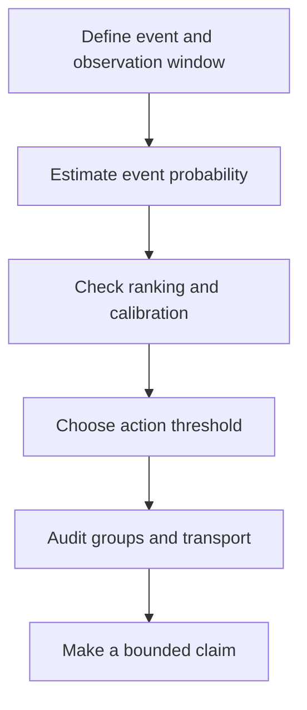
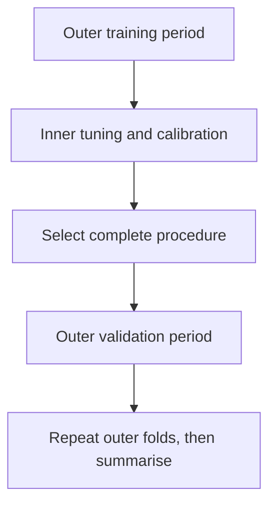
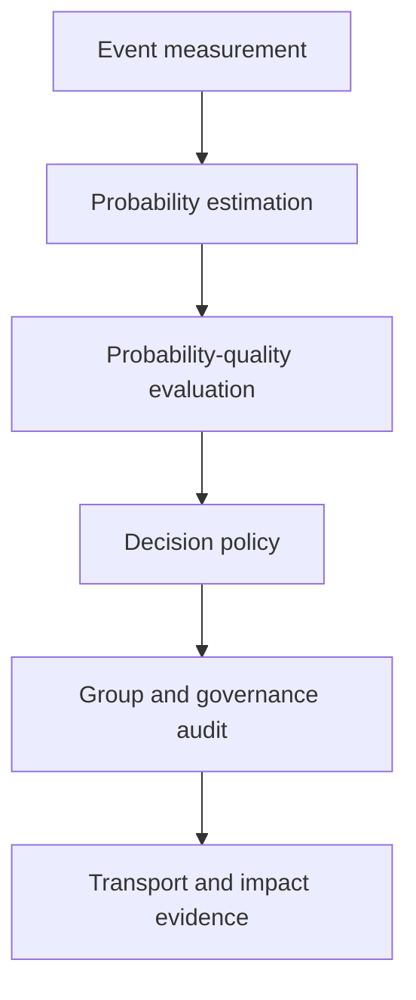

# Chapter 4 — From Probabilities to Accountable Decisions

## Level 4 Advanced Modeler: nine days of classification, ensembles, explanation, and external scrutiny

> **Central promise.** Chapter 3 taught you to design and audit a research-grade regression study. By the end of Chapter 4, you will be able to define a binary outcome without leaking the future, derive logistic regression from a Bernoulli likelihood, distinguish probability estimation from label assignment, evaluate discrimination and calibration with proper metrics, choose a decision threshold from consequences, handle class imbalance without corrupting evaluation, construct nonlinear and ensemble classifiers, tune them inside a valid resampling design, interrogate their predictions without making causal claims, audit group-level harms, and complete a locked temporal classification study.

The learner is still treated as a beginner. Classification introduces familiar-looking words—positive, accuracy, risk, importance—that can conceal precise mathematical choices. We will therefore construct each idea before calling a library.

The advanced-modeler mindset is not:

> “Use the model that wins the leaderboard.”

It is:

- define the event and observation window before fitting;
- estimate probabilities before turning them into actions;
- evaluate the probability, ranking, and decision layers separately;
- make consequences and capacity constraints explicit;
- treat tuning, calibration, and threshold selection as learned operations;
- explain the model that was actually fitted, on a stated output scale;
- report where errors and interventions fall across groups; and
- limit the claim to populations, periods, and mechanisms that were tested.

---

## Why the short advanced-regression draft needed a new role

The original draft contained useful introductions to splines, random forests, boosting, nearest neighbours, support-vector methods, tuning, and explanation. But it repeated continuous-outcome regression immediately after Chapter 3 and conflicted with Chapter 3's explicit handoff to classification.

It also compressed several technical distinctions into slogans.

1. **A classifier and a decision rule are separated.** A model can estimate a 0.23 event probability; a policy decides whether 0.23 triggers review.
2. **Accuracy is not a universal target.** It depends on prevalence and a threshold and can conceal costly minority-class failures.
3. **Gradient boosting classification does not simply fit ordinary residuals.** It follows negative gradients of a classification loss in function space.
4. **Tree support is implementation-specific.** Trees do not require scaling, but categorical and missing-value handling depend on the software and estimator.
5. **Calibration gets its own evidence boundary.** A calibrator trained on the same fitted probabilities it corrects can overfit.
6. **PDP does not literally hold every other feature fixed at one value.** It replaces a feature across rows and averages predictions, potentially creating implausible combinations.
7. **SHAP is not causal attribution.** Its baseline, background distribution, feature-dependence treatment, and output scale are part of the explanation.
8. **Fairness is not one metric.** Different definitions encode different moral and operational commitments and can conflict when base rates differ.

The chapter retains the draft's strongest advanced-modeling material, but uses it to answer the next coherent question: how do we estimate event risk and convert it into an accountable action?

## Prerequisite checkpoint

Before starting, retrieve these Chapter 2 and Chapter 3 ideas without notes:

- conditional expectation and residual;
- likelihood, log likelihood, gradient, and Hessian;
- train, validation, test, temporal CV, and nested CV;
- pipelines and leakage boundaries;
- ridge and lasso objectives;
- interactions, splines, and extrapolation;
- bootstrap uncertainty and subgroup evaluation;
- robust covariance versus robust fitting; and
- the difference between a prediction target, loss, metric, and scientific claim.

If the terms are recognisable but not explainable, return to the earlier exit checks. Classification reuses all of them.

## Learning outcomes

At the end of Chapter 4, you should be able to:

- define a binary event, index time, prediction time, observation window, and eligibility rule;
- explain why unknown or censored outcomes are not automatically negative labels;
- calculate prevalence and state why it is population- and time-dependent;
- move between probability, odds, and log odds;
- derive the Bernoulli likelihood and binary cross-entropy loss;
- derive the logistic-regression gradient and Hessian;
- implement regularised logistic regression with gradient descent;
- interpret a logistic coefficient as a conditional log-odds change and its exponential as an odds ratio;
- recognise complete and quasi-complete separation;
- distinguish discrimination, calibration, and decision utility;
- prove that Brier score and log loss are proper for a binary probability;
- construct a reliability table and interpret calibration intercept and slope;
- calibrate a classifier without same-data leakage;
- calculate every cell and common rate in a confusion matrix;
- derive a cost-based threshold from calibrated probabilities;
- explain ROC AUC as a ranking probability and precision–recall metrics as prevalence-sensitive;
- distinguish class weighting, resampling, threshold movement, and probability correction;
- formulate spline-logistic, K-nearest-neighbour, kernel SVM, softmax, and multilabel models;
- derive Gini impurity and weighted impurity reduction;
- explain bagging, feature subsampling, out-of-bag prediction, and forest correlation;
- derive pseudo-residuals for logistic gradient boosting;
- design early stopping and hyperparameter tuning inside temporal or grouped boundaries;
- distinguish permutation importance, PDP, ICE, ALE, and SHAP by their target and assumptions;
- calculate a Shapley value in a small feature game;
- distinguish demographic parity, equal opportunity, equalised odds, predictive parity, and group calibration;
- explain why a metric parity is neither a complete ethical theory nor evidence of causal fairness;
- separate internal, temporal, geographic, and prospective validation; and
- execute and report a locked classification benchmark with probability, ranking, threshold, calibration, and subgroup results.

## The nine-day route

| Day | Central idea | Problem resolved |
|---|---|---|
| [Day 21](#day-21--the-outcome-probability-and-prediction-contract) | Labels and probability | A binary column can hide timing, censoring, and policy choices |
| [Day 22](#day-22--logistic-regression-from-bernoulli-likelihood) | Logistic likelihood and optimisation | A linear score must become a valid probability |
| [Day 23](#day-23--proper-scoring-and-calibration) | Probability quality | Correct labels can coexist with misleading confidence |
| [Day 24](#day-24--thresholds-ranking-and-class-imbalance) | Decisions and consequences | A probability is not yet an action |
| [Day 25](#day-25--nonlinear-kernel-and-multiple-class-models) | Alternative decision surfaces | Linear log odds may omit curved or local structure |
| [Day 26](#day-26--classification-trees-and-random-forests) | Recursive partitioning and bagging | Interactions can be learned without enumerating them |
| [Day 27](#day-27--gradient-boosting-and-honest-tuning) | Functional gradients and search | Powerful ensembles invite adaptive overfitting |
| [Day 28](#day-28--interpreting-fitted-models-without-inventing-causes) | Global and local explanation | Opaque prediction needs bounded, assumption-aware inspection |
| [Day 29](#day-29--fairness-external-validation-and-the-locked-study) | Accountability and transport | Average internal performance is not deployment evidence |



---

## Running case: major cost-overrun review

We continue the fictional microhydro power (MHP) programme. At technical appraisal, a review team has limited capacity to inspect projects at high risk of a **major cost overrun**.

For this chapter:

- one row is one eligible project;
- the index time is technical appraisal;
- all predictors must be known at appraisal;
- the event is final constant-price cost exceeding 115% of the approved appraisal budget;
- the outcome window ends when final accounts are closed; and
- a positive prediction can trigger senior engineering review, not automatic project rejection.

The model estimates:

$$
p(x)=P(Y=1\mid X=x),
$$

where $Y=1$ denotes a major overrun. A later policy maps $p(x)$ to review or no review.

### Classification data extension

Save the Chapter 3 generator as `chapter3_data.py`, then save this file as `chapter4_data.py`.

```python
import numpy as np
import pandas as pd

from chapter3_data import make_mhp_practitioner_data


def make_mhp_overrun_data(n=900, seed=4040):
    """Create a fictional appraisal-time binary prediction study."""
    df = make_mhp_practitioner_data(n=n, seed=seed)
    rng = np.random.default_rng(seed + 1)

    # This budget is created from appraisal-time information only. It is not
    # derived from final cost, even though the final outcome is stored nearby.
    district_budget_adjustment = {
        "Chitral": 3.0,
        "Dir": 1.0,
        "Swat": 0.5,
        "Shangla": 2.0,
        "Kohistan": 3.5,
    }
    district_term = df["district"].map(district_budget_adjustment).to_numpy()

    appraisal_budget = (
        11.0
        + 0.032 * df["planned_capacity_kw"]
        + 0.000018 * df["planned_capacity_kw"] ** 2
        + 1.05 * df["estimated_cable_km"]
        + 0.68 * df["surveyed_route_km"]
        + 2.10 * df["terrain_index"]
        + district_term
        + 0.55 * (df["start_year"] - 2016)
        + rng.normal(0.0, 2.5, size=n)
    )
    df["appraisal_budget_2025_million_pkr"] = appraisal_budget

    df["major_cost_overrun"] = (
        df["actual_cost_2025_million_pkr"] > 1.15 * appraisal_budget
    ).astype(int)

    # Final-cost fields remain for teaching audits but are prohibited features.
    return df.sort_values(["start_year", "project_id"]).reset_index(drop=True)


if __name__ == "__main__":
    projects = make_mhp_overrun_data()
    projects.to_csv("mhp_overrun_chapter4.csv", index=False)
    print(projects.groupby("start_year")["major_cost_overrun"].agg(["size", "mean"]))
```

This is simulated teaching data, not evidence about actual projects or districts. A real label audit would require accounting expertise, consistent inflation adjustment, close-out dates, contract changes, and dispute-resolution rules.

## Minimal software setup

```bash
python -m pip install numpy pandas scipy matplotlib scikit-learn
```

Optional interpretation laboratories use:

```bash
python -m pip install shap
```

The executable capstone depends only on the first installation line. Record exact versions, seeds, and operating environment.

---

# Day 21 — The Outcome, Probability, and Prediction Contract

> **Today's central idea:** The hardest classification error can occur before modelling—when a convenient binary column is mistaken for a well-defined future event.

## 21.1 Classification has at least three layers

Suppose a model returns $p=0.27$ for one project.

1. **Outcome layer:** What event does $Y=1$ mean, and when is it observed?
2. **Probability layer:** How credible is the estimate $P(Y=1\mid X=x)=0.27$?
3. **Decision layer:** Under current costs and capacity, does 0.27 trigger review?

The same probability can support different actions in different settings. Collapsing these layers makes it impossible to tell whether a failure came from the label, model, or policy.

## 21.2 Binary does not mean simple

A defensible binary target specifies:

- **event:** final cost exceeds 115% of approved appraisal budget;
- **index time:** technical appraisal;
- **time horizon:** final account close or a stated maximum follow-up;
- **eligibility:** projects for which that event can be meaningfully assessed;
- **positive class:** coded 1;
- **negative class:** coded 0 only after adequate observation; and
- **competing outcomes:** cancellation, merger, or scope change handled explicitly.

If a project has not reached final accounting, its event status may be unknown. Coding every incomplete record as 0 gives older projects more opportunity to become positive and creates label leakage through follow-up time.

When event timing and censoring are central, survival analysis is more appropriate than forcing a fixed binary label. A later chapter should develop that framework.

## 21.3 Label construction is a measurement model

The event definition contains choices.

- Why 15% rather than 10%?
- Which budget revision counts as the denominator?
- Are inflation and currency changes removed consistently?
- Does approved scope expansion count as an overrun?
- Who finalises the account, and can that process differ by district?

Sensitivity to alternate definitions should be studied, but the primary label must be fixed before model comparison. Trying several definitions and retaining the easiest one to predict changes the research question.

## 21.4 Probability, odds, and log odds

For an event probability $0<p<1$, the odds are

$$
\operatorname{odds}=\frac{p}{1-p}.
$$

If $p=0.20$, the odds are $0.20/0.80=0.25$, or 1 to 4. Odds are not probabilities.

Recover probability from odds $o$:

$$
p=\frac{o}{1+o}.
$$

Log odds, or the logit, are

$$
\operatorname{logit}(p)=\log\left(\frac{p}{1-p}\right).
$$

Log odds range across all real numbers even though probabilities remain between 0 and 1. This makes them a useful scale for a linear predictor.

| Probability | Odds | Log odds |
|---:|---:|---:|
| 0.01 | 0.0101 | -4.595 |
| 0.20 | 0.25 | -1.386 |
| 0.50 | 1.00 | 0.000 |
| 0.80 | 4.00 | 1.386 |
| 0.99 | 99.00 | 4.595 |

## 21.5 Bernoulli outcomes

A Bernoulli random variable has

$$
Y\sim\operatorname{Bernoulli}(p),
\qquad Y\in\{0,1\}.
$$

Its probability mass function is

$$
P(Y=y)=p^y(1-p)^{1-y}.
$$

Check both possibilities:

- if $y=1$, the expression is $p$;
- if $y=0$, the expression is $1-p$.

The conditional mean and variance are

$$
\mathbb E[Y\mid X=x]=p(x),
$$

$$
\operatorname{Var}(Y\mid X=x)=p(x)(1-p(x)).
$$

Unlike homoskedastic linear regression, Bernoulli variance is determined by the conditional mean and is largest at $p=0.5$.

## 21.6 Prevalence is a property of a population and window

Sample prevalence is

$$
\hat\pi=\frac{1}{n}\sum_{i=1}^{n}y_i.
$$

It is the event fraction in a stated sample. It can change with:

- project mix;
- event threshold;
- time period;
- follow-up completeness;
- inclusion rules; and
- deliberate oversampling.

```python
from chapter4_data import make_mhp_overrun_data

df = make_mhp_overrun_data()
print("Overall prevalence:", df["major_cost_overrun"].mean())
print(
    df.groupby("start_year")["major_cost_overrun"]
    .agg(n="size", prevalence="mean")
)
print(
    df.groupby("access_mode")["major_cost_overrun"]
    .agg(n="size", prevalence="mean")
)
```

A case-control sample may intentionally contain 50% events even if deployment prevalence is 5%. Such a sample can support some association or ranking analyses, but its raw fitted probabilities and precision do not automatically transport to the population.

## 21.7 The probability baseline

A no-feature probability model predicts the training prevalence for every row:

$$
\hat p_i=\hat\pi_{train}.
$$

This is the maximum-likelihood constant Bernoulli model. It is the classification analogue of a mean baseline under squared loss.

For a later temporal fold, use the prevalence in earlier training years only. A full-dataset prevalence leaks future event frequency.

```python
import numpy as np


def prevalence_baseline(y_train, n_future):
    probability = float(np.mean(y_train))
    return np.full(n_future, probability)
```

Every probability model should beat a relevant constant baseline under the pre-specified proper score. A 90% accurate classifier in a 10% positive population may merely predict 0 for everyone.

## 21.8 Selection into the labelled sample

Let $S=1$ mean that a project appears with a resolved label. The model is trained on

$$
P(Y=1\mid X,S=1),
$$

but deployment may require

$$
P(Y=1\mid X).
$$

These differ if label resolution depends on outcome or predictors. Fast-closing, well-documented projects may be overrepresented. Before model fitting, compare eligible labelled and unlabelled projects on appraisal-time variables and follow-up.

This comparison cannot identify every selection mechanism, but it prevents a complete table from being mistaken for a representative one.

## 21.9 Day 21 build, break, and reflect

**Build**

1. Write the event, index time, horizon, eligibility, and unresolved-outcome policy.
2. calculate prevalence by year, district, and access mode with sample sizes.
3. construct a training-only prevalence baseline for each forward fold.
4. create a label sensitivity table at 10%, 15%, and 20% overrun without changing the primary definition.

**Break**

1. code unfinished projects as non-events.
2. define the event after comparing which label is easiest to predict.
3. use the post-construction material bill as a predictor.
4. report sample prevalence as a timeless project property.
5. call a 90% all-negative rule a strong model in a 10% event sample.

**Reflect**

Who can be harmed by a false positive review, a false negative missed overrun, or an unresolved outcome coded as negative? The label is already part of the intervention.

### Day 21 exit check

You are ready for logistic regression when you can move between probability and log odds, explain Bernoulli mean and variance, and defend every time boundary in the label.

---

# Day 22 — Logistic Regression from Bernoulli Likelihood

> **Today's central idea:** Logistic regression is a linear model for log odds, estimated by maximising a Bernoulli likelihood—not OLS applied to zeros and ones.

## 22.1 Why not fit a straight probability line?

The linear probability model

$$
P(Y=1\mid X=x)=x^\top\beta
$$

can predict below 0 or above 1 and imposes a constant probability change for a one-unit feature change. It can still be useful in some inferential settings, but it is not a naturally bounded probability model.

Logistic regression makes log odds linear:

$$
\log\left(\frac{p(x)}{1-p(x)}\right)=x^\top\beta.
$$

Apply the inverse logit:

$$
\boxed{
p(x)=\sigma(x^\top\beta)
=\frac{1}{1+e^{-x^\top\beta}}
}
$$

where $\sigma$ is the sigmoid function.

## 22.2 Sigmoid geometry

Let $z=x^\top\beta$. Then

$$
\sigma'(z)=\sigma(z)(1-\sigma(z)).
$$

The derivative is largest at $z=0$, where $p=0.5$, and approaches zero in the tails. A fixed log-odds change produces the largest absolute probability change near 0.5.

```python
import numpy as np
import matplotlib.pyplot as plt


def stable_sigmoid(z):
    z = np.asarray(z, dtype=float)
    result = np.empty_like(z)
    positive = z >= 0
    result[positive] = 1.0 / (1.0 + np.exp(-z[positive]))
    exp_z = np.exp(z[~positive])
    result[~positive] = exp_z / (1.0 + exp_z)
    return result


z = np.linspace(-8.0, 8.0, 400)
fig, ax = plt.subplots(figsize=(7.5, 4.5))
ax.plot(z, stable_sigmoid(z))
ax.axhline(0.5, color="black", linewidth=1, alpha=0.5)
ax.axvline(0.0, color="black", linewidth=1, alpha=0.5)
ax.set(xlabel="linear score z", ylabel="probability",
       title="The sigmoid maps every real score into (0, 1)")
ax.grid(alpha=0.25)
plt.tight_layout()
plt.show()
```

The branch implementation avoids overflow for very large positive or negative scores.

## 22.3 Constructing the likelihood

For independent observations with $p_i=\sigma(x_i^\top\beta)$,

$$
L(\beta)=\prod_{i=1}^{n}p_i^{y_i}(1-p_i)^{1-y_i}.
$$

Take logs:

$$
\ell(\beta)
=\sum_{i=1}^{n}
\left[y_i\log p_i+(1-y_i)\log(1-p_i)\right].
$$

Maximising log likelihood is equivalent to minimising average negative log likelihood, also called binary cross-entropy or log loss:

$$
J(\beta)
=-\frac1n\sum_{i=1}^{n}
\left[y_i\log p_i+(1-y_i)\log(1-p_i)\right].
$$

A confidently wrong probability receives a large penalty. If $y=1$, predicting 0.9 costs $-\log(0.9)\approx0.105$, while predicting 0.001 costs about 6.908.

## 22.4 Deriving the gradient

For one observation, write $z_i=x_i^\top\beta$ and $p_i=\sigma(z_i)$. The derivative of negative log likelihood with respect to $z_i$ is

$$
\frac{\partial J_i}{\partial z_i}=p_i-y_i.
$$

Because $\partial z_i/\partial\beta=x_i$,

$$
\nabla_\beta J
=\frac1nX^\top(p-y).
$$

This resembles the OLS gradient, but residual-like probability errors are weighted through the nonlinear link.

With an $L_2$ penalty on slopes but not the intercept,

$$
J_\lambda(\beta)=J(\beta)+\frac{\lambda}{2}\sum_{j=1}^{p}\beta_j^2,
$$

and

$$
\nabla J_\lambda
=\frac1nX^\top(p-y)+\lambda
\begin{bmatrix}
0\\
\beta_1\\
\vdots\\
\beta_p
\end{bmatrix}.
$$

Software packages use different loss normalisations and inverse-penalty parameters. In `scikit-learn`, smaller `C` means stronger regularisation. Do not copy `C` or $\lambda$ across packages without checking the objective.

## 22.5 Hessian, convexity, and IRLS

Define

$$
W=\operatorname{diag}(p_i(1-p_i)).
$$

The unpenalised Hessian is

$$
\nabla^2_\beta J=\frac1nX^\top WX.
$$

For any vector $v$,

$$
v^\top X^\top WXv
=(Xv)^\top W(Xv)\ge0,
$$

so the negative log likelihood is convex. A full-rank, nonseparated problem has a unique optimum. An $L_2$ penalty adds positive curvature to penalised directions.

Newton's update is

$$
\beta_{new}=\beta_{old}-H^{-1}\nabla J.
$$

For a generalized linear model this can be expressed as **iteratively reweighted least squares** (IRLS): calculate current probabilities and weights, form a working response, solve a weighted least-squares problem, and repeat. This is a computational connection, not a claim that a binary outcome has Gaussian errors.

## 22.6 Logistic regression from scratch

```python
import numpy as np


class LogisticRegressionFromScratch:
    def __init__(self, learning_rate=0.1, l2=0.0,
                 max_iter=50_000, tol=1e-9):
        self.learning_rate = float(learning_rate)
        self.l2 = float(l2)
        self.max_iter = int(max_iter)
        self.tol = float(tol)

    @staticmethod
    def _sigmoid(z):
        z = np.asarray(z, dtype=float)
        result = np.empty_like(z)
        positive = z >= 0
        result[positive] = 1.0 / (1.0 + np.exp(-z[positive]))
        exp_z = np.exp(z[~positive])
        result[~positive] = exp_z / (1.0 + exp_z)
        return result

    def fit(self, X, y):
        X = np.asarray(X, dtype=float)
        y = np.asarray(y, dtype=float)
        if set(np.unique(y)) - {0.0, 1.0}:
            raise ValueError("y must contain only 0 and 1")

        self.x_mean_ = X.mean(axis=0)
        self.x_scale_ = X.std(axis=0, ddof=0)
        self.x_scale_[self.x_scale_ == 0] = 1.0
        Z = (X - self.x_mean_) / self.x_scale_
        design = np.column_stack([np.ones(len(Z)), Z])

        beta = np.zeros(design.shape[1])
        previous_loss = np.inf

        for iteration in range(self.max_iter):
            probability = self._sigmoid(design @ beta)
            clipped = np.clip(probability, 1e-15, 1.0 - 1e-15)
            loss = -np.mean(
                y * np.log(clipped) + (1.0 - y) * np.log(1.0 - clipped)
            ) + 0.5 * self.l2 * np.sum(beta[1:] ** 2)

            penalty_gradient = np.r_[0.0, self.l2 * beta[1:]]
            gradient = design.T @ (probability - y) / len(y)
            gradient += penalty_gradient
            beta -= self.learning_rate * gradient

            if abs(previous_loss - loss) < self.tol:
                break
            previous_loss = loss

        self.n_iter_ = iteration + 1
        self.coef_standardized_ = beta[1:]
        self.coef_ = beta[1:] / self.x_scale_
        self.intercept_ = beta[0] - self.x_mean_ @ self.coef_
        self.loss_ = loss
        return self

    def predict_proba(self, X):
        X = np.asarray(X, dtype=float)
        positive = self._sigmoid(self.intercept_ + X @ self.coef_)
        return np.column_stack([1.0 - positive, positive])

    def predict(self, X, threshold=0.5):
        return (self.predict_proba(X)[:, 1] >= threshold).astype(int)
```

Verify the unpenalised implementation on a small, nonseparated dataset.

```python
import numpy as np
from sklearn.linear_model import LogisticRegression

rng = np.random.default_rng(422)
X_demo = rng.normal(size=(600, 3))
true_beta = np.array([0.8, -1.2, 0.5])
true_probability = stable_sigmoid(-0.4 + X_demo @ true_beta)
y_demo = rng.binomial(1, true_probability)

manual = LogisticRegressionFromScratch(
    learning_rate=0.2, l2=0.0, max_iter=100_000, tol=1e-12
).fit(X_demo, y_demo)
reference = LogisticRegression(C=1e12, max_iter=10_000).fit(X_demo, y_demo)

manual_probability = manual.predict_proba(X_demo)[:, 1]
reference_probability = reference.predict_proba(X_demo)[:, 1]
assert np.allclose(manual_probability, reference_probability, atol=5e-4)
print("iterations:", manual.n_iter_)
print("manual slopes:", manual.coef_)
print("library slopes:", reference.coef_[0])
```

For production work, use stable, tested solvers and inspect convergence warnings.

## 22.7 Interpreting coefficients and odds ratios

For

$$
\operatorname{logit}(p)=\beta_0+\beta_1x_1+\cdots+\beta_px_p,
$$

a one-unit increase in $x_j$, holding represented covariates fixed, changes log odds by $\beta_j$ and multiplies odds by

$$
\exp(\beta_j).
$$

If $\beta_j=0.4$, the conditional odds ratio is $e^{0.4}\approx1.49$. This is a 49% increase in odds, not a 49-percentage-point increase in probability and not necessarily a causal effect.

The probability change depends on the starting risk:

$$
\frac{\partial p}{\partial x_j}
=\beta_j p(1-p).
$$

Interactions and nonlinear terms make the derivative conditional on other feature values, just as in Chapter 3.

## 22.8 Complete separation

Suppose every project with road distance above 25 km is positive and every other project negative. A coefficient can grow without bound while the unpenalised likelihood keeps improving. This is **complete separation**. Quasi-complete separation leaves some boundary ties.

Symptoms include:

- huge coefficients or standard errors;
- failure to converge;
- fitted probabilities extremely near 0 and 1; and
- estimates that change dramatically under small perturbations.

Responses include:

- verify the data and feature timing;
- simplify or combine sparse categories when substantively justified;
- apply pre-specified regularisation;
- use a bias-reduced estimator for inference; and
- collect observations in the separated region.

Do not celebrate perfect training accuracy before investigating separation and leakage.

## 22.9 Regularisation and rare events

Logistic ridge, lasso, and elastic net have the same scaling and selection cautions as their regression counterparts. Regularisation can stabilise sparse categories and correlated features, but:

- a zero coefficient is not proof of irrelevance;
- ordinary post-selection intervals ignore the search;
- class weighting changes the fitted objective; and
- rare-event probability calibration still requires representative validation.

An intercept correction may be needed when training prevalence differs from deployment prevalence because of sampling. Simply assigning class weights and interpreting the resulting outputs as population probabilities is unsafe.

## 22.10 Research paper study: Nelder and Wedderburn (1972)

John Nelder and Robert Wedderburn's *Generalized Linear Models* unified several outcome distributions, variance functions, and link functions within one modelling framework and developed iterative weighted fitting.

Read with five questions.

1. **Unification.** How do random component, systematic component, and link function fit together?
2. **Binary case.** Which distribution and links are available for proportions or binary outcomes?
3. **Computation.** Why does iterative weighted least squares arise?
4. **Evidence.** How is deviance used to compare fitted structures?
5. **Boundary.** Which independence, mean-structure, and asymptotic assumptions remain?

### Replication task

Implement Newton–Raphson or IRLS for a two-feature logistic model. At every iteration record log likelihood, gradient norm, and smallest Hessian eigenvalue. Repeat under well-overlapped data, near separation, and $L_2$ regularisation.

## 22.11 Day 22 build, break, and reflect

**Build**

1. Derive the gradient without consulting the displayed result.
2. fit the from-scratch model and compare probabilities with `scikit-learn`.
3. convert three slopes into odds ratios and probability changes at risks 0.1, 0.5, and 0.9.
4. create a separated toy dataset and observe coefficient growth with and without regularisation.

**Break**

1. interpret an odds ratio of 1.5 as a 50-point risk increase.
2. ignore a convergence warning because training accuracy is perfect.
3. penalise unscaled predictors and compare coefficient magnitudes as importance.
4. use a final-account variable to achieve separation.
5. call an associational odds ratio causal without a causal design.

**Reflect**

Why might a stable, well-calibrated logistic model be preferable to a more accurate but opaque classifier for a high-stakes review process? State the decision context rather than appealing to simplicity alone.

### Day 22 exit check

You are ready for calibration when you can derive binary cross-entropy, its gradient, and its Hessian; interpret an odds ratio; and recognise separation.

---

# Day 23 — Proper Scoring and Calibration

> **Today's central idea:** A useful risk model must say how often events occur among cases assigned each probability—not merely place many cases on the correct side of 0.5.

## 23.1 Three evaluation targets

Consider two projects. One receives probability 0.51 and the other 0.99; both later overrun.

At threshold 0.5, both labels are correct. Yet the probability claims differ greatly. Classification evaluation should separate:

1. **Discrimination:** are higher-risk cases ranked above lower-risk cases?
2. **Calibration:** do stated probabilities match observed frequencies in a relevant population?
3. **Decision value:** do actions based on those probabilities improve outcomes under stated consequences?

No single metric fully answers all three.

## 23.2 What calibration means

Let $P=\hat p(X)$ be a model's predicted probability. Perfect calibration means

$$
P(Y=1\mid P=p)=p
$$

for predicted values with support.

Among many deployment-like projects assigned risk near 0.20, about 20% should experience the event. Calibration is population-specific. A model can be calibrated in one time period and miscalibrated after prevalence or conditional relationships shift.

Calibration is also weaker than correctness for an individual. An event either occurs or does not; the validity of a 0.20 forecast is assessed across comparable forecasts or through a proper scoring rule.

## 23.3 Brier score

For binary outcomes,

$$
\operatorname{Brier}
=\frac1n\sum_{i=1}^{n}(p_i-y_i)^2.
$$

Lower is better. It measures squared probability error and combines calibration and discrimination-related resolution.

### Why Brier score is proper

Suppose the true event probability is $q$ but a forecaster reports $p$. Expected squared loss is

$$
\mathbb E[(p-Y)^2]
=q(p-1)^2+(1-q)p^2.
$$

Expand:

$$
=p^2-2pq+q.
$$

Differentiate with respect to $p$:

$$
\frac{d}{dp}=2(p-q).
$$

The unique minimum is $p=q$. Truthful probability reporting minimises expected loss. This is what **strictly proper** means in the binary case.

## 23.4 Log loss

Average log loss is

$$
\operatorname{LogLoss}
=-\frac1n\sum_i
\left[y_i\log p_i+(1-y_i)\log(1-p_i)\right].
$$

It is also strictly proper. If the true event probability is $q$, expected loss for report $p$ is

$$
-q\log p-(1-q)\log(1-p).
$$

Its derivative is

$$
-\frac{q}{p}+\frac{1-q}{1-p}
=\frac{p-q}{p(1-p)},
$$

which is zero at $p=q$. The second derivative is positive on $(0,1)$.

Log loss penalises extreme mistakes more strongly than Brier score. That can be appropriate when unjustified certainty is dangerous, but it also makes label errors and tiny samples influential.

## 23.5 Compare probability forecasts directly

```python
import numpy as np
from sklearn.metrics import brier_score_loss, log_loss

y = np.array([1, 0, 1, 0])
moderate = np.array([0.70, 0.30, 0.65, 0.40])
overconfident = np.array([0.99, 0.01, 0.01, 0.99])

for name, probability in {
    "moderate": moderate,
    "overconfident": overconfident,
}.items():
    print(name, {
        "brier": brier_score_loss(y, probability),
        "log_loss": log_loss(y, probability),
        "accuracy_at_0.5": np.mean((probability >= 0.5) == y),
    })
```

The extreme wrong forecasts dominate log loss. Accuracy discards how confident the model was.

## 23.6 Reliability diagrams

A reliability diagram groups predicted probabilities and compares average prediction with event frequency in each group.

```python
import numpy as np
import pandas as pd


def reliability_table(y_true, probability, bins=10):
    frame = pd.DataFrame({
        "outcome": np.asarray(y_true, dtype=int),
        "probability": np.asarray(probability, dtype=float),
    })
    frame["bin"] = pd.cut(
        frame["probability"],
        bins=np.linspace(0.0, 1.0, bins + 1),
        include_lowest=True,
    )
    return (
        frame.groupby("bin", observed=True)
        .agg(
            n=("outcome", "size"),
            mean_probability=("probability", "mean"),
            event_rate=("outcome", "mean"),
        )
        .reset_index()
    )
```

Interpret with care.

- Empty bins contain no evidence.
- Small bins have wide uncertainty.
- Equal-width and equal-count bins answer slightly different descriptive questions.
- A line near the diagonal can change with binning.
- A reliability curve does not measure ranking quality.

Plot raw case distributions along the horizontal axis and include bin counts or uncertainty intervals.

## 23.7 Brier decomposition

If forecasts take $K$ distinct values—or if every forecast in bin $k$ is deliberately replaced by the bin mean $\bar p_k$—let:

- $n_k$ be bin size;
- $\bar p_k$ be mean forecast in bin $k$;
- $\bar y_k$ be event rate in bin $k$; and
- $\bar y$ be overall event rate.

the resulting binned Brier score decomposes as

$$
\operatorname{Brier}
=\underbrace{\frac1n\sum_k n_k(\bar p_k-\bar y_k)^2}_{\text{reliability}}
-\underbrace{\frac1n\sum_k n_k(\bar y_k-\bar y)^2}_{\text{resolution}}
+\underbrace{\bar y(1-\bar y)}_{\text{uncertainty}}.
$$

- **Reliability:** penalty for forecast–frequency disagreement.
- **Resolution:** reward for separating groups with event rates different from the overall rate.
- **Uncertainty:** irreducible variability associated with prevalence.

The original score of continuously varying $p_i$ is not generally identical to this binned score; within-bin forecast variation and association with outcomes can contribute extra terms. The numerical decomposition therefore depends on the grouping scheme. It is a diagnostic lens, not three invariant properties of a finite dataset.

## 23.8 Calibration intercept and slope

On an untouched validation sample, calculate the model logit

$$
z_i=\log\left(\frac{\hat p_i}{1-\hat p_i}\right).
$$

Fit the recalibration model

$$
\operatorname{logit}P(Y_i=1)=a+bz_i.
$$

Ideal values are:

- calibration intercept $a=0$; and
- calibration slope $b=1$.

Broad interpretations:

- $a<0$ often indicates probabilities are too high on average;
- $a>0$ often indicates they are too low on average;
- $b<1$ often indicates predictions are too extreme; and
- $b>1$ often indicates an under-dispersed risk range.

These estimates have uncertainty and can be unstable with few events. Fitting them on the training predictions is optimistically biased.

```python
import numpy as np
from sklearn.linear_model import LogisticRegression


def calibration_intercept_slope(y_true, probability):
    probability = np.clip(np.asarray(probability), 1e-6, 1.0 - 1e-6)
    logit = np.log(probability / (1.0 - probability)).reshape(-1, 1)
    # A very large C approximates an unpenalised calibration regression.
    model = LogisticRegression(C=1e12, max_iter=10_000)
    model.fit(logit, y_true)
    return float(model.intercept_[0]), float(model.coef_[0, 0])
```

Use this for validation diagnostics. Do not fit a recalibration map on the locked test and then report the recalibrated score on that same test.

## 23.9 Calibration methods

Two common post-hoc methods are:

### Sigmoid calibration

Fit a logistic mapping from an uncalibrated score $s$ to probability:

$$
P(Y=1\mid s)=\sigma(as+b).
$$

This is low-dimensional and relatively stable, but the sigmoid form can be wrong.

### Isotonic calibration

Fit a nondecreasing piecewise-constant mapping from score to observed event rate. It is more flexible and can overfit when calibration data contain few observations or events.

Both require scores for observations not used to fit the underlying model. Valid patterns include:

- a dedicated calibration period after model-training data;
- cross-fitted predictions within development data; or
- a nested calibration procedure inside every outer validation fold.

The final calibrated procedure must then be evaluated on untouched data.

```python
from sklearn.calibration import CalibratedClassifierCV
from sklearn.ensemble import RandomForestClassifier
from sklearn.model_selection import StratifiedKFold

inner_cv = StratifiedKFold(n_splits=5, shuffle=True, random_state=423)
calibrated_forest = CalibratedClassifierCV(
    estimator=RandomForestClassifier(
        n_estimators=500,
        min_samples_leaf=10,
        random_state=423,
        n_jobs=-1,
    ),
    method="sigmoid",
    cv=inner_cv,
)
```

For temporal deployment, replace random stratified folds with an order-respecting calibration design. The code above demonstrates the estimator interface, not the MHP time split.

## 23.10 Expected calibration error is not enough

Expected calibration error (ECE) averages absolute bin gaps:

$$
\operatorname{ECE}
=\sum_k\frac{n_k}{n}|\bar p_k-\bar y_k|.
$$

It is easy to communicate but depends heavily on bin boundaries, may conceal local miscalibration, and is not a strictly proper score for comparing probability forecasts. Report a proper score, a reliability display, and uncertainty rather than optimising ECE alone.

## 23.11 Research paper study: Niculescu-Mizil and Caruana (2005)

Alexandru Niculescu-Mizil and Rich Caruana's *Predicting Good Probabilities with Supervised Learning* empirically compared probability predictions from several learning algorithms and studied sigmoid and isotonic calibration.

Read with five questions.

1. **Distinction.** How do ranking performance and probability quality differ?
2. **Distortion.** Which characteristic probability distortions appear for margin methods, boosted trees, and naive Bayes?
3. **Calibration design.** Which data fit the base model and which fit the calibrator?
4. **Metric.** How are squared error, cross-entropy, and ROC performance used?
5. **Transfer.** Would the paper's random-split findings automatically hold under temporal prevalence shift?

### Replication task

Simulate a known nonlinear probability surface. Fit logistic regression, a decision tree, a random forest, and a boosted classifier. Compare log loss, Brier score, ROC AUC, and reliability plots before and after cross-fitted sigmoid and isotonic calibration. Repeat at sample sizes 300, 3,000, and 30,000.

## 23.12 Day 23 build, break, and reflect

**Build**

1. Prove Brier score and log loss are proper for a binary probability.
2. build reliability tables using equal-width and equal-count bins.
3. estimate calibration intercept and slope on each temporal validation year.
4. compare uncalibrated, sigmoid, and isotonic procedures inside development data.

**Break**

1. evaluate probabilities using accuracy alone.
2. fit and assess a calibrator on the same predictions.
3. declare perfect calibration from three tiny bins.
4. optimise ECE while omitting a proper score.
5. transport calibration across periods without checking prevalence or covariates.

**Reflect**

A model can have better ROC AUC and worse log loss than another. Which one should be used for risk communication? The answer depends on whether ranking or credible probabilities drive the decision.

### Day 23 exit check

You are ready for threshold decisions when you can distinguish discrimination from calibration, prove propriety of two scores, and design a leakage-free calibration step.

---

# Day 24 — Thresholds, Ranking, and Class Imbalance

> **Today's central idea:** A threshold is a policy parameter chosen from consequences, resources, and probability quality—not a natural property of a classifier.

## 24.1 From probability to action

Let $a=1$ mean “send to senior review.” A simple rule is

$$
a_i=\mathbb 1\{p_i\ge t\}.
$$

Changing $t$ changes who is reviewed without retraining the probability model. The default $t=0.5$ is rarely justified by operational consequences.

Keep three objects separate:

- fitted probability model;
- chosen threshold or allocation rule; and
- realised decision outcomes.

## 24.2 Confusion matrix

For positive event $Y=1$ and positive action $\hat Y=1$:

| | Event $Y=1$ | No event $Y=0$ |
|---|---:|---:|
| Predict/review $\hat Y=1$ | true positive (TP) | false positive (FP) |
| Predict/no review $\hat Y=0$ | false negative (FN) | true negative (TN) |

Common rates are:

$$
\text{sensitivity}=\text{recall}=\text{TPR}=\frac{TP}{TP+FN},
$$

$$
\text{specificity}=\text{TNR}=\frac{TN}{TN+FP},
$$

$$
\text{precision}=\text{PPV}=\frac{TP}{TP+FP},
$$

$$
\text{FPR}=\frac{FP}{FP+TN},
\qquad
\text{FNR}=\frac{FN}{FN+TP}.
$$

Accuracy is

$$
\frac{TP+TN}{n},
$$

and balanced accuracy is

$$
\frac12(\text{TPR}+\text{TNR}).
$$

Precision depends on prevalence as well as the score distributions. Sensitivity and specificity also need not transport if conditional distributions change.

## 24.3 Deriving a cost-based threshold

Assume calibrated event probability $p$ and two actions.

- Review costs $C_{FP}$ when no event would occur.
- Failing to review costs $C_{FN}$ when an event occurs.
- Correct-action costs are set to zero for this simplified derivation.

Expected cost of review is

$$
C_{review}(p)=C_{FP}(1-p).
$$

Expected cost of no review is

$$
C_{no\ review}(p)=C_{FN}p.
$$

Review when

$$
C_{FP}(1-p)\le C_{FN}p,
$$

which gives

$$
\boxed{
p\ge\frac{C_{FP}}{C_{FP}+C_{FN}}
}
$$

If a missed major overrun costs five times as much as an unnecessary review, the simplified threshold is $1/(1+5)\approx0.167$.

Real decisions can include review benefit, event severity, limited capacity, delay, project-specific costs, and downstream human behaviour. Then use an explicit expected-utility or constrained-allocation calculation rather than forcing everything into one constant threshold.

## 24.4 Threshold tables

```python
import numpy as np
import pandas as pd
from sklearn.metrics import confusion_matrix


def safe_ratio(numerator, denominator):
    return numerator / denominator if denominator else np.nan


def threshold_table(y_true, probability, thresholds, fp_cost=1.0, fn_cost=5.0):
    y_true = np.asarray(y_true, dtype=int)
    probability = np.asarray(probability, dtype=float)
    rows = []

    for threshold in thresholds:
        prediction = (probability >= threshold).astype(int)
        tn, fp, fn, tp = confusion_matrix(
            y_true, prediction, labels=[0, 1]
        ).ravel()
        rows.append({
            "threshold": threshold,
            "review_rate": prediction.mean(),
            "sensitivity": safe_ratio(tp, tp + fn),
            "specificity": safe_ratio(tn, tn + fp),
            "precision": safe_ratio(tp, tp + fp),
            "false_positive_rate": safe_ratio(fp, fp + tn),
            "cost_per_project": (fp_cost * fp + fn_cost * fn) / len(y_true),
        })
    return pd.DataFrame(rows)
```

Calculate this table on validation data. Selecting a threshold on the locked test spends the test.

## 24.5 $F_1$ and why it is not a cost function

The $F_1$ score is the harmonic mean of precision and recall:

$$
F_1=2\frac{\text{precision}\cdot\text{recall}}
{\text{precision}+\text{recall}}.
$$

It ignores true negatives and encodes a particular symmetric combination of precision and recall. It does not directly represent monetary cost, review capacity, calibrated probability quality, or event severity.

Use it only when that trade-off is substantively appropriate. “The data are imbalanced” is not enough justification.

## 24.6 ROC curves and AUC

For every threshold, plot:

- false-positive rate on the horizontal axis; and
- true-positive rate on the vertical axis.

The ROC curve describes ranking trade-offs across thresholds. Under standard treatment of ties, ROC AUC can be interpreted as the probability that a randomly chosen positive receives a higher score than a randomly chosen negative, plus half the tie probability.

ROC AUC:

- is threshold-free but not decision-free;
- measures ranking, not calibration;
- weights parts of the FPR range that may be operationally irrelevant; and
- can appear strong while precision is poor in a rare-event population.

A partial AUC or a decision-specific region may be more relevant when only low false-positive rates are feasible, but the region must be pre-specified.

## 24.7 Precision–recall curves

A precision–recall (PR) curve plots precision against recall as the threshold moves. Its no-skill precision baseline is approximately event prevalence.

PR curves focus attention on positive predictions and are often informative for rare events. But they are sensitive to prevalence: a model can have unchanged class-conditional ranking and lower precision in a population with rarer events.

Average precision summarises the curve using a weighted average of precision values across recall increments. It is not identical to every trapezoidal “PR AUC” implementation. State the calculation used.

```python
import matplotlib.pyplot as plt
from sklearn.metrics import (
    PrecisionRecallDisplay,
    RocCurveDisplay,
    average_precision_score,
    roc_auc_score,
)

print("ROC AUC:", roc_auc_score(y_valid, probability_valid))
print("Average precision:", average_precision_score(y_valid, probability_valid))

fig, axes = plt.subplots(1, 2, figsize=(10, 4.3))
RocCurveDisplay.from_predictions(y_valid, probability_valid, ax=axes[0])
PrecisionRecallDisplay.from_predictions(y_valid, probability_valid, ax=axes[1])
plt.tight_layout()
plt.show()
```

## 24.8 What class imbalance changes

Class imbalance is not itself a defect. It is a description of event frequency. It creates practical challenges:

- accuracy can be dominated by the majority class;
- probability and calibration estimates for rare events have high variance;
- random folds may contain too few events;
- extreme resampling can distort probability estimation; and
- decision costs may be asymmetric.

Responses must match the goal.

### Class weighting

Weighted loss gives some observations larger influence during fitting. This can improve ranking or minority recall, but it changes the fitted target. Raw outputs may no longer estimate population probabilities without correction and representative calibration.

### Oversampling and undersampling

Resampling changes the training distribution. Perform it inside each training fold only. Never oversample before splitting, because duplicates or synthetic points can contaminate validation.

### Synthetic minority oversampling

Methods such as SMOTE create synthetic minority points between neighbours. They can be implausible for mixed, constrained, temporal, or high-dimensional features. They do not create new independent event information.

### Threshold movement

If ranking and calibration are adequate, changing the decision threshold may address an asymmetric action problem without changing the probability model.

These methods are not interchangeable.

## 24.9 Capacity-constrained review

Suppose the team can review only 30 projects. A rank-based policy reviews the 30 largest probabilities. Its effective threshold changes with each cohort.

Evaluate:

- recall among the top $k$;
- event yield among reviewed projects;
- stability of the selected set;
- subgroup allocation; and
- whether probabilities remain useful for communicating risk.

Top-$k$ allocation is a policy. Do not report its performance as though a fixed threshold had been deployed.

## 24.10 Research paper study: Davis and Goadrich (2006)

Jesse Davis and Mark Goadrich's *The Relationship Between Precision-Recall and ROC Curves* develops the mathematical relationship between the two spaces and explains why visual impressions can differ under class imbalance.

Read with five questions.

1. **Mapping.** Which confusion-matrix quantities connect ROC and PR points?
2. **Dominance.** Under what condition does one curve dominate another in both spaces?
3. **Interpolation.** Why is linear interpolation in PR space generally inappropriate?
4. **Prevalence.** Where does the positive-class proportion enter the mapping?
5. **Decision.** Why does curve dominance still not select an operating threshold without consequences?

### Replication task

Generate fixed positive and negative score distributions. Change only the number of negative cases. Plot ROC and PR curves and calculate ROC AUC, average precision, and precision at a fixed recall. Explain which quantities change and why.

## 24.11 Day 24 build, break, and reflect

**Build**

1. Derive the simplified cost threshold.
2. produce a validation threshold table from 0.05 to 0.80.
3. compare accuracy, balanced accuracy, ROC AUC, average precision, and cost.
4. simulate a prevalence shift while holding class-conditional scores fixed.
5. formulate a top-$k$ review rule and audit who receives the scarce reviews.

**Break**

1. use 0.5 because it is the software default.
2. tune a threshold on the final test.
3. call ROC AUC a calibration metric.
4. oversample before splitting.
5. interpret weighted-classifier outputs as population probabilities without checking calibration.
6. optimise $F_1$ despite known asymmetric costs and capacity.

**Reflect**

Who should assign $C_{FP}$ and $C_{FN}$? An analyst can calculate consequences, but legitimate values require the people who operate, fund, and experience the decision.

### Day 24 exit check

You are ready for nonlinear classifiers when you can calculate every confusion-matrix rate, derive a decision threshold, and explain why ROC and PR summaries answer different questions.

---

# Day 25 — Nonlinear, Kernel, and Multiple-Class Models

> **Today's central idea:** Nonlinear classification changes the shape of the score surface. It does not remove the need for probability evaluation, scaling, validation, or a defensible decision rule.

## 25.1 Linear log odds can still produce nonlinear probability

Logistic regression with

$$
\operatorname{logit}(p)=\beta_0+\beta_1x
$$

already produces an S-shaped probability curve in $x$. “Nonlinear model” can therefore mean several different things:

- nonlinear probability induced by a link;
- nonlinear predictor terms such as $x^2$ or splines;
- nonlinear interactions among predictors; or
- an algorithm whose decision function is not linear in an explicit design.

Name the layer that is nonlinear.

## 25.2 Polynomial and interaction logistic regression

Add a centred square:

$$
\operatorname{logit}(p)
=\beta_0+\beta_1x_c+\beta_2x_c^2.
$$

The derivative of probability is

$$
\frac{\partial p}{\partial x}
=p(1-p)(\beta_1+2\beta_2x_c).
$$

The stationary locations on the probability scale occur where the log-odds derivative is zero, provided $0<p<1$. Interpretation still requires support, uncertainty, hierarchy, and a noncausal warning.

For an interaction,

$$
\operatorname{logit}(p)
=\beta_0+\beta_1x_1+\beta_2x_2+\beta_3x_1x_2.
$$

Then

$$
\frac{\partial p}{\partial x_1}
=p(1-p)(\beta_1+\beta_3x_2).
$$

An interaction on log odds also produces probability-scale interaction patterns that depend on baseline risk. Do not infer absence of probability interaction merely because $\beta_3=0$, or causal effect modification merely because it is nonzero.

## 25.3 Spline logistic models and GAMs

A spline-logistic model uses basis functions:

$$
\operatorname{logit}(p)
=\beta_0+sum_{m=1}^{M}\theta_mB_m(x).
$$

A generalized additive model (GAM) extends this to

$$
g(\mathbb E[Y\mid X])
=\beta_0+f_1(x_1)+\cdots+f_p(x_p),
$$

where $g$ is a link and each $f_j$ is a smooth function. For a binary logistic GAM, $g$ is the logit.

GAMs provide flexible marginal shapes while retaining additive structure. They do not automatically learn interactions; selected tensor-product or interaction smooths must be introduced and regularised deliberately.

```python
from sklearn.compose import ColumnTransformer
from sklearn.impute import SimpleImputer
from sklearn.linear_model import LogisticRegression
from sklearn.pipeline import Pipeline
from sklearn.preprocessing import OneHotEncoder, SplineTransformer, StandardScaler

smooth_columns = [
    "planned_capacity_kw",
    "estimated_cable_km",
    "road_distance_observed_km",
    "appraisal_budget_2025_million_pkr",
]
linear_columns = [
    "surveyed_route_km",
    "terrain_index",
    "contractor_experience_projects",
    "start_year",
]
categorical_columns = ["district", "access_mode"]

smooth_pipeline = Pipeline([
    ("impute", SimpleImputer(strategy="median")),
    ("spline", SplineTransformer(
        n_knots=5, degree=3, include_bias=False
    )),
    ("scale", StandardScaler()),
])
linear_pipeline = Pipeline([
    ("impute", SimpleImputer(strategy="median", add_indicator=True)),
    ("scale", StandardScaler()),
])
categorical_pipeline = Pipeline([
    ("impute", SimpleImputer(strategy="most_frequent")),
    ("one_hot", OneHotEncoder(handle_unknown="ignore", drop="first")),
])

spline_preprocessor = ColumnTransformer([
    ("smooth", smooth_pipeline, smooth_columns),
    ("linear", linear_pipeline, linear_columns),
    ("categorical", categorical_pipeline, categorical_columns),
])

spline_logistic = Pipeline([
    ("preprocess", spline_preprocessor),
    ("model", LogisticRegression(C=1.0, max_iter=10_000)),
])
```

Knot count, degree, penalty, and selected smooth features form a candidate procedure and must be tuned within development data. Curves should be plotted with data support and uncertainty. Splines can extrapolate poorly beyond boundary knots; “smooth” does not mean “scientifically safe.”

## 25.4 K-nearest-neighbour classification

For a query $x$, find its $k$ closest training points and estimate

$$
\hat p(x)=\frac{1}{k}\sum_{i\in N_k(x)}y_i,
$$

or use distance weights.

KNN makes local predictions without fitting global coefficients. Its assumptions are hidden in the distance:

- which features are included;
- how they are scaled;
- how categorical mismatches are represented;
- whether missingness is meaningful; and
- whether Euclidean closeness corresponds to comparable projects.

Small $k$ gives flexible, high-variance probabilities in increments of $1/k$. Large $k$ smooths toward the global prevalence.

### Curse of dimensionality

In high dimensions, data become sparse. To capture a fixed fraction of a unit hypercube's volume, a neighbourhood must extend far along each dimension. Distances can concentrate, making “nearest” and “far” less distinct.

KNN therefore requires scaling, feature discipline, adequate local density, and validation. It has no meaningful feature extrapolation beyond observed neighbours.

```python
from sklearn.neighbors import KNeighborsClassifier

knn = Pipeline([
    ("preprocess", spline_preprocessor),
    ("model", KNeighborsClassifier(n_neighbors=25, weights="distance")),
])
```

Using spline-expanded features for KNN is only illustrative; it changes the distance geometry. A dedicated KNN preprocessor would usually use scaled, carefully selected original features.

## 25.5 Support-vector classification

For labels $y_i\in\{-1,+1\}$ and score $f(x)=w^\top x+b$, a hard-margin support-vector machine seeks a separating hyperplane with large geometric margin. With overlap, soft-margin classification uses hinge loss:

$$
L_{hinge}(y,f)=\max(0,1-yf).
$$

A common primal objective is

$$
\frac12\lVert w\rVert_2^2
+C\sum_i\max(0,1-y_if(x_i)).
$$

- Small $C$ allows more margin violations and stronger regularisation.
- Large $C$ penalises violations heavily and can create a more complex boundary.

Only observations on or inside the margin contribute directly to the hinge-loss solution; these are support vectors.

## 25.6 The kernel idea

The dual solution depends on inner products between observations. Replace $x_i^\top x_j$ with a kernel $K(x_i,x_j)$ corresponding to an implicit feature space.

The radial-basis-function kernel is

$$
K(x,x')=\exp(-\gamma\lVert x-x'\rVert_2^2).
$$

- Large $\gamma$ makes similarity decay rapidly and permits local, wiggly boundaries.
- Small $\gamma$ makes similarity decay slowly and produces smoother boundaries.

Because distance drives the kernel, scaling is essential. Both $C$ and $\gamma$ require nested tuning. Kernel SVM training can become expensive as sample size grows.

SVM decision scores are margins, not probabilities. `SVC(probability=True)` fits an additional probability mapping through internal cross-validation and adds computational and calibration assumptions.

```python
from sklearn.svm import SVC

rbf_svc = Pipeline([
    ("preprocess", spline_preprocessor),
    ("model", SVC(
        kernel="rbf",
        C=2.0,
        gamma="scale",
        probability=True,
        random_state=425,
    )),
])
```

Again, use a purpose-built scaled representation rather than automatically feeding a spline expansion into an RBF kernel. This object merely shows where the estimator belongs.

## 25.7 Multiclass outcomes

Binary classification has two mutually exclusive classes. A multiclass outcome has $K>2$ mutually exclusive classes, such as final disposition:

- completed within tolerance;
- completed with major overrun;
- cancelled; or
- unresolved dispute.

Do not manufacture multiclass labels merely to avoid modelling time or competing risks. Each class must have a coherent observation process.

### Softmax regression

For class scores $z_k=x^\top\beta_k$, softmax probabilities are

$$
P(Y=k\mid x)
=\frac{e^{z_k}}{\sum_{j=1}^{K}e^{z_j}}.
$$

For numerical stability, subtract $\max_j z_j$ before exponentiating. Multiclass cross-entropy is

$$
-\sum_i\sum_{k=1}^{K}y_{ik}\log p_{ik}.
$$

One class score must be constrained or treated as a reference because adding the same constant to every score leaves probabilities unchanged.

Alternative decompositions include one-versus-rest and one-versus-one. Their probability outputs and calibration behaviour differ from joint multinomial softmax.

## 25.8 Macro, micro, and weighted summaries

For multiple classes:

- **macro average:** calculate a metric per class and average classes equally;
- **weighted macro average:** weight class metrics by support;
- **micro average:** pool decisions across all class–case pairs before calculating the metric.

These answer different questions. A micro score can conceal failure on a rare class; a macro score can let a class with ten examples contribute as much as one with ten thousand. Always report per-class support and results.

## 25.9 Multilabel outcomes and classifier chains

In multilabel classification, several labels can be true for one row—for example, geological risk, procurement delay, and community-access risk.

Independent one-versus-rest models ignore label dependence. A classifier chain predicts labels sequentially and uses earlier predicted labels as later features.

During training, feeding true upstream labels to downstream models can create train–deployment mismatch. Use out-of-fold upstream predictions when training later stages, and at deployment feed only available predictions. Chain order is a modelling choice and may change results.

This is the classification analogue of the draft's multi-output regression warning: never feed a true future outcome as though it were a prediction-time feature.

## 25.10 Comparing nonlinear candidates

No algorithm is “advanced” in isolation. Compare complete procedures on:

- proper probability score;
- calibration and ranking;
- threshold utility;
- subgroup stability;
- training and prediction cost;
- sensitivity to scaling and hyperparameters;
- feature support and extrapolation; and
- ease of monitoring and revision.

A spline-logistic model can outperform an RBF SVM when the signal is smooth and data are modest. KNN can be competitive in a low-dimensional, densely sampled region. Complex kernels can fail under shift. Empirical comparison needs a valid design, not a model hierarchy slogan.

## 25.11 Day 25 build, break, and reflect

**Build**

1. Fit linear and spline logistic models and plot supported probability curves.
2. compare KNN across $k$ and feature dimensions after training-only scaling.
3. draw the margin and support vectors for a two-dimensional SVM.
4. tune $C$ and $\gamma$ inside temporal validation.
5. calculate classwise, macro, and micro results for a multiclass simulation.

**Break**

1. call logistic probability nonlinear evidence of a nonlinear log-odds predictor.
2. fit KNN on kilometres, rupees, and a 1–5 index without scaling.
3. treat an SVM margin as a calibrated probability.
4. select a kernel using the locked test.
5. train a classifier chain with true future labels as downstream features.

**Reflect**

Which model assumption is easier to challenge with domain experts: an additive spline, a Euclidean neighbourhood, or an RBF similarity? Interpretability begins with the representation, not only with a post-hoc plot.

### Day 25 exit check

You are ready for trees when you can state the geometry imposed by splines, KNN, and RBF kernels and explain why their probability quality still needs separate validation.

---

# Day 26 — Classification Trees and Random Forests

> **Today's central idea:** Trees create locally constant probability estimates by recursively partitioning feature space. Forests stabilise those partitions through averaging and feature randomness.

## 26.1 A classification tree

At a node containing observations $S$, choose a feature and split point that produce child sets $S_L$ and $S_R$. Continue recursively until a stopping rule is reached.

In a binary leaf $L$, the unregularised event-probability estimate is

$$
\hat p_L=\frac{1}{|L|}\sum_{i\in L}y_i.
$$

Every query falling in that leaf receives the same estimate. Small leaves can produce extreme, high-variance probabilities.

## 26.2 Gini impurity

For class proportions $p_1,\ldots,p_K$ in a node,

$$
I_G=1-\sum_{k=1}^{K}p_k^2.
$$

For binary event proportion $p$,

$$
I_G=1-p^2-(1-p)^2=2p(1-p).
$$

It is zero in a pure node and largest at $p=0.5$.

One interpretation: if a row's class and a predicted class are independently drawn from the node distribution, Gini impurity is their mismatch probability.

## 26.3 Entropy and log loss

Entropy impurity is

$$
I_H=-\sum_{k=1}^{K}p_k\log p_k,
$$

with $0\log0$ defined as zero. It is also zero in a pure node and largest for a uniform class distribution.

Gini and entropy often choose similar splits but are not identical. The criterion is one hyperparameter among depth, minimum leaf size, feature availability, and pruning.

## 26.4 Weighted impurity decrease

For parent set $S$ and children $S_L,S_R$, split improvement is

$$
\Delta I
=I(S)
-\frac{|S_L|}{|S|}I(S_L)
-\frac{|S_R|}{|S|}I(S_R).
$$

Choose the candidate split with largest decrease, subject to constraints.

### Hand calculation

Suppose a parent has 10 projects: 4 events and 6 non-events. Its Gini impurity is

$$
1-0.4^2-0.6^2=0.48.
$$

A split produces:

- left: 4 projects, 3 events;
- right: 6 projects, 1 event.

Then

$$
I_L=1-0.75^2-0.25^2=0.375,
$$

$$
I_R=1-(1/6)^2-(5/6)^2\approx0.278.
$$

The weighted child impurity is

$$
0.4(0.375)+0.6(0.278)\approx0.317,
$$

so the decrease is about $0.48-0.317=0.163$.

## 26.5 A decision stump from scratch

This one-dimensional implementation searches all midpoint splits and returns leaf probabilities.

```python
import numpy as np


def gini(y):
    if len(y) == 0:
        return 0.0
    p = np.mean(y)
    return 2.0 * p * (1.0 - p)


class OneDimensionalStump:
    def fit(self, x, y):
        x = np.asarray(x, dtype=float)
        y = np.asarray(y, dtype=int)
        unique = np.unique(x)
        if len(unique) < 2:
            raise ValueError("x needs at least two distinct values")

        thresholds = (unique[:-1] + unique[1:]) / 2.0
        best = None
        for threshold in thresholds:
            left = x <= threshold
            right = ~left
            weighted = (
                left.mean() * gini(y[left])
                + right.mean() * gini(y[right])
            )
            if best is None or weighted < best[0]:
                best = (weighted, threshold, left)

        _, self.threshold_, left = best
        self.left_probability_ = y[left].mean()
        self.right_probability_ = y[~left].mean()
        return self

    def predict_proba(self, x):
        x = np.asarray(x, dtype=float)
        positive = np.where(
            x <= self.threshold_,
            self.left_probability_,
            self.right_probability_,
        )
        return np.column_stack([1.0 - positive, positive])
```

Test it against the hand example and inspect every candidate threshold rather than treating recursive partitioning as magic.

## 26.6 Tree complexity

Important controls include:

- `max_depth`: longest root-to-leaf path;
- `min_samples_leaf`: minimum observations in a leaf;
- `min_samples_split`: minimum observations required to consider splitting;
- `max_leaf_nodes`: direct leaf-count limit; and
- `ccp_alpha`: cost-complexity pruning strength.

A fully grown tree can memorise idiosyncrasies. Larger leaves often improve probability stability even if accuracy changes little. Select complexity inside validation and inspect leaf event counts.

## 26.7 What trees do and do not handle automatically

Trees are invariant to strictly monotone transformations of an individual numeric feature because split order is preserved. They do not need standardisation for that reason.

However:

- categorical support differs across libraries;
- one-hot encoding can change how a multi-level category is split;
- missing-value routing is estimator-specific;
- high-cardinality identifiers invite memorisation;
- rare categories create tiny leaves; and
- arbitrary integer coding can impose unintended order.

“Trees handle everything” is not a data contract.

## 26.8 Feature-space extrapolation

A tree predicts using the leaf reached by comparisons learned in the training range. Moving farther beyond the largest observed capacity often leaves the query in the same outer leaf, so the prediction becomes flat.

For regression trees, averaged leaf targets cannot exceed the training-target extrema. In binary classification, probabilities are averages of zero/one labels in leaves or ensembles, so the more relevant limitation is that risk cannot evolve through an unobserved feature region except by the already learned partition.

This is not automatically safer than linear extrapolation. It is a different unsupported behaviour.

## 26.9 Bagging

A deep tree has low bias but high sample variance. Bootstrap aggregating—bagging—fits $M$ trees on bootstrap samples and averages their probabilities:

$$
\hat p_{bag}(x)=\frac1M\sum_{m=1}^{M}\hat p_m(x).
$$

If individual predictions have variance $\sigma^2$ and pairwise correlation $\rho$, an idealised average has variance

$$
\operatorname{Var}(\bar f)
=\rho\sigma^2+\frac{1-\rho}{M}\sigma^2.
$$

Adding trees reduces the second term, but not the correlated component. Diversity matters.

## 26.10 Random forests

A random forest adds feature subsampling: at each split, only a random subset of predictors is considered. Strong predictors cannot dominate every tree, reducing correlation and allowing alternative structures to contribute.

Important parameters include:

- number of trees;
- number or fraction of candidate features per split;
- minimum leaf size;
- maximum depth;
- bootstrap sample size; and
- class weighting.

More trees mainly reduce Monte Carlo variation; they do not guarantee correction of bias, leakage, or miscalibration.

```python
from sklearn.ensemble import RandomForestClassifier

forest = RandomForestClassifier(
    n_estimators=600,
    max_features="sqrt",
    min_samples_leaf=12,
    bootstrap=True,
    oob_score=True,
    random_state=426,
    n_jobs=-1,
)
```

## 26.11 Out-of-bag prediction

A bootstrap sample of size $n$ contains about $1-e^{-1}\approx63.2\%$ distinct training observations on average. The rest are out of bag for that tree.

For each training row, average predictions only from trees whose bootstrap samples excluded it. These out-of-bag predictions can estimate internal performance and support diagnostics without a separate random validation split.

But OOB evaluation:

- assumes an exchangeability structure similar to ordinary bootstrap sampling;
- does not respect time automatically;
- can leak groups across trees; and
- does not replace an external or future test.

For MHP temporal deployment, forward validation remains primary.

## 26.12 Forest probability calibration

Forest probabilities average leaf proportions across trees. Minimum leaf size, class weighting, bootstrap design, and averaging all affect their spread. Good ranking does not guarantee calibrated risks.

Check log loss, Brier score, reliability, and calibration slope on untouched folds. If calibration is needed, include the calibrator and its data split in the candidate procedure.

## 26.13 Impurity importance is not enough

The sum of impurity decreases credited to a feature is fast but can favour variables with many potential split points or high cardinality. Correlated features can divide or mask credit.

Use held-out permutation importance and conditional reasoning in Day 28. No importance score establishes causality.

## 26.14 Research paper study: Breiman (2001)

Leo Breiman's *Random Forests* formalised forests of randomised tree predictors and related generalisation error to individual-tree strength and correlation.

Read with five questions.

1. **Definition.** What randomness generates a forest, and over what is prediction averaged?
2. **Bound.** How are strength and correlation connected to classification error?
3. **OOB evidence.** How are out-of-bag cases used for error and importance?
4. **Experiments.** Which baselines, datasets, and tuning choices are compared?
5. **Modern boundary.** Which probability-calibration, shift, fairness, and selection questions are outside the paper's central scope?

### Replication task

Generate noisy copies of one strong predictor. Compare forests with all features available at each split versus `max_features="sqrt"`. Across repeated samples, measure tree correlation, individual-tree accuracy, ensemble log loss, and ROC AUC.

## 26.15 Day 26 build, break, and reflect

**Build**

1. Calculate every candidate Gini split for a ten-row dataset.
2. compare a deep tree with increasing minimum leaf sizes.
3. plot validation log loss against number of forest trees and leaf size.
4. compare OOB estimates with forward validation and explain the mismatch.
5. audit the forest's reliability by year and access mode.

**Break**

1. allow leaves with one event and report 0 or 1 as certain risk.
2. assume every tree implementation handles strings and missing values natively.
3. rely on OOB performance for a future-year claim.
4. interpret impurity importance as causal influence.
5. add thousands of trees to repair systematic bias.

**Reflect**

When a forest outperforms logistic regression, which new structure did it exploit: thresholds, interactions, local effects, or leakage? Performance alone does not answer.

### Day 26 exit check

You are ready for boosting when you can derive impurity reduction, explain forest variance through tree correlation, and state why OOB evidence may not match deployment.

---

# Day 27 — Gradient Boosting and Honest Tuning

> **Today's central idea:** Gradient boosting performs stagewise optimisation in function space. Its flexibility makes the validation and search procedure part of the model.

## 27.1 Bagging and boosting solve different problems

Bagging fits unstable learners largely in parallel and averages them to reduce variance. Gradient boosting builds an additive model sequentially:

$$
F_M(x)=F_0(x)+\eta\sum_{m=1}^{M}h_m(x),
$$

where:

- $F_m$ is a raw score function;
- $h_m$ is a weak learner, often a shallow tree;
- $M$ is number of boosting stages; and
- $\eta$ is the learning rate.

Each stage approximates a descent direction for the chosen loss.

## 27.2 Gradient descent in function space

Ordinary gradient descent changes a finite parameter vector. Gradient boosting changes a function.

Given loss $L(y,F(x))$, calculate the negative gradient at current predictions:

$$
r_{im}
=-\left[
\frac{\partial L(y_i,F(x_i))}{\partial F(x_i)}
\right]_{F=F_{m-1}}.
$$

Fit weak learner $h_m(x)$ to these pseudo-residuals, then update:

$$
F_m(x)=F_{m-1}(x)+\eta h_m(x),
$$

possibly with a stage-specific line-search multiplier.

For squared-error regression, negative gradients are ordinary residuals. The draft's “fit residuals” description is therefore a special case, not the definition of boosting.

## 27.3 Logistic boosting pseudo-residuals

For binary classification, let $F(x)$ be log odds and

$$
p(x)=\sigma(F(x)).
$$

One-observation logistic loss is

$$
L(y,F)=-y\log p-(1-y)\log(1-p).
$$

As in Day 22,

$$
\frac{\partial L}{\partial F}=p-y.
$$

The negative gradient is therefore

$$
\boxed{r=y-p}.
$$

At each stage, a regression tree approximates the current probability errors as a function of $X$. Implementations can use second-order information and specialised leaf updates, but $y-p$ is the essential first-order direction.

## 27.4 Initial score

The constant score minimising binary log loss is the training log odds:

$$
F_0=\log\left(\frac{\hat\pi}{1-\hat\pi}\right).
$$

Its sigmoid is the training prevalence. Boosting therefore begins at the constant probability baseline and adds structure stage by stage.

```python
import numpy as np


def initial_log_odds(y):
    prevalence = np.clip(np.mean(y), 1e-12, 1.0 - 1e-12)
    return np.log(prevalence / (1.0 - prevalence))


def logistic_pseudo_residual(y, raw_score):
    probability = stable_sigmoid(raw_score)
    return np.asarray(y) - probability
```

## 27.5 Learning rate, depth, and stages interact

Key controls include:

- **learning rate $\eta$:** contribution of each new tree;
- **number of iterations $M$:** length of the additive expansion;
- **leaf count or depth:** interaction order and local complexity per tree;
- **minimum leaf size:** local sample support;
- **row subsampling:** stochastic-gradient diversity; and
- **feature subsampling or regularisation:** implementation-specific restraint.

A smaller learning rate usually requires more stages. Deep trees can learn high-order interactions quickly and overfit. There is no universally optimal range such as 0.01–0.1; ranges are starting hypotheses tied to a package, dataset, and budget.

## 27.6 Histogram gradient boosting

Histogram methods bin continuous feature values and search splits over bins rather than every unique value. This can greatly accelerate training and reduce memory.

`HistGradientBoostingClassifier` supports missing numeric values natively, but raw strings still require an appropriate categorical representation unless categorical support is configured with compatible encoded data. Read current software documentation for the exact version.

```python
from sklearn.ensemble import HistGradientBoostingClassifier

boosted = HistGradientBoostingClassifier(
    learning_rate=0.05,
    max_iter=400,
    max_leaf_nodes=15,
    min_samples_leaf=20,
    l2_regularization=1.0,
    early_stopping=False,
    random_state=427,
)
```

Libraries such as XGBoost, LightGBM, and CatBoost implement related but not identical algorithms, objectives, missing-value rules, categorical strategies, and regularisation. Brand names are not interchangeable scientific methods.

## 27.7 Early stopping is another validation operation

Early stopping chooses the effective number of boosting stages based on validation loss. If the estimator silently takes a random validation fraction, a temporal study can train on later rows and stop using earlier rows, violating chronology.

Valid options include:

- supply an order-respecting validation period when the API permits it;
- tune `max_iter` as a hyperparameter in outer temporal validation with internal early stopping disabled; or
- implement an expanding-window inner selection.

After selecting iteration count, refit according to a pre-specified rule. Reusing the locked test for early stopping makes it training data.

## 27.8 Grid, random, and sequential search

### Grid search

Evaluate every point in a specified Cartesian product. It is transparent but spends many trials varying unimportant dimensions and gives an illusion of coverage between grid points.

### Random search

Sample configurations from stated distributions. It often explores more distinct values in influential dimensions for the same budget. Log-uniform distributions are appropriate for many scale parameters.

### Bayesian or sequential optimisation

Build a surrogate of configuration performance and select promising future trials using an acquisition rule. It can use trial budget efficiently, but:

- the surrogate and acquisition function add assumptions;
- parallelism and noise matter;
- conditional search spaces complicate comparison;
- it can still overfit validation; and
- “Bayesian” does not make the final error estimate Bayesian or unbiased.

Record the search space, sampling distributions, seed, number of trials, failures, stopping rule, and every score—not only the winner.

## 27.9 Search distributions matter

Sampling `C` uniformly between 0.0001 and 1000 places almost all mass near large values. Sample its logarithm instead:

$$
\log_{10}C\sim\operatorname{Uniform}(-4,3).
$$

For tree depth, a small discrete set may be sensible. For learning rate, a log-uniform range is often more meaningful than a linear range. Domain and computational limits should bound the search.

```python
from scipy.stats import loguniform, randint, uniform
from sklearn.model_selection import RandomizedSearchCV, TimeSeriesSplit

parameter_distributions = {
    "model__learning_rate": loguniform(0.01, 0.3),
    "model__max_leaf_nodes": randint(4, 32),
    "model__min_samples_leaf": randint(10, 80),
    "model__l2_regularization": loguniform(1e-3, 30.0),
    "model__max_iter": randint(100, 700),
}

temporal_inner = TimeSeriesSplit(n_splits=4)
search = RandomizedSearchCV(
    estimator=boosting_pipeline,
    param_distributions=parameter_distributions,
    n_iter=40,
    scoring="neg_log_loss",
    cv=temporal_inner,
    random_state=427,
    n_jobs=-1,
    refit=True,
)
```

`TimeSeriesSplit` assumes rows are correctly ordered and uses row positions. For projects sharing years, a custom year-based splitter is safer so one calendar year is not divided between fit and validation.

The imported `uniform` is not used above; it is shown because linear distributions remain appropriate for some bounded fractions. Remove unused imports in production code.

## 27.10 Nested evaluation

When no separate locked test is available, nested validation estimates the performance of a selection procedure.



Every adaptive choice belongs inside the inner loop:

- preprocessing;
- feature selection;
- resampling;
- hyperparameters;
- early stopping;
- calibration method; and
- decision threshold, if threshold performance is evaluated.

The outer folds must match deployment structure. Random nested CV does not cure temporal or group mismatch.

## 27.11 Tuning budget is a source of unfair comparison

Comparing a default logistic model with a boosted model receiving 1,000 trials does not isolate algorithm quality. Search effort is part of the procedure.

Fair benchmarks report:

- candidate families;
- search spaces;
- number of trials;
- time and hardware budget;
- early-termination rules;
- failed configurations; and
- whether knowledge from other datasets shaped the search.

Compute-aware comparison can report both best performance and performance as a function of search time.

## 27.12 Statistical uncertainty after search

The winning validation score is the minimum of noisy estimates and is optimistically selected. A test or outer loop evaluates the selected procedure, but comparisons can still be uncertain.

Report:

- all outer-fold scores;
- paired differences on the same folds or test rows;
- uncertainty aligned with the sampling unit;
- number of tried procedures; and
- practical rather than merely numerical differences.

Do not run a significance test across hundreds of inner trials and treat the best-versus-second-best result as confirmatory.

## 27.13 Research paper study: Friedman (2001)

Jerome Friedman's *Greedy Function Approximation: A Gradient Boosting Machine* views stagewise additive modelling as numerical optimisation in function space and develops gradient boosting for several losses.

Read with five questions.

1. **Abstraction.** How does a parameter vector become a function estimate?
2. **Direction.** What role do negative gradients play for arbitrary differentiable loss?
3. **Base learner.** Why do small regression trees create useful interaction structures?
4. **Regularisation.** How do shrinkage and subsampling affect performance?
5. **Evidence.** Which simulated and empirical settings support the claims, and how was tuning performed?

### Replication task

Implement logistic boosting with one-dimensional stumps. Start at log prevalence, calculate $y-p$, fit a stump to pseudo-residuals, and update raw scores. Plot training and validation log loss over 500 stages for several learning rates.

## 27.14 Companion paper: Grinsztajn, Oyallon, and Varoquaux (2022)

*Why Do Tree-Based Models Still Outperform Deep Learning on Typical Tabular Data?* reports a large benchmark over medium-sized tabular datasets and investigates inductive biases such as robustness to uninformative features and irregular target functions.

Do not retain only the slogan “trees win tabular data.” Audit:

- dataset inclusion and size range;
- tuning budget and baselines;
- preprocessing;
- task and metric aggregation;
- compute accounting; and
- domains not represented by the benchmark.

### Replication task

Choose five open tabular classification datasets before seeing results. Give logistic regression, forest, boosting, and a small neural network equal tuning budgets. Publish every dataset-level result and a critical account of preprocessing and failed trials.

## 27.15 Day 27 build, break, and reflect

**Build**

1. Derive logistic pseudo-residuals.
2. implement a stump-based boosting loop.
3. compare learning-rate/iteration pairs under forward validation.
4. define log-scale and discrete search distributions before running them.
5. draw the exact inner and outer time boundaries for tuning, calibration, and thresholding.

**Break**

1. describe classification boosting as fitting ordinary target residuals without naming the loss.
2. let an estimator create a random early-stopping split in a temporal study.
3. tune hundreds of models and report the minimum inner score as final error.
4. compare algorithms using radically different search budgets without disclosure.
5. use the locked test to decide when boosting should stop.

**Reflect**

At what point does additional search cease to be a better model and become adaptation to one validation sample? A locked outer evaluation estimates the consequence; it does not erase the cost of a broad search.

### Day 27 exit check

You are ready for interpretation when you can derive $y-p$ as a negative gradient, place early stopping inside the validation boundary, and describe the complete search procedure rather than only its winning parameters.

---

# Day 28 — Interpreting Fitted Models Without Inventing Causes

> **Today's central idea:** An explanation method describes a fitted prediction under a chosen perturbation or reference. It does not reveal nature's causal mechanism.

## 28.1 Begin with the explanation question

“Explain the model” is underspecified. Ask:

- **Object:** one prediction, average model behaviour, or performance dependence?
- **Audience:** developer, project reviewer, policymaker, or affected community?
- **Scale:** probability, log odds, margin, loss, or action?
- **Reference:** compared with which observation or background distribution?
- **Scope:** this fitted model, this dataset, or the real-world outcome mechanism?
- **Use:** debugging, scientific understanding, contestability, or justification?

Different methods answer different questions. A local additive explanation cannot replace a global error audit, and neither establishes causality.

## 28.2 Intrinsic and post-hoc interpretability

An interpretable-by-design model exposes a constrained form, such as:

- logistic coefficients with pre-specified features;
- a sparse scorecard;
- a shallow tree;
- an additive shape model; or
- a monotonic constrained model.

Post-hoc methods interrogate a fitted model after training. They can be valuable, but their approximation and perturbation choices add another model layer.

Intrinsic form is not automatically truthful. A simple misspecified model can be easy to read and wrong. A post-hoc explanation is not automatically deceptive. Match fidelity, complexity, and claim to the use.

## 28.3 Coefficients are conditional model parameters

For a logistic model, $e^{\beta_j}$ is a conditional odds ratio per unit of $x_j$ under the represented specification. It is affected by:

- scaling and units;
- reference coding;
- interactions and nonlinear terms;
- regularisation;
- omitted variables;
- measurement error; and
- sampling design.

Coefficient magnitude is not a general feature-importance measure. A one-unit change in terrain and one million PKR change in budget are incomparable without a defined perturbation.

## 28.4 Permutation importance

Let $S(f,D)$ be a score for fitted model $f$ on held-out dataset $D$. Permute feature $j$ across rows to create $D_j^{perm}$. For a higher-is-better score,

$$
I_j^{perm}=S(f,D)-S(f,D_j^{perm}).
$$

For a loss, reverse the sign or report loss increase.

The question is:

> How much does this fitted model's held-out performance deteriorate when the information in this column is disrupted by this permutation scheme?

It is not:

> How much does this feature cause the outcome?

```python
import pandas as pd
from sklearn.inspection import permutation_importance

result = permutation_importance(
    fitted_model,
    X_validation,
    y_validation,
    scoring="neg_log_loss",
    n_repeats=40,
    random_state=428,
    n_jobs=-1,
)

importance = pd.DataFrame({
    "feature": X_validation.columns,
    "mean_score_decrease": result.importances_mean,
    "sd": result.importances_std,
}).sort_values("mean_score_decrease", ascending=False)
print(importance)
```

This direct feature-name alignment works when the fitted pipeline accepts those original columns. If importance is calculated after transformation, obtain transformed names from the fitted preprocessor.

## 28.5 Correlated-feature problem

If two features carry redundant information, permuting one may barely hurt because the other remains. Both can appear unimportant even though the pair is essential.

Unconditional permutation can also create impossible combinations, such as short surveyed route paired with extreme access mode. Options include:

- permuting correlated groups together;
- conditional permutation within plausible strata;
- reporting feature clusters rather than individual columns; and
- comparing performance after retraining without a feature, while recognising that this answers a different question.

Conditional permutation requires modelling a feature's conditional distribution and introduces additional assumptions.

## 28.6 Partial dependence

Partition features into focal $X_S$ and complement $X_C$. The partial dependence function is

$$
PD_S(x_S)=\mathbb E_{X_C}[f(x_S,X_C)].
$$

Empirically,

$$
\widehat{PD}_S(x_S)
=\frac1n\sum_{i=1}^{n}f(x_S,x_{iC}).
$$

For each grid value, replace the focal feature for every row, predict, and average. Other features retain their row-specific values; they are not all “held constant” at one common value.

```python
import matplotlib.pyplot as plt
from sklearn.inspection import PartialDependenceDisplay

PartialDependenceDisplay.from_estimator(
    fitted_model,
    X_validation,
    features=["planned_capacity_kw", "road_distance_observed_km"],
    kind="average",
    grid_resolution=40,
)
plt.tight_layout()
plt.show()
```

Specify whether the plotted response is class probability, decision function, or another output.

## 28.7 PDP and unsupported combinations

If planned capacity and appraisal budget are strongly related, replacing capacity with 850 kW while retaining a small-project budget creates off-support rows. The average then describes model behaviour on synthetic combinations that may never occur.

Before interpreting PDP:

- inspect joint support;
- restrict grids to observed ranges or meaningful quantiles;
- mark data density;
- compare with conditional methods; and
- avoid causal language.

A smooth plot can be a precise summary of an implausible intervention.

## 28.8 Individual conditional expectation

An ICE curve for row $i$ is

$$
ICE_i(x_S)=f(x_S,x_{iC}).
$$

PDP averages ICE curves. Plotting ICE reveals heterogeneity that the average can hide. Diverging curves suggest model interactions with other features.

```python
PartialDependenceDisplay.from_estimator(
    fitted_model,
    X_validation.sample(min(120, len(X_validation)), random_state=428),
    features=["planned_capacity_kw"],
    kind="both",
    subsample=120,
    random_state=428,
)
plt.tight_layout()
plt.show()
```

ICE is still a model perturbation. It does not make a within-row causal experiment.

## 28.9 Accumulated local effects

Accumulated local effects (ALE) divide a feature range into intervals, estimate local prediction differences while staying nearer observed joint combinations, then accumulate and centre those differences.

Conceptually, for a continuous feature $x_j$:

1. find rows whose observed $x_j$ lies in interval $k$;
2. predict each row at the interval's lower and upper boundaries;
3. average those local differences;
4. accumulate across intervals; and
5. centre the curve.

ALE often behaves better than PDP with correlated features, but depends on interval choice, local support, and a meaningful perturbation. Sparse regions remain uncertain.

## 28.10 Local surrogate explanations

A local surrogate samples or perturbs points around a query, obtains black-box predictions, weights points by proximity, and fits a simple model.

Its explanation depends on:

- neighbourhood definition;
- feature scaling;
- perturbation distribution;
- proximity kernel;
- surrogate family; and
- random seed.

Report local fidelity. A simple line that poorly approximates the model is not an explanation merely because it is readable.

## 28.11 Shapley values

In cooperative game theory, players form coalitions and receive a value $v(S)$. The Shapley value for feature $j$ is

$$
\phi_j
=\sum_{S\subseteq N\setminus\{j\}}
\frac{|S|!(M-|S|-1)!}{M!}
\left[v(S\cup\{j\})-v(S)\right],
$$

where $M$ is the number of features. It averages feature $j$'s marginal contribution over all orders in which features could join.

For additive SHAP explanations,

$$
f(x)=\phi_0+\sum_{j=1}^{M}\phi_j
$$

on the explainer's output scale, where $\phi_0$ is an expected or reference output determined by the background and formulation.

## 28.12 A two-feature Shapley calculation

Let players be budget $B$ and road access $R$. Define:

$$
v(\varnothing)=0.10,
\quad v(\{B\})=0.18,
\quad v(\{R\})=0.25,
\quad v(\{B,R\})=0.40.
$$

Budget's marginal contribution is:

- $0.18-0.10=0.08$ when it enters first;
- $0.40-0.25=0.15$ when it enters after road access.

With two players, average the two orders:

$$
\phi_B=\frac12(0.08+0.15)=0.115.
$$

For road access:

$$
\phi_R=\frac12[(0.25-0.10)+(0.40-0.18)]=0.185.
$$

Then

$$
0.10+0.115+0.185=0.40.
$$

The arithmetic is exact for the stated game. The difficult modelling question is how $v(S)$ is defined when a feature is “absent.”

## 28.13 Background and dependence choices

For tabular prediction, omitted-feature values must be integrated or conditioned over a background distribution. With dependent features, different choices answer different questions.

- **Interventional-style:** break some dependencies and ask how the model behaves under feature replacement.
- **Conditional-style:** average over feature values compatible with observed dependencies.

Neither is automatically causal. Conditional explanations can assign credit to a proxy because it predicts an omitted feature. Interventional explanations can create implausible combinations.

State:

- explainer algorithm;
- background sample and population;
- feature-dependence assumption;
- output scale;
- class explained; and
- approximation settings.

## 28.14 Probability versus log-odds explanation

Tree SHAP and other explainers may produce additive values on raw margin or log-odds scale rather than probability. On log odds,

$$
F(x)=\phi_0+\sum_j\phi_j,
\qquad p(x)=\sigma(F(x)).
$$

Individual log-odds contributions do not convert into independent probability-point contributions because the sigmoid is nonlinear. Always label the scale.

## 28.15 Explanation stability

An explanation can change under:

- a new random seed;
- a near-tied model;
- correlated-feature substitution;
- another background sample;
- a small row perturbation; or
- a later training period.

Measure stability when explanations affect decisions. Compare explanations across temporal folds, bootstrap fits, and plausible background definitions. Instability may be the most important explanation result.

## 28.16 Explanations can legitimise a bad system

A colourful local plot can distract from:

- an invalid label;
- excluded populations;
- poor calibration;
- discriminatory allocation;
- leakage;
- lack of recourse; or
- no evidence that the intervention helps.

Model explanation belongs after data, evaluation, and decision audits—not in place of them.

## 28.17 Research paper study: Lundberg and Lee (2017)

Scott Lundberg and Su-In Lee's *A Unified Approach to Interpreting Model Predictions* defines a class of additive feature-attribution methods and connects several explanation approaches through Shapley-based properties.

Read with five questions.

1. **Class.** What form defines an additive feature-attribution method?
2. **Properties.** How are local accuracy, missingness, and consistency stated?
3. **Uniqueness.** Under which formulation is the Shapley solution unique?
4. **Algorithms.** Which model-specific approximations improve computation?
5. **Boundary.** Which conclusions concern attribution axioms rather than causal truth, fairness, or human understanding?

### Replication task

Fit two equally accurate models that use correlated copies of the same signal differently. Compute permutation importance, PDP, and SHAP under two background samples. Report which conclusions are stable and which are artifacts of fitted representation or reference choice.

## 28.18 Day 28 build, break, and reflect

**Build**

1. write the object, audience, scale, reference, and use for an explanation request.
2. compare individual and grouped permutation importance for correlated features.
3. overlay PDP, ICE, data density, and an ALE curve.
4. calculate the two-feature Shapley example by both feature orders.
5. compare SHAP values on log-odds and probability outputs where supported.
6. repeat explanations across temporal folds.

**Break**

1. call permutation importance causal effect.
2. interpret a PDP through unsupported feature combinations.
3. describe SHAP baseline as “the global average” without specifying background or scale.
4. hide low local-surrogate fidelity.
5. use an explanation dashboard to excuse poor calibration or subgroup harm.

**Reflect**

What should an affected project team be allowed to contest: the input record, event definition, probability, threshold, explanation, or all five? Interpretability without contestability may provide comfort only to the model owner.

### Day 28 exit check

You are ready for the accountability study when you can define the perturbation behind each explanation, calculate a Shapley value, and state why predictive attribution is not causal attribution.

---

# Day 29 — Fairness, External Validation, and the Locked Study

> **Today's central idea:** A technically strong classifier is not deployment-ready until its errors, interventions, and evidence boundaries are examined across people, places, and time.

## 29.1 Fairness begins before a parity formula

Ask first:

- Is the prediction task itself legitimate?
- Is the event label measured consistently across groups?
- Does a positive action provide support or impose burden?
- Who is absent because labels or features are unavailable?
- Can a person or project contest the record and decision?
- Does the intervention improve the outcome?
- Which institution is accountable for errors?

A parity metric can diagnose one distributional property. It cannot answer these questions alone.

## 29.2 Protected and operational groups

Let $A$ denote a group attribute. It might be legally protected, ethically salient, geographically operational, or a proxy for unequal conditions.

Do not infer that dropping $A$ creates fairness. Other variables can proxy it, and historical labels can encode past allocation. Conversely, retaining $A$ for auditing does not require using it for prediction.

Document separately:

- features used by the model;
- attributes retained for auditing;
- attributes used by the decision policy; and
- legal or governance constraints on each.

## 29.3 Demographic parity

Demographic parity asks for equal positive-action rates:

$$
P(\hat Y=1\mid A=a)
=P(\hat Y=1\mid A=b).
$$

It can be relevant when the action is a scarce benefit or burden. It does not condition on the observed outcome and can conflict with other goals when event rates differ.

In the MHP case, equal review rates may or may not be appropriate. If review is supportive and risk differs because remote projects face structural barriers, equal rates could under-support one group. The policy meaning matters.

## 29.4 Equal opportunity and equalised odds

Equal opportunity asks for equal true-positive rates:

$$
P(\hat Y=1\mid Y=1,A=a)
=P(\hat Y=1\mid Y=1,A=b).
$$

Among projects that truly overrun, groups should have equal chance of receiving review.

Equalised odds additionally asks for equal false-positive rates:

$$
\hat Y \text{ is independent of } A \text{ given } Y.
$$

That means both TPR and FPR are equal across groups. These are properties of a thresholded action, not probability calibration.

## 29.5 Predictive parity and group calibration

Predictive parity asks for equal precision:

$$
P(Y=1\mid\hat Y=1,A=a)
=P(Y=1\mid\hat Y=1,A=b).
$$

Group calibration asks, roughly, that within each group, cases assigned risk $p$ experience events at rate $p$:

$$
P(Y=1\mid P=p,A=a)=p.
$$

These properties concern different conditionals. When base rates differ and prediction is imperfect, several desirable parity conditions cannot generally all hold simultaneously. Choosing a definition is a normative and operational decision, not metric shopping.

## 29.6 Measurement can manufacture a disparity

Suppose remote projects close accounts more slowly. If unresolved cases are coded negative, measured TPR and prevalence can differ even when true event processes do not. Fairness auditing therefore requires:

- label completeness by group;
- feature missingness by group;
- follow-up duration by group;
- measurement error and appeal outcomes; and
- subgroup sample sizes.

An algorithmic parity adjustment applied to a biased label can preserve or intensify the underlying harm.

## 29.7 Intersectional and small-group uncertainty

Average results for `access_mode` can hide variation within district, year, or contractor context. Intersectional audits are important, but slicing creates tiny samples and multiple-comparison risk.

Report:

- raw counts and confusion cells;
- uncertainty intervals or posterior distributions where justified;
- pre-specified versus exploratory groups;
- suppression rules for privacy; and
- a data-collection plan for underrepresented groups.

“Insufficient evidence” is not evidence of equality.

## 29.8 Internal, temporal, geographic, and prospective validation

| Validation type | What changes? | Claim supported |
|---|---|---|
| Internal random | sampled rows within one source | performance under approximate exchangeability |
| Internal grouped | whole known groups held out | transfer to comparable unseen groups under the grouping design |
| Temporal | later time period | performance after observed time shift in the same broad system |
| Geographic/external | independent sites or institutions | transport to represented external settings |
| Prospective | model fixed before future cases accrue | future workflow performance under actual data collection |
| Impact evaluation | decisions/interventions compared | effect of using the system, under a causal design |

A future-year test in the same five fictional districts is temporal validation, not broad external validation. A prospective prediction study still does not establish that acting on the model improves outcomes.

## 29.9 Dataset shift

Let training distribution be $P_{train}(X,Y)$ and deployment distribution $P_{deploy}(X,Y)$.

Common decompositions include:

- **covariate shift:** $P(X)$ changes while $P(Y\mid X)$ is assumed stable;
- **label shift:** $P(Y)$ changes while $P(X\mid Y)$ is assumed stable; and
- **concept or conditional shift:** $P(Y\mid X)$ changes.

These are assumptions, not labels a drift dashboard can prove from unlabeled deployment features alone. Monitor:

- feature distributions and missingness;
- predicted-risk distribution;
- event prevalence after labels mature;
- calibration and decision rates;
- subgroup metrics;
- data pipeline changes; and
- human override and appeal patterns.

## 29.10 The pre-specified Chapter 4 study

Freeze the following protocol before fitting candidates.

| Component | Choice |
|---|---|
| Unit | one eligible fictional MHP project |
| Prediction time | technical appraisal |
| Event | final cost $>115\%$ of approved appraisal budget |
| Development | start years through 2022 |
| Locked temporal test | start years 2023–2025 |
| Forward validation | validation years 2019–2022 |
| Primary metric | log loss, averaged equally across years |
| Secondary probability metric | Brier score |
| Ranking metrics | ROC AUC and average precision |
| Action | senior review if $p\ge1/6$ |
| Simplified costs | FP cost 1; FN cost 5 |
| Groups | access mode and district, with raw counts |
| Candidate families | prior, logistic, engineered logistic, forest, histogram boosting |
| Test use | one pre-specified evaluation after selection |

The $1/6$ threshold follows the simplified cost ratio. It is a teaching policy, not a real economic valuation.

## 29.11 End-to-end locked benchmark

The code assumes `chapter2_data.py`, `chapter3_data.py`, and `chapter4_data.py` have been saved from the three chapters.

```python
from pathlib import Path
import json
import platform

import numpy as np
import pandas as pd
import scipy
import sklearn
from sklearn.base import BaseEstimator, TransformerMixin, clone
from sklearn.compose import ColumnTransformer
from sklearn.dummy import DummyClassifier
from sklearn.ensemble import (
    HistGradientBoostingClassifier,
    RandomForestClassifier,
)
from sklearn.impute import SimpleImputer
from sklearn.linear_model import LogisticRegression
from sklearn.metrics import (
    average_precision_score,
    brier_score_loss,
    confusion_matrix,
    log_loss,
    roc_auc_score,
)
from sklearn.pipeline import Pipeline
from sklearn.preprocessing import OneHotEncoder, StandardScaler

from chapter4_data import make_mhp_overrun_data


TARGET = "major_cost_overrun"
VALIDATION_YEARS = [2019, 2020, 2021, 2022]
TEST_START_YEAR = 2023
FP_COST = 1.0
FN_COST = 5.0
REVIEW_THRESHOLD = FP_COST / (FP_COST + FN_COST)
RANDOM_SEED = 429


class ClassificationFeatureEngineer(BaseEstimator, TransformerMixin):
    """Appraisal-time nonlinear features with training-fold centres."""

    def fit(self, X, y=None):
        X = X.copy()
        self.capacity_center_ = float(X["planned_capacity_kw"].median())
        self.year_center_ = float(X["start_year"].median())
        return self

    def transform(self, X):
        X = X.copy()
        capacity_c = X["planned_capacity_kw"] - self.capacity_center_
        X["capacity_centered"] = capacity_c
        X["capacity_centered_squared"] = capacity_c**2
        X["year_centered"] = X["start_year"] - self.year_center_
        X["road_hinge_above_18_km"] = (
            X["road_distance_observed_km"] - 18.0
        ).clip(lower=0.0)
        X["cable_by_road"] = (
            X["estimated_cable_km"]
            * X["road_distance_observed_km"]
        )
        X["log_contractor_experience"] = np.log1p(
            X["contractor_experience_projects"]
        )
        X["budget_per_planned_kw"] = (
            X["appraisal_budget_2025_million_pkr"]
            / X["planned_capacity_kw"]
        )
        return X


RAW_NUMERIC = [
    "planned_capacity_kw",
    "estimated_cable_km",
    "road_distance_observed_km",
    "surveyed_route_km",
    "terrain_index",
    "contractor_experience_projects",
    "appraisal_budget_2025_million_pkr",
    "start_year",
]
ENGINEERED_NUMERIC = [
    "planned_capacity_kw",
    "capacity_centered",
    "capacity_centered_squared",
    "estimated_cable_km",
    "road_distance_observed_km",
    "road_hinge_above_18_km",
    "cable_by_road",
    "surveyed_route_km",
    "terrain_index",
    "log_contractor_experience",
    "appraisal_budget_2025_million_pkr",
    "budget_per_planned_kw",
    "year_centered",
]
CATEGORICAL = ["district", "access_mode"]


def make_preprocessor(numeric_columns):
    numeric = Pipeline([
        ("impute", SimpleImputer(strategy="median", add_indicator=True)),
        ("scale", StandardScaler()),
    ])
    categorical = Pipeline([
        ("impute", SimpleImputer(strategy="most_frequent")),
        ("one_hot", OneHotEncoder(
            handle_unknown="ignore",
            drop="first",
            sparse_output=False,
        )),
    ])
    return ColumnTransformer([
        ("numeric", numeric, numeric_columns),
        ("categorical", categorical, CATEGORICAL),
    ])


def raw_pipeline(model):
    return Pipeline([
        ("preprocess", make_preprocessor(RAW_NUMERIC)),
        ("model", model),
    ])


def engineered_pipeline(model):
    return Pipeline([
        ("features", ClassificationFeatureEngineer()),
        ("preprocess", make_preprocessor(ENGINEERED_NUMERIC)),
        ("model", model),
    ])


def make_candidates():
    candidates = {
        "historical_prior": Pipeline([
            ("model", DummyClassifier(strategy="prior")),
        ]),
    }

    for c_value in [0.1, 1.0, 10.0]:
        candidates[f"logistic_raw_C_{c_value:g}"] = raw_pipeline(
            LogisticRegression(C=c_value, max_iter=10_000)
        )

    for c_value in [0.1, 1.0]:
        candidates[f"logistic_engineered_C_{c_value:g}"] = engineered_pipeline(
            LogisticRegression(C=c_value, max_iter=10_000)
        )

    for leaf_size in [5, 15, 30]:
        candidates[f"forest_leaf_{leaf_size}"] = raw_pipeline(
            RandomForestClassifier(
                n_estimators=500,
                max_features="sqrt",
                min_samples_leaf=leaf_size,
                random_state=RANDOM_SEED,
                n_jobs=-1,
            )
        )

    for leaf_nodes, l2 in [(7, 1.0), (15, 1.0), (15, 10.0)]:
        name = f"histboost_leaves_{leaf_nodes}_l2_{l2:g}"
        candidates[name] = raw_pipeline(
            HistGradientBoostingClassifier(
                learning_rate=0.05,
                max_iter=350,
                max_leaf_nodes=leaf_nodes,
                min_samples_leaf=20,
                l2_regularization=l2,
                early_stopping=False,
                random_state=RANDOM_SEED,
            )
        )
    return candidates


def probability_metrics(y_true, probability):
    probability = np.clip(np.asarray(probability), 1e-12, 1.0 - 1e-12)
    return {
        "log_loss": float(log_loss(y_true, probability, labels=[0, 1])),
        "brier": float(brier_score_loss(y_true, probability)),
        "roc_auc": float(roc_auc_score(y_true, probability)),
        "average_precision": float(average_precision_score(y_true, probability)),
    }


def action_metrics(y_true, probability, threshold=REVIEW_THRESHOLD):
    y_true = np.asarray(y_true, dtype=int)
    action = (np.asarray(probability) >= threshold).astype(int)
    tn, fp, fn, tp = confusion_matrix(
        y_true, action, labels=[0, 1]
    ).ravel()

    def ratio(a, b):
        return float(a / b) if b else float("nan")

    return {
        "threshold": float(threshold),
        "n": int(len(y_true)),
        "tn": int(tn),
        "fp": int(fp),
        "fn": int(fn),
        "tp": int(tp),
        "review_rate": float(action.mean()),
        "sensitivity": ratio(tp, tp + fn),
        "specificity": ratio(tn, tn + fp),
        "precision": ratio(tp, tp + fp),
        "cost_per_project": float((FP_COST * fp + FN_COST * fn) / len(y_true)),
    }


def expanding_year_scores(data, candidates):
    rows = []
    X_all = data.drop(columns=[TARGET])
    y_all = data[TARGET]

    for year in VALIDATION_YEARS:
        train = data["start_year"] < year
        validation = data["start_year"] == year
        if y_all.loc[validation].nunique() != 2:
            raise ValueError(f"Validation year {year} lacks both classes")

        for name, procedure in candidates.items():
            fitted = clone(procedure).fit(X_all.loc[train], y_all.loc[train])
            probability = fitted.predict_proba(X_all.loc[validation])[:, 1]
            metrics = probability_metrics(y_all.loc[validation], probability)
            rows.append({
                "candidate": name,
                "validation_year": year,
                "n_validation": int(validation.sum()),
                "events": int(y_all.loc[validation].sum()),
                **metrics,
                "decision_cost": action_metrics(
                    y_all.loc[validation], probability
                )["cost_per_project"],
            })
    return pd.DataFrame(rows)


def select_candidate(scores):
    summary = (
        scores.groupby("candidate")
        .agg(
            mean_log_loss=("log_loss", "mean"),
            sd_log_loss=("log_loss", "std"),
            worst_log_loss=("log_loss", "max"),
            mean_brier=("brier", "mean"),
            mean_roc_auc=("roc_auc", "mean"),
            mean_average_precision=("average_precision", "mean"),
            mean_decision_cost=("decision_cost", "mean"),
        )
        .sort_values(["mean_log_loss", "worst_log_loss"])
    )
    return summary.index[0], summary


def subgroup_audit(frame, group_column):
    rows = []
    for group, part in frame.groupby(group_column, observed=True):
        probability = part["probability"].to_numpy()
        outcome = part[TARGET].to_numpy()
        rows.append({
            group_column: group,
            "prevalence": float(outcome.mean()),
            "mean_probability": float(probability.mean()),
            "brier": float(brier_score_loss(outcome, probability)),
            **action_metrics(outcome, probability),
        })
    return pd.DataFrame(rows)


def reliability_table(y_true, probability, bins=8):
    frame = pd.DataFrame({
        "outcome": np.asarray(y_true, dtype=int),
        "probability": np.asarray(probability, dtype=float),
    })
    frame["bin"] = pd.qcut(
        frame["probability"], q=bins, duplicates="drop"
    )
    return (
        frame.groupby("bin", observed=True)
        .agg(
            n=("outcome", "size"),
            events=("outcome", "sum"),
            mean_probability=("probability", "mean"),
            event_rate=("outcome", "mean"),
        )
        .reset_index()
        .assign(bin=lambda x: x["bin"].astype(str))
    )


def paired_log_loss_bootstrap(y_true, probability_a, probability_b,
                              repeats=5_000, seed=RANDOM_SEED):
    y_true = np.asarray(y_true, dtype=int)
    a = np.clip(np.asarray(probability_a), 1e-12, 1.0 - 1e-12)
    b = np.clip(np.asarray(probability_b), 1e-12, 1.0 - 1e-12)
    row_loss_a = -(y_true * np.log(a) + (1 - y_true) * np.log(1 - a))
    row_loss_b = -(y_true * np.log(b) + (1 - y_true) * np.log(1 - b))
    row_difference = row_loss_a - row_loss_b

    rng = np.random.default_rng(seed)
    samples = np.empty(repeats)
    for repeat in range(repeats):
        index = rng.integers(0, len(y_true), size=len(y_true))
        samples[repeat] = row_difference[index].mean()

    return {
        "estimate": float(row_difference.mean()),
        "interval_95": np.quantile(samples, [0.025, 0.975]).tolist(),
    }


def main():
    data = make_mhp_overrun_data(n=900, seed=4040)
    development = data[data["start_year"] < TEST_START_YEAR].copy()
    locked_test = data[data["start_year"] >= TEST_START_YEAR].copy()

    assert development["start_year"].max() < locked_test["start_year"].min()
    prohibited = {
        "actual_cost_2025_million_pkr",
        "final_material_bill_million_pkr",
        "road_distance_km",
        "extreme_logistics_event",
    }
    assert prohibited.isdisjoint(RAW_NUMERIC + CATEGORICAL)

    candidates = make_candidates()
    fold_scores = expanding_year_scores(development, candidates)
    selected_name, validation_summary = select_candidate(fold_scores)

    X_development = development.drop(columns=[TARGET])
    y_development = development[TARGET]
    X_test = locked_test.drop(columns=[TARGET])
    y_test = locked_test[TARGET]

    selected = clone(candidates[selected_name]).fit(X_development, y_development)
    test_probability = selected.predict_proba(X_test)[:, 1]
    test_probability_metrics = probability_metrics(y_test, test_probability)
    test_action_metrics = action_metrics(y_test, test_probability)

    reference_name = "logistic_raw_C_1"
    reference = clone(candidates[reference_name]).fit(X_development, y_development)
    reference_probability = reference.predict_proba(X_test)[:, 1]
    paired_difference = paired_log_loss_bootstrap(
        y_test, test_probability, reference_probability
    )

    predictions = locked_test[[
        "project_id",
        "start_year",
        "district",
        "access_mode",
        TARGET,
    ]].copy()
    predictions["probability"] = test_probability
    predictions["review"] = (test_probability >= REVIEW_THRESHOLD).astype(int)

    access_audit = subgroup_audit(predictions, "access_mode")
    district_audit = subgroup_audit(predictions, "district")
    calibration = reliability_table(y_test, test_probability)

    metadata = {
        "seed": RANDOM_SEED,
        "python": platform.python_version(),
        "numpy": np.__version__,
        "pandas": pd.__version__,
        "scipy": scipy.__version__,
        "scikit_learn": sklearn.__version__,
        "event_definition": "actual cost > 1.15 * appraisal budget",
        "development_rows": len(development),
        "test_rows": len(locked_test),
        "selected_candidate": selected_name,
        "reference_candidate": reference_name,
        "review_threshold": REVIEW_THRESHOLD,
        "test_probability_metrics": test_probability_metrics,
        "test_action_metrics": test_action_metrics,
        "selected_minus_reference_log_loss": paired_difference,
    }

    output = Path("chapter4_results")
    output.mkdir(exist_ok=True)
    fold_scores.to_csv(output / "validation_folds.csv", index=False)
    validation_summary.to_csv(output / "validation_summary.csv")
    predictions.to_csv(output / "locked_test_predictions.csv", index=False)
    access_audit.to_csv(output / "locked_test_access_audit.csv", index=False)
    district_audit.to_csv(output / "locked_test_district_audit.csv", index=False)
    calibration.to_csv(output / "locked_test_reliability.csv", index=False)
    (output / "run_metadata.json").write_text(
        json.dumps(metadata, indent=2), encoding="utf-8"
    )

    print("Selected candidate:", selected_name)
    print("Locked-test probability metrics:", test_probability_metrics)
    print("Locked-test action metrics:", test_action_metrics)
    print("Selected minus reference log loss:", paired_difference)
    print("\nAccess-mode audit:\n", access_audit.to_string(index=False))
    print("\nReliability table:\n", calibration.to_string(index=False))


if __name__ == "__main__":
    main()
```

## 29.12 Why this benchmark does not tune the threshold

The threshold is fixed from a pre-specified cost ratio. The primary model is selected by log loss, not by threshold accuracy. This preserves the distinction between probability estimation and action.

If costs were uncertain, the registered study could report a decision curve or sensitivity analysis across plausible ratios. It should not choose the ratio that makes the locked test look best.

## 29.13 Reading the subgroup table

For each group, compare:

- sample size and events;
- prevalence and mean predicted probability;
- Brier score;
- review rate;
- TPR and FPR;
- precision; and
- simplified cost.

Never compare rates without raw confusion counts. A group with two events can have TPR 0%, 50%, or 100% after one case changes.

Differences are diagnostic. They can reflect sample variation, prevalence, measurement, conditional model error, threshold effects, or structural inequity. A metric does not identify which mechanism produced it.

## 29.14 Performance-difference uncertainty

The paired bootstrap estimates the selected model's test log-loss difference from the raw logistic reference. Negative favours the selected model.

It resamples rows as if they were exchangeable. Projects may share year and district shocks, so the interval is descriptive. A research study should align resampling with its sampling units, collect more independent periods and locations, and display period-level differences.

## 29.15 Prospective deployment protocol

Before live use:

1. freeze code, environment, feature definitions, and threshold;
2. shadow-run without influencing decisions;
3. verify feature availability and latency;
4. record predictions before outcomes occur;
5. preserve human actions, overrides, and reasons;
6. wait for complete outcome windows;
7. assess probability, action, and subgroup metrics;
8. compare intended with actual workflow; and
9. decide whether an impact evaluation is ethically and operationally appropriate.

If decisions change outcomes, later labels reflect the deployed policy. Monitoring must distinguish model drift from intervention effects.

## 29.16 Research paper study: Hardt, Price, and Srebro (2016)

Moritz Hardt, Eric Price, and Nati Srebro's *Equality of Opportunity in Supervised Learning* formalises equalised-odds and equal-opportunity criteria and studies post-processing of learned predictors.

Read with five questions.

1. **Definition.** Which conditional independence expresses equalised odds?
2. **Relaxation.** How does equal opportunity differ?
3. **Construction.** How can group-specific randomised thresholds satisfy constraints?
4. **Trade-off.** What happens to predictive performance under the constraint?
5. **Boundary.** Which questions about label validity, structural injustice, individual fairness, and intervention legitimacy remain outside the criterion?

### Replication task

Simulate two groups with different base rates and overlapping score distributions. Compare one common threshold, group-specific thresholds for equal TPR, and a post-processed equalised-odds rule. Report calibration, precision, TPR, FPR, utility, and individual decision changes.

## 29.17 The final research report

Use this structure.

1. **Abstract:** event, population, prediction time, selection design, locked result, and main limitation.
2. **Label study:** source, observation window, unresolved outcomes, and group measurement audit.
3. **Prediction contract:** intended use, prohibited uses, feature timing, and action.
4. **Methods:** candidate procedures, folds, search budget, scores, threshold, and uncertainty.
5. **Validation results:** every candidate and year, not only the winner.
6. **Locked results:** probability, ranking, calibration, and action metrics.
7. **Subgroup audit:** counts, rates, uncertainty limits, and exploratory labels.
8. **Interpretation:** pre-specified global and local methods, scale, background, and stability.
9. **Transport:** temporal, geographic, workflow, and outcome-maturity limits.
10. **Governance:** human review, contestability, monitoring, incident response, and retraining rules.
11. **Reproducibility:** data version, code, environment, seeds, predictions, and deviations.
12. **Conclusion:** a bounded claim that does not turn prediction into cause or deployment into benefit.

### Bounded conclusion template

> Among eligible fictional MHP projects available through 2022, candidate A had the lowest pre-specified mean forward-validation log loss. After refitting, its 2023–2025 temporal-test log loss was L, Brier score B, ROC AUC R, and average precision P. At the registered review threshold T, sensitivity was S and review rate Q. Performance and action rates differed across access modes, with small group counts limiting precision. This supports further prospective evaluation within the represented workflow; it does not establish causal risk factors, fairness, benefit from review, or transport to new regions.

## 29.18 Day 29 build, break, and reflect

**Build**

1. state which fairness concept, if any, follows from the review policy.
2. audit label completeness and feature missingness before outcome rates.
3. run the benchmark once and preserve every prediction.
4. complete group tables with confusion counts and uncertainty.
5. write the prospective shadow protocol and contest process.

**Break**

1. drop group attributes and declare the model fair.
2. search fairness definitions and publish the one with the smallest disparity.
3. call temporal validation external validation across regions.
4. recalibrate or retune after viewing the locked test.
5. claim that predictive performance proves the review intervention helps.
6. hide small or poorly performing groups.

**Reflect**

If the model accurately predicts that structurally disadvantaged projects overrun, should the system deny them, review them, fund them differently, or change the process that creates overruns? Prediction cannot answer the policy question by itself.

### Day 29 exit check

You have completed Chapter 4 when you can defend the label, probability model, threshold, interpretation, subgroup effects, temporal evidence, and governance process as separate but connected parts of one study.

---

# Chapter 4 Synthesis

## One system, six evidence layers



An error at an earlier layer propagates forward. Perfect threshold optimisation cannot repair a biased event label. Beautiful calibration cannot legitimise a harmful action. Equal TPR on an internal test cannot prove transport to a new region. Research maturity means knowing which layer each result supports.

## Cumulative concept check

Answer without code.

1. Why is an unresolved outcome not automatically a negative class?
2. What changes when the event threshold moves from 15% to 10% over budget?
3. Convert probability 0.2 into odds and log odds.
4. Why is Bernoulli variance not constant?
5. Derive binary cross-entropy from the likelihood.
6. Why is logistic negative log likelihood convex?
7. What does $e^{\beta_j}$ mean, and what does it not mean?
8. How does complete separation affect maximum likelihood?
9. Can a model have excellent ROC AUC and poor calibration?
10. Why are Brier score and log loss proper?
11. Why can an ECE value change under different bin boundaries?
12. Which data may fit a probability calibrator?
13. Derive the threshold $C_{FP}/(C_{FP}+C_{FN})$.
14. Why does precision change with prevalence?
15. What ranking interpretation does ROC AUC have?
16. Why can class weighting damage raw probability interpretation?
17. Which distance assumptions does KNN make?
18. Why are SVM margins not automatically probabilities?
19. Derive Gini impurity for a binary node.
20. How does random feature selection reduce forest correlation?
21. Why are OOB estimates unsuitable for some temporal claims?
22. Derive $y-p$ as the logistic boosting pseudo-residual.
23. Why is early stopping a hyperparameter-selection operation?
24. What question does permutation importance answer?
25. Why can PDP create unsupported feature combinations?
26. Which choices define a SHAP game for dependent features?
27. Why is equal opportunity different from demographic parity?
28. Why can calibrated scores conflict with equalised odds when base rates differ?
29. What makes a validation study prospective?
30. Why does prospective prediction still not prove intervention benefit?

## Derivation workshop

Complete each derivation by hand, then verify with a small simulation.

1. Recover probability from log odds.
2. Derive Bernoulli mean and variance.
3. Derive logistic gradient $X^\top(p-y)/n$.
4. Derive Hessian $X^\top WX/n$ and prove positive semidefiniteness.
5. Derive the probability-scale derivative of a logistic coefficient.
6. Prove Brier score propriety.
7. Prove binary log-loss propriety.
8. Derive the binned Brier decomposition.
9. Derive the simplified cost threshold.
10. Express precision using prevalence, sensitivity, and specificity through Bayes' rule.
11. Derive binary Gini impurity $2p(1-p)$.
12. Derive the variance of an average of equicorrelated tree predictions.
13. Derive logistic boosting pseudo-residuals.
14. Calculate every coalition weight for a three-feature Shapley game.
15. Express equalised odds as conditional independence.

## Practical laboratories

### Laboratory A — label maturity

Simulate projects with varying close-out times. Compare a naive label that codes unfinished cases negative with a label observed after a fixed window. Plot prevalence and calibration by project age.

### Laboratory B — logistic optimisation

Compare gradient descent, Newton–Raphson, and a library solver under scaling, collinearity, and near separation. Record objective, gradient norm, and runtime.

### Laboratory C — probability quality

Construct two models with equal accuracy but different confidence. Compare Brier score, log loss, calibration intercept, calibration slope, and reliability curves.

### Laboratory D — prevalence shift

Hold $P(S\mid Y)$ fixed for score $S$ and alter prevalence. Recalculate precision, PR curve, calibration, and the cost-optimal action under stated assumptions.

### Laboratory E — nonlinear support

Fit spline logistic, KNN, RBF SVM, forest, and boosting to a two-dimensional probability surface. Evaluate inside and outside the training support.

### Laboratory F — forest correlation

Add redundant strong predictors and vary `max_features`. Measure individual-tree strength, pairwise prediction correlation, ensemble Brier score, and stability.

### Laboratory G — adaptive tuning

Tune 5, 50, and 500 configurations on pure-noise features. Compare best inner log loss, outer log loss, and independent-test log loss.

### Laboratory H — explanation disagreement

Fit near-tied models that use correlated features differently. Compare coefficients, impurity importance, permutation importance, PDP, ICE, ALE, and SHAP.

### Laboratory I — fairness trade-offs

Simulate groups with different prevalence. Apply one threshold, equal-TPR thresholds, equalised-odds post-processing, and equal review rates. Report every metric and decision change.

### Laboratory J — prospective shadow run

Design a mock registry that stores feature timestamp, model version, probability, threshold, action, override, outcome-maturity date, and final event. Demonstrate why reconstructing these fields later is unreliable.

## Formula sheet

| Concept | Formula | Purpose |
|---|---|---|
| Odds | $p/(1-p)$ | event-to-non-event ratio |
| Logit | $\log[p/(1-p)]$ | maps probability to real line |
| Sigmoid | $1/(1+e^{-z})$ | maps score to probability |
| Bernoulli mass | $p^y(1-p)^{1-y}$ | binary likelihood contribution |
| Bernoulli variance | $p(1-p)$ | conditional outcome variance |
| Binary log loss | $-[y\log p+(1-y)\log(1-p)]$ | proper probability loss |
| Logistic gradient | $X^\top(p-y)/n$ | first-order optimisation direction |
| Logistic Hessian | $X^\top WX/n$ | curvature, $W_{ii}=p_i(1-p_i)$ |
| Odds ratio | $e^{\beta_j}$ | conditional multiplicative odds change |
| Brier score | $n^{-1}\sum_i(p_i-y_i)^2$ | squared probability error |
| Calibration | $P(Y=1\mid P=p)=p$ | frequency validity of probabilities |
| Sensitivity | $TP/(TP+FN)$ | positive-event capture rate |
| Specificity | $TN/(TN+FP)$ | non-event rejection rate |
| Precision | $TP/(TP+FP)$ | event fraction among positive actions |
| Balanced accuracy | $(TPR+TNR)/2$ | equal-class average recall |
| $F_1$ | $2PR/(P+R)$ | harmonic precision–recall summary |
| Cost threshold | $C_{FP}/(C_{FP}+C_{FN})$ | simplified calibrated-probability action rule |
| Gini impurity | $1-\sum_kp_k^2$ | classification-node impurity |
| Split gain | $I_P-(n_LI_L+n_RI_R)/n_P$ | impurity reduction |
| Bagged probability | $M^{-1}\sum_m\hat p_m(x)$ | average across bootstrap learners |
| Average variance | $\rho\sigma^2+(1-\rho)\sigma^2/M$ | role of learner correlation |
| RBF kernel | $\exp(-\gamma\lVert x-x'\rVert_2^2)$ | local similarity in implicit feature space |
| Hinge loss | $\max(0,1-yf)$ | margin violation penalty |
| Softmax | $e^{z_k}/\sum_je^{z_j}$ | joint multiclass probabilities |
| Boosting update | $F_m=F_{m-1}+\eta h_m$ | stagewise additive fit |
| Logistic pseudo-residual | $y-p$ | negative gradient in score space |
| Permutation importance | $S(D)-S(D_j^{perm})$ | score dependence on disrupted feature |
| PDP | $\mathbb E_{X_C}[f(x_S,X_C)]$ | average prediction under feature replacement |
| Shapley value | weighted average of marginal coalition contributions | additive local attribution |
| Demographic parity | $\hat Y$ independent of $A$ | equal positive-action rate |
| Equalised odds | $\hat Y$ independent of $A$ given $Y$ | equal TPR and FPR |

Metric symbols such as $P$ and $R$ in the $F_1$ row mean precision and recall, not probability and a missingness indicator. Define notation locally in research writing.

## Glossary

**Action threshold**  
A rule converting a score or probability into a discrete action.

**Average precision**  
A weighted summary of precision across recall increments, sensitive to event prevalence.

**Bagging**  
Fitting learners to bootstrap samples and averaging their outputs.

**Balanced accuracy**  
The average of sensitivity and specificity in binary classification.

**Brier score**  
Mean squared error of binary probability forecasts.

**Calibration**  
Agreement between predicted probabilities and event frequencies in a stated population.

**Classifier chain**  
A multilabel procedure using earlier label predictions as later model features.

**Complete separation**  
A predictor combination that perfectly separates binary classes, causing unpenalised logistic estimates to diverge.

**Concept shift**  
A change in the conditional relationship $P(Y\mid X)$.

**Confusion matrix**  
Counts of true and false positive and negative threshold decisions.

**Covariate shift**  
A change in $P(X)$ under an assumption that $P(Y\mid X)$ remains stable.

**Demographic parity**  
Equality of positive-action rates across groups.

**Discrimination**  
The ability of a score to rank events above non-events.

**Early stopping**  
Choosing training length according to performance on validation data.

**Equal opportunity**  
Equality of true-positive rates across groups.

**Equalised odds**  
Equality of true-positive and false-positive rates across groups.

**Event horizon**  
The follow-up period during which a binary event is assessed.

**Gini impurity**  
A node-mixing measure equal to $1-\sum_kp_k^2$.

**Gradient boosting**  
Stagewise additive fitting along estimated negative loss gradients.

**ICE**  
Individual conditional expectation: a fitted prediction curve for one row as a focal feature is varied.

**Impact evaluation**  
A design estimating the causal effect of using an intervention or decision system.

**Index time**  
The moment at which eligibility, predictors, and prediction are anchored.

**Isotonic calibration**  
A flexible nondecreasing mapping from scores to probabilities.

**Label shift**  
A change in class prevalence under an assumption that $P(X\mid Y)$ remains stable.

**Log loss**  
Negative log likelihood of reported class probabilities.

**Log odds**  
The logarithm of event odds, ranging across the real line.

**Macro average**  
An equal-weight average of class-specific metrics.

**Multiclass**  
A task with more than two mutually exclusive outcome classes.

**Multilabel**  
A task in which several binary labels may be true for one row.

**Out of bag**  
Training rows excluded from a particular bootstrap sample and available for that learner's internal evaluation.

**Partial dependence**  
Average fitted response after setting focal features and averaging over complement-feature rows.

**Permutation importance**  
Held-out score deterioration after disrupting a feature through permutation.

**Precision**  
Event fraction among positive predictions or actions.

**Prevalence**  
Event fraction in a stated population, sample, and observation window.

**Proper scoring rule**  
A loss whose expected value is optimised by reporting the true probability distribution.

**Prospective validation**  
Evaluation on future cases after fixing the model and protocol in advance.

**Pseudo-residual**  
The negative loss gradient used as the target for a boosting stage.

**Random forest**  
An ensemble of bootstrap trees with random feature availability at splits.

**Recall**  
Another name for sensitivity or true-positive rate.

**Reliability diagram**  
A binned comparison of mean predicted probability with event frequency.

**ROC AUC**  
A threshold-free ranking summary over false-positive and true-positive rates.

**Sensitivity**  
The fraction of events assigned a positive action.

**SHAP**  
A family of additive feature-attribution methods based on Shapley-value ideas.

**Sigmoid calibration**  
A logistic mapping from an uncalibrated score to probability.

**Specificity**  
The fraction of non-events assigned a negative action.

**Support vector**  
An observation on or within the margin that contributes to an SVM solution.

## Research-paper reading ladder

| Paper | Read after | Central contribution | Replication focus |
|---|---|---|---|
| Nelder & Wedderburn (1972) | Day 22 | generalized linear model framework and iterative fitting | IRLS and separation |
| Brier (1950) | Day 23 | evaluation of probability forecasts | proper squared probability score |
| Niculescu-Mizil & Caruana (2005) | Day 23 | empirical comparison and post-hoc calibration | algorithm-specific probability distortion |
| Davis & Goadrich (2006) | Day 24 | mathematical ROC–PR relationship | prevalence change |
| Breiman (2001) | Day 26 | random forests, strength, correlation, and OOB analysis | correlated-tree averaging |
| Friedman (2001) | Day 27 | gradient boosting as function-space optimisation | logistic pseudo-residuals |
| Grinsztajn et al. (2022) | Day 27 extension | modern tabular benchmark and inductive-bias study | compute-equal model comparison |
| Lundberg & Lee (2017) | Day 28 | additive feature attribution and SHAP | background and dependence sensitivity |
| Hardt et al. (2016) | Day 29 | equal opportunity and equalised odds | parity–utility trade-offs |

### Seven-pass advanced reading method

1. **Question:** state the problem in one falsifiable sentence.
2. **Estimand:** identify the mathematical object being estimated or bounded.
3. **Algorithm:** reconstruct the procedure as pseudocode.
4. **Assumptions:** list sampling, model, optimisation, and measurement conditions.
5. **Evidence:** reproduce one theorem, simulation, or table.
6. **Stress test:** create a setting in which the method should fail.
7. **Transfer:** state which new data would be needed for the intended application.

## Capstone assessment rubric

| Dimension | Emerging | Competent | Research-ready for this level |
|---|---|---|---|
| Event definition | binary column accepted | event and positive class stated | index time, horizon, eligibility, censoring, and sensitivity are audited |
| Probability model | labels predicted | likelihood and pipeline understood | scoring, calibration, shift, and uncertainty are separated |
| Decision policy | threshold 0.5 | threshold validated | consequences, capacity, human action, and policy sensitivity are registered |
| Imbalance | accuracy reported | PR and class counts reported | weighting/resampling target changes and prevalence transport are explicit |
| Ensembles | defaults compared | complexity tuned honestly | loss gradients, learner correlation, support, and compute budget are analysed |
| Interpretation | importance plot shown | method target and scale stated | dependence, background, stability, fidelity, and noncausal scope are tested |
| Fairness | group averages shown | confusion rates and counts shown | measurement, metric conflict, uncertainty, intervention, and contestability are addressed |
| Validation | random split | temporal or grouped design | tuning, calibration, threshold, locked test, and external limits form one protocol |
| Reproducibility | seed listed | code and predictions saved | data/version provenance, all trials, deviations, and governance artifacts are preserved |

## Instructor and self-study notes

### Suggested daily rhythm

| Segment | Approximate time | Activity |
|---|---:|---|
| Retrieval | 15 minutes | answer the previous exit check |
| Event or decision scenario | 20 minutes | clarify what the model is for |
| Concept construction | 35 minutes | small numerical example |
| Derivation | 45 minutes | prove the day's central equation |
| Code laboratory | 55 minutes | implement and compare |
| Failure laboratory | 25 minutes | break a boundary or assumption |
| Paper reading | 25 minutes | reconstruct one claim |
| Reflection | 10 minutes | write a bounded conclusion |

### Frequent misconceptions to surface

- A binary target is not automatically fully observed.
- Odds are not probabilities.
- Logistic regression is linear on log odds, not probability.
- Accuracy is not probability quality.
- ROC AUC is not calibration.
- A 0.5 threshold is not neutral.
- Class weights do not create population probabilities by default.
- Trees need no scaling, but preprocessing still matters.
- Classification boosting follows loss gradients, not always ordinary residuals.
- More tuning increases selection opportunity.
- Permutation importance is not causal effect.
- PDP does not make a real intervention.
- SHAP values depend on background, dependence, and output scale.
- Dropping a protected attribute does not prove fairness.
- Temporal validation is not necessarily geographic validation.
- Predictive accuracy does not prove beneficial impact.

### Ethical and contextual discussion

In the fictional MHP case, review can be helpful, burdensome, or both. A false positive might delay approval; a false negative might leave a community facing an underfunded project. Historical overrun labels may reflect procurement systems, remoteness, political attention, or inconsistent accounting—not intrinsic project worth.

Discuss:

- whether review resources should follow risk, need, equal allocation, or structural disadvantage;
- whether a predicted overrun should increase funding rather than restrict approval;
- who may correct appraisal records;
- how local expertise enters or overrides the system;
- whether overrides are audited without punishing staff for appropriate judgment;
- how long an outcome remains unresolved; and
- who can stop deployment after a safety or fairness incident.

## Where Chapter 5 begins

Chapter 4 forced a fixed event window. Many research questions cannot be reduced safely to “event by date $T$.” Chapter 5 should develop time-to-event analysis:

- event time, censoring, truncation, and competing risks;
- risk sets and the Kaplan–Meier estimator;
- hazard, survival, and cumulative incidence;
- Cox proportional-hazards regression;
- time-varying covariates and landmark prediction;
- proportional-hazards diagnostics;
- survival forests and boosting;
- time-dependent discrimination and calibration;
- dynamic decision thresholds;
- external and prospective validation; and
- a registered censored-outcome study.

That chapter should also clarify when a causal question—“does review prevent overruns?”—requires a different design from predicting time to overrun.

## Final reflection

Classification is not the act of assigning zeros and ones. It is the construction of a chain:

> event $\rightarrow$ probability $\rightarrow$ evidence $\rightarrow$ action $\rightarrow$ consequence.

Every arrow contains assumptions and institutional choices. The advanced modeller's job is to make those choices visible enough to test, challenge, and revise.

---

# References and Further Reading

## Research papers discussed

- Breiman, L. (2001). [Random Forests](https://link.springer.com/article/10.1023/A%3A1010933404324). *Machine Learning, 45*, 5–32.
- Brier, G. W. (1950). [Verification of Forecasts Expressed in Terms of Probability](https://journals.ametsoc.org/view/journals/mwre/78/1/1520-0493_1950_078_0001_vofeit_2_0_co_2.xml). *Monthly Weather Review, 78*(1), 1–3.
- Davis, J., & Goadrich, M. (2006). [The Relationship Between Precision-Recall and ROC Curves](https://dl.acm.org/doi/10.1145/1143844.1143874). *Proceedings of the 23rd International Conference on Machine Learning*, 233–240.
- Friedman, J. H. (2001). [Greedy Function Approximation: A Gradient Boosting Machine](https://projecteuclid.org/journals/annals-of-statistics/volume-29/issue-5/Greedy-function-approximation-A-gradient-boosting-machine/10.1214/aos/1013203451.short). *The Annals of Statistics, 29*(5), 1189–1232.
- Grinsztajn, L., Oyallon, E., & Varoquaux, G. (2022). [Why Do Tree-Based Models Still Outperform Deep Learning on Typical Tabular Data?](https://proceedings.neurips.cc/paper_files/paper/2022/hash/0378c7692da36807bdec87ab043cdadc-Abstract-Datasets_and_Benchmarks.html). *Advances in Neural Information Processing Systems, 35*.
- Hardt, M., Price, E., & Srebro, N. (2016). [Equality of Opportunity in Supervised Learning](https://proceedings.neurips.cc/paper_files/paper/2016/hash/6a9659feb1216f14f7384ba499518b38-Abstract.html). *Advances in Neural Information Processing Systems, 29*.
- Lundberg, S. M., & Lee, S.-I. (2017). [A Unified Approach to Interpreting Model Predictions](https://papers.nips.cc/paper/7062-a-unified-approach-to-interpreting-model-predictions). *Advances in Neural Information Processing Systems, 30*.
- Nelder, J. A., & Wedderburn, R. W. M. (1972). [Generalized Linear Models](https://www.jstor.org/stable/2344614). *Journal of the Royal Statistical Society: Series A, 135*(3), 370–384.
- Niculescu-Mizil, A., & Caruana, R. (2005). [Predicting Good Probabilities with Supervised Learning](https://www.cs.cornell.edu/~alexn/papers/calibration.icml05.crc.rev3.pdf). *Proceedings of the 22nd International Conference on Machine Learning*, 625–632.

## Additional primary reading

- Apley, D. W., & Zhu, J. (2020). [Visualizing the Effects of Predictor Variables in Black Box Supervised Learning Models](https://doi.org/10.1111/rssb.12377). *Journal of the Royal Statistical Society: Series B, 82*(4), 1059–1086. Introduces accumulated local effects.
- Cox, D. R. (1958). [The Regression Analysis of Binary Sequences](https://www.jstor.org/stable/2983890). *Journal of the Royal Statistical Society: Series B, 20*(2), 215–242.
- Fawcett, T. (2006). [An Introduction to ROC Analysis](https://www.sciencedirect.com/science/article/pii/S016786550500303X). *Pattern Recognition Letters, 27*(8), 861–874.

## Official software documentation

- scikit-learn. [Generalized Linear Models and Logistic Regression](https://scikit-learn.org/stable/modules/linear_model.html#logistic-regression).
- scikit-learn. [Probability Calibration](https://scikit-learn.org/stable/modules/calibration.html).
- scikit-learn. [Classification Metrics](https://scikit-learn.org/stable/modules/model_evaluation.html#classification-metrics).
- scikit-learn. [Tuning the Decision Threshold](https://scikit-learn.org/stable/modules/classification_threshold.html).
- scikit-learn. [Nearest Neighbours](https://scikit-learn.org/stable/modules/neighbors.html) and [Support Vector Machines](https://scikit-learn.org/stable/modules/svm.html).
- scikit-learn. [Ensembles: Forests and Gradient Boosting](https://scikit-learn.org/stable/modules/ensemble.html).
- scikit-learn. [Permutation Feature Importance](https://scikit-learn.org/stable/modules/permutation_importance.html).
- scikit-learn. [Partial Dependence and ICE](https://scikit-learn.org/stable/modules/partial_dependence.html).
- SHAP. [Documentation](https://shap.readthedocs.io/).

## Recommended textbooks

- Barocas, S., Hardt, M., & Narayanan, A. *Fairness and Machine Learning*.
- Bishop, C. M., & Bishop, H. *Deep Learning: Foundations and Concepts*.
- Hastie, T., Tibshirani, R., & Friedman, J. *The Elements of Statistical Learning*.
- James, G., Witten, D., Hastie, T., Tibshirani, R., & Taylor, J. *An Introduction to Statistical Learning*.
- Molnar, C. *Interpretable Machine Learning*.
- Murphy, K. P. *Probabilistic Machine Learning: An Introduction*.
- Steyerberg, E. W. *Clinical Prediction Models*.

Use software documentation for current interfaces, textbooks for connected exposition, and primary papers for the claims and assumptions that originated the methods.
