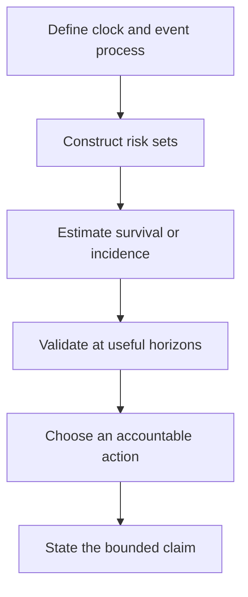
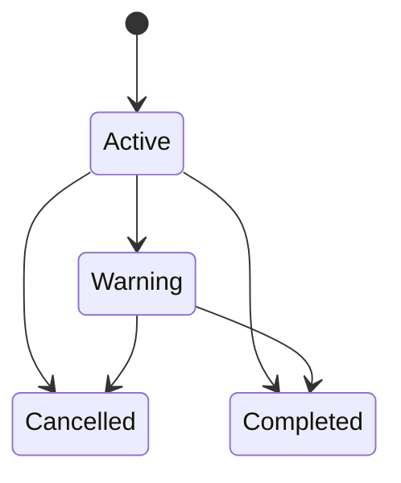
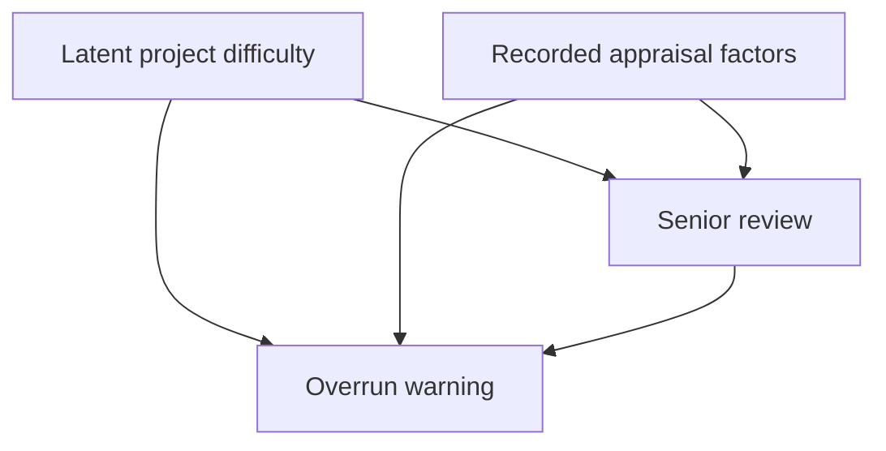
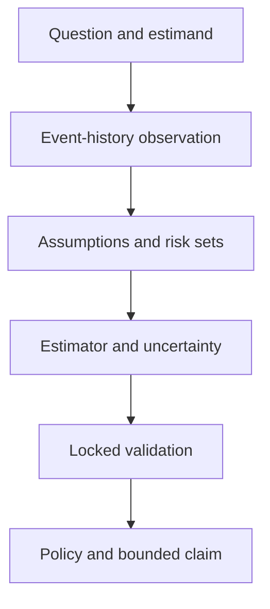

# Chapter 5 — From Event Labels to Event Histories

## Level 5 Research Apprentice: nine days of survival analysis, dynamic prediction, and registered evidence

> **Central promise.** Chapter 4 estimated whether an event would occur inside a fixed window. By the end of Chapter 5, you will be able to preserve the time information that a binary label discards: define a time origin and risk set, distinguish censoring from truncation and competing events, derive Kaplan–Meier and Cox estimators, diagnose proportional hazards, update predictions with newly available information, estimate cumulative incidence, evaluate censored predictions at clinically or operationally meaningful horizons, compare nonlinear survival models honestly, and execute a registered temporal study whose uncertainty and causal limits are explicit.

The learner is still treated as a beginner. Survival analysis has intimidating vocabulary because it was developed across medicine, engineering, demography, economics, and reliability theory. Underneath the vocabulary is a simple observation:

> For some subjects, we know that the event had not happened **up to** a time; we do not know that it would never happen.

Ordinary regression discards that partial information. Ordinary classification often mislabels it. Time-to-event methods use it.

The research-apprentice mindset is not:

> “Run a Cox model and report hazard ratios.”

It is:

- define the event, clock, eligibility rule, and estimand before opening the data;
- preserve who was genuinely at risk at every event time;
- explain why follow-up ended and whether that mechanism is ignorable;
- separate a cause-specific rate from an absolute event probability;
- check model assumptions rather than treating them as software defaults;
- evaluate predictions at decision-relevant horizons with censoring-aware metrics;
- update risk only with information available at the update time;
- validate across calendar time, geography, and workflow;
- distinguish prediction from intervention effects; and
- register the analysis before the locked data are inspected.

---

## Why the supplied draft needed a new role

The supplied Chapter 5 draft contained valuable research themes: parameter uncertainty, robust inference, causal diagrams, multilevel structure, Bayesian reasoning, and conformal prediction. Each deserves a full treatment. But placing them here as a short catalogue would break the book's progression. Chapter 4 ended with an explicit unresolved problem: projects have unequal follow-up, some have not yet failed, and cancellation can prevent the event of interest.

This revision therefore makes time-to-event analysis the chapter's spine. It retains the draft's intent in a more disciplined form:

1. **Uncertainty** appears in Greenwood intervals, coefficient covariance, bootstrap optimism, and prediction intervals.
2. **Causality** appears where prediction most often overreaches: a hazard association is not the effect of an intervention.
3. **Hierarchical structure** appears in clustered projects, shared frailty, and transport across districts.
4. **Bayesian reasoning** appears as an extension for regularisation and full predictive uncertainty, not as a one-paragraph slogan.
5. **Distribution-free prediction** is discussed with the additional assumptions censoring creates; ordinary split conformal cannot simply be copied onto unobserved event times.

The result is narrower in topic and deeper in competence. That is what a research apprenticeship requires.

## Prerequisite checkpoint

Before starting, retrieve these ideas from Chapters 2–4 without notes:

- random variable, conditional probability, density, expectation, and variance;
- likelihood, log likelihood, score, Hessian, and numerical optimisation;
- a binary event probability and a proper scoring rule;
- train, validation, locked test, temporal splitting, and leakage;
- regression coefficient versus causal effect;
- one-hot encoding, scaling, regularisation, interactions, and splines;
- bootstrap uncertainty and subgroup evaluation;
- calibration versus discrimination versus decision utility; and
- the difference between an outcome, model, metric, threshold, and claim.

If a term is recognisable but not explainable in your own words, revisit the relevant exit check. This chapter composes those ideas rather than replacing them.

## Learning outcomes

At the end of Chapter 5, you should be able to:

- write a time-to-event protocol specifying unit, origin, entry, event, competing events, horizon, and end of follow-up;
- distinguish right censoring, left censoring, interval censoring, and left truncation;
- state a conditional independent-censoring assumption and explain why it cannot be proven from observed data alone;
- construct a risk set by hand;
- move among density, survival, hazard, and cumulative hazard functions;
- derive the Kaplan–Meier product-limit estimator and Greenwood standard error;
- calculate a Nelson–Aalen cumulative hazard and a two-sample log-rank statistic;
- derive the Cox partial likelihood, score, and observed information;
- implement a penalised Cox model with Breslow handling of tied times;
- interpret a hazard ratio without translating it into a probability ratio or causal effect;
- estimate a baseline cumulative hazard and subject-specific survival curve;
- diagnose non-proportional hazards with plots, interactions with time, and Schoenfeld residuals;
- distinguish proportional-hazards and accelerated-failure-time interpretations;
- represent time-varying covariates in start–stop form without using future values;
- build a landmark prediction dataset and explain immortal-time bias;
- distinguish a cause-specific hazard, subdistribution hazard, cumulative incidence function, and multi-state transition probability;
- explain why censoring a competing event in Kaplan–Meier overstates its real-world cumulative incidence;
- compare survival trees, random survival forests, and boosting with regularised Cox models;
- calculate Harrell concordance and describe its censoring limitation;
- calculate an inverse-probability-of-censoring-weighted Brier score at a fixed horizon;
- construct a censoring-aware calibration table;
- separate internal, temporal, geographic, and prospective validation;
- choose a dynamic action threshold from horizon-specific consequences and capacity;
- write a registration for a censored-outcome prediction study; and
- explain why “does senior review prevent overruns?” requires a causal design rather than a prognostic Cox model.

## The nine-day route

| Day | Central idea | Problem resolved |
|---|---|---|
| [Day 30](#day-30--the-event-history-contract) | Event history and observation | A zero may mean “not yet observed,” not “never” |
| [Day 31](#day-31--survival-hazard-and-kaplanmeier) | Risk sets and nonparametric estimation | Unequal follow-up can still contribute evidence |
| [Day 32](#day-32--cox-regression-from-partial-likelihood) | Relative hazards | Covariates can alter event rates without specifying baseline shape |
| [Day 33](#day-33--assumptions-diagnostics-and-alternative-time-scales) | Model criticism | A hazard ratio need not remain constant over time |
| [Day 34](#day-34--time-varying-information-and-dynamic-prediction) | Updated information | Baseline prediction becomes stale during follow-up |
| [Day 35](#day-35--competing-risks-and-multi-state-processes) | Multiple event types | Another event can prevent the event of interest |
| [Day 36](#day-36--nonlinear-and-hierarchical-survival-models) | Flexible structure | Linear log hazards may omit interactions and group dependence |
| [Day 37](#day-37--censoring-aware-evaluation-and-decisions) | Prediction quality | Ordinary classification metrics mishandle unknown outcomes |
| [Day 38](#day-38--the-registered-locked-study-and-causal-boundary) | Research discipline | Adaptive analysis and causal overclaiming can invalidate a study |



---

## Running case: when will a project first trigger an overrun warning?

We continue the fictional microhydro power (MHP) programme. Chapter 4 predicted whether final constant-price cost would exceed 115% of the appraisal budget. That required completed final accounts. Chapter 5 asks a different operational question at technical appraisal:

> What is the probability that a project will first trigger a formally documented major-overrun warning by 12, 24, or 36 months?

For this chapter:

- one unit is one eligible project;
- time zero is approval at technical appraisal;
- the event of interest is the first formal forecast that completion cost will exceed 115% of the approved appraisal budget;
- project cancellation is a competing event because a cancelled project cannot later trigger the warning under this definition;
- administrative database closure and loss to follow-up are censoring events;
- baseline predictors must be available at appraisal;
- a 12-month progress measure may update a prediction only among projects still under observation and event-free at month 12; and
- a high predicted incidence may trigger senior review, not automatic cancellation.

The estimand must name both event type and horizon. “Risk” alone is incomplete.

### Event-history data extension

Save the Chapter 4 generator as `chapter4_data.py`, then save this extension as `chapter5_data.py`.

```python
import numpy as np
import pandas as pd

from chapter4_data import make_mhp_overrun_data


def make_mhp_survival_data(n=1200, seed=5050):
    """Create a fictional censored, competing-risks project cohort.

    Times are months from appraisal. The relationships are educational and
    must not be interpreted as evidence about real projects or districts.
    """
    df = make_mhp_overrun_data(n=n, seed=seed)
    rng = np.random.default_rng(seed + 1)

    def z(series):
        values = np.asarray(series, dtype=float)
        return (values - values.mean()) / values.std(ddof=0)

    remote = (df["access_mode"] == "porter_or_air").astype(float).to_numpy()
    mixed = (df["access_mode"] == "mixed").astype(float).to_numpy()

    # Cause 1: first formal major-overrun warning. A Weibull proportional-
    # hazards mechanism makes the simulated Cox laboratory interpretable.
    overrun_lp = (
        0.45 * z(df["terrain_index"])
        + 0.50 * z(df["estimated_cable_km"])
        + 0.38 * z(df["appraisal_budget_2025_million_pkr"])
        - 0.32 * z(np.log1p(df["contractor_experience_projects"]))
        + 0.42 * remote
        + 0.15 * mixed
    )
    overrun_shape = 1.35
    overrun_scale = 58.0
    u_overrun = rng.uniform(size=n)
    overrun_time = overrun_scale * (
        -np.log(u_overrun) / np.exp(overrun_lp)
    ) ** (1.0 / overrun_shape)

    # Cause 2: cancellation. It has a different predictor mechanism.
    cancel_lp = (
        0.40 * z(df["road_distance_km"])
        + 0.28 * z(df["terrain_index"])
        - 0.22 * z(df["planned_capacity_kw"])
        + 0.25 * remote
    )
    u_cancel = rng.uniform(size=n)
    cancel_time = 115.0 * (-np.log(u_cancel)) / np.exp(cancel_lp)

    # Database closure is administrative. Later cohorts have less potential
    # follow-up. A separate loss-to-follow-up time adds random censoring.
    approval_month = rng.integers(0, 12, size=n)
    administrative_time = 12.0 * (2030 - df["start_year"].to_numpy()) - approval_month
    loss_time = rng.exponential(scale=220.0, size=n)
    censor_time = np.minimum(administrative_time, loss_time)

    all_times = np.column_stack([overrun_time, cancel_time, censor_time])
    first_type = np.argmin(all_times, axis=1)  # 0 overrun, 1 cancel, 2 censor
    observed_time = all_times[np.arange(n), first_type]
    event_type = np.select(
        [first_type == 0, first_type == 1],
        [1, 2],
        default=0,
    ).astype(int)

    df["follow_up_months"] = observed_time
    df["event_type"] = event_type
    df["overrun_warning_event"] = (event_type == 1).astype(int)
    df["cancellation_event"] = (event_type == 2).astype(int)
    df["censor_reason"] = np.where(
        event_type != 0,
        "event_observed",
        np.where(administrative_time <= loss_time, "database_close", "lost_follow_up"),
    )

    # Some legacy registries enrolled projects after appraisal. This field is
    # for the left-truncation laboratory; the primary inception cohort starts
    # every project at appraisal and therefore uses entry time zero.
    registry_entry = rng.uniform(0.0, 10.0, size=n)
    df["legacy_registry_entry_months"] = registry_entry
    df["legacy_registry_included"] = (observed_time > registry_entry).astype(int)

    # This is future information for a baseline model. It becomes legitimate
    # only in a month-12 landmark analysis among projects still at risk then.
    progress_gap = (
        0.12 * df["terrain_index"].to_numpy()
        + 0.06 * df["road_distance_km"].to_numpy()
        + 0.85 * remote
        + rng.normal(0.0, 0.9, size=n)
    )
    df["month12_progress_gap_sd"] = np.where(
        observed_time > 12.0,
        progress_gap,
        np.nan,
    )

    # An observational intervention field is deliberately present so the
    # final causal laboratory can expose confounding by indication.
    review_score = overrun_lp + rng.normal(0.0, 0.7, size=n)
    df["senior_review_by_month6"] = (
        (review_score > np.quantile(review_score, 0.65))
        & (observed_time > 6.0)
    ).astype(int)

    return df.sort_values(["start_year", "project_id"]).reset_index(drop=True)


if __name__ == "__main__":
    projects = make_mhp_survival_data()
    projects.to_csv("mhp_event_history_chapter5.csv", index=False)
    print(projects["event_type"].value_counts().sort_index())
    print(projects.groupby("start_year")["follow_up_months"].median())
```

This generator exposes latent times only inside the function. The returned dataset contains the observable record: a follow-up time and an event type. Real event-time construction would require dated warning records, a stable warning definition, adjudication of back-dated entries, an audit of cancellation reasons, and a verified database-close date.

## Minimal software setup

The core chapter and locked benchmark use only the existing scientific Python stack:

```bash
python -m pip install numpy pandas scipy matplotlib scikit-learn
```

Optional laboratories can use specialised survival libraries:

```bash
python -m pip install lifelines scikit-survival
```

The executable capstone does not require the optional line. That is deliberate: implementing a small Cox model and censoring-aware metrics makes the estimators inspectable. For applied research, use a tested survival package, record its version, and verify its tie handling, variance convention, and prediction target.

---

# Day 30 — The Event-History Contract

> **Today's central idea:** A survival dataset records a partially observed process. Before fitting a model, specify what could happen, when observation begins, and why observation ends.

## 30.1 The hidden pair of times

Let $T_i$ be project $i$'s event time and $C_i$ its censoring time. We usually observe neither pair completely. We observe

$$
Y_i=\min(T_i,C_i)
$$

and

$$
\Delta_i=\mathbb{1}(T_i\le C_i).
$$

If $\Delta_i=1$, the event occurred at $Y_i=T_i$. If $\Delta_i=0$, we know only that $T_i>Y_i=C_i$. A censored observation is therefore an inequality, not a guessed event time.

Suppose project A triggered a warning at 18 months, while project B had no warning when the database closed at 18 months:

| Project | Observed time | Event indicator | What is known? |
|---|---:|---:|---|
| A | 18 | 1 | $T_A=18$ |
| B | 18 | 0 | $T_B>18$ |

Coding B as “no event” in an unrestricted binary analysis silently changes $T_B>18$ into $T_B=\infty$. Coding B's event time as 18 invents an event. Dropping B discards 18 event-free months. All three are wrong for the stated process.

## 30.2 The seven-part protocol

Write these fields before examining outcome associations.

| Protocol field | Running-case definition | Failure if omitted |
|---|---|---|
| Unit | one eligible approved project | repeated rows may be treated as independent projects |
| Time origin | technical-appraisal approval | durations do not share a scientific zero |
| Entry | approval for the inception cohort | survivors selected into a later registry are mishandled |
| Event | first formal $>115\%$ cost warning | informal concern and formal warning are mixed |
| Competing event | cancellation | impossible future warnings remain in the risk set |
| Censoring | database close or loss to follow-up | end of observation is confused with outcome |
| Horizons | 12, 24, and 36 months | a model is judged at arbitrary or unsupported times |

Calendar time and analysis time are different. Two projects can both be at month 12 of follow-up in different calendar years. Calendar change may still matter as a predictor or transport concern.

## 30.3 Four incomplete-observation mechanisms

**Right censoring** means the event occurs, if at all, after the last observed time. Database closure is the common example.

**Left censoring** means the event occurred before a known time but its exact time is unknown. A project first inspected at month 8 may already have crossed the warning threshold.

**Interval censoring** means the event occurred between two inspections. If the month-6 audit was clear and the month-9 audit found a warning, then $6<T\le9$. Replacing this by month 9 or the midpoint is an approximation, not the observed truth.

**Left truncation**, also called delayed entry, is a sampling mechanism. A project enters a registry at month 8 only if it has remained observable and event-free until month 8. Projects failing earlier never appear. The correct risk set includes that project only after month 8.

Left censoring and left truncation are not synonyms. Censoring hides a time for an observed unit; truncation can remove a unit from the sample entirely.

## 30.4 Risk sets

At an event time $t$, the risk set is

$$
R(t)=\{i:L_i\le t\le Y_i\},
$$

where $L_i$ is entry time. Under an inception cohort, $L_i=0$ for everyone. Under delayed entry, a subject contributes only after entering.

Consider four projects:

| Project | Entry | Exit | Event? |
|---|---:|---:|---:|
| A | 0 | 3 | 1 |
| B | 0 | 5 | 0 |
| C | 2 | 6 | 1 |
| D | 4 | 7 | 0 |

Immediately before the event at month 3, $R(3)=\{A,B,C\}$. D has not entered. Immediately before month 6, only C and D remain. A failed; B was censored; C and D are under observation.

```python
import pandas as pd

toy = pd.DataFrame({
    "project": ["A", "B", "C", "D"],
    "entry": [0, 0, 2, 4],
    "exit": [3, 5, 6, 7],
    "event": [1, 0, 1, 0],
})


def risk_set(frame, time):
    mask = (frame["entry"] <= time) & (frame["exit"] >= time)
    return frame.loc[mask, "project"].tolist()


assert risk_set(toy, 3) == ["A", "B", "C"]
assert risk_set(toy, 6) == ["C", "D"]
```

## 30.5 Independent censoring is an assumption

A common working condition is

$$
T \text{ is independent of } C \text{ given } X,
$$

meaning that, conditional on recorded covariates $X$, the censoring time carries no additional information about the event time. This does **not** require every project to have the same censoring distribution. Administrative follow-up can differ by approval year if calendar year is represented appropriately.

The assumption fails when struggling projects disappear from the reporting system for unrecorded reasons related to imminent overruns. No plot can prove the absence of that hidden mechanism. Researchers should:

- document every reason follow-up ended;
- compare censoring across measured groups and periods;
- model censoring conditional on relevant variables when needed;
- use sensitivity analyses for plausible informative censoring; and
- avoid the phrase “non-informative censoring” as an unexamined ritual.

Independent censoring is relative to an estimand and information set. A mechanism may be independent conditional on district and access mode but not marginally.

## 30.6 Censoring is not a competing risk

A censoring event ends observation; conceptually, the event could still occur later. A competing event prevents or fundamentally changes the event of interest. Database closure is censoring. Cancellation is competing because, under the chapter's event definition, a cancelled project cannot later trigger a construction-stage overrun warning.

The distinction is scientific, not stored in a status code. If cancelled projects remain under a revised programme and can still trigger the same warning, cancellation may be a state transition rather than an absorbing competing event.

## 30.7 Data audit before estimation

```python
import numpy as np
from chapter5_data import make_mhp_survival_data

projects = make_mhp_survival_data()

assert projects["project_id"].is_unique
assert projects["follow_up_months"].gt(0).all()
assert projects["event_type"].isin([0, 1, 2]).all()
assert np.array_equal(
    projects["overrun_warning_event"].to_numpy(),
    (projects["event_type"] == 1).astype(int).to_numpy(),
)

audit = (
    projects.groupby(["start_year", "event_type"])
    .size()
    .unstack(fill_value=0)
)
print(audit)
print(projects.groupby("censor_reason")["follow_up_months"].agg(["size", "median"]))
```

Also audit impossible date order, duplicate units, negative duration, events after recorded database closure, changes in event coding, and whether follow-up opportunity differs sharply across the proposed train/test split.

## 30.8 Build, break, and reflect

**Build**

1. Write the seven-part protocol for employee attrition, machine failure, or loan default.
2. Create five toy subjects with entry, exit, and status.
3. List the risk set at each event time by hand and in code.
4. Explain every censored row as an inequality.

**Break**

1. Recode all censored projects as event-free forever.
2. Give every legacy-registry subject entry time zero.
3. Treat cancellation as ordinary censoring without stating the resulting estimand.
4. Add `month12_progress_gap_sd` to an appraisal-time model.

For each action, name the information or population it corrupts.

**Reflect**

Why can a study with 1,000 rows contain less information about 36-month risk than a study with 400 rows? Your answer must mention event counts, censoring, follow-up distribution, and effective risk sets.

### Day 30 exit check

You are ready for Day 31 when you can explain:

1. why a censored row is not a negative label;
2. why left truncation changes membership in a risk set;
3. why independent censoring is conditional and untestable in full; and
4. why a competing event is part of the outcome process rather than missingness.

---

# Day 31 — Survival, Hazard, and Kaplan–Meier

> **Today's central idea:** Survival and hazard describe the same event-time distribution from different angles; Kaplan–Meier estimates survival by multiplying conditional survival across observed risk sets.

## 31.1 Distribution, density, survival, and hazard

For a non-negative continuous event time $T$, the cumulative distribution function is

$$
F(t)=P(T\le t).
$$

The survival function is

$$
S(t)=P(T>t)=1-F(t).
$$

If a density exists,

$$
f(t)=\frac{dF(t)}{dt}=-\frac{dS(t)}{dt}.
$$

The hazard is the instantaneous event rate among those still event-free:

$$
h(t)=\lim_{\Delta t\downarrow0}
\frac{P(t\le T<t+\Delta t\mid T\ge t)}{\Delta t}
=\frac{f(t)}{S(t)}.
$$

A hazard is not a probability. It is a rate per unit time and can exceed 1. The approximate probability of an event in a short interval of width $\Delta t$, conditional on survival to its start, is $h(t)\Delta t$.

## 31.2 Cumulative hazard links rate and probability

Define

$$
H(t)=\int_0^t h(u)\,du.
$$

Because $h(t)=-S'(t)/S(t)$,

$$
H(t)=-\log S(t),
$$

and therefore

$$
S(t)=\exp[-H(t)].
$$

This identity is central. Regression models can describe how covariates multiply a hazard, then integrate the hazard to recover an absolute survival probability.

### Constant-hazard example

If $h(t)=\lambda$, then $H(t)=\lambda t$ and

$$
S(t)=e^{-\lambda t}.
$$

For $\lambda=0.03$ per month, survival to month 12 is $e^{-0.36}\approx0.698$. The event probability by month 12 is about 0.302. The median solves $S(t)=0.5$, giving $t_{0.5}=\log(2)/\lambda\approx23.1$ months.

Constant hazard is convenient, not universal. Construction risk may rise as procurement begins and later fall after difficult tasks are completed.

## 31.3 Deriving the product-limit estimator

Let $t_1<\cdots<t_m$ be distinct event times. At $t_j$:

- $n_j$ subjects are at risk immediately before the time; and
- $d_j$ events occur.

Conditional on reaching $t_j$, the observed fraction surviving that event time is

$$
1-\frac{d_j}{n_j}=\frac{n_j-d_j}{n_j}.
$$

Survival through $t$ is the product of those conditional survivals:

$$
\widehat S(t)=\prod_{t_j\le t}\left(1-\frac{d_j}{n_j}\right).
$$

This is the Kaplan–Meier product-limit estimator. Censoring changes later risk-set sizes but does not cause a downward step. An event causes the step.

## 31.4 Hand calculation

Suppose the observed records are:

| Time | Status |
|---:|---|
| 2 | event |
| 3 | censored |
| 5 | event |
| 5 | event |
| 7 | censored |

At month 2, $n_1=5,d_1=1$, so survival becomes $4/5=0.8$. One project is censored at month 3, leaving three at risk just before month 5. At month 5, $n_2=3,d_2=2$, so

$$
\widehat S(5)=\frac45\times\frac13=\frac4{15}\approx0.267.
$$

The order of an event and censoring recorded at exactly the same nominal time requires a convention justified by timestamp precision. Do not let row order decide it accidentally.

## 31.5 Kaplan–Meier from scratch

```python
import numpy as np
import pandas as pd


def kaplan_meier(time, event, entry=None):
    """Product-limit estimate with optional delayed entry."""
    time = np.asarray(time, dtype=float)
    event = np.asarray(event, dtype=int)
    entry = np.zeros_like(time) if entry is None else np.asarray(entry, dtype=float)

    if not (len(time) == len(event) == len(entry)):
        raise ValueError("time, event, and entry must have equal length")
    if np.any(entry > time):
        raise ValueError("entry cannot follow exit")

    survival = 1.0
    greenwood_sum = 0.0
    rows = []

    for t in np.sort(np.unique(time[event == 1])):
        at_risk = np.sum((entry <= t) & (time >= t))
        events = np.sum((time == t) & (event == 1))
        survival *= 1.0 - events / at_risk

        if at_risk > events:
            greenwood_sum += events / (at_risk * (at_risk - events))
            se = survival * np.sqrt(greenwood_sum)
        else:
            se = np.nan

        rows.append({
            "time": t,
            "at_risk": int(at_risk),
            "events": int(events),
            "survival": survival,
            "greenwood_se": se,
        })
    return pd.DataFrame(rows)


toy_time = np.array([2, 3, 5, 5, 7], dtype=float)
toy_event = np.array([1, 0, 1, 1, 0], dtype=int)
km = kaplan_meier(toy_time, toy_event)
print(km)
assert np.isclose(km.iloc[-1]["survival"], 4 / 15)
```

The ordinary standard-error approximation can produce confidence limits outside $[0,1]$. Applied packages often transform survival—for example with a complementary log-log transform—construct an interval on that scale, and transform back.

## 31.6 Greenwood variance

Greenwood's approximation is

$$
\widehat{\operatorname{Var}}\{\widehat S(t)\}
\approx
\widehat S(t)^2
\sum_{t_j\le t}\frac{d_j}{n_j(n_j-d_j)}.
$$

It quantifies sampling uncertainty under the estimator's assumptions. It does not account for event-definition error, informative censoring, unmeasured clustering, or model selection.

Wide late intervals are not a plotting defect. They reveal that few subjects remain at risk. Always display numbers at risk below a survival plot.

## 31.7 Nelson–Aalen cumulative hazard

The Nelson–Aalen estimator is

$$
\widehat H(t)=\sum_{t_j\le t}\frac{d_j}{n_j}.
$$

Then $\exp[-\widehat H(t)]$ approximates survival. It is not algebraically identical to Kaplan–Meier because

$$
-\log(1-d_j/n_j)\ne d_j/n_j
$$

except approximately for small event fractions. The cumulative-hazard scale is useful for diagnostics and forms the basis of baseline-hazard estimation after Cox regression.

## 31.8 Comparing groups with the log-rank test

At each pooled event time $t_j$, suppose group 1 has $n_{1j}$ of the $n_j$ at-risk subjects. Under equal hazards, its expected event count is

$$
e_{1j}=d_j\frac{n_{1j}}{n_j}.
$$

Summing observed minus expected counts yields

$$
U=\sum_j(d_{1j}-e_{1j}).
$$

With the appropriate hypergeometric variance $V$, $U^2/V$ is compared with a $\chi^2_1$ reference distribution.

The log-rank test is most sensitive to a roughly proportional separation across time. Crossing survival curves can produce a small statistic even when groups differ meaningfully at particular horizons. A test of equality also does not measure effect size or establish causality.

## 31.9 Research paper study: Kaplan and Meier (1958)

Read Kaplan and Meier's [“Nonparametric Estimation from Incomplete Observations”](https://www.jstor.org/stable/2281868). The paper's durable contribution is not merely a staircase plot. It constructs a nonparametric maximum-likelihood estimator from incomplete lifetimes, develops variance reasoning, and confronts tied observations and difficult boundary cases.

Read with four questions:

1. What information does a censored observation contribute?
2. Why is the estimator a product of conditional terms?
3. Which uncertainty arguments are exact and which are approximations?
4. Which data complications discussed in the paper are hidden by a modern one-line function call?

**Replication task.** Reproduce a small table from the paper or construct an equivalent five-subject example. Calculate every risk set and product term, then compare your result with `kaplan_meier`. Change one event to censoring and explain every altered step.

## 31.10 Build, break, and reflect

**Build**

1. Estimate overrun-warning-free survival while treating cancellation as censoring; label this a **cause-specific** descriptive curve.
2. Plot the curve with numbers at risk at 0, 12, 24, 36, and 48 months.
3. Calculate the Nelson–Aalen estimate at the same horizons.
4. Compare access modes with a log-rank test.

**Break**

1. Remove every censored row before estimation.
2. Count censoring as an event.
3. Keep delayed entrants in risk sets before their entry.
4. Report $1-\widehat S(t)$ as real-world overrun incidence while ignoring cancellation.

The fourth error is subtle. Day 35 will repair it.

**Reflect**

Two districts have identical Kaplan–Meier curves through month 24, but one has only five projects still at risk and the other has 80. What is identical, and what is not?

### Day 31 exit check

You are ready for Day 32 when you can:

1. derive $S(t)=\exp[-H(t)]$;
2. compute a Kaplan–Meier step from $n_j$ and $d_j$;
3. explain why censoring changes risk sets but not survival directly; and
4. state why a log-rank $p$-value is neither an effect size nor a causal conclusion.

---

# Day 32 — Cox Regression from Partial Likelihood

> **Today's central idea:** Cox regression compares covariate values inside each event-time risk set. It estimates relative hazards without requiring a parametric formula for the baseline hazard.

## 32.1 The proportional-hazards model

For covariate vector $x_i$, the Cox model specifies

$$
h(t\mid x_i)=h_0(t)\exp(x_i^\top\beta).
$$

The model has two components:

- $h_0(t)$ is an unspecified baseline hazard shared by subjects; and
- $\exp(x_i^\top\beta)$ multiplies that hazard according to covariates.

Take logs:

$$
\log h(t\mid x_i)=\log h_0(t)+x_i^\top\beta.
$$

The baseline can change freely over time. The covariate score is linear and time-constant unless the model is extended.

For subjects $a$ and $b$,

$$
\frac{h(t\mid x_a)}{h(t\mid x_b)}
=\exp\{(x_a-x_b)^\top\beta\}.
$$

The baseline cancels, so the hazard ratio does not depend on $t$. This is the proportional-hazards assumption.

## 32.2 What a hazard ratio does not say

If a one-unit increase in terrain index has coefficient $\hat\beta=0.30$, its fitted hazard ratio is

$$
e^{0.30}\approx1.35.
$$

Conditional on the model covariates, the instantaneous warning rate among projects still at risk is estimated to be 35% higher. It does **not** mean:

- event probability is 35 percentage points higher;
- median event time is 35% shorter;
- 35% more projects will eventually experience the event;
- terrain causes the event; or
- every project's risk is multiplied by 1.35 at every horizon when competing events differ.

Hazard conditions on survival to $t$. The members of that surviving group can change over time. Hazard ratios are therefore less intuitive than probability contrasts and should usually be accompanied by absolute survival or cumulative-incidence predictions.

## 32.3 Deriving one partial-likelihood term

Suppose exactly one event occurs at time $t_j$, and subject $i(j)$ experiences it. Conditional on one member of risk set $R(t_j)$ failing at that time, the Cox model assigns subject $i(j)$ probability

$$
\frac{h_0(t_j)\exp(x_{i(j)}^\top\beta)}
{\sum_{k\in R(t_j)}h_0(t_j)\exp(x_k^\top\beta)}
=
\frac{\exp(x_{i(j)}^\top\beta)}
{\sum_{k\in R(t_j)}\exp(x_k^\top\beta)}.
$$

The unknown baseline hazard cancels. Multiplying over event times gives the partial likelihood

$$
L_p(\beta)=
\prod_{j=1}^{m}
\frac{\exp(x_{i(j)}^\top\beta)}
{\sum_{k\in R(t_j)}\exp(x_k^\top\beta)}.
$$

It is called *partial* because it uses the conditional identity of the failing subject to estimate $\beta$ without simultaneously parameterising $h_0(t)$.

## 32.4 Log partial likelihood and score

Let $\eta_i=x_i^\top\beta$. With one event at each distinct time,

$$
\ell_p(\beta)
=\sum_{j=1}^{m}
\left[
x_{i(j)}^\top\beta
-\log\sum_{k\in R(t_j)}e^{x_k^\top\beta}
\right].
$$

Define the risk-set weighted mean

$$
\bar x(\beta,t)=
\frac{\sum_{k\in R(t)}x_k e^{x_k^\top\beta}}
{\sum_{k\in R(t)}e^{x_k^\top\beta}}.
$$

Differentiate:

$$
U(\beta)=\frac{\partial\ell_p}{\partial\beta}
=\sum_{j=1}^{m}
\left[x_{i(j)}-\bar x(\beta,t_j)\right].
$$

At the optimum, observed covariates of event subjects balance their model-weighted risk-set expectations. This “observed minus expected” structure will reappear in Schoenfeld residuals.

The negative Hessian is a sum of weighted risk-set covariance matrices. It supplies curvature for optimisation and, under regularity assumptions, an approximate covariance matrix for $\hat\beta$.

## 32.5 Tied event times

Real datasets often record time in days or months, so several events share a timestamp. The simple derivation assumed one event per time. Common approaches are:

- **exact partial likelihood:** averages over possible event orderings; principled but potentially expensive;
- **Efron approximation:** progressively removes fractions of the tied event score; often accurate for moderate ties; and
- **Breslow approximation:** treats the tied group against the same full risk denominator; simpler, but can be less accurate with many ties.

Software defaults differ. Record the method. The teaching implementation below uses Breslow ties and says so explicitly.

## 32.6 A penalised Cox model from scratch

```python
import numpy as np
from scipy.optimize import minimize
from scipy.special import logsumexp


class CoxPHFromScratch:
    """Right-censored Cox model using Breslow ties and optional L2 penalty."""

    def __init__(self, l2=0.0, max_iter=500):
        self.l2 = float(l2)
        self.max_iter = int(max_iter)

    def _objective(self, beta, X, time, event):
        eta = X @ beta
        log_likelihood = 0.0
        score = np.zeros_like(beta)

        for t in np.sort(np.unique(time[event == 1])):
            deaths = (time == t) & (event == 1)
            risk = time >= t
            d = int(deaths.sum())

            log_likelihood += eta[deaths].sum() - d * logsumexp(eta[risk])
            weights = np.exp(eta[risk] - logsumexp(eta[risk]))
            weighted_mean = weights @ X[risk]
            score += X[deaths].sum(axis=0) - d * weighted_mean

        penalised = -log_likelihood + 0.5 * self.l2 * np.dot(beta, beta)
        gradient = -score + self.l2 * beta
        return penalised, gradient

    def fit(self, X, time, event):
        X = np.asarray(X, dtype=float)
        time = np.asarray(time, dtype=float)
        event = np.asarray(event, dtype=int)
        if X.ndim != 2 or len(time) != X.shape[0]:
            raise ValueError("X must be 2D and aligned with time")
        if event.sum() == 0:
            raise ValueError("at least one event is required")

        result = minimize(
            fun=lambda b: self._objective(b, X, time, event),
            x0=np.zeros(X.shape[1]),
            jac=True,
            method="L-BFGS-B",
            options={"maxiter": self.max_iter},
        )
        if not result.success:
            raise RuntimeError(result.message)

        self.coef_ = result.x
        self.optimisation_result_ = result
        self._fit_baseline(X, time, event)
        return self

    def _fit_baseline(self, X, time, event):
        eta = X @ self.coef_
        rows = []
        cumulative = 0.0
        for t in np.sort(np.unique(time[event == 1])):
            d = np.sum((time == t) & (event == 1))
            denominator = np.exp(eta[time >= t]).sum()
            increment = d / denominator
            cumulative += increment
            rows.append((t, increment, cumulative))
        self.event_times_ = np.array([row[0] for row in rows])
        self.baseline_increments_ = np.array([row[1] for row in rows])
        self.baseline_cumulative_hazard_ = np.array([row[2] for row in rows])

    def predict_log_partial_hazard(self, X):
        return np.asarray(X, dtype=float) @ self.coef_

    def predict_survival(self, X, horizons):
        X = np.asarray(X, dtype=float)
        horizons = np.asarray(horizons, dtype=float)
        positions = np.searchsorted(self.event_times_, horizons, side="right") - 1
        baseline = np.where(
            positions >= 0,
            self.baseline_cumulative_hazard_[np.maximum(positions, 0)],
            0.0,
        )
        relative_hazard = np.exp(self.predict_log_partial_hazard(X))
        return np.exp(-np.outer(relative_hazard, baseline))
```

The implementation is educational, not production-ready. It does not include Efron ties, delayed entry, stratification, sampling weights, robust covariance, or sparse matrices. Its purpose is to make risk-set optimisation and baseline recovery visible.

## 32.7 A controlled recovery experiment

```python
rng = np.random.default_rng(32)
n = 700
X = rng.normal(size=(n, 2))
beta_true = np.array([0.7, -0.45])

# Exponential event times satisfy proportional hazards.
event_time = rng.exponential(scale=1 / (0.035 * np.exp(X @ beta_true)))
censor_time = rng.exponential(scale=45.0, size=n)
time = np.minimum(event_time, censor_time)
event = (event_time <= censor_time).astype(int)

model = CoxPHFromScratch(l2=0.01).fit(X, time, event)
print("true coefficients:     ", beta_true)
print("estimated coefficients:", model.coef_)
print("events:", event.sum())

assert np.all(np.sign(model.coef_) == np.sign(beta_true))
assert np.max(np.abs(model.coef_ - beta_true)) < 0.18
```

Repeated samples will not recover the exact generating coefficients. Recovery should be assessed across simulations, censoring levels, sample sizes, tie patterns, and misspecification—not by celebrating one seed.

## 32.8 From relative hazard to absolute survival

After estimating $\hat\beta$, the Breslow baseline cumulative hazard is

$$
\widehat H_0(t)=
\sum_{t_j\le t}
\frac{d_j}{\sum_{k\in R(t_j)}\exp(x_k^\top\hat\beta)}.
$$

Under the Cox model,

$$
\widehat S(t\mid x)
=\exp\left[-\widehat H_0(t)\exp(x^\top\hat\beta)\right]
=\widehat S_0(t)^{\exp(x^\top\hat\beta)}.
$$

This step is essential for decision support. A linear predictor ranks relative hazard; it is not itself a probability. Absolute prediction also depends on the estimated baseline and the target population's event process.

## 32.9 Penalisation and effective event information

Ridge-penalised Cox regression maximises

$$
\ell_p(\beta)-\frac{\lambda}{2}\sum_{j=1}^{p}\beta_j^2.
$$

Lasso uses $\lambda\sum_j|\beta_j|$, and elastic net combines both. As in earlier chapters, scaling and tuning belong inside resampling. The amount of information is driven more by event counts and risk-set comparisons than by row count alone. Hundreds of covariates with 35 events invite instability even if there are thousands of censored rows.

Penalisation controls variance; it does not repair an ill-defined time origin, dependent censoring, a missing competing event, or leakage.

## 32.10 Inference, clustering, and strata

The inverse observed information gives a model-based covariance approximation. But projects within a district may share procurement rules, inspectors, or shocks. Options answer different questions:

- a **cluster-robust sandwich covariance** changes standard errors while leaving coefficients unchanged;
- a **shared frailty** adds latent group heterogeneity and changes the model;
- **district fixed effects** estimate conditional contrasts for represented districts;
- a **stratified Cox model** gives each district its own baseline hazard while constraining covariate hazard ratios to be common.

Do not choose among them merely by which produces the smallest $p$-value. State the sampling unit, dependence mechanism, prediction destination, and estimand.

## 32.11 Research paper study: Cox (1972)

Read Cox's [“Regression Models and Life-Tables”](https://www.jstor.org/stable/2985181). The paper proposes a model that leaves the time component largely unspecified while estimating regression effects from ordered failures. It also discusses extensions and model checking; the modern ritual of reporting one hazard-ratio table is much narrower than the paper.

Read with these questions:

1. What is gained by leaving the baseline hazard unspecified?
2. Which conditioning step makes partial likelihood possible?
3. How does Cox distinguish an explanatory analysis from prediction?
4. Which issues are raised in the published discussion that software summaries omit?

**Replication task.** Simulate exponential and Weibull proportional-hazards data with the same $\beta$. Fit the scratch model to each. Coefficients should recover the common relative-hazard structure even though baseline shapes differ. Then simulate a coefficient that changes sign after month 20 and show why a single estimate is an average compromise.

## 32.12 Build, break, and reflect

**Build**

1. Encode appraisal-time predictors using training-only medians, scales, and category levels.
2. Fit the scratch Cox model for the overrun cause, treating cancellations as censoring for the **cause-specific hazard**.
3. Report coefficient, hazard ratio, and a 36-month survival contrast for two realistic profiles.
4. Repeat with three ridge penalties chosen inside temporal validation.

**Break**

1. Add final cost and month-12 progress to the appraisal-time matrix.
2. Standardise on the locked test period.
3. Interpret $e^{\hat\beta}$ as a risk ratio.
4. Estimate absolute survival without a baseline hazard.

**Reflect**

Why can two populations share exactly the same Cox coefficients but have different 36-month event probabilities?

### Day 32 exit check

You are ready for Day 33 when you can:

1. derive a partial-likelihood contribution from a risk set;
2. explain why the baseline cancels during coefficient estimation;
3. distinguish a linear predictor, hazard ratio, survival probability, and cumulative incidence; and
4. name the tie method used by an analysis.

---

# Day 33 — Assumptions, Diagnostics, and Alternative Time Scales

> **Today's central idea:** Model checking asks where the fitted representation fails—not whether one omnibus test grants permission to stop thinking.

## 33.1 What proportional hazards means

For two profiles, proportional hazards requires

$$
\log h(t\mid x_a)-\log h(t\mid x_b)
=(x_a-x_b)^\top\beta,
$$

a constant difference over analysis time. It does not require the hazard itself to be constant. Both hazards may rise and fall as long as their ratio is fixed.

Violations are plausible. Difficult terrain may matter most during early access works; contractor experience may matter later during commissioning. Compressing those processes into constant coefficients can hide sign changes or declining effects.

## 33.2 Complementary log-log plots

Under proportional hazards,

$$
S(t\mid x)=S_0(t)^{\exp(x^\top\beta)}.
$$

Taking logs twice gives

$$
\log[-\log S(t\mid x)]
=\log[-\log S_0(t)]+x^\top\beta.
$$

Therefore group curves of $\log[-\log\widehat S(t)]$ against $\log t$ should be roughly parallel if a categorical group follows proportional hazards. This is a rough diagnostic: sparse tails, arbitrary grouping of continuous predictors, and competing events can distort it.

## 33.3 Schoenfeld residuals

For an event subject at $t_j$, the Schoenfeld residual is

$$
r_j=x_{i(j)}-\bar x(\hat\beta,t_j).
$$

It is the observed event-subject covariate minus its fitted risk-set expectation. Under a correctly specified proportional effect, residuals should not show systematic association with event time. Scaled Schoenfeld residual plots can reveal when and how a coefficient changes.

```python
def schoenfeld_residuals(X, time, event, beta):
    X = np.asarray(X, dtype=float)
    time = np.asarray(time, dtype=float)
    event = np.asarray(event, dtype=int)
    eta = X @ np.asarray(beta, dtype=float)
    rows = []

    for t in np.sort(np.unique(time[event == 1])):
        deaths = np.flatnonzero((time == t) & (event == 1))
        risk = time >= t
        weights = np.exp(eta[risk] - logsumexp(eta[risk]))
        expected = weights @ X[risk]
        for index in deaths:
            rows.append((t, *list(X[index] - expected)))
    return np.asarray(rows)
```

A small global test does not prove proportionality. A large study can flag negligible departures; a small study can miss important ones. Inspect effect plots, uncertainty, and decision consequences.

## 33.4 Model a time-varying coefficient

One extension is

$$
h(t\mid x)=h_0(t)\exp\{x\beta+xg(t)\gamma\}.
$$

If $g(t)=\log t$, the log hazard ratio changes linearly with log time:

$$
\log HR(t)=\beta+\gamma\log t.
$$

This can be fitted by constructing the appropriate time interaction in specialised software. A step function before and after a prespecified operational milestone is often easier to communicate. Choosing a cut point after inspecting the most dramatic curve exaggerates evidence.

If the effect is of no scientific interest but its non-proportionality is a nuisance, stratification can give groups separate baseline hazards. A stratified variable receives no single coefficient.

## 33.5 Functional form is a separate assumption

Proportional hazards says nothing about whether terrain enters linearly. A continuous predictor modelled as $x\beta$ assumes each one-unit increase multiplies the hazard by the same factor. Diagnose nonlinearity with:

- prespecified transformations grounded in subject knowledge;
- restricted cubic splines fitted within the Cox model;
- plots of estimated effect against the original scale; and
- out-of-sample comparison using identical temporal folds.

Categorising a continuous predictor at a sample-chosen threshold loses information, creates artificial discontinuity, and adds multiplicity.

## 33.6 Martingale, deviance, and influence residuals

For subject $i$, a martingale residual has the form

$$
M_i=\Delta_i-\widehat H_i(Y_i).
$$

It compares the observed event count, zero or one, with fitted cumulative hazard. Martingale residuals are asymmetric and can help diagnose functional form. Deviance residuals transform them to be more symmetric. Score residuals and DFBETA-like quantities assess how subjects influence coefficients.

Residuals are diagnostic views, not deletion commands. An influential remote project may be the only observation representing the deployment population. Investigate measurement, support, and model sensitivity before excluding it.

## 33.7 Accelerated failure time models

An accelerated failure time (AFT) model describes log time directly:

$$
\log T=x^\top\beta+\sigma\varepsilon.
$$

For two profiles differing by one unit in $x_j$, the event-time ratio is

$$
\frac{T(x_j+1)}{T(x_j)}=e^{\beta_j}
$$

under the model's distributional interpretation. If $e^{\beta_j}=1.20$, the event-time distribution is stretched by 20%, conditional on other covariates. This is often easier to explain than a hazard ratio.

The error distribution determines the survival family:

| Error/distribution choice | Implied time family | Typical hazard shapes |
|---|---|---|
| extreme value | Weibull | monotone increasing or decreasing |
| normal | log-normal | may rise then fall |
| logistic | log-logistic | may rise then fall; heavier tail |

An AFT model gains direct time interpretation but imposes more baseline structure than Cox regression. Inspect probability plots, residuals, tail support, and extrapolation. A lower AIC is not permission to predict far beyond observed follow-up.

## 33.8 Restricted mean survival time

The restricted mean event-free time through horizon $\tau$ is

$$
\operatorname{RMST}(\tau)=E[\min(T,\tau)]
=\int_0^\tau S(t)\,dt.
$$

It is the area under the survival curve through a prespecified horizon. The difference in RMST between groups is expressed in months of event-free time and does not require proportional hazards.

Choose $\tau$ where follow-up supports estimation in all compared groups. Moving $\tau$ until significance appears is outcome-driven analysis.

```python
def restricted_mean(km_table, tau):
    """Right-continuous KM area from time zero through tau."""
    times = np.r_[0.0, km_table["time"].to_numpy()]
    survival = np.r_[1.0, km_table["survival"].to_numpy()]
    grid = np.unique(np.r_[times[times < tau], tau])
    area = 0.0
    for left, right in zip(grid[:-1], grid[1:]):
        position = np.searchsorted(times, left, side="right") - 1
        area += survival[position] * (right - left)
    return float(area)
```

The ordinary mean event time is not identifiable if the largest observed times are censored and the survival tail has not reached zero. RMST is intentionally bounded.

## 33.9 Uncertainty after diagnostics and selection

Standard coefficient intervals usually condition on the chosen variables, transformations, interactions, and time scale. If those were selected after extensive inspection, naive intervals omit selection uncertainty. Research-grade options include:

- prespecifying the primary model;
- separating exploratory and confirmatory analyses;
- bootstrapping the **entire** selection procedure for prediction performance;
- using shrinkage rather than unstable stepwise selection; and
- reporting sensitivity across a small, justified model set.

Robust standard errors address certain covariance misspecifications. They do not make the conditional log-hazard relation correct, remove selection bias, or establish causality.

## 33.10 Bayesian survival extension

A Bayesian parametric or semiparametric survival model combines a likelihood for event and censoring observations with priors on coefficients and baseline components:

$$
p(\beta,h_0\mid\text{data})
\propto
p(\text{data}\mid\beta,h_0)p(\beta,h_0).
$$

Posterior draws can propagate uncertainty into survival curves, RMST, and decisions. Hierarchical priors can partially pool district effects. But a posterior is conditional on the event definition, likelihood, prior, censoring assumption, and computation. Prior predictive checks, posterior predictive checks, convergence diagnostics, and sensitivity to plausible priors are part of the analysis.

“Bayesian” does not automatically mean causal, robust, or calibrated.

## 33.11 Research paper study: Schoenfeld (1982)

Read Schoenfeld's [“Partial Residuals for the Proportional Hazards Regression Model”](https://www.jstor.org/stable/2335876). The short paper connects residual contributions to partial-likelihood derivatives and shows how they can assess fit. The enduring lesson is structural: the same observed-minus-risk-set-expected quantity that estimates a coefficient can diagnose its time stability.

**Replication task.** Simulate one proportional coefficient and one effect that fades with time. Fit constant-coefficient Cox models. Plot each Schoenfeld residual against event time with a smooth trend. Repeat over seeds and record power and false alarms rather than presenting one attractive plot.

## 33.12 Build, break, and reflect

**Build**

1. Plot complementary log-log curves for access mode.
2. Calculate Schoenfeld residuals for a fitted scratch model.
3. Compare a constant terrain effect with a prespecified terrain-by-log-time effect in appropriate software.
4. Report 36-month RMST for two prespecified profiles.

**Break**

1. Declare proportional hazards true because a global test has $p>0.05$.
2. Search 30 time cut points and report only the strongest interaction.
3. Remove influential projects without auditing them.
4. Extrapolate a fitted Weibull curve to 15 years with 3 years of support.

**Reflect**

When would an AFT time ratio be more decision-relevant than a Cox hazard ratio? When would its distributional assumptions be less defensible?

### Day 33 exit check

You are ready for Day 34 when you can:

1. state proportional hazards as a time-constant hazard ratio;
2. explain a Schoenfeld residual as observed minus risk-set expected;
3. distinguish non-proportionality from nonlinear covariate form; and
4. interpret RMST and an AFT time ratio.

---

# Day 34 — Time-Varying Information and Dynamic Prediction

> **Today's central idea:** Information collected during follow-up can update a prediction only at a time when it is available and only among subjects who have survived and remained observable to that time.

## 34.1 Baseline versus time-varying covariates

A baseline covariate is fixed or measured at time zero: appraisal capacity, district, or planned cable length. A time-varying covariate $X_i(t)$ can change during follow-up: cumulative expenditure, latest schedule gap, or inspection status.

An extended Cox model writes

$$
h_i(t)=h_0(t)\exp\{\beta^\top X_i(t)\}.
$$

At each event time, the model uses the covariate value known immediately before that time. Substituting a subject's eventual maximum delay into all earlier risk sets leaks the future.

## 34.2 Start–stop representation

Suppose a project's schedule-gap status changes at month 10 and it triggers an event at month 17. Represent it as:

| Project | Start | Stop | Gap status | Event at stop? |
|---|---:|---:|---:|---:|
| P1 | 0 | 10 | 0 | 0 |
| P1 | 10 | 17 | 1 | 1 |

Each row describes an interval during which the covariate is constant. The risk set at $t$ includes intervals satisfying start $<t\le$ stop under a stated convention. Multiple rows are not independent subjects; inference and resampling must respect project identity.

```python
import pandas as pd

updates = pd.DataFrame({
    "project_id": ["P1", "P1", "P2"],
    "start": [0.0, 10.0, 0.0],
    "stop": [10.0, 17.0, 14.0],
    "schedule_gap": [0, 1, 0],
    "event": [0, 1, 0],
})

assert (updates["start"] < updates["stop"]).all()
assert updates.groupby("project_id")["event"].sum().le(1).all()
```

Audit overlaps, gaps, duplicated events, updates recorded after the stop time, and whether measurements occur in response to latent deterioration. Observation frequency can itself be informative.

## 34.3 Internal and external time-varying covariates

An **external** covariate evolves independently of the subject's event process, such as a regional market price series. An **internal** covariate is generated by the subject's evolving state, such as accumulated cost or inspection result.

Internal covariates can be highly predictive, but interpretation is delicate. Conditioning on a process shaped by earlier health, management, or intervention can induce time-dependent confounding and selection. A time-varying Cox coefficient remains associational unless a causal design justifies more.

## 34.4 The landmark principle

Choose a landmark time $s$, such as month 12. Construct a new prediction problem:

- include only projects event-free and observable at $s$;
- use information available by $s$;
- reset analysis time or condition explicitly on survival to $s$; and
- predict an event in $(s,s+\tau]$.

The target is

$$
P(T\le s+\tau, J=1\mid T>s,\mathcal H(s)),
$$

where $\mathcal H(s)$ is the information history available at the landmark and $J=1$ identifies the overrun event.

This is a different estimand from baseline 36-month risk. Its population contains survivors to month 12, and its prediction time is month 12.

## 34.5 Constructing the month-12 landmark dataset

```python
from chapter5_data import make_mhp_survival_data

projects = make_mhp_survival_data()
landmark = 12.0
horizon_after_landmark = 24.0

# At risk and still observed strictly after the landmark.
eligible = projects["follow_up_months"] > landmark
month12 = projects.loc[eligible].copy()

month12["landmark_follow_up"] = np.minimum(
    month12["follow_up_months"] - landmark,
    horizon_after_landmark,
)
month12["landmark_overrun_event"] = (
    (month12["event_type"] == 1)
    & (month12["follow_up_months"] <= landmark + horizon_after_landmark)
).astype(int)

assert month12["month12_progress_gap_sd"].notna().all()
assert month12["landmark_follow_up"].gt(0).all()
```

If a project was censored at exactly month 12, it is not known to be observable after the landmark. Timestamp conventions must be fixed before filtering.

## 34.6 Immortal-time bias

Suppose researchers label projects as “reviewed by month 6” and compare survival from appraisal between ever-reviewed and never-reviewed groups. To enter the reviewed group, a project must remain event-free and observed until its review. The pre-review period is “immortal” with respect to group assignment: an event there prevents classification as reviewed.

This can make review look protective even if it has no effect. Defensible options depend on the question:

- treat review as a time-varying exposure in a correctly specified causal analysis;
- emulate a target trial with assignment strategies and time zero aligned;
- perform a month-6 landmark analysis among eligible survivors; or
- for prediction, use review status only in a prediction made at or after month 6.

Merely adding `senior_review_by_month6` to a baseline Cox model is not a fix.

## 34.7 Recurrent events

Some outcomes can recur: repeated warning notices, outages, or hospitalisations. Reducing them to first event may answer a valid question, but discards burden after that event.

The Andersen–Gill counting-process extension represents multiple start–stop intervals and models an event intensity. It must address within-subject dependence, often using subject-clustered robust covariance. Other models distinguish event order, gap time, or subject-specific frailty. Choose according to whether the scientific target is first event, total event rate, time between events, or a latent propensity.

## 34.8 Joint models

Landmarking summarises history at selected times. A joint model instead links a longitudinal measurement model and a time-to-event model through shared latent structure. It can account for measurement error and informative observation/dropout under its assumptions.

Joint models are powerful but demanding: the longitudinal trajectory, association structure, event submodel, missingness, and priors or random effects all require checking. Use them when repeated noisy measurements and the event process are scientifically inseparable, not merely because a package offers them.

## 34.9 Research paper study: Andersen and Gill (1982)

Read Andersen and Gill's [“Cox's Regression Model for Counting Processes: A Large Sample Study”](https://projecteuclid.org/journals/annals-of-statistics/volume-10/issue-4/Coxs-Regression-Model-for-Counting-Processes--A-Large-Sample/10.1214/aos/1176345976.full). The counting-process formulation places risk indicators, covariate histories, and event increments into a martingale framework. It is more than a data-format trick: it clarifies what information may be used just before each event and supports time-dependent and recurrent-event asymptotics.

Read van Houwelingen's [“Dynamic Prediction by Landmarking in Event History Analysis”](https://doi.org/10.1111/j.1467-9469.2006.00529.x) as a companion. Landmarking refits or updates prediction among those still at risk at selected times, offering a pragmatic alternative to a fully specified multi-state or joint model.

**Replication task.** Create month-6, month-12, and month-18 landmark cohorts. At each landmark, record sample size, event count in the next 18 months, predictor availability, and censoring. Compare a baseline-only model with one using the current progress gap. Do not pool their metrics without stating how changing landmark populations are weighted.

## 34.10 Build, break, and reflect

**Build**

1. Convert a three-update project history into start–stop form.
2. Construct the month-12 cohort and verify every feature timestamp.
3. Compare baseline and updated 24-month predictions among month-12 survivors.
4. Draw a timeline showing appraisal, review eligibility, landmark, event, and censoring.

**Break**

1. Backfill the latest progress gap to time zero.
2. split start–stop rows randomly across train and test.
3. Classify a subject as reviewed throughout follow-up because review happened eventually.
4. Compare different landmark populations as if they were the same cohort.

**Reflect**

Why can a month-12 model be better calibrated than the baseline model yet be useless at appraisal? State its prediction time and eligible population.

### Day 34 exit check

You are ready for Day 35 when you can:

1. represent a changing covariate without future leakage;
2. define a landmark estimand;
3. explain immortal time as guaranteed event-free time created by exposure classification; and
4. distinguish first-event, recurrent-event, and dynamic-prediction questions.

---

# Day 35 — Competing Risks and Multi-State Processes

> **Today's central idea:** When another event prevents the event of interest, its occurrence is known outcome information. Treating it as ordinary censoring answers a different question and can overstate absolute risk.

## 35.1 Event type belongs beside event time

Let $T$ be time to the first event of any type and $J\in\{1,\ldots,K\}$ identify its cause. In the running case:

- $J=1$: first formal overrun warning;
- $J=2$: project cancellation; and
- $J=0$: no event type observed because follow-up was censored.

The cause-specific cumulative incidence function (CIF) is

$$
F_k(t)=P(T\le t,J=k).
$$

For overrun warning, $F_1(36)$ is the probability that a project experiences an overrun warning by month 36 **before cancellation**, under the observed event process.

The all-cause survival function is

$$
S(t)=P(T>t),
$$

meaning no event of any type has occurred by $t$.

## 35.2 Cause-specific hazards

The cause-specific hazard for type $k$ is

$$
\lambda_k(t)=
\lim_{\Delta t\downarrow0}
\frac{P(t\le T<t+\Delta t,J=k\mid T\ge t)}{\Delta t}.
$$

It is the instantaneous rate of cause $k$ among subjects still free of **all** event types. The overall hazard is

$$
\lambda(t)=\sum_{k=1}^{K}\lambda_k(t).
$$

Consequently,

$$
S(t)=\exp\left[-\sum_{k=1}^{K}\int_0^t\lambda_k(u)\,du\right].
$$

The cumulative incidence is

$$
F_k(t)=\int_0^t S(u-)\lambda_k(u)\,du.
$$

The formula expresses a necessary sequence: remain free of every event until just before $u$, then experience cause $k$ at $u$.

## 35.3 Why $1-$Kaplan–Meier is wrong for real-world cause probability

If cancellations are treated as censored and Kaplan–Meier estimates an overrun survival curve, $1-\widehat S_{KM,1}(t)$ imagines that cancelled projects remain capable of later overruns. It estimates a net-risk quantity in a hypothetical setting where the competing cause is removed under strong assumptions. It is not the observed-world overrun probability.

As cancellation incidence rises, this overstatement can become large. The competing event is not an incomplete label; it is a known outcome that changes what can happen next.

## 35.4 Aalen–Johansen cumulative incidence by hand

At distinct event time $t_j$, let:

- $n_j$ be the all-event-free risk set;
- $d_{kj}$ be events from cause $k$; and
- $d_j=\sum_k d_{kj}$.

Just before the time, estimated all-cause survival is $\widehat S(t_j-)$. The CIF increment is

$$
\Delta\widehat F_k(t_j)
=\widehat S(t_j-)\frac{d_{kj}}{n_j}.
$$

Then survival updates by

$$
\widehat S(t_j)
=\widehat S(t_j-)\left(1-\frac{d_j}{n_j}\right).
$$

Suppose five projects begin, one overrun occurs at month 2, one cancellation at month 3, and one overrun at month 5 after one censoring at month 4.

- Month 2: $\Delta\widehat F_1=1\times1/5=0.20$; survival becomes $0.80$.
- Month 3: $\Delta\widehat F_2=0.80\times1/4=0.20$; survival becomes $0.60$.
- Month 4 censoring changes the later risk set but no probability directly.
- Month 5: two remain at risk, so $\Delta\widehat F_1=0.60\times1/2=0.30$.

Thus $\widehat F_1(5)=0.50$, $\widehat F_2(5)=0.20$, and $\widehat S(5)=0.30$. Their sum is 1.

## 35.5 Aalen–Johansen from scratch

```python
import numpy as np
import pandas as pd


def cumulative_incidence(time, event_type, causes=None):
    """Aalen-Johansen CIF for one initial state and absorbing causes."""
    time = np.asarray(time, dtype=float)
    event_type = np.asarray(event_type, dtype=int)
    if causes is None:
        causes = np.sort(np.unique(event_type[event_type > 0]))

    survival = 1.0
    cif = {int(cause): 0.0 for cause in causes}
    rows = []

    for t in np.sort(np.unique(time[event_type > 0])):
        at_risk = int(np.sum(time >= t))
        counts = {
            int(cause): int(np.sum((time == t) & (event_type == cause)))
            for cause in causes
        }
        total_events = sum(counts.values())
        survival_before = survival

        for cause, count in counts.items():
            cif[cause] += survival_before * count / at_risk
        survival *= 1.0 - total_events / at_risk

        row = {
            "time": t,
            "at_risk": at_risk,
            "survival": survival,
        }
        row.update({f"cif_{cause}": cif[cause] for cause in causes})
        rows.append(row)
    return pd.DataFrame(rows)


toy_time = [2, 3, 4, 5, 8]
toy_type = [1, 2, 0, 1, 0]
aj = cumulative_incidence(toy_time, toy_type, causes=[1, 2])
print(aj)
last = aj.iloc[-1]
assert np.isclose(last["cif_1"] + last["cif_2"] + last["survival"], 1.0)
```

This is the single-starting-state form of the Aalen–Johansen estimator. In a general multi-state model, a matrix product integral estimates transition probabilities among several states.

## 35.6 Cause-specific Cox regression

To model cause $k$, fit a Cox model in which cause-$k$ events have event indicator 1 and other causes leave the cause-$k$ risk set at their event times. The model is

$$
\lambda_k(t\mid x)=\lambda_{0k}(t)\exp(x^\top\beta_k).
$$

The coefficient $\beta_k$ describes a covariate's association with the instantaneous cause-$k$ rate among subjects still free of every cause. Fit one cause-specific model per event type, then combine their estimated hazards to obtain absolute CIFs.

A variable can increase the cause-1 hazard yet decrease cause-1 cumulative incidence if it increases a competing cause even more. Hazards and probabilities answer different questions.

## 35.7 The Fine–Gray subdistribution hazard

Fine and Gray define a subdistribution hazard connected directly to the CIF. Its risk-set construction retains, with weighting conventions, subjects who experienced a competing event. A proportional subdistribution-hazards model can describe covariate association with cumulative incidence through a subdistribution hazard ratio.

That ratio is not a cause-specific hazard ratio and should not be described as the instantaneous event rate among currently event-free subjects. Fine–Gray is useful when the regression target is a particular CIF, but fitting separate Fine–Gray models for all causes does not automatically produce coherent probabilities that sum to at most one.

Choose by estimand:

| Question | Natural target |
|---|---|
| What is the instantaneous overrun rate among active, warning-free projects? | cause-specific hazard |
| What proportion will receive an overrun warning before cancellation by 36 months? | cumulative incidence |
| How are covariates associated directly with that CIF under a regression model? | subdistribution hazard |
| What are probabilities of moving among active, delayed, warned, cancelled, and completed states? | multi-state transition model |

## 35.8 Multi-state models

Some “competing” events are better represented as intermediate states. A project could move through:



A multi-state model estimates transition-specific hazards and state-occupation probabilities. It can answer questions that a first-event analysis cannot: probability of being active and warning-free at month 24, probability of completing after a warning, or expected time spent in delayed status.

The Markov assumption says future transitions depend on current state and covariates, not the full past. A semi-Markov model can incorporate time since entering the current state. State definitions and transition timestamps are measurement choices, not merely model inputs.

## 35.9 Research papers: Aalen–Johansen and Fine–Gray

Read Aalen and Johansen's [“An Empirical Transition Matrix for Non-homogeneous Markov Chains Based on Censored Observations”](https://www.math.ku.dk/bibliotek/arkivet/preprints-fra-ims/1977/preprint_1977_-_no_6_aalen__odd__johansen__s_ren_-_an_empirical_transition_matrix_for_non-homogeneous---.pdf). Its product-integral view generalises product-limit survival to transition matrices.

Then read Fine and Gray's [“A Proportional Hazards Model for the Subdistribution of a Competing Risk”](https://www.jstor.org/stable/2670170). The paper targets covariate effects on a subdistribution connected to the CIF. Do not read the phrase “proportional hazards” and assume it is the Cox cause-specific risk set.

**Replication task.** Simulate a covariate that strongly increases cancellation but has no direct effect on overrun hazard. Plot cause-specific overrun hazards and overrun CIFs by covariate group. Explain why the CIFs separate even though the direct cause-1 mechanism does not.

## 35.10 Build, break, and reflect

**Build**

1. Estimate overrun and cancellation CIFs with the scratch function.
2. Verify $\widehat S(t)+\widehat F_1(t)+\widehat F_2(t)=1$ after every event time.
3. Compare $\widehat F_1(36)$ with one minus a Kaplan–Meier curve that censors cancellations.
4. Fit separate cause-specific Cox models and combine their hazards into profile-specific CIFs.

**Break**

1. Recode cancellations as event-free at database close.
2. Call a subdistribution hazard ratio a probability ratio.
3. Fit independent binary 36-month models for mutually exclusive causes and ignore predictions summing above one.
4. Use a first-event model to claim what happens after a warning.

**Reflect**

Can preventing cancellations increase the observed number of overrun warnings even if it does not change the overrun mechanism? Explain using time at risk and competing events.

### Day 35 exit check

You are ready for Day 36 when you can:

1. derive a CIF increment as survival-before times a cause-specific hazard increment;
2. explain why a competing event is not ordinary censoring for absolute risk;
3. distinguish cause-specific and subdistribution hazard ratios; and
4. identify when a multi-state process is more informative than first event.

---

# Day 36 — Nonlinear and Hierarchical Survival Models

> **Today's central idea:** Flexible survival learners change how covariates map to hazards or survival curves; they do not remove censoring assumptions, time horizons, or validation boundaries.

## 36.1 Why move beyond a linear Cox score?

The Cox model can already include splines and interactions. Move beyond it when evidence and domain knowledge suggest:

- complex interactions that are hard to enumerate;
- thresholds or local effects;
- many predictors with regularisation needs;
- time-varying effects poorly represented by a small extension; or
- prediction as the primary goal and sufficient event information to support flexibility.

Always retain a strong regularised Cox reference. A flexible model that barely improves validated prediction but is harder to calibrate, audit, and maintain may not be the better research product.

## 36.2 Survival trees

A survival tree recursively partitions subjects. A common split statistic is based on separation of child-node event processes, such as a log-rank score. Each terminal node estimates a survival curve or cumulative hazard from the subjects reaching it.

Unlike a regression tree, it cannot minimise ordinary squared error on observed times: a censored time is not the true target. Valid split criteria and terminal estimators must respect risk sets.

Tree choices include:

- candidate split variables and thresholds;
- minimum terminal-node event count, not just row count;
- tree depth or pruning;
- handling of ties and competing events; and
- whether terminal predictions are survival, cause-specific hazard, or CIF.

A tiny leaf with 30 rows but two events does not contain 30 complete event-time observations.

## 36.3 Random survival forests

A random survival forest usually:

1. draws bootstrap samples of subjects;
2. grows an unpruned or deeply grown survival tree;
3. considers a random feature subset at each split;
4. estimates a terminal-node cumulative hazard or survival curve; and
5. averages predictions across trees.

Feature subsampling and bootstrap variation reduce correlation among trees. Out-of-bag subjects can estimate performance without an additional inner holdout, but OOB evaluation is not external or temporal validation and must preserve clusters when units are clustered.

Hyperparameters include number of trees, features per split, minimum terminal events, split rule, and sampled fraction. Tune against a censoring-aware metric at prespecified horizons.

## 36.4 Log-rank splitting is not universal

A log-rank split favours proportional separation. It may overlook crossing hazards or differences confined to an important horizon. Alternative split rules target survival differences, conservation of events, or competing-risk CIFs. The split target should align with the intended prediction.

No tree method handles causal confounding, informative censoring, left truncation, or measurement error “automatically.” Support depends on the implementation.

## 36.5 Survival boosting

Gradient boosting can optimise the negative Cox partial log likelihood. If $f(x)$ is the current log-risk score, the loss couples subjects through event-time risk sets:

$$
\mathcal L(f)
=-\sum_{i:\Delta_i=1}
\left[f(x_i)-\log\sum_{k\in R(T_i)}e^{f(x_k)}\right].
$$

Small trees or splines are added in directions that reduce this loss. Other boosting methods optimise parametric AFT, discrete-time likelihood, or ranking objectives.

As in Chapter 4, learning rate, tree complexity, stages, and early stopping interact. Early stopping uses validation evidence and therefore belongs inside the development procedure.

## 36.6 Discrete-time survival as repeated classification

Partition follow-up into intervals. For each subject-interval still at risk, model the conditional event probability

$$
q_{it}=P(T\text{ occurs in interval }t\mid T\text{ has not occurred earlier},X_i).
$$

Then

$$
S_i(t)=\prod_{u\le t}(1-q_{iu}).
$$

Logistic or complementary log-log models, boosted trees, and neural networks can estimate $q_{it}$. But interval rows from one subject are dependent, time basis matters, and random row splitting leaks subjects and later history. Competing causes require a coherent multinomial transition probability at each interval.

## 36.7 Neural survival models

Neural models may parameterise a Cox score, discrete hazards, an event-time distribution, or multiple causes. Their names do not identify their estimand. Ask:

- Is the output a relative score, hazard, survival curve, density, or CIF?
- How are censored observations represented in the loss?
- Are predicted survival curves monotone and probabilities coherent?
- How is time represented?
- How are hyperparameters selected with limited events?
- Does improvement persist under temporal and external validation?

Deep learning is most plausible with large event counts, rich inputs such as images or sequences, and a validation design matching deployment. Typical tabular cohorts often reward simpler regularised models.

## 36.8 Shared frailty and partial pooling

For project $i$ in district $j$, a shared-frailty Cox model can write

$$
h_{ij}(t)=h_0(t)\exp(x_{ij}^\top\beta+u_j),
$$

where $u_j$ is a latent district effect. Districts with few events are partially pooled toward the population distribution. Frailty induces dependence and changes survival among the selected risk set over time.

Frailty variance does not identify a specific unmeasured cause. A large estimated variance says districts differ beyond recorded predictors under the model; it does not say why.

For prediction in a new district, a conditional prediction using an estimated existing-district frailty is unavailable. The deployment target determines whether to integrate over the frailty distribution, estimate a new effect from local data, or use observed district features.

## 36.9 Cluster-aware resampling

If several projects share a contractor, watershed, district office, or procurement batch, randomly splitting individual projects can put near-dependent units on both sides. Choose the unit of generalisation:

- new project within known district: group structure may be represented in both sets;
- new district: hold out entire districts;
- future calendar period: split on approval time;
- future district and time: use nested geographic-temporal evaluation if data permit.

A model can pass one target and fail another. “Generalises” must name a destination.

## 36.10 Explanation for survival models

Permutation importance should use a survival metric and preserve relevant grouping. Partial dependence can target survival $S(t\mid x)$ or CIF $F_k(t\mid x)$ at a stated horizon; importance can change across horizons. SHAP-style explanations require an output scale and background distribution.

An explanation of a 36-month CIF is not an explanation of a cause-specific hazard score. Neither is a causal decomposition. Correlated features, unsupported perturbations, and selection into the risk set remain concerns.

## 36.11 Research paper study: Ishwaran and colleagues (2008)

Read [“Random Survival Forests”](https://projecteuclid.org/journals/annals-of-applied-statistics/volume-2/issue-3/Random-survival-forests/10.1214/08-AOAS169.full). The paper introduces splitting rules for right-censored outcomes, ensemble cumulative-hazard ideas, an event-conservation principle, and OOB assessment. Study the survival-specific construction rather than summarising it as “random forest plus censoring.”

**Replication task.** In a survival library, compare regularised Cox, a spline Cox model, and a random survival forest under the same temporal folds. Predefine 24- and 36-month IPCW Brier score as selection metrics. Record events per fold, tune equal budgets, and examine whether nonlinear gains survive the locked period.

## 36.12 Build, break, and reflect

**Build**

1. Fit a shallow survival tree and inspect event counts in every leaf.
2. Fit a random survival forest with subject-level bootstrap sampling.
3. Compare OOB and forward-year performance.
4. Plot horizon-specific permutation importance at 12 and 36 months.

**Break**

1. Fit ordinary random-forest regression to observed follow-up time.
2. Tune leaf size using row count while ignoring terminal events.
3. Split interval rows independently.
4. Explain a hazard score as if it were a 36-month probability.

**Reflect**

If a forest improves concordance but worsens 36-month calibration and net benefit, is it better? Answer for a ranking use case and for a capacity-limited review policy.

### Day 36 exit check

You are ready for Day 37 when you can:

1. explain how a survival tree's split and leaf differ from ordinary regression;
2. identify the output target of a survival ensemble;
3. state why OOB performance is not evidence of temporal transport; and
4. design resampling around the intended unit of generalisation.

---

# Day 37 — Censoring-Aware Evaluation and Decisions

> **Today's central idea:** A survival model must be evaluated at supported horizons using methods that recognise unknown outcome status; ranking alone is not probability accuracy or decision value.

## 37.1 Begin with the prediction contract

For every reported metric, state:

- prediction time: appraisal or month-12 landmark;
- eligible population at that time;
- event type;
- horizon;
- competing-event treatment;
- censoring adjustment;
- validation destination; and
- whether the metric assesses ranking, probability, or action.

“C-index 0.74” is incomplete. A useful statement is: “In projects approved during 2023–2025, the baseline model's cause-specific Harrell concordance for overrun warnings was 0.74, with cancellation treated as a competing event in absolute-risk evaluation and as censoring for this cause-specific ranking summary.”

## 37.2 Harrell's concordance

For a pair $i,j$, suppose $i$ has the earlier observed time and experiences the event of interest then. The pair is comparable. A risk score is concordant if it assigns higher risk to $i$.

$$
\widehat C
=\frac{\text{concordant}+0.5\times\text{risk-score ties}}
{\text{comparable pairs}}.
$$

```python
def harrell_c_index(time, event, risk_score):
    time = np.asarray(time, dtype=float)
    event = np.asarray(event, dtype=int)
    risk_score = np.asarray(risk_score, dtype=float)
    concordant = 0.0
    comparable = 0

    for i in range(len(time)):
        if event[i] != 1:
            continue
        later = time > time[i]
        comparable += int(later.sum())
        concordant += np.sum(risk_score[i] > risk_score[later])
        concordant += 0.5 * np.sum(risk_score[i] == risk_score[later])

    return concordant / comparable if comparable else np.nan
```

Harrell's C can depend on the censoring distribution and usually excludes ambiguous pairs. It is a global rank summary across observed event times, not horizon-specific calibration. Uno's C uses inverse censoring weights to target a concordance measure less dependent on censoring under its assumptions.

## 37.3 Time-dependent discrimination

At horizon $\tau$, define cases as subjects with the event by $\tau$ and controls according to a chosen incident/dynamic or cumulative/dynamic definition. Time-dependent AUC asks whether predicted risk at $\tau$ ranks cases above eligible controls, with censoring adjustment.

Different definitions answer different questions. Report the definition and competing-risk handling. A model may rank early events well but late events poorly, so plot AUC across a supported time range rather than selecting its highest point.

## 37.4 Brier score with incomplete status

Without censoring, the horizon-specific event Brier score is

$$
BS(\tau)=\frac1n\sum_{i=1}^{n}
\left\{I(T_i\le\tau,J_i=1)-\widehat F_{1i}(\tau)\right\}^2.
$$

If a subject is censored before $\tau$, its event status at $\tau$ is unknown. Inverse probability of censoring weighting (IPCW) upweights comparable observed subjects by the inverse probability of remaining uncensored.

Let $G(t)=P(C>t)$ and $\widehat G$ be estimated from training/reference data, treating censoring as the event in a reverse Kaplan–Meier calculation. For competing risks, event type 2 before $\tau$ is known not to be type 1 by $\tau$ and remains an observed outcome, not a censoring.

## 37.5 IPCW Brier score from scratch

```python
def step_value(table, query, column="survival", left_limit=False):
    """Evaluate a right-continuous step curve; optionally just before query."""
    times = table["time"].to_numpy(dtype=float)
    values = table[column].to_numpy(dtype=float)
    side = "left" if left_limit else "right"
    position = np.searchsorted(times, query, side=side) - 1
    if np.isscalar(query):
        return 1.0 if position < 0 else float(values[position])
    return np.where(position < 0, 1.0, values[np.maximum(position, 0)])


def fit_censoring_curve(reference_time, reference_type):
    censor_event = (np.asarray(reference_type) == 0).astype(int)
    return kaplan_meier(reference_time, censor_event)


def ipcw_brier_competing(time, event_type, predicted_cif, horizon,
                         censoring_curve):
    """IPCW Brier score for cause 1 with cause 2 as a known competing event."""
    time = np.asarray(time, dtype=float)
    event_type = np.asarray(event_type, dtype=int)
    predicted_cif = np.asarray(predicted_cif, dtype=float)
    squared = np.zeros_like(time)
    weight = np.zeros_like(time)

    event_before = (time <= horizon) & (event_type > 0)
    at_risk_after = time > horizon

    if event_before.any():
        g_before = step_value(
            censoring_curve,
            time[event_before],
            left_limit=True,
        )
        outcome = (event_type[event_before] == 1).astype(float)
        weight[event_before] = 1.0 / np.clip(g_before, 1e-8, None)
        squared[event_before] = (outcome - predicted_cif[event_before]) ** 2

    if at_risk_after.any():
        g_horizon = step_value(censoring_curve, horizon)
        weight[at_risk_after] = 1.0 / max(g_horizon, 1e-8)
        squared[at_risk_after] = predicted_cif[at_risk_after] ** 2

    # Subjects censored on or before the horizon contribute zero weight.
    return float(np.mean(weight * squared))
```

This implementation assumes censoring independent of the event process under the chosen reference information. If censoring depends on covariates, estimate $G(t\mid X)$ appropriately and validate that model. Extremely small $\widehat G$ creates unstable weights; truncate the evaluation horizon or prespecify defensible weight truncation and sensitivity analyses.

The integrated Brier score averages $BS(t)$ over a stated time interval. Integration weights and maximum time must be reported.

## 37.6 Censoring-aware calibration

At horizon $\tau$, calibration compares predicted CIF with observed CIF:

1. calculate each subject's $\widehat F_1(\tau)$ without using validation outcomes;
2. create prespecified or quantile-based groups using validation predictions;
3. report mean prediction in each group;
4. estimate observed cause-1 CIF with Aalen–Johansen inside each group; and
5. show uncertainty and numbers at risk.

Do not use the raw proportion of observed cause-1 events when censoring hides status for some subjects. Avoid declaring calibration from a 45-degree-looking plot with six subjects per bin.

Calibration-in-the-large and slope can be extended to survival predictions, but implementation depends on the target model and horizon. Flexible recalibration needs its own development evidence and must not be fitted on the final test.

## 37.7 Prediction error versus coefficient inference

A narrow confidence interval for $\beta_j$ does not imply accurate individual prediction. Conversely, a useful predictor may have unstable individual coefficients under collinearity. Evaluate:

- coefficient uncertainty for parameter claims;
- calibration for probability accuracy;
- discrimination for ranking;
- prediction intervals or posterior uncertainty for individual forecasts where defined; and
- decision analysis for consequences.

For resampled performance, repeat the entire modelling pipeline: preprocessing, feature selection, hyperparameter tuning, baseline-hazard estimation, and any recalibration.

## 37.8 Split conformal is not plug-and-play under censoring

Ordinary split conformal regression assumes observed calibration outcomes from an exchangeable sample. A censored event time is not an observed target, so absolute residuals $|T_i-\widehat T_i|$ are unavailable for censored subjects. Dropping them destroys exchangeability and favours short observed times.

Conformal survival methods introduce censoring assumptions, weighting, imputation bounds, or alternative prediction sets. For example, Candès and colleagues' [“Conformalized Survival Analysis”](https://doi.org/10.1093/jrsssb/qkac004) distinguishes completely and conditionally independent censoring conditions. The lesson is not that conformal guarantees vanish, but that the guarantee is conditional on a censored-data construction. State the target—lower bound, interval, or survival-probability band—and its coverage population.

## 37.9 Validation has destinations

| Validation type | Main question | Typical split |
|---|---|---|
| Apparent | How well does the fitted model describe its training data? | none; optimistic |
| Internal | How much optimism arises within this source? | bootstrap or cross-validation |
| Temporal | Does it transport to later practice? | earlier approvals train, later approvals test |
| Geographic | Does it transport to new places? | entire districts/regions held out |
| External | Does it work in an independently collected source? | separate organisation or registry |
| Prospective | Does the frozen system work in live workflow? | forward collection after lock |

External validation is not merely a random 20% holdout. It changes source, time, setting, or all three. Dataset shift should be described in predictors, censoring, competing-event rates, follow-up opportunity, measurement, and intervention practices.

## 37.10 Horizon-specific decisions

Suppose review by month 12 can avert or mitigate losses expected before month 36. Let $p_i=\widehat F_{1i}(36)$, $C_{FP}$ be the burden of reviewing a project that would not experience the event, and $C_{FN}$ the preventable loss from not reviewing a project that would.

Under simplified symmetric action effectiveness, review when

$$
p_i>\frac{C_{FP}}{C_{FP}+C_{FN}}.
$$

This derivation assumes calibrated probabilities, common costs, an action that is available now, and that review changes consequences as encoded. Real decisions may include limited capacity, time-dependent review effectiveness, competing cancellation, equity constraints, and harms from delay.

If only 10% of projects can be reviewed, ranking determines allocation, but probability calibration still informs expected yield and planning. Freeze the threshold or capacity rule using development data.

## 37.11 Dynamic thresholds and monitoring

At appraisal, a 36-month probability can trigger preventive design review. At month 12, the remaining horizon is shorter and the intervention differs. A dynamic policy should specify at each landmark:

- eligible projects;
- prediction horizon;
- model version and inputs;
- threshold or capacity rule;
- intervention offered;
- override and appeal process; and
- re-evaluation schedule.

Repeated alerts impose burden. Evaluate alert frequency, first-alert timing, warning lead time, repeated false alarms, and whether actions alter the future data distribution.

## 37.12 Subgroup evaluation

For each important group, report counts, event types, censoring, follow-up, horizon-specific CIF, calibration, discrimination where estimable, review rate, and uncertainty. A subgroup with four cause-1 events cannot support a stable AUC merely because software returns a number.

Differences can reflect sampling, measurement, baseline incidence, competing risks, intervention access, or model misspecification. Metric parity is not proof of fairness; disparity is not by itself proof of discrimination. Tie evaluation to the concrete decision and institutional process.

## 37.13 Research papers: Graf and Uno

Graf and colleagues' [“Assessment and Comparison of Prognostic Classification Schemes for Survival Data”](https://pubmed.ncbi.nlm.nih.gov/10474158/) develops prediction-error assessment with censored outcomes, including weighted Brier-style evaluation over time. Read it to see why validation subjects with incomplete status need principled weighting.

Uno and colleagues' [“On the C-Statistics for Evaluating Overall Adequacy of Risk Prediction Procedures with Censored Survival Data”](https://doi.org/10.1002/sim.4154) shows a limitation of the commonly used concordance estimator under censoring and proposes an IPCW alternative.

**Replication task.** Hold the data-generating event model fixed while changing only the censoring distribution. Compare Harrell and IPCW concordance across 200 simulations. Then change the prediction horizon and show that a global concordance ranking need not match horizon-specific Brier ranking.

## 37.14 Build, break, and reflect

**Build**

1. Calculate Harrell concordance for a hand-worked six-project example.
2. Fit the censoring curve on development data and compute 12-, 24-, and 36-month IPCW Brier scores on validation data.
3. Build an eight-bin cause-1 calibration table using Aalen–Johansen observed incidence.
4. Compare a cost-derived threshold with a 10% capacity rule.

**Break**

1. Treat censored-before-horizon subjects as non-events.
2. Fit the censoring distribution on the locked test and tune weight truncation for the best score.
3. Report only concordance.
4. Construct calibration bins from observed outcomes.

**Reflect**

Why might a lower 36-month Brier score matter more than a higher global C-index for budgeting review teams? When would the opposite be true?

### Day 37 exit check

You are ready for Day 38 when you can:

1. construct comparable pairs for concordance;
2. explain IPCW as recovery of information under a censoring assumption;
3. compare predicted CIF with Aalen–Johansen incidence; and
4. separate internal, temporal, external, and prospective evidence.

---

# Day 38 — The Registered Locked Study and Causal Boundary

> **Today's central idea:** A research result is a frozen chain from protocol to claim. Prediction of an event history does not identify what would happen under an intervention.

## 38.1 Registration before contact with the lockbox

A useful registration is specific enough that another researcher can identify deviations. It should include:

- scientific and operational question;
- unit, eligibility, time origin, entry, event types, censoring, and horizons;
- prediction times and permitted feature timestamps;
- estimands for cause-specific rate and absolute incidence;
- development, validation, locked-test, and external-validation sources;
- preprocessing fitted inside each fold;
- complete candidate families and tuning ranges;
- primary and secondary metrics;
- censoring model and weight rules;
- competing-risk method;
- subgroup analyses and minimum reporting counts;
- missing-data strategy;
- uncertainty procedure;
- decision rule and cost/capacity assumptions;
- diagnostic and sensitivity analyses;
- stopping rules and model-update policy; and
- exact claim language allowed by the design.

Registration does not forbid exploration. It labels exploration honestly and prevents it from masquerading as confirmation.

## 38.2 The pre-specified Chapter 5 study

| Component | Frozen choice |
|---|---|
| Unit | one eligible fictional MHP project |
| Prediction time | technical appraisal |
| Time origin | approval date |
| Cause 1 | first formal projected-cost warning above 115% of appraisal budget |
| Cause 2 | cancellation before cause 1 |
| Censoring | database close or loss to follow-up |
| Horizons | 12, 24, and 36 months |
| Development | approval years through 2022 |
| Forward validation | validation years 2020, 2021, and 2022 |
| Locked temporal test | approval years 2023–2025 |
| Primary selection metric | mean cause-1 IPCW Brier across the three horizons, averaged equally across validation years |
| Secondary metrics | horizon-specific Brier, cause-specific Harrell C, cause-1 calibration |
| Candidates | historical CIF; raw and engineered cause-specific Cox systems with prespecified ridge penalties |
| Competing-risk prediction | combine the two fitted cause-specific hazards into coherent CIFs |
| Groups | access mode and district, with counts and event types |
| Uncertainty | paired row bootstrap for locked Brier difference, interpreted conditionally on the frozen study |
| Test use | one evaluation after candidate selection |

The historical-CIF candidate is essential. A complicated model should outperform the population event-history baseline, not merely another complicated model.

## 38.3 Complete executable benchmark

The code assumes `chapter2_data.py`, `chapter3_data.py`, `chapter4_data.py`, and `chapter5_data.py` have been saved from the four chapters. It also assumes the `CoxPHFromScratch`, `kaplan_meier`, `cumulative_incidence`, `step_value`, `fit_censoring_curve`, `ipcw_brier_competing`, and `harrell_c_index` definitions from this chapter are in scope. To make a standalone script, copy those definitions above this block.

```python
from pathlib import Path
import json
import platform

import numpy as np
import pandas as pd
import scipy

from chapter5_data import make_mhp_survival_data


HORIZONS = np.array([12.0, 24.0, 36.0])
VALIDATION_YEARS = [2020, 2021, 2022]
TEST_START_YEAR = 2023
RANDOM_SEED = 538

RAW_NUMERIC = [
    "planned_capacity_kw",
    "estimated_cable_km",
    "road_distance_observed_km",
    "surveyed_route_km",
    "terrain_index",
    "contractor_experience_projects",
    "appraisal_budget_2025_million_pkr",
    "start_year",
]
CATEGORICAL = ["district", "access_mode"]


class DesignBuilder:
    """Training-only imputation, feature construction, scaling, and encoding."""

    def __init__(self, engineered=False):
        self.engineered = bool(engineered)

    def _numeric_frame(self, frame):
        out = frame[RAW_NUMERIC].copy()
        if self.engineered:
            out["capacity_squared"] = frame["planned_capacity_kw"] ** 2
            out["road_hinge_above_18"] = (
                frame["road_distance_observed_km"] - 18.0
            ).clip(lower=0.0)
            out["cable_by_road"] = (
                frame["estimated_cable_km"]
                * frame["road_distance_observed_km"]
            )
            out["log_contractor_experience"] = np.log1p(
                frame["contractor_experience_projects"]
            )
            out["budget_per_planned_kw"] = (
                frame["appraisal_budget_2025_million_pkr"]
                / frame["planned_capacity_kw"]
            )
        return out.astype(float)

    def fit(self, frame):
        numeric = self._numeric_frame(frame)
        self.numeric_columns_ = numeric.columns.tolist()
        self.medians_ = numeric.median()
        imputed = numeric.fillna(self.medians_)
        self.means_ = imputed.mean()
        self.scales_ = imputed.std(ddof=0).replace(0.0, 1.0)
        self.levels_ = {
            column: sorted(frame[column].dropna().astype(str).unique().tolist())
            for column in CATEGORICAL
        }
        self.feature_names_ = self.numeric_columns_.copy()
        for column in CATEGORICAL:
            self.feature_names_.extend(
                [f"{column}={level}" for level in self.levels_[column][1:]]
            )
        return self

    def transform(self, frame):
        numeric = self._numeric_frame(frame)[self.numeric_columns_]
        numeric = numeric.fillna(self.medians_)
        blocks = [((numeric - self.means_) / self.scales_).to_numpy()]

        for column in CATEGORICAL:
            values = frame[column].astype(str).to_numpy()
            levels = self.levels_[column]
            if len(levels) > 1:
                encoded = np.column_stack(
                    [(values == level).astype(float) for level in levels[1:]]
                )
                blocks.append(encoded)
        return np.column_stack(blocks)

    def fit_transform(self, frame):
        return self.fit(frame).transform(frame)


def cif_from_cause_specific_models(model1, model2, X, horizons):
    """Combine cause-specific Breslow hazards with piecewise-exponential jumps."""
    X = np.asarray(X, dtype=float)
    horizons = np.sort(np.asarray(horizons, dtype=float))
    event_times = np.union1d(model1.event_times_, model2.event_times_)

    increment1 = dict(zip(model1.event_times_, model1.baseline_increments_))
    increment2 = dict(zip(model2.event_times_, model2.baseline_increments_))
    relative1 = np.exp(model1.predict_log_partial_hazard(X))
    relative2 = np.exp(model2.predict_log_partial_hazard(X))

    survival = np.ones(X.shape[0])
    cif1 = np.zeros(X.shape[0])
    cif2 = np.zeros(X.shape[0])
    output1 = np.zeros((X.shape[0], len(horizons)))
    output2 = np.zeros((X.shape[0], len(horizons)))
    cursor = 0

    for column, horizon in enumerate(horizons):
        while cursor < len(event_times) and event_times[cursor] <= horizon:
            t = event_times[cursor]
            hazard1 = relative1 * increment1.get(t, 0.0)
            hazard2 = relative2 * increment2.get(t, 0.0)
            total = hazard1 + hazard2
            event_probability = 1.0 - np.exp(-total)
            fraction1 = np.divide(
                hazard1,
                total,
                out=np.zeros_like(total),
                where=total > 0,
            )
            fraction2 = np.divide(
                hazard2,
                total,
                out=np.zeros_like(total),
                where=total > 0,
            )
            cif1 += survival * event_probability * fraction1
            cif2 += survival * event_probability * fraction2
            survival *= np.exp(-total)
            cursor += 1

        output1[:, column] = cif1
        output2[:, column] = cif2
    return output1, output2


class CauseSpecificCoxSystem:
    def __init__(self, l2, engineered=False):
        self.l2 = float(l2)
        self.engineered = bool(engineered)

    def fit(self, frame):
        self.design_ = DesignBuilder(self.engineered)
        X = self.design_.fit_transform(frame)
        time = frame["follow_up_months"].to_numpy()
        event_type = frame["event_type"].to_numpy()
        self.overrun_model_ = CoxPHFromScratch(l2=self.l2).fit(
            X, time, event_type == 1
        )
        self.cancel_model_ = CoxPHFromScratch(l2=self.l2).fit(
            X, time, event_type == 2
        )
        return self

    def predict(self, frame, horizons=HORIZONS):
        X = self.design_.transform(frame)
        cif1, cif2 = cif_from_cause_specific_models(
            self.overrun_model_, self.cancel_model_, X, horizons
        )
        risk_score = self.overrun_model_.predict_log_partial_hazard(X)
        return cif1, cif2, risk_score


def aj_value_at(time, event_type, cause, horizon):
    table = cumulative_incidence(time, event_type, causes=[1, 2])
    if table.empty:
        return 0.0
    return float(step_value(table, horizon, column=f"cif_{cause}"))


class HistoricalCIF:
    """Feature-free cumulative-incidence reference."""

    def fit(self, frame):
        self.time_ = frame["follow_up_months"].to_numpy()
        self.event_type_ = frame["event_type"].to_numpy()
        return self

    def predict(self, frame, horizons=HORIZONS):
        base1 = np.array([
            aj_value_at(self.time_, self.event_type_, 1, h) for h in horizons
        ])
        base2 = np.array([
            aj_value_at(self.time_, self.event_type_, 2, h) for h in horizons
        ])
        cif1 = np.tile(base1, (len(frame), 1))
        cif2 = np.tile(base2, (len(frame), 1))
        return cif1, cif2, np.zeros(len(frame))


def make_candidates():
    candidates = {"historical_cif": lambda: HistoricalCIF()}
    for l2 in [0.1, 1.0, 10.0]:
        candidates[f"cox_raw_l2_{l2:g}"] = (
            lambda penalty=l2: CauseSpecificCoxSystem(penalty, engineered=False)
        )
    for l2 in [0.1, 1.0]:
        candidates[f"cox_engineered_l2_{l2:g}"] = (
            lambda penalty=l2: CauseSpecificCoxSystem(penalty, engineered=True)
        )
    return candidates


def evaluate_prediction(frame, cif1, risk_score, censoring_curve):
    rows = {}
    for column, horizon in enumerate(HORIZONS):
        rows[f"brier_{int(horizon)}"] = ipcw_brier_competing(
            frame["follow_up_months"],
            frame["event_type"],
            cif1[:, column],
            horizon,
            censoring_curve,
        )
    rows["mean_brier"] = float(np.mean([
        rows[f"brier_{int(h)}"] for h in HORIZONS
    ]))
    rows["cause_specific_c"] = harrell_c_index(
        frame["follow_up_months"],
        (frame["event_type"] == 1).astype(int),
        risk_score,
    )
    return rows


def expanding_year_scores(development, candidates):
    rows = []
    for year in VALIDATION_YEARS:
        train = development[development["start_year"] < year].copy()
        validation = development[development["start_year"] == year].copy()
        censoring_curve = fit_censoring_curve(
            train["follow_up_months"], train["event_type"]
        )

        for name, factory in candidates.items():
            fitted = factory().fit(train)
            cif1, cif2, risk = fitted.predict(validation)
            assert np.all((cif1 >= 0) & (cif2 >= 0))
            assert np.all(cif1 + cif2 <= 1.0 + 1e-10)
            rows.append({
                "candidate": name,
                "validation_year": year,
                "n": len(validation),
                "overrun_events": int((validation["event_type"] == 1).sum()),
                "cancellations": int((validation["event_type"] == 2).sum()),
                **evaluate_prediction(validation, cif1, risk, censoring_curve),
            })
    return pd.DataFrame(rows)


def calibration_table(frame, probability, horizon=36.0, bins=8):
    work = frame[["follow_up_months", "event_type"]].copy()
    work["probability"] = probability
    work["bin"] = pd.qcut(probability, q=bins, duplicates="drop")
    rows = []
    for label, part in work.groupby("bin", observed=True):
        rows.append({
            "bin": str(label),
            "n": len(part),
            "overrun_events": int((part["event_type"] == 1).sum()),
            "cancellations": int((part["event_type"] == 2).sum()),
            "mean_prediction": float(part["probability"].mean()),
            "observed_cif": aj_value_at(
                part["follow_up_months"].to_numpy(),
                part["event_type"].to_numpy(),
                cause=1,
                horizon=horizon,
            ),
        })
    return pd.DataFrame(rows)


def subgroup_audit(frame, probability, censoring_curve, group_column,
                   horizon=36.0):
    work = frame.copy()
    work["probability"] = probability
    rows = []
    for group, part in work.groupby(group_column, observed=True):
        rows.append({
            group_column: group,
            "n": len(part),
            "overrun_events": int((part["event_type"] == 1).sum()),
            "cancellations": int((part["event_type"] == 2).sum()),
            "censored": int((part["event_type"] == 0).sum()),
            "median_follow_up": float(part["follow_up_months"].median()),
            "mean_prediction": float(part["probability"].mean()),
            "observed_cif": aj_value_at(
                part["follow_up_months"].to_numpy(),
                part["event_type"].to_numpy(),
                cause=1,
                horizon=horizon,
            ),
            "ipcw_brier": ipcw_brier_competing(
                part["follow_up_months"],
                part["event_type"],
                part["probability"],
                horizon,
                censoring_curve,
            ),
        })
    return pd.DataFrame(rows)


def paired_brier_bootstrap(frame, probability_a, probability_b,
                           censoring_curve, horizon=36.0,
                           repeats=2000, seed=RANDOM_SEED):
    rng = np.random.default_rng(seed)
    estimates = np.empty(repeats)
    for repeat in range(repeats):
        index = rng.integers(0, len(frame), size=len(frame))
        sample = frame.iloc[index]
        score_a = ipcw_brier_competing(
            sample["follow_up_months"], sample["event_type"],
            probability_a[index], horizon, censoring_curve,
        )
        score_b = ipcw_brier_competing(
            sample["follow_up_months"], sample["event_type"],
            probability_b[index], horizon, censoring_curve,
        )
        estimates[repeat] = score_a - score_b
    return {
        "estimate": float(ipcw_brier_competing(
            frame["follow_up_months"], frame["event_type"],
            probability_a, horizon, censoring_curve,
        ) - ipcw_brier_competing(
            frame["follow_up_months"], frame["event_type"],
            probability_b, horizon, censoring_curve,
        )),
        "interval_95": np.quantile(estimates, [0.025, 0.975]).tolist(),
    }


def main():
    data = make_mhp_survival_data(n=1200, seed=5050)
    development = data[data["start_year"] < TEST_START_YEAR].copy()
    locked_test = data[data["start_year"] >= TEST_START_YEAR].copy()
    assert development["start_year"].max() < locked_test["start_year"].min()

    prohibited = {
        "actual_cost_2025_million_pkr",
        "final_material_bill_million_pkr",
        "major_cost_overrun",
        "month12_progress_gap_sd",
        "senior_review_by_month6",
        "follow_up_months",
        "event_type",
    }
    used = set(RAW_NUMERIC + CATEGORICAL)
    assert prohibited.isdisjoint(used)

    candidates = make_candidates()
    fold_scores = expanding_year_scores(development, candidates)
    summary = (
        fold_scores.groupby("candidate")
        .agg(
            mean_validation_brier=("mean_brier", "mean"),
            sd_validation_brier=("mean_brier", "std"),
            worst_validation_brier=("mean_brier", "max"),
            mean_c=("cause_specific_c", "mean"),
        )
        .sort_values(["mean_validation_brier", "worst_validation_brier"])
    )
    selected_name = summary.index[0]

    # The lockbox is touched only after the candidate is fixed.
    selected = candidates[selected_name]().fit(development)
    selected_cif1, selected_cif2, selected_risk = selected.predict(locked_test)
    baseline = HistoricalCIF().fit(development)
    baseline_cif1, baseline_cif2, baseline_risk = baseline.predict(locked_test)

    censoring_curve = fit_censoring_curve(
        development["follow_up_months"], development["event_type"]
    )
    selected_metrics = evaluate_prediction(
        locked_test, selected_cif1, selected_risk, censoring_curve
    )
    baseline_metrics = evaluate_prediction(
        locked_test, baseline_cif1, baseline_risk, censoring_curve
    )

    assert np.all(selected_cif1 + selected_cif2 <= 1.0 + 1e-10)
    horizon_index = int(np.flatnonzero(HORIZONS == 36.0)[0])
    selected_36 = selected_cif1[:, horizon_index]
    baseline_36 = baseline_cif1[:, horizon_index]

    calibration = calibration_table(locked_test, selected_36)
    access_audit = subgroup_audit(
        locked_test, selected_36, censoring_curve, "access_mode"
    )
    district_audit = subgroup_audit(
        locked_test, selected_36, censoring_curve, "district"
    )
    paired_difference = paired_brier_bootstrap(
        locked_test, selected_36, baseline_36, censoring_curve
    )

    predictions = locked_test[[
        "project_id", "start_year", "district", "access_mode",
        "follow_up_months", "event_type",
    ]].copy()
    for column, horizon in enumerate(HORIZONS.astype(int)):
        predictions[f"overrun_cif_{horizon}"] = selected_cif1[:, column]
        predictions[f"cancel_cif_{horizon}"] = selected_cif2[:, column]

    metadata = {
        "seed": RANDOM_SEED,
        "python": platform.python_version(),
        "numpy": np.__version__,
        "pandas": pd.__version__,
        "scipy": scipy.__version__,
        "development_rows": len(development),
        "locked_test_rows": len(locked_test),
        "selected_candidate": selected_name,
        "primary_metric": "equal-horizon mean IPCW Brier for cause 1",
        "horizons_months": HORIZONS.tolist(),
        "selected_test_metrics": selected_metrics,
        "baseline_test_metrics": baseline_metrics,
        "selected_minus_baseline_brier_36": paired_difference,
        "censoring_reference": "development reverse Kaplan-Meier",
        "tie_method": "Breslow",
    }

    output = Path("chapter5_results")
    output.mkdir(exist_ok=True)
    fold_scores.to_csv(output / "forward_validation_folds.csv", index=False)
    summary.to_csv(output / "candidate_summary.csv")
    predictions.to_csv(output / "locked_predictions.csv", index=False)
    calibration.to_csv(output / "calibration_36_months.csv", index=False)
    access_audit.to_csv(output / "access_mode_audit.csv", index=False)
    district_audit.to_csv(output / "district_audit.csv", index=False)
    with open(output / "metadata.json", "w", encoding="utf-8") as file:
        json.dump(metadata, file, indent=2)

    print(summary)
    print(json.dumps(metadata, indent=2))
    print(calibration)


if __name__ == "__main__":
    main()
```

## 38.4 What the benchmark does correctly

The code makes several research choices executable:

- final cost, final material bill, Chapter 4's final binary label, future progress, and future review are prohibited baseline features;
- medians, means, scales, and category levels are learned inside each training fold;
- calendar years move forward rather than being randomly mixed;
- cause-1 and cause-2 hazards are modelled separately;
- predicted cause probabilities remain non-negative and sum with event-free probability to at most one;
- model selection uses development years only;
- the locked period is evaluated once after selection;
- Brier weighting uses a development censoring reference;
- the baseline is a nonparametric cumulative-incidence model;
- calibration uses observed cumulative incidence rather than raw event fractions; and
- outputs include metadata, fold results, individual predictions, calibration, and subgroup audits.

The code is not a universal template. Real data may require conditional censoring weights, delayed entry, Efron ties, cluster resampling, interval-censoring methods, missingness models, external validation, or a different event process.

## 38.5 Combining cause-specific hazards

The benchmark treats each Breslow increment as integrated hazard in a short piecewise-exponential interval. For subject $i$, if increments are $dH_{1i}$ and $dH_{2i}$, the probability of any event across that interval is

$$
1-\exp\{-(dH_{1i}+dH_{2i})\}.
$$

It allocates that probability between causes in proportion to their increments, then updates event-free survival. This produces coherent profile-specific CIFs. Specialised libraries may use product-integral conventions or finer grids; verify definitions and numerical agreement on controlled examples.

## 38.6 Interpreting the paired bootstrap

The paired bootstrap resamples locked-test projects and recalculates the score difference while keeping model fits and the censoring curve fixed. It quantifies validation-sample uncertainty conditional on the fitted systems and frozen reference curve. It does not include:

- development-sample variability;
- candidate-selection uncertainty;
- censoring-model uncertainty;
- district clustering;
- event-adjudication error; or
- transport to another programme.

To estimate end-to-end procedure uncertainty, bootstrap at the correct sampling unit and repeat preprocessing, forward validation, selection, fitting, and evaluation. That is computationally expensive because it answers a larger question.

## 38.7 Sensitivity analyses that change one assumption at a time

Prespecify a small set:

1. horizons 24 and 36 months separately rather than equally averaged;
2. Efron rather than Breslow ties in a specialised package;
3. censoring conditional on start year and access mode;
4. cancellation included in a composite “project-control event”;
5. exclusion of records with ambiguous warning dates;
6. district-cluster bootstrap;
7. spline terms for terrain and cable length; and
8. a month-12 landmark model using progress information.

A sensitivity analysis should reveal dependence on a choice. It should not become a menu from which the most favourable answer is selected.

## 38.8 Prediction is not an intervention effect

The fitted model can estimate which projects are more likely to trigger warnings. It cannot answer:

> Does senior review by month 6 prevent overrun warnings?

Review is preferentially assigned to concerning projects. Latent risk affects both review and outcome:



The arrow $R\to Y$ is the causal effect of interest. The back-door path $R\leftarrow U\to Y$ creates confounding by indication. In addition, classifying projects by eventual review can create immortal-time bias, and time-varying project status can both influence review and be influenced by earlier review.

Adjusting a Cox model for every available variable is not automatically sufficient. Mediators, colliders, time-dependent confounders, and measurement timing matter.

## 38.9 Emulate a target trial

A causal study should specify the hypothetical experiment:

| Target-trial component | Example |
|---|---|
| Eligibility | active, warning-free projects at month 6 |
| Treatment strategies | immediate senior review versus no review during a defined grace period |
| Assignment | hypothetical random assignment; observational emulation adjusts measured confounding |
| Time zero | month 6 for both strategies |
| Follow-up | month 6 through month 36, cancellation, or database close |
| Outcome | first formal overrun warning; competing cancellation handled by a stated causal estimand |
| Causal contrast | 30-month cumulative-incidence difference under the two strategies |
| Analysis | method aligned with baseline/time-varying confounding and censoring |

Possible observational methods include standardisation, inverse-probability weighting, the parametric g-formula, marginal structural models, and doubly robust estimators. Each requires assumptions such as consistency, positivity, exchangeability conditional on measured history, and correct nuisance estimation.

This is where the original draft's causal diagrams and regression adjustment properly begin. They require their own chapter because the design—not the regression family—creates causal identification.

## 38.10 Research integrity during and after the study

Maintain a deviation log. For every change after registration, record:

- date and reason;
- whether locked outcomes were visible;
- affected analysis components;
- whether the result is primary, sensitivity, or exploratory; and
- who approved the change.

Freeze code with tests and environment information. Preserve raw data read-only; create derived data through scripted transformations. Use a data dictionary and timestamp audit. Report null, unstable, and subgroup findings, not only favourable ones.

If the selected model loses to the historical CIF on the locked period, that is a result. Do not reopen candidate search and continue calling the period “test.” It has become development evidence for a future model, which needs a new prospective test.

## 38.11 A paper-reading workflow for research apprentices

For every methods paper, write a one-page evidence map:

1. **Problem:** What failure of an earlier method motivates the work?
2. **Estimand:** What exact mathematical object is targeted?
3. **Observed data:** What variables and censoring/truncation structure are assumed?
4. **Assumptions:** Which conditions identify or consistently estimate the target?
5. **Estimator:** What objective, recursion, or algorithm is proposed?
6. **Uncertainty:** How are variance and intervals obtained?
7. **Evidence:** Theory, simulation, empirical example, or all three?
8. **Failure modes:** What happens when assumptions fail?
9. **Software gap:** What choices does the implementation add?
10. **Replication:** What smallest example would falsify your understanding?

Do not begin with citation count or an online summary. Read the abstract, estimand, core derivation, simulation design, limitations, and discussion. Reproduce a small result before applying the method to a consequential dataset.

## 38.12 Day 38 build, break, and reflect

**Build**

1. Save all chapter data generators and estimator functions.
2. Run the locked benchmark once.
3. Inspect invariants, candidate summary, calibration, subgroup audits, and metadata.
4. Write a 250-word results section that states the estimand, period, events, censoring, selected procedure, primary score, uncertainty, and bounded claim.
5. Write a target-trial table for the separate review-effect question.

**Break**

1. Choose horizons after seeing test performance.
2. Add month-12 progress to the appraisal model.
3. Tune on 2023–2025 and still call it locked.
4. Interpret the review coefficient causally.
5. Hide a worse-than-baseline result.

**Reflect**

What would you need to change—in design, data, analysis, and claim—to move from “predicts time to warning” to “review reduces warnings”?

### Day 38 exit check

You have completed Chapter 5 when you can:

1. reproduce the benchmark from a clean environment;
2. explain every risk-set, censoring, competing-risk, and validation choice;
3. distinguish cause-specific association, cumulative-incidence prediction, and causal effect; and
4. state what new data could falsify the study's deployment claim.

---

# Chapter 5 Synthesis

## One event history, several valid questions

| Question | Target | Typical method | Common misstatement |
|---|---|---|---|
| How long until any event? | all-cause $S(t)$ or $H(t)$ | Kaplan–Meier, Nelson–Aalen | censored means event-free forever |
| How does a covariate relate to current cause-1 rate? | $\lambda_1(t\mid x)$ | cause-specific Cox | hazard ratio equals risk ratio |
| What is real-world cause-1 probability by $t$? | $F_1(t\mid x)$ | Aalen–Johansen; combined cause-specific models | $1-$KM while censoring competing events |
| How does information at month 12 update risk? | conditional landmark CIF | landmark model | use month-12 value at baseline |
| Can nonlinear structure improve prediction? | horizon-specific survival/CIF | spline Cox, forest, boosting | ordinary regression on observed time |
| Does review prevent the event? | causal contrast under strategies | target-trial emulation or experiment | adjusted prediction coefficient is causal |

## The complete research chain



A failure upstream cannot be repaired downstream. A perfect optimiser cannot correct a wrong time origin. A flexible forest cannot identify informative censoring. A strong C-index cannot establish calibration. An adjusted Cox model cannot turn treatment selection into random assignment.

## A compact analysis checklist

Before fitting:

- [ ] Unit, origin, entry, event, competing event, censoring, and horizon are frozen.
- [ ] Every feature has a prediction-time timestamp.
- [ ] The causal or predictive aim is explicit.
- [ ] Development and lockbox boundaries match deployment.
- [ ] Candidate families, metrics, and censoring method are registered.

Before interpretation:

- [ ] Event counts and numbers at risk support the requested horizon.
- [ ] Ties, delayed entry, clustering, and missingness are handled explicitly.
- [ ] Proportionality and functional form have been examined.
- [ ] Absolute survival or CIF accompanies relative scores.
- [ ] Competing-risk estimands are named.

Before deployment:

- [ ] Temporal and relevant geographic evidence are reported.
- [ ] Calibration, discrimination, and decision value are separated.
- [ ] Groups include raw counts, censoring, and event types.
- [ ] Threshold, capacity, action, override, and monitoring are specified.
- [ ] Model updates trigger a new validation plan.

---

# Chapter 5 Exercises

## Foundation exercises

### Exercise 5.1 — Decode incomplete observations

For eight subjects, create latent event and censoring times, then calculate observed time and status. For each censored row, write the inequality you know. Change the database-close date and identify which records change.

### Exercise 5.2 — Risk sets with delayed entry

Given entry times $[0,0,2,4,4]$, exit times $[3,5,6,6,9]$, and event indicators $[1,0,1,1,0]$:

1. list distinct event times;
2. construct every risk set;
3. calculate the delayed-entry Kaplan–Meier curve; and
4. recalculate incorrectly using entry zero, then explain the direction of error.

### Exercise 5.3 — Hazard is not probability

For hazards 0.02, 0.08, and 1.20 per month, approximate event probability over one day, one month, and six months. Identify where $h\Delta t$ is a poor approximation and use $1-e^{-h\Delta t}$ under a constant hazard.

### Exercise 5.4 — Product-limit calculation

Construct a ten-project event table with a tied event and tied censoring. Calculate Kaplan–Meier, Nelson–Aalen, Greenwood standard error, median survival if reached, and 24-month RMST.

## Modelling exercises

### Exercise 5.5 — Partial likelihood by hand

Use three subjects with one covariate and event order A, B, then censor C. Write each partial-likelihood factor, log likelihood, score at $\beta=0$, and the direction in which the likelihood initially increases.

### Exercise 5.6 — Tie methods

Create a dataset with increasing proportions of tied events. Compare Breslow, Efron, and exact estimates in a survival library. Explain when differences matter and document the library default.

### Exercise 5.7 — Proportional-hazards failure

Simulate a binary covariate whose effect is harmful before month 12 and protective afterward. Compare:

1. a constant-coefficient Cox model;
2. a prespecified time interaction;
3. 24-month RMST difference; and
4. horizon-specific CIF differences.

Explain why the single hazard ratio is a poor summary.

### Exercise 5.8 — AFT versus Cox

Simulate Weibull and log-normal event times under censoring. Fit Cox, Weibull AFT, and log-normal AFT models. Compare coefficient interpretation, calibration within support, and tail extrapolation.

## Competing-risk and dynamic exercises

### Exercise 5.9 — Kaplan–Meier overstatement

Simulate increasing cancellation rates while holding the overrun cause-specific hazard fixed. Plot $1-$KM and Aalen–Johansen overrun incidence. Explain the growing gap.

### Exercise 5.10 — Cause-specific prediction system

Fit a Cox model for each cause. Combine baseline increments into subject-specific CIFs. Verify non-negativity, monotonicity over time, and $F_1(t)+F_2(t)+S(t)=1$ within numerical tolerance.

### Exercise 5.11 — Landmark prediction

Create month-6, month-12, and month-18 cohorts. At each landmark:

1. define eligibility;
2. name the information history;
3. predict the next 18-month cause-1 CIF;
4. evaluate IPCW Brier; and
5. explain why scores describe different survivor populations.

### Exercise 5.12 — Immortal-time trap

Compare projects ever reviewed by month 6 with never-reviewed projects from time zero. Then realign time zero at month 6 among eligible survivors. Draw both timelines and explain why the estimates differ even before confounding adjustment.

## Research exercises

### Exercise 5.13 — Censoring sensitivity

Create a censoring mechanism related to an unrecorded risk factor. Compare marginal IPCW, measured-covariate IPCW, and a sensitivity analysis that varies the hidden dependence. State which bias cannot be diagnosed from observed data alone.

### Exercise 5.14 — External validation report

Treat one district as an external site. Report feature shift, missingness, event types, censoring, follow-up support, calibration, Brier score, concordance, and threshold consequences. Decide whether recalibration, model revision, or rejection is warranted.

### Exercise 5.15 — Paper replication

Choose Kaplan–Meier (1958), Cox (1972), Fine–Gray (1999), or Ishwaran et al. (2008). Produce:

- a one-page evidence map;
- a minimal mathematical derivation;
- a simulation reproducing one qualitative claim;
- a failure-case simulation; and
- a 300-word comparison between the paper and one software implementation.

### Exercise 5.16 — Registered mini-study

Before fitting, register a study on machine failure, customer churn, loan default, or patient follow-up. Include all fields from Section 38.1. Lock a temporal or grouped test set, run once, preserve deviations, and write a results section that does not exceed the evidence.

---

# Capstone Rubric

| Dimension | Beginning | Competent | Research-ready |
|---|---|---|---|
| Outcome process | binary label with unclear follow-up | event, origin, censoring stated | event types, entry, measurement, and estimand audited |
| Mathematics | reports software output | explains survival, hazard, KM, and Cox | derives risk-set estimators and links hazards to CIFs |
| Leakage control | random split with future fields | timestamped baseline features | dynamic features aligned to landmarks/start–stop intervals |
| Competing risks | ignored or censored silently | CIF reported | cause-specific and absolute targets separated and justified |
| Diagnostics | one global test | PH and functional form inspected | deviations modelled with prespecified sensitivity analyses |
| Validation | apparent or random holdout only | temporal/grouped validation | locked, external/prospective destinations with procedure uncertainty |
| Metrics | C-index only | Brier, calibration, and C-index | censoring-aware metrics aligned to decisions and horizons |
| Flexibility | complex model assumed better | strong Cox reference | equal-budget comparison with event-aware tuning and transport checks |
| Uncertainty | no intervals | standard or bootstrap intervals | uncertainty target and omitted sources explicitly bounded |
| Causal language | association called effect | prediction and effect separated | target trial and identification assumptions specified |
| Reproducibility | notebook state | seeded script and outputs | registration, tests, environment, lockbox, and deviation log |

A research-ready submission can conclude that no candidate transports or that the data cannot identify the desired horizon. Refusing an unsupported claim is a success.

---

# Glossary

**Aalen–Johansen estimator** — Product-integral estimator of transition probabilities; in simple competing risks, it estimates cause-specific cumulative incidence.

**Accelerated failure time model** — Regression model in which covariates multiply the event-time scale, commonly expressed through a linear model for log time.

**Administrative censoring** — Follow-up ending at a planned study or database-close date.

**At risk** — Eligible, under observation, and not yet in an absorbing event state immediately before a time.

**Baseline hazard** — Time-varying hazard for a reference covariate profile in a proportional-hazards model.

**Calibration at horizon $t$** — Agreement between predicted and observed event probability by $t$ in the target population.

**Cause-specific hazard** — Instantaneous rate of one cause among subjects currently free of every event cause.

**Censoring** — Incomplete observation of an event time; right censoring establishes that the event time exceeds the censoring time.

**Concordance** — Probability-like ranking measure comparing risk scores for usable subject pairs.

**Competing event** — Event that prevents or fundamentally changes occurrence of the event of interest.

**Cumulative hazard** — Integral of hazard over time; for one event type without competing risks, $H(t)=-\log S(t)$.

**Cumulative incidence function** — Probability of experiencing a particular event cause by a time in the presence of competing causes.

**Delayed entry** — See left truncation.

**Dynamic prediction** — Prediction updated during follow-up using history available at an update time.

**Event-free survival** — Probability that no event in the defined event set has occurred by a time.

**Fine–Gray model** — Regression model for a competing cause's subdistribution hazard, linked to its cumulative incidence.

**Frailty** — Latent random effect representing unobserved heterogeneity or shared dependence in a survival model.

**Greenwood formula** — Approximate variance estimator for Kaplan–Meier survival.

**Hazard** — Instantaneous event rate conditional on remaining at risk; not a probability.

**Hazard ratio** — Ratio of two hazards at a time; constant over time under proportional hazards.

**Independent censoring** — Assumption that censoring adds no event-time information conditional on the variables used to justify the analysis.

**Interval censoring** — Event known to occur inside an interval but not at an exact time.

**IPCW** — Inverse probability of censoring weighting, which reweights observed outcome information under a censoring model.

**Kaplan–Meier estimator** — Product-limit estimator of survival using event-time risk sets.

**Landmark analysis** — Dynamic prediction analysis restricted to subjects at risk at a chosen update time, using information available by then.

**Left censoring** — Event known to have occurred before an observed bound.

**Left truncation** — Sampling only subjects whose event time exceeds their entry time; requires delayed risk-set entry.

**Log-rank test** — Risk-set comparison of observed and expected events between groups, most sensitive to proportional separation.

**Nelson–Aalen estimator** — Sum of event count divided by risk-set size, estimating cumulative hazard.

**Partial likelihood** — Cox likelihood component estimating relative-hazard coefficients without parameterising the baseline hazard.

**Proportional hazards** — Assumption that covariate hazard ratios are constant over analysis time.

**Restricted mean survival time** — Area under a survival curve through a finite horizon; expected event-free time restricted to that horizon.

**Risk set** — Subjects under observation and event-free immediately before an event time, after respecting entry.

**Schoenfeld residual** — Event-subject covariate minus its risk-set weighted expectation; used to assess time stability of effects.

**Subdistribution hazard** — Hazard-like quantity whose risk set retains competing-event subjects under a defined construction and whose regression is linked to a CIF.

**Time-varying covariate** — Predictor whose value can change during follow-up and must be aligned with the time it was known.

---

# Where Chapter 6 Begins

Chapter 5 ends at the boundary between prognosis and intervention. Chapter 6 should develop causal inference as a design problem:

- counterfactual outcomes and causal estimands;
- consistency, exchangeability, positivity, and interference;
- causal diagrams, confounders, mediators, colliders, and selection;
- randomised experiments and noncompliance;
- regression standardisation, matching, weighting, and doubly robust estimation;
- target-trial emulation with time-varying treatment;
- marginal structural models and the g-formula;
- instrumental variables, regression discontinuity, and difference-in-differences;
- sensitivity to unmeasured confounding;
- heterogeneous treatment effects without data dredging; and
- registered causal studies whose claims follow from identification assumptions.

It should revisit the question “does senior review prevent overruns?” with a design capable of answering it.

# Final Reflection

Time-to-event research is the construction of a chain:

> clock $\rightarrow$ risk set $\rightarrow$ event process $\rightarrow$ probability $\rightarrow$ decision $\rightarrow$ claim.

Every arrow contains assumptions. Censoring asks why observation ended. Competing risks ask what else could happen. Dynamic prediction asks when information became available. Validation asks where the model is expected to travel. Causal inference asks what would change under an intervention.

A research apprentice becomes research-ready not by memorising more estimators, but by making those assumptions visible enough to challenge, test where possible, and revise.

---

# References and Further Reading

## Research papers discussed

- Aalen, O. O., & Johansen, S. (1978). [An Empirical Transition Matrix for Non-homogeneous Markov Chains Based on Censored Observations](https://www.math.ku.dk/bibliotek/arkivet/preprints-fra-ims/1977/preprint_1977_-_no_6_aalen__odd__johansen__s_ren_-_an_empirical_transition_matrix_for_non-homogeneous---.pdf). *Scandinavian Journal of Statistics, 5*, 141–150.
- Andersen, P. K., & Gill, R. D. (1982). [Cox's Regression Model for Counting Processes: A Large Sample Study](https://projecteuclid.org/journals/annals-of-statistics/volume-10/issue-4/Coxs-Regression-Model-for-Counting-Processes--A-Large-Sample/10.1214/aos/1176345976.full). *The Annals of Statistics, 10*(4), 1100–1120.
- Candès, E., Lei, L., & Ren, Z. (2023). [Conformalized Survival Analysis](https://doi.org/10.1093/jrsssb/qkac004). *Journal of the Royal Statistical Society: Series B, 85*(1), 24–45.
- Cox, D. R. (1972). [Regression Models and Life-Tables](https://www.jstor.org/stable/2985181). *Journal of the Royal Statistical Society: Series B, 34*(2), 187–220.
- Fine, J. P., & Gray, R. J. (1999). [A Proportional Hazards Model for the Subdistribution of a Competing Risk](https://www.jstor.org/stable/2670170). *Journal of the American Statistical Association, 94*(446), 496–509.
- Graf, E., Schmoor, C., Sauerbrei, W., & Schumacher, M. (1999). [Assessment and Comparison of Prognostic Classification Schemes for Survival Data](https://pubmed.ncbi.nlm.nih.gov/10474158/). *Statistics in Medicine, 18*(17–18), 2529–2545.
- Ishwaran, H., Kogalur, U. B., Blackstone, E. H., & Lauer, M. S. (2008). [Random Survival Forests](https://projecteuclid.org/journals/annals-of-applied-statistics/volume-2/issue-3/Random-survival-forests/10.1214/08-AOAS169.full). *The Annals of Applied Statistics, 2*(3), 841–860.
- Kaplan, E. L., & Meier, P. (1958). [Nonparametric Estimation from Incomplete Observations](https://www.jstor.org/stable/2281868). *Journal of the American Statistical Association, 53*(282), 457–481.
- Schoenfeld, D. (1982). [Partial Residuals for the Proportional Hazards Regression Model](https://www.jstor.org/stable/2335876). *Biometrika, 69*(1), 239–241.
- Uno, H., Cai, T., Pencina, M. J., D'Agostino, R. B., & Wei, L. J. (2011). [On the C-Statistics for Evaluating Overall Adequacy of Risk Prediction Procedures with Censored Survival Data](https://doi.org/10.1002/sim.4154). *Statistics in Medicine, 30*(10), 1105–1117.
- van Houwelingen, H. C. (2007). [Dynamic Prediction by Landmarking in Event History Analysis](https://doi.org/10.1111/j.1467-9469.2006.00529.x). *Scandinavian Journal of Statistics, 34*(1), 70–85.

## Recommended textbooks

- Andersen, P. K., Borgan, Ø., Gill, R. D., & Keiding, N. *Statistical Models Based on Counting Processes*.
- Harrell, F. E. *Regression Modeling Strategies*.
- Hernán, M. A., & Robins, J. M. [*Causal Inference: What If*](https://www.hsph.harvard.edu/miguel-hernan/causal-inference-book/).
- Hosmer, D. W., Lemeshow, S., & May, S. *Applied Survival Analysis*.
- Kalbfleisch, J. D., & Prentice, R. L. *The Statistical Analysis of Failure Time Data*.
- Klein, J. P., & Moeschberger, M. L. *Survival Analysis: Techniques for Censored and Truncated Data*.
- Steyerberg, E. W. *Clinical Prediction Models*.
- van Houwelingen, H. C., & Putter, H. *Dynamic Prediction in Clinical Survival Analysis*.

## Software documentation to consult during implementation

- lifelines: [Survival Regression](https://lifelines.readthedocs.io/en/latest/Survival%20Regression.html) and [Time-Varying Survival Regression](https://lifelines.readthedocs.io/en/latest/Time%20varying%20survival%20regression.html).
- scikit-survival: [User Guide](https://scikit-survival.readthedocs.io/en/stable/user_guide/index.html), including evaluation metrics and competing risks.
- R `survival`: [Package documentation](https://cran.r-project.org/package=survival).
- R `riskRegression`: [Package documentation](https://cran.r-project.org/package=riskRegression).

Use primary papers for estimands and derivations, specialised texts for connected theory, and current software documentation for interfaces and defaults.
