# Table of Contents

- [Chapter 0 — From Nothing to Ready](#chapter-0-from-nothing-to-ready)
  - [Level 0 Base Camp: five short days before the MHP Cost Estimator begins](#level-0-base-camp-five-short-days-before-the-mhp-cost-estimator-begins)
  - [The pedagogical contract (same one Chapter 1 uses)](#the-pedagogical-contract-same-one-chapter-1-uses)
  - [Level 0 learning outcomes](#level-0-learning-outcomes)
  - [The five-day route](#the-five-day-route)
- [Day 0A — Python You Actually Need](#day-0a-python-you-actually-need)
  - [0A.1 Variables and functions: naming a thought](#0a1-variables-and-functions-naming-a-thought)
  - [0A.2 Loops: doing the same thing many times, honestly](#0a2-loops-doing-the-same-thing-many-times-honestly)
  - [0A.3 List comprehensions: the same loop, said more tersely](#0a3-list-comprehensions-the-same-loop-said-more-tersely)
  - [0A.4 Dictionaries: a record, not just a list](#0a4-dictionaries-a-record-not-just-a-list)
  - [0A.5 A minimal class: bundling data and behaviour together](#0a5-a-minimal-class-bundling-data-and-behaviour-together)
  - [0A.6 Build: a tiny project-cost sketch](#0a6-build-a-tiny-project-cost-sketch)
  - [0A.7 Break it deliberately](#0a7-break-it-deliberately)
- [Day 0B — NumPy, Shapes, and the Dot Product](#day-0b-numpy-shapes-and-the-dot-product)
  - [0B.1 Why lists fail us](#0b1-why-lists-fail-us)
  - [0B.2 Shape is the first thing you check, always](#0b2-shape-is-the-first-thing-you-check-always)
  - [0B.3 Indexing and slicing](#0b3-indexing-and-slicing)
  - [0B.4 Broadcasting: NumPy's rule for mismatched shapes](#0b4-broadcasting-numpys-rule-for-mismatched-shapes)
  - [0B.5 The dot product, at three levels of honesty](#0b5-the-dot-product-at-three-levels-of-honesty)
  - [0B.6 Build: a manual prediction, matrix style](#0b6-build-a-manual-prediction-matrix-style)
  - [0B.7 Break it deliberately](#0b7-break-it-deliberately)
- [Day 0C — Algebra and Summation Notation](#day-0c-algebra-and-summation-notation)
  - [0C.1 A function is a recipe with a name](#0c1-a-function-is-a-recipe-with-a-name)
  - [0C.2 The equation of a line, and why it matters here](#0c2-the-equation-of-a-line-and-why-it-matters-here)
  - [0C.3 Summation notation, built from a loop you already wrote](#0c3-summation-notation-built-from-a-loop-you-already-wrote)
  - [0C.4 Exponents and why we square errors (a preview)](#0c4-exponents-and-why-we-square-errors-a-preview)
  - [0C.5 Build: SSR from the formula, three ways](#0c5-build-ssr-from-the-formula-three-ways)
  - [0C.6 Break it deliberately](#0c6-break-it-deliberately)
- [Day 0D — Statistics From Raw Definitions](#day-0d-statistics-from-raw-definitions)
  - [0D.1 The mean: the balancing point](#0d1-the-mean-the-balancing-point)
  - [0D.2 Variance: how far, on average, things sit from the mean](#0d2-variance-how-far-on-average-things-sit-from-the-mean)
  - [0D.3 Standard deviation: getting the units back](#0d3-standard-deviation-getting-the-units-back)
  - [0D.4 Covariance: do two things move together?](#0d4-covariance-do-two-things-move-together)
  - [0D.5 Correlation: covariance with the units washed out](#0d5-correlation-covariance-with-the-units-washed-out)
  - [0D.6 Build: a tiny stats report](#0d6-build-a-tiny-stats-report)
  - [0D.7 Break it deliberately](#0d7-break-it-deliberately)
- [Day 0E — Slope, Derivatives, and Surviving Errors](#day-0e-slope-derivatives-and-surviving-errors)
  - [0E.1 From a straight slope to a curved one](#0e1-from-a-straight-slope-to-a-curved-one)
  - [0E.2 Where that formula actually comes from (the limit definition)](#0e2-where-that-formula-actually-comes-from-the-limit-definition)
  - [0E.3 Two derivative rules you'll actually use](#0e3-two-derivative-rules-youll-actually-use)
  - [0E.4 Partial derivatives: slope when there's more than one dial to turn](#0e4-partial-derivatives-slope-when-theres-more-than-one-dial-to-turn)
  - [0E.5 Why any of this matters: descending toward zero error](#0e5-why-any-of-this-matters-descending-toward-zero-error)
  - [0E.6 Surviving the traceback](#0e6-surviving-the-traceback)
  - [0E.7 The rule of the rubber duck](#0e7-the-rule-of-the-rubber-duck)
  - [0E.8 Break it deliberately](#0e8-break-it-deliberately)
- [Level 0 Capstone — Prove You're Ready](#level-0-capstone-prove-youre-ready)
  - [Glossary (symbols you'll now recognise on sight)](#glossary-symbols-youll-now-recognise-on-sight)
  - [Instructor and self-study notes](#instructor-and-self-study-notes)
  - [Where Chapter 1 begins](#where-chapter-1-begins)
- [Chapter 0: Level 0 Orientation — Landing on Planet Regression](#chapter-0-level-0-orientation-landing-on-planet-regression)
  - [1. How to Use This Guide](#1-how-to-use-this-guide)
  - [2. Setup and Data Generation](#2-setup-and-data-generation)
  - [3. The Three KP Regression Datasets](#3-the-three-kp-regression-datasets)
  - [Chapter 0 Exercises: A Dress Rehearsal, Not a Preview](#chapter-0-exercises-a-dress-rehearsal-not-a-preview)
  - [Handing Off to Chapter 1](#handing-off-to-chapter-1)
  - [References](#references)
- [Chapter 1 — From a Question to Ordinary Least Squares](#chapter-1-from-a-question-to-ordinary-least-squares)
  - [Level 1 Data Explorer: Week 1 of the MHP Cost Estimator](#level-1-data-explorer-week-1-of-the-mhp-cost-estimator)
  - [The pedagogical contract](#the-pedagogical-contract)
  - [Week 1 learning outcomes](#week-1-learning-outcomes)
  - [The five-day route](#the-five-day-route-1)
  - [Running case and units](#running-case-and-units)
- [Day 1 — What Question Are We Asking?](#day-1-what-question-are-we-asking)
  - [1.1 Regression in one sentence](#11-regression-in-one-sentence)
  - [1.2 Prediction: estimating an unknown outcome](#12-prediction-estimating-an-unknown-outcome)
  - [1.3 Explanation: describing conditional association](#13-explanation-describing-conditional-association)
  - [1.4 Causation: estimating an intervention](#14-causation-estimating-an-intervention)
  - [1.5 Confounding: the hidden common cause](#15-confounding-the-hidden-common-cause)
  - [1.6 Simpson’s paradox: when aggregation reverses a pattern](#16-simpsons-paradox-when-aggregation-reverses-a-pattern)
  - [1.7 A decision protocol before touching code](#17-a-decision-protocol-before-touching-code)
  - [1.8 Build: start the application with a question contract](#18-build-start-the-application-with-a-question-contract)
  - [1.9 Break it deliberately](#19-break-it-deliberately)
  - [1.10 Day 1 practice](#110-day-1-practice)
- [Day 2 — Regression Vocabulary and the Shape of Data](#day-2-regression-vocabulary-and-the-shape-of-data)
  - [2.1 The vocabulary of one project table](#21-the-vocabulary-of-one-project-table)
  - [2.2 Scalars, vectors, matrices, and tensors](#22-scalars-vectors-matrices-and-tensors)
  - [2.3 Shape is part of meaning](#23-shape-is-part-of-meaning)
  - [2.4 The design matrix and row alignment](#24-the-design-matrix-and-row-alignment)
  - [2.5 A data dictionary is part of the model](#25-a-data-dictionary-is-part-of-the-model)
  - [2.6 Parsing one nested project record](#26-parsing-one-nested-project-record)
  - [2.7 Code proof: matrix–vector multiplication by loops](#27-code-proof-matrixvector-multiplication-by-loops)
  - [2.8 Build: robust input validation](#28-build-robust-input-validation)
  - [2.9 Break it deliberately](#29-break-it-deliberately)
  - [2.10 Day 2 practice](#210-day-2-practice)
- [Day 3 — Linear Algebra as a System of Predictions](#day-3-linear-algebra-as-a-system-of-predictions)
  - [3.1 From a verbal rule to a linear equation](#31-from-a-verbal-rule-to-a-linear-equation)
  - [3.2 Multiple features are still a weighted sum](#32-multiple-features-are-still-a-weighted-sum)
  - [3.3 Why a column of ones creates an intercept](#33-why-a-column-of-ones-creates-an-intercept)
  - [3.4 Code proof: expand `X @ beta` by hand](#34-code-proof-expand-x-beta-by-hand)
  - [3.5 Shape algebra before numerical algebra](#35-shape-algebra-before-numerical-algebra)
  - [3.6 Matrices as transformations—and the limit of the analogy](#36-matrices-as-transformationsand-the-limit-of-the-analogy)
  - [3.7 Figure lab: with and without an intercept](#37-figure-lab-with-and-without-an-intercept)
  - [3.8 Scaling and units](#38-scaling-and-units)
  - [3.9 Build: intercept construction and prediction](#39-build-intercept-construction-and-prediction)
  - [3.10 Break it deliberately: broadcasting is not matrix multiplication](#310-break-it-deliberately-broadcasting-is-not-matrix-multiplication)
  - [3.11 Day 3 practice](#311-day-3-practice)
- [Day 4 — Residuals, Loss, and the Geometry of OLS](#day-4-residuals-loss-and-the-geometry-of-ols)
  - [4.1 A prediction becomes testable through its residual](#41-a-prediction-becomes-testable-through-its-residual)
  - [4.2 Why OLS squares residuals](#42-why-ols-squares-residuals)
  - [4.3 SSR, MSE, RMSE, and MAE answer different reporting needs](#43-ssr-mse-rmse-and-mae-answer-different-reporting-needs)
  - [4.4 OLS as a constrained search in observation space](#44-ols-as-a-constrained-search-in-observation-space)
  - [4.5 The Pythagorean proof of minimum distance](#45-the-pythagorean-proof-of-minimum-distance)
  - [4.6 Why orthogonality produces the normal equations](#46-why-orthogonality-produces-the-normal-equations)
  - [4.7 Code proof: orthogonality and Pythagoras](#47-code-proof-orthogonality-and-pythagoras)
  - [4.8 Figure lab: draw the projection in three dimensions](#48-figure-lab-draw-the-projection-in-three-dimensions)
  - [4.9 Build: metrics as methods](#49-build-metrics-as-methods)
  - [4.10 Break it deliberately: one outlier](#410-break-it-deliberately-one-outlier)
  - [4.11 Day 4 practice](#411-day-4-practice)
- [Day 5 — Deriving, Fitting, and Stress-Testing OLS](#day-5-deriving-fitting-and-stress-testing-ols)
  - [5.1 The scalar error bowl](#51-the-scalar-error-bowl)
  - [5.2 One feature with an intercept](#52-one-feature-with-an-intercept)
  - [5.3 The matrix objective](#53-the-matrix-objective)
  - [5.4 The matrix derivative without hand-waving](#54-the-matrix-derivative-without-hand-waving)
  - [5.5 Isolating $\hat{\beta}$ and stating the missing condition](#55-isolating-hatbeta-and-stating-the-missing-condition)
  - [5.6 Why we do not compute the inverse in application code](#56-why-we-do-not-compute-the-inverse-in-application-code)
  - [5.7 Rank failure: two columns carrying the same information](#57-rank-failure-two-columns-carrying-the-same-information)
  - [5.8 Figure lab: see the error valley](#58-figure-lab-see-the-error-valley)
  - [5.9 Build: the complete Week 1 estimator](#59-build-the-complete-week-1-estimator)
  - [5.10 End-to-end use on synthetic KP projects](#510-end-to-end-use-on-synthetic-kp-projects)
  - [5.11 Verify the class against the equations](#511-verify-the-class-against-the-equations)
  - [5.12 What the completed application still cannot do](#512-what-the-completed-application-still-cannot-do)
  - [5.13 Day 5 practice](#513-day-5-practice)
- [Week 1 Capstone — Build It, Break It, Rebuild It](#week-1-capstone-build-it-break-it-rebuild-it)
  - [Capstone brief](#capstone-brief)
  - [Assessment rubric](#assessment-rubric)
- [Formula Sheet](#formula-sheet)
- [Glossary](#glossary)
- [Instructor and Self-Study Notes](#instructor-and-self-study-notes-1)
  - [Suggested daily timebox](#suggested-daily-timebox)
  - [Retrieval prompts for the next morning](#retrieval-prompts-for-the-next-morning)
  - [Guidance on the KP context](#guidance-on-the-kp-context)
- [Where Week 2 Begins](#where-week-2-begins)
  - [Final reflection](#final-reflection)
- [Chapter 2 — From a Fitted Line to a Trustworthy Model](#chapter-2-from-a-fitted-line-to-a-trustworthy-model)
  - [Level 2 Model Builder: the next seven days of the MHP Cost Estimator](#level-2-model-builder-the-next-seven-days-of-the-mhp-cost-estimator)
  - [Why the original three-day draft needed a larger bridge](#why-the-original-three-day-draft-needed-a-larger-bridge)
  - [Learning outcomes](#learning-outcomes)
  - [The seven-day route](#the-seven-day-route)
  - [Running case: when is an MHP cost estimate made?](#running-case-when-is-an-mhp-cost-estimate-made)
  - [Chapter data generator](#chapter-data-generator)
  - [Minimal software setup](#minimal-software-setup)
- [Day 6 — Scaling and Numerical Conditioning](#day-6-scaling-and-numerical-conditioning)
  - [6.1 Computers approximate most real numbers](#61-computers-approximate-most-real-numbers)
  - [6.2 A well-posed problem can still be ill-conditioned](#62-a-well-posed-problem-can-still-be-ill-conditioned)
  - [6.3 Different units can create a numerical imbalance](#63-different-units-can-create-a-numerical-imbalance)
  - [6.4 Construct a scaler from scratch](#64-construct-a-scaler-from-scratch)
  - [6.5 Why the test set must not teach the scaler](#65-why-the-test-set-must-not-teach-the-scaler)
  - [6.6 Scaling changes coefficient units](#66-scaling-changes-coefficient-units)
  - [6.7 See the condition number improve](#67-see-the-condition-number-improve)
  - [6.8 Break it: near-duplicate information](#68-break-it-near-duplicate-information)
  - [6.9 When should features be scaled?](#69-when-should-features-be-scaled)
  - [6.10 Day 6 build, break, and reflect](#610-day-6-build-break-and-reflect)
- [Day 7 — QR, SVD, Rank, and the Pseudoinverse](#day-7-qr-svd-rank-and-the-pseudoinverse)
  - [7.1 Return to the least-squares problem](#71-return-to-the-least-squares-problem)
  - [7.2 QR decomposition: rotate, then solve a triangular system](#72-qr-decomposition-rotate-then-solve-a-triangular-system)
  - [7.3 Code proof: QR and `lstsq` agree](#73-code-proof-qr-and-lstsq-agree)
  - [7.4 What “orthonormal” means](#74-what-orthonormal-means)
  - [7.5 SVD: reveal every informed direction](#75-svd-reveal-every-informed-direction)
  - [7.6 The pseudoinverse](#76-the-pseudoinverse)
  - [7.7 Construct an SVD least-squares solver](#77-construct-an-svd-least-squares-solver)
  - [7.8 Rank is tolerance-dependent in numerical work](#78-rank-is-tolerance-dependent-in-numerical-work)
  - [7.9 Compare the three computational routes](#79-compare-the-three-computational-routes)
  - [7.10 Figure lab: singular values on a log scale](#710-figure-lab-singular-values-on-a-log-scale)
  - [7.11 Build: a stable deterministic estimator](#711-build-a-stable-deterministic-estimator)
  - [7.12 Day 7 build, break, and reflect](#712-day-7-build-break-and-reflect)
- [Day 8 — Probability, Likelihood, and Uncertainty](#day-8-probability-likelihood-and-uncertainty)
  - [8.1 Deterministic fit versus stochastic model](#81-deterministic-fit-versus-stochastic-model)
  - [8.2 Error terms are not residuals](#82-error-terms-are-not-residuals)
  - [8.3 A probability distribution describes possible values](#83-a-probability-distribution-describes-possible-values)
  - [8.4 The classical Gaussian linear model](#84-the-classical-gaussian-linear-model)
  - [8.5 Likelihood reverses the question](#85-likelihood-reverses-the-question)
  - [8.6 Why we use the log-likelihood](#86-why-we-use-the-log-likelihood)
  - [8.7 Code proof: the likelihood and SSR choose the same slope](#87-code-proof-the-likelihood-and-ssr-choose-the-same-slope)
  - [8.8 Estimating the unexplained variance](#88-estimating-the-unexplained-variance)
  - [8.9 Sampling variability of the OLS coefficients](#89-sampling-variability-of-the-ols-coefficients)
  - [8.10 Confidence interval for a coefficient](#810-confidence-interval-for-a-coefficient)
  - [8.11 Confidence interval versus prediction interval](#811-confidence-interval-versus-prediction-interval)
  - [8.12 Build: `GaussianOLS`](#812-build-gaussianols)
  - [8.13 Code laboratory: intervals widen away from the data centre](#813-code-laboratory-intervals-widen-away-from-the-data-centre)
  - [8.14 Assumption map: which claim needs which support?](#814-assumption-map-which-claim-needs-which-support)
  - [8.15 Break it: heteroskedastic project costs](#815-break-it-heteroskedastic-project-costs)
  - [8.16 Day 8 build, break, and reflect](#816-day-8-build-break-and-reflect)
- [Day 9 — Gradient Descent from the OLS Gradient](#day-9-gradient-descent-from-the-ols-gradient)
  - [9.1 Why learn an iterative method when OLS has direct solvers?](#91-why-learn-an-iterative-method-when-ols-has-direct-solvers)
  - [9.2 Choose the objective carefully](#92-choose-the-objective-carefully)
  - [9.3 The update rule](#93-the-update-rule)
  - [9.4 A one-parameter numerical walk](#94-a-one-parameter-numerical-walk)
  - [9.5 Why scaling changes the optimisation landscape](#95-why-scaling-changes-the-optimisation-landscape)
  - [9.6 Build batch gradient descent from scratch](#96-build-batch-gradient-descent-from-scratch)
  - [9.7 Code proof: gradient descent approaches the SVD solution](#97-code-proof-gradient-descent-approaches-the-svd-solution)
  - [9.8 A finite-difference gradient check](#98-a-finite-difference-gradient-check)
  - [9.9 Convergence diagnostics](#99-convergence-diagnostics)
  - [9.10 Batch, stochastic, and mini-batch gradient descent](#910-batch-stochastic-and-mini-batch-gradient-descent)
  - [9.11 Parameters versus hyperparameters](#911-parameters-versus-hyperparameters)
  - [9.12 Break it deliberately](#912-break-it-deliberately)
  - [9.13 Day 9 build, break, and reflect](#913-day-9-build-break-and-reflect)
- [Day 10 — Generalisation, Baselines, and Model Complexity](#day-10-generalisation-baselines-and-model-complexity)
  - [10.1 Training is an information boundary](#101-training-is-an-information-boundary)
  - [10.2 Empirical risk and generalisation risk](#102-empirical-risk-and-generalisation-risk)
  - [10.3 The constant baseline is a real model](#103-the-constant-baseline-is-a-real-model)
  - [10.4 Code proof: search for the best constant](#104-code-proof-search-for-the-best-constant)
  - [10.5 What “better than baseline” means](#105-what-better-than-baseline-means)
  - [10.6 Underfitting and overfitting](#106-underfitting-and-overfitting)
  - [10.7 Bias–variance decomposition: a first research-level view](#107-biasvariance-decomposition-a-first-research-level-view)
  - [10.8 A shallow decision tree as a nonlinear comparator](#108-a-shallow-decision-tree-as-a-nonlinear-comparator)
  - [10.9 Why a shallow tree is a useful baseline](#109-why-a-shallow-tree-is-a-useful-baseline)
  - [10.10 First library comparison](#1010-first-library-comparison)
  - [10.11 Learning curves: is more data likely to help?](#1011-learning-curves-is-more-data-likely-to-help)
  - [10.12 Research paper discussion 1: Breiman’s “Two Cultures”](#1012-research-paper-discussion-1-breimans-two-cultures)
  - [10.13 Day 10 build, break, and reflect](#1013-day-10-build-break-and-reflect)
- [Day 11 — Honest Splitting, Leakage, and Cross-Validation](#day-11-honest-splitting-leakage-and-cross-validation)
  - [11.1 Three roles for data](#111-three-roles-for-data)
  - [11.2 Random split: new exchangeable projects](#112-random-split-new-exchangeable-projects)
  - [11.3 Group split: new independent groups](#113-group-split-new-independent-groups)
  - [11.4 Temporal split: future conditions](#114-temporal-split-future-conditions)
  - [11.5 A deployment-question table](#115-a-deployment-question-table)
  - [11.6 Leakage: information crosses the boundary](#116-leakage-information-crosses-the-boundary)
  - [11.7 Break it: a leaky feature creates a spectacular score](#117-break-it-a-leaky-feature-creates-a-spectacular-score)
  - [11.8 Pipelines protect the fitting boundary](#118-pipelines-protect-the-fitting-boundary)
  - [11.9 K-fold cross-validation](#119-k-fold-cross-validation)
  - [11.10 Cross-validation is a family, not one method](#1110-cross-validation-is-a-family-not-one-method)
  - [11.11 Grouped cross-validation in code](#1111-grouped-cross-validation-in-code)
  - [11.12 Temporal validation in code](#1112-temporal-validation-in-code)
  - [11.13 Hyperparameter selection and the validation set](#1113-hyperparameter-selection-and-the-validation-set)
  - [11.14 Nested cross-validation](#1114-nested-cross-validation)
  - [11.15 Manual nested group cross-validation](#1115-manual-nested-group-cross-validation)
  - [11.16 Research paper discussion 2: Cawley and Talbot on selection bias](#1116-research-paper-discussion-2-cawley-and-talbot-on-selection-bias)
  - [11.17 A locked-test protocol](#1117-a-locked-test-protocol)
  - [11.18 Day 11 build, break, and reflect](#1118-day-11-build-break-and-reflect)
- [Day 12 — Metrics, Diagnostics, and Responsible Revision](#day-12-metrics-diagnostics-and-responsible-revision)
  - [12.1 Begin with signed errors](#121-begin-with-signed-errors)
  - [12.2 Mean absolute error](#122-mean-absolute-error)
  - [12.3 Mean squared error and root mean squared error](#123-mean-squared-error-and-root-mean-squared-error)
  - [12.4 Median absolute error](#124-median-absolute-error)
  - [12.5 $R^2$ on held-out data](#125-r2-on-held-out-data)
  - [12.6 Calculate every metric from raw definitions](#126-calculate-every-metric-from-raw-definitions)
  - [12.7 Why MAPE is dangerous for infrastructure costs](#127-why-mape-is-dangerous-for-infrastructure-costs)
  - [12.8 Scale-aware alternatives](#128-scale-aware-alternatives)
  - [12.9 Asymmetric decision loss](#129-asymmetric-decision-loss)
  - [12.10 Metric choice is separate from training loss](#1210-metric-choice-is-separate-from-training-loss)
  - [12.11 Always retain a prediction table](#1211-always-retain-a-prediction-table)
  - [12.12 Residual diagnostics on held-out predictions](#1212-residual-diagnostics-on-held-out-predictions)
  - [12.13 A four-panel diagnostic figure](#1213-a-four-panel-diagnostic-figure)
  - [12.14 Subgroup evaluation without false certainty](#1214-subgroup-evaluation-without-false-certainty)
  - [12.15 Bootstrap uncertainty for held-out MAE](#1215-bootstrap-uncertainty-for-held-out-mae)
  - [12.16 Why “mean ± fold standard deviation” is not a confidence interval](#1216-why-mean-fold-standard-deviation-is-not-a-confidence-interval)
  - [12.17 Research paper discussion 3: Bengio and Grandvalet on CV variance](#1217-research-paper-discussion-3-bengio-and-grandvalet-on-cv-variance)
  - [12.18 Diagnostics do not authorise test-set tuning](#1218-diagnostics-do-not-authorise-test-set-tuning)
  - [12.19 A responsible model-revision protocol](#1219-a-responsible-model-revision-protocol)
  - [12.20 Day 12 build, break, and reflect](#1220-day-12-build-break-and-reflect)
- [Chapter 2 Capstone — An Auditable MHP Evaluation Pipeline](#chapter-2-capstone-an-auditable-mhp-evaluation-pipeline)
  - [Capstone brief](#capstone-brief-1)
  - [Pass 1: write the evaluation contract](#pass-1-write-the-evaluation-contract)
  - [Pass 2: audit the data boundary](#pass-2-audit-the-data-boundary)
  - [Pass 3: compare complete procedures](#pass-3-compare-complete-procedures)
  - [Pass 4: lock, select, refit, test once](#pass-4-lock-select-refit-test-once)
  - [Pass 5: diagnose without rewriting history](#pass-5-diagnose-without-rewriting-history)
  - [Complete runnable capstone](#complete-runnable-capstone)
  - [Capstone interpretation questions](#capstone-interpretation-questions)
  - [Capstone assessment rubric](#capstone-assessment-rubric)
- [Formula Sheet](#formula-sheet-1)
- [Glossary](#glossary-1)
- [Research Reading Guide](#research-reading-guide)
  - [Paper comparison table](#paper-comparison-table)
  - [A small replication portfolio](#a-small-replication-portfolio)
- [Instructor and Self-Study Notes](#instructor-and-self-study-notes-2)
  - [Suggested daily timebox](#suggested-daily-timebox-1)
  - [Retrieval prompts for the next morning](#retrieval-prompts-for-the-next-morning-1)
  - [Common beginner confusions to diagnose](#common-beginner-confusions-to-diagnose)
  - [Guidance on the KP infrastructure context](#guidance-on-the-kp-infrastructure-context)
- [Where Chapter 3 Begins](#where-chapter-3-begins)
  - [Final reflection](#final-reflection-1)
- [References and Further Reading](#references-and-further-reading)
  - [Research papers discussed](#research-papers-discussed)
  - [Additional conceptual reading](#additional-conceptual-reading)
  - [Official software documentation](#official-software-documentation)
- [Chapter 3 — From a Trustworthy Baseline to a Research-Grade Regression Study](#chapter-3-from-a-trustworthy-baseline-to-a-research-grade-regression-study)
  - [Level 3 Practitioner: eight days of model design, diagnosis, and disciplined comparison](#level-3-practitioner-eight-days-of-model-design-diagnosis-and-disciplined-comparison)
  - [Why the original draft required reconstruction](#why-the-original-draft-required-reconstruction)
  - [Prerequisite checkpoint](#prerequisite-checkpoint)
  - [Learning outcomes](#learning-outcomes-1)
  - [The eight-day route](#the-eight-day-route)
  - [Running case and prediction contract](#running-case-and-prediction-contract)
  - [Software setup](#software-setup)
- [Day 13 — Preprocessing Is Part of the Model](#day-13-preprocessing-is-part-of-the-model)
  - [13.1 Begin with a missingness indicator](#131-begin-with-a-missingness-indicator)
  - [13.2 MCAR, MAR, and MNAR](#132-mcar-mar-and-mnar)
  - [13.3 What complete-case analysis changes](#133-what-complete-case-analysis-changes)
  - [13.4 Simple imputation is a learned rule](#134-simple-imputation-is-a-learned-rule)
  - [13.5 Missing indicators](#135-missing-indicators)
  - [13.6 Single imputation versus multiple imputation](#136-single-imputation-versus-multiple-imputation)
  - [13.7 Categorical variables are hypotheses about similarity](#137-categorical-variables-are-hypotheses-about-similarity)
  - [13.8 Smoothed target encoding](#138-smoothed-target-encoding)
  - [13.9 Cross-fitted target encoding from scratch](#139-cross-fitted-target-encoding-from-scratch)
  - [13.10 A leakproof mixed-type pipeline](#1310-a-leakproof-mixed-type-pipeline)
  - [13.11 Research paper discussion 1: Rubin on missing data](#1311-research-paper-discussion-1-rubin-on-missing-data)
  - [13.12 Day 13 build, break, and reflect](#1312-day-13-build-break-and-reflect)
- [Day 14 — Feature Engineering as Model Specification](#day-14-feature-engineering-as-model-specification)
  - [14.1 Linear regression is linear in parameters](#141-linear-regression-is-linear-in-parameters)
  - [14.2 Centre before forming powers](#142-centre-before-forming-powers)
  - [14.3 Interpret a quadratic through its derivative](#143-interpret-a-quadratic-through-its-derivative)
  - [14.4 Code proof: recover a turning point](#144-code-proof-recover-a-turning-point)
  - [14.5 Continuous-by-continuous interactions](#145-continuous-by-continuous-interactions)
  - [14.6 Continuous-by-binary interactions](#146-continuous-by-binary-interactions)
  - [14.7 The hierarchy principle](#147-the-hierarchy-principle)
  - [14.8 Ratios are strong assumptions](#148-ratios-are-strong-assumptions)
  - [14.9 Log transformations](#149-log-transformations)
  - [14.10 Piecewise linear features](#1410-piecewise-linear-features)
  - [14.11 Splines: flexible curves built from controlled pieces](#1411-splines-flexible-curves-built-from-controlled-pieces)
  - [14.12 Feature explosion](#1412-feature-explosion)
  - [14.13 Build an explicit engineering transformer](#1413-build-an-explicit-engineering-transformer)
  - [14.14 Visualise before and after extrapolation](#1414-visualise-before-and-after-extrapolation)
  - [14.15 Day 14 build, break, and reflect](#1415-day-14-build-break-and-reflect)
- [Day 15 — Ridge Regression: Shrinkage and Stability](#day-15-ridge-regression-shrinkage-and-stability)
  - [15.1 The question for today](#151-the-question-for-today)
  - [15.2 From OLS to a penalised objective](#152-from-ols-to-a-penalised-objective)
  - [15.3 Deriving the ridge solution](#153-deriving-the-ridge-solution)
  - [15.4 Why standardisation is part of the model](#154-why-standardisation-is-part-of-the-model)
  - [15.5 Ridge through singular-value decomposition](#155-ridge-through-singular-value-decomposition)
  - [15.6 Effective degrees of freedom](#156-effective-degrees-of-freedom)
  - [15.7 Geometry: a circle meets an ellipse](#157-geometry-a-circle-meets-an-ellipse)
  - [15.8 A ridge implementation from first principles](#158-a-ridge-implementation-from-first-principles)
  - [15.9 Seeing the coefficient path](#159-seeing-the-coefficient-path)
  - [15.10 The bias–variance trade-off](#1510-the-biasvariance-trade-off)
  - [15.11 A Bayesian MAP interpretation](#1511-a-bayesian-map-interpretation)
  - [15.12 What ridge does not provide automatically](#1512-what-ridge-does-not-provide-automatically)
  - [15.13 Research paper study: Hoerl and Kennard (1970)](#1513-research-paper-study-hoerl-and-kennard-1970)
  - [15.14 Day 15 build, break, and reflect](#1514-day-15-build-break-and-reflect)
- [Day 16 — Lasso, Elastic Net, and Sparse Models](#day-16-lasso-elastic-net-and-sparse-models)
  - [16.1 The question for today](#161-the-question-for-today)
  - [16.2 The lasso objective](#162-the-lasso-objective)
  - [16.3 Subgradients at the kink](#163-subgradients-at-the-kink)
  - [16.4 Deriving soft thresholding](#164-deriving-soft-thresholding)
  - [16.5 Geometry: why lasso reaches axes](#165-geometry-why-lasso-reaches-axes)
  - [16.6 Coordinate descent from scratch](#166-coordinate-descent-from-scratch)
  - [16.7 Correlated predictors and unstable selection](#167-correlated-predictors-and-unstable-selection)
  - [16.8 Elastic net](#168-elastic-net)
  - [16.9 A Bayesian view of lasso](#169-a-bayesian-view-of-lasso)
  - [16.10 Penalty paths and the one-standard-error rule](#1610-penalty-paths-and-the-one-standard-error-rule)
  - [16.11 Post-selection inference warning](#1611-post-selection-inference-warning)
  - [16.12 Research paper study: Tibshirani (1996)](#1612-research-paper-study-tibshirani-1996)
  - [16.13 Day 16 build, break, and reflect](#1613-day-16-build-break-and-reflect)
- [Day 17 — Multicollinearity, Leverage, and Influence](#day-17-multicollinearity-leverage-and-influence)
  - [17.1 Four different questions](#171-four-different-questions)
  - [17.2 Multicollinearity revisited](#172-multicollinearity-revisited)
  - [17.3 Variance inflation factor](#173-variance-inflation-factor)
  - [17.4 The hat matrix](#174-the-hat-matrix)
  - [17.5 Residual variance and studentisation](#175-residual-variance-and-studentisation)
  - [17.6 Cook's distance](#176-cooks-distance)
  - [17.7 Calculate influence from definitions](#177-calculate-influence-from-definitions)
  - [17.8 The diagnostic quartet](#178-the-diagnostic-quartet)
  - [17.9 An influence investigation protocol](#179-an-influence-investigation-protocol)
  - [17.10 A crucial regularisation distinction](#1710-a-crucial-regularisation-distinction)
  - [17.11 Day 17 build, break, and reflect](#1711-day-17-build-break-and-reflect)
- [Day 18 — Heteroskedasticity and Dependent Data](#day-18-heteroskedasticity-and-dependent-data)
  - [18.1 The question for today](#181-the-question-for-today)
  - [18.2 Point estimates and uncertainty are different layers](#182-point-estimates-and-uncertainty-are-different-layers)
  - [18.3 The sandwich form](#183-the-sandwich-form)
  - [18.4 HC0 through HC3](#184-hc0-through-hc3)
  - [18.5 Build HC0 and HC3 from scratch](#185-build-hc0-and-hc3-from-scratch)
  - [18.6 What robust standard errors do not fix](#186-what-robust-standard-errors-do-not-fix)
  - [18.7 Heteroskedasticity tests](#187-heteroskedasticity-tests)
  - [18.8 Dependence within clusters](#188-dependence-within-clusters)
  - [18.9 Five districts are not a comfortable asymptotic regime](#189-five-districts-are-not-a-comfortable-asymptotic-regime)
  - [18.10 How to choose a dependence unit](#1810-how-to-choose-a-dependence-unit)
  - [18.11 Prediction intervals under changing variance](#1811-prediction-intervals-under-changing-variance)
  - [18.12 Research paper study: White (1980)](#1812-research-paper-study-white-1980)
  - [18.13 Day 18 build, break, and reflect](#1813-day-18-build-break-and-reflect)
- [Day 19 — Robust and Quantile Regression](#day-19-robust-and-quantile-regression)
  - [19.1 Three uses of the word “robust”](#191-three-uses-of-the-word-robust)
  - [19.2 Why squared loss reacts strongly to large residuals](#192-why-squared-loss-reacts-strongly-to-large-residuals)
  - [19.3 Huber loss](#193-huber-loss)
  - [19.4 Iteratively reweighted least squares intuition](#194-iteratively-reweighted-least-squares-intuition)
  - [19.5 Robust to vertical residuals is not robust to every leverage point](#195-robust-to-vertical-residuals-is-not-robust-to-every-leverage-point)
  - [19.6 Huber regression in a pipeline](#196-huber-regression-in-a-pipeline)
  - [19.7 From the mean to conditional quantiles](#197-from-the-mean-to-conditional-quantiles)
  - [19.8 Deriving pinball loss](#198-deriving-pinball-loss)
  - [19.9 Linear quantile regression](#199-linear-quantile-regression)
  - [19.10 Evaluating a quantile model](#1910-evaluating-a-quantile-model)
  - [19.11 Quantile crossing](#1911-quantile-crossing)
  - [19.12 A decision example: cost planning](#1912-a-decision-example-cost-planning)
  - [19.13 Research paper study: Huber (1964)](#1913-research-paper-study-huber-1964)
  - [19.14 Research paper study: Koenker and Bassett (1978)](#1914-research-paper-study-koenker-and-bassett-1978)
  - [19.15 Day 19 build, break, and reflect](#1915-day-19-build-break-and-reflect)
- [Day 20 — A Pre-Specified Regression Benchmark](#day-20-a-pre-specified-regression-benchmark)
  - [20.1 The question for today](#201-the-question-for-today)
  - [20.2 Exploratory and confirmatory work](#202-exploratory-and-confirmatory-work)
  - [20.3 The registered prediction contract](#203-the-registered-prediction-contract)
  - [20.4 Candidate procedures, not isolated estimators](#204-candidate-procedures-not-isolated-estimators)
  - [20.5 The temporal boundary](#205-the-temporal-boundary)
  - [20.6 End-to-end capstone code](#206-end-to-end-capstone-code)
  - [20.7 Read the validation table before the winner's name](#207-read-the-validation-table-before-the-winners-name)
  - [20.8 Interpreting the locked test](#208-interpreting-the-locked-test)
  - [20.9 Uncertainty for performance differences](#209-uncertainty-for-performance-differences)
  - [20.10 Subgroup audit without leaderboard fishing](#2010-subgroup-audit-without-leaderboard-fishing)
  - [20.11 A model card for this study](#2011-a-model-card-for-this-study)
  - [20.12 Reproducibility checklist](#2012-reproducibility-checklist)
  - [20.13 Research paper study: Varma and Simon (2006)](#2013-research-paper-study-varma-and-simon-2006)
  - [20.14 The capstone research report](#2014-the-capstone-research-report)
  - [20.15 Day 20 build, break, and reflect](#2015-day-20-build-break-and-reflect)
- [Chapter 3 Synthesis](#chapter-3-synthesis)
  - [From technique collection to research procedure](#from-technique-collection-to-research-procedure)
  - [Cumulative concept check](#cumulative-concept-check)
  - [Derivation workshop](#derivation-workshop)
  - [Practical laboratories](#practical-laboratories)
  - [Formula sheet](#formula-sheet-2)
  - [Glossary](#glossary-2)
  - [Research-paper reading ladder](#research-paper-reading-ladder)
  - [Capstone assessment rubric](#capstone-assessment-rubric-1)
  - [Instructor and self-study notes](#instructor-and-self-study-notes-3)
  - [Where Chapter 4 begins](#where-chapter-4-begins)
  - [Final reflection](#final-reflection-2)
- [References and Further Reading](#references-and-further-reading-1)
  - [Research papers discussed in the chapter](#research-papers-discussed-in-the-chapter)
  - [Software documentation](#software-documentation)
  - [Recommended textbooks for the next pass](#recommended-textbooks-for-the-next-pass)
- [Chapter 4 — From Probabilities to Accountable Decisions](#chapter-4-from-probabilities-to-accountable-decisions)
  - [Level 4 Advanced Modeler: nine days of classification, ensembles, explanation, and external scrutiny](#level-4-advanced-modeler-nine-days-of-classification-ensembles-explanation-and-external-scrutiny)
  - [Why the short advanced-regression draft needed a new role](#why-the-short-advanced-regression-draft-needed-a-new-role)
  - [Prerequisite checkpoint](#prerequisite-checkpoint-1)
  - [Learning outcomes](#learning-outcomes-2)
  - [The nine-day route](#the-nine-day-route)
  - [Running case: major cost-overrun review](#running-case-major-cost-overrun-review)
  - [Minimal software setup](#minimal-software-setup-1)
- [Day 21 — The Outcome, Probability, and Prediction Contract](#day-21-the-outcome-probability-and-prediction-contract)
  - [21.1 Classification has at least three layers](#211-classification-has-at-least-three-layers)
  - [21.2 Binary does not mean simple](#212-binary-does-not-mean-simple)
  - [21.3 Label construction is a measurement model](#213-label-construction-is-a-measurement-model)
  - [21.4 Probability, odds, and log odds](#214-probability-odds-and-log-odds)
  - [21.5 Bernoulli outcomes](#215-bernoulli-outcomes)
  - [21.6 Prevalence is a property of a population and window](#216-prevalence-is-a-property-of-a-population-and-window)
  - [21.7 The probability baseline](#217-the-probability-baseline)
  - [21.8 Selection into the labelled sample](#218-selection-into-the-labelled-sample)
  - [21.9 Day 21 build, break, and reflect](#219-day-21-build-break-and-reflect)
- [Day 22 — Logistic Regression from Bernoulli Likelihood](#day-22-logistic-regression-from-bernoulli-likelihood)
  - [22.1 Why not fit a straight probability line?](#221-why-not-fit-a-straight-probability-line)
  - [22.2 Sigmoid geometry](#222-sigmoid-geometry)
  - [22.3 Constructing the likelihood](#223-constructing-the-likelihood)
  - [22.4 Deriving the gradient](#224-deriving-the-gradient)
  - [22.5 Hessian, convexity, and IRLS](#225-hessian-convexity-and-irls)
  - [22.6 Logistic regression from scratch](#226-logistic-regression-from-scratch)
  - [22.7 Interpreting coefficients and odds ratios](#227-interpreting-coefficients-and-odds-ratios)
  - [22.8 Complete separation](#228-complete-separation)
  - [22.9 Regularisation and rare events](#229-regularisation-and-rare-events)
  - [22.10 Research paper study: Nelder and Wedderburn (1972)](#2210-research-paper-study-nelder-and-wedderburn-1972)
  - [22.11 Day 22 build, break, and reflect](#2211-day-22-build-break-and-reflect)
- [Day 23 — Proper Scoring and Calibration](#day-23-proper-scoring-and-calibration)
  - [23.1 Three evaluation targets](#231-three-evaluation-targets)
  - [23.2 What calibration means](#232-what-calibration-means)
  - [23.3 Brier score](#233-brier-score)
  - [23.4 Log loss](#234-log-loss)
  - [23.5 Compare probability forecasts directly](#235-compare-probability-forecasts-directly)
  - [23.6 Reliability diagrams](#236-reliability-diagrams)
  - [23.7 Brier decomposition](#237-brier-decomposition)
  - [23.8 Calibration intercept and slope](#238-calibration-intercept-and-slope)
  - [23.9 Calibration methods](#239-calibration-methods)
  - [23.10 Expected calibration error is not enough](#2310-expected-calibration-error-is-not-enough)
  - [23.11 Research paper study: Niculescu-Mizil and Caruana (2005)](#2311-research-paper-study-niculescu-mizil-and-caruana-2005)
  - [23.12 Day 23 build, break, and reflect](#2312-day-23-build-break-and-reflect)
- [Day 24 — Thresholds, Ranking, and Class Imbalance](#day-24-thresholds-ranking-and-class-imbalance)
  - [24.1 From probability to action](#241-from-probability-to-action)
  - [24.2 Confusion matrix](#242-confusion-matrix)
  - [24.3 Deriving a cost-based threshold](#243-deriving-a-cost-based-threshold)
  - [24.4 Threshold tables](#244-threshold-tables)
  - [24.5 $F_1$ and why it is not a cost function](#245-f1-and-why-it-is-not-a-cost-function)
  - [24.6 ROC curves and AUC](#246-roc-curves-and-auc)
  - [24.7 Precision–recall curves](#247-precisionrecall-curves)
  - [24.8 What class imbalance changes](#248-what-class-imbalance-changes)
  - [24.9 Capacity-constrained review](#249-capacity-constrained-review)
  - [24.10 Research paper study: Davis and Goadrich (2006)](#2410-research-paper-study-davis-and-goadrich-2006)
  - [24.11 Day 24 build, break, and reflect](#2411-day-24-build-break-and-reflect)
- [Day 25 — Nonlinear, Kernel, and Multiple-Class Models](#day-25-nonlinear-kernel-and-multiple-class-models)
  - [25.1 Linear log odds can still produce nonlinear probability](#251-linear-log-odds-can-still-produce-nonlinear-probability)
  - [25.2 Polynomial and interaction logistic regression](#252-polynomial-and-interaction-logistic-regression)
  - [25.3 Spline logistic models and GAMs](#253-spline-logistic-models-and-gams)
  - [25.4 K-nearest-neighbour classification](#254-k-nearest-neighbour-classification)
  - [25.5 Support-vector classification](#255-support-vector-classification)
  - [25.6 The kernel idea](#256-the-kernel-idea)
  - [25.7 Multiclass outcomes](#257-multiclass-outcomes)
  - [25.8 Macro, micro, and weighted summaries](#258-macro-micro-and-weighted-summaries)
  - [25.9 Multilabel outcomes and classifier chains](#259-multilabel-outcomes-and-classifier-chains)
  - [25.10 Comparing nonlinear candidates](#2510-comparing-nonlinear-candidates)
  - [25.11 Day 25 build, break, and reflect](#2511-day-25-build-break-and-reflect)
- [Day 26 — Classification Trees and Random Forests](#day-26-classification-trees-and-random-forests)
  - [26.1 A classification tree](#261-a-classification-tree)
  - [26.2 Gini impurity](#262-gini-impurity)
  - [26.3 Entropy and log loss](#263-entropy-and-log-loss)
  - [26.4 Weighted impurity decrease](#264-weighted-impurity-decrease)
  - [26.5 A decision stump from scratch](#265-a-decision-stump-from-scratch)
  - [26.6 Tree complexity](#266-tree-complexity)
  - [26.7 What trees do and do not handle automatically](#267-what-trees-do-and-do-not-handle-automatically)
  - [26.8 Feature-space extrapolation](#268-feature-space-extrapolation)
  - [26.9 Bagging](#269-bagging)
  - [26.10 Random forests](#2610-random-forests)
  - [26.11 Out-of-bag prediction](#2611-out-of-bag-prediction)
  - [26.12 Forest probability calibration](#2612-forest-probability-calibration)
  - [26.13 Impurity importance is not enough](#2613-impurity-importance-is-not-enough)
  - [26.14 Research paper study: Breiman (2001)](#2614-research-paper-study-breiman-2001)
  - [26.15 Day 26 build, break, and reflect](#2615-day-26-build-break-and-reflect)
- [Day 27 — Gradient Boosting and Honest Tuning](#day-27-gradient-boosting-and-honest-tuning)
  - [27.1 Bagging and boosting solve different problems](#271-bagging-and-boosting-solve-different-problems)
  - [27.2 Gradient descent in function space](#272-gradient-descent-in-function-space)
  - [27.3 Logistic boosting pseudo-residuals](#273-logistic-boosting-pseudo-residuals)
  - [27.4 Initial score](#274-initial-score)
  - [27.5 Learning rate, depth, and stages interact](#275-learning-rate-depth-and-stages-interact)
  - [27.6 Histogram gradient boosting](#276-histogram-gradient-boosting)
  - [27.7 Early stopping is another validation operation](#277-early-stopping-is-another-validation-operation)
  - [27.8 Grid, random, and sequential search](#278-grid-random-and-sequential-search)
  - [27.9 Search distributions matter](#279-search-distributions-matter)
  - [27.10 Nested evaluation](#2710-nested-evaluation)
  - [27.11 Tuning budget is a source of unfair comparison](#2711-tuning-budget-is-a-source-of-unfair-comparison)
  - [27.12 Statistical uncertainty after search](#2712-statistical-uncertainty-after-search)
  - [27.13 Research paper study: Friedman (2001)](#2713-research-paper-study-friedman-2001)
  - [27.14 Companion paper: Grinsztajn, Oyallon, and Varoquaux (2022)](#2714-companion-paper-grinsztajn-oyallon-and-varoquaux-2022)
  - [27.15 Day 27 build, break, and reflect](#2715-day-27-build-break-and-reflect)
- [Day 28 — Interpreting Fitted Models Without Inventing Causes](#day-28-interpreting-fitted-models-without-inventing-causes)
  - [28.1 Begin with the explanation question](#281-begin-with-the-explanation-question)
  - [28.2 Intrinsic and post-hoc interpretability](#282-intrinsic-and-post-hoc-interpretability)
  - [28.3 Coefficients are conditional model parameters](#283-coefficients-are-conditional-model-parameters)
  - [28.4 Permutation importance](#284-permutation-importance)
  - [28.5 Correlated-feature problem](#285-correlated-feature-problem)
  - [28.6 Partial dependence](#286-partial-dependence)
  - [28.7 PDP and unsupported combinations](#287-pdp-and-unsupported-combinations)
  - [28.8 Individual conditional expectation](#288-individual-conditional-expectation)
  - [28.9 Accumulated local effects](#289-accumulated-local-effects)
  - [28.10 Local surrogate explanations](#2810-local-surrogate-explanations)
  - [28.11 Shapley values](#2811-shapley-values)
  - [28.12 A two-feature Shapley calculation](#2812-a-two-feature-shapley-calculation)
  - [28.13 Background and dependence choices](#2813-background-and-dependence-choices)
  - [28.14 Probability versus log-odds explanation](#2814-probability-versus-log-odds-explanation)
  - [28.15 Explanation stability](#2815-explanation-stability)
  - [28.16 Explanations can legitimise a bad system](#2816-explanations-can-legitimise-a-bad-system)
  - [28.17 Research paper study: Lundberg and Lee (2017)](#2817-research-paper-study-lundberg-and-lee-2017)
  - [28.18 Day 28 build, break, and reflect](#2818-day-28-build-break-and-reflect)
- [Day 29 — Fairness, External Validation, and the Locked Study](#day-29-fairness-external-validation-and-the-locked-study)
  - [29.1 Fairness begins before a parity formula](#291-fairness-begins-before-a-parity-formula)
  - [29.2 Protected and operational groups](#292-protected-and-operational-groups)
  - [29.3 Demographic parity](#293-demographic-parity)
  - [29.4 Equal opportunity and equalised odds](#294-equal-opportunity-and-equalised-odds)
  - [29.5 Predictive parity and group calibration](#295-predictive-parity-and-group-calibration)
  - [29.6 Measurement can manufacture a disparity](#296-measurement-can-manufacture-a-disparity)
  - [29.7 Intersectional and small-group uncertainty](#297-intersectional-and-small-group-uncertainty)
  - [29.8 Internal, temporal, geographic, and prospective validation](#298-internal-temporal-geographic-and-prospective-validation)
  - [29.9 Dataset shift](#299-dataset-shift)
  - [29.10 The pre-specified Chapter 4 study](#2910-the-pre-specified-chapter-4-study)
  - [29.11 End-to-end locked benchmark](#2911-end-to-end-locked-benchmark)
  - [29.12 Why this benchmark does not tune the threshold](#2912-why-this-benchmark-does-not-tune-the-threshold)
  - [29.13 Reading the subgroup table](#2913-reading-the-subgroup-table)
  - [29.14 Performance-difference uncertainty](#2914-performance-difference-uncertainty)
  - [29.15 Prospective deployment protocol](#2915-prospective-deployment-protocol)
  - [29.16 Research paper study: Hardt, Price, and Srebro (2016)](#2916-research-paper-study-hardt-price-and-srebro-2016)
  - [29.17 The final research report](#2917-the-final-research-report)
  - [29.18 Day 29 build, break, and reflect](#2918-day-29-build-break-and-reflect)
- [Chapter 4 Synthesis](#chapter-4-synthesis)
  - [One system, six evidence layers](#one-system-six-evidence-layers)
  - [Cumulative concept check](#cumulative-concept-check-1)
  - [Derivation workshop](#derivation-workshop-1)
  - [Practical laboratories](#practical-laboratories-1)
  - [Formula sheet](#formula-sheet-3)
  - [Glossary](#glossary-3)
  - [Research-paper reading ladder](#research-paper-reading-ladder-1)
  - [Capstone assessment rubric](#capstone-assessment-rubric-2)
  - [Instructor and self-study notes](#instructor-and-self-study-notes-4)
  - [Where Chapter 5 begins](#where-chapter-5-begins)
  - [Final reflection](#final-reflection-3)
- [References and Further Reading](#references-and-further-reading-2)
  - [Research papers discussed](#research-papers-discussed-1)
  - [Additional primary reading](#additional-primary-reading)
  - [Official software documentation](#official-software-documentation-1)
  - [Recommended textbooks](#recommended-textbooks)
- [Interlude — From a Single Moment to a History Through Time](#interlude-from-a-single-moment-to-a-history-through-time)
  - [Two short days between Chapter 4 and Chapter 5](#two-short-days-between-chapter-4-and-chapter-5)
  - [Why this exists](#why-this-exists)
- [Interlude Day A — From a Single Probability to a Curve Over Time](#interlude-day-a-from-a-single-probability-to-a-curve-over-time)
  - [A.1 What Chapter 4 gave you, and where it stops](#a1-what-chapter-4-gave-you-and-where-it-stops)
  - [A.2 Why you can't just ask "what's the probability of exactly month 11.870000...?"](#a2-why-you-cant-just-ask-whats-the-probability-of-exactly-month-11870000)
  - [A.3 The density: probability, rescaled by width](#a3-the-density-probability-rescaled-by-width)
  - [A.4 The cumulative distribution function and the survival function](#a4-the-cumulative-distribution-function-and-the-survival-function)
  - [A.5 Build: a tiny empirical survival curve](#a5-build-a-tiny-empirical-survival-curve)
  - [A.6 Break it deliberately](#a6-break-it-deliberately)
- [Interlude Day B — Rates, Limits, and Integrals](#interlude-day-b-rates-limits-and-integrals)
  - [B.1 You've already used a limit — now we name it properly](#b1-youve-already-used-a-limit-now-we-name-it-properly)
  - [B.2 The integral: summation notation for infinitely thin slices](#b2-the-integral-summation-notation-for-infinitely-thin-slices)
  - [B.3 Why cumulative hazard needs an integral, and hazard alone doesn't](#b3-why-cumulative-hazard-needs-an-integral-and-hazard-alone-doesnt)
  - [B.4 Closing the loop: hazard, cumulative hazard, and survival](#b4-closing-the-loop-hazard-cumulative-hazard-and-survival)
  - [B.5 Build: a hazard-to-survival mini pipeline](#b5-build-a-hazard-to-survival-mini-pipeline)
  - [B.6 Break it deliberately](#b6-break-it-deliberately)
  - [Interlude Capstone](#interlude-capstone)
  - [Glossary (new symbols for this interlude)](#glossary-new-symbols-for-this-interlude)
  - [Where Chapter 5 continues](#where-chapter-5-continues)
- [Chapter 5 — From Event Labels to Event Histories](#chapter-5-from-event-labels-to-event-histories)
  - [Level 5 Research Apprentice: nine days of survival analysis, dynamic prediction, and registered evidence](#level-5-research-apprentice-nine-days-of-survival-analysis-dynamic-prediction-and-registered-evidence)
  - [Why the supplied draft needed a new role](#why-the-supplied-draft-needed-a-new-role)
  - [Prerequisite checkpoint](#prerequisite-checkpoint-2)
  - [Learning outcomes](#learning-outcomes-3)
  - [The nine-day route](#the-nine-day-route-1)
  - [Running case: when will a project first trigger an overrun warning?](#running-case-when-will-a-project-first-trigger-an-overrun-warning)
  - [Minimal software setup](#minimal-software-setup-2)
- [Day 30 — The Event-History Contract](#day-30-the-event-history-contract)
  - [30.1 The hidden pair of times](#301-the-hidden-pair-of-times)
  - [30.2 The seven-part protocol](#302-the-seven-part-protocol)
  - [30.3 Four incomplete-observation mechanisms](#303-four-incomplete-observation-mechanisms)
  - [30.4 Risk sets](#304-risk-sets)
  - [30.5 Independent censoring is an assumption](#305-independent-censoring-is-an-assumption)
  - [30.6 Censoring is not a competing risk](#306-censoring-is-not-a-competing-risk)
  - [30.7 Data audit before estimation](#307-data-audit-before-estimation)
  - [30.8 Build, break, and reflect](#308-build-break-and-reflect)
- [Day 31 — Survival, Hazard, and Kaplan–Meier](#day-31-survival-hazard-and-kaplanmeier)
  - [31.1 Distribution, density, survival, and hazard](#311-distribution-density-survival-and-hazard)
  - [31.2 Cumulative hazard links rate and probability](#312-cumulative-hazard-links-rate-and-probability)
  - [31.3 Deriving the product-limit estimator](#313-deriving-the-product-limit-estimator)
  - [31.4 Hand calculation](#314-hand-calculation)
  - [31.5 Kaplan–Meier from scratch](#315-kaplanmeier-from-scratch)
  - [31.6 Greenwood variance](#316-greenwood-variance)
  - [31.7 Nelson–Aalen cumulative hazard](#317-nelsonaalen-cumulative-hazard)
  - [31.8 Comparing groups with the log-rank test](#318-comparing-groups-with-the-log-rank-test)
  - [31.9 Research paper study: Kaplan and Meier (1958)](#319-research-paper-study-kaplan-and-meier-1958)
  - [31.10 Build, break, and reflect](#3110-build-break-and-reflect)
- [Day 32 — Cox Regression from Partial Likelihood](#day-32-cox-regression-from-partial-likelihood)
  - [32.1 The proportional-hazards model](#321-the-proportional-hazards-model)
  - [32.2 What a hazard ratio does not say](#322-what-a-hazard-ratio-does-not-say)
  - [32.3 Deriving one partial-likelihood term](#323-deriving-one-partial-likelihood-term)
  - [32.4 Log partial likelihood and score](#324-log-partial-likelihood-and-score)
  - [32.5 Tied event times](#325-tied-event-times)
  - [32.6 A penalised Cox model from scratch](#326-a-penalised-cox-model-from-scratch)
  - [32.7 A controlled recovery experiment](#327-a-controlled-recovery-experiment)
  - [32.8 From relative hazard to absolute survival](#328-from-relative-hazard-to-absolute-survival)
  - [32.9 Penalisation and effective event information](#329-penalisation-and-effective-event-information)
  - [32.10 Inference, clustering, and strata](#3210-inference-clustering-and-strata)
  - [32.11 Research paper study: Cox (1972)](#3211-research-paper-study-cox-1972)
  - [32.12 Build, break, and reflect](#3212-build-break-and-reflect)
- [Day 33 — Assumptions, Diagnostics, and Alternative Time Scales](#day-33-assumptions-diagnostics-and-alternative-time-scales)
  - [33.1 What proportional hazards means](#331-what-proportional-hazards-means)
  - [33.2 Complementary log-log plots](#332-complementary-log-log-plots)
  - [33.3 Schoenfeld residuals](#333-schoenfeld-residuals)
  - [33.4 Model a time-varying coefficient](#334-model-a-time-varying-coefficient)
  - [33.5 Functional form is a separate assumption](#335-functional-form-is-a-separate-assumption)
  - [33.6 Martingale, deviance, and influence residuals](#336-martingale-deviance-and-influence-residuals)
  - [33.7 Accelerated failure time models](#337-accelerated-failure-time-models)
  - [33.8 Restricted mean survival time](#338-restricted-mean-survival-time)
  - [33.9 Uncertainty after diagnostics and selection](#339-uncertainty-after-diagnostics-and-selection)
  - [33.10 Bayesian survival extension](#3310-bayesian-survival-extension)
  - [33.11 Research paper study: Schoenfeld (1982)](#3311-research-paper-study-schoenfeld-1982)
  - [33.12 Build, break, and reflect](#3312-build-break-and-reflect)
- [Day 34 — Time-Varying Information and Dynamic Prediction](#day-34-time-varying-information-and-dynamic-prediction)
  - [34.1 Baseline versus time-varying covariates](#341-baseline-versus-time-varying-covariates)
  - [34.2 Start–stop representation](#342-startstop-representation)
  - [34.3 Internal and external time-varying covariates](#343-internal-and-external-time-varying-covariates)
  - [34.4 The landmark principle](#344-the-landmark-principle)
  - [34.5 Constructing the month-12 landmark dataset](#345-constructing-the-month-12-landmark-dataset)
  - [34.6 Immortal-time bias](#346-immortal-time-bias)
  - [34.7 Recurrent events](#347-recurrent-events)
  - [34.8 Joint models](#348-joint-models)
  - [34.9 Research paper study: Andersen and Gill (1982)](#349-research-paper-study-andersen-and-gill-1982)
  - [34.10 Build, break, and reflect](#3410-build-break-and-reflect)
- [Day 35 — Competing Risks and Multi-State Processes](#day-35-competing-risks-and-multi-state-processes)
  - [35.1 Event type belongs beside event time](#351-event-type-belongs-beside-event-time)
  - [35.2 Cause-specific hazards](#352-cause-specific-hazards)
  - [35.3 Why $1-$Kaplan–Meier is wrong for real-world cause probability](#353-why-1-kaplanmeier-is-wrong-for-real-world-cause-probability)
  - [35.4 Aalen–Johansen cumulative incidence by hand](#354-aalenjohansen-cumulative-incidence-by-hand)
  - [35.5 Aalen–Johansen from scratch](#355-aalenjohansen-from-scratch)
  - [35.6 Cause-specific Cox regression](#356-cause-specific-cox-regression)
  - [35.7 The Fine–Gray subdistribution hazard](#357-the-finegray-subdistribution-hazard)
  - [35.8 Multi-state models](#358-multi-state-models)
  - [35.9 Research papers: Aalen–Johansen and Fine–Gray](#359-research-papers-aalenjohansen-and-finegray)
  - [35.10 Build, break, and reflect](#3510-build-break-and-reflect)
- [Day 36 — Nonlinear and Hierarchical Survival Models](#day-36-nonlinear-and-hierarchical-survival-models)
  - [36.1 Why move beyond a linear Cox score?](#361-why-move-beyond-a-linear-cox-score)
  - [36.2 Survival trees](#362-survival-trees)
  - [36.3 Random survival forests](#363-random-survival-forests)
  - [36.4 Log-rank splitting is not universal](#364-log-rank-splitting-is-not-universal)
  - [36.5 Survival boosting](#365-survival-boosting)
  - [36.6 Discrete-time survival as repeated classification](#366-discrete-time-survival-as-repeated-classification)
  - [36.7 Neural survival models](#367-neural-survival-models)
  - [36.8 Shared frailty and partial pooling](#368-shared-frailty-and-partial-pooling)
  - [36.9 Cluster-aware resampling](#369-cluster-aware-resampling)
  - [36.10 Explanation for survival models](#3610-explanation-for-survival-models)
  - [36.11 Research paper study: Ishwaran and colleagues (2008)](#3611-research-paper-study-ishwaran-and-colleagues-2008)
  - [36.12 Build, break, and reflect](#3612-build-break-and-reflect)
- [Day 37 — Censoring-Aware Evaluation and Decisions](#day-37-censoring-aware-evaluation-and-decisions)
  - [37.1 Begin with the prediction contract](#371-begin-with-the-prediction-contract)
  - [37.2 Harrell's concordance](#372-harrells-concordance)
  - [37.3 Time-dependent discrimination](#373-time-dependent-discrimination)
  - [37.4 Brier score with incomplete status](#374-brier-score-with-incomplete-status)
  - [37.5 IPCW Brier score from scratch](#375-ipcw-brier-score-from-scratch)
  - [37.6 Censoring-aware calibration](#376-censoring-aware-calibration)
  - [37.7 Prediction error versus coefficient inference](#377-prediction-error-versus-coefficient-inference)
  - [37.8 Split conformal is not plug-and-play under censoring](#378-split-conformal-is-not-plug-and-play-under-censoring)
  - [37.9 Validation has destinations](#379-validation-has-destinations)
  - [37.10 Horizon-specific decisions](#3710-horizon-specific-decisions)
  - [37.11 Dynamic thresholds and monitoring](#3711-dynamic-thresholds-and-monitoring)
  - [37.12 Subgroup evaluation](#3712-subgroup-evaluation)
  - [37.13 Research papers: Graf and Uno](#3713-research-papers-graf-and-uno)
  - [37.14 Build, break, and reflect](#3714-build-break-and-reflect)
- [Day 38 — The Registered Locked Study and Causal Boundary](#day-38-the-registered-locked-study-and-causal-boundary)
  - [38.1 Registration before contact with the lockbox](#381-registration-before-contact-with-the-lockbox)
  - [38.2 The pre-specified Chapter 5 study](#382-the-pre-specified-chapter-5-study)
  - [38.3 Complete executable benchmark](#383-complete-executable-benchmark)
  - [38.4 What the benchmark does correctly](#384-what-the-benchmark-does-correctly)
  - [38.5 Combining cause-specific hazards](#385-combining-cause-specific-hazards)
  - [38.6 Interpreting the paired bootstrap](#386-interpreting-the-paired-bootstrap)
  - [38.7 Sensitivity analyses that change one assumption at a time](#387-sensitivity-analyses-that-change-one-assumption-at-a-time)
  - [38.8 Prediction is not an intervention effect](#388-prediction-is-not-an-intervention-effect)
  - [38.9 Emulate a target trial](#389-emulate-a-target-trial)
  - [38.10 Research integrity during and after the study](#3810-research-integrity-during-and-after-the-study)
  - [38.11 A paper-reading workflow for research apprentices](#3811-a-paper-reading-workflow-for-research-apprentices)
  - [38.12 Day 38 build, break, and reflect](#3812-day-38-build-break-and-reflect)
- [Chapter 5 Synthesis](#chapter-5-synthesis)
  - [One event history, several valid questions](#one-event-history-several-valid-questions)
  - [The complete research chain](#the-complete-research-chain)
  - [A compact analysis checklist](#a-compact-analysis-checklist)
- [Chapter 5 Exercises](#chapter-5-exercises)
  - [Foundation exercises](#foundation-exercises)
  - [Modelling exercises](#modelling-exercises)
  - [Competing-risk and dynamic exercises](#competing-risk-and-dynamic-exercises)
  - [Research exercises](#research-exercises)
- [Capstone Rubric](#capstone-rubric)
- [Glossary](#glossary-4)
- [Where Chapter 6 Begins](#where-chapter-6-begins)
- [Final Reflection](#final-reflection-4)
- [References and Further Reading](#references-and-further-reading-3)
  - [Research papers discussed](#research-papers-discussed-2)
  - [Recommended textbooks](#recommended-textbooks-1)
  - [Software documentation to consult during implementation](#software-documentation-to-consult-during-implementation)
- [Chapter 6 — From Prediction to Intervention](#chapter-6-from-prediction-to-intervention)
  - [Level 6 Research Practitioner: ten days of causal inference, reproducible evidence, and responsible deployment](#level-6-research-practitioner-ten-days-of-causal-inference-reproducible-evidence-and-responsible-deployment)
  - [Prerequisite checkpoint](#prerequisite-checkpoint-3)
  - [Learning outcomes](#learning-outcomes-4)
  - [The ten-day route](#the-ten-day-route)
  - [Running case: should a project receive senior review at month 6?](#running-case-should-a-project-receive-senior-review-at-month-6)
- [Day 39 — Counterfactuals, Estimands, and Identification](#day-39-counterfactuals-estimands-and-identification)
  - [39.1 Prediction and causation answer different questions](#391-prediction-and-causation-answer-different-questions)
  - [39.2 Potential outcomes](#392-potential-outcomes)
  - [39.3 Choose an estimand before an estimator](#393-choose-an-estimand-before-an-estimator)
  - [39.4 Four core identification assumptions](#394-four-core-identification-assumptions)
  - [39.5 Identification by the g-formula](#395-identification-by-the-g-formula)
  - [39.6 Identification, estimation, and inference are different](#396-identification-estimation-and-inference-are-different)
  - [39.7 The naive answer in the running case](#397-the-naive-answer-in-the-running-case)
  - [39.8 Research-paper study: Holland and Rubin](#398-research-paper-study-holland-and-rubin)
  - [39.9 Build, break, and reflect](#399-build-break-and-reflect)
- [Day 40 — Causal Diagrams and Adjustment](#day-40-causal-diagrams-and-adjustment)
  - [40.1 A DAG is a compact causal argument](#401-a-dag-is-a-compact-causal-argument)
  - [40.2 Five roles a variable can play](#402-five-roles-a-variable-can-play)
  - [40.3 Confounders are not selected by p-values](#403-confounders-are-not-selected-by-p-values)
  - [40.4 Mediators change the estimand](#404-mediators-change-the-estimand)
  - [40.5 Colliders create association](#405-colliders-create-association)
  - [40.6 Descendants, instruments, and bias amplification](#406-descendants-instruments-and-bias-amplification)
  - [40.7 Backdoor adjustment](#407-backdoor-adjustment)
  - [40.8 Selection diagrams and transport](#408-selection-diagrams-and-transport)
  - [40.9 DAG workflow](#409-dag-workflow)
  - [40.10 Research-paper study: diagrams as epidemiologic reasoning](#4010-research-paper-study-diagrams-as-epidemiologic-reasoning)
  - [40.11 Build, break, and reflect](#4011-build-break-and-reflect)
- [Day 41 — Randomised Experiments and Noncompliance](#day-41-randomised-experiments-and-noncompliance)
  - [41.1 Randomisation is an assignment mechanism](#411-randomisation-is-an-assignment-mechanism)
  - [41.2 Intention-to-treat effect](#412-intention-to-treat-effect)
  - [41.3 Blocking, stratification, and covariate adjustment](#413-blocking-stratification-and-covariate-adjustment)
  - [41.4 Cluster randomisation](#414-cluster-randomisation)
  - [41.5 Interference and spillovers](#415-interference-and-spillovers)
  - [41.6 Noncompliance: assignment is not receipt](#416-noncompliance-assignment-is-not-receipt)
  - [41.7 Per-protocol effects require more assumptions](#417-per-protocol-effects-require-more-assumptions)
  - [41.8 Attrition and missing outcomes](#418-attrition-and-missing-outcomes)
  - [41.9 A minimal randomised laboratory](#419-a-minimal-randomised-laboratory)
  - [41.10 Build, break, and reflect](#4110-build-break-and-reflect)
- [Day 42 — Standardisation, Matching, and Weighting](#day-42-standardisation-matching-and-weighting)
  - [42.1 Three views of the same target](#421-three-views-of-the-same-target)
  - [42.2 Regression standardisation, step by step](#422-regression-standardisation-step-by-step)
  - [42.3 Propensity scores](#423-propensity-scores)
  - [42.4 Matching changes the analysed population](#424-matching-changes-the-analysed-population)
  - [42.5 Weighting creates a pseudo-population](#425-weighting-creates-a-pseudo-population)
  - [42.6 Balance, not propensity-model fit](#426-balance-not-propensity-model-fit)
  - [42.7 Executable adjustment analysis](#427-executable-adjustment-analysis)
  - [42.8 Balance and weight diagnostics in code](#428-balance-and-weight-diagnostics-in-code)
  - [42.9 Research-paper study: Rosenbaum and Rubin (1983)](#429-research-paper-study-rosenbaum-and-rubin-1983)
  - [42.10 Build, break, and reflect](#4210-build-break-and-reflect)
- [Day 43 — Doubly Robust Estimation and Sensitivity](#day-43-doubly-robust-estimation-and-sensitivity)
  - [43.1 Augmented inverse-probability weighting](#431-augmented-inverse-probability-weighting)
  - [43.2 What “doubly robust” means](#432-what-doubly-robust-means)
  - [43.3 Influence-function view](#433-influence-function-view)
  - [43.4 Why cross-fitting helps](#434-why-cross-fitting-helps)
  - [43.5 Cross-fitted AIPW in code](#435-cross-fitted-aipw-in-code)
  - [43.6 Targeted maximum likelihood and double machine learning](#436-targeted-maximum-likelihood-and-double-machine-learning)
  - [43.7 Bootstrap the whole procedure](#437-bootstrap-the-whole-procedure)
  - [43.8 Sensitivity to unmeasured confounding](#438-sensitivity-to-unmeasured-confounding)
  - [43.9 Specification and overlap sensitivity](#439-specification-and-overlap-sensitivity)
  - [43.10 Research papers: Bang–Robins and double machine learning](#4310-research-papers-bangrobins-and-double-machine-learning)
  - [43.11 Build, break, and reflect](#4311-build-break-and-reflect)
- [Day 44 — Target Trials and Time-Varying Treatment](#day-44-target-trials-and-time-varying-treatment)
  - [44.1 Why observational studies need an imaginary protocol](#441-why-observational-studies-need-an-imaginary-protocol)
  - [44.2 Time-zero bias](#442-time-zero-bias)
  - [44.3 Longitudinal notation](#443-longitudinal-notation)
  - [44.4 Treatment-confounder feedback](#444-treatment-confounder-feedback)
  - [44.5 Sequential identification assumptions](#445-sequential-identification-assumptions)
  - [44.6 Parametric g-formula](#446-parametric-g-formula)
  - [44.7 Marginal structural models](#447-marginal-structural-models)
  - [44.8 Clone–censor–weight for sustained strategies](#448-clonecensorweight-for-sustained-strategies)
  - [44.9 Repeated target trials](#449-repeated-target-trials)
  - [44.10 Censoring and competing events](#4410-censoring-and-competing-events)
  - [44.11 Research papers: target trials and marginal structural models](#4411-research-papers-target-trials-and-marginal-structural-models)
  - [44.12 Build, break, and reflect](#4412-build-break-and-reflect)
- [Day 45 — Quasi-Experimental Designs](#day-45-quasi-experimental-designs)
  - [45.1 Difference-in-differences](#451-difference-in-differences)
  - [45.2 Event studies and staggered adoption](#452-event-studies-and-staggered-adoption)
  - [45.3 Regression discontinuity](#453-regression-discontinuity)
  - [45.4 Instrumental variables](#454-instrumental-variables)
  - [45.5 Synthetic controls and interrupted time series](#455-synthetic-controls-and-interrupted-time-series)
  - [45.6 Design comparison](#456-design-comparison)
  - [45.7 Placebos and falsification](#457-placebos-and-falsification)
  - [45.8 Research papers: IV, RD, and modern DiD](#458-research-papers-iv-rd-and-modern-did)
  - [45.9 Build, break, and reflect](#459-build-break-and-reflect)
- [Day 46 — Heterogeneous Effects and Policy Learning](#day-46-heterogeneous-effects-and-policy-learning)
  - [46.1 Conditional effects are still averages](#461-conditional-effects-are-still-averages)
  - [46.2 Confirmatory versus exploratory heterogeneity](#462-confirmatory-versus-exploratory-heterogeneity)
  - [46.3 Interaction on one scale need not exist on another](#463-interaction-on-one-scale-need-not-exist-on-another)
  - [46.4 Pre-specified subgroup estimation with AIPW scores](#464-pre-specified-subgroup-estimation-with-aipw-scores)
  - [46.5 Meta-learners](#465-meta-learners)
  - [46.6 Causal trees and forests](#466-causal-trees-and-forests)
  - [46.7 Evaluating heterogeneity without individual-effect labels](#467-evaluating-heterogeneity-without-individual-effect-labels)
  - [46.8 From CATE to a treatment policy](#468-from-cate-to-a-treatment-policy)
  - [46.9 Fairness, capacity, and treatment effects](#469-fairness-capacity-and-treatment-effects)
  - [46.10 Transporting heterogeneous effects](#4610-transporting-heterogeneous-effects)
  - [46.11 Research papers: honest trees and causal forests](#4611-research-papers-honest-trees-and-causal-forests)
  - [46.12 Build, break, and reflect](#4612-build-break-and-reflect)
- [Day 47 — Comparison, Reproducibility, and Responsible Production](#day-47-comparison-reproducibility-and-responsible-production)
  - [47.1 What exactly is being compared?](#471-what-exactly-is-being-compared)
  - [47.2 Paired evaluation](#472-paired-evaluation)
  - [47.3 Why ordinary tests on cross-validation folds fail](#473-why-ordinary-tests-on-cross-validation-folds-fail)
  - [47.4 Practical equivalence and multiplicity](#474-practical-equivalence-and-multiplicity)
  - [47.5 Ablations answer a procedural question](#475-ablations-answer-a-procedural-question)
  - [47.6 Reproducibility has levels](#476-reproducibility-has-levels)
  - [47.7 The research bundle](#477-the-research-bundle)
  - [47.8 Seeds and determinism](#478-seeds-and-determinism)
  - [47.9 Hashes, environments, and manifests](#479-hashes-environments-and-manifests)
  - [47.10 Data sheets, model cards, and causal-study cards](#4710-data-sheets-model-cards-and-causal-study-cards)
  - [47.11 Training–serving consistency](#4711-trainingserving-consistency)
  - [47.12 Monitor a decision system, not only a score](#4712-monitor-a-decision-system-not-only-a-score)
  - [47.13 Feedback loops](#4713-feedback-loops)
  - [47.14 Retraining, rollback, and retirement](#4714-retraining-rollback-and-retirement)
  - [47.15 Research papers: dependence, model cards, and datasheets](#4715-research-papers-dependence-model-cards-and-datasheets)
  - [47.16 Build, break, and reflect](#4716-build-break-and-reflect)
- [Day 48 — The Registered Final Study](#day-48-the-registered-final-study)
  - [48.1 Registration before analysis](#481-registration-before-analysis)
  - [48.2 Lockbox discipline](#482-lockbox-discipline)
  - [48.3 Executable primary analysis](#483-executable-primary-analysis)
  - [48.4 Integrity tests before interpreting the number](#484-integrity-tests-before-interpreting-the-number)
  - [48.5 How to write the result](#485-how-to-write-the-result)
  - [48.6 Three graduation capstones](#486-three-graduation-capstones)
  - [48.7 Research-practitioner certification rubric](#487-research-practitioner-certification-rubric)
  - [48.8 The final oral defence](#488-the-final-oral-defence)
- [Chapter 6 Synthesis](#chapter-6-synthesis)
  - [One question, six layers](#one-question-six-layers)
  - [The complete book in one research loop](#the-complete-book-in-one-research-loop)
  - [A compact causal-study checklist](#a-compact-causal-study-checklist)
- [Chapter 6 Exercises](#chapter-6-exercises)
  - [Counterfactual foundations](#counterfactual-foundations)
  - [Diagrams and experiments](#diagrams-and-experiments)
  - [Observational estimation](#observational-estimation)
  - [Longitudinal and quasi-experimental work](#longitudinal-and-quasi-experimental-work)
  - [Research practice and impact](#research-practice-and-impact)
- [Glossary](#glossary-5)
- [Where to Go After the Book](#where-to-go-after-the-book)
  - [Final reflection](#final-reflection-5)
- [References and Further Reading](#references-and-further-reading-4)
  - [Research papers discussed](#research-papers-discussed-3)
  - [Books and long-form resources](#books-and-long-form-resources)
  - [Software documentation to consult during implementation](#software-documentation-to-consult-during-implementation-1)

\newpage

# Chapter 0 — From Nothing to Ready

## Level 0 Base Camp: five short days before the MHP Cost Estimator begins

> **Central promise.** By the end of this chapter, a summation sign will not make you flinch, a NumPy shape error will feel like a solvable puzzle instead of a personal insult, and the sentence "take the derivative of the squared error with respect to the slope" will sound like an instruction you could actually follow. You will not yet know any machine learning. You will know enough Python, algebra, statistics, and calculus that Chapter 1 reads like a hard but fair climb, not a cliff.

This chapter exists because Chapter 1 does not slow down for you. By its second day it is talking about vectors, matrices, and tensors. By its fifth day it is deriving a matrix gradient and proving a matrix is positive semidefinite. That is exactly as it should be — this book is aiming you at research-level regression, causal inference, and survival analysis by Chapter 6, and there is no version of that destination that skips the math.

So we are going to spend five days building the floor you'll stand on. Same rules as every other chapter in this book: no black boxes, code proves every claim, you build something small each day, you break it on purpose, and you don't move on until the exit check passes.

If you already know some of this — if `for` loops and `numpy` arrays are old friends — skim fast, but still run every code block. Muscle memory matters more than novelty here.

---

## The pedagogical contract (same one Chapter 1 uses)

1. **One central concept per day.**
2. **No mathematical hand-waving.** Every symbol gets unpacked and connected to a number you can see.
3. **Code as proof.** If a rule is true, you will watch Python confirm it.
4. **Build, break, rebuild.** Each day adds one working piece to a tiny toolkit; each day you also break something on purpose.
5. **No copy-pasting.** Type it. Your fingers need to learn this as much as your eyes do.

## Level 0 learning outcomes

At the end of five days, you should be able to:

- write and reason about Python functions, loops, comprehensions, dictionaries, and a basic class, without looking up syntax for the basics;
- create, index, slice, reshape, and broadcast NumPy arrays, and explain *why* broadcasting did what it did instead of guessing;
- compute a dot product by hand, by loop, and with `@`, and know they are the same operation at three levels of abstraction;
- read and write summation notation ($\sum$), and translate between a formula and a line of code in either direction;
- compute a mean, variance, standard deviation, covariance, and correlation coefficient from raw definitions — not from a library you don't understand yet;
- compute a derivative and a partial derivative of a simple function, both by the limit definition and by rule, and explain what "gradient" means in one sentence;
- read a Python traceback methodically instead of panicking at it; and
- set up an isolated Python environment and generate the KP datasets this book runs on.

## The five-day route

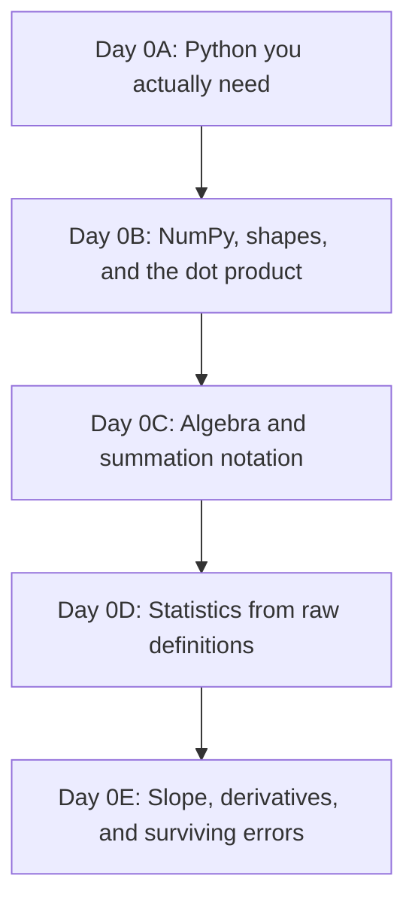

### Minimal software setup

Same environment the rest of the book uses. If you already did this while reading the orientation chapter, skip ahead.

```bash
python3 -m venv .venv
source .venv/bin/activate        # Windows PowerShell: .venv\Scripts\Activate.ps1
python -m pip install --upgrade pip
python -m pip install numpy matplotlib
```

Keep a scratch file — `level0_notes.py` or a notebook — and never delete a failed experiment. A wrong answer with a note explaining why it was wrong is worth more than a clean run you don't understand.

---

# Day 0A — Python You Actually Need

> **Today's central idea:** You don't need to be a "real programmer." You need six tools — variables, functions, loops, comprehensions, dictionaries, and one small class — used correctly and often.

## 0A.1 Variables and functions: naming a thought

Suppose your manager in Peshawar hands you the planned capacity of one microhydro power (MHP) site: 250 kilowatts. You want to convert that to megawatts.

```python
capacity_kw = 250.0
capacity_mw = capacity_kw / 1000.0
print(capacity_mw)
# 0.25
```

That's a variable: a name you gave to a number so you don't have to keep re-typing `250.0` and hoping you remembered it correctly. Now suppose you need to do this conversion for every project that lands on your desk, forever. You don't write the same two lines a hundred times. You wrap the *behaviour* in a function, and give the *specific number* a name only when you call it.

```python
def kw_to_mw(capacity_kw):
    """Convert kilowatts to megawatts."""
    return capacity_kw / 1000.0

print(kw_to_mw(250.0))   # 0.25
print(kw_to_mw(1800.0))  # 1.8
```

A function has a contract: it takes something in, and it promises something specific out. Every regression model you build in this book — starting with `MHPCostEstimator` in Chapter 1 — is, underneath, a pile of functions with contracts like this one, just with more numbers going in.

## 0A.2 Loops: doing the same thing many times, honestly

You have planned capacities for five projects and want each one in megawatts.

```python
capacities_kw = [100.0, 250.0, 500.0, 1800.0, 60.0]

capacities_mw = []
for c in capacities_kw:
    capacities_mw.append(kw_to_mw(c))

print(capacities_mw)
# [0.1, 0.25, 0.5, 1.8, 0.06]
```

Walk through this out loud (yes, actually say it): "For each value `c` in the list, convert it, and stick the result onto the end of a new list." That is the entire idea of a `for` loop. Nothing hides inside it.

## 0A.3 List comprehensions: the same loop, said more tersely

Python lets you write the loop above in one line. This is not a different idea — it is the *identical* operation, just written compactly enough that you'll see it constantly in other people's code (and in later chapters of this book).

```python
capacities_mw = [kw_to_mw(c) for c in capacities_kw]
print(capacities_mw)
# [0.1, 0.25, 0.5, 1.8, 0.06]
```

Read it right to left inside the brackets: "for `c` in `capacities_kw`, compute `kw_to_mw(c)`, collect all of those." If a comprehension ever confuses you, the fix is always the same: mentally unroll it back into the `for` loop from §0A.2. They compute the same thing.

## 0A.4 Dictionaries: a record, not just a list

A list of numbers loses the *meaning* of each number. A single MHP project is not just `[15.0, 100.0, 3]` — it's cable length, capacity, and terrain difficulty, and you'll forget which number is which within a week. A dictionary keeps the label attached to the value.

```python
project = {
    "site_id": "MHP-0042",
    "cable_length_km": 15.0,
    "planned_capacity_kw": 100.0,
    "terrain_index": 3,
}

print(project["planned_capacity_kw"])
# 100.0
```

This matters more than it looks like it should. Chapter 1, Day 2 introduces a "data dictionary" as part of the model itself — the discipline of never letting a raw number float around without its meaning attached starts here.

## 0A.5 A minimal class: bundling data and behaviour together

A function does one thing to whatever you hand it. A class is a way of saying: "here is a *thing* — it has some data that belongs to it, and some behaviour that belongs to it." You will build classes named `MHPCostEstimator` and `GaussianOLS` later in this book. Here is the smallest possible ancestor of those, so the syntax is not a surprise when it matters.

```python
class UnitConverter:
    def __init__(self, factor):
        # This runs once, when the object is created.
        # It stores 'factor' so every method below can use it.
        self.factor = factor

    def convert(self, value):
        return value * self.factor

kw_to_mw_converter = UnitConverter(factor=0.001)
print(kw_to_mw_converter.convert(250.0))
# 0.25
```

`self` is just "this specific object." When you call `kw_to_mw_converter.convert(250.0)`, Python quietly hands the object itself in as `self`, so `self.factor` means "*this* converter's factor," not some factor floating in space. That's the whole trick. Everything else about classes in this book builds on exactly this.

## 0A.6 Build: a tiny project-cost sketch

Combine everything above into one small tool — not a real model yet, just proof you can chain these pieces together.

```python
projects = [
    {"site_id": "MHP-0001", "cable_length_km": 12.0, "cost_per_km_million_pkr": 0.9},
    {"site_id": "MHP-0002", "cable_length_km": 30.0, "cost_per_km_million_pkr": 0.9},
    {"site_id": "MHP-0003", "cable_length_km": 5.0,  "cost_per_km_million_pkr": 1.4},
]

def rough_cable_cost(project):
    return project["cable_length_km"] * project["cost_per_km_million_pkr"]

for p in projects:
    cost = rough_cable_cost(p)
    print(f"{p['site_id']}: approx {cost:.2f} million PKR of cable cost")
```

This is not a regression. It's a fixed formula, not a fitted one — the whole rest of the book is about the difference between "a formula I made up" and "a formula the data told me to use." Keep that distinction in your head; it will matter by Day 5.

## 0A.7 Break it deliberately

Run each of these, read the *last line* of the error only, and write one sentence translating it into English before you fix it.

```python
# Break 1
def kw_to_mw(capacity_kw)   # missing colon
    return capacity_kw / 1000.0
```

```python
# Break 2
project = {"cable_length_km": 15.0}
print(project["cost_per_km_million_pkr"])  # key that doesn't exist
```

```python
# Break 3
capacities_kw = [100.0, 250.0, 500.0]
print(capacities_kw * 1000)   # not what you think it does
```

The third one is the important one. `capacities_kw * 1000` does not multiply every number by 1000 — it repeats the *list* a thousand times, because `*` on a Python list means "repeat," not "scale." This single misunderstanding is the entire reason NumPy exists, and it's where Day 0B starts.

### Day 0A exit check

You should be able to, without looking anything up:
- write a function with a docstring and a return value;
- write the same loop two ways (`for` and a comprehension);
- explain what `self` refers to inside a class method;
- explain, out loud, why `[1, 2, 3] * 2` is not `[2, 4, 6]`.

---

# Day 0B — NumPy, Shapes, and the Dot Product

> **Today's central idea:** A NumPy array is not "a faster list." It's a different kind of object with its own arithmetic rules, and almost every bug you'll hit in this book for the next six chapters is a shape mismatch.

## 0B.1 Why lists fail us

You saw it already: `capacities_kw * 1000` repeats a list instead of scaling it. NumPy arrays fix this by defining `*`, `+`, `-`, `/` to mean *elementwise* arithmetic.

```python
import numpy as np

capacities_kw = np.array([100.0, 250.0, 500.0])
capacities_watts = capacities_kw * 1000.0
print(capacities_watts)
# [100000. 250000. 500000.]
```

## 0B.2 Shape is the first thing you check, always

Every array has a `.shape`. Get comfortable reading it before you do anything else with an array.

```python
a = np.array([1.0, 2.0, 3.0])
print(a.shape)          # (3,)   — a 1-D array of 3 numbers, a "vector"

b = np.array([[1.0, 2.0, 3.0]])
print(b.shape)          # (1, 3) — a 2-D array: 1 row, 3 columns

c = np.array([[1.0], [2.0], [3.0]])
print(c.shape)          # (3, 1) — a 2-D array: 3 rows, 1 column
```

`(3,)`, `(1, 3)`, and `(3, 1)` hold the same numbers and are **not interchangeable**. This looks pedantic until it silently ruins a calculation two chapters from now. Chapter 1's design matrices depend on you already having this reflex.

## 0B.3 Indexing and slicing

```python
X = np.array([
    [15.0, 100.0, 3],   # cable_km, capacity_kw, terrain_index
    [30.0, 250.0, 4],
    [5.0,  500.0, 1],
])

print(X.shape)        # (3, 3) — 3 projects, 3 features
print(X[0])            # first row: array([ 15., 100.,   3.])
print(X[:, 0])          # first column (all rows): array([15., 30.,  5.])
print(X[0, 1])          # row 0, column 1: 100.0
print(X[:2, :2])        # first two rows, first two columns
```

The comma inside `[ ]` separates "which rows" from "which columns." `:` alone means "all of them." This exact slicing vocabulary is what Chapter 1 uses to pull a single feature column out of a design matrix — get it into your hands now, not while also learning what a design matrix is.

## 0B.4 Broadcasting: NumPy's rule for mismatched shapes

Broadcasting is *not* magic. It's one precise rule: NumPy compares shapes from the right, and a dimension of size 1 (or a missing dimension) is allowed to stretch to match. Watch it work, then watch it correctly refuse.

```python
X = np.array([
    [15.0, 100.0],
    [30.0, 250.0],
    [5.0,  500.0],
])   # shape (3, 2): cable_km, capacity_kw

means = np.array([16.7, 283.3])   # shape (2,) — one mean per column

centred = X - means
print(centred)
# Each row of X has 'means' subtracted from it, column by column.
```

`(3, 2)` and `(2,)` are compatible because the trailing dimension `2` matches `2`. Now break it on purpose:

```python
weights = np.array([1.5, 0.8, 2.1])   # shape (3,) — wrong length on purpose

result = X @ weights
```

```text
ValueError: matmul: Input operand 1 has a mismatch in its core dimension 0,
with gufunc signature (n?,k),(k?,m?)->(n?,m?) (size 3 is different from 2)
```

Translate the last line, not the jargon: *X has 2 columns; `weights` has 3 entries; matrix multiplication needs those to match.* Fix it by giving `weights` exactly 2 entries, one per column of `X`. This is the single most common error you will produce for the next six chapters, so get used to reading it calmly.

## 0B.5 The dot product, at three levels of honesty

A "weighted sum" is the single most important operation in this entire book — every regression coefficient you will ever fit multiplies a feature by a weight and adds the results up. Here it is proven three ways, so you know they're the same thing.

```python
features = np.array([15.0, 100.0])       # cable_km, capacity_kw
weights  = np.array([0.05, 0.002])       # million PKR per unit

# Level 1: by hand, term by term
manual = features[0] * weights[0] + features[1] * weights[1]

# Level 2: by an explicit loop (works for any length)
loop_total = 0.0
for f, w in zip(features, weights):
    loop_total += f * w

# Level 3: NumPy's dot product
dot_total = features @ weights   # equivalently: np.dot(features, weights)

print(manual, loop_total, dot_total)
# 0.95 0.95 0.95
```

All three give `0.95` — 0.75 (cable contribution) + 0.2 (capacity contribution) million PKR. When Chapter 1 writes `X @ beta`, this is exactly what it means: do this weighted sum, once per row of `X`, all at once.

## 0B.6 Build: a manual prediction, matrix style

```python
X = np.array([
    [15.0, 100.0],
    [30.0, 250.0],
    [5.0,  500.0],
])   # 3 projects, 2 features each

beta = np.array([0.05, 0.002])   # made-up weights, not fitted — just practising the mechanics

predictions = X @ beta
print(predictions)
# one predicted cost per project, in the same units as beta implies
```

## 0B.7 Break it deliberately

```python
row_vector = np.array([[1.0, 2.0, 3.0]])   # shape (1, 3)
col_vector = np.array([[1.0], [2.0], [3.0]])  # shape (3, 1)

print(row_vector + col_vector)
```

This does **not** error — it broadcasts to a `(3, 3)` result, which surprises almost everyone the first time. Before running it, predict the shape of the output. Then run it and see if you were right. If you were wrong, walk through §0B.4's rule again until the result stops being a surprise.

### Day 0B exit check

You should be able to, without looking anything up:
- state the shape of any array you just created, without running `.shape`, and then confirm it;
- explain broadcasting as one sentence about matching dimensions from the right;
- compute a dot product three ways and get the same number each time;
- read a `matmul` shape-mismatch error and say, in plain English, which two numbers disagree.

---

# Day 0C — Algebra and Summation Notation

> **Today's central idea:** $\sum$ is not a foreign symbol. It's a `for` loop that adds things up, written in a more compressed alphabet.

## 0C.1 A function is a recipe with a name

You already know this from Python — `def kw_to_mw(capacity_kw): return capacity_kw / 1000.0` is a recipe. Algebra just writes recipes with single letters instead of English words:

$$f(x) = \frac{x}{1000}$$

says exactly what the Python function said: give me a number $x$, I'll divide it by 1000 and call the result $f(x)$. Every formula in this book is a recipe like this one — the discipline is learning to read the recipe before panicking about the symbols.

## 0C.2 The equation of a line, and why it matters here

$$y = mx + c$$

$m$ is the slope: how much $y$ changes when $x$ increases by exactly 1. $c$ is the intercept: the value of $y$ when $x$ is 0. This is the entire idea behind linear regression with one feature — Chapter 1 spends its first three days building up to exactly this equation, generalised to many features. If you can already sketch $y = 2x + 5$ on paper and say what happens as $x$ grows, you have the geometric intuition; the rest is notation.

## 0C.3 Summation notation, built from a loop you already wrote

Recall Day 0A's loop:

```python
loop_total = 0.0
for f, w in zip(features, weights):
    loop_total += f * w
```

In algebra, if there are $p$ features indexed $i = 1, 2, \dots, p$, this exact loop is written:

$$\sum_{i=1}^{p} f_i w_i$$

Read it left to right, the same way you'd read the `for` loop: "start a running total at 0; for each $i$ from 1 to $p$, add $f_i$ times $w_i$; stop." The little number under $\sum$ is where the loop starts, the number on top is where it ends, and everything to the right of $\sum$ is what gets added at each step.

**Code proof — the formula and the loop must agree:**

```python
import numpy as np

f = np.array([15.0, 100.0, 3.0])
w = np.array([0.05, 0.002, -1.5])

# The formula, as a loop
total_loop = 0.0
for i in range(len(f)):
    total_loop += f[i] * w[i]

# The formula, as NumPy
total_numpy = f @ w

print(total_loop, total_numpy)
# 0.55 0.55
```

$\sum_{i=1}^{p} f_i w_i$, the `for` loop, and `f @ w` are three spellings of one idea. When Chapter 1, Day 4 writes the sum of squared residuals as

$$\text{SSR} = \sum_{i=1}^{n} (y_i - \hat{y}_i)^2$$

you should now be able to read it as: "loop over every project $i$; take the actual cost minus the predicted cost; square it; add it to a running total." Try writing that as Python *before* Chapter 1 does it for you.

## 0C.4 Exponents and why we square errors (a preview)

$x^2$ means $x$ multiplied by itself. Two properties matter for everything downstream:

- squaring always produces a non-negative number, so a positive error and an equally-sized negative error contribute the same amount once squared;
- squaring punishes large errors much more than small ones — an error of 10 contributes 100, an error of 2 contributes only 4.

Chapter 1, Day 4 spends real time justifying *why* regression squares errors instead of just adding them up. You don't need the full argument yet — just the two facts above, so the argument doesn't start from zero.

## 0C.5 Build: SSR from the formula, three ways

```python
y_actual    = np.array([12.0, 30.0, 8.0])
y_predicted = np.array([11.2, 31.5, 9.0])

# Level 1: by hand
errors = y_actual - y_predicted
squared_errors = errors ** 2
ssr_manual = squared_errors.sum()

# Level 2: as a literal loop mirroring the sigma
ssr_loop = 0.0
for a, p in zip(y_actual, y_predicted):
    ssr_loop += (a - p) ** 2

# Level 3: one line
ssr_oneline = np.sum((y_actual - y_predicted) ** 2)

print(ssr_manual, ssr_loop, ssr_oneline)
```

All three must match. If they don't, you have a bug — and finding it is exactly the kind of debugging Chapter 1 will ask of you constantly.

## 0C.6 Break it deliberately

Predict the output on paper before running:

```python
values = np.array([2.0, -3.0, 5.0])
print(np.sum(values ** 2))     # sum of squares
print(np.sum(values) ** 2)     # square of the sum
```

These are **not equal**, and the difference between "sum of squares" and "square of a sum" is a mistake that will cost you real debugging time in later chapters (variance, in particular, depends on getting this order right). Say out loud why they differ before moving on.

### Day 0C exit check

You should be able to:
- translate a $\sum$ formula into a `for` loop and into one line of NumPy, and get matching numbers all three ways;
- explain why $y = mx + c$ is the same shape of idea as Chapter 1's regression equation;
- explain the difference between $\sum x_i^2$ and $(\sum x_i)^2$ using a concrete 3-number example.

---

# Day 0D — Statistics From Raw Definitions

> **Today's central idea:** Mean, variance, and correlation are not library functions you call. They are formulas you can build from Day 0C's summation notation in about four lines each — and Chapter 2's probability content assumes you already know what they mean.

## 0D.1 The mean: the balancing point

Suppose five MHP projects had these actual costs, in million PKR: `[12.0, 30.0, 8.0, 45.0, 15.0]`.

$$\bar{x} = \frac{1}{n}\sum_{i=1}^{n} x_i$$

"Add everything up, divide by how many there are."

```python
costs = np.array([12.0, 30.0, 8.0, 45.0, 15.0])

n = len(costs)
mean_manual = np.sum(costs) / n
mean_numpy = costs.mean()

print(mean_manual, mean_numpy)
# 22.0 22.0
```

## 0D.2 Variance: how far, on average, things sit from the mean

You can't just average the raw deviations from the mean — they always sum to zero (that's *what* "mean" means). So we square them first, borrowing exactly the trick from Day 0C.

$$\sigma^2 = \frac{1}{n}\sum_{i=1}^{n} (x_i - \bar{x})^2$$

```python
deviations = costs - costs.mean()
print(deviations)               # [-10. 8. -14. 23. -7.]
print(deviations.sum())          # 0.0 — always, by construction

variance_manual = np.sum(deviations ** 2) / n
variance_numpy = costs.var()     # NumPy's default matches this population formula

print(variance_manual, variance_numpy)
```

> **A warning that will save you real confusion later:** you'll sometimes see variance computed by dividing by $n - 1$ instead of $n$ (the "sample" variance, `ddof=1` in NumPy). Chapter 2, Day 6 explains exactly why that correction exists. For now, just notice that `costs.var()` and `costs.var(ddof=1)` disagree, and don't assume it's a bug when you see it — it's a deliberate choice depending on what you're trying to estimate.

## 0D.3 Standard deviation: getting the units back

Variance is in squared units (million PKR², which means nothing to anyone). Standard deviation undoes the squaring:

$$\sigma = \sqrt{\sigma^2}$$

```python
std_manual = np.sqrt(variance_manual)
std_numpy = costs.std()
print(std_manual, std_numpy)
```

## 0D.4 Covariance: do two things move together?

Now bring in a second variable — cable length per project, in km: `[12.0, 30.0, 5.0, 40.0, 15.0]`. Covariance asks: when one variable is above its mean, is the other one usually above its mean too?

$$\text{cov}(x, y) = \frac{1}{n}\sum_{i=1}^{n} (x_i - \bar{x})(y_i - \bar{y})$$

```python
cable_km = np.array([12.0, 30.0, 5.0, 40.0, 15.0])

x_dev = costs - costs.mean()
y_dev = cable_km - cable_km.mean()

cov_manual = np.sum(x_dev * y_dev) / n
cov_numpy = np.cov(costs, cable_km, ddof=0)[0, 1]

print(cov_manual, cov_numpy)
```

If both deviations tend to have the same sign (both above their means, or both below), each product is positive and covariance comes out positive: as cable length rises, cost tends to rise too. That's not a coincidence for this dataset — it's the whole reason regression will later find cable length a useful feature.

## 0D.5 Correlation: covariance with the units washed out

Covariance's *size* depends on the units you happened to measure in, which makes two covariances hard to compare. Correlation fixes that by dividing out each variable's own spread:

$$r = \frac{\text{cov}(x, y)}{\sigma_x \sigma_y}$$

```python
r_manual = cov_manual / (costs.std() * cable_km.std())
r_numpy = np.corrcoef(costs, cable_km)[0, 1]

print(r_manual, r_numpy)
```

$r$ always sits between $-1$ and $1$. Close to $1$: strong positive relationship. Close to $-1$: strong negative. Close to $0$: little linear relationship. This single number is going to matter enormously in Chapter 1, Day 2, where you'll learn that two *nearly identical* correlated features (like literacy rate and school enrollment in the orientation chapter's development dataset) can quietly break a regression — that's called multicollinearity, and it's just "correlation close to 1" between features, wearing a bigger hat.

## 0D.6 Build: a tiny stats report

```python
def describe(values, label):
    print(f"{label}: mean={values.mean():.2f}, std={values.std():.2f}, "
          f"min={values.min():.2f}, max={values.max():.2f}")

describe(costs, "cost (million PKR)")
describe(cable_km, "cable length (km)")
print(f"correlation(cost, cable_km) = {np.corrcoef(costs, cable_km)[0,1]:.3f}")
```

This four-line report is, in essence, what Exercise 0.1 in the orientation chapter asked you to build for the full KP datasets. Now you know what every number in it actually means, instead of trusting `.describe()` blindly.

## 0D.7 Break it deliberately

```python
constant = np.array([5.0, 5.0, 5.0, 5.0, 5.0])
print(np.corrcoef(constant, costs))
```

This produces `nan`, not an error — correlation divides by `constant.std()`, which is `0.0`, and dividing by zero silently poisons the whole calculation with `nan` instead of crashing loudly. This is a real trap: a feature with zero variance (every project has the same terrain grade, say) will not throw an exception, it will quietly corrupt anything downstream that touches it. Get used to checking `.std()` for zero *before* you trust a correlation number.

### Day 0D exit check

You should be able to:
- compute mean, variance, standard deviation, covariance, and correlation from the raw summation formulas, and match NumPy's built-ins;
- explain in one sentence why variance squares the deviations instead of just averaging them;
- explain what a correlation near $1$ between two features will eventually mean for a regression model;
- explain why a zero-variance feature produces `nan` instead of an error, and why that's more dangerous.

---

# Day 0E — Slope, Derivatives, and Surviving Errors

> **Today's central idea:** A derivative is just the slope of a curve at one exact point, and every model you train in this book is, underneath, a search for the point where that slope hits zero.

## 0E.1 From a straight slope to a curved one

You already know $y = mx + c$ has one constant slope, $m$, everywhere. Now consider a curve: $y = x^2$. Its steepness is different at every point — flat near $x=0$, steep far from it. The **derivative** is a formula that tells you the exact slope at any single point you pick.

For $y = x^2$, the derivative is:

$$\frac{dy}{dx} = 2x$$

- At $x = 0$: slope is $2(0) = 0$ — flat, the bottom of the bowl.
- At $x = 3$: slope is $2(3) = 6$ — climbing steeply.
- At $x = -3$: slope is $2(-3) = -6$ — descending steeply, mirror image.

## 0E.2 Where that formula actually comes from (the limit definition)

You don't have to memorise derivative rules as magic — they fall out of one idea: *look at the average slope between two points that are getting closer and closer together.*

$$\frac{dy}{dx} = \lim_{h \to 0} \frac{f(x+h) - f(x)}{h}$$

**Code proof — approximate this numerically and watch it converge to $2x$:**

```python
def f(x):
    return x ** 2

def numerical_slope(f, x, h):
    return (f(x + h) - f(x)) / h

x = 3.0
for h in [1.0, 0.1, 0.01, 0.0001, 0.000001]:
    print(f"h={h:<10} slope estimate={numerical_slope(f, x, h):.6f}")
# As h shrinks, the estimate creeps toward exactly 6.0 = 2 * 3
```

This is not a party trick. Chapter 1, Day 5 checks its hand-derived matrix gradient against exactly this kind of numerical approximation ("finite differences"), and Chapter 2, Day 9 builds gradient descent directly on top of it. You just ran a miniature version of both.

## 0E.3 Two derivative rules you'll actually use

You don't need a full calculus course — this book only leans on a handful of rules, repeatedly:

- **Power rule:** the derivative of $x^n$ is $n x^{n-1}$. (This is where $x^2 \to 2x$ came from.)
- **Constant multiple:** the derivative of $a \cdot f(x)$ is $a$ times the derivative of $f(x)$.
- **Sum rule:** the derivative of $f(x) + g(x)$ is just the derivative of $f(x)$ plus the derivative of $g(x)$ — you can differentiate term by term.

```python
# Example: derivative of  y = 3x^2 + 5x
# Power rule on 3x^2  -> 6x
# Power rule on 5x    -> 5   (since x^1's derivative is 1*x^0 = 1)
# Sum rule combines them -> 6x + 5

def y(x):
    return 3 * x**2 + 5 * x

def dy_dx_by_rule(x):
    return 6 * x + 5

x = 2.0
print(dy_dx_by_rule(x))                                  # 17.0
print(numerical_slope(y, x, h=0.000001))                  # ~17.0, confirms the rule
```

## 0E.4 Partial derivatives: slope when there's more than one dial to turn

Regression rarely has one adjustable number — it has one per feature. A **partial derivative** asks: "if I nudge *just this one* number and freeze everything else, how does the output change?" Notation-wise, $\partial$ replaces $d$ to signal "there are other variables here, and I'm holding them still."

Take a toy error surface: $E(m, c) = (10 - (m \cdot 2 + c))^2$ — the squared error of predicting $y=10$ at $x=2$ using slope $m$ and intercept $c$.

```python
def error(m, c):
    prediction = m * 2 + c
    return (10 - prediction) ** 2

def partial_wrt_m(error_fn, m, c, h=1e-6):
    return (error_fn(m + h, c) - error_fn(m, c)) / h

def partial_wrt_c(error_fn, m, c, h=1e-6):
    return (error_fn(m, c + h) - error_fn(m, c)) / h

m, c = 1.0, 1.0
print("slope if we nudge m:", partial_wrt_m(error, m, c))
print("slope if we nudge c:", partial_wrt_c(error, m, c))
```

Both numbers together form the **gradient** — a small arrow made of "how much does the error change per dial, holding the others still." Chapter 1, Day 5 derives this gradient by hand for the full OLS objective, with one partial derivative per feature instead of two. You just did the two-dial version.

## 0E.5 Why any of this matters: descending toward zero error

The core trick behind fitting almost every model in this book: start somewhere, compute the gradient, take a small step in the direction that *decreases* error, and repeat until the gradient is (close to) zero.

```python
m, c = 0.0, 0.0        # start with a bad guess
learning_rate = 0.01

for step in range(50):
    grad_m = partial_wrt_m(error, m, c)
    grad_c = partial_wrt_c(error, m, c)
    m -= learning_rate * grad_m
    c -= learning_rate * grad_c

print(f"m={m:.3f}, c={c:.3f}, error={error(m, c):.6f}")
```

Run it and watch the error shrink toward zero as `m` and `c` settle into values that make `m * 2 + c` land near `10`. This is a hand-built, miniature version of gradient descent — the real one arrives in Chapter 2, Day 9, with real data instead of one toy point.

## 0E.6 Surviving the traceback

You will see red error text constantly for the rest of this book. A practitioner reads an error the way an investigator reads a scene: bottom line first, ignore the jargon, translate to English.

**Shape mismatch (you already met this on Day 0B):**

```text
ValueError: matmul: Input operand 1 has a mismatch in its core dimension 0...
(size 4 is different from 2)
```
→ "Two things that need matching lengths don't have matching lengths."

**Missing key:**

```python
project = {"cable_length_km": 15.0}
project["terrain_index"]
```
```text
KeyError: 'terrain_index'
```
→ "You asked the dictionary for a label it doesn't have. Check spelling, check whether the data actually contains that field."

**Wrong type:**

```python
"cost: " + 15.0
```
```text
TypeError: can only concatenate str (not "float") to str
```
→ "Python won't silently guess how to combine a string and a number. Convert one of them explicitly: `"cost: " + str(15.0)`."

The instinct to panic and immediately paste the whole traceback into a search bar is understandable but skips the useful step: read the last line first, translate it into a plain sentence, *then* decide if you need help.

## 0E.7 The rule of the rubber duck

Put a mug, a duck, or an unimpressed cat on your desk. When something breaks, explain your code to it out loud, line by line, as if it has never seen Python. "Okay, here I create an array with three rows. Then I multiply it by a vector with... wait, how many entries does that vector have?" In a large fraction of cases you will catch the bug mid-sentence, before the duck says a word.

## 0E.8 Break it deliberately

```python
def error(m, c):
    prediction = m * 2 + c
    return (10 - prediction) ** 2

# Break: learning rate far too large
m, c = 0.0, 0.0
learning_rate = 5.0   # was 0.01

for step in range(10):
    grad_m = partial_wrt_m(error, m, c)
    grad_c = partial_wrt_c(error, m, c)
    m -= learning_rate * grad_m
    c -= learning_rate * grad_c
    print(step, m, c, error(m, c))
```

Watch the error *grow* instead of shrink, possibly exploding toward infinity. You just reproduced, in miniature, the single most common failure in Chapter 2, Day 9 — a learning rate that's too large overshoots the bottom of the valley on every step instead of settling into it. File that feeling away; you'll need to recognise it fast later.

### Day 0E exit check

You should be able to:
- compute a derivative numerically (finite differences) and confirm it against a rule-based derivative;
- explain a partial derivative in one sentence to someone who's never seen the word;
- explain, without notes, what gradient descent is doing and why a too-large learning rate breaks it;
- read a `KeyError`, `TypeError`, and shape-mismatch `ValueError` and translate each into plain English before trying to fix it.

---

# Level 0 Capstone — Prove You're Ready

Do this without peeking at earlier sections. This mirrors the format every later chapter uses for its own capstone, so it's worth taking seriously now.

**Given:**

```python
projects = np.array([
    [12.0, 15.0],   # cable_km, terrain_index
    [30.0, 25.0],
    [5.0,  8.0],
    [40.0, 45.0],
    [15.0, 12.0],
])
costs = np.array([12.0, 30.0, 8.0, 45.0, 15.0])   # million PKR
```

1. Report the shape of `projects` and explain what each dimension means, in a sentence.
2. Compute the mean and standard deviation of each column of `projects`, without using `.mean(axis=...)` — write the loop or comprehension yourself first, then confirm with NumPy.
3. Compute the correlation between `costs` and column 0 of `projects` from the raw covariance/std formulas, then check it with `np.corrcoef`.
4. Pick any made-up weight vector `beta` of length 2 and compute `predictions = projects @ beta` by hand-loop and with `@`, and confirm they match.
5. Write a function `sse(y_actual, y_predicted)` that returns $\sum (y_i - \hat{y}_i)^2$, and test it against your `predictions` from step 4.
6. Using finite differences, numerically estimate how `sse` changes if you nudge just the first entry of `beta` by a small amount. (You now have one entry of the gradient Chapter 1, Day 5 will derive properly.)
7. Deliberately break something — pass `beta` with the wrong length into step 4 — and write, in one sentence, what the resulting error is telling you.

If you can do all seven without reopening this chapter, you are ready for Chapter 1.

---

## Glossary (symbols you'll now recognise on sight)

| Symbol | Name | Meaning |
|---|---|---|
| $x_i$ | indexed variable | the $i$-th value in a collection |
| $\sum_{i=1}^{n}$ | summation | add up a formula for every $i$ from 1 to $n$ |
| $\bar{x}$ | mean | average value |
| $\sigma^2$ | variance | average squared distance from the mean |
| $\sigma$ | standard deviation | square root of variance; same units as the data |
| $r$ | correlation | covariance rescaled to sit between $-1$ and $1$ |
| $\frac{dy}{dx}$, $f'(x)$ | derivative | exact slope of $y=f(x)$ at a point |
| $\frac{\partial E}{\partial m}$ | partial derivative | slope of $E$ with respect to $m$ alone, holding other variables fixed |
| gradient | — | the collection of all partial derivatives, one per adjustable number |

## Instructor and self-study notes

- **Suggested timebox:** one focused day per section (0A–0E), or two half-days if math is genuinely new to you. Do not compress this into a single afternoon — the exit checks exist because rushing here is exactly what makes Chapter 1 feel impossible later.
- **Most common failure point:** learners skim Day 0B's broadcasting section because arrays "look like lists." Don't. Every day from Chapter 1 onward assumes shape-checking is reflexive, not effortful.
- **If the capstone is a struggle:** repeat Day 0C and 0D before moving on. Chapter 1 will not re-teach summation notation or variance; it will simply use them.

## Where Chapter 1 begins

Chapter 1 opens with a question you're now equipped to actually think about: *what is a regression for — prediction, explanation, or causation?* Everything you built this week — functions, shapes, sums, means, slopes — is about to get one name each: features, design matrix, objective function, gradient. Turn the page.

\newpage

# Chapter 0: Level 0 Orientation — Landing on Planet Regression

Hey there! Welcome. If you've ever looked at a messy spreadsheet and thought, *"I wonder if we can predict one column using the others without losing my mind,"* you're in the right place. 

This guide is designed to take you from a complete beginner—someone who doesn't know their features from their targets—to someone who can confidently sit down with PhD researchers, discuss causal estimation, and not break a sweat. All in about a week of focused work.

But we have a strict rule here: **no passive reading**. You don't learn swimming by reading a manual on hydrodynamics; you learn it by jumping into the pool and swallowing a bit of water. In our case, the pool is full of data, and the water is Python code. 

Let's get oriented.

---

## 1. How to Use This Guide

This is a self-paced, project-based curriculum. Instead of using toy datasets like Boston Housing (which has been beaten to death and has some pretty sketchy history anyway) or Iris flowers, we are going to work with three custom-built datasets based on Khyber Pakhtunkhwa (KP), Pakistan. 

For every single chapter, you should follow this rhythm:
1. **Read the theory** (informal, conceptual, but mathematically honest).
2. **Explain it back** (tell a rubber duck or your cat what the concept means).
3. **Run the experiments** (write the code yourself—no copy-pasting allowed).
4. **Break it on purpose** (what happens if you scale the target? what if you pass ID columns? find out!).
5. **Solve the exercises** (thoughtful, structured problems designed to build muscle memory).

### Your Toolkit
Make sure you have a working Python installation. We'll be using:
- `pandas` & `numpy` (the bread and butter of data manipulation)
- `matplotlib` & `seaborn` (for making plots that actually look good)
- `scikit-learn` (for machine learning)
- `statsmodels` (for statistical tests and classical econometrics)
- Advanced tools (which we will introduce as we go: `XGBoost`, `Optuna`, `SHAP`, `MAPIE`, etc.)

---

## 2. Setup and Data Generation

Suppose someone collected data across the beautiful valleys and plains of KP. Before we can do any math or fit any lines, we need to generate this data. 

### Step 2.1: The Command Line Ritual
Open your terminal and run the following commands to set up a clean, isolated environment. Don't install packages globally; that's how you break other projects and end up crying over dependency conflicts at 2 AM.

```bash
# Clone or navigate to your workspace
cd /var/www/documentation/regression-tasks

# Create a virtual environment
python3 -m venv .venv

# Activate the virtual environment
source .venv/bin/activate

# Install the essentials
pip install --upgrade pip
pip install pandas numpy matplotlib seaborn scikit-learn statsmodels
```

### Step 2.2: Generate the Synthetic KP Datasets
The project directory contains a script called [generate_data.py](file:///var/www/documentation/regression-tasks/generate_data.py). This script simulates a mini-world with realistic statistical dependencies. Let's run it:

```bash
python generate_data.py
```

If successful, you will see output like this:
```text
Generating development dataset: data/kp_subdistrict_development_index.csv with 100000 records...
Finished generating data/kp_subdistrict_development_index.csv.
Generating agricultural dataset: data/kp_agricultural_yields.csv with 100000 records...
Finished generating data/kp_agricultural_yields.csv.
Generating infrastructure dataset: data/kp_infrastructure_projects.csv with 100000 records...
Finished generating data/kp_infrastructure_projects.csv.
All datasets generated successfully in the 'data' directory!
```

> [!WARNING]
> These datasets are **synthetic**. They are mathematically designed to teach you regression. They reflect realistic terrain constraints, crop scales, and budget overruns of Pakistan, but they are **not** real survey data. Do not present these as actual policy evidence to the KP Planning and Development Department unless you want to get laughed out of the room.

---

## 3. The Three KP Regression Datasets

Let's meet our three main characters. Each represents a distinct style of regression problem.

### 3.1 The Development Index Dataset
* **File:** `data/kp_subdistrict_development_index.csv`
* **Target (What we want to find):** `development_score` (a bounded index from 0 to 100).
* **Concept:** *Suppose someone collected survey data from 100,000 communities in KP. They have indicators like literacy rate, school enrollment, average household income, distance to health facilities, and public funding. Now, they want to predict the overall community development score. What do we do?*
* **The Reality Inside:** This dataset is highly linear with some terrain-based penalties (e.g., mountainous regions face structural challenges). However, it contains severe **multicollinearity** (literacy rate and school enrollment are almost copies of each other).

### 3.2 The Agricultural Yields Dataset
* **File:** `data/kp_agricultural_yields.csv`
* **Target:** `crop_yield_tons_per_acre` (a positive continuous value).
* **Concept:** *Suppose a researcher collected farm-level data including crop types (wheat, maize, sugarcane, apples, peaches), soil pH, rainfall, elevation, fertilizer application, and whether the farm is organic. They want to predict the yield per acre to advise farmers. What do we do?*
* **The Reality Inside:** This dataset is highly **nonlinear** and filled with **interactions**. Soil pH has an optimal point (curves downwards if pH is too acidic or basic). Apples and peaches die in high temperatures, while sugarcane thrives. Organic farms have strictly zero fertilizer and pesticides. A simple straight line will fail miserably here.

### 3.3 The Infrastructure Projects Dataset
* **File:** `data/kp_infrastructure_projects.csv`
* **Targets:** `actual_cost_million_pkr` and `actual_duration_months` (two continuous values!).
* **Concept:** *Suppose the government of KP tracked 100,000 public works projects (roads, schools, water supply). They have the approved budget, estimated duration, contractor experience, and year of initiation. They want to predict the actual final cost and duration before building starts to prevent budget overruns. What do we do?*
* **The Reality Inside:** The targets are heavily **right-skewed** (most projects are small, but a few mega-projects cost billions). It is a **multi-output** problem where cost and duration are intimately related, but actual duration is unknown when planning.

---

## Chapter 0 Exercises: A Dress Rehearsal, Not a Preview

Here are your first hands-on challenges. Write python scripts (save them under `scratch/` or run them in an interactive environment) to solve them.

> **What this rehearsal is for.** These three datasets are large, realistic, and deliberately disconnected from the running case the rest of the book uses. That's on purpose. Chapter 1 onward follows a single narrower thread — the MHP Cost Estimator — built from small, hand-inspectable datasets that grow chapter by chapter, not from these CSVs. You will not see `kp_subdistrict_development_index.csv`, `kp_agricultural_yields.csv`, or `kp_infrastructure_projects.csv` again after this chapter, and that's fine. The point here is to build the reflex — load it, check its shape, find the ID columns, read the generating code — on data with real scale and real messiness, *before* the stakes go up and that reflex has to be automatic. Think of it as a practice scrimmage before the season starts, not the season itself.

### Exercise 0.1: The Data Handshake
Write a Python script `verify_setup.py` to load all three datasets and print their shapes, columns, and target variable ranges (minimum and maximum values).

**Helpful Comments:**
* Use `pd.read_csv()` to load.
* Use `.shape`, `.columns`, and `.describe()` to extract statistics.
* *Comic Relief:* If your script throws a `FileNotFoundError`, verify you ran `generate_data.py` first. Data does not materialize out of thin air, no matter how hard you stare at the screen.

### Exercise 0.2: Spotting the Imposters (Identifiers)
Look closely at the columns of all three datasets. Identify the columns that represent unique IDs (identifiers). 
1. Why must we drop these columns before feeding them to a regression model?
2. What happens if a model "memorizes" `community_id` to predict `development_score`?

**Helpful Comments:**
* Unique identifiers have high cardinality (almost every row has a unique value).
* If you train a model with ID columns, it might find a spurious pattern (e.g., ID `COM-00042` has a high score just by luck) and fail when predicting on a new community `COM-99999`. This is the ultimate form of cheating and overfitting.

### Exercise 0.3: Tracing the Data-Generating Code
Open [generate_data.py](file:///var/www/documentation/regression-tasks/generate_data.py) and search for the function `generate_development_dataset`. Look at how `raw_score` is calculated.
Write down the exact formula used to build `raw_score`.
What weights are given to `literacy_rate` vs `public_funding_allocated_million_pkr`?

---

## Handing Off to Chapter 1

One last thing before you turn the page. Everything in this chapter — the three CSVs, `generate_data.py`, the exercises above — belongs to this chapter alone. Chapter 1 opens a new, separate running case: the **MHP Cost Estimator**, predicting the cost of microhydro power projects from a handful of hand-built rows (eight, to start). It does not load anything you generated here, and it doesn't need to. Different dataset, same rules: read the theory, run the code yourself, break it on purpose. If Chapter 1 feels like a fresh start rather than a continuation, that's expected — you're not missing a step.

---

## References

1. **Python Virtual Environments:** [Python venv Docs](https://docs.python.org/3/library/venv.html) - Read this if you still don't know why we use virtual environments.
2. **pandas Basics:** [pandas Getting Started Guide](https://pandas.pydata.org/docs/getting_started/index.html) - Essential reading for data loading.
3. **Pakistan Development Context:** Planning & Development Department, Khyber Pakhtunkhwa [KP P&D Website](https://pndkp.gov.pk/) - For background on how development funding and infrastructure projects are managed in KP.

\newpage

# Chapter 1 — From a Question to Ordinary Least Squares

## Level 1 Data Explorer: Week 1 of the MHP Cost Estimator

> **Central promise.** By the end of this chapter, you will not merely be able to call a regression function. You will be able to state the question a regression can answer, represent the data correctly, derive ordinary least squares (OLS) in scalar and matrix form, implement it without a machine-learning library, diagnose when it fails, and explain the result to a decision-maker responsible for public infrastructure.

This chapter uses a running case: estimating the cost of microhydro power (MHP) projects in Khyber Pakhtunkhwa (KP). The projects are fictional but realistic. Their geography, procurement problems, transport constraints, and management decisions are grounded in the kinds of conditions infrastructure teams encounter in Chitral, Dir, Swat, and other mountainous districts.

> **A note if you just finished Chapter 0.** This is a new dataset, not a continuation of the development, agricultural, or infrastructure CSVs you generated there. Those built the reflex; this is where it gets used. The MHP case starts small — eight projects below — and grows with each chapter.

The case is deliberately high-stakes. A regression coefficient is not just a number on a screen. If misunderstood, it can lead to an unrealistic budget, an unfair judgement about a field team, or a decision to withdraw a service from a remote community.

---

## The pedagogical contract

This book asks the learner and the author to keep the same contract.

1. **One central concept per day.** Each lesson has a single intellectual centre. Supporting ideas are introduced only when that centre requires them.
2. **No mathematical hand-waving.** A displayed equation is unpacked symbol by symbol and connected to numbers.
3. **Code as proof.** Important equations are verified with NumPy and, where useful, with plain loops. We do not use `scikit-learn` in Week 1.
4. **Geometry before memorisation.** Vectors, projections, residuals, and error surfaces are drawn or plotted.
5. **Build, break, rebuild.** Every day adds to the `MHPCostEstimator`, then deliberately creates a failure that the learner must diagnose.
6. **Interpretation in context.** Every mathematical result is translated back into a budget, engineering, or management statement.
7. **Cognitive load is managed, not intelligence underestimated.** New notation is introduced gradually, but no essential reasoning is hidden.

### What “from scratch” means here

We will use Python, NumPy, and Matplotlib as basic tools. We will not ask a library to fit a regression model for us. NumPy stores arrays and performs arithmetic; the learner still constructs the design matrix, objective function, normal equations, parameter estimates, predictions, residuals, and diagnostics.

Later chapters can remove even more scaffolding—for example, by implementing matrix decomposition manually—but doing that now would bury the statistical idea under numerical bookkeeping.

---

## Week 1 learning outcomes

At the end of five days, you should be able to:

- distinguish prediction, explanation, and causal inference;
- identify a target, features, observations, parameters, and hyperparameters;
- read and verify the shapes of vectors and matrices;
- explain why a column of ones creates an intercept;
- calculate residuals, SSR, MSE, RMSE, and MAE by hand and in code;
- describe OLS as both error minimisation and orthogonal projection;
- derive the scalar and matrix OLS solutions;
- explain when the OLS solution is unique;
- detect perfect multicollinearity and other common failures;
- fit and evaluate a small regression model without a machine-learning library; and
- separate a mathematically correct calculation from a defensible policy conclusion.

## The five-day route

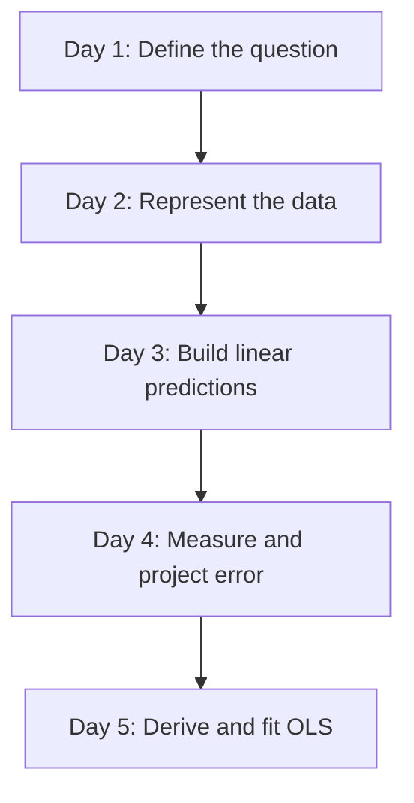

Each day follows the same rhythm:

1. **Orient:** connect the concept to a decision;
2. **Construct:** develop the mathematics carefully;
3. **Prove:** test the mathematics with raw code;
4. **See:** create a diagram or figure;
5. **Build:** add one working part to the application;
6. **Break:** produce a predictable failure;
7. **Reflect:** decide what the result does and does not justify.

---

## Running case and units

The MHP Cost Estimator will eventually use multiple project features. During the first four days, we also use very small datasets so that every number can be inspected.

| Field | Symbol | Unit | Meaning |
|---|---:|---:|---|
| Project count | $n$ | projects | Number of observations |
| Feature count | $p$ | features | Number of explanatory columns before the intercept |
| Cable length | $x_1$ | km | Length of distribution cable |
| Hydraulic head | $x_2$ | m | Vertical fall available to drive the turbine |
| Road distance | $x_3$ | km | Distance from an all-weather road to the site |
| Terrain difficulty | $x_4$ | index 1–5 | Ordered field assessment of access difficulty |
| Planned capacity | $x_5$ | kW | Intended generating capacity |
| Actual project cost | $y$ | million PKR | Target to be estimated |

> **Unit discipline:** A coefficient is meaningless without its units. If cost is recorded in million PKR and cable length in kilometres, the cable coefficient has units of “million PKR per kilometre,” holding the other included features constant.

The data in this chapter are **synthetic**. They are for learning, not for judging a real district, contractor, community, or organisation.

### Minimal software setup

The code assumes Python 3.11 or later. In a terminal, create an isolated environment and install the two numerical packages used in this chapter:

```bash
python -m venv .venv
source .venv/bin/activate        # Windows PowerShell: .venv\Scripts\Activate.ps1
python -m pip install numpy matplotlib
```

Use a plain `.py` file, a Jupyter notebook, or an editor with an interactive Python terminal. Keep every day’s experiments. A failed calculation with a short note about why it failed is part of the learning record, not clutter to erase.

---

# Day 1 — What Question Are We Asking?

> **Today’s central idea:** Prediction, explanation, and causation are different jobs. A regression calculation does not decide which job you meant.

## 1.1 Regression in one sentence

Regression constructs a numerical relationship between a target variable $y$ and one or more observed features $X$.

That sentence describes the mechanism but not the purpose. The same regression equation can be used for three very different purposes.

| Job | Question | What success looks like | Main danger |
|---|---|---|---|
| Prediction | “How accurately can we estimate the cost of a new project?” | Low error on genuinely new projects | A model may fail when conditions change |
| Explanation | “How is road distance associated with cost after accounting for included features?” | Stable, interpretable coefficients with uncertainty | Omitted variables and correlated features distort interpretation |
| Causal inference | “How much would cost change if we improved road access?” | Credible estimate of an intervention | Association is mistaken for the effect of an action |

The distinction is not philosophical decoration. It changes the data you need, the assumptions you must defend, and the way the result may be used.

## 1.2 Prediction: estimating an unknown outcome

For prediction, we want a function $f$ that converts the observed features of project $i$ into an estimate:

$$
\hat{y}_i = f(x_{i1},x_{i2},\ldots,x_{ip}).
$$

Read the symbols slowly:

- $i$ identifies one project;
- $x_{ij}$ is feature $j$ for project $i$;
- $f$ is the fitted prediction rule;
- $y_i$ is the actual cost; and
- $\hat{y}_i$, pronounced “y-hat,” is the estimated cost.

A predictor may be useful even when a feature is not causal. For instance, the number of difficult river crossings may predict transport cost because it summarises remoteness. A planning unit can use that signal to improve a contingency estimate without claiming that a river crossing, by itself, causes every extra rupee.

Prediction must be evaluated on data not used to fit the model. A rule that memorises completed projects can appear perfect and still fail on the next valley.

## 1.3 Explanation: describing conditional association

For explanation, attention shifts from the prediction alone to the model’s parameters. Consider:

$$
\hat{y}_i = \beta_0 + \beta_1\,\text{road\_distance}_i + \beta_2\,\text{capacity}_i.
$$

Here $\beta_1$ describes the estimated difference in cost associated with one additional kilometre of road distance **among projects with the same included capacity**.

The phrase in bold is essential. In multiple regression, a coefficient is conditional on the other included features. It does not automatically control for variables that are absent, poorly measured, or structurally different across districts.

An explanatory analysis also needs uncertainty. A coefficient of 0.8 million PKR per kilometre is not equally persuasive if it comes from 6 projects or 600 projects. Standard errors and confidence intervals arrive later; Week 1 first establishes what is being estimated.

## 1.4 Causation: estimating an intervention

A causal question asks about a change we could make:

> If an all-weather access road were constructed before the MHP works began, how would the final project cost differ from what it would otherwise have been?

This question compares two potential outcomes for the same project:

$$
\text{causal effect}_i = Y_i(\text{road improved}) - Y_i(\text{road not improved}).
$$

We can observe only one of those outcomes for a given project. The unobserved alternative is the **counterfactual**. Causal inference is therefore a problem of constructing a credible comparison, not merely fitting a line.

Ordinary regression can be part of a causal design, but the regression output is causal only when the research design and assumptions make it so. Random assignment, natural experiments, careful matching, panel designs, and defensible causal graphs can help. A high $R^2$ cannot turn an associational design into a causal one.

## 1.5 Confounding: the hidden common cause

Suppose projects in rugged terrain are more likely to require helicopter transport, and rugged terrain independently increases excavation delays and labour costs.

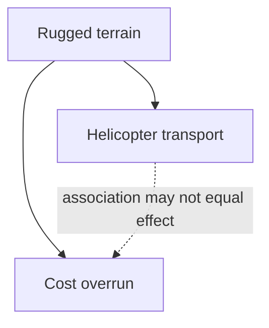

**Figure 1.1 — A confounding structure.** Terrain is a common cause of the selected transport method and the cost overrun. The dotted arrow is the relationship we might estimate naively.

If terrain is ignored, projects using helicopters will look more expensive even if helicopter transport reduced cost relative to the feasible alternative—weeks of manual carriage or an unfinished project.

A variable is a confounder when it is causally related to both the exposure or decision and the outcome, and is not itself a consequence of that exposure. The precise definition depends on the full causal structure; “control for everything available” is not a safe rule because controlling for mediators or colliders can introduce new bias.

## 1.6 Simpson’s paradox: when aggregation reverses a pattern

Imagine eight projects, four in relatively accessible terrain and four in remote mountain terrain. Within each terrain group, longer cable raises cost. Yet remote projects happen to use shorter cable and start from a much higher cost base.

| Terrain group | Cable length (km) | Cost (million PKR) |
|---|---:|---:|
| Accessible | 4 | 18 |
| Accessible | 5 | 20 |
| Accessible | 6 | 22 |
| Accessible | 7 | 24 |
| Remote | 1 | 30 |
| Remote | 2 | 33 |
| Remote | 3 | 36 |
| Remote | 4 | 39 |

Within accessible projects, one more kilometre is associated with about 2 million PKR more cost. Within remote projects, it is associated with about 3 million PKR more cost. But in the combined data, low cable lengths are concentrated among costly remote projects, so the overall line slopes downward.

For one feature, the OLS slope can be written as:

$$
\hat{\beta}_1 =
\frac{\sum_{i=1}^{n}(x_i-\bar{x})(y_i-\bar{y})}
{\sum_{i=1}^{n}(x_i-\bar{x})^2}.
$$

The numerator measures how $x$ and $y$ move together. The denominator measures how much $x$ varies. Day 5 derives this formula; today we use it as a diagnostic.

### Code proof: calculate all three slopes

```python
import numpy as np

def slope_from_sums(x, y):
    """One-feature OLS slope, written directly from the equation."""
    x = np.asarray(x, dtype=float)
    y = np.asarray(y, dtype=float)
    x_centered = x - x.mean()
    y_centered = y - y.mean()
    numerator = np.sum(x_centered * y_centered)
    denominator = np.sum(x_centered ** 2)
    return numerator / denominator

x_accessible = np.array([4, 5, 6, 7], dtype=float)
y_accessible = np.array([18, 20, 22, 24], dtype=float)

x_remote = np.array([1, 2, 3, 4], dtype=float)
y_remote = np.array([30, 33, 36, 39], dtype=float)

x_all = np.concatenate([x_accessible, x_remote])
y_all = np.concatenate([y_accessible, y_remote])

print("Accessible slope:", slope_from_sums(x_accessible, y_accessible))
print("Remote slope:    ", slope_from_sums(x_remote, y_remote))
print("Combined slope:  ", slope_from_sums(x_all, y_all))

# Expected, approximately:
# Accessible slope:  2.0
# Remote slope:      3.0
# Combined slope:   -2.0
```

The code does not “prove” which relationship is causal. It proves the numerical reversal and forces us to explain it using geography and the data-generating process.

### Figure lab: make the reversal visible

```python
import matplotlib.pyplot as plt

def line_for(x, y, grid):
    b1 = slope_from_sums(x, y)
    b0 = y.mean() - b1 * x.mean()
    return b0 + b1 * grid

grid = np.linspace(0.5, 7.5, 100)

plt.figure(figsize=(8, 5))
plt.scatter(x_accessible, y_accessible, label="Accessible terrain", s=70)
plt.scatter(x_remote, y_remote, label="Remote terrain", s=70)
plt.plot(grid, line_for(x_accessible, y_accessible, grid), linewidth=2)
plt.plot(grid, line_for(x_remote, y_remote, grid), linewidth=2)
plt.plot(
    grid,
    line_for(x_all, y_all, grid),
    color="black",
    linestyle="--",
    label="Misleading combined line",
)
plt.xlabel("Cable length (km)")
plt.ylabel("Actual cost (million PKR)")
plt.title("Simpson's paradox in synthetic MHP projects")
plt.legend()
plt.tight_layout()
plt.show()
```

**Figure 1.2 — Group-specific and aggregated regression lines.** The dashed combined line answers a different—and substantively misleading—question.

## 1.7 A decision protocol before touching code

Use this sequence whenever someone asks for “a regression.”

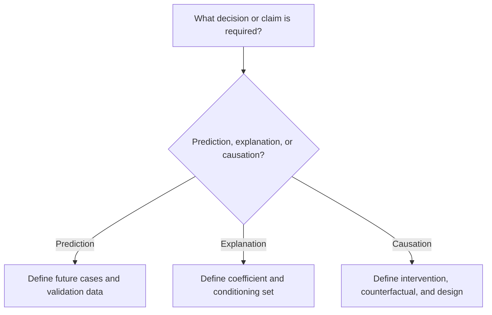

Before analysis, write a one-sentence **estimand**—the exact quantity to be estimated. Examples:

- Prediction: “The expected final cost, in million PKR, of an approved project at the design stage.”
- Explanation: “The adjusted difference in final cost associated with one additional kilometre from an all-weather road, conditional on planned capacity and measured terrain difficulty.”
- Causation: “The average change in final MHP cost caused by completing an access road before civil works, among currently approved remote projects.”

If the sentence is vague, the model will not rescue it.

## 1.8 Build: start the application with a question contract

Create `mhp_estimator.py`:

```python
from dataclasses import dataclass
from typing import Literal

import numpy as np


AnalysisPurpose = Literal["prediction", "explanation", "causation"]


@dataclass(frozen=True)
class AnalysisContract:
    purpose: AnalysisPurpose
    target_name: str
    target_unit: str
    unit_of_observation: str
    intended_use: str

    def __post_init__(self):
        if self.purpose not in {"prediction", "explanation", "causation"}:
            raise ValueError("purpose must be prediction, explanation, or causation")
        for name, value in vars(self).items():
            if not str(value).strip():
                raise ValueError(f"{name} cannot be empty")


class MHPCostEstimator:
    """OLS estimator built progressively during Week 1."""

    def __init__(self, contract: AnalysisContract):
        self.contract = contract
        self.parameters_ = None
        self.feature_names_ = None
        self.rank_ = None
        self.is_fitted_ = False

    def __repr__(self):
        status = "fitted" if self.is_fitted_ else "unfitted"
        return f"MHPCostEstimator(purpose={self.contract.purpose!r}, {status})"


if __name__ == "__main__":
    contract = AnalysisContract(
        purpose="prediction",
        target_name="actual_project_cost",
        target_unit="million PKR",
        unit_of_observation="one completed MHP project",
        intended_use="early budget review for approved projects",
    )
    print(MHPCostEstimator(contract))
```

The class begins with a contract because a technically correct model can still be unfit for its intended use.

## 1.9 Break it deliberately

Change `purpose="prediction"` to `purpose="forecasting"`. The program should reject the unrecognised purpose. Then leave the purpose valid but make `intended_use=""`. It should reject the empty field.

The lesson is small but important: silent ambiguity is a data-quality problem.

## 1.10 Day 1 practice

1. A finance unit wants next year’s total contingency allocation. Is its first task prediction, explanation, or causation?
2. A director asks whether contractor type “causes” delay because its regression coefficient is positive. What additional question must you ask?
3. Draw a DAG in which flood damage affects both the decision to redesign a headrace channel and final cost.
4. In the Simpson dataset, add 10 million PKR to every accessible project. Recalculate the three slopes. Which slopes change, and why?
5. Write an estimand for a real infrastructure decision you know.

### Day 1 exit check

You are ready to continue if you can complete this sentence without hesitation:

> “A regression coefficient is a causal effect only when __________.”

A defensible completion is: “the design and assumptions make the comparison equivalent to the relevant intervention and counterfactual.”

---

# Day 2 — Regression Vocabulary and the Shape of Data

> **Today’s central idea:** Data have roles, shapes, units, and provenance. Most early modeling errors are representation errors before they are statistical errors.

## 2.1 The vocabulary of one project table

Suppose the rows of a table are completed MHP projects.

| Term | Meaning | MHP example |
|---|---|---|
| Observation | One unit represented by one row | One completed MHP project |
| Feature | An input measured before the target is known | Planned capacity in kW |
| Target | The outcome to estimate | Actual project cost |
| Parameter | A value learned from data | Cost coefficient for road distance |
| Hyperparameter | A setting chosen outside the fitting calculation | Whether to include an intercept |
| Prediction | Model output for an observation | Estimated cost of 42 million PKR |
| Residual | Actual minus predicted target | $45-42=3$ million PKR |
| Loss | A rule for penalising errors during fitting | Squared residual |
| Metric | A summary used to evaluate performance | RMSE in million PKR |
| Estimator | The procedure that learns parameters | OLS |
| Fitted model | Estimator plus learned parameter values | Intercept and slopes after fitting |

**Parameter** and **hyperparameter** should not be explained through a loose physical analogy. The reliable distinction is procedural: the fitting algorithm learns parameters from the training data; the analyst sets hyperparameters or design choices.

## 2.2 Scalars, vectors, matrices, and tensors

A **scalar** is one number. A **vector** is an ordered one-dimensional array. A **matrix** is a two-dimensional rectangular array. A **tensor** is the general term for an array with any number of axes.

The number of tensor axes is sometimes called its order or tensor rank. Do not confuse that usage with **matrix rank**, introduced on Day 5, which counts independent directions in a matrix.


**Figure 2.1 — The dimensional ladder.** Regression in this chapter mainly uses vectors and matrices; “tensor” is useful as the general family name.

The mathematical objects are:

$$
X \in \mathbb{R}^{n\times p},
\qquad
y \in \mathbb{R}^{n},
\qquad
\beta \in \mathbb{R}^{p}.
$$

Read them as:

- $X$ is a real-valued matrix with $n$ rows and $p$ feature columns;
- $y$ is a real-valued target vector with $n$ entries; and
- $\beta$ is a parameter vector with one entry per feature.

Once an intercept column is added, $X$ has $p+1$ columns and $\beta$ has $p+1$ entries.

### A concrete shape example

Three projects with two features—road distance and capacity—can be represented as:

$$
X =
\begin{bmatrix}
12 & 100\\
25 & 150\\
8 & 80
\end{bmatrix},
\qquad
y =
\begin{bmatrix}
28\\
44\\
22
\end{bmatrix}.
$$

Then $X$ has shape $3\times2$ and $y$ has length 3. Row 2 means that the second project is 25 km from an all-weather road, has planned capacity 150 kW, and actually cost 44 million PKR.

## 2.3 Shape is part of meaning

These arrays contain the same three numbers but do not have the same shape:

```python
import numpy as np

a = np.array([28.0, 44.0, 22.0])          # shape (3,)
b = np.array([[28.0], [44.0], [22.0]])    # shape (3, 1)
c = np.array([[28.0, 44.0, 22.0]])        # shape (1, 3)

print(a.shape, b.shape, c.shape)
# (3,) (3, 1) (1, 3)
```

In NumPy, `(3,)` is a one-dimensional vector. `(3, 1)` is a two-dimensional column matrix. `(1, 3)` is a two-dimensional row matrix. They can behave differently under multiplication and broadcasting.

Our application will accept a one-dimensional target vector `y.shape == (n,)`. It will convert a single feature from `(n,)` to a two-dimensional matrix `(n, 1)`.

## 2.4 The design matrix and row alignment

The feature matrix used in a regression is called the **design matrix**. “Design” here refers to the arrangement of predictor columns; it does not mean the projects were experimentally assigned.

The $i$th row of $X$ and the $i$th entry of $y$ must refer to the same project.

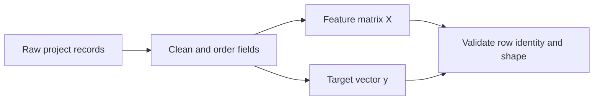

**Figure 2.2 — Data assembly.** Matching row counts are necessary but not sufficient: row identities must also match.

If `X` is accidentally sorted by district while `y` remains sorted by project ID, the shapes still match. The code may run and the model may be nonsense. Preserve a project identifier during preparation, even if it is not used as a numerical feature.

## 2.5 A data dictionary is part of the model

A usable dataset needs more than column names.

| Field | Data type | Unit / categories | Timing | Missing-value rule |
|---|---|---|---|---|
| `project_id` | string | unique ID | approval | never missing |
| `road_distance_km` | float | km | design survey | verify from GIS if missing |
| `planned_capacity_kw` | float | kW | approved design | never impute casually |
| `terrain_index` | integer | 1, 2, 3, 4, 5 | pre-construction | document assessor |
| `actual_cost_m_pkr` | float | million PKR, stated price basis | completion | target; exclude incomplete projects |

Timing prevents **target leakage**. A feature recorded after cost escalation—for example, “number of contract amendments”—might predict final cost extremely well. It is unavailable when the original budget is prepared and may partly be a consequence of the overrun. It should not be used in an early-stage prediction model without redefining the intended use.

## 2.6 Parsing one nested project record

```python
import json
import numpy as np

raw_json = """
{
  "project_id": "MHP-CH-003",
  "design": {
    "road_distance_km": 18.5,
    "planned_capacity_kw": 120.0,
    "terrain_index": 4
  },
  "completion": {
    "actual_cost_m_pkr": 39.2
  }
}
"""

record = json.loads(raw_json)

X_one = np.array([[  # two brackets: one row, three columns
    record["design"]["road_distance_km"],
    record["design"]["planned_capacity_kw"],
    record["design"]["terrain_index"],
]], dtype=float)

y_one = np.array([
    record["completion"]["actual_cost_m_pkr"]
], dtype=float)

print("X:", X_one, "shape:", X_one.shape)
print("y:", y_one, "shape:", y_one.shape)

assert X_one.shape == (1, 3)
assert y_one.shape == (1,)
```

The `assert` statements are executable claims. If the parser stops satisfying the intended mathematical shape, the program fails at the boundary instead of producing a later mystery.

## 2.7 Code proof: matrix–vector multiplication by loops

The linear prediction without an intercept is:

$$
\hat{y}_i = \sum_{j=1}^{p}x_{ij}\beta_j.
$$

For every project $i$, multiply each feature $x_{ij}$ by its corresponding parameter $\beta_j$, then add the products.

```python
X = np.array([
    [12.0, 100.0],
    [25.0, 150.0],
    [8.0, 80.0],
])
beta = np.array([0.6, 0.20])

# Proof using explicit loops
y_hat_loop = np.zeros(X.shape[0])
for i in range(X.shape[0]):
    total = 0.0
    for j in range(X.shape[1]):
        total += X[i, j] * beta[j]
    y_hat_loop[i] = total

# The same operation in matrix notation
y_hat_matrix = X @ beta

print(y_hat_loop)
print(y_hat_matrix)
assert np.allclose(y_hat_loop, y_hat_matrix)
```

The `@` operator is compact, but it is not magic. The loops show exactly what it does.

## 2.8 Build: robust input validation

Add these methods inside `MHPCostEstimator`:

```python
    @staticmethod
    def _validate_inputs(X, y=None):
        """Return finite float arrays with predictable regression shapes."""
        X = np.asarray(X, dtype=float)

        if X.ndim == 1:
            X = X.reshape(-1, 1)
        if X.ndim != 2:
            raise ValueError(f"X must be 2D after conversion; got shape {X.shape}")
        if X.shape[0] == 0 or X.shape[1] == 0:
            raise ValueError("X must contain at least one row and one feature")
        if not np.isfinite(X).all():
            raise ValueError("X contains NaN or infinite values")

        if y is None:
            return X

        y = np.asarray(y, dtype=float)
        if y.ndim == 2 and y.shape[1] == 1:
            y = y.reshape(-1)
        if y.ndim != 1:
            raise ValueError(f"y must be 1D; got shape {y.shape}")
        if X.shape[0] != y.shape[0]:
            raise ValueError(
                f"row mismatch: X has {X.shape[0]} rows but y has {y.shape[0]}"
            )
        if not np.isfinite(y).all():
            raise ValueError("y contains NaN or infinite values")

        return X, y
```

### Why each check exists

- `dtype=float` prevents accidental string arithmetic.
- A 1D `X` is interpreted as one feature observed for many projects.
- Regression requires a 2D design matrix even when $p=1$.
- Empty arrays have mathematically valid-looking shapes but no estimable relationship.
- `NaN` and infinity propagate through calculations and can silently destroy results.
- A one-column target matrix is flattened to the application’s chosen convention.
- Matching row counts are enforced, though project-ID alignment must be checked earlier.

## 2.9 Break it deliberately

Run each case and predict the error message before reading it.

```python
contract = AnalysisContract(
    purpose="prediction",
    target_name="actual_cost_m_pkr",
    target_unit="million PKR",
    unit_of_observation="completed MHP project",
    intended_use="design-stage budget review",
)
model = MHPCostEstimator(contract)

bad_cases = [
    (np.ones((10, 3)), np.ones(8)),       # row mismatch
    (np.array([[1.0, np.nan]]), [2.0]),   # missing feature
    (np.empty((0, 2)), np.empty(0)),      # no observations
    (np.ones((2, 2, 2)), np.ones(2)),     # three-dimensional X
]

for X_bad, y_bad in bad_cases:
    try:
        model._validate_inputs(X_bad, y_bad)
    except ValueError as error:
        print(type(error).__name__, "->", error)
```

Then construct the more dangerous failure: create `X` and `y` with the same number of rows but place `y` in reverse project order. Validation cannot detect the mistake unless project identifiers are checked during data assembly.

## 2.10 Day 2 practice

1. State the shape of a dataset containing 70 projects and 5 features.
2. After adding an intercept, what are the shapes of $X$ and $\beta$?
3. Why is `project_id` important even when it is not a numerical feature?
4. Give one example of target leakage in an MHP cost model.
5. Extend `_validate_inputs` to reject a constant target vector, but explain why a constant target is not mathematically invalid in every context.

### Day 2 exit check

Given `X.shape == (40, 6)` and `beta.shape == (5,)`, you should immediately say: “Multiplication is impossible because the inner dimensions, 6 and 5, do not match.”

---

# Day 3 — Linear Algebra as a System of Predictions

> **Today’s central idea:** A linear model forms each prediction by adding weighted features. Matrix notation performs that same operation for every project at once.

## 3.1 From a verbal rule to a linear equation

Suppose a deliberately simple budget rule uses only cable length:

> Begin with a fixed base cost of 8 million PKR, then add 4 million PKR for each kilometre of cable.

For project $i$:

$$
\hat{y}_i = 8 + 4x_i.
$$

The general one-feature linear model is:

$$
\hat{y}_i = \beta_0 + \beta_1x_i.
$$

- $\beta_0$ is the **intercept**: the model’s predicted target when $x_i=0$.
- $\beta_1$ is the **slope**: the predicted change in $y$ associated with a one-unit increase in $x$.

If $y$ is million PKR and $x$ is km, the slope’s units are million PKR per km.

The intercept may be necessary for good predictions without having a useful physical interpretation. “A project with zero cable” may lie outside the scope of the data. An intercept is an algebraic baseline, not automatically the price of a literal zero-feature project.

## 3.2 Multiple features are still a weighted sum

With road distance, capacity, and terrain difficulty:

$$
\hat{y}_i
= \beta_0
+ \beta_1\,\text{road\_distance}_i
+ \beta_2\,\text{capacity}_i
+ \beta_3\,\text{terrain}_i.
$$

For one project, this is a dot product between a row of feature values and a vector of parameters. For every project, it becomes matrix–vector multiplication:

$$
\hat{y} = X\beta.
$$

The apparent simplicity of the matrix equation is earned by carefully constructing $X$.

## 3.3 Why a column of ones creates an intercept

For three projects and one measured feature, start with:

$$
X_{\text{raw}} =
\begin{bmatrix}
x_1\\x_2\\x_3
\end{bmatrix}.
$$

Prepend a column of ones:

$$
X =
\begin{bmatrix}
1 & x_1\\
1 & x_2\\
1 & x_3
\end{bmatrix},
\qquad
\beta =
\begin{bmatrix}
\beta_0\\
\beta_1
\end{bmatrix}.
$$

Now multiply row by column:

$$
X\beta =
\begin{bmatrix}
1\beta_0+x_1\beta_1\\
1\beta_0+x_2\beta_1\\
1\beta_0+x_3\beta_1
\end{bmatrix}.
$$

The same $\beta_0$ is added to every project because every first-column entry is 1.

Without the column of ones, the one-feature model is $\hat{y}=\beta_1x$. At $x=0$, it must pass through the origin. With the ones column, the model is **affine**: a linear transformation plus a translation. In everyday statistics it is still called a linear regression because it is linear in the parameters.

## 3.4 Code proof: expand `X @ beta` by hand

```python
import numpy as np

x = np.array([1.0, 2.0, 3.0])
X = np.column_stack([np.ones(x.size), x])
beta = np.array([8.0, 4.0])

y_hat_matrix = X @ beta
y_hat_manual = np.array([
    1.0 * 8.0 + 1.0 * 4.0,
    1.0 * 8.0 + 2.0 * 4.0,
    1.0 * 8.0 + 3.0 * 4.0,
])

print(X)
print(y_hat_matrix)
assert np.array_equal(y_hat_matrix, y_hat_manual)
assert np.array_equal(y_hat_matrix, np.array([12.0, 16.0, 20.0]))
```

Every multiplication in the displayed equation appears explicitly in the code.

## 3.5 Shape algebra before numerical algebra

If:

$$
X \in \mathbb{R}^{n\times(p+1)}
\quad\text{and}\quad
\beta \in \mathbb{R}^{p+1},
$$

then:

$$
X\beta \in \mathbb{R}^{n}.
$$

The inner dimensions must agree:

$$
(n\times(p+1))\,(p+1\times1) = n\times1.
$$

This is not a software convention. It follows from the dot product: each row of $X$ needs exactly one parameter for each column.

### Symbol-to-Python map

| Mathematics | Meaning | NumPy |
|---|---|---|
| $X\beta$ | Matrix–vector product | `X @ beta` |
| $X^T$ | Transpose | `X.T` |
| $x^Ty$ | Dot product | `x @ y` or `np.dot(x, y)` |
| $I$ | Identity matrix | `np.eye(p)` |
| $\mathbf{1}$ | Vector of ones | `np.ones(n)` |
| $\lVert v\rVert_2$ | Euclidean length | `np.linalg.norm(v)` |

## 3.6 Matrices as transformations—and the limit of the analogy

A matrix can transform geometric coordinates by stretching, shrinking, rotating, reflecting, or shearing vectors. That view is useful for understanding linear algebra. In regression, however, the most immediate interpretation of $X\beta$ is slightly different: the columns of $X$ are building blocks, and $\beta$ chooses how much of each column to combine.

If $X$ has columns $x_0,x_1,\ldots,x_p$, then:

$$
X\beta = \beta_0x_0+\beta_1x_1+\cdots+\beta_px_p.
$$

Because $x_0$ is the column of ones, $\beta_0x_0$ adds the same amount to every prediction.

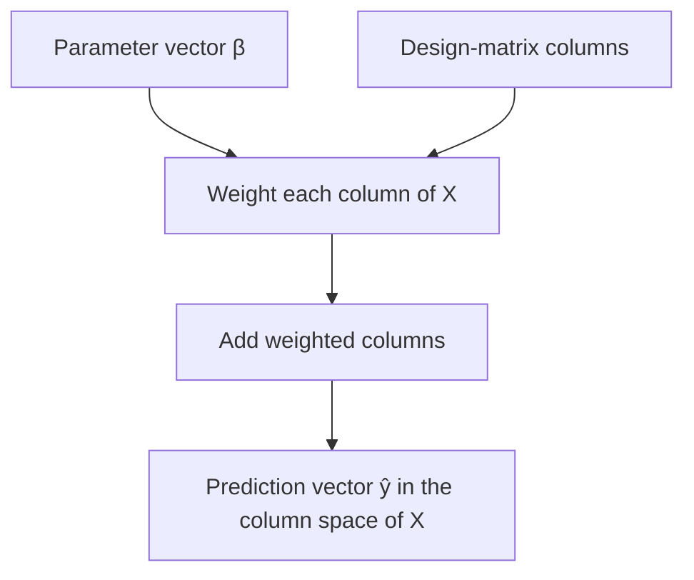

**Figure 3.1 — Column-combination view of regression.** The prediction vector is not an arbitrary vector; it must be built from the columns available in $X$.

## 3.7 Figure lab: with and without an intercept

Use four synthetic projects:

```python
import matplotlib.pyplot as plt
import numpy as np

x_cable_km = np.array([1.0, 2.0, 3.0, 4.0])
y_cost_m_pkr = np.array([12.0, 19.0, 29.0, 38.0])

# OLS through the origin: minimise ||y - xb||²
b_origin = (x_cable_km @ y_cost_m_pkr) / (x_cable_km @ x_cable_km)

# OLS with an intercept: solve the normal equations
X = np.column_stack([np.ones(x_cable_km.size), x_cable_km])
beta = np.linalg.solve(X.T @ X, X.T @ y_cost_m_pkr)

grid = np.linspace(0, 5, 100)

plt.figure(figsize=(8, 5))
plt.scatter(x_cable_km, y_cost_m_pkr, color="navy", s=70, label="Projects")
plt.plot(grid, b_origin * grid, "--", color="firebrick", label="Forced through origin")
plt.plot(grid, beta[0] + beta[1] * grid, color="darkgreen", label="With intercept")
plt.axhline(0, color="grey", linewidth=0.6)
plt.axvline(0, color="grey", linewidth=0.6)
plt.xlabel("Cable length (km)")
plt.ylabel("Actual cost (million PKR)")
plt.title("The intercept translates the fitted line")
plt.legend()
plt.tight_layout()
plt.show()

print("Through-origin slope:", b_origin)
print("Intercept and slope:", beta)
```

**Figure 3.2 — The effect of the intercept.** The through-origin model is required to predict zero cost at zero cable length. The intercept model is allowed to fit the observed baseline.

Notice that the code uses `np.linalg.solve(A, b)` for $A\beta=b$, not `np.linalg.inv(A) @ b`. The inverse formula is useful for derivation, but directly solving the linear system is clearer and usually more numerically stable.

## 3.8 Scaling and units

Suppose cable is changed from kilometres to metres:

$$
x_{\text{metres}}=1000x_{\text{km}}.
$$

To preserve the same prediction:

$$
\beta_{\text{metres}}=\frac{\beta_{\text{km}}}{1000}.
$$

Then:

$$
\beta_{\text{metres}}x_{\text{metres}}
=\frac{\beta_{\text{km}}}{1000}(1000x_{\text{km}})
=\beta_{\text{km}}x_{\text{km}}.
$$

### Code proof: changing units changes the coefficient, not the prediction

```python
x_km = np.array([1.0, 2.0, 3.0])
x_m = 1000.0 * x_km

beta_km = 4.0       # million PKR per km
beta_m = beta_km / 1000.0

assert np.allclose(beta_km * x_km, beta_m * x_m)
```

This is why comparing coefficient magnitudes across differently scaled features is misleading. A smaller numerical coefficient need not represent a less important variable.

## 3.9 Build: intercept construction and prediction

Add these methods inside `MHPCostEstimator`:

```python
    @staticmethod
    def _add_intercept_column(X):
        """Prepend one constant column; X must already be validated and 2D."""
        ones = np.ones((X.shape[0], 1), dtype=float)
        return np.hstack([ones, X])

    def predict(self, X):
        """Return predictions for new feature rows."""
        if not self.is_fitted_:
            raise RuntimeError("fit the estimator before calling predict")

        X = np.asarray(X, dtype=float)
        if X.ndim == 1:
            X = X.reshape(1, -1)  # one new project with p features
        X = self._validate_inputs(X)
        if X.shape[1] != len(self.feature_names_):
            raise ValueError(
                f"expected {len(self.feature_names_)} features, got {X.shape[1]}"
            )

        X_design = self._add_intercept_column(X)
        return X_design @ self.parameters_
```

`predict` cannot yet succeed because `fit` has not been built. This is intentional. We have defined the behaviour of a fitted application before learning how to estimate the parameters.

The context resolves a genuine shape ambiguity: during fitting, a one-dimensional `X` means one feature observed across many projects; during prediction, a one-dimensional `X` means one new project containing several features. Passing an explicit two-dimensional array remains safest.

## 3.10 Break it deliberately: broadcasting is not matrix multiplication

```python
X = np.array([
    [1.0, 12.0, 100.0],
    [1.0, 25.0, 150.0],
])
beta = np.array([5.0, 0.6, 0.2])

correct = X @ beta
print("correct shape:", correct.shape, "values:", correct)

elementwise = X * beta
print("elementwise shape:", elementwise.shape)
print(elementwise)
```

`X * beta` broadcasts the parameter vector across rows and multiplies element by element. It returns a matrix of products, not a prediction vector. The expression runs without an error, which makes it more dangerous than a crash.

Also try multiplying the same `X` by `np.array([5.0, 0.6])`. Matrix multiplication should fail because the number of parameters does not equal the number of columns.

## 3.11 Day 3 practice

1. Expand one row of $X\beta$ for an intercept plus three features.
2. Explain why a column of twos would not estimate the conventional intercept. What would its coefficient represent?
3. If cost changes from million PKR to PKR, how do the coefficients change?
4. Write a `matvec_with_loops(X, beta)` function that rejects incompatible dimensions.
5. Plot a dataset for which the intercept has a strong effect on fit and another for which it has little effect.

### Day 3 exit check

You should be able to explain both statements:

- “$X\beta$ is one dot product per project.”
- “$X\beta$ is a weighted combination of the columns of $X$.”

They are two views of the same operation.

---

# Day 4 — Residuals, Loss, and the Geometry of OLS

> **Today’s central idea:** OLS chooses the attainable prediction vector closest to the observed target vector in squared Euclidean distance.

## 4.1 A prediction becomes testable through its residual

For project $i$:

$$
e_i = y_i-\hat{y}_i.
$$

- $e_i>0$: actual cost exceeded predicted cost; the model underpredicted.
- $e_i<0$: actual cost was below predicted cost; the model overpredicted.
- $e_i=0$: prediction matched the observed target.

The sign convention matters. This chapter uses **actual minus predicted**.

For all projects:

$$
e = y-\hat{y}=y-X\beta.
$$

### Code proof: the vector equation and the elementwise equation agree

```python
import numpy as np

y = np.array([12.0, 19.0, 29.0])
y_hat = np.array([10.5, 20.0, 27.5])

e_vector = y - y_hat
e_manual = np.array([
    12.0 - 10.5,
    19.0 - 20.0,
    29.0 - 27.5,
])

assert np.allclose(e_vector, e_manual)
print(e_vector)  # [ 1.5 -1.   1.5]
```

Residuals are observed after fitting. They are not the same as the unobservable population errors in a statistical model, though introductory discussions often use the words loosely.

## 4.2 Why OLS squares residuals

The **sum of squared residuals** (SSR), also called the residual sum of squares (RSS) or sum of squared errors (SSE), is:

$$
SSR(\beta)=\sum_{i=1}^{n}e_i^2
=\sum_{i=1}^{n}(y_i-x_i^T\beta)^2.
$$

In vector notation:

$$
SSR(\beta)=e^Te=(y-X\beta)^T(y-X\beta).
$$

Squaring has four important consequences:

1. Positive and negative residuals cannot cancel.
2. Large residuals receive disproportionate weight.
3. The objective is smooth and differentiable everywhere.
4. The objective has a geometric interpretation as squared Euclidean distance.

The second consequence is not automatically desirable. A data-entry error of 390 million instead of 39 million can dominate an OLS fit. High stakes do not, by themselves, prove that squared loss is the right institutional loss function. The analyst must inspect outliers and ask whether the objective reflects the decision.

### Code proof: $e^Te$ equals the sum of elementwise squares

```python
e = np.array([1.5, -1.0, 1.5])

ssr_loop = 0.0
for value in e:
    ssr_loop += value ** 2

ssr_sum = np.sum(e ** 2)
ssr_dot = e.T @ e

print(ssr_loop, ssr_sum, ssr_dot)
assert np.isclose(ssr_loop, ssr_sum)
assert np.isclose(ssr_sum, ssr_dot)
```

## 4.3 SSR, MSE, RMSE, and MAE answer different reporting needs

$$
MSE = \frac{1}{n}\sum_{i=1}^{n}e_i^2,
$$

$$
RMSE = \sqrt{MSE},
$$

$$
MAE = \frac{1}{n}\sum_{i=1}^{n}|e_i|.
$$

| Metric | Units | Sensitivity to large residuals | Typical use |
|---|---|---|---|
| SSR | squared target units | high | Fitting and comparing models on the same observations |
| MSE | squared target units | high | Average squared loss |
| RMSE | target units | high | Error summary interpretable in cost units |
| MAE | target units | lower | Typical absolute miss, more robust than RMSE |

With targets in million PKR, RMSE and MAE are also in million PKR. MSE is in squared million PKR, which is harder to communicate.

### Code proof: compute every metric from definitions

```python
def regression_metrics(y, y_hat):
    y = np.asarray(y, dtype=float)
    y_hat = np.asarray(y_hat, dtype=float)
    if y.shape != y_hat.shape:
        raise ValueError("y and y_hat must have the same shape")

    residuals = y - y_hat
    ssr = np.sum(residuals ** 2)
    mse = ssr / residuals.size
    rmse = np.sqrt(mse)
    mae = np.sum(np.abs(residuals)) / residuals.size
    return {"ssr": ssr, "mse": mse, "rmse": rmse, "mae": mae}


metrics = regression_metrics(
    y=np.array([12.0, 19.0, 29.0]),
    y_hat=np.array([10.5, 20.0, 27.5]),
)
print(metrics)
```

For training data, some texts divide SSR by $n-p-1$ to estimate error variance. That is a different quantity from predictive MSE. Always name the denominator.

## 4.4 OLS as a constrained search in observation space

The target vector $y$ contains one coordinate for each project, so it lives in $\mathbb{R}^n$. Every possible $X\beta$ is a weighted combination of the columns of $X$. The set of all such combinations is the **column space** of $X$.

OLS cannot choose any point in $\mathbb{R}^n$. It must choose a point inside that column space. It selects the point closest to $y$.

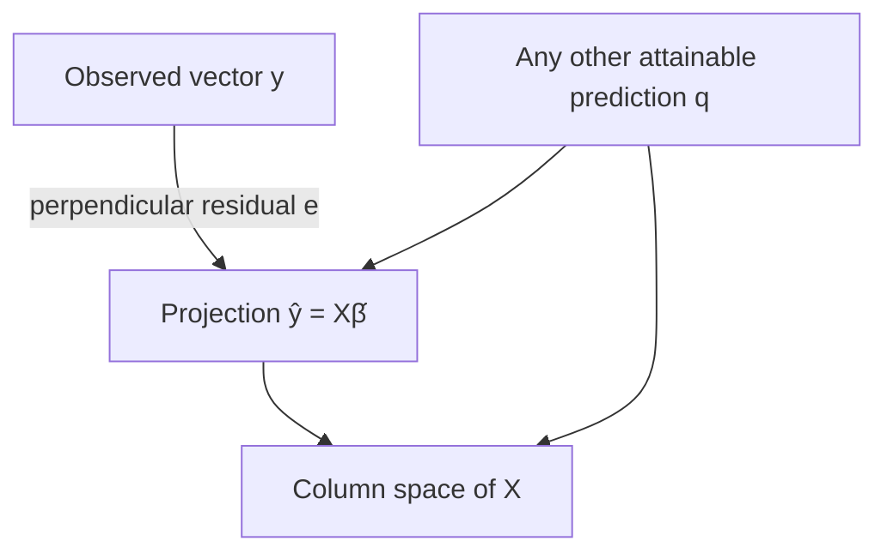

**Figure 4.1 — Projection view of OLS.** The diagram is conceptual: $\hat{y}$ and $q$ lie in the column space, while the residual from $\hat{y}$ to $y$ is perpendicular to it.

## 4.5 The Pythagorean proof of minimum distance

Let:

- $\hat{y}$ be the perpendicular projection of $y$ onto the column space of $X$;
- $q$ be any other prediction in the column space;
- $e=y-\hat{y}$ be the OLS residual; and
- $d=\hat{y}-q$ be the displacement within the column space.

Then:

$$
y-q=(y-\hat{y})+(\hat{y}-q)=e+d.
$$

Because $e$ is perpendicular to the entire column space and $d$ lies inside it:

$$
e^Td=0.
$$

Now expand the squared distance:

$$
\begin{aligned}
\lVert y-q\rVert_2^2
&=(e+d)^T(e+d)\\
&=e^Te+e^Td+d^Te+d^Td\\
&=\lVert e\rVert_2^2+\lVert d\rVert_2^2\\
&\ge \lVert e\rVert_2^2.
\end{aligned}
$$

The last step holds because a squared length cannot be negative. Therefore no other attainable prediction $q$ can be closer to $y$ than $\hat{y}$.

## 4.6 Why orthogonality produces the normal equations

Every column of $X$ lies in the column space. If the residual is perpendicular to the whole column space, it is perpendicular to every column:

$$
X^Te=0.
$$

Substitute $e=y-X\hat{\beta}$:

$$
X^T(y-X\hat{\beta})=0.
$$

Distribute $X^T$:

$$
X^Ty-X^TX\hat{\beta}=0.
$$

Rearrange:

$$
X^TX\hat{\beta}=X^Ty.
$$

These are the **normal equations**. “Normal” refers to perpendicularity, not to the normal probability distribution.

If an intercept column is present, one of the orthogonality conditions is:

$$
\mathbf{1}^Te=\sum_{i=1}^{n}e_i=0.
$$

Therefore OLS residuals from the training data sum to zero when the model includes an intercept, up to floating-point error.

## 4.7 Code proof: orthogonality and Pythagoras

```python
import numpy as np

x = np.array([1.0, 2.0, 3.0, 4.0])
y = np.array([12.0, 19.0, 29.0, 38.0])
X = np.column_stack([np.ones(x.size), x])

beta_hat = np.linalg.solve(X.T @ X, X.T @ y)
y_hat = X @ beta_hat
e = y - y_hat

# Orthogonality: one near-zero dot product per design column
print("X.T @ e =", X.T @ e)
assert np.allclose(X.T @ e, np.zeros(X.shape[1]), atol=1e-10)

# Intercept implication: residuals sum to zero
assert np.isclose(e.sum(), 0.0, atol=1e-10)

# Choose another attainable prediction q = X @ beta_other
beta_other = beta_hat + np.array([2.0, -1.0])
q = X @ beta_other
d = y_hat - q

left = np.linalg.norm(y - q) ** 2
right = np.linalg.norm(e) ** 2 + np.linalg.norm(d) ** 2

print("Pythagorean sides:", left, right)
assert np.isclose(e @ d, 0.0, atol=1e-10)
assert np.isclose(left, right, atol=1e-10)
assert left >= np.linalg.norm(e) ** 2
```

This block verifies three equations: the normal-equation orthogonality condition, the zero-sum residual property, and the Pythagorean decomposition.

## 4.8 Figure lab: draw the projection in three dimensions

Three observations allow the target and prediction vectors to be drawn in $\mathbb{R}^3$.

```python
import matplotlib.pyplot as plt
import numpy as np

x = np.array([-1.0, 0.0, 1.0])
X = np.column_stack([np.ones(3), x])
y = np.array([1.0, 3.0, 2.0])

beta_hat = np.linalg.solve(X.T @ X, X.T @ y)
y_hat = X @ beta_hat
e = y - y_hat

fig = plt.figure(figsize=(8, 7))
ax = fig.add_subplot(111, projection="3d")
origin = np.zeros(3)

ax.quiver(*origin, *y, color="navy", label="Observed y", arrow_length_ratio=0.08)
ax.quiver(*origin, *y_hat, color="darkgreen", label="Projection ŷ", arrow_length_ratio=0.08)
ax.quiver(*y_hat, *e, color="firebrick", label="Residual e", arrow_length_ratio=0.15)

# Draw a patch of the column space span{ones, x}
a = np.linspace(-0.5, 2.5, 10)
b = np.linspace(-1.0, 1.0, 10)
A, B = np.meshgrid(a, b)
plane = A[..., None] * X[:, 0] + B[..., None] * X[:, 1]
ax.plot_surface(plane[..., 0], plane[..., 1], plane[..., 2], alpha=0.2)

ax.set_xlabel("Project 1 coordinate")
ax.set_ylabel("Project 2 coordinate")
ax.set_zlabel("Project 3 coordinate")
ax.set_title("OLS projects y onto the column space of X")
ax.legend()
plt.tight_layout()
plt.show()
```

**Figure 4.2 — OLS geometry in observation space.** The residual begins at $\hat{y}$ and ends at $y$; it is perpendicular to the surface of attainable predictions.

## 4.9 Build: metrics as methods

Add these methods to `MHPCostEstimator`:

```python
    @staticmethod
    def _metrics_from_predictions(y, y_hat):
        y = np.asarray(y, dtype=float).reshape(-1)
        y_hat = np.asarray(y_hat, dtype=float).reshape(-1)
        if y.shape != y_hat.shape:
            raise ValueError("y and y_hat must have identical shapes")

        residuals = y - y_hat
        ssr = float(residuals @ residuals)
        mse = ssr / residuals.size
        return {
            "ssr": ssr,
            "mse": mse,
            "rmse": float(np.sqrt(mse)),
            "mae": float(np.mean(np.abs(residuals))),
        }

    def evaluate(self, X, y):
        """Evaluate a fitted model on supplied observations."""
        X, y = self._validate_inputs(X, y)
        y_hat = self.predict(X)
        return self._metrics_from_predictions(y, y_hat)
```

The method does not call these “test metrics” because the caller may supply training, validation, or test data. The application should not pretend to know the provenance of an array.

## 4.10 Break it deliberately: one outlier

```python
y = np.array([20.0, 22.0, 24.0, 26.0])
y_hat = np.array([21.0, 21.0, 25.0, 25.0])

ordinary = regression_metrics(y, y_hat)

y_with_error = y.copy()
y_with_error[-1] = 260.0  # possible extra zero in data entry
contaminated = regression_metrics(y_with_error, y_hat)

print("Ordinary:    ", ordinary)
print("Contaminated:", contaminated)
```

Compare the change in RMSE and MAE. Do not conclude merely that MAE is “better.” First determine whether 260 is a genuine extreme project, a different type of project, or an error. Robustness cannot replace data investigation.

## 4.11 Day 4 practice

1. Calculate the residuals and SSR for $y=[3,5]$ and $\hat{y}=[4,3]$.
2. Prove in code that RMSE has the same units as the target under a change from million PKR to PKR.
3. Why does including an intercept make training residuals sum to zero?
4. Does a zero sum of residuals imply a good model? Construct a counterexample.
5. Modify Figure 4.2 by choosing a new $y$. Verify that `X.T @ e` remains near zero.

### Day 4 exit check

You should be able to explain OLS without calculus:

> “Among all prediction vectors that can be constructed from the columns of $X$, OLS chooses the one with the shortest squared distance to $y$.”

---

# Day 5 — Deriving, Fitting, and Stress-Testing OLS

> **Today’s central idea:** OLS is the parameter value that makes the squared-error surface as small as possible. The normal equation is a consequence, not a formula to memorise.

Day 4 reached the normal equations through geometry:

$$
X^TX\hat{\beta}=X^Ty.
$$

Today we reach the same point through calculus, first with one feature and then with matrices. The two derivations are complementary:

- geometry explains **what** OLS is doing; and
- calculus explains **how** the optimum is located.

## 5.1 The scalar error bowl

Begin with a model that has one parameter and no intercept:

$$
\hat{y}_i=\beta x_i.
$$

The squared-error objective is:

$$
S(\beta)=\sum_{i=1}^{n}(y_i-\beta x_i)^2.
$$

Expand one squared term:

$$
(y_i-\beta x_i)^2
=y_i^2-2\beta x_iy_i+\beta^2x_i^2.
$$

Therefore:

$$
S(\beta)
=\sum_i y_i^2
-2\beta\sum_i x_iy_i
+\beta^2\sum_i x_i^2.
$$

Differentiate with respect to $\beta$:

$$
\frac{dS}{d\beta}
=-2\sum_i x_iy_i
+2\beta\sum_i x_i^2.
$$

At a stationary point, the derivative is zero:

$$
-2\sum_i x_iy_i+2\hat{\beta}\sum_i x_i^2=0.
$$

Rearrange:

$$
\hat{\beta}
=\frac{\sum_i x_iy_i}{\sum_i x_i^2}.
$$

The second derivative is:

$$
\frac{d^2S}{d\beta^2}=2\sum_i x_i^2.
$$

If at least one $x_i$ is nonzero, the second derivative is positive, so the stationary point is the unique minimum.

### Code proof: derivative, grid search, and analytic solution

```python
import numpy as np

x = np.array([1.0, 2.0, 3.0])
y = np.array([2.0, 4.0, 7.0])

def ssr_through_origin(beta, x, y):
    return np.sum((y - beta * x) ** 2)

def derivative_through_origin(beta, x, y):
    return -2.0 * np.sum(x * y) + 2.0 * beta * np.sum(x ** 2)

beta_hat = np.sum(x * y) / np.sum(x ** 2)
grid = np.linspace(0.0, 4.0, 4001)
grid_best = grid[np.argmin([ssr_through_origin(b, x, y) for b in grid])]

print("Analytic minimum:", beta_hat)
print("Grid minimum:    ", grid_best)
print("Derivative there:", derivative_through_origin(beta_hat, x, y))

assert np.isclose(derivative_through_origin(beta_hat, x, y), 0.0)
assert np.isclose(beta_hat, grid_best, atol=0.001)
assert 2.0 * np.sum(x ** 2) > 0.0
```

The grid is not how we want to fit the model; it is an independent numerical check that the analytic solution sits at the bottom of the bowl.

## 5.2 One feature with an intercept

Now use:

$$
\hat{y}_i=\beta_0+\beta_1x_i.
$$

The objective is:

$$
S(\beta_0,\beta_1)
=\sum_{i=1}^{n}(y_i-\beta_0-\beta_1x_i)^2.
$$

There are two unknown parameters, so there are two partial derivatives.

For the intercept:

$$
\frac{\partial S}{\partial\beta_0}
=-2\sum_i(y_i-\beta_0-\beta_1x_i).
$$

Set it to zero:

$$
\sum_i y_i-n\hat{\beta}_0-\hat{\beta}_1\sum_i x_i=0.
$$

Divide by $n$:

$$
\bar{y}-\hat{\beta}_0-\hat{\beta}_1\bar{x}=0,
$$

so:

$$
\hat{\beta}_0=\bar{y}-\hat{\beta}_1\bar{x}.
$$

This proves that the fitted OLS line with an intercept passes through $(\bar{x},\bar{y})$.

For the slope:

$$
\frac{\partial S}{\partial\beta_1}
=-2\sum_i x_i(y_i-\beta_0-\beta_1x_i).
$$

Substituting the intercept relationship and simplifying gives:

$$
\hat{\beta}_1=
\frac{\sum_i(x_i-\bar{x})(y_i-\bar{y})}
{\sum_i(x_i-\bar{x})^2}.
$$

The numerator is the unnormalised co-movement of $x$ and $y$; the denominator is the unnormalised variation in $x$. If every $x_i$ is identical, the denominator is zero and the slope cannot be identified.

### Code proof: centred formula, intercept, and mean point

```python
x = np.array([1.0, 2.0, 3.0, 4.0])
y = np.array([12.0, 19.0, 29.0, 38.0])

x_centered = x - x.mean()
y_centered = y - y.mean()

beta_1 = np.sum(x_centered * y_centered) / np.sum(x_centered ** 2)
beta_0 = y.mean() - beta_1 * x.mean()

print("beta_0:", beta_0)
print("beta_1:", beta_1)

# The fitted line passes through (x̄, ȳ)
assert np.isclose(beta_0 + beta_1 * x.mean(), y.mean())

# Both partial derivatives are zero
residuals = y - (beta_0 + beta_1 * x)
partial_b0 = -2.0 * np.sum(residuals)
partial_b1 = -2.0 * np.sum(x * residuals)
assert np.isclose(partial_b0, 0.0, atol=1e-10)
assert np.isclose(partial_b1, 0.0, atol=1e-10)
```

## 5.3 The matrix objective

For multiple features, collect all parameters in $\beta$ and write:

$$
S(\beta)=(y-X\beta)^T(y-X\beta).
$$

Expand carefully:

$$
\begin{aligned}
S(\beta)
&=(y^T-\beta^TX^T)(y-X\beta)\\
&=y^Ty-y^TX\beta-\beta^TX^Ty+\beta^TX^TX\beta.
\end{aligned}
$$

The middle two terms are scalars and transposes of one another, so they are equal:

$$
y^TX\beta=(y^TX\beta)^T=\beta^TX^Ty.
$$

Therefore:

$$
S(\beta)
=y^Ty-2\beta^TX^Ty+\beta^TX^TX\beta.
$$

## 5.4 The matrix derivative without hand-waving

Three derivative facts are needed.

First, $y^Ty$ contains no $\beta$, so:

$$
\nabla_\beta(y^Ty)=0.
$$

Second, for a constant vector $c$:

$$
\nabla_\beta(\beta^Tc)=c.
$$

Thus:

$$
\nabla_\beta(-2\beta^TX^Ty)=-2X^Ty.
$$

Third, let $A=X^TX$. Expand the quadratic form by coordinates:

$$
\beta^TA\beta=\sum_j\sum_k\beta_jA_{jk}\beta_k.
$$

The derivative with respect to coordinate $\beta_r$ collects terms where $j=r$ and where $k=r$:

$$
\frac{\partial}{\partial\beta_r}(\beta^TA\beta)
=\sum_kA_{rk}\beta_k+\sum_j\beta_jA_{jr}.
$$

In vector form:

$$
\nabla_\beta(\beta^TA\beta)=(A+A^T)\beta.
$$

Because $A=X^TX$ is symmetric, $A=A^T$:

$$
\nabla_\beta(\beta^TX^TX\beta)=2X^TX\beta.
$$

Combine the three derivatives:

$$
\nabla_\beta S(\beta)
=-2X^Ty+2X^TX\beta.
$$

At the minimum:

$$
-2X^Ty+2X^TX\hat{\beta}=0,
$$

which reduces again to:

$$
X^TX\hat{\beta}=X^Ty.
$$

### Code proof: compare the analytic gradient with finite differences

A finite-difference gradient estimates each partial derivative by nudging one parameter a very small distance:

$$
\frac{\partial S}{\partial\beta_j}
\approx
\frac{S(\beta+h\,u_j)-S(\beta-h\,u_j)}{2h},
$$

where $u_j$ is a vector with 1 in position $j$ and 0 elsewhere.

```python
import numpy as np

X = np.array([
    [1.0, 1.0],
    [1.0, 2.0],
    [1.0, 3.0],
    [1.0, 4.0],
])
y = np.array([12.0, 19.0, 29.0, 38.0])
beta = np.array([4.0, 7.0])

def ssr(beta_vector):
    residuals = y - X @ beta_vector
    return residuals @ residuals

analytic_gradient = -2.0 * X.T @ (y - X @ beta)

h = 1e-6
finite_difference_gradient = np.zeros_like(beta)
for j in range(beta.size):
    unit = np.zeros_like(beta)
    unit[j] = 1.0
    finite_difference_gradient[j] = (
        ssr(beta + h * unit) - ssr(beta - h * unit)
    ) / (2.0 * h)

print("Analytic:", analytic_gradient)
print("Finite difference:", finite_difference_gradient)
assert np.allclose(analytic_gradient, finite_difference_gradient, rtol=1e-6)
```

The finite-difference calculation is an independent numerical audit of the matrix derivative. A poor choice of $h$ can introduce approximation or floating-point error; its role is verification, not fitting.

## 5.5 Isolating $\hat{\beta}$ and stating the missing condition

If $X^TX$ is invertible:

$$
\hat{\beta}=(X^TX)^{-1}X^Ty.
$$

This famous closed form is valid only when the design matrix has full column rank. In plain language, no design column can be constructed exactly from the others, and there must be enough independent information to estimate every parameter.

The Hessian—the matrix of second derivatives—is:

$$
\nabla_\beta^2S(\beta)=2X^TX.
$$

For any vector $z$:

$$
z^TX^TXz=(Xz)^T(Xz)=\lVert Xz\rVert_2^2\ge0.
$$

Thus $X^TX$ is positive semidefinite and the objective is convex. If $X$ has full column rank, $Xz\ne0$ for every nonzero $z$, so the quantity is strictly positive and the objective is strictly convex. The minimiser is then unique.

### Code proof: positive semidefiniteness

```python
rng = np.random.default_rng(7)
X = rng.normal(size=(20, 4))
z = rng.normal(size=4)

left = z.T @ X.T @ X @ z
right = np.linalg.norm(X @ z) ** 2

print(left, right)
assert np.isclose(left, right)
assert left >= -1e-12  # tolerance for floating-point roundoff
```

## 5.6 Why we do not compute the inverse in application code

The derivation uses $(X^TX)^{-1}$ to express the mathematical solution. A program should usually solve:

$$
(X^TX)\hat{\beta}=X^Ty
$$

with:

```python
beta_hat = np.linalg.solve(X.T @ X, X.T @ y)
```

Better still for OLS, solve the least-squares problem directly:

```python
beta_hat, residual_sums, rank, singular_values = np.linalg.lstsq(X, y, rcond=None)
```

Why?

- Forming $X^TX$ squares the condition number and can magnify numerical instability.
- Explicit inversion performs unnecessary work.
- `lstsq` uses a decomposition designed for least-squares problems and also reports rank and singular values.

This is not a conceptual shortcut. We have already built and derived the objective. It is a numerical implementation choice that respects the same mathematics.

### Research note: fitting assumptions are not inference assumptions

The OLS coefficient calculation does **not** require the residuals to be normally distributed. To compute a least-squares projection, we need a defined numerical problem; for a unique coefficient vector, we additionally need full column rank.

Stronger claims require stronger assumptions. Unbiased causal or explanatory coefficients require a defensible relationship between included features and the unobserved error. Classical small-sample confidence intervals add assumptions about variance and, in some treatments, normality. Consistency, robust standard errors, clustered data, and sampling design introduce further conditions.

Keep three layers separate:

1. **Algebra:** Did the program minimise SSR correctly?
2. **Statistical generalisation:** Does this sample support claims about new projects or a wider population?
3. **Causal interpretation:** Does the design identify an intervention effect?

A perfect answer at the first layer does not settle the next two.

## 5.7 Rank failure: two columns carrying the same information

Suppose the design matrix includes both cable length in kilometres and the same cable length in metres:

$$
x_{\text{metres}}=1000x_{\text{kilometres}}.
$$

One column is an exact multiple of another. The model cannot decide how much coefficient to assign to each, because infinitely many pairs produce the same combined prediction.


**Figure 5.1 — Perfect multicollinearity.** More columns do not necessarily provide more information.

### Break it deliberately

```python
x_km = np.array([1.0, 2.0, 3.0, 4.0])
x_m = 1000.0 * x_km
y = np.array([12.0, 19.0, 29.0, 38.0])

X_bad = np.column_stack([np.ones(x_km.size), x_km, x_m])

print("columns:", X_bad.shape[1])
print("rank:   ", np.linalg.matrix_rank(X_bad))

try:
    beta_bad = np.linalg.solve(X_bad.T @ X_bad, X_bad.T @ y)
except np.linalg.LinAlgError as error:
    print("Normal-equation solve failed:", error)

beta_lstsq, _, rank, singular_values = np.linalg.lstsq(X_bad, y, rcond=None)
print("One least-squares solution:", beta_lstsq)
print("Reported rank:", rank)
print("Singular values:", singular_values)
```

`lstsq` can return a prediction-minimising solution, but the individual coefficients on kilometres and metres are not separately meaningful. A numerical answer does not repair an unidentified interpretation.

The correct response is usually to remove the redundant feature or redesign the representation—not to celebrate that the program returned numbers.

## 5.8 Figure lab: see the error valley

For a model with an intercept and one slope, SSR is a surface over $(\beta_0,\beta_1)$.

```python
import matplotlib.pyplot as plt
import numpy as np

x = np.array([1.0, 2.0, 3.0, 4.0])
y = np.array([12.0, 19.0, 29.0, 38.0])

b0_grid = np.linspace(-5.0, 20.0, 200)
b1_grid = np.linspace(2.0, 12.0, 200)
B0, B1 = np.meshgrid(b0_grid, b1_grid)

SSR = np.zeros_like(B0)
for i in range(x.size):
    SSR += (y[i] - (B0 + B1 * x[i])) ** 2

X = np.column_stack([np.ones(x.size), x])
beta_hat = np.linalg.lstsq(X, y, rcond=None)[0]

plt.figure(figsize=(8, 6))
contours = plt.contour(B0, B1, SSR, levels=25)
plt.clabel(contours, inline=True, fontsize=7)
plt.scatter(beta_hat[0], beta_hat[1], color="red", s=80, label="OLS minimum")
plt.xlabel("Intercept β₀")
plt.ylabel("Slope β₁")
plt.title("Contours of the OLS error surface")
plt.legend()
plt.tight_layout()
plt.show()
```

**Figure 5.2 — The OLS error valley.** Each contour joins parameter pairs with equal SSR. The centre is the minimum. With highly correlated features, the contours become long and narrow; with perfect collinearity, the unique centre becomes a flat valley.

## 5.9 Build: the complete Week 1 estimator

The complete application below consolidates the daily increments. Replace the partial `mhp_estimator.py` with this version.

```python
from dataclasses import dataclass
from typing import Literal, Sequence

import numpy as np


AnalysisPurpose = Literal["prediction", "explanation", "causation"]


@dataclass(frozen=True)
class AnalysisContract:
    purpose: AnalysisPurpose
    target_name: str
    target_unit: str
    unit_of_observation: str
    intended_use: str

    def __post_init__(self):
        allowed = {"prediction", "explanation", "causation"}
        if self.purpose not in allowed:
            raise ValueError(f"purpose must be one of {sorted(allowed)}")
        for name, value in vars(self).items():
            if not str(value).strip():
                raise ValueError(f"{name} cannot be empty")


class MHPCostEstimator:
    """Small OLS estimator for learning, diagnostics, and explicit reasoning."""

    def __init__(self, contract: AnalysisContract):
        self.contract = contract
        self.parameters_ = None
        self.feature_names_ = None
        self.rank_ = None
        self.singular_values_ = None
        self.training_metrics_ = None
        self.is_fitted_ = False

    def __repr__(self):
        status = "fitted" if self.is_fitted_ else "unfitted"
        return f"MHPCostEstimator(purpose={self.contract.purpose!r}, {status})"

    @staticmethod
    def _validate_inputs(X, y=None):
        X = np.asarray(X, dtype=float)
        if X.ndim == 1:
            X = X.reshape(-1, 1)
        if X.ndim != 2:
            raise ValueError(f"X must be 2D after conversion; got shape {X.shape}")
        if X.shape[0] == 0 or X.shape[1] == 0:
            raise ValueError("X must contain at least one row and one feature")
        if not np.isfinite(X).all():
            raise ValueError("X contains NaN or infinite values")

        if y is None:
            return X

        y = np.asarray(y, dtype=float)
        if y.ndim == 2 and y.shape[1] == 1:
            y = y.reshape(-1)
        if y.ndim != 1:
            raise ValueError(f"y must be 1D; got shape {y.shape}")
        if X.shape[0] != y.shape[0]:
            raise ValueError(
                f"row mismatch: X has {X.shape[0]} rows but y has {y.shape[0]}"
            )
        if not np.isfinite(y).all():
            raise ValueError("y contains NaN or infinite values")
        return X, y

    @staticmethod
    def _add_intercept_column(X):
        return np.column_stack([np.ones(X.shape[0]), X])

    @staticmethod
    def _metrics_from_predictions(y, y_hat):
        y = np.asarray(y, dtype=float).reshape(-1)
        y_hat = np.asarray(y_hat, dtype=float).reshape(-1)
        if y.shape != y_hat.shape:
            raise ValueError("y and y_hat must have identical shapes")

        residuals = y - y_hat
        ssr = float(residuals @ residuals)
        mse = ssr / residuals.size
        return {
            "ssr": ssr,
            "mse": mse,
            "rmse": float(np.sqrt(mse)),
            "mae": float(np.mean(np.abs(residuals))),
        }

    def fit(self, X, y, feature_names: Sequence[str]):
        X, y = self._validate_inputs(X, y)
        feature_names = [str(name).strip() for name in feature_names]

        if len(feature_names) != X.shape[1]:
            raise ValueError(
                f"received {len(feature_names)} names for {X.shape[1]} features"
            )
        if any(not name for name in feature_names):
            raise ValueError("feature names cannot be empty")
        if len(set(feature_names)) != len(feature_names):
            raise ValueError("feature names must be unique")

        X_design = self._add_intercept_column(X)
        parameters, _, rank, singular_values = np.linalg.lstsq(
            X_design, y, rcond=None
        )

        required_rank = X_design.shape[1]
        if rank < required_rank:
            raise ValueError(
                "design matrix is rank deficient: "
                f"rank {rank}, but {required_rank} independent columns are required"
            )

        self.parameters_ = parameters
        self.feature_names_ = feature_names
        self.rank_ = int(rank)
        self.singular_values_ = singular_values
        self.is_fitted_ = True

        training_predictions = X_design @ self.parameters_
        self.training_metrics_ = self._metrics_from_predictions(
            y, training_predictions
        )
        return self

    def predict(self, X):
        if not self.is_fitted_:
            raise RuntimeError("fit the estimator before calling predict")

        X = np.asarray(X, dtype=float)
        if X.ndim == 1:
            X = X.reshape(1, -1)
        X = self._validate_inputs(X)
        if X.shape[1] != len(self.feature_names_):
            raise ValueError(
                f"expected {len(self.feature_names_)} features, got {X.shape[1]}"
            )

        return self._add_intercept_column(X) @ self.parameters_

    def evaluate(self, X, y):
        X, y = self._validate_inputs(X, y)
        return self._metrics_from_predictions(y, self.predict(X))

    def coefficients(self):
        if not self.is_fitted_:
            raise RuntimeError("fit the estimator before requesting coefficients")
        names = ["intercept", *self.feature_names_]
        return dict(zip(names, self.parameters_))
```

## 5.10 End-to-end use on synthetic KP projects

The small dataset below has three pre-construction features. Keeping it small makes the entire calculation inspectable; it is not enough for a real deployment.

```python
import numpy as np

contract = AnalysisContract(
    purpose="prediction",
    target_name="actual_cost_m_pkr",
    target_unit="million PKR",
    unit_of_observation="one completed MHP project",
    intended_use="design-stage budget review for approved projects",
)

# Columns: road distance (km), planned capacity (kW), terrain index (1–5)
X_train = np.array([
    [5.0,  80.0, 2.0],
    [8.0, 100.0, 2.0],
    [12.0, 120.0, 3.0],
    [15.0, 150.0, 3.0],
    [18.0, 160.0, 4.0],
    [22.0, 180.0, 4.0],
    [25.0, 200.0, 5.0],
    [30.0, 240.0, 5.0],
])

y_train = np.array([19.0, 23.0, 30.0, 35.0, 42.0, 47.0, 55.0, 63.0])

model = MHPCostEstimator(contract).fit(
    X_train,
    y_train,
    feature_names=["road_distance_km", "planned_capacity_kw", "terrain_index"],
)

print(model)
print("Coefficients:", model.coefficients())
print("Training metrics:", model.training_metrics_)

X_new = np.array([
    [20.0, 170.0, 4.0],
    [10.0, 110.0, 3.0],
])
print("New predictions:", model.predict(X_new))
```

### Interpretation discipline

If the fitted road-distance coefficient is positive, the prediction reading is:

> “Holding the other included numerical features fixed, the fitted rule adds this many million PKR for each additional kilometre of recorded road distance.”

It is **not** automatically:

> “Building one kilometre of road will change MHP cost by this amount.”

The second statement is causal and may even reverse the intervention: the feature is distance from a road, while the action is constructing a road.

Also inspect whether “holding capacity and terrain fixed” describes plausible comparisons in the dataset. Regression can calculate contrasts that the observed projects barely support.

## 5.11 Verify the class against the equations

```python
X_design = np.column_stack([np.ones(X_train.shape[0]), X_train])
beta_from_normal_equations = np.linalg.solve(
    X_design.T @ X_design,
    X_design.T @ y_train,
)

assert np.allclose(model.parameters_, beta_from_normal_equations)

residuals = y_train - model.predict(X_train)
assert np.allclose(X_design.T @ residuals, 0.0, atol=1e-9)
assert np.isclose(residuals.sum(), 0.0, atol=1e-9)

metrics = model.evaluate(X_train, y_train)
assert np.isclose(metrics["ssr"], residuals @ residuals)
assert np.isclose(metrics["rmse"], np.sqrt(np.mean(residuals ** 2)))
```

These are not decorative tests. Each one ties an application output to a mathematical result developed earlier in the chapter.

## 5.12 What the completed application still cannot do

The Week 1 estimator is a learning instrument, not a deployment-ready public investment system. It does not yet:

- split data into training, validation, and test sets;
- handle categorical districts, project types, or contractors;
- standardise features or examine conditioning;
- quantify coefficient uncertainty;
- diagnose heteroskedasticity, nonlinearity, or influential observations;
- model time trends, inflation, or district-level clustering;
- protect against data leakage across project phases;
- establish causal effects;
- document data lineage, permissions, or revision history; or
- monitor performance when construction conditions change.

Recognising these limits is part of mastery.

## 5.13 Day 5 practice

1. Derive the through-origin slope without looking at the text.
2. Explain, by coordinates, why the derivative of $\beta^TA\beta$ is $(A+A^T)\beta$.
3. Construct a full-rank matrix with four rows and three columns. Confirm its rank in NumPy.
4. Make one column an exact combination of the other columns. Confirm the rank loss.
5. Change one target in the end-to-end dataset by 20 million PKR. Compare coefficient changes, RMSE, and MAE.
6. Fit the same data after converting road distance from kilometres to metres. Verify that predictions are unchanged and explain the coefficient change.
7. Write a one-paragraph briefing for a senior manager that reports a prediction, its unit, its intended use, and two limitations without using mathematical jargon.

### Day 5 exit check

You are ready to leave Week 1 when you can move in both directions:

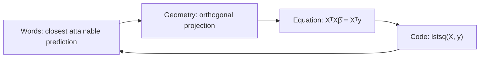

---

# Week 1 Capstone — Build It, Break It, Rebuild It

## Capstone brief

You are given 40 synthetic completed MHP projects and asked to create an early-stage cost estimator. Complete the work in four passes.

### Pass 1: define

Write the `AnalysisContract`. State:

- the unit of observation;
- the target and price basis;
- the point in the project cycle when prediction occurs;
- the decision supported; and
- whether the work is prediction, explanation, or causation.

### Pass 2: build

Use at least three features known at the stated prediction time. Fit the model, report coefficients with units, and calculate training metrics.

### Pass 3: break

Create and explain each failure:

1. a row-alignment error;
2. a missing or infinite value;
3. a redundant feature;
4. a feature recorded after construction begins; and
5. one extreme target value.

### Pass 4: rebuild

Correct the failures. Add a held-out set of projects. Compare training and held-out RMSE and MAE. Write a recommendation that separates what the model can support from what it cannot.

## Assessment rubric

| Dimension | Emerging | Competent | Mastery |
|---|---|---|---|
| Question | Purpose is vague | Purpose and target are stated | Estimand, timing, and intended use are precise |
| Mathematics | Formula copied | Main steps reproduced | Derivation explained and verified independently |
| Code | Runs once | Validates common failures | Tests equations, shapes, rank, and interpretation boundaries |
| Geometry | Terms repeated | Projection described | Column space, orthogonality, and minimum distance connected |
| Context | Generic example | KP units and features used | Institutional consequences and data limitations addressed |
| Communication | Numbers listed | Metrics interpreted | Decision, uncertainty, and limits clearly separated |

---

# Formula Sheet

| Concept | Equation | Meaning |
|---|---|---|
| Linear prediction | $\hat{y}=X\beta$ | Weighted combination of design columns |
| Residual | $e=y-\hat{y}$ | Actual minus predicted |
| SSR | $e^Te=\sum_i e_i^2$ | Total squared training error |
| MSE | $SSR/n$ | Mean squared error |
| RMSE | $\sqrt{SSR/n}$ | Squared-error summary in target units |
| MAE | $\frac{1}{n}\sum_i|e_i|$ | Mean absolute miss |
| Orthogonality | $X^Te=0$ | Residual perpendicular to every design column |
| Normal equations | $X^TX\hat{\beta}=X^Ty$ | First-order condition for OLS |
| Closed form | $(X^TX)^{-1}X^Ty$ | Unique solution when $X$ has full column rank |
| Scalar slope | $\frac{\sum_i(x_i-\bar{x})(y_i-\bar{y})}{\sum_i(x_i-\bar{x})^2}$ | One-feature slope with intercept |
| Scalar intercept | $\bar{y}-\hat{\beta}_1\bar{x}$ | Makes the line pass through the means |
| Hessian | $2X^TX$ | Curvature of the SSR surface |

---

# Glossary

**Association:** A numerical relationship in observed data; it need not be causal.

**Column space:** All vectors that can be formed as weighted combinations of a matrix’s columns.

**Confounder:** A common cause that can distort an exposure–outcome association.

**Counterfactual:** The outcome that would have occurred under an alternative action or condition.

**Design matrix:** The rectangular matrix of features used to construct model predictions.

**Estimator:** A rule or algorithm that converts data into parameter estimates.

**Feature:** An input variable used by a model.

**Full column rank:** A condition in which no design column is an exact linear combination of the others.

**Gradient:** A vector of partial derivatives; it points in the direction of steepest local increase.

**Hessian:** A matrix of second derivatives describing local curvature.

**Hyperparameter:** A modeling setting chosen rather than estimated by the fitting calculation.

**Intercept:** The constant term added to every linear prediction.

**Loss function:** A numerical rule that penalises prediction error during fitting.

**Multicollinearity:** Strong linear dependence among features; perfect multicollinearity causes rank deficiency.

**Observation:** One unit represented by one row of the dataset.

**OLS:** Ordinary least squares, the estimator that minimises the sum of squared residuals.

**Parameter:** A numerical value learned from data by an estimator.

**Projection:** The closest point in a subspace to a given vector under Euclidean distance.

**Rank:** The number of linearly independent directions represented by a matrix.

**Residual:** The observed target minus its fitted prediction.

**Target:** The outcome the model estimates.

**Target leakage:** Use of information that would not legitimately be available at prediction time.

---

# Instructor and Self-Study Notes

## Suggested daily timebox

| Activity | Minutes |
|---|---:|
| Orient and retrieve prior knowledge | 15 |
| Work through the central derivation | 35 |
| Run and alter the proof code | 35 |
| Create or inspect the figure | 20 |
| Extend the application | 35 |
| Break-and-repair exercise | 25 |
| Exit check and written reflection | 15 |
| **Total** | **180** |

Three hours is a guide, not a race. If a learner cannot explain yesterday’s exit check, begin there rather than adding more notation.

## Retrieval prompts for the next morning

- After Day 1: “Name the three regression jobs and one risk of each.”
- After Day 2: “Draw the shapes of $X$, $y$, and $\beta$.”
- After Day 3: “Expand one row of $X\beta$ and explain the ones column.”
- After Day 4: “Why is the OLS residual perpendicular to $X$?”
- After Day 5: “State the normal equations and the condition for a unique coefficient vector.”

## Guidance on the KP context

Context should discipline the mathematics, not decorate it. Ask repeatedly:

- At what project stage is this field known?
- Who recorded it and for what administrative purpose?
- Does one row mean the same thing across districts and implementing partners?
- Are costs expressed in the same price year?
- Does a terrain index of 4 mean the same thing to every assessor?
- Could the model penalise remote projects for structural conditions outside field teams’ control?
- Would an apparent “efficiency” relationship survive a fair comparison of project types?

These questions connect modeling capability to institutional responsibility.

---

# Where Week 2 Begins

Week 1 ends with a correct small OLS implementation and an honest account of its limits. Week 2 should extend the same application in this order:

1. numerical conditioning and feature scaling;
2. QR and singular-value views of least squares;
3. probability models and maximum likelihood;
4. gradient descent built from the OLS gradient;
5. train/validation/test separation;
6. coefficient and prediction uncertainty; and
7. diagnostic plots and model revision.

The next week should not treat these as disconnected techniques. Each one answers a problem exposed by the model built here.

---

## Final reflection

The intellectual achievement of Week 1 is not the formula $(X^TX)^{-1}X^Ty$. It is the chain of reasoning around it:

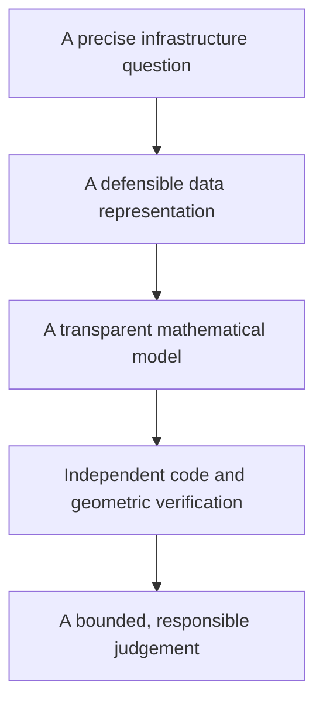

You now know enough to be dangerous if you report coefficients carelessly—and enough to begin becoming useful if you preserve the chain from question to judgement.

\newpage

# Chapter 2 — From a Fitted Line to a Trustworthy Model

## Level 2 Model Builder: the next seven days of the MHP Cost Estimator

> **Central promise.** Chapter 1 taught you to derive and fit ordinary least squares (OLS). By the end of this chapter, you will be able to explain when that calculation is numerically stable, connect least squares to probability, fit it by gradient descent, measure performance on genuinely unseen projects, compare it with honest baselines and a shallow decision tree, quantify several kinds of uncertainty, diagnose failure patterns, and defend an evaluation design before a technical reviewer.

The learner is still assumed to be a beginner. Nothing important is hidden behind the phrase “the library does it.” We first construct each idea with small arrays and equations. Only after the mechanism is visible do we use `scikit-learn` to assemble a reliable workflow.

The long-term destination is research-level practice. That does **not** mean introducing every advanced term immediately. It means building habits that remain valid when the datasets, models, and papers become difficult:

- define the intended use before choosing an evaluation;
- separate mathematical computation from statistical evidence;
- distinguish information available at prediction time from information created later;
- treat model selection as part of the learning procedure;
- report uncertainty and subgroup failures, not only an average score; and
- connect claims to reproducible evidence.

---

## Why the original three-day draft needed a larger bridge

The earlier draft moved directly from OLS to three ready-made models, a data split, and three metrics. Those topics belong here, but an absolute beginner would have been asked to use several ideas before understanding them.

Chapter 1 explicitly identified the unresolved problems. The fitted line could be unstable when features have different scales; the normal-equation formula did not explain QR or singular values; OLS had not yet been connected to a probability model; the learner had derived a gradient but had not used it to learn; training error was not evidence about new projects; and uncertainty and diagnostic revision were still missing.

This chapter therefore follows the order promised at the end of Chapter 1.

## Learning outcomes

At the end of Chapter 2, you should be able to:

- explain floating-point approximation and numerical conditioning in plain language;
- standardise a feature using statistics calculated from the training data only;
- show why scaling changes coefficient units but need not change OLS predictions;
- calculate a condition number from singular values;
- solve least squares with QR decomposition and with the singular value decomposition (SVD);
- distinguish an error term from an observed residual;
- derive OLS as maximum likelihood under a Gaussian noise model;
- estimate residual variance, coefficient standard errors, confidence intervals, and prediction intervals under stated assumptions;
- derive and implement batch gradient descent for squared error;
- explain parameters, hyperparameters, fitting, selection, and evaluation as different operations;
- derive why the mean is the squared-error constant baseline and the median is the absolute-error constant baseline;
- recognise underfitting, overfitting, and distribution shift;
- choose among random, group, and temporal validation designs by matching the split to deployment;
- identify target, temporal, group, preprocessing, duplicate, and test-set leakage;
- explain ordinary, grouped, temporal, and nested cross-validation;
- calculate and interpret MAE, RMSE, median absolute error, and test-set $R^2$;
- explain why MAPE can be misleading for small or zero targets;
- inspect residuals by fitted value, time, district, and project scale;
- place uncertainty around a held-out performance estimate using a transparent bootstrap;
- state why fold-to-fold variation is not automatically a confidence interval; and
- read a research paper by separating its question, design, result, limitation, and implication.

## The seven-day route

| Day | Central idea | Problem it resolves |
|---|---|---|
| [Day 6](#day-6--scaling-and-numerical-conditioning) | Scaling and conditioning | Correct algebra can still produce fragile computation |
| [Day 7](#day-7--qr-svd-rank-and-the-pseudoinverse) | QR, SVD, rank, pseudoinverse | The inverse formula is not the safest or most general solver |
| [Day 8](#day-8--probability-likelihood-and-uncertainty) | Probability, likelihood, uncertainty | A fitted line alone does not quantify uncertainty |
| [Day 9](#day-9--gradient-descent-from-the-ols-gradient) | Gradient descent | A gradient becomes a learning algorithm |
| [Day 10](#day-10--generalisation-baselines-and-model-complexity) | Generalisation and baselines | Low training error can be meaningless |
| [Day 11](#day-11--honest-splitting-leakage-and-cross-validation) | Splits, leakage, cross-validation | Model selection can contaminate evaluation |
| [Day 12](#day-12--metrics-diagnostics-and-responsible-revision) | Metrics, diagnostics, revision | One average score can conceal operational failure |

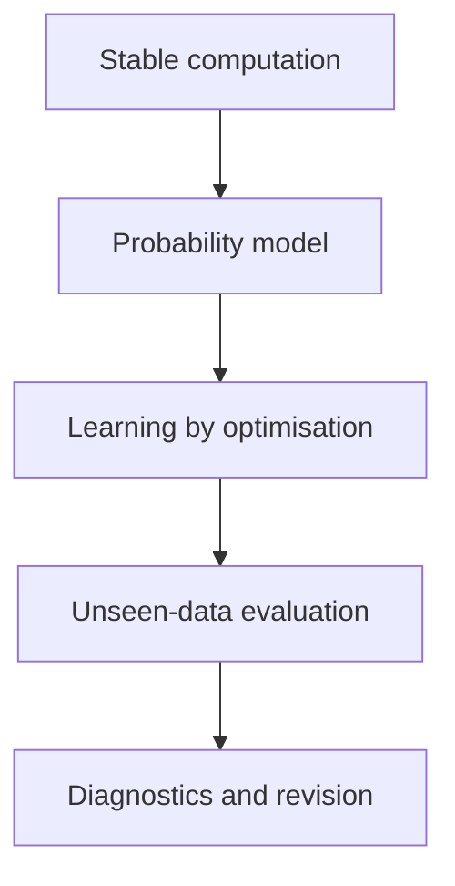

Each day uses Chapter 1’s rhythm: orient, construct, prove, see, build, break, and reflect.

---

## Running case: when is an MHP cost estimate made?

We continue with fictional microhydro power (MHP) projects in Khyber Pakhtunkhwa. The target is final project cost expressed in **constant 2025 million PKR**. Using constant prices removes general inflation from the target so that the model can focus on project differences. A later forecasting chapter can model nominal prices and inflation explicitly.

The prediction is made at technical appraisal, before procurement and construction. This timing rule decides which features are legitimate.

| Field | Available at appraisal? | Use as a feature? | Reason |
|---|---:|---:|---|
| Planned capacity | Yes | Yes | Known from design |
| Estimated cable length | Yes | Yes | Known approximately from survey |
| Road distance | Yes | Yes | Known from access assessment |
| Terrain index | Yes | Yes, cautiously | Known, but measurement consistency must be checked |
| District | Yes | Depends on deployment | Useful for known districts; problematic for unseen-district deployment |
| Start year | Yes | Yes, if the deployment design permits | May represent technical or institutional change |
| Final material bill | No | No | It is created during construction and leaks the outcome |
| Actual completion time | No | No | It is a later outcome, not an appraisal input |

> **Prediction-time test:** Imagine the appraisal officer sitting at a desk on the day the estimate must be issued. If the value is not legitimately available then, it cannot enter the feature matrix—even if it is present in the completed-project database.

## Chapter data generator

The following function creates a reproducible learning dataset. It deliberately contains nonlinearity, district structure, changing conditions over time, larger noise for remote projects, and one tempting post-construction field. These are not defects in the exercise; they create the problems an honest workflow must discover.

Save this as `chapter2_data.py`.

```python
import numpy as np
import pandas as pd


def make_mhp_projects(n=360, seed=2026):
    """Create fictional MHP projects for Chapter 2.

    The relationships are educational, not estimates of real KP projects.
    The target is final cost in constant 2025 million PKR.
    """
    rng = np.random.default_rng(seed)

    districts = np.array(["Chitral", "Dir", "Swat", "Shangla", "Kohistan"])
    district = rng.choice(districts, size=n, p=[0.22, 0.20, 0.24, 0.17, 0.17])
    start_year = rng.integers(2016, 2026, size=n)

    planned_capacity_kw = rng.uniform(80.0, 850.0, size=n)
    road_distance_km = np.clip(rng.gamma(shape=2.0, scale=6.0, size=n), 0.2, 42.0)
    terrain_index = rng.integers(1, 6, size=n)
    estimated_cable_km = np.clip(
        0.8 + 0.006 * planned_capacity_kw + rng.normal(0.0, 0.9, size=n),
        0.5,
        None,
    )

    district_effect = {
        "Chitral": 4.0,
        "Dir": 1.0,
        "Swat": 0.0,
        "Shangla": 2.5,
        "Kohistan": 5.0,
    }
    district_cost = np.array([district_effect[d] for d in district])

    remote_surcharge = 7.0 * (road_distance_km > 18.0)
    capacity_curve = 0.000025 * planned_capacity_kw**2
    time_change = 0.7 * (start_year - 2016)
    noise_sd = 2.5 + 0.12 * road_distance_km
    noise = rng.normal(0.0, noise_sd)

    actual_cost = (
        9.0
        + 0.030 * planned_capacity_kw
        + capacity_curve
        + 1.15 * estimated_cable_km
        + 0.85 * road_distance_km
        + 2.4 * terrain_index
        + remote_surcharge
        + district_cost
        + time_change
        + noise
    )

    # This is known only after procurement/construction. It is deliberately leaky.
    final_material_bill = 0.62 * actual_cost + rng.normal(0.0, 1.2, size=n)

    return pd.DataFrame(
        {
            "project_id": [f"MHP-{i:04d}" for i in range(n)],
            "district": district,
            "start_year": start_year,
            "planned_capacity_kw": planned_capacity_kw,
            "estimated_cable_km": estimated_cable_km,
            "road_distance_km": road_distance_km,
            "terrain_index": terrain_index,
            "final_material_bill_million_pkr": final_material_bill,
            "actual_cost_2025_million_pkr": actual_cost,
        }
    ).sort_values(["start_year", "project_id"]).reset_index(drop=True)


if __name__ == "__main__":
    projects = make_mhp_projects()
    projects.to_csv("mhp_projects_chapter2.csv", index=False)
    print(projects.head())
    print(projects.shape)
```

## Minimal software setup

Chapter 1 used NumPy and Matplotlib. This chapter adds pandas, SciPy, and scikit-learn:

```bash
python -m pip install numpy pandas matplotlib scipy scikit-learn
```

Record the environment used for an experiment:

```python
import numpy as np
import pandas as pd
import scipy
import sklearn

print("NumPy:", np.__version__)
print("pandas:", pd.__version__)
print("SciPy:", scipy.__version__)
print("scikit-learn:", sklearn.__version__)
```

A paper or report is not computationally reproducible if the data, code, random seeds, and software environment cannot be identified.

---

# Day 6 — Scaling and Numerical Conditioning

> **Today’s central idea:** Algebra asks whether a solution exists. Numerical analysis asks whether a computer can calculate that solution reliably with finite precision.

## 6.1 Computers approximate most real numbers

A computer stores floating-point numbers with a limited number of binary digits. Many ordinary decimal values cannot be represented exactly. This is why:

```python
print(0.1 + 0.2)
print((0.1 + 0.2) == 0.3)
```

prints a value close to 0.3 but the equality test is false.

This does not mean numerical computing is unreliable. It means calculations must be designed so that tiny representation errors are not unnecessarily magnified.

## 6.2 A well-posed problem can still be ill-conditioned

Suppose two datasets differ by a tiny amount. If their fitted coefficients also differ only slightly, the problem is well-conditioned. If a tiny data change causes a large coefficient change, it is ill-conditioned.

Conditioning belongs to the **problem and its representation**. Numerical stability belongs to the **algorithm** used to solve it. A stable algorithm cannot create information that nearly redundant features do not contain, but it can avoid making the situation worse.

For a full-column-rank matrix, the two-norm condition number is:

$$
\kappa_2(X)=\frac{\sigma_{\max}(X)}{\sigma_{\min}(X)},
$$

where:

- $\sigma_{\max}$ is the largest singular value;
- $\sigma_{\min}$ is the smallest singular value; and
- a larger ratio means that some directions in parameter space are much less informed than others.

A condition number near 1 is favourable. There is no universal number at which a model suddenly becomes invalid. Interpretation depends on floating-point precision, units, noise, and the decision. The condition number is a warning instrument, not a courtroom verdict.

## 6.3 Different units can create a numerical imbalance

In the same design matrix we might store:

- planned capacity around hundreds of kW;
- road distance around tens of km; and
- terrain on a 1–5 scale.

The columns then occupy very different numerical ranges. OLS predictions are not automatically wrong, but optimisation can become harder and coefficient comparison can become misleading.

Standardisation transforms feature $j$ using:

$$
z_{ij}=\frac{x_{ij}-\mu_j}{s_j},
$$

where $\mu_j$ and $s_j$ must be calculated from the **training data**.

After transformation:

- a value of $z=0$ is at the training mean;
- $z=1$ is one training standard deviation above the mean; and
- $z=-2$ is two training standard deviations below it.

## 6.4 Construct a scaler from scratch

```python
import numpy as np


class StandardScalerFromScratch:
    def fit(self, X):
        X = np.asarray(X, dtype=float)
        if X.ndim != 2:
            raise ValueError("X must be a two-dimensional matrix")

        self.mean_ = X.mean(axis=0)
        # ddof=0 matches the population-style convention used by StandardScaler.
        self.scale_ = X.std(axis=0, ddof=0)

        if np.any(self.scale_ == 0.0):
            bad = np.where(self.scale_ == 0.0)[0].tolist()
            raise ValueError(f"Constant feature columns cannot be scaled: {bad}")
        return self

    def transform(self, X):
        if not hasattr(self, "mean_"):
            raise RuntimeError("Call fit before transform")
        X = np.asarray(X, dtype=float)
        return (X - self.mean_) / self.scale_

    def inverse_transform(self, Z):
        Z = np.asarray(Z, dtype=float)
        return Z * self.scale_ + self.mean_

    def fit_transform(self, X):
        return self.fit(X).transform(X)


X_train = np.array(
    [
        [100.0, 2.0, 1.0],
        [250.0, 8.0, 2.0],
        [500.0, 14.0, 4.0],
        [800.0, 25.0, 5.0],
    ]
)

scaler = StandardScalerFromScratch()
Z_train = scaler.fit_transform(X_train)

print("Training means:", scaler.mean_)
print("Training scales:", scaler.scale_)
print("Scaled means:", Z_train.mean(axis=0))
print("Scaled standard deviations:", Z_train.std(axis=0, ddof=0))

assert np.allclose(Z_train.mean(axis=0), 0.0)
assert np.allclose(Z_train.std(axis=0, ddof=0), 1.0)
assert np.allclose(scaler.inverse_transform(Z_train), X_train)
```

### Population standard deviation versus sample standard deviation

Two common formulas differ in the denominator:

$$
s_{\text{population}}=\sqrt{\frac{1}{n}\sum_i(x_i-\bar{x})^2},
$$

$$
s_{\text{sample}}=\sqrt{\frac{1}{n-1}\sum_i(x_i-\bar{x})^2}.
$$

The second is used in classical estimation of a population variance. A feature scaler is performing a deterministic transformation of the observed training column, so many software libraries use the first convention. The important point is not to memorise one denominator for every purpose; it is to know which quantity is being calculated and why.

## 6.5 Why the test set must not teach the scaler

Assume older projects have a mean capacity of 300 kW and future projects have a mean of 600 kW. If the future test projects help calculate the mean and standard deviation, the transformation has already learned something about the future distribution.

The correct sequence is:

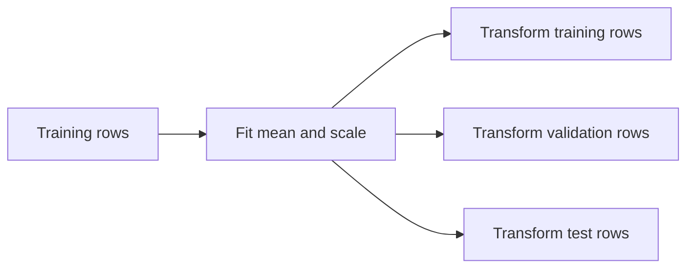

The validation and test sets receive the training transformation. They do not modify it.

```python
X_train = np.array([[100.0], [200.0], [300.0]])
X_test = np.array([[900.0], [1000.0]])

scaler = StandardScalerFromScratch().fit(X_train)
print("Correct test values:", scaler.transform(X_test).ravel())

# Wrong: this lets the test distribution influence preprocessing.
leaky_scaler = StandardScalerFromScratch().fit(np.vstack([X_train, X_test]))
print("Leaky test values:  ", leaky_scaler.transform(X_test).ravel())
```

The second result may look numerically more moderate. That is precisely the problem: it uses information the deployed model would not have had when it was trained.

## 6.6 Scaling changes coefficient units

Suppose the scaled model is:

$$
\hat y=\gamma_0+\sum_{j=1}^{p}\gamma_j z_j,
$$

and $z_j=(x_j-\mu_j)/s_j$. Substitute:

$$
\hat y
=\gamma_0+\sum_j\gamma_j\frac{x_j-\mu_j}{s_j}.
$$

Rearrange:

$$
\hat y
=\left(\gamma_0-\sum_j\frac{\gamma_j\mu_j}{s_j}\right)
+\sum_j\frac{\gamma_j}{s_j}x_j.
$$

Therefore the original-unit coefficients are:

$$
\beta_j=\frac{\gamma_j}{s_j},
$$

$$
\beta_0=\gamma_0-\sum_j\frac{\gamma_j\mu_j}{s_j}.
$$

The fitted predictions can remain the same while the coefficient numbers and their units change.

### Code proof: raw and scaled OLS give the same predictions

```python
import numpy as np

rng = np.random.default_rng(7)
X = rng.normal(size=(80, 3)) * np.array([500.0, 10.0, 2.0])
y = 12.0 + X @ np.array([0.03, 0.8, 2.2]) + rng.normal(0.0, 1.0, size=80)

X_raw_design = np.column_stack([np.ones(X.shape[0]), X])
beta_raw = np.linalg.lstsq(X_raw_design, y, rcond=None)[0]
pred_raw = X_raw_design @ beta_raw

scaler = StandardScalerFromScratch()
Z = scaler.fit_transform(X)
Z_design = np.column_stack([np.ones(Z.shape[0]), Z])
gamma = np.linalg.lstsq(Z_design, y, rcond=None)[0]
pred_scaled = Z_design @ gamma

beta_recovered = np.empty_like(gamma)
beta_recovered[1:] = gamma[1:] / scaler.scale_
beta_recovered[0] = gamma[0] - np.sum(gamma[1:] * scaler.mean_ / scaler.scale_)

print("Raw coefficients:      ", beta_raw)
print("Recovered coefficients:", beta_recovered)
print("Maximum prediction gap:", np.max(np.abs(pred_raw - pred_scaled)))

assert np.allclose(pred_raw, pred_scaled)
assert np.allclose(beta_raw, beta_recovered)
```

## 6.7 See the condition number improve

```python
import numpy as np

rng = np.random.default_rng(11)
capacity = rng.uniform(80.0, 850.0, size=200)
road = rng.uniform(0.5, 35.0, size=200)
terrain = rng.integers(1, 6, size=200)
X = np.column_stack([capacity, road, terrain])

raw_design = np.column_stack([np.ones(X.shape[0]), X])

scaler = StandardScalerFromScratch()
Z = scaler.fit_transform(X)
scaled_design = np.column_stack([np.ones(Z.shape[0]), Z])

print("Condition number before scaling:", np.linalg.cond(raw_design))
print("Condition number after scaling: ", np.linalg.cond(scaled_design))
```

Scaling often reduces the imbalance caused by units. It cannot repair true redundancy. If one column is almost a copy of another, their smallest singular value can remain tiny after scaling.

## 6.8 Break it: near-duplicate information

```python
rng = np.random.default_rng(12)
road_km = rng.uniform(1.0, 30.0, size=100)

# Almost the same information, with a tiny measurement perturbation.
road_minutes_proxy = 4.0 * road_km + rng.normal(0.0, 0.001, size=100)
X_near_duplicate = np.column_stack([road_km, road_minutes_proxy])

print("Rank:", np.linalg.matrix_rank(X_near_duplicate))
print("Condition number:", np.linalg.cond(X_near_duplicate))
```

The matrix may technically have full rank, yet its coefficients can be unstable because the two columns provide almost the same direction. Prediction may remain acceptable while individual coefficient interpretations become fragile. This distinction will matter throughout the book.

## 6.9 When should features be scaled?

| Method | Usually benefits from scaling? | Main reason |
|---|---:|---|
| OLS solved by a stable decomposition | Often | Conditioning and coefficient comparability |
| Gradient descent | Yes | Features otherwise create very different curvature |
| Ridge or lasso regression | Yes | Penalties act on coefficient magnitudes |
| k-nearest neighbours | Yes | Distance is sensitive to units |
| Support vector machines | Usually | Margins and kernels depend on scale |
| Decision trees | Usually not required | Threshold splits depend on order, not Euclidean scale |

This is not a licence to scale before splitting. Any learned transformation belongs inside the training procedure.

## 6.10 Day 6 build, break, and reflect

**Build**

1. Load the synthetic project data.
2. Select the four numeric appraisal features.
3. Fit the from-scratch scaler on projects through 2021.
4. transform later projects without refitting.
5. Compare condition numbers before and after scaling.

**Break**

1. Add capacity in watts as well as capacity in kilowatts.
2. Add a constant feature.
3. Fit the scaler on all years.
4. Write the specific failure caused by each action.

**Reflect**

Explain why “all my columns are now between roughly -3 and 3” is not evidence that the model will generalise.

### Day 6 exit check

You are ready for Day 7 when you can explain all four statements:

1. Full rank and good conditioning are not the same condition.
2. Scaling can improve computation without adding information.
3. A scaler has learned parameters: its training means and scales.
4. Test data must never influence those parameters.

---

# Day 7 — QR, SVD, Rank, and the Pseudoinverse

> **Today’s central idea:** Least squares is one mathematical problem with several computational routes. QR and SVD expose the geometry and rank more safely than explicitly forming $(X^TX)^{-1}$.

## 7.1 Return to the least-squares problem

Chapter 1 minimised:

$$
\lVert y-X\beta\rVert_2^2.
$$

The normal equations are:

$$
X^TX\hat\beta=X^Ty.
$$

They are mathematically correct. But forming $X^TX$ roughly squares the condition number:

$$
\kappa_2(X^TX)=\kappa_2(X)^2
$$

when $X$ has full column rank. A problem with condition number $10^6$ can therefore produce a normal-equation matrix with condition number about $10^{12}$.

This motivates decompositions that operate on $X$ directly.

## 7.2 QR decomposition: rotate, then solve a triangular system

For an $n\times p$ full-column-rank design matrix with $n\ge p$, the reduced QR decomposition is:

$$
X=QR,
$$

where:

- $Q$ is $n\times p$;
- the columns of $Q$ are orthonormal, so $Q^TQ=I_p$; and
- $R$ is a $p\times p$ upper-triangular matrix.

Insert $X=QR$ into the objective:

$$
\lVert y-QR\beta\rVert_2^2.
$$

The fitted component of $y$ in the column space is $QQ^Ty$. Therefore:

$$
R\hat\beta=Q^Ty.
$$

Because $R$ is triangular, solve it by back substitution rather than inversion.


## 7.3 Code proof: QR and `lstsq` agree

```python
import numpy as np

rng = np.random.default_rng(21)
X_features = rng.normal(size=(60, 3))
X = np.column_stack([np.ones(X_features.shape[0]), X_features])
beta_true = np.array([10.0, 2.0, -1.5, 0.7])
y = X @ beta_true + rng.normal(0.0, 0.5, size=X.shape[0])

Q, R = np.linalg.qr(X, mode="reduced")
beta_qr = np.linalg.solve(R, Q.T @ y)
beta_lstsq = np.linalg.lstsq(X, y, rcond=None)[0]

print("Q shape:", Q.shape)
print("R shape:", R.shape)
print("Orthonormality error:", np.linalg.norm(Q.T @ Q - np.eye(Q.shape[1])))
print("Coefficient gap:", np.max(np.abs(beta_qr - beta_lstsq)))

assert np.allclose(Q.T @ Q, np.eye(Q.shape[1]))
assert np.allclose(beta_qr, beta_lstsq)
```

## 7.4 What “orthonormal” means

For two different columns $q_j$ and $q_k$ of $Q$:

$$
q_j^Tq_k=0.
$$

Each column also has length 1:

$$
q_j^Tq_j=1.
$$

Thus $Q$ describes perpendicular unit directions spanning the same column space as $X$. Multiplying by $Q^T$ measures how much of $y$ lies along each direction.

## 7.5 SVD: reveal every informed direction

The singular value decomposition writes:

$$
X=U\Sigma V^T.
$$

For the reduced SVD of an $n\times p$ matrix:

- $U$ contains orthonormal directions in observation space;
- $V$ contains orthonormal directions in parameter space; and
- $\Sigma$ is diagonal, with nonnegative singular values $\sigma_1\ge\sigma_2\ge\cdots$.

The transformation can be read in three stages:


A very small singular value identifies a parameter direction that changes predictions only slightly. The data contain little information for distinguishing coefficients along that direction.

## 7.6 The pseudoinverse

If every singular value is positive, invert the diagonal entries:

$$
X^+=V\Sigma^{-1}U^T.
$$

For a rank-deficient matrix, use the Moore–Penrose pseudoinverse. Singular values treated as zero are not inverted:

$$
\hat\beta=X^+y=V\Sigma^+U^Ty.
$$

When multiple coefficient vectors achieve the same minimum residual norm, the pseudoinverse returns the minimum-Euclidean-norm solution. That is a precise selection rule, not proof that the individual coefficients have become identifiable.

## 7.7 Construct an SVD least-squares solver

```python
import numpy as np


def svd_least_squares(X, y, rcond=None):
    X = np.asarray(X, dtype=float)
    y = np.asarray(y, dtype=float)

    U, singular_values, Vt = np.linalg.svd(X, full_matrices=False)

    if rcond is None:
        rcond = np.finfo(float).eps * max(X.shape)

    tolerance = rcond * singular_values[0]
    keep = singular_values > tolerance

    inverse_singular_values = np.zeros_like(singular_values)
    inverse_singular_values[keep] = 1.0 / singular_values[keep]

    beta = Vt.T @ (inverse_singular_values * (U.T @ y))
    rank = int(np.sum(keep))

    return beta, rank, singular_values, tolerance


X = np.array(
    [
        [1.0, 1.0, 1000.0],
        [1.0, 2.0, 2000.0],
        [1.0, 3.0, 3000.0],
        [1.0, 4.0, 4000.0],
    ]
)
y = np.array([12.0, 19.0, 29.0, 38.0])

beta, rank, singular_values, tolerance = svd_least_squares(X, y)
beta_numpy = np.linalg.lstsq(X, y, rcond=None)[0]

print("Rank:", rank)
print("Singular values:", singular_values)
print("Tolerance:", tolerance)
print("SVD coefficients:", beta)
print("NumPy coefficients:", beta_numpy)

assert rank == 2
assert np.allclose(X @ beta, X @ beta_numpy)
```

The kilometre and metre columns are redundant. The coefficient vector returned by SVD is computable, but it should not be interpreted as two separately learned physical effects.

## 7.8 Rank is tolerance-dependent in numerical work

In exact mathematics, a singular value is either zero or nonzero. In floating-point computation, a value such as $10^{-15}$ may be numerical residue rather than meaningful information.

Numerical rank therefore asks:

> Which singular values are large enough to treat as genuine directions at the working precision and scale?

Changing the tolerance can change the reported rank. A research report should record the software, scaling, tolerance rule, and singular values when rank is substantively important.

## 7.9 Compare the three computational routes

| Route | Core operation | Strength | Main caution |
|---|---|---|---|
| Normal equations | Solve $X^TX\beta=X^Ty$ | Connects directly to derivation | Squares the condition number |
| QR | Solve $R\beta=Q^Ty$ | Stable and efficient for full-rank least squares | Rank deficiency needs pivoting or another strategy |
| SVD | Apply $V\Sigma^+U^Ty$ | Reveals rank and weak directions | More computational work |
| `np.linalg.lstsq` | Library-selected least-squares routine | Appropriate default in application code | Still requires interpretation of rank and conditioning |

“Use `lstsq`” is now earned advice: the learner understands the objective, normal equations, QR route, SVD route, and rank issue beneath the function call.

## 7.10 Figure lab: singular values on a log scale

```python
import numpy as np
import matplotlib.pyplot as plt

rng = np.random.default_rng(24)
x1 = rng.normal(size=120)
x2 = 2.0 * x1 + rng.normal(0.0, 1e-4, size=120)
x3 = rng.normal(size=120)
X = np.column_stack([np.ones(120), x1, x2, x3])

singular_values = np.linalg.svd(X, compute_uv=False)

fig, ax = plt.subplots(figsize=(7, 4))
ax.plot(range(1, len(singular_values) + 1), singular_values, marker="o")
ax.set_yscale("log")
ax.set_xlabel("Singular-value index")
ax.set_ylabel("Singular value (log scale)")
ax.set_title("A near-duplicate feature creates a weak direction")
ax.grid(alpha=0.3)
plt.tight_layout()
plt.show()
```

The plot is a spectrum: it shows how strongly the design matrix represents different directions. A sharp fall to a tiny final singular value is a warning about coefficient stability.

## 7.11 Build: a stable deterministic estimator

```python
import numpy as np


class StableOLS:
    def __init__(self, fit_intercept=True):
        self.fit_intercept = fit_intercept

    def _design(self, X):
        X = np.asarray(X, dtype=float)
        if X.ndim != 2:
            raise ValueError("X must be two-dimensional")
        if self.fit_intercept:
            return np.column_stack([np.ones(X.shape[0]), X])
        return X

    def fit(self, X, y):
        design = self._design(X)
        y = np.asarray(y, dtype=float)

        if y.ndim != 1 or y.shape[0] != design.shape[0]:
            raise ValueError("y must be one-dimensional and aligned with X")
        if not np.isfinite(design).all() or not np.isfinite(y).all():
            raise ValueError("X and y must contain only finite values")

        result = np.linalg.lstsq(design, y, rcond=None)
        self.parameters_, self.ssr_array_, self.rank_, self.singular_values_ = result
        self.n_parameters_ = design.shape[1]
        self.condition_number_ = np.linalg.cond(design)
        self.is_full_rank_ = self.rank_ == self.n_parameters_
        return self

    def predict(self, X):
        if not hasattr(self, "parameters_"):
            raise RuntimeError("Fit the model before prediction")
        return self._design(X) @ self.parameters_
```

This class makes two diagnostics first-class outputs: rank and condition number. It does not silently turn a computational answer into an interpretive claim.

## 7.12 Day 7 build, break, and reflect

**Build**

1. Fit the same training data using normal equations, QR, SVD, and `lstsq`.
2. Compare predictions, coefficients, rank, singular values, and condition number.
3. Explain why predictions can agree even when rank-deficient coefficients are not unique.

**Break**

1. Add capacity in both kW and watts.
2. Add a near-copy of road distance.
3. Perturb one road-distance value by $10^{-6}$.
4. Compare coefficient changes with prediction changes.

**Reflect**

Write two separate conclusions:

- one about predictive stability; and
- one about coefficient interpretability.

### Day 7 exit check

Without looking back, complete the chain:

$$
X=QR\quad\Rightarrow\quad \underline{\hspace{3cm}}
$$

and:

$$
X=U\Sigma V^T\quad\Rightarrow\quad \hat\beta=\underline{\hspace{3cm}}.
$$

Then explain what a tiny singular value means in one sentence a nontechnical manager could understand.

---

# Day 8 — Probability, Likelihood, and Uncertainty

> **Today’s central idea:** OLS can be fitted without a probability model. To make classical probability statements about coefficients and future outcomes, we must add assumptions and state them openly.

## 8.1 Deterministic fit versus stochastic model

So far, $y$ and $X$ have been arrays and OLS has been a geometric optimisation:

$$
\hat\beta=\arg\min_\beta \lVert y-X\beta\rVert_2^2.
$$

No probability distribution was required to calculate that projection.

A statistical model adds a claim about how outcomes vary:

$$
y=X\beta+\varepsilon.
$$

Here:

- $\beta$ is an unknown population parameter vector;
- $X\beta$ is the systematic component specified by the model; and
- $\varepsilon$ is a random error vector representing influences not captured by $X\beta$.

The word *error* does not mean a data-entry mistake. It means the difference between the outcome and the model’s conditional mean in the assumed data-generating process.

## 8.2 Error terms are not residuals

The unobserved error for project $i$ is:

$$
\varepsilon_i=y_i-x_i^T\beta.
$$

The observed residual after fitting is:

$$
e_i=y_i-x_i^T\hat\beta.
$$

We never observe the true $\beta$, so we do not observe the true errors. Residuals are estimates shaped by the fitted model. For OLS with an intercept, they also obey constraints such as summing to zero. Treating residuals as independent raw observations is therefore unsafe.

## 8.3 A probability distribution describes possible values

For a continuous random variable $Y$, a probability density $f(y)$ describes relative density around possible values. Probability over an interval is area:

$$
P(a\le Y\le b)=\int_a^b f(y)\,dy.
$$

For a Gaussian—or normal—random variable with mean $\mu$ and variance $\sigma^2$:

$$
f(y\mid\mu,\sigma^2)
=\frac{1}{\sqrt{2\pi\sigma^2}}
\exp\left[-\frac{(y-\mu)^2}{2\sigma^2}\right].
$$

Read the equation in parts:

- the density is centred at $\mu$;
- $\sigma$ controls the horizontal spread;
- deviations are squared, so equal positive and negative deviations have equal density; and
- the exponential makes large deviations progressively less likely under the model.

## 8.4 The classical Gaussian linear model

One common model assumes:

$$
Y_i\mid X_i=x_i \sim \mathcal N(x_i^T\beta,\sigma^2).
$$

Equivalently:

$$
\varepsilon\sim\mathcal N(0,\sigma^2I).
$$

This compact statement contains several assumptions:

1. the conditional mean is linear in the chosen design columns;
2. errors have conditional mean zero;
3. errors have a common conditional variance $\sigma^2$;
4. errors are independent under the sampling model; and
5. errors are Gaussian for the exact finite-sample distributional results developed below.

These assumptions are not automatically true because `LinearRegression()` ran successfully.

## 8.5 Likelihood reverses the question

A probability model asks:

> If $\beta$ and $\sigma^2$ were known, how plausible would different datasets be?

Likelihood asks:

> Given the dataset we observed, which parameter values make it most plausible under the model?

For independent observations, multiply their Gaussian densities:

$$
L(\beta,\sigma^2\mid X,y)
=\prod_{i=1}^{n}
\frac{1}{\sqrt{2\pi\sigma^2}}
\exp\left[-\frac{(y_i-x_i^T\beta)^2}{2\sigma^2}\right].
$$

The likelihood is a function of the parameters with the observed data held fixed. It is not the probability that a fixed parameter is true.

## 8.6 Why we use the log-likelihood

Products of many small densities can underflow numerically. The logarithm turns products into sums and preserves the location of the maximum because the logarithm is strictly increasing.

Take logs:

$$
\ell(\beta,\sigma^2)
=-\frac{n}{2}\log(2\pi)
-\frac{n}{2}\log(\sigma^2)
-\frac{1}{2\sigma^2}
\sum_{i=1}^{n}(y_i-x_i^T\beta)^2.
$$

For a fixed $\sigma^2$, the first two terms do not depend on $\beta$. Maximising the log-likelihood therefore means minimising:

$$
\sum_i(y_i-x_i^T\beta)^2.
$$

Thus, under the Gaussian equal-variance model:

$$
\boxed{\text{maximum likelihood for }\beta=\text{ordinary least squares}.}
$$

This is a bridge between optimisation and probability—not a claim that every least-squares dataset is Gaussian.

## 8.7 Code proof: the likelihood and SSR choose the same slope

```python
import numpy as np

x = np.array([1.0, 2.0, 3.0, 4.0])
y = np.array([11.0, 18.0, 31.0, 39.0])
sigma = 2.0


def ssr(beta_0, beta_1):
    residuals = y - (beta_0 + beta_1 * x)
    return np.sum(residuals**2)


def gaussian_log_likelihood(beta_0, beta_1, sigma):
    residuals = y - (beta_0 + beta_1 * x)
    n = y.size
    return (
        -0.5 * n * np.log(2.0 * np.pi)
        - n * np.log(sigma)
        - np.sum(residuals**2) / (2.0 * sigma**2)
    )


beta_0_grid = np.linspace(-5.0, 15.0, 401)
beta_1_grid = np.linspace(5.0, 15.0, 401)

best_ssr = (np.inf, None)
best_likelihood = (-np.inf, None)

for beta_0 in beta_0_grid:
    for beta_1 in beta_1_grid:
        current_ssr = ssr(beta_0, beta_1)
        current_log_likelihood = gaussian_log_likelihood(beta_0, beta_1, sigma)

        if current_ssr < best_ssr[0]:
            best_ssr = (current_ssr, (beta_0, beta_1))
        if current_log_likelihood > best_likelihood[0]:
            best_likelihood = (current_log_likelihood, (beta_0, beta_1))

print("SSR minimum:          ", best_ssr[1])
print("Likelihood maximum:   ", best_likelihood[1])
assert best_ssr[1] == best_likelihood[1]
```

The grid is intentionally inefficient. Its purpose is to verify the equivalence by two independently calculated criteria.

## 8.8 Estimating the unexplained variance

After fitting $k$ parameters, including the intercept, calculate:

$$
SSR=e^Te.
$$

Under the classical linear model, an unbiased estimator of $\sigma^2$ is:

$$
s^2=\frac{SSR}{n-k}.
$$

Why $n-k$ rather than $n$? Fitting $k$ independent parameters imposes $k$ constraints and uses $k$ degrees of freedom. Only $n-k$ residual degrees of freedom remain for estimating noise.

The maximum-likelihood estimator of $\sigma^2$ under the Gaussian model uses $SSR/n$. The two formulas answer slightly different estimation criteria. This is another example of why denominators must be connected to purpose.

## 8.9 Sampling variability of the OLS coefficients

Under the classical assumptions and treating $X$ as fixed:

$$
\hat\beta\sim\mathcal N\left(\beta,\sigma^2(X^TX)^{-1}\right).
$$

Replace unknown $\sigma^2$ with $s^2$:

$$
\widehat{\operatorname{Var}}(\hat\beta)
=s^2(X^TX)^{-1}.
$$

The standard error of coefficient $j$ is the square root of diagonal element $j$:

$$
SE(\hat\beta_j)
=\sqrt{\left[s^2(X^TX)^{-1}\right]_{jj}}.
$$

A large standard error can arise from substantial outcome noise, limited sample size, narrow feature variation, or multicollinearity. It is not simply a sign that the fitting code failed.

## 8.10 Confidence interval for a coefficient

A two-sided $100(1-\alpha)\%$ interval is:

$$
\hat\beta_j
\pm
t_{1-\alpha/2,\,n-k}\,SE(\hat\beta_j).
$$

In a frequentist interpretation, the parameter is fixed and the interval is random before sampling. If the entire sampling-and-interval procedure were repeated under its assumptions, a proportion $1-\alpha$ of those intervals would contain the true parameter. It is not strictly correct to say there is a 95% probability that this one fixed-parameter interval contains $\beta_j$.

## 8.11 Confidence interval versus prediction interval

For a new feature row $x_0$, the estimated conditional mean is:

$$
\hat y_0=x_0^T\hat\beta.
$$

The standard error for the **mean response** is:

$$
SE_{\text{mean}}(x_0)
=s\sqrt{x_0^T(X^TX)^{-1}x_0}.
$$

The standard error for one **new project outcome** is:

$$
SE_{\text{prediction}}(x_0)
=s\sqrt{1+x_0^T(X^TX)^{-1}x_0}.
$$

The extra 1 represents irreducible project-to-project noise. Therefore a prediction interval for an individual new project is wider than a confidence interval for the mean cost of many comparable projects.

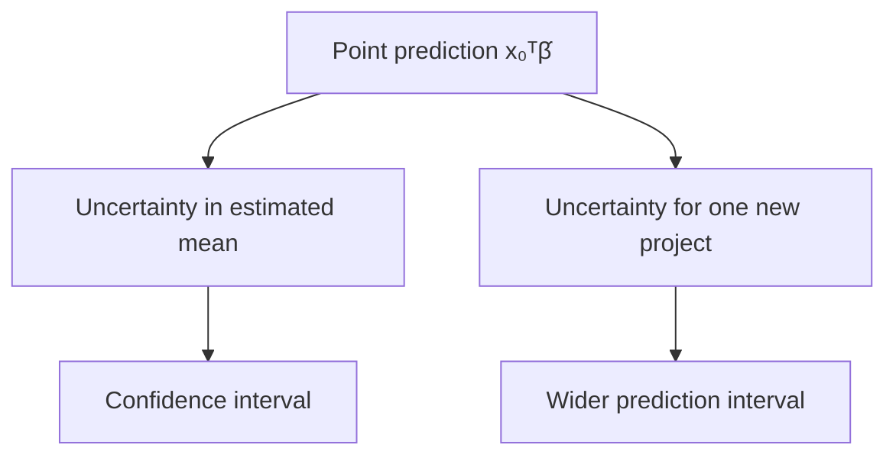

## 8.12 Build: `GaussianOLS`

```python
import numpy as np
from scipy.stats import t


class GaussianOLS(StableOLS):
    def fit(self, X, y):
        super().fit(X, y)
        design = self._design(X)
        y = np.asarray(y, dtype=float)

        if not self.is_full_rank_:
            raise ValueError(
                "Classical coefficient intervals require an identified full-rank design"
            )

        self.residuals_ = y - design @ self.parameters_
        self.ssr_ = self.residuals_ @ self.residuals_
        self.degrees_of_freedom_ = design.shape[0] - design.shape[1]

        if self.degrees_of_freedom_ <= 0:
            raise ValueError("Not enough residual degrees of freedom")

        self.residual_variance_ = self.ssr_ / self.degrees_of_freedom_
        xtx_inverse = np.linalg.inv(design.T @ design)
        self.covariance_ = self.residual_variance_ * xtx_inverse
        self.standard_errors_ = np.sqrt(np.diag(self.covariance_))
        self.xtx_inverse_ = xtx_inverse
        return self

    def coefficient_intervals(self, confidence=0.95):
        alpha = 1.0 - confidence
        critical = t.ppf(1.0 - alpha / 2.0, self.degrees_of_freedom_)
        margin = critical * self.standard_errors_
        return np.column_stack(
            [self.parameters_ - margin, self.parameters_ + margin]
        )

    def intervals_for(self, X_new, confidence=0.95):
        design_new = self._design(X_new)
        predictions = design_new @ self.parameters_

        leverage_new = np.einsum(
            "ij,jk,ik->i", design_new, self.xtx_inverse_, design_new
        )

        alpha = 1.0 - confidence
        critical = t.ppf(1.0 - alpha / 2.0, self.degrees_of_freedom_)

        mean_margin = critical * np.sqrt(
            self.residual_variance_ * leverage_new
        )
        prediction_margin = critical * np.sqrt(
            self.residual_variance_ * (1.0 + leverage_new)
        )

        return {
            "prediction": predictions,
            "mean_lower": predictions - mean_margin,
            "mean_upper": predictions + mean_margin,
            "prediction_lower": predictions - prediction_margin,
            "prediction_upper": predictions + prediction_margin,
        }
```

This class uses $(X^TX)^{-1}$ for the covariance formula after checking full rank. In more advanced work, use numerically stable decomposition-based routines and consider heteroskedasticity-robust or cluster-robust covariance estimators when their assumptions match the data structure.

## 8.13 Code laboratory: intervals widen away from the data centre

```python
import numpy as np

rng = np.random.default_rng(81)
x = rng.uniform(2.0, 20.0, size=80)
y = 10.0 + 1.8 * x + rng.normal(0.0, 3.0, size=80)

model = GaussianOLS().fit(x.reshape(-1, 1), y)
new_x = np.array([[2.0], [11.0], [20.0], [35.0]])
intervals = model.intervals_for(new_x)

for i, value in enumerate(new_x.ravel()):
    width = intervals["prediction_upper"][i] - intervals["prediction_lower"][i]
    print(f"x={value:5.1f}, prediction-interval width={width:6.2f}")
```

The interval is usually narrower near the centre of well-observed feature values and wider for extrapolation. The model is less certain about a mean where the design provides less information.

## 8.14 Assumption map: which claim needs which support?

| Claim | Key requirements |
|---|---|
| `lstsq` found a least-squares solution | Valid finite arrays and a correct computation |
| The coefficient vector is unique | Full column rank |
| The fitted relationship predicts similar new projects | Representative evaluation under the deployment distribution |
| Classical standard errors are valid | Correct mean structure plus the variance and dependence assumptions used by the formula |
| A coefficient is causal | A defensible causal design, not merely Gaussian residuals |

Normal-looking residuals do not solve confounding. Conversely, non-normal residuals do not prove that the fitted least-squares projection was calculated incorrectly.

## 8.15 Break it: heteroskedastic project costs

The synthetic generator intentionally makes noise increase with road distance. This is heteroskedasticity: conditional variance changes across observations.

```python
import numpy as np
import matplotlib.pyplot as plt

rng = np.random.default_rng(82)
road = rng.uniform(0.0, 35.0, size=250)
noise_sd = 1.0 + 0.25 * road
cost = 12.0 + 1.4 * road + rng.normal(0.0, noise_sd)

model = StableOLS().fit(road.reshape(-1, 1), cost)
pred = model.predict(road.reshape(-1, 1))
residual = cost - pred

fig, ax = plt.subplots(figsize=(7, 4))
ax.scatter(pred, residual, alpha=0.65)
ax.axhline(0.0, color="black", linewidth=1)
ax.set_xlabel("Fitted cost")
ax.set_ylabel("Residual")
ax.set_title("Fan-shaped residuals signal changing variance")
plt.tight_layout()
plt.show()
```

The OLS line may still estimate a useful conditional mean under suitable conditions, but the equal-variance standard-error formula and a constant-width uncertainty story are questionable.

## 8.16 Day 8 build, break, and reflect

**Build**

1. Fit `GaussianOLS` to a small full-rank subset of the MHP features.
2. Report coefficient estimates, standard errors, and intervals with units.
3. Construct a confidence interval for mean cost and a prediction interval for an individual project.

**Break**

1. Add a redundant column and observe why the classical interval method refuses to proceed.
2. Create variance that grows with road distance.
3. Fit a straight line to a curved relationship.
4. State which assumptions each break threatens.

**Reflect**

Complete this sentence precisely:

> “Assuming the linear mean, independence, equal variance, Gaussian finite-sample model, and the stated sampling process are adequate, the interval means …”

### Day 8 exit check

You are ready for Day 9 when you can distinguish:

- parameter, estimate, error, and residual;
- probability and likelihood;
- residual standard deviation and coefficient standard error; and
- confidence interval for a mean from prediction interval for one new project.

---

# Day 9 — Gradient Descent from the OLS Gradient

> **Today’s central idea:** Gradient descent repeatedly moves parameters downhill. The OLS gradient derived in Chapter 1 tells us both the direction and the size of the local slope.

## 9.1 Why learn an iterative method when OLS has direct solvers?

For a moderate linear regression, QR or SVD is usually preferable. Gradient descent is introduced because the same optimisation logic extends to models that have no convenient closed-form solution and to datasets too large for some direct operations.

The learner should not conclude that iterative means better. The method must match the problem.

## 9.2 Choose the objective carefully

Use mean squared error as the training objective:

$$
J(\beta)=\frac{1}{n}\lVert y-X\beta\rVert_2^2.
$$

Chapter 1 derived the gradient of SSR. Dividing by $n$ gives:

$$
\nabla_\beta J(\beta)
=\frac{2}{n}X^T(X\beta-y).
$$

Shapes:

| Quantity | Shape |
|---|---:|
| $X$ | $n\times k$ |
| $\beta$ | $k$ |
| $X\beta-y$ | $n$ |
| $X^T(X\beta-y)$ | $k$ |

The gradient has one component per parameter.

## 9.3 The update rule

Starting from $\beta^{(0)}$, repeat:

$$
\beta^{(t+1)}
=\beta^{(t)}-\eta\nabla J\left(\beta^{(t)}\right),
$$

where $\eta>0$ is the learning rate.

- The minus sign moves downhill.
- A very small $\eta$ makes slow progress.
- A very large $\eta$ can overshoot, oscillate, or diverge.
- Stopping after a fixed number of steps is simple but may stop too early or waste work.

## 9.4 A one-parameter numerical walk

For a through-origin model $\hat y=\beta x$:

```python
import numpy as np

x = np.array([1.0, 2.0, 3.0])
y = np.array([2.0, 4.0, 7.0])
beta = 0.0
learning_rate = 0.05

for step in range(20):
    predictions = beta * x
    gradient = (2.0 / x.size) * np.sum(x * (predictions - y))
    loss = np.mean((y - predictions) ** 2)
    print(f"step={step:02d} beta={beta:8.4f} loss={loss:8.4f}")
    beta = beta - learning_rate * gradient
```

Do not merely run it. Change the learning rate to `0.0001`, `0.2`, and `1.0`. Record the behaviour.

## 9.5 Why scaling changes the optimisation landscape

With two features, MSE forms a bowl in parameter space. If one feature is numerically much larger than another, the bowl can be long and narrow. A single learning rate then causes the algorithm to zigzag across the steep direction while crawling along the shallow direction.

Standardisation makes the curvature more balanced. It does not guarantee perfect convergence, but it often makes a useful learning rate easier to find.

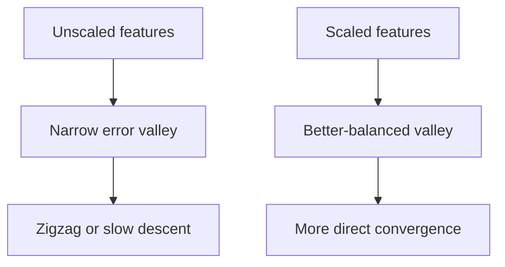

## 9.6 Build batch gradient descent from scratch

```python
import numpy as np


class GradientDescentOLS:
    def __init__(
        self,
        learning_rate=0.05,
        max_iter=20_000,
        tolerance=1e-10,
        fit_intercept=True,
    ):
        self.learning_rate = learning_rate
        self.max_iter = max_iter
        self.tolerance = tolerance
        self.fit_intercept = fit_intercept

    def _design(self, X):
        X = np.asarray(X, dtype=float)
        if X.ndim != 2:
            raise ValueError("X must be two-dimensional")
        if self.fit_intercept:
            return np.column_stack([np.ones(X.shape[0]), X])
        return X

    def fit(self, X, y):
        design = self._design(X)
        y = np.asarray(y, dtype=float)

        if y.ndim != 1 or y.size != design.shape[0]:
            raise ValueError("y must be one-dimensional and aligned with X")
        if not np.isfinite(design).all() or not np.isfinite(y).all():
            raise ValueError("X and y must contain finite values")

        n, k = design.shape
        beta = np.zeros(k)
        self.loss_history_ = []

        for iteration in range(self.max_iter):
            residual_direction = design @ beta - y
            loss = np.mean(residual_direction**2)
            gradient = (2.0 / n) * design.T @ residual_direction

            if not np.isfinite(loss) or not np.isfinite(gradient).all():
                raise FloatingPointError(
                    "Optimisation diverged; inspect scaling and learning rate"
                )

            self.loss_history_.append(loss)
            new_beta = beta - self.learning_rate * gradient

            if np.linalg.norm(new_beta - beta) < self.tolerance:
                beta = new_beta
                self.n_iter_ = iteration + 1
                break

            beta = new_beta
        else:
            self.n_iter_ = self.max_iter

        self.parameters_ = beta
        return self

    def predict(self, X):
        if not hasattr(self, "parameters_"):
            raise RuntimeError("Fit the model before prediction")
        return self._design(X) @ self.parameters_
```

## 9.7 Code proof: gradient descent approaches the SVD solution

```python
import numpy as np

rng = np.random.default_rng(91)
X_raw = rng.normal(size=(200, 3)) * np.array([500.0, 12.0, 2.0])
y = 15.0 + X_raw @ np.array([0.025, 0.9, 2.5]) + rng.normal(0.0, 1.0, size=200)

scaler = StandardScalerFromScratch()
X_scaled = scaler.fit_transform(X_raw)

gd = GradientDescentOLS(learning_rate=0.08, max_iter=50_000).fit(X_scaled, y)
svd = StableOLS().fit(X_scaled, y)

print("Iterations:", gd.n_iter_)
print("Gradient-descent parameters:", gd.parameters_)
print("SVD/lstsq parameters:       ", svd.parameters_)
print("Final loss:", gd.loss_history_[-1])

assert np.allclose(gd.parameters_, svd.parameters_, atol=1e-5)
```

The two methods minimise the same convex objective. Their agreement is an important implementation test.

## 9.8 A finite-difference gradient check

A bug in the gradient can produce smooth-looking but wrong learning. Check the analytic gradient against small numerical perturbations:

```python
import numpy as np

rng = np.random.default_rng(92)
X = np.column_stack([np.ones(30), rng.normal(size=(30, 2))])
y = rng.normal(size=30)
beta = np.array([0.4, -0.7, 1.1])


def mse(beta_vector):
    return np.mean((y - X @ beta_vector) ** 2)


analytic = (2.0 / X.shape[0]) * X.T @ (X @ beta - y)
numeric = np.zeros_like(beta)
h = 1e-6

for j in range(beta.size):
    unit = np.zeros_like(beta)
    unit[j] = 1.0
    numeric[j] = (mse(beta + h * unit) - mse(beta - h * unit)) / (2.0 * h)

print("Analytic gradient:", analytic)
print("Numerical gradient:", numeric)
assert np.allclose(analytic, numeric, rtol=1e-6, atol=1e-8)
```

## 9.9 Convergence diagnostics

Do not print only the final coefficients. Inspect the learning process:

```python
import matplotlib.pyplot as plt

fig, ax = plt.subplots(figsize=(7, 4))
ax.plot(gd.loss_history_)
ax.set_xlabel("Iteration")
ax.set_ylabel("Training MSE")
ax.set_title("Gradient-descent learning curve")
ax.set_yscale("log")
ax.grid(alpha=0.3)
plt.tight_layout()
plt.show()
```

Typical patterns:

| Pattern | Possible meaning | Response |
|---|---|---|
| Smooth decrease to a plateau | Convergence | Check gradient norm and agreement with `lstsq` |
| Very slow decrease | Learning rate too small or poor scaling | Scale features; adjust learning rate |
| Oscillation | Learning rate too large | Reduce learning rate |
| Exploding or non-finite loss | Divergence | Stop; inspect scale, sign, and gradient formula |
| Training loss falls but validation loss rises | Overfitting or distribution mismatch | Evaluation issue, not an optimiser victory |

## 9.10 Batch, stochastic, and mini-batch gradient descent

The implementation above uses every training row for each gradient. This is **batch gradient descent**.

- **Stochastic gradient descent (SGD):** update using one randomly selected observation at a time.
- **Mini-batch gradient descent:** update using a small subset of rows.

Stochastic updates are noisy but cheap and can scale to large datasets. Their behaviour depends on data order, learning-rate schedules, batching, and randomness. Later chapters will study these topics in depth. For this chapter, the full-batch method keeps the equation and code directly aligned.

## 9.11 Parameters versus hyperparameters

This distinction becomes concrete here.

| Type | Example | How obtained |
|---|---|---|
| Parameter | Intercept and feature coefficients | Learned by minimising training loss |
| Hyperparameter | Learning rate | Chosen outside the gradient update |
| Hyperparameter | Maximum iterations | Chosen outside fitting |
| Hyperparameter | Decision-tree depth | Chosen during model selection |

If the validation set guides the learning rate, it has influenced model selection. That is legitimate—provided the final test set remains separate.

## 9.12 Break it deliberately

Run the same problem under four conditions:

1. raw features with learning rate 0.08;
2. scaled features with learning rate 0.08;
3. scaled features with learning rate 2.0; and
4. scaled features with the gradient sign accidentally reversed.

For each case, record:

- first loss;
- final loss;
- number of iterations;
- whether values remained finite; and
- maximum coefficient difference from `np.linalg.lstsq`.

The aim is to make failure recognisable before it occurs in a more complicated model.

## 9.13 Day 9 build, break, and reflect

**Build**

1. Fit scaled MHP numeric features with `GradientDescentOLS`.
2. Verify the gradient by finite differences.
3. Verify final coefficients and predictions against `StableOLS`.
4. Plot loss by iteration.

**Break**

1. Remove scaling.
2. Increase the learning rate until loss diverges.
3. Stop after five iterations.
4. Explain why each final coefficient vector is or is not trustworthy.

**Reflect**

Answer: if two algorithms reach the same minimum training MSE, have they demonstrated the same performance on new projects? Explain why the answer prepares the next day.

### Day 9 exit check

Write the MSE gradient and update rule from memory. Then identify which quantities are learned parameters and which are chosen hyperparameters.

---

# Day 10 — Generalisation, Baselines, and Model Complexity

> **Today’s central idea:** Machine learning is not the production of a small training error. It is the construction of a rule that performs usefully on new cases drawn from the conditions for which it is intended.

## 10.1 Training is an information boundary

Let a learning procedure receive training data $D_{\text{train}}$ and return a fitted prediction function:

$$
\hat f=\mathcal A(D_{\text{train}}).
$$

Here $\mathcal A$ includes more than the named algorithm. It may include:

- feature definitions;
- missing-value handling;
- scaling and encoding;
- model family;
- hyperparameter search;
- random seeds; and
- model-selection rules.

The whole procedure learns from data. An honest evaluation must reproduce that procedure using only the permitted training information.

## 10.2 Empirical risk and generalisation risk

For a loss function $L$, training—or empirical—risk is:

$$
\widehat R_{\text{train}}(f)
=\frac{1}{n_{\text{train}}}
\sum_{i\in\text{train}}L(y_i,f(x_i)).
$$

The population generalisation risk is:

$$
R(f)=\mathbb E_{(X,Y)\sim P_{\text{deployment}}}
\left[L(Y,f(X))\right].
$$

The expectation is over the deployment distribution—the projects the model will actually face. That distribution is not visible in full. A held-out sample is useful only insofar as its construction represents the deployment question.

## 10.3 The constant baseline is a real model

A baseline is not an insult to the data. It defines the minimum comparison a feature-using model must beat.

For a constant squared-error predictor $c$, minimise:

$$
S(c)=\sum_{i=1}^{n}(y_i-c)^2.
$$

Differentiate:

$$
\frac{dS}{dc}=-2\sum_i(y_i-c).
$$

Set the derivative to zero:

$$
\sum_i y_i-nc=0
\quad\Rightarrow\quad
\hat c=\bar y.
$$

Therefore the training mean is the best constant prediction under squared error.

For absolute error:

$$
A(c)=\sum_i|y_i-c|,
$$

any sample median minimises the objective. Intuitively, moving $c$ right reduces the error for points to its right but increases the error for points to its left; a median balances those counts.

## 10.4 Code proof: search for the best constant

```python
import numpy as np

y = np.array([10.0, 12.0, 13.0, 14.0, 60.0])
candidates = np.linspace(0.0, 70.0, 70_001)

squared_losses = np.array([np.mean((y - c) ** 2) for c in candidates])
absolute_losses = np.array([np.mean(np.abs(y - c)) for c in candidates])

best_squared = candidates[np.argmin(squared_losses)]
best_absolute = candidates[np.argmin(absolute_losses)]

print("Mean:", y.mean(), "grid squared-error optimum:", best_squared)
print("Median:", np.median(y), "grid absolute-error optimum:", best_absolute)

assert np.isclose(best_squared, y.mean(), atol=0.001)
assert np.isclose(best_absolute, np.median(y), atol=0.001)
```

The outlying value 60 pulls the mean much more than the median. Baseline choice and evaluation loss should match the decision problem.

## 10.5 What “better than baseline” means

Fit the baseline on the training target only:

$$
\hat y_i^{\text{baseline}}=\bar y_{\text{train}}.
$$

Then evaluate both baseline and candidate model on the same held-out rows with the same metric.

A candidate that fails to beat the baseline may have:

- weak or irrelevant features;
- incorrect data alignment;
- distribution shift;
- excessive complexity;
- insufficient training data; or
- leakage in an earlier, misleading experiment.

Failure to beat a baseline is a diagnostic result, not permission to hide the baseline.

## 10.6 Underfitting and overfitting

**Underfitting** occurs when the learned rule is too restricted to capture useful structure. Both training and validation errors may be high.

**Overfitting** occurs when a flexible procedure adapts to idiosyncrasies of the training sample that do not repeat. Training error can be low while validation error is high.

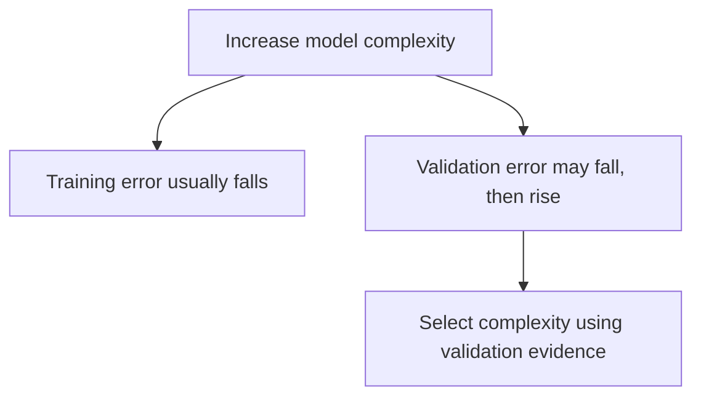

The model with the smallest training error is almost never a defensible automatic choice.

## 10.7 Bias–variance decomposition: a first research-level view

Assume squared-error prediction at a fixed input $x_0$ and a data-generating relationship:

$$
Y=f(x_0)+\varepsilon,
\qquad
\mathbb E[\varepsilon]=0,
\qquad
\operatorname{Var}(\varepsilon)=\sigma^2.
$$

Imagine repeatedly drawing new training datasets and fitting $\hat f$. The expected test error at $x_0$ decomposes as:

$$
\mathbb E\left[(Y-\hat f(x_0))^2\right]
=\underbrace{\left(\mathbb E[\hat f(x_0)]-f(x_0)\right)^2}_{\text{squared bias}}
+\underbrace{\operatorname{Var}(\hat f(x_0))}_{\text{variance}}
+\underbrace{\sigma^2}_{\text{irreducible noise}}.
$$

Step-by-step:

1. Add and subtract $\mathbb E[\hat f(x_0)]$ inside the error.
2. Expand the square.
3. Cross-terms vanish under the stated expectations.
4. The remaining terms describe systematic miss, training-sample sensitivity, and outcome noise.

This is an expectation over repeated datasets, not something fully observed from one train/test split. “High bias” and “high variance” should not be assigned casually from a single plot.

## 10.8 A shallow decision tree as a nonlinear comparator

A regression tree divides feature space into regions. At a node, it considers a feature $j$ and threshold $s$:

$$
R_{\text{left}}(j,s)=\{x:x_j\le s\},
$$

$$
R_{\text{right}}(j,s)=\{x:x_j>s\}.
$$

For squared error, each leaf predicts the mean target among its training observations. A candidate split is chosen to minimise the combined within-child squared error:

$$
\sum_{i:x_i\in R_{\text{left}}}(y_i-\bar y_{\text{left}})^2
+
\sum_{i:x_i\in R_{\text{right}}}(y_i-\bar y_{\text{right}})^2.
$$

A tree is a piecewise-constant model. It can represent thresholds and interactions without manually adding polynomial or interaction columns.

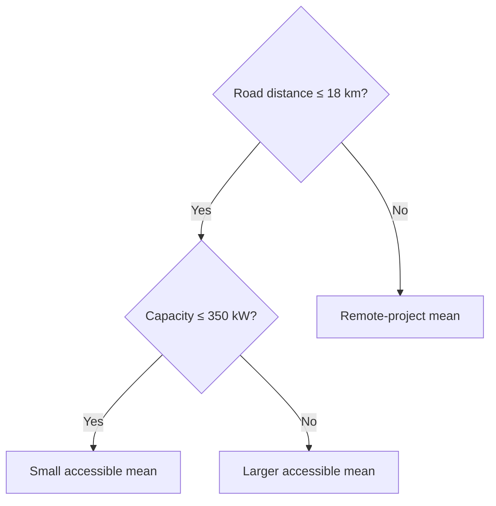

The displayed thresholds are illustrative. A fitted tree learns thresholds from its training data.

## 10.9 Why a shallow tree is a useful baseline

`max_depth` limits the number of successive splits along a path.

- Depth 0 is effectively one constant leaf.
- Small depth captures broad nonlinear structure.
- Large depth can create tiny leaves and memorise training observations.

Unlike linear regression, ordinary trees do not extrapolate a slope beyond the observed range. A leaf predicts a constant learned from its training region. This can be safer in some settings and badly limiting in others.

## 10.10 First library comparison

The following demonstration uses a single split only to make the API visible. Day 11 will decide which split is defensible.

```python
import numpy as np
import pandas as pd
from sklearn.dummy import DummyRegressor
from sklearn.linear_model import LinearRegression
from sklearn.metrics import mean_absolute_error
from sklearn.model_selection import train_test_split
from sklearn.tree import DecisionTreeRegressor

from chapter2_data import make_mhp_projects

df = make_mhp_projects()
features = [
    "planned_capacity_kw",
    "estimated_cable_km",
    "road_distance_km",
    "terrain_index",
]
target = "actual_cost_2025_million_pkr"

X_train, X_holdout, y_train, y_holdout = train_test_split(
    df[features],
    df[target],
    test_size=0.25,
    random_state=42,
)

models = {
    "training mean": DummyRegressor(strategy="mean"),
    "linear regression": LinearRegression(),
    "tree depth 3": DecisionTreeRegressor(max_depth=3, random_state=42),
    "unrestricted tree": DecisionTreeRegressor(random_state=42),
}

for name, model in models.items():
    model.fit(X_train, y_train)
    train_mae = mean_absolute_error(y_train, model.predict(X_train))
    holdout_mae = mean_absolute_error(y_holdout, model.predict(X_holdout))
    print(f"{name:20s} train MAE={train_mae:6.2f} holdout MAE={holdout_mae:6.2f}")
```

Expect the unrestricted tree to have extremely low training error. Whether it has the lowest holdout error is a separate empirical question.

## 10.11 Learning curves: is more data likely to help?

A learning curve plots performance as training size grows. It can reveal:

- a persistent high training and validation error: model/features may underfit;
- a large gap that narrows with more data: variance may be important;
- a gap that remains wide: the procedure may be too flexible or groups may be leaking; and
- unstable curves: sample size or split structure may be inadequate.

```python
import numpy as np
import matplotlib.pyplot as plt
from sklearn.linear_model import LinearRegression
from sklearn.metrics import mean_absolute_error

# Use a fixed chronological holdout for this illustration.
ordered = df.sort_values("start_year")
train_pool = ordered[ordered["start_year"] <= 2022]
future_holdout = ordered[ordered["start_year"] >= 2023]

fractions = np.linspace(0.2, 1.0, 8)
train_scores = []
future_scores = []

for fraction in fractions:
    subset = train_pool.sample(frac=fraction, random_state=42)
    model = LinearRegression().fit(subset[features], subset[target])
    train_scores.append(
        mean_absolute_error(subset[target], model.predict(subset[features]))
    )
    future_scores.append(
        mean_absolute_error(
            future_holdout[target], model.predict(future_holdout[features])
        )
    )

fig, ax = plt.subplots(figsize=(7, 4))
ax.plot(fractions * len(train_pool), train_scores, marker="o", label="training")
ax.plot(fractions * len(train_pool), future_scores, marker="o", label="future holdout")
ax.set_xlabel("Training projects")
ax.set_ylabel("MAE (million PKR)")
ax.set_title("Learning curve under a future-project holdout")
ax.legend()
ax.grid(alpha=0.3)
plt.tight_layout()
plt.show()
```

Because each point uses only one sampled subset, the curve itself is noisy. A fuller analysis repeats the sampling or uses cross-validation appropriate to the deployment structure.

## 10.12 Research paper discussion 1: Breiman’s “Two Cultures”

**Paper:** Leo Breiman (2001), [“Statistical Modeling: The Two Cultures”](https://projecteuclid.org/journals/statistical-science/volume-16/issue-3/Statistical-Modeling--The-Two-Cultures-with-comments-and-a/10.1214/ss/1009213726.full), *Statistical Science* 16(3), 199–231.

### The question

Breiman argued that data analysis contained two broad traditions:

- a **data-modeling culture**, which specifies a stochastic model and studies its parameters; and
- an **algorithmic modeling culture**, which treats the data-generating mechanism as largely unknown and prioritises predictive performance.

### The argument

He criticised excessive reliance on convenient stochastic models when their adequacy was weakly checked, and pressed for stronger use of predictive evaluation and algorithmic methods.

### What a beginner should learn

1. A transparent equation is not automatically true because it is interpretable.
2. High predictive accuracy does not automatically explain a mechanism or identify a cause.
3. Model checking must include out-of-sample evidence when the purpose is prediction.
4. The unit of comparison is a full modeling procedure, not mathematical elegance alone.

### Application to the MHP case

A planning unit may need both cultures:

- a linear or probabilistic model to communicate cost relationships and uncertainty; and
- an algorithmic comparator, such as a shallow tree, to test whether important nonlinear structure is being missed.

Neither purpose authorises a causal claim that improving a particular feature will reduce cost. That still requires a causal design.

### Limitation and debate

The two-cultures framing is intentionally provocative. Modern practice often combines prediction, structured probability models, domain knowledge, and causal reasoning. Read the paper and its published discussion as an argument that reshaped a debate, not as a command to choose one permanent camp.

### Reproduction prompt

Compare OLS and trees over increasing depth using a fixed, defensible validation design. Plot training and validation MAE. Identify where flexibility improves generalisation and where it begins fitting sample-specific noise.

## 10.13 Day 10 build, break, and reflect

**Build**

1. Fit the mean and median baselines.
2. Fit OLS, gradient-descent OLS, a depth-3 tree, and an unrestricted tree.
3. Report training and held-out errors separately.
4. Draw a learning curve.

**Break**

1. Select the model with the smallest training MAE.
2. Add the final material bill as a feature.
3. Increase tree depth until training error is nearly zero.
4. Explain why each action can create false confidence.

**Reflect**

Write one paragraph answering:

> Is the purpose of this MHP model to explain cost formation, predict new costs, or both? What evidence would each purpose require?

### Day 10 exit check

You should now be able to derive the mean baseline, explain why the median baseline differs, and identify a situation in which the best training model is the worst responsible choice.

---

# Day 11 — Honest Splitting, Leakage, and Cross-Validation

> **Today’s central idea:** A split is a simulation of deployment. Choose it by asking what will be new when the model is used: a new project, a new district, a future period, or some combination.

## 11.1 Three roles for data

| Partition | Permitted use | Not permitted |
|---|---|---|
| Training | Fit preprocessing and model parameters | Final performance claim |
| Validation | Choose features, model family, and hyperparameters | Repeated use followed by calling it an untouched test |
| Test | One final estimate after the procedure is fixed | Model tuning, threshold choice, feature revision |

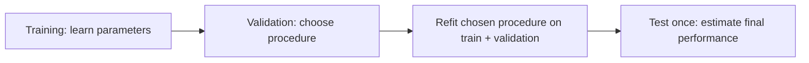

The exact percentages are not universal. A 60/20/20 split is a teaching example, not a law. Sample size, group structure, time, and the cost of uncertainty determine a defensible design.

## 11.2 Random split: new exchangeable projects

A random split asks whether the fitted procedure generalises to new observations assumed to arise from roughly the same distribution as the training observations.

It may be reasonable when:

- observations are independent enough for the purpose;
- there are no repeated entities spanning both partitions;
- time ordering is irrelevant; and
- deployment covers the same mixture of districts and conditions.

It is not the default answer to every dataset.

## 11.3 Group split: new independent groups

Projects within one district may share roads, contractors, administrative practices, survey teams, and shocks. A random split can place highly related projects on both sides. Performance then partly measures recognition of shared group structure.

If deployment is to a district absent from training, hold out entire districts:

$$
G_{\text{train}}\cap G_{\text{test}}=\varnothing.
$$

The group used for splitting need not be an input feature. It identifies dependence or the unit of intended transfer.

## 11.4 Temporal split: future conditions

When predicting future projects, preserve time order:

$$
\max(t_{\text{train}})<\min(t_{\text{test}}).
$$

An expanding-window evaluation is often useful:

```mermaid
flowchart TD
    F1["Fold 1: train 2016–2018; validate 2019"]
    F2["Fold 2: train 2016–2019; validate 2020"]
    F3["Fold 3: train 2016–2020; validate 2021"]
    F4["Fold 4: train 2016–2021; validate 2022"]
```

Future prediction can fail because relationships, measurement, procurement, technology, or the mixture of projects changes. This is distribution shift, not merely random sampling noise.

## 11.5 A deployment-question table

| Intended deployment | Evaluation design |
|---|---|
| New projects in already represented districts under stable conditions | Random split may be adequate |
| New projects in a district not represented in training | Group holdout by district |
| Projects initiated in later years | Temporal split or forward-chaining validation |
| Future projects in unseen districts | Combined time-and-group design; expect high uncertainty |
| Repeated measurements of the same project | Keep all rows from a project in one partition |

When the desired deployment has little or no analogue in the data, no clever splitter can manufacture evidence. The correct conclusion may be that external validation data are needed.

## 11.6 Leakage: information crosses the boundary

Leakage occurs when the training or selection process receives information it would not legitimately possess at deployment or final evaluation.

### Target leakage

A feature contains the target or a post-outcome proxy. The final material bill is an obvious MHP example.

### Preprocessing leakage

Means, standard deviations, imputation values, categories, feature selection, or transformations are fitted using validation/test rows.

### Temporal leakage

Future information helps predict the past, or a feature is recorded after the prediction date.

### Group leakage

Related observations from the same district, household, patient, contractor, or project appear in both train and evaluation sets when the intended deployment requires new groups.

### Duplicate leakage

Exact or near-duplicate records cross partitions.

### Test-set leakage

The analyst repeatedly examines test performance and changes the procedure. The test set becomes an informal validation set.

### Label leakage through data cleaning

Even “cleaning” can leak. For example, deleting unusual feature rows only after observing that their targets are hard to predict uses outcome information to define the sample.

## 11.7 Break it: a leaky feature creates a spectacular score

```python
from sklearn.linear_model import LinearRegression
from sklearn.metrics import mean_absolute_error
from sklearn.model_selection import train_test_split

from chapter2_data import make_mhp_projects

df = make_mhp_projects()
target = "actual_cost_2025_million_pkr"
legitimate = [
    "planned_capacity_kw",
    "estimated_cable_km",
    "road_distance_km",
    "terrain_index",
]
leaky = legitimate + ["final_material_bill_million_pkr"]

train_idx, test_idx = train_test_split(
    df.index, test_size=0.25, random_state=42
)

for label, columns in [("legitimate", legitimate), ("leaky", leaky)]:
    model = LinearRegression().fit(df.loc[train_idx, columns], df.loc[train_idx, target])
    predictions = model.predict(df.loc[test_idx, columns])
    mae = mean_absolute_error(df.loc[test_idx, target], predictions)
    print(label, "MAE:", round(mae, 3))
```

The leaky score is not a better appraisal model. It answers a different and largely useless question: how well can final cost be reconstructed after much of the cost is already known?

## 11.8 Pipelines protect the fitting boundary

A pipeline joins learned preprocessing and the model so that each cross-validation training fold fits its own transformations.

```python
import numpy as np
from sklearn.compose import ColumnTransformer
from sklearn.impute import SimpleImputer
from sklearn.linear_model import LinearRegression
from sklearn.pipeline import Pipeline
from sklearn.preprocessing import OneHotEncoder, StandardScaler

numeric_features = [
    "planned_capacity_kw",
    "estimated_cable_km",
    "road_distance_km",
    "terrain_index",
]
categorical_features = ["district"]

numeric_pipeline = Pipeline(
    steps=[
        ("impute", SimpleImputer(strategy="median")),
        ("scale", StandardScaler()),
    ]
)

categorical_pipeline = Pipeline(
    steps=[
        ("impute", SimpleImputer(strategy="most_frequent")),
        (
            "one_hot",
            OneHotEncoder(handle_unknown="ignore", drop="first"),
        ),
    ]
)

preprocessor = ColumnTransformer(
    transformers=[
        ("numeric", numeric_pipeline, numeric_features),
        ("categorical", categorical_pipeline, categorical_features),
    ]
)

linear_pipeline = Pipeline(
    steps=[
        ("preprocess", preprocessor),
        ("model", LinearRegression()),
    ]
)
```

The order is `fit` preprocessing on the current training fold, `transform` that fold, fit the model, and transform the corresponding validation fold using the learned training-fold values.

## 11.9 K-fold cross-validation

In $K$-fold cross-validation:

1. divide the development data into $K$ folds;
2. hold out fold 1 and train on the other $K-1$ folds;
3. evaluate on fold 1;
4. repeat so every fold is held out once; and
5. aggregate the held-out losses.

For fold losses $L_1,\ldots,L_K$:

$$
\widehat L_{CV}=\frac{1}{K}\sum_{k=1}^{K}L_k.
$$

Cross-validation reuses observations for efficient development, but each prediction is generated by a model that did not train on that observation.

## 11.10 Cross-validation is a family, not one method

| Splitter | Preserves | Appropriate question |
|---|---|---|
| `KFold` | Fold separation | New approximately independent observations |
| `GroupKFold` | Group separation | New groups |
| `TimeSeriesSplit` | Time order | Future observations under expanding history |
| Nested CV | Separation between tuning and outer evaluation | Performance of a selected procedure |

Stratification is mainly discussed in classification. For regression, analysts sometimes bin the target for approximate balance, but target-informed splitting must be designed cautiously and documented. It does not replace group or temporal structure.

## 11.11 Grouped cross-validation in code

```python
import numpy as np
from sklearn.model_selection import GroupKFold, cross_validate

df = make_mhp_projects()
X = df[numeric_features + categorical_features]
y = df["actual_cost_2025_million_pkr"]
groups = df["district"]

group_cv = GroupKFold(n_splits=df["district"].nunique())

scores = cross_validate(
    linear_pipeline,
    X,
    y,
    groups=groups,
    cv=group_cv,
    scoring={
        "mae": "neg_mean_absolute_error",
        "mse": "neg_mean_squared_error",
        "r2": "r2",
    },
    return_train_score=True,
)

mae = -scores["test_mae"]
rmse = np.sqrt(-scores["test_mse"])

print("Held-out district MAE values:", mae)
print("Mean MAE:", mae.mean())
print("Held-out district RMSE values:", rmse)
print("Held-out district R² values:", scores["test_r2"])
```

Do not report only the mean. Each fold corresponds to a district and may reveal an operationally important failure.

## 11.12 Temporal validation in code

```python
import numpy as np
from sklearn.base import clone
from sklearn.metrics import mean_absolute_error

df = make_mhp_projects().sort_values("start_year")
feature_columns = numeric_features + categorical_features
validation_years = [2019, 2020, 2021, 2022]
forward_mae = []

for year in validation_years:
    train = df[df["start_year"] < year]
    validation = df[df["start_year"] == year]

    model = clone(linear_pipeline)
    model.fit(train[feature_columns], train["actual_cost_2025_million_pkr"])
    predictions = model.predict(validation[feature_columns])
    score = mean_absolute_error(
        validation["actual_cost_2025_million_pkr"], predictions
    )
    forward_mae.append(score)
    print(year, "MAE:", round(score, 3), "validation n:", len(validation))

print("Mean forward-validation MAE:", np.mean(forward_mae))
```

The folds have different training sizes and time periods. Their losses are not identically distributed replications. Inspecting the sequence can be more informative than compressing it to one average.

## 11.13 Hyperparameter selection and the validation set

For a decision tree, consider depths $1,2,3,4,6,8$. Selecting the depth with the best validation score is a data-dependent operation:

$$
\hat d
=\arg\min_{d\in\mathcal D}
\widehat L_{\text{validation}}(d).
$$

If the same validation data are used to report final performance, the estimate is optimistically biased because the best-looking setting partly benefited from validation noise.

## 11.14 Nested cross-validation

Nested CV separates two loops:

- the **inner loop** selects hyperparameters;
- the **outer loop** estimates the performance of the entire selection procedure.

```mermaid
flowchart TD
    O["Outer training folds"] --> I["Inner CV chooses hyperparameters"]
    I --> F["Fit selected procedure on outer training data"]
    F --> H["Evaluate on untouched outer fold"]
    H --> R["Repeat for every outer fold"]
```

The object being evaluated is not “a depth-3 tree” chosen in advance. It is “the procedure that searches specified depths using specified inner folds and then refits the winner.”

## 11.15 Manual nested group cross-validation

This explicit version keeps the mechanics visible.

```python
import numpy as np
from sklearn.base import clone
from sklearn.compose import ColumnTransformer
from sklearn.impute import SimpleImputer
from sklearn.metrics import mean_absolute_error
from sklearn.model_selection import GroupKFold, GridSearchCV
from sklearn.pipeline import Pipeline
from sklearn.preprocessing import OneHotEncoder, StandardScaler
from sklearn.tree import DecisionTreeRegressor

df = make_mhp_projects()
feature_columns = numeric_features + categorical_features
X = df[feature_columns]
y = df["actual_cost_2025_million_pkr"]
groups = df["district"]

tree_pipeline = Pipeline(
    steps=[
        ("preprocess", clone(preprocessor)),
        ("model", DecisionTreeRegressor(random_state=42)),
    ]
)

outer_cv = GroupKFold(n_splits=5)
outer_results = []

for outer_fold, (outer_train_idx, outer_test_idx) in enumerate(
    outer_cv.split(X, y, groups), start=1
):
    X_outer_train = X.iloc[outer_train_idx]
    y_outer_train = y.iloc[outer_train_idx]
    groups_outer_train = groups.iloc[outer_train_idx]
    X_outer_test = X.iloc[outer_test_idx]
    y_outer_test = y.iloc[outer_test_idx]

    # With four districts in the outer training portion, use four inner folds.
    inner_cv = GroupKFold(n_splits=groups_outer_train.nunique())
    search = GridSearchCV(
        estimator=clone(tree_pipeline),
        param_grid={
            "model__max_depth": [1, 2, 3, 4, 6],
            "model__min_samples_leaf": [5, 10, 20],
        },
        scoring="neg_mean_absolute_error",
        cv=inner_cv,
        refit=True,
    )
    search.fit(
        X_outer_train,
        y_outer_train,
        groups=groups_outer_train,
    )

    outer_predictions = search.predict(X_outer_test)
    outer_mae = mean_absolute_error(y_outer_test, outer_predictions)
    held_out_district = groups.iloc[outer_test_idx].unique().tolist()

    outer_results.append(outer_mae)
    print(
        f"outer fold={outer_fold}",
        f"held out={held_out_district}",
        f"best={search.best_params_}",
        f"MAE={outer_mae:.3f}",
    )

print("Nested group-CV mean MAE:", np.mean(outer_results))
```

This is computationally more expensive because selection is repeated inside each outer training set. That repetition is the protection, not wasted work.

## 11.16 Research paper discussion 2: Cawley and Talbot on selection bias

**Paper:** Gavin C. Cawley and Nicola L. C. Talbot (2010), [“On Over-fitting in Model Selection and Subsequent Selection Bias in Performance Evaluation”](https://www.jmlr.org/papers/v11/cawley10a.html), *Journal of Machine Learning Research* 11, 2079–2107.

### The question

Can the model-selection criterion itself be overfit, and can this produce biased performance comparisons?

### The key argument

When many candidate settings are compared, random variation in the selection criterion becomes an opportunity. The selected candidate can look best partly because it benefited from noise. The paper shows that this selection overfitting can be comparable in magnitude to reported differences between algorithms.

### The important change in the unit of comparison

The paper argues that empirical comparisons should evaluate the combination:

$$
\text{learning algorithm} + \text{model-selection procedure},
$$

not the named algorithm in isolation.

For the MHP example, “decision tree” is incomplete. A reproducible procedure includes:

- candidate depths and leaf sizes;
- split type;
- inner scoring metric;
- preprocessing;
- refitting rule; and
- random-state policy.

### Practical implication

Use an untouched test set after tuning or use nested cross-validation when data are too limited for a single validation holdout. Keep the entire preprocessing and selection process inside the appropriate loop.

### Limitation

Nested CV addresses selection bias under the sampled evaluation design. It does not fix a wrong deployment simulation, unmeasured shift, leakage in feature definitions, or a sample that excludes the hardest projects.

### Reproduction prompt

On repeated synthetic datasets, search increasingly large collections of irrelevant hyperparameters. Compare the best inner-CV score with outer held-out performance. Plot the optimism as the search space grows.

## 11.17 A locked-test protocol

Before opening the final test result, write and timestamp an evaluation contract containing:

1. target and units;
2. prediction time;
3. eligible features;
4. exclusion rules;
5. split design;
6. candidate procedures;
7. selection metric;
8. subgroup reports;
9. uncertainty method; and
10. conditions that would block deployment.

If the test result triggers model revision, that is allowed—but the old test set has become development information. A new independent test is then needed for a fresh final claim.

## 11.18 Day 11 build, break, and reflect

**Build**

1. Write the deployment question before splitting.
2. Compare random, district-grouped, and temporal validation.
3. Put all learned preprocessing inside a pipeline.
4. Tune a shallow tree with an inner loop.
5. Preserve projects from 2023 onward as a locked final test.

**Break**

1. Scale before cross-validation.
2. include the final material bill.
3. let the same district appear in both sides of an unseen-district evaluation.
4. choose tree depth using the test set.
5. explain exactly how information crosses the boundary in each case.

**Reflect**

For each proposed deployment below, name the split and one remaining limitation:

- a new project in Swat next month;
- a new district never represented in the database; and
- MHP projects five years after a procurement-policy change.

### Day 11 exit check

You are ready for Day 12 when you can draw the inner and outer loops of nested CV, state what each loop is allowed to influence, and explain why a pipeline is part of statistical validity rather than code tidiness.

---

# Day 12 — Metrics, Diagnostics, and Responsible Revision

> **Today’s central idea:** A metric compresses errors according to a value judgement. Responsible evaluation keeps the individual errors available, measures uncertainty, looks for structured failure, and revises the model without contaminating the final test.

## 12.1 Begin with signed errors

For a held-out observation:

$$
e_i=y_i-\hat y_i.
$$

With this convention:

- $e_i>0$: the actual cost exceeded the prediction, so the model **underpredicted**;
- $e_i<0$: the prediction exceeded the actual cost, so the model **overpredicted**.

The mean signed error is:

$$
ME=\frac{1}{n}\sum_i e_i.
$$

Positive and negative misses cancel, so ME is useful for directional bias but not as a total accuracy measure.

## 12.2 Mean absolute error

$$
MAE=\frac{1}{n}\sum_{i=1}^{n}|y_i-\hat y_i|.
$$

If MAE is 4.2 million PKR, the average magnitude of the held-out miss is 4.2 million PKR. MAE weights an error of 10 twice as much as an error of 5.

MAE is not immune to extreme values; every extreme error still enters. It is simply less dominated by them than a squared-error metric.

## 12.3 Mean squared error and root mean squared error

$$
MSE=\frac{1}{n}\sum_{i=1}^{n}(y_i-\hat y_i)^2,
$$

$$
RMSE=\sqrt{MSE}.
$$

RMSE returns to the target’s units. Because errors are squared before averaging, large misses receive disproportionate weight.

Do not describe RMSE as “the average error” without qualification. It is the square root of the mean squared error, not the arithmetic mean of absolute misses.

## 12.4 Median absolute error

$$
MedAE=\operatorname{median}\left(|y_i-\hat y_i|\right).
$$

MedAE describes a typical central miss and can remain small even when a minority of projects fail badly. Reporting it beside MAE and a high error quantile makes that contrast visible.

For example:

$$
Q_{0.90}(|e|)
$$

is the 90th percentile of absolute error: 90% of held-out projects have an absolute miss at or below that value.

## 12.5 $R^2$ on held-out data

For evaluation outcomes $y_1,\ldots,y_n$:

$$
R^2
=1-
\frac{\sum_i(y_i-\hat y_i)^2}
{\sum_i(y_i-\bar y_{\text{evaluation}})^2}.
$$

Interpretation on that evaluation set:

- $R^2=1$: perfect predictions;
- $R^2=0$: the candidate’s squared error equals that of predicting the **evaluation-set mean** for every evaluation row;
- $R^2<0$: the candidate is worse, in squared-error terms, than that evaluation-set-mean reference.

This contains an important correction to a common simplification. The standard held-out $R^2$ denominator uses the mean of the evaluation targets, whereas a deployable dummy model predicts a value learned from the training targets. Under distribution shift, those are not the same. Always score an explicit training-fitted baseline rather than assuming $R^2=0$ represents its exact held-out performance.

$R^2$ is dimensionless and sensitive to the range of outcomes. The same absolute errors can yield different $R^2$ values in two districts with different target variation.

## 12.6 Calculate every metric from raw definitions

```python
import numpy as np

y_true = np.array([20.0, 24.0, 31.0, 45.0, 80.0])
y_pred = np.array([22.0, 20.0, 34.0, 37.0, 95.0])

errors = y_true - y_pred
absolute_errors = np.abs(errors)
squared_errors = errors**2

me = np.mean(errors)
mae = np.mean(absolute_errors)
mse = np.mean(squared_errors)
rmse = np.sqrt(mse)
medae = np.median(absolute_errors)
r2 = 1.0 - np.sum(squared_errors) / np.sum((y_true - y_true.mean()) ** 2)

print("Errors:", errors)
print("ME:", me)
print("MAE:", mae)
print("RMSE:", rmse)
print("Median AE:", medae)
print("R²:", r2)
```

Verify the same values with library functions, but keep the definition code. It makes sign, units, and denominators auditable.

## 12.7 Why MAPE is dangerous for infrastructure costs

Mean absolute percentage error is:

$$
MAPE=\frac{100}{n}\sum_i\left|\frac{y_i-\hat y_i}{y_i}\right|.
$$

Problems:

1. it is undefined when $y_i=0$;
2. it becomes extremely large when $y_i$ is near zero;
3. it weights the same absolute miss more heavily for small projects; and
4. it can encourage asymmetric behaviour because over- and underprediction interact differently with the denominator.

Percentage error may be relevant if proportional miss is truly the decision cost, but it should not be used automatically because stakeholders like percentages.

## 12.8 Scale-aware alternatives

No single alternative is universally best.

- Report MAE separately by project scale.
- Divide aggregate absolute error by aggregate actual cost when that portfolio interpretation is intended:

$$
WAPE=\frac{\sum_i|y_i-\hat y_i|}{\sum_i|y_i|}.
$$

- Model log cost when multiplicative structure is substantively plausible, while handling retransformation carefully.
- Use a scaled error relative to an explicit baseline when comparing series.

The metric must reflect the decision, not merely avoid a mathematical inconvenience.

## 12.9 Asymmetric decision loss

Suppose underbudgeting is more damaging than overbudgeting. MAE and RMSE are symmetric: errors $+a$ and $-a$ receive the same penalty.

One simple asymmetric absolute loss is:

$$
L(e)=
\begin{cases}
c_{\text{under}}|e|, & e>0,\\
c_{\text{over}}|e|, & e\le0,
\end{cases}
$$

with $c_{\text{under}}>c_{\text{over}}$.

Quantile—or pinball—loss for quantile level $\tau$ is:

$$
L_\tau(y,\hat q)
=
\begin{cases}
\tau(y-\hat q), & y\ge\hat q,\\
(1-\tau)(\hat q-y), & y<\hat q.
\end{cases}
$$

Predicting a high conditional quantile, such as $\tau=0.8$, can support contingency planning. It should be labelled as an 80th-quantile estimate, not confused with a mean forecast plus an arbitrary percentage.

## 12.10 Metric choice is separate from training loss

The model may minimise squared training loss but be selected by validation MAE and reported with several test metrics. These are different roles:

- **training loss** determines fitted parameters;
- **selection metric** chooses among procedures;
- **reporting metrics** describe consequences to readers.

Changing a reporting metric after seeing which one favours a preferred model is another form of researcher flexibility. Choose primary and secondary metrics before final evaluation.

## 12.11 Always retain a prediction table

Create one row per held-out prediction:

| Field | Purpose |
|---|---|
| Project ID | Trace the source record |
| Actual target | Verify outcome and unit |
| Prediction | Inspect the estimate |
| Signed error | Detect under- or overprediction |
| Absolute error | Rank large misses |
| Squared error | Understand RMSE contribution |
| District | Examine spatial performance |
| Start year | Examine temporal drift |
| Project scale / remoteness | Examine operational subgroups |

Aggregate metrics can always be recomputed from this table. They cannot reconstruct the table after detail has been discarded.

## 12.12 Residual diagnostics on held-out predictions

Training residuals diagnose fit to the training sample. Held-out errors diagnose prediction under the evaluation design. Both matter, but they answer different questions.

### Error versus prediction

Look for curvature, a fan shape, and systematic offset.

### Error over time

Look for drift after procurement, technology, policy, or price-basis changes.

### Error by district

Look for groups with poor representation or different relationships.

### Error by project scale

A low overall MAE may be dominated by numerous small projects while a few large projects carry most budget risk.

### Distribution of signed errors

Look for asymmetry and extreme tails. A normal-looking histogram is neither necessary nor sufficient for generalisation.

## 12.13 A four-panel diagnostic figure

```python
import matplotlib.pyplot as plt
import numpy as np
import pandas as pd


def plot_prediction_diagnostics(results):
    """Plot held-out diagnostics from a prediction-results DataFrame."""
    required = {
        "prediction",
        "error",
        "absolute_error",
        "district",
        "start_year",
    }
    missing = required.difference(results.columns)
    if missing:
        raise ValueError(f"Missing diagnostic columns: {sorted(missing)}")

    fig, axes = plt.subplots(2, 2, figsize=(12, 8))

    axes[0, 0].scatter(results["prediction"], results["error"], alpha=0.7)
    axes[0, 0].axhline(0.0, color="black", linewidth=1)
    axes[0, 0].set_xlabel("Predicted cost")
    axes[0, 0].set_ylabel("Actual − predicted")
    axes[0, 0].set_title("Signed error versus prediction")

    by_year = results.groupby("start_year")["error"].mean()
    axes[0, 1].plot(by_year.index, by_year.values, marker="o")
    axes[0, 1].axhline(0.0, color="black", linewidth=1)
    axes[0, 1].set_xlabel("Start year")
    axes[0, 1].set_ylabel("Mean signed error")
    axes[0, 1].set_title("Directional error over time")

    district_order = (
        results.groupby("district")["absolute_error"].median().sort_values().index
    )
    district_data = [
        results.loc[results["district"] == district, "absolute_error"]
        for district in district_order
    ]
    axes[1, 0].boxplot(district_data, tick_labels=district_order, vert=True)
    axes[1, 0].tick_params(axis="x", rotation=30)
    axes[1, 0].set_ylabel("Absolute error")
    axes[1, 0].set_title("Error distribution by district")

    axes[1, 1].hist(results["error"], bins=15, edgecolor="black")
    axes[1, 1].axvline(0.0, color="black", linewidth=1)
    axes[1, 1].set_xlabel("Signed error")
    axes[1, 1].set_ylabel("Projects")
    axes[1, 1].set_title("Held-out error distribution")

    fig.tight_layout()
    return fig
```

Plots are question generators. A visible pattern suggests investigation; it does not identify the cause by itself.

## 12.14 Subgroup evaluation without false certainty

For each operationally relevant group, report:

- sample count;
- MAE;
- mean signed error;
- median absolute error; and
- a high absolute-error quantile.

Small subgroups have noisy estimates. Do not rank districts as if a difference based on five projects were a stable performance league table. Use intervals, domain knowledge, and replication.

```python
def subgroup_report(results, group_column):
    return (
        results.groupby(group_column)
        .agg(
            n=("error", "size"),
            mean_error=("error", "mean"),
            mae=("absolute_error", "mean"),
            median_ae=("absolute_error", "median"),
            q90_ae=("absolute_error", lambda x: x.quantile(0.90)),
        )
        .sort_values("mae", ascending=False)
    )
```

## 12.15 Bootstrap uncertainty for held-out MAE

One fixed test set gives one observed MAE. A nonparametric bootstrap approximates its sampling variability by resampling the held-out prediction rows with replacement.

```python
import numpy as np


def bootstrap_mae_interval(y_true, y_pred, confidence=0.95, repeats=5000, seed=42):
    y_true = np.asarray(y_true, dtype=float)
    y_pred = np.asarray(y_pred, dtype=float)

    if y_true.ndim != 1 or y_true.shape != y_pred.shape:
        raise ValueError("y_true and y_pred must be aligned one-dimensional arrays")
    if y_true.size < 2:
        raise ValueError("At least two held-out observations are required")

    rng = np.random.default_rng(seed)
    n = y_true.size
    bootstrap_scores = np.empty(repeats)

    for b in range(repeats):
        indices = rng.integers(0, n, size=n)
        bootstrap_scores[b] = np.mean(
            np.abs(y_true[indices] - y_pred[indices])
        )

    alpha = 1.0 - confidence
    lower, upper = np.quantile(
        bootstrap_scores,
        [alpha / 2.0, 1.0 - alpha / 2.0],
    )

    return {
        "estimate": np.mean(np.abs(y_true - y_pred)),
        "lower": lower,
        "upper": upper,
        "bootstrap_scores": bootstrap_scores,
    }
```

This percentile interval treats held-out rows as the resampling units. If projects are clustered within districts or repeated within contractors, row-wise resampling can understate dependence. A cluster bootstrap resamples independent groups instead. The resampling unit must match the data-generating and deployment structure.

## 12.16 Why “mean ± fold standard deviation” is not a confidence interval

Cross-validation training sets overlap, so fold scores are dependent. They may also correspond to different districts or time periods. Their standard deviation is a descriptive measure of variation across those folds; it is not automatically the standard error of the mean and not automatically a 95% interval.

Even dividing fold standard deviation by $\sqrt K$ does not repair the dependence by assumption.

## 12.17 Research paper discussion 3: Bengio and Grandvalet on CV variance

**Paper:** Yoshua Bengio and Yves Grandvalet (2004), [“No Unbiased Estimator of the Variance of K-Fold Cross-Validation”](https://www.jmlr.org/papers/v5/grandvalet04a.html), *Journal of Machine Learning Research* 5, 1089–1105.

### The question

Can one construct a universally unbiased estimator of the variance of the $K$-fold cross-validation error using the usual cross-validation results?

### Main result

The paper proves that no universal unbiased estimator exists under the broad conditions it studies. Overlap among training sets creates covariance terms that cannot generally be recovered from the observed fold results alone.

### What the result does not say

It does **not** say that cross-validation is useless or that uncertainty can never be studied. It says a very convenient, universally unbiased variance formula is unavailable.

### Practical implication

- Do not label fold standard deviation as a confidence interval.
- Preserve fold-level results and describe the split structure.
- Use repeated or nested designs, independent test data, bootstrap methods, or model-based uncertainty only with their assumptions stated.
- Treat small reported differences between procedures cautiously.

### Application to the MHP case

Five group folds may be the five districts. Variation across those folds is partly real geographic heterogeneity, not five interchangeable measurements of one constant error. Report each district’s result and ask whether the deployment population weights districts equally, by project count, or by budget exposure.

### Reproduction prompt

Repeat $K$-fold CV on many independently generated synthetic datasets. Compare variation across folds within one dataset with variation of the mean CV estimate across datasets. They are not the same quantity.

## 12.18 Diagnostics do not authorise test-set tuning

There is a tension:

- final test diagnostics are valuable for learning where a procedure fails;
- changing the procedure in response means the test has influenced development.

The correct workflow is:

1. report the pre-specified final result;
2. use diagnostics to generate a revised hypothesis;
3. label the revision as post-test development; and
4. obtain new independent evaluation data or wait for prospective deployment evidence.

Do not quietly overwrite the original result and reuse the same test set as if it remained untouched.

## 12.19 A responsible model-revision protocol

```mermaid
flowchart TD
    A["Observe a structured error"] --> B["Propose a substantive mechanism"]
    B --> C["Check measurement and timing"]
    C --> D["Revise within development data"]
    D --> E["Re-run full selection procedure"]
    E --> F["Evaluate on new independent evidence"]
```

Examples:

- Curvature with capacity may justify a pre-specified squared-capacity feature or nonlinear model.
- Larger variance for remote sites may justify conditional quantile modeling or variance modeling.
- Persistent error after a policy change may justify a time indicator, but only if that indicator will be known and meaningful at deployment.
- One district’s poor performance may reveal measurement inconsistency rather than a need to add district identity.

## 12.20 Day 12 build, break, and reflect

**Build**

1. Generate a held-out prediction table.
2. Calculate ME, MAE, RMSE, MedAE, $R^2$, and the 90th percentile absolute error from definitions.
3. Score the explicit training-fitted dummy baseline.
4. Produce the four diagnostic panels.
5. report metrics by district, remoteness, and project scale.
6. bootstrap an MAE interval using the appropriate resampling unit.

**Break**

1. Report MAPE after adding a near-zero target.
2. Evaluate only the numerous small projects and claim portfolio-wide success.
3. call fold standard deviation a 95% confidence interval.
4. change the model after viewing test diagnostics and reuse the same score as final.

**Reflect**

Write a one-page evaluation note that begins with the decision and ends with a deployment recommendation. A table of metrics without that reasoning is not sufficient.

### Day 12 exit check

You are ready for the capstone when you can answer:

1. Which direction of signed error represents underprediction?
2. What reference does held-out $R^2$ use?
3. Why can low overall MAE coexist with unacceptable remote-project performance?
4. Why is fold standard deviation not automatically a confidence interval?
5. What must happen after test-driven model revision?

---

# Chapter 2 Capstone — An Auditable MHP Evaluation Pipeline

## Capstone brief

The planning unit wants an appraisal-stage estimate of final cost in constant 2025 million PKR for projects initiated from 2023 onward. The initial dataset includes projects from 2016 through 2025.

Your job is not merely to return the smallest error. You must design and document the entire learning procedure.

## Pass 1: write the evaluation contract

Before running models, state:

- unit of observation;
- target and price basis;
- prediction time;
- eligible and prohibited features;
- deployment population;
- primary metric and why it matches the decision;
- validation design;
- locked test period;
- subgroup reports; and
- deployment-blocking conditions.

## Pass 2: audit the data boundary

Confirm:

- project IDs are not features;
- final material bills are excluded;
- preprocessing is learned only inside training partitions;
- years are ordered correctly;
- duplicates do not cross partitions; and
- every categorical value is handled without inspecting test outcomes.

## Pass 3: compare complete procedures

Compare:

1. training-mean baseline;
2. linear regression with imputation, scaling, and one-hot encoding;
3. a shallow decision tree with depth selected on 2022 validation data.

Use MAE as the primary selection metric. Retain RMSE, median absolute error, $R^2$, and mean signed error as secondary reports.

## Pass 4: lock, select, refit, test once

- Training: 2016–2021.
- Validation: 2022.
- Final test: 2023–2025.
- Select the procedure using validation MAE only.
- Refit the selected procedure on training plus validation data.
- Evaluate once on the final test.

## Pass 5: diagnose without rewriting history

Report:

- overall metrics and bootstrap MAE interval;
- performance by district;
- performance for road distance above and below 18 km;
- the ten largest absolute errors; and
- any evidence of temporal drift.

If diagnostics motivate revision, label it as the start of the next development cycle.

## Complete runnable capstone

Save as `mhp_chapter2_capstone.py`. It generates its own fictional data, so the chapter remains reproducible without a private dataset.

```python
import numpy as np
import pandas as pd
from sklearn.base import clone
from sklearn.compose import ColumnTransformer
from sklearn.dummy import DummyRegressor
from sklearn.impute import SimpleImputer
from sklearn.linear_model import LinearRegression
from sklearn.metrics import (
    mean_absolute_error,
    mean_squared_error,
    median_absolute_error,
    r2_score,
)
from sklearn.pipeline import Pipeline
from sklearn.preprocessing import OneHotEncoder, StandardScaler
from sklearn.tree import DecisionTreeRegressor

from chapter2_data import make_mhp_projects


TARGET = "actual_cost_2025_million_pkr"
NUMERIC_FEATURES = [
    "start_year",
    "planned_capacity_kw",
    "estimated_cable_km",
    "road_distance_km",
    "terrain_index",
]
CATEGORICAL_FEATURES = ["district"]
FEATURES = NUMERIC_FEATURES + CATEGORICAL_FEATURES


def make_preprocessor():
    numeric_pipeline = Pipeline(
        steps=[
            ("impute", SimpleImputer(strategy="median")),
            ("scale", StandardScaler()),
        ]
    )
    categorical_pipeline = Pipeline(
        steps=[
            ("impute", SimpleImputer(strategy="most_frequent")),
            (
                "one_hot",
                OneHotEncoder(handle_unknown="ignore", drop="first"),
            ),
        ]
    )
    return ColumnTransformer(
        transformers=[
            ("numeric", numeric_pipeline, NUMERIC_FEATURES),
            ("categorical", categorical_pipeline, CATEGORICAL_FEATURES),
        ]
    )


def make_pipeline(regressor):
    return Pipeline(
        steps=[
            ("preprocess", make_preprocessor()),
            ("model", regressor),
        ]
    )


def regression_metrics(y_true, y_pred):
    y_true = np.asarray(y_true, dtype=float)
    y_pred = np.asarray(y_pred, dtype=float)
    error = y_true - y_pred
    return {
        "ME": np.mean(error),
        "MAE": mean_absolute_error(y_true, y_pred),
        "RMSE": np.sqrt(mean_squared_error(y_true, y_pred)),
        "MedAE": median_absolute_error(y_true, y_pred),
        "R2": r2_score(y_true, y_pred),
        "Q90_AE": np.quantile(np.abs(error), 0.90),
    }


def bootstrap_mae_interval(
    y_true,
    y_pred,
    confidence=0.95,
    repeats=5000,
    seed=42,
):
    y_true = np.asarray(y_true, dtype=float)
    y_pred = np.asarray(y_pred, dtype=float)
    rng = np.random.default_rng(seed)
    scores = np.empty(repeats)

    for b in range(repeats):
        indices = rng.integers(0, y_true.size, size=y_true.size)
        scores[b] = np.mean(np.abs(y_true[indices] - y_pred[indices]))

    alpha = 1.0 - confidence
    return np.quantile(scores, [alpha / 2.0, 1.0 - alpha / 2.0])


def prediction_table(frame, predictions):
    result = frame[
        [
            "project_id",
            "district",
            "start_year",
            "road_distance_km",
            TARGET,
        ]
    ].copy()
    result["prediction"] = predictions
    result["error"] = result[TARGET] - result["prediction"]
    result["absolute_error"] = result["error"].abs()
    result["squared_error"] = result["error"] ** 2
    result["remote"] = np.where(
        result["road_distance_km"] > 18.0,
        "above 18 km",
        "18 km or less",
    )
    return result


def subgroup_report(results, group_column):
    return (
        results.groupby(group_column)
        .agg(
            n=("error", "size"),
            mean_error=("error", "mean"),
            mae=("absolute_error", "mean"),
            median_ae=("absolute_error", "median"),
            q90_ae=("absolute_error", lambda values: values.quantile(0.90)),
        )
        .sort_values("mae", ascending=False)
    )


def main():
    df = make_mhp_projects()

    # Prediction-time audit.
    prohibited = {
        "project_id",
        "final_material_bill_million_pkr",
        TARGET,
    }
    assert prohibited.isdisjoint(FEATURES)
    assert not df["project_id"].duplicated().any()

    train = df[df["start_year"] <= 2021].copy()
    validation = df[df["start_year"] == 2022].copy()
    test = df[df["start_year"] >= 2023].copy()

    assert train["start_year"].max() < validation["start_year"].min()
    assert validation["start_year"].max() < test["start_year"].min()

    print(
        "Split sizes:",
        {"train": len(train), "validation": len(validation), "test": len(test)},
    )

    candidates = {
        "training mean": make_pipeline(DummyRegressor(strategy="mean")),
        "linear regression": make_pipeline(LinearRegression()),
    }

    for depth in [1, 2, 3, 4, 6]:
        candidates[f"tree depth {depth}"] = make_pipeline(
            DecisionTreeRegressor(
                max_depth=depth,
                min_samples_leaf=10,
                random_state=42,
            )
        )

    validation_rows = []
    fitted_candidates = {}

    for name, procedure in candidates.items():
        fitted = clone(procedure).fit(train[FEATURES], train[TARGET])
        predictions = fitted.predict(validation[FEATURES])
        metrics = regression_metrics(validation[TARGET], predictions)
        validation_rows.append({"procedure": name, **metrics})
        fitted_candidates[name] = fitted

    validation_report = pd.DataFrame(validation_rows).sort_values("MAE")
    print("\nValidation results")
    print(validation_report.to_string(index=False, float_format=lambda x: f"{x:.3f}"))

    selected_name = validation_report.iloc[0]["procedure"]
    print("\nSelected by validation MAE:", selected_name)

    # The procedure is now fixed. Combine development data and refit it.
    development = pd.concat([train, validation], ignore_index=True)
    selected_procedure = clone(candidates[selected_name])
    selected_procedure.fit(development[FEATURES], development[TARGET])

    # Open the final test once.
    test_predictions = selected_procedure.predict(test[FEATURES])
    test_metrics = regression_metrics(test[TARGET], test_predictions)
    print("\nFinal test metrics")
    for metric, value in test_metrics.items():
        print(f"{metric:7s}: {value:8.3f}")

    lower, upper = bootstrap_mae_interval(test[TARGET], test_predictions)
    print(f"95% row-bootstrap interval for test MAE: [{lower:.3f}, {upper:.3f}]")

    results = prediction_table(test, test_predictions)

    print("\nBy district")
    print(subgroup_report(results, "district").to_string(float_format=lambda x: f"{x:.3f}"))

    print("\nBy remoteness")
    print(subgroup_report(results, "remote").to_string(float_format=lambda x: f"{x:.3f}"))

    print("\nTen largest absolute errors")
    columns = [
        "project_id",
        "district",
        "start_year",
        TARGET,
        "prediction",
        "error",
        "absolute_error",
    ]
    print(
        results.nlargest(10, "absolute_error")[columns].to_string(
            index=False,
            float_format=lambda x: f"{x:.3f}",
        )
    )

    results.to_csv("mhp_chapter2_test_predictions.csv", index=False)


if __name__ == "__main__":
    main()
```

## Capstone interpretation questions

1. Did the selected procedure beat the training-mean baseline on validation and test data?
2. Was the validation ranking preserved on the test period? Why might it change?
3. Is the test MAE small relative to actual planning tolerances, not merely smaller than another model?
4. Which district and remoteness group had the largest errors? Are sample sizes sufficient for a strong conclusion?
5. Is mean signed error positive, suggesting underprediction, or negative, suggesting overprediction?
6. Are later test years systematically underpredicted?
7. Would adding the final material bill improve the numerical score? Why is it prohibited?
8. If the tree wins, does that make its feature thresholds causal or stable outside the observed period?
9. If linear regression wins, does that prove the true cost mechanism is linear?
10. What new independent evidence would be required after revising the model in response to test diagnostics?

## Capstone assessment rubric

| Dimension | Emerging | Competent | Research-ready habit |
|---|---|---|---|
| Prediction contract | Target named | Timing, units, and use stated | Feature availability and deployment population audited |
| Numerical work | Model runs | Scaling, rank, and conditioning checked | Solver and tolerance choices justified |
| Probability | Interval printed | Assumptions and interval type stated | Dependence, heteroskedasticity, and extrapolation limitations examined |
| Optimisation | Loss falls | Gradient verified against finite differences | Convergence compared with decomposition solution |
| Validation | One random split | Split matches deployment | Selection procedure evaluated without leakage |
| Metrics | One score | Baseline and multiple pre-specified metrics | Decision loss, uncertainty, and subgroup risk integrated |
| Diagnostics | Plot produced | Patterns interpreted cautiously | Revision hypotheses separated from confirmatory evidence |
| Reproducibility | Code shown | Seed, versions, and data recipe recorded | Full procedure can be rerun and claims traced to outputs |
| Communication | Winner named | Magnitude and limitations explained | Deployment recommendation includes blocking conditions |

---

# Formula Sheet

| Concept | Equation | Meaning |
|---|---|---|
| Standardisation | $z_{ij}=(x_{ij}-\mu_j)/s_j$ | Centre and scale using training statistics |
| Condition number | $\kappa_2(X)=\sigma_{\max}/\sigma_{\min}$ | Sensitivity associated with unequal singular directions |
| QR least squares | $R\hat\beta=Q^Ty$ | Solve after $X=QR$ |
| SVD | $X=U\Sigma V^T$ | Rotations plus singular-value stretching |
| Pseudoinverse solution | $\hat\beta=V\Sigma^+U^Ty$ | Minimum-norm least-squares solution under rank deficiency |
| Linear probability model | $y=X\beta+\varepsilon$ | Systematic mean plus unobserved error |
| Gaussian errors | $\varepsilon\sim\mathcal N(0,\sigma^2I)$ | Classical equal-variance independent normal model |
| Gaussian log-likelihood | $C-\frac n2\log\sigma^2-\frac{SSR}{2\sigma^2}$ | Maximising over $\beta$ equals minimising SSR |
| Residual variance | $s^2=SSR/(n-k)$ | Unbiased classical estimator under assumptions |
| Coefficient covariance | $s^2(X^TX)^{-1}$ | Classical estimated sampling covariance |
| Coefficient interval | $\hat\beta_j\pm t^*SE(\hat\beta_j)$ | Repeated-sampling confidence procedure |
| Mean-response SE | $s\sqrt{x_0^T(X^TX)^{-1}x_0}$ | Uncertainty in estimated conditional mean |
| Prediction SE | $s\sqrt{1+x_0^T(X^TX)^{-1}x_0}$ | Adds new-project outcome noise |
| MSE objective | $J(\beta)=\lVert y-X\beta\rVert^2/n$ | Average squared training loss |
| MSE gradient | $\nabla J=2X^T(X\beta-y)/n$ | Direction of steepest increase |
| Gradient update | $\beta^{(t+1)}=\beta^{(t)}-\eta\nabla J$ | Iterative downhill step |
| Squared-error baseline | $\hat c=\bar y_{train}$ | Optimal training constant under squared loss |
| Absolute-error baseline | $\hat c=\operatorname{median}(y_{train})$ | Optimal training constant under absolute loss |
| CV loss | $\widehat L_{CV}=K^{-1}\sum_kL_k$ | Mean held-out fold loss |
| Mean error | $n^{-1}\sum_i(y_i-\hat y_i)$ | Directional error |
| MAE | $n^{-1}\sum_i\lvert y_i-\hat y_i\rvert$ | Linear penalty in target units |
| RMSE | $\sqrt{n^{-1}\sum_i(y_i-\hat y_i)^2}$ | Quadratically weighted error in target units |
| $R^2$ | $1-SSR/TSS$ | Squared-error comparison with evaluation-set mean |
| Pinball loss | Piecewise loss weighted by $\tau$ | Trains or scores a conditional quantile |

---

# Glossary

**Algorithm:** A computational procedure. A full learning procedure also includes preprocessing, tuning, and selection.

**Baseline:** A simple reference predictor that a candidate procedure should be compared against.

**Bias–variance decomposition:** Under squared loss, a repeated-sampling decomposition of expected prediction error into squared bias, estimator variance, and irreducible noise.

**Bootstrap:** A resampling method that approximates sampling variability by repeatedly sampling observed units with replacement.

**Condition number:** A measure of how strongly perturbations can be amplified in a numerical problem.

**Confidence interval:** An interval produced by a repeated-sampling procedure designed to cover a fixed parameter at a stated long-run rate under assumptions.

**Cross-validation:** A resampling design in which observations or groups take turns serving as held-out development data.

**Data leakage:** Illegitimate movement of information across prediction-time, training, selection, or evaluation boundaries.

**Degrees of freedom:** The number of independent pieces of information remaining after fitted constraints are accounted for in a stated model.

**Distribution shift:** A difference between training and deployment distributions.

**Empirical risk:** Average loss on an observed dataset.

**Error term:** Unobserved deviation from the model’s population conditional mean.

**Extrapolation:** Prediction beyond feature regions well represented in the training data.

**Generalisation:** Performance of a learned procedure on genuinely new cases from its intended deployment conditions.

**Heteroskedasticity:** Conditional error variance that changes across observations or feature values.

**Hyperparameter:** A setting chosen outside the parameter-fitting calculation.

**Ill-conditioning:** Sensitivity in which small changes in data or arithmetic can cause large changes in a solution.

**Likelihood:** A function of parameter values with observed data held fixed, derived from a probability model.

**Maximum likelihood:** Parameter selection that maximises the likelihood under a specified model.

**Nested cross-validation:** An outer evaluation loop surrounding an inner model-selection loop.

**Numerical rank:** The number of singular directions treated as nonzero at a stated scale and tolerance.

**Overfitting:** Adaptation to sample-specific patterns that do not generalise.

**Parameter:** A value learned inside a fitted model, such as a regression coefficient.

**Pipeline:** A single procedure that fits transformations and a model within the correct data boundary.

**Prediction interval:** An interval intended to cover an individual future outcome under a stated model; it includes outcome noise as well as mean-estimation uncertainty.

**Pseudoinverse:** A generalised inverse used to express least-squares solutions, including rank-deficient cases.

**QR decomposition:** A factorisation of a matrix into an orthonormal-column matrix $Q$ and upper-triangular matrix $R$.

**Residual:** Observed target minus fitted prediction.

**Selection bias in evaluation:** Optimism created when data used to select a procedure also influence its reported performance.

**Singular value:** A nonnegative scale factor in the SVD that measures the strength of a matrix direction.

**Test set:** Data reserved for final evaluation after the learning and selection procedure has been fixed.

**Training set:** Data permitted to fit learned transformations and model parameters.

**Underfitting:** Failure of a procedure to represent useful structure.

**Validation set:** Development data used to compare procedures and choose hyperparameters.

---

# Research Reading Guide

The three paper discussions in this chapter are not decorative citations. Use this six-question template whenever reading them.

1. **Question:** What exact problem is the paper trying to resolve?
2. **Object:** Is it studying a parameter, predictor, algorithm, selection procedure, or evaluation estimate?
3. **Design:** Is the evidence a theorem, simulation, benchmark, observational dataset, or case study?
4. **Result:** What did the authors actually establish?
5. **Boundary:** Under what assumptions or settings might the result not transfer?
6. **Consequence:** What should change in our MHP workflow if we accept the result?

## Paper comparison table

| Paper | Main object | Central warning | Chapter action |
|---|---|---|---|
| Breiman (2001) | Modeling culture and predictive practice | Interpretable stochastic models can be weakly checked; prediction deserves direct evaluation | Compare transparent and algorithmic models while preserving purpose |
| Cawley & Talbot (2010) | Model-selection procedure | Selection itself can overfit and bias performance reports | Use untouched tests or nested CV; compare complete procedures |
| Bengio & Grandvalet (2004) | Variance of $K$-fold CV | No universal unbiased variance estimator follows from usual folds | Do not turn fold SD into an automatic confidence interval |

## A small replication portfolio

To move from textbook reader toward researcher, complete three reproducible notebooks:

1. **Complexity notebook:** regenerate 100 datasets, fit trees of increasing depth, and estimate training/validation optimism.
2. **Selection notebook:** increase the number of tried hyperparameter combinations and measure inner-to-outer performance gaps.
3. **CV uncertainty notebook:** compare within-dataset fold variation with across-dataset variation in average CV performance.

Each notebook must contain:

- a pre-written question;
- a data-generating process;
- seeds and software versions;
- an expected result stated before execution;
- figures with labelled axes and units;
- a result that distinguishes observation from interpretation; and
- one limitation that could change the conclusion.

---

# Instructor and Self-Study Notes

## Suggested daily timebox

| Activity | Minutes |
|---|---:|
| Retrieve Chapter 1 knowledge | 15 |
| Work through the central derivation | 40 |
| Run raw proof code | 35 |
| Create or inspect the figure | 25 |
| Extend the estimator or evaluation | 40 |
| Break and diagnose | 30 |
| Exit check and written reflection | 15 |
| **Total** | **200** |

Day 11 may require two sessions because nested validation is conceptually dense. Splitting it across sessions is better than treating the inner and outer loops as incantations.

## Retrieval prompts for the next morning

- After Day 6: “What does a condition number measure, and why must a scaler be fit on training data?”
- After Day 7: “How do QR and SVD solve least squares without explicitly inverting $X^TX$?”
- After Day 8: “Why does Gaussian maximum likelihood produce OLS, and which interval is wider?”
- After Day 9: “Write the MSE gradient and explain the learning rate.”
- After Day 10: “Derive the mean baseline and define generalisation risk.”
- After Day 11: “Which loop selects and which loop evaluates in nested CV?”
- After Day 12: “Why is one average metric insufficient for deployment?”

## Common beginner confusions to diagnose

| Statement | Correction |
|---|---|
| “Scaling adds information.” | It changes representation, not information content. |
| “Full rank means stable coefficients.” | A full-rank matrix can be severely ill-conditioned. |
| “SVD fixes multicollinearity.” | It diagnoses weak directions and selects a solution; it does not create identification. |
| “OLS assumes normal data.” | OLS fitting does not; particular inferential results add distributional assumptions. |
| “A residual is the true error.” | A residual uses estimated parameters and is constrained by fitting. |
| “Gradient descent is more advanced, so it is more accurate.” | It is another optimiser; for OLS it should converge to the same minimum. |
| “The lowest training error wins.” | Training error rewards flexibility and cannot establish generalisation. |
| “Random splitting is always objective.” | It can violate group and time deployment structure. |
| “A pipeline is software convenience.” | It protects the statistical fitting boundary. |
| “Cross-validation eliminates the need for a test.” | It supports development; repeated selection can still create optimism. |
| “$R^2=0$ equals the training dummy on test data.” | Standard test $R^2$ uses the evaluation-set mean reference. |
| “Fold SD is a 95% interval.” | Fold scores are dependent and may represent heterogeneous conditions. |

## Guidance on the KP infrastructure context

Keep asking:

- Is a field known at appraisal or only after procurement?
- Are costs in the same base year and do they include community contribution consistently?
- Does “road distance” measure distance to any road or an all-weather road?
- Does the terrain index mean the same thing across survey teams?
- Are multiple projects packaged under one contract or budget line?
- Did policy or procurement rules change during the dataset period?
- Are remote projects missing from the database because they were delayed or never completed?
- Will model errors shift funds away from precisely the places with the greatest structural disadvantage?

Technical validity and institutional responsibility meet at these questions.

---

# Where Chapter 3 Begins

Chapter 2 has created an honest evaluation framework around OLS and one nonlinear comparator. The next chapter can deepen statistical learning without abandoning this framework:

1. polynomial and interaction features;
2. regularisation through ridge and lasso;
3. the geometry and Bayesian interpretation of penalties;
4. robust and quantile regression;
5. heteroskedasticity-robust and cluster-aware inference;
6. influence, leverage, and Cook’s distance;
7. repeated and nested model comparison; and
8. a pre-registered benchmark study.

Every new model must pass through the same chain:

```mermaid
flowchart TD
    Q["Deployment question"] --> P["Permitted information"]
    P --> L["Learning procedure"]
    L --> V["Matching validation design"]
    V --> U["Uncertainty and subgroup diagnostics"]
    U --> J["Bounded decision"]
```

## Final reflection

A model becomes trustworthy neither because its derivation is elegant nor because its test score is impressive. Trust is built by an auditable chain: stable computation, explicit assumptions, legitimate information, a deployment-matched evaluation, uncertainty about the result, investigation of failures, and restraint in the conclusion.

That chain is the real subject of Chapter 2.

---

# References and Further Reading

## Research papers discussed

1. Bengio, Y., & Grandvalet, Y. (2004). [No Unbiased Estimator of the Variance of K-Fold Cross-Validation](https://www.jmlr.org/papers/v5/grandvalet04a.html). *Journal of Machine Learning Research, 5*, 1089–1105.
2. Breiman, L. (2001). [Statistical Modeling: The Two Cultures](https://projecteuclid.org/journals/statistical-science/volume-16/issue-3/Statistical-Modeling--The-Two-Cultures-with-comments-and-a/10.1214/ss/1009213726.full). *Statistical Science, 16*(3), 199–231.
3. Cawley, G. C., & Talbot, N. L. C. (2010). [On Over-fitting in Model Selection and Subsequent Selection Bias in Performance Evaluation](https://www.jmlr.org/papers/v11/cawley10a.html). *Journal of Machine Learning Research, 11*, 2079–2107.

## Additional conceptual reading

4. Shmueli, G. (2010). [To Explain or to Predict?](https://projecteuclid.org/journals/statistical-science/volume-25/issue-3/To-Explain-or-to-Predict/10.1214/10-STS330.full). *Statistical Science, 25*(3), 289–310.
5. Hastie, T., Tibshirani, R., & Friedman, J. (2009). *The Elements of Statistical Learning* (2nd ed.). Springer. Chapters 3 and 7.
6. James, G., Witten, D., Hastie, T., Tibshirani, R., & Taylor, J. (2023). *An Introduction to Statistical Learning: with Applications in Python*. Springer.

## Official software documentation

7. scikit-learn. [Getting Started](https://scikit-learn.org/stable/getting_started.html).
8. scikit-learn. [Preprocessing Data](https://scikit-learn.org/stable/modules/preprocessing.html).
9. scikit-learn. [Pipelines and Composite Estimators](https://scikit-learn.org/stable/modules/compose.html).
10. scikit-learn. [Cross-Validation: Evaluating Estimator Performance](https://scikit-learn.org/stable/modules/cross_validation.html).
11. scikit-learn. [Decision Trees](https://scikit-learn.org/stable/modules/tree.html).
12. scikit-learn. [Regression Metrics](https://scikit-learn.org/stable/modules/model_evaluation.html#regression-metrics).

\newpage

# Chapter 3 — From a Trustworthy Baseline to a Research-Grade Regression Study

## Level 3 Practitioner: eight days of model design, diagnosis, and disciplined comparison

> **Central promise.** Chapter 2 taught you to build a stable model and evaluate it honestly. By the end of Chapter 3, you will be able to design missing-data and categorical-data preprocessing without leakage, express nonlinear and conditional relationships through engineered features, derive ridge and lasso regression, diagnose multicollinearity and influential projects, distinguish robust estimation from robust inference, estimate conditional cost quantiles, and run a pre-specified benchmark study whose conclusions another researcher can audit.

The learner is still protected from unnecessary cognitive overload. Every new technique begins with a question, a small numerical example, and an equation developed from familiar ideas. Library calls come only after the mechanism is visible.

The chapter also marks an important change of attitude. A practitioner does not ask only:

> “Which model produced the smallest number?”

A practitioner asks:

- What exact relationship did the feature representation permit?
- Which observations determined the answer?
- Which assumptions support the uncertainty statement?
- Did model selection occur inside the evaluation boundary?
- Is an apparent improvement large enough and stable enough to matter?
- Which communities or project types bear the cost of failure?

---

## Why the original draft required reconstruction

The earlier Chapter 3 contained valuable headings but compressed preprocessing, feature engineering, multicollinearity, diagnostics, ridge, lasso, elastic net, robust covariance, and subgroup debugging into fewer than 2,000 words. It also jumped from section 15 to section 25 and repeated several shortcuts that would mislead a beginner.

This reconstruction corrects those problems.

1. **Scaling is stated accurately.** An unpenalised linear model does not automatically treat a numerically large feature as more important. Scaling matters for conditioning, optimisation, distance-based models, and penalties whose meaning depends on coefficient units.
2. **Feature engineering becomes model specification.** A negative quadratic coefficient does not, by itself, prove a meaningful optimum. Interactions and transformations must be interpreted through derivatives, ranges, and deployment timing.
3. **VIF becomes a diagnostic, not a ritual cutoff.** Values such as 5 or 10 are conventions, not universal laws. The consequence depends on prediction, explanation, design, sample size, and the variables’ roles.
4. **Diagnostics are separated by purpose.** A residual plot can reveal a pattern but cannot diagnose causation. A robust covariance estimator changes uncertainty calculations; it does not repair an incorrect mean function or endogeneity.
5. **Regularisation is derived.** Ridge, lasso, and elastic net are not presented as three buttons. Their objectives, geometry, scaling requirements, algorithms, and inferential limits are developed explicitly.
6. **Research papers become working material.** Each paper study identifies its question, design, result, limitation, and a replication task.

## Prerequisite checkpoint

Before beginning, retrieve these ideas from Chapters 1 and 2 without notes:

- $\hat y=X\hat\beta$ and $e=y-\hat y$;
- the OLS objective and gradient;
- rank, singular values, and condition number;
- why learned preprocessing belongs inside a pipeline;
- train, validation, test, grouped CV, temporal CV, and nested CV;
- confidence interval versus prediction interval; and
- MAE, RMSE, held-out $R^2$, signed error, and subgroup evaluation.

If these are not yet explainable, revisit the relevant exit checks. Practitioner-level work rests on them.

## Learning outcomes

At the end of Chapter 3, you should be able to:

- represent missingness with an indicator and explain MCAR, MAR, and MNAR without claiming they can always be diagnosed from observed data;
- explain why simple imputation changes a distribution and why multiple imputation serves a different inferential purpose;
- compare one-hot, ordinal, frequency, and target encoding by the information and assumptions they introduce;
- implement cross-fitted target encoding and explain why ordinary target means leak;
- distinguish a transformation selected from prior knowledge from one selected after examining outcomes;
- construct centred polynomial, interaction, log, ratio, piecewise, and spline features;
- interpret a quadratic model using its derivative and observed range;
- interpret a continuous-by-binary and continuous-by-continuous interaction;
- apply the hierarchy principle to polynomial and interaction models;
- derive the ridge solution and its singular-value shrinkage factors;
- explain the constrained geometry and Gaussian-prior MAP interpretation of ridge;
- derive the lasso soft-thresholding solution for an orthonormal design;
- explain why lasso can set coefficients to zero and why zero does not establish scientific irrelevance;
- describe elastic net’s treatment of correlated predictors;
- calculate leverage, studentised residuals, Cook’s distance, and VIF from definitions;
- distinguish an outlying target, a high-leverage design point, and an influential observation;
- construct HC0 and explain HC1–HC3 heteroskedasticity-consistent covariance estimators;
- construct the cluster “sandwich” and state why five districts are too few for casual asymptotic confidence;
- distinguish robust standard errors, robust regression, and quantile regression;
- derive Huber loss and pinball loss;
- fit and evaluate conditional median and upper-quantile models;
- verify empirical quantile coverage on held-out data;
- design a locked-test benchmark containing all preprocessing, feature generation, and tuning; and
- report a result whose uncertainty, subgroup limitations, and post-selection status are explicit.

## The eight-day route

| Day | Central idea | Problem resolved |
|---|---|---|
| [Day 13](#day-13--preprocessing-is-part-of-the-model) | Missingness and categorical representation | “Cleaning” can alter the question and leak the answer |
| [Day 14](#day-14--feature-engineering-as-model-specification) | Nonlinearity and interactions | A straight additive surface may omit known mechanisms |
| [Day 15](#day-15--ridge-regression-shrinkage-and-stability) | $L_2$ shrinkage | Correlated, numerous features create unstable estimates |
| [Day 16](#day-16--lasso-elastic-net-and-sparse-models) | $L_1$ sparsity and mixed penalties | Prediction may need shrinkage and a smaller active set |
| [Day 17](#day-17--multicollinearity-leverage-and-influence) | Diagnostic geometry | A few design points or weak directions can dominate coefficients |
| [Day 18](#day-18--heteroskedasticity-and-dependent-data) | Robust and clustered covariance | Classical standard errors can use the wrong variance structure |
| [Day 19](#day-19--robust-and-quantile-regression) | Alternative conditional targets and losses | The conditional mean and squared loss are not every decision |
| [Day 20](#day-20--a-pre-specified-regression-benchmark) | Research workflow | Flexible analysis can turn noise into a publishable-looking result |

```mermaid
flowchart TD
    D["Defensible data representation"] --> F["Explicit feature hypothesis"]
    F --> R["Regularised candidate models"]
    R --> A["Assumption and influence audit"]
    A --> B["Pre-specified benchmark"]
```

---

## Running case and prediction contract

We continue the fictional microhydro power (MHP) appraisal case. One row is one project. The target is final cost in constant 2025 million PKR. Prediction occurs at technical appraisal, before procurement and construction.

The Chapter 2 generator produced:

- project ID;
- district;
- start year;
- planned capacity;
- estimated cable length;
- road distance;
- terrain index;
- a prohibited final material bill; and
- actual project cost.

Chapter 3 adds realistic data-quality problems and candidate features:

- some road-distance surveys are missing;
- contractor experience is recorded as an ordered count;
- access mode is categorical;
- capacity and cable length interact;
- the cost–capacity relationship is curved;
- remote projects have larger conditional variance; and
- a few extreme but legitimate projects test robustness.

### Practitioner data extension

Save the Chapter 2 generator as `chapter2_data.py`, then save the following as `chapter3_data.py`.

```python
import numpy as np
import pandas as pd

from chapter2_data import make_mhp_projects


def make_mhp_practitioner_data(n=520, seed=3030):
    """Extend Chapter 2's fictional projects for Chapter 3 laboratories."""
    df = make_mhp_projects(n=n, seed=seed)
    rng = np.random.default_rng(seed + 1)

    # Appraisal-time variables.
    df["contractor_experience_projects"] = rng.poisson(lam=5.0, size=n)
    df["access_mode"] = np.select(
        [
            df["road_distance_km"] <= 5.0,
            df["road_distance_km"] <= 18.0,
        ],
        ["road", "mixed"],
        default="porter_or_air",
    )

    # A noisy duplicate creates interpretable multicollinearity.
    df["surveyed_route_km"] = (
        df["road_distance_km"]
        + 0.35 * df["estimated_cable_km"]
        + rng.normal(0.0, 0.35, size=n)
    )

    # Missingness is more likely in difficult access modes and early years.
    missing_probability = (
        0.03
        + 0.15 * (df["access_mode"] == "porter_or_air").astype(float)
        + 0.07 * (df["start_year"] <= 2018).astype(float)
    )
    missing_road = rng.random(n) < missing_probability
    df["road_distance_observed_km"] = df["road_distance_km"].mask(missing_road)

    # A handful of extreme but genuine projects.
    candidate_extremes = df.index[df["road_distance_km"] > 20.0].to_numpy()
    extreme_count = min(8, candidate_extremes.size)
    extreme_index = rng.choice(candidate_extremes, size=extreme_count, replace=False)
    df["extreme_logistics_event"] = 0
    df.loc[extreme_index, "extreme_logistics_event"] = 1
    df.loc[extreme_index, "actual_cost_2025_million_pkr"] += rng.uniform(
        18.0, 35.0, size=extreme_count
    )

    return df


if __name__ == "__main__":
    projects = make_mhp_practitioner_data()
    projects.to_csv("mhp_projects_chapter3.csv", index=False)
    print(projects.head())
    print(projects.isna().mean().sort_values(ascending=False).head())
```

The generator deliberately retains the complete `road_distance_km` so that the learner can verify how missingness was created. In an actual incomplete dataset that hidden truth would be unavailable. It must never be used as a feature when evaluating the imputation workflow.

## Software setup

```bash
python -m pip install numpy pandas scipy matplotlib scikit-learn statsmodels
```

The main predictive capstone uses NumPy, pandas, Matplotlib, SciPy, and scikit-learn. Statsmodels is used for inferential and influence demonstrations. Record exact versions in every benchmark report.

---

# Day 13 — Preprocessing Is Part of the Model

> **Today’s central idea:** Missing-value handling and categorical encoding are learned representations. They change what information the model receives and therefore belong inside the fitted and evaluated procedure.

## 13.1 Begin with a missingness indicator

For a variable $X_j$, define:

$$
R_{ij}=
\begin{cases}
1, & X_{ij}\text{ is observed},\\
0, & X_{ij}\text{ is missing}.
\end{cases}
$$

The missingness mechanism describes how $R$ relates to observed and unobserved data. The terms below concern conditional relationships, not moral judgements about data quality.

## 13.2 MCAR, MAR, and MNAR

Let $X_{obs}$ denote observed values and $X_{mis}$ missing values.

### Missing completely at random (MCAR)

$$
P(R\mid X_{obs},X_{mis})=P(R).
$$

Missingness is unrelated to observed or missing data. A random scanner failure affecting forms independently of project characteristics might approximate MCAR.

### Missing at random (MAR)

$$
P(R\mid X_{obs},X_{mis})=P(R\mid X_{obs}).
$$

After conditioning on observed variables, missingness no longer depends on the unseen value. If road distance is more often missing in early years and particular access modes, and those variables are observed and adequately modeled, MAR may be defensible.

### Missing not at random (MNAR)

Even after conditioning on observed information, missingness depends on the missing value or another unobserved quantity. For example, extremely remote surveys may be selectively omitted precisely because the true access distance was difficult to establish.

These mechanisms cannot generally be proven from the observed dataset alone. MNAR sensitivity analysis requires explicit alternative assumptions.

## 13.3 What complete-case analysis changes

Complete-case analysis deletes any row with a missing required field. It is simple but can:

- reduce sample size;
- change the mixture of districts and project types;
- exclude precisely the remote projects of interest; and
- produce biased estimates unless the missingness and analysis conditions justify deletion.

Always compare the retained and excluded rows on observed variables. This cannot prove that deletion is safe, but it can reveal obvious selection.

```python
from chapter3_data import make_mhp_practitioner_data

df = make_mhp_practitioner_data()
observed = df[df["road_distance_observed_km"].notna()]
missing = df[df["road_distance_observed_km"].isna()]

comparison_columns = [
    "terrain_index",
    "planned_capacity_kw",
    "actual_cost_2025_million_pkr",
]

print("Observed road distance, n =", len(observed))
print(observed[comparison_columns].mean())
print("\nMissing road distance, n =", len(missing))
print(missing[comparison_columns].mean())
print("\nMissingness by access mode")
print(df.groupby("access_mode")["road_distance_observed_km"].apply(lambda x: x.isna().mean()))
```

The target is shown here for a retrospective missingness audit. It must not be used by an appraisal-time imputer.

## 13.4 Simple imputation is a learned rule

Median imputation replaces missing training values with the training median:

$$
x_{ij}^{imp}=
\begin{cases}
x_{ij}, & R_{ij}=1,\\
\operatorname{median}(X_{j,train}), & R_{ij}=0.
\end{cases}
$$

This preserves sample size and is often a useful predictive baseline. It does not recreate the missing values or preserve the original distribution:

- many observations pile up at one value;
- variance is reduced;
- relationships with other variables are weakened; and
- ordinary inferential formulas that pretend imputed values were observed can understate uncertainty.

## 13.5 Missing indicators

Add a binary feature:

$$
M_{ij}=1-R_{ij}.
$$

The model can then learn a separate offset for observations whose value was imputed. This can improve prediction if missingness carries stable signal. It does not make an MNAR mechanism ignorable or turn “missing” into a causal explanation.

```python
import numpy as np
from sklearn.impute import SimpleImputer

x_train = np.array([[2.0], [4.0], [np.nan], [10.0], [np.nan]])
x_future = np.array([[np.nan], [30.0]])

imputer = SimpleImputer(strategy="median", add_indicator=True)
train_transformed = imputer.fit_transform(x_train)
future_transformed = imputer.transform(x_future)

print("Learned median:", imputer.statistics_)
print("Training output:\n", train_transformed)
print("Future output:\n", future_transformed)
```

The future missing value receives the training median and an indicator of 1. The value 30 remains 30 and has indicator 0.

## 13.6 Single imputation versus multiple imputation

Single imputation creates one completed dataset. Multiple imputation creates $m$ plausible completed datasets under an imputation model, fits the analysis to each, and combines estimates and uncertainties.

Conceptually:

```mermaid
flowchart TD
    I["Incomplete data"] --> D1["Imputed dataset 1"]
    I --> D2["Imputed dataset 2"]
    I --> D3["Imputed dataset m"]
    D1 --> A["Fit analysis repeatedly"]
    D2 --> A
    D3 --> A
    A --> P["Pool estimates and uncertainty"]
```

Multiple imputation is particularly important for parameter inference because it carries missing-value uncertainty into the result. It is not automatically superior for every prediction pipeline, and its imputation model must respect training boundaries and deployment availability.

### Rubin's pooling rules

Suppose completed dataset $l$ produces estimate $\hat Q_l$ and estimated within-imputation variance $U_l$, for $l=1,\ldots,m$. Pool the point estimates:

$$
\bar Q=\frac1m\sum_{l=1}^{m}\hat Q_l.
$$

Average their within-imputation variances:

$$
\bar U=\frac1m\sum_{l=1}^{m}U_l.
$$

Measure between-imputation variation:

$$
B=\frac{1}{m-1}\sum_{l=1}^{m}(\hat Q_l-\bar Q)^2.
$$

The pooled variance is

$$
T=\bar U+\left(1+\frac1m\right)B.
$$

$\bar U$ reflects ordinary estimation uncertainty if the completed values were known. $B$ reflects sensitivity to which plausible missing values were supplied. The finite-$m$ multiplier accounts for using only a limited number of imputations.

These rules are not valid merely because several datasets were generated. The imputation and analysis models must be compatible enough for the intended estimand, all variables governing missingness and the analysis should be considered, and pooling degrees of freedom require appropriate finite-sample formulas. For predictive assessment, imputation must occur separately inside each training fold, and performance is evaluated on the observed held-out outcomes—not by pooling a leaky completion of the entire dataset.

## 13.7 Categorical variables are hypotheses about similarity

Encoding does more than convert strings to numbers. It tells the model which category differences can share information.

### One-hot encoding

For categories A, B, and C, create indicator columns. With an intercept, use a reference coding or an equivalent constrained parameterisation for unique coefficients.

If A is the reference:

$$
\hat y=\beta_0+\beta_B I(B)+\beta_C I(C).
$$

- $\beta_0$ is the fitted value for A at the other features’ reference values;
- $\beta_B$ is the conditional difference B minus A; and
- $\beta_C$ is the conditional difference C minus A.

Changing the reference changes the coefficient labels, not fitted values.

### Ordinal encoding

Mapping categories to 0, 1, 2 imposes order. A linear model further treats adjacent gaps as equal unless transformed. Use it only when that structure is intended.

### Frequency encoding

Replacing a category by its training frequency says commonness is predictive. Two categories with the same frequency become indistinguishable.

### Target encoding

Replacing category $c$ with its target mean uses outcome information:

$$
TE(c)=\frac{1}{n_c}\sum_{i:C_i=c}y_i.
$$

Naively applying this to the same rows used to calculate the mean leaks each row’s outcome into its own feature, especially for rare categories.

## 13.8 Smoothed target encoding

A smoothed estimate blends the category mean with the global training mean:

$$
\widetilde{TE}(c)
=\frac{n_c\bar y_c+m\bar y}{n_c+m},
$$

where $m>0$ controls shrinkage. Rare categories are pulled more strongly toward the global mean.

Smoothing reduces variance but does not solve same-row leakage. Training encodings still require cross-fitting.

## 13.9 Cross-fitted target encoding from scratch

For each training fold:

1. calculate category statistics on the other folds;
2. encode the held-out fold with those statistics;
3. combine the out-of-fold encodings; and
4. after training the downstream model, fit one encoder on all development rows for future transformation.

```python
import numpy as np
import pandas as pd
from sklearn.model_selection import KFold


def smoothed_mapping(category, target, smoothing=10.0):
    frame = pd.DataFrame({"category": category, "target": target})
    global_mean = frame["target"].mean()
    stats = frame.groupby("category")["target"].agg(["count", "mean"])
    encoded = (
        stats["count"] * stats["mean"] + smoothing * global_mean
    ) / (stats["count"] + smoothing)
    return encoded.to_dict(), global_mean


def cross_fitted_target_encode(category, target, folds=5, smoothing=10.0, seed=42):
    category = pd.Series(category).reset_index(drop=True)
    target = pd.Series(target, dtype=float).reset_index(drop=True)
    encoded = np.empty(len(category), dtype=float)

    splitter = KFold(n_splits=folds, shuffle=True, random_state=seed)
    for fit_index, held_index in splitter.split(category):
        mapping, fallback = smoothed_mapping(
            category.iloc[fit_index],
            target.iloc[fit_index],
            smoothing=smoothing,
        )
        encoded[held_index] = (
            category.iloc[held_index].map(mapping).fillna(fallback).to_numpy()
        )

    final_mapping, final_fallback = smoothed_mapping(
        category, target, smoothing=smoothing
    )
    return encoded, final_mapping, final_fallback


category = pd.Series(["A", "A", "B", "B", "C", "rare"])
target = pd.Series([10.0, 12.0, 20.0, 23.0, 31.0, 100.0])

encoded, mapping, fallback = cross_fitted_target_encode(
    category, target, folds=3, smoothing=5.0
)
print("Cross-fitted training values:", encoded)
print("Final deployment mapping:", mapping)
print("Unseen-category fallback:", fallback)
```

For grouped or temporal data, the inner cross-fitting splitter must also respect groups or time. Random K-fold target encoding can leak future or district information even though it avoids same-row leakage.

## 13.10 A leakproof mixed-type pipeline

```python
from sklearn.compose import ColumnTransformer
from sklearn.impute import SimpleImputer
from sklearn.linear_model import Ridge
from sklearn.pipeline import Pipeline
from sklearn.preprocessing import OneHotEncoder, StandardScaler

numeric_features = [
    "start_year",
    "planned_capacity_kw",
    "estimated_cable_km",
    "road_distance_observed_km",
    "terrain_index",
    "contractor_experience_projects",
]
categorical_features = ["district", "access_mode"]

numeric_pipeline = Pipeline(
    steps=[
        ("impute", SimpleImputer(strategy="median", add_indicator=True)),
        ("scale", StandardScaler()),
    ]
)

categorical_pipeline = Pipeline(
    steps=[
        ("impute", SimpleImputer(strategy="most_frequent")),
        ("one_hot", OneHotEncoder(handle_unknown="ignore", drop="first")),
    ]
)

preprocessor = ColumnTransformer(
    transformers=[
        ("numeric", numeric_pipeline, numeric_features),
        ("categorical", categorical_pipeline, categorical_features),
    ]
)

ridge_pipeline = Pipeline(
    steps=[
        ("preprocess", preprocessor),
        ("model", Ridge(alpha=1.0)),
    ]
)
```

The chapter has not yet justified `alpha=1.0`; Day 15 will derive and tune it. Today’s point is the information boundary.

## 13.11 Research paper discussion 1: Rubin on missing data

**Paper:** Donald B. Rubin (1976), [“Inference and Missing Data”](https://doi.org/10.1093/biomet/63.3.581), *Biometrika* 63(3), 581–592.

### The question

Under what conditions can an analysis ignore the process that caused data to be missing?

### The contribution

Rubin formalised relationships among the data model, missingness process, observed values, and missing values. The paper established conditions under which likelihood or sampling-based analyses may ignore the missingness mechanism, with important distinctions among inferential frameworks.

### What the beginner should retain

1. “Missing at random” is conditional on observed information; it does not mean values disappeared for no reason.
2. Whether missingness can be ignored depends on both the mechanism and the analysis.
3. Observed data alone generally cannot rule out MNAR.
4. Filling blanks is not the same as accounting for missing-data uncertainty.

### MHP application

If road distance is missing more often for remote sites, median imputation may support a predictive baseline but can hide a systematic access problem. A defensible report should compare missingness by observed terrain, year, district, and access mode, then conduct sensitivity analysis for plausible unobserved distances.

### Limitation

The paper provides a general inferential framework, not an automatic recipe for a particular MHP database. The analyst must still argue which variables govern recording, whether they were observed, and whether the imputation model is adequate.

### Replication prompt

Simulate the same complete data under MCAR, MAR, and MNAR deletion. Compare complete-case estimates, median-imputed predictions, and a model that includes a missing indicator. Separate predictive error from coefficient bias.

## 13.12 Day 13 build, break, and reflect

**Build**

1. Produce a missingness table by year, district, access mode, and terrain.
2. Compare complete-case and median-plus-indicator pipelines under forward validation.
3. One-hot encode district and explain the reference category.
4. Cross-fit a target encoding for a high-cardinality fictional contractor ID.

**Break**

1. Fit the imputer on the whole dataset.
2. Calculate target means on the same rows they encode.
3. assign arbitrary ordinal numbers to districts and fit a linear slope.
4. Delete incomplete projects and call the remaining sample representative without checking.

**Reflect**

Write an “information receipt” for every generated column: what raw fields it used, whether it used $y$, which rows fitted it, and when it would be available at deployment.

### Day 13 exit check

You are ready for Day 14 when you can explain why MAR is not “missing for no reason,” why a missing indicator does not solve MNAR, and why target encoding needs two levels of protection: cross-fitting inside development data and separation from the final test.

---

# Day 14 — Feature Engineering as Model Specification

> **Today’s central idea:** Creating a feature changes the family of relationships a model can express. A feature is a mathematical hypothesis about the world, not a free source of accuracy.

## 14.1 Linear regression is linear in parameters

Consider:

$$
\hat y=\beta_0+\beta_1x+\beta_2x^2.
$$

The prediction is curved in $x$ but linear in the parameters $\beta_0,\beta_1,\beta_2$. OLS can fit it because the design matrix contains columns $1,x,x^2$:

$$
X_{poly}=
\begin{bmatrix}
1&x_1&x_1^2\\
1&x_2&x_2^2\\
\vdots&\vdots&\vdots\\
1&x_n&x_n^2
\end{bmatrix}.
$$

Feature engineering alters the columns. The fitting machinery remains linear least squares or its regularised variant.

## 14.2 Centre before forming powers

Let:

$$
x_c=x-c,
$$

where $c$ is a meaningful reference, often the training mean or a policy-relevant value. Fit:

$$
\hat y=\gamma_0+\gamma_1x_c+\gamma_2x_c^2.
$$

Benefits:

- $\gamma_0$ is the fitted value at $x=c$;
- $\gamma_1$ is the slope at $x=c$;
- correlation between $x_c$ and $x_c^2$ is often reduced; and
- coefficient magnitudes can be easier to compute and explain.

The centre must be learned from training data when it is data-derived.

## 14.3 Interpret a quadratic through its derivative

For:

$$
f(x)=\beta_0+\beta_1x+\beta_2x^2,
$$

the instantaneous slope is:

$$
\frac{df(x)}{dx}=\beta_1+2\beta_2x.
$$

A stationary point occurs at:

$$
x^*=-\frac{\beta_1}{2\beta_2},
$$

provided $\beta_2\ne0$.

- If $\beta_2<0$, the curve is concave and the stationary point is a maximum.
- If $\beta_2>0$, it is convex and the stationary point is a minimum.

But a negative $\beta_2$ does not “confirm an optimum.” The stationary point must lie in a credible feature range, the specification must be adequate, uncertainty must be considered, and the relationship remains associational unless causally identified.

## 14.4 Code proof: recover a turning point

```python
import numpy as np

rng = np.random.default_rng(141)
capacity = rng.uniform(80.0, 850.0, size=300)
capacity_center = capacity.mean()
x = capacity - capacity_center

cost = 50.0 + 0.08 * x + 0.00008 * x**2 + rng.normal(0.0, 4.0, size=x.size)
X = np.column_stack([np.ones(x.size), x, x**2])
beta = np.linalg.lstsq(X, cost, rcond=None)[0]

turning_centered = -beta[1] / (2.0 * beta[2])
turning_original = turning_centered + capacity_center

print("Coefficients:", beta)
print("Stationary point in original capacity units:", turning_original)
print("Observed capacity range:", capacity.min(), capacity.max())
```

The true simulated curve is convex, so the stationary point is a minimum. Whether it lies in the observed range must be checked before interpretation.

## 14.5 Continuous-by-continuous interactions

Fit:

$$
\hat y
=\beta_0+\beta_1x_1+\beta_2x_2+\beta_3x_1x_2.
$$

The effect of $x_1$ depends on $x_2$:

$$
\frac{\partial\hat y}{\partial x_1}
=\beta_1+\beta_3x_2.
$$

Similarly:

$$
\frac{\partial\hat y}{\partial x_2}
=\beta_2+\beta_3x_1.
$$

Once an interaction is present, $\beta_1$ is not “the effect of $x_1$ everywhere.” It is the slope of $x_1$ when $x_2=0$. Centring can make that reference meaningful.

For MHP projects, cable-length cost may rise more steeply when road access is poor:

$$
\widehat{cost}=\cdots+\beta_1 cable+\beta_2 road+\beta_3(cable\times road).
$$

## 14.6 Continuous-by-binary interactions

Let $D=1$ for `porter_or_air` access and 0 for the reference access category:

$$
\hat y=\beta_0+\beta_1x+\beta_2D+\beta_3xD.
$$

For $D=0$:

$$
\hat y=\beta_0+\beta_1x.
$$

For $D=1$:

$$
\hat y=(\beta_0+\beta_2)+(\beta_1+\beta_3)x.
$$

$\beta_2$ changes the intercept and $\beta_3$ changes the slope.

## 14.7 The hierarchy principle

If a model includes $x_1x_2$, usually retain $x_1$ and $x_2$. If it includes $x^2$, retain $x$. This is the hierarchy—or marginality—principle.

Reasons:

- the interaction’s meaning depends on the lower-order terms;
- excluding them imposes special constraints that are rarely intended; and
- predictions can change under harmless shifts of the feature origin.

Hierarchy is a default modeling discipline, not an inviolable theorem. Departures require a substantive constraint that can be defended.

## 14.8 Ratios are strong assumptions

The ratio:

$$
r=\frac{x_1}{x_2}
$$

assumes that proportional comparison is meaningful. Risks include:

- instability when $x_2$ is near zero;
- measurement error in both numerator and denominator;
- loss of separate size information; and
- accidental leakage if the denominator is measured after prediction time.

If “cost per kW” is used as a target while planned capacity is also a feature, converting predictions back to total cost requires careful weighting and error interpretation. A low error in ratios need not mean a low portfolio budget error.

## 14.9 Log transformations

For positive $x$:

$$
z=\log x.
$$

For nonnegative $x$, analysts often use:

$$
z=\log(1+x).
$$

These transformations compress large values and can express multiplicative relationships. They do not “make data normal” by guarantee, and normal feature distributions are not an OLS requirement.

Interpretation examples:

- **Level–log:** $y=\beta_0+\beta_1\log x$. A 1% change in $x$ is associated approximately with $0.01\beta_1$ units of $y$ for small changes.
- **Log–level:** $\log y=\beta_0+\beta_1x$. A one-unit change in $x$ is associated approximately with a $100\beta_1$ percent change in $y$ when $\beta_1$ is small.
- **Log–log:** $\log y=\beta_0+\beta_1\log x$. $\beta_1$ is an elasticity under the model.

When predicting on a log target, $\exp(\widehat{\log y})$ is generally a conditional median under a log-error model, not automatically the conditional mean. Retransformation bias needs explicit treatment.

## 14.10 Piecewise linear features

For a knot $k$, define the hinge:

$$
(x-k)_+=\max(0,x-k).
$$

Fit:

$$
\hat y=\beta_0+\beta_1x+\beta_2(x-k)_+.
$$

- Below $k$, the slope is $\beta_1$.
- Above $k$, the slope is $\beta_1+\beta_2$.

This expresses a slope change without forcing a global parabola. The knot must be pre-specified or selected inside validation.

## 14.11 Splines: flexible curves built from controlled pieces

A spline represents a curve as a weighted combination of basis functions:

$$
f(x)=\sum_{m=1}^{M}\theta_mB_m(x).
$$

The basis functions are fixed once degree and knots are defined; the coefficients $\theta_m$ are learned. Splines can fit local curvature more gently than high-degree global polynomials.

The number and location of knots control flexibility. They are hyperparameters and belong inside the selection procedure.

```python
from sklearn.linear_model import Ridge
from sklearn.pipeline import Pipeline
from sklearn.preprocessing import SplineTransformer, StandardScaler

spline_model = Pipeline(
    steps=[
        (
            "spline",
            SplineTransformer(
                n_knots=5,
                degree=3,
                include_bias=False,
            ),
        ),
        ("scale", StandardScaler()),
        ("model", Ridge(alpha=1.0)),
    ]
)
```

The spline shown is for one numeric feature. A full mixed-type model uses a `ColumnTransformer` so only selected columns receive spline expansion.

## 14.12 Feature explosion

With $p$ original features, degree-2 expansion can create:

- $p$ first-order terms;
- $p$ squares; and
- $p(p-1)/2$ pairwise interactions.

The number grows quadratically. High-degree expansion grows faster. This increases computation, multicollinearity, model-selection opportunity, and the risk of fitting noise. Domain knowledge and regularisation are therefore partners, not rivals.

## 14.13 Build an explicit engineering transformer

```python
import numpy as np
import pandas as pd
from sklearn.base import BaseEstimator, TransformerMixin


class MHPFeatureEngineer(BaseEstimator, TransformerMixin):
    """Create appraisal-time features with training-learned centres."""

    def fit(self, X, y=None):
        X = pd.DataFrame(X).copy()
        required = {
            "planned_capacity_kw",
            "estimated_cable_km",
            "road_distance_observed_km",
        }
        missing = required.difference(X.columns)
        if missing:
            raise ValueError(f"Missing required columns: {sorted(missing)}")

        self.capacity_center_ = X["planned_capacity_kw"].median()
        self.cable_center_ = X["estimated_cable_km"].median()
        self.road_center_ = X["road_distance_observed_km"].median()
        return self

    def transform(self, X):
        X = pd.DataFrame(X).copy()
        capacity_c = X["planned_capacity_kw"] - self.capacity_center_
        cable_c = X["estimated_cable_km"] - self.cable_center_
        road_c = X["road_distance_observed_km"] - self.road_center_

        X["capacity_centered"] = capacity_c
        X["capacity_centered_sq"] = capacity_c**2
        X["cable_road_interaction"] = cable_c * road_c
        X["road_above_18_km"] = np.maximum(
            X["road_distance_observed_km"] - 18.0,
            0.0,
        )
        X["log1p_contractor_experience"] = np.log1p(
            X["contractor_experience_projects"]
        )
        return X
```

Because missing road distance has not yet been imputed, this transformer must be placed after an appropriate imputation step or written to handle missing values deliberately. Pipeline order is part of the model.

## 14.14 Visualise before and after extrapolation

```python
import numpy as np
import matplotlib.pyplot as plt

observed_x = np.linspace(80.0, 850.0, 150)
future_x = np.linspace(20.0, 1300.0, 300)

# Illustrative fitted functions, not fitted project results.
quadratic = 20.0 + 0.03 * future_x + 0.00004 * future_x**2
hinge = 20.0 + 0.05 * future_x + 0.06 * np.maximum(future_x - 700.0, 0.0)

fig, ax = plt.subplots(figsize=(8, 4.5))
ax.plot(future_x, quadratic, label="quadratic")
ax.plot(future_x, hinge, label="piecewise linear")
ax.axvspan(observed_x.min(), observed_x.max(), alpha=0.15, label="observed range")
ax.set_xlabel("Planned capacity (kW)")
ax.set_ylabel("Illustrative fitted cost")
ax.set_title("Feature choice controls extrapolation")
ax.legend()
ax.grid(alpha=0.3)
plt.tight_layout()
plt.show()
```

Two models can fit the observed range similarly and diverge dramatically outside it. Validation cannot certify extrapolation where no comparable cases exist.

## 14.15 Day 14 build, break, and reflect

**Build**

1. Centre capacity using the training median.
2. Add capacity squared, cable-by-road interaction, an 18 km hinge, and log contractor experience.
3. Compare additive, quadratic, and spline models with forward validation.
4. Plot partial fitted curves across the observed capacity range.

**Break**

1. Choose a polynomial degree after examining final test error.
2. include an interaction but remove its main effects.
3. create a ratio with a near-zero denominator.
4. claim that a negative square coefficient proves a causal optimum.
5. extrapolate a fifth-degree polynomial far beyond observed capacity.

**Reflect**

For every engineered feature, write the mechanism it represents, its units, its valid range, and the evidence that it will be available at appraisal.

### Day 14 exit check

You are ready for regularisation when you can interpret a quadratic through its derivative, explain an interaction using a conditional slope, and state why feature generation must be repeated inside each validation training fold.

---

# Day 15 — Ridge Regression: Shrinkage and Stability

## 15.1 The question for today

Suppose two predictors contain almost the same information. OLS can fit their combined contribution well while assigning a large positive coefficient to one and a large negative coefficient to the other. A small change in the sample may reverse those assignments.

Can we accept a little bias in order to obtain a more stable model with better predictions?

Ridge regression answers yes. It prefers coefficients that fit the observations while remaining collectively small.

## 15.2 From OLS to a penalised objective

Assume for the moment that:

- every numeric column has been centred and standardised using training data;
- the target has been centred; and
- the intercept has therefore been separated from the penalised coefficients.

OLS minimises residual sum of squares:

$$
J_{\text{OLS}}(\beta)=\lVert y-X\beta\rVert_2^2.
$$

Ridge adds the squared Euclidean length of the coefficient vector:

$$
J_{\text{ridge}}(\beta)
=\lVert y-X\beta\rVert_2^2+\lambda\lVert\beta\rVert_2^2,
\qquad \lambda\ge 0.
$$

The first term asks for fit. The second asks for restraint. The tuning parameter $\lambda$ determines their trade-off.

- $\lambda=0$ recovers OLS when the OLS solution is unique.
- A small positive $\lambda$ introduces mild shrinkage.
- A very large $\lambda$ pushes the penalised coefficients toward zero.
- The intercept is normally not penalised.

This chapter uses the objective above for derivations. Software packages sometimes divide the loss by $n$, $2$, or $2n$. Their parameter called `alpha` or `lambda` is therefore not always numerically interchangeable. Always read the implementation's stated objective before copying a tuned value between packages.

## 15.3 Deriving the ridge solution

Expand the objective:

$$
J(\beta)
=(y-X\beta)^\top(y-X\beta)+\lambda\beta^\top\beta.
$$

Its gradient is

$$
\nabla_\beta J
=-2X^\top y+2X^\top X\beta+2\lambda\beta.
$$

Set the gradient to zero:

$$
(X^\top X+\lambda I)\hat\beta_{\text{ridge}}=X^\top y.
$$

For $\lambda>0$,

$$
\boxed{
\hat\beta_{\text{ridge}}
=(X^\top X+\lambda I)^{-1}X^\top y
}
$$

when every displayed coefficient is to be penalised. If a column of ones is retained in $X$, replace $I$ with a penalty matrix whose intercept entry is zero.

### Why the inverse now exists

For any nonzero vector $v$,

$$
v^\top(X^\top X+\lambda I)v
=\lVert Xv\rVert_2^2+\lambda\lVert v\rVert_2^2>0
$$

when $\lambda>0$. The matrix is positive definite even if $X^\top X$ is singular. Ridge therefore produces a unique coefficient vector in settings where OLS coefficients are not uniquely identified.

That algebraic fact does **not** create information that the design never contained. If two columns are identical, ridge can stabilise their combined predictive effect, but it cannot tell a scientist which identical measurement is the true cause.

## 15.4 Why standardisation is part of the model

Consider two equivalent measurements:

- distance in kilometres; and
- the same distance in metres.

A one-unit coefficient measured per metre is 1,000 times smaller than the corresponding coefficient measured per kilometre. The ridge penalty acts on coefficient magnitude, so the unit choice changes the penalty unless features are placed on comparable scales.

For training mean $\bar x_j$ and training standard deviation $s_j$,

$$
z_{ij}=\frac{x_{ij}-\bar x_j}{s_j}.
$$

Standardisation makes a one-unit movement correspond to one training standard deviation. It does not make the features equally important, normally distributed, causal, or free of outliers.

The scaler must be fitted inside each training fold. Fitting it once on all observations lets validation values affect the representation used during training.

## 15.5 Ridge through singular-value decomposition

Let the centred design have singular-value decomposition

$$
X=U\Sigma V^\top,
$$

where the nonzero singular values are $\sigma_1,\ldots,\sigma_r$. Substitute this factorisation into the ridge solution:

$$
\hat\beta_{\text{ridge}}
=V\,\operatorname{diag}\left(
\frac{\sigma_j}{\sigma_j^2+\lambda}
\right)U^\top y.
$$

For comparison, the minimum-norm OLS solution uses $1/\sigma_j$ in directions with nonzero singular values. A small $\sigma_j$ can therefore amplify noise. Ridge replaces it with

$$
\frac{\sigma_j}{\sigma_j^2+\lambda}.
$$

The fitted values can be written as

$$
\hat y_{\text{ridge}}
=U\,\operatorname{diag}\left(
\frac{\sigma_j^2}{\sigma_j^2+\lambda}
\right)U^\top y.
$$

Each data direction has a shrinkage factor

$$
s_j(\lambda)=\frac{\sigma_j^2}{\sigma_j^2+\lambda}.
$$

Well-supported directions with large $\sigma_j$ retain more of their signal. Weak directions with small $\sigma_j$ are suppressed more strongly. This is the central stability mechanism.

## 15.6 Effective degrees of freedom

Ridge fitted values are linear in $y$:

$$
\hat y=H_\lambda y,
\qquad
H_\lambda=X(X^\top X+\lambda I)^{-1}X^\top.
$$

A useful measure of flexibility is

$$
\operatorname{df}_{\text{eff}}(\lambda)
=\operatorname{tr}(H_\lambda)
=\sum_{j=1}^{r}\frac{\sigma_j^2}{\sigma_j^2+\lambda}.
$$

This is not generally an integer.

- At $\lambda=0$, it equals the rank of the centred design.
- As $\lambda$ grows, it approaches zero for the penalised component.

Ridge can therefore use every feature while behaving like a less flexible fit.

## 15.7 Geometry: a circle meets an ellipse

The penalised form is equivalent, for a corresponding value of $t$, to the constrained problem

$$
\min_\beta \lVert y-X\beta\rVert_2^2
\quad\text{subject to}\quad
\lVert\beta\rVert_2^2\le t.
$$

For two coefficients, the constraint is a circle. Residual-sum-of-squares contours are ellipses around the OLS solution. The ridge solution is the first point at which the smallest attainable ellipse touches the circle.

```mermaid
flowchart TD
    U["Unstable OLS direction"] --> P["Add an L2 penalty"]
    P --> S["Shrink weak singular directions"]
    S --> T["Trade some bias for lower variance"]
```

Unlike the lasso constraint introduced tomorrow, the ridge circle has no corners. A smooth ellipse usually touches it away from an axis. Ridge shrinks coefficients but ordinarily does not make them exactly zero.

## 15.8 A ridge implementation from first principles

The following class deliberately exposes centring, scaling, and the linear solve. It is educational, not a replacement for a production estimator.

```python
import numpy as np


class RidgeFromScratch:
    def __init__(self, alpha=1.0):
        if alpha < 0:
            raise ValueError("alpha must be non-negative")
        self.alpha = float(alpha)

    def fit(self, X, y):
        X = np.asarray(X, dtype=float)
        y = np.asarray(y, dtype=float)

        self.x_mean_ = X.mean(axis=0)
        self.x_scale_ = X.std(axis=0, ddof=0)
        self.x_scale_[self.x_scale_ == 0] = 1.0
        self.y_mean_ = y.mean()

        Z = (X - self.x_mean_) / self.x_scale_
        y_centered = y - self.y_mean_

        system = Z.T @ Z + self.alpha * np.eye(Z.shape[1])
        self.coef_standardized_ = np.linalg.solve(system, Z.T @ y_centered)
        self.coef_ = self.coef_standardized_ / self.x_scale_
        self.intercept_ = self.y_mean_ - self.x_mean_ @ self.coef_
        return self

    def predict(self, X):
        X = np.asarray(X, dtype=float)
        return self.intercept_ + X @ self.coef_
```

Verify it against `scikit-learn`. Both use the objective
$\lVert y-X\beta\rVert_2^2+\alpha\lVert\beta\rVert_2^2$ for the penalised part.

```python
import numpy as np
from sklearn.linear_model import Ridge
from sklearn.pipeline import make_pipeline
from sklearn.preprocessing import StandardScaler

rng = np.random.default_rng(15)
x1 = rng.normal(size=120)
x2 = x1 + rng.normal(0.0, 0.03, size=120)
X = np.column_stack([x1, x2])
y = 4.0 * x1 + rng.normal(0.0, 0.8, size=120)

manual = RidgeFromScratch(alpha=5.0).fit(X, y)
library = make_pipeline(StandardScaler(), Ridge(alpha=5.0)).fit(X, y)

assert np.allclose(manual.predict(X), library.predict(X), atol=1e-10)
print(manual.coef_, manual.intercept_)
```

Use `np.linalg.solve`, not an explicitly computed matrix inverse. Solving the system is more accurate and efficient.

## 15.9 Seeing the coefficient path

A coefficient path shows estimates across candidate penalty strengths.

```python
import matplotlib.pyplot as plt
import numpy as np
from sklearn.linear_model import Ridge
from sklearn.preprocessing import StandardScaler

Z = StandardScaler().fit_transform(X)
alphas = np.logspace(-4, 4, 120)
path = np.vstack([
    Ridge(alpha=alpha).fit(Z, y).coef_
    for alpha in alphas
])

fig, ax = plt.subplots(figsize=(8, 5))
ax.semilogx(alphas, path[:, 0], label="x1")
ax.semilogx(alphas, path[:, 1], label="x2")
ax.set(xlabel="alpha", ylabel="standardised coefficient",
       title="Ridge coefficient path")
ax.legend()
plt.tight_layout()
plt.show()
```

The path is a diagnostic, not a licence to select an attractive coefficient after viewing final-test results. Candidate values must be tuned within the training and validation process.

## 15.10 The bias–variance trade-off

For an estimator $\hat f(x)$ trained on varying samples, expected squared prediction error at $x$ decomposes conceptually as

$$
\mathbb E[(Y-\hat f(x))^2]
=\underbrace{\sigma^2}_{\text{irreducible noise}}
+\underbrace{\operatorname{Bias}[\hat f(x)]^2}_{\text{systematic error}}
+\underbrace{\operatorname{Var}[\hat f(x)]}_{\text{sample sensitivity}}.
$$

Ridge intentionally increases bias relative to OLS. If it reduces variance by more, expected test error falls. It is not universally better: when the sample is large, predictors are few and well-conditioned, and the linear model is appropriate, OLS may already be excellent.

## 15.11 A Bayesian MAP interpretation

Suppose

$$
y\mid X,\beta\sim\mathcal N(X\beta,\sigma^2I)
$$

and place independent Gaussian priors on the standardised slopes:

$$
\beta\sim\mathcal N(0,\tau^2I).
$$

Ignoring constants, the negative log posterior is

$$
\frac{1}{2\sigma^2}\lVert y-X\beta\rVert_2^2
+\frac{1}{2\tau^2}\lVert\beta\rVert_2^2.
$$

Multiplying by $2\sigma^2$ gives the ridge objective with

$$
\lambda=\frac{\sigma^2}{\tau^2}.
$$

Thus the ridge solution is a maximum a posteriori estimate under this model. A tighter prior—smaller $\tau^2$—creates stronger shrinkage. This is an interpretation, not proof that the independent zero-centred Gaussian prior is scientifically correct.

## 15.12 What ridge does not provide automatically

Ridge does not by itself provide:

- a causally interpretable coefficient;
- a valid classical OLS $p$-value after tuning;
- immunity to leakage or distribution shift;
- robustness to extreme target values;
- a principled missing-data analysis; or
- selection of a small set of variables.

If the penalty is selected after comparing validation performance, the final estimator includes a model-selection step. Conventional fixed-model uncertainty formulas do not automatically account for that selection.

## 15.13 Research paper study: Hoerl and Kennard (1970)

Arthur Hoerl and Robert Kennard's paper, *Ridge Regression: Biased Estimation for Nonorthogonal Problems*, made a provocative proposal: when predictors are nonorthogonal, a biased estimator can have lower mean squared error than least squares.

Read it with five questions.

1. **Problem.** What instability arises when the information matrix is ill-conditioned?
2. **Intervention.** How is a positive constant added to the diagonal of the normal equations?
3. **Evidence.** Which results concern coefficient mean squared error rather than test prediction error as used today?
4. **Judgment.** How was the ridge constant to be chosen, and how does this differ from nested or temporal validation?
5. **Limitation.** Which claims depend on the linear model and on the scale of predictors?

### Replication task

Simulate $x_2=x_1+\epsilon$ for decreasing noise levels. Across 1,000 training samples, compare OLS and ridge on:

- coefficient variance;
- coefficient bias;
- coefficient mean squared error; and
- test prediction error.

Do not search for one sample that supports the claim. Average across repeated samples and plot the distributions.

## 15.14 Day 15 build, break, and reflect

**Build**

1. Standardise the MHP numeric features inside a pipeline.
2. Plot a ridge path for `road_distance_observed_km` and `surveyed_route_km`.
3. Tune `alpha` using only forward validation years.
4. Report both validation MAE and coefficient stability across folds.

**Break**

1. Penalise unscaled kilometres and metres as if their coefficient magnitudes were comparable.
2. tune `alpha` on the locked test set.
3. copy an `alpha` from software with a differently normalised objective.
4. describe a shrunken coefficient as unbiased.
5. treat a stable predictive coefficient as a causal estimate.

**Reflect**

If ridge improves validation MAE by 0.05 million PKR but greatly stabilises coefficients, is it operationally preferable? State the decision criterion before looking at the answer.

### Day 15 exit check

You are ready for lasso when you can derive $(X^\top X+\lambda I)^{-1}X^\top y$, explain the singular-direction shrinkage factor, and say why standardisation changes the meaning of the penalty.

---

# Day 16 — Lasso, Elastic Net, and Sparse Models

## 16.1 The question for today

Ridge retains every feature. What if the practitioner also wants a model whose fitted coefficient vector contains exact zeros?

The lasso replaces the squared $L_2$ penalty with an $L_1$ penalty. Elastic net combines both.

Sparsity can simplify a deployed model, but it must not be confused with scientific discovery. A variable can receive a zero coefficient because its information is redundant, its scale was mishandled, the penalty is strong, or the sample happened to favour a correlated alternative.

## 16.2 The lasso objective

For centred $y$ and standardised $X$, define

$$
J_{\text{lasso}}(\beta)
=\frac{1}{2n}\lVert y-X\beta\rVert_2^2
+\alpha\lVert\beta\rVert_1,
$$

where

$$
\lVert\beta\rVert_1=\sum_{j=1}^{p}|\beta_j|.
$$

This is the convention used by `sklearn.linear_model.Lasso`. The intercept is fitted separately and not penalised.

Lasso has no ordinary closed-form matrix solution because $|\beta_j|$ is not differentiable at zero. That kink is precisely what permits exact zeros.

## 16.3 Subgradients at the kink

For a nonzero scalar $b$,

$$
\frac{d|b|}{db}=\operatorname{sign}(b).
$$

At zero, the subgradient is the interval

$$
\partial |b|\big|_{b=0}=[-1,1].
$$

The lasso optimum satisfies

$$
-\frac{1}{n}X^\top(y-X\hat\beta)
+\alpha z=0,
$$

where

$$
z_j=
\begin{cases}
+1, & \hat\beta_j>0,\\
-1, & \hat\beta_j<0,\\
[-1,1], & \hat\beta_j=0.
\end{cases}
$$

A coefficient can remain zero whenever the feature's residual correlation lies inside the interval $[-\alpha,\alpha]$.

## 16.4 Deriving soft thresholding

The mechanism is easiest to see when the standardised columns are orthonormal in the convention

$$
\frac{1}{n}X^\top X=I.
$$

Let

$$
z_j=\frac{1}{n}x_j^\top y.
$$

Ignoring terms that do not depend on $\beta_j$, the objective for one coordinate becomes

$$
\frac{1}{2}(\beta_j-z_j)^2+\alpha|\beta_j|.
$$

Consider three cases.

1. If $z_j>\alpha$, the positive solution is $\hat\beta_j=z_j-\alpha$.
2. If $z_j<-\alpha$, the negative solution is $\hat\beta_j=z_j+\alpha$.
3. If $|z_j|\le\alpha$, the optimum is exactly zero.

Together,

$$
\boxed{
\hat\beta_j=S(z_j,\alpha)
=\operatorname{sign}(z_j)\max(|z_j|-\alpha,0)
}
$$

This is the soft-thresholding operator. It both shrinks and selects.

```python
import numpy as np


def soft_threshold(value, threshold):
    return np.sign(value) * max(abs(value) - threshold, 0.0)


for value in [-2.0, -0.4, 0.2, 1.6]:
    print(value, soft_threshold(value, threshold=0.5))
```

## 16.5 Geometry: why lasso reaches axes

The constrained form is

$$
\min_\beta \lVert y-X\beta\rVert_2^2
\quad\text{subject to}\quad
\lVert\beta\rVert_1\le t.
$$

With two coefficients, the feasible region is a diamond. Its corners lie on the axes. An expanding elliptical loss contour often first touches a corner, making one coordinate zero.

Ridge uses a circular $L_2$ boundary and typically shrinks both correlated features. Lasso uses a cornered $L_1$ boundary and may retain one while dropping another.

## 16.6 Coordinate descent from scratch

For a general correlated design, one practical algorithm repeatedly updates one coefficient while holding the others fixed.

Let the partial residual excluding feature $j$ be

$$
r^{(j)}=y-\sum_{k\ne j}x_k\beta_k.
$$

The coordinate update under the `scikit-learn` objective is

$$
\beta_j\leftarrow
\frac{S\left(\frac{1}{n}x_j^\top r^{(j)},\alpha\right)}
{\frac{1}{n}x_j^\top x_j}.
$$

```python
import numpy as np


class LassoCoordinateDescent:
    def __init__(self, alpha=0.1, max_iter=10_000, tol=1e-8):
        if alpha < 0:
            raise ValueError("alpha must be non-negative")
        self.alpha = float(alpha)
        self.max_iter = int(max_iter)
        self.tol = float(tol)

    @staticmethod
    def _soft_threshold(value, threshold):
        return np.sign(value) * max(abs(value) - threshold, 0.0)

    def fit(self, X, y):
        X = np.asarray(X, dtype=float)
        y = np.asarray(y, dtype=float)
        n, p = X.shape

        self.x_mean_ = X.mean(axis=0)
        self.x_scale_ = X.std(axis=0, ddof=0)
        self.x_scale_[self.x_scale_ == 0] = 1.0
        self.y_mean_ = y.mean()

        Z = (X - self.x_mean_) / self.x_scale_
        yc = y - self.y_mean_
        beta = np.zeros(p)
        column_energy = np.sum(Z * Z, axis=0) / n

        for iteration in range(self.max_iter):
            old = beta.copy()
            for j in range(p):
                partial_residual = yc - Z @ beta + Z[:, j] * beta[j]
                correlation = Z[:, j] @ partial_residual / n
                beta[j] = self._soft_threshold(
                    correlation, self.alpha
                ) / column_energy[j]

            if np.max(np.abs(beta - old)) < self.tol:
                break

        self.n_iter_ = iteration + 1
        self.coef_standardized_ = beta
        self.coef_ = beta / self.x_scale_
        self.intercept_ = self.y_mean_ - self.x_mean_ @ self.coef_
        return self

    def predict(self, X):
        X = np.asarray(X, dtype=float)
        return self.intercept_ + X @ self.coef_
```

Verify the implementation on a small problem:

```python
from sklearn.linear_model import Lasso
from sklearn.pipeline import make_pipeline
from sklearn.preprocessing import StandardScaler

manual = LassoCoordinateDescent(alpha=0.08).fit(X, y)
library = make_pipeline(
    StandardScaler(),
    Lasso(alpha=0.08, max_iter=100_000, tol=1e-10),
).fit(X, y)

assert np.allclose(manual.predict(X), library.predict(X), atol=1e-5)
print("iterations:", manual.n_iter_)
print("coefficients:", manual.coef_)
```

Production solvers also monitor an optimality condition such as the duality gap. A small change in coefficients is a useful teaching criterion but not the only possible convergence check.

## 16.7 Correlated predictors and unstable selection

Suppose `road_distance_observed_km` and `surveyed_route_km` are strongly correlated. Both explain access difficulty. Lasso may:

- select the first in one resample;
- select the second in another;
- select both under a weaker penalty; or
- select neither after another correlated access feature enters.

The prediction may remain stable while the selected set changes. Therefore:

> A zero lasso coefficient means “not used by this penalised fit at this tuning value and representation.” It does not mean “has no relationship” or “is scientifically irrelevant.”

A simple selection-stability study repeats the entire fit on resampled training data and reports each feature's selection frequency. Those frequencies are descriptive unless a formal stability-selection procedure and its assumptions are specified.

```python
from sklearn.base import clone
from sklearn.utils import resample
import numpy as np


def selection_frequency(pipeline, X, y, feature_names, repeats=200, seed=16):
    rng = np.random.default_rng(seed)
    selected = np.zeros(len(feature_names), dtype=float)

    for _ in range(repeats):
        index = rng.integers(0, len(X), size=len(X))
        fitted = clone(pipeline).fit(X.iloc[index], y.iloc[index])
        coefficients = fitted.named_steps["model"].coef_
        selected += np.abs(coefficients) > 1e-10

    return dict(zip(feature_names, selected / repeats))
```

The helper assumes the transformed feature names already match `feature_names`. In a real pipeline, obtain them from the fitted `ColumnTransformer` rather than guessing their order.

## 16.8 Elastic net

Elastic net combines $L_1$ and squared $L_2$ penalties:

$$
J_{\text{EN}}(\beta)
=\frac{1}{2n}\lVert y-X\beta\rVert_2^2
+\alpha\rho\lVert\beta\rVert_1
+\frac{\alpha(1-\rho)}{2}\lVert\beta\rVert_2^2,
$$

where `scikit-learn` calls $\rho$ `l1_ratio`.

- $\rho=1$ gives lasso.
- $\rho=0$ gives a ridge-like objective, although `Ridge` is a more suitable solver for pure $L_2$.
- $0<\rho<1$ combines sparsity with ridge stabilisation.

The $L_2$ component can encourage correlated features to enter or leave more smoothly as a group, while the $L_1$ component can still produce zeros.

Two hyperparameters now require tuning. Every tried pair $(\alpha,\rho)$ belongs to the model-selection process and must remain inside the validation boundary.

## 16.9 A Bayesian view of lasso

Under Gaussian outcome errors, place independent Laplace priors on standardised slopes:

$$
p(\beta_j\mid b)=\frac{1}{2b}\exp\left(-\frac{|\beta_j|}{b}\right).
$$

The negative log prior is proportional to $\sum_j|\beta_j|$, so the posterior mode has a lasso form after matching the likelihood and penalty normalisations. This parallels ridge's Gaussian-prior interpretation.

The posterior mode being exactly zero does not imply that the posterior probability of $\beta_j=0$ is positive under a continuous Laplace prior. Nor does the MAP alone convey posterior uncertainty. A sparse point estimate and a probabilistic claim about exact absence are different things.

## 16.10 Penalty paths and the one-standard-error rule

A validation curve often has a broad flat minimum. Choosing the exact lowest estimated error can favour a needlessly complex or weakly penalised model because validation scores are noisy.

The **one-standard-error rule** chooses the most regularised candidate whose estimated validation error is within one estimated standard error of the minimum. It is a preference for simplicity or stability under near-ties, not a theorem that the chosen model is optimal.

For temporal validation folds with different years, ordinary independent-fold standard-error calculations are only approximate. Report the fold scores and the rule you used; do not conceal the variability behind one average.

## 16.11 Post-selection inference warning

Suppose lasso chooses three variables from forty, and OLS is then refitted on those three using the same data. Ordinary OLS intervals act as if the three-variable model had been fixed before the data were seen. They ignore the search.

This can make intervals too narrow and $p$-values too optimistic. Safer choices include:

- treat the analysis as predictive and report held-out performance;
- separate exploratory selection from a new confirmatory sample;
- use a method designed for selective or debiased inference and state its assumptions; or
- pre-specify a low-dimensional explanatory model based on subject knowledge.

Regularisation solves a prediction and stability problem. It does not automatically solve inference after selection.

## 16.12 Research paper study: Tibshirani (1996)

Robert Tibshirani's *Regression Shrinkage and Selection via the Lasso* proposed minimising residual sum of squares under a bound on the sum of absolute coefficients. The paper connects the stability benefits of ridge with subset-like sparsity.

Read it using the same research template.

1. **Question.** What disadvantages of subset selection and ridge motivated a new estimator?
2. **Method.** How does the $L_1$ constraint differ geometrically from an $L_2$ constraint?
3. **Evidence.** Which simulation settings and real datasets were used?
4. **Computation.** How was the constrained problem solved in 1996, before the modern software ecosystem?
5. **Boundary.** Does good prediction or a sparse fit validate causal or inferential claims about selected variables?

### Companion paper: least-angle regression

Efron, Hastie, Johnstone, and Tibshirani (2004) later introduced least-angle regression (LARS), an efficient algorithm that can produce the entire lasso path under suitable conditions. Read its geometric description after you can explain coordinate descent. The two algorithms illuminate different aspects of the same path.

### Replication task

Create ten features arranged as five highly correlated pairs. Give one member of each of two pairs a nonzero data-generating coefficient. Across repeated samples, compare lasso and elastic net on:

- validation MAE;
- number of nonzero coefficients;
- selection frequency for each feature; and
- prediction correlation between repeated fits.

The purpose is to observe that prediction stability and variable-selection stability are different quantities.

## 16.13 Day 16 build, break, and reflect

**Build**

1. Fit a lasso path to standardised MHP features.
2. record the order in which features become active as the penalty weakens.
3. compare lasso and elastic net across forward validation years.
4. bootstrap the development set and report descriptive selection frequencies.

**Break**

1. interpret every zero as evidence of no relationship.
2. report the best pair of hyperparameters after evaluating them on the final test period.
3. standardise once before splitting.
4. refit OLS on selected features and call ordinary intervals confirmatory.
5. compare `alpha` values across differently normalised objectives without conversion.

**Reflect**

If two access variables alternate across lasso resamples while predictions remain almost unchanged, which conclusion is supported: stable prediction, stable mechanism, both, or neither?

### Day 16 exit check

You are ready for influence diagnostics when you can derive soft thresholding, explain why the $L_1$ geometry produces zeros, and state why lasso selection is unstable among correlated predictors.

---

# Day 17 — Multicollinearity, Leverage, and Influence

## 17.1 Four different questions

Diagnostics are useful only when the practitioner knows what each one asks.

| Diagnostic idea | Question |
|---|---|
| Multicollinearity | Are some predictor directions weakly distinguished by this design? |
| Target outlier | Is an observed outcome surprising under the fitted model? |
| Leverage | Is a row's predictor combination unusual relative to the design? |
| Influence | Would the fitted result change substantially if this row were absent? |

A row can have high leverage and a small residual, or a large residual and ordinary leverage. Influence usually requires some combination of discrepancy and leverage.

These are sample- and model-dependent descriptions. A project does not possess “high leverage” in isolation; it has leverage relative to a particular design matrix.

## 17.2 Multicollinearity revisited

Exact collinearity means one design column is an exact linear combination of others. Then $X$ is rank deficient and OLS coefficients are not unique.

Near collinearity means a combination is almost redundant. OLS may still exist, but coefficient estimates can vary greatly under small sample changes.

Consequences differ by goal:

- **Prediction inside a well-covered region:** fitted values may remain stable even when individual coefficients are not.
- **Interpretation:** conditional slopes can be very uncertain because the data contain little independent movement in one predictor while others are held fixed.
- **Extrapolation:** cancellation between large coefficients can fail dramatically outside the observed joint support.
- **Computation:** ill-conditioning magnifies numerical error.

Collinearity does not bias OLS under the classical model. It inflates variance and weakens the separation of effects.

## 17.3 Variance inflation factor

To diagnose predictor $x_j$, regress it on all the other predictors and calculate the auxiliary $R_j^2$. Define

$$
\operatorname{VIF}_j=\frac{1}{1-R_j^2}.
$$

Why this form? In a model with an intercept, the variance of the OLS slope can be expressed as

$$
\operatorname{Var}(\hat\beta_j\mid X)
=\frac{\sigma^2}
{\sum_i(x_{ij}-\bar x_j)^2(1-R_j^2)}.
$$

Compared with an otherwise equivalent orthogonal design, the variance is inflated by VIF and the standard error by

$$
\sqrt{\operatorname{VIF}_j}.
$$

For example, VIF 9 corresponds to a threefold standard-error inflation relative to that reference design. It does not mean the coefficient is “90% wrong.”

### No universal cutoff

Rules such as “VIF above 5 is bad” or “above 10 must be removed” are conventions, not laws. A high VIF may be expected when:

- a polynomial is represented by $x$ and $x^2$;
- an interaction is accompanied by its main effects;
- two measurements intentionally capture related mechanisms; or
- a control variable must remain for design reasons.

Respond to the consequence, not the number. Centre structural polynomial and interaction terms, collect more informative data, combine redundant measurements when scientifically justified, or use shrinkage for prediction. Never remove a necessary confounder merely to lower VIF.

```python
import pandas as pd
import statsmodels.api as sm
from statsmodels.stats.outliers_influence import variance_inflation_factor

columns = [
    "planned_capacity_kw",
    "estimated_cable_km",
    "road_distance_observed_km",
    "surveyed_route_km",
    "terrain_index",
]
complete = df[columns].dropna()
design = sm.add_constant(complete, has_constant="add")

vif = pd.Series(
    [variance_inflation_factor(design.to_numpy(), j)
     for j in range(1, design.shape[1])],
    index=columns,
    name="VIF",
)
print(vif.sort_values(ascending=False))
```

VIF diagnoses one feature at a time. A condition index or singular-value analysis diagnoses weak directions involving several features. Both should be calculated on the actual transformed design, not only on the raw columns.

## 17.4 The hat matrix

For a full-rank OLS design that includes an intercept,

$$
\hat y=X\hat\beta
=X(X^\top X)^{-1}X^\top y
=Hy,
$$

where

$$
H=X(X^\top X)^{-1}X^\top
$$

is the **hat matrix** because it puts the “hat” on $y$.

The diagonal element

$$
h_{ii}=x_i^\top(X^\top X)^{-1}x_i
$$

is the leverage of row $i$. It measures how far that row's predictor vector lies in the geometry of the design.

For an ordinary full-rank design with $k$ columns including the intercept:

$$
0\le h_{ii}\le1,
\qquad
\sum_i h_{ii}=\operatorname{tr}(H)=k,
$$

so average leverage is $k/n$.

Values such as $2k/n$ or $3k/n$ are screening conventions. A balanced designed experiment may have nearly equal leverage. A rare but important project type may legitimately have high leverage. Context determines the response.

## 17.5 Residual variance and studentisation

Under the homoskedastic linear model,

$$
e=(I-H)y=(I-H)\varepsilon.
$$

Because $H$ is symmetric and idempotent,

$$
\operatorname{Var}(e\mid X)=\sigma^2(I-H).
$$

Therefore

$$
\operatorname{Var}(e_i\mid X)=\sigma^2(1-h_{ii}).
$$

Raw residuals do not all have the same variance, even when the original errors do. An internally studentised residual is

$$
r_i=\frac{e_i}{s\sqrt{1-h_{ii}}},
\qquad
s^2=\frac{\sum_i e_i^2}{n-k}.
$$

An externally studentised residual uses an error-variance estimate calculated with row $i$ deleted. It is especially useful for formal outlier procedures, which must account for multiple testing if many rows are screened.

## 17.6 Cook's distance

Influence concerns change in the fitted model, not merely a large residual. Cook's distance combines residual size and leverage:

$$
D_i
=\frac{e_i^2}{k s^2}
\frac{h_{ii}}{(1-h_{ii})^2}.
$$

It is proportional to the aggregate change in fitted values when row $i$ is deleted:

$$
D_i
=\frac{\sum_{m=1}^{n}
(\hat y_m-\hat y_{m(i)})^2}
{k s^2},
$$

where $\hat y_{m(i)}$ denotes the fit obtained without row $i$.

Rules such as $D_i>4/n$ are flags for investigation, not automatic deletion rules.

## 17.7 Calculate influence from definitions

```python
import numpy as np
import pandas as pd


def ols_influence_table(X, y):
    """Educational OLS diagnostics for a full-rank design with intercept."""
    X = np.asarray(X, dtype=float)
    y = np.asarray(y, dtype=float)
    n, k = X.shape

    xtx_inverse = np.linalg.inv(X.T @ X)
    beta = xtx_inverse @ X.T @ y
    fitted = X @ beta
    residual = y - fitted
    leverage = np.einsum("ij,jk,ik->i", X, xtx_inverse, X)

    mse = residual @ residual / (n - k)
    studentised = residual / np.sqrt(mse * (1.0 - leverage))
    cooks_d = (
        residual**2 / (k * mse)
        * leverage / (1.0 - leverage) ** 2
    )

    return beta, pd.DataFrame({
        "fitted": fitted,
        "residual": residual,
        "leverage": leverage,
        "studentised_residual": studentised,
        "cooks_distance": cooks_d,
    })
```

This function uses an inverse to mirror the formula. A production implementation should use stable factorisations and a tested diagnostics library.

```python
import statsmodels.api as sm

X_design = sm.add_constant(complete, has_constant="add")
y_complete = df.loc[complete.index, "actual_cost_2025_million_pkr"]
result = sm.OLS(y_complete, X_design).fit()
influence = result.get_influence()
summary = influence.summary_frame()

review = pd.concat(
    [df.loc[complete.index, ["project_id", "district", "start_year"]],
     summary[["hat_diag", "student_resid", "cooks_d"]]],
    axis=1,
).sort_values("cooks_d", ascending=False)
print(review.head(10))
```

## 17.8 The diagnostic quartet

At minimum, inspect these views on development data.

1. **Residuals versus fitted values:** look for curvature, changing spread, and clusters.
2. **Normal Q–Q plot:** assess whether residual tails strongly depart from the normal reference when normal-theory inference matters.
3. **Scale–location plot:** plot $\sqrt{|r_i|}$ against fitted values to reveal changing variance.
4. **Residuals versus leverage with Cook contours:** locate potentially influential combinations.

```python
import matplotlib.pyplot as plt
import statsmodels.api as sm

fig, axes = plt.subplots(2, 2, figsize=(11, 8))

axes[0, 0].scatter(result.fittedvalues, result.resid, alpha=0.65)
axes[0, 0].axhline(0, color="black", linewidth=1)
axes[0, 0].set(title="Residuals versus fitted",
               xlabel="fitted", ylabel="residual")

sm.qqplot(result.get_influence().resid_studentized_internal,
          line="45", ax=axes[0, 1])
axes[0, 1].set_title("Normal Q–Q")

studentised = result.get_influence().resid_studentized_internal
axes[1, 0].scatter(result.fittedvalues,
                   np.sqrt(np.abs(studentised)), alpha=0.65)
axes[1, 0].set(title="Scale–location", xlabel="fitted",
               ylabel="sqrt(|studentised residual|)")

sm.graphics.influence_plot(result, criterion="cooks", ax=axes[1, 1])
plt.tight_layout()
plt.show()
```

A plot suggests a failure mode; it does not identify a remedy by itself. A funnel could arise from multiplicative noise, omitted groups, an incorrect mean transformation, or data errors.

## 17.9 An influence investigation protocol

When a row is flagged:

1. **Verify provenance.** Check source records, units, duplicates, and transcription.
2. **Check eligibility.** Confirm that the row belongs to the target population and prediction time.
3. **Understand the mechanism.** Ask why this combination is rare or its residual large.
4. **Compare specifications.** Examine whether a pre-justified transformation or group effect resolves a systematic omission.
5. **Run a sensitivity analysis.** Report how coefficients, validation scores, and substantive conclusions change with and without the row.
6. **Preserve the primary analysis.** If the observation is valid and in scope, do not silently remove it because it is inconvenient.

If deletion is justified by a documented data error, record the rule so that it can be applied without inspecting the desired result.

## 17.10 A crucial regularisation distinction

The ordinary hat matrix above applies directly to unpenalised OLS. Ridge has the smoother matrix $H_\lambda$ from Day 15, whose diagonal values can be interpreted as regularised leverages and whose trace gives effective degrees of freedom. Lasso is nonlinear in $y$ across changes of active set, so copying OLS influence formulas without qualification is unsafe.

Run classical influence diagnostics on the intended OLS model, and use resampling or case-deletion refits when assessing the stability of a complex selected pipeline.

## 17.11 Day 17 build, break, and reflect

**Build**

1. Calculate VIF on the transformed MHP design.
2. identify high-leverage and large-residual projects separately.
3. inspect the ten largest Cook distances and verify their records.
4. compare OLS conclusions with and without the most influential valid project, while retaining it in the primary analysis.

**Break**

1. remove every feature whose VIF exceeds 5.
2. call a large residual high leverage.
3. delete every row above $4/n$ without checking provenance.
4. calculate diagnostics using a different feature representation from the fitted model.
5. apply OLS Cook formulas mechanically to a tuned lasso pipeline.

**Reflect**

Which is more concerning for deployment: a valid rare project with high leverage and a small residual, or a common project with a large residual? The answer depends on whether the rare region will occur in the deployment population.

### Day 17 exit check

You are ready for robust covariance when you can distinguish residual size, leverage, and influence; derive average leverage; and explain VIF as variance inflation rather than as a deletion command.

---

# Day 18 — Heteroskedasticity and Dependent Data

## 18.1 The question for today

OLS coefficients can remain useful when error variance changes across projects, but the usual standard errors can become wrong. Projects within the same district may also share unobserved conditions, making errors dependent.

How can the covariance calculation acknowledge those patterns without pretending that it repairs every model defect?

## 18.2 Point estimates and uncertainty are different layers

The OLS coefficient estimate is

$$
\hat\beta=(X^\top X)^{-1}X^\top y.
$$

If the conditional mean is correctly linear and

$$
\mathbb E[\varepsilon\mid X]=0,
$$

OLS is unbiased conditional on $X$ even when conditional error variance varies.

Under homoskedastic, uncorrelated errors,

$$
\operatorname{Var}(\varepsilon\mid X)=\sigma^2I,
$$

and

$$
\operatorname{Var}(\hat\beta\mid X)
=\sigma^2(X^\top X)^{-1}.
$$

If error variances differ, this covariance formula is generally incorrect. The OLS coefficients do not change when a heteroskedasticity-consistent covariance estimator is requested; their estimated covariance, standard errors, tests, and intervals do.

## 18.3 The sandwich form

For a general error covariance matrix $\Omega$,

$$
\operatorname{Var}(\hat\beta\mid X)
=(X^\top X)^{-1}X^\top\Omega X(X^\top X)^{-1}.
$$

The two outer matrices are the “bread.” The middle matrix is the “meat.” Together they form a sandwich estimator.

When observations are independent but have variances $\sigma_i^2$, $\Omega$ is diagonal. Because the true errors are unobserved, residuals estimate their scale.

## 18.4 HC0 through HC3

Let $x_i^\top$ denote row $i$ of $X$ and $e_i$ its OLS residual. HC0 uses

$$
\widehat{\operatorname{Var}}_{\text{HC0}}(\hat\beta)
=(X^\top X)^{-1}
\left(\sum_{i=1}^{n}e_i^2x_ix_i^\top\right)
(X^\top X)^{-1}.
$$

The common variants modify the residual-square contribution:

| Estimator | Replace $e_i^2$ by | Motivation |
|---|---:|---|
| HC0 | $e_i^2$ | basic large-sample sandwich |
| HC1 | $\frac{n}{n-k}e_i^2$ | degrees-of-freedom scaling |
| HC2 | $\frac{e_i^2}{1-h_{ii}}$ | compensate for leverage-related residual shrinkage |
| HC3 | $\frac{e_i^2}{(1-h_{ii})^2}$ | stronger leverage correction, related to leave-one-out ideas |

HC3 is often a defensible default in modest samples, but no label guarantees accurate inference in every design. Very small samples, extreme leverage, weak identification, or misspecified dependence still require care.

## 18.5 Build HC0 and HC3 from scratch

```python
import numpy as np


def ols_with_hc_covariance(X, y, kind="HC3"):
    """Return OLS coefficients and HC0/HC1/HC2/HC3 covariance."""
    X = np.asarray(X, dtype=float)
    y = np.asarray(y, dtype=float)
    n, k = X.shape

    bread = np.linalg.inv(X.T @ X)
    beta = bread @ X.T @ y
    residual = y - X @ beta
    leverage = np.einsum("ij,jk,ik->i", X, bread, X)

    if kind == "HC0":
        omega = residual**2
    elif kind == "HC1":
        omega = residual**2 * n / (n - k)
    elif kind == "HC2":
        omega = residual**2 / (1.0 - leverage)
    elif kind == "HC3":
        omega = residual**2 / (1.0 - leverage) ** 2
    else:
        raise ValueError("kind must be HC0, HC1, HC2, or HC3")

    meat = X.T @ (omega[:, None] * X)
    covariance = bread @ meat @ bread
    return beta, covariance
```

Validate the result against a tested package before relying on educational code.

```python
import numpy as np
import statsmodels.api as sm

X_demo = sm.add_constant(complete, has_constant="add").to_numpy()
y_demo = y_complete.to_numpy()

beta, covariance = ols_with_hc_covariance(X_demo, y_demo, kind="HC3")
reference = sm.OLS(y_demo, X_demo).fit(cov_type="HC3")

assert np.allclose(beta, reference.params)
assert np.allclose(covariance, reference.cov_params())
print(reference.summary())
```

## 18.6 What robust standard errors do not fix

Heteroskedasticity-consistent standard errors do **not** repair:

- an incorrect conditional mean, such as missing curvature;
- omitted-variable bias or endogeneity;
- target or feature leakage;
- errors-in-variables bias;
- lack of support for a causal contrast;
- dependence across rows if an independent-row sandwich is used; or
- poor out-of-sample prediction.

The phrase “robust standard error” means robust to a stated variance misspecification under other assumptions. It does not mean the research conclusion is universally robust.

## 18.7 Heteroskedasticity tests

The Breusch–Pagan test relates squared residuals to predictors. White's test permits a richer auxiliary variance model. Both can flag evidence against constant variance, but:

- a small sample may have low power;
- a large sample may detect operationally minor deviations;
- rejection does not reveal whether the mean is misspecified; and
- non-rejection does not prove homoskedasticity.

Use tests together with residual plots and design knowledge. If heteroskedasticity is plausible by construction—as when large remote projects naturally have wider cost variation—pre-specifying HC3 can be more coherent than using a preliminary test to decide whether robust inference is “allowed.”

## 18.8 Dependence within clusters

MHP projects in the same district may share geology, administrative practice, contractor markets, or measurement processes. If district-level shocks induce correlated errors, treating every project as independent overstates the effective information.

Let cluster $g$ have design matrix $X_g$ and residual vector $e_g$. A cluster-robust sandwich has meat

$$
\sum_{g=1}^{G}
(X_g^\top e_g)(X_g^\top e_g)^\top.
$$

Thus

$$
\widehat{\operatorname{Var}}_{\text{cluster}}(\hat\beta)
=(X^\top X)^{-1}
\left[
\sum_{g=1}^{G}(X_g^\top e_g)(X_g^\top e_g)^\top
\right]
(X^\top X)^{-1},
$$

usually with a finite-cluster correction.

Clustering permits arbitrary error covariance within a cluster while relying on approximate independence across clusters. The number of clusters, not merely the number of rows, drives the asymptotic justification.

## 18.9 Five districts are not a comfortable asymptotic regime

The fictional dataset has only five districts. Ordinary cluster-robust standard errors with five clusters can be severely unreliable. A software command can produce a number even when the reference distribution behind that number is weak.

Possible responses include:

- redesigning the study to include many more independent districts;
- modelling district effects under explicit hierarchical assumptions;
- using small-cluster methods such as an appropriate wild cluster bootstrap;
- conducting randomisation-based inference when the design permits it; or
- limiting the claim and reporting district-level sensitivity descriptively.

No method manufactures five independent district shocks into fifty. This is a design limitation, not a syntax problem.

```python
import statsmodels.api as sm

clustered = sm.OLS(y_complete, X_design).fit(
    cov_type="cluster",
    cov_kwds={"groups": df.loc[complete.index, "district"]},
)
print(clustered.summary())
```

For this five-district teaching dataset, treat that output as a demonstration of the estimator, not as automatically reliable confirmatory inference.

## 18.10 How to choose a dependence unit

Cluster at a level that makes errors plausibly independent across clusters after conditioning on the model—not at whichever level produces desirable significance.

- If projects share district-level shocks, cluster by district.
- If the same project is observed repeatedly, cluster by project.
- If assignment occurred at village level, the assignment unit constrains the inferential design.
- If dependence runs across district and year, one-way district clustering may be insufficient.

Time series may require heteroskedasticity-and-autocorrelation-consistent covariance estimators. Spatial data may require spatial covariance models. These methods have their own bandwidth, distance, and asymptotic assumptions.

## 18.11 Prediction intervals under changing variance

HC covariance improves uncertainty for estimated mean coefficients. It does not automatically create a project-level prediction interval whose width changes correctly with remoteness.

A prediction distribution needs a model for conditional outcome variability. Options include:

- modelling residual scale as a function of appraisal features;
- fitting conditional quantiles, as in Day 19;
- conformal procedures under an explicit exchangeability or covariate-shift framework; or
- a probabilistic hierarchical model.

Do not add a single global residual standard deviation to every project if the conditional spread plainly changes and operational decisions depend on that spread.

## 18.12 Research paper study: White (1980)

Halbert White's *A Heteroskedasticity-Consistent Covariance Matrix Estimator and a Direct Test for Heteroskedasticity* developed an estimator of the OLS covariance that remains consistent under unknown heteroskedasticity, subject to regularity conditions.

Read with five questions.

1. **Target.** Which parameter and asymptotic distribution are being estimated?
2. **Failure.** Why is the familiar homoskedastic covariance estimator inconsistent under heteroskedasticity?
3. **Construction.** How do squared residuals estimate the unknown diagonal variance contributions?
4. **Scale.** Which results are asymptotic, and what does that imply for small or high-leverage samples?
5. **Boundary.** Which assumptions beyond homoskedasticity remain necessary?

### Replication task

Simulate

$$
y=1+2x+\varepsilon,
\qquad
\varepsilon\mid x\sim\mathcal N(0,(0.5+|x|)^2).
$$

Across many samples, compare 95% interval coverage for the slope using classical and HC3 standard errors. Repeat under an omitted quadratic mean term. Observe that HC3 addresses the variance form but does not repair the omitted mean structure.

## 18.13 Day 18 build, break, and reflect

**Build**

1. Derive HC0 from the general sandwich covariance.
2. compare classical and HC3 standard errors for the MHP OLS model.
3. plot residual scale across fitted cost and access mode.
4. state the plausible dependence unit before computing any clustered result.

**Break**

1. claim that HC3 fixes omitted-variable bias.
2. select the covariance estimator that makes a coefficient significant.
3. cluster five districts and invoke large-$G$ confidence without qualification.
4. use project-level HC3 when errors share district shocks.
5. turn robust coefficient intervals into heteroskedastic prediction intervals without modelling outcome spread.

**Reflect**

Write one sentence beginning “The coefficient estimate relies on…” and another beginning “The HC3 uncertainty statement additionally relies on…”. Separating these layers prevents the word *robust* from doing too much rhetorical work.

### Day 18 exit check

You are ready for robust and quantile regression when you can construct the sandwich estimator, explain HC3's leverage adjustment, and state why a small number of clusters remains a design problem.

---

# Day 19 — Robust and Quantile Regression

## 19.1 Three uses of the word “robust”

These methods answer different questions.

| Method | Coefficient fit | Uncertainty calculation | Main purpose |
|---|---|---|---|
| OLS with HC3 covariance | ordinary squared loss | heteroskedasticity-consistent | protect large-sample coefficient inference against unknown independent-row variance |
| Huber regression | quadratic near zero, linear in the tails | estimator-specific | reduce the effect of large residuals on the fitted conditional location |
| Quantile regression | asymmetric pinball loss | quantile-specific | estimate a chosen conditional quantile rather than the conditional mean |

One cannot substitute for another merely because all are sometimes called robust.

## 19.2 Why squared loss reacts strongly to large residuals

OLS minimises

$$
\sum_i r_i^2,
\qquad
r_i=y_i-x_i^\top\beta.
$$

The derivative of $\tfrac12r^2$ with respect to $r$ is $r$. A residual of magnitude 20 therefore has twenty times the local influence on the loss gradient of a residual of magnitude 1.

Large residuals can arise from:

- data errors;
- omitted mechanisms;
- a heavy-tailed outcome distribution;
- a mixture of project regimes;
- a legitimate rare logistics shock; or
- an observation outside the intended population.

Changing the loss can reduce sensitivity, but it does not identify which explanation is correct.

## 19.3 Huber loss

Huber loss is quadratic for small residuals and linear for large residuals:

$$
L_\delta(r)=
\begin{cases}
\frac12r^2, & |r|\le\delta,\\
\delta\left(|r|-\frac12\delta\right), & |r|>\delta.
\end{cases}
$$

It is continuous and differentiable at $\pm\delta$. Its derivative, often called the score or $\psi$ function, is

$$
\psi_\delta(r)=
\begin{cases}
r, & |r|\le\delta,\\
\delta\operatorname{sign}(r), & |r|>\delta.
\end{cases}
$$

Large-residual gradients are clipped at magnitude $\delta$. Huber regression is therefore less sensitive to vertical outliers than OLS.

```python
import numpy as np


def huber_loss(residual, delta=1.35):
    residual = np.asarray(residual, dtype=float)
    absolute = np.abs(residual)
    return np.where(
        absolute <= delta,
        0.5 * residual**2,
        delta * (absolute - 0.5 * delta),
    )


grid = np.array([-4.0, -1.0, 0.0, 1.0, 4.0])
print(huber_loss(grid, delta=1.5))
```

## 19.4 Iteratively reweighted least squares intuition

For $r\ne0$, define a weight

$$
w(r)=\frac{\psi_\delta(r)}{r}
=\begin{cases}
1, & |r|\le\delta,\\
\delta/|r|, & |r|>\delta.
\end{cases}
$$

At a current coefficient estimate:

1. calculate residuals;
2. assign smaller weights to residuals beyond the threshold;
3. solve a weighted least-squares problem; and
4. repeat until the objective and coefficients stabilise.

This is the intuition behind iteratively reweighted least squares for Huber-type M-estimation. Production implementations also estimate or account for residual scale, because a threshold of 1.35 has no unit-free meaning if one outcome is measured in rupees and another in millions of rupees.

## 19.5 Robust to vertical residuals is not robust to every leverage point

A high-leverage observation can pull the fitted surface toward itself and thereby acquire a modest residual. Residual clipping alone may not protect against unusual predictor configurations.

Always combine robust regression with:

- predictor-space inspection;
- leverage or case-deletion analysis;
- provenance checks; and
- explicit definition of the deployment population.

Robust fitting is not permission to ignore influential design points.

## 19.6 Huber regression in a pipeline

`scikit-learn`'s `HuberRegressor` jointly handles a scale parameter, uses `epsilon` to define which scaled residuals enter the linear-loss region, and can apply an $L_2$ penalty controlled by `alpha`.

```python
from sklearn.compose import ColumnTransformer
from sklearn.impute import SimpleImputer
from sklearn.linear_model import HuberRegressor
from sklearn.pipeline import Pipeline
from sklearn.preprocessing import OneHotEncoder, StandardScaler

numeric_columns = [
    "planned_capacity_kw",
    "estimated_cable_km",
    "road_distance_observed_km",
    "surveyed_route_km",
    "terrain_index",
    "contractor_experience_projects",
]
categorical_columns = ["district", "access_mode"]

numeric_pipe = Pipeline([
    ("impute", SimpleImputer(strategy="median", add_indicator=True)),
    ("scale", StandardScaler()),
])
categorical_pipe = Pipeline([
    ("impute", SimpleImputer(strategy="most_frequent")),
    ("one_hot", OneHotEncoder(handle_unknown="ignore", drop="first")),
])

preprocess = ColumnTransformer([
    ("numeric", numeric_pipe, numeric_columns),
    ("categorical", categorical_pipe, categorical_columns),
])

huber_pipeline = Pipeline([
    ("preprocess", preprocess),
    ("model", HuberRegressor(epsilon=1.35, alpha=0.01, max_iter=1_000)),
])
```

Tune `epsilon` and `alpha` inside validation. A smaller `epsilon` treats more observations as outlying; it is not automatically more robust in a useful decision sense. Excessive clipping can discard important structure.

## 19.7 From the mean to conditional quantiles

OLS targets the conditional mean under squared loss:

$$
m(x)=\mathbb E[Y\mid X=x].
$$

The conditional $\tau$-quantile is

$$
Q_Y(\tau\mid x)
=\inf\{q:\Pr(Y\le q\mid X=x)\ge\tau\},
\qquad 0<\tau<1.
$$

Examples:

- $\tau=0.50$ targets the conditional median;
- $\tau=0.80$ targets a value at or above roughly 80% of outcomes with comparable features, under a calibrated model; and
- $\tau=0.95$ targets a more conservative upper conditional quantile.

The quantile is a property of a conditional distribution, not a confidence bound for a mean coefficient.

## 19.8 Deriving pinball loss

Define residual $u=y-q$ for a proposed quantile prediction $q$. Pinball loss is

$$
\rho_\tau(u)
=u\left(\tau-\mathbb 1\{u<0\}\right)
=\begin{cases}
\tau u, & u\ge0,\\
(\tau-1)u, & u<0.
\end{cases}
$$

For $\tau=0.5$, over- and underprediction receive equal absolute penalties up to a factor of one half. Minimising expected pinball loss gives a median.

For $\tau=0.8$:

- underprediction has slope $0.8$;
- overprediction has slope $0.2$.

Underprediction is therefore penalised four times as strongly per unit. The asymmetric loss moves the optimum upward.

### Why its minimiser is a quantile

Let $R(q)=\mathbb E[\rho_\tau(Y-q)]$. Away from point masses, differentiating with respect to $q$ gives

$$
R'(q)=F_Y(q)-\tau.
$$

At an optimum, $F_Y(q)=\tau$. With discontinuities, the subgradient condition gives the usual set-valued definition of a quantile.

```python
import numpy as np


def pinball_loss(y_true, y_pred, quantile):
    error = np.asarray(y_true) - np.asarray(y_pred)
    return np.maximum(quantile * error, (quantile - 1.0) * error)


y_small = np.array([2.0, 3.0, 10.0])
for proposal in [3.0, 6.0, 9.0]:
    print(proposal, pinball_loss(y_small, proposal, 0.8).mean())
```

## 19.9 Linear quantile regression

Linear quantile regression assumes that a chosen conditional quantile has the form

$$
Q_Y(\tau\mid X=x)=x^\top\beta_\tau.
$$

It solves

$$
\hat\beta_\tau
=\arg\min_\beta
\sum_{i=1}^{n}\rho_\tau(y_i-x_i^\top\beta),
$$

possibly with a regularisation term.

The coefficient $\beta_{\tau,j}$ describes a conditional change in the $\tau$-quantile under the specified linear model. It need not equal the corresponding mean-regression coefficient, and coefficients can vary across quantiles when the conditional distribution changes shape or scale.

```python
from sklearn.linear_model import QuantileRegressor

median_pipeline = Pipeline([
    ("preprocess", preprocess),
    ("model", QuantileRegressor(quantile=0.50, alpha=0.01,
                                solver="highs")),
])

upper_pipeline = Pipeline([
    ("preprocess", preprocess),
    ("model", QuantileRegressor(quantile=0.80, alpha=0.01,
                                solver="highs")),
])
```

In this implementation, `alpha` controls $L_1$ regularisation. Standardisation and validation remain necessary.

## 19.10 Evaluating a quantile model

Use the loss that corresponds to the stated target.

```python
from sklearn.metrics import mean_pinball_loss

upper_pipeline.fit(X_train, y_train)
q80 = upper_pipeline.predict(X_valid)

loss = mean_pinball_loss(y_valid, q80, alpha=0.80)
coverage = (y_valid <= q80).mean()
print({"pinball_loss": loss, "empirical_coverage": coverage})
```

On held-out observations, the overall coverage

$$
\frac1m\sum_{i=1}^{m}\mathbb 1\{y_i\le\hat q_\tau(x_i)\}
$$

should be near $\tau$ for a well-calibrated conditional-quantile model in a stable population. But global coverage can hide subgroup failures. A model could over-cover road-access projects and under-cover remote projects while averaging to 80%.

Report:

- mean pinball loss at the target $\tau$;
- overall empirical coverage;
- coverage by important pre-specified subgroup;
- coverage across predicted-quantile bins; and
- sample sizes and uncertainty around these estimates.

Coverage is not the only objective. A trivially enormous upper prediction could cover almost everything while being operationally useless. Pinball loss rewards both calibration and sharpness in a target-aligned way.

## 19.11 Quantile crossing

If separate models are fitted for $\tau=0.5$ and $\tau=0.8$, they can produce

$$
\hat Q(0.5\mid x)>\hat Q(0.8\mid x)
$$

for some $x$. This violates quantile ordering and is called **quantile crossing**.

Check crossing on validation and deployment-like ranges. Remedies include:

- jointly fitting quantiles with non-crossing constraints;
- using a model for the full conditional distribution;
- rearrangement or other principled post-processing; and
- simplifying an unstable feature representation.

Replacing the two predictions by their sorted values after seeing them may be a useful descriptive patch, but it changes the model and must be validated as part of the procedure.

## 19.12 A decision example: cost planning

Suppose a planner must reserve a contingency budget. The consequences of underbudgeting and overbudgeting differ.

If the per-unit cost of underprediction is $c_u$ and of overprediction is $c_o$, minimising expected asymmetric absolute cost leads to the quantile

$$
\tau=\frac{c_u}{c_u+c_o}.
$$

If underbudgeting costs four times as much as overbudgeting, then $\tau=4/(4+1)=0.8$.

This provides a decision-based reason for an 80th percentile. Choosing 0.8 because it looked favourable after examining outcomes is not the same justification.

## 19.13 Research paper study: Huber (1964)

Peter Huber's *Robust Estimation of a Location Parameter* formalised an estimator that balances performance near a reference distribution with protection against contamination.

Ask:

1. What contamination neighbourhood motivates the minimax problem?
2. Why does the optimal score behave linearly near zero and clip in the tails?
3. What is the trade-off between normal-model efficiency and contamination resistance?
4. How does a one-dimensional location problem differ from regression with leverage points?
5. Which tuning choice is theoretical, and which choices must a practitioner validate?

### Replication task

Estimate the centre of samples from a standard normal distribution, then replace 5% of observations with values from a much wider distribution. Across repeats, compare the sample mean, median, and Huber estimate on bias, variance, and mean squared error.

## 19.14 Research paper study: Koenker and Bassett (1978)

Roger Koenker and Gilbert Bassett's *Regression Quantiles* extended the sample-quantile idea to linear regression, allowing conditional effects to be studied at different points of the outcome distribution.

Ask:

1. How does minimising an asymmetric sum of absolute residuals generalise the sample quantile?
2. Why can regression-quantile coefficients reveal changes in spread or shape hidden by a mean model?
3. Which computational representation connects the estimator to linear programming?
4. What sampling assumptions support the paper's asymptotic results?
5. Why is a fitted 80th conditional quantile not automatically an 80% finite-sample prediction guarantee?

### Replication task

Simulate

$$
Y=2+3X+(0.5+X)\varepsilon,
\qquad X\sim\operatorname{Uniform}(0,2),
$$

with standard normal $\varepsilon$. Fit quantile regressions at $\tau=0.1,0.5,0.9$. Compare estimated slopes with the theoretical slopes implied by the data-generating process, then check held-out coverage.

## 19.15 Day 19 build, break, and reflect

**Build**

1. Fit OLS, Huber, median, and 80th-quantile pipelines on the same development period.
2. evaluate each with the loss corresponding to its target.
3. inspect which projects Huber downweights or flags as outlying.
4. calculate held-out 80% coverage overall and by access mode.

**Break**

1. call HC3, Huber, and quantile regression interchangeable.
2. choose the upper quantile after seeing which one covers the test data.
3. interpret a quantile curve as a confidence interval for the mean.
4. declare 80% calibration from global coverage while one access group has 55%.
5. remove genuine rare projects merely because Huber labels their residuals large.

**Reflect**

Which target matches each question: expected cost, typical cost, or a contingency budget exceeded only about 20% of the time? Model choice begins with that distinction.

### Day 19 exit check

You are ready for the benchmark when you can derive Huber and pinball loss, explain the target of a conditional quantile, and evaluate upper-quantile calibration on held-out subgroups.

---

# Day 20 — A Pre-Specified Regression Benchmark

## 20.1 The question for today

The chapter has introduced many reasonable choices. That flexibility creates a research risk: if the analyst keeps trying representations, penalties, subgroups, years, metrics, and exclusions until an attractive result appears, ordinary validation language can hide extensive adaptation.

How can a flexible modelling study remain auditable?

The answer is to define the prediction contract, candidate procedures, tuning boundary, primary metric, test period, and reporting rules before opening the locked result.

## 20.2 Exploratory and confirmatory work

Exploration is valuable. It generates hypotheses, reveals data problems, and helps design later studies. The problem is not exploration; the problem is presenting an exploration-dependent result as if it had been specified in advance.

Use explicit labels.

- **Exploratory:** choices may adapt to observed results; findings generate hypotheses.
- **Confirmatory:** the primary question and analysis are fixed in advance; deviations are recorded.
- **Predictive benchmark:** candidate procedures and selection rule are fixed; a locked test estimates performance of the selected procedure.

A benchmark can contain model selection and remain honest because the selection occurs entirely inside the development period. The final test evaluates the whole selection procedure's result.

## 20.3 The registered prediction contract

For the MHP capstone, freeze the following statement before fitting candidates.

| Component | Pre-specified choice |
|---|---|
| Unit | one eligible MHP project |
| Prediction time | technical appraisal, before procurement |
| Target | final cost in constant 2025 million PKR |
| Development period | projects starting through 2022 |
| Locked test | projects starting in 2023–2025 |
| Validation | expanding windows with validation years 2019–2022 |
| Primary point decision | one appraisal-stage cost estimate |
| Primary point metric | MAE, averaged equally across validation years |
| Secondary point metrics | RMSE, signed error, fold-to-fold spread |
| Planning target | conditional 80th percentile |
| Planning metric | 0.80 pinball loss; empirical coverage is diagnostic |
| Subgroups | access mode and district, reported with sample size |
| Exclusions | only documented eligibility failures or source errors |
| Test use | one evaluation after model and hyperparameter selection |

Equal weighting across years asks for typical year-level performance. Weighting every project equally would answer a different question and let high-volume years dominate. Either can be reasonable; pre-specify it.

## 20.4 Candidate procedures, not isolated estimators

A candidate includes every operation learned from data:

1. missing-data imputation;
2. missingness indicators;
3. categorical encoding;
4. centring and feature construction;
5. standardisation;
6. estimator and penalty; and
7. hyperparameter values.

The benchmark below pre-specifies:

- historical training mean;
- raw-feature OLS;
- engineered OLS;
- engineered ridge at five penalty values;
- engineered elastic net at six $(\alpha,\rho)$ pairs;
- engineered Huber regression at four settings; and
- regularised median and 80th-quantile models at three penalty values each.

This is a modest, theory-guided search space. A larger search is not forbidden, but its computational budget and selection rule should also be fixed.

MAE makes this an operational **point-prediction** comparison. Its population-optimal unrestricted prediction is a conditional median, whereas squared loss targets a conditional mean and Huber loss targets a robust conditional location. The candidates therefore need not estimate identical scientific parameters even though their point forecasts can be compared under one decision loss. If the estimand itself is expected cost—for example, for unbiased portfolio totals—pre-specify squared loss or another expectation-aligned criterion and do not silently reinterpret an MAE-selected robust location as a conditional mean.

## 20.5 The temporal boundary

For validation year $t$, fit every learned step using only years earlier than $t$.

```mermaid
flowchart TD
    A["Years before t: fit representation and model"] --> B["Year t: score untouched fold"]
    B --> C["Aggregate pre-specified validation years"]
    C --> D["Select one procedure"]
    D --> E["Refit through 2022"]
    E --> F["Evaluate 2023–2025 once"]
```

The locked test remains unavailable during feature choice, tuning, influence decisions, and metric selection.

## 20.6 End-to-end capstone code

The code is deliberately complete. It assumes the earlier generators were saved as `chapter2_data.py` and `chapter3_data.py`.

```python
from pathlib import Path
import json
import platform

import numpy as np
import pandas as pd
import scipy
import sklearn
from sklearn.base import BaseEstimator, TransformerMixin, clone
from sklearn.compose import ColumnTransformer
from sklearn.dummy import DummyRegressor
from sklearn.impute import SimpleImputer
from sklearn.linear_model import (
    ElasticNet,
    HuberRegressor,
    LinearRegression,
    QuantileRegressor,
    Ridge,
)
from sklearn.metrics import (
    mean_absolute_error,
    mean_pinball_loss,
    mean_squared_error,
)
from sklearn.pipeline import Pipeline
from sklearn.preprocessing import OneHotEncoder, StandardScaler

from chapter3_data import make_mhp_practitioner_data


TARGET = "actual_cost_2025_million_pkr"
VALIDATION_YEARS = [2019, 2020, 2021, 2022]
TEST_START_YEAR = 2023
RANDOM_SEED = 2020


class MHPFeatureEngineer(BaseEstimator, TransformerMixin):
    """Create appraisal-time features using training-fold centres."""

    def fit(self, X, y=None):
        X = X.copy()
        self.capacity_center_ = float(X["planned_capacity_kw"].median())
        self.year_center_ = float(X["start_year"].median())
        return self

    def transform(self, X):
        X = X.copy()
        capacity_c = X["planned_capacity_kw"] - self.capacity_center_
        year_c = X["start_year"] - self.year_center_

        X["capacity_centered"] = capacity_c
        X["capacity_centered_squared"] = capacity_c**2
        X["year_centered"] = year_c
        X["road_hinge_above_18_km"] = (
            X["road_distance_observed_km"] - 18.0
        ).clip(lower=0.0)
        X["cable_by_road"] = (
            X["estimated_cable_km"]
            * X["road_distance_observed_km"]
        )
        X["log_contractor_experience"] = np.log1p(
            X["contractor_experience_projects"]
        )
        return X


RAW_NUMERIC = [
    "planned_capacity_kw",
    "estimated_cable_km",
    "road_distance_observed_km",
    "surveyed_route_km",
    "terrain_index",
    "contractor_experience_projects",
    "start_year",
]
ENGINEERED_NUMERIC = [
    "planned_capacity_kw",
    "capacity_centered",
    "capacity_centered_squared",
    "estimated_cable_km",
    "road_distance_observed_km",
    "road_hinge_above_18_km",
    "cable_by_road",
    "surveyed_route_km",
    "terrain_index",
    "log_contractor_experience",
    "year_centered",
]
CATEGORICAL = ["district", "access_mode"]


def make_preprocessor(numeric_columns):
    numeric = Pipeline([
        ("impute", SimpleImputer(strategy="median", add_indicator=True)),
        ("scale", StandardScaler()),
    ])
    categorical = Pipeline([
        ("impute", SimpleImputer(strategy="most_frequent")),
        ("one_hot", OneHotEncoder(
            handle_unknown="ignore",
            drop="first",
            sparse_output=False,
        )),
    ])
    return ColumnTransformer([
        ("numeric", numeric, numeric_columns),
        ("categorical", categorical, CATEGORICAL),
    ])


def raw_pipeline(model):
    return Pipeline([
        ("preprocess", make_preprocessor(RAW_NUMERIC)),
        ("model", model),
    ])


def engineered_pipeline(model):
    return Pipeline([
        ("features", MHPFeatureEngineer()),
        ("preprocess", make_preprocessor(ENGINEERED_NUMERIC)),
        ("model", model),
    ])


def make_point_candidates():
    candidates = {
        "historical_mean": Pipeline([
            ("model", DummyRegressor(strategy="mean")),
        ]),
        "ols_raw": raw_pipeline(LinearRegression()),
        "ols_engineered": engineered_pipeline(LinearRegression()),
    }

    for alpha in [0.1, 1.0, 10.0, 100.0, 1_000.0]:
        candidates[f"ridge_alpha_{alpha:g}"] = engineered_pipeline(
            Ridge(alpha=alpha)
        )

    for alpha in [0.01, 0.05, 0.20]:
        for l1_ratio in [0.25, 0.75]:
            name = f"elastic_alpha_{alpha:g}_l1_{l1_ratio:g}"
            candidates[name] = engineered_pipeline(
                ElasticNet(
                    alpha=alpha,
                    l1_ratio=l1_ratio,
                    max_iter=50_000,
                    tol=1e-7,
                    random_state=RANDOM_SEED,
                )
            )

    for epsilon, alpha in [
        (1.20, 0.0001),
        (1.35, 0.0001),
        (1.35, 0.01),
        (1.70, 0.0001),
    ]:
        name = f"huber_eps_{epsilon:g}_alpha_{alpha:g}"
        candidates[name] = engineered_pipeline(
            HuberRegressor(
                epsilon=epsilon,
                alpha=alpha,
                max_iter=2_000,
            )
        )
    return candidates


def make_quantile_candidates(quantile):
    return {
        f"q{quantile:g}_alpha_{alpha:g}": engineered_pipeline(
            QuantileRegressor(
                quantile=quantile,
                alpha=alpha,
                solver="highs",
            )
        )
        for alpha in [0.0, 0.01, 0.05]
    }


def expanding_window_scores(data, candidates, years, score_function):
    """Fit every operation afresh inside each temporal training fold."""
    rows = []
    feature_frame = data.drop(columns=[TARGET])
    target = data[TARGET]

    for year in years:
        train_mask = data["start_year"] < year
        validation_mask = data["start_year"] == year
        if not validation_mask.any():
            raise ValueError(f"No validation rows for {year}")

        X_train = feature_frame.loc[train_mask]
        y_train = target.loc[train_mask]
        X_validation = feature_frame.loc[validation_mask]
        y_validation = target.loc[validation_mask]

        for name, procedure in candidates.items():
            fitted = clone(procedure).fit(X_train, y_train)
            prediction = fitted.predict(X_validation)
            rows.append({
                "candidate": name,
                "validation_year": year,
                "n_validation": int(validation_mask.sum()),
                "score": float(score_function(y_validation, prediction)),
            })

    return pd.DataFrame(rows)


def select_by_equal_year_average(scores):
    summary = (
        scores.groupby("candidate")["score"]
        .agg(mean="mean", sd="std", worst="max")
        .sort_values(["mean", "worst"])
    )
    return summary.index[0], summary


def regression_metrics(y_true, prediction):
    error = np.asarray(prediction) - np.asarray(y_true)
    return {
        "mae": float(mean_absolute_error(y_true, prediction)),
        "rmse": float(mean_squared_error(y_true, prediction) ** 0.5),
        "signed_error": float(error.mean()),
    }


def paired_mae_bootstrap(y_true, prediction_a, prediction_b,
                         repeats=5_000, seed=RANDOM_SEED):
    """Descriptive row bootstrap for MAE(A)-MAE(B)."""
    y_true = np.asarray(y_true)
    prediction_a = np.asarray(prediction_a)
    prediction_b = np.asarray(prediction_b)
    rng = np.random.default_rng(seed)
    n = y_true.size
    differences = np.empty(repeats)

    for repeat in range(repeats):
        index = rng.integers(0, n, size=n)
        mae_a = np.abs(y_true[index] - prediction_a[index]).mean()
        mae_b = np.abs(y_true[index] - prediction_b[index]).mean()
        differences[repeat] = mae_a - mae_b

    return {
        "estimate": float(
            np.abs(y_true - prediction_a).mean()
            - np.abs(y_true - prediction_b).mean()
        ),
        "interval_95": np.quantile(differences, [0.025, 0.975]).tolist(),
    }


def main():
    data = make_mhp_practitioner_data(n=520, seed=3030)
    development = data[data["start_year"] < TEST_START_YEAR].copy()
    locked_test = data[data["start_year"] >= TEST_START_YEAR].copy()

    assert development["start_year"].max() < locked_test["start_year"].min()
    assert "final_material_bill_million_pkr" not in RAW_NUMERIC
    assert "road_distance_km" not in RAW_NUMERIC

    # Track 1: select one operational point-prediction procedure by MAE.
    point_candidates = make_point_candidates()
    point_scores = expanding_window_scores(
        development,
        point_candidates,
        VALIDATION_YEARS,
        mean_absolute_error,
    )
    best_point_name, point_summary = select_by_equal_year_average(point_scores)

    X_development = development.drop(columns=[TARGET])
    y_development = development[TARGET]
    X_test = locked_test.drop(columns=[TARGET])
    y_test = locked_test[TARGET]

    best_point = clone(point_candidates[best_point_name]).fit(
        X_development, y_development
    )
    test_point_prediction = best_point.predict(X_test)
    test_point_metrics = regression_metrics(y_test, test_point_prediction)

    # A pre-specified reference supports a paired, descriptive comparison.
    reference = clone(point_candidates["ols_raw"]).fit(
        X_development, y_development
    )
    reference_prediction = reference.predict(X_test)
    paired_difference = paired_mae_bootstrap(
        y_test, test_point_prediction, reference_prediction
    )

    # Track 2: select median and upper-quantile procedures separately.
    quantile_results = {}
    quantile_predictions = {}
    for quantile in [0.50, 0.80]:
        candidates = make_quantile_candidates(quantile)
        scores = expanding_window_scores(
            development,
            candidates,
            VALIDATION_YEARS,
            lambda observed, predicted, q=quantile: mean_pinball_loss(
                observed, predicted, alpha=q
            ),
        )
        best_name, summary = select_by_equal_year_average(scores)
        fitted = clone(candidates[best_name]).fit(X_development, y_development)
        prediction = fitted.predict(X_test)
        quantile_predictions[quantile] = prediction
        quantile_results[str(quantile)] = {
            "selected": best_name,
            "test_pinball_loss": float(mean_pinball_loss(
                y_test, prediction, alpha=quantile
            )),
            "test_coverage": float((y_test <= prediction).mean()),
            "validation_table": summary.reset_index().to_dict("records"),
        }

    test_rows = locked_test[[
        "project_id", "district", "access_mode", "start_year", TARGET
    ]].copy()
    test_rows["point_prediction"] = test_point_prediction
    test_rows["q50_prediction"] = quantile_predictions[0.50]
    test_rows["q80_prediction"] = quantile_predictions[0.80]
    test_rows["error"] = test_rows["point_prediction"] - test_rows[TARGET]
    test_rows["absolute_error"] = test_rows["error"].abs()
    test_rows["q80_covered"] = (
        test_rows[TARGET] <= test_rows["q80_prediction"]
    )
    test_rows["quantile_crossed"] = (
        test_rows["q50_prediction"] > test_rows["q80_prediction"]
    )

    subgroup = (
        test_rows.groupby("access_mode", observed=True)
        .agg(
            n=(TARGET, "size"),
            mae=("absolute_error", "mean"),
            signed_error=("error", "mean"),
            q80_coverage=("q80_covered", "mean"),
            crossing_rate=("quantile_crossed", "mean"),
        )
        .reset_index()
    )

    metadata = {
        "seed": RANDOM_SEED,
        "python": platform.python_version(),
        "numpy": np.__version__,
        "pandas": pd.__version__,
        "scipy": scipy.__version__,
        "scikit_learn": sklearn.__version__,
        "development_rows": len(development),
        "test_rows": len(locked_test),
        "selected_point_model": best_point_name,
        "test_point_metrics": test_point_metrics,
        "selected_minus_raw_ols_mae": paired_difference,
        "quantiles": quantile_results,
    }

    output = Path("chapter3_results")
    output.mkdir(exist_ok=True)
    point_scores.to_csv(output / "point_validation_folds.csv", index=False)
    point_summary.to_csv(output / "point_validation_summary.csv")
    test_rows.to_csv(output / "locked_test_predictions.csv", index=False)
    subgroup.to_csv(output / "locked_test_subgroups.csv", index=False)
    (output / "run_metadata.json").write_text(
        json.dumps(metadata, indent=2), encoding="utf-8"
    )

    print("Selected point procedure:", best_point_name)
    print("Locked-test point metrics:", test_point_metrics)
    print("Selected minus raw-OLS MAE:", paired_difference)
    print("\nLocked-test subgroup audit:\n", subgroup.to_string(index=False))
    print("\nQuantile results:", {
        q: {k: v for k, v in result.items() if k != "validation_table"}
        for q, result in quantile_results.items()
    })


if __name__ == "__main__":
    main()
```

### Why the `assert` statements matter

`road_distance_km` is the complete latent measurement used to generate the teaching data. It is not available when its observed version is missing. `final_material_bill_million_pkr` is known after the prediction time. Both would leak forbidden information. The assertions make that contract executable.

Assertions do not replace a data audit. They protect only the conditions they state.

## 20.7 Read the validation table before the winner's name

The mean validation summary contains:

- average MAE across years;
- standard deviation across four year scores; and
- worst-year MAE.

Ask:

1. Is the apparent winner consistently better or driven by one year?
2. Is the difference operationally meaningful?
3. Did a simple raw OLS model nearly tie a complex candidate?
4. Do any candidates fail to converge?
5. Would the pre-specified tie rule choose a more stable model?

If two candidates are practically tied, report the tie. Ranking estimates more precisely than the validation evidence permits creates false certainty.

## 20.8 Interpreting the locked test

The test result estimates performance of one selected procedure in a later time period. It does not prove permanent superiority.

Report at least:

- development and test date ranges;
- test sample size;
- the selected procedure and all candidate families;
- test MAE, RMSE, and signed error;
- the raw OLS reference difference;
- median and 80th-quantile pinball loss;
- 80th-quantile overall and subgroup coverage;
- quantile crossing rate;
- notable distribution shift; and
- every deviation from the registered plan.

Do not reopen tuning after seeing test errors. If a new idea is inspired by the test, label the old test as development data and acquire a genuinely new future test period.

## 20.9 Uncertainty for performance differences

The paired bootstrap resamples rows and recalculates the difference

$$
\Delta=\operatorname{MAE}_{\text{selected}}
-\operatorname{MAE}_{\text{raw OLS}}.
$$

A negative value favours the selected procedure. Pairing matters because both models predict the same projects.

The supplied interval is explicitly descriptive. A row bootstrap assumes exchangeable independent rows. It does not honour district dependence or temporal blocks. With only three test years and five districts, a research report should:

- display year- and district-level results;
- avoid claiming precise asymptotic confidence;
- collect more independent periods or clusters when possible; and
- use a resampling design aligned to the actual sampling process.

## 20.10 Subgroup audit without leaderboard fishing

Subgroup evaluation asks whether failure is concentrated where the system matters. It becomes misleading when analysts scan dozens of tiny groups and publish only the worst one.

For every pre-specified subgroup, report:

- sample size;
- MAE and signed error;
- target prevalence or distribution, where relevant;
- quantile coverage;
- uncertainty or at least raw cases for small groups; and
- whether the analysis was pre-specified or exploratory.

A group with three projects cannot support a precise performance ranking. It can still expose a safety-relevant failure that warrants more data.

## 20.11 A model card for this study

Complete these fields before deployment.

| Field | Required content |
|---|---|
| Intended use | appraisal-stage cost planning for eligible MHP projects |
| Out-of-scope use | causal effect estimation, other infrastructure types, unrepresented regions |
| Training period | exact dates and inclusion rules |
| Features | source, units, availability time, missingness handling |
| Target | accounting definition and inflation adjustment |
| Evaluation | temporal folds, locked period, primary and subgroup metrics |
| Limitations | rare access modes, five districts, simulated teaching data, extrapolation |
| Monitoring | feature drift, missingness, error, quantile coverage, override rate |
| Human role | who reviews estimates and can override them |
| Retraining trigger | stated time, drift, or performance condition |

## 20.12 Reproducibility checklist

A second person should be able to reconstruct the result from:

- immutable raw data or a versioned generator;
- data dictionary and eligibility rules;
- source code and configuration;
- random seeds;
- exact package and Python versions;
- saved fold assignments;
- validation tables for every candidate;
- selected hyperparameters;
- locked-test predictions, not only aggregate scores;
- environment and hardware notes when relevant; and
- a record of exclusions and deviations.

Reproducibility means recovering the same computation. Replicability asks whether the conclusion persists with new data or a new implementation. A study can be reproducible and still wrong.

## 20.13 Research paper study: Varma and Simon (2006)

Sudhir Varma and Richard Simon's *Bias in Error Estimation When Using Cross-Validation for Model Selection* shows that using the same cross-validation results both to choose a model and to report its error can produce optimistic estimates. They evaluate nested cross-validation as a correction.

Read with five questions.

1. **Procedure.** What exactly is selected—features, hyperparameters, or classifier?
2. **Estimand.** Is the desired error for a fixed model or for a model-selection procedure?
3. **Leak.** Why does taking the minimum among noisy cross-validation estimates create optimism?
4. **Remedy.** What occurs in the inner and outer loops of nested cross-validation?
5. **Transfer.** How should the idea change when observations are temporal or grouped rather than exchangeable?

### Replication task

Generate pure-noise predictors and an unrelated target. Compare many hyperparameter values. Record:

- the minimum inner validation error;
- an outer-fold estimate of the selected procedure; and
- performance on a large independent test set.

Increase the number of tried candidates. Observe how the most flattering inner estimate becomes more optimistic even though no candidate contains signal.

## 20.14 The capstone research report

Write a report with this structure.

1. **Abstract:** question, population, temporal design, selected procedure, test result, and main limitation.
2. **Prediction contract:** row, target, time, eligible population, and decision.
3. **Data:** provenance, units, missingness, chronology, and exclusions.
4. **Methods:** candidate procedures, temporal folds, metrics, and selection rule.
5. **Results:** all validation candidates, one locked-test result, subgroup audit, and quantile calibration.
6. **Diagnostics:** multicollinearity, influential projects, residual structure, and convergence.
7. **Sensitivity:** pre-specified alternatives and clearly labelled post-hoc analyses.
8. **Limitations:** sampling, dependence, shift, causal non-identification, and simulated-data status.
9. **Reproducibility:** code, seed, environment, and result files.
10. **Conclusion:** a bounded claim tied to the evidence.

### A defensible conclusion template

> Under an expanding-window comparison on projects through 2022, procedure A had the lowest pre-specified average validation MAE. After refitting on all development projects, its MAE on projects beginning in 2023–2025 was X million PKR, compared with Y for the raw OLS reference. Performance was weakest for subgroup Z, based on n projects. The 80th-quantile model covered C% overall and C_Z% in subgroup Z. These results support appraisal-stage prediction within the represented districts and feature ranges; they do not identify causal effects or establish performance in new regions.

Fill every placeholder. Preserve unfavourable results.

## 20.15 Day 20 build, break, and reflect

**Build**

1. Write the analysis plan before running `main()`.
2. save every validation-fold score.
3. select one point and two quantile procedures without test access.
4. run the test once and complete the report template.
5. ask another learner to reproduce the result from a clean environment.

**Break**

1. add a feature after viewing locked-test residuals and keep calling the test locked.
2. report the minimum validation error as unbiased final performance.
3. hide candidates that performed poorly.
4. omit group sizes from subgroup claims.
5. describe a temporal test in five fictional districts as universal external validation.

**Reflect**

Which result would change your intended decision? If no possible result would change it, the benchmark is ceremonial rather than informative.

### Day 20 exit check

You have completed Chapter 3 when you can hand another researcher a frozen prediction contract, executable pipeline, complete candidate table, locked-test predictions, subgroup audit, and limitations section—and they can explain exactly where every reported number came from.

---

# Chapter 3 Synthesis

## From technique collection to research procedure

The chapter's methods form one system.

```mermaid
flowchart TD
    Q["Prediction question"] --> D["Data representation"]
    D --> M["Candidate point and quantile models"]
    M --> V["Temporal validation and tuning"]
    V --> G["Diagnostics and subgroup audit"]
    G --> L["One locked evaluation"]
    L --> C["Bounded research claim"]
```

Preprocessing changes the information the estimator receives. Feature engineering changes the relationships it can express. Regularisation changes the fitting criterion. Diagnostics reveal where a fitted specification is weak or sample-dependent. Robust covariance changes a layer of uncertainty. Robust and quantile regression change the loss or target. Validation estimates performance of the entire procedure. A research claim is defensible only when these layers are kept distinct.

## Cumulative concept check

Answer without code.

1. Why can fitting an imputer before splitting be leakage even when the target is never used?
2. Why is target encoding especially vulnerable to leakage?
3. Can MCAR, MAR, and MNAR always be distinguished using observed data alone?
4. Why should a quadratic feature usually be accompanied by its linear term?
5. What does the derivative of a quadratic regression reveal that the sign of $\beta_2$ alone does not?
6. Why is scaling essential to the interpretation of ridge and lasso penalties?
7. Which singular directions does ridge shrink most?
8. Why can lasso select one of two correlated features arbitrarily?
9. Does a lasso zero prove absence of a relationship?
10. What difference separates a target outlier from a high-leverage observation?
11. Why is Cook's distance not an automatic deletion rule?
12. What does VIF inflate, and relative to what reference?
13. Which part of an OLS result changes when HC3 is requested?
14. Why can five-cluster standard errors be unreliable despite hundreds of rows?
15. How does Huber loss differ from squared loss in the tails?
16. Which functional of $Y\mid X$ does an 80th-quantile regression estimate?
17. Why can correct global quantile coverage hide a deployment problem?
18. What makes the minimum validation score optimistic after a large search?
19. What exactly does a locked test evaluate after tuning?
20. Why is reproducibility insufficient for scientific correctness?

## Derivation workshop

Complete each proof on paper, then verify numerically.

1. Differentiate the ridge objective and derive its normal equations.
2. Use an SVD to derive the ridge coefficient and fitted-value shrinkage factors.
3. Show that $X^\top X+\lambda I$ is positive definite for $\lambda>0$.
4. Derive lasso soft thresholding under $X^\top X/n=I$.
5. Show that $\sum_i h_{ii}=k$ for a full-rank OLS design.
6. Derive $\operatorname{Var}(e_i\mid X)=\sigma^2(1-h_{ii})$.
7. Expand the general sandwich covariance from the OLS coefficient expression.
8. Differentiate expected pinball loss and recover the quantile condition.
9. Show why the cost ratio $c_u:c_o$ leads to $\tau=c_u/(c_u+c_o)$.
10. Derive the slope of a continuous predictor when it participates in both a square term and an interaction.

## Practical laboratories

### Laboratory A — missingness as information

Create two data-generating processes:

- road survey missing completely at random; and
- road survey missing more often for highly remote projects after controlling for observed access mode.

Compare complete cases, median imputation, median-plus-indicator, and a correctly specified multiple-imputation analysis. Separate predictive error from inferential coverage.

### Laboratory B — regularisation under correlation

Vary the correlation between two predictors from 0 to 0.999. Across repeated samples, plot:

- OLS coefficient variance;
- ridge coefficient variance and bias;
- lasso selection frequency; and
- elastic-net prediction error.

### Laboratory C — influence map

Create four synthetic rows:

- ordinary predictors and ordinary target;
- ordinary predictors and extreme target;
- extreme predictors lying on the fitted surface; and
- extreme predictors with an extreme residual.

Compare residual, leverage, and Cook's distance. Explain every ranking.

### Laboratory D — covariance failure

Simulate constant and increasing error variance. Estimate empirical coverage of classical, HC0, and HC3 slope intervals for several sample sizes and leverage patterns.

### Laboratory E — dependence

Generate projects nested within districts with a shared district shock. Increase projects per district while holding the number of districts fixed. Observe why nominal row count does not substitute for independent clusters.

### Laboratory F — robust target choice

Contaminate a regression outcome with increasingly large vertical shocks. Compare OLS, Huber, median regression, and ridge on mean-target and median-target losses. State why no single ranking is meaningful without a target.

### Laboratory G — quantile calibration

Fit 0.5 and 0.8 quantiles under homoskedastic and heteroskedastic data. Check pinball loss, overall coverage, subgroup coverage, and crossing.

### Laboratory H — selection optimism

Repeat the Varma–Simon replication with 5, 50, and 500 candidate settings. Compare the best inner score with an outer or independent score.

## Formula sheet

| Concept | Formula | Use |
|---|---|---|
| Standardisation | $z_{ij}=(x_{ij}-\bar x_j)/s_j$ | comparable penalty scale using training statistics |
| Ridge objective | $\lVert y-X\beta\rVert_2^2+\lambda\lVert\beta\rVert_2^2$ | stable $L_2$ shrinkage |
| Ridge estimate | $(X^\top X+\lambda I)^{-1}X^\top y$ | closed form for centred penalised slopes |
| Ridge shrinkage | $\sigma_j^2/(\sigma_j^2+\lambda)$ | fitted-value retention in singular direction $j$ |
| Ridge effective df | $\operatorname{tr}(H_\lambda)$ | smooth measure of flexibility |
| Lasso objective | $\lVert y-X\beta\rVert_2^2/(2n)+\alpha\lVert\beta\rVert_1$ | sparse shrinkage |
| Soft threshold | $S(z,\alpha)=\operatorname{sign}(z)(\lvert z\rvert-\alpha)_+$ | one-coordinate lasso solution |
| Elastic net | loss $+\alpha\rho\lVert\beta\rVert_1+\alpha(1-\rho)\lVert\beta\rVert_2^2/2$ | sparsity plus correlated-feature stabilisation |
| VIF | $1/(1-R_j^2)$ | conditional variance inflation for slope $j$ |
| Hat matrix | $H=X(X^\top X)^{-1}X^\top$ | maps outcomes to OLS fitted values |
| Average leverage | $k/n$ | reference leverage for $k$ design columns |
| Studentised residual | $e_i/[s\sqrt{1-h_{ii}}]$ | residual adjusted for its model variance |
| Cook's distance | $e_i^2h_{ii}/[ks^2(1-h_{ii})^2]$ | aggregate case influence |
| General sandwich | $(X^\top X)^{-1}X^\top\Omega X(X^\top X)^{-1}$ | coefficient covariance under general error covariance |
| HC0 meat | $\sum_i e_i^2x_ix_i^\top$ | independent heteroskedastic errors |
| HC3 residual square | $e_i^2/(1-h_{ii})^2$ | stronger leverage correction |
| Cluster meat | $\sum_g(X_g^\top e_g)(X_g^\top e_g)^\top$ | arbitrary within-cluster covariance |
| Huber loss | quadratic inside $\delta$, linear outside | reduce large-residual gradient |
| Conditional quantile | $\inf\{q:\Pr(Y\le q\mid X=x)\ge\tau\}$ | distributional target at level $\tau$ |
| Pinball loss | $u(\tau-\mathbb1\{u<0\})$ | proper loss for a conditional quantile |
| Quantile coverage | $m^{-1}\sum_i\mathbb1\{y_i\le\hat q_\tau(x_i)\}$ | held-out calibration diagnostic |

All penalty formulas depend on the stated loss normalisation. Never treat the symbol $\lambda$ or `alpha` as portable without checking that convention.

## Glossary

**Active set**  
Features whose lasso or elastic-net coefficients are nonzero at a given fit and tuning value.

**Bias–variance trade-off**  
The possibility that adding deliberate estimator bias can reduce sampling variance enough to improve expected prediction error.

**Complete-case analysis**  
An analysis restricted to rows with every required value observed.

**Conditional quantile**  
A quantile of the outcome distribution among observations with a specified feature vector.

**Condition number**  
A measure of sensitivity associated with the ratio of largest to smallest relevant singular values.

**Cook's distance**  
A measure of how much all fitted values change when one observation is deleted, scaled by estimated noise and model dimension.

**Cross-fitting**  
Constructing a learned representation for each training row using a model fitted without that row's fold.

**Elastic net**  
A penalised regression combining $L_1$ and squared $L_2$ penalties.

**Effective degrees of freedom**  
A smooth measure of fitted flexibility, such as $\operatorname{tr}(H_\lambda)$ for ridge.

**Heteroskedasticity**  
Conditional error variance that changes across observations or predictor values.

**Hierarchy principle**  
The practice of retaining lower-order terms that define higher-order polynomial or interaction effects.

**Huber loss**  
A loss that is quadratic near zero and linear for sufficiently large absolute residuals.

**Influence**  
Sensitivity of a fitted result to the presence of an observation.

**Leverage**  
Unusualness of a row's predictor configuration in the geometry of a fitted design.

**Lasso**  
Least-squares regression with an $L_1$ penalty, capable of exact zero coefficients.

**MAR**  
Missing at random: after conditioning on observed information in the missingness model, missingness does not depend on the missing value itself.

**MCAR**  
Missing completely at random: missingness is independent of observed and missing data under the specified model.

**MNAR**  
Missing not at random: missingness still depends on unobserved values after conditioning on observed information.

**Multiple imputation**  
Creating several completed datasets to propagate missing-data uncertainty through an analysis and combine results under stated assumptions.

**Pinball loss**  
An asymmetric absolute loss whose population minimiser is a chosen quantile.

**Post-selection inference**  
Inference that accounts for the fact that a model or hypothesis was selected using observed data.

**Quantile crossing**  
Predicted lower conditional quantiles exceeding predicted higher conditional quantiles for the same feature vector.

**Regularisation**  
Constraining or penalising model parameters to control flexibility, improve stability, or encode prior preference.

**Ridge regression**  
Least-squares regression with a squared $L_2$ coefficient penalty.

**Sandwich covariance**  
A covariance estimator with model-sensitivity matrices around an estimate of score variability.

**Shrinkage**  
Pulling estimated coefficients toward a reference, usually zero.

**Soft thresholding**  
Subtracting a threshold from coefficient magnitude and setting values inside the threshold to zero.

**Target encoding**  
Representing a category using outcome summaries, with smoothing and cross-fitting needed to control overfit and leakage.

**VIF**  
The factor by which collinearity inflates a slope's conditional variance relative to a corresponding orthogonal reference.

## Research-paper reading ladder

The papers are arranged by the conceptual problem they solve, not by publication date.

| Paper | Read after | Central contribution | Replication focus |
|---|---|---|---|
| Rubin (1976) | Day 13 | formal missing-data mechanisms and ignorability conditions | predictive and inferential consequences of missingness |
| Hoerl & Kennard (1970) | Day 15 | biased shrinkage for nonorthogonal regression | coefficient stability under collinearity |
| Tibshirani (1996) | Day 16 | $L_1$ shrinkage and selection | sparse prediction and correlated-feature instability |
| Efron et al. (2004) | Day 16 extension | efficient geometric path algorithm | compare LARS and coordinate paths |
| White (1980) | Day 18 | heteroskedasticity-consistent covariance | interval coverage under changing variance |
| Huber (1964) | Day 19 | minimax robust location estimation | efficiency–contamination trade-off |
| Koenker & Bassett (1978) | Day 19 | linear conditional quantiles | varying conditional spread |
| Varma & Simon (2006) | Day 20 | model-selection bias in CV error | nested versus non-nested estimates |

### A six-pass research reading method

1. **Citation pass:** record the question, year, venue, and terminology.
2. **Structure pass:** read the abstract, introduction, figures, and conclusion.
3. **Notation pass:** build a symbol table and restate every target in words.
4. **Derivation pass:** reproduce one central equation without copying.
5. **Evidence pass:** reconstruct one simulation or empirical table.
6. **Boundary pass:** list assumptions, failure modes, and what later work would need to test.

Reading a paper is not memorising its conclusion. It is reconstructing the argument well enough to find where it could fail.

## Capstone assessment rubric

| Dimension | Emerging | Competent | Research-ready for this level |
|---|---|---|---|
| Prediction contract | target and row are vague | target, row, and time are stated | population, decision, availability, units, and exclusions are executable |
| Preprocessing | performed globally | pipelines fit within splits | missingness assumptions, category policy, and unknown-level behaviour are justified |
| Feature design | transformations are decorative | mechanisms and hierarchy are stated | derivatives, support, timing, and extrapolation limits are examined |
| Regularisation | defaults used | penalties and scaling are tuned honestly | objectives, paths, stability, and selection limits are explained |
| Diagnostics | ritual plots | collinearity and influence are interpreted | provenance and sensitivity lead to bounded decisions |
| Uncertainty | one default standard error | HC or clustered choice is justified | remaining mean, dependence, and small-sample assumptions are explicit |
| Quantiles | fitted without target rationale | pinball loss and coverage reported | decision ratio, subgroup calibration, and crossing are assessed |
| Validation | one convenient split | temporal selection and locked test | full procedure, search budget, tie rule, and adaptation log are preserved |
| Reporting | best metric only | reference and subgroup metrics included | predictions, uncertainty limits, failures, and deviations are reproducible |

## Instructor and self-study notes

### Suggested daily rhythm

Each day can be taught in roughly three hours.

| Segment | Approximate time | Activity |
|---|---:|---|
| Retrieval | 15 minutes | answer the previous exit check without notes |
| Concept construction | 35 minutes | small example and visual intuition |
| Mathematical proof | 40 minutes | derive the day's central result |
| Code laboratory | 55 minutes | implement, verify, and compare with a library |
| Failure laboratory | 25 minutes | deliberately break an assumption or boundary |
| Research reading | 20 minutes | one figure, theorem, or simulation from the assigned paper |
| Reflection | 10 minutes | write a bounded claim and remaining uncertainty |

### Frequent misconceptions to surface

- Scaling does not make an unpenalised feature intrinsically important.
- Imputation is a model, not neutral replacement.
- A polynomial can be linear in coefficients while nonlinear in a feature.
- Ridge stability does not identify a causal variable.
- Lasso sparsity is sample- and tuning-dependent.
- High VIF need not damage in-range prediction.
- A large residual is not the definition of leverage.
- HC3 is not robust regression.
- A quantile is not a confidence interval.
- A locked test is spent once analysis adapts to it.

### Ethical and contextual discussion

The fictional Khyber Pakhtunkhwa setting is not a claim that simulated values represent actual districts. A real study must involve local technical, financial, and community knowledge.

Discuss:

- who bears harm when a remote project's cost is underestimated;
- whether historical underinvestment becomes encoded as a feature effect;
- which appraisal fields can be measured reliably across districts;
- whether a “rare” access mode is rare only because data collection excluded it;
- how procurement incentives can alter target quality; and
- who is authorised to override a model and how that decision is recorded.

Technical competence without contextual accountability is not research readiness.

## Where Chapter 4 begins

Chapter 3 remains within regression for continuous outcomes. Chapter 4 should introduce generalised linear models and classification while preserving the same research discipline:

- probability, odds, and log odds;
- Bernoulli likelihood and logistic regression;
- maximum likelihood, gradients, and convex optimisation;
- regularised classification;
- calibration and proper scoring rules;
- threshold choice as a decision problem;
- class imbalance and precision–recall analysis;
- subgroup error and fairness definitions;
- tree-based models as nonlinear benchmarks;
- external and prospective validation; and
- a locked classification study.

The learner should not leave linear models behind. Logistic regression will reuse design matrices, interactions, penalties, influence, temporal validation, and post-selection caution.

## Final reflection

Research level is not reached by accumulating model names. It is approached by making every link in an argument inspectable:

> question $\rightarrow$ data $\rightarrow$ representation $\rightarrow$ estimator $\rightarrow$ validation $\rightarrow$ uncertainty $\rightarrow$ claim.

At each arrow, ask what could leak, what could shift, what assumption entered, and what evidence would change your mind.

---

# References and Further Reading

## Research papers discussed in the chapter

- Efron, B., Hastie, T., Johnstone, I., & Tibshirani, R. (2004). [Least Angle Regression](https://projecteuclid.org/journals/annals-of-statistics/volume-32/issue-2/Least-angle-regression/10.1214/009053604000000067.full). *The Annals of Statistics, 32*(2), 407–499.
- Hoerl, A. E., & Kennard, R. W. (1970). [Ridge Regression: Biased Estimation for Nonorthogonal Problems](https://www.tandfonline.com/doi/abs/10.1080/00401706.1970.10488634). *Technometrics, 12*(1), 55–67.
- Huber, P. J. (1964). [Robust Estimation of a Location Parameter](https://projecteuclid.org/journals/annals-of-mathematical-statistics/volume-35/issue-1/Robust-Estimation-of-a-Location-Parameter/10.1214/aoms/1177703732.full). *The Annals of Mathematical Statistics, 35*(1), 73–101.
- Koenker, R., & Bassett, G. (1978). [Regression Quantiles](https://www.jstor.org/stable/1913643). *Econometrica, 46*(1), 33–50.
- Rubin, D. B. (1976). [Inference and Missing Data](https://doi.org/10.1093/biomet/63.3.581). *Biometrika, 63*(3), 581–592.
- Tibshirani, R. (1996). [Regression Shrinkage and Selection via the Lasso](https://academic.oup.com/jrsssb/article/58/1/267/7027929). *Journal of the Royal Statistical Society: Series B, 58*(1), 267–288.
- Varma, S., & Simon, R. (2006). [Bias in Error Estimation When Using Cross-Validation for Model Selection](https://link.springer.com/article/10.1186/1471-2105-7-91). *BMC Bioinformatics, 7*, 91.
- White, H. (1980). [A Heteroskedasticity-Consistent Covariance Matrix Estimator and a Direct Test for Heteroskedasticity](https://www.jstor.org/stable/1912934). *Econometrica, 48*(4), 817–838.

## Software documentation

- scikit-learn. [Linear Models User Guide](https://scikit-learn.org/stable/modules/linear_model.html).
- scikit-learn. [Ridge API](https://scikit-learn.org/stable/modules/generated/sklearn.linear_model.Ridge.html), [Lasso API](https://scikit-learn.org/stable/modules/generated/sklearn.linear_model.Lasso.html), and [ElasticNet API](https://scikit-learn.org/stable/modules/generated/sklearn.linear_model.ElasticNet.html).
- scikit-learn. [HuberRegressor API](https://scikit-learn.org/stable/modules/generated/sklearn.linear_model.HuberRegressor.html) and [QuantileRegressor API](https://scikit-learn.org/stable/modules/generated/sklearn.linear_model.QuantileRegressor.html).
- scikit-learn. [Target Encoder's Internal Cross-Fitting](https://scikit-learn.org/stable/auto_examples/preprocessing/plot_target_encoder_cross_val.html).
- statsmodels. [Regression and Linear Models](https://www.statsmodels.org/stable/regression.html), [OLS Results](https://www.statsmodels.org/stable/generated/statsmodels.regression.linear_model.OLSResults.html), and [Variance Inflation Factor](https://www.statsmodels.org/stable/generated/statsmodels.stats.outliers_influence.variance_inflation_factor.html).

## Recommended textbooks for the next pass

- Fox, J. *Applied Regression Analysis and Generalized Linear Models*.
- Harrell, F. E. *Regression Modeling Strategies*.
- Hastie, T., Tibshirani, R., & Friedman, J. *The Elements of Statistical Learning*.
- James, G., Witten, D., Hastie, T., Tibshirani, R., & Taylor, J. *An Introduction to Statistical Learning*.
- Kuhn, M., & Johnson, K. *Applied Predictive Modeling*.
- van Buuren, S. *Flexible Imputation of Missing Data*.

Use textbooks to consolidate notation and breadth. Return to primary papers to understand what was actually established and under which assumptions.

\newpage

# Chapter 4 — From Probabilities to Accountable Decisions

## Level 4 Advanced Modeler: nine days of classification, ensembles, explanation, and external scrutiny

> **Central promise.** Chapter 3 taught you to design and audit a research-grade regression study. By the end of Chapter 4, you will be able to define a binary outcome without leaking the future, derive logistic regression from a Bernoulli likelihood, distinguish probability estimation from label assignment, evaluate discrimination and calibration with proper metrics, choose a decision threshold from consequences, handle class imbalance without corrupting evaluation, construct nonlinear and ensemble classifiers, tune them inside a valid resampling design, interrogate their predictions without making causal claims, audit group-level harms, and complete a locked temporal classification study.

The learner is still treated as a beginner. Classification introduces familiar-looking words—positive, accuracy, risk, importance—that can conceal precise mathematical choices. We will therefore construct each idea before calling a library.

The advanced-modeler mindset is not:

> “Use the model that wins the leaderboard.”

It is:

- define the event and observation window before fitting;
- estimate probabilities before turning them into actions;
- evaluate the probability, ranking, and decision layers separately;
- make consequences and capacity constraints explicit;
- treat tuning, calibration, and threshold selection as learned operations;
- explain the model that was actually fitted, on a stated output scale;
- report where errors and interventions fall across groups; and
- limit the claim to populations, periods, and mechanisms that were tested.

---

## Why the short advanced-regression draft needed a new role

The original draft contained useful introductions to splines, random forests, boosting, nearest neighbours, support-vector methods, tuning, and explanation. But it repeated continuous-outcome regression immediately after Chapter 3 and conflicted with Chapter 3's explicit handoff to classification.

It also compressed several technical distinctions into slogans.

1. **A classifier and a decision rule are separated.** A model can estimate a 0.23 event probability; a policy decides whether 0.23 triggers review.
2. **Accuracy is not a universal target.** It depends on prevalence and a threshold and can conceal costly minority-class failures.
3. **Gradient boosting classification does not simply fit ordinary residuals.** It follows negative gradients of a classification loss in function space.
4. **Tree support is implementation-specific.** Trees do not require scaling, but categorical and missing-value handling depend on the software and estimator.
5. **Calibration gets its own evidence boundary.** A calibrator trained on the same fitted probabilities it corrects can overfit.
6. **PDP does not literally hold every other feature fixed at one value.** It replaces a feature across rows and averages predictions, potentially creating implausible combinations.
7. **SHAP is not causal attribution.** Its baseline, background distribution, feature-dependence treatment, and output scale are part of the explanation.
8. **Fairness is not one metric.** Different definitions encode different moral and operational commitments and can conflict when base rates differ.

The chapter retains the draft's strongest advanced-modeling material, but uses it to answer the next coherent question: how do we estimate event risk and convert it into an accountable action?

## Prerequisite checkpoint

Before starting, retrieve these Chapter 2 and Chapter 3 ideas without notes:

- conditional expectation and residual;
- likelihood, log likelihood, gradient, and Hessian;
- train, validation, test, temporal CV, and nested CV;
- pipelines and leakage boundaries;
- ridge and lasso objectives;
- interactions, splines, and extrapolation;
- bootstrap uncertainty and subgroup evaluation;
- robust covariance versus robust fitting; and
- the difference between a prediction target, loss, metric, and scientific claim.

If the terms are recognisable but not explainable, return to the earlier exit checks. Classification reuses all of them.

## Learning outcomes

At the end of Chapter 4, you should be able to:

- define a binary event, index time, prediction time, observation window, and eligibility rule;
- explain why unknown or censored outcomes are not automatically negative labels;
- calculate prevalence and state why it is population- and time-dependent;
- move between probability, odds, and log odds;
- derive the Bernoulli likelihood and binary cross-entropy loss;
- derive the logistic-regression gradient and Hessian;
- implement regularised logistic regression with gradient descent;
- interpret a logistic coefficient as a conditional log-odds change and its exponential as an odds ratio;
- recognise complete and quasi-complete separation;
- distinguish discrimination, calibration, and decision utility;
- prove that Brier score and log loss are proper for a binary probability;
- construct a reliability table and interpret calibration intercept and slope;
- calibrate a classifier without same-data leakage;
- calculate every cell and common rate in a confusion matrix;
- derive a cost-based threshold from calibrated probabilities;
- explain ROC AUC as a ranking probability and precision–recall metrics as prevalence-sensitive;
- distinguish class weighting, resampling, threshold movement, and probability correction;
- formulate spline-logistic, K-nearest-neighbour, kernel SVM, softmax, and multilabel models;
- derive Gini impurity and weighted impurity reduction;
- explain bagging, feature subsampling, out-of-bag prediction, and forest correlation;
- derive pseudo-residuals for logistic gradient boosting;
- design early stopping and hyperparameter tuning inside temporal or grouped boundaries;
- distinguish permutation importance, PDP, ICE, ALE, and SHAP by their target and assumptions;
- calculate a Shapley value in a small feature game;
- distinguish demographic parity, equal opportunity, equalised odds, predictive parity, and group calibration;
- explain why a metric parity is neither a complete ethical theory nor evidence of causal fairness;
- separate internal, temporal, geographic, and prospective validation; and
- execute and report a locked classification benchmark with probability, ranking, threshold, calibration, and subgroup results.

## The nine-day route

| Day | Central idea | Problem resolved |
|---|---|---|
| [Day 21](#day-21--the-outcome-probability-and-prediction-contract) | Labels and probability | A binary column can hide timing, censoring, and policy choices |
| [Day 22](#day-22--logistic-regression-from-bernoulli-likelihood) | Logistic likelihood and optimisation | A linear score must become a valid probability |
| [Day 23](#day-23--proper-scoring-and-calibration) | Probability quality | Correct labels can coexist with misleading confidence |
| [Day 24](#day-24--thresholds-ranking-and-class-imbalance) | Decisions and consequences | A probability is not yet an action |
| [Day 25](#day-25--nonlinear-kernel-and-multiple-class-models) | Alternative decision surfaces | Linear log odds may omit curved or local structure |
| [Day 26](#day-26--classification-trees-and-random-forests) | Recursive partitioning and bagging | Interactions can be learned without enumerating them |
| [Day 27](#day-27--gradient-boosting-and-honest-tuning) | Functional gradients and search | Powerful ensembles invite adaptive overfitting |
| [Day 28](#day-28--interpreting-fitted-models-without-inventing-causes) | Global and local explanation | Opaque prediction needs bounded, assumption-aware inspection |
| [Day 29](#day-29--fairness-external-validation-and-the-locked-study) | Accountability and transport | Average internal performance is not deployment evidence |

```mermaid
flowchart TD
    L["Define event and observation window"] --> P["Estimate event probability"]
    P --> C["Check ranking and calibration"]
    C --> T["Choose action threshold"]
    T --> A["Audit groups and transport"]
    A --> R["Make a bounded claim"]
```

---

## Running case: major cost-overrun review

We continue the fictional microhydro power (MHP) programme. At technical appraisal, a review team has limited capacity to inspect projects at high risk of a **major cost overrun**.

For this chapter:

- one row is one eligible project;
- the index time is technical appraisal;
- all predictors must be known at appraisal;
- the event is final constant-price cost exceeding 115% of the approved appraisal budget;
- the outcome window ends when final accounts are closed; and
- a positive prediction can trigger senior engineering review, not automatic project rejection.

The model estimates:

$$
p(x)=P(Y=1\mid X=x),
$$

where $Y=1$ denotes a major overrun. A later policy maps $p(x)$ to review or no review.

### Classification data extension

Save the Chapter 3 generator as `chapter3_data.py`, then save this file as `chapter4_data.py`.

```python
import numpy as np
import pandas as pd

from chapter3_data import make_mhp_practitioner_data


def make_mhp_overrun_data(n=900, seed=4040):
    """Create a fictional appraisal-time binary prediction study."""
    df = make_mhp_practitioner_data(n=n, seed=seed)
    rng = np.random.default_rng(seed + 1)

    # This budget is created from appraisal-time information only. It is not
    # derived from final cost, even though the final outcome is stored nearby.
    district_budget_adjustment = {
        "Chitral": 3.0,
        "Dir": 1.0,
        "Swat": 0.5,
        "Shangla": 2.0,
        "Kohistan": 3.5,
    }
    district_term = df["district"].map(district_budget_adjustment).to_numpy()

    appraisal_budget = (
        11.0
        + 0.032 * df["planned_capacity_kw"]
        + 0.000018 * df["planned_capacity_kw"] ** 2
        + 1.05 * df["estimated_cable_km"]
        + 0.68 * df["surveyed_route_km"]
        + 2.10 * df["terrain_index"]
        + district_term
        + 0.55 * (df["start_year"] - 2016)
        + rng.normal(0.0, 2.5, size=n)
    )
    df["appraisal_budget_2025_million_pkr"] = appraisal_budget

    df["major_cost_overrun"] = (
        df["actual_cost_2025_million_pkr"] > 1.15 * appraisal_budget
    ).astype(int)

    # Final-cost fields remain for teaching audits but are prohibited features.
    return df.sort_values(["start_year", "project_id"]).reset_index(drop=True)


if __name__ == "__main__":
    projects = make_mhp_overrun_data()
    projects.to_csv("mhp_overrun_chapter4.csv", index=False)
    print(projects.groupby("start_year")["major_cost_overrun"].agg(["size", "mean"]))
```

This is simulated teaching data, not evidence about actual projects or districts. A real label audit would require accounting expertise, consistent inflation adjustment, close-out dates, contract changes, and dispute-resolution rules.

## Minimal software setup

```bash
python -m pip install numpy pandas scipy matplotlib scikit-learn
```

Optional interpretation laboratories use:

```bash
python -m pip install shap
```

The executable capstone depends only on the first installation line. Record exact versions, seeds, and operating environment.

---

# Day 21 — The Outcome, Probability, and Prediction Contract

> **Today's central idea:** The hardest classification error can occur before modelling—when a convenient binary column is mistaken for a well-defined future event.

## 21.1 Classification has at least three layers

Suppose a model returns $p=0.27$ for one project.

1. **Outcome layer:** What event does $Y=1$ mean, and when is it observed?
2. **Probability layer:** How credible is the estimate $P(Y=1\mid X=x)=0.27$?
3. **Decision layer:** Under current costs and capacity, does 0.27 trigger review?

The same probability can support different actions in different settings. Collapsing these layers makes it impossible to tell whether a failure came from the label, model, or policy.

## 21.2 Binary does not mean simple

A defensible binary target specifies:

- **event:** final cost exceeds 115% of approved appraisal budget;
- **index time:** technical appraisal;
- **time horizon:** final account close or a stated maximum follow-up;
- **eligibility:** projects for which that event can be meaningfully assessed;
- **positive class:** coded 1;
- **negative class:** coded 0 only after adequate observation; and
- **competing outcomes:** cancellation, merger, or scope change handled explicitly.

If a project has not reached final accounting, its event status may be unknown. Coding every incomplete record as 0 gives older projects more opportunity to become positive and creates label leakage through follow-up time.

When event timing and censoring are central, survival analysis is more appropriate than forcing a fixed binary label. A later chapter should develop that framework.

## 21.3 Label construction is a measurement model

The event definition contains choices.

- Why 15% rather than 10%?
- Which budget revision counts as the denominator?
- Are inflation and currency changes removed consistently?
- Does approved scope expansion count as an overrun?
- Who finalises the account, and can that process differ by district?

Sensitivity to alternate definitions should be studied, but the primary label must be fixed before model comparison. Trying several definitions and retaining the easiest one to predict changes the research question.

## 21.4 Probability, odds, and log odds

For an event probability $0<p<1$, the odds are

$$
\operatorname{odds}=\frac{p}{1-p}.
$$

If $p=0.20$, the odds are $0.20/0.80=0.25$, or 1 to 4. Odds are not probabilities.

Recover probability from odds $o$:

$$
p=\frac{o}{1+o}.
$$

Log odds, or the logit, are

$$
\operatorname{logit}(p)=\log\left(\frac{p}{1-p}\right).
$$

Log odds range across all real numbers even though probabilities remain between 0 and 1. This makes them a useful scale for a linear predictor.

| Probability | Odds | Log odds |
|---:|---:|---:|
| 0.01 | 0.0101 | -4.595 |
| 0.20 | 0.25 | -1.386 |
| 0.50 | 1.00 | 0.000 |
| 0.80 | 4.00 | 1.386 |
| 0.99 | 99.00 | 4.595 |

## 21.5 Bernoulli outcomes

A Bernoulli random variable has

$$
Y\sim\operatorname{Bernoulli}(p),
\qquad Y\in\{0,1\}.
$$

Its probability mass function is

$$
P(Y=y)=p^y(1-p)^{1-y}.
$$

Check both possibilities:

- if $y=1$, the expression is $p$;
- if $y=0$, the expression is $1-p$.

The conditional mean and variance are

$$
\mathbb E[Y\mid X=x]=p(x),
$$

$$
\operatorname{Var}(Y\mid X=x)=p(x)(1-p(x)).
$$

Unlike homoskedastic linear regression, Bernoulli variance is determined by the conditional mean and is largest at $p=0.5$.

## 21.6 Prevalence is a property of a population and window

Sample prevalence is

$$
\hat\pi=\frac{1}{n}\sum_{i=1}^{n}y_i.
$$

It is the event fraction in a stated sample. It can change with:

- project mix;
- event threshold;
- time period;
- follow-up completeness;
- inclusion rules; and
- deliberate oversampling.

```python
from chapter4_data import make_mhp_overrun_data

df = make_mhp_overrun_data()
print("Overall prevalence:", df["major_cost_overrun"].mean())
print(
    df.groupby("start_year")["major_cost_overrun"]
    .agg(n="size", prevalence="mean")
)
print(
    df.groupby("access_mode")["major_cost_overrun"]
    .agg(n="size", prevalence="mean")
)
```

A case-control sample may intentionally contain 50% events even if deployment prevalence is 5%. Such a sample can support some association or ranking analyses, but its raw fitted probabilities and precision do not automatically transport to the population.

## 21.7 The probability baseline

A no-feature probability model predicts the training prevalence for every row:

$$
\hat p_i=\hat\pi_{train}.
$$

This is the maximum-likelihood constant Bernoulli model. It is the classification analogue of a mean baseline under squared loss.

For a later temporal fold, use the prevalence in earlier training years only. A full-dataset prevalence leaks future event frequency.

```python
import numpy as np


def prevalence_baseline(y_train, n_future):
    probability = float(np.mean(y_train))
    return np.full(n_future, probability)
```

Every probability model should beat a relevant constant baseline under the pre-specified proper score. A 90% accurate classifier in a 10% positive population may merely predict 0 for everyone.

## 21.8 Selection into the labelled sample

Let $S=1$ mean that a project appears with a resolved label. The model is trained on

$$
P(Y=1\mid X,S=1),
$$

but deployment may require

$$
P(Y=1\mid X).
$$

These differ if label resolution depends on outcome or predictors. Fast-closing, well-documented projects may be overrepresented. Before model fitting, compare eligible labelled and unlabelled projects on appraisal-time variables and follow-up.

This comparison cannot identify every selection mechanism, but it prevents a complete table from being mistaken for a representative one.

## 21.9 Day 21 build, break, and reflect

**Build**

1. Write the event, index time, horizon, eligibility, and unresolved-outcome policy.
2. calculate prevalence by year, district, and access mode with sample sizes.
3. construct a training-only prevalence baseline for each forward fold.
4. create a label sensitivity table at 10%, 15%, and 20% overrun without changing the primary definition.

**Break**

1. code unfinished projects as non-events.
2. define the event after comparing which label is easiest to predict.
3. use the post-construction material bill as a predictor.
4. report sample prevalence as a timeless project property.
5. call a 90% all-negative rule a strong model in a 10% event sample.

**Reflect**

Who can be harmed by a false positive review, a false negative missed overrun, or an unresolved outcome coded as negative? The label is already part of the intervention.

### Day 21 exit check

You are ready for logistic regression when you can move between probability and log odds, explain Bernoulli mean and variance, and defend every time boundary in the label.

---

# Day 22 — Logistic Regression from Bernoulli Likelihood

> **Today's central idea:** Logistic regression is a linear model for log odds, estimated by maximising a Bernoulli likelihood—not OLS applied to zeros and ones.

## 22.1 Why not fit a straight probability line?

The linear probability model

$$
P(Y=1\mid X=x)=x^\top\beta
$$

can predict below 0 or above 1 and imposes a constant probability change for a one-unit feature change. It can still be useful in some inferential settings, but it is not a naturally bounded probability model.

Logistic regression makes log odds linear:

$$
\log\left(\frac{p(x)}{1-p(x)}\right)=x^\top\beta.
$$

Apply the inverse logit:

$$
\boxed{
p(x)=\sigma(x^\top\beta)
=\frac{1}{1+e^{-x^\top\beta}}
}
$$

where $\sigma$ is the sigmoid function.

## 22.2 Sigmoid geometry

Let $z=x^\top\beta$. Then

$$
\sigma'(z)=\sigma(z)(1-\sigma(z)).
$$

The derivative is largest at $z=0$, where $p=0.5$, and approaches zero in the tails. A fixed log-odds change produces the largest absolute probability change near 0.5.

```python
import numpy as np
import matplotlib.pyplot as plt


def stable_sigmoid(z):
    z = np.asarray(z, dtype=float)
    result = np.empty_like(z)
    positive = z >= 0
    result[positive] = 1.0 / (1.0 + np.exp(-z[positive]))
    exp_z = np.exp(z[~positive])
    result[~positive] = exp_z / (1.0 + exp_z)
    return result


z = np.linspace(-8.0, 8.0, 400)
fig, ax = plt.subplots(figsize=(7.5, 4.5))
ax.plot(z, stable_sigmoid(z))
ax.axhline(0.5, color="black", linewidth=1, alpha=0.5)
ax.axvline(0.0, color="black", linewidth=1, alpha=0.5)
ax.set(xlabel="linear score z", ylabel="probability",
       title="The sigmoid maps every real score into (0, 1)")
ax.grid(alpha=0.25)
plt.tight_layout()
plt.show()
```

The branch implementation avoids overflow for very large positive or negative scores.

## 22.3 Constructing the likelihood

For independent observations with $p_i=\sigma(x_i^\top\beta)$,

$$
L(\beta)=\prod_{i=1}^{n}p_i^{y_i}(1-p_i)^{1-y_i}.
$$

Take logs:

$$
\ell(\beta)
=\sum_{i=1}^{n}
\left[y_i\log p_i+(1-y_i)\log(1-p_i)\right].
$$

Maximising log likelihood is equivalent to minimising average negative log likelihood, also called binary cross-entropy or log loss:

$$
J(\beta)
=-\frac1n\sum_{i=1}^{n}
\left[y_i\log p_i+(1-y_i)\log(1-p_i)\right].
$$

A confidently wrong probability receives a large penalty. If $y=1$, predicting 0.9 costs $-\log(0.9)\approx0.105$, while predicting 0.001 costs about 6.908.

## 22.4 Deriving the gradient

For one observation, write $z_i=x_i^\top\beta$ and $p_i=\sigma(z_i)$. The derivative of negative log likelihood with respect to $z_i$ is

$$
\frac{\partial J_i}{\partial z_i}=p_i-y_i.
$$

Because $\partial z_i/\partial\beta=x_i$,

$$
\nabla_\beta J
=\frac1nX^\top(p-y).
$$

This resembles the OLS gradient, but residual-like probability errors are weighted through the nonlinear link.

With an $L_2$ penalty on slopes but not the intercept,

$$
J_\lambda(\beta)=J(\beta)+\frac{\lambda}{2}\sum_{j=1}^{p}\beta_j^2,
$$

and

$$
\nabla J_\lambda
=\frac1nX^\top(p-y)+\lambda
\begin{bmatrix}
0\\
\beta_1\\
\vdots\\
\beta_p
\end{bmatrix}.
$$

Software packages use different loss normalisations and inverse-penalty parameters. In `scikit-learn`, smaller `C` means stronger regularisation. Do not copy `C` or $\lambda$ across packages without checking the objective.

## 22.5 Hessian, convexity, and IRLS

Define

$$
W=\operatorname{diag}(p_i(1-p_i)).
$$

The unpenalised Hessian is

$$
\nabla^2_\beta J=\frac1nX^\top WX.
$$

For any vector $v$,

$$
v^\top X^\top WXv
=(Xv)^\top W(Xv)\ge0,
$$

so the negative log likelihood is convex. A full-rank, nonseparated problem has a unique optimum. An $L_2$ penalty adds positive curvature to penalised directions.

Newton's update is

$$
\beta_{new}=\beta_{old}-H^{-1}\nabla J.
$$

For a generalized linear model this can be expressed as **iteratively reweighted least squares** (IRLS): calculate current probabilities and weights, form a working response, solve a weighted least-squares problem, and repeat. This is a computational connection, not a claim that a binary outcome has Gaussian errors.

## 22.6 Logistic regression from scratch

```python
import numpy as np


class LogisticRegressionFromScratch:
    def __init__(self, learning_rate=0.1, l2=0.0,
                 max_iter=50_000, tol=1e-9):
        self.learning_rate = float(learning_rate)
        self.l2 = float(l2)
        self.max_iter = int(max_iter)
        self.tol = float(tol)

    @staticmethod
    def _sigmoid(z):
        z = np.asarray(z, dtype=float)
        result = np.empty_like(z)
        positive = z >= 0
        result[positive] = 1.0 / (1.0 + np.exp(-z[positive]))
        exp_z = np.exp(z[~positive])
        result[~positive] = exp_z / (1.0 + exp_z)
        return result

    def fit(self, X, y):
        X = np.asarray(X, dtype=float)
        y = np.asarray(y, dtype=float)
        if set(np.unique(y)) - {0.0, 1.0}:
            raise ValueError("y must contain only 0 and 1")

        self.x_mean_ = X.mean(axis=0)
        self.x_scale_ = X.std(axis=0, ddof=0)
        self.x_scale_[self.x_scale_ == 0] = 1.0
        Z = (X - self.x_mean_) / self.x_scale_
        design = np.column_stack([np.ones(len(Z)), Z])

        beta = np.zeros(design.shape[1])
        previous_loss = np.inf

        for iteration in range(self.max_iter):
            probability = self._sigmoid(design @ beta)
            clipped = np.clip(probability, 1e-15, 1.0 - 1e-15)
            loss = -np.mean(
                y * np.log(clipped) + (1.0 - y) * np.log(1.0 - clipped)
            ) + 0.5 * self.l2 * np.sum(beta[1:] ** 2)

            penalty_gradient = np.r_[0.0, self.l2 * beta[1:]]
            gradient = design.T @ (probability - y) / len(y)
            gradient += penalty_gradient
            beta -= self.learning_rate * gradient

            if abs(previous_loss - loss) < self.tol:
                break
            previous_loss = loss

        self.n_iter_ = iteration + 1
        self.coef_standardized_ = beta[1:]
        self.coef_ = beta[1:] / self.x_scale_
        self.intercept_ = beta[0] - self.x_mean_ @ self.coef_
        self.loss_ = loss
        return self

    def predict_proba(self, X):
        X = np.asarray(X, dtype=float)
        positive = self._sigmoid(self.intercept_ + X @ self.coef_)
        return np.column_stack([1.0 - positive, positive])

    def predict(self, X, threshold=0.5):
        return (self.predict_proba(X)[:, 1] >= threshold).astype(int)
```

Verify the unpenalised implementation on a small, nonseparated dataset.

```python
import numpy as np
from sklearn.linear_model import LogisticRegression

rng = np.random.default_rng(422)
X_demo = rng.normal(size=(600, 3))
true_beta = np.array([0.8, -1.2, 0.5])
true_probability = stable_sigmoid(-0.4 + X_demo @ true_beta)
y_demo = rng.binomial(1, true_probability)

manual = LogisticRegressionFromScratch(
    learning_rate=0.2, l2=0.0, max_iter=100_000, tol=1e-12
).fit(X_demo, y_demo)
reference = LogisticRegression(C=1e12, max_iter=10_000).fit(X_demo, y_demo)

manual_probability = manual.predict_proba(X_demo)[:, 1]
reference_probability = reference.predict_proba(X_demo)[:, 1]
assert np.allclose(manual_probability, reference_probability, atol=5e-4)
print("iterations:", manual.n_iter_)
print("manual slopes:", manual.coef_)
print("library slopes:", reference.coef_[0])
```

For production work, use stable, tested solvers and inspect convergence warnings.

## 22.7 Interpreting coefficients and odds ratios

For

$$
\operatorname{logit}(p)=\beta_0+\beta_1x_1+\cdots+\beta_px_p,
$$

a one-unit increase in $x_j$, holding represented covariates fixed, changes log odds by $\beta_j$ and multiplies odds by

$$
\exp(\beta_j).
$$

If $\beta_j=0.4$, the conditional odds ratio is $e^{0.4}\approx1.49$. This is a 49% increase in odds, not a 49-percentage-point increase in probability and not necessarily a causal effect.

The probability change depends on the starting risk:

$$
\frac{\partial p}{\partial x_j}
=\beta_j p(1-p).
$$

Interactions and nonlinear terms make the derivative conditional on other feature values, just as in Chapter 3.

## 22.8 Complete separation

Suppose every project with road distance above 25 km is positive and every other project negative. A coefficient can grow without bound while the unpenalised likelihood keeps improving. This is **complete separation**. Quasi-complete separation leaves some boundary ties.

Symptoms include:

- huge coefficients or standard errors;
- failure to converge;
- fitted probabilities extremely near 0 and 1; and
- estimates that change dramatically under small perturbations.

Responses include:

- verify the data and feature timing;
- simplify or combine sparse categories when substantively justified;
- apply pre-specified regularisation;
- use a bias-reduced estimator for inference; and
- collect observations in the separated region.

Do not celebrate perfect training accuracy before investigating separation and leakage.

## 22.9 Regularisation and rare events

Logistic ridge, lasso, and elastic net have the same scaling and selection cautions as their regression counterparts. Regularisation can stabilise sparse categories and correlated features, but:

- a zero coefficient is not proof of irrelevance;
- ordinary post-selection intervals ignore the search;
- class weighting changes the fitted objective; and
- rare-event probability calibration still requires representative validation.

An intercept correction may be needed when training prevalence differs from deployment prevalence because of sampling. Simply assigning class weights and interpreting the resulting outputs as population probabilities is unsafe.

## 22.10 Research paper study: Nelder and Wedderburn (1972)

John Nelder and Robert Wedderburn's *Generalized Linear Models* unified several outcome distributions, variance functions, and link functions within one modelling framework and developed iterative weighted fitting.

Read with five questions.

1. **Unification.** How do random component, systematic component, and link function fit together?
2. **Binary case.** Which distribution and links are available for proportions or binary outcomes?
3. **Computation.** Why does iterative weighted least squares arise?
4. **Evidence.** How is deviance used to compare fitted structures?
5. **Boundary.** Which independence, mean-structure, and asymptotic assumptions remain?

### Replication task

Implement Newton–Raphson or IRLS for a two-feature logistic model. At every iteration record log likelihood, gradient norm, and smallest Hessian eigenvalue. Repeat under well-overlapped data, near separation, and $L_2$ regularisation.

## 22.11 Day 22 build, break, and reflect

**Build**

1. Derive the gradient without consulting the displayed result.
2. fit the from-scratch model and compare probabilities with `scikit-learn`.
3. convert three slopes into odds ratios and probability changes at risks 0.1, 0.5, and 0.9.
4. create a separated toy dataset and observe coefficient growth with and without regularisation.

**Break**

1. interpret an odds ratio of 1.5 as a 50-point risk increase.
2. ignore a convergence warning because training accuracy is perfect.
3. penalise unscaled predictors and compare coefficient magnitudes as importance.
4. use a final-account variable to achieve separation.
5. call an associational odds ratio causal without a causal design.

**Reflect**

Why might a stable, well-calibrated logistic model be preferable to a more accurate but opaque classifier for a high-stakes review process? State the decision context rather than appealing to simplicity alone.

### Day 22 exit check

You are ready for calibration when you can derive binary cross-entropy, its gradient, and its Hessian; interpret an odds ratio; and recognise separation.

---

# Day 23 — Proper Scoring and Calibration

> **Today's central idea:** A useful risk model must say how often events occur among cases assigned each probability—not merely place many cases on the correct side of 0.5.

## 23.1 Three evaluation targets

Consider two projects. One receives probability 0.51 and the other 0.99; both later overrun.

At threshold 0.5, both labels are correct. Yet the probability claims differ greatly. Classification evaluation should separate:

1. **Discrimination:** are higher-risk cases ranked above lower-risk cases?
2. **Calibration:** do stated probabilities match observed frequencies in a relevant population?
3. **Decision value:** do actions based on those probabilities improve outcomes under stated consequences?

No single metric fully answers all three.

## 23.2 What calibration means

Let $P=\hat p(X)$ be a model's predicted probability. Perfect calibration means

$$
P(Y=1\mid P=p)=p
$$

for predicted values with support.

Among many deployment-like projects assigned risk near 0.20, about 20% should experience the event. Calibration is population-specific. A model can be calibrated in one time period and miscalibrated after prevalence or conditional relationships shift.

Calibration is also weaker than correctness for an individual. An event either occurs or does not; the validity of a 0.20 forecast is assessed across comparable forecasts or through a proper scoring rule.

## 23.3 Brier score

For binary outcomes,

$$
\operatorname{Brier}
=\frac1n\sum_{i=1}^{n}(p_i-y_i)^2.
$$

Lower is better. It measures squared probability error and combines calibration and discrimination-related resolution.

### Why Brier score is proper

Suppose the true event probability is $q$ but a forecaster reports $p$. Expected squared loss is

$$
\mathbb E[(p-Y)^2]
=q(p-1)^2+(1-q)p^2.
$$

Expand:

$$
=p^2-2pq+q.
$$

Differentiate with respect to $p$:

$$
\frac{d}{dp}=2(p-q).
$$

The unique minimum is $p=q$. Truthful probability reporting minimises expected loss. This is what **strictly proper** means in the binary case.

## 23.4 Log loss

Average log loss is

$$
\operatorname{LogLoss}
=-\frac1n\sum_i
\left[y_i\log p_i+(1-y_i)\log(1-p_i)\right].
$$

It is also strictly proper. If the true event probability is $q$, expected loss for report $p$ is

$$
-q\log p-(1-q)\log(1-p).
$$

Its derivative is

$$
-\frac{q}{p}+\frac{1-q}{1-p}
=\frac{p-q}{p(1-p)},
$$

which is zero at $p=q$. The second derivative is positive on $(0,1)$.

Log loss penalises extreme mistakes more strongly than Brier score. That can be appropriate when unjustified certainty is dangerous, but it also makes label errors and tiny samples influential.

## 23.5 Compare probability forecasts directly

```python
import numpy as np
from sklearn.metrics import brier_score_loss, log_loss

y = np.array([1, 0, 1, 0])
moderate = np.array([0.70, 0.30, 0.65, 0.40])
overconfident = np.array([0.99, 0.01, 0.01, 0.99])

for name, probability in {
    "moderate": moderate,
    "overconfident": overconfident,
}.items():
    print(name, {
        "brier": brier_score_loss(y, probability),
        "log_loss": log_loss(y, probability),
        "accuracy_at_0.5": np.mean((probability >= 0.5) == y),
    })
```

The extreme wrong forecasts dominate log loss. Accuracy discards how confident the model was.

## 23.6 Reliability diagrams

A reliability diagram groups predicted probabilities and compares average prediction with event frequency in each group.

```python
import numpy as np
import pandas as pd


def reliability_table(y_true, probability, bins=10):
    frame = pd.DataFrame({
        "outcome": np.asarray(y_true, dtype=int),
        "probability": np.asarray(probability, dtype=float),
    })
    frame["bin"] = pd.cut(
        frame["probability"],
        bins=np.linspace(0.0, 1.0, bins + 1),
        include_lowest=True,
    )
    return (
        frame.groupby("bin", observed=True)
        .agg(
            n=("outcome", "size"),
            mean_probability=("probability", "mean"),
            event_rate=("outcome", "mean"),
        )
        .reset_index()
    )
```

Interpret with care.

- Empty bins contain no evidence.
- Small bins have wide uncertainty.
- Equal-width and equal-count bins answer slightly different descriptive questions.
- A line near the diagonal can change with binning.
- A reliability curve does not measure ranking quality.

Plot raw case distributions along the horizontal axis and include bin counts or uncertainty intervals.

## 23.7 Brier decomposition

If forecasts take $K$ distinct values—or if every forecast in bin $k$ is deliberately replaced by the bin mean $\bar p_k$—let:

- $n_k$ be bin size;
- $\bar p_k$ be mean forecast in bin $k$;
- $\bar y_k$ be event rate in bin $k$; and
- $\bar y$ be overall event rate.

the resulting binned Brier score decomposes as

$$
\operatorname{Brier}
=\underbrace{\frac1n\sum_k n_k(\bar p_k-\bar y_k)^2}_{\text{reliability}}
-\underbrace{\frac1n\sum_k n_k(\bar y_k-\bar y)^2}_{\text{resolution}}
+\underbrace{\bar y(1-\bar y)}_{\text{uncertainty}}.
$$

- **Reliability:** penalty for forecast–frequency disagreement.
- **Resolution:** reward for separating groups with event rates different from the overall rate.
- **Uncertainty:** irreducible variability associated with prevalence.

The original score of continuously varying $p_i$ is not generally identical to this binned score; within-bin forecast variation and association with outcomes can contribute extra terms. The numerical decomposition therefore depends on the grouping scheme. It is a diagnostic lens, not three invariant properties of a finite dataset.

## 23.8 Calibration intercept and slope

On an untouched validation sample, calculate the model logit

$$
z_i=\log\left(\frac{\hat p_i}{1-\hat p_i}\right).
$$

Fit the recalibration model

$$
\operatorname{logit}P(Y_i=1)=a+bz_i.
$$

Ideal values are:

- calibration intercept $a=0$; and
- calibration slope $b=1$.

Broad interpretations:

- $a<0$ often indicates probabilities are too high on average;
- $a>0$ often indicates they are too low on average;
- $b<1$ often indicates predictions are too extreme; and
- $b>1$ often indicates an under-dispersed risk range.

These estimates have uncertainty and can be unstable with few events. Fitting them on the training predictions is optimistically biased.

```python
import numpy as np
from sklearn.linear_model import LogisticRegression


def calibration_intercept_slope(y_true, probability):
    probability = np.clip(np.asarray(probability), 1e-6, 1.0 - 1e-6)
    logit = np.log(probability / (1.0 - probability)).reshape(-1, 1)
    # A very large C approximates an unpenalised calibration regression.
    model = LogisticRegression(C=1e12, max_iter=10_000)
    model.fit(logit, y_true)
    return float(model.intercept_[0]), float(model.coef_[0, 0])
```

Use this for validation diagnostics. Do not fit a recalibration map on the locked test and then report the recalibrated score on that same test.

## 23.9 Calibration methods

Two common post-hoc methods are:

### Sigmoid calibration

Fit a logistic mapping from an uncalibrated score $s$ to probability:

$$
P(Y=1\mid s)=\sigma(as+b).
$$

This is low-dimensional and relatively stable, but the sigmoid form can be wrong.

### Isotonic calibration

Fit a nondecreasing piecewise-constant mapping from score to observed event rate. It is more flexible and can overfit when calibration data contain few observations or events.

Both require scores for observations not used to fit the underlying model. Valid patterns include:

- a dedicated calibration period after model-training data;
- cross-fitted predictions within development data; or
- a nested calibration procedure inside every outer validation fold.

The final calibrated procedure must then be evaluated on untouched data.

```python
from sklearn.calibration import CalibratedClassifierCV
from sklearn.ensemble import RandomForestClassifier
from sklearn.model_selection import StratifiedKFold

inner_cv = StratifiedKFold(n_splits=5, shuffle=True, random_state=423)
calibrated_forest = CalibratedClassifierCV(
    estimator=RandomForestClassifier(
        n_estimators=500,
        min_samples_leaf=10,
        random_state=423,
        n_jobs=-1,
    ),
    method="sigmoid",
    cv=inner_cv,
)
```

For temporal deployment, replace random stratified folds with an order-respecting calibration design. The code above demonstrates the estimator interface, not the MHP time split.

## 23.10 Expected calibration error is not enough

Expected calibration error (ECE) averages absolute bin gaps:

$$
\operatorname{ECE}
=\sum_k\frac{n_k}{n}|\bar p_k-\bar y_k|.
$$

It is easy to communicate but depends heavily on bin boundaries, may conceal local miscalibration, and is not a strictly proper score for comparing probability forecasts. Report a proper score, a reliability display, and uncertainty rather than optimising ECE alone.

## 23.11 Research paper study: Niculescu-Mizil and Caruana (2005)

Alexandru Niculescu-Mizil and Rich Caruana's *Predicting Good Probabilities with Supervised Learning* empirically compared probability predictions from several learning algorithms and studied sigmoid and isotonic calibration.

Read with five questions.

1. **Distinction.** How do ranking performance and probability quality differ?
2. **Distortion.** Which characteristic probability distortions appear for margin methods, boosted trees, and naive Bayes?
3. **Calibration design.** Which data fit the base model and which fit the calibrator?
4. **Metric.** How are squared error, cross-entropy, and ROC performance used?
5. **Transfer.** Would the paper's random-split findings automatically hold under temporal prevalence shift?

### Replication task

Simulate a known nonlinear probability surface. Fit logistic regression, a decision tree, a random forest, and a boosted classifier. Compare log loss, Brier score, ROC AUC, and reliability plots before and after cross-fitted sigmoid and isotonic calibration. Repeat at sample sizes 300, 3,000, and 30,000.

## 23.12 Day 23 build, break, and reflect

**Build**

1. Prove Brier score and log loss are proper for a binary probability.
2. build reliability tables using equal-width and equal-count bins.
3. estimate calibration intercept and slope on each temporal validation year.
4. compare uncalibrated, sigmoid, and isotonic procedures inside development data.

**Break**

1. evaluate probabilities using accuracy alone.
2. fit and assess a calibrator on the same predictions.
3. declare perfect calibration from three tiny bins.
4. optimise ECE while omitting a proper score.
5. transport calibration across periods without checking prevalence or covariates.

**Reflect**

A model can have better ROC AUC and worse log loss than another. Which one should be used for risk communication? The answer depends on whether ranking or credible probabilities drive the decision.

### Day 23 exit check

You are ready for threshold decisions when you can distinguish discrimination from calibration, prove propriety of two scores, and design a leakage-free calibration step.

---

# Day 24 — Thresholds, Ranking, and Class Imbalance

> **Today's central idea:** A threshold is a policy parameter chosen from consequences, resources, and probability quality—not a natural property of a classifier.

## 24.1 From probability to action

Let $a=1$ mean “send to senior review.” A simple rule is

$$
a_i=\mathbb 1\{p_i\ge t\}.
$$

Changing $t$ changes who is reviewed without retraining the probability model. The default $t=0.5$ is rarely justified by operational consequences.

Keep three objects separate:

- fitted probability model;
- chosen threshold or allocation rule; and
- realised decision outcomes.

## 24.2 Confusion matrix

For positive event $Y=1$ and positive action $\hat Y=1$:

| | Event $Y=1$ | No event $Y=0$ |
|---|---:|---:|
| Predict/review $\hat Y=1$ | true positive (TP) | false positive (FP) |
| Predict/no review $\hat Y=0$ | false negative (FN) | true negative (TN) |

Common rates are:

$$
\text{sensitivity}=\text{recall}=\text{TPR}=\frac{TP}{TP+FN},
$$

$$
\text{specificity}=\text{TNR}=\frac{TN}{TN+FP},
$$

$$
\text{precision}=\text{PPV}=\frac{TP}{TP+FP},
$$

$$
\text{FPR}=\frac{FP}{FP+TN},
\qquad
\text{FNR}=\frac{FN}{FN+TP}.
$$

Accuracy is

$$
\frac{TP+TN}{n},
$$

and balanced accuracy is

$$
\frac12(\text{TPR}+\text{TNR}).
$$

Precision depends on prevalence as well as the score distributions. Sensitivity and specificity also need not transport if conditional distributions change.

## 24.3 Deriving a cost-based threshold

Assume calibrated event probability $p$ and two actions.

- Review costs $C_{FP}$ when no event would occur.
- Failing to review costs $C_{FN}$ when an event occurs.
- Correct-action costs are set to zero for this simplified derivation.

Expected cost of review is

$$
C_{review}(p)=C_{FP}(1-p).
$$

Expected cost of no review is

$$
C_{no\ review}(p)=C_{FN}p.
$$

Review when

$$
C_{FP}(1-p)\le C_{FN}p,
$$

which gives

$$
\boxed{
p\ge\frac{C_{FP}}{C_{FP}+C_{FN}}
}
$$

If a missed major overrun costs five times as much as an unnecessary review, the simplified threshold is $1/(1+5)\approx0.167$.

Real decisions can include review benefit, event severity, limited capacity, delay, project-specific costs, and downstream human behaviour. Then use an explicit expected-utility or constrained-allocation calculation rather than forcing everything into one constant threshold.

## 24.4 Threshold tables

```python
import numpy as np
import pandas as pd
from sklearn.metrics import confusion_matrix


def safe_ratio(numerator, denominator):
    return numerator / denominator if denominator else np.nan


def threshold_table(y_true, probability, thresholds, fp_cost=1.0, fn_cost=5.0):
    y_true = np.asarray(y_true, dtype=int)
    probability = np.asarray(probability, dtype=float)
    rows = []

    for threshold in thresholds:
        prediction = (probability >= threshold).astype(int)
        tn, fp, fn, tp = confusion_matrix(
            y_true, prediction, labels=[0, 1]
        ).ravel()
        rows.append({
            "threshold": threshold,
            "review_rate": prediction.mean(),
            "sensitivity": safe_ratio(tp, tp + fn),
            "specificity": safe_ratio(tn, tn + fp),
            "precision": safe_ratio(tp, tp + fp),
            "false_positive_rate": safe_ratio(fp, fp + tn),
            "cost_per_project": (fp_cost * fp + fn_cost * fn) / len(y_true),
        })
    return pd.DataFrame(rows)
```

Calculate this table on validation data. Selecting a threshold on the locked test spends the test.

## 24.5 $F_1$ and why it is not a cost function

The $F_1$ score is the harmonic mean of precision and recall:

$$
F_1=2\frac{\text{precision}\cdot\text{recall}}
{\text{precision}+\text{recall}}.
$$

It ignores true negatives and encodes a particular symmetric combination of precision and recall. It does not directly represent monetary cost, review capacity, calibrated probability quality, or event severity.

Use it only when that trade-off is substantively appropriate. “The data are imbalanced” is not enough justification.

## 24.6 ROC curves and AUC

For every threshold, plot:

- false-positive rate on the horizontal axis; and
- true-positive rate on the vertical axis.

The ROC curve describes ranking trade-offs across thresholds. Under standard treatment of ties, ROC AUC can be interpreted as the probability that a randomly chosen positive receives a higher score than a randomly chosen negative, plus half the tie probability.

ROC AUC:

- is threshold-free but not decision-free;
- measures ranking, not calibration;
- weights parts of the FPR range that may be operationally irrelevant; and
- can appear strong while precision is poor in a rare-event population.

A partial AUC or a decision-specific region may be more relevant when only low false-positive rates are feasible, but the region must be pre-specified.

## 24.7 Precision–recall curves

A precision–recall (PR) curve plots precision against recall as the threshold moves. Its no-skill precision baseline is approximately event prevalence.

PR curves focus attention on positive predictions and are often informative for rare events. But they are sensitive to prevalence: a model can have unchanged class-conditional ranking and lower precision in a population with rarer events.

Average precision summarises the curve using a weighted average of precision values across recall increments. It is not identical to every trapezoidal “PR AUC” implementation. State the calculation used.

```python
import matplotlib.pyplot as plt
from sklearn.metrics import (
    PrecisionRecallDisplay,
    RocCurveDisplay,
    average_precision_score,
    roc_auc_score,
)

print("ROC AUC:", roc_auc_score(y_valid, probability_valid))
print("Average precision:", average_precision_score(y_valid, probability_valid))

fig, axes = plt.subplots(1, 2, figsize=(10, 4.3))
RocCurveDisplay.from_predictions(y_valid, probability_valid, ax=axes[0])
PrecisionRecallDisplay.from_predictions(y_valid, probability_valid, ax=axes[1])
plt.tight_layout()
plt.show()
```

## 24.8 What class imbalance changes

Class imbalance is not itself a defect. It is a description of event frequency. It creates practical challenges:

- accuracy can be dominated by the majority class;
- probability and calibration estimates for rare events have high variance;
- random folds may contain too few events;
- extreme resampling can distort probability estimation; and
- decision costs may be asymmetric.

Responses must match the goal.

### Class weighting

Weighted loss gives some observations larger influence during fitting. This can improve ranking or minority recall, but it changes the fitted target. Raw outputs may no longer estimate population probabilities without correction and representative calibration.

### Oversampling and undersampling

Resampling changes the training distribution. Perform it inside each training fold only. Never oversample before splitting, because duplicates or synthetic points can contaminate validation.

### Synthetic minority oversampling

Methods such as SMOTE create synthetic minority points between neighbours. They can be implausible for mixed, constrained, temporal, or high-dimensional features. They do not create new independent event information.

### Threshold movement

If ranking and calibration are adequate, changing the decision threshold may address an asymmetric action problem without changing the probability model.

These methods are not interchangeable.

## 24.9 Capacity-constrained review

Suppose the team can review only 30 projects. A rank-based policy reviews the 30 largest probabilities. Its effective threshold changes with each cohort.

Evaluate:

- recall among the top $k$;
- event yield among reviewed projects;
- stability of the selected set;
- subgroup allocation; and
- whether probabilities remain useful for communicating risk.

Top-$k$ allocation is a policy. Do not report its performance as though a fixed threshold had been deployed.

## 24.10 Research paper study: Davis and Goadrich (2006)

Jesse Davis and Mark Goadrich's *The Relationship Between Precision-Recall and ROC Curves* develops the mathematical relationship between the two spaces and explains why visual impressions can differ under class imbalance.

Read with five questions.

1. **Mapping.** Which confusion-matrix quantities connect ROC and PR points?
2. **Dominance.** Under what condition does one curve dominate another in both spaces?
3. **Interpolation.** Why is linear interpolation in PR space generally inappropriate?
4. **Prevalence.** Where does the positive-class proportion enter the mapping?
5. **Decision.** Why does curve dominance still not select an operating threshold without consequences?

### Replication task

Generate fixed positive and negative score distributions. Change only the number of negative cases. Plot ROC and PR curves and calculate ROC AUC, average precision, and precision at a fixed recall. Explain which quantities change and why.

## 24.11 Day 24 build, break, and reflect

**Build**

1. Derive the simplified cost threshold.
2. produce a validation threshold table from 0.05 to 0.80.
3. compare accuracy, balanced accuracy, ROC AUC, average precision, and cost.
4. simulate a prevalence shift while holding class-conditional scores fixed.
5. formulate a top-$k$ review rule and audit who receives the scarce reviews.

**Break**

1. use 0.5 because it is the software default.
2. tune a threshold on the final test.
3. call ROC AUC a calibration metric.
4. oversample before splitting.
5. interpret weighted-classifier outputs as population probabilities without checking calibration.
6. optimise $F_1$ despite known asymmetric costs and capacity.

**Reflect**

Who should assign $C_{FP}$ and $C_{FN}$? An analyst can calculate consequences, but legitimate values require the people who operate, fund, and experience the decision.

### Day 24 exit check

You are ready for nonlinear classifiers when you can calculate every confusion-matrix rate, derive a decision threshold, and explain why ROC and PR summaries answer different questions.

---

# Day 25 — Nonlinear, Kernel, and Multiple-Class Models

> **Today's central idea:** Nonlinear classification changes the shape of the score surface. It does not remove the need for probability evaluation, scaling, validation, or a defensible decision rule.

## 25.1 Linear log odds can still produce nonlinear probability

Logistic regression with

$$
\operatorname{logit}(p)=\beta_0+\beta_1x
$$

already produces an S-shaped probability curve in $x$. “Nonlinear model” can therefore mean several different things:

- nonlinear probability induced by a link;
- nonlinear predictor terms such as $x^2$ or splines;
- nonlinear interactions among predictors; or
- an algorithm whose decision function is not linear in an explicit design.

Name the layer that is nonlinear.

## 25.2 Polynomial and interaction logistic regression

Add a centred square:

$$
\operatorname{logit}(p)
=\beta_0+\beta_1x_c+\beta_2x_c^2.
$$

The derivative of probability is

$$
\frac{\partial p}{\partial x}
=p(1-p)(\beta_1+2\beta_2x_c).
$$

The stationary locations on the probability scale occur where the log-odds derivative is zero, provided $0<p<1$. Interpretation still requires support, uncertainty, hierarchy, and a noncausal warning.

For an interaction,

$$
\operatorname{logit}(p)
=\beta_0+\beta_1x_1+\beta_2x_2+\beta_3x_1x_2.
$$

Then

$$
\frac{\partial p}{\partial x_1}
=p(1-p)(\beta_1+\beta_3x_2).
$$

An interaction on log odds also produces probability-scale interaction patterns that depend on baseline risk. Do not infer absence of probability interaction merely because $\beta_3=0$, or causal effect modification merely because it is nonzero.

## 25.3 Spline logistic models and GAMs

A spline-logistic model uses basis functions:

$$
\operatorname{logit}(p)
=\beta_0+sum_{m=1}^{M}\theta_mB_m(x).
$$

A generalized additive model (GAM) extends this to

$$
g(\mathbb E[Y\mid X])
=\beta_0+f_1(x_1)+\cdots+f_p(x_p),
$$

where $g$ is a link and each $f_j$ is a smooth function. For a binary logistic GAM, $g$ is the logit.

GAMs provide flexible marginal shapes while retaining additive structure. They do not automatically learn interactions; selected tensor-product or interaction smooths must be introduced and regularised deliberately.

```python
from sklearn.compose import ColumnTransformer
from sklearn.impute import SimpleImputer
from sklearn.linear_model import LogisticRegression
from sklearn.pipeline import Pipeline
from sklearn.preprocessing import OneHotEncoder, SplineTransformer, StandardScaler

smooth_columns = [
    "planned_capacity_kw",
    "estimated_cable_km",
    "road_distance_observed_km",
    "appraisal_budget_2025_million_pkr",
]
linear_columns = [
    "surveyed_route_km",
    "terrain_index",
    "contractor_experience_projects",
    "start_year",
]
categorical_columns = ["district", "access_mode"]

smooth_pipeline = Pipeline([
    ("impute", SimpleImputer(strategy="median")),
    ("spline", SplineTransformer(
        n_knots=5, degree=3, include_bias=False
    )),
    ("scale", StandardScaler()),
])
linear_pipeline = Pipeline([
    ("impute", SimpleImputer(strategy="median", add_indicator=True)),
    ("scale", StandardScaler()),
])
categorical_pipeline = Pipeline([
    ("impute", SimpleImputer(strategy="most_frequent")),
    ("one_hot", OneHotEncoder(handle_unknown="ignore", drop="first")),
])

spline_preprocessor = ColumnTransformer([
    ("smooth", smooth_pipeline, smooth_columns),
    ("linear", linear_pipeline, linear_columns),
    ("categorical", categorical_pipeline, categorical_columns),
])

spline_logistic = Pipeline([
    ("preprocess", spline_preprocessor),
    ("model", LogisticRegression(C=1.0, max_iter=10_000)),
])
```

Knot count, degree, penalty, and selected smooth features form a candidate procedure and must be tuned within development data. Curves should be plotted with data support and uncertainty. Splines can extrapolate poorly beyond boundary knots; “smooth” does not mean “scientifically safe.”

## 25.4 K-nearest-neighbour classification

For a query $x$, find its $k$ closest training points and estimate

$$
\hat p(x)=\frac{1}{k}\sum_{i\in N_k(x)}y_i,
$$

or use distance weights.

KNN makes local predictions without fitting global coefficients. Its assumptions are hidden in the distance:

- which features are included;
- how they are scaled;
- how categorical mismatches are represented;
- whether missingness is meaningful; and
- whether Euclidean closeness corresponds to comparable projects.

Small $k$ gives flexible, high-variance probabilities in increments of $1/k$. Large $k$ smooths toward the global prevalence.

### Curse of dimensionality

In high dimensions, data become sparse. To capture a fixed fraction of a unit hypercube's volume, a neighbourhood must extend far along each dimension. Distances can concentrate, making “nearest” and “far” less distinct.

KNN therefore requires scaling, feature discipline, adequate local density, and validation. It has no meaningful feature extrapolation beyond observed neighbours.

```python
from sklearn.neighbors import KNeighborsClassifier

knn = Pipeline([
    ("preprocess", spline_preprocessor),
    ("model", KNeighborsClassifier(n_neighbors=25, weights="distance")),
])
```

Using spline-expanded features for KNN is only illustrative; it changes the distance geometry. A dedicated KNN preprocessor would usually use scaled, carefully selected original features.

## 25.5 Support-vector classification

For labels $y_i\in\{-1,+1\}$ and score $f(x)=w^\top x+b$, a hard-margin support-vector machine seeks a separating hyperplane with large geometric margin. With overlap, soft-margin classification uses hinge loss:

$$
L_{hinge}(y,f)=\max(0,1-yf).
$$

A common primal objective is

$$
\frac12\lVert w\rVert_2^2
+C\sum_i\max(0,1-y_if(x_i)).
$$

- Small $C$ allows more margin violations and stronger regularisation.
- Large $C$ penalises violations heavily and can create a more complex boundary.

Only observations on or inside the margin contribute directly to the hinge-loss solution; these are support vectors.

## 25.6 The kernel idea

The dual solution depends on inner products between observations. Replace $x_i^\top x_j$ with a kernel $K(x_i,x_j)$ corresponding to an implicit feature space.

The radial-basis-function kernel is

$$
K(x,x')=\exp(-\gamma\lVert x-x'\rVert_2^2).
$$

- Large $\gamma$ makes similarity decay rapidly and permits local, wiggly boundaries.
- Small $\gamma$ makes similarity decay slowly and produces smoother boundaries.

Because distance drives the kernel, scaling is essential. Both $C$ and $\gamma$ require nested tuning. Kernel SVM training can become expensive as sample size grows.

SVM decision scores are margins, not probabilities. `SVC(probability=True)` fits an additional probability mapping through internal cross-validation and adds computational and calibration assumptions.

```python
from sklearn.svm import SVC

rbf_svc = Pipeline([
    ("preprocess", spline_preprocessor),
    ("model", SVC(
        kernel="rbf",
        C=2.0,
        gamma="scale",
        probability=True,
        random_state=425,
    )),
])
```

Again, use a purpose-built scaled representation rather than automatically feeding a spline expansion into an RBF kernel. This object merely shows where the estimator belongs.

## 25.7 Multiclass outcomes

Binary classification has two mutually exclusive classes. A multiclass outcome has $K>2$ mutually exclusive classes, such as final disposition:

- completed within tolerance;
- completed with major overrun;
- cancelled; or
- unresolved dispute.

Do not manufacture multiclass labels merely to avoid modelling time or competing risks. Each class must have a coherent observation process.

### Softmax regression

For class scores $z_k=x^\top\beta_k$, softmax probabilities are

$$
P(Y=k\mid x)
=\frac{e^{z_k}}{\sum_{j=1}^{K}e^{z_j}}.
$$

For numerical stability, subtract $\max_j z_j$ before exponentiating. Multiclass cross-entropy is

$$
-\sum_i\sum_{k=1}^{K}y_{ik}\log p_{ik}.
$$

One class score must be constrained or treated as a reference because adding the same constant to every score leaves probabilities unchanged.

Alternative decompositions include one-versus-rest and one-versus-one. Their probability outputs and calibration behaviour differ from joint multinomial softmax.

## 25.8 Macro, micro, and weighted summaries

For multiple classes:

- **macro average:** calculate a metric per class and average classes equally;
- **weighted macro average:** weight class metrics by support;
- **micro average:** pool decisions across all class–case pairs before calculating the metric.

These answer different questions. A micro score can conceal failure on a rare class; a macro score can let a class with ten examples contribute as much as one with ten thousand. Always report per-class support and results.

## 25.9 Multilabel outcomes and classifier chains

In multilabel classification, several labels can be true for one row—for example, geological risk, procurement delay, and community-access risk.

Independent one-versus-rest models ignore label dependence. A classifier chain predicts labels sequentially and uses earlier predicted labels as later features.

During training, feeding true upstream labels to downstream models can create train–deployment mismatch. Use out-of-fold upstream predictions when training later stages, and at deployment feed only available predictions. Chain order is a modelling choice and may change results.

This is the classification analogue of the draft's multi-output regression warning: never feed a true future outcome as though it were a prediction-time feature.

## 25.10 Comparing nonlinear candidates

No algorithm is “advanced” in isolation. Compare complete procedures on:

- proper probability score;
- calibration and ranking;
- threshold utility;
- subgroup stability;
- training and prediction cost;
- sensitivity to scaling and hyperparameters;
- feature support and extrapolation; and
- ease of monitoring and revision.

A spline-logistic model can outperform an RBF SVM when the signal is smooth and data are modest. KNN can be competitive in a low-dimensional, densely sampled region. Complex kernels can fail under shift. Empirical comparison needs a valid design, not a model hierarchy slogan.

## 25.11 Day 25 build, break, and reflect

**Build**

1. Fit linear and spline logistic models and plot supported probability curves.
2. compare KNN across $k$ and feature dimensions after training-only scaling.
3. draw the margin and support vectors for a two-dimensional SVM.
4. tune $C$ and $\gamma$ inside temporal validation.
5. calculate classwise, macro, and micro results for a multiclass simulation.

**Break**

1. call logistic probability nonlinear evidence of a nonlinear log-odds predictor.
2. fit KNN on kilometres, rupees, and a 1–5 index without scaling.
3. treat an SVM margin as a calibrated probability.
4. select a kernel using the locked test.
5. train a classifier chain with true future labels as downstream features.

**Reflect**

Which model assumption is easier to challenge with domain experts: an additive spline, a Euclidean neighbourhood, or an RBF similarity? Interpretability begins with the representation, not only with a post-hoc plot.

### Day 25 exit check

You are ready for trees when you can state the geometry imposed by splines, KNN, and RBF kernels and explain why their probability quality still needs separate validation.

---

# Day 26 — Classification Trees and Random Forests

> **Today's central idea:** Trees create locally constant probability estimates by recursively partitioning feature space. Forests stabilise those partitions through averaging and feature randomness.

## 26.1 A classification tree

At a node containing observations $S$, choose a feature and split point that produce child sets $S_L$ and $S_R$. Continue recursively until a stopping rule is reached.

In a binary leaf $L$, the unregularised event-probability estimate is

$$
\hat p_L=\frac{1}{|L|}\sum_{i\in L}y_i.
$$

Every query falling in that leaf receives the same estimate. Small leaves can produce extreme, high-variance probabilities.

## 26.2 Gini impurity

For class proportions $p_1,\ldots,p_K$ in a node,

$$
I_G=1-\sum_{k=1}^{K}p_k^2.
$$

For binary event proportion $p$,

$$
I_G=1-p^2-(1-p)^2=2p(1-p).
$$

It is zero in a pure node and largest at $p=0.5$.

One interpretation: if a row's class and a predicted class are independently drawn from the node distribution, Gini impurity is their mismatch probability.

## 26.3 Entropy and log loss

Entropy impurity is

$$
I_H=-\sum_{k=1}^{K}p_k\log p_k,
$$

with $0\log0$ defined as zero. It is also zero in a pure node and largest for a uniform class distribution.

Gini and entropy often choose similar splits but are not identical. The criterion is one hyperparameter among depth, minimum leaf size, feature availability, and pruning.

## 26.4 Weighted impurity decrease

For parent set $S$ and children $S_L,S_R$, split improvement is

$$
\Delta I
=I(S)
-\frac{|S_L|}{|S|}I(S_L)
-\frac{|S_R|}{|S|}I(S_R).
$$

Choose the candidate split with largest decrease, subject to constraints.

### Hand calculation

Suppose a parent has 10 projects: 4 events and 6 non-events. Its Gini impurity is

$$
1-0.4^2-0.6^2=0.48.
$$

A split produces:

- left: 4 projects, 3 events;
- right: 6 projects, 1 event.

Then

$$
I_L=1-0.75^2-0.25^2=0.375,
$$

$$
I_R=1-(1/6)^2-(5/6)^2\approx0.278.
$$

The weighted child impurity is

$$
0.4(0.375)+0.6(0.278)\approx0.317,
$$

so the decrease is about $0.48-0.317=0.163$.

## 26.5 A decision stump from scratch

This one-dimensional implementation searches all midpoint splits and returns leaf probabilities.

```python
import numpy as np


def gini(y):
    if len(y) == 0:
        return 0.0
    p = np.mean(y)
    return 2.0 * p * (1.0 - p)


class OneDimensionalStump:
    def fit(self, x, y):
        x = np.asarray(x, dtype=float)
        y = np.asarray(y, dtype=int)
        unique = np.unique(x)
        if len(unique) < 2:
            raise ValueError("x needs at least two distinct values")

        thresholds = (unique[:-1] + unique[1:]) / 2.0
        best = None
        for threshold in thresholds:
            left = x <= threshold
            right = ~left
            weighted = (
                left.mean() * gini(y[left])
                + right.mean() * gini(y[right])
            )
            if best is None or weighted < best[0]:
                best = (weighted, threshold, left)

        _, self.threshold_, left = best
        self.left_probability_ = y[left].mean()
        self.right_probability_ = y[~left].mean()
        return self

    def predict_proba(self, x):
        x = np.asarray(x, dtype=float)
        positive = np.where(
            x <= self.threshold_,
            self.left_probability_,
            self.right_probability_,
        )
        return np.column_stack([1.0 - positive, positive])
```

Test it against the hand example and inspect every candidate threshold rather than treating recursive partitioning as magic.

## 26.6 Tree complexity

Important controls include:

- `max_depth`: longest root-to-leaf path;
- `min_samples_leaf`: minimum observations in a leaf;
- `min_samples_split`: minimum observations required to consider splitting;
- `max_leaf_nodes`: direct leaf-count limit; and
- `ccp_alpha`: cost-complexity pruning strength.

A fully grown tree can memorise idiosyncrasies. Larger leaves often improve probability stability even if accuracy changes little. Select complexity inside validation and inspect leaf event counts.

## 26.7 What trees do and do not handle automatically

Trees are invariant to strictly monotone transformations of an individual numeric feature because split order is preserved. They do not need standardisation for that reason.

However:

- categorical support differs across libraries;
- one-hot encoding can change how a multi-level category is split;
- missing-value routing is estimator-specific;
- high-cardinality identifiers invite memorisation;
- rare categories create tiny leaves; and
- arbitrary integer coding can impose unintended order.

“Trees handle everything” is not a data contract.

## 26.8 Feature-space extrapolation

A tree predicts using the leaf reached by comparisons learned in the training range. Moving farther beyond the largest observed capacity often leaves the query in the same outer leaf, so the prediction becomes flat.

For regression trees, averaged leaf targets cannot exceed the training-target extrema. In binary classification, probabilities are averages of zero/one labels in leaves or ensembles, so the more relevant limitation is that risk cannot evolve through an unobserved feature region except by the already learned partition.

This is not automatically safer than linear extrapolation. It is a different unsupported behaviour.

## 26.9 Bagging

A deep tree has low bias but high sample variance. Bootstrap aggregating—bagging—fits $M$ trees on bootstrap samples and averages their probabilities:

$$
\hat p_{bag}(x)=\frac1M\sum_{m=1}^{M}\hat p_m(x).
$$

If individual predictions have variance $\sigma^2$ and pairwise correlation $\rho$, an idealised average has variance

$$
\operatorname{Var}(\bar f)
=\rho\sigma^2+\frac{1-\rho}{M}\sigma^2.
$$

Adding trees reduces the second term, but not the correlated component. Diversity matters.

## 26.10 Random forests

A random forest adds feature subsampling: at each split, only a random subset of predictors is considered. Strong predictors cannot dominate every tree, reducing correlation and allowing alternative structures to contribute.

Important parameters include:

- number of trees;
- number or fraction of candidate features per split;
- minimum leaf size;
- maximum depth;
- bootstrap sample size; and
- class weighting.

More trees mainly reduce Monte Carlo variation; they do not guarantee correction of bias, leakage, or miscalibration.

```python
from sklearn.ensemble import RandomForestClassifier

forest = RandomForestClassifier(
    n_estimators=600,
    max_features="sqrt",
    min_samples_leaf=12,
    bootstrap=True,
    oob_score=True,
    random_state=426,
    n_jobs=-1,
)
```

## 26.11 Out-of-bag prediction

A bootstrap sample of size $n$ contains about $1-e^{-1}\approx63.2\%$ distinct training observations on average. The rest are out of bag for that tree.

For each training row, average predictions only from trees whose bootstrap samples excluded it. These out-of-bag predictions can estimate internal performance and support diagnostics without a separate random validation split.

But OOB evaluation:

- assumes an exchangeability structure similar to ordinary bootstrap sampling;
- does not respect time automatically;
- can leak groups across trees; and
- does not replace an external or future test.

For MHP temporal deployment, forward validation remains primary.

## 26.12 Forest probability calibration

Forest probabilities average leaf proportions across trees. Minimum leaf size, class weighting, bootstrap design, and averaging all affect their spread. Good ranking does not guarantee calibrated risks.

Check log loss, Brier score, reliability, and calibration slope on untouched folds. If calibration is needed, include the calibrator and its data split in the candidate procedure.

## 26.13 Impurity importance is not enough

The sum of impurity decreases credited to a feature is fast but can favour variables with many potential split points or high cardinality. Correlated features can divide or mask credit.

Use held-out permutation importance and conditional reasoning in Day 28. No importance score establishes causality.

## 26.14 Research paper study: Breiman (2001)

Leo Breiman's *Random Forests* formalised forests of randomised tree predictors and related generalisation error to individual-tree strength and correlation.

Read with five questions.

1. **Definition.** What randomness generates a forest, and over what is prediction averaged?
2. **Bound.** How are strength and correlation connected to classification error?
3. **OOB evidence.** How are out-of-bag cases used for error and importance?
4. **Experiments.** Which baselines, datasets, and tuning choices are compared?
5. **Modern boundary.** Which probability-calibration, shift, fairness, and selection questions are outside the paper's central scope?

### Replication task

Generate noisy copies of one strong predictor. Compare forests with all features available at each split versus `max_features="sqrt"`. Across repeated samples, measure tree correlation, individual-tree accuracy, ensemble log loss, and ROC AUC.

## 26.15 Day 26 build, break, and reflect

**Build**

1. Calculate every candidate Gini split for a ten-row dataset.
2. compare a deep tree with increasing minimum leaf sizes.
3. plot validation log loss against number of forest trees and leaf size.
4. compare OOB estimates with forward validation and explain the mismatch.
5. audit the forest's reliability by year and access mode.

**Break**

1. allow leaves with one event and report 0 or 1 as certain risk.
2. assume every tree implementation handles strings and missing values natively.
3. rely on OOB performance for a future-year claim.
4. interpret impurity importance as causal influence.
5. add thousands of trees to repair systematic bias.

**Reflect**

When a forest outperforms logistic regression, which new structure did it exploit: thresholds, interactions, local effects, or leakage? Performance alone does not answer.

### Day 26 exit check

You are ready for boosting when you can derive impurity reduction, explain forest variance through tree correlation, and state why OOB evidence may not match deployment.

---

# Day 27 — Gradient Boosting and Honest Tuning

> **Today's central idea:** Gradient boosting performs stagewise optimisation in function space. Its flexibility makes the validation and search procedure part of the model.

## 27.1 Bagging and boosting solve different problems

Bagging fits unstable learners largely in parallel and averages them to reduce variance. Gradient boosting builds an additive model sequentially:

$$
F_M(x)=F_0(x)+\eta\sum_{m=1}^{M}h_m(x),
$$

where:

- $F_m$ is a raw score function;
- $h_m$ is a weak learner, often a shallow tree;
- $M$ is number of boosting stages; and
- $\eta$ is the learning rate.

Each stage approximates a descent direction for the chosen loss.

## 27.2 Gradient descent in function space

Ordinary gradient descent changes a finite parameter vector. Gradient boosting changes a function.

Given loss $L(y,F(x))$, calculate the negative gradient at current predictions:

$$
r_{im}
=-\left[
\frac{\partial L(y_i,F(x_i))}{\partial F(x_i)}
\right]_{F=F_{m-1}}.
$$

Fit weak learner $h_m(x)$ to these pseudo-residuals, then update:

$$
F_m(x)=F_{m-1}(x)+\eta h_m(x),
$$

possibly with a stage-specific line-search multiplier.

For squared-error regression, negative gradients are ordinary residuals. The draft's “fit residuals” description is therefore a special case, not the definition of boosting.

## 27.3 Logistic boosting pseudo-residuals

For binary classification, let $F(x)$ be log odds and

$$
p(x)=\sigma(F(x)).
$$

One-observation logistic loss is

$$
L(y,F)=-y\log p-(1-y)\log(1-p).
$$

As in Day 22,

$$
\frac{\partial L}{\partial F}=p-y.
$$

The negative gradient is therefore

$$
\boxed{r=y-p}.
$$

At each stage, a regression tree approximates the current probability errors as a function of $X$. Implementations can use second-order information and specialised leaf updates, but $y-p$ is the essential first-order direction.

## 27.4 Initial score

The constant score minimising binary log loss is the training log odds:

$$
F_0=\log\left(\frac{\hat\pi}{1-\hat\pi}\right).
$$

Its sigmoid is the training prevalence. Boosting therefore begins at the constant probability baseline and adds structure stage by stage.

```python
import numpy as np


def initial_log_odds(y):
    prevalence = np.clip(np.mean(y), 1e-12, 1.0 - 1e-12)
    return np.log(prevalence / (1.0 - prevalence))


def logistic_pseudo_residual(y, raw_score):
    probability = stable_sigmoid(raw_score)
    return np.asarray(y) - probability
```

## 27.5 Learning rate, depth, and stages interact

Key controls include:

- **learning rate $\eta$:** contribution of each new tree;
- **number of iterations $M$:** length of the additive expansion;
- **leaf count or depth:** interaction order and local complexity per tree;
- **minimum leaf size:** local sample support;
- **row subsampling:** stochastic-gradient diversity; and
- **feature subsampling or regularisation:** implementation-specific restraint.

A smaller learning rate usually requires more stages. Deep trees can learn high-order interactions quickly and overfit. There is no universally optimal range such as 0.01–0.1; ranges are starting hypotheses tied to a package, dataset, and budget.

## 27.6 Histogram gradient boosting

Histogram methods bin continuous feature values and search splits over bins rather than every unique value. This can greatly accelerate training and reduce memory.

`HistGradientBoostingClassifier` supports missing numeric values natively, but raw strings still require an appropriate categorical representation unless categorical support is configured with compatible encoded data. Read current software documentation for the exact version.

```python
from sklearn.ensemble import HistGradientBoostingClassifier

boosted = HistGradientBoostingClassifier(
    learning_rate=0.05,
    max_iter=400,
    max_leaf_nodes=15,
    min_samples_leaf=20,
    l2_regularization=1.0,
    early_stopping=False,
    random_state=427,
)
```

Libraries such as XGBoost, LightGBM, and CatBoost implement related but not identical algorithms, objectives, missing-value rules, categorical strategies, and regularisation. Brand names are not interchangeable scientific methods.

## 27.7 Early stopping is another validation operation

Early stopping chooses the effective number of boosting stages based on validation loss. If the estimator silently takes a random validation fraction, a temporal study can train on later rows and stop using earlier rows, violating chronology.

Valid options include:

- supply an order-respecting validation period when the API permits it;
- tune `max_iter` as a hyperparameter in outer temporal validation with internal early stopping disabled; or
- implement an expanding-window inner selection.

After selecting iteration count, refit according to a pre-specified rule. Reusing the locked test for early stopping makes it training data.

## 27.8 Grid, random, and sequential search

### Grid search

Evaluate every point in a specified Cartesian product. It is transparent but spends many trials varying unimportant dimensions and gives an illusion of coverage between grid points.

### Random search

Sample configurations from stated distributions. It often explores more distinct values in influential dimensions for the same budget. Log-uniform distributions are appropriate for many scale parameters.

### Bayesian or sequential optimisation

Build a surrogate of configuration performance and select promising future trials using an acquisition rule. It can use trial budget efficiently, but:

- the surrogate and acquisition function add assumptions;
- parallelism and noise matter;
- conditional search spaces complicate comparison;
- it can still overfit validation; and
- “Bayesian” does not make the final error estimate Bayesian or unbiased.

Record the search space, sampling distributions, seed, number of trials, failures, stopping rule, and every score—not only the winner.

## 27.9 Search distributions matter

Sampling `C` uniformly between 0.0001 and 1000 places almost all mass near large values. Sample its logarithm instead:

$$
\log_{10}C\sim\operatorname{Uniform}(-4,3).
$$

For tree depth, a small discrete set may be sensible. For learning rate, a log-uniform range is often more meaningful than a linear range. Domain and computational limits should bound the search.

```python
from scipy.stats import loguniform, randint, uniform
from sklearn.model_selection import RandomizedSearchCV, TimeSeriesSplit

parameter_distributions = {
    "model__learning_rate": loguniform(0.01, 0.3),
    "model__max_leaf_nodes": randint(4, 32),
    "model__min_samples_leaf": randint(10, 80),
    "model__l2_regularization": loguniform(1e-3, 30.0),
    "model__max_iter": randint(100, 700),
}

temporal_inner = TimeSeriesSplit(n_splits=4)
search = RandomizedSearchCV(
    estimator=boosting_pipeline,
    param_distributions=parameter_distributions,
    n_iter=40,
    scoring="neg_log_loss",
    cv=temporal_inner,
    random_state=427,
    n_jobs=-1,
    refit=True,
)
```

`TimeSeriesSplit` assumes rows are correctly ordered and uses row positions. For projects sharing years, a custom year-based splitter is safer so one calendar year is not divided between fit and validation.

The imported `uniform` is not used above; it is shown because linear distributions remain appropriate for some bounded fractions. Remove unused imports in production code.

## 27.10 Nested evaluation

When no separate locked test is available, nested validation estimates the performance of a selection procedure.

```mermaid
flowchart TD
    O["Outer training period"] --> I["Inner tuning and calibration"]
    I --> S["Select complete procedure"]
    S --> V["Outer validation period"]
    V --> N["Repeat outer folds, then summarise"]
```

Every adaptive choice belongs inside the inner loop:

- preprocessing;
- feature selection;
- resampling;
- hyperparameters;
- early stopping;
- calibration method; and
- decision threshold, if threshold performance is evaluated.

The outer folds must match deployment structure. Random nested CV does not cure temporal or group mismatch.

## 27.11 Tuning budget is a source of unfair comparison

Comparing a default logistic model with a boosted model receiving 1,000 trials does not isolate algorithm quality. Search effort is part of the procedure.

Fair benchmarks report:

- candidate families;
- search spaces;
- number of trials;
- time and hardware budget;
- early-termination rules;
- failed configurations; and
- whether knowledge from other datasets shaped the search.

Compute-aware comparison can report both best performance and performance as a function of search time.

## 27.12 Statistical uncertainty after search

The winning validation score is the minimum of noisy estimates and is optimistically selected. A test or outer loop evaluates the selected procedure, but comparisons can still be uncertain.

Report:

- all outer-fold scores;
- paired differences on the same folds or test rows;
- uncertainty aligned with the sampling unit;
- number of tried procedures; and
- practical rather than merely numerical differences.

Do not run a significance test across hundreds of inner trials and treat the best-versus-second-best result as confirmatory.

## 27.13 Research paper study: Friedman (2001)

Jerome Friedman's *Greedy Function Approximation: A Gradient Boosting Machine* views stagewise additive modelling as numerical optimisation in function space and develops gradient boosting for several losses.

Read with five questions.

1. **Abstraction.** How does a parameter vector become a function estimate?
2. **Direction.** What role do negative gradients play for arbitrary differentiable loss?
3. **Base learner.** Why do small regression trees create useful interaction structures?
4. **Regularisation.** How do shrinkage and subsampling affect performance?
5. **Evidence.** Which simulated and empirical settings support the claims, and how was tuning performed?

### Replication task

Implement logistic boosting with one-dimensional stumps. Start at log prevalence, calculate $y-p$, fit a stump to pseudo-residuals, and update raw scores. Plot training and validation log loss over 500 stages for several learning rates.

## 27.14 Companion paper: Grinsztajn, Oyallon, and Varoquaux (2022)

*Why Do Tree-Based Models Still Outperform Deep Learning on Typical Tabular Data?* reports a large benchmark over medium-sized tabular datasets and investigates inductive biases such as robustness to uninformative features and irregular target functions.

Do not retain only the slogan “trees win tabular data.” Audit:

- dataset inclusion and size range;
- tuning budget and baselines;
- preprocessing;
- task and metric aggregation;
- compute accounting; and
- domains not represented by the benchmark.

### Replication task

Choose five open tabular classification datasets before seeing results. Give logistic regression, forest, boosting, and a small neural network equal tuning budgets. Publish every dataset-level result and a critical account of preprocessing and failed trials.

## 27.15 Day 27 build, break, and reflect

**Build**

1. Derive logistic pseudo-residuals.
2. implement a stump-based boosting loop.
3. compare learning-rate/iteration pairs under forward validation.
4. define log-scale and discrete search distributions before running them.
5. draw the exact inner and outer time boundaries for tuning, calibration, and thresholding.

**Break**

1. describe classification boosting as fitting ordinary target residuals without naming the loss.
2. let an estimator create a random early-stopping split in a temporal study.
3. tune hundreds of models and report the minimum inner score as final error.
4. compare algorithms using radically different search budgets without disclosure.
5. use the locked test to decide when boosting should stop.

**Reflect**

At what point does additional search cease to be a better model and become adaptation to one validation sample? A locked outer evaluation estimates the consequence; it does not erase the cost of a broad search.

### Day 27 exit check

You are ready for interpretation when you can derive $y-p$ as a negative gradient, place early stopping inside the validation boundary, and describe the complete search procedure rather than only its winning parameters.

---

# Day 28 — Interpreting Fitted Models Without Inventing Causes

> **Today's central idea:** An explanation method describes a fitted prediction under a chosen perturbation or reference. It does not reveal nature's causal mechanism.

## 28.1 Begin with the explanation question

“Explain the model” is underspecified. Ask:

- **Object:** one prediction, average model behaviour, or performance dependence?
- **Audience:** developer, project reviewer, policymaker, or affected community?
- **Scale:** probability, log odds, margin, loss, or action?
- **Reference:** compared with which observation or background distribution?
- **Scope:** this fitted model, this dataset, or the real-world outcome mechanism?
- **Use:** debugging, scientific understanding, contestability, or justification?

Different methods answer different questions. A local additive explanation cannot replace a global error audit, and neither establishes causality.

## 28.2 Intrinsic and post-hoc interpretability

An interpretable-by-design model exposes a constrained form, such as:

- logistic coefficients with pre-specified features;
- a sparse scorecard;
- a shallow tree;
- an additive shape model; or
- a monotonic constrained model.

Post-hoc methods interrogate a fitted model after training. They can be valuable, but their approximation and perturbation choices add another model layer.

Intrinsic form is not automatically truthful. A simple misspecified model can be easy to read and wrong. A post-hoc explanation is not automatically deceptive. Match fidelity, complexity, and claim to the use.

## 28.3 Coefficients are conditional model parameters

For a logistic model, $e^{\beta_j}$ is a conditional odds ratio per unit of $x_j$ under the represented specification. It is affected by:

- scaling and units;
- reference coding;
- interactions and nonlinear terms;
- regularisation;
- omitted variables;
- measurement error; and
- sampling design.

Coefficient magnitude is not a general feature-importance measure. A one-unit change in terrain and one million PKR change in budget are incomparable without a defined perturbation.

## 28.4 Permutation importance

Let $S(f,D)$ be a score for fitted model $f$ on held-out dataset $D$. Permute feature $j$ across rows to create $D_j^{perm}$. For a higher-is-better score,

$$
I_j^{perm}=S(f,D)-S(f,D_j^{perm}).
$$

For a loss, reverse the sign or report loss increase.

The question is:

> How much does this fitted model's held-out performance deteriorate when the information in this column is disrupted by this permutation scheme?

It is not:

> How much does this feature cause the outcome?

```python
import pandas as pd
from sklearn.inspection import permutation_importance

result = permutation_importance(
    fitted_model,
    X_validation,
    y_validation,
    scoring="neg_log_loss",
    n_repeats=40,
    random_state=428,
    n_jobs=-1,
)

importance = pd.DataFrame({
    "feature": X_validation.columns,
    "mean_score_decrease": result.importances_mean,
    "sd": result.importances_std,
}).sort_values("mean_score_decrease", ascending=False)
print(importance)
```

This direct feature-name alignment works when the fitted pipeline accepts those original columns. If importance is calculated after transformation, obtain transformed names from the fitted preprocessor.

## 28.5 Correlated-feature problem

If two features carry redundant information, permuting one may barely hurt because the other remains. Both can appear unimportant even though the pair is essential.

Unconditional permutation can also create impossible combinations, such as short surveyed route paired with extreme access mode. Options include:

- permuting correlated groups together;
- conditional permutation within plausible strata;
- reporting feature clusters rather than individual columns; and
- comparing performance after retraining without a feature, while recognising that this answers a different question.

Conditional permutation requires modelling a feature's conditional distribution and introduces additional assumptions.

## 28.6 Partial dependence

Partition features into focal $X_S$ and complement $X_C$. The partial dependence function is

$$
PD_S(x_S)=\mathbb E_{X_C}[f(x_S,X_C)].
$$

Empirically,

$$
\widehat{PD}_S(x_S)
=\frac1n\sum_{i=1}^{n}f(x_S,x_{iC}).
$$

For each grid value, replace the focal feature for every row, predict, and average. Other features retain their row-specific values; they are not all “held constant” at one common value.

```python
import matplotlib.pyplot as plt
from sklearn.inspection import PartialDependenceDisplay

PartialDependenceDisplay.from_estimator(
    fitted_model,
    X_validation,
    features=["planned_capacity_kw", "road_distance_observed_km"],
    kind="average",
    grid_resolution=40,
)
plt.tight_layout()
plt.show()
```

Specify whether the plotted response is class probability, decision function, or another output.

## 28.7 PDP and unsupported combinations

If planned capacity and appraisal budget are strongly related, replacing capacity with 850 kW while retaining a small-project budget creates off-support rows. The average then describes model behaviour on synthetic combinations that may never occur.

Before interpreting PDP:

- inspect joint support;
- restrict grids to observed ranges or meaningful quantiles;
- mark data density;
- compare with conditional methods; and
- avoid causal language.

A smooth plot can be a precise summary of an implausible intervention.

## 28.8 Individual conditional expectation

An ICE curve for row $i$ is

$$
ICE_i(x_S)=f(x_S,x_{iC}).
$$

PDP averages ICE curves. Plotting ICE reveals heterogeneity that the average can hide. Diverging curves suggest model interactions with other features.

```python
PartialDependenceDisplay.from_estimator(
    fitted_model,
    X_validation.sample(min(120, len(X_validation)), random_state=428),
    features=["planned_capacity_kw"],
    kind="both",
    subsample=120,
    random_state=428,
)
plt.tight_layout()
plt.show()
```

ICE is still a model perturbation. It does not make a within-row causal experiment.

## 28.9 Accumulated local effects

Accumulated local effects (ALE) divide a feature range into intervals, estimate local prediction differences while staying nearer observed joint combinations, then accumulate and centre those differences.

Conceptually, for a continuous feature $x_j$:

1. find rows whose observed $x_j$ lies in interval $k$;
2. predict each row at the interval's lower and upper boundaries;
3. average those local differences;
4. accumulate across intervals; and
5. centre the curve.

ALE often behaves better than PDP with correlated features, but depends on interval choice, local support, and a meaningful perturbation. Sparse regions remain uncertain.

## 28.10 Local surrogate explanations

A local surrogate samples or perturbs points around a query, obtains black-box predictions, weights points by proximity, and fits a simple model.

Its explanation depends on:

- neighbourhood definition;
- feature scaling;
- perturbation distribution;
- proximity kernel;
- surrogate family; and
- random seed.

Report local fidelity. A simple line that poorly approximates the model is not an explanation merely because it is readable.

## 28.11 Shapley values

In cooperative game theory, players form coalitions and receive a value $v(S)$. The Shapley value for feature $j$ is

$$
\phi_j
=\sum_{S\subseteq N\setminus\{j\}}
\frac{|S|!(M-|S|-1)!}{M!}
\left[v(S\cup\{j\})-v(S)\right],
$$

where $M$ is the number of features. It averages feature $j$'s marginal contribution over all orders in which features could join.

For additive SHAP explanations,

$$
f(x)=\phi_0+\sum_{j=1}^{M}\phi_j
$$

on the explainer's output scale, where $\phi_0$ is an expected or reference output determined by the background and formulation.

## 28.12 A two-feature Shapley calculation

Let players be budget $B$ and road access $R$. Define:

$$
v(\varnothing)=0.10,
\quad v(\{B\})=0.18,
\quad v(\{R\})=0.25,
\quad v(\{B,R\})=0.40.
$$

Budget's marginal contribution is:

- $0.18-0.10=0.08$ when it enters first;
- $0.40-0.25=0.15$ when it enters after road access.

With two players, average the two orders:

$$
\phi_B=\frac12(0.08+0.15)=0.115.
$$

For road access:

$$
\phi_R=\frac12[(0.25-0.10)+(0.40-0.18)]=0.185.
$$

Then

$$
0.10+0.115+0.185=0.40.
$$

The arithmetic is exact for the stated game. The difficult modelling question is how $v(S)$ is defined when a feature is “absent.”

## 28.13 Background and dependence choices

For tabular prediction, omitted-feature values must be integrated or conditioned over a background distribution. With dependent features, different choices answer different questions.

- **Interventional-style:** break some dependencies and ask how the model behaves under feature replacement.
- **Conditional-style:** average over feature values compatible with observed dependencies.

Neither is automatically causal. Conditional explanations can assign credit to a proxy because it predicts an omitted feature. Interventional explanations can create implausible combinations.

State:

- explainer algorithm;
- background sample and population;
- feature-dependence assumption;
- output scale;
- class explained; and
- approximation settings.

## 28.14 Probability versus log-odds explanation

Tree SHAP and other explainers may produce additive values on raw margin or log-odds scale rather than probability. On log odds,

$$
F(x)=\phi_0+\sum_j\phi_j,
\qquad p(x)=\sigma(F(x)).
$$

Individual log-odds contributions do not convert into independent probability-point contributions because the sigmoid is nonlinear. Always label the scale.

## 28.15 Explanation stability

An explanation can change under:

- a new random seed;
- a near-tied model;
- correlated-feature substitution;
- another background sample;
- a small row perturbation; or
- a later training period.

Measure stability when explanations affect decisions. Compare explanations across temporal folds, bootstrap fits, and plausible background definitions. Instability may be the most important explanation result.

## 28.16 Explanations can legitimise a bad system

A colourful local plot can distract from:

- an invalid label;
- excluded populations;
- poor calibration;
- discriminatory allocation;
- leakage;
- lack of recourse; or
- no evidence that the intervention helps.

Model explanation belongs after data, evaluation, and decision audits—not in place of them.

## 28.17 Research paper study: Lundberg and Lee (2017)

Scott Lundberg and Su-In Lee's *A Unified Approach to Interpreting Model Predictions* defines a class of additive feature-attribution methods and connects several explanation approaches through Shapley-based properties.

Read with five questions.

1. **Class.** What form defines an additive feature-attribution method?
2. **Properties.** How are local accuracy, missingness, and consistency stated?
3. **Uniqueness.** Under which formulation is the Shapley solution unique?
4. **Algorithms.** Which model-specific approximations improve computation?
5. **Boundary.** Which conclusions concern attribution axioms rather than causal truth, fairness, or human understanding?

### Replication task

Fit two equally accurate models that use correlated copies of the same signal differently. Compute permutation importance, PDP, and SHAP under two background samples. Report which conclusions are stable and which are artifacts of fitted representation or reference choice.

## 28.18 Day 28 build, break, and reflect

**Build**

1. write the object, audience, scale, reference, and use for an explanation request.
2. compare individual and grouped permutation importance for correlated features.
3. overlay PDP, ICE, data density, and an ALE curve.
4. calculate the two-feature Shapley example by both feature orders.
5. compare SHAP values on log-odds and probability outputs where supported.
6. repeat explanations across temporal folds.

**Break**

1. call permutation importance causal effect.
2. interpret a PDP through unsupported feature combinations.
3. describe SHAP baseline as “the global average” without specifying background or scale.
4. hide low local-surrogate fidelity.
5. use an explanation dashboard to excuse poor calibration or subgroup harm.

**Reflect**

What should an affected project team be allowed to contest: the input record, event definition, probability, threshold, explanation, or all five? Interpretability without contestability may provide comfort only to the model owner.

### Day 28 exit check

You are ready for the accountability study when you can define the perturbation behind each explanation, calculate a Shapley value, and state why predictive attribution is not causal attribution.

---

# Day 29 — Fairness, External Validation, and the Locked Study

> **Today's central idea:** A technically strong classifier is not deployment-ready until its errors, interventions, and evidence boundaries are examined across people, places, and time.

## 29.1 Fairness begins before a parity formula

Ask first:

- Is the prediction task itself legitimate?
- Is the event label measured consistently across groups?
- Does a positive action provide support or impose burden?
- Who is absent because labels or features are unavailable?
- Can a person or project contest the record and decision?
- Does the intervention improve the outcome?
- Which institution is accountable for errors?

A parity metric can diagnose one distributional property. It cannot answer these questions alone.

## 29.2 Protected and operational groups

Let $A$ denote a group attribute. It might be legally protected, ethically salient, geographically operational, or a proxy for unequal conditions.

Do not infer that dropping $A$ creates fairness. Other variables can proxy it, and historical labels can encode past allocation. Conversely, retaining $A$ for auditing does not require using it for prediction.

Document separately:

- features used by the model;
- attributes retained for auditing;
- attributes used by the decision policy; and
- legal or governance constraints on each.

## 29.3 Demographic parity

Demographic parity asks for equal positive-action rates:

$$
P(\hat Y=1\mid A=a)
=P(\hat Y=1\mid A=b).
$$

It can be relevant when the action is a scarce benefit or burden. It does not condition on the observed outcome and can conflict with other goals when event rates differ.

In the MHP case, equal review rates may or may not be appropriate. If review is supportive and risk differs because remote projects face structural barriers, equal rates could under-support one group. The policy meaning matters.

## 29.4 Equal opportunity and equalised odds

Equal opportunity asks for equal true-positive rates:

$$
P(\hat Y=1\mid Y=1,A=a)
=P(\hat Y=1\mid Y=1,A=b).
$$

Among projects that truly overrun, groups should have equal chance of receiving review.

Equalised odds additionally asks for equal false-positive rates:

$$
\hat Y \text{ is independent of } A \text{ given } Y.
$$

That means both TPR and FPR are equal across groups. These are properties of a thresholded action, not probability calibration.

## 29.5 Predictive parity and group calibration

Predictive parity asks for equal precision:

$$
P(Y=1\mid\hat Y=1,A=a)
=P(Y=1\mid\hat Y=1,A=b).
$$

Group calibration asks, roughly, that within each group, cases assigned risk $p$ experience events at rate $p$:

$$
P(Y=1\mid P=p,A=a)=p.
$$

These properties concern different conditionals. When base rates differ and prediction is imperfect, several desirable parity conditions cannot generally all hold simultaneously. Choosing a definition is a normative and operational decision, not metric shopping.

## 29.6 Measurement can manufacture a disparity

Suppose remote projects close accounts more slowly. If unresolved cases are coded negative, measured TPR and prevalence can differ even when true event processes do not. Fairness auditing therefore requires:

- label completeness by group;
- feature missingness by group;
- follow-up duration by group;
- measurement error and appeal outcomes; and
- subgroup sample sizes.

An algorithmic parity adjustment applied to a biased label can preserve or intensify the underlying harm.

## 29.7 Intersectional and small-group uncertainty

Average results for `access_mode` can hide variation within district, year, or contractor context. Intersectional audits are important, but slicing creates tiny samples and multiple-comparison risk.

Report:

- raw counts and confusion cells;
- uncertainty intervals or posterior distributions where justified;
- pre-specified versus exploratory groups;
- suppression rules for privacy; and
- a data-collection plan for underrepresented groups.

“Insufficient evidence” is not evidence of equality.

## 29.8 Internal, temporal, geographic, and prospective validation

| Validation type | What changes? | Claim supported |
|---|---|---|
| Internal random | sampled rows within one source | performance under approximate exchangeability |
| Internal grouped | whole known groups held out | transfer to comparable unseen groups under the grouping design |
| Temporal | later time period | performance after observed time shift in the same broad system |
| Geographic/external | independent sites or institutions | transport to represented external settings |
| Prospective | model fixed before future cases accrue | future workflow performance under actual data collection |
| Impact evaluation | decisions/interventions compared | effect of using the system, under a causal design |

A future-year test in the same five fictional districts is temporal validation, not broad external validation. A prospective prediction study still does not establish that acting on the model improves outcomes.

## 29.9 Dataset shift

Let training distribution be $P_{train}(X,Y)$ and deployment distribution $P_{deploy}(X,Y)$.

Common decompositions include:

- **covariate shift:** $P(X)$ changes while $P(Y\mid X)$ is assumed stable;
- **label shift:** $P(Y)$ changes while $P(X\mid Y)$ is assumed stable; and
- **concept or conditional shift:** $P(Y\mid X)$ changes.

These are assumptions, not labels a drift dashboard can prove from unlabeled deployment features alone. Monitor:

- feature distributions and missingness;
- predicted-risk distribution;
- event prevalence after labels mature;
- calibration and decision rates;
- subgroup metrics;
- data pipeline changes; and
- human override and appeal patterns.

## 29.10 The pre-specified Chapter 4 study

Freeze the following protocol before fitting candidates.

| Component | Choice |
|---|---|
| Unit | one eligible fictional MHP project |
| Prediction time | technical appraisal |
| Event | final cost $>115\%$ of approved appraisal budget |
| Development | start years through 2022 |
| Locked temporal test | start years 2023–2025 |
| Forward validation | validation years 2019–2022 |
| Primary metric | log loss, averaged equally across years |
| Secondary probability metric | Brier score |
| Ranking metrics | ROC AUC and average precision |
| Action | senior review if $p\ge1/6$ |
| Simplified costs | FP cost 1; FN cost 5 |
| Groups | access mode and district, with raw counts |
| Candidate families | prior, logistic, engineered logistic, forest, histogram boosting |
| Test use | one pre-specified evaluation after selection |

The $1/6$ threshold follows the simplified cost ratio. It is a teaching policy, not a real economic valuation.

## 29.11 End-to-end locked benchmark

The code assumes `chapter2_data.py`, `chapter3_data.py`, and `chapter4_data.py` have been saved from the three chapters.

```python
from pathlib import Path
import json
import platform

import numpy as np
import pandas as pd
import scipy
import sklearn
from sklearn.base import BaseEstimator, TransformerMixin, clone
from sklearn.compose import ColumnTransformer
from sklearn.dummy import DummyClassifier
from sklearn.ensemble import (
    HistGradientBoostingClassifier,
    RandomForestClassifier,
)
from sklearn.impute import SimpleImputer
from sklearn.linear_model import LogisticRegression
from sklearn.metrics import (
    average_precision_score,
    brier_score_loss,
    confusion_matrix,
    log_loss,
    roc_auc_score,
)
from sklearn.pipeline import Pipeline
from sklearn.preprocessing import OneHotEncoder, StandardScaler

from chapter4_data import make_mhp_overrun_data


TARGET = "major_cost_overrun"
VALIDATION_YEARS = [2019, 2020, 2021, 2022]
TEST_START_YEAR = 2023
FP_COST = 1.0
FN_COST = 5.0
REVIEW_THRESHOLD = FP_COST / (FP_COST + FN_COST)
RANDOM_SEED = 429


class ClassificationFeatureEngineer(BaseEstimator, TransformerMixin):
    """Appraisal-time nonlinear features with training-fold centres."""

    def fit(self, X, y=None):
        X = X.copy()
        self.capacity_center_ = float(X["planned_capacity_kw"].median())
        self.year_center_ = float(X["start_year"].median())
        return self

    def transform(self, X):
        X = X.copy()
        capacity_c = X["planned_capacity_kw"] - self.capacity_center_
        X["capacity_centered"] = capacity_c
        X["capacity_centered_squared"] = capacity_c**2
        X["year_centered"] = X["start_year"] - self.year_center_
        X["road_hinge_above_18_km"] = (
            X["road_distance_observed_km"] - 18.0
        ).clip(lower=0.0)
        X["cable_by_road"] = (
            X["estimated_cable_km"]
            * X["road_distance_observed_km"]
        )
        X["log_contractor_experience"] = np.log1p(
            X["contractor_experience_projects"]
        )
        X["budget_per_planned_kw"] = (
            X["appraisal_budget_2025_million_pkr"]
            / X["planned_capacity_kw"]
        )
        return X


RAW_NUMERIC = [
    "planned_capacity_kw",
    "estimated_cable_km",
    "road_distance_observed_km",
    "surveyed_route_km",
    "terrain_index",
    "contractor_experience_projects",
    "appraisal_budget_2025_million_pkr",
    "start_year",
]
ENGINEERED_NUMERIC = [
    "planned_capacity_kw",
    "capacity_centered",
    "capacity_centered_squared",
    "estimated_cable_km",
    "road_distance_observed_km",
    "road_hinge_above_18_km",
    "cable_by_road",
    "surveyed_route_km",
    "terrain_index",
    "log_contractor_experience",
    "appraisal_budget_2025_million_pkr",
    "budget_per_planned_kw",
    "year_centered",
]
CATEGORICAL = ["district", "access_mode"]


def make_preprocessor(numeric_columns):
    numeric = Pipeline([
        ("impute", SimpleImputer(strategy="median", add_indicator=True)),
        ("scale", StandardScaler()),
    ])
    categorical = Pipeline([
        ("impute", SimpleImputer(strategy="most_frequent")),
        ("one_hot", OneHotEncoder(
            handle_unknown="ignore",
            drop="first",
            sparse_output=False,
        )),
    ])
    return ColumnTransformer([
        ("numeric", numeric, numeric_columns),
        ("categorical", categorical, CATEGORICAL),
    ])


def raw_pipeline(model):
    return Pipeline([
        ("preprocess", make_preprocessor(RAW_NUMERIC)),
        ("model", model),
    ])


def engineered_pipeline(model):
    return Pipeline([
        ("features", ClassificationFeatureEngineer()),
        ("preprocess", make_preprocessor(ENGINEERED_NUMERIC)),
        ("model", model),
    ])


def make_candidates():
    candidates = {
        "historical_prior": Pipeline([
            ("model", DummyClassifier(strategy="prior")),
        ]),
    }

    for c_value in [0.1, 1.0, 10.0]:
        candidates[f"logistic_raw_C_{c_value:g}"] = raw_pipeline(
            LogisticRegression(C=c_value, max_iter=10_000)
        )

    for c_value in [0.1, 1.0]:
        candidates[f"logistic_engineered_C_{c_value:g}"] = engineered_pipeline(
            LogisticRegression(C=c_value, max_iter=10_000)
        )

    for leaf_size in [5, 15, 30]:
        candidates[f"forest_leaf_{leaf_size}"] = raw_pipeline(
            RandomForestClassifier(
                n_estimators=500,
                max_features="sqrt",
                min_samples_leaf=leaf_size,
                random_state=RANDOM_SEED,
                n_jobs=-1,
            )
        )

    for leaf_nodes, l2 in [(7, 1.0), (15, 1.0), (15, 10.0)]:
        name = f"histboost_leaves_{leaf_nodes}_l2_{l2:g}"
        candidates[name] = raw_pipeline(
            HistGradientBoostingClassifier(
                learning_rate=0.05,
                max_iter=350,
                max_leaf_nodes=leaf_nodes,
                min_samples_leaf=20,
                l2_regularization=l2,
                early_stopping=False,
                random_state=RANDOM_SEED,
            )
        )
    return candidates


def probability_metrics(y_true, probability):
    probability = np.clip(np.asarray(probability), 1e-12, 1.0 - 1e-12)
    return {
        "log_loss": float(log_loss(y_true, probability, labels=[0, 1])),
        "brier": float(brier_score_loss(y_true, probability)),
        "roc_auc": float(roc_auc_score(y_true, probability)),
        "average_precision": float(average_precision_score(y_true, probability)),
    }


def action_metrics(y_true, probability, threshold=REVIEW_THRESHOLD):
    y_true = np.asarray(y_true, dtype=int)
    action = (np.asarray(probability) >= threshold).astype(int)
    tn, fp, fn, tp = confusion_matrix(
        y_true, action, labels=[0, 1]
    ).ravel()

    def ratio(a, b):
        return float(a / b) if b else float("nan")

    return {
        "threshold": float(threshold),
        "n": int(len(y_true)),
        "tn": int(tn),
        "fp": int(fp),
        "fn": int(fn),
        "tp": int(tp),
        "review_rate": float(action.mean()),
        "sensitivity": ratio(tp, tp + fn),
        "specificity": ratio(tn, tn + fp),
        "precision": ratio(tp, tp + fp),
        "cost_per_project": float((FP_COST * fp + FN_COST * fn) / len(y_true)),
    }


def expanding_year_scores(data, candidates):
    rows = []
    X_all = data.drop(columns=[TARGET])
    y_all = data[TARGET]

    for year in VALIDATION_YEARS:
        train = data["start_year"] < year
        validation = data["start_year"] == year
        if y_all.loc[validation].nunique() != 2:
            raise ValueError(f"Validation year {year} lacks both classes")

        for name, procedure in candidates.items():
            fitted = clone(procedure).fit(X_all.loc[train], y_all.loc[train])
            probability = fitted.predict_proba(X_all.loc[validation])[:, 1]
            metrics = probability_metrics(y_all.loc[validation], probability)
            rows.append({
                "candidate": name,
                "validation_year": year,
                "n_validation": int(validation.sum()),
                "events": int(y_all.loc[validation].sum()),
                **metrics,
                "decision_cost": action_metrics(
                    y_all.loc[validation], probability
                )["cost_per_project"],
            })
    return pd.DataFrame(rows)


def select_candidate(scores):
    summary = (
        scores.groupby("candidate")
        .agg(
            mean_log_loss=("log_loss", "mean"),
            sd_log_loss=("log_loss", "std"),
            worst_log_loss=("log_loss", "max"),
            mean_brier=("brier", "mean"),
            mean_roc_auc=("roc_auc", "mean"),
            mean_average_precision=("average_precision", "mean"),
            mean_decision_cost=("decision_cost", "mean"),
        )
        .sort_values(["mean_log_loss", "worst_log_loss"])
    )
    return summary.index[0], summary


def subgroup_audit(frame, group_column):
    rows = []
    for group, part in frame.groupby(group_column, observed=True):
        probability = part["probability"].to_numpy()
        outcome = part[TARGET].to_numpy()
        rows.append({
            group_column: group,
            "prevalence": float(outcome.mean()),
            "mean_probability": float(probability.mean()),
            "brier": float(brier_score_loss(outcome, probability)),
            **action_metrics(outcome, probability),
        })
    return pd.DataFrame(rows)


def reliability_table(y_true, probability, bins=8):
    frame = pd.DataFrame({
        "outcome": np.asarray(y_true, dtype=int),
        "probability": np.asarray(probability, dtype=float),
    })
    frame["bin"] = pd.qcut(
        frame["probability"], q=bins, duplicates="drop"
    )
    return (
        frame.groupby("bin", observed=True)
        .agg(
            n=("outcome", "size"),
            events=("outcome", "sum"),
            mean_probability=("probability", "mean"),
            event_rate=("outcome", "mean"),
        )
        .reset_index()
        .assign(bin=lambda x: x["bin"].astype(str))
    )


def paired_log_loss_bootstrap(y_true, probability_a, probability_b,
                              repeats=5_000, seed=RANDOM_SEED):
    y_true = np.asarray(y_true, dtype=int)
    a = np.clip(np.asarray(probability_a), 1e-12, 1.0 - 1e-12)
    b = np.clip(np.asarray(probability_b), 1e-12, 1.0 - 1e-12)
    row_loss_a = -(y_true * np.log(a) + (1 - y_true) * np.log(1 - a))
    row_loss_b = -(y_true * np.log(b) + (1 - y_true) * np.log(1 - b))
    row_difference = row_loss_a - row_loss_b

    rng = np.random.default_rng(seed)
    samples = np.empty(repeats)
    for repeat in range(repeats):
        index = rng.integers(0, len(y_true), size=len(y_true))
        samples[repeat] = row_difference[index].mean()

    return {
        "estimate": float(row_difference.mean()),
        "interval_95": np.quantile(samples, [0.025, 0.975]).tolist(),
    }


def main():
    data = make_mhp_overrun_data(n=900, seed=4040)
    development = data[data["start_year"] < TEST_START_YEAR].copy()
    locked_test = data[data["start_year"] >= TEST_START_YEAR].copy()

    assert development["start_year"].max() < locked_test["start_year"].min()
    prohibited = {
        "actual_cost_2025_million_pkr",
        "final_material_bill_million_pkr",
        "road_distance_km",
        "extreme_logistics_event",
    }
    assert prohibited.isdisjoint(RAW_NUMERIC + CATEGORICAL)

    candidates = make_candidates()
    fold_scores = expanding_year_scores(development, candidates)
    selected_name, validation_summary = select_candidate(fold_scores)

    X_development = development.drop(columns=[TARGET])
    y_development = development[TARGET]
    X_test = locked_test.drop(columns=[TARGET])
    y_test = locked_test[TARGET]

    selected = clone(candidates[selected_name]).fit(X_development, y_development)
    test_probability = selected.predict_proba(X_test)[:, 1]
    test_probability_metrics = probability_metrics(y_test, test_probability)
    test_action_metrics = action_metrics(y_test, test_probability)

    reference_name = "logistic_raw_C_1"
    reference = clone(candidates[reference_name]).fit(X_development, y_development)
    reference_probability = reference.predict_proba(X_test)[:, 1]
    paired_difference = paired_log_loss_bootstrap(
        y_test, test_probability, reference_probability
    )

    predictions = locked_test[[
        "project_id",
        "start_year",
        "district",
        "access_mode",
        TARGET,
    ]].copy()
    predictions["probability"] = test_probability
    predictions["review"] = (test_probability >= REVIEW_THRESHOLD).astype(int)

    access_audit = subgroup_audit(predictions, "access_mode")
    district_audit = subgroup_audit(predictions, "district")
    calibration = reliability_table(y_test, test_probability)

    metadata = {
        "seed": RANDOM_SEED,
        "python": platform.python_version(),
        "numpy": np.__version__,
        "pandas": pd.__version__,
        "scipy": scipy.__version__,
        "scikit_learn": sklearn.__version__,
        "event_definition": "actual cost > 1.15 * appraisal budget",
        "development_rows": len(development),
        "test_rows": len(locked_test),
        "selected_candidate": selected_name,
        "reference_candidate": reference_name,
        "review_threshold": REVIEW_THRESHOLD,
        "test_probability_metrics": test_probability_metrics,
        "test_action_metrics": test_action_metrics,
        "selected_minus_reference_log_loss": paired_difference,
    }

    output = Path("chapter4_results")
    output.mkdir(exist_ok=True)
    fold_scores.to_csv(output / "validation_folds.csv", index=False)
    validation_summary.to_csv(output / "validation_summary.csv")
    predictions.to_csv(output / "locked_test_predictions.csv", index=False)
    access_audit.to_csv(output / "locked_test_access_audit.csv", index=False)
    district_audit.to_csv(output / "locked_test_district_audit.csv", index=False)
    calibration.to_csv(output / "locked_test_reliability.csv", index=False)
    (output / "run_metadata.json").write_text(
        json.dumps(metadata, indent=2), encoding="utf-8"
    )

    print("Selected candidate:", selected_name)
    print("Locked-test probability metrics:", test_probability_metrics)
    print("Locked-test action metrics:", test_action_metrics)
    print("Selected minus reference log loss:", paired_difference)
    print("\nAccess-mode audit:\n", access_audit.to_string(index=False))
    print("\nReliability table:\n", calibration.to_string(index=False))


if __name__ == "__main__":
    main()
```

## 29.12 Why this benchmark does not tune the threshold

The threshold is fixed from a pre-specified cost ratio. The primary model is selected by log loss, not by threshold accuracy. This preserves the distinction between probability estimation and action.

If costs were uncertain, the registered study could report a decision curve or sensitivity analysis across plausible ratios. It should not choose the ratio that makes the locked test look best.

## 29.13 Reading the subgroup table

For each group, compare:

- sample size and events;
- prevalence and mean predicted probability;
- Brier score;
- review rate;
- TPR and FPR;
- precision; and
- simplified cost.

Never compare rates without raw confusion counts. A group with two events can have TPR 0%, 50%, or 100% after one case changes.

Differences are diagnostic. They can reflect sample variation, prevalence, measurement, conditional model error, threshold effects, or structural inequity. A metric does not identify which mechanism produced it.

## 29.14 Performance-difference uncertainty

The paired bootstrap estimates the selected model's test log-loss difference from the raw logistic reference. Negative favours the selected model.

It resamples rows as if they were exchangeable. Projects may share year and district shocks, so the interval is descriptive. A research study should align resampling with its sampling units, collect more independent periods and locations, and display period-level differences.

## 29.15 Prospective deployment protocol

Before live use:

1. freeze code, environment, feature definitions, and threshold;
2. shadow-run without influencing decisions;
3. verify feature availability and latency;
4. record predictions before outcomes occur;
5. preserve human actions, overrides, and reasons;
6. wait for complete outcome windows;
7. assess probability, action, and subgroup metrics;
8. compare intended with actual workflow; and
9. decide whether an impact evaluation is ethically and operationally appropriate.

If decisions change outcomes, later labels reflect the deployed policy. Monitoring must distinguish model drift from intervention effects.

## 29.16 Research paper study: Hardt, Price, and Srebro (2016)

Moritz Hardt, Eric Price, and Nati Srebro's *Equality of Opportunity in Supervised Learning* formalises equalised-odds and equal-opportunity criteria and studies post-processing of learned predictors.

Read with five questions.

1. **Definition.** Which conditional independence expresses equalised odds?
2. **Relaxation.** How does equal opportunity differ?
3. **Construction.** How can group-specific randomised thresholds satisfy constraints?
4. **Trade-off.** What happens to predictive performance under the constraint?
5. **Boundary.** Which questions about label validity, structural injustice, individual fairness, and intervention legitimacy remain outside the criterion?

### Replication task

Simulate two groups with different base rates and overlapping score distributions. Compare one common threshold, group-specific thresholds for equal TPR, and a post-processed equalised-odds rule. Report calibration, precision, TPR, FPR, utility, and individual decision changes.

## 29.17 The final research report

Use this structure.

1. **Abstract:** event, population, prediction time, selection design, locked result, and main limitation.
2. **Label study:** source, observation window, unresolved outcomes, and group measurement audit.
3. **Prediction contract:** intended use, prohibited uses, feature timing, and action.
4. **Methods:** candidate procedures, folds, search budget, scores, threshold, and uncertainty.
5. **Validation results:** every candidate and year, not only the winner.
6. **Locked results:** probability, ranking, calibration, and action metrics.
7. **Subgroup audit:** counts, rates, uncertainty limits, and exploratory labels.
8. **Interpretation:** pre-specified global and local methods, scale, background, and stability.
9. **Transport:** temporal, geographic, workflow, and outcome-maturity limits.
10. **Governance:** human review, contestability, monitoring, incident response, and retraining rules.
11. **Reproducibility:** data version, code, environment, seeds, predictions, and deviations.
12. **Conclusion:** a bounded claim that does not turn prediction into cause or deployment into benefit.

### Bounded conclusion template

> Among eligible fictional MHP projects available through 2022, candidate A had the lowest pre-specified mean forward-validation log loss. After refitting, its 2023–2025 temporal-test log loss was L, Brier score B, ROC AUC R, and average precision P. At the registered review threshold T, sensitivity was S and review rate Q. Performance and action rates differed across access modes, with small group counts limiting precision. This supports further prospective evaluation within the represented workflow; it does not establish causal risk factors, fairness, benefit from review, or transport to new regions.

## 29.18 Day 29 build, break, and reflect

**Build**

1. state which fairness concept, if any, follows from the review policy.
2. audit label completeness and feature missingness before outcome rates.
3. run the benchmark once and preserve every prediction.
4. complete group tables with confusion counts and uncertainty.
5. write the prospective shadow protocol and contest process.

**Break**

1. drop group attributes and declare the model fair.
2. search fairness definitions and publish the one with the smallest disparity.
3. call temporal validation external validation across regions.
4. recalibrate or retune after viewing the locked test.
5. claim that predictive performance proves the review intervention helps.
6. hide small or poorly performing groups.

**Reflect**

If the model accurately predicts that structurally disadvantaged projects overrun, should the system deny them, review them, fund them differently, or change the process that creates overruns? Prediction cannot answer the policy question by itself.

### Day 29 exit check

You have completed Chapter 4 when you can defend the label, probability model, threshold, interpretation, subgroup effects, temporal evidence, and governance process as separate but connected parts of one study.

---

# Chapter 4 Synthesis

## One system, six evidence layers

```mermaid
flowchart TD
    E["Event measurement"] --> P["Probability estimation"]
    P --> Q["Probability-quality evaluation"]
    Q --> D["Decision policy"]
    D --> G["Group and governance audit"]
    G --> T["Transport and impact evidence"]
```

An error at an earlier layer propagates forward. Perfect threshold optimisation cannot repair a biased event label. Beautiful calibration cannot legitimise a harmful action. Equal TPR on an internal test cannot prove transport to a new region. Research maturity means knowing which layer each result supports.

## Cumulative concept check

Answer without code.

1. Why is an unresolved outcome not automatically a negative class?
2. What changes when the event threshold moves from 15% to 10% over budget?
3. Convert probability 0.2 into odds and log odds.
4. Why is Bernoulli variance not constant?
5. Derive binary cross-entropy from the likelihood.
6. Why is logistic negative log likelihood convex?
7. What does $e^{\beta_j}$ mean, and what does it not mean?
8. How does complete separation affect maximum likelihood?
9. Can a model have excellent ROC AUC and poor calibration?
10. Why are Brier score and log loss proper?
11. Why can an ECE value change under different bin boundaries?
12. Which data may fit a probability calibrator?
13. Derive the threshold $C_{FP}/(C_{FP}+C_{FN})$.
14. Why does precision change with prevalence?
15. What ranking interpretation does ROC AUC have?
16. Why can class weighting damage raw probability interpretation?
17. Which distance assumptions does KNN make?
18. Why are SVM margins not automatically probabilities?
19. Derive Gini impurity for a binary node.
20. How does random feature selection reduce forest correlation?
21. Why are OOB estimates unsuitable for some temporal claims?
22. Derive $y-p$ as the logistic boosting pseudo-residual.
23. Why is early stopping a hyperparameter-selection operation?
24. What question does permutation importance answer?
25. Why can PDP create unsupported feature combinations?
26. Which choices define a SHAP game for dependent features?
27. Why is equal opportunity different from demographic parity?
28. Why can calibrated scores conflict with equalised odds when base rates differ?
29. What makes a validation study prospective?
30. Why does prospective prediction still not prove intervention benefit?

## Derivation workshop

Complete each derivation by hand, then verify with a small simulation.

1. Recover probability from log odds.
2. Derive Bernoulli mean and variance.
3. Derive logistic gradient $X^\top(p-y)/n$.
4. Derive Hessian $X^\top WX/n$ and prove positive semidefiniteness.
5. Derive the probability-scale derivative of a logistic coefficient.
6. Prove Brier score propriety.
7. Prove binary log-loss propriety.
8. Derive the binned Brier decomposition.
9. Derive the simplified cost threshold.
10. Express precision using prevalence, sensitivity, and specificity through Bayes' rule.
11. Derive binary Gini impurity $2p(1-p)$.
12. Derive the variance of an average of equicorrelated tree predictions.
13. Derive logistic boosting pseudo-residuals.
14. Calculate every coalition weight for a three-feature Shapley game.
15. Express equalised odds as conditional independence.

## Practical laboratories

### Laboratory A — label maturity

Simulate projects with varying close-out times. Compare a naive label that codes unfinished cases negative with a label observed after a fixed window. Plot prevalence and calibration by project age.

### Laboratory B — logistic optimisation

Compare gradient descent, Newton–Raphson, and a library solver under scaling, collinearity, and near separation. Record objective, gradient norm, and runtime.

### Laboratory C — probability quality

Construct two models with equal accuracy but different confidence. Compare Brier score, log loss, calibration intercept, calibration slope, and reliability curves.

### Laboratory D — prevalence shift

Hold $P(S\mid Y)$ fixed for score $S$ and alter prevalence. Recalculate precision, PR curve, calibration, and the cost-optimal action under stated assumptions.

### Laboratory E — nonlinear support

Fit spline logistic, KNN, RBF SVM, forest, and boosting to a two-dimensional probability surface. Evaluate inside and outside the training support.

### Laboratory F — forest correlation

Add redundant strong predictors and vary `max_features`. Measure individual-tree strength, pairwise prediction correlation, ensemble Brier score, and stability.

### Laboratory G — adaptive tuning

Tune 5, 50, and 500 configurations on pure-noise features. Compare best inner log loss, outer log loss, and independent-test log loss.

### Laboratory H — explanation disagreement

Fit near-tied models that use correlated features differently. Compare coefficients, impurity importance, permutation importance, PDP, ICE, ALE, and SHAP.

### Laboratory I — fairness trade-offs

Simulate groups with different prevalence. Apply one threshold, equal-TPR thresholds, equalised-odds post-processing, and equal review rates. Report every metric and decision change.

### Laboratory J — prospective shadow run

Design a mock registry that stores feature timestamp, model version, probability, threshold, action, override, outcome-maturity date, and final event. Demonstrate why reconstructing these fields later is unreliable.

## Formula sheet

| Concept | Formula | Purpose |
|---|---|---|
| Odds | $p/(1-p)$ | event-to-non-event ratio |
| Logit | $\log[p/(1-p)]$ | maps probability to real line |
| Sigmoid | $1/(1+e^{-z})$ | maps score to probability |
| Bernoulli mass | $p^y(1-p)^{1-y}$ | binary likelihood contribution |
| Bernoulli variance | $p(1-p)$ | conditional outcome variance |
| Binary log loss | $-[y\log p+(1-y)\log(1-p)]$ | proper probability loss |
| Logistic gradient | $X^\top(p-y)/n$ | first-order optimisation direction |
| Logistic Hessian | $X^\top WX/n$ | curvature, $W_{ii}=p_i(1-p_i)$ |
| Odds ratio | $e^{\beta_j}$ | conditional multiplicative odds change |
| Brier score | $n^{-1}\sum_i(p_i-y_i)^2$ | squared probability error |
| Calibration | $P(Y=1\mid P=p)=p$ | frequency validity of probabilities |
| Sensitivity | $TP/(TP+FN)$ | positive-event capture rate |
| Specificity | $TN/(TN+FP)$ | non-event rejection rate |
| Precision | $TP/(TP+FP)$ | event fraction among positive actions |
| Balanced accuracy | $(TPR+TNR)/2$ | equal-class average recall |
| $F_1$ | $2PR/(P+R)$ | harmonic precision–recall summary |
| Cost threshold | $C_{FP}/(C_{FP}+C_{FN})$ | simplified calibrated-probability action rule |
| Gini impurity | $1-\sum_kp_k^2$ | classification-node impurity |
| Split gain | $I_P-(n_LI_L+n_RI_R)/n_P$ | impurity reduction |
| Bagged probability | $M^{-1}\sum_m\hat p_m(x)$ | average across bootstrap learners |
| Average variance | $\rho\sigma^2+(1-\rho)\sigma^2/M$ | role of learner correlation |
| RBF kernel | $\exp(-\gamma\lVert x-x'\rVert_2^2)$ | local similarity in implicit feature space |
| Hinge loss | $\max(0,1-yf)$ | margin violation penalty |
| Softmax | $e^{z_k}/\sum_je^{z_j}$ | joint multiclass probabilities |
| Boosting update | $F_m=F_{m-1}+\eta h_m$ | stagewise additive fit |
| Logistic pseudo-residual | $y-p$ | negative gradient in score space |
| Permutation importance | $S(D)-S(D_j^{perm})$ | score dependence on disrupted feature |
| PDP | $\mathbb E_{X_C}[f(x_S,X_C)]$ | average prediction under feature replacement |
| Shapley value | weighted average of marginal coalition contributions | additive local attribution |
| Demographic parity | $\hat Y$ independent of $A$ | equal positive-action rate |
| Equalised odds | $\hat Y$ independent of $A$ given $Y$ | equal TPR and FPR |

Metric symbols such as $P$ and $R$ in the $F_1$ row mean precision and recall, not probability and a missingness indicator. Define notation locally in research writing.

## Glossary

**Action threshold**  
A rule converting a score or probability into a discrete action.

**Average precision**  
A weighted summary of precision across recall increments, sensitive to event prevalence.

**Bagging**  
Fitting learners to bootstrap samples and averaging their outputs.

**Balanced accuracy**  
The average of sensitivity and specificity in binary classification.

**Brier score**  
Mean squared error of binary probability forecasts.

**Calibration**  
Agreement between predicted probabilities and event frequencies in a stated population.

**Classifier chain**  
A multilabel procedure using earlier label predictions as later model features.

**Complete separation**  
A predictor combination that perfectly separates binary classes, causing unpenalised logistic estimates to diverge.

**Concept shift**  
A change in the conditional relationship $P(Y\mid X)$.

**Confusion matrix**  
Counts of true and false positive and negative threshold decisions.

**Covariate shift**  
A change in $P(X)$ under an assumption that $P(Y\mid X)$ remains stable.

**Demographic parity**  
Equality of positive-action rates across groups.

**Discrimination**  
The ability of a score to rank events above non-events.

**Early stopping**  
Choosing training length according to performance on validation data.

**Equal opportunity**  
Equality of true-positive rates across groups.

**Equalised odds**  
Equality of true-positive and false-positive rates across groups.

**Event horizon**  
The follow-up period during which a binary event is assessed.

**Gini impurity**  
A node-mixing measure equal to $1-\sum_kp_k^2$.

**Gradient boosting**  
Stagewise additive fitting along estimated negative loss gradients.

**ICE**  
Individual conditional expectation: a fitted prediction curve for one row as a focal feature is varied.

**Impact evaluation**  
A design estimating the causal effect of using an intervention or decision system.

**Index time**  
The moment at which eligibility, predictors, and prediction are anchored.

**Isotonic calibration**  
A flexible nondecreasing mapping from scores to probabilities.

**Label shift**  
A change in class prevalence under an assumption that $P(X\mid Y)$ remains stable.

**Log loss**  
Negative log likelihood of reported class probabilities.

**Log odds**  
The logarithm of event odds, ranging across the real line.

**Macro average**  
An equal-weight average of class-specific metrics.

**Multiclass**  
A task with more than two mutually exclusive outcome classes.

**Multilabel**  
A task in which several binary labels may be true for one row.

**Out of bag**  
Training rows excluded from a particular bootstrap sample and available for that learner's internal evaluation.

**Partial dependence**  
Average fitted response after setting focal features and averaging over complement-feature rows.

**Permutation importance**  
Held-out score deterioration after disrupting a feature through permutation.

**Precision**  
Event fraction among positive predictions or actions.

**Prevalence**  
Event fraction in a stated population, sample, and observation window.

**Proper scoring rule**  
A loss whose expected value is optimised by reporting the true probability distribution.

**Prospective validation**  
Evaluation on future cases after fixing the model and protocol in advance.

**Pseudo-residual**  
The negative loss gradient used as the target for a boosting stage.

**Random forest**  
An ensemble of bootstrap trees with random feature availability at splits.

**Recall**  
Another name for sensitivity or true-positive rate.

**Reliability diagram**  
A binned comparison of mean predicted probability with event frequency.

**ROC AUC**  
A threshold-free ranking summary over false-positive and true-positive rates.

**Sensitivity**  
The fraction of events assigned a positive action.

**SHAP**  
A family of additive feature-attribution methods based on Shapley-value ideas.

**Sigmoid calibration**  
A logistic mapping from an uncalibrated score to probability.

**Specificity**  
The fraction of non-events assigned a negative action.

**Support vector**  
An observation on or within the margin that contributes to an SVM solution.

## Research-paper reading ladder

| Paper | Read after | Central contribution | Replication focus |
|---|---|---|---|
| Nelder & Wedderburn (1972) | Day 22 | generalized linear model framework and iterative fitting | IRLS and separation |
| Brier (1950) | Day 23 | evaluation of probability forecasts | proper squared probability score |
| Niculescu-Mizil & Caruana (2005) | Day 23 | empirical comparison and post-hoc calibration | algorithm-specific probability distortion |
| Davis & Goadrich (2006) | Day 24 | mathematical ROC–PR relationship | prevalence change |
| Breiman (2001) | Day 26 | random forests, strength, correlation, and OOB analysis | correlated-tree averaging |
| Friedman (2001) | Day 27 | gradient boosting as function-space optimisation | logistic pseudo-residuals |
| Grinsztajn et al. (2022) | Day 27 extension | modern tabular benchmark and inductive-bias study | compute-equal model comparison |
| Lundberg & Lee (2017) | Day 28 | additive feature attribution and SHAP | background and dependence sensitivity |
| Hardt et al. (2016) | Day 29 | equal opportunity and equalised odds | parity–utility trade-offs |

### Seven-pass advanced reading method

1. **Question:** state the problem in one falsifiable sentence.
2. **Estimand:** identify the mathematical object being estimated or bounded.
3. **Algorithm:** reconstruct the procedure as pseudocode.
4. **Assumptions:** list sampling, model, optimisation, and measurement conditions.
5. **Evidence:** reproduce one theorem, simulation, or table.
6. **Stress test:** create a setting in which the method should fail.
7. **Transfer:** state which new data would be needed for the intended application.

## Capstone assessment rubric

| Dimension | Emerging | Competent | Research-ready for this level |
|---|---|---|---|
| Event definition | binary column accepted | event and positive class stated | index time, horizon, eligibility, censoring, and sensitivity are audited |
| Probability model | labels predicted | likelihood and pipeline understood | scoring, calibration, shift, and uncertainty are separated |
| Decision policy | threshold 0.5 | threshold validated | consequences, capacity, human action, and policy sensitivity are registered |
| Imbalance | accuracy reported | PR and class counts reported | weighting/resampling target changes and prevalence transport are explicit |
| Ensembles | defaults compared | complexity tuned honestly | loss gradients, learner correlation, support, and compute budget are analysed |
| Interpretation | importance plot shown | method target and scale stated | dependence, background, stability, fidelity, and noncausal scope are tested |
| Fairness | group averages shown | confusion rates and counts shown | measurement, metric conflict, uncertainty, intervention, and contestability are addressed |
| Validation | random split | temporal or grouped design | tuning, calibration, threshold, locked test, and external limits form one protocol |
| Reproducibility | seed listed | code and predictions saved | data/version provenance, all trials, deviations, and governance artifacts are preserved |

## Instructor and self-study notes

### Suggested daily rhythm

| Segment | Approximate time | Activity |
|---|---:|---|
| Retrieval | 15 minutes | answer the previous exit check |
| Event or decision scenario | 20 minutes | clarify what the model is for |
| Concept construction | 35 minutes | small numerical example |
| Derivation | 45 minutes | prove the day's central equation |
| Code laboratory | 55 minutes | implement and compare |
| Failure laboratory | 25 minutes | break a boundary or assumption |
| Paper reading | 25 minutes | reconstruct one claim |
| Reflection | 10 minutes | write a bounded conclusion |

### Frequent misconceptions to surface

- A binary target is not automatically fully observed.
- Odds are not probabilities.
- Logistic regression is linear on log odds, not probability.
- Accuracy is not probability quality.
- ROC AUC is not calibration.
- A 0.5 threshold is not neutral.
- Class weights do not create population probabilities by default.
- Trees need no scaling, but preprocessing still matters.
- Classification boosting follows loss gradients, not always ordinary residuals.
- More tuning increases selection opportunity.
- Permutation importance is not causal effect.
- PDP does not make a real intervention.
- SHAP values depend on background, dependence, and output scale.
- Dropping a protected attribute does not prove fairness.
- Temporal validation is not necessarily geographic validation.
- Predictive accuracy does not prove beneficial impact.

### Ethical and contextual discussion

In the fictional MHP case, review can be helpful, burdensome, or both. A false positive might delay approval; a false negative might leave a community facing an underfunded project. Historical overrun labels may reflect procurement systems, remoteness, political attention, or inconsistent accounting—not intrinsic project worth.

Discuss:

- whether review resources should follow risk, need, equal allocation, or structural disadvantage;
- whether a predicted overrun should increase funding rather than restrict approval;
- who may correct appraisal records;
- how local expertise enters or overrides the system;
- whether overrides are audited without punishing staff for appropriate judgment;
- how long an outcome remains unresolved; and
- who can stop deployment after a safety or fairness incident.

## Where Chapter 5 begins

Chapter 4 forced a fixed event window. Many research questions cannot be reduced safely to “event by date $T$.” Chapter 5 should develop time-to-event analysis:

- event time, censoring, truncation, and competing risks;
- risk sets and the Kaplan–Meier estimator;
- hazard, survival, and cumulative incidence;
- Cox proportional-hazards regression;
- time-varying covariates and landmark prediction;
- proportional-hazards diagnostics;
- survival forests and boosting;
- time-dependent discrimination and calibration;
- dynamic decision thresholds;
- external and prospective validation; and
- a registered censored-outcome study.

That chapter should also clarify when a causal question—“does review prevent overruns?”—requires a different design from predicting time to overrun.

## Final reflection

Classification is not the act of assigning zeros and ones. It is the construction of a chain:

> event $\rightarrow$ probability $\rightarrow$ evidence $\rightarrow$ action $\rightarrow$ consequence.

Every arrow contains assumptions and institutional choices. The advanced modeller's job is to make those choices visible enough to test, challenge, and revise.

---

# References and Further Reading

## Research papers discussed

- Breiman, L. (2001). [Random Forests](https://link.springer.com/article/10.1023/A%3A1010933404324). *Machine Learning, 45*, 5–32.
- Brier, G. W. (1950). [Verification of Forecasts Expressed in Terms of Probability](https://journals.ametsoc.org/view/journals/mwre/78/1/1520-0493_1950_078_0001_vofeit_2_0_co_2.xml). *Monthly Weather Review, 78*(1), 1–3.
- Davis, J., & Goadrich, M. (2006). [The Relationship Between Precision-Recall and ROC Curves](https://dl.acm.org/doi/10.1145/1143844.1143874). *Proceedings of the 23rd International Conference on Machine Learning*, 233–240.
- Friedman, J. H. (2001). [Greedy Function Approximation: A Gradient Boosting Machine](https://projecteuclid.org/journals/annals-of-statistics/volume-29/issue-5/Greedy-function-approximation-A-gradient-boosting-machine/10.1214/aos/1013203451.short). *The Annals of Statistics, 29*(5), 1189–1232.
- Grinsztajn, L., Oyallon, E., & Varoquaux, G. (2022). [Why Do Tree-Based Models Still Outperform Deep Learning on Typical Tabular Data?](https://proceedings.neurips.cc/paper_files/paper/2022/hash/0378c7692da36807bdec87ab043cdadc-Abstract-Datasets_and_Benchmarks.html). *Advances in Neural Information Processing Systems, 35*.
- Hardt, M., Price, E., & Srebro, N. (2016). [Equality of Opportunity in Supervised Learning](https://proceedings.neurips.cc/paper_files/paper/2016/hash/6a9659feb1216f14f7384ba499518b38-Abstract.html). *Advances in Neural Information Processing Systems, 29*.
- Lundberg, S. M., & Lee, S.-I. (2017). [A Unified Approach to Interpreting Model Predictions](https://papers.nips.cc/paper/7062-a-unified-approach-to-interpreting-model-predictions). *Advances in Neural Information Processing Systems, 30*.
- Nelder, J. A., & Wedderburn, R. W. M. (1972). [Generalized Linear Models](https://www.jstor.org/stable/2344614). *Journal of the Royal Statistical Society: Series A, 135*(3), 370–384.
- Niculescu-Mizil, A., & Caruana, R. (2005). [Predicting Good Probabilities with Supervised Learning](https://www.cs.cornell.edu/~alexn/papers/calibration.icml05.crc.rev3.pdf). *Proceedings of the 22nd International Conference on Machine Learning*, 625–632.

## Additional primary reading

- Apley, D. W., & Zhu, J. (2020). [Visualizing the Effects of Predictor Variables in Black Box Supervised Learning Models](https://doi.org/10.1111/rssb.12377). *Journal of the Royal Statistical Society: Series B, 82*(4), 1059–1086. Introduces accumulated local effects.
- Cox, D. R. (1958). [The Regression Analysis of Binary Sequences](https://www.jstor.org/stable/2983890). *Journal of the Royal Statistical Society: Series B, 20*(2), 215–242.
- Fawcett, T. (2006). [An Introduction to ROC Analysis](https://www.sciencedirect.com/science/article/pii/S016786550500303X). *Pattern Recognition Letters, 27*(8), 861–874.

## Official software documentation

- scikit-learn. [Generalized Linear Models and Logistic Regression](https://scikit-learn.org/stable/modules/linear_model.html#logistic-regression).
- scikit-learn. [Probability Calibration](https://scikit-learn.org/stable/modules/calibration.html).
- scikit-learn. [Classification Metrics](https://scikit-learn.org/stable/modules/model_evaluation.html#classification-metrics).
- scikit-learn. [Tuning the Decision Threshold](https://scikit-learn.org/stable/modules/classification_threshold.html).
- scikit-learn. [Nearest Neighbours](https://scikit-learn.org/stable/modules/neighbors.html) and [Support Vector Machines](https://scikit-learn.org/stable/modules/svm.html).
- scikit-learn. [Ensembles: Forests and Gradient Boosting](https://scikit-learn.org/stable/modules/ensemble.html).
- scikit-learn. [Permutation Feature Importance](https://scikit-learn.org/stable/modules/permutation_importance.html).
- scikit-learn. [Partial Dependence and ICE](https://scikit-learn.org/stable/modules/partial_dependence.html).
- SHAP. [Documentation](https://shap.readthedocs.io/).

## Recommended textbooks

- Barocas, S., Hardt, M., & Narayanan, A. *Fairness and Machine Learning*.
- Bishop, C. M., & Bishop, H. *Deep Learning: Foundations and Concepts*.
- Hastie, T., Tibshirani, R., & Friedman, J. *The Elements of Statistical Learning*.
- James, G., Witten, D., Hastie, T., Tibshirani, R., & Taylor, J. *An Introduction to Statistical Learning*.
- Molnar, C. *Interpretable Machine Learning*.
- Murphy, K. P. *Probabilistic Machine Learning: An Introduction*.
- Steyerberg, E. W. *Clinical Prediction Models*.

Use software documentation for current interfaces, textbooks for connected exposition, and primary papers for the claims and assumptions that originated the methods.

\newpage

# Interlude — From a Single Moment to a History Through Time

## Two short days between Chapter 4 and Chapter 5

> **Central promise.** Chapter 4 asked "did the event happen by month 12?" — a single yes/no, with a single probability attached. Chapter 5 asks "*when* does the event happen?" — and answering that means working with a probability that's spread out continuously over time, plus two pieces of mathematics this book hasn't used yet: integrals and formal limits. By the end of this interlude, a sentence like "the hazard is the instantaneous event rate among those still event-free" will read as an idea you can compute, not a wall of symbols.

## Why this exists

Look at what Chapter 5, Day 31 does in its opening section. In about thirty lines it introduces a cumulative distribution function, a probability density, a hazard defined as a limit of a conditional probability divided by a shrinking interval, an integral linking hazard to cumulative hazard, and the identity $S(t) = \exp[-H(t)]$. Chapter 4 prepared you for the *conditional probability* and the *exp/log* parts — logistic regression uses both constantly. It did not prepare you for **continuous** random variables, for **integrals**, or for a **formal limit**. Those three ideas arrive on Day 31 with no runway, and everything from Kaplan–Meier to the Cox model is built on top of them.

This interlude is short on purpose — you're not starting from zero the way Chapter 0 did. You already know discrete probability, likelihood, and derivatives cold. We're extending three things you know into a fourth thing you don't, not starting over.

Same rules as always: code proves every claim, you build something small, you break it, you don't move on until the exit check passes.

---

# Interlude Day A — From a Single Probability to a Curve Over Time

> **Today's central idea:** When an outcome can land anywhere on a continuous scale instead of just "yes" or "no," you can't ask "what's the probability of exactly this value?" — the honest question becomes "what's the probability of landing in this small window?"

## A.1 What Chapter 4 gave you, and where it stops

Chapter 4, Day 21 built everything on a Bernoulli outcome: a project either triggers a cost-overrun warning by month 12, or it doesn't. One probability, $p$, describes the whole thing.

```python
import numpy as np

# Chapter 4's world: did it happen by month 12? One number answers everything.
p_warning_by_12 = 0.30
```

But a project that triggers a warning at month 3 and one that triggers a warning at month 11 both get coded as `1` in that world. Chapter 5's whole reason for existing is that this throws away real information — *when* it happened, and for the ones that haven't happened yet, *how long they've already survived without it*. To keep that information, the outcome can no longer be a single 0-or-1; it has to be a number that can land anywhere on the timeline: 3.2 months, 11.87 months, 40.001 months. That's a **continuous random variable**, and it needs new machinery.

## A.2 Why you can't just ask "what's the probability of exactly month 11.870000...?"

Here's the uncomfortable fact first: for a continuous outcome, the probability of hitting any *exact* value is zero. There are infinitely many possible values between month 11 and month 12 — 11.1, 11.01, 11.001, forever — so no single one of them can carry a positive share of the total probability. This isn't a technicality to wave away; it's the reason the whole toolkit looks different from Chapter 4's.

**Code proof — watch the probability of "close to 11.87" shrink as "close" gets stricter:**

```python
rng = np.random.default_rng(0)

# Simulate 200,000 synthetic warning times (months), just to look at the shape.
# (This is illustrative data, not the real KP mechanism Chapter 5 will use.)
warning_times = rng.exponential(scale=20.0, size=200_000)

for window in [2.0, 0.5, 0.05, 0.005]:
    hits = np.sum(np.abs(warning_times - 11.87) < window)
    prob_estimate = hits / len(warning_times)
    print(f"window=±{window:<6} estimated P ≈ {prob_estimate:.5f}")
```

As the window shrinks, the estimated probability keeps shrinking toward zero — but the probability *per unit width* of that window settles down to a stable number. That stable number — probability per unit width, not probability itself — is exactly what a **density** is.

## A.3 The density: probability, rescaled by width

If $f(t)$ is the density of event time $T$, then the probability of landing in a small window of width $\Delta t$ around $t$ is approximately $f(t) \cdot \Delta t$ — density times width, the same "rate times interval" idea you'll recognise from Day 0E's slope work, just for probability instead of cost.

```python
# Estimate the density near t=11.87 directly: (probability of a window) / (window width)
window = 0.5
hits = np.sum(np.abs(warning_times - 11.87) < window)
prob_in_window = hits / len(warning_times)
density_estimate = prob_in_window / (2 * window)   # window extends both directions
print(f"estimated density near t=11.87: {density_estimate:.5f}")
```

A density is **not** a probability — it can be larger than 1, because it's a rate, not a share. Only density multiplied by a width gives you back an actual probability. This is exactly analogous to Chapter 5's warning about hazard later: *a rate is not a probability, even though it's built from one.*

## A.4 The cumulative distribution function and the survival function

You've actually already met the discrete cousin of this in Chapter 4: $P(T \le t)$. For a continuous $T$, this accumulated probability is called the **cumulative distribution function**:

$$F(t) = P(T \le t)$$

Chapter 5 will spend far more time on its complement, the **survival function** — directly meaningful in the KP running case as "the probability a project has *not yet* triggered a warning by month $t$":

$$S(t) = P(T > t) = 1 - F(t)$$

**Code proof — build both from raw simulated data, no library shortcuts:**

```python
sample = np.sort(warning_times)[:1000]   # a manageable sample, sorted

def empirical_cdf(sample, t):
    return np.mean(sample <= t)

def empirical_survival(sample, t):
    return np.mean(sample > t)

for t in [5, 10, 20, 40]:
    print(f"t={t:>3}  F(t)≈{empirical_cdf(sample, t):.3f}  "
          f"S(t)≈{empirical_survival(sample, t):.3f}  "
          f"sum={empirical_cdf(sample, t) + empirical_survival(sample, t):.3f}")
```

Notice `F(t) + S(t)` always comes out to (approximately) 1 — they're complements by construction, the same way "probability of rain" and "probability of no rain" always summed to 1 back in Chapter 4. This crude "count how many are past $t$" estimator is exactly the starting intuition for Kaplan–Meier — the only thing Day 31 adds is a correction for the projects whose exact time you never got to see because they were censored.

## A.5 Build: a tiny empirical survival curve

```python
def survival_curve(sample, time_grid):
    return np.array([empirical_survival(sample, t) for t in time_grid])

time_grid = np.linspace(0, 60, 13)
curve = survival_curve(sample, time_grid)

for t, s in zip(time_grid, curve):
    bar = "#" * int(s * 40)
    print(f"t={t:5.1f}  S(t)={s:.3f}  {bar}")
```

Run this and watch the curve fall from 1.0 toward 0.0 as time passes — every project eventually triggers a warning in this synthetic world, so survival decays to zero. This bar chart *is* the shape of a Kaplan–Meier curve, minus the censoring correction Day 31 adds.

## A.6 Break it deliberately

```python
# A tempting but wrong shortcut: treat the density as if it were a probability.
window = 0.01
hits = np.sum(np.abs(warning_times - 11.87) < window)
density_estimate = (hits / len(warning_times)) / (2 * window)
print(density_estimate)   # this number can easily exceed 1.0
```

If this prints something bigger than 1, that's not a bug — a density genuinely can exceed 1 (it's a *rate per unit time*, and if your unit of time is coarse relative to how fast probability accumulates, the rate number can be large). The mistake would be reporting this number as "the probability of triggering a warning around month 11.87." It isn't one. Only density × width is a probability. Keep this straight now, because Day 31 makes the identical distinction for hazard, and conflating the two is the single most common survival-analysis mistake beginners make.

### Interlude Day A exit check

You should be able to:
- explain, in one sentence, why the probability of a continuous outcome hitting one exact value is zero;
- explain what a density is, in terms of "probability per unit width," and why it isn't itself a probability;
- build an empirical CDF and survival function from a raw sample using nothing but comparisons and `.mean()`;
- state, without notes, why $F(t) + S(t) = 1$.

---

# Interlude Day B — Rates, Limits, and Integrals

> **Today's central idea:** An integral is a sum, the same way $\sum$ is a sum — just added over infinitely many infinitely thin slices instead of a finite list. Once you see it that way, $H(t) = \int_0^t h(u)\,du$ stops being unfamiliar notation and becomes "add up the hazard rate over every instant from 0 to $t$."

## B.1 You've already used a limit — now we name it properly

Back in Day 0E, you approximated a derivative like this:

```python
def numerical_slope(f, x, h):
    return (f(x + h) - f(x)) / h
```

and watched the estimate settle down as `h` shrank toward zero. That *is* a limit — you were computing $\lim_{h \to 0} \frac{f(x+h)-f(x)}{h}$ without the formal notation. Chapter 5's hazard function is defined the same way, just wrapped around a conditional probability instead of a plain function:

$$h(t) = \lim_{\Delta t \to 0} \frac{P(t \le T < t + \Delta t \mid T \ge t)}{\Delta t}$$

Read it exactly the way you read the derivative: "take the probability of the event landing in a shrinking window just after $t$, given that it hasn't happened yet by $t$; divide by the width of that window; watch what happens as the window shrinks to nothing." $\lim_{\Delta t \to 0}$ means precisely what `h` shrinking toward `0` meant in your derivative code.

**Code proof — estimate a hazard numerically, the same way you estimated a derivative numerically:**

```python
def numerical_hazard(sample, t, window):
    at_risk = sample[sample >= t]                 # everyone still event-free at t
    if len(at_risk) == 0:
        return np.nan
    events_in_window = np.sum((at_risk >= t) & (at_risk < t + window))
    conditional_prob = events_in_window / len(at_risk)
    return conditional_prob / window

for window in [5.0, 1.0, 0.1, 0.01]:
    print(f"window={window:<6} hazard estimate at t=10: {numerical_hazard(sample, 10, window):.4f}")
```

As `window` shrinks, this settles toward a stable number — the true instantaneous hazard at $t=10$ — exactly the way your derivative estimate settled toward $2x$ back in Day 0E. Same limiting process, applied to a conditional probability instead of a plain function.

## B.2 The integral: summation notation for infinitely thin slices

Recall $\sum_{i=1}^{n} x_i$ from Day 0C — add up a formula over a finite list, indexed by whole numbers. An integral does the same *adding-up*, but over a continuous stretch of a number line instead of a finite list of items, and it's written $\int$.

The bridge between the two is a **Riemann sum**: chop the interval into many thin rectangles, add up their areas, and watch the total settle down as the rectangles get thinner.

```python
def area_under(func, a, b, n_slices):
    xs = np.linspace(a, b, n_slices, endpoint=False)
    width = (b - a) / n_slices
    return np.sum(func(xs) * width)     # a literal sum of thin rectangle areas

def constant_hazard(t, lam=0.03):
    return np.full_like(t, lam)

for n in [10, 100, 10_000, 1_000_000]:
    approx = area_under(constant_hazard, 0, 12, n)
    print(f"n_slices={n:<10} approx integral = {approx:.6f}")
```

For a constant hazard $\lambda = 0.03$, the true value of $\int_0^{12} \lambda\, dt$ is exactly $\lambda \times 12 = 0.36$, and you should see the approximation converge to that as `n_slices` grows. This is the entire idea behind $\int$: it's `np.sum(values * width)` in the limit of infinitely many, infinitely thin slices — the continuous sibling of the $\sum$ you already know.

## B.3 Why cumulative hazard needs an integral, and hazard alone doesn't

Chapter 5 defines cumulative hazard as

$$H(t) = \int_0^t h(u)\, du$$

which is exactly the pattern in §B.2: add up the instantaneous rate $h(u)$ over every instant from 0 to $t$, in infinitely thin slices. This mirrors something you already did in Chapter 4: an overall risk over a *fixed* window is built by accumulating a rate; here, instead of one fixed window, you're accumulating continuously across the whole timeline up to $t$.

## B.4 Closing the loop: hazard, cumulative hazard, and survival

Three quantities, one identity, and you now have the pieces for all of it:

$$H(t) = -\log S(t) \qquad \Longleftrightarrow \qquad S(t) = \exp[-H(t)]$$

This uses exactly the exp/log machinery Chapter 4's logistic regression already put in your hands — $\log$ turns a product into a sum (useful because survival to time $t$ is a *product* of surviving each small interval along the way), and $\exp$ undoes it.

**Code proof — build a survival curve two independent ways and check they agree:**

```python
lam = 0.03
time_grid = np.linspace(0, 60, 13)

# Route 1: the closed-form constant-hazard survival function
survival_direct = np.exp(-lam * time_grid)

# Route 2: integrate the hazard numerically, then apply S(t) = exp(-H(t))
def cumulative_hazard_numeric(t, lam, n_slices=10_000):
    return area_under(lambda u: np.full_like(u, lam), 0, t, n_slices)

H_values = np.array([cumulative_hazard_numeric(t, lam) if t > 0 else 0.0 for t in time_grid])
survival_via_integral = np.exp(-H_values)

for t, s1, s2 in zip(time_grid, survival_direct, survival_via_integral):
    print(f"t={t:5.1f}  direct S(t)={s1:.4f}  via integral S(t)={s2:.4f}")
```

The two routes should agree to several decimal places. This is the single identity that Chapter 5, Day 31 onward leans on constantly: model the *rate* (hazard), integrate it, and you get back an *absolute probability* (survival) — the same "rate → total" logic as converting a speed into a distance travelled.

## B.5 Build: a hazard-to-survival mini pipeline

```python
def hazard_to_survival(hazard_fn, time_grid, n_slices=5_000):
    H = np.array([
        area_under(hazard_fn, 0, t, n_slices) if t > 0 else 0.0
        for t in time_grid
    ])
    return np.exp(-H)

def rising_hazard(t):
    # A hazard that increases over time — riskier the longer a project runs.
    return 0.01 + 0.002 * t

time_grid = np.linspace(0, 40, 9)
survival = hazard_to_survival(rising_hazard, time_grid)

for t, s in zip(time_grid, survival):
    print(f"t={t:5.1f}  S(t)={s:.4f}")
```

Unlike the constant-hazard case, this survival curve falls faster as time goes on, because the risk itself is rising — exactly the kind of hazard shape Chapter 5, Day 33 will teach you to detect and model when the constant-risk assumption fails.

## B.6 Break it deliberately

```python
# A believable but wrong claim: "the hazard at t=10 is 0.4, so there's a 40% chance
# of the event happening in the next month."
window = 12.0   # a whole year, not an instant
hazard_at_10 = numerical_hazard(sample, 10, window)
print(hazard_at_10)
print("naive probability guess:", hazard_at_10 * window)   # can exceed 1
```

If `hazard_at_10 * window` comes out above 1, you've just produced an impossible "probability." The bug isn't in the arithmetic — it's in forgetting that $h(t)\Delta t$ is only a good *approximation* to a probability when $\Delta t$ is small. Stretch the window out and the approximation breaks, the same way a straight-line approximation to a curve breaks if you extend it too far past the point you built it at.

### Interlude Day B exit check

You should be able to:
- explain a hazard as a limit, in the same terms you used to explain a derivative in Day 0E;
- explain an integral as "a sum over infinitely thin slices," and connect it to $\sum$ from Day 0C;
- compute a Riemann-sum approximation of an integral in code and watch it converge as slices get finer;
- derive a survival curve from a hazard function two independent ways ($\exp(-\lambda t)$ directly, and numerically integrating first) and get matching answers;
- explain why $h(t) \cdot \Delta t$ stops being a good probability approximation once $\Delta t$ is large.

---

## Interlude Capstone

Using `rising_hazard` from §B.5:

1. Compute $S(24)$ two ways — direct numeric integration, and by first tabulating $H(t)$ at a fine grid and reading off $\exp(-H(24))$ — and confirm they match.
2. Estimate the density $f(t)$ at $t=20$ by using $f(t) = h(t)\cdot S(t)$, then cross-check it against a direct "windowed probability ÷ width" estimate the way you did in §A.3.
3. Deliberately pick a `window` too large in `numerical_hazard` (say, 20 months) and show the "hazard × window" arithmetic producing a value the size of a real probability shouldn't reach. Write one sentence explaining why.
4. In your own words (no formulas), explain to an imaginary colleague the difference between "the probability a project triggers a warning by month 12" (Chapter 4's question) and "the hazard of triggering a warning at month 12" (Chapter 5's question).

If you can do all four without reopening this interlude, Chapter 5, Day 31 will read as a continuation of something you already understand, not a new subject.

---

## Glossary (new symbols for this interlude)

| Symbol | Name | Meaning |
|---|---|---|
| $f(t)$ | density | probability per unit time near $t$; not itself a probability |
| $F(t)$ | cumulative distribution function | $P(T \le t)$ |
| $S(t)$ | survival function | $P(T > t) = 1 - F(t)$ |
| $h(t)$ | hazard | instantaneous event rate among those still event-free at $t$ |
| $H(t)$ | cumulative hazard | $\int_0^t h(u)\,du$; accumulated rate from 0 to $t$ |
| $\lim_{\Delta t \to 0}$ | limit | what a quantity settles toward as $\Delta t$ shrinks to nothing — same idea as Day 0E's derivative limit |
| $\int_a^b \cdots\, du$ | integral | a sum over infinitely many, infinitely thin slices between $a$ and $b$ — the continuous sibling of $\sum$ |

## Where Chapter 5 continues

Day 30 picks up right where Chapter 4 left off — the censoring, risk-set, and truncation content there is already built from scratch and doesn't need a bridge. Day 31 is where this interlude pays off: §31.1's density, survival, and hazard definitions, and §31.2's $H(t) = -\log S(t)$ identity, are now the exact ideas you just built by hand, wearing their formal notation for the first time.

\newpage

# Chapter 5 — From Event Labels to Event Histories

## Level 5 Research Apprentice: nine days of survival analysis, dynamic prediction, and registered evidence

> **Central promise.** Chapter 4 estimated whether an event would occur inside a fixed window. By the end of Chapter 5, you will be able to preserve the time information that a binary label discards: define a time origin and risk set, distinguish censoring from truncation and competing events, derive Kaplan–Meier and Cox estimators, diagnose proportional hazards, update predictions with newly available information, estimate cumulative incidence, evaluate censored predictions at clinically or operationally meaningful horizons, compare nonlinear survival models honestly, and execute a registered temporal study whose uncertainty and causal limits are explicit.

The learner is still treated as a beginner. Survival analysis has intimidating vocabulary because it was developed across medicine, engineering, demography, economics, and reliability theory. Underneath the vocabulary is a simple observation:

> For some subjects, we know that the event had not happened **up to** a time; we do not know that it would never happen.

Ordinary regression discards that partial information. Ordinary classification often mislabels it. Time-to-event methods use it.

The research-apprentice mindset is not:

> “Run a Cox model and report hazard ratios.”

It is:

- define the event, clock, eligibility rule, and estimand before opening the data;
- preserve who was genuinely at risk at every event time;
- explain why follow-up ended and whether that mechanism is ignorable;
- separate a cause-specific rate from an absolute event probability;
- check model assumptions rather than treating them as software defaults;
- evaluate predictions at decision-relevant horizons with censoring-aware metrics;
- update risk only with information available at the update time;
- validate across calendar time, geography, and workflow;
- distinguish prediction from intervention effects; and
- register the analysis before the locked data are inspected.

---

## Why the supplied draft needed a new role

The supplied Chapter 5 draft contained valuable research themes: parameter uncertainty, robust inference, causal diagrams, multilevel structure, Bayesian reasoning, and conformal prediction. Each deserves a full treatment. But placing them here as a short catalogue would break the book's progression. Chapter 4 ended with an explicit unresolved problem: projects have unequal follow-up, some have not yet failed, and cancellation can prevent the event of interest.

This revision therefore makes time-to-event analysis the chapter's spine. It retains the draft's intent in a more disciplined form:

1. **Uncertainty** appears in Greenwood intervals, coefficient covariance, bootstrap optimism, and prediction intervals.
2. **Causality** appears where prediction most often overreaches: a hazard association is not the effect of an intervention.
3. **Hierarchical structure** appears in clustered projects, shared frailty, and transport across districts.
4. **Bayesian reasoning** appears as an extension for regularisation and full predictive uncertainty, not as a one-paragraph slogan.
5. **Distribution-free prediction** is discussed with the additional assumptions censoring creates; ordinary split conformal cannot simply be copied onto unobserved event times.

The result is narrower in topic and deeper in competence. That is what a research apprenticeship requires.

## Prerequisite checkpoint

Before starting, retrieve these ideas from Chapters 2–4 without notes:

- random variable, conditional probability, density, expectation, and variance;
- likelihood, log likelihood, score, Hessian, and numerical optimisation;
- a binary event probability and a proper scoring rule;
- train, validation, locked test, temporal splitting, and leakage;
- regression coefficient versus causal effect;
- one-hot encoding, scaling, regularisation, interactions, and splines;
- bootstrap uncertainty and subgroup evaluation;
- calibration versus discrimination versus decision utility; and
- the difference between an outcome, model, metric, threshold, and claim.

If a term is recognisable but not explainable in your own words, revisit the relevant exit check. This chapter composes those ideas rather than replacing them.

## Learning outcomes

At the end of Chapter 5, you should be able to:

- write a time-to-event protocol specifying unit, origin, entry, event, competing events, horizon, and end of follow-up;
- distinguish right censoring, left censoring, interval censoring, and left truncation;
- state a conditional independent-censoring assumption and explain why it cannot be proven from observed data alone;
- construct a risk set by hand;
- move among density, survival, hazard, and cumulative hazard functions;
- derive the Kaplan–Meier product-limit estimator and Greenwood standard error;
- calculate a Nelson–Aalen cumulative hazard and a two-sample log-rank statistic;
- derive the Cox partial likelihood, score, and observed information;
- implement a penalised Cox model with Breslow handling of tied times;
- interpret a hazard ratio without translating it into a probability ratio or causal effect;
- estimate a baseline cumulative hazard and subject-specific survival curve;
- diagnose non-proportional hazards with plots, interactions with time, and Schoenfeld residuals;
- distinguish proportional-hazards and accelerated-failure-time interpretations;
- represent time-varying covariates in start–stop form without using future values;
- build a landmark prediction dataset and explain immortal-time bias;
- distinguish a cause-specific hazard, subdistribution hazard, cumulative incidence function, and multi-state transition probability;
- explain why censoring a competing event in Kaplan–Meier overstates its real-world cumulative incidence;
- compare survival trees, random survival forests, and boosting with regularised Cox models;
- calculate Harrell concordance and describe its censoring limitation;
- calculate an inverse-probability-of-censoring-weighted Brier score at a fixed horizon;
- construct a censoring-aware calibration table;
- separate internal, temporal, geographic, and prospective validation;
- choose a dynamic action threshold from horizon-specific consequences and capacity;
- write a registration for a censored-outcome prediction study; and
- explain why “does senior review prevent overruns?” requires a causal design rather than a prognostic Cox model.

## The nine-day route

| Day | Central idea | Problem resolved |
|---|---|---|
| [Day 30](#day-30--the-event-history-contract) | Event history and observation | A zero may mean “not yet observed,” not “never” |
| [Day 31](#day-31--survival-hazard-and-kaplanmeier) | Risk sets and nonparametric estimation | Unequal follow-up can still contribute evidence |
| [Day 32](#day-32--cox-regression-from-partial-likelihood) | Relative hazards | Covariates can alter event rates without specifying baseline shape |
| [Day 33](#day-33--assumptions-diagnostics-and-alternative-time-scales) | Model criticism | A hazard ratio need not remain constant over time |
| [Day 34](#day-34--time-varying-information-and-dynamic-prediction) | Updated information | Baseline prediction becomes stale during follow-up |
| [Day 35](#day-35--competing-risks-and-multi-state-processes) | Multiple event types | Another event can prevent the event of interest |
| [Day 36](#day-36--nonlinear-and-hierarchical-survival-models) | Flexible structure | Linear log hazards may omit interactions and group dependence |
| [Day 37](#day-37--censoring-aware-evaluation-and-decisions) | Prediction quality | Ordinary classification metrics mishandle unknown outcomes |
| [Day 38](#day-38--the-registered-locked-study-and-causal-boundary) | Research discipline | Adaptive analysis and causal overclaiming can invalidate a study |

```mermaid
flowchart TD
    C["Define clock and event process"] --> R["Construct risk sets"]
    R --> M["Estimate survival or incidence"]
    M --> V["Validate at useful horizons"]
    V --> D["Choose an accountable action"]
    D --> K["State the bounded claim"]
```

---

## Running case: when will a project first trigger an overrun warning?

We continue the fictional microhydro power (MHP) programme. Chapter 4 predicted whether final constant-price cost would exceed 115% of the appraisal budget. That required completed final accounts. Chapter 5 asks a different operational question at technical appraisal:

> What is the probability that a project will first trigger a formally documented major-overrun warning by 12, 24, or 36 months?

For this chapter:

- one unit is one eligible project;
- time zero is approval at technical appraisal;
- the event of interest is the first formal forecast that completion cost will exceed 115% of the approved appraisal budget;
- project cancellation is a competing event because a cancelled project cannot later trigger the warning under this definition;
- administrative database closure and loss to follow-up are censoring events;
- baseline predictors must be available at appraisal;
- a 12-month progress measure may update a prediction only among projects still under observation and event-free at month 12; and
- a high predicted incidence may trigger senior review, not automatic cancellation.

The estimand must name both event type and horizon. “Risk” alone is incomplete.

### Event-history data extension

Save the Chapter 4 generator as `chapter4_data.py`, then save this extension as `chapter5_data.py`.

```python
import numpy as np
import pandas as pd

from chapter4_data import make_mhp_overrun_data


def make_mhp_survival_data(n=1200, seed=5050):
    """Create a fictional censored, competing-risks project cohort.

    Times are months from appraisal. The relationships are educational and
    must not be interpreted as evidence about real projects or districts.
    """
    df = make_mhp_overrun_data(n=n, seed=seed)
    rng = np.random.default_rng(seed + 1)

    def z(series):
        values = np.asarray(series, dtype=float)
        return (values - values.mean()) / values.std(ddof=0)

    remote = (df["access_mode"] == "porter_or_air").astype(float).to_numpy()
    mixed = (df["access_mode"] == "mixed").astype(float).to_numpy()

    # Cause 1: first formal major-overrun warning. A Weibull proportional-
    # hazards mechanism makes the simulated Cox laboratory interpretable.
    overrun_lp = (
        0.45 * z(df["terrain_index"])
        + 0.50 * z(df["estimated_cable_km"])
        + 0.38 * z(df["appraisal_budget_2025_million_pkr"])
        - 0.32 * z(np.log1p(df["contractor_experience_projects"]))
        + 0.42 * remote
        + 0.15 * mixed
    )
    overrun_shape = 1.35
    overrun_scale = 58.0
    u_overrun = rng.uniform(size=n)
    overrun_time = overrun_scale * (
        -np.log(u_overrun) / np.exp(overrun_lp)
    ) ** (1.0 / overrun_shape)

    # Cause 2: cancellation. It has a different predictor mechanism.
    cancel_lp = (
        0.40 * z(df["road_distance_km"])
        + 0.28 * z(df["terrain_index"])
        - 0.22 * z(df["planned_capacity_kw"])
        + 0.25 * remote
    )
    u_cancel = rng.uniform(size=n)
    cancel_time = 115.0 * (-np.log(u_cancel)) / np.exp(cancel_lp)

    # Database closure is administrative. Later cohorts have less potential
    # follow-up. A separate loss-to-follow-up time adds random censoring.
    approval_month = rng.integers(0, 12, size=n)
    administrative_time = 12.0 * (2030 - df["start_year"].to_numpy()) - approval_month
    loss_time = rng.exponential(scale=220.0, size=n)
    censor_time = np.minimum(administrative_time, loss_time)

    all_times = np.column_stack([overrun_time, cancel_time, censor_time])
    first_type = np.argmin(all_times, axis=1)  # 0 overrun, 1 cancel, 2 censor
    observed_time = all_times[np.arange(n), first_type]
    event_type = np.select(
        [first_type == 0, first_type == 1],
        [1, 2],
        default=0,
    ).astype(int)

    df["follow_up_months"] = observed_time
    df["event_type"] = event_type
    df["overrun_warning_event"] = (event_type == 1).astype(int)
    df["cancellation_event"] = (event_type == 2).astype(int)
    df["censor_reason"] = np.where(
        event_type != 0,
        "event_observed",
        np.where(administrative_time <= loss_time, "database_close", "lost_follow_up"),
    )

    # Some legacy registries enrolled projects after appraisal. This field is
    # for the left-truncation laboratory; the primary inception cohort starts
    # every project at appraisal and therefore uses entry time zero.
    registry_entry = rng.uniform(0.0, 10.0, size=n)
    df["legacy_registry_entry_months"] = registry_entry
    df["legacy_registry_included"] = (observed_time > registry_entry).astype(int)

    # This is future information for a baseline model. It becomes legitimate
    # only in a month-12 landmark analysis among projects still at risk then.
    progress_gap = (
        0.12 * df["terrain_index"].to_numpy()
        + 0.06 * df["road_distance_km"].to_numpy()
        + 0.85 * remote
        + rng.normal(0.0, 0.9, size=n)
    )
    df["month12_progress_gap_sd"] = np.where(
        observed_time > 12.0,
        progress_gap,
        np.nan,
    )

    # An observational intervention field is deliberately present so the
    # final causal laboratory can expose confounding by indication.
    review_score = overrun_lp + rng.normal(0.0, 0.7, size=n)
    df["senior_review_by_month6"] = (
        (review_score > np.quantile(review_score, 0.65))
        & (observed_time > 6.0)
    ).astype(int)

    return df.sort_values(["start_year", "project_id"]).reset_index(drop=True)


if __name__ == "__main__":
    projects = make_mhp_survival_data()
    projects.to_csv("mhp_event_history_chapter5.csv", index=False)
    print(projects["event_type"].value_counts().sort_index())
    print(projects.groupby("start_year")["follow_up_months"].median())
```

This generator exposes latent times only inside the function. The returned dataset contains the observable record: a follow-up time and an event type. Real event-time construction would require dated warning records, a stable warning definition, adjudication of back-dated entries, an audit of cancellation reasons, and a verified database-close date.

## Minimal software setup

The core chapter and locked benchmark use only the existing scientific Python stack:

```bash
python -m pip install numpy pandas scipy matplotlib scikit-learn
```

Optional laboratories can use specialised survival libraries:

```bash
python -m pip install lifelines scikit-survival
```

The executable capstone does not require the optional line. That is deliberate: implementing a small Cox model and censoring-aware metrics makes the estimators inspectable. For applied research, use a tested survival package, record its version, and verify its tie handling, variance convention, and prediction target.

---

# Day 30 — The Event-History Contract

> **Today's central idea:** A survival dataset records a partially observed process. Before fitting a model, specify what could happen, when observation begins, and why observation ends.

## 30.1 The hidden pair of times

Let $T_i$ be project $i$'s event time and $C_i$ its censoring time. We usually observe neither pair completely. We observe

$$
Y_i=\min(T_i,C_i)
$$

and

$$
\Delta_i=\mathbb{1}(T_i\le C_i).
$$

If $\Delta_i=1$, the event occurred at $Y_i=T_i$. If $\Delta_i=0$, we know only that $T_i>Y_i=C_i$. A censored observation is therefore an inequality, not a guessed event time.

Suppose project A triggered a warning at 18 months, while project B had no warning when the database closed at 18 months:

| Project | Observed time | Event indicator | What is known? |
|---|---:|---:|---|
| A | 18 | 1 | $T_A=18$ |
| B | 18 | 0 | $T_B>18$ |

Coding B as “no event” in an unrestricted binary analysis silently changes $T_B>18$ into $T_B=\infty$. Coding B's event time as 18 invents an event. Dropping B discards 18 event-free months. All three are wrong for the stated process.

## 30.2 The seven-part protocol

Write these fields before examining outcome associations.

| Protocol field | Running-case definition | Failure if omitted |
|---|---|---|
| Unit | one eligible approved project | repeated rows may be treated as independent projects |
| Time origin | technical-appraisal approval | durations do not share a scientific zero |
| Entry | approval for the inception cohort | survivors selected into a later registry are mishandled |
| Event | first formal $>115\%$ cost warning | informal concern and formal warning are mixed |
| Competing event | cancellation | impossible future warnings remain in the risk set |
| Censoring | database close or loss to follow-up | end of observation is confused with outcome |
| Horizons | 12, 24, and 36 months | a model is judged at arbitrary or unsupported times |

Calendar time and analysis time are different. Two projects can both be at month 12 of follow-up in different calendar years. Calendar change may still matter as a predictor or transport concern.

## 30.3 Four incomplete-observation mechanisms

**Right censoring** means the event occurs, if at all, after the last observed time. Database closure is the common example.

**Left censoring** means the event occurred before a known time but its exact time is unknown. A project first inspected at month 8 may already have crossed the warning threshold.

**Interval censoring** means the event occurred between two inspections. If the month-6 audit was clear and the month-9 audit found a warning, then $6<T\le9$. Replacing this by month 9 or the midpoint is an approximation, not the observed truth.

**Left truncation**, also called delayed entry, is a sampling mechanism. A project enters a registry at month 8 only if it has remained observable and event-free until month 8. Projects failing earlier never appear. The correct risk set includes that project only after month 8.

Left censoring and left truncation are not synonyms. Censoring hides a time for an observed unit; truncation can remove a unit from the sample entirely.

## 30.4 Risk sets

At an event time $t$, the risk set is

$$
R(t)=\{i:L_i\le t\le Y_i\},
$$

where $L_i$ is entry time. Under an inception cohort, $L_i=0$ for everyone. Under delayed entry, a subject contributes only after entering.

Consider four projects:

| Project | Entry | Exit | Event? |
|---|---:|---:|---:|
| A | 0 | 3 | 1 |
| B | 0 | 5 | 0 |
| C | 2 | 6 | 1 |
| D | 4 | 7 | 0 |

Immediately before the event at month 3, $R(3)=\{A,B,C\}$. D has not entered. Immediately before month 6, only C and D remain. A failed; B was censored; C and D are under observation.

```python
import pandas as pd

toy = pd.DataFrame({
    "project": ["A", "B", "C", "D"],
    "entry": [0, 0, 2, 4],
    "exit": [3, 5, 6, 7],
    "event": [1, 0, 1, 0],
})


def risk_set(frame, time):
    mask = (frame["entry"] <= time) & (frame["exit"] >= time)
    return frame.loc[mask, "project"].tolist()


assert risk_set(toy, 3) == ["A", "B", "C"]
assert risk_set(toy, 6) == ["C", "D"]
```

## 30.5 Independent censoring is an assumption

A common working condition is

$$
T \text{ is independent of } C \text{ given } X,
$$

meaning that, conditional on recorded covariates $X$, the censoring time carries no additional information about the event time. This does **not** require every project to have the same censoring distribution. Administrative follow-up can differ by approval year if calendar year is represented appropriately.

The assumption fails when struggling projects disappear from the reporting system for unrecorded reasons related to imminent overruns. No plot can prove the absence of that hidden mechanism. Researchers should:

- document every reason follow-up ended;
- compare censoring across measured groups and periods;
- model censoring conditional on relevant variables when needed;
- use sensitivity analyses for plausible informative censoring; and
- avoid the phrase “non-informative censoring” as an unexamined ritual.

Independent censoring is relative to an estimand and information set. A mechanism may be independent conditional on district and access mode but not marginally.

## 30.6 Censoring is not a competing risk

A censoring event ends observation; conceptually, the event could still occur later. A competing event prevents or fundamentally changes the event of interest. Database closure is censoring. Cancellation is competing because, under the chapter's event definition, a cancelled project cannot later trigger a construction-stage overrun warning.

The distinction is scientific, not stored in a status code. If cancelled projects remain under a revised programme and can still trigger the same warning, cancellation may be a state transition rather than an absorbing competing event.

## 30.7 Data audit before estimation

```python
import numpy as np
from chapter5_data import make_mhp_survival_data

projects = make_mhp_survival_data()

assert projects["project_id"].is_unique
assert projects["follow_up_months"].gt(0).all()
assert projects["event_type"].isin([0, 1, 2]).all()
assert np.array_equal(
    projects["overrun_warning_event"].to_numpy(),
    (projects["event_type"] == 1).astype(int).to_numpy(),
)

audit = (
    projects.groupby(["start_year", "event_type"])
    .size()
    .unstack(fill_value=0)
)
print(audit)
print(projects.groupby("censor_reason")["follow_up_months"].agg(["size", "median"]))
```

Also audit impossible date order, duplicate units, negative duration, events after recorded database closure, changes in event coding, and whether follow-up opportunity differs sharply across the proposed train/test split.

## 30.8 Build, break, and reflect

**Build**

1. Write the seven-part protocol for employee attrition, machine failure, or loan default.
2. Create five toy subjects with entry, exit, and status.
3. List the risk set at each event time by hand and in code.
4. Explain every censored row as an inequality.

**Break**

1. Recode all censored projects as event-free forever.
2. Give every legacy-registry subject entry time zero.
3. Treat cancellation as ordinary censoring without stating the resulting estimand.
4. Add `month12_progress_gap_sd` to an appraisal-time model.

For each action, name the information or population it corrupts.

**Reflect**

Why can a study with 1,000 rows contain less information about 36-month risk than a study with 400 rows? Your answer must mention event counts, censoring, follow-up distribution, and effective risk sets.

### Day 30 exit check

You are ready for Day 31 when you can explain:

1. why a censored row is not a negative label;
2. why left truncation changes membership in a risk set;
3. why independent censoring is conditional and untestable in full; and
4. why a competing event is part of the outcome process rather than missingness.

---

# Day 31 — Survival, Hazard, and Kaplan–Meier

> **Today's central idea:** Survival and hazard describe the same event-time distribution from different angles; Kaplan–Meier estimates survival by multiplying conditional survival across observed risk sets.

## 31.1 Distribution, density, survival, and hazard

For a non-negative continuous event time $T$, the cumulative distribution function is

$$
F(t)=P(T\le t).
$$

The survival function is

$$
S(t)=P(T>t)=1-F(t).
$$

If a density exists,

$$
f(t)=\frac{dF(t)}{dt}=-\frac{dS(t)}{dt}.
$$

The hazard is the instantaneous event rate among those still event-free:

$$
h(t)=\lim_{\Delta t\downarrow0}
\frac{P(t\le T<t+\Delta t\mid T\ge t)}{\Delta t}
=\frac{f(t)}{S(t)}.
$$

A hazard is not a probability. It is a rate per unit time and can exceed 1. The approximate probability of an event in a short interval of width $\Delta t$, conditional on survival to its start, is $h(t)\Delta t$.

## 31.2 Cumulative hazard links rate and probability

Define

$$
H(t)=\int_0^t h(u)\,du.
$$

Because $h(t)=-S'(t)/S(t)$,

$$
H(t)=-\log S(t),
$$

and therefore

$$
S(t)=\exp[-H(t)].
$$

This identity is central. Regression models can describe how covariates multiply a hazard, then integrate the hazard to recover an absolute survival probability.

### Constant-hazard example

If $h(t)=\lambda$, then $H(t)=\lambda t$ and

$$
S(t)=e^{-\lambda t}.
$$

For $\lambda=0.03$ per month, survival to month 12 is $e^{-0.36}\approx0.698$. The event probability by month 12 is about 0.302. The median solves $S(t)=0.5$, giving $t_{0.5}=\log(2)/\lambda\approx23.1$ months.

Constant hazard is convenient, not universal. Construction risk may rise as procurement begins and later fall after difficult tasks are completed.

## 31.3 Deriving the product-limit estimator

Let $t_1<\cdots<t_m$ be distinct event times. At $t_j$:

- $n_j$ subjects are at risk immediately before the time; and
- $d_j$ events occur.

Conditional on reaching $t_j$, the observed fraction surviving that event time is

$$
1-\frac{d_j}{n_j}=\frac{n_j-d_j}{n_j}.
$$

Survival through $t$ is the product of those conditional survivals:

$$
\widehat S(t)=\prod_{t_j\le t}\left(1-\frac{d_j}{n_j}\right).
$$

This is the Kaplan–Meier product-limit estimator. Censoring changes later risk-set sizes but does not cause a downward step. An event causes the step.

## 31.4 Hand calculation

Suppose the observed records are:

| Time | Status |
|---:|---|
| 2 | event |
| 3 | censored |
| 5 | event |
| 5 | event |
| 7 | censored |

At month 2, $n_1=5,d_1=1$, so survival becomes $4/5=0.8$. One project is censored at month 3, leaving three at risk just before month 5. At month 5, $n_2=3,d_2=2$, so

$$
\widehat S(5)=\frac45\times\frac13=\frac4{15}\approx0.267.
$$

The order of an event and censoring recorded at exactly the same nominal time requires a convention justified by timestamp precision. Do not let row order decide it accidentally.

## 31.5 Kaplan–Meier from scratch

```python
import numpy as np
import pandas as pd


def kaplan_meier(time, event, entry=None):
    """Product-limit estimate with optional delayed entry."""
    time = np.asarray(time, dtype=float)
    event = np.asarray(event, dtype=int)
    entry = np.zeros_like(time) if entry is None else np.asarray(entry, dtype=float)

    if not (len(time) == len(event) == len(entry)):
        raise ValueError("time, event, and entry must have equal length")
    if np.any(entry > time):
        raise ValueError("entry cannot follow exit")

    survival = 1.0
    greenwood_sum = 0.0
    rows = []

    for t in np.sort(np.unique(time[event == 1])):
        at_risk = np.sum((entry <= t) & (time >= t))
        events = np.sum((time == t) & (event == 1))
        survival *= 1.0 - events / at_risk

        if at_risk > events:
            greenwood_sum += events / (at_risk * (at_risk - events))
            se = survival * np.sqrt(greenwood_sum)
        else:
            se = np.nan

        rows.append({
            "time": t,
            "at_risk": int(at_risk),
            "events": int(events),
            "survival": survival,
            "greenwood_se": se,
        })
    return pd.DataFrame(rows)


toy_time = np.array([2, 3, 5, 5, 7], dtype=float)
toy_event = np.array([1, 0, 1, 1, 0], dtype=int)
km = kaplan_meier(toy_time, toy_event)
print(km)
assert np.isclose(km.iloc[-1]["survival"], 4 / 15)
```

The ordinary standard-error approximation can produce confidence limits outside $[0,1]$. Applied packages often transform survival—for example with a complementary log-log transform—construct an interval on that scale, and transform back.

## 31.6 Greenwood variance

Greenwood's approximation is

$$
\widehat{\operatorname{Var}}\{\widehat S(t)\}
\approx
\widehat S(t)^2
\sum_{t_j\le t}\frac{d_j}{n_j(n_j-d_j)}.
$$

It quantifies sampling uncertainty under the estimator's assumptions. It does not account for event-definition error, informative censoring, unmeasured clustering, or model selection.

Wide late intervals are not a plotting defect. They reveal that few subjects remain at risk. Always display numbers at risk below a survival plot.

## 31.7 Nelson–Aalen cumulative hazard

The Nelson–Aalen estimator is

$$
\widehat H(t)=\sum_{t_j\le t}\frac{d_j}{n_j}.
$$

Then $\exp[-\widehat H(t)]$ approximates survival. It is not algebraically identical to Kaplan–Meier because

$$
-\log(1-d_j/n_j)\ne d_j/n_j
$$

except approximately for small event fractions. The cumulative-hazard scale is useful for diagnostics and forms the basis of baseline-hazard estimation after Cox regression.

## 31.8 Comparing groups with the log-rank test

At each pooled event time $t_j$, suppose group 1 has $n_{1j}$ of the $n_j$ at-risk subjects. Under equal hazards, its expected event count is

$$
e_{1j}=d_j\frac{n_{1j}}{n_j}.
$$

Summing observed minus expected counts yields

$$
U=\sum_j(d_{1j}-e_{1j}).
$$

With the appropriate hypergeometric variance $V$, $U^2/V$ is compared with a $\chi^2_1$ reference distribution.

The log-rank test is most sensitive to a roughly proportional separation across time. Crossing survival curves can produce a small statistic even when groups differ meaningfully at particular horizons. A test of equality also does not measure effect size or establish causality.

## 31.9 Research paper study: Kaplan and Meier (1958)

Read Kaplan and Meier's [“Nonparametric Estimation from Incomplete Observations”](https://www.jstor.org/stable/2281868). The paper's durable contribution is not merely a staircase plot. It constructs a nonparametric maximum-likelihood estimator from incomplete lifetimes, develops variance reasoning, and confronts tied observations and difficult boundary cases.

Read with four questions:

1. What information does a censored observation contribute?
2. Why is the estimator a product of conditional terms?
3. Which uncertainty arguments are exact and which are approximations?
4. Which data complications discussed in the paper are hidden by a modern one-line function call?

**Replication task.** Reproduce a small table from the paper or construct an equivalent five-subject example. Calculate every risk set and product term, then compare your result with `kaplan_meier`. Change one event to censoring and explain every altered step.

## 31.10 Build, break, and reflect

**Build**

1. Estimate overrun-warning-free survival while treating cancellation as censoring; label this a **cause-specific** descriptive curve.
2. Plot the curve with numbers at risk at 0, 12, 24, 36, and 48 months.
3. Calculate the Nelson–Aalen estimate at the same horizons.
4. Compare access modes with a log-rank test.

**Break**

1. Remove every censored row before estimation.
2. Count censoring as an event.
3. Keep delayed entrants in risk sets before their entry.
4. Report $1-\widehat S(t)$ as real-world overrun incidence while ignoring cancellation.

The fourth error is subtle. Day 35 will repair it.

**Reflect**

Two districts have identical Kaplan–Meier curves through month 24, but one has only five projects still at risk and the other has 80. What is identical, and what is not?

### Day 31 exit check

You are ready for Day 32 when you can:

1. derive $S(t)=\exp[-H(t)]$;
2. compute a Kaplan–Meier step from $n_j$ and $d_j$;
3. explain why censoring changes risk sets but not survival directly; and
4. state why a log-rank $p$-value is neither an effect size nor a causal conclusion.

---

# Day 32 — Cox Regression from Partial Likelihood

> **Today's central idea:** Cox regression compares covariate values inside each event-time risk set. It estimates relative hazards without requiring a parametric formula for the baseline hazard.

## 32.1 The proportional-hazards model

For covariate vector $x_i$, the Cox model specifies

$$
h(t\mid x_i)=h_0(t)\exp(x_i^\top\beta).
$$

The model has two components:

- $h_0(t)$ is an unspecified baseline hazard shared by subjects; and
- $\exp(x_i^\top\beta)$ multiplies that hazard according to covariates.

Take logs:

$$
\log h(t\mid x_i)=\log h_0(t)+x_i^\top\beta.
$$

The baseline can change freely over time. The covariate score is linear and time-constant unless the model is extended.

For subjects $a$ and $b$,

$$
\frac{h(t\mid x_a)}{h(t\mid x_b)}
=\exp\{(x_a-x_b)^\top\beta\}.
$$

The baseline cancels, so the hazard ratio does not depend on $t$. This is the proportional-hazards assumption.

## 32.2 What a hazard ratio does not say

If a one-unit increase in terrain index has coefficient $\hat\beta=0.30$, its fitted hazard ratio is

$$
e^{0.30}\approx1.35.
$$

Conditional on the model covariates, the instantaneous warning rate among projects still at risk is estimated to be 35% higher. It does **not** mean:

- event probability is 35 percentage points higher;
- median event time is 35% shorter;
- 35% more projects will eventually experience the event;
- terrain causes the event; or
- every project's risk is multiplied by 1.35 at every horizon when competing events differ.

Hazard conditions on survival to $t$. The members of that surviving group can change over time. Hazard ratios are therefore less intuitive than probability contrasts and should usually be accompanied by absolute survival or cumulative-incidence predictions.

## 32.3 Deriving one partial-likelihood term

Suppose exactly one event occurs at time $t_j$, and subject $i(j)$ experiences it. Conditional on one member of risk set $R(t_j)$ failing at that time, the Cox model assigns subject $i(j)$ probability

$$
\frac{h_0(t_j)\exp(x_{i(j)}^\top\beta)}
{\sum_{k\in R(t_j)}h_0(t_j)\exp(x_k^\top\beta)}
=
\frac{\exp(x_{i(j)}^\top\beta)}
{\sum_{k\in R(t_j)}\exp(x_k^\top\beta)}.
$$

The unknown baseline hazard cancels. Multiplying over event times gives the partial likelihood

$$
L_p(\beta)=
\prod_{j=1}^{m}
\frac{\exp(x_{i(j)}^\top\beta)}
{\sum_{k\in R(t_j)}\exp(x_k^\top\beta)}.
$$

It is called *partial* because it uses the conditional identity of the failing subject to estimate $\beta$ without simultaneously parameterising $h_0(t)$.

## 32.4 Log partial likelihood and score

Let $\eta_i=x_i^\top\beta$. With one event at each distinct time,

$$
\ell_p(\beta)
=\sum_{j=1}^{m}
\left[
x_{i(j)}^\top\beta
-\log\sum_{k\in R(t_j)}e^{x_k^\top\beta}
\right].
$$

Define the risk-set weighted mean

$$
\bar x(\beta,t)=
\frac{\sum_{k\in R(t)}x_k e^{x_k^\top\beta}}
{\sum_{k\in R(t)}e^{x_k^\top\beta}}.
$$

Differentiate:

$$
U(\beta)=\frac{\partial\ell_p}{\partial\beta}
=\sum_{j=1}^{m}
\left[x_{i(j)}-\bar x(\beta,t_j)\right].
$$

At the optimum, observed covariates of event subjects balance their model-weighted risk-set expectations. This “observed minus expected” structure will reappear in Schoenfeld residuals.

The negative Hessian is a sum of weighted risk-set covariance matrices. It supplies curvature for optimisation and, under regularity assumptions, an approximate covariance matrix for $\hat\beta$.

## 32.5 Tied event times

Real datasets often record time in days or months, so several events share a timestamp. The simple derivation assumed one event per time. Common approaches are:

- **exact partial likelihood:** averages over possible event orderings; principled but potentially expensive;
- **Efron approximation:** progressively removes fractions of the tied event score; often accurate for moderate ties; and
- **Breslow approximation:** treats the tied group against the same full risk denominator; simpler, but can be less accurate with many ties.

Software defaults differ. Record the method. The teaching implementation below uses Breslow ties and says so explicitly.

## 32.6 A penalised Cox model from scratch

```python
import numpy as np
from scipy.optimize import minimize
from scipy.special import logsumexp


class CoxPHFromScratch:
    """Right-censored Cox model using Breslow ties and optional L2 penalty."""

    def __init__(self, l2=0.0, max_iter=500):
        self.l2 = float(l2)
        self.max_iter = int(max_iter)

    def _objective(self, beta, X, time, event):
        eta = X @ beta
        log_likelihood = 0.0
        score = np.zeros_like(beta)

        for t in np.sort(np.unique(time[event == 1])):
            deaths = (time == t) & (event == 1)
            risk = time >= t
            d = int(deaths.sum())

            log_likelihood += eta[deaths].sum() - d * logsumexp(eta[risk])
            weights = np.exp(eta[risk] - logsumexp(eta[risk]))
            weighted_mean = weights @ X[risk]
            score += X[deaths].sum(axis=0) - d * weighted_mean

        penalised = -log_likelihood + 0.5 * self.l2 * np.dot(beta, beta)
        gradient = -score + self.l2 * beta
        return penalised, gradient

    def fit(self, X, time, event):
        X = np.asarray(X, dtype=float)
        time = np.asarray(time, dtype=float)
        event = np.asarray(event, dtype=int)
        if X.ndim != 2 or len(time) != X.shape[0]:
            raise ValueError("X must be 2D and aligned with time")
        if event.sum() == 0:
            raise ValueError("at least one event is required")

        result = minimize(
            fun=lambda b: self._objective(b, X, time, event),
            x0=np.zeros(X.shape[1]),
            jac=True,
            method="L-BFGS-B",
            options={"maxiter": self.max_iter},
        )
        if not result.success:
            raise RuntimeError(result.message)

        self.coef_ = result.x
        self.optimisation_result_ = result
        self._fit_baseline(X, time, event)
        return self

    def _fit_baseline(self, X, time, event):
        eta = X @ self.coef_
        rows = []
        cumulative = 0.0
        for t in np.sort(np.unique(time[event == 1])):
            d = np.sum((time == t) & (event == 1))
            denominator = np.exp(eta[time >= t]).sum()
            increment = d / denominator
            cumulative += increment
            rows.append((t, increment, cumulative))
        self.event_times_ = np.array([row[0] for row in rows])
        self.baseline_increments_ = np.array([row[1] for row in rows])
        self.baseline_cumulative_hazard_ = np.array([row[2] for row in rows])

    def predict_log_partial_hazard(self, X):
        return np.asarray(X, dtype=float) @ self.coef_

    def predict_survival(self, X, horizons):
        X = np.asarray(X, dtype=float)
        horizons = np.asarray(horizons, dtype=float)
        positions = np.searchsorted(self.event_times_, horizons, side="right") - 1
        baseline = np.where(
            positions >= 0,
            self.baseline_cumulative_hazard_[np.maximum(positions, 0)],
            0.0,
        )
        relative_hazard = np.exp(self.predict_log_partial_hazard(X))
        return np.exp(-np.outer(relative_hazard, baseline))
```

The implementation is educational, not production-ready. It does not include Efron ties, delayed entry, stratification, sampling weights, robust covariance, or sparse matrices. Its purpose is to make risk-set optimisation and baseline recovery visible.

## 32.7 A controlled recovery experiment

```python
rng = np.random.default_rng(32)
n = 700
X = rng.normal(size=(n, 2))
beta_true = np.array([0.7, -0.45])

# Exponential event times satisfy proportional hazards.
event_time = rng.exponential(scale=1 / (0.035 * np.exp(X @ beta_true)))
censor_time = rng.exponential(scale=45.0, size=n)
time = np.minimum(event_time, censor_time)
event = (event_time <= censor_time).astype(int)

model = CoxPHFromScratch(l2=0.01).fit(X, time, event)
print("true coefficients:     ", beta_true)
print("estimated coefficients:", model.coef_)
print("events:", event.sum())

assert np.all(np.sign(model.coef_) == np.sign(beta_true))
assert np.max(np.abs(model.coef_ - beta_true)) < 0.18
```

Repeated samples will not recover the exact generating coefficients. Recovery should be assessed across simulations, censoring levels, sample sizes, tie patterns, and misspecification—not by celebrating one seed.

## 32.8 From relative hazard to absolute survival

After estimating $\hat\beta$, the Breslow baseline cumulative hazard is

$$
\widehat H_0(t)=
\sum_{t_j\le t}
\frac{d_j}{\sum_{k\in R(t_j)}\exp(x_k^\top\hat\beta)}.
$$

Under the Cox model,

$$
\widehat S(t\mid x)
=\exp\left[-\widehat H_0(t)\exp(x^\top\hat\beta)\right]
=\widehat S_0(t)^{\exp(x^\top\hat\beta)}.
$$

This step is essential for decision support. A linear predictor ranks relative hazard; it is not itself a probability. Absolute prediction also depends on the estimated baseline and the target population's event process.

## 32.9 Penalisation and effective event information

Ridge-penalised Cox regression maximises

$$
\ell_p(\beta)-\frac{\lambda}{2}\sum_{j=1}^{p}\beta_j^2.
$$

Lasso uses $\lambda\sum_j|\beta_j|$, and elastic net combines both. As in earlier chapters, scaling and tuning belong inside resampling. The amount of information is driven more by event counts and risk-set comparisons than by row count alone. Hundreds of covariates with 35 events invite instability even if there are thousands of censored rows.

Penalisation controls variance; it does not repair an ill-defined time origin, dependent censoring, a missing competing event, or leakage.

## 32.10 Inference, clustering, and strata

The inverse observed information gives a model-based covariance approximation. But projects within a district may share procurement rules, inspectors, or shocks. Options answer different questions:

- a **cluster-robust sandwich covariance** changes standard errors while leaving coefficients unchanged;
- a **shared frailty** adds latent group heterogeneity and changes the model;
- **district fixed effects** estimate conditional contrasts for represented districts;
- a **stratified Cox model** gives each district its own baseline hazard while constraining covariate hazard ratios to be common.

Do not choose among them merely by which produces the smallest $p$-value. State the sampling unit, dependence mechanism, prediction destination, and estimand.

## 32.11 Research paper study: Cox (1972)

Read Cox's [“Regression Models and Life-Tables”](https://www.jstor.org/stable/2985181). The paper proposes a model that leaves the time component largely unspecified while estimating regression effects from ordered failures. It also discusses extensions and model checking; the modern ritual of reporting one hazard-ratio table is much narrower than the paper.

Read with these questions:

1. What is gained by leaving the baseline hazard unspecified?
2. Which conditioning step makes partial likelihood possible?
3. How does Cox distinguish an explanatory analysis from prediction?
4. Which issues are raised in the published discussion that software summaries omit?

**Replication task.** Simulate exponential and Weibull proportional-hazards data with the same $\beta$. Fit the scratch model to each. Coefficients should recover the common relative-hazard structure even though baseline shapes differ. Then simulate a coefficient that changes sign after month 20 and show why a single estimate is an average compromise.

## 32.12 Build, break, and reflect

**Build**

1. Encode appraisal-time predictors using training-only medians, scales, and category levels.
2. Fit the scratch Cox model for the overrun cause, treating cancellations as censoring for the **cause-specific hazard**.
3. Report coefficient, hazard ratio, and a 36-month survival contrast for two realistic profiles.
4. Repeat with three ridge penalties chosen inside temporal validation.

**Break**

1. Add final cost and month-12 progress to the appraisal-time matrix.
2. Standardise on the locked test period.
3. Interpret $e^{\hat\beta}$ as a risk ratio.
4. Estimate absolute survival without a baseline hazard.

**Reflect**

Why can two populations share exactly the same Cox coefficients but have different 36-month event probabilities?

### Day 32 exit check

You are ready for Day 33 when you can:

1. derive a partial-likelihood contribution from a risk set;
2. explain why the baseline cancels during coefficient estimation;
3. distinguish a linear predictor, hazard ratio, survival probability, and cumulative incidence; and
4. name the tie method used by an analysis.

---

# Day 33 — Assumptions, Diagnostics, and Alternative Time Scales

> **Today's central idea:** Model checking asks where the fitted representation fails—not whether one omnibus test grants permission to stop thinking.

## 33.1 What proportional hazards means

For two profiles, proportional hazards requires

$$
\log h(t\mid x_a)-\log h(t\mid x_b)
=(x_a-x_b)^\top\beta,
$$

a constant difference over analysis time. It does not require the hazard itself to be constant. Both hazards may rise and fall as long as their ratio is fixed.

Violations are plausible. Difficult terrain may matter most during early access works; contractor experience may matter later during commissioning. Compressing those processes into constant coefficients can hide sign changes or declining effects.

## 33.2 Complementary log-log plots

Under proportional hazards,

$$
S(t\mid x)=S_0(t)^{\exp(x^\top\beta)}.
$$

Taking logs twice gives

$$
\log[-\log S(t\mid x)]
=\log[-\log S_0(t)]+x^\top\beta.
$$

Therefore group curves of $\log[-\log\widehat S(t)]$ against $\log t$ should be roughly parallel if a categorical group follows proportional hazards. This is a rough diagnostic: sparse tails, arbitrary grouping of continuous predictors, and competing events can distort it.

## 33.3 Schoenfeld residuals

For an event subject at $t_j$, the Schoenfeld residual is

$$
r_j=x_{i(j)}-\bar x(\hat\beta,t_j).
$$

It is the observed event-subject covariate minus its fitted risk-set expectation. Under a correctly specified proportional effect, residuals should not show systematic association with event time. Scaled Schoenfeld residual plots can reveal when and how a coefficient changes.

```python
def schoenfeld_residuals(X, time, event, beta):
    X = np.asarray(X, dtype=float)
    time = np.asarray(time, dtype=float)
    event = np.asarray(event, dtype=int)
    eta = X @ np.asarray(beta, dtype=float)
    rows = []

    for t in np.sort(np.unique(time[event == 1])):
        deaths = np.flatnonzero((time == t) & (event == 1))
        risk = time >= t
        weights = np.exp(eta[risk] - logsumexp(eta[risk]))
        expected = weights @ X[risk]
        for index in deaths:
            rows.append((t, *list(X[index] - expected)))
    return np.asarray(rows)
```

A small global test does not prove proportionality. A large study can flag negligible departures; a small study can miss important ones. Inspect effect plots, uncertainty, and decision consequences.

## 33.4 Model a time-varying coefficient

One extension is

$$
h(t\mid x)=h_0(t)\exp\{x\beta+xg(t)\gamma\}.
$$

If $g(t)=\log t$, the log hazard ratio changes linearly with log time:

$$
\log HR(t)=\beta+\gamma\log t.
$$

This can be fitted by constructing the appropriate time interaction in specialised software. A step function before and after a prespecified operational milestone is often easier to communicate. Choosing a cut point after inspecting the most dramatic curve exaggerates evidence.

If the effect is of no scientific interest but its non-proportionality is a nuisance, stratification can give groups separate baseline hazards. A stratified variable receives no single coefficient.

## 33.5 Functional form is a separate assumption

Proportional hazards says nothing about whether terrain enters linearly. A continuous predictor modelled as $x\beta$ assumes each one-unit increase multiplies the hazard by the same factor. Diagnose nonlinearity with:

- prespecified transformations grounded in subject knowledge;
- restricted cubic splines fitted within the Cox model;
- plots of estimated effect against the original scale; and
- out-of-sample comparison using identical temporal folds.

Categorising a continuous predictor at a sample-chosen threshold loses information, creates artificial discontinuity, and adds multiplicity.

## 33.6 Martingale, deviance, and influence residuals

For subject $i$, a martingale residual has the form

$$
M_i=\Delta_i-\widehat H_i(Y_i).
$$

It compares the observed event count, zero or one, with fitted cumulative hazard. Martingale residuals are asymmetric and can help diagnose functional form. Deviance residuals transform them to be more symmetric. Score residuals and DFBETA-like quantities assess how subjects influence coefficients.

Residuals are diagnostic views, not deletion commands. An influential remote project may be the only observation representing the deployment population. Investigate measurement, support, and model sensitivity before excluding it.

## 33.7 Accelerated failure time models

An accelerated failure time (AFT) model describes log time directly:

$$
\log T=x^\top\beta+\sigma\varepsilon.
$$

For two profiles differing by one unit in $x_j$, the event-time ratio is

$$
\frac{T(x_j+1)}{T(x_j)}=e^{\beta_j}
$$

under the model's distributional interpretation. If $e^{\beta_j}=1.20$, the event-time distribution is stretched by 20%, conditional on other covariates. This is often easier to explain than a hazard ratio.

The error distribution determines the survival family:

| Error/distribution choice | Implied time family | Typical hazard shapes |
|---|---|---|
| extreme value | Weibull | monotone increasing or decreasing |
| normal | log-normal | may rise then fall |
| logistic | log-logistic | may rise then fall; heavier tail |

An AFT model gains direct time interpretation but imposes more baseline structure than Cox regression. Inspect probability plots, residuals, tail support, and extrapolation. A lower AIC is not permission to predict far beyond observed follow-up.

## 33.8 Restricted mean survival time

The restricted mean event-free time through horizon $\tau$ is

$$
\operatorname{RMST}(\tau)=E[\min(T,\tau)]
=\int_0^\tau S(t)\,dt.
$$

It is the area under the survival curve through a prespecified horizon. The difference in RMST between groups is expressed in months of event-free time and does not require proportional hazards.

Choose $\tau$ where follow-up supports estimation in all compared groups. Moving $\tau$ until significance appears is outcome-driven analysis.

```python
def restricted_mean(km_table, tau):
    """Right-continuous KM area from time zero through tau."""
    times = np.r_[0.0, km_table["time"].to_numpy()]
    survival = np.r_[1.0, km_table["survival"].to_numpy()]
    grid = np.unique(np.r_[times[times < tau], tau])
    area = 0.0
    for left, right in zip(grid[:-1], grid[1:]):
        position = np.searchsorted(times, left, side="right") - 1
        area += survival[position] * (right - left)
    return float(area)
```

The ordinary mean event time is not identifiable if the largest observed times are censored and the survival tail has not reached zero. RMST is intentionally bounded.

## 33.9 Uncertainty after diagnostics and selection

Standard coefficient intervals usually condition on the chosen variables, transformations, interactions, and time scale. If those were selected after extensive inspection, naive intervals omit selection uncertainty. Research-grade options include:

- prespecifying the primary model;
- separating exploratory and confirmatory analyses;
- bootstrapping the **entire** selection procedure for prediction performance;
- using shrinkage rather than unstable stepwise selection; and
- reporting sensitivity across a small, justified model set.

Robust standard errors address certain covariance misspecifications. They do not make the conditional log-hazard relation correct, remove selection bias, or establish causality.

## 33.10 Bayesian survival extension

A Bayesian parametric or semiparametric survival model combines a likelihood for event and censoring observations with priors on coefficients and baseline components:

$$
p(\beta,h_0\mid\text{data})
\propto
p(\text{data}\mid\beta,h_0)p(\beta,h_0).
$$

Posterior draws can propagate uncertainty into survival curves, RMST, and decisions. Hierarchical priors can partially pool district effects. But a posterior is conditional on the event definition, likelihood, prior, censoring assumption, and computation. Prior predictive checks, posterior predictive checks, convergence diagnostics, and sensitivity to plausible priors are part of the analysis.

“Bayesian” does not automatically mean causal, robust, or calibrated.

## 33.11 Research paper study: Schoenfeld (1982)

Read Schoenfeld's [“Partial Residuals for the Proportional Hazards Regression Model”](https://www.jstor.org/stable/2335876). The short paper connects residual contributions to partial-likelihood derivatives and shows how they can assess fit. The enduring lesson is structural: the same observed-minus-risk-set-expected quantity that estimates a coefficient can diagnose its time stability.

**Replication task.** Simulate one proportional coefficient and one effect that fades with time. Fit constant-coefficient Cox models. Plot each Schoenfeld residual against event time with a smooth trend. Repeat over seeds and record power and false alarms rather than presenting one attractive plot.

## 33.12 Build, break, and reflect

**Build**

1. Plot complementary log-log curves for access mode.
2. Calculate Schoenfeld residuals for a fitted scratch model.
3. Compare a constant terrain effect with a prespecified terrain-by-log-time effect in appropriate software.
4. Report 36-month RMST for two prespecified profiles.

**Break**

1. Declare proportional hazards true because a global test has $p>0.05$.
2. Search 30 time cut points and report only the strongest interaction.
3. Remove influential projects without auditing them.
4. Extrapolate a fitted Weibull curve to 15 years with 3 years of support.

**Reflect**

When would an AFT time ratio be more decision-relevant than a Cox hazard ratio? When would its distributional assumptions be less defensible?

### Day 33 exit check

You are ready for Day 34 when you can:

1. state proportional hazards as a time-constant hazard ratio;
2. explain a Schoenfeld residual as observed minus risk-set expected;
3. distinguish non-proportionality from nonlinear covariate form; and
4. interpret RMST and an AFT time ratio.

---

# Day 34 — Time-Varying Information and Dynamic Prediction

> **Today's central idea:** Information collected during follow-up can update a prediction only at a time when it is available and only among subjects who have survived and remained observable to that time.

## 34.1 Baseline versus time-varying covariates

A baseline covariate is fixed or measured at time zero: appraisal capacity, district, or planned cable length. A time-varying covariate $X_i(t)$ can change during follow-up: cumulative expenditure, latest schedule gap, or inspection status.

An extended Cox model writes

$$
h_i(t)=h_0(t)\exp\{\beta^\top X_i(t)\}.
$$

At each event time, the model uses the covariate value known immediately before that time. Substituting a subject's eventual maximum delay into all earlier risk sets leaks the future.

## 34.2 Start–stop representation

Suppose a project's schedule-gap status changes at month 10 and it triggers an event at month 17. Represent it as:

| Project | Start | Stop | Gap status | Event at stop? |
|---|---:|---:|---:|---:|
| P1 | 0 | 10 | 0 | 0 |
| P1 | 10 | 17 | 1 | 1 |

Each row describes an interval during which the covariate is constant. The risk set at $t$ includes intervals satisfying start $<t\le$ stop under a stated convention. Multiple rows are not independent subjects; inference and resampling must respect project identity.

```python
import pandas as pd

updates = pd.DataFrame({
    "project_id": ["P1", "P1", "P2"],
    "start": [0.0, 10.0, 0.0],
    "stop": [10.0, 17.0, 14.0],
    "schedule_gap": [0, 1, 0],
    "event": [0, 1, 0],
})

assert (updates["start"] < updates["stop"]).all()
assert updates.groupby("project_id")["event"].sum().le(1).all()
```

Audit overlaps, gaps, duplicated events, updates recorded after the stop time, and whether measurements occur in response to latent deterioration. Observation frequency can itself be informative.

## 34.3 Internal and external time-varying covariates

An **external** covariate evolves independently of the subject's event process, such as a regional market price series. An **internal** covariate is generated by the subject's evolving state, such as accumulated cost or inspection result.

Internal covariates can be highly predictive, but interpretation is delicate. Conditioning on a process shaped by earlier health, management, or intervention can induce time-dependent confounding and selection. A time-varying Cox coefficient remains associational unless a causal design justifies more.

## 34.4 The landmark principle

Choose a landmark time $s$, such as month 12. Construct a new prediction problem:

- include only projects event-free and observable at $s$;
- use information available by $s$;
- reset analysis time or condition explicitly on survival to $s$; and
- predict an event in $(s,s+\tau]$.

The target is

$$
P(T\le s+\tau, J=1\mid T>s,\mathcal H(s)),
$$

where $\mathcal H(s)$ is the information history available at the landmark and $J=1$ identifies the overrun event.

This is a different estimand from baseline 36-month risk. Its population contains survivors to month 12, and its prediction time is month 12.

## 34.5 Constructing the month-12 landmark dataset

```python
from chapter5_data import make_mhp_survival_data

projects = make_mhp_survival_data()
landmark = 12.0
horizon_after_landmark = 24.0

# At risk and still observed strictly after the landmark.
eligible = projects["follow_up_months"] > landmark
month12 = projects.loc[eligible].copy()

month12["landmark_follow_up"] = np.minimum(
    month12["follow_up_months"] - landmark,
    horizon_after_landmark,
)
month12["landmark_overrun_event"] = (
    (month12["event_type"] == 1)
    & (month12["follow_up_months"] <= landmark + horizon_after_landmark)
).astype(int)

assert month12["month12_progress_gap_sd"].notna().all()
assert month12["landmark_follow_up"].gt(0).all()
```

If a project was censored at exactly month 12, it is not known to be observable after the landmark. Timestamp conventions must be fixed before filtering.

## 34.6 Immortal-time bias

Suppose researchers label projects as “reviewed by month 6” and compare survival from appraisal between ever-reviewed and never-reviewed groups. To enter the reviewed group, a project must remain event-free and observed until its review. The pre-review period is “immortal” with respect to group assignment: an event there prevents classification as reviewed.

This can make review look protective even if it has no effect. Defensible options depend on the question:

- treat review as a time-varying exposure in a correctly specified causal analysis;
- emulate a target trial with assignment strategies and time zero aligned;
- perform a month-6 landmark analysis among eligible survivors; or
- for prediction, use review status only in a prediction made at or after month 6.

Merely adding `senior_review_by_month6` to a baseline Cox model is not a fix.

## 34.7 Recurrent events

Some outcomes can recur: repeated warning notices, outages, or hospitalisations. Reducing them to first event may answer a valid question, but discards burden after that event.

The Andersen–Gill counting-process extension represents multiple start–stop intervals and models an event intensity. It must address within-subject dependence, often using subject-clustered robust covariance. Other models distinguish event order, gap time, or subject-specific frailty. Choose according to whether the scientific target is first event, total event rate, time between events, or a latent propensity.

## 34.8 Joint models

Landmarking summarises history at selected times. A joint model instead links a longitudinal measurement model and a time-to-event model through shared latent structure. It can account for measurement error and informative observation/dropout under its assumptions.

Joint models are powerful but demanding: the longitudinal trajectory, association structure, event submodel, missingness, and priors or random effects all require checking. Use them when repeated noisy measurements and the event process are scientifically inseparable, not merely because a package offers them.

## 34.9 Research paper study: Andersen and Gill (1982)

Read Andersen and Gill's [“Cox's Regression Model for Counting Processes: A Large Sample Study”](https://projecteuclid.org/journals/annals-of-statistics/volume-10/issue-4/Coxs-Regression-Model-for-Counting-Processes--A-Large-Sample/10.1214/aos/1176345976.full). The counting-process formulation places risk indicators, covariate histories, and event increments into a martingale framework. It is more than a data-format trick: it clarifies what information may be used just before each event and supports time-dependent and recurrent-event asymptotics.

Read van Houwelingen's [“Dynamic Prediction by Landmarking in Event History Analysis”](https://doi.org/10.1111/j.1467-9469.2006.00529.x) as a companion. Landmarking refits or updates prediction among those still at risk at selected times, offering a pragmatic alternative to a fully specified multi-state or joint model.

**Replication task.** Create month-6, month-12, and month-18 landmark cohorts. At each landmark, record sample size, event count in the next 18 months, predictor availability, and censoring. Compare a baseline-only model with one using the current progress gap. Do not pool their metrics without stating how changing landmark populations are weighted.

## 34.10 Build, break, and reflect

**Build**

1. Convert a three-update project history into start–stop form.
2. Construct the month-12 cohort and verify every feature timestamp.
3. Compare baseline and updated 24-month predictions among month-12 survivors.
4. Draw a timeline showing appraisal, review eligibility, landmark, event, and censoring.

**Break**

1. Backfill the latest progress gap to time zero.
2. split start–stop rows randomly across train and test.
3. Classify a subject as reviewed throughout follow-up because review happened eventually.
4. Compare different landmark populations as if they were the same cohort.

**Reflect**

Why can a month-12 model be better calibrated than the baseline model yet be useless at appraisal? State its prediction time and eligible population.

### Day 34 exit check

You are ready for Day 35 when you can:

1. represent a changing covariate without future leakage;
2. define a landmark estimand;
3. explain immortal time as guaranteed event-free time created by exposure classification; and
4. distinguish first-event, recurrent-event, and dynamic-prediction questions.

---

# Day 35 — Competing Risks and Multi-State Processes

> **Today's central idea:** When another event prevents the event of interest, its occurrence is known outcome information. Treating it as ordinary censoring answers a different question and can overstate absolute risk.

## 35.1 Event type belongs beside event time

Let $T$ be time to the first event of any type and $J\in\{1,\ldots,K\}$ identify its cause. In the running case:

- $J=1$: first formal overrun warning;
- $J=2$: project cancellation; and
- $J=0$: no event type observed because follow-up was censored.

The cause-specific cumulative incidence function (CIF) is

$$
F_k(t)=P(T\le t,J=k).
$$

For overrun warning, $F_1(36)$ is the probability that a project experiences an overrun warning by month 36 **before cancellation**, under the observed event process.

The all-cause survival function is

$$
S(t)=P(T>t),
$$

meaning no event of any type has occurred by $t$.

## 35.2 Cause-specific hazards

The cause-specific hazard for type $k$ is

$$
\lambda_k(t)=
\lim_{\Delta t\downarrow0}
\frac{P(t\le T<t+\Delta t,J=k\mid T\ge t)}{\Delta t}.
$$

It is the instantaneous rate of cause $k$ among subjects still free of **all** event types. The overall hazard is

$$
\lambda(t)=\sum_{k=1}^{K}\lambda_k(t).
$$

Consequently,

$$
S(t)=\exp\left[-\sum_{k=1}^{K}\int_0^t\lambda_k(u)\,du\right].
$$

The cumulative incidence is

$$
F_k(t)=\int_0^t S(u-)\lambda_k(u)\,du.
$$

The formula expresses a necessary sequence: remain free of every event until just before $u$, then experience cause $k$ at $u$.

## 35.3 Why $1-$Kaplan–Meier is wrong for real-world cause probability

If cancellations are treated as censored and Kaplan–Meier estimates an overrun survival curve, $1-\widehat S_{KM,1}(t)$ imagines that cancelled projects remain capable of later overruns. It estimates a net-risk quantity in a hypothetical setting where the competing cause is removed under strong assumptions. It is not the observed-world overrun probability.

As cancellation incidence rises, this overstatement can become large. The competing event is not an incomplete label; it is a known outcome that changes what can happen next.

## 35.4 Aalen–Johansen cumulative incidence by hand

At distinct event time $t_j$, let:

- $n_j$ be the all-event-free risk set;
- $d_{kj}$ be events from cause $k$; and
- $d_j=\sum_k d_{kj}$.

Just before the time, estimated all-cause survival is $\widehat S(t_j-)$. The CIF increment is

$$
\Delta\widehat F_k(t_j)
=\widehat S(t_j-)\frac{d_{kj}}{n_j}.
$$

Then survival updates by

$$
\widehat S(t_j)
=\widehat S(t_j-)\left(1-\frac{d_j}{n_j}\right).
$$

Suppose five projects begin, one overrun occurs at month 2, one cancellation at month 3, and one overrun at month 5 after one censoring at month 4.

- Month 2: $\Delta\widehat F_1=1\times1/5=0.20$; survival becomes $0.80$.
- Month 3: $\Delta\widehat F_2=0.80\times1/4=0.20$; survival becomes $0.60$.
- Month 4 censoring changes the later risk set but no probability directly.
- Month 5: two remain at risk, so $\Delta\widehat F_1=0.60\times1/2=0.30$.

Thus $\widehat F_1(5)=0.50$, $\widehat F_2(5)=0.20$, and $\widehat S(5)=0.30$. Their sum is 1.

## 35.5 Aalen–Johansen from scratch

```python
import numpy as np
import pandas as pd


def cumulative_incidence(time, event_type, causes=None):
    """Aalen-Johansen CIF for one initial state and absorbing causes."""
    time = np.asarray(time, dtype=float)
    event_type = np.asarray(event_type, dtype=int)
    if causes is None:
        causes = np.sort(np.unique(event_type[event_type > 0]))

    survival = 1.0
    cif = {int(cause): 0.0 for cause in causes}
    rows = []

    for t in np.sort(np.unique(time[event_type > 0])):
        at_risk = int(np.sum(time >= t))
        counts = {
            int(cause): int(np.sum((time == t) & (event_type == cause)))
            for cause in causes
        }
        total_events = sum(counts.values())
        survival_before = survival

        for cause, count in counts.items():
            cif[cause] += survival_before * count / at_risk
        survival *= 1.0 - total_events / at_risk

        row = {
            "time": t,
            "at_risk": at_risk,
            "survival": survival,
        }
        row.update({f"cif_{cause}": cif[cause] for cause in causes})
        rows.append(row)
    return pd.DataFrame(rows)


toy_time = [2, 3, 4, 5, 8]
toy_type = [1, 2, 0, 1, 0]
aj = cumulative_incidence(toy_time, toy_type, causes=[1, 2])
print(aj)
last = aj.iloc[-1]
assert np.isclose(last["cif_1"] + last["cif_2"] + last["survival"], 1.0)
```

This is the single-starting-state form of the Aalen–Johansen estimator. In a general multi-state model, a matrix product integral estimates transition probabilities among several states.

## 35.6 Cause-specific Cox regression

To model cause $k$, fit a Cox model in which cause-$k$ events have event indicator 1 and other causes leave the cause-$k$ risk set at their event times. The model is

$$
\lambda_k(t\mid x)=\lambda_{0k}(t)\exp(x^\top\beta_k).
$$

The coefficient $\beta_k$ describes a covariate's association with the instantaneous cause-$k$ rate among subjects still free of every cause. Fit one cause-specific model per event type, then combine their estimated hazards to obtain absolute CIFs.

A variable can increase the cause-1 hazard yet decrease cause-1 cumulative incidence if it increases a competing cause even more. Hazards and probabilities answer different questions.

## 35.7 The Fine–Gray subdistribution hazard

Fine and Gray define a subdistribution hazard connected directly to the CIF. Its risk-set construction retains, with weighting conventions, subjects who experienced a competing event. A proportional subdistribution-hazards model can describe covariate association with cumulative incidence through a subdistribution hazard ratio.

That ratio is not a cause-specific hazard ratio and should not be described as the instantaneous event rate among currently event-free subjects. Fine–Gray is useful when the regression target is a particular CIF, but fitting separate Fine–Gray models for all causes does not automatically produce coherent probabilities that sum to at most one.

Choose by estimand:

| Question | Natural target |
|---|---|
| What is the instantaneous overrun rate among active, warning-free projects? | cause-specific hazard |
| What proportion will receive an overrun warning before cancellation by 36 months? | cumulative incidence |
| How are covariates associated directly with that CIF under a regression model? | subdistribution hazard |
| What are probabilities of moving among active, delayed, warned, cancelled, and completed states? | multi-state transition model |

## 35.8 Multi-state models

Some “competing” events are better represented as intermediate states. A project could move through:

```mermaid
stateDiagram-v2
    [*] --> Active
    Active --> Warning
    Active --> Cancelled
    Active --> Completed
    Warning --> Cancelled
    Warning --> Completed
```

A multi-state model estimates transition-specific hazards and state-occupation probabilities. It can answer questions that a first-event analysis cannot: probability of being active and warning-free at month 24, probability of completing after a warning, or expected time spent in delayed status.

The Markov assumption says future transitions depend on current state and covariates, not the full past. A semi-Markov model can incorporate time since entering the current state. State definitions and transition timestamps are measurement choices, not merely model inputs.

## 35.9 Research papers: Aalen–Johansen and Fine–Gray

Read Aalen and Johansen's [“An Empirical Transition Matrix for Non-homogeneous Markov Chains Based on Censored Observations”](https://www.math.ku.dk/bibliotek/arkivet/preprints-fra-ims/1977/preprint_1977_-_no_6_aalen__odd__johansen__s_ren_-_an_empirical_transition_matrix_for_non-homogeneous---.pdf). Its product-integral view generalises product-limit survival to transition matrices.

Then read Fine and Gray's [“A Proportional Hazards Model for the Subdistribution of a Competing Risk”](https://www.jstor.org/stable/2670170). The paper targets covariate effects on a subdistribution connected to the CIF. Do not read the phrase “proportional hazards” and assume it is the Cox cause-specific risk set.

**Replication task.** Simulate a covariate that strongly increases cancellation but has no direct effect on overrun hazard. Plot cause-specific overrun hazards and overrun CIFs by covariate group. Explain why the CIFs separate even though the direct cause-1 mechanism does not.

## 35.10 Build, break, and reflect

**Build**

1. Estimate overrun and cancellation CIFs with the scratch function.
2. Verify $\widehat S(t)+\widehat F_1(t)+\widehat F_2(t)=1$ after every event time.
3. Compare $\widehat F_1(36)$ with one minus a Kaplan–Meier curve that censors cancellations.
4. Fit separate cause-specific Cox models and combine their hazards into profile-specific CIFs.

**Break**

1. Recode cancellations as event-free at database close.
2. Call a subdistribution hazard ratio a probability ratio.
3. Fit independent binary 36-month models for mutually exclusive causes and ignore predictions summing above one.
4. Use a first-event model to claim what happens after a warning.

**Reflect**

Can preventing cancellations increase the observed number of overrun warnings even if it does not change the overrun mechanism? Explain using time at risk and competing events.

### Day 35 exit check

You are ready for Day 36 when you can:

1. derive a CIF increment as survival-before times a cause-specific hazard increment;
2. explain why a competing event is not ordinary censoring for absolute risk;
3. distinguish cause-specific and subdistribution hazard ratios; and
4. identify when a multi-state process is more informative than first event.

---

# Day 36 — Nonlinear and Hierarchical Survival Models

> **Today's central idea:** Flexible survival learners change how covariates map to hazards or survival curves; they do not remove censoring assumptions, time horizons, or validation boundaries.

## 36.1 Why move beyond a linear Cox score?

The Cox model can already include splines and interactions. Move beyond it when evidence and domain knowledge suggest:

- complex interactions that are hard to enumerate;
- thresholds or local effects;
- many predictors with regularisation needs;
- time-varying effects poorly represented by a small extension; or
- prediction as the primary goal and sufficient event information to support flexibility.

Always retain a strong regularised Cox reference. A flexible model that barely improves validated prediction but is harder to calibrate, audit, and maintain may not be the better research product.

## 36.2 Survival trees

A survival tree recursively partitions subjects. A common split statistic is based on separation of child-node event processes, such as a log-rank score. Each terminal node estimates a survival curve or cumulative hazard from the subjects reaching it.

Unlike a regression tree, it cannot minimise ordinary squared error on observed times: a censored time is not the true target. Valid split criteria and terminal estimators must respect risk sets.

Tree choices include:

- candidate split variables and thresholds;
- minimum terminal-node event count, not just row count;
- tree depth or pruning;
- handling of ties and competing events; and
- whether terminal predictions are survival, cause-specific hazard, or CIF.

A tiny leaf with 30 rows but two events does not contain 30 complete event-time observations.

## 36.3 Random survival forests

A random survival forest usually:

1. draws bootstrap samples of subjects;
2. grows an unpruned or deeply grown survival tree;
3. considers a random feature subset at each split;
4. estimates a terminal-node cumulative hazard or survival curve; and
5. averages predictions across trees.

Feature subsampling and bootstrap variation reduce correlation among trees. Out-of-bag subjects can estimate performance without an additional inner holdout, but OOB evaluation is not external or temporal validation and must preserve clusters when units are clustered.

Hyperparameters include number of trees, features per split, minimum terminal events, split rule, and sampled fraction. Tune against a censoring-aware metric at prespecified horizons.

## 36.4 Log-rank splitting is not universal

A log-rank split favours proportional separation. It may overlook crossing hazards or differences confined to an important horizon. Alternative split rules target survival differences, conservation of events, or competing-risk CIFs. The split target should align with the intended prediction.

No tree method handles causal confounding, informative censoring, left truncation, or measurement error “automatically.” Support depends on the implementation.

## 36.5 Survival boosting

Gradient boosting can optimise the negative Cox partial log likelihood. If $f(x)$ is the current log-risk score, the loss couples subjects through event-time risk sets:

$$
\mathcal L(f)
=-\sum_{i:\Delta_i=1}
\left[f(x_i)-\log\sum_{k\in R(T_i)}e^{f(x_k)}\right].
$$

Small trees or splines are added in directions that reduce this loss. Other boosting methods optimise parametric AFT, discrete-time likelihood, or ranking objectives.

As in Chapter 4, learning rate, tree complexity, stages, and early stopping interact. Early stopping uses validation evidence and therefore belongs inside the development procedure.

## 36.6 Discrete-time survival as repeated classification

Partition follow-up into intervals. For each subject-interval still at risk, model the conditional event probability

$$
q_{it}=P(T\text{ occurs in interval }t\mid T\text{ has not occurred earlier},X_i).
$$

Then

$$
S_i(t)=\prod_{u\le t}(1-q_{iu}).
$$

Logistic or complementary log-log models, boosted trees, and neural networks can estimate $q_{it}$. But interval rows from one subject are dependent, time basis matters, and random row splitting leaks subjects and later history. Competing causes require a coherent multinomial transition probability at each interval.

## 36.7 Neural survival models

Neural models may parameterise a Cox score, discrete hazards, an event-time distribution, or multiple causes. Their names do not identify their estimand. Ask:

- Is the output a relative score, hazard, survival curve, density, or CIF?
- How are censored observations represented in the loss?
- Are predicted survival curves monotone and probabilities coherent?
- How is time represented?
- How are hyperparameters selected with limited events?
- Does improvement persist under temporal and external validation?

Deep learning is most plausible with large event counts, rich inputs such as images or sequences, and a validation design matching deployment. Typical tabular cohorts often reward simpler regularised models.

## 36.8 Shared frailty and partial pooling

For project $i$ in district $j$, a shared-frailty Cox model can write

$$
h_{ij}(t)=h_0(t)\exp(x_{ij}^\top\beta+u_j),
$$

where $u_j$ is a latent district effect. Districts with few events are partially pooled toward the population distribution. Frailty induces dependence and changes survival among the selected risk set over time.

Frailty variance does not identify a specific unmeasured cause. A large estimated variance says districts differ beyond recorded predictors under the model; it does not say why.

For prediction in a new district, a conditional prediction using an estimated existing-district frailty is unavailable. The deployment target determines whether to integrate over the frailty distribution, estimate a new effect from local data, or use observed district features.

## 36.9 Cluster-aware resampling

If several projects share a contractor, watershed, district office, or procurement batch, randomly splitting individual projects can put near-dependent units on both sides. Choose the unit of generalisation:

- new project within known district: group structure may be represented in both sets;
- new district: hold out entire districts;
- future calendar period: split on approval time;
- future district and time: use nested geographic-temporal evaluation if data permit.

A model can pass one target and fail another. “Generalises” must name a destination.

## 36.10 Explanation for survival models

Permutation importance should use a survival metric and preserve relevant grouping. Partial dependence can target survival $S(t\mid x)$ or CIF $F_k(t\mid x)$ at a stated horizon; importance can change across horizons. SHAP-style explanations require an output scale and background distribution.

An explanation of a 36-month CIF is not an explanation of a cause-specific hazard score. Neither is a causal decomposition. Correlated features, unsupported perturbations, and selection into the risk set remain concerns.

## 36.11 Research paper study: Ishwaran and colleagues (2008)

Read [“Random Survival Forests”](https://projecteuclid.org/journals/annals-of-applied-statistics/volume-2/issue-3/Random-survival-forests/10.1214/08-AOAS169.full). The paper introduces splitting rules for right-censored outcomes, ensemble cumulative-hazard ideas, an event-conservation principle, and OOB assessment. Study the survival-specific construction rather than summarising it as “random forest plus censoring.”

**Replication task.** In a survival library, compare regularised Cox, a spline Cox model, and a random survival forest under the same temporal folds. Predefine 24- and 36-month IPCW Brier score as selection metrics. Record events per fold, tune equal budgets, and examine whether nonlinear gains survive the locked period.

## 36.12 Build, break, and reflect

**Build**

1. Fit a shallow survival tree and inspect event counts in every leaf.
2. Fit a random survival forest with subject-level bootstrap sampling.
3. Compare OOB and forward-year performance.
4. Plot horizon-specific permutation importance at 12 and 36 months.

**Break**

1. Fit ordinary random-forest regression to observed follow-up time.
2. Tune leaf size using row count while ignoring terminal events.
3. Split interval rows independently.
4. Explain a hazard score as if it were a 36-month probability.

**Reflect**

If a forest improves concordance but worsens 36-month calibration and net benefit, is it better? Answer for a ranking use case and for a capacity-limited review policy.

### Day 36 exit check

You are ready for Day 37 when you can:

1. explain how a survival tree's split and leaf differ from ordinary regression;
2. identify the output target of a survival ensemble;
3. state why OOB performance is not evidence of temporal transport; and
4. design resampling around the intended unit of generalisation.

---

# Day 37 — Censoring-Aware Evaluation and Decisions

> **Today's central idea:** A survival model must be evaluated at supported horizons using methods that recognise unknown outcome status; ranking alone is not probability accuracy or decision value.

## 37.1 Begin with the prediction contract

For every reported metric, state:

- prediction time: appraisal or month-12 landmark;
- eligible population at that time;
- event type;
- horizon;
- competing-event treatment;
- censoring adjustment;
- validation destination; and
- whether the metric assesses ranking, probability, or action.

“C-index 0.74” is incomplete. A useful statement is: “In projects approved during 2023–2025, the baseline model's cause-specific Harrell concordance for overrun warnings was 0.74, with cancellation treated as a competing event in absolute-risk evaluation and as censoring for this cause-specific ranking summary.”

## 37.2 Harrell's concordance

For a pair $i,j$, suppose $i$ has the earlier observed time and experiences the event of interest then. The pair is comparable. A risk score is concordant if it assigns higher risk to $i$.

$$
\widehat C
=\frac{\text{concordant}+0.5\times\text{risk-score ties}}
{\text{comparable pairs}}.
$$

```python
def harrell_c_index(time, event, risk_score):
    time = np.asarray(time, dtype=float)
    event = np.asarray(event, dtype=int)
    risk_score = np.asarray(risk_score, dtype=float)
    concordant = 0.0
    comparable = 0

    for i in range(len(time)):
        if event[i] != 1:
            continue
        later = time > time[i]
        comparable += int(later.sum())
        concordant += np.sum(risk_score[i] > risk_score[later])
        concordant += 0.5 * np.sum(risk_score[i] == risk_score[later])

    return concordant / comparable if comparable else np.nan
```

Harrell's C can depend on the censoring distribution and usually excludes ambiguous pairs. It is a global rank summary across observed event times, not horizon-specific calibration. Uno's C uses inverse censoring weights to target a concordance measure less dependent on censoring under its assumptions.

## 37.3 Time-dependent discrimination

At horizon $\tau$, define cases as subjects with the event by $\tau$ and controls according to a chosen incident/dynamic or cumulative/dynamic definition. Time-dependent AUC asks whether predicted risk at $\tau$ ranks cases above eligible controls, with censoring adjustment.

Different definitions answer different questions. Report the definition and competing-risk handling. A model may rank early events well but late events poorly, so plot AUC across a supported time range rather than selecting its highest point.

## 37.4 Brier score with incomplete status

Without censoring, the horizon-specific event Brier score is

$$
BS(\tau)=\frac1n\sum_{i=1}^{n}
\left\{I(T_i\le\tau,J_i=1)-\widehat F_{1i}(\tau)\right\}^2.
$$

If a subject is censored before $\tau$, its event status at $\tau$ is unknown. Inverse probability of censoring weighting (IPCW) upweights comparable observed subjects by the inverse probability of remaining uncensored.

Let $G(t)=P(C>t)$ and $\widehat G$ be estimated from training/reference data, treating censoring as the event in a reverse Kaplan–Meier calculation. For competing risks, event type 2 before $\tau$ is known not to be type 1 by $\tau$ and remains an observed outcome, not a censoring.

## 37.5 IPCW Brier score from scratch

```python
def step_value(table, query, column="survival", left_limit=False):
    """Evaluate a right-continuous step curve; optionally just before query."""
    times = table["time"].to_numpy(dtype=float)
    values = table[column].to_numpy(dtype=float)
    side = "left" if left_limit else "right"
    position = np.searchsorted(times, query, side=side) - 1
    if np.isscalar(query):
        return 1.0 if position < 0 else float(values[position])
    return np.where(position < 0, 1.0, values[np.maximum(position, 0)])


def fit_censoring_curve(reference_time, reference_type):
    censor_event = (np.asarray(reference_type) == 0).astype(int)
    return kaplan_meier(reference_time, censor_event)


def ipcw_brier_competing(time, event_type, predicted_cif, horizon,
                         censoring_curve):
    """IPCW Brier score for cause 1 with cause 2 as a known competing event."""
    time = np.asarray(time, dtype=float)
    event_type = np.asarray(event_type, dtype=int)
    predicted_cif = np.asarray(predicted_cif, dtype=float)
    squared = np.zeros_like(time)
    weight = np.zeros_like(time)

    event_before = (time <= horizon) & (event_type > 0)
    at_risk_after = time > horizon

    if event_before.any():
        g_before = step_value(
            censoring_curve,
            time[event_before],
            left_limit=True,
        )
        outcome = (event_type[event_before] == 1).astype(float)
        weight[event_before] = 1.0 / np.clip(g_before, 1e-8, None)
        squared[event_before] = (outcome - predicted_cif[event_before]) ** 2

    if at_risk_after.any():
        g_horizon = step_value(censoring_curve, horizon)
        weight[at_risk_after] = 1.0 / max(g_horizon, 1e-8)
        squared[at_risk_after] = predicted_cif[at_risk_after] ** 2

    # Subjects censored on or before the horizon contribute zero weight.
    return float(np.mean(weight * squared))
```

This implementation assumes censoring independent of the event process under the chosen reference information. If censoring depends on covariates, estimate $G(t\mid X)$ appropriately and validate that model. Extremely small $\widehat G$ creates unstable weights; truncate the evaluation horizon or prespecify defensible weight truncation and sensitivity analyses.

The integrated Brier score averages $BS(t)$ over a stated time interval. Integration weights and maximum time must be reported.

## 37.6 Censoring-aware calibration

At horizon $\tau$, calibration compares predicted CIF with observed CIF:

1. calculate each subject's $\widehat F_1(\tau)$ without using validation outcomes;
2. create prespecified or quantile-based groups using validation predictions;
3. report mean prediction in each group;
4. estimate observed cause-1 CIF with Aalen–Johansen inside each group; and
5. show uncertainty and numbers at risk.

Do not use the raw proportion of observed cause-1 events when censoring hides status for some subjects. Avoid declaring calibration from a 45-degree-looking plot with six subjects per bin.

Calibration-in-the-large and slope can be extended to survival predictions, but implementation depends on the target model and horizon. Flexible recalibration needs its own development evidence and must not be fitted on the final test.

## 37.7 Prediction error versus coefficient inference

A narrow confidence interval for $\beta_j$ does not imply accurate individual prediction. Conversely, a useful predictor may have unstable individual coefficients under collinearity. Evaluate:

- coefficient uncertainty for parameter claims;
- calibration for probability accuracy;
- discrimination for ranking;
- prediction intervals or posterior uncertainty for individual forecasts where defined; and
- decision analysis for consequences.

For resampled performance, repeat the entire modelling pipeline: preprocessing, feature selection, hyperparameter tuning, baseline-hazard estimation, and any recalibration.

## 37.8 Split conformal is not plug-and-play under censoring

Ordinary split conformal regression assumes observed calibration outcomes from an exchangeable sample. A censored event time is not an observed target, so absolute residuals $|T_i-\widehat T_i|$ are unavailable for censored subjects. Dropping them destroys exchangeability and favours short observed times.

Conformal survival methods introduce censoring assumptions, weighting, imputation bounds, or alternative prediction sets. For example, Candès and colleagues' [“Conformalized Survival Analysis”](https://doi.org/10.1093/jrsssb/qkac004) distinguishes completely and conditionally independent censoring conditions. The lesson is not that conformal guarantees vanish, but that the guarantee is conditional on a censored-data construction. State the target—lower bound, interval, or survival-probability band—and its coverage population.

## 37.9 Validation has destinations

| Validation type | Main question | Typical split |
|---|---|---|
| Apparent | How well does the fitted model describe its training data? | none; optimistic |
| Internal | How much optimism arises within this source? | bootstrap or cross-validation |
| Temporal | Does it transport to later practice? | earlier approvals train, later approvals test |
| Geographic | Does it transport to new places? | entire districts/regions held out |
| External | Does it work in an independently collected source? | separate organisation or registry |
| Prospective | Does the frozen system work in live workflow? | forward collection after lock |

External validation is not merely a random 20% holdout. It changes source, time, setting, or all three. Dataset shift should be described in predictors, censoring, competing-event rates, follow-up opportunity, measurement, and intervention practices.

## 37.10 Horizon-specific decisions

Suppose review by month 12 can avert or mitigate losses expected before month 36. Let $p_i=\widehat F_{1i}(36)$, $C_{FP}$ be the burden of reviewing a project that would not experience the event, and $C_{FN}$ the preventable loss from not reviewing a project that would.

Under simplified symmetric action effectiveness, review when

$$
p_i>\frac{C_{FP}}{C_{FP}+C_{FN}}.
$$

This derivation assumes calibrated probabilities, common costs, an action that is available now, and that review changes consequences as encoded. Real decisions may include limited capacity, time-dependent review effectiveness, competing cancellation, equity constraints, and harms from delay.

If only 10% of projects can be reviewed, ranking determines allocation, but probability calibration still informs expected yield and planning. Freeze the threshold or capacity rule using development data.

## 37.11 Dynamic thresholds and monitoring

At appraisal, a 36-month probability can trigger preventive design review. At month 12, the remaining horizon is shorter and the intervention differs. A dynamic policy should specify at each landmark:

- eligible projects;
- prediction horizon;
- model version and inputs;
- threshold or capacity rule;
- intervention offered;
- override and appeal process; and
- re-evaluation schedule.

Repeated alerts impose burden. Evaluate alert frequency, first-alert timing, warning lead time, repeated false alarms, and whether actions alter the future data distribution.

## 37.12 Subgroup evaluation

For each important group, report counts, event types, censoring, follow-up, horizon-specific CIF, calibration, discrimination where estimable, review rate, and uncertainty. A subgroup with four cause-1 events cannot support a stable AUC merely because software returns a number.

Differences can reflect sampling, measurement, baseline incidence, competing risks, intervention access, or model misspecification. Metric parity is not proof of fairness; disparity is not by itself proof of discrimination. Tie evaluation to the concrete decision and institutional process.

## 37.13 Research papers: Graf and Uno

Graf and colleagues' [“Assessment and Comparison of Prognostic Classification Schemes for Survival Data”](https://pubmed.ncbi.nlm.nih.gov/10474158/) develops prediction-error assessment with censored outcomes, including weighted Brier-style evaluation over time. Read it to see why validation subjects with incomplete status need principled weighting.

Uno and colleagues' [“On the C-Statistics for Evaluating Overall Adequacy of Risk Prediction Procedures with Censored Survival Data”](https://doi.org/10.1002/sim.4154) shows a limitation of the commonly used concordance estimator under censoring and proposes an IPCW alternative.

**Replication task.** Hold the data-generating event model fixed while changing only the censoring distribution. Compare Harrell and IPCW concordance across 200 simulations. Then change the prediction horizon and show that a global concordance ranking need not match horizon-specific Brier ranking.

## 37.14 Build, break, and reflect

**Build**

1. Calculate Harrell concordance for a hand-worked six-project example.
2. Fit the censoring curve on development data and compute 12-, 24-, and 36-month IPCW Brier scores on validation data.
3. Build an eight-bin cause-1 calibration table using Aalen–Johansen observed incidence.
4. Compare a cost-derived threshold with a 10% capacity rule.

**Break**

1. Treat censored-before-horizon subjects as non-events.
2. Fit the censoring distribution on the locked test and tune weight truncation for the best score.
3. Report only concordance.
4. Construct calibration bins from observed outcomes.

**Reflect**

Why might a lower 36-month Brier score matter more than a higher global C-index for budgeting review teams? When would the opposite be true?

### Day 37 exit check

You are ready for Day 38 when you can:

1. construct comparable pairs for concordance;
2. explain IPCW as recovery of information under a censoring assumption;
3. compare predicted CIF with Aalen–Johansen incidence; and
4. separate internal, temporal, external, and prospective evidence.

---

# Day 38 — The Registered Locked Study and Causal Boundary

> **Today's central idea:** A research result is a frozen chain from protocol to claim. Prediction of an event history does not identify what would happen under an intervention.

## 38.1 Registration before contact with the lockbox

A useful registration is specific enough that another researcher can identify deviations. It should include:

- scientific and operational question;
- unit, eligibility, time origin, entry, event types, censoring, and horizons;
- prediction times and permitted feature timestamps;
- estimands for cause-specific rate and absolute incidence;
- development, validation, locked-test, and external-validation sources;
- preprocessing fitted inside each fold;
- complete candidate families and tuning ranges;
- primary and secondary metrics;
- censoring model and weight rules;
- competing-risk method;
- subgroup analyses and minimum reporting counts;
- missing-data strategy;
- uncertainty procedure;
- decision rule and cost/capacity assumptions;
- diagnostic and sensitivity analyses;
- stopping rules and model-update policy; and
- exact claim language allowed by the design.

Registration does not forbid exploration. It labels exploration honestly and prevents it from masquerading as confirmation.

## 38.2 The pre-specified Chapter 5 study

| Component | Frozen choice |
|---|---|
| Unit | one eligible fictional MHP project |
| Prediction time | technical appraisal |
| Time origin | approval date |
| Cause 1 | first formal projected-cost warning above 115% of appraisal budget |
| Cause 2 | cancellation before cause 1 |
| Censoring | database close or loss to follow-up |
| Horizons | 12, 24, and 36 months |
| Development | approval years through 2022 |
| Forward validation | validation years 2020, 2021, and 2022 |
| Locked temporal test | approval years 2023–2025 |
| Primary selection metric | mean cause-1 IPCW Brier across the three horizons, averaged equally across validation years |
| Secondary metrics | horizon-specific Brier, cause-specific Harrell C, cause-1 calibration |
| Candidates | historical CIF; raw and engineered cause-specific Cox systems with prespecified ridge penalties |
| Competing-risk prediction | combine the two fitted cause-specific hazards into coherent CIFs |
| Groups | access mode and district, with counts and event types |
| Uncertainty | paired row bootstrap for locked Brier difference, interpreted conditionally on the frozen study |
| Test use | one evaluation after candidate selection |

The historical-CIF candidate is essential. A complicated model should outperform the population event-history baseline, not merely another complicated model.

## 38.3 Complete executable benchmark

The code assumes `chapter2_data.py`, `chapter3_data.py`, `chapter4_data.py`, and `chapter5_data.py` have been saved from the four chapters. It also assumes the `CoxPHFromScratch`, `kaplan_meier`, `cumulative_incidence`, `step_value`, `fit_censoring_curve`, `ipcw_brier_competing`, and `harrell_c_index` definitions from this chapter are in scope. To make a standalone script, copy those definitions above this block.

```python
from pathlib import Path
import json
import platform

import numpy as np
import pandas as pd
import scipy

from chapter5_data import make_mhp_survival_data


HORIZONS = np.array([12.0, 24.0, 36.0])
VALIDATION_YEARS = [2020, 2021, 2022]
TEST_START_YEAR = 2023
RANDOM_SEED = 538

RAW_NUMERIC = [
    "planned_capacity_kw",
    "estimated_cable_km",
    "road_distance_observed_km",
    "surveyed_route_km",
    "terrain_index",
    "contractor_experience_projects",
    "appraisal_budget_2025_million_pkr",
    "start_year",
]
CATEGORICAL = ["district", "access_mode"]


class DesignBuilder:
    """Training-only imputation, feature construction, scaling, and encoding."""

    def __init__(self, engineered=False):
        self.engineered = bool(engineered)

    def _numeric_frame(self, frame):
        out = frame[RAW_NUMERIC].copy()
        if self.engineered:
            out["capacity_squared"] = frame["planned_capacity_kw"] ** 2
            out["road_hinge_above_18"] = (
                frame["road_distance_observed_km"] - 18.0
            ).clip(lower=0.0)
            out["cable_by_road"] = (
                frame["estimated_cable_km"]
                * frame["road_distance_observed_km"]
            )
            out["log_contractor_experience"] = np.log1p(
                frame["contractor_experience_projects"]
            )
            out["budget_per_planned_kw"] = (
                frame["appraisal_budget_2025_million_pkr"]
                / frame["planned_capacity_kw"]
            )
        return out.astype(float)

    def fit(self, frame):
        numeric = self._numeric_frame(frame)
        self.numeric_columns_ = numeric.columns.tolist()
        self.medians_ = numeric.median()
        imputed = numeric.fillna(self.medians_)
        self.means_ = imputed.mean()
        self.scales_ = imputed.std(ddof=0).replace(0.0, 1.0)
        self.levels_ = {
            column: sorted(frame[column].dropna().astype(str).unique().tolist())
            for column in CATEGORICAL
        }
        self.feature_names_ = self.numeric_columns_.copy()
        for column in CATEGORICAL:
            self.feature_names_.extend(
                [f"{column}={level}" for level in self.levels_[column][1:]]
            )
        return self

    def transform(self, frame):
        numeric = self._numeric_frame(frame)[self.numeric_columns_]
        numeric = numeric.fillna(self.medians_)
        blocks = [((numeric - self.means_) / self.scales_).to_numpy()]

        for column in CATEGORICAL:
            values = frame[column].astype(str).to_numpy()
            levels = self.levels_[column]
            if len(levels) > 1:
                encoded = np.column_stack(
                    [(values == level).astype(float) for level in levels[1:]]
                )
                blocks.append(encoded)
        return np.column_stack(blocks)

    def fit_transform(self, frame):
        return self.fit(frame).transform(frame)


def cif_from_cause_specific_models(model1, model2, X, horizons):
    """Combine cause-specific Breslow hazards with piecewise-exponential jumps."""
    X = np.asarray(X, dtype=float)
    horizons = np.sort(np.asarray(horizons, dtype=float))
    event_times = np.union1d(model1.event_times_, model2.event_times_)

    increment1 = dict(zip(model1.event_times_, model1.baseline_increments_))
    increment2 = dict(zip(model2.event_times_, model2.baseline_increments_))
    relative1 = np.exp(model1.predict_log_partial_hazard(X))
    relative2 = np.exp(model2.predict_log_partial_hazard(X))

    survival = np.ones(X.shape[0])
    cif1 = np.zeros(X.shape[0])
    cif2 = np.zeros(X.shape[0])
    output1 = np.zeros((X.shape[0], len(horizons)))
    output2 = np.zeros((X.shape[0], len(horizons)))
    cursor = 0

    for column, horizon in enumerate(horizons):
        while cursor < len(event_times) and event_times[cursor] <= horizon:
            t = event_times[cursor]
            hazard1 = relative1 * increment1.get(t, 0.0)
            hazard2 = relative2 * increment2.get(t, 0.0)
            total = hazard1 + hazard2
            event_probability = 1.0 - np.exp(-total)
            fraction1 = np.divide(
                hazard1,
                total,
                out=np.zeros_like(total),
                where=total > 0,
            )
            fraction2 = np.divide(
                hazard2,
                total,
                out=np.zeros_like(total),
                where=total > 0,
            )
            cif1 += survival * event_probability * fraction1
            cif2 += survival * event_probability * fraction2
            survival *= np.exp(-total)
            cursor += 1

        output1[:, column] = cif1
        output2[:, column] = cif2
    return output1, output2


class CauseSpecificCoxSystem:
    def __init__(self, l2, engineered=False):
        self.l2 = float(l2)
        self.engineered = bool(engineered)

    def fit(self, frame):
        self.design_ = DesignBuilder(self.engineered)
        X = self.design_.fit_transform(frame)
        time = frame["follow_up_months"].to_numpy()
        event_type = frame["event_type"].to_numpy()
        self.overrun_model_ = CoxPHFromScratch(l2=self.l2).fit(
            X, time, event_type == 1
        )
        self.cancel_model_ = CoxPHFromScratch(l2=self.l2).fit(
            X, time, event_type == 2
        )
        return self

    def predict(self, frame, horizons=HORIZONS):
        X = self.design_.transform(frame)
        cif1, cif2 = cif_from_cause_specific_models(
            self.overrun_model_, self.cancel_model_, X, horizons
        )
        risk_score = self.overrun_model_.predict_log_partial_hazard(X)
        return cif1, cif2, risk_score


def aj_value_at(time, event_type, cause, horizon):
    table = cumulative_incidence(time, event_type, causes=[1, 2])
    if table.empty:
        return 0.0
    return float(step_value(table, horizon, column=f"cif_{cause}"))


class HistoricalCIF:
    """Feature-free cumulative-incidence reference."""

    def fit(self, frame):
        self.time_ = frame["follow_up_months"].to_numpy()
        self.event_type_ = frame["event_type"].to_numpy()
        return self

    def predict(self, frame, horizons=HORIZONS):
        base1 = np.array([
            aj_value_at(self.time_, self.event_type_, 1, h) for h in horizons
        ])
        base2 = np.array([
            aj_value_at(self.time_, self.event_type_, 2, h) for h in horizons
        ])
        cif1 = np.tile(base1, (len(frame), 1))
        cif2 = np.tile(base2, (len(frame), 1))
        return cif1, cif2, np.zeros(len(frame))


def make_candidates():
    candidates = {"historical_cif": lambda: HistoricalCIF()}
    for l2 in [0.1, 1.0, 10.0]:
        candidates[f"cox_raw_l2_{l2:g}"] = (
            lambda penalty=l2: CauseSpecificCoxSystem(penalty, engineered=False)
        )
    for l2 in [0.1, 1.0]:
        candidates[f"cox_engineered_l2_{l2:g}"] = (
            lambda penalty=l2: CauseSpecificCoxSystem(penalty, engineered=True)
        )
    return candidates


def evaluate_prediction(frame, cif1, risk_score, censoring_curve):
    rows = {}
    for column, horizon in enumerate(HORIZONS):
        rows[f"brier_{int(horizon)}"] = ipcw_brier_competing(
            frame["follow_up_months"],
            frame["event_type"],
            cif1[:, column],
            horizon,
            censoring_curve,
        )
    rows["mean_brier"] = float(np.mean([
        rows[f"brier_{int(h)}"] for h in HORIZONS
    ]))
    rows["cause_specific_c"] = harrell_c_index(
        frame["follow_up_months"],
        (frame["event_type"] == 1).astype(int),
        risk_score,
    )
    return rows


def expanding_year_scores(development, candidates):
    rows = []
    for year in VALIDATION_YEARS:
        train = development[development["start_year"] < year].copy()
        validation = development[development["start_year"] == year].copy()
        censoring_curve = fit_censoring_curve(
            train["follow_up_months"], train["event_type"]
        )

        for name, factory in candidates.items():
            fitted = factory().fit(train)
            cif1, cif2, risk = fitted.predict(validation)
            assert np.all((cif1 >= 0) & (cif2 >= 0))
            assert np.all(cif1 + cif2 <= 1.0 + 1e-10)
            rows.append({
                "candidate": name,
                "validation_year": year,
                "n": len(validation),
                "overrun_events": int((validation["event_type"] == 1).sum()),
                "cancellations": int((validation["event_type"] == 2).sum()),
                **evaluate_prediction(validation, cif1, risk, censoring_curve),
            })
    return pd.DataFrame(rows)


def calibration_table(frame, probability, horizon=36.0, bins=8):
    work = frame[["follow_up_months", "event_type"]].copy()
    work["probability"] = probability
    work["bin"] = pd.qcut(probability, q=bins, duplicates="drop")
    rows = []
    for label, part in work.groupby("bin", observed=True):
        rows.append({
            "bin": str(label),
            "n": len(part),
            "overrun_events": int((part["event_type"] == 1).sum()),
            "cancellations": int((part["event_type"] == 2).sum()),
            "mean_prediction": float(part["probability"].mean()),
            "observed_cif": aj_value_at(
                part["follow_up_months"].to_numpy(),
                part["event_type"].to_numpy(),
                cause=1,
                horizon=horizon,
            ),
        })
    return pd.DataFrame(rows)


def subgroup_audit(frame, probability, censoring_curve, group_column,
                   horizon=36.0):
    work = frame.copy()
    work["probability"] = probability
    rows = []
    for group, part in work.groupby(group_column, observed=True):
        rows.append({
            group_column: group,
            "n": len(part),
            "overrun_events": int((part["event_type"] == 1).sum()),
            "cancellations": int((part["event_type"] == 2).sum()),
            "censored": int((part["event_type"] == 0).sum()),
            "median_follow_up": float(part["follow_up_months"].median()),
            "mean_prediction": float(part["probability"].mean()),
            "observed_cif": aj_value_at(
                part["follow_up_months"].to_numpy(),
                part["event_type"].to_numpy(),
                cause=1,
                horizon=horizon,
            ),
            "ipcw_brier": ipcw_brier_competing(
                part["follow_up_months"],
                part["event_type"],
                part["probability"],
                horizon,
                censoring_curve,
            ),
        })
    return pd.DataFrame(rows)


def paired_brier_bootstrap(frame, probability_a, probability_b,
                           censoring_curve, horizon=36.0,
                           repeats=2000, seed=RANDOM_SEED):
    rng = np.random.default_rng(seed)
    estimates = np.empty(repeats)
    for repeat in range(repeats):
        index = rng.integers(0, len(frame), size=len(frame))
        sample = frame.iloc[index]
        score_a = ipcw_brier_competing(
            sample["follow_up_months"], sample["event_type"],
            probability_a[index], horizon, censoring_curve,
        )
        score_b = ipcw_brier_competing(
            sample["follow_up_months"], sample["event_type"],
            probability_b[index], horizon, censoring_curve,
        )
        estimates[repeat] = score_a - score_b
    return {
        "estimate": float(ipcw_brier_competing(
            frame["follow_up_months"], frame["event_type"],
            probability_a, horizon, censoring_curve,
        ) - ipcw_brier_competing(
            frame["follow_up_months"], frame["event_type"],
            probability_b, horizon, censoring_curve,
        )),
        "interval_95": np.quantile(estimates, [0.025, 0.975]).tolist(),
    }


def main():
    data = make_mhp_survival_data(n=1200, seed=5050)
    development = data[data["start_year"] < TEST_START_YEAR].copy()
    locked_test = data[data["start_year"] >= TEST_START_YEAR].copy()
    assert development["start_year"].max() < locked_test["start_year"].min()

    prohibited = {
        "actual_cost_2025_million_pkr",
        "final_material_bill_million_pkr",
        "major_cost_overrun",
        "month12_progress_gap_sd",
        "senior_review_by_month6",
        "follow_up_months",
        "event_type",
    }
    used = set(RAW_NUMERIC + CATEGORICAL)
    assert prohibited.isdisjoint(used)

    candidates = make_candidates()
    fold_scores = expanding_year_scores(development, candidates)
    summary = (
        fold_scores.groupby("candidate")
        .agg(
            mean_validation_brier=("mean_brier", "mean"),
            sd_validation_brier=("mean_brier", "std"),
            worst_validation_brier=("mean_brier", "max"),
            mean_c=("cause_specific_c", "mean"),
        )
        .sort_values(["mean_validation_brier", "worst_validation_brier"])
    )
    selected_name = summary.index[0]

    # The lockbox is touched only after the candidate is fixed.
    selected = candidates[selected_name]().fit(development)
    selected_cif1, selected_cif2, selected_risk = selected.predict(locked_test)
    baseline = HistoricalCIF().fit(development)
    baseline_cif1, baseline_cif2, baseline_risk = baseline.predict(locked_test)

    censoring_curve = fit_censoring_curve(
        development["follow_up_months"], development["event_type"]
    )
    selected_metrics = evaluate_prediction(
        locked_test, selected_cif1, selected_risk, censoring_curve
    )
    baseline_metrics = evaluate_prediction(
        locked_test, baseline_cif1, baseline_risk, censoring_curve
    )

    assert np.all(selected_cif1 + selected_cif2 <= 1.0 + 1e-10)
    horizon_index = int(np.flatnonzero(HORIZONS == 36.0)[0])
    selected_36 = selected_cif1[:, horizon_index]
    baseline_36 = baseline_cif1[:, horizon_index]

    calibration = calibration_table(locked_test, selected_36)
    access_audit = subgroup_audit(
        locked_test, selected_36, censoring_curve, "access_mode"
    )
    district_audit = subgroup_audit(
        locked_test, selected_36, censoring_curve, "district"
    )
    paired_difference = paired_brier_bootstrap(
        locked_test, selected_36, baseline_36, censoring_curve
    )

    predictions = locked_test[[
        "project_id", "start_year", "district", "access_mode",
        "follow_up_months", "event_type",
    ]].copy()
    for column, horizon in enumerate(HORIZONS.astype(int)):
        predictions[f"overrun_cif_{horizon}"] = selected_cif1[:, column]
        predictions[f"cancel_cif_{horizon}"] = selected_cif2[:, column]

    metadata = {
        "seed": RANDOM_SEED,
        "python": platform.python_version(),
        "numpy": np.__version__,
        "pandas": pd.__version__,
        "scipy": scipy.__version__,
        "development_rows": len(development),
        "locked_test_rows": len(locked_test),
        "selected_candidate": selected_name,
        "primary_metric": "equal-horizon mean IPCW Brier for cause 1",
        "horizons_months": HORIZONS.tolist(),
        "selected_test_metrics": selected_metrics,
        "baseline_test_metrics": baseline_metrics,
        "selected_minus_baseline_brier_36": paired_difference,
        "censoring_reference": "development reverse Kaplan-Meier",
        "tie_method": "Breslow",
    }

    output = Path("chapter5_results")
    output.mkdir(exist_ok=True)
    fold_scores.to_csv(output / "forward_validation_folds.csv", index=False)
    summary.to_csv(output / "candidate_summary.csv")
    predictions.to_csv(output / "locked_predictions.csv", index=False)
    calibration.to_csv(output / "calibration_36_months.csv", index=False)
    access_audit.to_csv(output / "access_mode_audit.csv", index=False)
    district_audit.to_csv(output / "district_audit.csv", index=False)
    with open(output / "metadata.json", "w", encoding="utf-8") as file:
        json.dump(metadata, file, indent=2)

    print(summary)
    print(json.dumps(metadata, indent=2))
    print(calibration)


if __name__ == "__main__":
    main()
```

## 38.4 What the benchmark does correctly

The code makes several research choices executable:

- final cost, final material bill, Chapter 4's final binary label, future progress, and future review are prohibited baseline features;
- medians, means, scales, and category levels are learned inside each training fold;
- calendar years move forward rather than being randomly mixed;
- cause-1 and cause-2 hazards are modelled separately;
- predicted cause probabilities remain non-negative and sum with event-free probability to at most one;
- model selection uses development years only;
- the locked period is evaluated once after selection;
- Brier weighting uses a development censoring reference;
- the baseline is a nonparametric cumulative-incidence model;
- calibration uses observed cumulative incidence rather than raw event fractions; and
- outputs include metadata, fold results, individual predictions, calibration, and subgroup audits.

The code is not a universal template. Real data may require conditional censoring weights, delayed entry, Efron ties, cluster resampling, interval-censoring methods, missingness models, external validation, or a different event process.

## 38.5 Combining cause-specific hazards

The benchmark treats each Breslow increment as integrated hazard in a short piecewise-exponential interval. For subject $i$, if increments are $dH_{1i}$ and $dH_{2i}$, the probability of any event across that interval is

$$
1-\exp\{-(dH_{1i}+dH_{2i})\}.
$$

It allocates that probability between causes in proportion to their increments, then updates event-free survival. This produces coherent profile-specific CIFs. Specialised libraries may use product-integral conventions or finer grids; verify definitions and numerical agreement on controlled examples.

## 38.6 Interpreting the paired bootstrap

The paired bootstrap resamples locked-test projects and recalculates the score difference while keeping model fits and the censoring curve fixed. It quantifies validation-sample uncertainty conditional on the fitted systems and frozen reference curve. It does not include:

- development-sample variability;
- candidate-selection uncertainty;
- censoring-model uncertainty;
- district clustering;
- event-adjudication error; or
- transport to another programme.

To estimate end-to-end procedure uncertainty, bootstrap at the correct sampling unit and repeat preprocessing, forward validation, selection, fitting, and evaluation. That is computationally expensive because it answers a larger question.

## 38.7 Sensitivity analyses that change one assumption at a time

Prespecify a small set:

1. horizons 24 and 36 months separately rather than equally averaged;
2. Efron rather than Breslow ties in a specialised package;
3. censoring conditional on start year and access mode;
4. cancellation included in a composite “project-control event”;
5. exclusion of records with ambiguous warning dates;
6. district-cluster bootstrap;
7. spline terms for terrain and cable length; and
8. a month-12 landmark model using progress information.

A sensitivity analysis should reveal dependence on a choice. It should not become a menu from which the most favourable answer is selected.

## 38.8 Prediction is not an intervention effect

The fitted model can estimate which projects are more likely to trigger warnings. It cannot answer:

> Does senior review by month 6 prevent overrun warnings?

Review is preferentially assigned to concerning projects. Latent risk affects both review and outcome:

```mermaid
flowchart TD
    U["Latent project difficulty"] --> R["Senior review"]
    U --> Y["Overrun warning"]
    X["Recorded appraisal factors"] --> R
    X --> Y
    R --> Y
```

The arrow $R\to Y$ is the causal effect of interest. The back-door path $R\leftarrow U\to Y$ creates confounding by indication. In addition, classifying projects by eventual review can create immortal-time bias, and time-varying project status can both influence review and be influenced by earlier review.

Adjusting a Cox model for every available variable is not automatically sufficient. Mediators, colliders, time-dependent confounders, and measurement timing matter.

## 38.9 Emulate a target trial

A causal study should specify the hypothetical experiment:

| Target-trial component | Example |
|---|---|
| Eligibility | active, warning-free projects at month 6 |
| Treatment strategies | immediate senior review versus no review during a defined grace period |
| Assignment | hypothetical random assignment; observational emulation adjusts measured confounding |
| Time zero | month 6 for both strategies |
| Follow-up | month 6 through month 36, cancellation, or database close |
| Outcome | first formal overrun warning; competing cancellation handled by a stated causal estimand |
| Causal contrast | 30-month cumulative-incidence difference under the two strategies |
| Analysis | method aligned with baseline/time-varying confounding and censoring |

Possible observational methods include standardisation, inverse-probability weighting, the parametric g-formula, marginal structural models, and doubly robust estimators. Each requires assumptions such as consistency, positivity, exchangeability conditional on measured history, and correct nuisance estimation.

This is where the original draft's causal diagrams and regression adjustment properly begin. They require their own chapter because the design—not the regression family—creates causal identification.

## 38.10 Research integrity during and after the study

Maintain a deviation log. For every change after registration, record:

- date and reason;
- whether locked outcomes were visible;
- affected analysis components;
- whether the result is primary, sensitivity, or exploratory; and
- who approved the change.

Freeze code with tests and environment information. Preserve raw data read-only; create derived data through scripted transformations. Use a data dictionary and timestamp audit. Report null, unstable, and subgroup findings, not only favourable ones.

If the selected model loses to the historical CIF on the locked period, that is a result. Do not reopen candidate search and continue calling the period “test.” It has become development evidence for a future model, which needs a new prospective test.

## 38.11 A paper-reading workflow for research apprentices

For every methods paper, write a one-page evidence map:

1. **Problem:** What failure of an earlier method motivates the work?
2. **Estimand:** What exact mathematical object is targeted?
3. **Observed data:** What variables and censoring/truncation structure are assumed?
4. **Assumptions:** Which conditions identify or consistently estimate the target?
5. **Estimator:** What objective, recursion, or algorithm is proposed?
6. **Uncertainty:** How are variance and intervals obtained?
7. **Evidence:** Theory, simulation, empirical example, or all three?
8. **Failure modes:** What happens when assumptions fail?
9. **Software gap:** What choices does the implementation add?
10. **Replication:** What smallest example would falsify your understanding?

Do not begin with citation count or an online summary. Read the abstract, estimand, core derivation, simulation design, limitations, and discussion. Reproduce a small result before applying the method to a consequential dataset.

## 38.12 Day 38 build, break, and reflect

**Build**

1. Save all chapter data generators and estimator functions.
2. Run the locked benchmark once.
3. Inspect invariants, candidate summary, calibration, subgroup audits, and metadata.
4. Write a 250-word results section that states the estimand, period, events, censoring, selected procedure, primary score, uncertainty, and bounded claim.
5. Write a target-trial table for the separate review-effect question.

**Break**

1. Choose horizons after seeing test performance.
2. Add month-12 progress to the appraisal model.
3. Tune on 2023–2025 and still call it locked.
4. Interpret the review coefficient causally.
5. Hide a worse-than-baseline result.

**Reflect**

What would you need to change—in design, data, analysis, and claim—to move from “predicts time to warning” to “review reduces warnings”?

### Day 38 exit check

You have completed Chapter 5 when you can:

1. reproduce the benchmark from a clean environment;
2. explain every risk-set, censoring, competing-risk, and validation choice;
3. distinguish cause-specific association, cumulative-incidence prediction, and causal effect; and
4. state what new data could falsify the study's deployment claim.

---

# Chapter 5 Synthesis

## One event history, several valid questions

| Question | Target | Typical method | Common misstatement |
|---|---|---|---|
| How long until any event? | all-cause $S(t)$ or $H(t)$ | Kaplan–Meier, Nelson–Aalen | censored means event-free forever |
| How does a covariate relate to current cause-1 rate? | $\lambda_1(t\mid x)$ | cause-specific Cox | hazard ratio equals risk ratio |
| What is real-world cause-1 probability by $t$? | $F_1(t\mid x)$ | Aalen–Johansen; combined cause-specific models | $1-$KM while censoring competing events |
| How does information at month 12 update risk? | conditional landmark CIF | landmark model | use month-12 value at baseline |
| Can nonlinear structure improve prediction? | horizon-specific survival/CIF | spline Cox, forest, boosting | ordinary regression on observed time |
| Does review prevent the event? | causal contrast under strategies | target-trial emulation or experiment | adjusted prediction coefficient is causal |

## The complete research chain

```mermaid
flowchart TD
    Q["Question and estimand"] --> O["Event-history observation"]
    O --> A["Assumptions and risk sets"]
    A --> E["Estimator and uncertainty"]
    E --> V["Locked validation"]
    V --> P["Policy and bounded claim"]
```

A failure upstream cannot be repaired downstream. A perfect optimiser cannot correct a wrong time origin. A flexible forest cannot identify informative censoring. A strong C-index cannot establish calibration. An adjusted Cox model cannot turn treatment selection into random assignment.

## A compact analysis checklist

Before fitting:

- [ ] Unit, origin, entry, event, competing event, censoring, and horizon are frozen.
- [ ] Every feature has a prediction-time timestamp.
- [ ] The causal or predictive aim is explicit.
- [ ] Development and lockbox boundaries match deployment.
- [ ] Candidate families, metrics, and censoring method are registered.

Before interpretation:

- [ ] Event counts and numbers at risk support the requested horizon.
- [ ] Ties, delayed entry, clustering, and missingness are handled explicitly.
- [ ] Proportionality and functional form have been examined.
- [ ] Absolute survival or CIF accompanies relative scores.
- [ ] Competing-risk estimands are named.

Before deployment:

- [ ] Temporal and relevant geographic evidence are reported.
- [ ] Calibration, discrimination, and decision value are separated.
- [ ] Groups include raw counts, censoring, and event types.
- [ ] Threshold, capacity, action, override, and monitoring are specified.
- [ ] Model updates trigger a new validation plan.

---

# Chapter 5 Exercises

## Foundation exercises

### Exercise 5.1 — Decode incomplete observations

For eight subjects, create latent event and censoring times, then calculate observed time and status. For each censored row, write the inequality you know. Change the database-close date and identify which records change.

### Exercise 5.2 — Risk sets with delayed entry

Given entry times $[0,0,2,4,4]$, exit times $[3,5,6,6,9]$, and event indicators $[1,0,1,1,0]$:

1. list distinct event times;
2. construct every risk set;
3. calculate the delayed-entry Kaplan–Meier curve; and
4. recalculate incorrectly using entry zero, then explain the direction of error.

### Exercise 5.3 — Hazard is not probability

For hazards 0.02, 0.08, and 1.20 per month, approximate event probability over one day, one month, and six months. Identify where $h\Delta t$ is a poor approximation and use $1-e^{-h\Delta t}$ under a constant hazard.

### Exercise 5.4 — Product-limit calculation

Construct a ten-project event table with a tied event and tied censoring. Calculate Kaplan–Meier, Nelson–Aalen, Greenwood standard error, median survival if reached, and 24-month RMST.

## Modelling exercises

### Exercise 5.5 — Partial likelihood by hand

Use three subjects with one covariate and event order A, B, then censor C. Write each partial-likelihood factor, log likelihood, score at $\beta=0$, and the direction in which the likelihood initially increases.

### Exercise 5.6 — Tie methods

Create a dataset with increasing proportions of tied events. Compare Breslow, Efron, and exact estimates in a survival library. Explain when differences matter and document the library default.

### Exercise 5.7 — Proportional-hazards failure

Simulate a binary covariate whose effect is harmful before month 12 and protective afterward. Compare:

1. a constant-coefficient Cox model;
2. a prespecified time interaction;
3. 24-month RMST difference; and
4. horizon-specific CIF differences.

Explain why the single hazard ratio is a poor summary.

### Exercise 5.8 — AFT versus Cox

Simulate Weibull and log-normal event times under censoring. Fit Cox, Weibull AFT, and log-normal AFT models. Compare coefficient interpretation, calibration within support, and tail extrapolation.

## Competing-risk and dynamic exercises

### Exercise 5.9 — Kaplan–Meier overstatement

Simulate increasing cancellation rates while holding the overrun cause-specific hazard fixed. Plot $1-$KM and Aalen–Johansen overrun incidence. Explain the growing gap.

### Exercise 5.10 — Cause-specific prediction system

Fit a Cox model for each cause. Combine baseline increments into subject-specific CIFs. Verify non-negativity, monotonicity over time, and $F_1(t)+F_2(t)+S(t)=1$ within numerical tolerance.

### Exercise 5.11 — Landmark prediction

Create month-6, month-12, and month-18 cohorts. At each landmark:

1. define eligibility;
2. name the information history;
3. predict the next 18-month cause-1 CIF;
4. evaluate IPCW Brier; and
5. explain why scores describe different survivor populations.

### Exercise 5.12 — Immortal-time trap

Compare projects ever reviewed by month 6 with never-reviewed projects from time zero. Then realign time zero at month 6 among eligible survivors. Draw both timelines and explain why the estimates differ even before confounding adjustment.

## Research exercises

### Exercise 5.13 — Censoring sensitivity

Create a censoring mechanism related to an unrecorded risk factor. Compare marginal IPCW, measured-covariate IPCW, and a sensitivity analysis that varies the hidden dependence. State which bias cannot be diagnosed from observed data alone.

### Exercise 5.14 — External validation report

Treat one district as an external site. Report feature shift, missingness, event types, censoring, follow-up support, calibration, Brier score, concordance, and threshold consequences. Decide whether recalibration, model revision, or rejection is warranted.

### Exercise 5.15 — Paper replication

Choose Kaplan–Meier (1958), Cox (1972), Fine–Gray (1999), or Ishwaran et al. (2008). Produce:

- a one-page evidence map;
- a minimal mathematical derivation;
- a simulation reproducing one qualitative claim;
- a failure-case simulation; and
- a 300-word comparison between the paper and one software implementation.

### Exercise 5.16 — Registered mini-study

Before fitting, register a study on machine failure, customer churn, loan default, or patient follow-up. Include all fields from Section 38.1. Lock a temporal or grouped test set, run once, preserve deviations, and write a results section that does not exceed the evidence.

---

# Capstone Rubric

| Dimension | Beginning | Competent | Research-ready |
|---|---|---|---|
| Outcome process | binary label with unclear follow-up | event, origin, censoring stated | event types, entry, measurement, and estimand audited |
| Mathematics | reports software output | explains survival, hazard, KM, and Cox | derives risk-set estimators and links hazards to CIFs |
| Leakage control | random split with future fields | timestamped baseline features | dynamic features aligned to landmarks/start–stop intervals |
| Competing risks | ignored or censored silently | CIF reported | cause-specific and absolute targets separated and justified |
| Diagnostics | one global test | PH and functional form inspected | deviations modelled with prespecified sensitivity analyses |
| Validation | apparent or random holdout only | temporal/grouped validation | locked, external/prospective destinations with procedure uncertainty |
| Metrics | C-index only | Brier, calibration, and C-index | censoring-aware metrics aligned to decisions and horizons |
| Flexibility | complex model assumed better | strong Cox reference | equal-budget comparison with event-aware tuning and transport checks |
| Uncertainty | no intervals | standard or bootstrap intervals | uncertainty target and omitted sources explicitly bounded |
| Causal language | association called effect | prediction and effect separated | target trial and identification assumptions specified |
| Reproducibility | notebook state | seeded script and outputs | registration, tests, environment, lockbox, and deviation log |

A research-ready submission can conclude that no candidate transports or that the data cannot identify the desired horizon. Refusing an unsupported claim is a success.

---

# Glossary

**Aalen–Johansen estimator** — Product-integral estimator of transition probabilities; in simple competing risks, it estimates cause-specific cumulative incidence.

**Accelerated failure time model** — Regression model in which covariates multiply the event-time scale, commonly expressed through a linear model for log time.

**Administrative censoring** — Follow-up ending at a planned study or database-close date.

**At risk** — Eligible, under observation, and not yet in an absorbing event state immediately before a time.

**Baseline hazard** — Time-varying hazard for a reference covariate profile in a proportional-hazards model.

**Calibration at horizon $t$** — Agreement between predicted and observed event probability by $t$ in the target population.

**Cause-specific hazard** — Instantaneous rate of one cause among subjects currently free of every event cause.

**Censoring** — Incomplete observation of an event time; right censoring establishes that the event time exceeds the censoring time.

**Concordance** — Probability-like ranking measure comparing risk scores for usable subject pairs.

**Competing event** — Event that prevents or fundamentally changes occurrence of the event of interest.

**Cumulative hazard** — Integral of hazard over time; for one event type without competing risks, $H(t)=-\log S(t)$.

**Cumulative incidence function** — Probability of experiencing a particular event cause by a time in the presence of competing causes.

**Delayed entry** — See left truncation.

**Dynamic prediction** — Prediction updated during follow-up using history available at an update time.

**Event-free survival** — Probability that no event in the defined event set has occurred by a time.

**Fine–Gray model** — Regression model for a competing cause's subdistribution hazard, linked to its cumulative incidence.

**Frailty** — Latent random effect representing unobserved heterogeneity or shared dependence in a survival model.

**Greenwood formula** — Approximate variance estimator for Kaplan–Meier survival.

**Hazard** — Instantaneous event rate conditional on remaining at risk; not a probability.

**Hazard ratio** — Ratio of two hazards at a time; constant over time under proportional hazards.

**Independent censoring** — Assumption that censoring adds no event-time information conditional on the variables used to justify the analysis.

**Interval censoring** — Event known to occur inside an interval but not at an exact time.

**IPCW** — Inverse probability of censoring weighting, which reweights observed outcome information under a censoring model.

**Kaplan–Meier estimator** — Product-limit estimator of survival using event-time risk sets.

**Landmark analysis** — Dynamic prediction analysis restricted to subjects at risk at a chosen update time, using information available by then.

**Left censoring** — Event known to have occurred before an observed bound.

**Left truncation** — Sampling only subjects whose event time exceeds their entry time; requires delayed risk-set entry.

**Log-rank test** — Risk-set comparison of observed and expected events between groups, most sensitive to proportional separation.

**Nelson–Aalen estimator** — Sum of event count divided by risk-set size, estimating cumulative hazard.

**Partial likelihood** — Cox likelihood component estimating relative-hazard coefficients without parameterising the baseline hazard.

**Proportional hazards** — Assumption that covariate hazard ratios are constant over analysis time.

**Restricted mean survival time** — Area under a survival curve through a finite horizon; expected event-free time restricted to that horizon.

**Risk set** — Subjects under observation and event-free immediately before an event time, after respecting entry.

**Schoenfeld residual** — Event-subject covariate minus its risk-set weighted expectation; used to assess time stability of effects.

**Subdistribution hazard** — Hazard-like quantity whose risk set retains competing-event subjects under a defined construction and whose regression is linked to a CIF.

**Time-varying covariate** — Predictor whose value can change during follow-up and must be aligned with the time it was known.

---

# Where Chapter 6 Begins

Chapter 5 ends at the boundary between prognosis and intervention. Chapter 6 should develop causal inference as a design problem:

- counterfactual outcomes and causal estimands;
- consistency, exchangeability, positivity, and interference;
- causal diagrams, confounders, mediators, colliders, and selection;
- randomised experiments and noncompliance;
- regression standardisation, matching, weighting, and doubly robust estimation;
- target-trial emulation with time-varying treatment;
- marginal structural models and the g-formula;
- instrumental variables, regression discontinuity, and difference-in-differences;
- sensitivity to unmeasured confounding;
- heterogeneous treatment effects without data dredging; and
- registered causal studies whose claims follow from identification assumptions.

It should revisit the question “does senior review prevent overruns?” with a design capable of answering it.

# Final Reflection

Time-to-event research is the construction of a chain:

> clock $\rightarrow$ risk set $\rightarrow$ event process $\rightarrow$ probability $\rightarrow$ decision $\rightarrow$ claim.

Every arrow contains assumptions. Censoring asks why observation ended. Competing risks ask what else could happen. Dynamic prediction asks when information became available. Validation asks where the model is expected to travel. Causal inference asks what would change under an intervention.

A research apprentice becomes research-ready not by memorising more estimators, but by making those assumptions visible enough to challenge, test where possible, and revise.

---

# References and Further Reading

## Research papers discussed

- Aalen, O. O., & Johansen, S. (1978). [An Empirical Transition Matrix for Non-homogeneous Markov Chains Based on Censored Observations](https://www.math.ku.dk/bibliotek/arkivet/preprints-fra-ims/1977/preprint_1977_-_no_6_aalen__odd__johansen__s_ren_-_an_empirical_transition_matrix_for_non-homogeneous---.pdf). *Scandinavian Journal of Statistics, 5*, 141–150.
- Andersen, P. K., & Gill, R. D. (1982). [Cox's Regression Model for Counting Processes: A Large Sample Study](https://projecteuclid.org/journals/annals-of-statistics/volume-10/issue-4/Coxs-Regression-Model-for-Counting-Processes--A-Large-Sample/10.1214/aos/1176345976.full). *The Annals of Statistics, 10*(4), 1100–1120.
- Candès, E., Lei, L., & Ren, Z. (2023). [Conformalized Survival Analysis](https://doi.org/10.1093/jrsssb/qkac004). *Journal of the Royal Statistical Society: Series B, 85*(1), 24–45.
- Cox, D. R. (1972). [Regression Models and Life-Tables](https://www.jstor.org/stable/2985181). *Journal of the Royal Statistical Society: Series B, 34*(2), 187–220.
- Fine, J. P., & Gray, R. J. (1999). [A Proportional Hazards Model for the Subdistribution of a Competing Risk](https://www.jstor.org/stable/2670170). *Journal of the American Statistical Association, 94*(446), 496–509.
- Graf, E., Schmoor, C., Sauerbrei, W., & Schumacher, M. (1999). [Assessment and Comparison of Prognostic Classification Schemes for Survival Data](https://pubmed.ncbi.nlm.nih.gov/10474158/). *Statistics in Medicine, 18*(17–18), 2529–2545.
- Ishwaran, H., Kogalur, U. B., Blackstone, E. H., & Lauer, M. S. (2008). [Random Survival Forests](https://projecteuclid.org/journals/annals-of-applied-statistics/volume-2/issue-3/Random-survival-forests/10.1214/08-AOAS169.full). *The Annals of Applied Statistics, 2*(3), 841–860.
- Kaplan, E. L., & Meier, P. (1958). [Nonparametric Estimation from Incomplete Observations](https://www.jstor.org/stable/2281868). *Journal of the American Statistical Association, 53*(282), 457–481.
- Schoenfeld, D. (1982). [Partial Residuals for the Proportional Hazards Regression Model](https://www.jstor.org/stable/2335876). *Biometrika, 69*(1), 239–241.
- Uno, H., Cai, T., Pencina, M. J., D'Agostino, R. B., & Wei, L. J. (2011). [On the C-Statistics for Evaluating Overall Adequacy of Risk Prediction Procedures with Censored Survival Data](https://doi.org/10.1002/sim.4154). *Statistics in Medicine, 30*(10), 1105–1117.
- van Houwelingen, H. C. (2007). [Dynamic Prediction by Landmarking in Event History Analysis](https://doi.org/10.1111/j.1467-9469.2006.00529.x). *Scandinavian Journal of Statistics, 34*(1), 70–85.

## Recommended textbooks

- Andersen, P. K., Borgan, Ø., Gill, R. D., & Keiding, N. *Statistical Models Based on Counting Processes*.
- Harrell, F. E. *Regression Modeling Strategies*.
- Hernán, M. A., & Robins, J. M. [*Causal Inference: What If*](https://www.hsph.harvard.edu/miguel-hernan/causal-inference-book/).
- Hosmer, D. W., Lemeshow, S., & May, S. *Applied Survival Analysis*.
- Kalbfleisch, J. D., & Prentice, R. L. *The Statistical Analysis of Failure Time Data*.
- Klein, J. P., & Moeschberger, M. L. *Survival Analysis: Techniques for Censored and Truncated Data*.
- Steyerberg, E. W. *Clinical Prediction Models*.
- van Houwelingen, H. C., & Putter, H. *Dynamic Prediction in Clinical Survival Analysis*.

## Software documentation to consult during implementation

- lifelines: [Survival Regression](https://lifelines.readthedocs.io/en/latest/Survival%20Regression.html) and [Time-Varying Survival Regression](https://lifelines.readthedocs.io/en/latest/Time%20varying%20survival%20regression.html).
- scikit-survival: [User Guide](https://scikit-survival.readthedocs.io/en/stable/user_guide/index.html), including evaluation metrics and competing risks.
- R `survival`: [Package documentation](https://cran.r-project.org/package=survival).
- R `riskRegression`: [Package documentation](https://cran.r-project.org/package=riskRegression).

Use primary papers for estimands and derivations, specialised texts for connected theory, and current software documentation for interfaces and defaults.

\newpage

# Chapter 6 — From Prediction to Intervention

## Level 6 Research Practitioner: ten days of causal inference, reproducible evidence, and responsible deployment

> **Central promise.** Earlier chapters taught you to describe data, predict outcomes, quantify uncertainty, and model event histories. This final chapter asks the harder question: **what would change if we intervened?** By the end, you will be able to define causal effects with counterfactuals, defend an identification strategy, estimate effects with experiments or observational data, diagnose failure of overlap and balance, study longitudinal and quasi-experimental designs, investigate heterogeneity without data dredging, compare models honestly, package a reproducible study, and complete a registered capstone whose claim does not outrun its design.

This is the final chapter of the book. It does not make you an all-knowing researcher; no chapter could. It gives you something more useful: a disciplined route from a vague policy question to a claim whose assumptions, evidence, uncertainty, and limits can be inspected by another person.

The supplied draft correctly identified several summit skills: paired model comparison, ablation, model cards, experiment tracking, production consistency, drift monitoring, and capstone work. Those topics remain in [Day 47](#day-47--comparison-reproducibility-and-responsible-production) and [Day 48](#day-48--the-registered-final-study). But Chapter 5 ended with a more urgent unresolved question:

> Does senior review prevent major project overruns?

A predictive model cannot answer it. Projects sent for review may be precisely the projects that were already in trouble. If reviewed projects fail more often, review may be ineffective—or it may have helped a very high-risk group. This chapter therefore places causal design before research operations. Reproducibility preserves an analysis; it cannot rescue the wrong estimand or an unidentified effect.

---

## Prerequisite checkpoint

Before beginning, you should be able to explain, without relying on software output:

- a population, sample, random variable, expectation, variance, and conditional probability;
- a confidence interval and why it is not a probability that a fixed parameter lies in one realised interval;
- correlation versus causation;
- train, validation, test, temporal split, leakage, calibration, and decision threshold;
- linear and logistic regression, regularisation, interactions, splines, and a fitted propensity-like probability;
- bootstrap resampling and why the resampling unit matters;
- survival, hazard, censoring, competing risks, and a target prediction horizon;
- the difference between association, prediction, decision utility, and intervention effect; and
- why a registered analysis protects against changing the question after seeing the answer.

If several items feel uncertain, revisit the earlier exit checks. Research-level work is mostly the careful composition of fundamentals.

## Learning outcomes

At the end of Chapter 6, you should be able to:

- translate a policy question into a treatment, outcome, population, time zero, follow-up, contrast, and causal estimand;
- define potential outcomes and explain the fundamental problem of causal inference;
- distinguish ATE, ATT, conditional effects, risk difference, risk ratio, odds ratio, and policy value;
- state consistency, exchangeability, positivity, and non-interference assumptions in plain language and notation;
- draw and criticise a directed acyclic graph containing confounders, mediators, colliders, selection variables, instruments, and proxies;
- explain why adjusting for every available variable can increase bias;
- analyse randomised experiments using intention-to-treat reasoning, including blocked and cluster designs;
- distinguish assignment, receipt, adherence, per-protocol effects, and local effects under noncompliance;
- identify effects by regression standardisation, matching, stratification, inverse weighting, and augmented inverse weighting;
- inspect covariate balance, overlap, influential weights, and effective sample size;
- use cross-fitting to separate nuisance-model training from effect-score evaluation;
- explain what “doubly robust” does and does not guarantee;
- emulate the protocol of a target trial and recognise immortal-time and time-zero bias;
- describe the parametric g-formula and marginal structural models for time-varying treatment;
- distinguish the identifying assumptions and target populations of difference-in-differences, regression discontinuity, and instrumental variables;
- investigate treatment-effect heterogeneity with pre-specified modifiers, causal trees, forests, and policy evaluation;
- perform sensitivity analyses that expose the dependence of a conclusion on unmeasured confounding and modelling choices;
- compare predictive procedures with paired evidence while respecting dependence induced by resampling;
- produce a data sheet, model card, environment record, analysis manifest, and deviation log;
- plan monitoring for drift, delayed outcomes, feedback loops, safety, rollback, and retirement; and
- execute and report a registered causal study whose conclusion is bounded by its design.

## The ten-day route

| Day | Central idea | Question resolved |
|---|---|---|
| [39](#day-39--counterfactuals-estimands-and-identification) | Counterfactuals and estimands | What effect are we trying to learn? |
| [40](#day-40--causal-diagrams-and-adjustment) | Causal structure | Which variables should—and should not—be adjusted for? |
| [41](#day-41--randomised-experiments-and-noncompliance) | Designed assignment | What does randomisation identify? |
| [42](#day-42--standardisation-matching-and-weighting) | Observational adjustment | How can measured confounding be addressed? |
| [43](#day-43--doubly-robust-estimation-and-sensitivity) | Orthogonal estimation | How do flexible nuisance models and uncertainty fit together? |
| [44](#day-44--target-trials-and-time-varying-treatment) | Longitudinal causality | How do we align eligibility, assignment, follow-up, and analysis? |
| [45](#day-45--quasi-experimental-designs) | Natural assignment mechanisms | What can be learned when treatment is not randomised? |
| [46](#day-46--heterogeneous-effects-and-policy-learning) | Effect variation | For whom might an intervention help, and how should that be tested? |
| [47](#day-47--comparison-reproducibility-and-responsible-production) | Research operations | Can others reproduce, challenge, and safely use the result? |
| [48](#day-48--the-registered-final-study) | Integrated capstone | Can the entire design-to-claim chain survive a locked analysis? |

```mermaid
flowchart TD
    Q["Causal question"] --> T["Target trial and estimand"]
    T --> I["Identification assumptions"]
    I --> E["Estimation and diagnostics"]
    E --> V["Sensitivity and validation"]
    V --> C["Bounded claim and action"]
```

The ordering matters. Selecting an estimator before defining the causal question is like choosing a measuring instrument before deciding what quantity exists.

---

## Running case: should a project receive senior review at month 6?

We continue the fictional microhydro power programme. At month 6 after approval, programme managers can assign a project to a structured senior review. The review may revise procurement, add engineering support, or change milestones. The outcome is a formally documented major-overrun warning between month 6 and month 36.

Our first causal question is:

> Among projects active and warning-free at month 6, what would be the difference in 36-month warning risk if every eligible project received senior review at month 6 versus if none did?

That sentence fixes important design elements:

| Element | Definition in the running study |
|---|---|
| Unit | An eligible project |
| Eligibility | Active, observable, and warning-free through month 6 |
| Time zero | Month 6 after approval |
| Treatment | Assignment to the defined senior-review package at time zero |
| Comparator | No senior-review package at time zero |
| Outcome | Major-overrun warning from just after month 6 through month 36 |
| Follow-up | 30 months |
| Causal contrast | Assign everyone versus assign no one |
| Primary scale | Risk difference |
| Target population | Projects meeting the month-6 eligibility rule |

### A causal laboratory

The next generator is fictional. It gives review more often to projects with difficult terrain, long cable routes, and inexperienced contractors. Those same factors increase warning risk, so the raw reviewed-versus-unreviewed comparison is confounded. The generator internally creates two potential outcomes but hides them unless explicitly asked to reveal the simulation truth.

Save this block as `chapter6_data.py` if you want to reuse it outside the notebook.

```python
import numpy as np
import pandas as pd
from scipy.special import expit, logit


def make_mhp_causal_data(n=4000, seed=6060, reveal_counterfactuals=False):
    """Create a fictional month-6 senior-review target-trial cohort.

    The relationships are educational, not evidence about real projects,
    places, contractors, or review programmes.
    """
    rng = np.random.default_rng(seed)

    district = rng.choice(
        ["North", "Central", "South", "Frontier", "Valley"],
        size=n,
        p=[0.18, 0.25, 0.20, 0.15, 0.22],
    )
    district_risk = pd.Series(district).map(
        {"North": 0.15, "Central": -0.10, "South": 0.05,
         "Frontier": 0.28, "Valley": -0.08}
    ).to_numpy()

    terrain = np.clip(rng.normal(0.0, 1.0, n) + district_risk, -2.5, 2.8)
    cable_km = np.clip(rng.gamma(2.4, 1.7, n) + 0.8 * terrain, 0.2, None)
    experience = rng.poisson(np.clip(7.5 - 1.0 * terrain, 1.5, None)) + 1
    budget = np.exp(rng.normal(4.0 + 0.12 * terrain, 0.45, n))
    remote_probability = expit(-0.7 + 0.8 * terrain)
    remote_access = rng.binomial(1, remote_probability, n)
    approval_year = rng.integers(2016, 2026, n)

    z_budget = (np.log(budget) - np.log(budget).mean()) / np.log(budget).std()
    z_cable = (cable_km - cable_km.mean()) / cable_km.std()
    z_experience = (np.log1p(experience) - np.log1p(experience).mean()) / np.log1p(experience).std()

    # Review assignment: difficult projects are preferentially reviewed.
    propensity = expit(
        -0.35 + 0.78 * terrain + 0.42 * z_cable
        + 0.30 * z_budget - 0.45 * z_experience
        + 0.35 * remote_access + 0.08 * district_risk
    )
    senior_review = rng.binomial(1, propensity, n)

    # Untreated warning probability. Review lowers log odds, with a somewhat
    # larger benefit in difficult terrain. This heterogeneity is hidden during
    # ordinary analysis and revealed only for simulation validation.
    untreated_logit = (
        -1.45 + 0.58 * terrain + 0.40 * z_cable
        + 0.28 * z_budget - 0.38 * z_experience
        + 0.34 * remote_access + district_risk
    )
    p_y0 = expit(untreated_logit)
    treatment_log_odds_effect = -0.62 - 0.16 * (terrain > 0.75)
    p_y1 = expit(untreated_logit + treatment_log_odds_effect)

    # A common latent draw makes Y(1) <= Y(0) in this teaching simulation.
    # Monotonic benefit is NOT required by the adjustment estimators below.
    latent_u = rng.uniform(size=n)
    y0 = (latent_u < p_y0).astype(int)
    y1 = (latent_u < p_y1).astype(int)
    observed_y = np.where(senior_review == 1, y1, y0)

    data = pd.DataFrame({
        "district": district,
        "approval_year": approval_year,
        "terrain_index": terrain,
        "estimated_cable_km": cable_km,
        "contractor_experience_projects": experience,
        "appraisal_budget_million_pkr": budget,
        "remote_access": remote_access,
        "senior_review_month6": senior_review,
        "warning_by_month36": observed_y,
    })

    if reveal_counterfactuals:
        data["y0"] = y0
        data["y1"] = y1
        data["true_propensity"] = propensity
        data["true_p_y0"] = p_y0
        data["true_p_y1"] = p_y1
    return data


df = make_mhp_causal_data()
print(df.shape)
print(df[["senior_review_month6", "warning_by_month36"]].mean())
```

In real data, the `y0`, `y1`, and true probabilities do not exist as observable columns. Revealing them later is a simulation check, not a workflow that empirical researchers can copy.

---

# Day 39 — Counterfactuals, Estimands, and Identification

## 39.1 Prediction and causation answer different questions

Let $A$ be senior review, $Y$ the later warning, and $X$ information available before review.

A predictive question is:

$$
P(Y=1\mid A,X).
$$

It asks what outcomes tend to occur among projects with particular observed attributes and actions. A causal question is:

$$
P\{Y(a)=1\},
$$

where $Y(a)$ is the outcome the project would have under an intervention setting review to $a$. The conditioning bar and intervention are not interchangeable. If managers send risky projects to review, then $P(Y=1\mid A=1)$ can exceed $P(Y=1\mid A=0)$ even when review prevents warnings.

Prediction can be excellent without identifying an intervention effect. Causal estimation can be unbiased while predicting individual outcomes poorly. Neither task is superior; they serve different decisions.

## 39.2 Potential outcomes

For each project $i$, define:

- $Y_i(1)$: the warning outcome if project $i$ were assigned senior review;
- $Y_i(0)$: the warning outcome if project $i$ were not assigned senior review.

The individual causal effect on the risk-difference scale is

$$
Y_i(1)-Y_i(0).
$$

Only one potential outcome is observed:

$$
Y_i=A_iY_i(1)+(1-A_i)Y_i(0).
$$

The other is counterfactual. This is the fundamental problem: the same unit cannot be observed at the same time under both assignments. Causal inference therefore targets averages and uses design or assumptions to make groups comparable.

## 39.3 Choose an estimand before an estimator

For binary outcomes, common estimands include:

| Estimand | Definition | Question |
|---|---:|---|
| Average treatment effect | $E\{Y(1)-Y(0)\}$ | What if everyone versus no one were reviewed? |
| Average effect among treated | $E\{Y(1)-Y(0)\mid A=1\}$ | What was the average effect for reviewed projects? |
| Average effect among untreated | $E\{Y(1)-Y(0)\mid A=0\}$ | What might review do for currently unreviewed projects? |
| Conditional average effect | $E\{Y(1)-Y(0)\mid X=x\}$ | How does the average effect vary with baseline profile? |
| Policy value | $E[Y\{d(X)\}]$ | What outcome would follow a rule $d(X)$ assigning review? |

An ATE, ATT, and policy value can differ because they average over different people and assignments. “The treatment effect” is incomplete.

The effect scale also matters. Let $p_1=E\{Y(1)\}$ and $p_0=E\{Y(0)\}$.

$$
\text{Risk difference}=p_1-p_0,
\qquad
\text{risk ratio}=\frac{p_1}{p_0},
$$

$$
\text{odds ratio}=\frac{p_1/(1-p_1)}{p_0/(1-p_0)}.
$$

Risk differences are often easiest for capacity planning: a difference of $-0.06$ means about six fewer warnings per 100 projects under the stated intervention and population. Ratios transport differently and may be scientifically useful. Odds ratios are non-collapsible: a conditional odds ratio can differ from a marginal odds ratio even without confounding. Report the scale you registered; do not switch because another looks more dramatic.

For time-to-event outcomes, replace the binary risk by $P\{T(a)\le t\}$, survival $P\{T(a)>t\}$, or restricted mean event-free time. Always name the horizon and competing-event strategy.

## 39.4 Four core identification assumptions

An estimand is a property of an imagined intervention. Identification connects it to the observed-data distribution.

### Consistency

If a project actually receives treatment $A=a$, its observed outcome equals $Y(a)$:

$$
A_i=a \implies Y_i=Y_i(a).
$$

This demands a well-defined treatment. “Senior review” cannot silently range from a five-minute signature to a six-week engineering intervention. Versions can be allowed, but the estimand must say how they are assigned or averaged.

### Conditional exchangeability

After conditioning on adequate pre-treatment covariates $X$,

> **Notation:** The symbol ⊥ means "is statistically independent of." You already used the underlying idea in Chapter 2, Day 8, when the Gaussian linear model assumed errors were independent of one another — this is the same concept, just written with its own symbol instead of a sentence. `U ⊥ V | X` reads as "`U` and `V` are independent of each other, once you already know `X`": knowing `V` (in addition to `X`) would tell you nothing more about `U` than `X` alone already does.

$$
\{Y(1),Y(0)\}\perp A\mid X.
$$

Informally, within covariate strata, treatment behaves as if assigned independently of the potential outcomes. In an ideal randomised trial it follows from assignment by design. In observational data it is an untestable no-unmeasured-confounding assumption supported—or undermined—by domain knowledge, measurement, timing, and design.

### Positivity

For covariate profiles in the target population,

$$
0<P(A=1\mid X=x)<1.
$$

If every frontier project is reviewed, the data contain no untreated frontier comparison. A flexible algorithm cannot invent it. Near violations create extreme weights and make results depend on extrapolation. Remedies change the question: restrict the target population, alter the estimand, collect data, or compare realistic treatment rules.

### No interference

One project's treatment should not alter another project's outcome under the simple potential-outcome notation. Shared engineers violate this if reviewing one project diverts capacity from another. Network, cluster, and spillover estimands can replace the assumption; ignoring interference cannot.

These assumptions are sometimes grouped with treatment-variation requirements as SUTVA, but naming them separately makes criticism easier.

## 39.5 Identification by the g-formula

Under consistency, conditional exchangeability, and positivity,

$$
E\{Y(a)\}=E_X[E(Y\mid A=a,X)].
$$

Derivation:

$$
\begin{aligned}
E\{Y(a)\}
&=E_X[E\{Y(a)\mid X\}]\\
&=E_X[E\{Y(a)\mid A=a,X\}] && \text{exchangeability}\\
&=E_X[E(Y\mid A=a,X)] && \text{consistency}.
\end{aligned}
$$

Positivity ensures the final conditional mean can be learned where it is needed. This derivation—not a preference for a regression package—is the justification for standardisation.

## 39.6 Identification, estimation, and inference are different

Keep three questions separate:

1. **Identification:** If the observed-data distribution were known exactly, would it determine the causal estimand under stated assumptions?
2. **Estimation:** With a finite sample, how will the required probabilities or expectations be approximated?
3. **Inference:** How will sampling and procedure uncertainty be quantified?

More data can reduce estimation error. It cannot fix a collider-conditioned design, undefined intervention, or unmeasured confounder. A confidence interval quantifies uncertainty under the model and identification assumptions; it does not place those assumptions on trial.

## 39.7 The naive answer in the running case

```python
naive = (
    df.loc[df["senior_review_month6"] == 1, "warning_by_month36"].mean()
    - df.loc[df["senior_review_month6"] == 0, "warning_by_month36"].mean()
)
print(f"Naive reviewed-minus-unreviewed risk difference: {naive:.3f}")
```

This is a valid description of observed groups. It is not automatically an ATE. Before adjusting, explain the assignment mechanism and draw the causal structure.

## 39.8 Research-paper study: Holland and Rubin

Read Peter Holland's 1986 essay, *Statistics and Causal Inference*, alongside Donald Rubin's 1974 paper on causal effects in randomised and nonrandomised studies. Do not read only for formulas. Ask:

- What object is defined before data are observed?
- Why is causation attached to effects of causes rather than causes of effects?
- Which role does assignment play?
- Which problems are scientific, and which are statistical?

The durable lesson is that causal language requires a comparison of interventions, not merely a coefficient attached to a variable.

## 39.9 Build, break, and reflect

**Build.** Write a one-page estimand table for a familiar intervention. Include eligibility, treatment versions, comparator, time zero, follow-up, outcome, competing events, population, contrast, and scale.

**Break.** Change the comparator from “no review” to “usual review practice.” Which potential outcomes change? Change the target from all eligible projects to reviewed projects. Is the estimand still the ATE?

**Reflect.** Name one version-of-treatment problem, one possible spillover, and one population with no treatment overlap.

### Day 39 exit check

You are ready for Day 40 when you can:

- express the primary question using $Y(1)$ and $Y(0)$;
- distinguish an observed association from a causal contrast;
- state all four assumptions in words and notation;
- explain why positivity depends on the target population; and
- separate identification failure from estimator error.

---

# Day 40 — Causal Diagrams and Adjustment

## 40.1 A DAG is a compact causal argument

A directed acyclic graph, or DAG, contains nodes and one-way arrows with no directed cycles. An arrow $X\rightarrow Y$ asserts that $X$ may causally influence $Y$ under the system being represented. Missing arrows are also claims.

For the running study, a first graph might be:

```mermaid
flowchart LR
    X["Baseline project difficulty"] --> A["Senior review"]
    X --> Y["Overrun warning"]
    A --> M["Procurement correction"]
    M --> Y
```

The path $A\leftarrow X\rightarrow Y$ is a backdoor path. It produces association between $A$ and $Y$ that is not caused by the review. Conditioning on a sufficient set of pre-treatment common causes blocks such paths.

A DAG does not discover causality from the dataset. It records the team's scientific assumptions so that missing variables, questionable timing, and competing explanations can be challenged before modelling.

## 40.2 Five roles a variable can play

| Role | Basic pattern | Typical action for a total effect |
|---|---|---|
| Confounder | $A\leftarrow C\rightarrow Y$ | Adjust if measured adequately |
| Mediator | $A\rightarrow M\rightarrow Y$ | Do not adjust when targeting total effect |
| Collider | $A\rightarrow K\leftarrow Y$ | Do not condition without a design-specific reason |
| Instrument | $Z\rightarrow A\rightarrow Y$, no other $Z\rightarrow Y$ path | Useful for an IV design; usually not a confounder |
| Proxy | $C\rightarrow P$, with $C$ partly unmeasured | May reduce but need not eliminate confounding |

Variable roles belong to a causal question and time order. The same measurement can be a confounder for one treatment and a mediator for another.

## 40.3 Confounders are not selected by p-values

A pre-treatment cause of both assignment and outcome can confound even if its sample association is not “significant.” Conversely, a strongly predictive variable may not be a confounder. Adjustment-set selection should use causal knowledge, then diagnostics—not stepwise outcome regression.

It can be useful to include strong pre-treatment outcome predictors for precision even when they are not confounders. But that statistical choice follows identification and must respect sample size and model stability.

## 40.4 Mediators change the estimand

Suppose review changes procurement, which changes warning risk:

$$
A\rightarrow M\rightarrow Y.
$$

Adjusting for post-review procurement blocks part of the total effect. The coefficient for $A$ in a model containing $M$ is not automatically a direct effect: mediator-outcome confounding, treatment-induced confounding, and scale issues complicate mediation. Begin with a total effect unless the scientific question genuinely concerns pathways, then define natural, controlled, or interventional direct and indirect effects precisely.

## 40.5 Colliders create association

Suppose both senior review and latent political pressure increase the probability that a project appears in a special audit dataset:

$$
A\rightarrow S\leftarrow U\rightarrow Y.
$$

In the full population, $A$ and $U$ need not be associated. Restricting to $S=1$ makes them associated because either can explain selection. This opens the path from review to outcome through $U$. Common collider traps include:

- analysing only admitted patients when exposure and illness affect admission;
- analysing only loan approvals when credit score and unmeasured judgement affect approval;
- controlling for a post-treatment variable caused by treatment and prognosis;
- complete-case analysis when missingness is affected by exposure and outcome causes; and
- selecting only projects that reached a milestone influenced by review.

“Control for everything” is therefore unsafe.

## 40.6 Descendants, instruments, and bias amplification

Conditioning on a collider's descendant can also open a path. Conditioning on a strong instrument—something that shifts treatment but has no direct outcome path—can worsen finite-sample overlap and amplify bias from an unmeasured confounder in some settings. Neither result means instruments are bad. It means an adjustment model and an instrumental-variable design use variables for different purposes.

## 40.7 Backdoor adjustment

An adjustment set $X$ identifies the total effect through the backdoor criterion when it:

1. contains no descendant of treatment; and
2. blocks every path from $A$ to $Y$ that enters $A$ through an arrow pointing into $A$.

There can be several valid sets. More variables are not necessarily better. Prefer variables measured before assignment, justify their causal roles, and consider whether measurement error leaves residual confounding.

For the simulated review study, a defensible baseline set includes district, approval year, terrain, cable length, contractor experience, appraisal budget, and remoteness. We do not adjust for procurement corrections measured after review.

## 40.8 Selection diagrams and transport

Even if an effect is identified inside the study, applying it elsewhere is a separate problem. Let $S$ indicate participation or site. If terrain changes treatment effect and the terrain distribution differs between study and target populations, transport requires measuring and standardising over terrain. Ask:

- How did units enter the study?
- Which causes of treatment effect differ at the destination?
- Are treatment versions and outcome measurement comparable?
- Is there overlap between study and target populations?

External validity is not granted by a large sample.

## 40.9 DAG workflow

Use this order:

1. State one treatment, outcome, population, and time zero.
2. Add causes of treatment and causes of outcome, including unmeasured variables.
3. Add variables created after treatment only when scientifically relevant.
4. Mark selection and measurement mechanisms.
5. Identify open backdoor paths and candidate adjustment sets.
6. Compare the graph with actual timestamps and data provenance.
7. Record contested arrows and run analyses under plausible alternatives.

Do not erase an unmeasured node because the dataset lacks its column. That absence is a limitation, not a graph-editing instruction.

## 40.10 Research-paper study: diagrams as epidemiologic reasoning

Read Greenland, Pearl, and Robins' 1999 article on causal diagrams. Reconstruct one example with three variables, then explain why conditioning blocks a chain or fork but opens a collider. The important research skill is not drawing attractive graphs; it is tracing which statistical associations an analysis creates or removes under a scientific model.

## 40.11 Build, break, and reflect

**Build.** Draw a DAG for review, warning, terrain, budget, contractor experience, procurement correction, and inclusion in an audit sample. Label each variable's timing.

**Break.** Add a post-review “project health score” affected by review and latent engineering quality. What happens if eligibility requires a high score?

**Reflect.** List the smallest plausible sufficient adjustment set. Then list one unmeasured common cause and how its omission might move the effect estimate.

### Day 40 exit check

You are ready for Day 41 when you can:

- distinguish a confounder, mediator, collider, instrument, and proxy by causal role;
- explain collider bias without using the phrase “because the software says so”;
- defend an adjustment set using paths and timing; and
- state why a DAG cannot prove its own missing arrows.

# Day 41 — Randomised Experiments and Noncompliance

## 41.1 Randomisation is an assignment mechanism

In a randomised experiment, investigators control a known probability of assignment. For a simple two-arm trial,

$$
A_i\sim \operatorname{Bernoulli}(p),
$$

independently of potential outcomes. This creates exchangeability **in expectation**. A realised finite sample can still have imbalances, so report important baseline summaries and improve precision with pre-specified adjustment. Do not use significance tests of baseline differences to decide whether randomisation “worked”; the randomisation mechanism is known by design.

Randomisation does not automatically solve:

- an ambiguous treatment or outcome;
- nonadherence after assignment;
- differential loss to follow-up;
- interference between units;
- measurement altered by treatment;
- a mismatch between study and policy populations; or
- selective reporting after many outcomes and subgroups are examined.

It addresses confounding of **assignment**. The rest of the protocol still matters.

## 41.2 Intention-to-treat effect

Let $Z$ be assignment to offer senior review, whether or not the review is completed. The intention-to-treat, or ITT, estimand is

$$
E\{Y(Z=1)-Y(Z=0)\}.
$$

The difference in observed group means is unbiased under simple randomisation:

$$
\widehat{\tau}_{\text{ITT}}=\bar Y_{Z=1}-\bar Y_{Z=0}.
$$

A familiar large-sample standard error is

$$
\widehat{SE}(\widehat\tau)=
\sqrt{\frac{s_1^2}{n_1}+\frac{s_0^2}{n_0}}.
$$

Randomisation-based inference treats the potential outcomes as fixed and assignment as random. Model-based regression can improve precision, but the analysis should respect the design. With binary outcomes, report arm risks and an absolute contrast, not only an odds ratio.

## 41.3 Blocking, stratification, and covariate adjustment

If terrain and district strongly predict outcomes, randomise within pre-specified blocks. The estimator combines within-block contrasts using target-population weights. Blocking prevents severe imbalance on chosen factors and often improves precision.

Pre-specified regression adjustment can further improve precision. Include the block variables used in randomisation. When treatment effects may vary, interactions between assignment and centred baseline covariates protect the marginal contrast from restrictive constant-effect modelling. Standardise fitted potential outcomes over the trial population rather than interpreting a nonlinear-model treatment coefficient as the marginal effect.

## 41.4 Cluster randomisation

If a review team changes how an entire district operates, randomise teams or districts rather than projects. Outcomes within clusters are correlated. The effective information is closer to the number of independent clusters than the number of projects.

For roughly equal cluster size $m$ and intracluster correlation $\rho$, a planning approximation is the design effect

$$
1+(m-1)\rho.
$$

Analyse at the level supported by the assignment: cluster-level summaries, randomisation inference over clusters, or cluster-robust methods with enough clusters. Five districts do not become a large trial because each contains hundreds of rows.

## 41.5 Interference and spillovers

If reviewed projects consume scarce engineers, one project's assignment can affect another's outcome. Define assignment at cluster level, or define exposure mappings such as own review plus the fraction of neighbouring projects reviewed. Relevant estimands might include:

- a direct effect holding cluster coverage fixed;
- a spillover effect among unreviewed projects;
- a total effect of changing district-level coverage; or
- an allocation-policy effect under a fixed capacity.

The ordinary two-potential-outcome notation is too small for this problem.

## 41.6 Noncompliance: assignment is not receipt

Let $Z$ be random assignment and $A$ actual receipt. Four latent compliance types are defined by $A(1)$ and $A(0)$:

| Type | $A(1)$ | $A(0)$ |
|---|---:|---:|
| Always-taker | 1 | 1 |
| Complier | 1 | 0 |
| Never-taker | 0 | 0 |
| Defier | 0 | 1 |

Comparing recipients with nonrecipients discards randomisation because receipt may depend on prognosis. ITT preserves the assignment comparison and answers the effect of offering or assigning the programme.

Under four strong instrumental-variable assumptions—random assignment, relevance, exclusion, and monotonicity—the Wald ratio identifies a local average treatment effect among compliers:

$$
\widehat\tau_{\text{LATE}}=
\frac{E(Y\mid Z=1)-E(Y\mid Z=0)}
{E(A\mid Z=1)-E(A\mid Z=0)}.
$$

Exclusion says assignment affects the outcome only through receipt; monotonicity rules out defiers. LATE is not automatically the ATE. If assignment itself changes behaviour before receipt, exclusion can fail.

## 41.7 Per-protocol effects require more assumptions

A per-protocol question asks about sustained adherence to a defined strategy. Randomisation alone no longer identifies this effect when post-assignment prognostic factors influence adherence. Longitudinal standardisation or inverse-probability methods may be needed, with sequential exchangeability and positivity assumptions. “As treated” is an analysis label, not an identification strategy.

## 41.8 Attrition and missing outcomes

Compare follow-up by arm, document reasons, and distinguish administrative closure from outcome-related loss. Complete-case analysis can break exchangeability. Depending on the estimand and missingness structure, use:

- active outcome ascertainment;
- inverse-probability-of-observation weights;
- multiple imputation compatible with treatment and outcome models;
- bounds under extreme missing outcomes; and
- tipping-point analyses.

A precise estimate among the easily observed is not necessarily the trial effect.

## 41.9 A minimal randomised laboratory

The following experiment uses the hidden untreated and treated risks only to generate a fresh randomised outcome. It does not reveal both potential outcomes to the estimator.

```python
trial_source = make_mhp_causal_data(n=1400, seed=6141, reveal_counterfactuals=True)
rng_trial = np.random.default_rng(41)
trial_source["assignment"] = rng_trial.binomial(1, 0.5, len(trial_source))
trial_source["trial_outcome"] = np.where(
    trial_source["assignment"] == 1,
    trial_source["y1"],
    trial_source["y0"],
)

arm = trial_source.groupby("assignment")["trial_outcome"].agg(["mean", "var", "count"])
trial_rd = arm.loc[1, "mean"] - arm.loc[0, "mean"]
trial_se = np.sqrt(arm.loc[1, "var"] / arm.loc[1, "count"] + arm.loc[0, "var"] / arm.loc[0, "count"])
print(f"Randomised risk difference: {trial_rd:.3f}")
print(f"Approximate 95% CI: [{trial_rd - 1.96*trial_se:.3f}, {trial_rd + 1.96*trial_se:.3f}]")
```

## 41.10 Build, break, and reflect

**Build.** Design a blocked trial of senior review. Specify assignment probability, blocks, unit, primary estimand, sample-size inputs, follow-up, missing-data strategy, analysis, and stopping rule.

**Break.** Allow reviewed projects to share one engineering team. Then allow 30% of assigned projects to decline. Which estimands remain identified by the simple difference in assignment means?

**Reflect.** Explain in two sentences why ITT can be small when treatment receipt has a large effect. Then explain why dividing by compliance changes the target population.

### Day 41 exit check

You are ready for Day 42 when you can:

- distinguish assignment, receipt, adherence, ITT, per-protocol effect, and LATE;
- choose project- versus cluster-level randomisation from the interference mechanism;
- explain why recipient comparisons abandon randomisation; and
- name assumptions needed beyond randomisation when outcomes are missing.

---

# Day 42 — Standardisation, Matching, and Weighting

When randomisation is unavailable, measured baseline covariates can support an adjusted comparison. The methods in this day are not alternative ways to make assumptions disappear. They are different computational expressions of identification under consistency, exchangeability, and positivity.

## 42.1 Three views of the same target

For the ATE, identification can be written as:

### Outcome standardisation

$$
\psi=E_X\{m_1(X)-m_0(X)\},
\qquad m_a(X)=E(Y\mid A=a,X).
$$

### Inverse-probability weighting

With $e(X)=P(A=1\mid X)$,

$$
\psi=E\left\{\frac{AY}{e(X)}-\frac{(1-A)Y}{1-e(X)}\right\}.
$$

### Covariate balancing or matching

Construct treated and untreated comparisons with similar distributions of the confounders, then average an outcome contrast over the intended target population.

Standardisation models outcomes. Weighting models assignment. Matching designs a comparable subset or weighted comparison. Their agreement can be reassuring, but agreement does not test unmeasured exchangeability.

## 42.2 Regression standardisation, step by step

1. Fit $m(A,X)=E(Y\mid A,X)$.
2. Copy every row and set $A=1$; predict $\hat m(1,X_i)$.
3. Copy again and set $A=0$; predict $\hat m(0,X_i)$.
4. Average predictions in each intervention world.
5. Subtract the averages.

This produces a marginal risk difference even when the working model is logistic. The treatment coefficient alone is a conditional log odds ratio, not the ATE.

## 42.3 Propensity scores

Rosenbaum and Rubin defined the propensity score as

$$
e(X)=P(A=1\mid X).
$$

Under conditional exchangeability, treatment is exchangeable within levels of the true propensity score. Its purpose is **design and balance**, not maximum treatment-prediction accuracy. A propensity model that separates treatment perfectly creates unusable comparisons.

Common uses include:

- matching treated and untreated units on the score or a distance metric;
- stratifying by score quantiles;
- inverse-probability weighting;
- overlap weighting; and
- covariate-balancing estimation.

Never select the propensity model by treatment AUC alone. Inspect balance and overlap for the variables required by the causal design.

## 42.4 Matching changes the analysed population

Nearest-neighbour matching pairs similar units, often within a caliper on the logit propensity score. Matching with replacement can improve similarity but reuse controls. Without replacement, results can depend on match order. Discarding unmatched units commonly moves the estimand away from the original ATE.

A matching report should state:

- target estimand and eligible population;
- distance, caliper, ratio, replacement, and exact-match constraints;
- counts discarded and why;
- pre- and post-match balance;
- overlap and unmatched profiles;
- outcome analysis that respects pairs or weights; and
- sensitivity to reasonable design choices.

Do not inspect outcomes while repeatedly tuning a match to obtain the desired effect.

## 42.5 Weighting creates a pseudo-population

ATE weights are

$$
w_i=\frac{A_i}{e(X_i)}+\frac{1-A_i}{1-e(X_i)}.
$$

ATT weights keep treated units at weight 1 and weight controls by $e(X)/(1-e(X))$. Stabilised weights multiply numerators by marginal treatment probabilities to reduce variance without changing the large-sample target under correct specification.

Extreme weights signal weak overlap, model misspecification, or both. Truncation may reduce variance but introduces bias and changes the procedure. Register thresholds or show a sensitivity curve rather than selecting a cutoff after seeing the effect.

Overlap weights, proportional to $1-e(X)$ for treated and $e(X)$ for controls, emphasise profiles with assignment equipoise. They can be stable, but estimate an overlap-population effect rather than the full ATE.

## 42.6 Balance, not propensity-model fit

For a continuous covariate $X_j$, a standardised mean difference is

$$
\operatorname{SMD}_j=
\frac{\bar X_{1j}-\bar X_{0j}}
{\sqrt{(s_{1j}^2+s_{0j}^2)/2}}.
$$

Compute weighted analogues after weighting. Inspect categorical levels, nonlinear terms, and important interactions too. A conventional absolute threshold such as 0.1 is a diagnostic convention, not proof of no confounding.

The effective sample size of nonnegative weights is

$$
ESS=\frac{(\sum_i w_i)^2}{\sum_i w_i^2}.
$$

Two thousand rows with a few dominating weights may contain far less information than two thousand balanced observations.

## 42.7 Executable adjustment analysis

```python
from sklearn.compose import ColumnTransformer
from sklearn.linear_model import LogisticRegression
from sklearn.pipeline import Pipeline
from sklearn.preprocessing import OneHotEncoder, StandardScaler

treatment = "senior_review_month6"
outcome = "warning_by_month36"
numeric = [
    "approval_year",
    "terrain_index",
    "estimated_cable_km",
    "contractor_experience_projects",
    "appraisal_budget_million_pkr",
    "remote_access",
]
categorical = ["district"]
covariates = numeric + categorical


def make_logistic_pipeline(numeric_columns, categorical_columns):
    transform = ColumnTransformer([
        ("num", StandardScaler(), numeric_columns),
        ("cat", OneHotEncoder(handle_unknown="ignore"), categorical_columns),
    ])
    return Pipeline([
        ("transform", transform),
        ("model", LogisticRegression(max_iter=2000, C=1.0)),
    ])


# Outcome regression and standardisation.
g_model = make_logistic_pipeline(numeric + [treatment], categorical)
g_model.fit(df[covariates + [treatment]], df[outcome])
x1 = df[covariates + [treatment]].copy()
x0 = x1.copy()
x1[treatment] = 1
x0[treatment] = 0
m1 = g_model.predict_proba(x1)[:, 1]
m0 = g_model.predict_proba(x0)[:, 1]
gcomp_ate = np.mean(m1 - m0)

# Propensity model and Horvitz-Thompson IPW estimate.
e_model = make_logistic_pipeline(numeric, categorical)
e_model.fit(df[covariates], df[treatment])
e_hat = np.clip(e_model.predict_proba(df[covariates])[:, 1], 0.02, 0.98)
a = df[treatment].to_numpy()
y = df[outcome].to_numpy()
ipw_ate = np.mean(a * y / e_hat - (1 - a) * y / (1 - e_hat))

print(f"Naive risk difference:           {naive:.3f}")
print(f"Standardised risk difference:    {gcomp_ate:.3f}")
print(f"IPW risk difference:             {ipw_ate:.3f}")
print(f"Estimated propensity range:      [{e_hat.min():.3f}, {e_hat.max():.3f}]")
```

The logistic outcome model imposes linearity on the log-odds scale for continuous covariates. The propensity model likewise imposes structure. Add transformations and interactions based on the causal and measurement model, then evaluate diagnostics. Avoid choosing specification solely by which estimate is preferred.

## 42.8 Balance and weight diagnostics in code

```python
def weighted_mean_variance(x, w):
    w = np.asarray(w, dtype=float)
    x = np.asarray(x, dtype=float)
    mean = np.sum(w * x) / np.sum(w)
    variance = np.sum(w * (x - mean) ** 2) / np.sum(w)
    return mean, variance


def smd_table(frame, treatment_values, weights=None):
    design = pd.get_dummies(frame, drop_first=False, dtype=float)
    weights = np.ones(len(design)) if weights is None else np.asarray(weights)
    rows = []
    for column in design.columns:
        x = design[column].to_numpy()
        m1_, v1_ = weighted_mean_variance(x[treatment_values == 1], weights[treatment_values == 1])
        m0_, v0_ = weighted_mean_variance(x[treatment_values == 0], weights[treatment_values == 0])
        denominator = np.sqrt((v1_ + v0_) / 2)
        smd = 0.0 if denominator < 1e-12 else (m1_ - m0_) / denominator
        rows.append((column, smd))
    return pd.DataFrame(rows, columns=["covariate", "smd"])


ate_weights = a / e_hat + (1 - a) / (1 - e_hat)
raw_balance = smd_table(df[covariates], a)
weighted_balance = smd_table(df[covariates], a, ate_weights)
balance = raw_balance.merge(weighted_balance, on="covariate", suffixes=("_raw", "_weighted"))
ess = ate_weights.sum() ** 2 / np.sum(ate_weights ** 2)

print(balance.assign(abs_weighted=lambda z: z.smd_weighted.abs())
      .sort_values("abs_weighted", ascending=False).head(8).to_string(index=False))
print(f"Weight range: [{ate_weights.min():.2f}, {ate_weights.max():.2f}]")
print(f"Effective sample size: {ess:.0f} of {len(df)}")
```

Also plot propensity distributions by treatment, inspect the profiles receiving the largest weights, and compare the weighted target population with the policy population. A single balance number cannot reveal every failure.

## 42.9 Research-paper study: Rosenbaum and Rubin (1983)

Read the original propensity-score paper with three questions:

1. What balancing result follows when treatment assignment is strongly ignorable given $X$?
2. Which assumptions enter before the propensity score is estimated?
3. Why does dimension reduction not make unmeasured confounding vanish?

Then reproduce a small simulation in which treatment depends on five covariates. Compare raw, matched, stratified, and weighted balance before examining outcomes.

## 42.10 Build, break, and reflect

**Build.** Estimate the review ATE by standardisation, stratification, matching, and weighting. Keep one registered covariate set.

**Break.** Remove terrain from every adjustment method. Force positivity failure by assigning review to every remote project. Add an unnecessary post-treatment mediator. Diagnose how each failure appears—or fails to appear—in balance and estimates.

**Reflect.** If matching discards 35% of reviewed projects, precisely describe the population to which the result applies.

### Day 42 exit check

You are ready for Day 43 when you can:

- derive standardisation and IPW from the same identification assumptions;
- distinguish ATE, ATT, and overlap weights;
- calculate an SMD and effective sample size;
- explain why propensity AUC is not the design objective; and
- treat extreme weights as a scientific warning, not only a numerical inconvenience.

---

# Day 43 — Doubly Robust Estimation and Sensitivity

## 43.1 Augmented inverse-probability weighting

Outcome regression can fail if $m_a(X)$ is misspecified. Weighting can fail if $e(X)$ is misspecified and becomes unstable near 0 or 1. Augmented inverse-probability weighting, or AIPW, combines them:

$$
\widehat\psi_{\text{AIPW}}=\frac{1}{n}\sum_{i=1}^n\left[
\hat m_1(X_i)-\hat m_0(X_i)
+\frac{A_i\{Y_i-\hat m_1(X_i)\}}{\hat e(X_i)}
-\frac{(1-A_i)\{Y_i-\hat m_0(X_i)\}}{1-\hat e(X_i)}
\right].
$$

The first term standardises outcome predictions. The residual terms correct those predictions using observed outcomes, scaled by assignment probability.

## 43.2 What “doubly robust” means

Under the causal assumptions and regularity conditions, AIPW is consistent if either:

- the propensity model is correct; or
- the outcome models are correct.

It does **not** mean:

- two wrong models cancel each other;
- unmeasured confounding is repaired;
- positivity no longer matters;
- treatment and outcome can be measured badly;
- standard errors are automatically valid; or
- trying many nuisance learners is free from researcher degrees of freedom.

The robustness is about two statistical nuisance functions inside an already identified problem.

## 43.3 Influence-function view

Define the estimated score

$$
\hat\phi_i=hat m_1(X_i)-\hat m_0(X_i)
+\frac{A_i\{Y_i-\hat m_1(X_i)\}}{\hat e(X_i)}
-\frac{(1-A_i)\{Y_i-\hat m_0(X_i)\}}{1-\hat e(X_i)}.
$$

Then $\widehat\psi=n^{-1}\sum_i\hat\phi_i$. With suitable nuisance estimation, an approximate standard error is

$$
\widehat{SE}(\widehat\psi)=
\frac{\operatorname{SD}(\hat\phi_i)}{\sqrt n}.
$$

This expression reveals influential observations: residuals receive large multipliers where estimated treatment probabilities are small.

## 43.4 Why cross-fitting helps

Flexible models can overfit the same outcomes later used inside the effect score. In $K$-fold cross-fitting:

1. split observations into $K$ folds;
2. fit nuisance models outside fold $k$;
3. predict propensity and potential-outcome means for fold $k$;
4. repeat until every observation has out-of-fold nuisance predictions;
5. compute the effect score once from those predictions.

Cross-fitting weakens empirical-process restrictions and reduces own-observation overfitting. It does not prevent leakage from preprocessing before the split, tune itself, or repair causal assumptions. All learned transformations belong inside each training fold.

## 43.5 Cross-fitted AIPW in code

```python
from sklearn.model_selection import KFold


def cross_fitted_aipw(data, folds=5, seed=43):
    n = len(data)
    a_ = data[treatment].to_numpy()
    y_ = data[outcome].to_numpy()
    e_ = np.empty(n)
    m1_ = np.empty(n)
    m0_ = np.empty(n)

    splitter = KFold(n_splits=folds, shuffle=True, random_state=seed)
    for train_idx, test_idx in splitter.split(data):
        train = data.iloc[train_idx]
        test = data.iloc[test_idx]

        propensity_model = make_logistic_pipeline(numeric, categorical)
        propensity_model.fit(train[covariates], train[treatment])
        e_[test_idx] = propensity_model.predict_proba(test[covariates])[:, 1]

        treated_model = make_logistic_pipeline(numeric, categorical)
        control_model = make_logistic_pipeline(numeric, categorical)
        treated_train = train[train[treatment] == 1]
        control_train = train[train[treatment] == 0]
        treated_model.fit(treated_train[covariates], treated_train[outcome])
        control_model.fit(control_train[covariates], control_train[outcome])
        m1_[test_idx] = treated_model.predict_proba(test[covariates])[:, 1]
        m0_[test_idx] = control_model.predict_proba(test[covariates])[:, 1]

    e_ = np.clip(e_, 0.02, 0.98)
    score = (
        m1_ - m0_
        + a_ * (y_ - m1_) / e_
        - (1 - a_) * (y_ - m0_) / (1 - e_)
    )
    estimate = score.mean()
    standard_error = score.std(ddof=1) / np.sqrt(n)
    return {
        "estimate": estimate,
        "standard_error": standard_error,
        "ci_low": estimate - 1.96 * standard_error,
        "ci_high": estimate + 1.96 * standard_error,
        "score": score,
        "propensity": e_,
        "m1": m1_,
        "m0": m0_,
    }


aipw = cross_fitted_aipw(df)
print(
    f"Cross-fitted AIPW risk difference: {aipw['estimate']:.3f} "
    f"(95% CI {aipw['ci_low']:.3f} to {aipw['ci_high']:.3f})"
)
```

For clustered data, replace the individual-level variance or bootstrap with a method respecting independent clusters. With few clusters, asymptotic cluster-robust intervals can be unreliable. If nuisance learners are tuned, tuning belongs inside the training portion of each cross-fit split or inside a clearly separated design phase.

## 43.6 Targeted maximum likelihood and double machine learning

Targeted maximum likelihood estimation begins with outcome and treatment-mechanism estimates, then updates the outcome estimate along a fluctuation submodel targeted to the causal parameter. It can respect outcome bounds and yields an influence-curve-based estimator.

Double/debiased machine learning uses orthogonal scores and sample splitting so that small nuisance-model errors have reduced first-order impact on the target parameter. AIPW for an ATE is a canonical example of this logic.

These are frameworks, not magic brands. State the score, nuisance functions, folds, tuning, truncation, variance method, and target parameter.

## 43.7 Bootstrap the whole procedure

A bootstrap for procedure uncertainty should resample the independent unit, refit every nuisance model, redo cross-fitting and tuning according to the registered algorithm, and recompute the estimate. Bootstrapping only the final vector of predictions understates uncertainty from model fitting. Use a cluster or block bootstrap when independence lies at a higher level.

The influence-function interval above is fast and useful for this simulation. Compare it with a full-procedure bootstrap in the exercise. Large disagreement is a diagnostic, not an invitation to report whichever interval excludes zero.

## 43.8 Sensitivity to unmeasured confounding

No observed-data diagnostic proves exchangeability. A serious report asks how strong an omitted common cause would need to be to change the conclusion.

Useful approaches include:

- **bias parameters:** posit associations between an unmeasured confounder, treatment, and outcome; subtract the implied bias over a credible grid;
- **tipping points:** vary the prevalence and outcome risk of a missing factor until the estimate crosses a decision threshold;
- **E-values for ratio measures:** summarise the minimum confounder associations, on a risk-ratio scale under specific conditions, needed to explain an observed association;
- **Rosenbaum bounds:** assess how hidden assignment bias could alter randomisation-based conclusions in matched studies;
- **negative controls:** use an outcome not plausibly caused by treatment or an exposure not plausibly causing the outcome to detect some residual biases;
- **quantitative bias analysis:** propagate distributions over misclassification, selection, and confounding parameters; and
- **partial identification:** report bounds when point identification is indefensible.

An E-value is not a universal certificate. Negative controls can fail silently if they do not share the relevant bias mechanism. Sensitivity parameters should be calibrated against measured covariates and domain evidence, not selected for convenience.

## 43.9 Specification and overlap sensitivity

Run analyses that change one decision at a time:

| Sensitivity | Question |
|---|---|
| Alternative nonlinear terms | Does functional-form choice drive the estimate? |
| Pre-specified covariate sets | Does a disputed confounder materially change it? |
| Weight truncation grid | Is the conclusion carried by extreme weights? |
| Overlap-population effect | What is learned where treatment choice is realistic? |
| Outcome definition | Does a stricter warning definition reverse the result? |
| Missing-data scenarios | How dependent is the result on unobserved outcomes? |
| Negative-control analysis | Is a shared residual bias detectable? |

Do not call a conclusion “robust” because every model using the same flawed identification strategy agrees.

## 43.10 Research papers: Bang–Robins and double machine learning

Bang and Robins (2005) explain doubly robust estimation across missing-data and causal settings. Chernozhukov and colleagues (2018) develop orthogonal scores and cross-fitting for high-dimensional nuisance estimation. For each paper, answer:

- What is the target parameter?
- Which nuisance functions are estimated?
- What product of estimation errors must shrink?
- What sampling structure supports the variance?
- Which causal assumptions are taken as given?

Then implement one deliberate failure: omit a nonlinear confounder from the outcome model but include it in the propensity model; reverse the misspecification; then misspecify both.

## 43.11 Build, break, and reflect

**Build.** Implement AIPW twice: once with logistic nuisance models and once with tree-based nuisance models. Preserve out-of-fold predictions and effect scores.

**Break.** Compute in-sample nuisance predictions, remove weight clipping, and omit terrain from both models. Which diagnostics react? Which causal failure remains invisible?

**Reflect.** Write a results paragraph containing the estimate, interval, estimand, identification assumptions, overlap population, and one quantitative sensitivity statement.

### Day 43 exit check

You are ready for Day 44 when you can:

- derive and code the AIPW score;
- define double robustness without overclaiming;
- explain the purpose and limits of cross-fitting;
- distinguish influence-function and full-procedure uncertainty; and
- design a sensitivity analysis whose parameters have substantive meaning.

# Day 44 — Target Trials and Time-Varying Treatment

## 44.1 Why observational studies need an imaginary protocol

A target trial is the randomised experiment we would conduct if it were ethical, feasible, and timely. Target-trial emulation makes an observational analysis imitate that protocol as closely as the data permit. It prevents a common error: comparing vaguely defined groups whose eligibility, treatment assignment, and follow-up begin at different times.

The protocol should specify:

| Component | Question |
|---|---|
| Eligibility | Who could enter, and when are all criteria assessed? |
| Treatment strategies | What actions, timing, grace periods, and versions are compared? |
| Assignment | What randomisation would be emulated; what covariates support exchangeability? |
| Time zero | When do eligibility, strategy assignment, and outcome follow-up align? |
| Outcome | What event, measurement, horizon, and competing-event rule apply? |
| Causal contrast | ITT-like assignment effect or per-protocol strategy effect? |
| Analysis | How are confounding, adherence, censoring, clustering, and uncertainty handled? |

The month-6 review study aligns these pieces: eligibility is assessed at month 6, review is assigned at month 6, and warning follow-up begins immediately afterward. Calling review “baseline” while selecting projects using month-12 survival would not align them.

## 44.2 Time-zero bias

Suppose reviewed projects are classified as treated if they receive review anytime in the first year, but follow-up starts at approval. To enter the treated group, a project must remain active and warning-free until its eventual review. The pre-review time is immortal with respect to the classification: an early warning would prevent the project from being labelled treated. Assigning that guaranteed event-free time to treatment can make review look protective.

Solutions depend on the question:

- set time zero when eligibility and treatment are both defined;
- treat review as time-varying;
- use sequential trials at repeated eligibility times;
- clone units into compatible strategies and censor when they deviate; or
- specify a grace period and analyse it with methods that avoid immortal-time assignment.

Simply adding “time to review” as a baseline covariate does not repair the design.

## 44.3 Longitudinal notation

At visits $k=0,1,\ldots,K$, let:

- $L_k$ be covariates observed before the treatment decision at visit $k$;
- $A_k$ be treatment during interval $k$;
- $Y$ be the final outcome;
- $\bar L_k=(L_0,\ldots,L_k)$ and $\bar A_k=(A_0,\ldots,A_k)$ be histories.

A dynamic strategy $d$ maps history to treatment, for example:

> assign senior review when the current forecast ratio exceeds 1.10 and engineering capacity is available.

The potential outcome $Y^d$ is the outcome under sustained adherence to rule $d$. A causal contrast might be $E(Y^{d_1}-Y^{d_0})$.

## 44.4 Treatment-confounder feedback

Consider monthly project health $L_1$. Earlier review $A_0$ affects health, and health affects later review $A_1$ and the outcome:

```mermaid
flowchart LR
    L0["Baseline risk"] --> A0["Early review"]
    L0 --> L1["Updated health"]
    A0 --> L1
    L1 --> A1["Later review"]
    L1 --> Y["Warning"]
    A1 --> Y
```

If we adjust conventionally for $L_1$, we block part of $A_0$'s effect. If we do not adjust, $L_1$ confounds $A_1$. This treatment-confounder feedback motivates the longitudinal g-formula and marginal structural models.

## 44.5 Sequential identification assumptions

For every visit and treatment history, longitudinal identification requires versions of:

### Sequential exchangeability

$$
Y^{\bar a}\perp A_k\mid \bar L_k,\bar A_{k-1}.
$$

Given measured history, the current decision is independent of future potential outcomes.

### Sequential positivity

Every treatment required by the strategies has positive probability within histories occurring in the target population.

### Longitudinal consistency

Observed outcomes under the observed treatment history equal the corresponding potential outcomes, and strategies are well defined.

Interference and informative censoring also need attention. These assumptions grow harder—not easier—as history becomes richer.

## 44.6 Parametric g-formula

The g-formula simulates the outcome distribution under an intervention strategy:

1. Fit models for each time-varying covariate $L_{k+1}$ given past history.
2. Fit an outcome or event model given treatment and covariate history.
3. Sample baseline units from the target population.
4. Set treatment according to strategy $d$ at visit 0.
5. Simulate the next covariates from their fitted conditional distributions.
6. Set the next treatment according to $d$.
7. Continue through follow-up and simulate outcomes.
8. Average outcomes; repeat for each strategy and contrast them.

This is standardisation across entire longitudinal histories. It requires correct models for relevant covariate and outcome processes. Simulation Monte Carlo error should be made negligible relative to sampling uncertainty.

## 44.7 Marginal structural models

Inverse-probability treatment weights create a pseudo-population in which observed treatment history is independent of measured time-varying confounder history. A stabilised weight through visit $K$ is conceptually

$$
SW_i=\prod_{k=0}^{K}
\frac{P(A_{ik}\mid \bar A_{i,k-1},L_{i0})}
{P(A_{ik}\mid \bar A_{i,k-1},\bar L_{ik})}.
$$

Additional inverse-probability-of-censoring factors address measured informative loss. Fit a marginal structural model in the weighted data, such as a pooled logistic model for discrete-time risk under treatment history.

Diagnostics include:

- numerator and denominator probabilities by visit;
- weight distribution, truncation sensitivity, and effective sample size;
- balance of histories after weighting;
- strategy support over time;
- model calibration for treatment and censoring; and
- whether a few rare histories dominate late follow-up.

Weights can multiply into instability. A large raw cohort may support only a short-horizon or restricted strategy contrast.

## 44.8 Clone–censor–weight for sustained strategies

When a unit initially remains compatible with several strategies, create one clone per strategy. Artificially censor a clone when its observed treatment history deviates from that strategy. Weight uncensored clones by the inverse probability of remaining compatible, conditional on measured history. Then compare weighted strategy-specific outcomes.

This approach makes protocol deviations explicit but does not make artificial censoring ignorable without the censoring model. Standard errors must account for clones originating from the same unit.

## 44.9 Repeated target trials

If monthly records are available, emulate a sequence of trials:

1. At each month, find projects meeting eligibility.
2. Classify assignment at that month's time zero.
3. Start a new follow-up record.
4. Pool trials with trial indicators or time trends.
5. Use project-clustered inference because one project may enter multiple trials.

This increases information and makes eligibility transparent. It can also mix changing policy periods and treatment versions, so calendar-time adjustment and transport questions remain.

## 44.10 Censoring and competing events

For a causal risk by month 36, decide what cancellation means:

- **Total effect on real-world warning incidence:** cancellation remains a competing event; the outcome is warning before cancellation by the horizon.
- **Hypothetical effect eliminating cancellation:** requires identification of a world in which cancellation is prevented and stronger assumptions.
- **Composite effect:** combine warning and cancellation when both represent policy failure.
- **Separable effects:** decompose treatment components under specialised assumptions.

Calling cancellation “censoring” quietly changes the causal question and may introduce informative censoring. Chapter 5's event-process discipline still applies.

## 44.11 Research papers: target trials and marginal structural models

Hernán and Robins (2016) show how explicitly emulating a target trial can prevent avoidable design errors in observational work. Robins, Hernán, and Brumback (2000) develop marginal structural models for time-dependent treatment and confounding. Read them together and ask:

- Where is time zero?
- Which variables are measured before each decision?
- What would make a strategy impossible for some histories?
- Is the estimand assignment-like or adherence-like?
- Which data expansion and weighting choices are part of the procedure?

## 44.12 Build, break, and reflect

**Build.** Write a target-trial table comparing “review by month 7” with “no review through month 12” among projects eligible at month 6. Specify the grace-period analysis.

**Break.** Define treated projects using any review through month 18 while starting outcomes at approval. Explain every guaranteed-survival interval and selection event.

**Reflect.** Decide whether cancellation is competing, composite, censoring, or hypothetical for your policy question. Defend the choice.

### Day 44 exit check

You are ready for Day 45 when you can:

- align eligibility, assignment, and follow-up at time zero;
- identify immortal-time bias from group definitions;
- explain treatment-confounder feedback;
- compare the longitudinal g-formula with marginal structural models; and
- state a longitudinal estimand with a realistic strategy and competing-event rule.

---

# Day 45 — Quasi-Experimental Designs

Quasi-experimental designs exploit assignment mechanisms or discontinuities that can be more credible than adjustment for all measured confounders. Each identifies a particular effect for a particular population. The design, not the estimator's sophistication, carries the causal argument.

## 45.1 Difference-in-differences

Suppose some districts introduce mandatory senior review in 2023 and others do not. With one pre and one post period, the difference-in-differences contrast is

$$
\widehat\tau_{\text{DiD}}=
(\bar Y_{T,post}-\bar Y_{T,pre})
-(\bar Y_{C,post}-\bar Y_{C,pre}).
$$

It subtracts the control group's time change from the treated group's time change. Identification requires a parallel-trends assumption: absent the policy, the treated group's average untreated outcome trend would have matched the comparison group's trend on the chosen scale.

Parallel trends concerns counterfactual post-policy outcomes and cannot be proven by pre-trends. Multiple stable pre-periods can reveal obvious violations and help model seasonality, but a nonsignificant pre-trend test is weak reassurance.

Threats include:

- anticipation before formal implementation;
- composition changes in eligible projects;
- district-specific shocks concurrent with policy;
- outcome measurement changing with review;
- spillovers into comparison districts;
- functional-form dependence; and
- serial correlation with incorrectly small standard errors.

## 45.2 Event studies and staggered adoption

An event study estimates effects relative to treatment timing, with a pre-policy reference period. It can display dynamics and pre-period differences. In staggered adoption, ordinary two-way fixed-effects regression may combine comparisons with inappropriate or negative weights when effects vary across cohorts and time.

Use estimators designed for group-time average treatment effects, define never-treated or not-yet-treated comparisons, aggregate transparently, and report support by cohort and event time. Callaway and Sant'Anna's framework is one principled approach.

## 45.3 Regression discontinuity

Suppose projects with a pre-review risk score $R\ge c$ must receive senior review. A sharp regression-discontinuity design compares projects just above and below cutoff $c$:

$$
\tau_{RD}=
\lim_{r\downarrow c}E(Y\mid R=r)-
\lim_{r\uparrow c}E(Y\mid R=r).
$$

The effect is local to the cutoff. Identification requires potential outcomes to vary continuously through the threshold in the absence of treatment and no precise manipulation of the running variable around the cutoff.

Good practice includes:

- plot raw outcome means and treatment probability against the running variable;
- verify the score and cutoff were determined before outcomes;
- inspect density for suspicious sorting near the threshold;
- inspect continuity of pre-treatment covariates as falsification evidence;
- fit local polynomials, usually low order, on each side;
- use data-driven but defensible bandwidths with robust bias-corrected inference;
- report sensitivity across reasonable bandwidths and kernels; and
- avoid high-order global polynomials.

In a fuzzy RD, crossing the cutoff changes treatment probability rather than determining treatment. The discontinuity in outcome divided by the discontinuity in treatment identifies a local complier effect under IV-like assumptions.

## 45.4 Instrumental variables

An instrument $Z$ shifts treatment $A$ but is otherwise excluded from the outcome process. For a binary instrument, the Wald estimand is

$$
\frac{E(Y\mid Z=1)-E(Y\mid Z=0)}
{E(A\mid Z=1)-E(A\mid Z=0)}.
$$

Core assumptions are:

1. **Relevance:** $Z$ changes treatment probability.
2. **Independence:** $Z$ is as-if randomly assigned relative to potential outcomes.
3. **Exclusion:** $Z$ affects the outcome only through treatment.
4. **Monotonicity:** the instrument does not make some units move systematically opposite its encouragement.

Under heterogeneous effects these support LATE among instrument-induced compliers, not a population ATE. A weak first stage creates unstable estimates and nonstandard finite-sample behaviour. A strong statistical association between instrument and treatment does not defend exclusion.

Potential instruments such as distance to a review office are often questionable: distance can affect procurement and outcomes directly. Write and attack the DAG before calculating a two-stage regression.

## 45.5 Synthetic controls and interrupted time series

When one region adopts a policy, a synthetic control combines untreated regions to reproduce its pre-policy trajectory and predictors. Credibility depends on a long, stable pre-period, unaffected donors, good pre-treatment fit, and transparent placebo analyses.

An interrupted time series estimates a level or slope change at intervention time. It needs enough pre and post observations, control of seasonality and autocorrelation, a stable measurement process, and no concurrent intervention that explains the break. Adding a comparison series strengthens the design.

## 45.6 Design comparison

| Design | Assignment leverage | Typical estimand | Central vulnerability |
|---|---|---|---|
| Covariate adjustment | Measured baseline causes | ATE/ATT/overlap effect | Unmeasured confounding |
| DiD | Change over time plus comparison group | Effect for treated groups/periods | Nonparallel counterfactual trends |
| RD | Threshold rule | Local effect at cutoff | Manipulation or discontinuous potential outcomes |
| IV | Exogenous encouragement | Local complier effect | Exclusion, independence, weak first stage |
| Synthetic control | Weighted untreated trajectory | Effect for treated unit after adoption | Poor donor fit, concurrent shocks |
| Randomised trial | Known assignment | Assignment effect in trial population | Nonadherence, attrition, interference, transport |

Never describe DiD, RD, or IV as “natural randomisation” without defending exactly what is as-if random and for whom.

## 45.7 Placebos and falsification

Useful design-specific checks include:

- fake policy dates in DiD or interrupted time series;
- outcomes that the intervention should not affect;
- pre-treatment “effects” in an event study;
- fake RD cutoffs away from the assignment threshold;
- continuity of baseline covariates at the RD cutoff;
- instrument associations with pre-treatment outcomes; and
- leave-one-donor-out synthetic controls.

Passing falsification tests raises credibility but does not prove the identifying assumption. Failing a well-chosen test demands investigation.

## 45.8 Research papers: IV, RD, and modern DiD

Study three papers as a design trilogy:

- Angrist, Imbens, and Rubin (1996) connect instruments to potential outcomes and local effects.
- Hahn, Todd, and van der Klaauw (2001) formalise identification in regression-discontinuity designs.
- Callaway and Sant'Anna (2021) identify and aggregate group-time effects with multiple treatment periods.

For each, write one paragraph containing the estimand, comparison population, assignment leverage, identifying assumption, diagnostic evidence, and failure mode. If the paragraph cannot name the population, the design has not been understood.

## 45.9 Build, break, and reflect

**Build.** Design three hypothetical senior-review studies: threshold assignment, staggered district mandate, and lottery encouragement. For each, define the estimand and analysis before discussing software.

**Break.** Allow managers to manipulate the threshold score, introduce a district funding reform in the same year as review, and let lottery notification motivate projects even without review. Match each contamination to the assumption it threatens.

**Reflect.** Which design estimates the most policy-relevant effect? Which makes the most defensible assumptions? These need not be the same.

### Day 45 exit check

You are ready for Day 46 when you can:

- derive the two-period DiD and binary-instrument Wald contrasts;
- state why pre-trends do not prove parallel trends;
- interpret RD as local to a cutoff;
- distinguish LATE from ATE; and
- choose diagnostics that follow from a design's actual failure modes.

---

# Day 46 — Heterogeneous Effects and Policy Learning

Average effects can hide meaningful variation. Yet subgroup exploration is one of the easiest places to manufacture findings. Research-level heterogeneity analysis begins with an estimand and validation plan, not a colourful tree.

## 46.1 Conditional effects are still averages

The conditional average treatment effect is

$$
\tau(x)=E\{Y(1)-Y(0)\mid X=x\}.
$$

It is an average among units with profile $x$, not an observed individual causal effect. Even in a randomised trial, both potential outcomes for a person remain unobserved. Avoid statements such as “the model knows this project will benefit.”

## 46.2 Confirmatory versus exploratory heterogeneity

A confirmatory analysis should pre-specify:

- a small set of scientifically credible effect modifiers;
- their coding and functional form;
- the effect scale;
- the interaction contrast;
- multiplicity control or hierarchical testing;
- subgroup sample-size and overlap requirements; and
- how missing modifiers are handled.

Exploratory discovery is valuable when labelled as hypothesis generation and validated in independent data. A significant effect in one subgroup and nonsignificant effect in another does not establish interaction; test their difference directly.

## 46.3 Interaction on one scale need not exist on another

Suppose baseline risk is higher in remote projects. A constant risk ratio can yield a larger absolute risk reduction in that subgroup. A constant risk difference can yield different ratios. Policy capacity often depends on absolute benefit, while mechanisms may be studied on another scale. Register the scale and report baseline risks alongside effects.

## 46.4 Pre-specified subgroup estimation with AIPW scores

The AIPW score has conditional expectation related to the conditional effect when nuisance functions are valid. For the pre-specified terrain modifier in this simulation, compare mean scores by baseline group and test the interaction contrast.

```python
high_terrain = (df["terrain_index"] > 0.75).to_numpy()


def mean_and_se(values):
    values = np.asarray(values)
    return values.mean(), values.std(ddof=1) / np.sqrt(len(values))


low_effect, low_se = mean_and_se(aipw["score"][~high_terrain])
high_effect, high_se = mean_and_se(aipw["score"][high_terrain])
interaction = high_effect - low_effect
interaction_se = np.sqrt(low_se ** 2 + high_se ** 2)

print(f"Lower-terrain ATE: {low_effect:.3f} (SE {low_se:.3f})")
print(f"High-terrain ATE:  {high_effect:.3f} (SE {high_se:.3f})")
print(
    f"Interaction contrast: {interaction:.3f} "
    f"(95% CI {interaction - 1.96*interaction_se:.3f} to "
    f"{interaction + 1.96*interaction_se:.3f})"
)
```

This variance calculation treats the two groups as independent and the cross-fitted score approximation as adequate. A clustered or multi-stage study needs a variance procedure matching its design. One simulated finding is not confirmation.

## 46.5 Meta-learners

Common machine-learning constructions include:

- **S-learner:** one outcome model $m(A,X)$, with treatment as a feature;
- **T-learner:** separate outcome models $m_1(X)$ and $m_0(X)$;
- **X-learner:** impute treatment effects and combine treatment-specific effect models, often helpful with imbalanced assignment;
- **R-learner:** residualise outcome and treatment using nuisance models, then learn heterogeneity from an orthogonal loss; and
- **DR-learner:** regress a doubly robust pseudo-outcome on effect modifiers.

Their performance depends on smoothness, sample size by arm, overlap, tuning, and the true effect structure. Predictive cross-validation loss does not automatically select the best CATE estimator because individual effects have no observed label.

## 46.6 Causal trees and forests

Athey and Imbens introduced honest causal trees that use separate observations to choose partitions and estimate leaf effects. Honesty reduces adaptive bias at the cost of some sample efficiency. Causal forests aggregate many such trees and can provide asymptotically grounded conditional-effect estimates under conditions.

Inspect:

- treatment and control counts within leaves;
- overlap across predicted-benefit regions;
- calibration of CATE predictions in held-out data using group summaries;
- stability across seeds and sample splits;
- variable importance under correlated features;
- uncertainty and multiplicity; and
- whether discovered groups correspond to actionable pre-treatment information.

A complex forest cannot identify effects in regions where only one treatment occurs.

## 46.7 Evaluating heterogeneity without individual-effect labels

Possible held-out diagnostics include:

- rank units by predicted effect, then estimate observed causal contrasts in pre-specified quantile groups using a valid score;
- test whether predicted CATEs calibrate against doubly robust scores;
- estimate the value of a learned policy using out-of-fold or external data;
- compare against simple constant-effect and pre-specified interaction baselines; and
- repeat the full discovery procedure across sites or calendar periods.

Using the same outcomes to discover a subgroup and claim its effect exaggerates evidence. Honest sample splitting, nested resampling, or external confirmation is part of the estimand-to-procedure contract.

## 46.8 From CATE to a treatment policy

If treatment has cost $c(X)$ and outcome benefit is valued at $b$, a simple rule might treat when

$$
-b\hat\tau(X)>c(X),

$$

for an adverse binary outcome where negative $\tau$ is beneficial. With limited capacity, assign the highest expected net-benefit projects subject to fairness, geography, and operational constraints.

The value of policy $d$ is

$$
V(d)=E\left[Y\{d(X)\}\right]

$$

or a utility-transformed version. Estimate value on data not used to optimise the rule, using randomisation probabilities or doubly robust off-policy estimators. Compare against realistic policies—usual practice, treat all, treat none, or a transparent score—not a straw man.

## 46.9 Fairness, capacity, and treatment effects

Predictive parity metrics do not directly answer whether an intervention is distributed fairly. Ask:

- Is the treatment beneficial, burdensome, or both?
- Which groups were represented with treatment overlap?
- Does the policy allocate scarce benefit or intrusive scrutiny?
- Are protected attributes effect modifiers, proxies for structural conditions, or constraints on allocation?
- Will action change future labels and access to treatment?
- Who bears errors, delays, and monitoring burdens?

Do not remove a protected attribute automatically: omission can hide disparities or worsen confounding. Its use requires legal, ethical, causal, and governance analysis appropriate to the setting.

## 46.10 Transporting heterogeneous effects

To move an effect across populations, measure variables that both modify treatment effect and differ between source and target. Standardise source conditional effects over the target covariate distribution when support exists. If rural terrain values in the target never occurred in the study, this is extrapolation, not transport evidence.

Report the target population's covariate support, treatment versions, outcome measurement, implementation fidelity, and baseline risk. A model that transports predictions need not transport causal effects, and vice versa.

## 46.11 Research papers: honest trees and causal forests

Read Athey and Imbens (2016) on recursive partitioning for heterogeneous causal effects, then Wager and Athey (2018) on causal forests. Trace exactly where honesty, subsampling, nuisance adjustment, and asymptotic arguments enter. Reproduce a constant-effect simulation: a useful heterogeneity method should not invent stable subgroups when none exist.

## 46.12 Build, break, and reflect

**Build.** Register terrain and contractor experience as two effect modifiers. Fit a simple interaction model, a DR-learner, and a causal forest. Evaluate them on held-out folds using policy value and calibration groups.

**Break.** Search 100 random subgroups and report the smallest p-value. Then repeat on a new sample. Quantify the discovery's instability.

**Reflect.** Write a policy rule with a capacity constraint and a no-treatment option. State who is outside its evidence base.

### Day 46 exit check

You are ready for Day 47 when you can:

- distinguish an individual effect from a CATE;
- test an interaction rather than compare two significance labels;
- explain honesty in causal trees;
- evaluate a learned policy out of sample; and
- separate effect transport from prediction transport.

# Day 47 — Comparison, Reproducibility, and Responsible Production

A causal estimate can be well identified yet irreproducible. A predictive model can be reproducible yet useless or harmful. Research operations preserve the full chain from question to action so that another person can audit both.

## 47.1 What exactly is being compared?

Before a statistical test, define the comparison unit and loss:

- Are the candidates fixed algorithms, or the complete tuning procedures?
- Do they receive the same training observations and feature information?
- Is preprocessing learned inside each training split?
- Is the metric calculated per observation, district, time block, or dataset?
- Is the scientific target average performance, worst-group performance, calibration, policy value, compute cost, or a noninferiority margin?
- Is the destination internal, temporal, geographic, or prospective?

Comparing one tuned model's best run with another model's default run is not an algorithm comparison. It is a comparison of unequal procedures.

## 47.2 Paired evaluation

If two procedures are evaluated on the same held-out observations or resampling splits, compare paired losses. For split $r$,

$$
d_r=L_{A,r}-L_{B,r}.
$$

The sign and uncertainty of $\bar d$ matter more than two separate metric intervals. Pairing removes variation shared by the same difficult test cases.

Whenever possible, retain observation-level loss differences on a final untouched test set. Bootstrap the independent sampling unit—project, patient, district, or time block—and refit models if the target is procedure performance rather than conditional performance of already fitted artifacts.

## 47.3 Why ordinary tests on cross-validation folds fail

Training sets in cross-validation overlap. Fold differences are therefore dependent. A one-sample t-test treating $K$ fold differences as independent is too optimistic. A Wilcoxon signed-rank test changes the distributional target but does **not** remove this dependence merely because it is nonparametric.

Nadeau and Bengio proposed corrected variance approximations for resampled comparisons. For $r$ repeated train/test evaluations with test-to-train size ratio $q$, a commonly used form is

$$
\widehat{SE}_{corr}(\bar d)=
\sqrt{\left(\frac{1}{r}+q\right)s_d^2}.
$$

The approximation depends on the resampling design and does not create many independent datasets. With one benchmark dataset, conclusions about broad algorithm superiority should remain modest. Prefer multiple independent datasets for general algorithm claims and a locked destination set for a specific deployment claim.

```python
from scipy.stats import t as student_t


def corrected_resampled_interval(differences, test_train_ratio, confidence=0.95):
    differences = np.asarray(differences, dtype=float)
    r = len(differences)
    mean_difference = differences.mean()
    corrected_se = np.sqrt((1 / r + test_train_ratio) * differences.var(ddof=1))
    critical = student_t.ppf((1 + confidence) / 2, df=r - 1)
    return mean_difference, corrected_se, (
        mean_difference - critical * corrected_se,
        mean_difference + critical * corrected_se,
    )


example_differences = np.array([0.21, 0.08, -0.03, 0.17, 0.11,
                                0.05, 0.19, -0.02, 0.07, 0.13])
mean_d, se_d, ci_d = corrected_resampled_interval(
    example_differences, test_train_ratio=0.25
)
print(f"Mean paired loss difference: {mean_d:.3f}")
print(f"Corrected SE: {se_d:.3f}; 95% CI: [{ci_d[0]:.3f}, {ci_d[1]:.3f}]")
```

This calculation is a teaching approximation, not a universal test. Report the split generator, repetition count, correction, metric, seeds, and all paired differences.

## 47.4 Practical equivalence and multiplicity

Statistical significance is not practical importance. Register a smallest relevant difference $\Delta$. A noninferiority question may ask whether a simpler model is no worse than a complex one by more than $\Delta$, while offering lower latency or better interpretability.

If many models, outcomes, subgroups, horizons, and metrics are compared, the chance of a favourable result rises. Pre-specify one primary comparison, control multiplicity for confirmatory secondary claims, and label the rest exploratory. A leaderboard is a multiple-testing machine when repeatedly consulted during development.

## 47.5 Ablations answer a procedural question

An ablation removes or changes one component of a pipeline:

| Run | Change | What can be learned |
|---|---|---|
| Full procedure | None | Reference performance |
| No engineered features | Remove registered feature block | Incremental predictive value of that block in this procedure |
| No log transformation | Use original target scale | Dependence on target transformation |
| No calibration | Retain raw probabilities | Effect of the calibration stage |
| No cross-fitting | Use in-sample nuisance predictions | Sensitivity to own-observation fitting |

Hold every other element—including data split, tuning budget, and seed schedule—constant. Repeat enough splits to quantify interaction with sampling.

An ablation is not automatically a causal effect of a component. Removing engineered features may change optimisation, regularisation, and downstream hyperparameters. Write “the registered procedure performed worse without the feature block,” not “the feature block caused a 2.6-point improvement in every context.”

## 47.6 Reproducibility has levels

Terminology varies across fields, but distinguish at least:

- **computational repeatability:** the same team, code, data, and environment regenerate the result;
- **computational reproducibility:** another team regenerates it from shared artifacts;
- **robustness:** reasonable analytic choices do not overturn the bounded conclusion;
- **replication:** new data and an independent implementation address the same claim; and
- **generalisation or transport:** the conclusion applies at a new destination.

A fixed random seed helps repeatability. It does not prove robustness or replication.

## 47.7 The research bundle

Every final study should preserve:

1. **Protocol or registration** with version and timestamp.
2. **Data provenance**: sources, inclusion flow, extraction query, units, timestamps, schema, licence, and known measurement changes.
3. **Immutable data manifest** with row counts, date range, schema version, and cryptographic hashes where permitted.
4. **Executable code** from raw inputs to tables and figures.
5. **Environment lock**: interpreter, operating system, package versions, and hardware-relevant settings.
6. **Configuration** containing seeds, folds, outcomes, estimands, thresholds, and hyperparameter spaces.
7. **Results manifest** mapping every reported number to an output artifact.
8. **Tests** for cohort construction, time alignment, leakage, estimator invariants, and expected dimensions.
9. **Deviation log** recording every departure from the protocol before its result is interpreted.
10. **Data sheet, model card, and causal-study card** describing intended use and identification limits.

Do not rely on notebook execution order or an analyst's memory.

## 47.8 Seeds and determinism

Record seeds for data splitting, model initialisation, simulation, and bootstrap. Some parallel numerical libraries remain nondeterministic because reduction order or hardware kernels vary. Report whether exact bitwise equality is expected or only tolerance-level numerical agreement.

Seed sensitivity is a diagnostic. If the headline conclusion appears only for seed 42, the procedure is unstable.

## 47.9 Hashes, environments, and manifests

```python
import hashlib
import json
import platform
import sklearn
import scipy


def sha256_bytes(payload):
    return hashlib.sha256(payload).hexdigest()


analysis_config = {
    "chapter": 6,
    "n": len(df),
    "seed": 6060,
    "estimand": "ATE risk difference by month 36",
    "treatment": treatment,
    "outcome": outcome,
    "cross_fit_folds": 5,
    "propensity_clip": [0.02, 0.98],
}
config_bytes = json.dumps(analysis_config, sort_keys=True).encode("utf-8")
manifest = {
    "config_sha256": sha256_bytes(config_bytes),
    "python": platform.python_version(),
    "numpy": np.__version__,
    "pandas": pd.__version__,
    "scipy": scipy.__version__,
    "scikit_learn": sklearn.__version__,
}
print(json.dumps(manifest, indent=2, sort_keys=True))
```

For sensitive data, publish hashes and synthetic fixtures without publishing protected records. A hash confirms byte identity, not data quality.

## 47.10 Data sheets, model cards, and causal-study cards

Gebru and colleagues proposed datasheets for documenting datasets; Mitchell and colleagues proposed model cards for model reporting. Use both, then add a causal-study card.

### Data sheet

- motivation, creators, funding, and collection process;
- population, sampling, inclusion, exclusion, and consent or authority;
- variables, units, timing, missingness, labels, and measurement error;
- transformations, linkage, deduplication, and update schedule;
- sensitive attributes and foreseeable harms;
- licences, access controls, retention, and deletion; and
- known shifts, gaps, and prohibited uses.

### Model card

- model version, owners, dependencies, and training date;
- intended users, decisions, population, and out-of-scope uses;
- training and evaluation destinations;
- discrimination, calibration, uncertainty, subgroup, and decision metrics;
- thresholds, latency, resource use, and fallback;
- ethical considerations, limitations, and monitoring; and
- change history and retirement conditions.

### Causal-study card

- target trial, estimand, treatment versions, and outcome scale;
- DAG and adjustment set;
- identification assumptions and their evidence;
- positivity, balance, missingness, and interference diagnostics;
- estimator, nuisance models, cross-fitting, and variance;
- sensitivity analyses and negative controls;
- target population and transport limits; and
- claims the design does **not** support.

## 47.11 Training–serving consistency

Production must execute the same transformations learned during training. Persist the complete pipeline, not only final coefficients. Validate:

- schema names, types, units, ranges, and category handling;
- missing-value conventions and timestamps;
- feature availability at decision time;
- transformation parameters learned only from training data;
- probability calibration and threshold version;
- dependency and model artifact hashes; and
- parity between batch, online, and shadow predictions on identical fixtures.

Serialising an untrusted artifact can execute code in some ecosystems. Use approved formats, signatures, access controls, and isolated loading appropriate to the threat model.

## 47.12 Monitor a decision system, not only a score

Monitoring should cover:

| Layer | Examples |
|---|---|
| Service | latency, errors, missing features, schema failures |
| Input | ranges, categories, missingness, joint support, data freshness |
| Prediction | score distribution, uncertainty, calibration when labels arrive |
| Decision | action rate, overrides, queue length, capacity, subgroup allocation |
| Outcome | delayed performance, censoring, competing events, utility, harms |
| Causal feedback | treatment changes labels, selective labels, strategic behaviour |
| Governance | incidents, access, appeals, rollback readiness, audit completion |

A Kolmogorov–Smirnov test or population stability index can flag marginal feature shifts. Neither proves model failure. Large samples make tiny shifts statistically significant; small samples miss important changes; univariate checks miss joint drift. Connect alerts to plausible failure modes and actions.

## 47.13 Feedback loops

Once a risk score triggers senior review, later warnings are outcomes under the policy influenced by the score. Retraining on those labels without treatment information can teach that high-risk projects do well and suppress future intervention. This is performative prediction and selective-label feedback.

Log score, action, treatment version, eligibility, override, outcome-observation process, and timestamps. Use randomised exploration where ethical, phased rollouts, or causal adjustment to evaluate policy changes. A production model may need an impact trial, not just another retrospective AUC.

## 47.14 Retraining, rollback, and retirement

Do not retrain automatically because one drift statistic crosses a threshold. A retraining gate should ask:

1. Is the alert a data incident, population change, policy change, or ordinary variation?
2. Are outcomes sufficiently mature to evaluate the current model?
3. Does a challenger improve registered metrics on a locked recent destination?
4. Are calibration, subgroups, capacity, safety, latency, and interpretability acceptable?
5. Can the new version be shadowed, canaried, rolled back, and audited?

Retire a system when the decision no longer exists, input provenance degrades, treatment versions change beyond evidence, monitoring cannot observe harm, a simpler rule dominates, or continued use is no longer justified.

## 47.15 Research papers: dependence, model cards, and datasheets

Read Nadeau and Bengio (2003) to understand why resampled performance estimates are correlated. Read Mitchell and colleagues (2019) and Gebru and colleagues (2021) as governance interventions: both make hidden context inspectable. For each reporting field, ask who needs it to reproduce, contest, operate, or retire the system.

## 47.16 Build, break, and reflect

**Build.** Package the Chapter 4 or 5 model with a deterministic fixture, schema validator, environment lock, model card, and drift dashboard specification.

**Break.** Change a unit from million PKR to PKR, introduce an unseen category, delay labels selectively, and change the review policy. Which monitor catches each failure? Which remains invisible?

**Reflect.** Define one automatic alert, one human investigation, one rollback trigger, and one retirement criterion.

### Day 47 exit check

You are ready for the final study when you can:

- define the independent unit and procedure in a model comparison;
- explain why paired folds are not independent replicates;
- distinguish an ablation from a causal component effect;
- produce a reproducibility bundle from a clean environment; and
- monitor inputs, actions, outcomes, feedback, and governance together.

---

# Day 48 — The Registered Final Study

The final day combines causal design, estimation, diagnostics, sensitivity, reproducibility, and bounded communication. The goal is not a favourable p-value. It is a study another researcher can rerun and criticise.

## 48.1 Registration before analysis

For the running simulation, freeze this protocol before revealing counterfactual truth:

| Field | Registered choice |
|---|---|
| Question | Does month-6 senior review reduce warning risk by month 36? |
| Population | Active, observable, warning-free projects eligible at month 6 |
| Treatment | Defined senior-review package assigned at month 6 |
| Comparator | No package at month 6 |
| Outcome | First major-overrun warning from month 6 through 36 |
| Estimand | ATE, marginal risk difference, assign all versus assign none |
| Confounders | District, approval year, terrain, cable length, contractor experience, appraisal budget, remote access |
| Primary estimator | Five-fold cross-fitted AIPW with logistic nuisance models |
| Positivity rule | Report score range, weight distribution, ESS; clip probabilities at 0.02/0.98 as part of procedure |
| Uncertainty | Influence-function interval; full row bootstrap as sensitivity |
| Heterogeneity | One pre-specified interaction: terrain index above 0.75 |
| Sensitivity | Outcome standardisation, IPW, overlap restriction, omitted-confounder tipping analysis |
| Claim rule | Causal language only conditional on consistency, exchangeability, positivity, and no relevant interference |

In a real study, add cohort extraction version, missing-data handling, competing-event estimand, cluster structure, sample-size justification, negative controls, correction for multiple secondary analyses, and a dated public or access-controlled registration.

## 48.2 Lockbox discipline

Separate the work into zones:

- **Design data:** schema, timestamps, treatment prevalence, missingness, and covariate distributions; outcomes hidden where feasible.
- **Development data or simulation:** code tests, nuisance-model tuning, estimator recovery, and failure injections.
- **Locked analysis data:** opened once the protocol, code, tables, and stopping rules pass review.
- **External or prospective replication:** a new destination used to test transport and implementation.

If an error appears after unlocking, preserve the original result, describe the error, correct it, and label the rerun. Quietly replacing the protocol is not reproducibility.

## 48.3 Executable primary analysis

The earlier code already generated the cohort, estimated the naive contrast, standardised outcome regression, IPW, balance diagnostics, and cross-fitted AIPW. The following block assembles a one-row primary report, then reveals the simulation truth **only after** estimation.

```python
analysis_truth = make_mhp_causal_data(
    n=4000, seed=6060, reveal_counterfactuals=True
)
true_ate = np.mean(analysis_truth["y1"] - analysis_truth["y0"])

primary_report = pd.DataFrame([{
    "n": len(df),
    "treated_fraction": a.mean(),
    "outcome_fraction": y.mean(),
    "naive_risk_difference": naive,
    "gcomp_ate": gcomp_ate,
    "ipw_ate": ipw_ate,
    "aipw_ate": aipw["estimate"],
    "aipw_ci_low": aipw["ci_low"],
    "aipw_ci_high": aipw["ci_high"],
    "effective_sample_size": ess,
    "max_abs_weighted_smd": balance["smd_weighted"].abs().max(),
    "simulation_true_ate": true_ate,
    "absolute_estimation_error": abs(aipw["estimate"] - true_ate),
}])

with pd.option_context("display.max_columns", None, "display.width", 180):
    print(primary_report.round(3).to_string(index=False))
```

The truth is the finite simulated cohort's average $Y(1)-Y(0)$, not the difference in average latent probabilities. Either can be a valid simulation target if registered; do not mix them.

## 48.4 Integrity tests before interpreting the number

```python
assert len(df) == 4000
assert df[treatment].isin([0, 1]).all()
assert df[outcome].isin([0, 1]).all()
assert set(covariates).issubset(df.columns)
assert np.isfinite(aipw["score"]).all()
assert np.all((aipw["propensity"] >= 0.02) & (aipw["propensity"] <= 0.98))
assert 0 < ess <= len(df) + 1e-9
assert np.isclose(df[treatment].mean(), analysis_truth[treatment].mean())
assert np.isclose(df[outcome].mean(), analysis_truth[outcome].mean())
print("All registered integrity checks passed.")
```

Add tests for no post-treatment columns in the design matrix, timestamps preceding treatment, one row per eligible unit, missingness rules, fold separation, and identical output from a clean environment.

## 48.5 How to write the result

A defensible paragraph has five layers:

1. **Description:** number eligible, treatment prevalence, outcome frequency, missingness, overlap, and balance.
2. **Estimate:** population, treatment versions, horizon, scale, point estimate, and interval.
3. **Identification:** assumptions connecting the adjusted contrast to the causal estimand.
4. **Sensitivity:** how estimates changed under registered alternative models, overlap targets, missingness, and unmeasured-confounding scenarios.
5. **Decision:** absolute consequences per 100 or 1,000 projects, capacity, uncertainty, burden, and evidence gaps.

Example structure:

> Among projects meeting the month-6 eligibility rule, the registered cross-fitted AIPW analysis estimated the change in 36-month warning risk under assignment of the defined senior-review package to all rather than none. The estimate and interval are reported on the risk-difference scale. Interpreting this as causal requires adequate measurement of the registered common causes, treatment-version consistency, treatment overlap, and absence of materially relevant spillovers. Results were compared with standardisation and weighting, accompanied by balance, weight, and sensitivity diagnostics. Because the data are simulated, the analysis demonstrates estimator behaviour rather than evidence about a real programme.

Insert numbers only from generated results. Do not write “proved,” “no effect,” or “works for every project.” If an interval includes both useful benefit and harm, say the study remains decision-uncertain.

## 48.6 Three graduation capstones

Choose one capstone and complete every required artifact. A null, harmful, unstable, or nonidentified result can pass if the reasoning is rigorous.

### Capstone A — Senior Review Target-Trial Emulation

**Question.** What is the effect of assigning senior review at a clearly aligned eligibility time on a pre-specified project outcome?

**Required work.** Define treatment versions and time zero; draw a DAG; audit timestamps; estimate by standardisation, weighting, and cross-fitted AIPW; diagnose overlap and balance; address censoring and competing events; quantify unmeasured-confounding sensitivity; examine one pre-specified modifier; and propose a prospective randomised or phased replication.

### Capstone B — Threshold or Policy-Rollout Evaluation

**Question.** Did a real threshold rule or staggered policy change an operational outcome?

**Required work.** Justify RD or modern staggered DiD from the assignment process; register the local or group-time estimand; inspect manipulation, pre-period dynamics, anticipation, spillovers, and concurrent shocks; run falsification and robustness analyses; and state the narrow population and time period supported.

### Capstone C — Prospective Model-Impact Trial

**Question.** Does using a prediction system improve decisions and outcomes compared with current practice?

**Required work.** Freeze the model and card; choose individual, cluster, stepped-wedge, or encouragement randomisation; define ITT and adherence estimands; pre-specify utility, safety, subgroup, capacity, and process outcomes; monitor feedback and missing outcomes; compare decision policies rather than AUC alone; and publish a reproducible impact report with rollback criteria.

Each report should contain an abstract, protocol, causal diagram, estimand table, data flow, methods, diagnostics, primary and sensitivity results, limitations, ethical and operational discussion, reproducibility statement, and a plain-language summary.

## 48.7 Research-practitioner certification rubric

| Dimension | Beginning | Competent | Research-ready |
|---|---|---|---|
| Question | asks whether variables are “related” | names treatment and outcome | specifies target trial, population, contrast, horizon, and scale |
| Causal structure | controls for all columns | distinguishes baseline and post-treatment variables | defends DAG, adjustment set, selection, measurement, and interference |
| Identification | estimator treated as proof | states core assumptions | connects every assumption to design evidence and sensitivity |
| Positivity | ignored | plots propensity distributions | revises population/estimand when support is inadequate |
| Estimation | one regression coefficient | standardisation or weighting | cross-fitted robust estimator with registered nuisance procedure |
| Diagnostics | reports model fit only | balance and weights checked | overlap, influence, missingness, negative controls, and failure injections |
| Longitudinal design | future treatment called baseline | aligns time zero | emulates strategies with feedback, adherence, censoring, and competing events |
| Quasi-experiment | method chosen from menu | names design assumption | establishes assignment mechanism and design-specific falsification |
| Heterogeneity | mines subgroups | tests pre-specified interaction | honest discovery, external confirmation, policy value, multiplicity control |
| Uncertainty | p-value only | interval for primary estimate | procedure-, cluster-, and identification-sensitivity uncertainty separated |
| Reproducibility | working notebook | seeded script and environment | immutable manifests, tests, registration, deviation log, clean rerun |
| Deployment | tracks accuracy | monitors drift and outcomes | monitors decisions, feedback, harms, rollback, and retirement |
| Communication | causal overclaim | cautious association language | claim precisely bounded by estimand, assumptions, population, and time |

Research-ready does not mean every assumption is satisfied. It means weaknesses are visible enough to change the claim or stop the study.

## 48.8 The final oral defence

Before certification, answer these questions without slides:

1. What exact counterfactual contrast did you estimate?
2. Why is the treatment sufficiently well defined?
3. How did units become treated, untreated, observed, and missing?
4. Which open backdoor paths does your adjustment set block?
5. Which important paths could remain open?
6. Where is positivity weak, and which population is unsupported?
7. What does your interval include and omit?
8. Which result changed most across sensitivity analyses?
9. Why is the conclusion not merely a model coefficient?
10. What new evidence would most change the decision?

If the honest answer to Question 5 is “an unmeasured cause likely remains,” revise the conclusion. If Question 6 identifies a region with no comparison, restrict the target. Intellectual honesty is part of the method.

### Day 48 exit check

You have completed the chapter when you can:

- defend the design before describing the estimator;
- regenerate every table from raw inputs in a clean environment;
- show that the primary result was specified before the lockbox opened;
- explain every causal noun in the conclusion using an assumption or design feature;
- distinguish uncertainty about sampling, modelling, measurement, identification, and transport; and
- propose the next study that addresses the largest remaining uncertainty.

---

# Chapter 6 Synthesis

## One question, six layers

The question “does senior review prevent overruns?” becomes answerable only after six layers are separated:

1. **Intervention:** What review package, compared with what alternative?
2. **Estimand:** For whom, over what horizon, and on what effect scale?
3. **Identification:** Which design and assumptions connect observed data to counterfactual outcomes?
4. **Estimation:** Which outcome, assignment, censoring, and effect models approximate the identified functional?
5. **Validation:** Do balance, overlap, falsification, sensitivity, replication, and transport evidence support the claim?
6. **Decision:** What action follows under capacity, costs, benefits, uncertainty, fairness, and governance?

Collapsing these layers creates familiar errors: a coefficient becomes an effect, a narrow local effect becomes a universal claim, a predictive score becomes a treatment rule, and a reproducible pipeline preserves a biased design.

## The complete book in one research loop

```mermaid
flowchart TD
    O["Observe and measure"] --> M["Model patterns and uncertainty"]
    M --> P["Predict at a defined destination"]
    P --> I["Design an intervention contrast"]
    I --> E["Estimate and challenge evidence"]
    E --> A["Act, monitor, and learn"]
    A --> O
```

The chapters built this loop progressively:

- **Chapter 1** established mathematical and programming literacy.
- **Chapter 2** turned data into estimable regression problems with honest validation.
- **Chapter 3** developed practical modelling, preprocessing, tuning, and diagnostics.
- **Chapter 4** treated classification as probability estimation and decision design.
- **Chapter 5** preserved clocks, censoring, competing events, and dynamic risk.
- **Chapter 6** separated prognosis from intervention and connected research to accountable use.

Research is not the last box. Monitoring creates new data, interventions change the system, and every deployment changes the next question.

## A compact causal-study checklist

Before data analysis:

- [ ] Write the target trial and estimand.
- [ ] Define treatment versions, comparator, time zero, outcome, horizon, and population.
- [ ] Draw a DAG with unmeasured and selection variables.
- [ ] Choose adjustment or quasi-experimental design from the assignment mechanism.
- [ ] Register primary analysis, diagnostics, sensitivity, and claim rule.

Before estimation:

- [ ] Audit timestamps, duplicates, units, missingness, eligibility, and treatment provenance.
- [ ] Exclude post-treatment leakage from baseline adjustment.
- [ ] Inspect treatment support without fishing through outcomes.
- [ ] Validate code on synthetic data with known failure cases.

Before interpretation:

- [ ] Report balance, overlap, weights, ESS, and influence.
- [ ] Separate primary, secondary, sensitivity, and exploratory analyses.
- [ ] Quantify sampling and procedural uncertainty.
- [ ] Challenge unmeasured confounding, selection, measurement, and transport.
- [ ] Translate effects to absolute consequences and capacity.

Before deployment:

- [ ] Freeze artifacts, environment, cards, and manifests.
- [ ] Validate training-serving parity and decision-time feature availability.
- [ ] Monitor service, inputs, actions, outcomes, feedback, and subgroup burden.
- [ ] Establish human review, appeals, incident response, rollback, and retirement.
- [ ] Plan prospective impact evaluation.

---

# Chapter 6 Exercises

## Counterfactual foundations

### Exercise 6.1 — Estimand translation

Translate “Does tutoring help students?” into two distinct target trials: offer of tutoring and sustained attendance. For each, state eligibility, time zero, treatment versions, comparator, outcome, horizon, population, and scale.

### Exercise 6.2 — Potential-outcome arithmetic

For a six-person fictional population whose $(Y(1),Y(0))$ pairs are known only for simulation, calculate individual effects, ATE, ATT under a supplied assignment vector, treated and untreated observed risks, and confounding bias. Then hide one potential outcome per person and explain what was lost.

### Exercise 6.3 — Assumption audit

For senior review, propose one violation each of consistency, exchangeability, positivity, and no interference. For each, state whether more sample size would solve it.

## Diagrams and experiments

### Exercise 6.4 — Adjustment-set challenge

Draw a DAG containing treatment, outcome, two confounders, a mediator, a collider, a selection variable, and an instrument. Find two valid total-effect adjustment sets and three invalid sets. Trace every opened or blocked path.

### Exercise 6.5 — Trial analysis

Simulate a blocked randomised trial with a binary outcome. Estimate the ITT by block-weighted differences and regression standardisation. Repeat 1,000 times to check bias and confidence-interval coverage.

### Exercise 6.6 — Noncompliance

Simulate compliers, always-takers, and never-takers with no defiers. Calculate ITT, first stage, and Wald LATE. Violate exclusion by giving assignment a direct motivational effect and show what the ratio estimates no longer means.

## Observational estimation

### Exercise 6.7 — Propensity design without outcomes

Hide the outcome column. Build matching and weighting designs using only treatment and baseline covariates. Compare balance, overlap, discards, weight range, and ESS. Freeze the design before revealing outcomes.

### Exercise 6.8 — Standardisation by hand

Fit a small logistic outcome model with treatment, one continuous confounder, and an interaction. Calculate fitted $m_1(X_i)$ and $m_0(X_i)$ for five rows by hand, then standardise.

### Exercise 6.9 — Doubly robust failure matrix

Use a nonlinear simulation to create four cases: both nuisance models correct, only outcome correct, only propensity correct, neither correct. Compare g-computation, IPW, and cross-fitted AIPW over repeated samples.

### Exercise 6.10 — Whole-procedure bootstrap

Bootstrap the running AIPW study at least 500 times. Redo folds and nuisance fitting inside every resample. Compare percentile, normal, and influence-function intervals; report computation time and failures.

### Exercise 6.11 — Hidden-confounding tipping point

Create an unmeasured binary factor affecting review and warning. Analyse without it. Vary its prevalence and associations, graph bias, and identify the smallest substantively credible scenario that changes the decision.

## Longitudinal and quasi-experimental work

### Exercise 6.12 — Immortal-time demonstration

Simulate treatment initiated during follow-up. Compare an incorrect ever-treated baseline analysis, a time-varying analysis, and a properly aligned landmark target trial. Explain the direction of bias.

### Exercise 6.13 — Marginal structural model

Generate three visits with a covariate affected by prior treatment that predicts later treatment and outcome. Fit naive adjustment and a weighted marginal structural model. Inspect weights at every visit and compare estimates with simulation truth.

### Exercise 6.14 — DiD under staggered adoption

Simulate three adoption cohorts with dynamic heterogeneous effects. Compare a two-way fixed-effects coefficient with group-time effects. Add anticipation and a concurrent shock; use event-study and placebo diagnostics to reveal each.

### Exercise 6.15 — RD manipulation

Generate a sharp threshold design, estimate a local linear effect, and vary bandwidths. Then allow units to sort just above the threshold based on prognosis. Inspect density, covariate continuity, and effect bias.

### Exercise 6.16 — Instrument validity

Propose an instrument in your domain. Draw at least two plausible exclusion violations. Simulate weak and strong first stages and compare Wald uncertainty. State the complier population.

## Research practice and impact

### Exercise 6.17 — Honest heterogeneity

Use one sample to discover effect modifiers and a separate sample to confirm them. Compare subgroup calibration, interaction intervals, and policy value with a constant-effect rule. Repeat under a truly constant effect.

### Exercise 6.18 — Reproducibility stress test

Give a peer only your clean research bundle. They must regenerate the cohort count, primary estimate, interval, and one figure without verbal help. Record every hidden dependency they discover and repair the bundle.

### Exercise 6.19 — Production incident

Write a runbook for a unit change, delayed outcome feed, subgroup action-rate spike, and policy-induced feedback loop. Include detection, severity, owner, containment, rollback, communication, root-cause analysis, and prevention.

### Exercise 6.20 — Final registered study

Complete one graduation capstone. Submit the registration before the primary outcome is opened. Include the full code, synthetic test fixture, data and model cards, causal-study card, deviation log, and plain-language summary.

---

# Glossary

**Average treatment effect (ATE)** — Average contrast $E\{Y(1)-Y(0)\}$ in a stated population.

**Average treatment effect among the treated (ATT)** — Average contrast among units actually treated.

**Backdoor path** — Path from treatment to outcome beginning with an arrow into treatment; an open one can create confounding.

**Balance** — Similarity of covariate distributions between treatment groups in the weighted, matched, or stratified comparison.

**Causal estimand** — Precisely defined counterfactual contrast, including population, interventions, outcome, horizon, and scale.

**Collider** — Variable with two arrows pointing into it; conditioning can create association between its causes.

**Conditional average treatment effect (CATE)** — Average potential-outcome contrast within a baseline covariate profile or subgroup.

**Consistency** — Observed outcome under the received treatment equals the potential outcome for that well-defined treatment version.

**Confounder** — Pre-treatment common cause of treatment and outcome in the causal structure for a specific question.

**Cross-fitting** — Estimating nuisance functions outside the observations on which their effect scores are evaluated.

**Difference-in-differences** — Change in a treated group minus contemporaneous change in a comparison group, identified under a counterfactual parallel-trends assumption.

**Directed acyclic graph (DAG)** — Causal graph with directed arrows and no directed cycle.

**Double robustness** — Consistency of certain estimators when either one of two nuisance models is correctly specified, under the identification assumptions.

**Effective sample size** — Weight-concentration summary $(\sum w)^2/\sum w^2$.

**Exchangeability** — Independence of treatment and potential outcomes, marginally through design or conditionally given adequate covariates.

**Exclusion restriction** — Instrument affects outcome only through treatment under the specified intervention system.

**Fundamental problem of causal inference** — Both treatment-specific potential outcomes cannot be observed for the same unit in the same circumstance.

**G-formula** — Standardisation formula identifying intervention outcomes by averaging conditional outcome distributions over covariates or histories.

**Honesty** — Separating data used to discover model structure from data used to estimate effects within that structure.

**Instrumental variable** — Variable that shifts treatment and, under relevance, independence, exclusion, and often monotonicity, identifies a local causal contrast.

**Intention-to-treat effect** — Effect of random assignment or offer, analysed according to assigned group.

**Interference** — One unit's treatment affects another unit's outcome.

**Local average treatment effect (LATE)** — Average treatment effect among compliers whose treatment is changed by an instrument under stated assumptions.

**Marginal structural model** — Model for counterfactual outcomes under treatment histories, commonly fit using inverse-probability weights.

**Mediator** — Post-treatment variable on a causal pathway from treatment to outcome.

**Negative control** — Exposure or outcome chosen to share a bias mechanism while lacking the causal relation of interest.

**Nuisance function** — Auxiliary function, such as propensity or outcome regression, required to estimate the target parameter.

**Overlap** — Empirical presence of credible treatment comparisons across covariate profiles in the target population.

**Policy value** — Expected outcome or utility under a treatment rule.

**Positivity** — Nonzero probability of each required treatment strategy for histories in the target population.

**Potential outcome** — Outcome that would occur under a specified intervention.

**Propensity score** — Conditional probability of treatment given baseline covariates.

**Regression discontinuity** — Local design using a treatment-rule discontinuity at a running-variable cutoff.

**Sensitivity analysis** — Structured assessment of how conclusions change under plausible violations, parameters, or analytic choices.

**Standardisation** — Averaging conditional outcome predictions under each intervention over a target covariate distribution.

**Target trial** — Protocol of the ideal randomised experiment an observational study seeks to emulate.

**Time-zero bias** — Bias from misaligning eligibility, treatment classification, and the start of follow-up.

---

# Where to Go After the Book

Do not respond to completion by collecting more methods at random. Choose a domain and deepen four strands together:

1. **Substance:** learn how interventions are delivered, outcomes are measured, and institutions create the data.
2. **Theory:** study probability, linear algebra, optimisation, asymptotics, causal identification, and measurement more formally.
3. **Computation:** build tested packages, simulations, reproducible pipelines, and scalable estimators.
4. **Research practice:** preregister, replicate, seek criticism, communicate uncertainty, and participate in prospective studies.

A productive paper-reading routine is:

- write the estimand before reading the methods;
- redraw the study design and DAG;
- derive the simplest estimator on paper;
- reproduce one table or simulation;
- identify the strongest untestable assumption;
- create a failure case where the method misleads; and
- propose a design or measurement improvement, not merely another algorithm.

## Final reflection

The book began with numbers and ended with interventions. Between them lies a chain:

> measurement $\rightarrow$ probability $\rightarrow$ prediction $\rightarrow$ counterfactual $\rightarrow$ decision $\rightarrow$ consequence.

Every arrow contains assumptions. Research-level practice is not the absence of assumptions; it is the ability to expose them, connect them to evidence, test what can be tested, vary what cannot, and stop when the data do not support the claim.

You are ready to begin research when you can be surprised by your result without changing your question, disappointed by uncertainty without hiding it, and willing to conclude that the best next step is better measurement or a better design.

**The book ends here. The research begins here.**

---

# References and Further Reading

## Research papers discussed

- Angrist, J. D., Imbens, G. W., & Rubin, D. B. (1996). [Identification of Causal Effects Using Instrumental Variables](https://www.jstor.org/stable/2291629). *Journal of the American Statistical Association, 91*(434), 444–455. https://doi.org/10.1080/01621459.1996.10476902
- Athey, S., & Imbens, G. (2016). [Recursive Partitioning for Heterogeneous Causal Effects](https://www.pnas.org/doi/10.1073/pnas.1510489113). *Proceedings of the National Academy of Sciences, 113*(27), 7353–7360.
- Bang, H., & Robins, J. M. (2005). [Doubly Robust Estimation in Missing Data and Causal Inference Models](https://pubmed.ncbi.nlm.nih.gov/16401269/). *Biometrics, 61*(4), 962–973. https://doi.org/10.1111/j.1541-0420.2005.00377.x
- Callaway, B., & Sant'Anna, P. H. C. (2021). [Difference-in-Differences with Multiple Time Periods](https://www.sciencedirect.com/science/article/pii/S0304407620303948). *Journal of Econometrics, 225*(2), 200–230.
- Chernozhukov, V., Chetverikov, D., Demirer, M., Duflo, E., Hansen, C., Newey, W., & Robins, J. (2018). [Double/Debiased Machine Learning for Treatment and Structural Parameters](https://academic.oup.com/ectj/article/21/1/C1/5056401). *The Econometrics Journal, 21*(1), C1–C68.
- Gebru, T., Morgenstern, J., Vecchione, B., Vaughan, J. W., Wallach, H., Daumé III, H., & Crawford, K. (2021). [Datasheets for Datasets](https://dl.acm.org/doi/10.1145/3458723). *Communications of the ACM, 64*(12), 86–92.
- Greenland, S., Pearl, J., & Robins, J. M. (1999). [Causal Diagrams for Epidemiologic Research](https://pubmed.ncbi.nlm.nih.gov/9888278/). *Epidemiology, 10*(1), 37–48.
- Hahn, J., Todd, P., & van der Klaauw, W. (2001). [Identification and Estimation of Treatment Effects with a Regression-Discontinuity Design](https://www.jstor.org/stable/2692190). *Econometrica, 69*(1), 201–209.
- Hernán, M. A., & Robins, J. M. (2016). [Using Big Data to Emulate a Target Trial When a Randomized Trial Is Not Available](https://academic.oup.com/aje/article/183/8/758/1739860). *American Journal of Epidemiology, 183*(8), 758–764.
- Holland, P. W. (1986). [Statistics and Causal Inference](https://www.tandfonline.com/doi/abs/10.1080/01621459.1986.10478354). *Journal of the American Statistical Association, 81*(396), 945–960.
- Mitchell, M., Wu, S., Zaldivar, A., Barnes, P., Vasserman, L., Hutchinson, B., Spitzer, E., Raji, I. D., & Gebru, T. (2019). [Model Cards for Model Reporting](https://dl.acm.org/doi/10.1145/3287560.3287596). In *Proceedings of FAT\** (pp. 220–229).
- Nadeau, C., & Bengio, Y. (2003). [Inference for the Generalization Error](https://dl.acm.org/doi/10.1023/A%3A1024068626366). *Machine Learning, 52*, 239–281.
- Robins, J. M., Hernán, M. A., & Brumback, B. (2000). [Marginal Structural Models and Causal Inference in Epidemiology](https://pubmed.ncbi.nlm.nih.gov/10955408/). *Epidemiology, 11*(5), 550–560.
- Rosenbaum, P. R., & Rubin, D. B. (1983). [The Central Role of the Propensity Score in Observational Studies for Causal Effects](https://academic.oup.com/biomet/article-abstract/70/1/41/240879). *Biometrika, 70*(1), 41–55.
- Rubin, D. B. (1974). Estimating Causal Effects of Treatments in Randomized and Nonrandomized Studies. *Journal of Educational Psychology, 66*(5), 688–701. https://doi.org/10.1037/h0037350
- van der Laan, M. J., & Rubin, D. (2006). [Targeted Maximum Likelihood Learning](https://biostats.bepress.com/ucbbiostat/paper213/). *The International Journal of Biostatistics, 2*(1).
- Wager, S., & Athey, S. (2018). [Estimation and Inference of Heterogeneous Treatment Effects Using Random Forests](https://www.tandfonline.com/doi/full/10.1080/01621459.2017.1319839). *Journal of the American Statistical Association, 113*(523), 1228–1242.

## Books and long-form resources

- Hernán, M. A., & Robins, J. M. [*Causal Inference: What If*](https://www.hsph.harvard.edu/miguel-hernan/causal-inference-book/).
- Imbens, G. W., & Rubin, D. B. *Causal Inference for Statistics, Social, and Biomedical Sciences*.
- Pearl, J., Glymour, M., & Jewell, N. P. *Causal Inference in Statistics: A Primer*.
- Cunningham, S. [*Causal Inference: The Mixtape*](https://mixtape.scunning.com/).
- Matheus Facure. [*Causal Inference for the Brave and True*](https://matheusfacure.github.io/python-causality-handbook/landing-page.html).
- National Academies of Sciences, Engineering, and Medicine. *Reproducibility and Replicability in Science*.

## Software documentation to consult during implementation

Interfaces change. Consult current official documentation for the exact versions in your environment:

- scikit-learn: preprocessing, pipelines, model selection, inspection, and calibration;
- statsmodels: treatment effects, regression, robust covariance, and time-series tools;
- DoWhy: explicit causal graphs, identification, estimation, and refutation workflows;
- EconML: orthogonal learners and heterogeneous treatment effects;
- DoubleML: double/debiased machine learning with cross-fitting;
- CausalML: meta-learners and uplift evaluation;
- R `MatchIt`, `WeightIt`, `cobalt`, `did`, `rdrobust`, `grf`, `tmle`, and `ltmle`; and
- Trial registration and reporting standards appropriate to the domain.

Software can implement an estimator. It cannot choose the causal question, verify an unmeasured assumption, or take responsibility for the decision.
