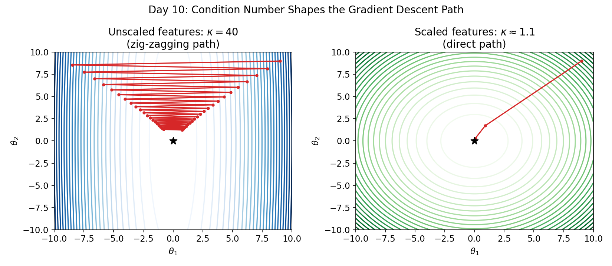

# Chapter 1.5: Adaptive Optimizers — An Optional Deep Dive

*Prerequisite: [Level 1, Day 9](level_1_data_explorer.md#day-9-gradient-descent-fundamentals--batch-stochastic-mini-batch) (Gradient Descent Fundamentals). Where to go after this: back to [Level 1, Day 10](level_1_data_explorer.md#day-10-exploratory-data-analysis--getting-to-know-your-data) if you haven't done it yet, or straight on to Level 2.*

> [!NOTE]
> **This entire chapter is optional.** It used to live inside Level 1 as a "bonus day," but it's substantial and advanced enough to deserve its own space instead of being squeezed into someone else's pacing. Lipschitz constants, Robbins-Monro conditions, and Adam's bias-correction terms are genuinely graduate-level optimization theory — this is not beginner material dressed up to look hard, it *is* hard, and that's fine. It's fully okay to skim the proofs on a first pass, do the exercise with the formulas as a reference rather than from memory, and come back to re-derive things properly after you've used these optimizers a few times in practice. One honest note on scope: we checked the rest of this book, and Adam does **not** explicitly resurface by name in later chapters — `scikit-learn`'s built-in regressors handle their own optimization internally, so you won't be quizzed on Adam's update rule again. What *does* resurface constantly is the underlying intuition (badly-scaled features slow down optimization), so if you only take one thing from this chapter, take that. You can safely jump straight to [Level 2](level_2_beginner_modeler.md) and come back here later.

Many regression models do not have a simple closed-form solution (e.g. regularized models like Lasso under L1 penalties, or non-linear neural networks). Level 1 Day 9 covered the fundamentals of finding a minimum numerically with plain gradient descent; this chapter is about *how to do that faster and more reliably* when the loss surface itself is poorly behaved.

---

## 1. Convergence Rates and Learning Rate Dynamics

If $L(\theta)$ is convex and $L$-smooth (meaning its gradient is Lipschitz continuous with constant $L_{\text{Lip}}$):
$$\|\nabla L(\theta_1) - \nabla L(\theta_2)\|_2 \le L_{\text{Lip}} \|\theta_1 - \theta_2\|_2$$
Then if we choose the learning rate $\eta < \frac{2}{L_{\text{Lip}}}$, Batch Gradient Descent is guaranteed to converge.
* For OLS, the Lipschitz constant of the gradient is the maximum eigenvalue of the matrix $\frac{1}{n} X^T X$:
  $$L_{\text{Lip}} = \lambda_{\max}\left(\frac{1}{n} X^T X\right)$$
* If the feature scales are vastly different, the eigenvalues of $X^T X$ will span a massive range, resulting in a high **condition number** $\kappa = \lambda_{\max} / \lambda_{\min}$ — the exact same condition number from [Level 1, Day 6](level_1_data_explorer.md#day-6-matrix-inversion--multicollinearity--why-models-break). The loss surface becomes a narrow, stretched valley. The gradient vectors will point almost perpendicular to the minimum, causing massive oscillations. **Scaling features** compresses the condition number close to 1, turning the narrow valley into a symmetric bowl, enabling rapid convergence.

The figure below shows this directly: the left panel is the loss surface for unscaled features (high condition number), the right panel is the same problem after scaling. Same starting point, same number of steps — watch what the shape of the bowl does to the path:



## 2. Polyak-Ruppert Averaging and Statistical Asymptotics of SGD

From a machine learning perspective, SGD is an optimization tool. From a statistical perspective, it is a stochastic approximation algorithm.
Under Robbins-Monro conditions, if we decrease the learning rate over time ($\sum \eta_k = \infty, \sum \eta_k^2 < \infty$), SGD converges to the true parameter $\theta^*$.
* **Polyak-Ruppert Averaging:** If we run SGD with a relatively large step size and average the historical parameter iterates:
  $$\bar{\theta}^{(k)} = \frac{1}{k} \sum_{j=1}^k \theta^{(j)}$$
  we achieve the optimal asymptotic variance rate. Under mild assumptions, the averaged iterates satisfy the Central Limit Theorem:
  $$\sqrt{k}(\bar{\theta}^{(k)} - \theta^*) \xrightarrow{d} \mathcal{N}(0, \Sigma)$$
  where $\Sigma$ is the asymptotic covariance matrix. This means we can construct statistical confidence intervals for our models directly from online SGD runs without ever inverting a massive design matrix!

## 3. Advanced Optimizers: Momentum, AdaGrad, RMSprop, and Adam

1. **Momentum:** Accelerates gradient descent in relevant directions and dampens oscillations by adding a fraction $\beta$ of the past update step:
   $$v^{(k+1)} = \beta v^{(k)} + \eta \nabla L(\theta^{(k)})$$
   $$\theta^{(k+1)} = \theta^{(k)} - v^{(k+1)}$$
2. **AdaGrad:** Adapts learning rates individually for each parameter by dividing by the cumulative sum of squared historical gradients.
3. **RMSprop:** Resolves AdaGrad's issue (which stops learning quickly because the step size drops to 0) by using an exponentially decaying average of squared gradients:
   $$v^{(k+1)} = \beta v^{(k)} + (1-\beta) (\nabla L(\theta^{(k)}))^2$$
   $$\theta^{(k+1)} = \theta^{(k)} - \frac{\eta}{\sqrt{v^{(k+1)}} + \epsilon} \nabla L(\theta^{(k)})$$
4. **Adam (Adaptive Moment Estimation):** Combines Momentum (tracking the first moment $m_t$) and RMSprop (tracking the second moment $v_t$) with bias correction:
   $$m_t = \beta_1 m_{t-1} + (1-\beta_1) g_t, \quad v_t = \beta_2 v_{t-1} + (1-\beta_2) g_t^2$$
   $$\hat{m}_t = \frac{m_t}{1 - \beta_1^t}, \quad \hat{v}_t = \frac{v_t}{1 - \beta_2^t}$$
   $$\theta_{t+1} = \theta_t - \frac{\eta}{\sqrt{\hat{v}_t} + \epsilon} \hat{m}_t$$

---

## Recap

* A high **condition number** (badly scaled features) turns the loss surface into a narrow valley, which forces plain gradient descent into slow zig-zagging — visibly, not just theoretically, as the figure above shows.
* **Polyak-Ruppert averaging** turns SGD from a purely optimization tool into a statistical estimator with its own confidence intervals, no matrix inversion required.
* **Momentum**, **AdaGrad**, **RMSprop**, and **Adam** each patch a specific weakness: Momentum dampens oscillation, AdaGrad adapts per-parameter but stalls, RMSprop fixes the stalling, and Adam combines Momentum + RMSprop with bias correction.

> [!TIP]
> **Quick Check:** Two features have wildly different scales — `average_household_income_pkr` (values in the tens of thousands) and `literacy_rate` (values 0–100). Without scaling, would you expect plain gradient descent to look more like the left panel or the right panel of the figure above?
> *Answer:* The left panel (narrow valley, zig-zagging) — vastly different feature scales are exactly what produces a high condition number.

---

## Exercise: Adam From Scratch

*(This continues the `optimizers_comparison.py` script from Level 1 Day 9's exercise, where you implemented `BatchGradientDescentRegressor` and `SGDRegressorFromScratch`.)*

```python
class AdamRegressorFromScratch:
    def __init__(self, learning_rate=0.01, n_epochs=100, beta1=0.9, beta2=0.999, epsilon=1e-8):
        """Store hyperparameters, including Adam's beta1/beta2/epsilon."""
        pass  # TODO

    def fit(self, X, y):
        """
        Initialize self.theta_, and the first/second moment vectors m and v
        (same shape as theta_) to zeros. For each epoch, compute the full-batch
        gradient (same as Day 9's BatchGradientDescentRegressor), then apply
        the Adam update rule from Section 3 above, including bias correction.
        Track self.loss_history_ as before.
        """
        pass  # TODO

    def predict(self, X):
        pass  # TODO
```

1. Fit `AdamRegressorFromScratch` on the same standardized data from Level 1 Day 9.
2. Plot its loss trajectory on the same axes as Day 9's batch GD and SGD curves. Compare convergence speed.
3. Now re-run all three optimizers on the **unscaled** version of the features (skip the standardization step). Which optimizer degrades the most without scaling, and which is most robust to it? Explain using the condition-number idea from Section 1 above.

---

## Formula Cheat Sheet

| Concept | Formula |
|---|---|
| Lipschitz smoothness bound | $\|\nabla L(\theta_1) - \nabla L(\theta_2)\|_2 \le L_{\text{Lip}}\|\theta_1-\theta_2\|_2$ |
| Safe learning rate bound | $\eta < 2/L_{\text{Lip}}$, where $L_{\text{Lip}} = \lambda_{\max}(\frac{1}{n}X^TX)$ |
| Polyak-Ruppert average | $\bar\theta^{(k)} = \frac{1}{k}\sum_{j=1}^k \theta^{(j)}$ |
| Momentum update | $v^{(k+1)}=\beta v^{(k)}+\eta\nabla L(\theta^{(k)})$, $\theta^{(k+1)}=\theta^{(k)}-v^{(k+1)}$ |
| RMSprop update | $v^{(k+1)}=\beta v^{(k)}+(1-\beta)(\nabla L(\theta^{(k)}))^2$, $\theta^{(k+1)}=\theta^{(k)}-\frac{\eta}{\sqrt{v^{(k+1)}}+\epsilon}\nabla L(\theta^{(k)})$ |
| Adam update | $\theta_{t+1} = \theta_t - \dfrac{\eta}{\sqrt{\hat v_t}+\epsilon}\hat m_t$ (with bias-corrected $\hat m_t, \hat v_t$) |

---

## References

1. **Robbins-Monro Asymptotics:** Polyak and Juditsky (1992), "Acceleration of Stochastic Approximation by Averaging".
2. **Convex Optimization:** Boyd & Vandenberghe. Cambridge University Press. (Same reference as Level 1 — the Lipschitz/convergence material here draws on the same source.)
3. **Adam:** Kingma, D.P. and Ba, J. (2015), "Adam: A Method for Stochastic Optimization," ICLR.

*The figure in this chapter is generated by [generate_level1_figures.py](generate_level1_figures.py), shared with Level 1; re-run it if you ever need to regenerate or tweak it.*
