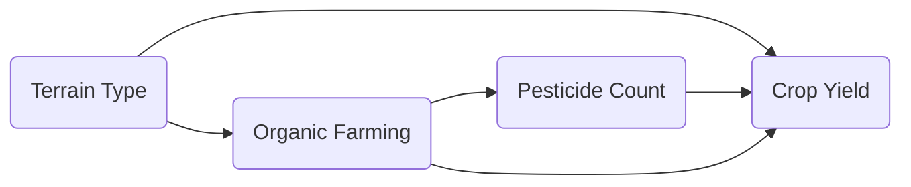

# Chapter 5: Level 5 Research Apprentice — Inference, Causality, Advanced Families, and Uncertainty

Welcome to Chapter 5! You are entering the big leagues. At this level, you stop treating regression as a simple machine learning prediction task. You start asking the hard questions: *Are our estimates statistically reliable? Do our variables actually have causal relationships, or is it all confounding? How do we quantify the risks of our predictions?*

This is the research apprentice chapter. We will dive deep into statistical inference, causal identification, advanced regression models (GLMs, mixed-effects, Bayesian regression), and uncertainty quantification (prediction intervals and conformal prediction).

---

## 27. Statistical Inference for Regression (Uncertainty of Parameters)

Suppose someone collected data from KP subdistricts. They fit an OLS model and find that the coefficient for public funding $\beta_{\text{funding}}$ is $0.08$. 
Now, they want to find out: *Is this coefficient distinguishable from zero? What is its 95% confidence interval? Can we trust it given that our errors are heteroscedastic?* What do we do?

We move from point estimation to inference:

### 27.1 Standard Errors and t-tests
Our estimated coefficient $\hat{\beta}_j$ is a sample statistic. If we collected a different sample of villages, we would get a slightly different $\hat{\beta}_j$. The standard error $\text{SE}(\hat{\beta}_j)$ measures this variability.
* **The t-statistic:** 
  $$t = \frac{\hat{\beta}_j - 0}{\text{SE}(\hat{\beta}_j)}$$
  If this ratio is large (typically $|t| > 1.96$), we reject the null hypothesis that the true coefficient is 0.
* **Large Sample Caveat:** With 100,000 observations, almost everything is "statistically significant" ($p < 0.05$), even tiny, useless effects. Always check the **practical significance** (magnitude of the effect).

### 27.2 Robust Standard Errors (HC3)
If our errors are heteroscedastic (variance increases with project scale), the classical OLS standard errors will be biased (usually too small), leading to false positives. To fix this, we use **Huber-White Sandwich Covariance Estimators** (specifically **HC3** for small-to-moderate samples):
$$\text{Var}(\hat{\beta})_{\text{robust}} = (X^T X)^{-1} X^T \Omega X (X^T X)^{-1}$$
where $\Omega$ is a diagonal matrix containing adjusted squared residuals.

---

## 28. Causal Inference with Regression (Beyond Correlation)

Suppose someone collected data on farms in KP. They see that `organic_farming` has a negative coefficient with crop yield. They conclude: *"Organic farming causes lower yield, so the government should ban organic farming."* What do we do?

We warn them that their conclusion is likely invalid because of **confounding**.

### 28.1 Confounding, Mediators, and Colliders
* **Confounder:** A variable that affects both the treatment ($T$) and the outcome ($y$).
  * *Example:* Mountainous terrain (confounder) makes farmers more likely to choose organic farming (treatment) because chemical fertilizers are hard to transport up mountains. But mountainous terrain also has cold weather and poor soil, which lowers crop yields (outcome) regardless of farming style. If you don't control for terrain, your organic coefficient is biased!
* **Mediator:** A variable on the causal path.
  * *Example:* Organic farming $\to$ Pesticide use $\to$ Yield. If you want to find the *total effect* of organic farming, do **not** control for pesticide use. Controlling for it blocks the causal path.
* **Collider:** A common effect of two variables. Controlling for a collider creates spurious correlations between its causes (conditioning on a collider is a major research crime).

### 28.2 Causal DAGs (Directed Acyclic Graphs)
Before writing down your regression, draw a DAG showing your causal assumptions.

To estimate the causal effect of `Organic Farming` on `Crop Yield`, the DAG tells us:
* We **must control** for `Terrain Type` to block the back-door confounding path: `Organic` $\leftarrow$ `Terrain` $\rightarrow$ `Yield`.
* We **must NOT control** for `Pesticide Count` if we want the total causal effect, as it is a mediator.

### 28.3 Advanced Causal Methods
* **Difference-in-Differences (DiD):** Compares changes over time between a treated group and a control group.
* **Regression Discontinuity Design (RDD):** Exploits a threshold rule (e.g., funding is only given to villages with literacy rates below 50%) to compare observations right below the threshold with those right above.

---

## 29. Advanced Regression Families

When the target is not normally distributed, or the data has a hierarchical grouping, OLS fails.

### 29.1 Generalized Linear Models (GLMs)
GLMs relate the linear predictor to the mean of the target using a link function:
$$g(\mu_i) = X_i \beta$$
* **Poisson Regression:** Used for count targets (e.g., number of pesticide sprays).
* **Gamma Regression:** Used for positive, right-skewed targets (e.g., project costs).

### 29.2 Mixed-Effects Models (Hierarchical / Multilevel)
Suppose you have observations nested within districts. 
* **Fixed Effects:** Global parameters shared by everyone.
* **Random Effects:** Group-specific parameters. A random-intercept model allows each district to have its own baseline intercept, pulled towards the global mean via **partial pooling**:
  $$y_{ij} = (\beta_0 + u_j) + \beta_1 x_{ij} + \epsilon_{ij}$$
  where $u_j$ is the random intercept for district $j$.

### 29.3 Bayesian Regression
Treats parameters $\beta$ as random variables with prior distributions. Using Bayes' rule, we calculate the posterior distribution:
$$P(\beta | \text{Data}) \propto P(\text{Data} | \beta) P(\beta)$$
This gives us full probability distributions for our coefficients instead of single-point estimates.

---

## 30. Uncertainty Quantification (UQ)

Suppose a government planner wants to budget for a new school. Your model predicts it will cost 120 million PKR. 
The planner asks: *"What is the worst-case budget we should prepare for?"* What do we do?

We estimate a **Prediction Interval**.

### 30.1 Confidence Interval vs. Prediction Interval
* **Confidence Interval (CI):** Quantifies uncertainty around the *mean* prediction. E.g., "The average cost of all schools of this size is between 115M and 125M PKR."
* **Prediction Interval (PI):** Quantifies uncertainty around an *individual future* observation. E.g., "This specific school will cost between 80M and 160M PKR with 90% probability."
* *Prediction intervals are always much wider* because they include both the parameter uncertainty and the irreducible noise ($\sigma^2$).

### 30.2 Conformal Prediction (Split Conformal)
How do we get prediction intervals with guaranteed coverage without making restrictive distribution assumptions? We use **Conformal Prediction**.
1. Split your training data into **Proper Training** and **Calibration** sets.
2. Train your model on the Proper Training set.
3. Predict the Calibration set and calculate the absolute residuals:
   $$s_i = |y_i - \hat{y}_i|$$
4. Choose your significance level $\alpha$ (e.g., $\alpha = 0.10$ for a 90% interval).
5. Find the $(1-\alpha)(1 + 1/n_{\text{cal}})$ quantile of the calibration residuals. Let's call this $q$.
6. For any new observation $X_{\text{new}}$, the 90% prediction interval is:
   $$\hat{y}_{\text{new}} \pm q$$
   This simple interval is guaranteed to contain the true value at least 90% of the time, regardless of what model you used!

---

## Chapter 5 Exercises

Let's test these advanced research skills.

### Exercise 5.1: Causal Regression Adjustment
Using the agricultural yields dataset, we want to estimate the causal effect of `organic_farming` (treated: `Yes`, control: `No`) on `crop_yield_tons_per_acre`.
1. Train a naive linear model: `yield ~ organic_farming`. Note the coefficient.
2. Train a regression adjustment model controlling for `elevation_meters`, `soil_ph`, and `average_temperature_celsius`. Note the coefficient.
3. Why did the coefficient of `organic_farming` change? Explain the back-door path that you blocked.
4. If you also control for `fertilizer_used_bags_per_acre` and `pesticide_sprays_count`, what happens to the coefficient? Explain why this is a bad idea (mediator bias).

**Helpful Comments:**
* Use `statsmodels.formula.api` for formula syntax: `smf.ols("crop_yield_tons_per_acre ~ organic_farming + elevation_meters", data=df).fit()`.

### Exercise 5.2: Hierarchical Mixed-Effects Model
Using the development dataset, we want to estimate `development_score` while accounting for the fact that communities are nested within `district`.
1. Fit a mixed-effects model with a random intercept for `district` using `statsmodels.formula.api.mixedlm`.
2. Print the summary. Report the variance of the random intercept.
3. Select three districts and print their random intercept values. Explain how this random intercept represents district-specific constraints.

**Helpful Comments:**
* Formula syntax: `mixedlm("development_score ~ literacy_rate + electricity_access_pct", data=df, groups=df["district"]).fit()`.

### Exercise 5.3: Conformal Prediction from Scratch
On the infrastructure projects dataset:
1. Split the data into 60% train, 20% calibration, and 20% test.
2. Train a `RandomForestRegressor` on the train set to predict `actual_duration_months`.
3. Compute predictions on the calibration set and calculate the absolute residuals.
4. Find the threshold $q$ for a 90% prediction interval.
5. Predict on the test set, construct the prediction intervals $\hat{y}_{\text{test}} \pm q$.
6. Calculate the **empirical coverage** (the percentage of test targets that actually fell inside their predicted intervals) and the average interval width.

**Helpful Comments:**
* Ensure your empirical coverage is very close to 90%. If it is, congratulations! You have successfully calibrated an uncertainty estimator using conformal prediction.
* *Comic Relief:* If your empirical coverage is 100% and your interval width is 10,000 months, you have predicted that projects will finish sometime between tomorrow and the heat death of the universe. High coverage, but you're fired. Try to keep those intervals reasonably narrow!

---

## References

1. **Causal Inference: The Mixtape:** Scott Cunningham. [Free Online Book](https://mixtape.scunning.com/) - The most welcoming, informal introduction to causal inference. Read the chapters on DAGs and Regression Adjustment.
2. **Data Analysis Using Regression and Multilevel/Hierarchical Models:** Andrew Gelman and Jennifer Hill. The definitive textbook on mixed-effects models.
3. **A Gentle Introduction to Conformal Prediction:** Angelopoulos and Bates. [Free arXiv PDF](https://arxiv.org/abs/2107.07511) - The best modern guide to conformal prediction.
