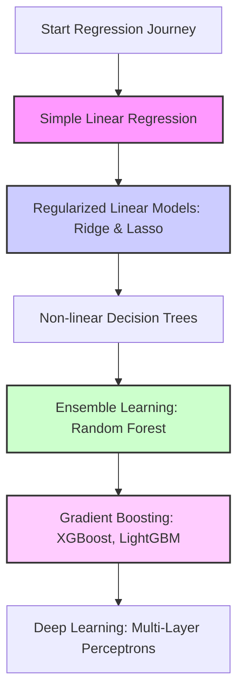

# The Ultimate Guide to Regression in Machine Learning
## Project-Based Learning with the Khyber Pakhtunkhwa (KP) Developmental Landscape Datasets

Welcome! This study guide is designed to take you from a beginner to an advanced level in Regression analysis using Machine Learning. We will use the three custom-generated KP datasets as our practical case studies.

By working through the tasks and guidelines in this document, you will master exploratory data analysis (EDA), data cleaning, feature engineering, mathematical transformations, model selection, regularization, hyperparameter optimization, and model interpretability.

---

## Table of Contents
1. **The Theoretical Foundation of Regression**
2. **Phase 1: Exploratory Data Analysis (EDA) Tasks**
3. **Phase 2: Data Preprocessing & Feature Engineering**
4. **Phase 3: Model Selection & Training Workflows**
5. **Phase 4: Hyperparameter Tuning & Validation**
6. **Phase 5: Model Evaluation & Interpretation**
7. **Hands-on Study Tasks for Each KP Dataset**
8. **Complete Python Code Templates**

---

## 1. The Theoretical Foundation of Regression

Regression is a supervised learning task where the goal is to predict a **continuous numeric value** (e.g., crop yield, project completion cost, or development score) rather than a discrete category (e.g., spam vs. ham).

### Core Concepts

#### The Regression Equation
In its simplest form, Linear Regression models the relationship between independent variables $X$ and the dependent target $y$ as:
$$y = \beta_0 + \beta_1 X_1 + \beta_2 X_2 + \dots + \beta_n X_n + \epsilon$$
Where:
* $\beta_0$ is the intercept.
* $\beta_i$ are the coefficients (slopes) showing the impact of feature $X_i$ on $y$.
* $\epsilon$ is the random error (noise) that cannot be explained by the features.

#### Loss Functions (How the model learns)
The model adjusts its coefficients to minimize a loss function on the training data:
* **Mean Squared Error (MSE)**: Computes the average of the squared differences between actual and predicted values. It heavily penalizes large errors (outliers) due to squaring.
  $$\text{MSE} = \frac{1}{N} \sum_{i=1}^{N} (y_i - \hat{y}_i)^2$$
* **Mean Absolute Error (MAE)**: Computes the average of the absolute differences. It is robust to outliers and represents the average expected error scale.
  $$\text{MAE} = \frac{1}{N} \sum_{i=1}^{N} |y_i - \hat{y}_i|$$
* **Huber Loss**: A hybrid of MSE and MAE. It acts like MSE when the error is small, but switches to MAE when the error is large, making it both differentiable and outlier-resistant.

#### Key Evaluation Metrics
* **Root Mean Squared Error (RMSE)**: The square root of MSE. It brings the error metric back to the original unit scale of the target variable.
* **Coefficient of Determination ($R^2$ Score)**: Measures the proportion of variance in the target variable that is predictable from the features.
  * $R^2 = 1$: Perfect predictions.
  * $R^2 = 0$: The model performs no better than predicting the mean of the target.
  * Negative $R^2$: The model performs worse than predicting the mean.
* **Adjusted $R^2$**: Adjusts $R^2$ for the number of features in the model. Regular $R^2$ always increases or stays the same when you add features, even if they are useless. Adjusted $R^2$ penalizes adding irrelevant features:
  $$\text{Adjusted } R^2 = 1 - \left[ \frac{(1 - R^2)(N - 1)}{N - p - 1} \right]$$
  Where $N$ is the number of samples and $p$ is the number of features.

---

## 2. Phase 1: Exploratory Data Analysis (EDA) Tasks

Before writing a single line of modeling code, you must explore your data. Execute the following tasks for each dataset:

### 📊 Task List for EDA

1. **Check Data Integrity**:
   * Inspect data types: Are numeric fields stored as objects?
   * Count missing values (`df.isnull().sum()`). Our synthetic data is clean, but real-world data is full of nulls.
2. **Analyze Target Distribution**:
   * Plot a histogram of your target variable.
   * Is it normally distributed (bell-shaped)?
   * Is it skewed? For example, budget figures in the infrastructure dataset are typically **right-skewed** (many small projects, few mega projects).
3. **Investigate Multicollinearity**:
   * Generate a correlation heatmap using Seaborn (`sns.heatmap(df.corr(), annot=True)`).
   * Look for independent variables that are highly correlated with each other (e.g., `literacy_rate` and `school_enrollment_rate`). If two features are highly correlated (e.g., $r > 0.8$), it causes instability in linear regression coefficients.
4. **Visualize Categorical Relationships**:
   * Use boxplots (`sns.boxplot(x='terrain_type', y='development_score', data=df)`) to see how categorical groupings affect the target.
5. **Analyze Feature-Target Relationships**:
   * Create scatter plots of your continuous features against the target. Look for:
     * Linear relationships (slanted straight lines).
     * Non-linear relationships (U-shapes, logarithmic curves).
     * Diminishing returns (curves that flatten out).

---

## 3. Phase 2: Data Preprocessing & Feature Engineering

Clean data and smart features are what make ML models highly accurate. Follow this structured guideline:

### ⚙️ Preprocessing Guideline

#### 1. Handling Categorical Variables
Machine learning models only understand numbers. You must encode categorical columns:
* **One-Hot Encoding**: Used for nominal features (no natural order, like `district` or `crop_type`). It creates binary columns for each unique value. 
  > [!IMPORTANT]
  > Always drop the first category (`drop_first=True` or `handle_unknown='ignore'`) in linear models to avoid the "dummy variable trap" (perfect multicollinearity).
* **Target Encoding**: For high-cardinality features (like a category with 100+ levels). It replaces each category with the average target value of that category.

#### 2. Feature Scaling
Distance-based algorithms (like KNN, Support Vector Regression) and gradient descent-based algorithms (like Linear Regression with regularization, Neural Networks) are sensitive to feature scales.
* **Standardization (Z-score Scaling)**: Rescales data to have a mean of 0 and a standard deviation of 1. Best for features that are normally distributed.
  $$X_{\text{std}} = \frac{X - \mu}{\sigma}$$
* **Normalization (Min-Max Scaling)**: Scales values between 0 and 1. Useful when you need bounded values, but sensitive to outliers.
  $$X_{\text{norm}} = \frac{X - X_{\text{min}}}{X_{\text{max}} - X_{\text{min}}}$$
* **Robust Scaling**: Uses median and IQR (Interquartile Range). Excellent if your features have extreme outliers.

#### 4. Mathematical Transformations
When features or targets are highly skewed:
* **Log Transformation (`np.log1p`)**: Converts multiplicative relationships into additive ones and compresses right-skewed variables. Highly recommended for variables like `approved_cost_million_pkr` and `population`.
* **Box-Cox or Yeo-Johnson**: Statistically finds the optimal power transformation to stabilize variance and normalize distributions.

#### 5. Feature Engineering (Creating new inputs)
* **Interaction Terms**: If the impact of one feature depends on another.
  * *Example*: In the agricultural dataset, the impact of fertilizer depends on whether irrigation is available. You can construct:
    $$\text{fertilizer\_irrigation\_interaction} = \text{fertilizer\_used} \times \text{is\_irrigated}$$
* **Domain-Specific Ratios**:
  * *Example*: In the infrastructure dataset, calculate the ratio of cost overruns:
    $$\text{cost\_escalation\_ratio} = \frac{\text{actual\_cost}}{\text{approved\_cost}}$$
* **Binning Continuous Values**: Grouping continuous features into ordinal bins (e.g., grouping elevations into `Low`, `Medium`, and `High` altitudinal zones).

---

## 4. Phase 3: Model Selection & Training Workflows

To learn regression, you should progress systematically from simple models to state-of-the-art architectures.



### The Model Hierarchy

#### 1. Ordinary Least Squares (OLS) Linear Regression
* **How it works**: Finds the line that minimizes the sum of squared residuals.
* **When to use**: As your starting baseline.
* **Limitation**: Easily overfits when there are many features, cannot capture non-linear interactions, and is highly sensitive to outliers and multicollinearity.

#### 2. Regularized Linear Models
Regularization adds a penalty term to the loss function to prevent overfitting by shrinking coefficients toward zero.
* **Ridge Regression (L2 Regularization)**: Adds a penalty proportional to the square of the coefficients.
  $$\text{Loss} = \text{MSE} + \alpha \sum_{j=1}^{p} \beta_j^2$$
  *It keeps all features but minimizes their individual impact, making it great for handling multicollinearity.*
* **Lasso Regression (L1 Regularization)**: Adds a penalty proportional to the absolute value of the coefficients.
  $$\text{Loss} = \text{MSE} + \alpha \sum_{j=1}^{p} |\beta_j|$$
  *It can force coefficients to exactly zero, effectively performing automatic feature selection.*
* **ElasticNet**: A weighted combination of Ridge and Lasso penalties.

#### 3. Tree-Based Models
* **Decision Tree Regressor**: Splits data into leaves based on features that minimize variance. It naturally captures non-linear relationships and interactions without preprocessing scaling.
* **Random Forest Regressor**: An ensemble of decision trees trained on random subsets of the data (bagging). It reduces variance and overfitting significantly.

#### 4. Gradient Boosted Decision Trees (GBDTs)
* **XGBoost & LightGBM**: Train trees sequentially, where each new tree corrects the residual errors of the previous trees. Currently the state-of-the-art for tabular regression tasks. They are fast, support regularized learning, and handle missing values automatically.

---

## 5. Phase 4: Hyperparameter Tuning & Validation

Tuning is the process of finding the optimal model configuration settings (hyperparameters) that minimize validation error.

### Validation Strategies

#### Train-Test Split vs. Cross-Validation
* A single train-test split (e.g., 80/20) can lead to a model that is lucky or unlucky on its test set.
* **K-Fold Cross-Validation**: Splits the dataset into $K$ equal-sized folds. The model trains on $K-1$ folds and tests on the remaining fold. This process repeats $K$ times, and the evaluation metrics are averaged. This provides a robust estimate of model performance on unseen data.

```
Fold 1:  [ Test  ] [ Train ] [ Train ] [ Train ] [ Train ] -> Score 1
Fold 2:  [ Train ] [ Test  ] [ Train ] [ Train ] [ Train ] -> Score 2
Fold 3:  [ Train ] [ Train ] [ Test  ] [ Train ] [ Train ] -> Score 3
Fold 4:  [ Train ] [ Train ] [ Train ] [ Test  ] [ Train ] -> Score 4
Fold 5:  [ Train ] [ Train ] [ Train ] [ Train ] [ Test  ] -> Score 5
----------------------------------------------------------------------
Average Score = (Score 1 + Score 2 + Score 3 + Score 4 + Score 5) / 5
```

### Tuning Algorithms

1. **Grid Search (`GridSearchCV`)**: Searches every combination in a pre-defined grid of hyperparameters. Exhaustive but slow.
2. **Random Search (`RandomizedSearchCV`)**: Randomly samples hyperparameter combinations from specified distributions. Much faster and often yields comparable results to Grid Search.
3. **Bayesian Optimization (e.g., Optuna)**: Fits a probabilistic model to predict which hyperparameters will perform best based on past iterations. Highly efficient for complex models like XGBoost.

---

## 6. Phase 5: Model Evaluation & Interpretation

An accurate model is useless if we do not understand *how* it makes decisions. Use these tools:

### Diagnostic Plots

* **Residuals Plot**: Plot residuals ($y - \hat{y}$) against predicted values ($\hat{y}$).
  * *Good result*: A random cloud of points centered around 0.
  * *Pattern warning*: If the residuals form a funnel shape (heteroscedasticity), it indicates that the model's error changes across different scales of the target. A log transform on the target can fix this.
* **Prediction Error Plot**: Plot predicted values on the X-axis against actual values on the Y-axis. The points should cluster tightly along the $45^\circ$ diagonal line.

### Model Interpretation Tools

* **Feature Importance**: Tree-based models can output which features contributed most to reducing variance during training.
* **Coefficients Analysis**: In linear models, the size and sign of coefficients indicate how much the target changes per unit increase of a feature.
* **SHAP (SHapley Additive exPlanations)**: A game-theoretic approach that explains the exact impact of each feature on a specific prediction. It is the gold standard for black-box model explainability.

---

## 7. Hands-on Study Tasks for Each KP Dataset

Apply your knowledge by completing these specific tasks on each of our custom datasets.

### 🏫 Task Series 1: KP Subdistrict Development Score

* **Goal**: Build a model that predicts a community's `development_score`.
* **Study Tasks**:
  1. **Multicollinearity Analysis**: Compare `literacy_rate` and `school_enrollment_rate`. Check their correlation coefficient. Build one linear regression model with both, and then separate models. Observe how their coefficients shift.
  2. **Interactions**: Create an interaction term between `terrain_type` (One-hot encoded) and `public_funding_allocated_million_pkr`. Test if public funding is more effective in plain terrains compared to mountainous terrains.
  3. **Lasso Sparsity**: Train a Lasso regression model. Vary the penalty term ($\alpha$) from $0.001$ to $10.0$. Print the number of zero coefficients at each step. Which features are dropped first?

---

### 🌾 Task Series 2: KP Farm Agricultural Yields

* **Goal**: Predict `crop_yield_tons_per_acre`.
* **Study Tasks**:
  1. **Non-Linear Relationships**: Plot `soil_ph` against `crop_yield_tons_per_acre`. You will observe a curve rather than a line. Train a linear regression model, then train a model using a polynomial feature (`soil_ph ** 2`). Note the change in $R^2$.
  2. **Crop-Specific Submodels**: Split the dataset by `crop_type` (e.g., wheat-only, apple-only) and train separate regression models. Compare coefficients. Why does temperature have a negative coefficient for apples but a positive coefficient for sugarcane?
  3. **Tree Models vs. Linear Models**: Compare a tuned Decision Tree Regressor to a Linear Regression model. Since agricultural output has complex logical rules (e.g., organic farms cannot use synthetic fertilizer), notice how tree models achieve significantly lower error.

---

### 🏗️ Task Series 3: KP Infrastructure Cost & Duration

* **Goal**: Predict project costs (`actual_cost_million_pkr`) and durations (`actual_duration_months`).
* **Study Tasks**:
  1. **Log Transformations**: Plot the distribution of `approved_cost_million_pkr`. Apply a log transform (`np.log1p`) and replot. Train two regression models (one with raw costs and one with log costs) and compare the test MSE.
  2. **Target Transformation**: The target variable `actual_cost_million_pkr` is right-skewed. Use Scikit-Learn's `TransformedTargetRegressor` to automatically apply a log transform during training and exponential back-transformation during evaluation.
  3. **Multi-Output Strategy**: Use a Random Forest Regressor to simultaneously predict both cost and duration. Evaluate the performance on both targets.

---

## 8. Complete Python Code Templates

Copy these code blocks to get started. They contain advanced preprocessing pipelines and robust model training templates.

### Template 1: Exploratory Data Analysis & Diagnostic Script
Create a file named `run_eda.py` and run it:

```python
import os
import pandas as pd
import numpy as np
import matplotlib.pyplot as plt
import seaborn as sns

# Set style
sns.set_theme(style="whitegrid")

# Load data
data_path = os.path.join("data", "kp_subdistrict_development_index.csv")
if not os.path.exists(data_path):
    print("Please run python generate_data.py first to create the data.")
    exit()

df = pd.read_csv(data_path)

print("=== Dataset Information ===")
print(df.info())
print("\n=== Missing Values ===")
print(df.isnull().sum())
print("\n=== Descriptive Statistics ===")
print(df.describe().T)

# 1. Distribution of the Target variable
plt.figure(figsize=(10, 5))
sns.histplot(df["development_score"], kde=True, color="teal")
plt.title("Distribution of Development Score (Target)")
plt.xlabel("Development Score")
plt.ylabel("Count")
plt.savefig("target_distribution.png")
print("\n Saved target distribution plot to target_distribution.png")

# 2. Correlation Matrix of Numerical Features
plt.figure(figsize=(12, 10))
numerical_cols = df.select_dtypes(include=[np.number]).columns
correlation_matrix = df[numerical_cols].corr()
sns.heatmap(correlation_matrix, annot=True, cmap="coolwarm", fmt=".2f", linewidths=0.5)
plt.title("Numerical Feature Correlation Heatmap")
plt.tight_layout()
plt.savefig("correlation_heatmap.png")
print(" Saved correlation heatmap to correlation_heatmap.png")

# 3. Categorical Boxplot
plt.figure(figsize=(10, 6))
sns.boxplot(x="terrain_type", y="development_score", data=df, palette="Set2")
plt.title("Development Score by Terrain Type")
plt.savefig("terrain_comparison.png")
print(" Saved terrain boxplot to terrain_comparison.png")
```

---

### Template 2: Advanced Preprocessing & Model Evaluation Pipeline
Create a file named `run_modeling.py` and run it:

```python
import os
import pandas as pd
import numpy as np
from sklearn.model_selection import train_test_split, KFold, cross_val_score
from sklearn.preprocessing import StandardScaler, OneHotEncoder
from sklearn.compose import ColumnTransformer
from sklearn.pipeline import Pipeline
from sklearn.linear_model import Ridge, Lasso
from sklearn.ensemble import RandomForestRegressor
from sklearn.metrics import mean_absolute_error, mean_squared_error, r2_score

# 1. Setup Data
data_path = os.path.join("data", "kp_subdistrict_development_index.csv")
df = pd.read_csv(data_path)

# Drop ID columns and target
X = df.drop(columns=["community_id", "development_score"])
y = df["development_score"]

# Define feature classes
categorical_cols = ["district", "division", "terrain_type"]
numerical_cols = [col for col in X.columns if col not in categorical_cols]

# 2. Construct Preprocessing Pipeline
# Continuous features scaled to mean=0, std=1. Categoricals one-hot encoded.
preprocessor = ColumnTransformer(
    transformers=[
        ("num", StandardScaler(), numerical_cols),
        ("cat", OneHotEncoder(drop="first", handle_unknown="ignore"), categorical_cols)
    ]
)

# 3. Define Models to Test
models = {
    "Ridge Regression": Ridge(alpha=1.0),
    "Lasso Regression": Lasso(alpha=0.1),
    "Random Forest": RandomForestRegressor(n_estimators=50, max_depth=12, random_state=42, n_jobs=-1)
}

# Train-test split
X_train, X_test, y_train, y_test = train_test_split(X, y, test_size=0.2, random_state=42)

results = {}

# 4. Training and Evaluation Loop
for name, model in models.items():
    print(f"\nTraining Model: {name}...")
    
    # Bundle preprocessing and modeling in a clean pipeline
    pipeline = Pipeline(steps=[
        ("preprocessor", preprocessor),
        ("regressor", model)
    ])
    
    # Train the pipeline
    pipeline.fit(X_train, y_train)
    
    # Make predictions
    y_pred = pipeline.predict(X_test)
    
    # Calculate performance metrics
    mae = mean_absolute_error(y_test, y_pred)
    rmse = np.sqrt(mean_squared_error(y_test, y_pred))
    r2 = r2_score(y_test, y_pred)
    
    results[name] = {"MAE": mae, "RMSE": rmse, "R2": r2}
    
    print(f"  {name} Evaluated:")
    print(f"    MAE : {mae:.4f}")
    print(f"    RMSE: {rmse:.4f}")
    print(f"    R²  : {r2:.4f}")

print("\n=== Final Comparison Table ===")
results_df = pd.DataFrame(results).T
print(results_df.to_markdown())
```

---

## 9. Recommended Reading & Learning Resources

For each task in the study plan, here are highly curated, free external resources to deepen your understanding:

### 📊 Tasks 2 & 8: Target Skewness & Log Transformations
* **Reading**: [Transforming the Target in Regression (Scikit-Learn Manual)](https://scikit-learn.org/stable/modules/compose.html#transformed-target-regressor) - Explains how to automatically log-transform targets and exp-transform predictions back.
* **Guide**: [A Guide to Data Transformation Techniques (Towards Data Science)](https://towardsdatascience.com/types-of-transformations-for-better-normal-distribution-61c226ad0209) - Deep dive into Log, Box-Cox, and Yeo-Johnson transforms.

### 🔍 Task 3: Correlation & Multicollinearity
* **Reading**: [Multicollinearity in Regression: Detection & Diagnostics (Minitab Blog)](https://blog.minitab.com/en/adventurous-analyst-guide-to-regression-analyses/multicollinearity-in-regression-analysis-problems-detection-and-fixes) - Covers what multicollinearity is, why it ruins regression coefficients, and how to detect it using VIF.
* **Video**: [StatQuest: Multicollinearity and VIF Explained (YouTube)](https://www.youtube.com/watch?v=0yI0-r6LyI0) - A clear, visual explanation of the math behind Variance Inflation Factors.

### ⚙️ Task 4: Preprocessing Pipelines (Scaling & Encoding)
* **Reading**: [Column Transformer for Heterogeneous Data (Scikit-Learn Examples)](https://scikit-learn.org/stable/auto_examples/compose/plot_column_transformer_mixed_types.html) - Best practice pipeline templates to mix categorical encoding and numerical scaling.
* **Guide**: [StandardScaler vs MinMaxScaler in Practice (Analytics Vidhya)](https://www.analyticsvidhya.com/blog/2020/04/feature-scaling-machine-learning-normalization-standardization/) - Highlights when to use Z-score scaling vs standard Min-Max normalization.

### 📐 Task 5: Ordinary Least Squares (OLS) Regression
* **Reading**: [Applied Regression Analysis Course Notes (Penn State University)](https://online.stat.psu.edu/stat462/node/81/) - High-quality university lecture notes on linear regression assumptions and residual diagnostic plots.
* **Video**: [StatQuest: Linear Regression Step-by-Step (YouTube)](https://www.youtube.com/watch?v=PaFPbb66DxQ) - Demystifies the math of fitting a straight line and calculating residuals.

### 🎛️ Task 6: Regularized Models (Ridge & Lasso)
* **Reading**: [Generalized Linear Models Documentation (Scikit-Learn)](https://scikit-learn.org/stable/modules/linear_model.html) - The official documentation describing the mathematical penalty equations of Ridge, Lasso, and ElasticNet.
* **Guide**: [Ridge and Lasso Regression Tutorial (Kaggle Notebooks)](https://www.kaggle.com/code/tentotheminus9/linear-ridge-and-lasso-regression-tutorial) - Interactive coding notebook demonstrating L1 and L2 coefficient shrinkage.

### 🌳 Task 7: Tree-Based Models & Random Forests
* **Reading**: [Random Forest Regressor Manual (Scikit-Learn)](https://scikit-learn.org/stable/modules/generated/sklearn.ensemble.RandomForestRegressor.html) - Technical parameters list for Random Forest trees.
* **Video**: [StatQuest: Random Forests Explained (YouTube)](https://www.youtube.com/watch?v=J4Wdy0Wc_xQ) - A visual breakdown of bootstrapping, bagging, and forest ensemble aggregation.

### 🔄 Task 9: Cross-Validation & Hyperparameter Tuning
* **Reading**: [Cross-Validation: Evaluating Estimator Performance (Scikit-Learn Guide)](https://scikit-learn.org/stable/modules/cross_validation.html) - Detailed diagrams of K-Fold, Stratified K-Fold, and TimeSeries splits.
* **Guide**: [Cross-Validation Tutorial (Kaggle Learn)](https://www.kaggle.com/code/dansbecker/cross-validation) - Practical, bite-sized coding tutorial on validation splits.

---

## Conclusion & Next Steps

This guide provides a comprehensive roadmap for regression learning. By practicing with these datasets, you are building skills directly transferable to real-world data science roles. 

### Recommended Action Plan
1. Ensure you have run [generate_data.py](file:///E:/Programming/ML/Regression-Tasks/generate_data.py) to generate the datasets.
2. Run `run_eda.py` and inspect the generated plots.
3. Complete the study tasks in **Section 7** step-by-step.
4. Experiment with advanced algorithms (like XGBoost) and log-transformations to see how close you can get to a perfect $R^2$ score!

