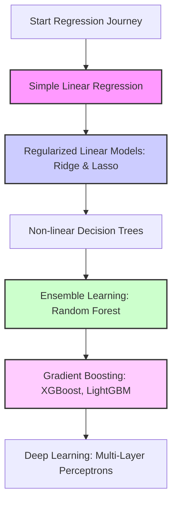

# The Ultimate Guide to Regression in Machine Learning
## Project-Based Learning with the Khyber Pakhtunkhwa (KP) Developmental Landscape Datasets

Welcome! This study guide is designed to take you from a beginner to an advanced level in Regression analysis using Machine Learning. We will use the three custom-generated KP datasets as our practical case studies.

By working through the tasks and guidelines in this document, you will master exploratory data analysis (EDA), data cleaning, feature engineering, mathematical transformations, model selection, regularization, hyperparameter optimization, and model interpretability.

---

## Table of Contents

**Part A — Beginner to Advanced**

1. **The Theoretical Foundation of Regression**
2. **Phase 1: Exploratory Data Analysis (EDA) Tasks**
3. **Phase 2: Data Preprocessing & Feature Engineering**
4. **Phase 3: Model Selection & Training Workflows**
5. **Phase 4: Hyperparameter Tuning & Validation**
6. **Phase 5: Model Evaluation & Interpretation**
7. **Hands-on Study Tasks for Each KP Dataset**
8. **Complete Python Code Templates**

**Part B — Advanced to Research Level**

9. **Statistical Rigor and Formal Inference for Regression**
10. **Causal Inference: Why Prediction Isn't Explanation**
11. **Research-Level Regression Families** (hierarchical/mixed-effects, Bayesian, GAMs, quantile, robust, deep tabular)
12. **Uncertainty Quantification & Conformal Prediction**
13. **Rigorous Model Comparison and Experiment Design**
14. **Reproducibility and Research Engineering Practices**
15. **Research-Level Capstone Tasks for Each KP Dataset**
16. **Recommended Reading & Learning Resources**
17. **Suggested Research Papers**
18. **How to Read and Write a Research Paper in Applied Regression**
19. **Glossary of Research-Level Terms**

---

## 1. The Theoretical Foundation of Regression

Regression is a supervised learning task where the goal is to predict a **continuous numeric value** (e.g., crop yield, project completion cost, or development score) rather than a discrete category (e.g., spam vs. ham).

### Core Concepts

#### The Regression Equation
In its simplest form, Linear Regression models the relationship between independent variables $X$ and the dependent target $y$ as:
$$y = \beta_0 + \beta_1 X_1 + \beta_2 X_2 + \dots + \beta_n X_n + \epsilon$$
Where:
* $\beta_0$ is the intercept.
* $\beta_i$ are the coefficients (slopes) showing the impact of feature $X_i$ on $y$.
* $\epsilon$ is the random error (noise) that cannot be explained by the features.

#### Loss Functions (How the model learns)
The model adjusts its coefficients to minimize a loss function on the training data:
* **Mean Squared Error (MSE)**: Computes the average of the squared differences between actual and predicted values. It heavily penalizes large errors (outliers) due to squaring.
  $$\text{MSE} = \frac{1}{N} \sum_{i=1}^{N} (y_i - \hat{y}_i)^2$$
* **Mean Absolute Error (MAE)**: Computes the average of the absolute differences. It is robust to outliers and represents the average expected error scale.
  $$\text{MAE} = \frac{1}{N} \sum_{i=1}^{N} |y_i - \hat{y}_i|$$
* **Huber Loss**: A hybrid of MSE and MAE. It acts like MSE when the error is small, but switches to MAE when the error is large, making it both differentiable and outlier-resistant.

#### Key Evaluation Metrics
* **Root Mean Squared Error (RMSE)**: The square root of MSE. It brings the error metric back to the original unit scale of the target variable.
* **Coefficient of Determination ($R^2$ Score)**: Measures the proportion of variance in the target variable that is predictable from the features.
  * $R^2 = 1$: Perfect predictions.
  * $R^2 = 0$: The model performs no better than predicting the mean of the target.
  * Negative $R^2$: The model performs worse than predicting the mean.
* **Adjusted $R^2$**: Adjusts $R^2$ for the number of features in the model. Regular $R^2$ always increases or stays the same when you add features, even if they are useless. Adjusted $R^2$ penalizes adding irrelevant features:
  $$\text{Adjusted } R^2 = 1 - \left[ \frac{(1 - R^2)(N - 1)}{N - p - 1} \right]$$
  Where $N$ is the number of samples and $p$ is the number of features.

---

## 2. Phase 1: Exploratory Data Analysis (EDA) Tasks

Before writing a single line of modeling code, you must explore your data. Execute the following tasks for each dataset:

### 📊 Task List for EDA

1. **Check Data Integrity**:
   * Inspect data types: Are numeric fields stored as objects?
   * Count missing values (`df.isnull().sum()`). Our synthetic data is clean, but real-world data is full of nulls.
2. **Analyze Target Distribution**:
   * Plot a histogram of your target variable.
   * Is it normally distributed (bell-shaped)?
   * Is it skewed? For example, budget figures in the infrastructure dataset are typically **right-skewed** (many small projects, few mega projects).
3. **Investigate Multicollinearity**:
   * Generate a correlation heatmap using Seaborn (`sns.heatmap(df.corr(), annot=True)`).
   * Look for independent variables that are highly correlated with each other (e.g., `literacy_rate` and `school_enrollment_rate`). If two features are highly correlated (e.g., $r > 0.8$), it causes instability in linear regression coefficients.
4. **Visualize Categorical Relationships**:
   * Use boxplots (`sns.boxplot(x='terrain_type', y='development_score', data=df)`) to see how categorical groupings affect the target.
5. **Analyze Feature-Target Relationships**:
   * Create scatter plots of your continuous features against the target. Look for:
     * Linear relationships (slanted straight lines).
     * Non-linear relationships (U-shapes, logarithmic curves).
     * Diminishing returns (curves that flatten out).

---

## 3. Phase 2: Data Preprocessing & Feature Engineering

Clean data and smart features are what make ML models highly accurate. Follow this structured guideline:

### ⚙️ Preprocessing Guideline

#### 1. Handling Categorical Variables
Machine learning models only understand numbers. You must encode categorical columns:
* **One-Hot Encoding**: Used for nominal features (no natural order, like `district` or `crop_type`). It creates binary columns for each unique value. 
  > [!IMPORTANT]
  > Always drop the first category (`drop_first=True` or `handle_unknown='ignore'`) in linear models to avoid the "dummy variable trap" (perfect multicollinearity).
* **Target Encoding**: For high-cardinality features (like a category with 100+ levels). It replaces each category with the average target value of that category.

#### 2. Feature Scaling
Distance-based algorithms (like KNN, Support Vector Regression) and gradient descent-based algorithms (like Linear Regression with regularization, Neural Networks) are sensitive to feature scales.
* **Standardization (Z-score Scaling)**: Rescales data to have a mean of 0 and a standard deviation of 1. Best for features that are normally distributed.
  $$X_{\text{std}} = \frac{X - \mu}{\sigma}$$
* **Normalization (Min-Max Scaling)**: Scales values between 0 and 1. Useful when you need bounded values, but sensitive to outliers.
  $$X_{\text{norm}} = \frac{X - X_{\text{min}}}{X_{\text{max}} - X_{\text{min}}}$$
* **Robust Scaling**: Uses median and IQR (Interquartile Range). Excellent if your features have extreme outliers.

#### 4. Mathematical Transformations
When features or targets are highly skewed:
* **Log Transformation (`np.log1p`)**: Converts multiplicative relationships into additive ones and compresses right-skewed variables. Highly recommended for variables like `approved_cost_million_pkr` and `population`.
* **Box-Cox or Yeo-Johnson**: Statistically finds the optimal power transformation to stabilize variance and normalize distributions.

#### 5. Feature Engineering (Creating new inputs)
* **Interaction Terms**: If the impact of one feature depends on another.
  * *Example*: In the agricultural dataset, the impact of fertilizer depends on whether irrigation is available. You can construct:
    $$\text{fertilizer\_irrigation\_interaction} = \text{fertilizer\_used} \times \text{is\_irrigated}$$
* **Domain-Specific Ratios**:
  * *Example*: In the infrastructure dataset, calculate the ratio of cost overruns:
    $$\text{cost\_escalation\_ratio} = \frac{\text{actual\_cost}}{\text{approved\_cost}}$$
* **Binning Continuous Values**: Grouping continuous features into ordinal bins (e.g., grouping elevations into `Low`, `Medium`, and `High` altitudinal zones).

---

## 4. Phase 3: Model Selection & Training Workflows

To learn regression, you should progress systematically from simple models to state-of-the-art architectures.



### The Model Hierarchy

#### 1. Ordinary Least Squares (OLS) Linear Regression
* **How it works**: Finds the line that minimizes the sum of squared residuals.
* **When to use**: As your starting baseline.
* **Limitation**: Easily overfits when there are many features, cannot capture non-linear interactions, and is highly sensitive to outliers and multicollinearity.

#### 2. Regularized Linear Models
Regularization adds a penalty term to the loss function to prevent overfitting by shrinking coefficients toward zero.
* **Ridge Regression (L2 Regularization)**: Adds a penalty proportional to the square of the coefficients.
  $$\text{Loss} = \text{MSE} + \alpha \sum_{j=1}^{p} \beta_j^2$$
  *It keeps all features but minimizes their individual impact, making it great for handling multicollinearity.*
* **Lasso Regression (L1 Regularization)**: Adds a penalty proportional to the absolute value of the coefficients.
  $$\text{Loss} = \text{MSE} + \alpha \sum_{j=1}^{p} |\beta_j|$$
  *It can force coefficients to exactly zero, effectively performing automatic feature selection.*
* **ElasticNet**: A weighted combination of Ridge and Lasso penalties.

#### 3. Tree-Based Models
* **Decision Tree Regressor**: Splits data into leaves based on features that minimize variance. It naturally captures non-linear relationships and interactions without preprocessing scaling.
* **Random Forest Regressor**: An ensemble of decision trees trained on random subsets of the data (bagging). It reduces variance and overfitting significantly.

#### 4. Gradient Boosted Decision Trees (GBDTs)
* **XGBoost & LightGBM**: Train trees sequentially, where each new tree corrects the residual errors of the previous trees. Currently the state-of-the-art for tabular regression tasks. They are fast, support regularized learning, and handle missing values automatically.

---

## 5. Phase 4: Hyperparameter Tuning & Validation

Tuning is the process of finding the optimal model configuration settings (hyperparameters) that minimize validation error.

### Validation Strategies

#### Train-Test Split vs. Cross-Validation
* A single train-test split (e.g., 80/20) can lead to a model that is lucky or unlucky on its test set.
* **K-Fold Cross-Validation**: Splits the dataset into $K$ equal-sized folds. The model trains on $K-1$ folds and tests on the remaining fold. This process repeats $K$ times, and the evaluation metrics are averaged. This provides a robust estimate of model performance on unseen data.

```
Fold 1:  [ Test  ] [ Train ] [ Train ] [ Train ] [ Train ] -> Score 1
Fold 2:  [ Train ] [ Test  ] [ Train ] [ Train ] [ Train ] -> Score 2
Fold 3:  [ Train ] [ Train ] [ Test  ] [ Train ] [ Train ] -> Score 3
Fold 4:  [ Train ] [ Train ] [ Train ] [ Test  ] [ Train ] -> Score 4
Fold 5:  [ Train ] [ Train ] [ Train ] [ Train ] [ Test  ] -> Score 5
----------------------------------------------------------------------
Average Score = (Score 1 + Score 2 + Score 3 + Score 4 + Score 5) / 5
```

### Tuning Algorithms

1. **Grid Search (`GridSearchCV`)**: Searches every combination in a pre-defined grid of hyperparameters. Exhaustive but slow.
2. **Random Search (`RandomizedSearchCV`)**: Randomly samples hyperparameter combinations from specified distributions. Much faster and often yields comparable results to Grid Search.
3. **Bayesian Optimization (e.g., Optuna)**: Fits a probabilistic model to predict which hyperparameters will perform best based on past iterations. Highly efficient for complex models like XGBoost.

---

## 6. Phase 5: Model Evaluation & Interpretation

An accurate model is useless if we do not understand *how* it makes decisions. Use these tools:

### Diagnostic Plots

* **Residuals Plot**: Plot residuals ($y - \hat{y}$) against predicted values ($\hat{y}$).
  * *Good result*: A random cloud of points centered around 0.
  * *Pattern warning*: If the residuals form a funnel shape (heteroscedasticity), it indicates that the model's error changes across different scales of the target. A log transform on the target can fix this.
* **Prediction Error Plot**: Plot predicted values on the X-axis against actual values on the Y-axis. The points should cluster tightly along the $45^\circ$ diagonal line.

### Model Interpretation Tools

* **Feature Importance**: Tree-based models can output which features contributed most to reducing variance during training.
* **Coefficients Analysis**: In linear models, the size and sign of coefficients indicate how much the target changes per unit increase of a feature.
* **SHAP (SHapley Additive exPlanations)**: A game-theoretic approach that explains the exact impact of each feature on a specific prediction. It is the gold standard for black-box model explainability.

---

## 7. Hands-on Study Tasks for Each KP Dataset

Apply your knowledge by completing these specific tasks on each of our custom datasets.

### 🏫 Task Series 1: KP Subdistrict Development Score

* **Goal**: Build a model that predicts a community's `development_score`.
* **Study Tasks**:
  1. **Multicollinearity Analysis**: Compare `literacy_rate` and `school_enrollment_rate`. Check their correlation coefficient. Build one linear regression model with both, and then separate models. Observe how their coefficients shift.
  2. **Interactions**: Create an interaction term between `terrain_type` (One-hot encoded) and `public_funding_allocated_million_pkr`. Test if public funding is more effective in plain terrains compared to mountainous terrains.
  3. **Lasso Sparsity**: Train a Lasso regression model. Vary the penalty term ($\alpha$) from $0.001$ to $10.0$. Print the number of zero coefficients at each step. Which features are dropped first?

---

### 🌾 Task Series 2: KP Farm Agricultural Yields

* **Goal**: Predict `crop_yield_tons_per_acre`.
* **Study Tasks**:
  1. **Non-Linear Relationships**: Plot `soil_ph` against `crop_yield_tons_per_acre`. You will observe a curve rather than a line. Train a linear regression model, then train a model using a polynomial feature (`soil_ph ** 2`). Note the change in $R^2$.
  2. **Crop-Specific Submodels**: Split the dataset by `crop_type` (e.g., wheat-only, apple-only) and train separate regression models. Compare coefficients. Why does temperature have a negative coefficient for apples but a positive coefficient for sugarcane?
  3. **Tree Models vs. Linear Models**: Compare a tuned Decision Tree Regressor to a Linear Regression model. Since agricultural output has complex logical rules (e.g., organic farms cannot use synthetic fertilizer), notice how tree models achieve significantly lower error.

---

### 🏗️ Task Series 3: KP Infrastructure Cost & Duration

* **Goal**: Predict project costs (`actual_cost_million_pkr`) and durations (`actual_duration_months`).
* **Study Tasks**:
  1. **Log Transformations**: Plot the distribution of `approved_cost_million_pkr`. Apply a log transform (`np.log1p`) and replot. Train two regression models (one with raw costs and one with log costs) and compare the test MSE.
  2. **Target Transformation**: The target variable `actual_cost_million_pkr` is right-skewed. Use Scikit-Learn's `TransformedTargetRegressor` to automatically apply a log transform during training and exponential back-transformation during evaluation.
  3. **Multi-Output Strategy**: Use a Random Forest Regressor to simultaneously predict both cost and duration. Evaluate the performance on both targets.

---

## 8. Complete Python Code Templates

Copy these code blocks to get started. They contain advanced preprocessing pipelines and robust model training templates.

### Template 1: Exploratory Data Analysis & Diagnostic Script
Create a file named `run_eda.py` and run it:

```python
import os
import pandas as pd
import numpy as np
import matplotlib.pyplot as plt
import seaborn as sns

# Set style
sns.set_theme(style="whitegrid")

# Load data
data_path = os.path.join("data", "kp_subdistrict_development_index.csv")
if not os.path.exists(data_path):
    print("Please run python generate_data.py first to create the data.")
    exit()

df = pd.read_csv(data_path)

print("=== Dataset Information ===")
print(df.info())
print("\n=== Missing Values ===")
print(df.isnull().sum())
print("\n=== Descriptive Statistics ===")
print(df.describe().T)

# 1. Distribution of the Target variable
plt.figure(figsize=(10, 5))
sns.histplot(df["development_score"], kde=True, color="teal")
plt.title("Distribution of Development Score (Target)")
plt.xlabel("Development Score")
plt.ylabel("Count")
plt.savefig("target_distribution.png")
print("\n Saved target distribution plot to target_distribution.png")

# 2. Correlation Matrix of Numerical Features
plt.figure(figsize=(12, 10))
numerical_cols = df.select_dtypes(include=[np.number]).columns
correlation_matrix = df[numerical_cols].corr()
sns.heatmap(correlation_matrix, annot=True, cmap="coolwarm", fmt=".2f", linewidths=0.5)
plt.title("Numerical Feature Correlation Heatmap")
plt.tight_layout()
plt.savefig("correlation_heatmap.png")
print(" Saved correlation heatmap to correlation_heatmap.png")

# 3. Categorical Boxplot
plt.figure(figsize=(10, 6))
sns.boxplot(x="terrain_type", y="development_score", data=df, palette="Set2")
plt.title("Development Score by Terrain Type")
plt.savefig("terrain_comparison.png")
print(" Saved terrain boxplot to terrain_comparison.png")
```

---

### Template 2: Advanced Preprocessing & Model Evaluation Pipeline
Create a file named `run_modeling.py` and run it:

```python
import os
import pandas as pd
import numpy as np
from sklearn.model_selection import train_test_split, KFold, cross_val_score
from sklearn.preprocessing import StandardScaler, OneHotEncoder
from sklearn.compose import ColumnTransformer
from sklearn.pipeline import Pipeline
from sklearn.linear_model import Ridge, Lasso
from sklearn.ensemble import RandomForestRegressor
from sklearn.metrics import mean_absolute_error, mean_squared_error, r2_score

# 1. Setup Data
data_path = os.path.join("data", "kp_subdistrict_development_index.csv")
df = pd.read_csv(data_path)

# Drop ID columns and target
X = df.drop(columns=["community_id", "development_score"])
y = df["development_score"]

# Define feature classes
categorical_cols = ["district", "division", "terrain_type"]
numerical_cols = [col for col in X.columns if col not in categorical_cols]

# 2. Construct Preprocessing Pipeline
# Continuous features scaled to mean=0, std=1. Categoricals one-hot encoded.
preprocessor = ColumnTransformer(
    transformers=[
        ("num", StandardScaler(), numerical_cols),
        ("cat", OneHotEncoder(drop="first", handle_unknown="ignore"), categorical_cols)
    ]
)

# 3. Define Models to Test
models = {
    "Ridge Regression": Ridge(alpha=1.0),
    "Lasso Regression": Lasso(alpha=0.1),
    "Random Forest": RandomForestRegressor(n_estimators=50, max_depth=12, random_state=42, n_jobs=-1)
}

# Train-test split
X_train, X_test, y_train, y_test = train_test_split(X, y, test_size=0.2, random_state=42)

results = {}

# 4. Training and Evaluation Loop
for name, model in models.items():
    print(f"\nTraining Model: {name}...")
    
    # Bundle preprocessing and modeling in a clean pipeline
    pipeline = Pipeline(steps=[
        ("preprocessor", preprocessor),
        ("regressor", model)
    ])
    
    # Train the pipeline
    pipeline.fit(X_train, y_train)
    
    # Make predictions
    y_pred = pipeline.predict(X_test)
    
    # Calculate performance metrics
    mae = mean_absolute_error(y_test, y_pred)
    rmse = np.sqrt(mean_squared_error(y_test, y_pred))
    r2 = r2_score(y_test, y_pred)
    
    results[name] = {"MAE": mae, "RMSE": rmse, "R2": r2}
    
    print(f"  {name} Evaluated:")
    print(f"    MAE : {mae:.4f}")
    print(f"    RMSE: {rmse:.4f}")
    print(f"    R²  : {r2:.4f}")

print("\n=== Final Comparison Table ===")
results_df = pd.DataFrame(results).T
print(results_df.to_markdown())
```

---

## 9. Statistical Rigor and Formal Inference for Regression

Everything in Sections 1–8 treats regression as a *prediction* exercise: fit, predict, score. Research-level work treats regression as a **statistical estimator** — a coefficient is a claim about the world, and that claim needs a formally quantified uncertainty, not just a point value. This section replaces "eyeball the residual plot" with named, citable tests.

### 9.1 OLS as an Estimator, Not Just a Solver

Ordinary Least Squares is the Best Linear Unbiased Estimator (BLUE) *only if* the **Gauss-Markov assumptions** hold:
1. **Linearity in parameters**: $y = X\beta + \epsilon$.
2. **Strict exogeneity**: $E[\epsilon \mid X] = 0$ — the errors carry no information about the features. This is the assumption causal confounding violates (Section 10).
3. **Homoscedasticity**: $\text{Var}(\epsilon_i) = \sigma^2$ for all $i$ (constant error variance).
4. **No perfect multicollinearity**: $X$ has full column rank.
5. For classical (small-sample) hypothesis tests, **normally distributed errors**; for large $n$, the Central Limit Theorem makes t-tests approximately valid even without this.

Under these assumptions, the coefficient covariance matrix is:
$$\text{Var}(\hat\beta) = \sigma^2 (X^TX)^{-1}$$
and each coefficient's standard error $SE(\hat\beta_j)$ is the square root of the corresponding diagonal entry. This is what turns a coefficient into a statistical claim with a confidence interval:
$$\hat\beta_j \pm t_{n-p-1,\;\alpha/2} \cdot SE(\hat\beta_j)$$

### 9.2 Hypothesis Tests You Should Be Able to Name and Run

| Test | Question it answers | Tool |
|---|---|---|
| **t-test on $\hat\beta_j$** | Is feature $j$'s effect distinguishable from zero? | `statsmodels` OLS `summary()` |
| **F-test** | Does *any* feature in a group (or the whole model) explain variance beyond the null? Used for nested model comparison (e.g., does adding the interaction term in Task Series 1 significantly improve fit?) | `statsmodels` `.compare_f_test()` |
| **Breusch-Pagan / White test** | Is the error variance constant (homoscedastic), or does it grow with $\hat y$ (a formal version of the "funnel shape" from Section 6)? | `statsmodels.stats.diagnostic.het_breuschpagan` |
| **Jarque-Bera / Shapiro-Wilk** | Are residuals normally distributed? Matters for small-sample inference validity, not for prediction. | `scipy.stats.jarque_bera`, `shapiro` |
| **Durbin-Watson** | Are consecutive residuals correlated (autocorrelation)? Relevant for the infrastructure dataset if you sort by `year_of_initiation`. | reported automatically in `statsmodels` OLS summary |
| **Variance Inflation Factor (VIF)** | How much is $\hat\beta_j$'s variance inflated by correlation with other features? $VIF_j = 1/(1-R_j^2)$, where $R_j^2$ is from regressing feature $j$ on all other features. $VIF_j > 5$–$10$ signals a multicollinearity problem worth acting on, not just noting. | `statsmodels.stats.outliers_influence.variance_inflation_factor` |

### 9.3 When Assumptions Fail: Robust and Resampled Inference

Real (and realistic synthetic) data rarely satisfies homoscedasticity or normality exactly. Two research-standard fixes:

* **Heteroscedasticity-consistent (HC) standard errors**: instead of assuming constant error variance, HC0–HC3 estimators compute a "sandwich" covariance matrix that stays valid under heteroscedasticity. In `statsmodels`, this is one argument: `model.fit(cov_type="HC3")`. Always compare the naive SE against the HC3 SE — if they diverge a lot, your naive confidence intervals were wrong.
* **Bootstrap confidence intervals**: resample rows (with replacement) $B$ times (e.g., $B=2000$), refit, and take the 2.5th/97.5th percentiles of the resulting coefficient distribution as a CI. This makes no distributional assumption at all and is the standard fallback when formal tests fail.

### 9.4 Task: Formal Inference on the Development Index Dataset

1. Fit `statsmodels.OLS` for `development_score` with a full covariate set. Read the `summary()` table: which coefficients are significant at $\alpha = 0.05$?
2. Run Breusch-Pagan on the residuals. If it flags heteroscedasticity, refit with `cov_type="HC3"` and report how much each coefficient's p-value changes.
3. Compute VIF for every numeric feature. Which pair is the worst offender — is it `literacy_rate` and `school_enrollment_rate` as flagged in Section 2?
4. Bootstrap a 95% CI for the `public_funding_allocated_million_pkr` coefficient with 2,000 resamples and compare it to the analytic OLS CI.

---

## 10. Causal Inference: Why Prediction Isn't Explanation

A model that predicts `development_score` well is not the same as a model that tells you what happens if a policymaker *increases* `public_funding_allocated_million_pkr`. Confusing the two is the single most common way applied regression work fails at research level. This section is deliberately about the KP datasets specifically, because `generate_data.py` encodes real causal structure that naive regression will get wrong in predictable ways.

### 10.1 The Core Problem: Confounding and Reverse Causality

Ask: does funding *cause* higher development scores, or does the government *target* funding at already-struggling communities (reverse causality), or does some third factor (e.g., `terrain_type`, remoteness) drive both funding decisions and development outcomes (confounding)? A regression coefficient on `public_funding_allocated_million_pkr` cannot distinguish these stories on its own — and depending on which is true in the data-generating process, the naive coefficient could be biased toward zero, negative, or spuriously large.

The same question recurs in every dataset:
* **Development Index**: is funding endogenous to need?
* **Agricultural Yields**: does `organic_farming` cause lower yield, or do farmers with poorer land (already low expected yield) disproportionately choose organic methods?
* **Infrastructure Projects**: does low `contractor_experience_years` cause cost overruns, or are inexperienced contractors disproportionately assigned to already-difficult (high `terrain_complexity`) projects?

### 10.2 The Potential Outcomes Framework

Formally (Rubin, 1974): each unit $i$ has two potential outcomes, $Y_i(1)$ under treatment and $Y_i(0)$ under control, but we only ever observe one. The causal quantity of interest is usually the **Average Treatment Effect**:
$$\text{ATE} = E[Y_i(1) - Y_i(0)]$$
Naively comparing the *observed* means of treated vs. untreated units equals the ATE only if treatment assignment is independent of potential outcomes — which is exactly what fails under confounding.

### 10.3 Reasoning with DAGs

A Directed Acyclic Graph makes the assumed causal structure explicit and tells you *which* variables to control for:
* **Confounder** (common cause of treatment and outcome) — must be controlled for, or the estimate is biased.
* **Mediator** (on the causal path between treatment and outcome) — must **not** be controlled for, or you block part of the true effect.
* **Collider** (common effect of two variables) — must **not** be controlled for, or you induce a spurious association ("collider bias").

Sketch the DAG for the agricultural dataset before choosing which covariates go into a "causal" model of `organic_farming → crop_yield_tons_per_acre`. `soil_ph`, `irrigation_type`, and `farm_size_acres` are plausible confounders (they affect both the farming-method choice and the yield); `pesticide_sprays_count` is plausibly a mediator (organic farming *causes* lower spray counts, which then affects yield) and should generally be left out of a total-effect estimate.

### 10.4 Identification Strategies to Practice

| Strategy | Idea | Where to apply it in these datasets |
|---|---|---|
| **Regression adjustment** | Control for all observed confounders directly in the regression. Only valid if there's no *unobserved* confounding. | Baseline for all three capstones (Section 15) |
| **Propensity score matching** | Model $P(\text{treatment}=1 \mid X)$ with logistic regression, then match treated/untreated units with similar propensity scores and compare outcomes within matched pairs. | `organic_farming` effect on yield |
| **Difference-in-Differences** | Compare the *change* in outcome before/after an event between an affected and unaffected group, cancelling out time-invariant confounders. | Use `year_of_initiation` and `inflation_rate_at_start_pct` spikes (e.g., 2022–2024) as a natural shock to infra project costs |
| **Instrumental variables** | Find a variable that affects treatment but has no direct effect on the outcome except through treatment. Conceptually hardest to satisfy — practice *identifying candidate instruments and arguing why they might fail* even if you don't have a clean one in this data. | Discuss (no clean instrument exists in these datasets — that's the point of the exercise) |
| **Regression discontinuity** | If treatment is assigned by a hard threshold on a running variable, compare units just above/below the cutoff. | Only applicable if a funding-eligibility threshold on `development_score` is discovered during EDA |

> [!WARNING]
> Feature importance, SHAP values, and regression coefficients from Section 6 describe **association within the model**, not the causal effect of intervening in the world. A tree-based model can assign high importance to a pure confounder. Never present a feature-importance ranking as a policy recommendation without an explicit causal identification argument.

### 10.5 Task: Estimate a Causal Effect

Pick one: (a) estimate the ATE of `organic_farming` on `crop_yield_tons_per_acre` using propensity score matching (logistic regression propensity model + nearest-neighbor matching, e.g. via `sklearn.neighbors.NearestNeighbors` on propensity scores), and compare it to the naive OLS coefficient on the same treatment variable — quantify the bias; or (b) use a difference-in-differences design around a high-inflation period in the infrastructure dataset to estimate the causal effect of `inflation_rate_at_start_pct` shocks on `actual_cost_million_pkr` overruns, holding `project_sector` fixed. In both cases, write one paragraph stating the *identifying assumption* your method requires, and one paragraph on what evidence would make you doubt it holds.

---

## 11. Research-Level Regression Families

Sections 4 and 11 of the OLS/tree hierarchy (Section 4) cover the workhorse models. Research-level practice requires knowing when *none* of those is the right tool, and reaching for a family built for the actual structure of the problem: grouped data, nonlinear-but-interpretable effects, asymmetric risk, heavy-tailed outliers, or high-cardinality categoricals.

### 11.1 Hierarchical / Mixed-Effects Regression

All three KP datasets are **grouped**: communities within districts within divisions, farms within districts, projects within districts and sectors. Pooling everything into one OLS ignores that districts differ systematically (unmodeled heterogeneity); fitting one separate model per district overfits districts with few observations. Mixed-effects models split the difference with **partial pooling**:
$$y_{ij} = \beta_0 + u_j + \beta_1 x_{ij} + \epsilon_{ij}, \qquad u_j \sim N(0, \tau^2)$$
where $u_j$ is a random intercept for district $j$, shrunk toward the population mean in proportion to how little data that district has. The **intraclass correlation (ICC)**, $\tau^2 / (\tau^2 + \sigma^2)$, quantifies how much of the total outcome variance is between-district versus within-district — a number worth reporting on its own.

* **Tools**: `statsmodels.formula.api.mixedlm`, or `bambi` for a Bayesian version on top of PyMC.
* **Task**: fit a random-intercept model for `development_score` with district as the grouping factor. Compare the district intercepts to a naive fixed-effects model (one dummy per district) — which districts shrink the most, and why (hint: check their sample sizes)?

### 11.2 Bayesian Regression

Instead of a single point estimate plus a frequentist CI, Bayesian regression puts a prior on $\beta$ and computes a full **posterior distribution** given the data, via MCMC (e.g., the No-U-Turn Sampler) or variational inference. This is valuable when: data is sparse for some subgroups (small districts benefit from informative priors the same way mixed models benefit from partial pooling); you need calibrated uncertainty on *derived* quantities (e.g., "P(coefficient > 0)"); or you want to formally check model fit via **posterior predictive checks** (simulate fake data from the fitted model and compare its distribution to the real data).

* **Tools**: PyMC, or `bambi` (R-`lme4`-style formulas over PyMC).
* **Task**: fit a Bayesian linear regression for `crop_yield_tons_per_acre` with weakly informative priors ($\beta_j \sim N(0, 10)$). Plot the posterior distribution of the `fertilizer_used_bags_per_acre` coefficient. Run a posterior predictive check: simulate 500 datasets from the posterior and confirm the real target's distribution falls within the simulated envelope.

### 11.3 Generalized Additive Models (GAMs)

Section 3 handles nonlinearity with manual polynomial terms (`soil_ph ** 2`), which forces a specific parabolic shape onto the data. A GAM instead fits a **smooth, flexible, penalized function per feature**:
$$y = \beta_0 + \sum_j f_j(x_j) + \epsilon$$
where each $f_j$ is estimated from splines rather than assumed. This keeps the interpretability of "one curve per feature" (unlike a black-box tree ensemble) while letting the data determine the shape (unlike a hand-picked polynomial degree).

* **Tools**: `pygam` (`LinearGAM`).
* **Task**: fit `LinearGAM` on `crop_yield_tons_per_acre` with a smooth term for `soil_ph`. Plot the fitted partial-dependence curve — does it reveal an optimal pH range per the domain intuition in Task Series 2? Compare AIC against the manual polynomial regression from Task Series 2.1.

### 11.4 Quantile Regression

A mean prediction hides risk. A finance ministry budgeting for infrastructure cares about the **90th percentile** of `actual_cost_million_pkr` (worst-case exposure), not just the average. Quantile regression minimizes the **pinball loss** for a target quantile $\tau$:
$$\rho_\tau(u) = u \cdot (\tau - \mathbb{1}[u < 0])$$
which asymmetrically penalizes over- vs. under-prediction depending on $\tau$.

* **Tools**: `statsmodels.regression.quantile_regression.QuantReg`; `sklearn.ensemble.GradientBoostingRegressor(loss="quantile", alpha=tau)`; LightGBM's native `quantile` objective.
* **Task**: fit quantile regressions at $\tau \in \{0.1, 0.5, 0.9\}$ for `actual_cost_million_pkr` against `approved_cost_million_pkr` and `project_scale`. Plot all three fitted lines on one scatter plot. Check for **quantile crossing** (the 0.1 line predicting higher than the 0.5 line for some inputs) — a known pathology of fitting quantiles independently.

### 11.5 Robust Regression

OLS minimizes squared error, so a handful of extreme mega-project cost overruns can dominate the fit and distort coefficients for every "normal" project. Robust regression methods bound the influence of outliers:
* **Huber regression**: quadratic loss for small residuals, linear (less punishing) loss beyond a threshold $\delta$.
* **RANSAC**: iteratively fits on a random inlier subset and discards points that don't agree with the consensus fit.
* **Theil-Sen**: a median-based slope estimator, highly resistant to outliers, at the cost of speed on large datasets.

* **Tools**: `sklearn.linear_model.HuberRegressor`, `RANSACRegressor`, `TheilSenRegressor`.
* **Task**: fit OLS and `HuberRegressor` on the infrastructure dataset predicting `actual_cost_million_pkr`. Inject 1% synthetic extreme outliers (multiply a random 1% of costs by 5×) and refit both. Report how much each coefficient shifts — this quantifies each method's outlier sensitivity directly.

### 11.6 Regression with Neural Networks (Deep Tabular Learning)

`district` and `crop_type` are high-cardinality categoricals; one-hot encoding them (Section 3) throws away any notion of similarity between categories. **Entity embeddings** learn a dense vector per category jointly with the regression task, letting the model discover, e.g., that two districts behave similarly without being told so. Research-level practice here also means being honest about the current evidence: Grinsztajn, Oyallon & Varoquaux (2022) show gradient-boosted trees still beat deep learning on most tabular benchmarks — treat deep tabular models as a hypothesis to test against your GBDT baseline, not an assumed upgrade.

* **Architecture**: an embedding layer per categorical feature, concatenated with standardized numeric features, fed into an MLP with a single (or multi-output, for the infrastructure dataset's cost+duration targets) regression head.
* **Tools**: PyTorch `nn.Embedding` + `nn.Linear` stack; `pytorch-tabular` or `pytorch_tabnet` for a higher-level implementation.
* **Task**: build a small PyTorch MLP with a learned embedding for `district` on the development-index dataset. Using **identical CV folds**, compare its MAE/R² against RandomForest and XGBoost from Section 4. Report whether the embedding model wins, ties, or loses — and if it loses, that is itself a valid, reportable research finding.

---

## 12. Uncertainty Quantification & Conformal Prediction

A point prediction of `actual_duration_months = 14.2` is far less useful to a planner than "14.2 months, 90% confidence interval [10.1, 19.8]." Three ways to get that interval, in increasing order of rigor:

1. **Bootstrap prediction intervals**: resample training data, refit, predict on the same test point many times, take percentiles of the resulting prediction distribution. Cheap, but the coverage guarantee is only asymptotic.
2. **Quantile regression intervals** (Section 11.4): fit $\tau=0.05$ and $\tau=0.95$ models directly; the gap between them is a 90% interval by construction — but with no guarantee it actually contains the true value 90% of the time on new data.
3. **Conformal prediction**: a **distribution-free method with a finite-sample coverage guarantee**, regardless of the underlying model or the data's true distribution. Split conformal prediction works by holding out a calibration set, computing nonconformity scores (e.g., absolute residuals) on it, and using the $(1-\alpha)$ quantile of those scores as a fixed-width (or, for adaptive variants, input-dependent) margin around any new prediction. This is the closest thing in modern ML to a mathematically guaranteed prediction interval.

* **Tools**: `MAPIE` (`MapieRegressor`, wraps any scikit-learn-compatible regressor).
* **Task**: build a 90% conformal prediction interval for `actual_duration_months` using `MapieRegressor` around a RandomForest. On a held-out test set, empirically measure what fraction of true values fall inside the interval — it should be close to 90%. Compare interval width against the bootstrap and quantile-regression approaches above for the same nominal coverage level.

---

## 13. Rigorous Model Comparison and Experiment Design

"Model A got R²=0.81 and Model B got R²=0.79 on one train/test split" is not a research-grade claim — it doesn't say whether the 0.02 gap is signal or noise from that particular split.

### 13.1 Nested Cross-Validation

Tuning hyperparameters with `GridSearchCV`/`RandomizedSearchCV` and then reporting the CV score of the *best* configuration is optimistically biased, because that configuration was selected using the same data it's being scored on. **Nested CV** fixes this with two loops: an inner loop tunes hyperparameters, an outer loop evaluates the tuned model on data the inner loop never touched. Use nested CV whenever you're about to report a number in a write-up (Section 18), not just when hyperparameter-tuning for deployment.

### 13.2 Statistical Significance Between Models

To claim Model A genuinely outperforms Model B:
* Collect **per-fold** errors for both models on the *same* folds.
* **Paired t-test** or, if errors aren't approximately normal, the non-parametric **Wilcoxon signed-rank test** on the paired differences.
* Naive paired tests understate variance because CV folds share overlapping training data (they're not independent samples) — use the **Nadeau-Bengio corrected resampled t-test** (Nadeau & Bengio, 2003), which inflates the variance estimate to account for this correlation and avoids the inflated false-positive rate of a naive paired t-test on CV folds.
* For model *selection* rather than pairwise comparison, **AIC** ($2k - 2\ln\hat L$) and **BIC** ($k\ln n - 2\ln\hat L$) penalize added parameters directly — BIC penalizes complexity more heavily and is preferred as sample size grows.

### 13.3 Validation Splits That Match the Real Generalization Question

* **Group-aware validation**: because the data is grouped by district, a random row-level split lets the model see some rows from every district during training and "cheat" by partially memorizing district-level means. Use `sklearn.model_selection.GroupKFold` with `district` as the group to test whether the model generalizes to **districts it has never seen** — the more honest question for a model meant to inform policy in new areas.
* **Time-aware validation**: the infrastructure dataset has `year_of_initiation`. A shuffled random split lets a model trained partly on 2023 data predict 2020 project costs, which is not a real deployment scenario and leaks future information (e.g., later inflation patterns) into the past. Use `TimeSeriesSplit` or a rolling-origin split ordered by `year_of_initiation` instead.

### 13.4 Task: A Properly Designed Comparison

Run nested CV with `GroupKFold(district)` as the outer loop, comparing Ridge, RandomForest, and XGBoost on the development-index dataset. Report mean ± std MAE per model across outer folds. Run a Wilcoxon signed-rank test on the fold-level MAE differences between the best two models and report the p-value alongside the effect size — not the p-value alone.

---

## 14. Reproducibility and Research Engineering Practices

A research result that can't be regenerated by someone else (including future-you) doesn't count. Minimum practices at this level:

* **Seed everything**: `numpy`, `random`, `sklearn` estimators with a `random_state`, and `torch.manual_seed` if using deep learning. Document the seed alongside every reported number.
* **Pin the environment**: `pip freeze > requirements.txt` (or a conda/`environment.yml`) so package version drift can't silently change results.
* **Version the data, not just the code**: `generate_data.py` is stochastic — pin its seed, and hash the resulting CSVs (`sha256sum`) so any figure or number in a write-up can be traced back to an exact dataset snapshot. For real (non-synthetic) data, use DVC or an equivalent.
* **Track experiments, don't hand-edit a results table**: log hyperparameters, metrics, and artifacts for every run with MLflow or Weights & Biases instead of overwriting `results.csv` by hand. This is what makes Section 13's "same folds, same seed" comparisons trustworthy months later.
* **Config-driven runs**: pull hyperparameters and feature lists out of the script body into a YAML/Hydra config, so an ablation (Section 18) is a config diff, not a code diff.
* **Write a model card**: for any model you'd consider "final," document intended use, the training data's provenance (including that it is *synthetic* and has not been validated against real KP administrative data), performance by subgroup (e.g., per district, per project sector — average metrics can hide large per-group errors), known failure modes, and limitations. This is standard practice before any model influences a real decision.

* **Task**: wrap Template 2 (Section 8) in an MLflow run — log `alpha` for Ridge/Lasso, `n_estimators`/`max_depth` for the Random Forest, and the resulting MAE/RMSE/R² for each — then open the MLflow UI and compare at least five runs across a hyperparameter sweep.

---

## 15. Research-Level Capstone Tasks for Each KP Dataset

These are deliberately larger than the Section 7 tasks: each requires combining several techniques from Sections 9–14 and producing a written finding, the way a real applied-research deliverable would.

### 🏫 Capstone A — Development Index: Does Funding Cause Development, or Follow It?

**Question**: does `public_funding_allocated_million_pkr` causally raise `development_score`, or is funding *endogenous* to need (targeted at struggling communities)?
**Required steps**: (1) a naive OLS baseline with formal inference (Section 9); (2) a mixed-effects model with district random intercepts (Section 11.1) to separate within-district effects from between-district confounding; (3) a causal-identification attempt — propensity-style adjustment or an explicit discussion of why no clean instrument is available (Section 10); (4) a one-page memo stating the assumptions your causal claim requires and what evidence would falsify it.

### 🌾 Capstone B — Agricultural Yields: A Decision-Support Tool With Honest Uncertainty

**Question**: can you give a KP agricultural extension officer a yield forecast **with a calibrated uncertainty interval**, broken out by crop type, plus an actionable recommendation on irrigation and soil pH?
**Required steps**: crop-stratified models or crop×feature interaction terms; a GAM (Section 11.3) on `soil_ph` to extract an interpretable "target pH range" per crop; conformal or quantile prediction intervals (Sections 11.4, 12) around every forecast; a propensity-matched estimate of the causal effect of `irrigation_type` switching (Section 10) rather than a raw coefficient.

### 🏗️ Capstone C — Infrastructure: Calibrated Cost-Overrun Risk for Budget Planning

**Question**: can you produce a calibrated 90% prediction interval for infrastructure cost overruns suitable for contingency budgeting, and does it generalize to districts/sectors the model hasn't seen?
**Required steps**: robust regression (Section 11.5) so mega-project outliers don't dominate the fit; `GroupKFold` by district and/or `project_sector` (Section 13.3) for an honest generalization estimate, not a leaky random split; conformal prediction (Section 12) for the interval itself, with **empirically verified coverage** on the held-out set — not just a claimed 90%.

Write each capstone up using the structure in Section 18: Question, Data & Assumptions, Method, Results (with uncertainty, not just point estimates), Limitations, and What Would Change My Mind.

---

## 16. Recommended Reading & Learning Resources

For each task in the study plan, here are highly curated, free external resources to deepen your understanding:

### 📊 Tasks 2 & 8: Target Skewness & Log Transformations
* **Reading**: [Transforming the Target in Regression (Scikit-Learn Manual)](https://scikit-learn.org/stable/modules/compose.html#transformed-target-regressor) - Explains how to automatically log-transform targets and exp-transform predictions back.
* **Guide**: [A Guide to Data Transformation Techniques (Towards Data Science)](https://towardsdatascience.com/types-of-transformations-for-better-normal-distribution-61c226ad0209) - Deep dive into Log, Box-Cox, and Yeo-Johnson transforms.

### 🔍 Task 3: Correlation & Multicollinearity
* **Reading**: [Multicollinearity in Regression: Detection & Diagnostics (Minitab Blog)](https://blog.minitab.com/en/adventurous-analyst-guide-to-regression-analyses/multicollinearity-in-regression-analysis-problems-detection-and-fixes) - Covers what multicollinearity is, why it ruins regression coefficients, and how to detect it using VIF.
* **Video**: [StatQuest: Multicollinearity and VIF Explained (YouTube)](https://www.youtube.com/watch?v=0yI0-r6LyI0) - A clear, visual explanation of the math behind Variance Inflation Factors.

### ⚙️ Task 4: Preprocessing Pipelines (Scaling & Encoding)
* **Reading**: [Column Transformer for Heterogeneous Data (Scikit-Learn Examples)](https://scikit-learn.org/stable/auto_examples/compose/plot_column_transformer_mixed_types.html) - Best practice pipeline templates to mix categorical encoding and numerical scaling.
* **Guide**: [StandardScaler vs MinMaxScaler in Practice (Analytics Vidhya)](https://www.analyticsvidhya.com/blog/2020/04/feature-scaling-machine-learning-normalization-standardization/) - Highlights when to use Z-score scaling vs standard Min-Max normalization.

### 📐 Task 5: Ordinary Least Squares (OLS) Regression
* **Reading**: [Applied Regression Analysis Course Notes (Penn State University)](https://online.stat.psu.edu/stat462/node/81/) - High-quality university lecture notes on linear regression assumptions and residual diagnostic plots.
* **Video**: [StatQuest: Linear Regression Step-by-Step (YouTube)](https://www.youtube.com/watch?v=PaFPbb66DxQ) - Demystifies the math of fitting a straight line and calculating residuals.

### 🎛️ Task 6: Regularized Models (Ridge & Lasso)
* **Reading**: [Generalized Linear Models Documentation (Scikit-Learn)](https://scikit-learn.org/stable/modules/linear_model.html) - The official documentation describing the mathematical penalty equations of Ridge, Lasso, and ElasticNet.
* **Guide**: [Ridge and Lasso Regression Tutorial (Kaggle Notebooks)](https://www.kaggle.com/code/tentotheminus9/linear-ridge-and-lasso-regression-tutorial) - Interactive coding notebook demonstrating L1 and L2 coefficient shrinkage.

### 🌳 Task 7: Tree-Based Models & Random Forests
* **Reading**: [Random Forest Regressor Manual (Scikit-Learn)](https://scikit-learn.org/stable/modules/generated/sklearn.ensemble.RandomForestRegressor.html) - Technical parameters list for Random Forest trees.
* **Video**: [StatQuest: Random Forests Explained (YouTube)](https://www.youtube.com/watch?v=J4Wdy0Wc_xQ) - A visual breakdown of bootstrapping, bagging, and forest ensemble aggregation.

### 🔄 Task 9: Cross-Validation & Hyperparameter Tuning
* **Reading**: [Cross-Validation: Evaluating Estimator Performance (Scikit-Learn Guide)](https://scikit-learn.org/stable/modules/cross_validation.html) - Detailed diagrams of K-Fold, Stratified K-Fold, and TimeSeries splits.
* **Guide**: [Cross-Validation Tutorial (Kaggle Learn)](https://www.kaggle.com/code/dansbecker/cross-validation) - Practical, bite-sized coding tutorial on validation splits.

### 🎓 Sections 9–15: Research-Level Extensions
* **Statistical inference**: [Applied Statistics with R / statsmodels regression diagnostics documentation](https://www.statsmodels.org/stable/diagnostic.html) - Reference for Breusch-Pagan, Jarque-Bera, and VIF implementations.
* **Causal inference**: [Causal Inference: The Mixtape (Scott Cunningham, free online)](https://mixtape.scunning.com/) - The most accessible full treatment of potential outcomes, matching, DiD, IV, and RDD, with code.
* **Mixed-effects models**: [statsmodels Mixed Linear Model Regression documentation](https://www.statsmodels.org/stable/mixed_linear.html) - API reference and worked examples for `mixedlm`.
* **Bayesian regression**: *Statistical Rethinking* (Richard McElreath) - the standard applied introduction to Bayesian modeling with worked regression examples; pairs well with the [PyMC documentation](https://www.pymc.io/).
* **GAMs**: [pygam documentation](https://pygam.readthedocs.io/) - API and worked examples for smooth-term regression.
* **Quantile regression**: [statsmodels Quantile Regression example](https://www.statsmodels.org/stable/examples/notebooks/generated/quantile_regression.html) - Worked example replicating Koenker & Bassett's classic engel-curve analysis.
* **Conformal prediction**: [MAPIE documentation](https://mapie.readthedocs.io/) - Tutorials on split conformal regression with coverage validation.
* **Deep tabular learning**: [Grinsztajn, Oyallon & Varoquaux, "Why do tree-based models still outperform deep learning on tabular data?" (arXiv, 2022)](https://arxiv.org/abs/2207.08815) - The benchmark paper to read before assuming a neural network will beat XGBoost on this kind of data.
* **Experiment tracking**: [MLflow Tracking Quickstart](https://mlflow.org/docs/latest/getting-started/) - Minimal setup for logging params/metrics/artifacts across runs.

---

## 17. Suggested Research Papers

Real, citable papers, each mapped to the section that depends on it. Read them in this order — each builds context for the next.

| # | Citation | Maps to |
|---|---|---|
| 1 | Breiman, L. (2001). "Random Forests." *Machine Learning*, 45(1), 5–32. | Section 4 (tree ensembles) |
| 2 | Chen, T., & Guestrin, C. (2016). "XGBoost: A Scalable Tree Boosting System." *Proceedings of KDD 2016*. | Section 4 (gradient boosting) |
| 3 | Hoerl, A. E., & Kennard, R. W. (1970). "Ridge Regression: Biased Estimation for Nonorthogonal Problems." *Technometrics*, 12(1), 55–67. | Section 4.2 (Ridge) |
| 4 | Tibshirani, R. (1996). "Regression Shrinkage and Selection via the Lasso." *Journal of the Royal Statistical Society: Series B*, 58(1), 267–288. | Section 4.2 (Lasso) |
| 5 | Huber, P. J. (1964). "Robust Estimation of a Location Parameter." *Annals of Mathematical Statistics*, 35(1), 73–101. | Section 11.5 (robust regression) |
| 6 | Koenker, R., & Bassett, G. (1978). "Regression Quantiles." *Econometrica*, 46(1), 33–50. | Section 11.4 (quantile regression) |
| 7 | Hastie, T., & Tibshirani, R. (1986). "Generalized Additive Models." *Statistical Science*, 1(3), 297–310. | Section 11.3 (GAMs) |
| 8 | Gelman, A., & Hill, J. (2007). *Data Analysis Using Regression and Multilevel/Hierarchical Models*. Cambridge University Press. | Section 11.1 (mixed-effects) |
| 9 | Rubin, D. B. (1974). "Estimating Causal Effects of Treatments in Randomized and Nonrandomized Studies." *Journal of Educational Psychology*, 66(5), 688–701. | Section 10 (potential outcomes) |
| 10 | Rosenbaum, P. R., & Rubin, D. B. (1983). "The Central Role of the Propensity Score in Observational Studies for Causal Effects." *Biometrika*, 70(1), 41–55. | Section 10.4 (matching) |
| 11 | Vovk, V., Gammerman, A., & Shafer, G. (2005). *Algorithmic Learning in a Random World*. Springer. | Section 12 (conformal prediction) |
| 12 | Nadeau, C., & Bengio, Y. (2003). "Inference for the Generalization Error." *Machine Learning*, 52(3), 239–281. | Section 13.2 (model comparison) |
| 13 | Lundberg, S. M., & Lee, S.-I. (2017). "A Unified Approach to Interpreting Model Predictions." *Advances in Neural Information Processing Systems (NeurIPS) 30*. | Section 6 (SHAP) |
| 14 | Grinsztajn, L., Oyallon, E., & Varoquaux, G. (2022). "Why do tree-based models still outperform deep learning on tabular data?" *NeurIPS Datasets & Benchmarks Track*. | Section 11.6 (deep tabular) |

---

## 18. How to Read and Write a Research Paper in Applied Regression

### 18.1 A Three-Pass Reading Strategy

1. **Pass 1 (5–10 minutes)**: read the title, abstract, introduction, section headings, and conclusion. Skip all math and tables. Goal: can you state the paper's one-sentence contribution?
2. **Pass 2**: read the whole paper, examine figures and tables carefully, but don't verify proofs. Note unfamiliar terms (build your own glossary entries as you go, matching Section 19's format). Goal: can you summarize the paper's evidence to a colleague?
3. **Pass 3**: re-derive the key equation or re-implement the core algorithm from scratch (the way Part II of this guide's parent regression curriculum does for OLS). This is where you actually find out whether you understood it.

### 18.2 Questions to Ask While Reading (Applied Regression Specifically)

* **What is the estimand?** Is the paper claiming a *predictive* result (better $R^2$/RMSE) or a *causal* result (an effect size with an identification argument)? These require completely different scrutiny — see Section 10.
* **Is it a "new model" or a "new estimation method" claim?** A paper proposing GAMs is a new *model class*; a paper proposing IRLS is a new *fitting algorithm* for an existing model class. Conflating the two is a common misreading — a faster or more stable estimator does not, by itself, mean the model fits reality better.
* **What would falsify the claim?** If the paper's method is compared only on datasets hand-picked to favor it, be skeptical. Look for the paper's own stated limitations section.
* **Is code/data available?** If not, treat reported numbers as harder to independently verify, and weight the paper's claims accordingly.

### 18.3 Writing Up Your Own Findings

Use this structure for every capstone in Section 15, and for any result you'd want to defend to a skeptical colleague:

1. **Question** — the exact estimand or predictive target, stated precisely enough that someone else could attempt to replicate it.
2. **Data & Assumptions** — what data you used, its known limitations (for this guide: *the KP datasets are synthetic*, generated to have realistic-looking but fabricated relationships — any finding here is a methodology exercise, not a claim about real Khyber Pakhtunkhwa communities, farms, or infrastructure projects, and would need revalidation on real administrative data before informing an actual decision), and the assumptions your method requires to be valid.
3. **Method** — the model family, validation scheme, and why they fit the question (e.g., "GroupKFold by district because the deployment question is generalization to unseen districts").
4. **Results** — point estimates *with* uncertainty (CIs, posterior distributions, or conformal intervals — never a bare number), and the statistical comparison from Section 13.2 if claiming one model beats another.
5. **Limitations** — what could bias the result (unobserved confounding, distribution shift, small subgroup sample sizes).
6. **What Would Change My Mind** — the specific evidence that would overturn the finding. If you can't answer this, the finding likely isn't falsifiable yet.

---

## 19. Glossary of Research-Level Terms

* **Heteroscedasticity-robust standard error (HC0–HC3)**: a coefficient standard error computed without assuming constant error variance, valid even when the homoscedasticity assumption (Section 9.1) fails. Reported instead of the naive OLS standard error whenever Breusch-Pagan flags heteroscedasticity.
* **Variance Inflation Factor (VIF)**: a per-feature measure of how much multicollinearity inflates that feature's coefficient variance, computed as $1/(1-R_j^2)$ from regressing the feature on all others. A VIF above roughly 5–10 signals the coefficient's estimated effect and sign may be unstable.
* **Breusch-Pagan test**: a formal hypothesis test for heteroscedasticity, regressing squared residuals on the features and testing whether they explain a significant share of variance.
* **Confounder**: a variable that causally affects both the treatment and the outcome, biasing a naive association between them if left uncontrolled. Distinguishing confounders from mediators and colliders (Section 10.3) is the core skill of applied causal inference.
* **Propensity score**: the estimated probability of receiving treatment given observed covariates, $P(\text{treatment}=1 \mid X)$; matching or weighting on it approximates comparing "similar" treated and untreated units.
* **Average Treatment Effect (ATE)**: the expected difference between a unit's outcome under treatment and under control, $E[Y(1)-Y(0)]$, under the potential-outcomes framework (Section 10.2).
* **Directed Acyclic Graph (DAG)**: a causal diagram encoding assumed cause-effect relationships between variables, used to determine which covariates must (confounders) or must not (mediators, colliders) be controlled for.
* **Random effect / fixed effect**: in a mixed-effects model, a fixed effect estimates one coefficient shared across all groups; a random effect estimates a per-group deviation drawn from a shared distribution and partially pooled toward the population mean (Section 11.1).
* **Intraclass correlation (ICC)**: the proportion of total outcome variance attributable to between-group differences rather than within-group noise, $\tau^2/(\tau^2+\sigma^2)$ in a random-intercept model.
* **Posterior predictive check**: a Bayesian model-checking technique that simulates fake data from the fitted posterior and compares it to the real data, used to catch model misspecification that a single point-estimate metric would miss.
* **Pinball loss**: the asymmetric loss function minimized by quantile regression, penalizing over- and under-prediction differently depending on the target quantile $\tau$ (Section 11.4).
* **Quantile crossing**: the pathology where independently fit quantile regressions produce a lower quantile's prediction exceeding a higher quantile's prediction for the same input — a diagnostic check, not just a theoretical curiosity.
* **Conformal prediction**: a distribution-free method for producing prediction intervals with a guaranteed finite-sample coverage rate, regardless of the underlying model (Section 12).
* **Coverage (empirical)**: the fraction of held-out true values that actually fall inside a claimed prediction interval; the number you must check, not assume, whenever you report an interval.
* **Nested cross-validation**: a two-loop validation scheme where an inner loop tunes hyperparameters and an outer loop evaluates the tuned model on data never used for tuning, avoiding the optimistic bias of reporting a single CV loop's best score.
* **GroupKFold**: a cross-validation splitter that keeps all rows from the same group (e.g., district) entirely within either the train or the test fold, testing generalization to unseen groups rather than unseen rows.
* **Nadeau-Bengio correction**: an adjustment to the variance estimate in a paired t-test between two models' CV fold scores, accounting for the fact that CV folds share overlapping training data and are not statistically independent.
* **AIC / BIC**: information criteria that trade off model fit against parameter count ($2k-2\ln\hat L$ and $k\ln n - 2\ln\hat L$ respectively), used to compare non-nested models without a held-out set; BIC penalizes complexity more heavily as $n$ grows.
* **Entity embedding**: a dense, learned vector representation of a categorical feature's levels, trained jointly with the regression task, used as an alternative to one-hot encoding for high-cardinality categoricals like `district`.
* **Model card**: a short standardized document accompanying a trained model describing intended use, training data provenance, per-subgroup performance, and known limitations — expected practice before a model informs a real decision.
* **Data leakage**: any situation where information not legitimately available at prediction time influences the model, inflating validation performance in a way that won't hold in deployment (e.g., a random split letting the model see rows from every district).
* **Selection bias**: systematic non-representativeness in which units end up in a sample or receive treatment, distinct from confounding but often co-occurring with it (e.g., funding preferentially reaching certain community types).
* **Reverse causality**: when the presumed outcome actually influences the presumed cause (e.g., low development scores driving funding allocations, rather than the reverse) — the specific confound Section 10.1's Capstone A is built to probe.
* **Ablation study**: an experiment that removes or varies one component of a model or pipeline at a time (a feature, a regularization term, a preprocessing step) to isolate its individual contribution to performance — the standard way to justify "why" a modeling choice matters, not just "that" it does.

---

## Conclusion & Next Steps

This guide now spans the full arc from a first regression fit to research-level applied statistics: prediction (Sections 1–8), formal inference and causal reasoning (Sections 9–10), the modeling families a researcher reaches for when OLS and tree ensembles aren't enough (Section 11), honest uncertainty and comparison (Sections 12–13), and the engineering and writing discipline that turns a notebook into a defensible finding (Sections 14, 18). Practicing all three stages on the same datasets — rather than three unrelated toy problems — is what makes the skills compound: the confounders you learn to spot in Section 10 are the same features whose coefficients you were reading naively in Section 1.

### Recommended Action Plan

**Stage 1 — Beginner to Advanced (Sections 1–8)**
1. Run [generate_data.py](file:///E:/Programming/ML/Regression-Tasks/generate_data.py) to generate the datasets.
2. Run `run_eda.py` and inspect the generated plots.
3. Complete the study tasks in **Section 7** step-by-step.
4. Experiment with advanced algorithms (like XGBoost) and log-transformations to see how close you can get to a high $R^2$ score.

**Stage 2 — Advanced to Research Level (Sections 9–14)**
5. Redo Section 7's tasks with formal inference attached: every coefficient gets a test statistic and a CI (Section 9), not just a sign and a magnitude.
6. Pick one dataset and explicitly diagram its causal structure (Section 10.3) before touching a model.
7. Fit at least one model from each family in Section 11 (mixed-effects, Bayesian, GAM, quantile, robust, and — if you want the deep-learning comparison — entity embeddings) on the same target, and compare them honestly using Section 13's methodology, not a single train/test split.
8. Wrap one full experiment in MLflow (Section 14) so it is reproducible by someone who has never seen this guide.

**Stage 3 — Research Level (Section 15 onward)**
9. Complete at least one full capstone from Section 15, written up per Section 18's structure, including the "What Would Change My Mind" section — this is the step that separates a research-level exercise from an advanced coding exercise.
10. Read at least three papers from Section 17 in full using the three-pass method (Section 18.1), and re-derive one key equation from each by hand.
11. Treat every result as provisional on the fact that the KP datasets are synthetic: state explicitly, in every write-up, what would need to be true of real KP data for the finding to transfer — this habit is itself a research-level skill, independent of any specific technique in this guide.

